## પ્રશ્ન 1(અ) [3 ગુણ]

**કોમ્યુનિકેશન સિસ્ટમનો બ્લોક ડાયાગ્રામ દોરો અને સમજાવો.**

**જવાબ**:

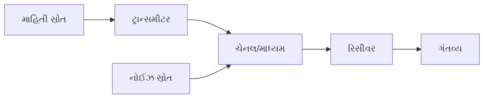

- **માહિતી સ્રોત**: સંદેશા સિગ્નલ ઉત્પન્ન કરે છે (અવાજ, વિડિઓ, ડેટા)
- **ટ્રાન્સમીટર**: સંદેશાને પ્રસારણ માટે યોગ્ય સ્વરૂપમાં રૂપાંતરિત કરે છે
- **ચેનલ**: માધ્યમ જેના દ્વારા સિગ્નલ પ્રવાસ કરે છે (તાર, ફાઇબર, હવા)
- **રિસીવર**: મળેલા સિગ્નલમાંથી મૂળ સંદેશો બહાર કાઢે છે
- **ગંતવ્ય**: અંતિમ-વપરાશકર્તા જે માહિતી પ્રાપ્ત કરે છે

**મેમરી ટ્રીક:** "માહિતી પ્રવાસ સાવધાનીથી ગંતવ્ય પહોંચે"

## પ્રશ્ન 1(બ) [4 ગુણ]

**EM વેવ સ્પેક્ટ્રમના ઉપયોગો સમજાવો.**

**જવાબ**:

| ફ્રિક્વન્સી બેન્ડ | ફ્રિક્વન્સી રેન્જ | ઉપયોગો |
|----------------|-----------------|--------------|
| રેડિયો વેવ્સ | 3 kHz - 300 MHz | AM/FM પ્રસારણ, દરિયાઈ સંચાર |
| માઇક્રોવેવ્સ | 300 MHz - 300 GHz | રડાર, સેટેલાઇટ સંચાર, માઇક્રોવેવ ઓવન |
| ઇન્ફ્રારેડ | 300 GHz - 400 THz | રિમોટ કંટ્રોલ, થર્મલ ઇમેજિંગ, ઓપ્ટિકલ ફાઇબર |
| દૃશ્યમાન પ્રકાશ | 400 THz - 800 THz | ફાઇબર ઓપ્ટિક સંચાર, ફોટોગ્રાફી |
| અલ્ટ્રાવાયોલેટ | 800 THz - 30 PHz | જંતુનાશક, પ્રમાણીકરણ, પાણી શુદ્ધિકરણ |
| એક્સ-રે | 30 PHz - 30 EHz | મેડિકલ ઇમેજિંગ, સુરક્ષા સ્કેનિંગ, સામગ્રી વિશ્લેષણ |
| ગામા રે | >30 EHz | કેન્સર સારવાર, ખાદ્ય જંતુનાશક, ઔદ્યોગિક નિરીક્ષણ |

**મેમરી ટ્રીક:** "રેડિયો માઇક્રો અદૃશ્ય દૃશ્ય અલ્ટ્રા એક્સ ગામા"

## પ્રશ્ન 1(ક) [7 ગુણ]

**બાહ્ય અને આંતરિક અવાજ જણાવો અને સમજાવો.**

**જવાબ**:

| પ્રકાર | બાહ્ય અવાજ | આંતરિક અવાજ |
|------|----------------|----------------|
| **સ્રોત** | સંચાર વ્યવસ્થાની બહાર | ઇલેક્ટ્રોનિક ઘટકોની અંદર |
| **પ્રકારો** | વાતાવરણીય, અવકાશ, ઔદ્યોગિક, માનવ-નિર્મિત | થર્મલ, શોટ, ટ્રાન્ઝિટ-ટાઇમ, ફ્લિકર |
| **નિયંત્રણ** | શીલ્ડિંગ, ફિલ્ટરિંગ દ્વારા ઘટાડી શકાય છે | સારા ઘટકો, કૂલિંગ દ્વારા ઘટાડી શકાય છે |
| **ઉદાહરણો** | વીજળી, સૂર્ય વિકિરણ, મોટર સ્પાર્કિંગ | અવરોધકોમાં ઇલેક્ટ્રોન મૂવમેન્ટ, સેમિકન્ડક્ટર્સ |
| **પ્રકૃતિ** | સામાન્ય રીતે અનિયમિત, બદલાતી | વધુ સુસંગત અને માપી શકાય તેવી |

**આકૃતિ:**

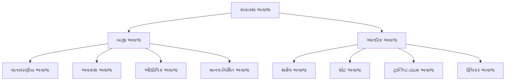

**મેમરી ટ્રીક:** "બાહ્ય વાતાવરણ આવે; આંતરિક ઘટકો જન્માવે"

## પ્રશ્ન 1(ક) OR [7 ગુણ]

**સુપરહીટરોડાઇન AM રિસીવરનો બ્લોક ડાયાગ્રામ દોરો અને સમજાવો.**

**જવાબ**:

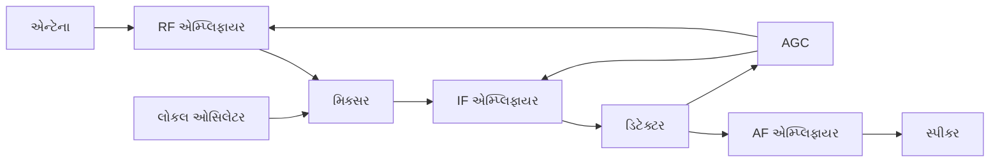

| બ્લોક | કાર્ય |
|-------|----------|
| **RF એમ્પ્લિફાયર** | નબળા રેડિયો સિગ્નલને વધારે છે અને પસંદગી પૂરી પાડે છે |
| **લોકલ ઓસિલેટર** | આવનારા સિગ્નલ સાથે મિક્સિંગ માટે ફ્રિક્વન્સી ઉત્પન્ન કરે છે |
| **મિક્સર** | RF અને લોકલ ઓસિલેટર સિગ્નલોને સંયોજિત કરીને IF ઉત્પન્ન કરે છે |
| **IF એમ્પ્લિફાયર** | ફિક્સ્ડ ઇન્ટરમીડિયેટ ફ્રિક્વન્સી (455 kHz) પર સિગ્નલને વધારે છે |
| **ડિટેક્ટર** | મોડ્યુલેટેડ કેરિયરમાંથી ઓડિયો બહાર કાઢે છે (ડિમોડ્યુલેશન) |
| **AF એમ્પ્લિફાયર** | સ્પીકર ચલાવવા માટે ઓડિયો સિગ્નલને વધારે છે |
| **AGC** | ઓટોમેટિક ગેઇન કંટ્રોલ - સતત આઉટપુટ લેવલ જાળવે છે |

**મેમરી ટ્રીક:** "રેડિયો લય મિશ્રણ માધ્યમ ઉત્પાદન આવાજ"

## પ્રશ્ન 2(અ) [3 ગુણ]

**મોડ્યુલેશન વ્યાખ્યાયિત કરો. મોડ્યુલેશનના પ્રકારો જણાવો.**

**જવાબ**:

**મોડ્યુલેશન**: માહિતી ધરાવતા મોડ્યુલેટિંગ સિગ્નલ સાથે ઉચ્ચ-ફ્રિક્વન્સી કેરિયર સિગ્નલની એક અથવા વધુ લાક્ષણિકતાઓને બદલવાની પ્રક્રિયા.

**મોડ્યુલેશનના પ્રકારો:**

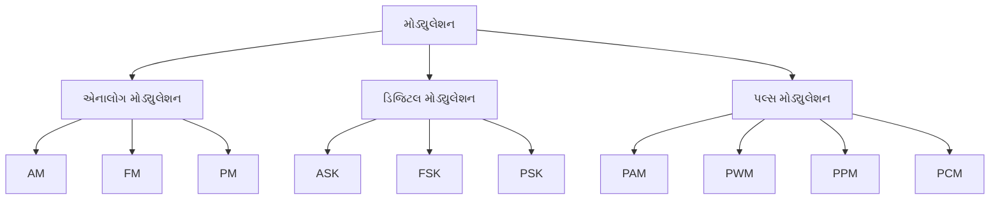

**મેમરી ટ્રીક:** "મોડ્યુલેશન આવૃત્તિ, એમ્પલિટ્યુડ, ફેઝ બદલે છે"

## પ્રશ્ન 2(બ) [4 ગુણ]

**વ્યાખ્યાયિત કરો: સિગ્નલ ટુ નોઈઝ રેશિયો અને નોઈઝ ફિગર.**

**જવાબ**:

| પેરામીટર | વ્યાખ્યા | ફોર્મ્યુલા | એકમ | મહત્વ |
|-----------|------------|---------|------|-------------|
| **સિગ્નલ ટુ નોઈઝ રેશિયો (SNR)** | સિગ્નલ પાવર અને નોઈઝ પાવરનો ગુણોત્તર | SNR = P_signal / P_noise | dB માં વ્યક્ત | ઉચ્ચ મૂલ્ય સારી સિગ્નલ ક્વોલિટી દર્શાવે છે |
| **નોઈઝ ફિગર (NF)** | સિસ્ટમમાંથી પસાર થવાથી SNR ના ઘટાડાનું માપ | NF = SNR_input / SNR_output | dB માં વ્યક્ત | નીચું મૂલ્ય સારી કામગીરી દર્શાવે છે |

**મેમરી ટ્રીક:** "SNR સિગ્નલ શક્તિ બતાવે; નોઈઝ ફિગર ખામી શોધે"

## પ્રશ્ન 2(ક) [7 ગુણ]

**PAM, PWM અને PPM તકનીકોની તુલના કરો.**

**જવાબ**:

| પેરામીટર | PAM | PWM | PPM |
|-----------|-----|-----|-----|
| **પૂરું નામ** | પલ્સ એમ્પ્લિટ્યુડ મોડ્યુલેશન | પલ્સ વિડ્થ મોડ્યુલેશન | પલ્સ પોઝિશન મોડ્યુલેશન |
| **મોડ્યુલેટેડ પેરામીટર** | પલ્સની એમ્પ્લિટ્યુડ | પલ્સની પહોળાઈ/અવધિ | પલ્સની સ્થિતિ/સમય |
| **નોઈઝ ઇમ્યુનિટી** | નબળી | સારી | ઉત્તમ |
| **બેન્ડવિડ્થ** | ઓછી | મધ્યમ | ઉચ્ચ |
| **સર્કિટ જટિલતા** | સરળ | મધ્યમ | જટિલ |
| **પાવર એફિશિયન્સી** | નબળી | સારી | ઉત્તમ |
| **ઉપયોગો** | સરળ ડેટા સેમ્પલિંગ | મોટર કંટ્રોલ, પાવર નિયમન | સચોટ ટાઇમિંગ, ઓપ્ટિકલ સંચાર |

**આકૃતિ:**

```goat
    Original:  ▁▁▁▁▁▁▁▁▁▁▁▁▁▁▁▁▁▁▁▁▁▁▁▁▁▁▁▁▁▁▁▁▁▁
                ⢠⣶⠀⣶⠀⣶⠀⣶⠀⣶⠀⣶⠀⣶⠀⣶⠀⣶⠀

    PAM:       ▁▁▁▁▁▂▂▁▁▁▁▁▁▁▁▁▄▄▁▁▁▁▂▂▂▁▁▁▁▁▂▂▁▁
                ⡇⠀⡇⠀⡇⠀⡇⠀⡇⠀⡇⠀⡇⠀⡇⠀⡇⠀⡇⠀

    PWM:       ▁▁▁█▁▁▁▁▁███▁▁▁▁▁▁█▁▁▁▁▁██▁▁▁▁▁█▁▁▁
                ⠀⠀⣿⣿⣿⣿⠀⠀⠀⣿⣿⣿⣿⣿⠀⠀⣿⣿⣿⣿⠀

    PPM:       ▁▁█▁▁▁▁▁█▁▁▁▁▁▁▁█▁▁▁▁▁▁█▁▁▁▁▁█▁▁▁▁▁
                ⠀⣿⠀⠀⠀⣿⠀⠀⠀⠀⣿⠀⠀⠀⠀⣿⠀⠀⠀⣿⠀
```

**મેમરી ટ્રીક:** "એમ્પલિટ્યુડ ઊંચાઈ, પહોળાઈ લંબાઈ, પોઝિશન સમય બદલે"

## પ્રશ્ન 2(અ) OR [3 ગુણ]

**બીટ, સિમ્બોલ અને બોડ રેટ વચ્ચે તફાવત કરો.**

**જવાબ**:

| પેરામીટર | બીટ | સિમ્બોલ | બોડ રેટ |
|-----------|-----|--------|-----------|
| **વ્યાખ્યા** | બાઇનરી અંક (0 અથવા 1) | બિટ્સનો સમૂહ | પ્રતિ સેકન્ડ પ્રસારિત સિમ્બોલ્સની સંખ્યા |
| **એકમ** | કોઈ એકમ નથી | કોઈ એકમ નથી | સિમ્બોલ પ્રતિ સેકન્ડ (બોડ) |
| **સંબંધ** | ડિજિટલ માહિતીનો મૂળભૂત એકમ | એકાધિક બિટ્સ એક સિમ્બોલ બનાવે છે | બોડ રેટ × બિટ્સ પ્રતિ સિમ્બોલ = બિટ રેટ |
| **ઉદાહરણ** | 0, 1 | 4-QAM માં, દરેક સિમ્બોલ 2 બિટ્સ રજૂ કરે છે | 1200 બોડ એટલે દર સેકન્ડે 1200 સિમ્બોલ |

**મેમરી ટ્રીક:** "બિટ સિમ્બોલ બનાવે, બોડ ગતિ બતાવે"

## પ્રશ્ન 2(બ) OR [4 ગુણ]

**DSB કરતાં SSB ના ફાયદા અને ગેરફાયદા જણાવો.**

**જવાબ**:

| SSB ના DSB કરતાં ફાયદા | SSB ના DSB કરતાં ગેરફાયદા |
|----------------------------|-------------------------------|
| **બેન્ડવિડ્થ**: માત્ર અર્ધી બેન્ડવિડ્થની જરૂર પડે છે | **સર્કિટ જટિલતા**: વધુ જટિલ મોડ્યુલેશન અને ડિમોડ્યુલેશન |
| **પાવર એફિશિયન્સી**: માત્ર એક સાઇડબેન્ડ પ્રસારિત કરે છે, પાવર બચાવે છે | **રિસીવર ડિઝાઇન**: ચોક્કસ ફ્રિક્વન્સી સિન્ક્રોનાઇઝેશનની જરૂર પડે છે |
| **ઓછું ફેડિંગ**: સિલેક્ટિવ ફેડિંગ પ્રભાવોમાં ઘટાડો | **લો ફ્રિક્વન્સી લોસ**: નીચી ફ્રિક્વન્સી ઘટકો ગુમાવી શકે છે |
| **ઓછું ઇન્ટરફેરન્સ**: એડજેસન્ટ ચેનલ ઇન્ટરફેરન્સમાં ઘટાડો | **ખર્ચ**: વધુ ખર્ચાળ અમલીકરણ |

**મેમરી ટ્રીક:** "SSB બેન્ડવિડ્થ પાવર બચાવે, પણ જટિલ હાર્ડવેર માંગે"

## પ્રશ્ન 2(ક) OR [7 ગુણ]

**એમ્પલિટ્યુડ મોડ્યુલેશન (AM) અને ફ્રિક્વન્સી મોડ્યુલેશન (FM) ની તુલના કરો.**

**જવાબ**:

| પેરામીટર | AM | FM |
|-----------|-----|-----|
| **મોડ્યુલેટેડ પેરામીટર** | કેરિયરની એમ્પલિટ્યુડ | કેરિયરની ફ્રિક્વન્સી |
| **બેન્ડવિડ્થ** | સાંકડી (2 × ઉચ્ચતમ મોડ્યુલેટિંગ ફ્રિક્વન્સી) | વિશાળ (2 × (ઉચ્ચતમ મોડ્યુલેટિંગ ફ્રિક્વન્સી + ડેવિએશન)) |
| **નોઈઝ ઇમ્યુનિટી** | નબળી | ઉત્તમ |
| **પાવર એફિશિયન્સી** | નબળી (કેરિયરમાં મોટાભાગનો પાવર) | સારી |
| **સર્કિટ જટિલતા** | સરળ | જટિલ |
| **ક્વોલિટી** | નીચી | ઉચ્ચ |
| **ઉપયોગો** | બ્રોડકાસ્ટિંગ (MW), એરક્રાફ્ટ કોમ્યુનિકેશન | FM રેડિયો, TV સાઉન્ડ, મોબાઇલ કોમ્યુનિકેશન |

**આકૃતિ:**

```goat
    Carrier:    ⠀⣶⣶⣶⣶⣶⣶⣶⣶⣶⣶⣶⣶⣶⣶⣶⣶⣶⣶⣶⣶
                ⠀⠛⠛⠛⠛⠛⠛⠛⠛⠛⠛⠛⠛⠛⠛⠛⠛⠛⠛⠛⠛

    AM:         ⠀⢠⠆⢰⠆⢠⠆⢰⠆⠀⠀⠀⠠⠄⠠⠄⠠⠄⠠⠄⠀
                ⠀⠟⠀⠸⠀⠹⠀⠸⠀⠀⠀⠀⠀⠸⠀⠸⠀⠸⠀⠸⠀

    FM:         ⠀⣶⣿⣷⣾⣿⣷⣾⣿⣿⣿⣿⣿⣷⣾⣿⣷⣾⣿⣷⣿
                ⠀⠿⠿⠿⠿⠿⠿⠿⠿⠿⠿⠿⠿⠿⠿⠿⠿⠿⠿⠿⠿
```

**મેમરી ટ્રીક:** "AM શક્તિ બદલે, FM આવૃત્તિ હલાવે"

## પ્રશ્ન 3(અ) [3 ગુણ]

**AM રિસીવરને FM રિસીવર સાથે સરખાવો.**

**જવાબ**:

| પેરામીટર | AM રિસીવર | FM રિસીવર |
|-----------|-------------|-------------|
| **IF ફ્રિક્વન્સી** | 455 kHz | 10.7 MHz |
| **ડિટેક્ટર** | એન્વેલોપ ડિટેક્ટર | ડિસ્ક્રિમિનેટર/રેશિયો ડિટેક્ટર/PLL |
| **બેન્ડવિડ્થ** | સાંકડી (±5 kHz) | વિશાળ (±75 kHz) |
| **સ્પેશિયલ સર્કિટ** | સરળ | લિમિટર, ડી-એમ્ફેસિસ |
| **જટિલતા** | સરળ | જટિલ |

**મેમરી ટ્રીક:** "AM લઘુ બેન્ડવિડ્થ સરળ; FM વિશાળ બેન્ડવિડ્થ જટિલ"

## પ્રશ્ન 3(બ) [4 ગુણ]

**સેમ્પલિંગ વ્યાખ્યાયિત કરો? સંક્ષિપ્તમાં સેમ્પલિંગના પ્રકારો સમજાવો.**

**જવાબ**:

**સેમ્પલિંગ**: સતત-સમય સિગ્નલને નિયમિત અંતરાલે સેમ્પલ લઈને વિવેકાધીન-સમય સિગ્નલમાં રૂપાંતરિત કરવાની પ્રક્રિયા.

| સેમ્પલિંગના પ્રકાર | વર્ણન | લાક્ષણિકતાઓ |
|-----------------|-------------|----------------|
| **આદર્શ સેમ્પલિંગ** | સિગ્નલના તાત્કાલિક સેમ્પલ | સંપૂર્ણ પરંતુ સૈદ્ધાંતિક, આવેગ ફંક્શનનો ઉપયોગ કરે છે |
| **નેચરલ સેમ્પલિંગ** | સિગ્નલને ટૂંકા સમયગાળા માટે સેમ્પલ કરવામાં આવે છે | પલ્સના ટોચ મૂળ સિગ્નલને અનુસરે છે |
| **ફ્લેટ-ટોપ સેમ્પલિંગ** | આગલા સેમ્પલ સુધી સેમ્પલ સ્થિર રાખવામાં આવે છે | સીડી અનુમાન બનાવે છે, અમલમાં મૂકવા માટે સરળ |

**આકૃતિ:**

```goat
    Original:     ⣿⢿⣻⣽⣯⣿⣻⣽⣯⣿⣻⣽⣯⣿⣻⣽⣯⣿⣻⣽⣯⣿⣻⣽⣯⣿⣻

    Ideal:        ⠀⠈⠀⠀⠀⠀⠀⠈⠀⠀⠀⠀⠀⠈⠀⠀⠀⠀⠀⠈⠀⠀⠀⠀⠀⠈⠀
                  ⠀⣼⠀⠀⠀⠀⠀⣼⠀⠀⠀⠀⠀⣼⠀⠀⠀⠀⠀⣼⠀⠀⠀⠀⠀⣼⠀

    Natural:      ⠀⣠⠀⠀⠀⠀⠀⣠⠀⠀⠀⠀⠀⣠⠀⠀⠀⠀⠀⣠⠀⠀⠀⠀⠀⣠⠀
                  ⠀⠇⠀⠀⠀⠀⠀⠇⠀⠀⠀⠀⠀⠇⠀⠀⠀⠀⠀⠇⠀⠀⠀⠀⠀⠇⠀

    Flat-top:     ⠀⣤⠀⠀⠀⠀⠀⠤⠀⠀⠀⠀⠀⣤⠀⠀⠀⠀⠀⠤⠀⠀⠀⠀⠀⣤⠀
                  ⠀⠀⠀⠀⠀⠀⠀⠀⠀⠀⠀⠀⠀⠀⠀⠀⠀⠀⠀⠀⠀⠀⠀⠀⠀⠀⠀
```

**મેમરી ટ્રીક:** "આદર્શ ક્ષણો લે, નેચરલ આકાર અનુસરે, ફ્લેટ સ્થિર રહે"

## પ્રશ્ન 3(ક) [7 ગુણ]

**FM રિસીવરનો બ્લોક ડાયાગ્રામ દોરો અને સમજાવો. FM રિસીવરમાં લિમિટરનો ઉપયોગ શું છે?**

**જવાબ**:

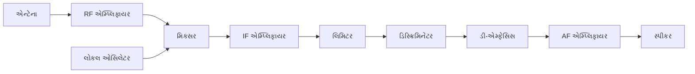

| બ્લોક | કાર્ય |
|-------|----------|
| **RF એમ્પ્લિફાયર** | નબળા RF સિગ્નલને વધારે છે અને પસંદગી પૂરી પાડે છે |
| **મિક્સર/લોકલ ઓસિલેટર** | RF ને IF માં રૂપાંતરિત કરે છે (10.7 MHz) |
| **IF એમ્પ્લિફાયર** | ફિક્સ્ડ ફ્રિક્વન્સી પર ગેઇન અને પસંદગી પ્રદાન કરે છે |
| **લિમિટર** | એમ્પલિટ્યુડ વેરિએશન્સ દૂર કરે છે, ફ્રિક્વન્સી વેરિએશન્સ જાળવે છે |
| **ડિસ્ક્રિમિનેટર** | ફ્રિક્વન્સી વેરિએશન્સને એમ્પલિટ્યુડ વેરિએશન્સમાં રૂપાંતરિત કરે છે |
| **ડી-એમ્ફેસિસ** | ઉચ્ચ-ફ્રિક્વન્સી નોઈઝને ઘટાડે છે |
| **AF એમ્પ્લિફાયર** | સ્પીકર માટે મેળવેલા ઓડિયોને વધારે છે |

**લિમિટરનું કાર્ય**: ડીમોડ્યુલેશન પહેલાં FM સિગ્નલમાંથી એમ્પલિટ્યુડ વેરિએશન્સને દૂર કરે છે જેથી નોઈઝ ઇમ્યુનિટી સુનિશ્ચિત થાય, કારણ કે FM માં માહિતી ફ્રિક્વન્સી વેરિએશન્સમાં સમાયેલી છે, એમ્પલિટ્યુડમાં નહીં.

**મેમરી ટ્રીક:** "રેડિયો મિક્સર વધારે આવૃત્તિ; લિમિટર ફરક ઓળખી અવાજ કાઢે"

## પ્રશ્ન 3(અ) OR [3 ગુણ]

**સિંગલ સાઇડ બેન્ડ (SSB) ટ્રાન્સમિશનના ખ્યાલનું વર્ણન કરો.**

**જવાબ**:

**સિંગલ સાઇડબેન્ડ (SSB) ટ્રાન્સમિશન**: એક તકનીક જેમાં કેરિયર અને અન્ય સાઇડબેન્ડને દબાવીને માત્ર એક સાઇડબેન્ડ (ઉપર અથવા નીચે) પ્રસારિત કરવામાં આવે છે.

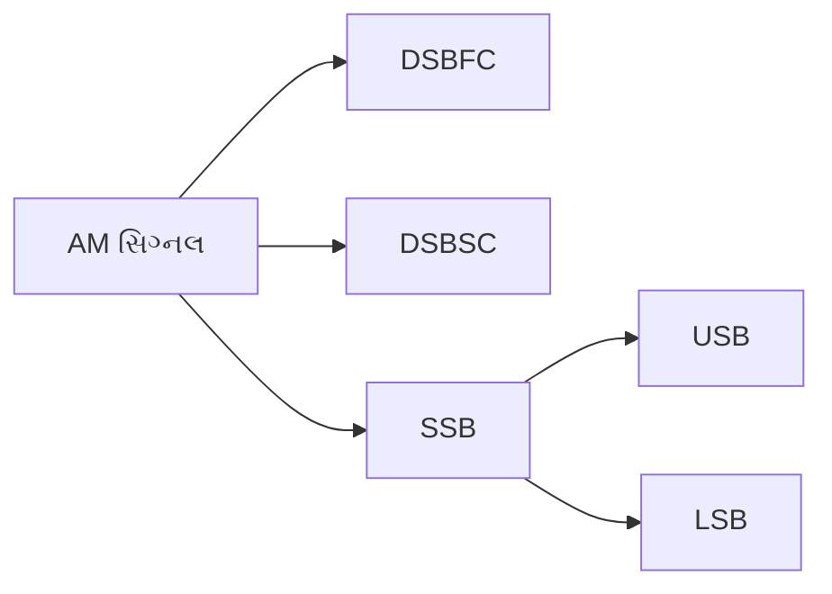

- **બેન્ડવિડ્થ**: માત્ર અર્ધી બેન્ડવિડ્થની જરૂર પડે છે (fc ± fm)
- **પાવર એફિશિયન્સી**: વધુ કાર્યક્ષમ કારણ કે પાવર એક સાઇડબેન્ડમાં કેન્દ્રિત થાય છે
- **પ્રકારો**: USB (અપર સાઇડબેન્ડ) અને LSB (લોઅર સાઇડબેન્ડ)

**મેમરી ટ્રીક:** "SSB સ્પેક્ટ્રમ બેન્ડવિડ્થ બચાવે"

## પ્રશ્ન 3(બ) OR [4 ગુણ]

**પ્રી-એમ્ફેસિસ અને ડી-એમ્ફેસિસ સર્કિટ સમજાવો.**

**જવાબ**:

| પેરામીટર | પ્રી-એમ્ફેસિસ | ડી-એમ્ફેસિસ |
|-----------|--------------|-------------|
| **સ્થાન** | ટ્રાન્સમીટર | રિસીવર |
| **સર્કિટ પ્રકાર** | હાઈ-પાસ RC નેટવર્ક | લો-પાસ RC નેટવર્ક |
| **કાર્ય** | પ્રસારણ પહેલાં ઉચ્ચ ફ્રિક્વન્સીઓને વધારે છે | રિસેપ્શન પછી ઉચ્ચ ફ્રિક્વન્સીઓને ઘટાડે છે |
| **હેતુ** | ઉચ્ચ ફ્રિક્વન્સીઓ માટે SNR સુધારે છે | મૂળ ફ્રિક્વન્સી રિસ્પોન્સ પુનઃસ્થાપિત કરે છે |

**સર્કિટ ડાયાગ્રામ:**

```goat
Pre-emphasis:                De-emphasis:
    
    R                           R
  ┌───┐                       ┌───┐
──┤   ├──┬───────          ───┤   ├───┬───────
  └───┘  │                    └───┘   │
         │                            │
         ⊥C                           ⊥C
         │                            │
         └───────                     └───────
```

**મેમરી ટ્રીક:** "પ્રી ઊંચા ધક્કા મારે, ડી ઊંચા નીચે લાવે"

## પ્રશ્ન 3(ક) OR [7 ગુણ]

**ફેઝ લોક લૂપ ટેકનિકનો ઉપયોગ કરીને FM સિગ્નલનું જનરેશન સમજાવો.**

**જવાબ**:

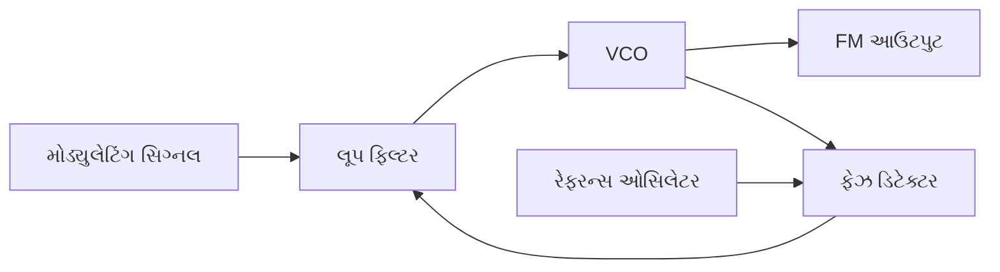

| ઘટક | કાર્ય |
|-----------|----------|
| **ફેઝ ડિટેક્ટર** | રેફરન્સ અને VCO સિગ્નલ્સની તુલના કરે છે, એરર વોલ્ટેજ ઉત્પન્ન કરે છે |
| **લૂપ ફિલ્ટર** | એરર વોલ્ટેજને ફિલ્ટર કરે છે અને મોડ્યુલેટિંગ સિગ્નલ સાથે જોડે છે |
| **VCO (વોલ્ટેજ કંટ્રોલ્ડ ઓસિલેટર)** | કંટ્રોલ વોલ્ટેજના આધારે ફ્રિક્વન્સી ઉત્પન્ન કરે છે |
| **રેફરન્સ ઓસિલેટર** | સ્થિર રેફરન્સ ફ્રિક્વન્સી પૂરી પાડે છે |

**કાર્ય પ્રક્રિયા:**

1. મોડ્યુલેટિંગ સિગ્નલ લૂપ ફિલ્ટરમાં લાગુ કરવામાં આવે છે
2. VCO ફ્રિક્વન્સી મોડ્યુલેટિંગ સિગ્નલના પ્રમાણમાં શિફ્ટ થાય છે
3. ફેઝ ડિટેક્ટર એરર સિગ્નલ ઉત્પન્ન કરે છે
4. લૂપ ફ્રિક્વન્સી મોડ્યુલેશનની મંજૂરી આપતી વખતે લોક જાળવે છે
5. VCO નો આઉટપુટ FM સિગ્નલ છે

**મેમરી ટ્રીક:** "ફેઝ લોક કરે, વોલ્ટેજ નિયંત્રિત કરે, ફ્રિક્વન્સી મોડ્યુલેટ કરે"

## પ્રશ્ન 4(અ) [3 ગુણ]

**ક્વોન્ટાઇઝેશન પ્રક્રિયા અને તેનું મહત્વ સમજાવો.**

**જવાબ**:

**ક્વોન્ટાઇઝેશન**: એનાલોગ-ટુ-ડિજિટલ રૂપાંતરણમાં સતત એમ્પલિટ્યુડ મૂલ્યોને વિવેકાધીન સ્તરના મર્યાદિત સેટમાં મેપિંગ કરવાની પ્રક્રિયા.

| પાસું | વર્ણન |
|--------|-------------|
| **પ્રક્રિયા** | એમ્પલિટ્યુડ રેન્જને ફિક્સ્ડ લેવલમાં વિભાજિત કરવી અને ડિજિટલ મૂલ્યો સોંપવા |
| **પ્રકારો** | યુનિફોર્મ (સમાન સ્ટેપ્સ) અને નોન-યુનિફોર્મ (વેરિયેબલ સ્ટેપ્સ) |
| **એરર** | વાસ્તવિક અને ક્વોન્ટાઇઝ્ડ મૂલ્ય વચ્ચેનો તફાવત (ક્વોન્ટાઇઝેશન નોઈઝ) |

**મહત્વ**:

- એનાલોગ સિગ્નલ્સના ડિજિટલ રજૂઆતને સક્ષમ કરે છે
- ડિજિટલ સિગ્નલની રિઝોલ્યુશન અને ચોકસાઈ નક્કી કરે છે
- ડિજિટલ સિસ્ટમમાં સિગ્નલ-ટુ-નોઈઝ રેશિયોને અસર કરે છે

**મેમરી ટ્રીક:** "ક્વોન્ટાઇઝેશન એનાલોગથી ડિજિટલ બનાવે"

## પ્રશ્ન 4(બ) [4 ગુણ]

**રેડિયો રિસીવરની વિવિધ લાક્ષણિકતાઓ સમજાવો.**

**જવાબ**:

| લાક્ષણિકતા | વ્યાખ્યા | મહત્વ |
|----------------|------------|-------------|
| **સેન્સિટિવિટી** | નબળા સિગ્નલ્સને પ્રાપ્ત કરવાની ક્ષમતા | રિસેપ્શન રેન્જ નક્કી કરે છે |
| **સિલેક્ટિવિટી** | અડીને આવેલા ચેનલ્સને અલગ કરવાની ક્ષમતા | ઇન્ટરફેરન્સ અટકાવે છે |
| **ફિડેલિટી** | પુનરુત્પાદનની ચોકસાઈ | સાઉન્ડ ક્વોલિટી નક્કી કરે છે |
| **ઇમેજ રિજેક્શન** | ઇમેજ ફ્રિક્વન્સીને નકારવાની ક્ષમતા | અનિચ્છનીય રિસેપ્શન અટકાવે છે |

**આકૃતિ:**

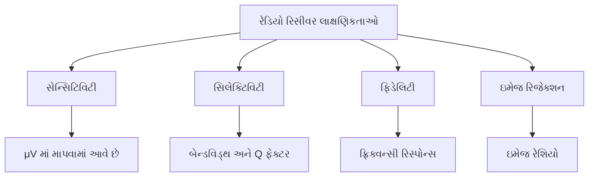

**મેમરી ટ્રીક:** "સંવેદનશીલ પસંદગી શુદ્ધતા પ્રતિમા"

## પ્રશ્ન 4(ક) [7 ગુણ]

**PCM ટ્રાન્સમીટર અને રિસીવરનો બ્લોક ડાયાગ્રામ દોરો અને સમજાવો.**

**જવાબ**:

**PCM ટ્રાન્સમીટર:**


**PCM રિસીવર:**


| બ્લોક | કાર્ય |
|-------|----------|
| **એન્ટી-એલિયાસિંગ ફિલ્ટર** | એલિયાસિંગને રોકવા માટે ઇનપુટ બેન્ડવિડ્થને મર્યાદિત કરે છે |
| **સેમ્પલ એન્ડ હોલ્ડ** | સતત સિગ્નલને વિવેકાધીન-સમય સેમ્પલમાં રૂપાંતરિત કરે છે |
| **ક્વોન્ટાઇઝર** | સેમ્પલ એમ્પલિટ્યુડને વિવેકાધીન સ્તરોમાં રૂપાંતરિત કરે છે |
| **એન્કોડર** | ક્વોન્ટાઇઝ્ડ મૂલ્યોને બાઇનરી કોડમાં રૂપાંતરિત કરે છે |
| **લાઇન કોડર** | પ્રસારણ માટે બાઇનરી ડેટા ફોર્મેટ કરે છે |
| **ડિકોડર** | બાઇનરી કોડને પાછા ક્વોન્ટાઇઝ્ડ મૂલ્યોમાં રૂપાંતરિત કરે છે |
| **રિકન્સ્ટ્રક્શન ફિલ્ટર** | મૂળ સિગ્નલ પુનઃપ્રાપ્ત કરવા માટે સ્ટેપ્ડ આઉટપુટને સરળ બનાવે છે |

**મેમરી ટ્રીક:** "સેમ્પલ, ક્વોન્ટાઇઝ, એનકોડ, પ્રસારણ; ડિકોડ, પુનઃસર્જન, આઉટપુટ"

## પ્રશ્ન 4(અ) OR [3 ગુણ]

**નેચરલ અને ફ્લેટ ટોપ સેમ્પલિંગની સરખામણી કરો.**

**જવાબ**:

| પેરામીટર | નેચરલ સેમ્પલિંગ | ફ્લેટ-ટોપ સેમ્પલિંગ |
|-----------|------------------|-------------------|
| **આકાર** | પલ્સની ટોચ ઇનપુટ સિગ્નલને અનુસરે છે | સેમ્પલિંગ અંતરાલ દરમિયાન સ્થિર એમ્પલિટ્યુડ |
| **અમલીકરણ** | વધુ મુશ્કેલ (એનાલોગ સ્વિચ) | સરળ (સેમ્પલ એન્ડ હોલ્ડ સર્કિટ) |
| **સ્પેક્ટ્રમ** | ઓછા હાર્મોનિક્સ | વધુ હાર્મોનિક્સ |
| **પુનઃસર્જન** | સરળ, વધુ ચોક્કસ | વિકૃતિ માટે વળતરની જરૂર છે |

**આકૃતિ:**

```goat
    Signal:       ⣿⢿⣻⣽⣯⣿⣻⣽⣯⣿⣻⣽⣯⣿⣻⣽⣯⣿⣻⣽⣯⣿⣻⣽⣯⣿⣻

    Natural:      ⠀⣠⠀⠀⠀⠀⠀⣠⠀⠀⠀⠀⠀⣠⠀⠀⠀⠀⠀⣠⠀⠀⠀⠀⠀⣠⠀
                  ⠀⠇⠀⠀⠀⠀⠀⠇⠀⠀⠀⠀⠀⠇⠀⠀⠀⠀⠀⠇⠀⠀⠀⠀⠀⠇⠀

    Flat-top:     ⠀⣤⠀⠀⠀⠀⠀⠤⠀⠀⠀⠀⠀⣤⠀⠀⠀⠀⠀⠤⠀⠀⠀⠀⠀⣤⠀
                  ⠀⠀⠀⠀⠀⠀⠀⠀⠀⠀⠀⠀⠀⠀⠀⠀⠀⠀⠀⠀⠀⠀⠀⠀⠀⠀⠀
```

**મેમરી ટ્રીક:** "નેચરલ અનુસરે, ફ્લેટ ઠરે"

## પ્રશ્ન 4(બ) OR [4 ગુણ]

**ડાયોડ ડિટેક્ટર સર્કિટ સમજાવો.**

**જવાબ**:

**ડાયોડ ડિટેક્ટર સર્કિટ**: મોડ્યુલેટેડ વેવના એન્વેલોપને બહાર કાઢીને AM સિગ્નલ્સના ડિમોડ્યુલેશન માટે વપરાય છે.

```goat
                 D
           ┌─────▶│──┬────────
Input ─────┤         │       │
           └─────────┤       │  Output
                     │       ├───────
                     ⊥C     R│
                     │       │
                     └───────┘
```

| ઘટક | કાર્ય |
|-----------|----------|
| **ડાયોડ (D)** | AM સિગ્નલને રેક્ટિફાય કરે છે, માત્ર પોઝિટિવ હાફ પસાર કરે છે |
| **કેપેસિટર (C)** | પીક વેલ્યુ સુધી ચાર્જ થાય છે, કેરિયરને સરળ બનાવે છે |
| **રેઝિસ્ટર (R)** | કેપેસિટરના ડિસ્ચાર્જ સમયને નિયંત્રિત કરે છે |

**કાર્ય**: 

1. ડાયોડ AM સિગ્નલને રેક્ટિફાય કરે છે
2. કેપેસિટર પીક વેલ્યુ સુધી ચાર્જ થાય છે
3. RC સમય અચળાંક કેપેસિટરને એન્વેલોપ અનુસરવાની મંજૂરી આપે છે
4. આઉટપુટ મૂળ મોડ્યુલેટિંગ સિગ્નલને અનુસરે છે

**મેમરી ટ્રીક:** "ડાયોડ શોધે, કેપેસિટર પકડે"

## પ્રશ્ન 4(ક) OR [7 ગુણ]

**ડેલ્ટા મોડ્યુલેશનનો બ્લોક ડાયાગ્રામ દોરો અને સમજાવો.**

**જવાબ**:

**ડેલ્ટા મોડ્યુલેશન ટ્રાન્સમીટર:**

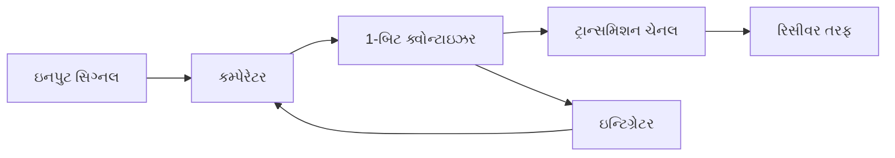

**ડેલ્ટા મોડ્યુલેશન રિસીવર:**

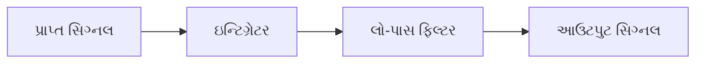

| ઘટક | કાર્ય |
|-----------|----------|
| **કમ્પેરેટર** | ઇનપુટને અનુમાનિત મૂલ્ય સાથે સરખાવે છે |
| **1-બિટ ક્વોન્ટાઇઝર** | જો ઇનપુટ > અનુમાનિત હોય તો બાઇનરી 1, જો ઇનપુટ < અનુમાનિત હોય તો 0 આઉટપુટ કરે છે |
| **ઇન્ટિગ્રેટર** | અગાઉના આઉટપુટને ઇન્ટિગ્રેટ કરીને અનુમાનિત મૂલ્ય ઉત્પન્ન કરે છે |
| **લો-પાસ ફિલ્ટર** | મૂળ સિગ્નલ પુનઃપ્રાપ્ત કરવા માટે સ્ટેપ્ડ આઉટપુટને સરળ બનાવે છે |

**મર્યાદાઓ**:

- **સ્લોપ ઓવરલોડ**: જ્યારે સિગ્નલ સ્ટેપ સાઇઝ કરતાં ઝડપથી બદલાય ત્યારે થાય છે
- **ગ્રેન્યુલર નોઈઝ**: સિગ્નલના આઇડલ અથવા સ્થિર ભાગો દરમિયાન થાય છે

**મેમરી ટ્રીક:** "ડેલ્ટા તફાવત શોધે, ઇન્ટિગ્રેટર ઉમેરો કરે"

## પ્રશ્ન 5(અ) [3 ગુણ]

**DPCM ના કાર્યનું ચિત્રણ કરો.**

**જવાબ**:

**DPCM (ડિફરેન્શિયલ પલ્સ કોડ મોડ્યુલેશન)**: વર્તમાન સેમ્પલ અને અનુમાનિત મૂલ્ય વચ્ચેના તફાવતને એનકોડ કરે છે.

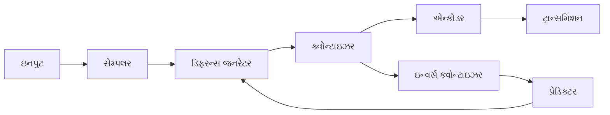

- **પ્રેડિક્ટર**: અગાઉના સેમ્પલ્સના આધારે વર્તમાન સેમ્પલનો અંદાજ લગાવે છે
- **ડિફરન્સ**: માત્ર વાસ્તવિક અને અનુમાનિત વચ્ચેનો તફાવત એનકોડ થાય છે
- **ફાયદો**: સિગ્નલ સહસંબંધનો ઉપયોગ કરીને PCM ની તુલનામાં બિટ રેટ ઘટાડે છે

**મેમરી ટ્રીક:** "તફાવત અનુમાન ઓછા બિટ્સ"

## પ્રશ્ન 5(બ) [4 ગુણ]

**અનુકૂલનશીલ ડેલ્ટા મોડ્યુલેશનનું ચિત્રણ કરો.**

**જવાબ**:

**અનુકૂલનશીલ ડેલ્ટા મોડ્યુલેશન (ADM)**: સિગ્નલ લાક્ષણિકતાઓના આધારે સ્ટેપ સાઇઝ બદલતી DM ની સુધારેલી આવૃત્તિ.

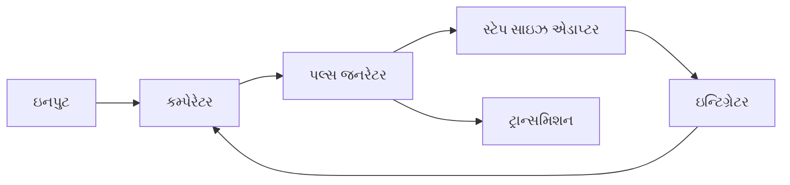

| ઘટક | કાર્ય |
|-----------|----------|
| **કમ્પેરેટર** | ઇનપુટને અનુમાનિત સિગ્નલ સાથે સરખાવે છે |
| **સ્ટેપ સાઇઝ એડાપ્ટર** | સળંગ બિટ પેટર્નના આધારે સ્ટેપ સાઇઝ એડજસ્ટ કરે છે |
| **ઇન્ટિગ્રેટર** | સ્ટેપ-એડજસ્ટેડ પલ્સમાંથી અનુમાનિત સિગ્નલ બનાવે છે |
| **પલ્સ જનરેટર** | કમ્પેરેટરના આધારે બાઇનરી આઉટપુટ જનરેટ કરે છે |

**કાર્યપદ્ધતિ**:

1. જો એકાધિક 1 ડિટેક્ટ થાય: સ્લોપ ઓવરલોડ ટાળવા માટે સ્ટેપ સાઇઝ વધારો
2. જો એકાધિક 0 ડિટેક્ટ થાય: ઘટતા સિગ્નલને ટ્રેક કરવા માટે સ્ટેપ સાઇઝ વધારો
3. જો 1 અને 0 વૈકલ્પિક હોય: ગ્રેન્યુલર નોઈઝ ઘટાડવા માટે સ્ટેપ સાઇઝ ઘટાડો

**મેમરી ટ્રીક:** "અનુકૂલિત ડેલ્ટા ઢાળ અનુસરે"

## પ્રશ્ન 5(ક) [7 ગુણ]

**TDM ફ્રેમનું ચિત્રણ કરો.**

**જવાબ**:

**TDM (ટાઇમ ડિવિઝન મલ્ટિપ્લેક્સિંગ) ફ્રેમ**: ટાઇમ સ્લોટ્સ ફાળવીને એકાધિક સિગ્નલ્સને જોડવા માટે વપરાતી સ્ટ્રક્ચર.

**ફ્રેમ સ્ટ્રક્ચર:**

```goat
    ┌─────────────────────────────────────────────────────┐
    │                     TDM FRAME                       │
    ├───────┬───────┬───────┬───────┬───────┬─────────────┤
    │Frame  │ CH 1  │ CH 2  │ CH 3  │ CH 4  │    ...      │
    │Sync   │Sample │Sample │Sample │Sample │    CH N     │
    ├───────┼───────┼───────┼───────┼───────┼─────────────┤
    │       │       │       │       │       │             │
    └───────┴───────┴───────┴───────┴───────┴─────────────┘
              TS1     TS2     TS3     TS4        TSn
```

| ઘટક | વર્ણન |
|-----------|-------------|
| **ફ્રેમ સિન્ક** | ફ્રેમ બાઉન્ડરીઝ ઓળખવા માટેનું પેટર્ન |
| **ચેનલ સેમ્પલ** | વ્યક્તિગત ચેનલનો ડેટા |
| **ટાઇમ સ્લોટ (TS)** | દરેક ચેનલ માટે સમર્પિત સમયગાળો |
| **ફ્રેમ અવધિ** | સેમ્પલિંગ રેટના વ્યસ્ત પ્રમાણસર |

**TDM હાયરાર્કી:**


**મેમરી ટ્રીક:** "ફ્રેમ સંગઠિત કરે સમય સ્લોટ મલ્ટિપ્લેક્સિંગ"

## પ્રશ્ન 5(અ) OR [3 ગુણ]

**DM અને ADM વચ્ચેનો તફાવત જણાવો.**

**જવાબ**:

| પેરામીટર | ડેલ્ટા મોડ્યુલેશન (DM) | અનુકૂલનશીલ ડેલ્ટા મોડ્યુલેશન (ADM) |
|-----------|------------------------|--------------------------------|
| **સ્ટેપ સાઇઝ** | ફિક્સ્ડ સ્ટેપ સાઇઝ | વેરિયેબલ સ્ટેપ સાઇઝ |
| **સ્લોપ ઓવરલોડ** | સામાન્ય સમસ્યા | અનુકૂલનશીલ સ્ટેપ સાઇઝ દ્વારા ઘટાડો |
| **ગ્રેન્યુલર નોઈઝ** | ધીમા વેરિએશન્સ દરમિયાન ઉચ્ચ | અનુકૂલનશીલ સ્ટેપ સાઇઝ દ્વારા ઘટાડો |
| **સર્કિટ જટિલતા** | સરળ | વધુ જટિલ |
| **સિગ્નલ ક્વોલિટી** | નીચી | ઉચ્ચ |

**મેમરી ટ્રીક:** "DM ફિક્સ્ડ સ્ટેપ; ADM અનુકૂલિત"

## પ્રશ્ન 5(બ) OR [4 ગુણ]

**લાઇન કોડિંગની જરૂરિયાત સમજાવો. AMI તકનીક સમજાવો.**

**જવાબ**:

**લાઇન કોડિંગની જરૂરિયાત:**

- **DC કમ્પોનન્ટ**: AC-કપલ્ડ સિસ્ટમ્સ માટે DC કમ્પોનન્ટ દૂર કરવા
- **સિન્ક્રોનાઇઝેશન**: ક્લોક રિકવરી માટે ટાઇમિંગ માહિતી પ્રદાન કરવા
- **એરર ડિટેક્શન**: ટ્રાન્સમિશન એરર શોધવા સક્ષમ કરવા
- **સ્પેક્ટ્રલ એફિશિયન્સી**: કાર્યક્ષમ બેન્ડવિડ્થ ઉપયોગ માટે સિગ્નલ સ્પેક્ટ્રમને આકાર આપવા
- **નોઈઝ ઇમ્યુનિટી**: ચેનલ નોઈઝ સામે પ્રતિરોધ પ્રદાન કરવા

**AMI (ઓલ્ટરનેટ માર્ક ઇન્વર્ઝન) તકનીક:**

| પેરામીટર | વર્ણન |
|-----------|-------------|
| **એન્કોડિંગ રૂલ** | બાઇનરી 0 → ઝીરો વોલ્ટેજ, બાઇનરી 1 → વૈકલ્પિક પોઝિટિવ/નેગેટિવ વોલ્ટેજ |
| **DC કમ્પોનન્ટ** | કોઈ DC કમ્પોનન્ટ નથી (બેલેન્સ્ડ કોડ) |
| **એરર ડિટેક્શન** | વૈકલ્પિક પેટર્નમાં ઉલ્લંઘનો શોધી શકે છે |
| **બેન્ડવિડ્થ** | NRZ કોડ કરતાં ઓછી બેન્ડવિડ્થની જરૂર પડે છે |

**આકૃતિ:**

```goat
    Binary:   1   0   1   1   0   0   1   0   1   0   1   1

    AMI:      ▄   _   ▀   ▄   _   _   ▀   _   ▄   _   ▀   ▄
              ┌───┐   ┌───┐       ┌───┐   ┌───┐   ┌───┐
              │   │   │   │       │   │   │   │   │   │
    ──────────┘   └───┘   └───────┘   └───┘   └───┘   └────
                      │       │           │       │
                      └───────┘           └───────┘
```

**મેમરી ટ્રીક:** "વૈકલ્પિક એક ધ્રુવતા બદલે"

## પ્રશ્ન 5(ક) OR [7 ગુણ]

**મૂળભૂત PCM-TDM સિસ્ટમનો બ્લોક ડાયાગ્રામ દોરો અને સમજાવો.**

**જવાબ**:

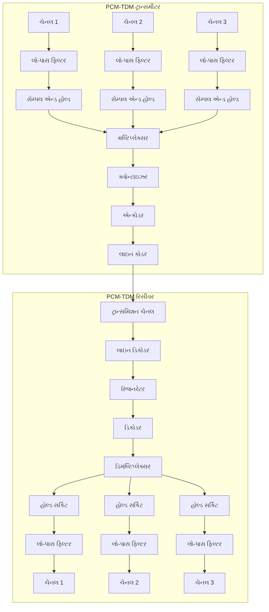

| બ્લોક | કાર્ય |
|-------|----------|
| **લો-પાસ ફિલ્ટર (ઇનપુટ)** | સેમ્પલિંગ થિયરમને સંતોષવા માટે બેન્ડવિડ્થને મર્યાદિત કરે છે |
| **સેમ્પલ એન્ડ હોલ્ડ** | એનાલોગ સિગ્નલ્સના તાત્કાલિક મૂલ્યોને કેપ્ચર કરે છે |
| **મલ્ટિપ્લેક્સર** | વિવિધ ચેનલ્સના સેમ્પલ્સને એક સ્ટ્રીમમાં જોડે છે |
| **ક્વોન્ટાઇઝર** | સેમ્પલ કરેલા મૂલ્યોને વિવેકાધીન સ્તરો સોંપે છે |
| **એન્કોડર** | ક્વોન્ટાઇઝ્ડ મૂલ્યોને બાઇનરી કોડમાં રૂપાંતરિત કરે છે |
| **લાઇન કોડર** | પ્રસારણ માટે બાઇનરી ડેટા ફોર્મેટ કરે છે |
| **રિજનરેટર** | નોઈઝ અને એટેન્યુએશન દ્વારા ડિગ્રેડ થયેલા સિગ્નલને પુનઃસ્થાપિત કરે છે |
| **ડિકોડર** | બાઇનરી કોડને પાછા ક્વોન્ટાઇઝ્ડ મૂલ્યોમાં રૂપાંતરિત કરે છે |
| **ડિમલ્ટિપ્લેક્સર** | સંયુક્ત સિગ્નલને પાછા વ્યક્તિગત ચેનલોમાં અલગ કરે છે |
| **હોલ્ડ સર્કિટ** | આગલા સેમ્પલ આવે ત્યાં સુધી સેમ્પલ મૂલ્ય જાળવે છે |
| **લો-પાસ ફિલ્ટર (આઉટપુટ)** | સેમ્પલિંગ હાર્મોનિક્સ દૂર કરીને મૂળ સિગ્નલનું પુનઃનિર્માણ કરે છે |

**મેમરી ટ્રીક:** "મલ્ટિપલ ચેનલ્સ સેમ્પલ, ક્વોન્ટાઇઝ, એનકોડ; ડિકોડ, ડિમલ્ટિપ્લેક્સ, ફિલ્ટર"
