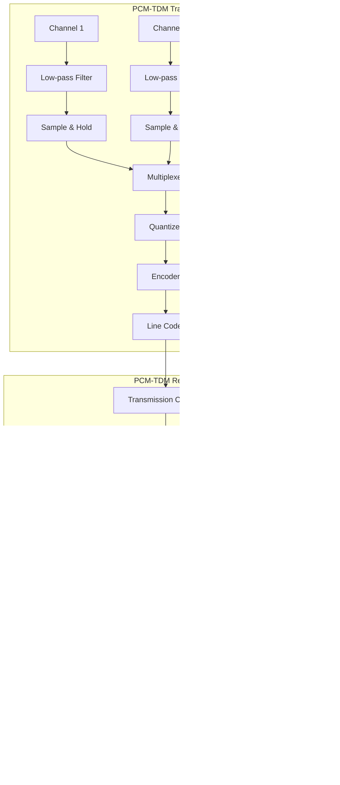

## Question 1(a) [3 marks]

**Draw and explain block diagram of communication system.**

**Answer**:


- **Information Source**: Generates message signal (voice, video, data)
- **Transmitter**: Converts message to suitable form for transmission
- **Channel**: Medium through which signal travels (wires, fiber, air)
- **Receiver**: Extracts original message from received signal
- **Destination**: End-user who receives the information

**Mnemonic:** "Information Travels Carefully Reaching Destination"

## Question 1(b) [4 marks]

**Explain applications of EM wave spectrum.**

**Answer**:

| Frequency Band | Frequency Range | Applications |
|----------------|-----------------|--------------|
| Radio waves | 3 kHz - 300 MHz | AM/FM broadcasting, maritime communication |
| Microwaves | 300 MHz - 300 GHz | Radar, satellite communication, microwave ovens |
| Infrared | 300 GHz - 400 THz | Remote controls, thermal imaging, optical fibers |
| Visible light | 400 THz - 800 THz | Fiber optic communication, photography |
| Ultraviolet | 800 THz - 30 PHz | Sterilization, authentication, water purification |
| X-rays | 30 PHz - 30 EHz | Medical imaging, security scanning, material analysis |
| Gamma rays | >30 EHz | Cancer treatment, food sterilization, industrial inspection |

**Mnemonic:** "Radio Makes Invisible Very eXtreme Gamma signals"

## Question 1(c) [7 marks]

**State and explain external and internal noise.**

**Answer**:

| Type | External Noise | Internal Noise |
|------|----------------|----------------|
| **Source** | Outside the communication system | Inside electronic components |
| **Types** | Atmospheric, Space, Industrial, Man-made | Thermal, Shot, Transit-time, Flicker |
| **Control** | Can be reduced by shielding, filtering | Reduced by better components, cooling |
| **Examples** | Lightning, Solar radiation, Motor sparking | Electron movement in resistors, semiconductors |
| **Nature** | Usually unpredictable, varying | More consistent and quantifiable |

**Diagram:**


**Mnemonic:** "External Environmental Sources Invade; Internal Components Generate Noise"

## Question 1(c) OR [7 marks]

**Draw and explain the block diagram of a Superheterodyne AM receiver.**

**Answer**:


| Block | Function |
|-------|----------|
| **RF Amplifier** | Amplifies weak radio signals and provides selectivity |
| **Local Oscillator** | Generates frequency for mixing with incoming signal |
| **Mixer** | Combines RF and local oscillator signals to produce IF |
| **IF Amplifier** | Amplifies signal at fixed intermediate frequency (455 kHz) |
| **Detector** | Extracts audio from modulated carrier (demodulation) |
| **AF Amplifier** | Amplifies audio signal to drive speaker |
| **AGC** | Automatic Gain Control - maintains constant output level |

**Mnemonic:** "Radio Loves Making Interesting Detected Audio Sounds"

## Question 2(a) [3 marks]

**Define modulation. State types of modulation.**

**Answer**:

**Modulation**: Process of varying one or more properties of a high-frequency carrier signal with a modulating signal containing information.

**Types of Modulation:**


**Mnemonic:** "All Modulations Alter Properties: Frequency, Amplitude, Phase"

## Question 2(b) [4 marks]

**Define: Signal to noise ratio and Noise figure.**

**Answer**:

| Parameter | Definition | Formula | Unit | Significance |
|-----------|------------|---------|------|-------------|
| **Signal to Noise Ratio (SNR)** | Ratio of signal power to noise power | SNR = P_signal / P_noise | Expressed in dB | Higher value indicates better signal quality |
| **Noise Figure (NF)** | Measure of degradation of SNR as signal passes through system | NF = SNR_input / SNR_output | Expressed in dB | Lower value indicates better performance |

**Mnemonic:** "SNR Shows Necessary Reception; Noise Figure Finds Fault"

## Question 2(c) [7 marks]

**Compare PAM, PWM and PPM techniques.**

**Answer**:

| Parameter | PAM | PWM | PPM |
|-----------|-----|-----|-----|
| **Full Form** | Pulse Amplitude Modulation | Pulse Width Modulation | Pulse Position Modulation |
| **Modulated Parameter** | Amplitude of pulses | Width/duration of pulses | Position/timing of pulses |
| **Noise Immunity** | Poor | Good | Excellent |
| **Bandwidth** | Low | Medium | High |
| **Circuit Complexity** | Simple | Moderate | Complex |
| **Power Efficiency** | Poor | Good | Excellent |
| **Applications** | Simple data sampling | Motor control, power regulation | Precision timing, optical communication |

**Diagram:**

```goat
    Original:  ▁▁▁▁▁▁▁▁▁▁▁▁▁▁▁▁▁▁▁▁▁▁▁▁▁▁▁▁▁▁▁▁▁▁
                ⢠⣶⠀⣶⠀⣶⠀⣶⠀⣶⠀⣶⠀⣶⠀⣶⠀⣶⠀

    PAM:       ▁▁▁▁▁▂▂▁▁▁▁▁▁▁▁▁▄▄▁▁▁▁▂▂▂▁▁▁▁▁▂▂▁▁
                ⡇⠀⡇⠀⡇⠀⡇⠀⡇⠀⡇⠀⡇⠀⡇⠀⡇⠀⡇⠀

    PWM:       ▁▁▁█▁▁▁▁▁███▁▁▁▁▁▁█▁▁▁▁▁██▁▁▁▁▁█▁▁▁
                ⠀⠀⣿⣿⣿⣿⠀⠀⠀⣿⣿⣿⣿⣿⠀⠀⣿⣿⣿⣿⠀

    PPM:       ▁▁█▁▁▁▁▁█▁▁▁▁▁▁▁█▁▁▁▁▁▁█▁▁▁▁▁█▁▁▁▁▁
                ⠀⣿⠀⠀⠀⣿⠀⠀⠀⠀⣿⠀⠀⠀⠀⣿⠀⠀⠀⣿⠀
```

**Mnemonic:** "Amplitude varies height, Width varies length, Position varies timing"

## Question 2(a) OR [3 marks]

**Differentiate between bit, symbol and Baud rate.**

**Answer**:

| Parameter | Bit | Symbol | Baud Rate |
|-----------|-----|--------|-----------|
| **Definition** | Binary digit (0 or 1) | Group of bits | Number of symbols transmitted per second |
| **Unit** | No unit | No unit | Symbols per second (Baud) |
| **Relationship** | Basic unit of digital information | Multiple bits form one symbol | Baud rate × bits per symbol = bit rate |
| **Example** | 0, 1 | In 4-QAM, each symbol represents 2 bits | 1200 baud means 1200 symbols per second |

**Mnemonic:** "Bits Build Symbols, Bauds Show Speed"

## Question 2(b) OR [4 marks]

**State advantages and disadvantage of SSB over DSB.**

**Answer**:

| Advantages of SSB over DSB | Disadvantages of SSB over DSB |
|----------------------------|-------------------------------|
| **Bandwidth**: Requires only half the bandwidth | **Circuit Complexity**: More complex modulation and demodulation |
| **Power Efficiency**: Transmits only one sideband, saving power | **Receiver Design**: Requires precise frequency synchronization |
| **Less Fading**: Reduced selective fading effects | **Low Frequency Loss**: May lose low frequency components |
| **Less Interference**: Reduced adjacent channel interference | **Cost**: More expensive implementation |

**Mnemonic:** "SSB Saves Bandwidth Power but Costs Complex Hardware"

## Question 2(c) OR [7 marks]

**Compare Amplitude Modulation (AM) and Frequency Modulation (FM).**

**Answer**:

| Parameter | AM | FM |
|-----------|-----|-----|
| **Modulated Parameter** | Amplitude of carrier | Frequency of carrier |
| **Bandwidth** | Narrow (2 × highest modulating frequency) | Wide (2 × (highest modulating frequency + deviation)) |
| **Noise Immunity** | Poor | Excellent |
| **Power Efficiency** | Poor (carrier contains most power) | Good |
| **Circuit Complexity** | Simple | Complex |
| **Quality** | Lower | Higher |
| **Applications** | Broadcasting (MW), Aircraft communication | FM radio, TV sound, Mobile communications |

**Diagram:**

```goat
    Carrier:    ⠀⣶⣶⣶⣶⣶⣶⣶⣶⣶⣶⣶⣶⣶⣶⣶⣶⣶⣶⣶⣶
                ⠀⠛⠛⠛⠛⠛⠛⠛⠛⠛⠛⠛⠛⠛⠛⠛⠛⠛⠛⠛⠛

    AM:         ⠀⢠⠆⢰⠆⢠⠆⢰⠆⠀⠀⠀⠠⠄⠠⠄⠠⠄⠠⠄⠀
                ⠀⠟⠀⠸⠀⠹⠀⠸⠀⠀⠀⠀⠀⠸⠀⠸⠀⠸⠀⠸⠀

    FM:         ⠀⣶⣿⣷⣾⣿⣷⣾⣿⣿⣿⣿⣿⣷⣾⣿⣷⣾⣿⣷⣿
                ⠀⠿⠿⠿⠿⠿⠿⠿⠿⠿⠿⠿⠿⠿⠿⠿⠿⠿⠿⠿⠿
```

**Mnemonic:** "AM Alters strength, FM Fluctuates timing"

## Question 3(a) [3 marks]

**Compare AM receiver with FM receiver.**

**Answer**:

| Parameter | AM Receiver | FM Receiver |
|-----------|-------------|-------------|
| **IF Frequency** | 455 kHz | 10.7 MHz |
| **Detector** | Envelope detector | Discriminator/Ratio detector/PLL |
| **Bandwidth** | Narrow (±5 kHz) | Wide (±75 kHz) |
| **Special Circuits** | Simple | Limiter, De-emphasis |
| **Complexity** | Simple | Complex |

**Mnemonic:** "AM Accepts Minimal bandwidth; FM Features More circuits"

## Question 3(b) [4 marks]

**Define sampling? Explain types of sampling in brief.**

**Answer**:

**Sampling**: Process of converting continuous-time signal into discrete-time signal by taking samples at regular intervals.

| Type of Sampling | Description | Characteristics |
|-----------------|-------------|----------------|
| **Ideal Sampling** | Instantaneous samples of the signal | Perfect but theoretical, uses impulse function |
| **Natural Sampling** | Signal is sampled for short durations | Top of pulses follow original signal |
| **Flat-top Sampling** | Samples held constant until next sample | Creates staircase approximation, easier to implement |

**Diagram:**

```goat
    Original:     ⣿⢿⣻⣽⣯⣿⣻⣽⣯⣿⣻⣽⣯⣿⣻⣽⣯⣿⣻⣽⣯⣿⣻⣽⣯⣿⣻

    Ideal:        ⠀⠈⠀⠀⠀⠀⠀⠈⠀⠀⠀⠀⠀⠈⠀⠀⠀⠀⠀⠈⠀⠀⠀⠀⠀⠈⠀
                  ⠀⣼⠀⠀⠀⠀⠀⣼⠀⠀⠀⠀⠀⣼⠀⠀⠀⠀⠀⣼⠀⠀⠀⠀⠀⣼⠀

    Natural:      ⠀⣠⠀⠀⠀⠀⠀⣠⠀⠀⠀⠀⠀⣠⠀⠀⠀⠀⠀⣠⠀⠀⠀⠀⠀⣠⠀
                  ⠀⠇⠀⠀⠀⠀⠀⠇⠀⠀⠀⠀⠀⠇⠀⠀⠀⠀⠀⠇⠀⠀⠀⠀⠀⠇⠀

    Flat-top:     ⠀⣤⠀⠀⠀⠀⠀⠤⠀⠀⠀⠀⠀⣤⠀⠀⠀⠀⠀⠤⠀⠀⠀⠀⠀⣤⠀
                  ⠀⠀⠀⠀⠀⠀⠀⠀⠀⠀⠀⠀⠀⠀⠀⠀⠀⠀⠀⠀⠀⠀⠀⠀⠀⠀⠀
```

**Mnemonic:** "Ideal takes Instants, Natural follows Nicely, Flat stays Fixed"

## Question 3(c) [7 marks]

**Draw and explain the block diagram of FM receiver. What is the use of Limiter in FM receiver?**

**Answer**:


| Block | Function |
|-------|----------|
| **RF Amplifier** | Amplifies weak RF signal and provides selectivity |
| **Mixer/Local Oscillator** | Converts RF to IF (10.7 MHz) |
| **IF Amplifier** | Provides gain and selectivity at fixed frequency |
| **Limiter** | Removes amplitude variations, preserves frequency variations |
| **Discriminator** | Converts frequency variations to amplitude variations |
| **De-emphasis** | Reduces high-frequency noise |
| **AF Amplifier** | Amplifies recovered audio for speaker |

**Limiter Function**: Removes amplitude variations from the FM signal before demodulation to ensure noise immunity, as information in FM is contained in frequency variations, not amplitude.

**Mnemonic:** "Radio Mixers Increase Frequency; Limiters Discriminate Audio Sound"

## Question 3(a) OR [3 marks]

**Describe the concept of single side band (SSB) transmission.**

**Answer**:

**Single Sideband (SSB) Transmission**: Technique where only one sideband (upper or lower) is transmitted while suppressing the carrier and other sideband.


- **Bandwidth**: Requires only half the bandwidth (fc ± fm)
- **Power Efficiency**: More efficient as power concentrated in one sideband
- **Types**: USB (Upper Sideband) and LSB (Lower Sideband)

**Mnemonic:** "SSB Saves Spectrum Bandwidth"

## Question 3(b) OR [4 marks]

**Explain pre-emphasis & de-emphasis circuit.**

**Answer**:

| Parameter | Pre-emphasis | De-emphasis |
|-----------|--------------|-------------|
| **Location** | Transmitter | Receiver |
| **Circuit Type** | High-pass RC network | Low-pass RC network |
| **Function** | Boosts high frequencies before transmission | Attenuates high frequencies after reception |
| **Purpose** | Improves SNR for high frequencies | Restores original frequency response |

**Circuit Diagram:**

```goat
Pre-emphasis:                De-emphasis:
    
    R                           R
  ┌───┐                       ┌───┐
──┤   ├──┬───────          ───┤   ├───┬───────
  └───┘  │                    └───┘   │
         │                            │
         ⊥C                           ⊥C
         │                            │
         └───────                     └───────
```

**Mnemonic:** "Pre Pushes highs, De Drops them"

## Question 3(c) OR [7 marks]

**Illustrate generation of FM signal using Phase lock loop technique.**

**Answer**:


| Component | Function |
|-----------|----------|
| **Phase Detector** | Compares reference and VCO signals, generates error voltage |
| **Loop Filter** | Filters error voltage and combines with modulating signal |
| **VCO (Voltage Controlled Oscillator)** | Generates frequency based on control voltage |
| **Reference Oscillator** | Provides stable reference frequency |

**Working Process:**

1. Modulating signal is applied to loop filter
2. VCO frequency shifts proportional to modulating signal
3. Phase detector generates error signal
4. Loop maintains lock while allowing frequency modulation
5. Output of VCO is the FM signal

**Mnemonic:** "Phase Locks, Voltage Controls, Frequency Modulates"

## Question 4(a) [3 marks]

**Explain quantization process and its importance.**

**Answer**:

**Quantization**: Process of mapping continuous amplitude values to a finite set of discrete levels in analog-to-digital conversion.

| Aspect | Description |
|--------|-------------|
| **Process** | Dividing amplitude range into fixed levels and assigning digital values |
| **Types** | Uniform (equal steps) and Non-uniform (variable steps) |
| **Error** | Difference between actual and quantized value (quantization noise) |

**Importance**:

- Enables digital representation of analog signals
- Determines resolution and accuracy of digital signal
- Affects signal-to-noise ratio in digital systems

**Mnemonic:** "Quantization Creates Digital from Analog"

## Question 4(b) [4 marks]

**Explain different characteristics of Radio receiver.**

**Answer**:

| Characteristic | Definition | Significance |
|----------------|------------|-------------|
| **Sensitivity** | Ability to receive weak signals | Determines reception range |
| **Selectivity** | Ability to separate adjacent channels | Prevents interference |
| **Fidelity** | Accuracy of reproduction | Determines sound quality |
| **Image Rejection** | Ability to reject image frequency | Prevents unwanted reception |

**Diagram:**


**Mnemonic:** "Sensitive Selection Faithfully Images"

## Question 4(c) [7 marks]

**Draw and explain the block diagram of PCM transmitter and receiver.**

**Answer**:

**PCM Transmitter:**


**PCM Receiver:**


| Block | Function |
|-------|----------|
| **Anti-aliasing Filter** | Limits input bandwidth to prevent aliasing |
| **Sample & Hold** | Converts continuous signal to discrete-time samples |
| **Quantizer** | Converts sample amplitudes to discrete levels |
| **Encoder** | Converts quantized values to binary code |
| **Line Coder** | Formats binary data for transmission |
| **Decoder** | Converts binary code back to quantized values |
| **Reconstruction Filter** | Smooths the stepped output to recover original signal |

**Mnemonic:** "Sample, Quantize, Encode, Transmit; Decode, Reconstruct, Output"

## Question 4(a) OR [3 marks]

**Compare Natural and Flat top sampling.**

**Answer**:

| Parameter | Natural Sampling | Flat-top Sampling |
|-----------|------------------|-------------------|
| **Shape** | Top of pulses follow input signal | Constant amplitude during sampling interval |
| **Implementation** | More difficult (analog switch) | Easier (sample and hold circuit) |
| **Spectrum** | Less harmonics | More harmonics |
| **Reconstruction** | Easier, more accurate | Requires compensation for distortion |

**Diagram:**

```goat
    Signal:       ⣿⢿⣻⣽⣯⣿⣻⣽⣯⣿⣻⣽⣯⣿⣻⣽⣯⣿⣻⣽⣯⣿⣻⣽⣯⣿⣻

    Natural:      ⠀⣠⠀⠀⠀⠀⠀⣠⠀⠀⠀⠀⠀⣠⠀⠀⠀⠀⠀⣠⠀⠀⠀⠀⠀⣠⠀
                  ⠀⠇⠀⠀⠀⠀⠀⠇⠀⠀⠀⠀⠀⠇⠀⠀⠀⠀⠀⠇⠀⠀⠀⠀⠀⠇⠀

    Flat-top:     ⠀⣤⠀⠀⠀⠀⠀⠤⠀⠀⠀⠀⠀⣤⠀⠀⠀⠀⠀⠤⠀⠀⠀⠀⠀⣤⠀
                  ⠀⠀⠀⠀⠀⠀⠀⠀⠀⠀⠀⠀⠀⠀⠀⠀⠀⠀⠀⠀⠀⠀⠀⠀⠀⠀⠀
```

**Mnemonic:** "Natural Follows, Flat Freezes"

## Question 4(b) OR [4 marks]

**Explain Diode Detector circuit.**

**Answer**:

**Diode Detector Circuit**: Used for demodulation of AM signals by extracting the envelope of the modulated wave.

```goat
                 D
           ┌─────▶│──┬────────
Input ─────┤         │       │
           └─────────┤       │  Output
                     │       ├───────
                     ⊥C     R│
                     │       │
                     └───────┘
```

| Component | Function |
|-----------|----------|
| **Diode (D)** | Rectifies the AM signal, passes only positive half |
| **Capacitor (C)** | Charges to peak value, smooths out carrier |
| **Resistor (R)** | Controls discharge time of capacitor |

**Working**: 

1. Diode rectifies AM signal
2. Capacitor charges to peak value
3. RC time constant allows capacitor to follow envelope
4. Output follows the original modulating signal

**Mnemonic:** "Diode Detects, Capacitor Captures"

## Question 4(c) OR [7 marks]

**Draw and explain the block diagram of Delta Modulation.**

**Answer**:

**Delta Modulation Transmitter:**


**Delta Modulation Receiver:**


| Component | Function |
|-----------|----------|
| **Comparator** | Compares input with predicted value |
| **1-bit Quantizer** | Outputs binary 1 if input > predicted, 0 if input < predicted |
| **Integrator** | Generates predicted value by integrating previous output |
| **Low-pass Filter** | Smooths stepped output to recover original signal |

**Limitations**:

- **Slope Overload**: Occurs when signal changes faster than step size can track
- **Granular Noise**: Occurs during idle or constant parts of signal

**Mnemonic:** "Delta Detects Differences, Integrator Increments"

## Question 5(a) [3 marks]

**Illustrate working of DPCM.**

**Answer**:

**DPCM (Differential Pulse Code Modulation)**: Encodes the difference between current sample and predicted value.


- **Predictor**: Estimates current sample based on previous samples
- **Difference**: Only difference between actual and predicted is encoded
- **Advantage**: Reduces bit rate compared to PCM by exploiting signal correlation

**Mnemonic:** "Differences Predicted Create Minimized bits"

## Question 5(b) [4 marks]

**Illustrate Adaptive Delta Modulation.**

**Answer**:

**Adaptive Delta Modulation (ADM)**: Improved version of DM that varies step size based on signal characteristics.


| Component | Function |
|-----------|----------|
| **Comparator** | Compares input with approximated signal |
| **Step Size Adapter** | Adjusts step size based on consecutive bit patterns |
| **Integrator** | Creates approximated signal from step-adjusted pulses |
| **Pulse Generator** | Generates binary output based on comparator |

**Operation**:

1. If multiple 1's detected: increase step size to avoid slope overload
2. If multiple 0's detected: increase step size to track falling signal
3. If alternating 1's and 0's: decrease step size to reduce granular noise

**Mnemonic:** "Adapting Delta Makes Slopes Trackable"

## Question 5(c) [7 marks]

**Illustrate TDM frame.**

**Answer**:

**TDM (Time Division Multiplexing) Frame**: Structure used to combine multiple signals by assigning time slots.

**Frame Structure:**

```goat
    ┌─────────────────────────────────────────────────────┐
    │                     TDM FRAME                       │
    ├───────┬───────┬───────┬───────┬───────┬─────────────┤
    │Frame  │ CH 1  │ CH 2  │ CH 3  │ CH 4  │    ...      │
    │Sync   │Sample │Sample │Sample │Sample │    CH N     │
    ├───────┼───────┼───────┼───────┼───────┼─────────────┤
    │       │       │       │       │       │             │
    └───────┴───────┴───────┴───────┴───────┴─────────────┘
              TS1     TS2     TS3     TS4        TSn
```

| Component | Description |
|-----------|-------------|
| **Frame Sync** | Pattern to identify frame boundaries |
| **Channel Sample** | Data from individual channel |
| **Time Slot (TS)** | Dedicated period for each channel |
| **Frame Duration** | Inversely proportional to sampling rate |

**TDM Hierarchy:**


**Mnemonic:** "Frames Synchronize Time Slots During Multiplexing"

## Question 5(a) OR [3 marks]

**State difference between DM and ADM.**

**Answer**:

| Parameter | Delta Modulation (DM) | Adaptive Delta Modulation (ADM) |
|-----------|------------------------|--------------------------------|
| **Step Size** | Fixed step size | Variable step size |
| **Slope Overload** | Common problem | Reduced by adaptive step size |
| **Granular Noise** | High during slow variations | Reduced by adaptive step size |
| **Circuit Complexity** | Simpler | More complex |
| **Signal Quality** | Lower | Higher |

**Mnemonic:** "DM's Fixed Steps; ADM Adapts"

## Question 5(b) OR [4 marks]

**Explain the need of line coding. Explain AMI technique.**

**Answer**:

**Need for Line Coding:**

- **DC Component**: To eliminate DC component for AC-coupled systems
- **Synchronization**: To provide timing information for clock recovery
- **Error Detection**: To enable detection of transmission errors
- **Spectral Efficiency**: To shape signal spectrum for efficient bandwidth use
- **Noise Immunity**: To provide resistance against channel noise

**AMI (Alternate Mark Inversion) Technique:**

| Parameter | Description |
|-----------|-------------|
| **Encoding Rule** | Binary 0 → Zero voltage, Binary 1 → Alternating positive/negative voltage |
| **DC Component** | No DC component (balanced code) |
| **Error Detection** | Can detect violations in alternating pattern |
| **Bandwidth** | Requires less bandwidth than NRZ codes |

**Diagram:**

```goat
    Binary:   1   0   1   1   0   0   1   0   1   0   1   1

    AMI:      ▄   _   ▀   ▄   _   _   ▀   _   ▄   _   ▀   ▄
              ┌───┐   ┌───┐       ┌───┐   ┌───┐   ┌───┐
              │   │   │   │       │   │   │   │   │   │
    ──────────┘   └───┘   └───────┘   └───┘   └───┘   └────
                      │       │           │       │
                      └───────┘           └───────┘
```

**Mnemonic:** "Alternating Marks Invert Polarity"

## Question 5(c) OR [7 marks]

**Draw and explain block diagram of basic PCM-TDM system.**

**Answer**:



| Block | Function |
|-------|----------|
| **Low-pass Filter (Input)** | Limits bandwidth to satisfy sampling theorem |
| **Sample & Hold** | Captures instantaneous values of analog signals |
| **Multiplexer** | Combines samples from different channels into a single stream |
| **Quantizer** | Assigns discrete levels to sampled values |
| **Encoder** | Converts quantized values to binary code |
| **Line Coder** | Formats binary data for transmission |
| **Regenerator** | Restores signal degraded by noise and attenuation |
| **Decoder** | Converts binary code back to quantized values |
| **Demultiplexer** | Separates combined signal back into individual channels |
| **Hold Circuit** | Maintains sample value until next sample arrives |
| **Low-pass Filter (Output)** | Reconstructs original signal by removing sampling harmonics |

**Mnemonic:** "Multiple Channels Sample, Quantize, Encode; Decode, Demultiplex, Filter"
