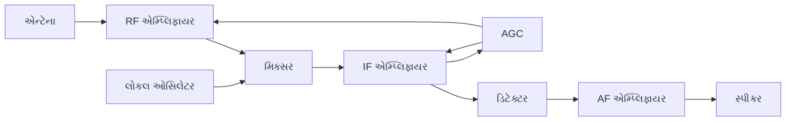
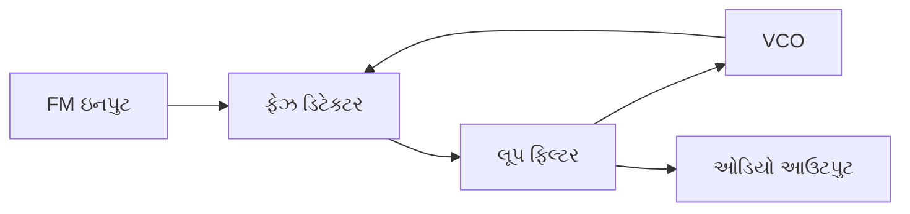
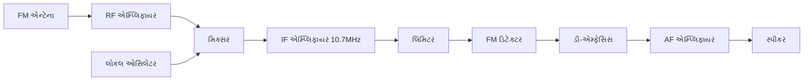
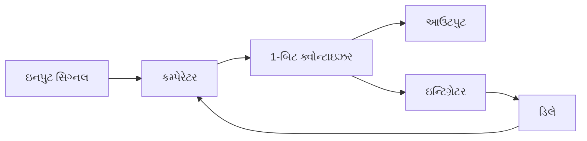
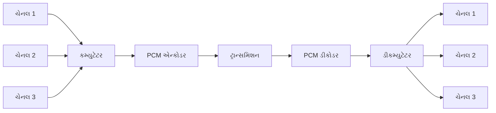
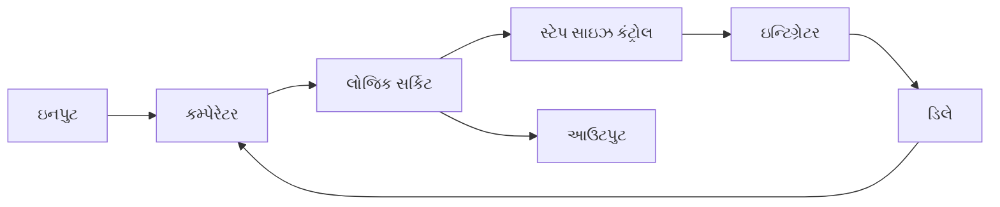
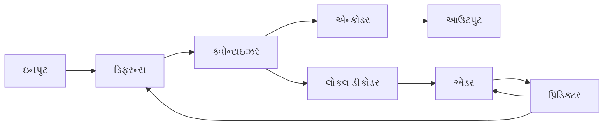
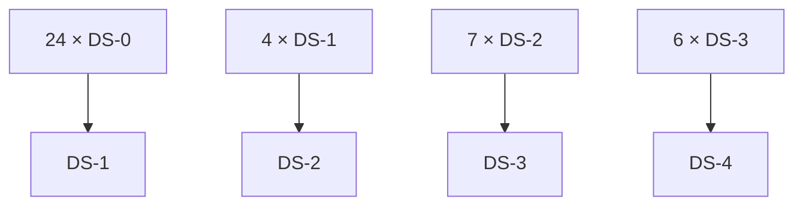

## પ્રશ્ન 1(અ) [3 ગુણ]

**એનાલોગ સિગ્નલ અને ડિજિટલ સિગ્નલની સરખામણી કરો.**

**જવાબ**:

| પેરામીટર | એનાલોગ સિગ્નલ | ડિજિટલ સિગ્નલ |
|-----------|---------------|----------------|
| **પ્રકૃતિ** | સતત તરંગરૂપ | અલગ અલગ વેલ્યુ (0 અને 1) |
| **એમ્પ્લિટ્યુડ** | અનંત વિવિધતાઓ | નિશ્ચિત અલગ સ્તરો |
| **નોઇઝ ઇફેક્ટ** | વધુ સંવેદનશીલ | ઓછી સંવેદનશીલ |
| **બેન્ડવિડ્થ** | ઓછી બેન્ડવિડ્થ જરૂરી | વધુ બેન્ડવિડ્થ જરૂરી |
| **સિક્યુરિટી** | ઓછી સુરક્ષિત | વધુ સુરક્ષિત |

- **સિગ્નલ પ્રકાર**: એનાલોગ સિગ્નલ સતત હોય છે, ડિજિટલ સિગ્નલ અલગ અલગ હોય છે
- **નોઇઝ રેઝિસ્ટન્સ**: ડિજિટલ સિગ્નલમાં નોઇઝ સામે વધુ પ્રતિકાર હોય છે

**મેમરી ટ્રીક:** "ABCD - Analog Bad for noise, Continuous; Digital Discrete, Clean signals"

---

## પ્રશ્ન 1(બ) [4 ગુણ]

**PAM, PWM અને PPM ની સરખામણી કરો.**

**જવાબ**:

| પેરામીટર | PAM | PWM | PPM |
|-----------|-----|-----|-----|
| **પૂરું નામ** | Pulse Amplitude Modulation | Pulse Width Modulation | Pulse Position Modulation |
| **મોડ્યુલેટેડ પેરામીટર** | એમ્પ્લિટ્યુડ | પહોળાઈ/અવધિ | સ્થાન/સમય |
| **નોઇઝ ઇમ્યુનિટી** | ખરાબ | સારી | ઉત્તમ |
| **બેન્ડવિડ્થ** | લઘુત્તમ | મધ્યમ | મહત્તમ |
| **પાવર કન્ઝમ્પશન** | વધુ | મધ્યમ | ઓછી |

**ડાયાગ્રામ:**

```goat
PAM: |▄▄|  |▄▄▄| |▄|     Amplitude varies
PWM: |▄| |▄▄▄| |▄▄|      Width varies  
PPM: |▄|  |▄| |▄|        Position varies
```

- **મોડ્યુલેશન પેરામીટર**: દરેક પ્રકાર પલ્સની અલગ લાક્ષણિકતાઓ મોડ્યુલેટ કરે છે
- **એપ્લિકેશન**: PWM મોટર કંટ્રોલમાં, PPM રેડિયો કંટ્રોલ સિસ્ટમમાં વપરાય છે

**મેમરી ટ્રીક:** "PAM-Amplitude, PWM-Width, PPM-Position - AWP"

---

## પ્રશ્ન 1(ક) [7 ગુણ]

**મોડ્યુલેશનની જરૂરિયાત વિગતવાર સમજાવો. જો કેરિયર સિગ્નલની આવૃત્તિ 1 MHz હોય તો એન્ટેનાની ઊંચાઈની ગણતરી કરો.**

**જવાબ**:

**મોડ્યુલેશનની જરૂરિયાત:**

| કારણ | સમજૂતી |
|--------|-------------|
| **એન્ટેના સાઇઝ રિડક્શન** | વ્યવહારિક એન્ટેના માપ શક્ય બનાવે છે |
| **ફ્રીક્વન્સી ટ્રાન્સલેશન** | સિગ્નલને યોગ્ય આવૃત્તિ રેન્જમાં ખસેડે છે |
| **મલ્ટિપ્લેક્સિંગ** | એક જ માધ્યમ પર અનેક સિગ્નલ મંજૂરી આપે છે |
| **નોઇઝ રિડક્શન** | સિગ્નલ-ટુ-નોઇઝ રેશિયો સુધારે છે |
| **પાવર એફિશિયન્સી** | વધુ સારી પાવર વિનિયોગ |

**એન્ટેના ઊંચાઈની ગણતરી:**
કાર્યક્ષમ રેડિએશન માટે, એન્ટેના ઊંચાઈ = λ/4

λ = c/f = (3 × 10⁸)/(1 × 10⁶) = 300 મીટર

**એન્ટેના ઊંચાઈ** = λ/4 = 300/4 = **75 મીટર**

- **પ્રેક્ટિકલ એન્ટેના**: મોડ્યુલેશન વગર, એન્ટેના અવ્યવહારિક રીતે મોટો હોત
- **ફ્રીક્વન્સી શિફ્ટિંગ**: વધુ સારી પ્રોપેગેશન લાક્ષણિકતાઓ માટે મંજૂરી આપે છે

**મેમરી ટ્રીક:** "AFMNP - Antenna, Frequency, Multiplexing, Noise, Power"

---

## પ્રશ્ન 1(ક) OR [7 ગુણ]

**EM વેવ સ્પેક્ટ્રમના ફ્રીક્વન્સી બેન્ડ તેના એપ્લિકેશન ડોમેન સાથે લખો. ELF બેન્ડની તરંગલંબાઈની ગણતરી કરો.**

**જવાબ**:

| બેન્ડ | આવૃત્તિ રેન્જ | તરંગલંબાઈ | એપ્લિકેશન |
|------|----------------|------------|--------------|
| **ELF** | 30-300 Hz | 10⁶-10⁷ m | સબમરીન કમ્યુનિકેશન |
| **VLF** | 3-30 kHz | 10⁴-10⁵ m | નેવિગેશન, ટાઇમ સિગ્નલ |
| **LF** | 30-300 kHz | 10³-10⁴ m | AM બ્રોડકાસ્ટિંગ |
| **MF** | 300 kHz-3 MHz | 100-1000 m | AM રેડિયો |
| **HF** | 3-30 MHz | 10-100 m | શોર્ટ વેવ રેડિયો |

**ELF તરંગલંબાઈની ગણતરી:**

- નીચી આવૃત્તિ: f₁ = 30 Hz, λ₁ = c/f₁ = (3×10⁸)/30 = **10⁷ મીટર**
- ઉચ્ચી આવૃત્તિ: f₂ = 300 Hz, λ₂ = c/f₂ = (3×10⁸)/300 = **10⁶ મીટર**

**ELF તરંગલંબાઈ રેન્જ: 10⁶ થી 10⁷ મીટર**

- **એપ્લિકેશન ડોમેન**: દરેક બેન્ડ ચોક્કસ એપ્લિકેશન માટે યોગ્ય છે
- **પ્રોપેગેશન**: નીચી આવૃત્તિઓમાં વધુ સારી ગ્રાઉન્ડ વેવ પ્રોપેગેશન હોય છે

**મેમરી ટ્રીક:** "Every Valuable Learning Makes Happiness - ELF થી HF બેન્ડ"

---

## પ્રશ્ન 2(અ) [3 ગુણ]

**AM અને FM ની સરખામણી કરો.**

**જવાબ**:

| પેરામીટર | AM | FM |
|-----------|----|----|
| **મોડ્યુલેટેડ પેરામીટર** | એમ્પ્લિટ્યુડ | આવૃત્તિ |
| **બેન્ડવિડ્થ** | 2fm | 2(Δf + fm) |
| **નોઇઝ ઇમ્યુનિટી** | ખરાબ | સારી |
| **પાવર એફિશિયન્સી** | ઓછી (33.33%) | વધુ |
| **સર્કિટ કોમ્પ્લેક્સિટી** | સરળ | જટિલ |

- **બેન્ડવિડ્થ**: FM ને AM કરતાં ઘણી વધુ બેન્ડવિડ્થ જરૂરી છે
- **ક્વોલિટી**: FM વધુ સારી ઓડિયો ક્વોલિટી પૂરી પાડે છે

**મેમરી ટ્રીક:** "AM-Amplitude સરળ, FM-Frequency જટિલ પણ વધુ સારી ક્વોલિટી"

---

## પ્રશ્ન 2(બ) [4 ગુણ]

**એમ્પ્લિટ્યુડ મોડ્યુલેટેડ વેવનું વેવફોર્મ દોરો.**

**જવાબ**:

**ડાયાગ્રામ:**

```goat
Modulating Signal:  ∼    ∼    ∼    ∼

Carrier Signal:     ∿∿∿∿∿∿∿∿∿∿∿∿∿∿

FM Wave:           ∿∿∿  ∿∿∿∿∿∿  ∿∿∿
                      Higher freq  Lower freq
                      when mod +ve when mod -ve
```

**લાક્ષણિકતાઓ:**

- **એન્વેલોપ**: એન્વેલોપ મોડ્યુલેટિંગ સિગ્નલને અનુસરે છે
- **કેરિયર ફ્રીક્વન્સી**: સમગ્ર સમય દરમિયાન સ્થિર રહે છે
- **એમ્પ્લિટ્યુડ વેરિએશન**: એમ્પ્લિટ્યુડ મોડ્યુલેટિંગ સિગ્નલ સાથે બદલાય છે

**મેમરી ટ્રીક:** "Envelope Follows Message - EFM"

---

## પ્રશ્ન 2(ક) [7 ગુણ]

**એમ્પ્લિટ્યુડ મોડ્યુલેશનની વ્યાખ્યા આપો અને ડબલ સાઇડબેન્ડ ફુલ કેરિયર (DSBFC) એમ્પ્લિટ્યુડ મોડ્યુલેશન (AM) સિગ્નલ માટે ગાણિતિક અભિવ્યક્તિ મેળવો.**

**જવાબ**:

**વ્યાખ્યા:** એમ્પ્લિટ્યુડ મોડ્યુલેશન એ પ્રક્રિયા છે જેમાં કેરિયર સિગ્નલનું એમ્પ્લિટ્યુડ મોડ્યુલેટિંગ સિગ્નલના તાત્કાલિક એમ્પ્લિટ્યુડ અનુસાર બદલાય છે.

**ગાણિતિક વ્યુત્પત્તિ:**

કેરિયર સિગ્નલ: ec(t) = Ec cos(ωct)
મોડ્યુલેટિંગ સિગ્નલ: em(t) = Em cos(ωmt)

**AM સિગ્નલ અભિવ્યક્તિ:**
eAM(t) = [Ec + Em cos(ωmt)] cos(ωct)
eAM(t) = Ec cos(ωct) + Em cos(ωmt) cos(ωct)

ત્રિકોણમિતિય સૂત્રનો ઉપયોગ:
cos A cos B = ½[cos(A+B) + cos(A-B)]

**અંતિમ AM અભિવ્યક્તિ:**
eAM(t) = Ec cos(ωct) + (Em/2) cos(ωc + ωm)t + (Em/2) cos(ωc - ωm)t

**ઘટકો:**

- **કેરિયર કોમ્પોનન્ટ**: Ec cos(ωct)
- **અપર સાઇડબેન્ડ**: (Em/2) cos(ωc + ωm)t  
- **લોઅર સાઇડબેન્ડ**: (Em/2) cos(ωc - ωm)t

**મેમરી ટ્રીક:** "Carrier Plus Upper Lower Sidebands - CPULS"

---

## પ્રશ્ન 2(અ) OR [3 ગુણ]

**પ્રી-એમ્ફેસિસ અને ડી-એમ્ફેસિસની સરખામણી કરો.**

**જવાબ**:

| પેરામીટર | પ્રી-એમ્ફેસિસ | ડી-એમ્ફેસિસ |
|-----------|--------------|-------------|
| **સ્થાન** | ટ્રાન્સમિટર પર | રીસીવર પર |
| **કાર્ય** | ઉચ્ચ આવૃત્તિઓ વધારે છે | ઉચ્ચ આવૃત્તિઓ ઘટાડે છે |
| **ફ્રીક્વન્સી રિસ્પોન્સ** | હાઇ પાસ લાક્ષણિકતા | લો પાસ લાક્ષણિકતા |
| **હેતુ** | S/N રેશિયો સુધારે છે | મૂળ સિગ્નલ પુનઃસ્થાપિત કરે છે |
| **ટાઇમ કોન્સ્ટન્ટ** | 75 μs (FM બ્રોડકાસ્ટિંગ) | 75 μs (FM બ્રોડકાસ્ટિંગ) |

- **નોઇઝ રિડક્શન**: સંયુક્ત અસર મળેલ સિગ્નલમાં નોઇઝ ઘટાડે છે
- **ફ્રીક્વન્સી રિસ્પોન્સ**: પૂરક લાક્ષણિકતાઓ

**મેમરી ટ્રીક:** "Pre-Boost, De-Cut - Noise Reduction Circuit"

---

## પ્રશ્ન 2(બ) OR [4 ગુણ]

**ફ્રીક્વન્સી મોડ્યુલેટેડ વેવનું વેવફોર્મ દોરો.**

**જવાબ**:

**ડાયાગ્રામ:**

```goat
Modulating Signal:  ∼    ∼    ∼    ∼

Carrier Signal:     ∿∿∿∿∿∿∿∿∿∿∿∿∿∿

FM Wave:           ∿∿∿  ∿∿∿∿∿∿  ∿∿∿
                      Higher freq  Lower freq
                      when mod +ve when mod -ve
```

**લાક્ષણિકતાઓ:**

- **કોન્સ્ટન્ટ એમ્પ્લિટ્યુડ**: એમ્પ્લિટ્યુડ સ્થિર રહે છે
- **ફ્રીક્વન્સી વેરિએશન**: આવૃત્તિ મોડ્યુલેટિંગ સિગ્નલ સાથે બદલાય છે
- **ફેઝ કોન્ટિન્યુઇટી**: ફેઝ સતત રહે છે

**મેમરી ટ્રીક:** "Constant Amplitude, Variable Frequency - CAVF"

---

## પ્રશ્ન 2(ક) OR [7 ગુણ]

**ફ્રીક્વન્સી મોડ્યુલેશનની વ્યાખ્યા આપો અને FM તરંગ માટે ગાણિતિક અભિવ્યક્તિ મેળવો.**

**જવાબ**:

**વ્યાખ્યા:** ફ્રીક્વન્સી મોડ્યુલેશન એ પ્રક્રિયા છે જેમાં કેરિયર સિગ્નલની આવૃત્તિ મોડ્યુલેટિંગ સિગ્નલના તાત્કાલિક એમ્પ્લિટ્યુડ અનુસાર બદલાય છે.

**ગાણિતિક વ્યુત્પત્તિ:**

મોડ્યુલેટિંગ સિગ્નલ: em(t) = Em cos(ωmt)
તાત્કાલિક આવૃત્તિ: fi = fc + kf × Em cos(ωmt)

જ્યાં kf = આવૃત્તિ સંવેદનશીલતા

**તાત્કાલિક કોણીય આવૃત્તિ:**
ωi = 2π[fc + kf Em cos(ωmt)]
ωi = ωc + 2πkf Em cos(ωmt)

**ફેઝ ગણતરી:**
θ(t) = ∫ωi dt = ωct + (2πkf Em/ωm) sin(ωmt)

મોડ્યુલેશન ઇન્ડેક્સ: mf = 2πkf Em/ωm = Δf/fm

**અંતિમ FM અભિવ્યક્તિ:**
eFM(t) = Ec cos[ωct + mf sin(ωmt)]

**પેરામીટર:**

- **મોડ્યુલેશન ઇન્ડેક્સ**: mf = Δf/fm
- **ફ્રીક્વન્સી ડેવિએશન**: Δf = kf Em
- **બેન્ડવિડ્થ**: BW = 2(Δf + fm) (કાર્સનનો નિયમ)

**મેમરી ટ્રીક:** "Frequency Varies with Message - FVM"

---

## પ્રશ્ન 3(અ) [3 ગુણ]

**FM ડિમોડ્યુલેશનની સ્લોપ ડિટેક્શન પદ્ધતિનું વર્ણન કરો.**

**જવાબ**:

**સ્લોપ ડિટેક્શન સિદ્ધાંત:**


**કાર્યપદ્ધતિ:**

- **ટ્યુન્ડ સર્કિટ**: આવૃત્તિ ફેરફારોને એમ્પ્લિટ્યુડ ફેરફારોમાં રૂપાંતરિત કરે છે
- **સ્લોપ ઓપરેશન**: રેઝોનન્સ કર્વના સ્લોપનો ઉપયોગ કરે છે
- **એન્વેલોપ ડિટેક્શન**: એમ્પ્લિટ્યુડ ફેરફારો કાઢે છે

**લાક્ષણિકતાઓ:**

- **સિમ્પલ સર્કિટ**: અમલમાં મૂકવા સરળ
- **લિનિયર રેન્જ**: મર્યાદિત લિનિયર રેન્જ
- **આઉટપુટ ડિસ્ટોર્શન**: અન્ય પદ્ધતિઓ કરતાં વધુ વિકૃતિ

**મેમરી ટ્રીક:** "Slope Converts Frequency to Amplitude - SCFA"

---

## પ્રશ્ન 3(બ) [4 ગુણ]

**રેડિયો રીસીવરની વિવિધ લાક્ષણિકતાઓ સમજાવો.**

**જવાબ**:

| લાક્ષણિકતા | વ્યાખ્યા | મહત્વ |
|----------------|------------|------------|
| **સેન્સિટિવિટી** | સંતોષકારક આઉટપુટ માટે લઘુત્તમ ઇનપુટ સિગ્નલ | વધુ સારી નબળી સિગ્નલ રિસેપ્શન |
| **સિલેક્ટિવિટી** | ઇચ્છિત સિગ્નલ પસંદ કરવાની અને અન્યને નકારવાની ક્ષમતા | દખલગીરી ઘટાડે છે |
| **ફિડેલિટી** | પુનરુત્પાદનની વફાદારી | વધુ સારી ઓડિયો ક્વોલિટી |
| **ઇમેજ ફ્રીક્વન્સી રિજેક્શન** | ઇમેજ આવૃત્તિનો અસ્વીકાર | ખોટા સિગ્નલ અટકાવે છે |

**ગાણિતિક સંબંધો:**

- **સેન્સિટિવિટી**: સ્ટાન્ડર્ડ આઉટપુટ માટે μV માં માપવામાં આવે છે
- **સિલેક્ટિવિટી**: Q = f₀/BW
- **ઇમેજ રિજેક્શન રેશિયો**: IRR = 1 + (2πfIFRC)²

**મેમરી ટ્રીક:** "Sensitive Selective Faithful Image-free - SSFI"

---

## પ્રશ્ન 3(ક) [7 ગુણ]

**યોગ્ય બ્લોક ડાયાગ્રામ સાથે સુપર હેટરોડાઇન રીસીવર પર ટૂંકી નોંધ લખો.**

**જવાબ**:

**બ્લોક ડાયાગ્રામ:**



**કાર્યસિદ્ધાંત:**

- **આરએફ એમ્પ્લિફાયર**: પ્રાપ્ત RF સિગ્નલને એમ્પ્લિફાઇ કરે છે
- **મિક્સર**: RF ને નિશ્ચિત IF આવૃત્તિમાં રૂપાંતરિત કરે છે
- **લોકલ ઓસિલેટર**: મિક્સિંગ આવૃત્તિ પૂરી પાડે છે
- **આઇએફ એમ્પ્લિફાયર**: નિશ્ચિત આવૃત્તિ પર મુખ્ય એમ્પ્લિફિકેશન
- **ડિટેક્ટર**: મોડ્યુલેટેડ સિગ્નલ પુનઃપ્રાપ્ત કરે છે
- **એજીસી**: સ્થિર આઉટપુટ સ્તર જાળવે છે

**ફાયદા:**

- **હાઇ સેન્સિટિવિટી**: TRF કરતાં વધુ સારી સંવેદનશીલતા
- **ગુડ સિલેક્ટિવિટી**: વધુ સારી પસંદગીકારકતા
- **સ્ટેબલ ગેઇન**: સ્થિર ગેઇન લાક્ષણિકતાઓ

**IF આવૃત્તિ પસંદગી:**
સ્ટાન્ડર્ડ IF: AM માટે 455 kHz, FM માટે 10.7 MHz

**મેમરી ટ્રીક:** "Mix RF to IF for Better Selectivity - MRIBS"

---

## પ્રશ્ન 3(અ) OR [3 ગુણ]

**ફેઝ લોક્ડ લૂપનો ઉપયોગ કરીને FM ડિમોડ્યુલેટરનું કાર્ય સમજાવો.**

**જવાબ**:

**PLL FM ડિમોડ્યુલેટર:**



**કાર્યસિદ્ધાંત:**

- **ફેઝ ડિટેક્ટર**: ઇનપુટ FM ને VCO આઉટપુટ સાથે સરખાવે છે
- **વીસીઓ**: વોલ્ટેજ કંટ્રોલ્ડ ઓસિલેટર ઇનપુટ આવૃત્તિને ટ્રેક કરે છે  
- **લૂપ ફિલ્ટર**: ઉચ્ચ આવૃત્તિ ઘટકો દૂર કરે છે
- **લોક કન્ડિશન**: VCO આવૃત્તિ ઇનપુટ આવૃત્તિ સમાન થાય છે

**ફાયદા:**

- **લીનિયર ડિમોડ્યુલેશન**: ઉત્તમ રેખીયતા
- **લો ડિસ્ટોર્શન**: લઘુത્તમ વિકૃતિ
- **ગુડ ટ્રેકિંગ**: ઉત્તમ આવૃત્તિ ટ્રેકિંગ

**મેમરી ટ્રીક:** "Phase Lock Tracks Frequency - PLTF"

---

## પ્રશ્ન 3(બ) OR [4 ગુણ]

**મૂળભૂત FM રીસીવરના બ્લોક ડાયાગ્રામની ચર્ચા કરો.**

**જવાબ**:

**FM રીસીવર બ્લોક ડાયાગ્રામ:**



**બ્લોક કાર્યો:**

- **આરએફ એમ્પ્લિફાયર**: નબળા FM સિગ્નલને એમ્પ્લિફાઇ કરે છે (88-108 MHz)
- **મિક્સર**: IF આવૃત્તિમાં રૂપાંતરિત કરે છે (10.7 MHz)
- **લિમિટર**: એમ્પ્લિટ્યુડ ફેરફારો દૂર કરે છે
- **એફએમ ડિટેક્ટર**: ઓડિયો સિગ્નલ પુનઃપ્રાપ્ત કરે છે
- **ડી-એમ્ફેસિસ**: મૂળ આવૃત્તિ પ્રતિસાદ પુનઃસ્થાપિત કરે છે

**AM રીસીવરથી મુખ્ય તફાવતો:**

- **હાયર આઇએફ**: 455 kHz બદલે 10.7 MHz
- **લિમિટર સ્ટેજ**: વધારાનો લિમિટર સ્ટેજ
- **ડી-એમ્ફેસિસ**: પ્રી/ડી-એમ્ફેસિસ નેટવર્ક

**મેમરી ટ્રીક:** "FM needs Higher IF and Limiting - FHIL"

---

## પ્રશ્ન 3(ક) OR [7 ગુણ]

**યોગ્ય સર્કિટ ડાયાગ્રામ અને વેવફોર્મ સાથે ડાયોડનો ઉપયોગ કરીને એન્વેલોપ ડિટેક્ટર પર ટૂંકી નોંધ લખો.**

**જવાબ**:

**સર્કિટ ડાયાગ્રામ:**

```goat
      D1
AM --|>|--+---- Audio Output
     |    |
     |    R
     |    |
     |    C
     |    |
    GND  GND
```

**કાર્યસિદ્ધાંત:**

```goat
AM Input:    .∿∿. .∿∿∿∿. .∿∿.
            ∿    ∿      ∿    ∿

Diode Output: ▄▄▄ ▄▄▄▄▄▄ ▄▄▄
(After filtering)

Audio Output: ∼    ∼    ∼    ∼
```

**ઓપરેશન:**

- **ડાયોડ કન્ડક્શન**: સકારાત્મક અર્ધ ચક્ર દરમિયાન વહન કરે છે
- **કેપેસિટર ચાર્જિંગ**: પીક વેલ્યુ સુધી ચાર્જ થાય છે
- **આરસી ડિસચાર્જ**: RC સર્કિટ દ્વારા ડિસચાર્જ થાય છે
- **એન્વેલોપ ફોલોઇંગ**: આઉટપુટ એન્વેલોપને અનુસરે છે

**ડિઝાઇન વિચારણાઓ:**

- **ટાઇમ કોન્સ્ટન્ટ**: RC >> 1/fc પણ RC << 1/fm
- **ડાયોડ સિલેક્શન**: ફાસ્ટ રિકવરી ડાયોડ પસંદીદા
- **લોડ રેઝિસ્ટન્સ**: ડાયોડ રેઝિસ્ટન્સ કરતાં ઘણું મોટું હોવું જોઈએ

**ફાયદા:**

- **સિમ્પ્લિસિટી**: ખૂબ સરળ સર્કિટ
- **લો કોસ્ટ**: આર્થિક ઉકેલ
- **હાઇ એફિશિયન્સી**: સારી ડિટેક્શન કાર્યક્ષમતા

**મેમરી ટ્રીક:** "Diode Charges, RC Follows Envelope - DCRF"

---

## પ્રશ્ન 4(અ) [3 ગુણ]

**અન્ડર સેમ્પલિંગ, ઓવર સેમ્પલિંગ અને ક્રિટિકલ સેમ્પલિંગનું વિવરણ આપો.**

**જવાબ**:

| પ્રકાર | શરત | પરિણામ |
|------|-----------|--------|
| **અન્ડર સેમ્પલિંગ** | fs < 2fm | એલાયસિંગ થાય છે |
| **ક્રિટિકલ સેમ્પલિંગ** | fs = 2fm | માત્ર પૂરતું, કોઈ માર્જિન નથી |
| **ઓવર સેમ્પલિંગ** | fs > 2fm | એલાયસિંગ નથી, સલામત માર્જિન |

**ડાયાગ્રામ:**

```goat
Original Signal:     ∿∿∿∿∿∿∿

Under Sampling:      ∿ . . ∿     Aliasing
Critical Sampling:   ∿ . ∿ .     Just OK  
Over Sampling:       ∿.∿.∿.∿     Safe
```

- **એલાયસિંગ ઇફેક્ટ**: અન્ડર સેમ્પલિંગ આવૃત્તિ ઓવરલેપનું કારણ બને છે
- **નાયક્વિસ્ટ રેટ**: લઘુત્તમ સેમ્પલિંગ રેટ = 2fm
- **પ્રેક્ટિકલ રેટ**: સામાન્ય રીતે મેસેજ આવૃત્તિના 2.5 થી 5 ગણા

**મેમરી ટ્રીક:** "Under-Alias, Critical-Just, Over-Safe - UCO"

---

## પ્રશ્ન 4(બ) [4 ગુણ]

**સેમ્પલિંગ થિયરમ લખો અને નાયક્વિસ્ટ રેટ, નાયક્વિસ્ટ ઇન્ટરવલ અને એલાયસિંગ એરરની વ્યાખ્યા આપો.**

**જવાબ**:

**સેમ્પલિંગ થિયરમ:** 
"જો સેમ્પલિંગ આવૃત્તિ સિગ્નલના સર્વોચ્ચ આવૃત્તિ ઘટકના ઓછામાં ઓછા બમણી હોય તો સતત સિગ્નલ તેના સેમ્પલમાંથી સંપૂર્ણ રીતે પુનઃપ્રાપ્ત કરી શકાય છે."

**વ્યાખ્યાઓ:**

| શબ્દ | વ્યાખ્યા | સૂત્ર |
|------|------------|---------|
| **નાયક્વિસ્ટ રેટ** | લઘુત્તમ સેમ્પલિંગ આવૃત્તિ | fs = 2fm |
| **નાયક્વિસ્ટ ઇન્ટરવલ** | મહત્તમ સેમ્પલિંગ અંતરાલ | Ts = 1/(2fm) |
| **એલાયસિંગ એરર** | અન્ડર સેમ્પલિંગને કારણે આવૃત્તિ ઓવરલેપ | fa = |fs - f| |

**ગાણિતિક અભિવ્યક્તિ:**

- **સેમ્પલિંગ ફ્રીક્વન્સી**: fs ≥ 2fm (નાયક્વિસ્ટ કસોટી)
- **સેમ્પલિંગ પીરિયડ**: Ts = 1/fs
- **એલાયસિંગ કન્ડિશન**: fs < 2fm

**વ્યવહારિક એપ્લિકેશન:**

- **ડિજિટલ ઓડિયો**: fm = 20 kHz માટે fs = 44.1 kHz
- **ટેલિફોન સિસ્ટમ**: fm = 4 kHz માટે fs = 8 kHz

**મેમરી ટ્રીક:** "Sample at twice message frequency - S2M"

---

## પ્રશ્ન 4(ક) [7 ગુણ]

**આઇડિયલ, નેચરલ અને ફ્લેટ ટોપ સેમ્પલિંગની ચર્ચા કરો.**

**જવાબ**:

**સેમ્પલિંગના પ્રકારો:**

| પ્રકાર | લાક્ષણિકતાઓ | ગાણિતિક અભિવ્યક્તિ |
|------|----------------|------------------------|
| **આઇડિયલ સેમ્પલિંગ** | ઇમ્પલ્સ ટ્રેઇન ગુણાકાર | xs(t) = x(t)·δT(t) |
| **નેચરલ સેમ્પલિંગ** | વેરિએબલ પહોળાઈ પલ્સ | ટોપ સિગ્નલને અનુસરે છે |
| **ફ્લેટ ટોપ સેમ્પલિંગ** | કોન્સ્ટન્ટ એમ્પ્લિટ્યુડ પલ્સ | સેમ્પલ અને હોલ્ડ |

**વેવફોર્મ:**

```goat
Original:    ∿∿∿∿∿∿∿∿∿∿∿∿

Ideal:       ↑ ↑ ↑ ↑ ↑ ↑     Impulses

Natural:     |∿| |∿| |∿|     Variable width

Flat Top:    |▄| |▄| |▄|     Constant width
```

**આવૃત્તિ સ્પેક્ટ્રમ:**

- **આઇડિયલ સેમ્પલિંગ**: સચોટ સ્પેક્ટ્રલ પ્રતિકૃતિ
- **નેચરલ સેમ્પલિંગ**: થોડું સ્પેક્ટ્રલ મોડિફિકેશન  
- **ફ્લેટ ટોપ સેમ્પલિંગ**: એપર્ચર ઇફેક્ટ હાજર

**વ્યવહારિક અમલીકરણ:**

- **આઇડિયલ**: માત્ર સૈદ્ધાંતિક
- **નેચરલ**: PAM સિસ્ટમમાં વપરાય છે
- **ફ્લેટ ટોપ**: સેમ્પલ-અને-હોલ્ડ સર્કિટ, ADC સિસ્ટમ

**એપર્ચર ઇફેક્ટ:** 
ફ્લેટ-ટોપ સેમ્પલિંગમાં: |Sa(πfT/2)| = |sin(πfT/2)/(πfT/2)|

**મેમરી ટ્રીક:** "Ideal-Impulse, Natural-Variable, Flat-Constant - IVF"

---

## પ્રશ્ન 4(અ) OR [3 ગુણ]

**યોગ્ય બ્લોક ડાયાગ્રામ સાથે ડેલ્ટા મોડ્યુલેટરનું કાર્ય સમજાવો.**

**જવાબ**:

**ડેલ્ટા મોડ્યુલેટર બ્લોક ડાયાગ્રામ:**



**કાર્યસિદ્ધાંત:**

- **કમ્પેરિસન**: ઇનપુટની સરખામણી પહેલાના ઇન્ટિગ્રેટેડ આઉટપુટ સાથે
- **1-બિટ ક્વોન્ટાઇઝેશન**: આઉટપુટ +Δ અથવા -Δ છે
- **ઇન્ટિગ્રેશન**: ઇન્ટિગ્રેટર ઇનપુટ સિગ્નલનો અંદાજ કાઢે છે
- **ફીડબેક**: પહેલાનો આઉટપુટ સરખામણી માટે પાછો મોકલવામાં આવે છે

**આઉટપુટ લાક્ષણિકતાઓ:**

- **બાઇનરી આઉટપુટ**: દરેક સેમ્પલ માટે માત્ર 1 બિટ
- **સ્ટેપ સાઇઝ**: નિશ્ચિત સ્ટેપ સાઇઝ Δ
- **ટ્રેકિંગ**: આઉટપુટ ઇનપુટને સ્ટેપમાં ટ્રેક કરે છે

**મેમરી ટ્રીક:** "Compare, Quantize, Integrate, Feedback - CQIF"

---

## પ્રશ્ન 4(બ) OR [4 ગુણ]

**યોગ્ય સમજૂતી સાથે ડેલ્ટા મોડ્યુલેશન (DM) ના ગેરફાયદા લખો.**

**જવાબ**:

**મુખ્ય ગેરફાયદા:**

| ગેરફાયદા | સમજૂતી | ઉકેલ |
|--------------|-------------|----------|
| **સ્લોપ ઓવરલોડ** | ઝડપી ફેરફારો ટ્રેક કરી શકતું નથી | સ્ટેપ સાઇઝ વધારો |
| **ગ્રેન્યુલર નોઇઝ** | સપાટ વિસ્તારોમાં ક્વોન્ટાઇઝેશન નોઇઝ | સ્ટેપ સાઇઝ ઘટાડો |
| **હાઇ બિટ રેટ** | ઉચ્ચ સેમ્પલિંગ રેટ જરૂરી | ADPCM નો ઉપયોગ કરો |
| **લિમિટેડ ડાયનેમિક રેન્જ** | નિશ્ચિત સ્ટેપ સાઇઝની મર્યાદા | એડેપ્ટિવ તકનીકો |

**સ્લોપ ઓવરલોડ કન્ડિશન:**
જ્યારે |dx/dt| > Δfs, સ્લોપ ઓવરલોડ થાય છે

**ગ્રેન્યુલર નોઇઝ:**
જ્યારે ઇનપુટ સિગ્નલ ધીમે ધીમે બદલાય અથવા સ્થિર રહે ત્યારે થાય છે

**વેવફોર્મ:**

```goat
Slope Overload:    /∿∿∿    Input too fast
                  /▄▄▄     DM output lags

Granular Noise:   ____     Flat input
                  ▄▄▄▄     DM oscillates
```

**પ્રદર્શન પેરામીટર:**

- **સ્લોપ ઓવરલોડ**: મહત્તમ સ્લોપ = Δfs
- **ગ્રેન્યુલર નોઇઝ**: સ્ટેપ સાઇઝ પર આધાર રાખે છે
- **એસએનઆર**: બંને અસરોથી મર્યાદિત

**મેમરી ટ્રીક:** "Slope-Overload, Granular-Noise, High-Bitrate - SOG-H"

---

## પ્રશ્ન 4(ક) OR [7 ગુણ]

**પલ્સ કોડ મોડ્યુલેશન (PCM) ટ્રાન્સમિટર અને રીસીવરના દરેક બ્લોકના કાર્યોનું વર્ણન કરો.**

**જવાબ**:

**PCM ટ્રાન્સમિટર બ્લોક ડાયાગ્રામ:**


**PCM રીસીવર બ્લોક ડાયાગ્રામ:**


**ટ્રાન્સમિટર બ્લોક કાર્યો:**

| બ્લોક | કાર્ય |
|-------|----------|
| **LPF** | એન્ટિ-એલાયસિંગ ફિલ્ટર, fm કરતાં વધુ આવૃત્તિઓ દૂર કરે છે |
| **સેમ્પલ અને હોલ્ડ** | fs ≥ 2fm પર સેમ્પલ કરે છે અને વેલ્યુ હોલ્ડ કરે છે |
| **ક્વોન્ટાઇઝર** | ડિસ્ક્રીટ એમ્પ્લિટ્યુડ લેવલમાં રૂપાંતરિત કરે છે |
| **એન્કોડર** | ક્વોન્ટાઇઝ્ડ સેમ્પલને બાઇનરી કોડમાં રૂપાંતરિત કરે છે |

**રીસીવર બ્લોક કાર્યો:**

| બ્લોક | કાર્ય |
|-------|----------|
| **ડીકોડર** | બાઇનરી કોડને ક્વોન્ટાઇઝ્ડ લેવલમાં રૂપાંતરિત કરે છે |
| **DAC** | ડિજિટલ ટુ એનાલોગ રૂપાંતરણ |
| **LPF** | પુનર્નિર્માણ ફિલ્ટર, સેમ્પલિંગ આવૃત્તિ દૂર કરે છે |

**તકનીકી સ્પેસિફિકેશન:**

- **ક્વોન્ટાઇઝેશન લેવલ**: L = 2ⁿ (n = બિટની સંખ્યા)
- **ક્વોન્ટાઇઝેશન એરર**: મહત્તમ Δ/2
- **બિટ રેટ**: fb = n × fs

**PCM ફાયદા:**

- **નોઇઝ ઇમ્યુનિટી**: ઉત્તમ નોઇઝ પ્રદર્શન
- **રિજનરેશન**: એરર એકઠા થયા વગર પુનર્જનન કરી શકાય છે
- **મલ્ટિપ્લેક્સિંગ**: અનેક ચેનલ મલ્ટિપ્લેક્સ કરવું સરળ

**મેમરી ટ્રીક:** "Low-pass, Sample, Quantize, Encode - LSQE માટે TX; Decode, Convert, Filter - DCF માટે RX"

---

## પ્રશ્ન 5(અ) [3 ગુણ]

**TDM-PCM સિસ્ટમના બ્લોક ડાયાગ્રામની સંક્ષિપ્ત ચર્ચા કરો.**

**જવાબ**:

**TDM-PCM સિસ્ટમ બ્લોક ડાયાગ્રામ:**



**સિસ્ટમ ઓપરેશન:**

- **કમ્યુટેટર**: અનેક ચેનલનું અનુક્રમિક સેમ્પલિંગ
- **પીસીએમ એન્કોડર**: સેમ્પલને ડિજિટલ ફોર્મેટમાં રૂપાંતરિત કરે છે
- **ટાઇમ ડિવિઝન**: દરેક ચેનલને નિશ્ચિત ટાઇમ સ્લોટ મળે છે
- **ડીકમ્યુટેટર**: રીસીવર પર ચેનલ અલગ કરે છે

**ફ્રેમ સ્ટ્રક્ચર:**

- **ટાઇમ સ્લોટ**: દરેક ચેનલને ચોક્કસ સમય આપવામાં આવે છે
- **ફ્રેમ પીરિયડ**: બધી ચેનલ માટે સંપૂર્ણ ચક્ર
- **સિંક્રોનાઇઝેશન**: ફ્રેમ સિંક્રોનાઇઝેશન બિટ ઉમેરવામાં આવે છે

**ફાયદા:**

- **બેન્ડવિડ્થ એફિશિયન્સી**: કાર્યક્ષમ સ્પેક્ટ્રમ ઉપયોગ
- **મલ્ટિપલ ચેનલ**: એક લિંક પર અનેક ચેનલ

**મેમરી ટ્રીક:** "Time Division Multiple Access - TDMA"

---

## પ્રશ્ન 5(બ) [4 ગુણ]

**એડેપ્ટિવ ડેલ્ટા મોડ્યુલેશન (ADM) પર ટૂંકી નોંધ લખો.**

**જવાબ**:

**ADM બ્લોક ડાયાગ્રામ:**



**કાર્યસિદ્ધાંત:**

- **એડેપ્ટિવ સ્ટેપ સાઇઝ**: ઇનપુટ લાક્ષણિકતાઓના આધારે સ્ટેપ સાઇઝ બદલાય છે
- **સ્લોપ ઓવરલોડ પ્રિવેન્શન**: ઝડપી ફેરફારો માટે સ્ટેપ સાઇઝ વધારે છે
- **ગ્રેન્યુલર નોઇઝ રિડક્શન**: ધીમા ફેરફારો માટે સ્ટેપ સાઇઝ ઘટાડે છે
- **લોજિક કંટ્રોલ**: એલ્ગોરિધમ સ્ટેપ સાઇઝ એડેપ્ટેશન કંટ્રોલ કરે છે

**સ્ટેપ સાઇઝ કંટ્રોલ:**

- **ઇન્ક્રીઝ**: જ્યારે સતત બિટ સમાન હોય (સ્લોપ ઓવરલોડ શોધાય)
- **ડિક્રીઝ**: જ્યારે વૈકલ્પિક પેટર્ન થાય (ગ્રેન્યુલર વિસ્તાર)

**સ્ટાન્ડર્ડ DM કરતાં ફાયદા:**

- **બેટર એસએનઆર**: સુધારેલ સિગ્નલ-ટુ-નોઇઝ રેશિયો
- **ડાયનેમિક રેન્જ**: વધુ સારી ડાયનેમિક રેન્જ
- **ઓટોમેટિક એડેપ્ટેશન**: સ્વ-એડજસ્ટિંગ લાક્ષણિકતાઓ

**મેમરી ટ્રીક:** "Adaptive Step size Reduces both Slope-overload and Granular noise - ASRSG"

---

## પ્રશ્ન 5(ક) [7 ગુણ]

**લાઇન કોડિંગની વ્યાખ્યા આપો. "1 0 1 1 1 0 1 1" માટે NRZ (યુનિપોલર), RZ (યુનિપોલર), મેન્ચેસ્ટર કોડિંગ વેવફોર્મ દોરો.**

**જવાબ**:

**વ્યાખ્યા:** લાઇન કોડિંગ એ ડિજિટલ ડેટાને કમ્યુનિકેશન ચેનલ પર ટ્રાન્સમિશન માટે યોગ્ય ડિજિટલ સિગ્નલમાં રૂપાંતરિત કરવાની પ્રક્રિયા છે.

**વેવફોર્મ ડાયાગ્રામ:**

```goat
Data:        1  0  1  1  1  0  1  1

NRZ Unipolar:
             ▄▄    ▄▄ ▄▄ ▄▄    ▄▄ ▄▄
                __          __

RZ Unipolar:
             ▄  ▄  ▄  ▄  ▄     ▄  ▄
             ▄▄▄▄▄▄▄▄▄▄▄▄▄▄▄▄▄▄▄▄▄▄▄

Manchester:
             ▄▄    ▄▄ ▄▄ ▄▄    ▄▄ ▄▄
                __  __ __ __ __
             Transition at middle of each bit
```

**લાક્ષણિકતાઓ:**

| કોડિંગ પ્રકાર | લોજિક 1 | લોજિક 0 | બેન્ડવિડ્થ |
|-------------|---------|---------|-----------|
| **NRZ યુનિપોલર** | +V | 0V | fb |
| **RZ યુનિપોલર** | T/2 માટે +V, T/2 માટે 0V | 0V | 2fb |
| **મેન્ચેસ્ટર** | હાઇ-ટુ-લો ટ્રાન્ઝિશન | લો-ટુ-હાઇ ટ્રાન્ઝિશન | 2fb |

**ગુણધર્મો:**

- **એનઆરઝેડ**: શૂન્ય પર પાછા ફરતું નથી, સરળ પણ સ્વ-સિંક્રોનાઇઝેશન નથી
- **આરઝેડ**: શૂન્ય પર પાછા ફરે છે, સરળ ક્લોક રિકવરી પણ બમણી બેન્ડવિડ્થ
- **મેન્ચેસ્ટર**: સ્વ-સિંક્રોનાઇઝિંગ, ઇથરનેટમાં વપરાય છે

**એપ્લિકેશન:**

- **એનઆરઝેડ**: સરળ ડિજિટલ સિસ્ટમ
- **આરઝેડ**: મેગ્નેટિક રેકોર્ડિંગ
- **મેન્ચેસ્ટર**: ઇથરનેટ, કેટલાક વાયરલેસ સ્ટાન્ડર્ડ

**મેમરી ટ્રીક:** "NRZ-Simple, RZ-Return, Manchester-Transition - SRT"

---

## પ્રશ્ન 5(અ) OR [3 ગુણ]

**ટાઇમ ડિવિઝન ડિજિટલ મલ્ટિપ્લેક્સિંગના કોન્સેપ્ટનું વર્ણન કરો.**

**જવાબ**:

**TDM કોન્સેપ્ટ:**
ટાઇમ ડિવિઝન મલ્ટિપ્લેક્સિંગ એ તકનીક છે જેમાં દરેક સિગ્નલને અલગ અલગ ટાઇમ સ્લોટ આપીને અનેક ડિજિટલ સિગ્નલ એક જ ચેનલ પર ટ્રાન્સમિટ કરવામાં આવે છે.

**TDM ફ્રેમ સ્ટ્રક્ચર:**

```goat
Frame: |CH1|CH2|CH3|CH4|SYNC|CH1|CH2|CH3|CH4|SYNC|
       ←――――― Frame Period ―――――→
```

**કાર્યસિદ્ધાંત:**

| ઘટક | કાર્ય |
|-----------|----------|
| **ટાઇમ સ્લોટ** | દરેક ચેનલને આપવામાં આવતી નિશ્ચિત અવધિ |
| **ફ્રેમ** | બધી ચેનલ ધરાવતું સંપૂર્ણ ચક્ર |
| **સિંક્રોનાઇઝેશન** | યોગ્ય ચેનલ અલગીકરણ જાળવે છે |
| **મલ્ટિપ્લેક્સર** | અનેક ઇનપુટ અનુક્રમે જોડે છે |

**મુખ્ય લક્ષણો:**

- **ફિક્સ્ડ ટાઇમ સ્લોટ**: દરેક ચેનલને પૂર્વનિર્ધારિત સમય મળે છે
- **સિક્વેન્શિયલ સેમ્પલિંગ**: ચેનલ એક પછી એક સેમ્પલ થાય છે  
- **ડિજિટલ ટ્રાન્સમિશન**: ડિજિટલ સિગ્નલ માટે યોગ્ય
- **બેન્ડવિડ્થ શેરિંગ**: કાર્યક્ષમ સ્પેક્ટ્રમ ઉપયોગ

**એપ્લિકેશન:**

- **ટેલિફોન સિસ્ટમ**: T1, E1 સિસ્ટમ
- **ડિજિટલ હાયરાર્કી**: PDH, SDH સિસ્ટમ

**મેમરી ટ્રીક:** "Time slots Share Single Channel - TSSC"

---

## પ્રશ્ન 5(બ) OR [4 ગુણ]

**ડિફરન્શિયલ PCM (DPCM) પર ટૂંકી નોંધ લખો.**

**જવાબ**:

**DPCM બ્લોક ડાયાગ્રામ:**



**કાર્યસિદ્ધાંત:**

- **પ્રિડિક્શન**: પહેલાના સેમ્પલમાંથી વર્તમાન સેમ્પલનો અંદાજ કાઢે છે
- **ડિફરન્સ સિગ્નલ**: વાસ્તવિક અને અંદાજિત વચ્ચેનો તફાવત ટ્રાન્સમિટ કરે છે
- **ક્વોન્ટાઇઝેશન**: માત્ર ડિફરન્સ સિગ્નલ ક્વોન્ટાઇઝ કરે છે
- **લોકલ ડીકોડર**: રીસીવર જેવો જ રેફરન્સ જાળવે છે

**પ્રિડિક્શન એલ્ગોરિધમ:**

| પ્રકાર | સૂત્ર | એપ્લિકેશન |
|------|---------|-------------|
| **ઝીરો ઓર્ડર** | x̂(n) = x(n-1) | સરળ પ્રિડિક્ટર |
| **ફર્સ્ટ ઓર્ડર** | x̂(n) = ax(n-1) | વધુ સારું પ્રિડિક્શન |
| **હાયર ઓર્ડર** | x̂(n) = Σai×x(n-i) | ઓપ્ટિમમ પ્રિડિક્શન |

**ફાયદા:**

- **રિડ્યુસ્ડ બિટ રેટ**: PCM કરતાં ઓછો બિટ રેટ
- **બેટર એસએનઆર**: સમાન બિટ રેટ માટે વધુ સારો SNR
- **પ્રિડિક્ટિવ કોડિંગ**: સિગ્નલ કોરિલેશનનો લાભ લે છે

**એપ્લિકેશન:**

- **ઇમેજ કમ્પ્રેશન**: JPEG સ્ટાન્ડર્ડ
- **વીડિયો કોડિંગ**: મોશન કમ્પેન્સેશન
- **સ્પીચ કોડિંગ**: સ્પીચ કમ્પ્રેશન સિસ્ટમ

**PCM સાથે સરખામણી:**

- **બિટ રેટ**: DPCM ઓછા બિટ જરૂરી છે
- **કોમ્પ્લેક્સિટી**: PCM કરતાં વધુ જટિલ
- **ક્વોલિટી**: સમાન બિટ રેટ પર વધુ સારી ક્વોલિટી

**મેમરી ટ્રીક:** "Predict Difference, Quantize Less - PDQL"

---

## પ્રશ્ન 5(ક) OR [7 ગુણ]

**4 સ્તરના ડિજિટલ મલ્ટિપ્લેક્સિંગ હાયરાર્કી પર ટૂંકી નોંધ લખો.**

**જવાબ**:

**ડિજિટલ મલ્ટિપ્લેક્સિંગ હાયરાર્કી:**

**લેવલ સ્ટ્રક્ચર:**

| લેવલ | નામ | બિટ રેટ | વોઇસ ચેનલ | એપ્લિકેશન |
|-------|------|----------|---------------|-------------|
| **લેવલ 0** | DS-0 | 64 kbps | 1 | મૂળભૂત વોઇસ ચેનલ |
| **લેવલ 1** | DS-1/T1 | 1.544 Mbps | 24 | પ્રાઇમરી મલ્ટિપ્લેક્સ |
| **લેવલ 2** | DS-2/T2 | 6.312 Mbps | 96 | સેકન્ડરી મલ્ટિપ્લેક્સ |
| **લેવલ 3** | DS-3/T3 | 44.736 Mbps | 672 | ટર્શિયરી મલ્ટિપ્લેક્સ |

**મલ્ટિપ્લેક્સિંગ સ્ટ્રક્ચર:**



**T1 માટે ફ્રેમ સ્ટ્રક્ચર:**

- **ફ્રેમ લેન્થ**: 193 બિટ (192 ડેટા + 1 ફ્રેમિંગ)
- **ફ્રેમ રેટ**: 8000 ફ્રેમ/સેકન્ડ
- **ટાઇમ સ્લોટ**: દરેક ચેનલ માટે 8 બિટ
- **ફ્રેમિંગ બિટ**: સિંક્રોનાઇઝેશન પેટર્ન

**T1 ફ્રેમ ફોર્મેટ:**

```goat
|F|CH1|CH2|...|CH24|F|CH1|CH2|...|CH24|
 ↑              ↑
Framing       193 bits total
```

**મલ્ટિપ્લેક્સિંગ પ્રક્રિયા:**

- **લેવલ 1**: 24 વોઇસ ચેનલ × 64 kbps + ઓવરહેડ = 1.544 Mbps
- **લેવલ 2**: 4 T1 સ્ટ્રીમ + ઓવરહેડ = 6.312 Mbps
- **લેવલ 3**: 7 T2 સ્ટ્રીમ + ઓવરહેડ = 44.736 Mbps
- **સિંક્રોનાઇઝેશન**: દરેક લેવલ સિંક્રોનાઇઝેશન બિટ ઉમેરે છે

**એપ્લિકેશન:**

- **ટેલિફોન નેટવર્ક**: ટેલિફોન સિસ્ટમમાં પ્રાથમિક એપ્લિકેશન
- **ડેટા કમ્યુનિકેશન**: હાઇ-સ્પીડ ડેટા ટ્રાન્સમિશન
- **ઇન્ટરનેટ બેકબોન**: ઇન્ટરનેટ સર્વિસ પ્રોવાઇડર કનેક્શન

**આંતરરાષ્ટ્રીય સ્ટાન્ડર્ડ:**

- **નોર્થ અમેરિકન**: T1/T3 હાયરાર્કી (DS શ્રેણી)
- **યુરોપિયન**: E1/E3 હાયરાર્કી (અલગ બિટ રેટ)
- **આઇટીયુ-ટી**: આંતરરાષ્ટ્રીય ભલામણો

**ફાયદા:**

- **સ્ટાન્ડર્ડાઇઝેશન**: સારી રીતે વ્યાખ્યાયિત આંતરરાષ્ટ્રીય સ્ટાન્ડર્ડ
- **સ્કેલેબિલિટી**: ક્ષમતા વધારવામાં સરળતા
- **ઇન્ટરઓપરેબિલિટી**: વિવિધ વેન્ડર વચ્ચે સુસંગતતા

**મેમરી ટ્રીક:** "Digital Signal hierarchy: 0-1-2-3 levels Build Communication Systems - DS-BCS"
