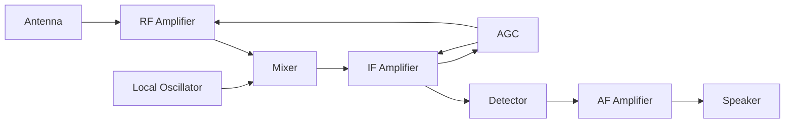
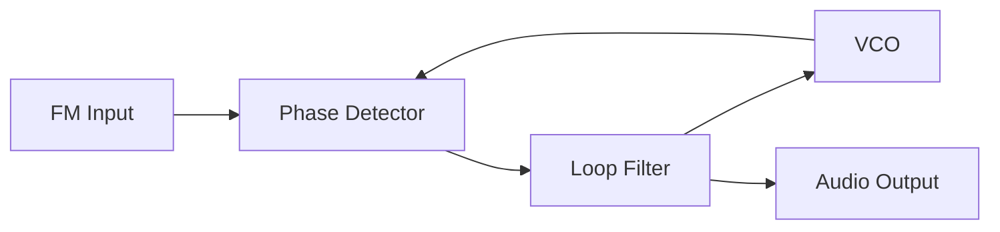
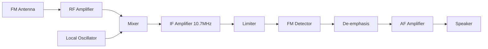
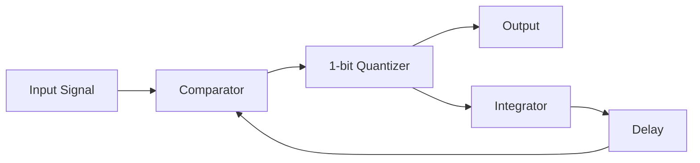
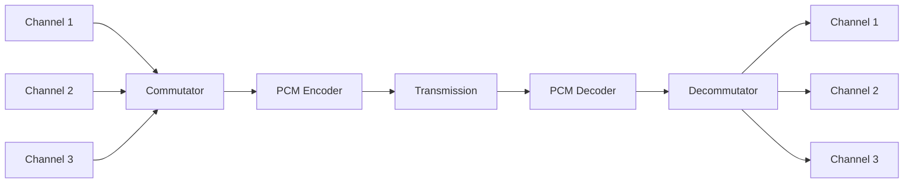
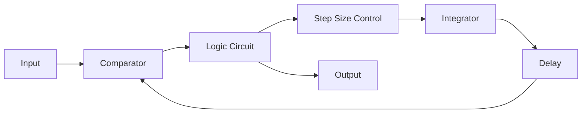
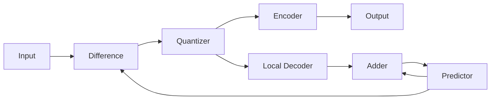
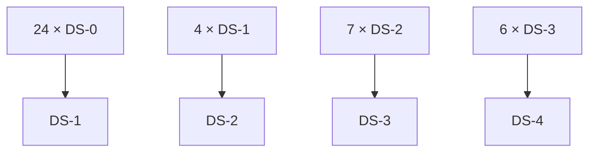

## Question 1(a) [3 marks]

**Compare Analog Signal and Digital Signal.**

**Answer**:

| Parameter | Analog Signal | Digital Signal |
|-----------|---------------|----------------|
| **Nature** | Continuous waveform | Discrete values (0 and 1) |
| **Amplitude** | Infinite variations | Fixed discrete levels |
| **Noise Effect** | More susceptible | Less susceptible |
| **Bandwidth** | Requires less bandwidth | Requires more bandwidth |
| **Security** | Less secure | More secure |

- **Signal Type**: Analog signals are continuous, Digital signals are discrete
- **Noise Resistance**: Digital signals have better noise immunity

**Mnemonic:** "ABCD - Analog Bad for noise, Continuous; Digital Discrete, Clean signals"

---

## Question 1(b) [4 marks]

**Compare PAM, PWM and PPM.**

**Answer**:

| Parameter | PAM | PWM | PPM |
|-----------|-----|-----|-----|
| **Full Form** | Pulse Amplitude Modulation | Pulse Width Modulation | Pulse Position Modulation |
| **Modulated Parameter** | Amplitude | Width/Duration | Position/Time |
| **Noise Immunity** | Poor | Good | Excellent |
| **Bandwidth** | Minimum | Medium | Maximum |
| **Power Consumption** | High | Medium | Low |

**Diagram:**

```goat
PAM: |▄▄|  |▄▄▄| |▄|     Amplitude varies
PWM: |▄| |▄▄▄| |▄▄|      Width varies  
PPM: |▄|  |▄| |▄|        Position varies
```

- **Modulation Parameter**: Each type modulates different pulse characteristics
- **Applications**: PWM used in motor control, PPM in radio control systems

**Mnemonic:** "PAM-Amplitude, PWM-Width, PPM-Position - AWP"

---

## Question 1(c) [7 marks]

**Indicate the need of Modulation in detail. Calculate the height of antenna if the frequency of Carrier signal is 1 MHz.**

**Answer**:

**Need for Modulation:**

| Reason | Explanation |
|--------|-------------|
| **Antenna Size Reduction** | Makes practical antenna sizes possible |
| **Frequency Translation** | Shifts signal to suitable frequency range |
| **Multiplexing** | Allows multiple signals on same medium |
| **Noise Reduction** | Improves signal-to-noise ratio |
| **Power Efficiency** | Better power utilization |

**Antenna Height Calculation:**
For efficient radiation, antenna height = λ/4

λ = c/f = (3 × 10⁸)/(1 × 10⁶) = 300 meters

**Antenna height** = λ/4 = 300/4 = **75 meters**

- **Practical Antenna**: Without modulation, antenna would be impractically large
- **Frequency Shifting**: Allows better propagation characteristics

**Mnemonic:** "AFMNP - Antenna, Frequency, Multiplexing, Noise, Power"

---

## Question 1(c) OR [7 marks]

**Write frequency bands with applications domains of EM Wave spectrum. Calculate Wavelength range of ELF band.**

**Answer**:

| Band | Frequency Range | Wavelength | Applications |
|------|----------------|------------|--------------|
| **ELF** | 30-300 Hz | 10⁶-10⁷ m | Submarine communication |
| **VLF** | 3-30 kHz | 10⁴-10⁵ m | Navigation, time signals |
| **LF** | 30-300 kHz | 10³-10⁴ m | AM broadcasting |
| **MF** | 300 kHz-3 MHz | 100-1000 m | AM radio |
| **HF** | 3-30 MHz | 10-100 m | Short wave radio |

**ELF Wavelength Calculation:**

- Lower frequency: f₁ = 30 Hz, λ₁ = c/f₁ = (3×10⁸)/30 = **10⁷ meters**
- Upper frequency: f₂ = 300 Hz, λ₂ = c/f₂ = (3×10⁸)/300 = **10⁶ meters**

**ELF Wavelength range: 10⁶ to 10⁷ meters**

- **Application Domain**: Each band suited for specific applications
- **Propagation**: Lower frequencies have better ground wave propagation

**Mnemonic:** "Every Valuable Learning Makes Happiness - ELF to HF bands"

---

## Question 2(a) [3 marks]

**Compare AM and FM.**

**Answer**:

| Parameter | AM | FM |
|-----------|----|----|
| **Modulated Parameter** | Amplitude | Frequency |
| **Bandwidth** | 2fm | 2(Δf + fm) |
| **Noise Immunity** | Poor | Good |
| **Power Efficiency** | Low (33.33%) | High |
| **Circuit Complexity** | Simple | Complex |

- **Bandwidth**: FM requires much wider bandwidth than AM
- **Quality**: FM provides better audio quality

**Mnemonic:** "AM-Amplitude simple, FM-Frequency complex but better quality"

---

## Question 2(b) [4 marks]

**Draw waveform of Amplitude Modulated wave.**

**Answer**:

**Diagram:**

```goat
Carrier Signal:     ∿∿∿∿∿∿∿∿∿∿∿∿∿∿∿
                    
Modulating Signal:  ∼    ∼    ∼    ∼

AM Wave:           .∿∿. .∿∿∿∿. .∿∿.
                  ∿    ∿      ∿    ∿
                      Envelope follows
                      modulating signal
```

**Characteristics:**

- **Envelope**: The envelope follows the modulating signal
- **Carrier Frequency**: Remains constant throughout
- **Amplitude Variation**: Amplitude varies with modulating signal

**Mnemonic:** "Envelope Follows Message - EFM"

---

## Question 2(c) [7 marks]

**Define Amplitude Modulation and Derive mathematical expression for Double Sideband Full Carrier (DSBFC) Amplitude Modulation (AM) signal.**

**Answer**:

**Definition:** Amplitude Modulation is the process where amplitude of carrier signal varies according to instantaneous amplitude of modulating signal.

**Mathematical Derivation:**

Let carrier signal: ec(t) = Ec cos(ωct)
Let modulating signal: em(t) = Em cos(ωmt)

**AM Signal Expression:**
eAM(t) = [Ec + Em cos(ωmt)] cos(ωct)
eAM(t) = Ec cos(ωct) + Em cos(ωmt) cos(ωct)

Using trigonometric identity:
cos A cos B = ½[cos(A+B) + cos(A-B)]

**Final AM Expression:**
eAM(t) = Ec cos(ωct) + (Em/2) cos(ωc + ωm)t + (Em/2) cos(ωc - ωm)t

**Components:**

- **Carrier Component**: Ec cos(ωct)
- **Upper Sideband**: (Em/2) cos(ωc + ωm)t  
- **Lower Sideband**: (Em/2) cos(ωc - ωm)t

**Mnemonic:** "Carrier Plus Upper Lower Sidebands - CPULS"

---

## Question 2(a) OR [3 marks]

**Compare Pre-emphasis and De-emphasis.**

**Answer**:

| Parameter | Pre-emphasis | De-emphasis |
|-----------|--------------|-------------|
| **Location** | At transmitter | At receiver |
| **Function** | Boosts high frequencies | Attenuates high frequencies |
| **Frequency Response** | High pass characteristic | Low pass characteristic |
| **Purpose** | Improve S/N ratio | Restore original signal |
| **Time Constant** | 75 μs (FM broadcasting) | 75 μs (FM broadcasting) |

- **Noise Reduction**: Combined effect reduces noise in received signal
- **Frequency Response**: Complementary characteristics

**Mnemonic:** "Pre-Boost, De-Cut - Noise Reduction Circuit"

---

## Question 2(b) OR [4 marks]

**Draw waveform of Frequency Modulated wave.**

**Answer**:

**Diagram:**

```goat
Modulating Signal:  ∼    ∼    ∼    ∼

Carrier Signal:     ∿∿∿∿∿∿∿∿∿∿∿∿∿∿

FM Wave:           ∿∿∿  ∿∿∿∿∿∿  ∿∿∿
                      Higher freq  Lower freq
                      when mod +ve when mod -ve
```

**Characteristics:**

- **Constant Amplitude**: Amplitude remains constant
- **Frequency Variation**: Frequency varies with modulating signal
- **Phase Continuity**: Phase remains continuous

**Mnemonic:** "Constant Amplitude, Variable Frequency - CAVF"

---

## Question 2(c) OR [7 marks]

**Define Frequency Modulation and Derive mathematical expression for FM wave.**

**Answer**:

**Definition:** Frequency Modulation is the process where frequency of carrier signal varies according to instantaneous amplitude of modulating signal.

**Mathematical Derivation:**

Let modulating signal: em(t) = Em cos(ωmt)
Instantaneous frequency: fi = fc + kf × Em cos(ωmt)

Where kf = frequency sensitivity

**Instantaneous angular frequency:**
ωi = 2π[fc + kf Em cos(ωmt)]
ωi = ωc + 2πkf Em cos(ωmt)

**Phase calculation:**
θ(t) = ∫ωi dt = ωct + (2πkf Em/ωm) sin(ωmt)

Let modulation index: mf = 2πkf Em/ωm = Δf/fm

**Final FM Expression:**
eFM(t) = Ec cos[ωct + mf sin(ωmt)]

**Parameters:**

- **Modulation Index**: mf = Δf/fm
- **Frequency Deviation**: Δf = kf Em
- **Bandwidth**: BW = 2(Δf + fm) (Carson's rule)

**Mnemonic:** "Frequency Varies with Message - FVM"

---

## Question 3(a) [3 marks]

**Illustrate Slope detection method of FM demodulation.**

**Answer**:

**Slope Detection Principle:**


**Working:**

- **Tuned Circuit**: Converts frequency variations to amplitude variations
- **Slope Operation**: Uses slope of resonance curve
- **Envelope Detection**: Extracts amplitude variations

**Characteristics:**

- **Simple Circuit**: Easy to implement
- **Linear Range**: Limited linear range
- **Output Distortion**: Higher distortion compared to other methods

**Mnemonic:** "Slope Converts Frequency to Amplitude - SCFA"

---

## Question 3(b) [4 marks]

**Explain different Characteristics of radio receiver.**

**Answer**:

| Characteristic | Definition | Importance |
|----------------|------------|------------|
| **Sensitivity** | Minimum input signal for satisfactory output | Better weak signal reception |
| **Selectivity** | Ability to select desired signal and reject others | Reduces interference |
| **Fidelity** | Faithfulness of reproduction | Better audio quality |
| **Image Frequency Rejection** | Rejection of image frequency | Prevents false signals |

**Mathematical Relations:**

- **Sensitivity**: Measured in μV for standard output
- **Selectivity**: Q = f₀/BW
- **Image Rejection Ratio**: IRR = 1 + (2πfIFRC)²

**Mnemonic:** "Sensitive Selective Faithful Image-free - SSFI"

---

## Question 3(c) [7 marks]

**Write short note on Super heterodyne receiver with suitable block diagram.**

**Answer**:

**Block Diagram:**



**Working Principle:**

- **RF Amplifier**: Amplifies received RF signal
- **Mixer**: Converts RF to fixed IF frequency
- **Local Oscillator**: Provides mixing frequency
- **IF Amplifier**: Main amplification at fixed frequency
- **Detector**: Recovers modulated signal
- **AGC**: Maintains constant output level

**Advantages:**

- **High Sensitivity**: Better sensitivity than TRF
- **Good Selectivity**: Better selectivity
- **Stable Gain**: Stable gain characteristics

**IF Frequency Selection:**
Standard IF: 455 kHz for AM, 10.7 MHz for FM

**Mnemonic:** "Mix RF to IF for Better Selectivity - MRIBS"

---

## Question 3(a) OR [3 marks]

**Illustrate working of FM demodulator using Phase Locked Loop.**

**Answer**:

**PLL FM Demodulator:**



**Working Principle:**

- **Phase Detector**: Compares input FM with VCO output
- **VCO**: Voltage Controlled Oscillator tracks input frequency  
- **Loop Filter**: Removes high frequency components
- **Lock Condition**: VCO frequency equals input frequency

**Advantages:**

- **Linear Demodulation**: Excellent linearity
- **Low Distortion**: Minimum distortion
- **Good Tracking**: Excellent frequency tracking

**Mnemonic:** "Phase Lock Tracks Frequency - PLTF"

---

## Question 3(b) OR [4 marks]

**Discuss Block diagram of basic FM receiver.**

**Answer**:

**FM Receiver Block Diagram:**



**Block Functions:**

- **RF Amplifier**: Amplifies weak FM signal (88-108 MHz)
- **Mixer**: Converts to IF frequency (10.7 MHz)
- **Limiter**: Removes amplitude variations
- **FM Detector**: Recovers audio signal
- **De-emphasis**: Restores original frequency response

**Key Differences from AM Receiver:**

- **Higher IF**: 10.7 MHz vs 455 kHz
- **Limiter Stage**: Additional limiter stage
- **De-emphasis**: Pre/de-emphasis network

**Mnemonic:** "FM needs Higher IF and Limiting - FHIL"

---

## Question 3(c) OR [7 marks]

**Write short note on Envelope detector using diode with suitable circuit diagram and waveform.**

**Answer**:

**Circuit Diagram:**

```goat
      D1
AM --|>|--+---- Audio Output
     |    |
     |    R
     |    |
     |    C
     |    |
    GND  GND
```

**Working Principle:**

```goat
AM Input:    .∿∿. .∿∿∿∿. .∿∿.
            ∿    ∿      ∿    ∿

Diode Output: ▄▄▄ ▄▄▄▄▄▄ ▄▄▄
(After filtering)

Audio Output: ∼    ∼    ∼    ∼
```

**Operation:**

- **Diode Conduction**: Conducts during positive half cycles
- **Capacitor Charging**: Charges to peak value
- **RC Discharge**: Discharges through RC circuit
- **Envelope Following**: Output follows envelope

**Design Considerations:**

- **Time Constant**: RC >> 1/fc but RC << 1/fm
- **Diode Selection**: Fast recovery diode preferred
- **Load Resistance**: Should be much larger than diode resistance

**Advantages:**

- **Simplicity**: Very simple circuit
- **Low Cost**: Economical solution
- **High Efficiency**: Good detection efficiency

**Mnemonic:** "Diode Charges, RC Follows Envelope - DCRF"

---

## Question 4(a) [3 marks]

**Illustrate under sampling, over sampling and critical sampling.**

**Answer**:

| Type | Condition | Result |
|------|-----------|--------|
| **Under Sampling** | fs < 2fm | Aliasing occurs |
| **Critical Sampling** | fs = 2fm | Just adequate, no margin |
| **Over Sampling** | fs > 2fm | No aliasing, safe margin |

**Diagram:**

```goat
Original Signal:     ∿∿∿∿∿∿∿

Under Sampling:      ∿ . . ∿     Aliasing
Critical Sampling:   ∿ . ∿ .     Just OK  
Over Sampling:       ∿.∿.∿.∿     Safe
```

- **Aliasing Effect**: Under sampling causes frequency overlap
- **Nyquist Rate**: Minimum sampling rate = 2fm
- **Practical Rate**: Usually 2.5 to 5 times message frequency

**Mnemonic:** "Under-Alias, Critical-Just, Over-Safe - UCO"

---

## Question 4(b) [4 marks]

**State Sampling theorem and define Nyquist rate, Nyquist interval and aliasing error.**

**Answer**:

**Sampling Theorem:** 
"A continuous signal can be completely recovered from its samples if sampling frequency is at least twice the highest frequency component of the signal."

**Definitions:**

| Term | Definition | Formula |
|------|------------|---------|
| **Nyquist Rate** | Minimum sampling frequency | fs = 2fm |
| **Nyquist Interval** | Maximum sampling interval | Ts = 1/(2fm) |
| **Aliasing Error** | Frequency overlap due to under sampling | fa = |fs - f| |

**Mathematical Expression:**

- **Sampling Frequency**: fs ≥ 2fm (Nyquist criterion)
- **Sampling Period**: Ts = 1/fs
- **Aliasing Condition**: fs < 2fm

**Practical Applications:**

- **Digital Audio**: fs = 44.1 kHz for fm = 20 kHz
- **Telephone System**: fs = 8 kHz for fm = 4 kHz

**Mnemonic:** "Sample at twice message frequency - S2M"

---

## Question 4(c) [7 marks]

**Discuss Ideal, Natural and Flat top sampling.**

**Answer**:

**Types of Sampling:**

| Type | Characteristics | Mathematical Expression |
|------|----------------|------------------------|
| **Ideal Sampling** | Impulse train multiplication | xs(t) = x(t)·δT(t) |
| **Natural Sampling** | Variable width pulses | Top follows signal |
| **Flat Top Sampling** | Constant amplitude pulses | Sample and hold |

**Waveforms:**

```goat
Original:    ∿∿∿∿∿∿∿∿∿∿∿∿

Ideal:       ↑ ↑ ↑ ↑ ↑ ↑     Impulses

Natural:     |∿| |∿| |∿|     Variable width

Flat Top:    |▄| |▄| |▄|     Constant width
```

**Frequency Spectrum:**

- **Ideal Sampling**: Exact spectral replication
- **Natural Sampling**: Slight spectral modification  
- **Flat Top Sampling**: Aperture effect present

**Practical Implementation:**

- **Ideal**: Theoretical only
- **Natural**: Used in PAM systems
- **Flat Top**: Sample-and-hold circuits, ADC systems

**Aperture Effect:** 
In flat-top sampling: |Sa(πfT/2)| = |sin(πfT/2)/(πfT/2)|

**Mnemonic:** "Ideal-Impulse, Natural-Variable, Flat-Constant - IVF"

---

## Question 4(a) OR [3 marks]

**Illustrate the working of Delta modulator with suitable block diagram.**

**Answer**:

**Delta Modulator Block Diagram:**



**Working Principle:**

- **Comparison**: Input compared with previous integrated output
- **1-bit Quantization**: Output is +Δ or -Δ
- **Integration**: Integrator approximates input signal
- **Feedback**: Previous output fed back for comparison

**Output Characteristics:**

- **Binary Output**: Only 1 bit per sample
- **Step Size**: Fixed step size Δ
- **Tracking**: Output tracks input in steps

**Mnemonic:** "Compare, Quantize, Integrate, Feedback - CQIF"

---

## Question 4(b) OR [4 marks]

**Write disadvantages of Delta modulation (DM) with suitable explanation.**

**Answer**:

**Major Disadvantages:**

| Disadvantage | Explanation | Solution |
|--------------|-------------|----------|
| **Slope Overload** | Cannot track fast changes | Increase step size |
| **Granular Noise** | Quantization noise in flat regions | Decrease step size |
| **High Bit Rate** | Requires high sampling rate | Use ADPCM |
| **Limited Dynamic Range** | Fixed step size limitation | Adaptive techniques |

**Slope Overload Condition:**
When |dx/dt| > Δfs, slope overload occurs

**Granular Noise:**
Occurs when input signal changes slowly or remains constant

**Waveforms:**

```goat
Slope Overload:    /∿∿∿    Input too fast
                  /▄▄▄     DM output lags

Granular Noise:   ____     Flat input
                  ▄▄▄▄     DM oscillates
```

**Performance Parameters:**

- **Slope Overload**: Maximum slope = Δfs
- **Granular Noise**: Depends on step size
- **SNR**: Limited by both effects

**Mnemonic:** "Slope-Overload, Granular-Noise, High-Bitrate - SOG-H"

---

## Question 4(c) OR [7 marks]

**Describe functions of each block of pulse code modulation (PCM) transmitter and receiver.**

**Answer**:

**PCM Transmitter Block Diagram:**


**PCM Receiver Block Diagram:**


**Transmitter Block Functions:**

| Block | Function |
|-------|----------|
| **LPF** | Anti-aliasing filter, removes frequencies > fm |
| **Sample & Hold** | Samples at fs ≥ 2fm and holds value |
| **Quantizer** | Converts to discrete amplitude levels |
| **Encoder** | Converts quantized samples to binary code |

**Receiver Block Functions:**

| Block | Function |
|-------|----------|
| **Decoder** | Converts binary code to quantized levels |
| **DAC** | Digital to Analog conversion |
| **LPF** | Reconstruction filter, removes sampling frequency |

**Technical Specifications:**

- **Quantization Levels**: L = 2ⁿ (n = number of bits)
- **Quantization Error**: Δ/2 maximum
- **Bit Rate**: fb = n × fs

**PCM Advantages:**

- **Noise Immunity**: Excellent noise performance
- **Regeneration**: Can be regenerated without error accumulation
- **Multiplexing**: Easy to multiplex multiple channels

**Mnemonic:** "Low-pass, Sample, Quantize, Encode - LSQE for TX; Decode, Convert, Filter - DCF for RX"

---

## Question 5(a) [3 marks]

**Discuss block diagram of TDM-PCM system in brief.**

**Answer**:

**TDM-PCM System Block Diagram:**



**System Operation:**

- **Commutator**: Sequential sampling of multiple channels
- **PCM Encoder**: Converts samples to digital format
- **Time Division**: Each channel gets fixed time slot
- **Decommutator**: Separates channels at receiver

**Frame Structure:**

- **Time Slot**: Each channel assigned specific time
- **Frame Period**: Complete cycle for all channels
- **Synchronization**: Frame synchronization bits added

**Advantages:**

- **Bandwidth Efficiency**: Efficient spectrum utilization
- **Multiple Channels**: Multiple channels on single link

**Mnemonic:** "Time Division Multiple Access - TDMA"

---

## Question 5(b) [4 marks]

**Write short note on Adaptive delta modulation (ADM).**

**Answer**:

**ADM Block Diagram:**



**Working Principle:**

- **Adaptive Step Size**: Step size changes based on input characteristics
- **Slope Overload Prevention**: Increases step size for fast changes
- **Granular Noise Reduction**: Decreases step size for slow changes
- **Logic Control**: Algorithm controls step size adaptation

**Step Size Control:**

- **Increase**: When consecutive bits are same (slope overload detected)
- **Decrease**: When alternate pattern occurs (granular region)

**Advantages over Standard DM:**

- **Better SNR**: Improved signal-to-noise ratio
- **Dynamic Range**: Better dynamic range
- **Automatic Adaptation**: Self-adjusting characteristics

**Mnemonic:** "Adaptive Step size Reduces both Slope-overload and Granular noise - ASRSG"

---

## Question 5(c) [7 marks]

**Define Line coding. Draw NRZ (unipolar), RZ (unipolar), Manchester coding waveforms for "1 0 1 1 1 0 1 1".**

**Answer**:

**Definition:** Line coding is the process of converting digital data into digital signals suitable for transmission over communication channels.

**Waveform Diagrams:**

```goat
Data:        1  0  1  1  1  0  1  1

NRZ Unipolar:
             ▄▄    ▄▄ ▄▄ ▄▄    ▄▄ ▄▄
                __          __

RZ Unipolar:
             ▄  ▄  ▄  ▄  ▄     ▄  ▄
             ▄▄▄▄▄▄▄▄▄▄▄▄▄▄▄▄▄▄▄▄▄▄▄

Manchester:
             ▄▄    ▄▄ ▄▄ ▄▄    ▄▄ ▄▄
                __  __ __ __ __
             Transition at middle of each bit
```

**Characteristics:**

| Coding Type | Logic 1 | Logic 0 | Bandwidth |
|-------------|---------|---------|-----------|
| **NRZ Unipolar** | +V | 0V | fb |
| **RZ Unipolar** | +V for T/2, 0V for T/2 | 0V | 2fb |
| **Manchester** | High-to-Low transition | Low-to-High transition | 2fb |

**Properties:**

- **NRZ**: No return to zero, simple but no self-synchronization
- **RZ**: Return to zero, easy clock recovery but double bandwidth
- **Manchester**: Self-synchronizing, used in Ethernet

**Applications:**

- **NRZ**: Simple digital systems
- **RZ**: Magnetic recording
- **Manchester**: Ethernet, some wireless standards

**Mnemonic:** "NRZ-Simple, RZ-Return, Manchester-Transition - SRT"

---

## Question 5(a) OR [3 marks]

**Describe concept of Time division digital multiplexing.**

**Answer**:

**TDM Concept:**
Time Division Multiplexing is a technique where multiple digital signals are transmitted over a single channel by allocating different time slots to each signal.

**TDM Frame Structure:**

```goat
Frame: |CH1|CH2|CH3|CH4|SYNC|CH1|CH2|CH3|CH4|SYNC|
       ←――――― Frame Period ―――――→
```

**Working Principle:**

| Component | Function |
|-----------|----------|
| **Time Slots** | Fixed duration allocated to each channel |
| **Frame** | Complete cycle containing all channels |
| **Synchronization** | Maintains proper channel separation |
| **Multiplexer** | Combines multiple inputs sequentially |

**Key Features:**

- **Fixed Time Slot**: Each channel gets predetermined time
- **Sequential Sampling**: Channels sampled one after another  
- **Digital Transmission**: Suitable for digital signals
- **Bandwidth Sharing**: Efficient spectrum utilization

**Applications:**

- **Telephone System**: T1, E1 systems
- **Digital Hierarchy**: PDH, SDH systems

**Mnemonic:** "Time slots Share Single Channel - TSSC"

---

## Question 5(b) OR [4 marks]

**Write short note on Differential PCM (DPCM).**

**Answer**:

**DPCM Block Diagram:**



**Working Principle:**

- **Prediction**: Predicts current sample from previous samples
- **Difference Signal**: Transmits difference between actual and predicted
- **Quantization**: Quantizes difference signal only
- **Local Decoder**: Maintains same reference as receiver

**Prediction Algorithms:**

| Type | Formula | Application |
|------|---------|-------------|
| **Zero Order** | x̂(n) = x(n-1) | Simple predictor |
| **First Order** | x̂(n) = ax(n-1) | Better prediction |
| **Higher Order** | x̂(n) = Σai×x(n-i) | Optimum prediction |

**Advantages:**

- **Reduced Bit Rate**: Lower bit rate than PCM
- **Better SNR**: Better SNR for same bit rate
- **Predictive Coding**: Exploits signal correlation

**Applications:**

- **Image Compression**: JPEG standards
- **Video Coding**: Motion compensation
- **Speech Coding**: Speech compression systems

**Comparison with PCM:**

- **Bit Rate**: DPCM requires fewer bits
- **Complexity**: More complex than PCM
- **Quality**: Better quality at same bit rate

**Mnemonic:** "Predict Difference, Quantize Less - PDQL"

---

## Question 5(c) OR [7 marks]

**Write short note on 4 level digital multiplexing Hierarchy.**

**Answer**:

**Digital Multiplexing Hierarchy:**

**Level Structure:**

| Level | Name | Bit Rate | Voice Channels | Application |
|-------|------|----------|---------------|-------------|
| **Level 0** | DS-0 | 64 kbps | 1 | Basic voice channel |
| **Level 1** | DS-1/T1 | 1.544 Mbps | 24 | Primary multiplex |
| **Level 2** | DS-2/T2 | 6.312 Mbps | 96 | Secondary multiplex |
| **Level 3** | DS-3/T3 | 44.736 Mbps | 672 | Tertiary multiplex |

**Multiplexing Structure:**



**Frame Structure for T1:**

- **Frame Length**: 193 bits (192 data + 1 framing)
- **Frame Rate**: 8000 frames/second
- **Time Slot**: 8 bits per channel
- **Framing Bit**: Synchronization pattern

**T1 Frame Format:**

```goat
|F|CH1|CH2|...|CH24|F|CH1|CH2|...|CH24|
 ↑              ↑
Framing       193 bits total
```

**Multiplexing Process:**

- **Level 1**: 24 voice channels × 64 kbps + overhead = 1.544 Mbps
- **Level 2**: 4 T1 streams + overhead = 6.312 Mbps
- **Level 3**: 7 T2 streams + overhead = 44.736 Mbps
- **Synchronization**: Each level adds synchronization bits

**Applications:**

- **Telephone Network**: Primary application in telephone systems
- **Data Communication**: High-speed data transmission
- **Internet Backbone**: Internet service provider connections

**International Standards:**

- **North American**: T1/T3 hierarchy (DS series)
- **European**: E1/E3 hierarchy (different bit rates)
- **ITU-T**: International recommendations

**Advantages:**

- **Standardization**: Well-defined international standards
- **Scalability**: Easy to scale up capacity
- **Interoperability**: Compatible across different vendors

**Mnemonic:** "Digital Signal hierarchy: 0-1-2-3 levels Build Communication Systems - DS-BCS"
