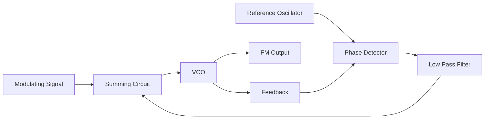
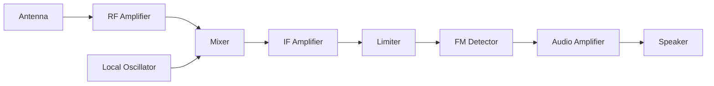
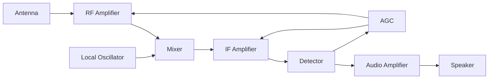
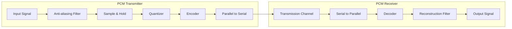
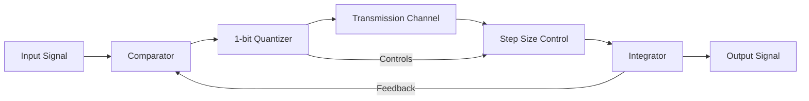
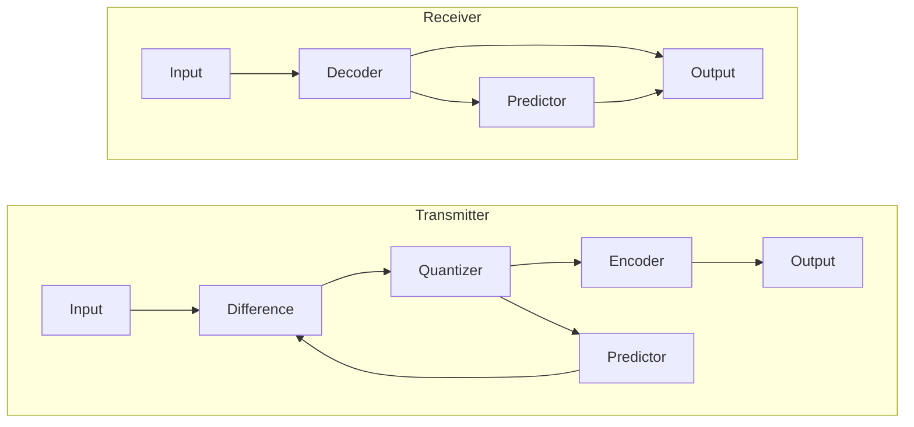
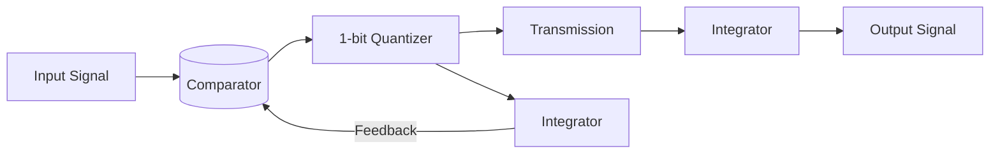
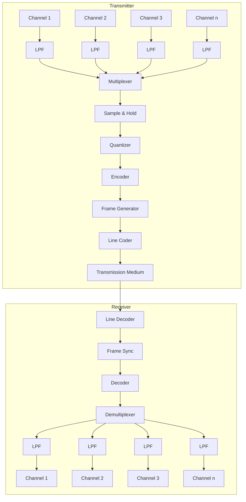

## પ્રશ્ન 1(a) [3 ગુણ]

**મોડયુલેશન શું છે? તેની જરૂરિયાત શું છે?**

**જવાબ**:
મોડયુલેશન એ એક ઉચ્ચ આવૃત્તિવાળા કેરિયર સિગ્નલના એક અથવા વધુ ગુણધર્મો (amplitude, frequency, અથવા phase) ને માહિતી ધરાવતા સિગ્નલ સાથે બદલવાની પ્રક્રિયા છે.

**મોડયુલેશનની જરૂરિયાત:**

- **એન્ટેના સાઇઝ ઘટાડવા**: વ્યવહારિક એન્ટેના સાઇઝ શક્ય બનાવે છે (λ = c/f)
- **મલ્ટિપ્લેક્સિંગ**: અનેક સિગ્નલ્સને એક માધ્યમમાં મોકલવા માટે
- **નોઇઝ ઘટાડવા**: ઉચ્ચ આવૃત્તિ બેન્ડમાં શિફ્ટ કરીને SNR સુધારે છે
- **રેન્જ વધારવા**: ટ્રાન્સમિશન અંતર વધારે છે

**મેમરી ટ્રીક:** "AMEN" - Antenna size, Multiplexing, Eliminate noise, New range

## પ્રશ્ન 1(b) [4 ગુણ]

**એમ્પલીટયૂડ મોડયુલેશન માટે વૉલ્ટેજ સમીકરણ મેળવો.**

**જવાબ**:
AM માં, કેરિયર સિગ્નલ મેસેજ સિગ્નલ દ્વારા મોડ્યુલેટેડ થાય છે.

**ગાણિતિક સ્થાપના:**

- **કેરિયર સિગ્નલ**: $e_c(t) = A_c \cos(2\pi f_c t)$
- **મેસેજ સિગ્નલ**: $e_m(t) = A_m \cos(2\pi f_m t)$
- **ઇન્સ્ટન્ટનીયસ એમ્પ્લિટ્યુડ**: $A_i = A_c + e_m(t)$
- **AM સિગ્નલ**: $e_{AM}(t) = A_i \cos(2\pi f_c t)$
- **સબ્સ્ટિટ્યુશન**: $e_{AM}(t) = [A_c + A_m \cos(2\pi f_m t)] \cos(2\pi f_c t)$
- **એક્સ્પેન્ડિંગ**: $e_{AM}(t) = A_c\cos(2\pi f_c t) + A_m\cos(2\pi f_m t)\cos(2\pi f_c t)$
- **ફાઇનલ ઇક્વેશન**: $e_{AM}(t) = A_c\cos(2\pi f_c t) + \frac{A_m}{2}\cos(2\pi(f_c+f_m)t) + \frac{A_m}{2}\cos(2\pi(f_c-f_m)t)$

**મેમરી ટ્રીક:** "CAT" - Carrier, Addition, Three components (carrier + 2 sidebands)

## પ્રશ્ન 1(c) [7 ગુણ]

**નોઈસ સિગ્નલને વર્ગીકૃત કરો ફ્લીકર નોઈસ, શૉટ નોઈસ અને થર્મલ નોઈસ સમજાવો.**

**જવાબ**:

**નોઇઝ વર્ગીકરણ:**

| પ્રકાર | સ્ત્રોત | લક્ષણો |
|------|---------|-----------------|
| **બાહ્ય નોઇઝ** | એટમોસ્ફેરિક, સ્પેસ, ઔદ્યોગિક, માનવ-નિર્મિત | કોમ્યુનિકેશન સિસ્ટમની બહારથી ઉત્પન્ન થાય છે |
| **આંતરિક નોઇઝ** | થર્મલ, શોટ, ટ્રાન્ઝિટ-ટાઇમ, ફ્લિકર | કોમ્પોનેન્ટ્સની અંદરથી ઉત્પન્ન થાય છે |

**આંતરિક નોઈઝના પ્રકાર:**

- **ફ્લિકર નોઈઝ**:
  - નીચી આવૃત્તિઓ પર થાય છે (1 kHz નીચે)
  - આવૃત્તિના વ્યસ્ત પ્રમાણમાં (1/f નોઇઝ)
  - સેમિકન્ડક્ટર ડિવાઇસ અને કાર્બન રેસિસ્ટર્સમાં સામાન્ય છે
  
- **શોટ નોઈઝ**:
  - કરંટ કેરિયર્સના રેન્ડમ ફ્લક્ચુએશન્સને કારણે
  - અચલ પાવર ડેન્સિટી સાથે વ્હાઇટ નોઇઝ
  - ડાયોડ અને ટ્રાન્ઝિસ્ટર જેવી એક્ટિવ ડિવાઇસમાં થાય છે
  
- **થર્મલ નોઈઝ**:
  - કન્ડક્ટરમાં ઇલેક્ટ્રોન્સની રેન્ડમ ગતિને કારણે
  - તાપમાન અને બેન્ડવિડ્થના સીધા પ્રમાણમાં
  - બધા પેસિવ કોમ્પોનેન્ટ્સમાં હાજર
  - જોનસન નોઇઝ અથવા વ્હાઇટ નોઇઝ તરીકે પણ ઓળખાય છે

**મેમરી ટ્રીક:** "FAST" - Flicker (low frequency), Active (shot), Semiconductor (flicker), Temperature (thermal)

## પ્રશ્ન 1(c) OR [7 ગુણ]

**EM wave spectrum ના વિવિધ બેન્ડની એપ્લિકેશન લખો.**

**જવાબ**:

**EM સ્પેક્ટ્રમ એપ્લિકેશન્સ:**

| ફ્રીક્વન્સી બેન્ડ | ફ્રીક્વન્સી રેન્જ | એપ્લિકેશન્સ |
|----------------|----------------|--------------|
| **ELF** (Extremely Low Frequency) | 3Hz - 30Hz | સબમરીન કોમ્યુનિકેશન |
| **VLF** (Very Low Frequency) | 3kHz - 30kHz | નેવિગેશન, ટાઇમ સિગ્નલ્સ |
| **LF** (Low Frequency) | 30kHz - 300kHz | AM રેડિયો, નેવિગેશન |
| **MF** (Medium Frequency) | 300kHz - 3MHz | AM બ્રોડકાસ્ટિંગ, મેરિટાઇમ |
| **HF** (High Frequency) | 3MHz - 30MHz | શોર્ટવેવ રેડિયો, એમેચ્યોર રેડિયો |
| **VHF** (Very High Frequency) | 30MHz - 300MHz | FM રેડિયો, TV બ્રોડકાસ્ટિંગ, એર ટ્રાફિક કંટ્રોલ |
| **UHF** (Ultra High Frequency) | 300MHz - 3GHz | TV બ્રોડકાસ્ટિંગ, મોબાઇલ ફોન, WiFi, બ્લૂટૂથ |
| **SHF** (Super High Frequency) | 3GHz - 30GHz | સેટેલાઇટ કોમ્યુનિકેશન, રડાર, WiFi |
| **EHF** (Extremely High Frequency) | 30GHz - 300GHz | રેડિયો એસ્ટ્રોનોમી, 5G, મિલિમીટર-વેવ રડાર |
| **Infrared** | 300GHz - 400THz | રિમોટ કંટ્રોલ, થર્મલ ઇમેજિંગ, ફાઇબર ઓપ્ટિક્સ |
| **Visible Light** | 400THz - 800THz | ફાઇબર ઓપ્ટિક્સ, LiFi, ફોટોગ્રાફી |
| **Ultraviolet** | 800THz - 30PHz | સ્ટેરિલાઇઝેશન, ફ્લોરેસન્સ, સિક્યુરિટી |
| **X-rays** | 30PHz - 30EHz | મેડિકલ ઇમેજિંગ, સિક્યુરિટી સ્ક્રીનિંગ |
| **Gamma rays** | >30EHz | મેડિકલ ટ્રીટમેન્ટ, ન્યુક્લિયર ડિટેક્શન |

**મેમરી ટ્રીક:** "Every Very Lovely Monkey Has Visited Uncle Sam's House Easily In Visible Upper Xtra Gamma" (દરેક બેન્ડનો પ્રથમ અક્ષર)

## પ્રશ્ન 2(a) [3 ગુણ]

**DSBની સરખામણીએ SSBના ફાયદાઓ લખો.**

**જવાબ**:

**SSBના DSB પર ફાયદાઓ:**

| ફાયદો | વર્ણન |
|-----------|-------------|
| **બેન્ડવિથ એફિશિયન્સી** | અડધી બેન્ડવિથનો ઉપયોગ (માત્ર એક સાઇડબેન્ડ) |
| **પાવર એફિશિયન્સી** | ઓછી ટ્રાન્સમિટર પાવરની જરૂર (83.33% પાવર સેવિંગ) |
| **ઘટાડેલું ફેડિંગ** | સિલેક્ટિવ ફેડિંગને ઓછું સંવેદનશીલ |
| **ઓછું ડિસ્ટોરશન** | ઇન્ટરમોડ્યુલેશન ડિસ્ટોર્શન ઘટાડે છે |
| **સરળ રિસીવર** | સરળ સર્કિટ ડિઝાઇન શક્ય |

**મેમરી ટ્રીક:** "BPFDS" - Bandwidth, Power, Fading, Distortion, Simple

## પ્રશ્ન 2(b) [4 ગુણ]

**ફેસ લોક લુપ ટેક્નીકથી FMનું જનરેશન સમજાવો.**

**જવાબ**:

**PLL દ્વારા FM જનરેશન:**

PLL (Phase-Locked Loop) VCO કંટ્રોલ ઇનપુટ પર મોડ્યુલેટિંગ સિગ્નલ લાગુ કરીને FM સિગ્નલ્સ ઉત્પન્ન કરે છે.

**PLL FM મોડ્યુલેટર:**



**ઓપરેશન:**

- **રેફરન્સ ઓસીલેટર**: સ્થિર રેફરન્સ ફ્રીક્વન્સી પ્રદાન કરે છે
- **ફેઝ ડિટેક્ટર**: રેફરન્સ અને ફીડબેક સિગ્નલોની તુલના કરે છે
- **લો પાસ ફિલ્ટર**: ઉચ્ચ-ફ્રીકવન્સી ઘટકોને દૂર કરે છે
- **VCO**: કંટ્રોલ વોલ્ટેજ સાથે બદલાતી આઉટપુટ ફ્રીક્વન્સી જનરેટ કરે છે
- **મોડ્યુલેટિંગ સિગ્નલ**: FM આઉટપુટ ઉત્પન્ન કરવા માટે કંટ્રોલ વોલ્ટેજમાં ઉમેરાય છે

**મેમરી ટ્રીક:** "PROVE" - Phase detector, Reference oscillator, Output VCO, Voltage controlled

## પ્રશ્ન 2(c) [7 ગુણ]

**AM માટે ટોટલ પાવરનું સમીકરણ તારવો. DSB અને SSB માટે પાવર સેવિંગના ટકાની ગણતરી કરો.**

**જવાબ**:

**AM માં પાવર:**

AM વેવ ઇક્વેશન: $e_{AM}(t) = A_c[1 + m\cos(2\pi f_m t)]\cos(2\pi f_c t)$

**પાવર ડેરીવેશન:**

- **કુલ પાવર**: $P_T = P_c\left(1 + \frac{m^2}{2}\right)$
- જ્યાં $P_c = \frac{A_c^2}{2R}$ (કેરિયર પાવર) અને $m$ મોડ્યુલેશન ઇન્ડેક્સ છે

**પાવર ડિસ્ટ્રિબ્યુશન:**

- **કેરિયર પાવર**: $P_c = \frac{A_c^2}{2R}$
- **કુલ સાઇડબેન્ડ પાવર**: $P_{SB} = \frac{m^2 P_c}{2}$
- **દરેક સાઇડબેન્ડ**: $P_{LSB} = P_{USB} = \frac{m^2 P_c}{4}$

**પાવર સેવિંગ્સ:**

- **DSB-SC માં**: કેરિયર પાવર નથી, એટલે સેવિંગ્સ = $\frac{P_c}{P_T} \times 100\% = \frac{1}{1+\frac{m^2}{2}} \times 100\%$
  - m=1 માટે, સેવિંગ્સ = 66.67%
- **SSB માં**: કેરિયર અને એક સાઇડબેન્ડ નથી, એટલે સેવિંગ્સ = $\frac{P_c + P_{SB}/2}{P_T} \times 100\%$
  - m=1 માટે, સેવિંગ્સ = 83.33%

**મેમરી ટ્રીક:** "CEPTS" - Carrier Eliminated Provides Tremendous Savings

## પ્રશ્ન 2(a) OR [3 ગુણ]

**AM વેવ માટે Time domain અને Frequency domain ડિસ્પ્લે દોરો અને સમજાવો.**

**જવાબ**:

**AM ના Time અને Frequency Domain:**

**આકૃતિ:**

```goat
Time Domain:
    
     +          +           +           +
     |          |           |           |
     |    ++    |     ++    |    ++     |
     |   /  \   |    /  \   |   /  \    |
     |  /    \  |   /    \  |  /    \   |
     | /      \ |  /      \ | /      \  |
     |/        \|/        \|/        \| |
-----+----------+-----------+----------+-----
     |\        /|\        /|\        /| |
     | \      / | \      / | \      /  |
     |  \    /  |  \    /  |  \    /   |
     |   \__/   |   \__/   |   \__/    |
     |          |           |           |
     +          +           +           +

Frequency Domain:
    
     |
     |          
     |     +           +           +
     |     |           |           |
     |     |           |           |
     |     |           |           |
     |     |           |           |
-----+-----+-----+-----+-----+-----+-----
     |   f_c-f_m     f_c    f_c+f_m
```

**ટાઇમ ડોમેન:**

- સમય સાથે કેરિયરના એમ્પલિટ્યુડ વેરિએશન બતાવે છે
- એન્વેલોપ મોડ્યુલેટિંગ સિગ્નલને અનુસરે છે
- ઉપર અને નીચેના એન્વેલોપ = કેરિયર પીક × (1±m)

**ફ્રિક્વન્સી ડોમેન:**

- ફ્રિક્વન્સી કોમ્પોનન્ટ્સ અને તેમના એમ્પ્લિટ્યુડ બતાવે છે
- fc ફ્રિક્વન્સી પર Ac એમ્પ્લિટ્યુડ સાથે કેરિયર
- fc±fm પર mAc/2 એમ્પ્લિટ્યુડ સાથે બે સાઇડબેન્ડસ
- બેન્ડવિડ્થ = 2fm (મોડ્યુલેટિંગ ફ્રિક્વન્સીનો બમણો)

**મેમરી ટ્રીક:** "EBS" - Envelope in time, Bandwidth in frequency, Sidebands symmetric

## પ્રશ્ન 2(b) OR [4 ગુણ]

**પ્રી-એમફાસીસ અને ડી એમફાસીસ સર્કીટ સમજાવો.**

**જવાબ**:

**પ્રી-એમફાસીસ અને ડી-એમફાસીસ:**

**સર્કિટ ડાયાગ્રામ્સ:**

```goat
Pre-emphasis:                   De-emphasis:
    
+--+     +--+                 +--+     +--+
|  |     |  |                 |  |     |  |
+--+     R  |                 +--+     R  |
Input    |  +--+--+  Output   Input    |  +--+--+  Output
o--------+  |  |  o--------   o--------+  |  |  o--------
            C  |                          C  |
            |  |                          |  |
            +--+                          +--+
              |                             |
            -----                         -----
             ---                           ---
              -                             -
```

**હેતુ:**

- **પ્રી-એમફાસીસ**: ટ્રાન્સમીટર પર ઉચ્ચ-ફ્રીક્વન્સી ઘટકોને વધારે છે
- **ડી-એમફાસીસ**: રિસીવર પર ઉચ્ચ-ફ્રીક્વન્સી ઘટકોને ઘટાડે છે

**ઓપરેશન:**

- **પ્રી-એમફાસીસ**: હાઇ-પાસ RC સર્કિટ (R સીરીઝ, C પેરેલલ)
- **ડી-એમફાસીસ**: લો-પાસ RC સર્કિટ (R પેરેલલ, C સીરીઝ)
- ટાઇમ કોન્સ્ટન્ટ સરખા છે: τ = RC = 75μs (સ્ટાન્ડર્ડ)

**લાભો:**

- FM માં ઉચ્ચ ફ્રીક્વન્સી માટે SNR સુધારે છે
- ઉચ્ચ ફ્રીક્વન્સી પર વધુ નોઇઝ પાવરની ભરપાઈ કરે છે
- રિસીવર પર મૂળ ફ્રીક્વન્સી પ્રતિસાદ પુનઃસ્થાપિત કરે છે

**મેમરી ટ્રીક:** "BETH" - Boost (pre-emphasis), Emphasizes Treble, Helps SNR

## પ્રશ્ન 2(c) OR [7 ગુણ]

**AM, FM અને PMને સરખાવો.**

**જવાબ**:

**AM, FM અને PM ની તુલના:**

| પેરામીટર | AM | FM | PM |
|-----------|------|------|------|
| **વ્યાખ્યા** | મેસેજ સિગ્નલ સાથે એમ્પ્લિટ્યુડ બદલાય છે | મેસેજ સિગ્નલ સાથે ફ્રીક્વન્સી બદલાય છે | મેસેજ સિગ્નલ સાથે ફેઝ બદલાય છે |
| **ગાણિતિક અભિવ્યક્તિ** | $A_c[1+m\cos(ω_mt)]\cos(ω_ct)$ | $A_c\cos[ω_ct+mf\sin(ω_mt)]$ | $A_c\cos[ω_ct+mp\cos(ω_mt)]$ |
| **બેન્ડવિડ્થ** | 2fm (સાંકડી) | 2(Δf+fm) (વિશાળ) | 2(mp+1)fm (વિશાળ) |
| **પાવર દક્ષતા** | ઓછી (કેરિયરમાં માહિતી નથી) | ઉચ્ચ (સ્થિર એમ્પ્લિટ્યુડ) | ઉચ્ચ (સ્થિર એમ્પ્લિટ્યુડ) |
| **નોઇઝ ઇમ્યુનિટી** | નબળી | ઉત્તમ | ઉત્તમ |
| **સર્કિટ જટિલતા** | સરળ | જટિલ | જટિલ |
| **એપ્લિકેશન્સ** | AM બ્રોડકાસ્ટિંગ, એરક્રાફ્ટ કોમ્યુનિકેશન | FM બ્રોડકાસ્ટિંગ, TV સાઉન્ડ, મોબાઇલ રેડિયો | સેટેલાઇટ કોમ્યુનિકેશન, ટેલીમેટ્રી |
| **મોડ્યુલેશન ઇન્ડેક્સ** | m = Am/Ac (0 થી 1) | mf = Δf/fm (કોઈ મર્યાદા નથી) | mp = Δφ/fm (કોઈ મર્યાદા નથી) |

**મેમરી ટ્રીક:** "BANCP-MAP" - Bandwidth, Amplitude, Noise, Complexity, Power, Modulation, Applications, Parameters

## પ્રશ્ન 3(a) [3 ગુણ]

**રેડીઓ રીસીવર ની કોઈ ચાર લાક્ષણીકતા ઓ વ્યાખ્યાઈત કરો.**

**જવાબ**:

**રેડિયો રિસીવર લક્ષણો:**

| લાક્ષણિકતા | વ્યાખ્યા |
|----------------|------------|
| **સેન્સિટિવિટી** | સ્વીકાર્ય આઉટપુટ માટે જરૂરી લઘુતમ સિગ્નલ શક્તિ |
| **સિલેક્ટિવિટી** | આજુબાજુના સિગ્નલથી ઇચ્છિત સિગ્નલને અલગ કરવાની ક્ષમતા |
| **ફિડેલિટી** | ડિસ્ટોર્શન વિના મૂળ સિગ્નલને પુનઃઉત્પન્ન કરવામાં ચોકસાઈ |
| **ઇમેજ રિજેક્શન** | ઇમેજ ફ્રીક્વન્સી ઇન્ટરફેરન્સને નકારવાની ક્ષમતા |
| **સિગ્નલ-ટુ-નોઇઝ રેશિયો** | ઇચ્છિત સિગ્નલ અને અનિચ્છનીય નોઇઝનો ગુણોત્તર |
| **સ્ટેબિલિટી** | ટ્યુન કરેલી ફ્રીક્વન્સીને ડ્રિફ્ટ કર્યા વિના જાળવી રાખવાની ક્ષમતા |

**મેમરી ટ્રીક:** "SFIS-SS" - Sensitivity, Fidelity, Image rejection, Selectivity, SNR, Stability

## પ્રશ્ન 3(b) [4 ગુણ]

**FM રીસીવરનો બ્લોક ડાયગ્રામ દોરો. FM રીસીવરમા લીમીટરનું કાર્ય શું છે?**

**જવાબ**:

**FM રિસીવર બ્લોક ડાયાગ્રામ:**



**FM રિસીવરમાં લિમિટરનો ઉપયોગ:**

- **મુખ્ય કાર્ય**: એમ્પ્લિટ્યુડ વેરિએશન/નોઇઝ દૂર કરે છે
- **ઓપરેશન**: સિગ્નલને ક્લિપ કરીને સ્થિર એમ્પ્લિટ્યુડ પ્રદાન કરે છે
- **લાભો**:
  - AM ઇન્ટરફેરન્સ દૂર કરે છે
  - SNR સુધારે છે
  - યોગ્ય FM ડિટેક્શન સુનિશ્ચિત કરે છે
  - ખોટા ફ્રીક્વન્સી ડિમોડ્યુલેશનને રોકે છે
- **સ્થાન**: IF એમ્પ્લિફાયર અને FM ડિટેક્ટર વચ્ચે મૂકવામાં આવે છે

**મેમરી ટ્રીક:** "CARE" - Clips Amplitude, Removes noise, Ensures constant signal

## પ્રશ્ન 3(c) [7 ગુણ]

**સુપર હેટેરોડાઈન રીસીવરનો બ્લોક ડાયગ્રામ દોરો અને સમજાવો.**

**જવાબ**:

**સુપર હેટેરોડાઈન રિસીવર:**



**દરેક બ્લોકનું કાર્ય:**

- **એન્ટેના**: ઇલેક્ટ્રોમેગ્નેટિક તરંગોમાંથી RF સિગ્નલ્સ કેપ્ચર કરે છે
- **RF એમ્પ્લિફાયર**: નબળા સિગ્નલ્સને એમ્પ્લિફાય કરે છે, સિલેક્ટિવિટી પ્રદાન કરે છે
- **લોકલ ઓસિલેટર**: આવતા RF સાથે મિક્સ કરવા માટે સિગ્નલ ઉત્પન્ન કરે છે
- **મિક્સર**: RF ને લોકલ ઓસિલેટર સાથે હેટરોડાઇનિંગ કરીને IF ઉત્પન્ન કરે છે
- **IF એમ્પ્લિફાયર**: ફિક્સ્ડ ફ્રીક્વન્સી પર મુખ્ય એમ્પ્લિફિકેશન અને સિલેક્ટિવિટી
- **ડિટેક્ટર**: મોડ્યુલેટેડ IF સિગ્નલમાંથી ઓડિયો એક્સટ્રેક્ટ કરે છે
- **ઓડિયો એમ્પ્લિફાયર**: સ્પીકર ચલાવવા માટે ઓડિયો સિગ્નલને એમ્પ્લિફાય કરે છે
- **AGC (ઓટોમેટિક ગેઇન કંટ્રોલ)**: સતત આઉટપુટ લેવલ જાળવે છે
- **સ્પીકર**: ઇલેક્ટ્રિકલ સિગ્નલને સાઉન્ડમાં રૂપાંતરિત કરે છે

**સુપર હેટેરોડાઇન સિદ્ધાંત:**

- ઉચ્ચ-ફ્રીક્વન્સી RF ને વધુ સારા એમ્પ્લિફિકેશન માટે ફિક્સ્ડ IF માં રૂપાંતરિત કરે છે
- IF = |RF ± LO| (સામાન્ય રીતે AM માટે 455 kHz, FM માટે 10.7 MHz)

**મેમરી ટ્રીક:** "ARLMIDAS" - Antenna Receives, Local Mixes, IF Delivers, Audio Sounds

## પ્રશ્ન 3(a) OR [3 ગુણ]

**એનવેલોપ ડીટેક્ટરનો બ્લોક ડાયગ્રામ દોરો અને સમજાવો.**

**જવાબ**:

**એનવેલોપ ડિટેક્ટર:**

**સર્કિટ ડાયાગ્રામ:**

```goat
          D
    +--->|---+---+
    |         |   |
AM  |         |   |     Audio
Input o       C   R    Output
    |         |   |      o
    |         |   |      |
    +---------+---+------+
              |
             ---
              -
```

**કોમ્પોનન્ટ ફંક્શન્સ:**

- **ડાયોડ (D)**: AM સિગ્નલને રેક્ટિફાય કરે છે (માત્ર પોઝિટિવ હાફ-સાયકલ્સની મંજૂરી આપે છે)
- **કેપેસિટર (C)**: ઇનપુટના પીક સુધી ચાર્જ થાય છે, કેરિયર ફ્રીક્વન્સીને ફિલ્ટર કરે છે
- **રેસિસ્ટર (R)**: કેપેસિટરને ડિસ્ચાર્જ કરે છે, મોડ્યુલેટિંગ સિગ્નલ એનવેલોપને અનુસરે છે

**ઓપરેશન:**

1. ડાયોડ પોઝિટિવ હાફ-સાયકલ્સ દરમિયાન કન્ડક્ટ કરે છે
2. કેપેસિટર પીક વોલ્ટેજ સુધી ચાર્જ થાય છે
3. નેગેટિવ હાફ-સાયકલ્સ દરમિયાન, ડાયોડ બ્લોક કરે છે
4. કેપેસિટર રેસિસ્ટર દ્વારા ડિસ્ચાર્જ થાય છે
5. RC ટાઇમ કોન્સ્ટન્ટ એનવેલોપ વેરિએશન્સને અનુસરે છે

**RC સિલેક્શન ક્રાઇટેરિયા**: $\frac{1}{f_c} << RC << \frac{1}{f_m}$

**મેમરી ટ્રીક:** "DRIVER" - Diode Rectifies, RC Values Extract Envelope, Restores audio

## પ્રશ્ન 3(b) OR [4 ગુણ]

**IF શું છે? તેનો અગત્યતા સમજાવો.**

**જવાબ**:

**ઇન્ટરમીડિએટ ફ્રીક્વન્સી (IF):**

**વ્યાખ્યા:**
IF એ એક ફિક્સ્ડ ફ્રીક્વન્સી છે જેમાં આવતા RF સિગ્નલ્સ સુપરહેટેરોડાઇન રિસીવર્સમાં રૂપાંતરિત થાય છે.

**IF ની અગત્યતા:**

| પાસું | અગત્યતા |
|--------|------------|
| **ફિક્સ્ડ ફ્રીક્વન્સી** | એક ફ્રીક્વન્સી પર ઑપ્ટિમાઇઝ્ડ એમ્પ્લિફિકેશનની મંજૂરી આપે છે |
| **સુધારેલી સિલેક્ટિવિટી** | ફિક્સ્ડ-ટ્યૂન ફિલ્ટર્સ બેટર એડજેસન્ટ ચેનલ રિજેક્શન પ્રદાન કરે છે |
| **સ્થિર ગેઇન** | સમગ્ર ટ્યુનિંગ રેન્જમાં સાતત્યપૂર્ણ એમ્પ્લિફિકેશન |
| **ઇમેજ રિજેક્શન** | ઇમેજ ફ્રીક્વન્સી ઇન્ટરફેરન્સને અસ્વીકાર કરવામાં મદદ કરે છે |
| **સરળ ટ્યુનિંગ** | વિવિધ સ્ટેશનો માટે માત્ર લોકલ ઓસિલેટરને ટ્યુન કરવાની જરૂર છે |
| **બેટર AGC** | ફિક્સ્ડ ફ્રીક્વન્સી પર વધુ અસરકારક ગેઇન કંટ્રોલ |

**સામાન્ય IF વેલ્યુઝ:**

- AM રિસીવર્સ: 455 kHz
- FM રિસીવર્સ: 10.7 MHz
- ટેલિવિઝન: 45 MHz

**મેમરી ટ્રીક:** "FIGS-ST" - Fixed frequency, Improved selectivity, Gain stability, Simplified tuning

## પ્રશ્ન 3(c) OR [7 ગુણ]

**FM detection માટેની ફેસ ડીસક્રીમીનેટર સર્કિટ સમજાવો.**

**જવાબ**:

**FM ડિટેક્શન માટે ફેઝ ડિસ્ક્રિમિનેટર:**

**સર્કિટ ડાયાગ્રામ:**

```goat
                 +----+
                 |    |
     +-----------|  T1|-------+
     |           |    |       |
     |           +----+       |
     |                        |
     |                        |
     |                        |
     |   D1                   |   D2
FM   o-->|---+            +---|<--+
Input|        |           |       |
     |        |  +----+   |       |
     |        +--|    |---+       |
     |           |  T2|           |
     +-----------| CT |-----------|
                 |    |           |
                 +----+           |
                    |             |
                    |     C1      |     C2
                    o----||-------o-----||----o Audio 
                    |             |          Output
                   ---           ---
                    -             -
```

**ઓપરેશન:**

1. **સેન્ટર-ટેપ્ડ ટ્રાન્સફોર્મર (T2)** 180° ફેઝ ડિફરન્સ બનાવે છે
2. **પ્રાઇમરી ટ્રાન્સફોર્મર (T1)** રેફરન્સ ફેઝ સેટ કરે છે
3. **ડાયોડ D1 અને D2** ફેઝ કમ્પેરેટર બનાવે છે
4. **જ્યારે કેરિયર સેન્ટર ફ્રીક્વન્સી પર હોય:**
   - બંને ડાયોડ દ્વારા સરખા કરંટ
   - C1 અને C2 પર સરખા વોલ્ટેજ
   - નેટ આઉટપુટ શૂન્ય છે
5. **જ્યારે ફ્રીક્વન્સી વિચલિત થાય છે:**
   - ફેઝ બદલાય છે
   - અસમાન ડાયોડ કરંટ
   - આઉટપુટ વોલ્ટેજ ફ્રીક્વન્સી વિચલન સાથે પ્રમાણસર

**ફાયદાઓ:**

- સારી રેખીયતા
- ઘટાડેલું ડિસ્ટોર્શન
- સ્લોપ ડિટેક્ટર કરતાં બેહતર નોઇઝ પરફોર્મન્સ

**મેમરી ટ્રીક:** "PERFECT" - Phase Ensures Rectification For Extracting Carrier Transitions

## પ્રશ્ન 4(a) [3 ગુણ]

**ક્વોન્ટઆઈજાશન રીત અને તેની ઉપયોગીતા સમજાવો.**

**જવાબ**:

**ક્વોન્ટિઝેશન પ્રોસેસ:**

**વ્યાખ્યા:**
ક્વોન્ટિઝેશન એ સતત એનાલોગ મૂલ્યોને ડિસ્ક્રીટ ડિજિટલ લેવલ્સમાં મેપિંગ કરવાની પ્રક્રિયા છે.

**પ્રક્રિયા:**

1. સેમ્પલિંગ સતત-સમય સિગ્નલને ડિસ્ક્રીટ-ટાઇમમાં રૂપાંતરિત કરે છે
2. એમ્પ્લિટ્યુડની રેન્જ ફિનાઇટ સંખ્યાના લેવલ્સમાં વિભાજિત થયેલી છે
3. દરેક સેમ્પલને નજીકના ક્વોન્ટિઝેશન લેવલમાં સોંપવામાં આવે છે
4. ઓરિજિનલ અને ક્વોન્ટાઇઝ્ડ વેલ્યુ વચ્ચેનો તફાવત ક્વોન્ટિઝેશન એરર છે

**ક્વોન્ટિઝેશનની આવશ્યકતા:**

| આવશ્યકતા | સમજૂતી |
|-----------|-------------|
| **ડિજિટલ પ્રોસેસિંગ** | ડિજિટલ સ્ટોરેજ અને મેનિપ્યુલેશન સક્ષમ કરે છે |
| **એરર કંટ્રોલ** | એરર ડિટેક્શન અને કરેક્શનની મંજૂરી આપે છે |
| **નોઇઝ ઇમ્યુનિટી** | ડિજિટલ સિગ્નલ્સ નોઇઝ માટે વધુ પ્રતિરોધક છે |
| **સ્ટોરેજ એફિશિયન્સી** | એનાલોગ વેલ્યુઝ સંગ્રહિત કરવા કરતાં વધુ કાર્યક્ષમ |
| **ટ્રાન્સમિશન** | ડિજિટલ સિગ્નલ્સ એરર વિના પુનઃઉત્પન્ન કરી શકાય છે |

**મેમરી ટ્રીક:** "DENSE" - Digital conversion, Error control, Noise immunity, Storage, Efficient transmission

## પ્રશ્ન 4(b) [4 ગુણ]

**ડેલ્ટા અને એડપટીવ ડેલ્ટા મોડયુલેશનનો તફાવત જણાવો.**

**જવાબ**:

**DM અને ADM વચ્ચે તફાવત:**

| પેરામીટર | ડેલ્ટા મોડ્યુલેશન (DM) | એડેપ્ટિવ ડેલ્ટા મોડ્યુલેશન (ADM) |
|-----------|---------------------|--------------------------------|
| **સ્ટેપ સાઇઝ** | ફિક્સ્ડ | વેરિએબલ (સિગ્નલને અનુકૂળ) |
| **સ્લોપ ઓવરલોડ** | સ્ટીપ સિગ્નલ્સ પર સામાન્ય | એડેપ્ટિવ સ્ટેપ સાથે ઘટાડેલું |
| **ગ્રેન્યુલર નોઇઝ** | નાના સિગ્નલ્સ માટે ઉચ્ચ | નાના સ્ટેપ્સ સાથે ઘટાડેલું |
| **સિગ્નલ ટ્રેકિંગ** | ઝડપથી બદલાતા સિગ્નલ્સ માટે ધીમું | સિગ્નલ વેરિએશન્સનું બેહતર ટ્રેકિંગ |
| **જટિલતા** | સરળ | મધ્યમ |
| **બિટ રેટ** | સારી ક્વોલિટી માટે ઉચ્ચ | સમાન ક્વોલિટી માટે નીચો |
| **એરર પરફોર્મન્સ** | વધુ સંવેદનશીલ | વધુ મજબૂત |

**આકૃતિ:**

```goat
DM:                              ADM:

   ^                                ^
   |                                |
   |    Original                    |    Original
   |      /\                        |      /\
   |     /  \                       |     /  \
   |    /    \                      |    /    \
   |   /      \                     |   /      \
   |  /  ____  \                    |  /        \
   | /__|    |__\___                | /_         \___
   |/  |    |  |   \                |/  \       /    \
---+---+----+--+----+-->           -+----+-----+------+-->
   |   |    |  |    |               |     |     |      |
   
Slope Overload              Better Signal Tracking
```

**મેમરી ટ્રીક:** "SAVAGES" - Step size, Adaptable, Variable tracking, Avoids overload, Granular noise reduction, Error performance, Signal fidelity

## પ્રશ્ન 4(c) [7 ગુણ]

**PCM system નો બ્લોક ડાયગ્રામ દોરો અને સમજાવો.**

**જવાબ**:

**PCM સિસ્ટમ બ્લોક ડાયાગ્રામ:**



**PCM ટ્રાન્સમીટર:**

- **એન્ટી-એલિયાસિંગ ફિલ્ટર**: ન્યુક્વિસ્ટ ક્રાઇટેરિયનને સંતોષવા માટે ઇનપુટ સિગ્નલ બેન્ડવિડ્થને મર્યાદિત કરે છે
- **સેમ્પલ & હોલ્ડ**: સતત સિગ્નલને ડિસ્ક્રીટ-ટાઇમ સેમ્પલ્સમાં કન્વર્ટ કરે છે
- **ક્વોન્ટાઇઝર**: સેમ્પલ એમ્પ્લિટ્યુડને નજીકના ડિસ્ક્રીટ લેવલ્સમાં એપ્રોક્સિમેટ કરે છે
- **એન્કોડર**: ક્વોન્ટાઇઝ્ડ લેવલ્સને બાઇનરી કોડમાં કન્વર્ટ કરે છે
- **પેરેલલ-ટુ-સીરિયલ**: ટ્રાન્સમિશન માટે પેરેલલ બિટ્સને સીરિયલમાં કન્વર્ટ કરે છે

**PCM રિસીવર:**

- **સીરિયલ-ટુ-પેરેલલ**: સીરિયલ ડેટાને પાછા પેરેલલ ફોર્મમાં કન્વર્ટ કરે છે
- **ડિકોડર**: બાઇનરી કોડને પાછા એમ્પ્લિટ્યુડ લેવલ્સમાં કન્વર્ટ કરે છે
- **રિકન્સ્ટ્રક્શન ફિલ્ટર**: એનાલોગ સિગ્નલને પુનઃપ્રાપ્ત કરવા માટે સ્ટેપ્ડ આઉટપુટને સ્મૂધ કરે છે

**PCM પેરામીટર્સ:**

- **સેમ્પલિંગ રેટ**: fs > 2fm (ન્યુક્વિસ્ટ રેટ)
- **ક્વોન્ટિઝેશન લેવલ્સ**: L = 2^n (n = બિટ્સની સંખ્યા)
- **રિઝોલ્યુશન**: સૌથી નાનો અલગ ફેરફાર = Vmax/L
- **બિટ રેટ**: R = n × fs bits/second

**મેમરી ટ્રીક:** "SAFE-PETS" - Sample, Amplify, Filter, Encode, Pulse train, Extract, Transform, Smooth

## પ્રશ્ન 4(a) OR [3 ગુણ]

**ક્વોન્ટઆઈજાશનની વ્યાખ્યા આપો. નોન યુનેફોર્મ ક્વોન્ટઆઈજાશન ટૂંકમાં સમજાવો.**

**જવાબ**:

**ક્વોન્ટિઝેશન વ્યાખ્યા:**
ક્વોન્ટિઝેશન એ એનાલોગ-ટુ-ડિજિટલ કન્વર્ઝનમાં સતત એમ્પ્લિટ્યુડ વેલ્યુને ડિસ્ક્રીટ લેવલ્સના ફિનાઇટ સેટમાં રૂપાંતર કરવાની પ્રક્રિયા છે.

**નોન-યુનિફોર્મ ક્વોન્ટિઝેશન:**

**આકૃતિ:**

```goat
     ^
     |                     ----
     |                 ----
     |             ----
Lvls |         ----
     |     ----
     |  ---
     | -
     +--------------------------->
                Input Signal
```

**લક્ષણો:**

- એમ્પ્લિટ્યુડની રેન્જમાં અસમાન સ્ટેપ સાઇઝ
- નીચા એમ્પ્લિટ્યુડ માટે નાના સ્ટેપ્સ, ઉચ્ચ માટે મોટા સ્ટેપ્સ
- માનવ ધારણા (લોગરિધમિક રિસ્પોન્સ) સાથે વધુ સારી રીતે મેળ ખાય છે
- બિટ રેટ વધાર્યા વિના નાના સિગ્નલ્સ માટે SNR સુધારે છે

**અમલીકરણ પદ્ધતિઓ:**

- **કોમ્પેન્ડિંગ**: ટ્રાન્સમીટર પર કમ્પ્રેસિંગ, રિસીવર પર એક્સપેન્ડિંગ
- **લોગેરિધમિક કોડિંગ**: μ-law (ઉત્તર અમેરિકા) અને A-law (યુરોપ)
- **એડેપ્ટિવ ક્વોન્ટિઝેશન**: સિગ્નલ સ્ટેટિસ્ટિક્સના આધારે લેવલ્સને એડજસ્ટ કરે છે

**મેમરી ટ્રીક:** "CLASP" - Compressed Levels, Adaptive Steps, Small steps for small signals, Perceptual matching

## પ્રશ્ન 4(b) OR [4 ગુણ]

**એડપટીવ ડેલ્ટા મોડયુલેશન તેની એપ્લિકેસન સાથે સમજાવો.**

**જવાબ**:

**એડેપ્ટિવ ડેલ્ટા મોડ્યુલેશન (ADM):**

**આકૃતિ:**



**ઓપરેશન:**

- ઇનપુટ સિગ્નલ સ્લોપના આધારે સ્ટેપ સાઇઝને અડજસ્ટ કરે છે
- ઝડપી ફેરફારો માટે સ્ટેપ સાઇઝ વધારે છે (સ્લોપ ઓવરલોડને રોકે છે)
- ધીમા ફેરફારો માટે સ્ટેપ સાઇઝ ઘટાડે છે (ગ્રેન્યુલર નોઇઝ ઘટાડે છે)
- સ્લોપ ચેન્જિસ નક્કી કરવા માટે અગાઉના બિટ્સ પેટર્નનો ઉપયોગ કરે છે

**ફાયદાઓ:**

- DM કરતાં બેહતર સિગ્નલ ટ્રેકિંગ
- સમાન ક્વોલિટી માટે ઓછો બિટ રેટ
- ઘટાડેલો સ્લોપ ઓવરલોડ અને ગ્રેન્યુલર નોઇઝ
- વિશાળ ડાયનેમિક રેન્જ

**એપ્લિકેશન્સ:**

- સ્પીચ અને ઓડિયો કોમ્પ્રેશન
- વોઇસ-ગ્રેડ કોમ્યુનિકેશન ચેનલ્સ
- ડિજિટલ ટેલિફોની સિસ્ટમ્સ
- વિડિયો સિગ્નલ એન્કોડિંગ
- ટેલિમેટ્રી સિસ્ટમ્સ

**મેમરી ટ્રીક:** "ADAPT" - Automatically Decides Appropriate Pulse Transitions

## પ્રશ્ન 4(c) OR [7 ગુણ]

**સેમ્પલીંગ શું છે? સેમ્પલીંગના પ્રકારોને ટુંકમાં સમજાવો.**

**જવાબ**:

**સેમ્પલિંગ વ્યાખ્યા:**
સેમ્પલિંગ એ સતત-ટાઇમ સિગ્નલને નિયમિત અંતરાલે માપ લઈને ડિસ્ક્રીટ-ટાઇમ સિગ્નલમાં રૂપાંતરિત કરવાની પ્રક્રિયા છે.

**સેમ્પલિંગના પ્રકારો:**

| પ્રકાર | વર્ણન | આકૃતિ |
|------|-------------|---------|
| **આદર્શ સેમ્પલિંગ** | અત્યંત નાના સમયગાળાના તાત્કાલિક સેમ્પલ્સ | સેમ્પલિંગ ક્ષણોમાં ઇમ્પલ્સીસ |
| **નેચરલ સેમ્પલિંગ** | સેમ્પલ્સની પહોળાઈ મર્યાદિત છે, એમ્પ્લિટ્યુડ ઇનપુટને અનુસરે છે | સેમ્પલિંગ અવધિ દરમિયાન મૂળ સિગ્નલ દૃશ્યમાન |
| **ફ્લેટ-ટોપ સેમ્પલિંગ** | સેમ્પલિંગ અંતરાલ દરમિયાન સેમ્પલ્સ સતત એમ્પ્લિટ્યુડ ધરાવે છે | સ્ટેપ જેવું દેખાવ, સેમ્પલ-એન્ડ-હોલ્ડમાં વપરાય છે |

**આકૃતિઓ:**

```goat
Ideal Sampling:           Natural Sampling:         Flat-top Sampling:

   ^                         ^                        ^
   |                         |                        |
   | |   |   |   |           |   _   _   _            |  ___   ___   ___ 
   | |   |   |   |           |  / \ / \ / \           | |   | |   | |   |
   | |   |   |   |           | /   |   |   \          | |   | |   | |   |
---+---+---+---+---->     --+-----+---+------->     --+-----+-----+----->
   |                         |                         |
```

**સેમ્પલિંગ પેરામીટર્સ:**

- **સેમ્પલિંગ પીરિયડ (Ts)**: સળંગ સેમ્પલ્સ વચ્ચેનો સમય
- **સેમ્પલિંગ ફ્રીક્વન્સી (fs)**: પ્રતિ સેકન્ડ સેમ્પલ્સની સંખ્યા (fs = 1/Ts)
- **ન્યુક્વિસ્ટ રેટ**: ન્યૂનતમ સેમ્પલિંગ રેટ (fs > 2fm) એલિયાસિંગ ટાળવા માટે

**મેમરી ટ્રીક:** "INFS" - Ideal (impulses), Natural (follows signal), Flat-top (constant), Sufficient rate

## પ્રશ્ન 5(a) [3 ગુણ]

**બીટરેટ અને બોડરેટ વ્યાખ્યાઈત કરો.**

**જવાબ**:

**બિટ રેટ અને બોડ રેટ:**

| પેરામીટર | વ્યાખ્યા | સૂત્ર | એકમ |
|-----------|------------|---------|------|
| **બિટ રેટ** | પ્રતિ સેકન્ડ ટ્રાન્સમિટ થતાં બાઇનરી અંકો (બિટ્સ)ની સંખ્યા | R = fs × n | બિટ્સ પર સેકન્ડ (bps) |
| **બોડ રેટ** | પ્રતિ સેકન્ડ ટ્રાન્સમિટ થતાં સિગ્નલ એલિમેન્ટ્સ અથવા સિમ્બોલ્સની સંખ્યા | B = fs | સિમ્બોલ્સ પર સેકન્ડ (બોડ) |

**સંબંધ:**

- બાઇનરી સિગ્નલિંગ માટે: બિટ રેટ = બોડ રેટ
- M-ary સિગ્નલિંગ માટે: બિટ રેટ = બોડ રેટ × log₂M
  - જ્યાં M = વિવિધ સિગ્નલ એલિમેન્ટ્સની સંખ્યા

**ઉદાહરણ:**

- 4-QAM (M=4): દરેક સિમ્બોલ log₂4 = 2 બિટ્સ લઈ જાય છે
- જો બોડ રેટ = 1000 સિમ્બોલ્સ/s, તો બિટ રેટ = 2000 બિટ્સ/s

**મેમરી ટ્રીક:** "BBSM" - Bits per second, Baud for Symbols, Modulation determines relationship

## પ્રશ્ન 5(b) [4 ગુણ]

**DPCM નું કાર્ય સમજાવો.**

**જવાબ**:

**ડિફરેન્શિયલ પલ્સ કોડ મોડ્યુલેશન (DPCM):**

**બ્લોક ડાયાગ્રામ:**



**કાર્ય સિદ્ધાંત:**

- વર્તમાન સેમ્પલ અને અનુમાનિત સેમ્પલ વચ્ચેનો તફાવત એન્કોડ કરે છે
- અગાઉના સેમ્પલ્સ પર આધારિત અનુમાન (કોરિલેશન)
- તફાવતની નાની ડાયનેમિક રેન્જ દરેક સેમ્પલ દીઠ ઓછા બિટ્સની મંજૂરી આપે છે

**ફાયદાઓ:**

- PCM કરતાં ઉચ્ચ કોમ્પ્રેશન રેશિયો
- સમાન ક્વોલિટી માટે ઘટાડેલો બિટ રેટ
- સિગ્નલ કોરિલેશનનો ઉપયોગ કરે છે
- સુધારેલું SNR પરફોર્મન્સ

**મેમરી ટ્રીક:** "DEEP" - Difference Encoded, Efficient Prediction, Exploits correlation, Preserves quality

## પ્રશ્ન 5(c) [7 ગુણ]

**બાઈનરી ડેટા 1011001 નીચે પ્રમાણેની લાઈન કોડિંગ ટેકનીકથી ટ્રાન્સમીટ થાય છે (i) યુનિપોલાર RZ અને NRZ (ii) પોલાર RZ અને NRZ (iii) AMI (iv) Manchester. બધા માટે વેવ ફોર્મ દોરો.**

**જવાબ**:

**1011001 માટે લાઈન કોડિંગ વેવફોર્મ્સ:**

```goat
Data:      1    0    1    1    0    0    1
           |    |    |    |    |    |    |
           v    v    v    v    v    v    v

Unipolar   
NRZ:     ____|‾‾‾‾|____|‾‾‾‾|‾‾‾‾|____|____|‾‾‾‾|____
           
Unipolar  
RZ:      ____|‾|__|____|‾|__|‾|__|____|____|‾|__|____
           
Polar     
NRZ:     ____|‾‾‾‾|____|‾‾‾‾|‾‾‾‾|____|____|‾‾‾‾|____
          ‾‾‾‾     ‾‾‾‾     ‾‾‾‾     ‾‾‾‾     ‾‾‾‾
Polar
RZ:      ____|‾|__|____|‾|__|‾|__|____|____|‾|__|____
          ‾‾‾‾|_|  |_|‾‾|_|‾‾|_|  |_|  |_|‾‾|_|  
AMI:     _____|‾|__|____|___|‾|__|____|____|‾|__|____
          ‾‾‾‾|_|  |_|  |_|  |_|  |_|  |_|  |_|
              
Manchester:
          ____|‾|__|_|‾‾|____|‾|__|‾|__|____|____|‾|__|____
          ‾‾‾‾|_|  |_|  |_|‾‾|_|  |_|  |_|‾‾|_|‾‾|_|
```

**લાઈન કોડિંગ ટેકનિક્સનું વર્ણન:**

| ટેકનિક | લોજિક 1 | લોજિક 0 | લક્ષણો |
|-----------|---------|---------|-----------------|
| **યુનિપોલાર NRZ** | હાઇ લેવલ | ઝીરો લેવલ | બિટ્સ વચ્ચે ઝીરોમાં પાછું ફરતું નથી |
| **યુનિપોલાર RZ** | અર્ધ બિટ માટે પલ્સ | ઝીરો લેવલ | અર્ધ બિટ માટે ઝીરોમાં પાછું ફરે છે |
| **પોલાર NRZ** | પોઝિટિવ | નેગેટિવ | બિટ્સ વચ્ચે ઝીરોમાં પાછું ફરતું નથી |
| **પોલાર RZ** | પોઝિટિવ પલ્સ | નેગેટિવ પલ્સ | અર્ધ બિટ માટે ઝીરોમાં પાછું ફરે છે |
| **AMI** | અલ્ટરનેટિંગ +/- | ઝીરો લેવલ | ક્રમિક 1 માટે પોલારિટી બદલાય છે |
| **Manchester** | હાઇ→લો | લો→હાઇ | બિટની મધ્યમાં ટ્રાન્ઝિશન |

**મેમરી ટ્રીક:** "UPAM" - Unipolar, Polar, AMI, Manchester encoding options

## પ્રશ્ન 5(a) OR [3 ગુણ]

**RZ અને NRZ કોડિંગ ઉદાહરણ સાથેસમજાવો.**

**જવાબ**:

**RZ અને NRZ કોડિંગની તુલના:**

| પેરામીટર | રિટર્ન-ટુ-ઝીરો (RZ) | નોન-રિટર્ન-ટુ-ઝીરો (NRZ) |
|-----------|---------------------|--------------------------|
| **સિગ્નલ લેવલ્સ** | દરેક બિટમાં ઝીરોમાં પાછું ફરે છે | સંપૂર્ણ બિટ પીરિયડ માટે લેવલ જાળવે છે |
| **બેન્ડવિડ્થ** | ઊંચું (≈ 2× NRZ) | નીચું |
| **સેલ્ફ-ક્લોકિંગ** | બેહતર (દરેક બિટમાં ટ્રાન્ઝિશન) | નબળું (ટ્રાન્ઝિશન વિના લાંબા રન હોઈ શકે છે) |
| **પાવર જરૂરિયાત** | ઊંચી | નીચી |
| **બિટ સિન્ક્રોનાઇઝેશન** | સરળ | વધુ મુશ્કેલ |
| **અમલીકરણ** | વધુ જટિલ | સરળ |
| **DC કોમ્પોનન્ટ** | ઓછો | વધુ |

**101 માટે ઉદાહરણ:**

```goat
Data:        1     0     1
             |     |     |
             v     v     v

NRZ:      ___|‾‾‾‾‾|_____|‾‾‾‾‾|____
                   
RZ:       ___|‾|___|_____|‾|___|____
```

**મેમરી ટ્રીક:** "BPSIDC" - Bandwidth, Power, Synchronization, Implementation, DC component

## પ્રશ્ન 5(b) OR [4 ગુણ]

**ડેલ્ટા મોડયુલેશન ટૂંકમા સમજાવો.**

**જવાબ**:

**ડેલ્ટા મોડ્યુલેશન (DM):**

**બ્લોક ડાયાગ્રામ:**



**કાર્ય સિદ્ધાંત:**

- 1 બિટનો ઉપયોગ કરીને માત્ર સેમ્પલ્સ વચ્ચેનો તફાવત એન્કોડ કરે છે
- કમ્પેરેટર ચકાસે છે કે ઇનપુટ અનુમાનિત મૂલ્ય કરતાં ઉચ્ચ/નીચું છે
- ઇન્ટિગ્રેટર મૂળ સિગ્નલને અનુમાનિત કરવા માટે બિટ્સને એકત્રિત કરે છે
- આઉટપુટ 1 અને 0 ની શ્રેણી છે જે અપ/ડાઉન સ્ટેપ્સને રજૂ કરે છે

**મર્યાદાઓ:**

- **સ્લોપ ઓવરલોડ**: ઝડપથી બદલાતા સિગ્નલ્સને ટ્રેક કરી શકતું નથી
- **ગ્રેન્યુલર નોઇઝ**: સ્થિર સિગ્નલની આસપાસ નાના ફેરફારો

**ફાયદાઓ:**

- ડિફરેન્શિયલ એન્કોડિંગનું સરળતમ સ્વરૂપ
- નીચો બિટ રેટ (સેમ્પલ દીઠ 1 બિટ)
- સરળ અમલીકરણ
- હાર્ડવેર કાર્યક્ષમતા

**મેમરી ટ્રીક:** "SIDE" - Single-bit, Integrates Differences, Encodes changes

## પ્રશ્ન 5(c) OR [7 ગુણ]

**PCM-TDM સિસ્ટમ સમજાવો.**

**જવાબ**:

**PCM-TDM સિસ્ટમ:**

**બ્લોક ડાયાગ્રામ:**



**PCM-TDM ઓપરેશન:**

| સ્ટેજ | પ્રક્રિયા |
|-------|---------|
| **ફિલ્ટરિંગ** | એલિયાસિંગ અટકાવવા માટે દરેક ચેનલને બેન્ડ-લિમિટ કરે છે |
| **મલ્ટિપ્લેક્સિંગ** | દરેક ચેનલને ક્રમિક રીતે સેમ્પલ કરે છે |
| **કન્વર્ઝન** | સેમ્પલ્સને ક્વોન્ટાઇઝ કરે છે અને બાઇનરી કોડમાં રૂપાંતરિત કરે છે |
| **ફ્રેમિંગ** | સિન્ક બિટ્સ અને ચેનલ આઇડેન્ટિફિકેશન ઉમેરે છે |
| **ટ્રાન્સમિશન** | ફ્રેમને કોમ્યુનિકેશન માધ્યમ પર મોકલે છે |
| **ડિમલ્ટિપ્લેક્સિંગ** | પ્રાપ્ત ફ્રેમમાંથી ચેનલ્સને અલગ કરે છે |
| **રિકન્સ્ટ્રક્શન** | ડિજિટલ સેમ્પલ્સને પાછા એનાલોગ સિગ્નલ્સમાં રૂપાંતરિત કરે છે |

**સિસ્ટમ પેરામીટર્સ:**

- **ચેનલ કેપેસિટી**: N ચેનલ્સ
- **સેમ્પલિંગ રેટ**: દરેક ચેનલ માટે fs
- **ક્વોન્ટિઝેશન**: દરેક સેમ્પલ માટે n બિટ્સ
- **ફ્રેમ સ્ટ્રક્ચર**: દરેક ચેનલનો 1 સેમ્પલ + સિન્ક
- **ટોટલ બિટ રેટ**: N × n × fs + ઓવરહેડ

**મેમરી ટ્રીક:** "MOST-FDR" - Multiplex, Quantize, Sample, Transmit, Frame, Demultiplex, Reconstruct
