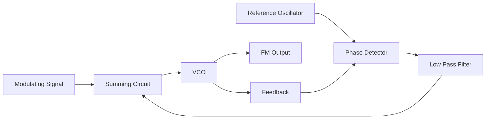
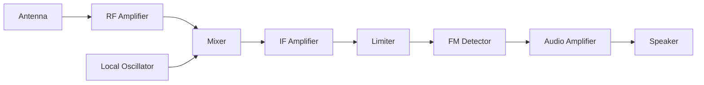
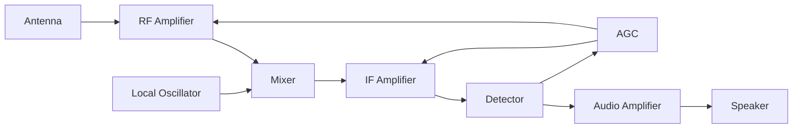
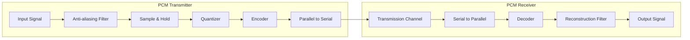
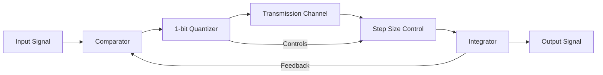
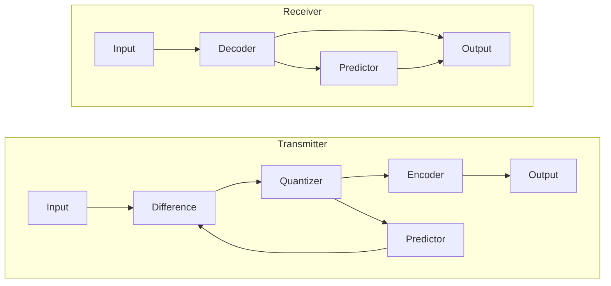
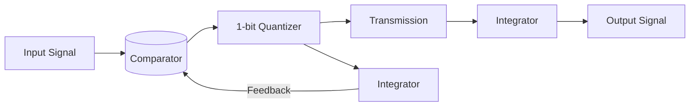
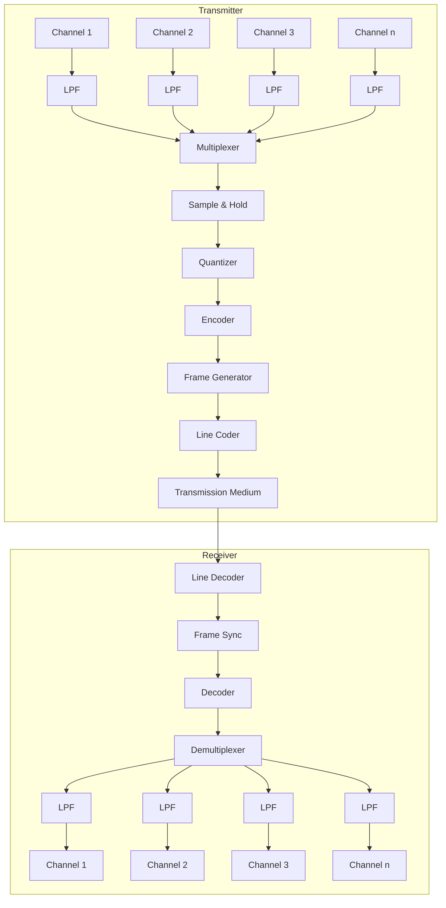

## Question 1(a) [3 marks]

**What is modulation? What is the need of it?**

**Answer**:
Modulation is the process of varying one or more properties (amplitude, frequency, or phase) of a high-frequency carrier signal with a modulating signal containing information.

**Need for modulation:**

- **Antenna size reduction**: Makes practical antenna size possible (λ = c/f)
- **Multiplexing**: Allows multiple signals to share the medium
- **Noise reduction**: Improves SNR by shifting to higher frequency bands
- **Range extension**: Increases transmission distance

**Mnemonic:** "AMEN" - Antenna size, Multiplexing, Eliminate noise, New range

## Question 1(b) [4 marks]

**Derive voltage equation for Amplitude modulation.**

**Answer**:
For AM, the carrier signal is modulated by the message signal.

**Mathematical derivation:**

- **Carrier signal**: $e_c(t) = A_c \cos(2\pi f_c t)$
- **Message signal**: $e_m(t) = A_m \cos(2\pi f_m t)$
- **Instantaneous amplitude**: $A_i = A_c + e_m(t)$
- **AM signal**: $e_{AM}(t) = A_i \cos(2\pi f_c t)$
- **Substituting**: $e_{AM}(t) = [A_c + A_m \cos(2\pi f_m t)] \cos(2\pi f_c t)$
- **Expanding**: $e_{AM}(t) = A_c\cos(2\pi f_c t) + A_m\cos(2\pi f_m t)\cos(2\pi f_c t)$
- **Final equation**: $e_{AM}(t) = A_c\cos(2\pi f_c t) + \frac{A_m}{2}\cos(2\pi(f_c+f_m)t) + \frac{A_m}{2}\cos(2\pi(f_c-f_m)t)$

**Mnemonic:** "CAT" - Carrier, Addition, Three components (carrier + 2 sidebands)

## Question 1(c) [7 marks]

**Classify Noise signal and explain flicker noise, shot noise and thermal noise.**

**Answer**:

**Noise classification:**

| Type | Sources | Characteristics |
|------|---------|-----------------|
| **External Noise** | Atmospheric, Space, Industrial, Man-made | Originates outside communication system |
| **Internal Noise** | Thermal, Shot, Transit-time, Flicker | Originates inside components |

**Types of Internal Noise:**

- **Flicker Noise**:
  - Occurs at low frequencies (below 1 kHz)
  - Inversely proportional to frequency (1/f noise)
  - Common in semiconductor devices and carbon resistors
  
- **Shot Noise**:
  - Caused by random fluctuations of current carriers
  - White noise with constant power density
  - Occurs in active devices like diodes and transistors
  
- **Thermal Noise**:
  - Due to random motion of electrons in a conductor
  - Directly proportional to temperature and bandwidth
  - Present in all passive components
  - Also called Johnson noise or white noise

**Mnemonic:** "FAST" - Flicker (low frequency), Active (shot), Semiconductor (flicker), Temperature (thermal)

## Question 1(c) OR [7 marks]

**Write application of different band of EM wave spectrum.**

**Answer**:

**EM Spectrum Applications:**

| Frequency Band | Frequency Range | Applications |
|----------------|----------------|--------------|
| **ELF** (Extremely Low Frequency) | 3Hz - 30Hz | Submarine communication |
| **VLF** (Very Low Frequency) | 3kHz - 30kHz | Navigation, time signals |
| **LF** (Low Frequency) | 30kHz - 300kHz | AM radio, navigation |
| **MF** (Medium Frequency) | 300kHz - 3MHz | AM broadcasting, maritime |
| **HF** (High Frequency) | 3MHz - 30MHz | Shortwave radio, amateur radio |
| **VHF** (Very High Frequency) | 30MHz - 300MHz | FM radio, TV broadcasting, air traffic control |
| **UHF** (Ultra High Frequency) | 300MHz - 3GHz | TV broadcasting, mobile phones, WiFi, Bluetooth |
| **SHF** (Super High Frequency) | 3GHz - 30GHz | Satellite communication, radar, WiFi |
| **EHF** (Extremely High Frequency) | 30GHz - 300GHz | Radio astronomy, 5G, millimeter-wave radar |
| **Infrared** | 300GHz - 400THz | Remote controls, thermal imaging, fiber optics |
| **Visible Light** | 400THz - 800THz | Fiber optics, LiFi, photography |
| **Ultraviolet** | 800THz - 30PHz | Sterilization, fluorescence, security |
| **X-rays** | 30PHz - 30EHz | Medical imaging, security screening |
| **Gamma rays** | >30EHz | Medical treatments, nuclear detection |

**Mnemonic:** "Every Very Lovely Monkey Has Visited Uncle Sam's House Easily In Visible Upper Xtra Gamma" (first letter of each band)

## Question 2(a) [3 marks]

**State advantages of SSB over DSB.**

**Answer**:

**Advantages of SSB over DSB:**

| Advantage | Description |
|-----------|-------------|
| **Bandwidth Efficiency** | Uses half the bandwidth (only one sideband) |
| **Power Efficiency** | Requires less transmitter power (83.33% power saving) |
| **Reduced Fading** | Less susceptible to selective fading |
| **Less Distortion** | Reduced intermodulation distortion |
| **Simplified Receiver** | Simpler circuit design possible |

**Mnemonic:** "BPFDS" - Bandwidth, Power, Fading, Distortion, Simple

## Question 2(b) [4 marks]

**Explain generation of FM using Phase lock loop technique.**

**Answer**:

**FM Generation using PLL:**

A Phase-Locked Loop (PLL) generates FM signals by applying the modulating signal to the VCO control input.

**PLL FM Modulator:**



**Operation:**

- **Reference Oscillator**: Provides stable reference frequency
- **Phase Detector**: Compares reference and feedback signals
- **Low Pass Filter**: Removes high-frequency components
- **VCO**: Generates output frequency that varies with control voltage
- **Modulating Signal**: Added to control voltage to produce FM output

**Mnemonic:** "PROVE" - Phase detector, Reference oscillator, Output VCO, Voltage controlled

## Question 2(c) [7 marks]

**Derive the equation for total power in AM, calculate percentage of power savings in DSB and SSB.**

**Answer**:

**Power in AM:**

The AM wave equation: $e_{AM}(t) = A_c[1 + m\cos(2\pi f_m t)]\cos(2\pi f_c t)$

**Power derivation:**

- **Total power**: $P_T = P_c\left(1 + \frac{m^2}{2}\right)$
- Where $P_c = \frac{A_c^2}{2R}$ (carrier power) and $m$ is modulation index

**Power distribution:**

- **Carrier power**: $P_c = \frac{A_c^2}{2R}$
- **Total sideband power**: $P_{SB} = \frac{m^2 P_c}{2}$
- **Each sideband**: $P_{LSB} = P_{USB} = \frac{m^2 P_c}{4}$

**Power savings:**

- **In DSB-SC**: No carrier power, so savings = $\frac{P_c}{P_T} \times 100\% = \frac{1}{1+\frac{m^2}{2}} \times 100\%$
  - For m=1, savings = 66.67%
- **In SSB**: No carrier and one sideband, so savings = $\frac{P_c + P_{SB}/2}{P_T} \times 100\%$
  - For m=1, savings = 83.33%

**Mnemonic:** "CEPTS" - Carrier Eliminated Provides Tremendous Savings

## Question 2(a) OR [3 marks]

**Draw and explain Time domain and Frequency domain display of AM wave.**

**Answer**:

**Time and Frequency Domain of AM:**

**Diagram:**

```goat
Time Domain:
    
     +          +           +           +
     |          |           |           |
     |    ++    |     ++    |    ++     |
     |   /  \   |    /  \   |   /  \    |
     |  /    \  |   /    \  |  /    \   |
     | /      \ |  /      \ | /      \  |
     |/        \|/        \|/        \| |
-----+----------+-----------+----------+-----
     |\        /|\        /|\        /| |
     | \      / | \      / | \      /  |
     |  \    /  |  \    /  |  \    /   |
     |   \__/   |   \__/   |   \__/    |
     |          |           |           |
     +          +           +           +

Frequency Domain:
    
     |
     |          
     |     +           +           +
     |     |           |           |
     |     |           |           |
     |     |           |           |
     |     |           |           |
-----+-----+-----+-----+-----+-----+-----
     |   f_c-f_m     f_c    f_c+f_m
```

**Time Domain:**

- Shows amplitude variation of carrier with time
- Envelope follows modulating signal
- Upper and lower envelopes = carrier peak × (1±m)

**Frequency Domain:**

- Shows frequency components and their amplitudes
- Carrier at frequency fc with amplitude Ac
- Two sidebands at fc±fm with amplitude mAc/2
- Bandwidth = 2fm (twice the modulating frequency)

**Mnemonic:** "EBS" - Envelope in time, Bandwidth in frequency, Sidebands symmetric

## Question 2(b) OR [4 marks]

**Explain pre-emphasis & de-emphasis circuit.**

**Answer**:

**Pre-emphasis and De-emphasis:**

**Circuit Diagrams:**

```goat
Pre-emphasis:                   De-emphasis:
    
+--+     +--+                 +--+     +--+
|  |     |  |                 |  |     |  |
+--+     R  |                 +--+     R  |
Input    |  +--+--+  Output   Input    |  +--+--+  Output
o--------+  |  |  o--------   o--------+  |  |  o--------
            C  |                          C  |
            |  |                          |  |
            +--+                          +--+
              |                             |
            -----                         -----
             ---                           ---
              -                             -
```

**Purpose:**

- **Pre-emphasis**: Boosts high-frequency components at transmitter
- **De-emphasis**: Attenuates high-frequency components at receiver

**Operation:**

- **Pre-emphasis**: High-pass RC circuit (R series, C parallel)
- **De-emphasis**: Low-pass RC circuit (R parallel, C series)
- Time constants are identical: τ = RC = 75μs (standard)

**Benefits:**

- Improves SNR for higher frequencies in FM
- Compensates for higher noise power at high frequencies
- Restores original frequency response at receiver

**Mnemonic:** "BETH" - Boost (pre-emphasis), Emphasizes Treble, Helps SNR

## Question 2(c) OR [7 marks]

**Compare AM, FM and PM.**

**Answer**:

**Comparison of AM, FM and PM:**

| Parameter | AM | FM | PM |
|-----------|------|------|------|
| **Definition** | Amplitude varies with message signal | Frequency varies with message signal | Phase varies with message signal |
| **Mathematical expression** | $A_c[1+m\cos(ω_mt)]\cos(ω_ct)$ | $A_c\cos[ω_ct+mf\sin(ω_mt)]$ | $A_c\cos[ω_ct+mp\cos(ω_mt)]$ |
| **Bandwidth** | 2fm (narrow) | 2(Δf+fm) (wide) | 2(mp+1)fm (wide) |
| **Power efficiency** | Low (carrier contains no info) | High (constant amplitude) | High (constant amplitude) |
| **Noise immunity** | Poor | Excellent | Excellent |
| **Circuit complexity** | Simple | Complex | Complex |
| **Applications** | AM broadcasting, aircraft communication | FM broadcasting, TV sound, mobile radio | Satellite communication, telemetry |
| **Modulation index** | m = Am/Ac (0 to 1) | mf = Δf/fm (no limit) | mp = Δφ/fm (no limit) |

**Mnemonic:** "BANCP-MAP" - Bandwidth, Amplitude, Noise, Complexity, Power, Modulation, Applications, Parameters

## Question 3(a) [3 marks]

**Define any FOUR characteristics of radio receiver.**

**Answer**:

**Radio Receiver Characteristics:**

| Characteristic | Definition |
|----------------|------------|
| **Sensitivity** | Minimum signal strength required for acceptable output |
| **Selectivity** | Ability to separate desired signal from adjacent signals |
| **Fidelity** | Accuracy in reproducing the original signal without distortion |
| **Image rejection** | Ability to reject image frequency interference |
| **Signal-to-noise ratio** | Ratio of desired signal to unwanted noise |
| **Stability** | Ability to maintain tuned frequency without drift |

**Mnemonic:** "SFIS-SS" - Sensitivity, Fidelity, Image rejection, Selectivity, SNR, Stability

## Question 3(b) [4 marks]

**Draw the block diagram of FM receiver. What is the use of Limiter in FM receiver.**

**Answer**:

**FM Receiver Block Diagram:**



**Use of Limiter in FM Receiver:**

- **Primary function**: Removes amplitude variations/noise
- **Operation**: Clips the signal to provide constant amplitude
- **Benefits**:
  - Eliminates AM interference
  - Improves SNR
  - Ensures proper FM detection
  - Prevents false frequency demodulation
- **Location**: Placed between IF amplifier and FM detector

**Mnemonic:** "CARE" - Clips Amplitude, Removes noise, Ensures constant signal

## Question 3(c) [7 marks]

**Draw and explain block diagram of super heterodyne receiver.**

**Answer**:

**Super Heterodyne Receiver:**



**Function of each block:**

- **Antenna**: Captures RF signals from electromagnetic waves
- **RF Amplifier**: Amplifies weak signals, provides selectivity
- **Local Oscillator**: Generates signal to mix with incoming RF
- **Mixer**: Produces IF by heterodyning RF with local oscillator
- **IF Amplifier**: Main amplification and selectivity at fixed frequency
- **Detector**: Extracts audio from modulated IF signal
- **Audio Amplifier**: Amplifies audio signal to drive speaker
- **AGC (Automatic Gain Control)**: Maintains constant output level
- **Speaker**: Converts electrical signal to sound

**Super Heterodyne Principle:**

- Converts high-frequency RF to fixed IF for better amplification
- IF = |RF ± LO| (typically 455 kHz for AM, 10.7 MHz for FM)

**Mnemonic:** "ARLMIDAS" - Antenna Receives, Local Mixes, IF Delivers, Audio Sounds

## Question 3(a) OR [3 marks]

**Draw and explain block diagram for envelope detector.**

**Answer**:

**Envelope Detector:**

**Circuit Diagram:**

```goat
          D
    +--->|---+---+
    |         |   |
AM  |         |   |     Audio
Input o       C   R    Output
    |         |   |      o
    |         |   |      |
    +---------+---+------+
              |
             ---
              -
```

**Component Functions:**

- **Diode (D)**: Rectifies AM signal (allows only positive half-cycles)
- **Capacitor (C)**: Charges to peak of input, filters carrier frequency
- **Resistor (R)**: Discharges capacitor, follows modulating signal envelope

**Operation:**

1. Diode conducts during positive half-cycles
2. Capacitor charges to peak voltage
3. During negative half-cycles, diode blocks
4. Capacitor discharges through resistor
5. RC time constant follows envelope variations

**RC Selection Criteria**: $\frac{1}{f_c} << RC << \frac{1}{f_m}$

**Mnemonic:** "DRIVER" - Diode Rectifies, RC Values Extract Envelope, Restores audio

## Question 3(b) OR [4 marks]

**What is IF? Explain its importance in brief.**

**Answer**:

**Intermediate Frequency (IF):**

**Definition:**
IF is a fixed frequency to which incoming RF signals are converted in superheterodyne receivers.

**Importance of IF:**

| Aspect | Importance |
|--------|------------|
| **Fixed Frequency** | Allows optimized amplification at one frequency |
| **Improved Selectivity** | Fixed-tuned filters provide better adjacent channel rejection |
| **Stable Gain** | Consistent amplification across entire tuning range |
| **Image Rejection** | Helps reject image frequency interference |
| **Simplified Tuning** | Only local oscillator needs to be tuned for different stations |
| **Better AGC** | More effective gain control at fixed frequency |

**Typical IF Values:**

- AM receivers: 455 kHz
- FM receivers: 10.7 MHz
- Television: 45 MHz

**Mnemonic:** "FIGS-ST" - Fixed frequency, Improved selectivity, Gain stability, Simplified tuning

## Question 3(c) OR [7 marks]

**Explain phase discriminator circuit for FM detection.**

**Answer**:

**Phase Discriminator for FM Detection:**

**Circuit Diagram:**

```goat
                 +----+
                 |    |
     +-----------|  T1|-------+
     |           |    |       |
     |           +----+       |
     |                        |
     |                        |
     |                        |
     |   D1                   |   D2
FM   o-->|---+            +---|<--+
Input|        |           |       |
     |        |  +----+   |       |
     |        +--|    |---+       |
     |           |  T2|           |
     +-----------| CT |-----------|
                 |    |           |
                 +----+           |
                    |             |
                    |     C1      |     C2
                    o----||-------o-----||----o Audio 
                    |             |          Output
                   ---           ---
                    -             -
```

**Operation:**

1. **Center-tapped transformer (T2)** creates 180° phase difference
2. **Primary transformer (T1)** sets reference phase
3. **Diode D1 and D2** form phase comparators
4. **When carrier at center frequency:**
   - Equal currents through both diodes
   - Equal voltages across C1 and C2
   - Net output is zero
5. **When frequency deviates:**
   - Phase changes
   - Unequal diode currents
   - Output voltage proportional to frequency deviation

**Advantages:**

- Good linearity
- Reduced distortion
- Better noise performance than slope detector

**Mnemonic:** "PERFECT" - Phase Ensures Rectification For Extracting Carrier Transitions

## Question 4(a) [3 marks]

**Explain quantization process and its necessity.**

**Answer**:

**Quantization Process:**

**Definition:**
Quantization is the process of mapping continuous analog values to discrete digital levels.

**Process:**

1. Sampling converts continuous-time signal to discrete-time
2. Range of amplitudes divided into finite number of levels
3. Each sample assigned to nearest quantization level
4. Difference between original and quantized value is quantization error

**Necessity of Quantization:**

| Necessity | Explanation |
|-----------|-------------|
| **Digital Processing** | Enables digital storage and manipulation |
| **Error Control** | Allows error detection and correction |
| **Noise Immunity** | Digital signals more resistant to noise |
| **Storage Efficiency** | More efficient than storing analog values |
| **Transmission** | Digital signals can be regenerated without error |

**Mnemonic:** "DENSE" - Digital conversion, Error control, Noise immunity, Storage, Efficient transmission

## Question 4(b) [4 marks]

**Give difference between DM and ADM.**

**Answer**:

**Difference between DM and ADM:**

| Parameter | Delta Modulation (DM) | Adaptive Delta Modulation (ADM) |
|-----------|---------------------|--------------------------------|
| **Step Size** | Fixed | Variable (adapts to signal) |
| **Slope Overload** | Common at steep signals | Reduced with adaptive step |
| **Granular Noise** | High for small signals | Reduced with smaller steps |
| **Signal Tracking** | Slow for rapidly changing signals | Better tracking of signal variations |
| **Complexity** | Simple | Moderate |
| **Bit Rate** | Higher for good quality | Lower for same quality |
| **Error Performance** | More sensitive | More robust |

**Diagram:**

```goat
DM:                              ADM:

   ^                                ^
   |                                |
   |    Original                    |    Original
   |      /\                        |      /\
   |     /  \                       |     /  \
   |    /    \                      |    /    \
   |   /      \                     |   /      \
   |  /  ____  \                    |  /        \
   | /__|    |__\___                | /_         \___
   |/  |    |  |   \                |/  \       /    \
---+---+----+--+----+-->           -+----+-----+------+-->
   |   |    |  |    |               |     |     |      |
   
Slope Overload              Better Signal Tracking
```

**Mnemonic:** "SAVAGES" - Step size, Adaptable, Variable tracking, Avoids overload, Granular noise reduction, Error performance, Signal fidelity

## Question 4(c) [7 marks]

**Draw & explain block diagram of PCM system.**

**Answer**:

**PCM System Block Diagram:**



**PCM Transmitter:**

- **Anti-aliasing Filter**: Limits input signal bandwidth to satisfy Nyquist criterion
- **Sample & Hold**: Converts continuous signal to discrete-time samples
- **Quantizer**: Approximates sample amplitudes to nearest discrete levels
- **Encoder**: Converts quantized levels to binary code
- **Parallel-to-Serial**: Converts parallel bits to serial for transmission

**PCM Receiver:**

- **Serial-to-Parallel**: Converts serial data back to parallel form
- **Decoder**: Converts binary code back to amplitude levels
- **Reconstruction Filter**: Smooths stepped output to recover analog signal

**PCM Parameters:**

- **Sampling rate**: fs > 2fm (Nyquist rate)
- **Quantization levels**: L = 2^n (n = number of bits)
- **Resolution**: Smallest distinguishable change = Vmax/L
- **Bit rate**: R = n × fs bits/second

**Mnemonic:** "SAFE-PETS" - Sample, Amplify, Filter, Encode, Pulse train, Extract, Transform, Smooth

## Question 4(a) OR [3 marks]

**Define quantization. Explain non uniform quantization in brief.**

**Answer**:

**Quantization Definition:**
Quantization is the process of converting continuous amplitude values to a finite set of discrete levels in analog-to-digital conversion.

**Non-uniform Quantization:**

**Diagram:**

```goat
     ^
     |                     ----
     |                 ----
     |             ----
Lvls |         ----
     |     ----
     |  ---
     | -
     +--------------------------->
                Input Signal
```

**Characteristics:**

- Unequal step sizes throughout the amplitude range
- Smaller steps for low amplitudes, larger for high amplitudes
- Better matches human perception (logarithmic response)
- Improves SNR for small signals without increasing bit rate

**Implementation Methods:**

- **Companding**: Compressing at transmitter, expanding at receiver
- **Logarithmic coding**: μ-law (North America) and A-law (Europe)
- **Adaptive quantization**: Adjusts levels based on signal statistics

**Mnemonic:** "CLASP" - Compressed Levels, Adaptive Steps, Small steps for small signals, Perceptual matching

## Question 4(b) OR [4 marks]

**Explain Adaptive delta modulation with its application.**

**Answer**:

**Adaptive Delta Modulation (ADM):**

**Diagram:**



**Operation:**

- Adapts step size based on input signal slope
- Increases step size for rapid changes (prevents slope overload)
- Decreases step size for slow changes (reduces granular noise)
- Uses previous bits pattern to determine slope changes

**Advantages:**

- Better signal tracking than DM
- Lower bit rate for same quality
- Reduced slope overload and granular noise
- Wider dynamic range

**Applications:**

- Speech and audio compression
- Voice-grade communication channels
- Digital telephony systems
- Video signal encoding
- Telemetry systems

**Mnemonic:** "ADAPT" - Automatically Decides Appropriate Pulse Transitions

## Question 4(c) OR [7 marks]

**What is sampling? Explain types of sampling in brief.**

**Answer**:

**Sampling Definition:**
Sampling is the process of converting a continuous-time signal to a discrete-time signal by taking measurements at regular intervals.

**Types of Sampling:**

| Type | Description | Diagram |
|------|-------------|---------|
| **Ideal Sampling** | Instantaneous samples of infinitesimal duration | Impulses at sampling instants |
| **Natural Sampling** | Samples have finite width, amplitude follows input | Original signal visible during sampling duration |
| **Flat-top Sampling** | Samples have constant amplitude during sampling interval | Step-like appearance, used in sample-and-hold |

**Diagrams:**

```goat
Ideal Sampling:           Natural Sampling:         Flat-top Sampling:

   ^                         ^                        ^
   |                         |                        |
   | |   |   |   |           |   _   _   _            |  ___   ___   ___ 
   | |   |   |   |           |  / \ / \ / \           | |   | |   | |   |
   | |   |   |   |           | /   |   |   \          | |   | |   | |   |
---+---+---+---+---->     --+-----+---+------->     --+-----+-----+----->
   |                         |                         |
```

**Sampling Parameters:**

- **Sampling period (Ts)**: Time between consecutive samples
- **Sampling frequency (fs)**: Number of samples per second (fs = 1/Ts)
- **Nyquist rate**: Minimum sampling rate (fs > 2fm) to avoid aliasing

**Mnemonic:** "INFS" - Ideal (impulses), Natural (follows signal), Flat-top (constant), Sufficient rate

## Question 5(a) [3 marks]

**Define bit rate and baud rate.**

**Answer**:

**Bit Rate and Baud Rate:**

| Parameter | Definition | Formula | Unit |
|-----------|------------|---------|------|
| **Bit Rate** | Number of binary digits (bits) transmitted per second | R = fs × n | bits per second (bps) |
| **Baud Rate** | Number of signal elements or symbols transmitted per second | B = fs | symbols per second (baud) |

**Relationship:**

- For binary signaling: Bit Rate = Baud Rate
- For M-ary signaling: Bit Rate = Baud Rate × log₂M
  - Where M = number of different signal elements

**Example:**

- 4-QAM (M=4): Each symbol carries log₂4 = 2 bits
- If Baud Rate = 1000 symbols/s, then Bit Rate = 2000 bits/s

**Mnemonic:** "BBSM" - Bits per second, Baud for Symbols, Modulation determines relationship

## Question 5(b) [4 marks]

**Explain working of DPCM.**

**Answer**:

**Differential Pulse Code Modulation (DPCM):**

**Block Diagram:**



**Working Principle:**

- Encodes difference between current sample and predicted sample
- Prediction based on previous samples (correlation)
- Smaller dynamic range of differences allows fewer bits per sample

**Advantages:**

- Higher compression ratio than PCM
- Reduced bit rate for same quality
- Exploits signal correlation
- Improved SNR performance

**Mnemonic:** "DEEP" - Difference Encoded, Efficient Prediction, Exploits correlation, Preserves quality

## Question 5(c) [7 marks]

**The binary data 1011001 is to be transmitted using following line coding techniques: (i) Unipolar RZ and NRZ (ii) Polar RZ and NRZ (iii) AMI (iv) Manchester. Draw all the waveforms.**

**Answer**:

**Line Coding Waveforms for 1011001:**

```goat
Data:      1    0    1    1    0    0    1
           |    |    |    |    |    |    |
           v    v    v    v    v    v    v

Unipolar   
NRZ:     ____|‾‾‾‾|____|‾‾‾‾|‾‾‾‾|____|____|‾‾‾‾|____
           
Unipolar  
RZ:      ____|‾|__|____|‾|__|‾|__|____|____|‾|__|____
           
Polar     
NRZ:     ____|‾‾‾‾|____|‾‾‾‾|‾‾‾‾|____|____|‾‾‾‾|____
          ‾‾‾‾     ‾‾‾‾     ‾‾‾‾     ‾‾‾‾     ‾‾‾‾
Polar
RZ:      ____|‾|__|____|‾|__|‾|__|____|____|‾|__|____
          ‾‾‾‾|_|  |_|‾‾|_|‾‾|_|  |_|  |_|‾‾|_|  
AMI:     _____|‾|__|____|___|‾|__|____|____|‾|__|____
          ‾‾‾‾|_|  |_|  |_|  |_|  |_|  |_|  |_|
              
Manchester:
          ____|‾|__|_|‾‾|____|‾|__|‾|__|____|____|‾|__|____
          ‾‾‾‾|_|  |_|  |_|‾‾|_|  |_|  |_|‾‾|_|‾‾|_|
```

**Description of Line Coding Techniques:**

| Technique | Logic 1 | Logic 0 | Characteristics |
|-----------|---------|---------|-----------------|
| **Unipolar NRZ** | High level | Zero level | No return to zero between bits |
| **Unipolar RZ** | Pulse for half bit | Zero level | Returns to zero for half bit |
| **Polar NRZ** | Positive | Negative | No return to zero between bits |
| **Polar RZ** | Positive pulse | Negative pulse | Returns to zero for half bit |
| **AMI** | Alternating +/- | Zero level | Alternates polarity for consecutive 1s |
| **Manchester** | High→Low | Low→High | Transition in middle of bit |

**Mnemonic:** "UPAM" - Unipolar, Polar, AMI, Manchester encoding options

## Question 5(a) OR [3 marks]

**Compare RZ and NRZ coding with example.**

**Answer**:

**Comparison of RZ and NRZ Coding:**

| Parameter | Return-to-Zero (RZ) | Non-Return-to-Zero (NRZ) |
|-----------|---------------------|--------------------------|
| **Signal levels** | Returns to zero in each bit | Maintains level for full bit period |
| **Bandwidth** | Higher (≈ 2× NRZ) | Lower |
| **Self-clocking** | Better (transitions in every bit) | Poorer (may have long runs without transitions) |
| **Power requirement** | Higher | Lower |
| **Bit synchronization** | Easier | More difficult |
| **Implementation** | More complex | Simpler |
| **DC component** | Less | More |

**Example for binary data 101:**

```goat
Data:        1     0     1
             |     |     |
             v     v     v

NRZ:      ___|‾‾‾‾‾|_____|‾‾‾‾‾|____
                   
RZ:       ___|‾|___|_____|‾|___|____
```

**Mnemonic:** "BPSIDC" - Bandwidth, Power, Synchronization, Implementation, DC component

## Question 5(b) OR [4 marks]

**Explain delta modulation in brief.**

**Answer**:

**Delta Modulation (DM):**

**Block Diagram:**



**Working Principle:**

- Encodes only the difference between samples using 1 bit
- Comparator checks if input is higher/lower than predicted value
- Integrator accumulates the bits to approximate original signal
- Output is series of 1s and 0s representing up/down steps

**Limitations:**

- **Slope Overload**: Cannot track rapidly changing signals
- **Granular Noise**: Small variations around steady signal

**Advantages:**

- Simplest form of differential encoding
- Low bit rate (1 bit per sample)
- Simple implementation
- Hardware efficiency

**Mnemonic:** "SIDE" - Single-bit, Integrates Differences, Encodes changes

## Question 5(c) OR [7 marks]

**Explain PCM-TDM system.**

**Answer**:

**PCM-TDM System:**

**Block Diagram:**



**PCM-TDM Operation:**

| Stage | Process |
|-------|---------|
| **Filtering** | Band-limits each channel to prevent aliasing |
| **Multiplexing** | Samples each channel sequentially |
| **Conversion** | Quantizes samples and converts to binary code |
| **Framing** | Adds sync bits and channel identification |
| **Transmission** | Sends frame over communication medium |
| **Demultiplexing** | Separates channels from received frame |
| **Reconstruction** | Converts digital samples back to analog signals |

**System Parameters:**

- **Channel Capacity**: N channels
- **Sampling Rate**: fs per channel
- **Quantization**: n bits per sample
- **Frame Structure**: 1 sample from each channel + sync
- **Total Bit Rate**: N × n × fs + overhead

**Mnemonic:** "MOST-FDR" - Multiplex, Quantize, Sample, Transmit, Frame, Demultiplex, Reconstruct
