## પ્રશ્ન 1(a) [3 ગુણ]

**અવાજ સંકેતનું વર્ગીકરણ કરો અને થર્મલ અવાજ સમજાવો.**

**જવાબ**:

અવાજ સંકેતનું વર્ગીકરણ:

| અવાજનો પ્રકાર | સ્ત્રોત | લક્ષણો |
|---------------|--------|-------|
| **બાહ્ય અવાજ** | કોમ્યુનિકેશન સિસ્ટમની બહાર | વાતાવરણીય, અવકાશ, ઔદ્યોગિક |
| **આંતરિક અવાજ** | કોમ્યુનિકેશન સિસ્ટમની અંદર | થર્મલ, શોટ, ટ્રાન્ઝિટ ટાઈમ, ફ્લિકર |

**થર્મલ અવાજ**:

- **વ્યાખ્યા**: તાપમાનને કારણે કન્ડક્ટરમાં ઇલેક્ટ્રોન્સની અનિયમિત ગતિ
- **લક્ષણો**: સફેદ અવાજ જેમાં આવર્તન સ્પેક્ટ્રમમાં એકસમાન પાવર હોય છે
- **સૂત્ર**: N = kTB (k=બોલ્ટઝમેન અચળાંક, T=તાપમાન, B=બેન્ડવિડ્થ)

**મેમરી ટ્રીક:** "Temperature Excites Random Movements" (TERM)

## પ્રશ્ન 1(b) [4 ગુણ]

**પ્રી-એમ્ફેસીસ અને ડી-એમ્ફેસીસ તકનીક વચ્ચેની સરખામણી કરો.**

**જવાબ**:

| પરિમાણ | પ્રી-એમ્ફેસીસ | ડી-એમ્ફેસીસ |
|---------|--------------|------------|
| **વ્યાખ્યા** | ટ્રાન્સમિશન પહેલા ઉચ્ચ આવર્તન ઘટકોને વધારવા | રિસીવર પર ઉચ્ચ આવર્તન ઘટકોને ઘટાડવા |
| **સ્થાન** | ટ્રાન્સમીટર બાજુ | રિસીવર બાજુ |
| **હેતુ** | ઉચ્ચ આવર્તન માટે SNR સુધારે છે | મૂળ સિગ્નલની આવર્તન પ્રતિક્રિયા પુનઃસ્થાપિત કરે છે |
| **સર્કિટ** | RC સર્કિટ સાથે હાઈ-પાસ ફિલ્ટર | RC સર્કિટ સાથે લો-પાસ ફિલ્ટર |
| **સમય અચળાંક** | 75 μs (માનક) | 75 μs (પ્રી-એમ્ફેસીસ સાથે મેળ ખાય છે) |

**ડાયાગ્રામ/સર્કિટ:**

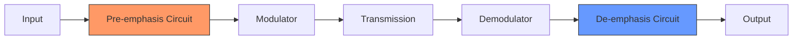

**મેમરી ટ્રીક:** "Pump Up Before Transmit, Pull Down After Receive" (PUBTAR)

## પ્રશ્ન 1(c) [7 ગુણ]

**AM સિગ્નલની ગણિતિક અભિવ્યક્તિ મેળવો અને તેની મદદથી AM સિગ્નલના આવર્તન સ્પેક્ટ્રમને સમજાવો.**

**જવાબ**:

**ગણિતિક અભિવ્યક્તિ નિર્માણ**:

1. કેરિયર સિગ્નલ: c(t) = Ac cos(2πfct)
2. મોડ્યુલેટિંગ સિગ્નલ: m(t) = Am cos(2πfmt)
3. AM સિગ્નલ: s(t) = Ac[1 + μ·m(t)/Am]cos(2πfct)
   જ્યાં μ = મોડ્યુલેશન ઇન્ડેક્સ

4. m(t) બદલતા:
   s(t) = Ac[1 + μ·cos(2πfmt)]cos(2πfct)

5. ત્રિકોણમિતીય ઓળખ cos(A)·cos(B) = ½cos(A+B) + ½cos(A-B) નો ઉપયોગ કરીને:
   s(t) = Ac·cos(2πfct) + (μAc/2)·cos(2π(fc+fm)t) + (μAc/2)·cos(2π(fc-fm)t)

**આવર્તન સ્પેક્ટ્રમ**:

| ઘટક | આવર્તન | એમ્પ્લિટ્યુડ |
|-----------|-----------|-----------|
| કેરિયર | fc | Ac |
| ઉપલી સાઇડબેન્ડ | fc + fm | μAc/2 |
| નીચલી સાઇડબેન્ડ | fc - fm | μAc/2 |

**ડાયાગ્રામ:**

```goat
    │    
    │           ┌─┐
    │           │ │
    │           │ │
    │    ┌─┐    │ │    ┌─┐
    │    │ │    │ │    │ │
    │    │ │    │ │    │ │
    │    │ │    │ │    │ │
────┼────┼─┼────┼─┼────┼─┼────────►f
    │   fc-fm   fc    fc+fm
    │
    │   LSB    Carrier   USB
```

**મેમરી ટ્રીક:** "Carrier Standing Between Twins" (CSBT)

## પ્રશ્ન 1(c) OR [7 ગુણ]

**કોમ્યુનિકેશન સિસ્ટમનો બ્લોક ડાયાગ્રામ સમજાવો.**

**જવાબ**:

**કોમ્યુનિકેશન સિસ્ટમનો બ્લોક ડાયાગ્રામ**:

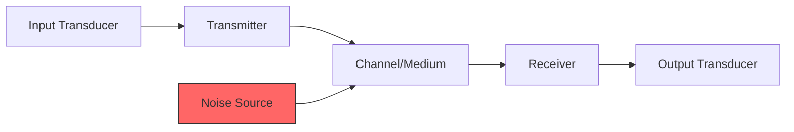

**ઘટકો અને કાર્યો**:

| બ્લોક | કાર્ય | ઉદાહરણ |
|-------|-------|---------|
| **ઇનપુટ ટ્રાન્સડ્યુસર** | મૂળ માહિતીને ઇલેક્ટ્રિકલ સિગ્નલમાં રૂપાંતરિત કરે છે | માઇક્રોફોન, કેમેરા |
| **ટ્રાન્સમીટર** | કુશળ ટ્રાન્સમિશન માટે સિગ્નલની પ્રક્રિયા કરે છે (મોડ્યુલેશન, એમ્પ્લિફિકેશન) | રેડિયો ટ્રાન્સમીટર |
| **ચેનલ/માધ્યમ** | જે માર્ગ દ્વારા સિગ્નલ પ્રવાસ કરે છે | હવા, ફાઇબર, કેબલ |
| **રિસીવર** | મૂળ સિગ્નલ મેળવે છે (એમ્પ્લિફિકેશન, ફિલ્ટરિંગ, ડિમોડ્યુલેશન) | રેડિયો રિસીવર |
| **આઉટપુટ ટ્રાન્સડ્યુસર** | ઇલેક્ટ્રિકલ સિગ્નલને મૂળ સ્વરૂપમાં પાછું ફેરવે છે | સ્પીકર, ડિસ્પ્લે |
| **નોઇઝ સોર્સ** | અવાંછિત સિગ્નલ્સ જે માહિતીને વિકૃત કરે છે | એટમોસ્ફેરિક, થર્મલ |

**મેમરી ટ્રીક:** "Input Transmits Through Channel, Receives Output" (ITCRO)

## પ્રશ્ન 2(a) [3 ગુણ]

**એમ્પ્લિટ્યુડ મોડ્યુલેશનમાં સાઇડબેન્ડ્સ અને કેરીયર વેવ વચ્ચે પાવર વિતરણની ચર્ચા કરો.**

**જવાબ**:

**AM સિગ્નલમાં પાવર વિતરણ**:

| ઘટક | પાવર ફોર્મ્યુલા | ટકાવારી (m=1 માટે) |
|-----------|---------------|----------------------|
| કેરિયર | Pc = (Ac²/2) | 67% |
| ઉપલી સાઇડબેન્ડ | PUSB = (Pc·m²)/4 | 16.5% |
| નીચલી સાઇડબેન્ડ | PLSB = (Pc·m²)/4 | 16.5% |
| કુલ પાવર | PT = Pc(1+m²/2) | 100% |

**ડાયાગ્રામ:**

```goat
   Power
     │
 100%┤                ┌───┐
     │                │   │
     │                │   │
  67%┤       ┌───┐    │   │
     │       │   │    │   │
     │       │   │    │   │
     │       │   │    │   │
16.5%┤┌───┐  │   │  ┌─┴─┐ │
     ││LSB│  │ C │  │USB│ │
     │└───┘  │   │  └───┘ │
   0%┼──────────────────────►
     │ Components of AM
```

**મેમરી ટ્રીક:** "Carrier Takes Two-Thirds" (CTTT)

## પ્રશ્ન 2(b) [4 ગુણ]

**શા માટે પ્રિએમ્ફેસીસ અને ડિએમ્ફેસીસનો ઉપયોગ કરવામાં આવે છે? સંક્ષિપ્તમાં વર્ણન કરો કે કેવી રીતે ટ્રાન્સમીટર બાજુ અને રીસીવર બાજુ પર સંકેતો સંશોધિત થાય છે.**

**જવાબ**:

**પ્રી-એમ્ફેસીસ અને ડી-એમ્ફેસીસનો હેતુ**:

| હેતુ | સમજૂતી |
|------|---------|
| SNR સુધારવું | ટ્રાન્સમિશન પહેલા ઉચ્ચ આવર્તનને વધારે છે જેથી અવાજને ઓળંગી શકાય |
| અવાજ ઘટાડવો | FM માં ઉચ્ચ આવર્તન અવાજ માટે વધુ સંવેદનશીલ હોય છે |
| વિશ્વસનીયતા જાળવવી | સમગ્ર આવર્તન પ્રતિક્રિયા સપાટ રહે તેની ખાતરી કરે છે |

**સિગ્નલ મોડિફિકેશન પ્રક્રિયા**:

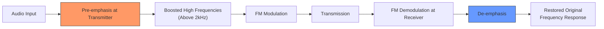

**મેમરી ટ્રીક:** "Boost High, Cut High, Keep Original" (BHCKO)

## પ્રશ્ન 2(c) [7 ગુણ]

**FM જનરેશનની તકનીકો સમજાવો. ફેઝ લૉક લૂપ FM મોડ્યુલેટરને વિગતવાર સમજાવો.**

**જવાબ**:

**FM જનરેશન તકનીકો**:

| તકનીક | સિદ્ધાંત | ફાયદા |
|--------|---------|--------|
| ડાયરેક્ટ FM | ઓસિલેટરમાં કેપેસિટન્સ બદલવું | સરળ ડિઝાઇન |
| ઇનડાયરેક્ટ FM | FM બનાવવા માટે ફેઝ મોડ્યુલેશનનો ઉપયોગ | વધુ સ્થિરતા |
| PLL FM | ફેઝ લૉક લૂપનો ઉપયોગ | ઉચ્ચ આવર્તન સ્થિરતા |
| આર્મસ્ટ્રોંગ પદ્ધતિ | મિક્સર્સ અને ફિલ્ટર્સનો ઉપયોગ | ઉત્તમ રેખીયતા |

**PLL FM મોડ્યુલેટર**:

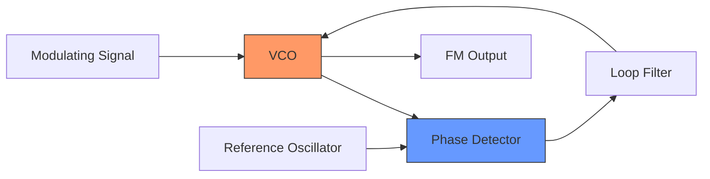

**કાર્ય સિદ્ધાંત**:

1. **ફેઝ ડિટેક્ટર** VCO આઉટપુટની રેફરન્સ ઓસિલેટર સાથે તુલના કરે છે
2. **લૂપ ફિલ્ટર** ઉચ્ચ-આવર્તન ઘટકોને દૂર કરે છે
3. **VCO** (વોલ્ટેજ કંટ્રોલ્ડ ઓસિલેટર) આવર્તન મોડ્યુલેટિંગ સિગ્નલ સાથે બદલાય છે
4. મોડ્યુલેટિંગ સિગ્નલ સીધું VCO કંટ્રોલ કરે છે
5. PLL ઉચ્ચ સ્થિરતા અને રેખીયતા સુનિશ્ચિત કરે છે

**મેમરી ટ્રીક:** "Phase Detector Compares, Filter Smooths, VCO Varies" (PDCFV)

## પ્રશ્ન 2(a) OR [3 ગુણ]

**DSB કરતાં SSBના ફાયદા અને ગેરલાભ જણાવો.**

**જવાબ**:

**SSBના DSB કરતાં ફાયદા અને ગેરલાભ**:

| SSBના ફાયદા | SSBના ગેરલાભ |
|-------------|--------------|
| **બેન્ડવિડ્થ કાર્યક્ષમતા**: માત્ર અડધી બેન્ડવિડ્થનો ઉપયોગ કરે છે | **જટિલ સર્કિટરી**: જટિલ ફિલ્ટરીંગની જરૂર પડે છે |
| **પાવર કાર્યક્ષમતા**: આશરે 1/3 પાવરનો ઉપયોગ કરે છે | **મુશ્કેલ ડિમોડ્યુલેશન**: કેરિયર રિકવરીની જરૂર પડે છે |
| **ઘટાડેલું ફેડિંગ**: સિલેક્ટિવ ફેડિંગ માટે ઓછું સંવેદનશીલ | **વિકૃતિ**: નીચા આવર્તનને વિકૃત કરી શકે છે |
| **ઓછું ઇન્ટરફેરન્સ**: સાંકડી ચેનલનો અર્થ ઓછું ઓવરલેપ | **કિંમત**: DSB સિસ્ટમ્સ કરતાં વધુ ખર્ચાળ |

**મેમરી ટ્રીક:** "Power and Bandwidth Saved, But Complex Circuits Needed" (PBSCN)

## પ્રશ્ન 2(b) OR [4 ગુણ]

**DSBSC અને SSB એમ્પ્લિટ્યુડ મોડ્યુલેટેડ વેવ અને પાયલોટ કેરિયરના ફ્રીક્વન્સી સ્પેક્ટ્રમનું સ્કેચ કરો.**

**જવાબ**:

**DSBSC ફ્રીક્વન્સી સ્પેક્ટ્રમ**:

```goat
    │    
    │    
    │    ┌─┐         ┌─┐
    │    │ │         │ │
    │    │ │         │ │
    │    │ │         │ │
────┼────┼─┼─────────┼─┼────────►f
    │   fc-fm       fc+fm
    │
    │    LSB         USB
```

**SSB (ઉપલી સાઇડબેન્ડ) પાયલોટ કેરિયર સાથે**:

```goat
    │    
    │             │
    │             │
    │             │         ┌─┐
    │             │         │ │
    │             │         │ │
    │             │         │ │
────┼─────────────┼─────────┼─┼────►f
    │             fc        fc+fm
    │             │
    │        Pilot Carrier   USB
```

**તુલના કોષ્ટક**:

| સ્પેક્ટ્રમ પ્રકાર | બેન્ડવિડ્થ | ઘટકો | પાવર કાર્યક્ષમતા |
|---------------|-----------|-------|-----------------|
| **DSBSC** | 2fm | LSB + USB | મધ્યમ (કોઈ કેરિયર પાવર નહીં) |
| **SSB** | fm | USB અથવા LSB | ઉચ્ચ (માત્ર એક સાઇડબેન્ડ) |
| **SSB with Pilot** | fm + થોડું | USB/LSB + ઘટાડેલ કેરિયર | સારું (ન્યૂનતમ કેરિયર પાવર) |

**મેમરી ટ્રીક:** "Two Sides, One Side, or One Side Plus Pilot" (TSOSP)

## પ્રશ્ન 2(c) OR [7 ગુણ]

**ટૂંકી નોંધ લખો: પલ્સ મોડ્યુલેશન.**

**જવાબ**:

**પલ્સ મોડ્યુલેશન તકનીકો**:

પલ્સ મોડ્યુલેશન એક પ્રક્રિયા છે જ્યાં સતત એનાલોગ સિગ્નલને સેમ્પલ કરીને પલ્સમાં રૂપાંતરિત કરવામાં આવે છે.

| પ્રકાર | વર્ણન | સિદ્ધાંત | ઉપયોગ |
|-------|---------|----------|---------|
| **PAM (પલ્સ એમ્પ્લિટ્યુડ મોડ્યુલેશન)** | પલ્સનું એમ્પ્લિટ્યુડ સિગ્નલ સાથે બદલાય છે | સેમ્પલિંગ અને હોલ્ડીંગ | PCM માટે મધ્યવર્તી પગલું |
| **PWM (પલ્સ વિડ્થ મોડ્યુલેશન)** | પલ્સની પહોળાઈ/અવધિ બદલાય છે | રેમ્પ સાથે સરખામણી | મોટર કંટ્રોલ, પાવર કંટ્રોલ |
| **PPM (પલ્સ પોઝિશન મોડ્યુલેશન)** | પલ્સની સ્થિતિ બદલાય છે | ટાઇમિંગ શિફ્ટ | ઓપ્ટિકલ કોમ્યુનિકેશન, રડાર |
| **PCM (પલ્સ કોડ મોડ્યુલેશન)** | બાઇનરી કોડનો ઉપયોગ કરીને ડિજિટલ રજૂઆત | ક્વોન્ટાઇઝિંગ અને એનકોડિંગ | ડિજિટલ ટેલિફોની, CD |

**વેવફોર્મ તુલના**:

```goat
Original Signal:
   /\      /\      /\
  /  \    /  \    /  \
 /    \  /    \  /    \
/      \/      \/      \

PAM:
   |      |      |
   |      |      |
   |      |      |
   |      |      |

PWM:
   ____    _____    __
  |    |  |     |  |  |
  |    |  |     |  |  |
__|    |__|     |__|  |__

PPM:
   _     _     _
  | |   | |   | |
  | |   | |   | |
__|_|___|_|___|_|_____
```

**મેમરી ટ્રીક:** "Amplitude, Width, Position, Code - All Pulse Types" (AWPC)

## પ્રશ્ન 3(a) [3 ગુણ]

**AGC શું છે? સરળ AGC સર્કિટના ઇનપુટ-આઉટપુટ લક્ષણિક વળાંક દોરો અને સમજાવો.**

**જવાબ**:

**ઓટોમેટિક ગેઇન કંટ્રોલ (AGC)**:

- **વ્યાખ્યા**: સર્કિટ જે આઉટપુટ લેવલ સ્થિર રાખવા માટે ગેઇનને આપમેળે સમાયોજિત કરે છે
- **હેતુ**: રિસીવરમાં બદલાતી સિગ્નલ તીવ્રતાને વળતર આપે છે
- **પ્રકારો**: સરળ AGC, વિલંબિત AGC, એમ્પ્લિફાઇડ AGC

**ઇનપુટ-આઉટપુટ લક્ષણિક વળાંક**:

```goat
    Output
     │
  Max┤- - - - - - - - - - - - - -
     │                  ┌───────
     │                 /
     │                /
     │               /
     │              /
     │             /  With AGC
     │         ┌──┘
     │        /
     │       /
     │      /
     │     /
   Min┤    /
     │   /  Without AGC
     │  /
     │ /
     │/
     └─────────────────────────► Input
       Min               Max
```

**કાર્યપદ્ધતિ**: જેમ ઇનપુટ વધે છે, થ્રેશોલ્ડ પછી આઉટપુટ લગભગ સ્થિર રાખવા માટે ગેઇન ઘટે છે

**મેમરી ટ્રીક:** "Strong Signals Get Less Gain" (SSLG)

## પ્રશ્ન 3(b) [4 ગુણ]

**FM ડિમોડ્યુલેશન માટે બેલેન્સ્ડ રેશિયો ડિટેક્ટર પર ટૂંકી નોંધ લખો.**

**જવાબ**:

**બેલેન્સ્ડ રેશિયો ડિટેક્ટર**:

| લક્ષણ | વર્ણન |
|-------|-------|
| **વ્યાખ્યા** | FM ડિમોડ્યુલેટર જે આવર્તન વિચલનને એમ્પ્લિટ્યુડ વિચલનમાં રૂપાંતરિત કરવા બેલેન્સ્ડ સર્કિટનો ઉપયોગ કરે છે |
| **મુખ્ય ઘટકો** | બે ડાયોડ, સેન્ટર-ટેપ્ડ સેકન્ડરી સાથેનું ટ્રાન્સફોર્મર, બેલેન્સ્ડ કેપેસિટર |
| **ફાયદા** | શ્રેષ્ઠ નોઇઝ ઇમ્યુનિટી, AM અસ્વીકૃતિ, સ્થિરતા |
| **ઉપયોગ** | FM રિસીવર્સ, બ્રોડકાસ્ટ રિસીવર્સ |

**સર્કિટ આકૃતિ**:

```goat
     +-----+     +-----+
     |     |-----|     |
     |  T  |     |  D1 |
     |     |--+--|     |
in-->|     |  |  +-----+
     |     |  |
     |     |  |  +-----+
     |     |-----|     |
     +-----+     |  D2 |
                 |     |
                 +-----+
                   |
                   v
                 output
```

**કાર્ય સિદ્ધાંત**: 

- ટ્રાન્સફોર્મર ડાયોડ માટે ફેઝ-શિફ્ટેડ સિગ્નલ બનાવે છે
- ડાયોડ કેપેસિટરને અલગ ધ્રુવીયતા સાથે ચાર્જ કરે છે
- જેમ આવર્તન વિચલન થાય છે, વોલ્ટેજ રેશિયો પ્રમાણસર બદલાય છે
- આઉટપુટ આવર્તન વિચલનના પ્રમાણમાં હોય છે

**મેમરી ટ્રીક:** "Balanced Diodes Transform Frequency To Voltage" (BDTFV)

## પ્રશ્ન 3(c) [7 ગુણ]

**વિવિધ પ્રકારના FM ડિમોડ્યુલેટર સર્કિટનું કાર્ય સમજાવો.**

**જવાબ**:

**FM ડિમોડ્યુલેટર સર્કિટના પ્રકાર**:

| ડિમોડ્યુલેટર પ્રકાર | કાર્ય સિદ્ધાંત | ફાયદા | ગેરલાભ |
|------------------|-------------|---------|---------|
| **સ્લોપ ડિટેક્ટર** | ટ્યુન્ડ સર્કિટ પ્રતિસાદના ઢાળનો ઉપયોગ | સરળ ડિઝાઇન | નબળી રેખીયતા, નબળી AM અસ્વીકૃતિ |
| **ફોસ્ટર-સિલી ડિસ્ક્રિમિનેટર** | ટ્રાન્સફોર્મરમાં ફેઝ શિફ્ટનો ઉપયોગ | સારી રેખીયતા | એમ્પ્લિટ્યુડ વિચલન માટે સંવેદનશીલ |
| **રેશિયો ડિટેક્ટર** | એમ્પ્લિટ્યુડ લિમિટિંગ સાથે સુધારેલ ડિસ્ક્રિમિનેટર | સારી AM અસ્વીકૃતિ | મધ્યમ રેખીયતા |
| **PLL ડિમોડ્યુલેટર** | VCO સાથે ફેઝ તુલના | ઉત્કૃષ્ટ રેખીયતા, સારી નોઇઝ ઇમ્યુનિટી | જટિલ સર્કિટ |
| **ક્વોડ્રેચર ડિટેક્ટર** | ફેઝ શિફ્ટિંગ અને ગુણાકાર | સરળ IC અમલીકરણ | મર્યાદિત બેન્ડવિડ્થ |

**PLL FM ડિમોડ્યુલેટર સર્કિટ**:

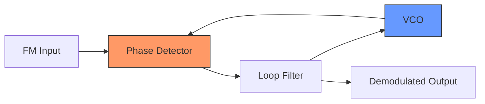

**કાર્ય સિદ્ધાંત**:

1. ફેઝ ડિટેક્ટર આવતા FM સિગ્નલને VCO આઉટપુટ સાથે સરખાવે છે
2. એરર વોલ્ટેજને ઉચ્ચ આવર્તનો દૂર કરવા માટે ફિલ્ટર કરવામાં આવે છે
3. VCO ને ઇનપુટ આવર્તન ટ્રેક કરવા માટે ફોર્સ કરવામાં આવે છે
4. ફિલ્ટર આઉટપુટ આવર્તન વિચલનના પ્રમાણમાં હોય છે
5. આ આઉટપુટ ડિમોડ્યુલેટેડ FM સિગ્નલ છે

**મેમરી ટ્રીક:** "Frequency Variations Drive Phase Errors" (FVDPE)

## પ્રશ્ન 3(a) OR [3 ગુણ]

**રેડિયો રીસીવરની લાક્ષણિકતાઓ સમજાવો.**

**જવાબ**:

**રેડિયો રીસીવરની લાક્ષણિકતાઓ**:

| લાક્ષણિકતા | વ્યાખ્યા | મહત્વ |
|------------|----------|-------|
| **સંવેદનશીલતા** | નબળા સિગ્નલને એમ્પ્લિફાય કરવાની ક્ષમતા | મહત્તમ રિસેપ્શન રેન્જ નક્કી કરે છે |
| **પસંદગીકારકતા** | આસપાસના સિગ્નલથી વાંછિત સિગ્નલને અલગ કરવાની ક્ષમતા | હસ્તક્ષેપ અટકાવે છે |
| **વફાદારી** | મૂળ સિગ્નલને પુનઃ ઉત્પન્ન કરવામાં ચોકસાઈ | અવાજની ગુણવત્તા સુનિશ્ચિત કરે છે |
| **છબી આવર્તન અસ્વીકૃતિ** | છબી આવર્તનને અસ્વીકાર કરવાની ક્ષમતા | ડુપ્લિકેટ રિસેપ્શન અટકાવે છે |

**ડાયાગ્રામ:**

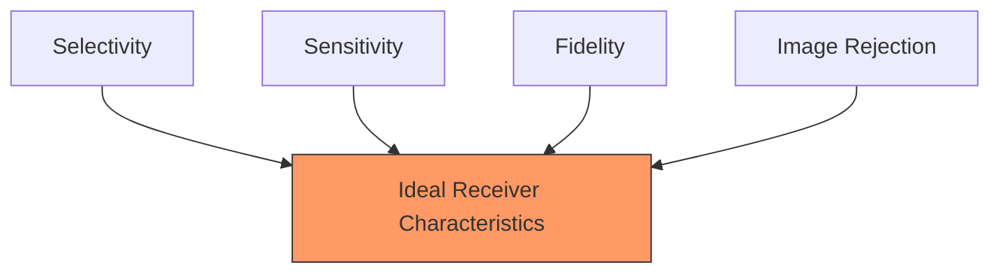

**મેમરી ટ્રીક:** "Select Signals Faithfully, Ignore Mirrors" (SSFIM)

## પ્રશ્ન 3(b) OR [4 ગુણ]

**AM ડિટેક્ટર સર્કિટમાં થતા વિકૃતિઓના પ્રકારો સમજાવો.**

**જવાબ**:

**AM ડિટેક્ટર સર્કિટમાં વિકૃતિઓના પ્રકારો**:

| વિકૃતિ પ્રકાર | કારણ | અસર | નિવારણ |
|---------------|------|------|---------|
| **ડાયાગોનલ વિકૃતિ** | ખોટો સમય અચળાંક | એન્વેલોપને અનુસરવામાં અસમર્થતા | યોગ્ય RC સમય અચળાંક |
| **નકારાત્મક પીક ક્લિપિંગ** | અયોગ્ય બાયસિંગ | માહિતીનો નુકસાન | યોગ્ય ડાયોડ બાયસિંગ |
| **હાર્મોનિક વિકૃતિ** | નોન-લીનિયર ડાયોડ લક્ષણો | ઓડિયો વિકૃતિ | ઉચ્ચ-ગુણવત્તાવાળા ડાયોડ |
| **આવર્તન વિકૃતિ** | અયોગ્ય ફિલ્ટરિંગ | અસમાન આવર્તન પ્રતિસાદ | યોગ્ય ફિલ્ટર ડિઝાઇન |

**ડાયાગ્રામ:**

```goat
Normal Detection:
    /\      /\      /\
   /  \    /  \    /  \
  /    \  /    \  /    \
 /      \/      \/      \

Diagonal Distortion:
    /\      /\      /\
   /  \    /  \    /  \
  /    \  /    \  /    \
 /      ╲_      ╲_      ╲_

Negative Peak Clipping:
    /\      /\      /\
   /  \    /  \    /  \
  /    \  /    \  /    \
_/______\/______\/______\
```

**મેમરી ટ્રીક:** "Diagonal Negative Harmonics Frequency - Distortion Types" (DNHF)

## પ્રશ્ન 3(c) OR [7 ગુણ]

**સુપરહીટેરોડીન AM રીસીવરનો બ્લોક ડાયાગ્રામ દોરો અને તેને સમજાવો.**

**જવાબ**:

**સુપરહીટેરોડીન AM રીસીવર**:

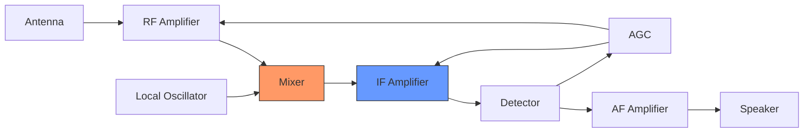

**દરેક બ્લોકનું કાર્ય**:

| બ્લોક | કાર્ય | મુખ્ય લક્ષણો |
|-------|-------|-------------|
| **RF એમ્પ્લિફાયર** | નબળા RF સિગ્નલને એમ્પ્લિફાય કરે છે | સંવેદનશીલતા, પસંદગીકારકતા સુધારે છે |
| **લોકલ ઓસીલેટર** | આવતા સિગ્નલથી નિશ્ચિત આવર્તન પર સિગ્નલ ઉત્પન્ન કરે છે | સ્થિરતા મહત્વપૂર્ણ છે |
| **મિક્સર** | RF અને લોકલ ઓસીલેટરને જોડીને IF ઉત્પન્ન કરે છે | સુપરહીટેરોડીન સિદ્ધાંત માટે મુખ્ય |
| **IF એમ્પ્લિફાયર** | મધ્યસ્થ આવર્તનને એમ્પ્લિફાય કરે છે | મુખ્ય ગેઇન સ્ટેજ, નિશ્ચિત આવર્તન |
| **ડિટેક્ટર** | મોડ્યુલેટેડ સિગ્નલમાંથી ઓડિયો એક્સ્ટ્રેક્ટ કરે છે | સામાન્ય રીતે ડાયોડ ડિટેક્ટર |
| **AF એમ્પ્લિફાયર** | સ્પીકર ચલાવવા માટે ઓડિયોને એમ્પ્લિફાય કરે છે | પાવર એમ્પ્લિફિકેશન |
| **AGC** | સ્થિર આઉટપુટ લેવલ જાળવે છે | RF અને IF એમ્પ્લિફાયરના ગેઇનને નિયંત્રિત કરે છે |

**મુખ્ય ફાયદા**:

- નિશ્ચિત IF આવર્તન ઓપ્ટિમાઇઝ્ડ એમ્પ્લિફિકેશનની મંજૂરી આપે છે
- વધુ સારી પસંદગીકારકતા અને સંવેદનશીલતા
- સરળ ટ્યુનિંગ

**મેમરી ટ્રીક:** "Radio Mixing Local Intermediate Detected Audio Signals" (RMLIDAS)

## પ્રશ્ન 4(a) [3 ગુણ]

**એનાલોગથી ડિજિટલ રૂપાંતરણમાં વપરાતી ક્વોન્ટાઇઝેશનની પ્રક્રિયા સમજાવો.**

**જવાબ**:

**ક્વોન્ટાઇઝેશન પ્રક્રિયા**:

| પગલું | વર્ણન | હેતુ |
|-------|-------|------|
| 1. **સેમ્પલિંગ** | સતત સિગ્નલને ડિસ્ક્રીટ-ટાઇમમાં રૂપાંતરિત કરવું | ક્વોન્ટાઇઝેશન માટે તૈયારી |
| 2. **લેવલ ફાળવણી** | એમ્પ્લિટ્યુડ રેન્જને ડિસ્ક્રીટ લેવલમાં વિભાજિત કરવું | ડિજિટલ સ્ટેપ્સ બનાવવા |
| 3. **અસાઇનમેન્ટ** | દરેક સેમ્પલને નજીકના ક્વોન્ટાઇઝેશન લેવલમાં મેપ કરવું | ડિજિટલ મૂલ્યમાં રૂપાંતર |
| 4. **એનકોડિંગ** | લેવલને બાઇનરી કોડમાં રૂપાંતરિત કરવું | અંતિમ ડિજિટલ રજૂઆત |

**ડાયાગ્રામ:**

```goat
Analog Signal:
    /\
   /  \
  /    \
 /      \

Quantized Signal:
    __
   |  |
  _|  |_
 |      |
```

**ક્વોન્ટાઇઝેશનના પ્રકાર**:

- **યુનિફોર્મ**: સમાન સ્ટેપ સાઇઝ
- **નોન-યુનિફોર્મ**: બદલાતા સ્ટેપ સાઇઝ
- **એડેપ્ટિવ**: સિગ્નલના આધારે સમાયોજિત

**મેમરી ટ્રીક:** "Sample Levels Assign Binary" (SLAB)

## પ્રશ્ન 4(b) [4 ગુણ]

**સેમ્પલિંગ તકનીકોની સરખામણી આપો.**

**જવાબ**:

**સેમ્પલિંગ તકનીકોની સરખામણી**:

| સેમ્પલિંગ તકનીક | વર્ણન | ફાયદા | ગેરલાભ |
|-----------------|---------|---------|---------|
| **આદર્શ સેમ્પલિંગ** | સિગ્નલનું તાત્કાલિક સેમ્પલિંગ | સંપૂર્ણ રજૂઆત | વ્યવહારિક રીતે અશક્ય |
| **નેચરલ સેમ્પલિંગ** | પલ્સનો ટોચનો ભાગ સિગ્નલના એમ્પ્લિટ્યુડને અનુસરે છે | ફ્લેટ ટોપ નથી | મુશ્કેલ અમલીકરણ |
| **ફ્લેટ-ટોપ સેમ્પલિંગ** | સેમ્પલ અને હોલ્ડ સર્કિટ | સરળ અમલીકરણ | વધારાની વિકૃતિ |

**ડાયાગ્રામ:**

```goat
Original Signal:
    /\      /\      /\
   /  \    /  \    /  \
  /    \  /    \  /    \
 /      \/      \/      \

Ideal Sampling:
   |      |      |
   |      |      |
   |      |      |
   |      |      |

Natural Sampling:
   /\     /\     /\
   |      |      |
   |      |      |
   |      |      |

Flat-top Sampling:
   ___     ___     ___
   |       |       |
   |       |       |
   |       |       |
```

**મેમરી ટ્રીક:** "Ideal Natural Flat - Sampling Types" (INF)

## પ્રશ્ન 4(c) [7 ગુણ]

**PCM ટ્રાન્સમીટર અને રીસીવરનો બ્લોક ડાયાગ્રામ દોરો અને સમજાવો.**

**જવાબ**:

**PCM ટ્રાન્સમીટર બ્લોક ડાયાગ્રામ**:


**PCM રીસીવર બ્લોક ડાયાગ્રામ**:


**PCM સિસ્ટમનું કાર્ય**:

| બ્લોક | કાર્ય |
|-------|-------|
| **લો-પાસ ફિલ્ટર** | એલિયાસિંગ ટાળવા માટે બેન્ડવિડ્થ મર્યાદિત કરે છે |
| **સેમ્પલ & હોલ્ડ** | નિયમિત અંતરાલે એનાલોગ સિગ્નલને સેમ્પલ કરે છે |
| **ક્વોન્ટાઇઝર** | સેમ્પલને ડિસ્ક્રીટ લેવલ અસાઇન કરે છે |
| **એનકોડર** | ક્વોન્ટાઇઝ્ડ મૂલ્યોને બાઇનરી કોડમાં રૂપાંતરિત કરે છે |
| **મલ્ટિપ્લેક્સર** | બહુવિધ PCM ચેનલોને સંયોજિત કરે છે |
| **લાઇન કોડર** | ટ્રાન્સમિશન માટે સિગ્નલ તૈયાર કરે છે |
| **ડિમલ્ટિપ્લેક્સર** | રિસીવર પર ચેનલોને અલગ કરે છે |
| **ડિકોડર** | બાઇનરીને ક્વોન્ટાઇઝ્ડ મૂલ્યોમાં પાછું રૂપાંતરિત કરે છે |
| **રિકન્સ્ટ્રક્શન ફિલ્ટર** | એનાલોગ મેળવવા માટે સીડી સ્મૂધ કરે છે |

**મેમરી ટ્રીક:** "Filter, Sample, Quantize, Encode, Multiplex, Transmit" (FSQEMT)

## પ્રશ્ન 4(a) OR [3 ગુણ]

**Nyquist પ્રમેય જણાવો અને સમજાવો.**

**જવાબ**:

**Nyquist પ્રમેય**:

- **વક્તવ્ય**: બેન્ડલિમિટેડ સિગ્નલને સંપૂર્ણ રીતે પુનઃનિર્માણ કરવા માટે, સેમ્પલિંગ આવર્તન સિગ્નલમાં સૌથી ઉચ્ચ આવર્તન ઘટકના ઓછામાં ઓછા બમણો હોવો જોઈએ.

| સંકલ્પના | સૂત્ર | સમજૂતી |
|---------|------|---------|
| **સેમ્પલિંગ રેટ** | fs ≥ 2fmax | જરૂરી ન્યૂનતમ સેમ્પલિંગ આવર્તન |
| **Nyquist રેટ** | 2fmax | એલિયાસિંગ ટાળવા માટે ન્યૂનતમ સેમ્પલિંગ રેટ |
| **Nyquist અંતરાલ** | 1/(2fmax) | સેમ્પલ વચ્ચેનો મહત્તમ સમય |

**ડાયાગ્રામ:**

```goat
Proper Sampling (fs > 2fmax):
  *   *   *   *   *   *   *
 /|\  /|\  /|\  /|\  /|\  /|\
/ | \/| | /| | /| | /| | /| | \
  |   |   |   |   |   |   |

Undersampling (fs < 2fmax):
  *       *       *       *
 /|\     /|\     /|\     /|\
/ | \   / | \   / | \   / | \
  |       |       |       |
  |       |       |       |
  * Aliasing occurs! *    *
```

**પરિણામો**:

- **અન્ડરસેમ્પલિંગ**: એલિયાસિંગ થાય છે
- **ક્રિટિકલ સેમ્પલિંગ**: ભૂલ માટે કોઈ માર્જિન નથી
- **ઓવરસેમ્પલિંગ**: વધુ સારું પુનઃનિર્માણ પરંતુ વધુ ડેટા

**મેમરી ટ્રીક:** "Double Maximum Frequency Stops Aliasing" (DMFSA)

## પ્રશ્ન 4(b) OR [4 ગુણ]

**DM, ADM અને DPCMની સરખામણી આપો.**

**જવાબ**:

**DM, ADM અને DPCMની સરખામણી**:

| પરિમાણ | ડેલ્ટા મોડ્યુલેશન (DM) | એડેપ્ટિવ ડેલ્ટા મોડ્યુલેશન (ADM) | ડિફરન્શિયલ PCM (DPCM) |
|---------|-------------------|--------------------------|---------------------|
| **સિદ્ધાંત** | તફાવતનું 1-બિટ ક્વોન્ટાઇઝેશન | પરિવર્તનશીલ સ્ટેપ સાઇઝ DM | તફાવતનું મલ્ટી-બિટ ક્વોન્ટાઇઝેશન |
| **બિટ રેટ** | સૌથી ઓછો | ઓછો | મધ્યમ |
| **જટિલતા** | સરળ | મધ્યમ | જટિલ |
| **સિગ્નલ ગુણવત્તા** | નીચી | મધ્યમ | ઉચ્ચ |
| **સમસ્યાઓ** | સ્લોપ ઓવરલોડ, ગ્રેન્યુલર નોઇઝ | ઘટાડેલ સ્લોપ ઓવરલોડ | પ્રિડિક્શન ભૂલો |
| **ઉપયોગ** | સ્પીચ ટ્રાન્સમિશન | વોઇસ કોમ્યુનિકેશન | ઓડિયો, વિડિયો કમ્પ્રેશન |

**ડાયાગ્રામ:**

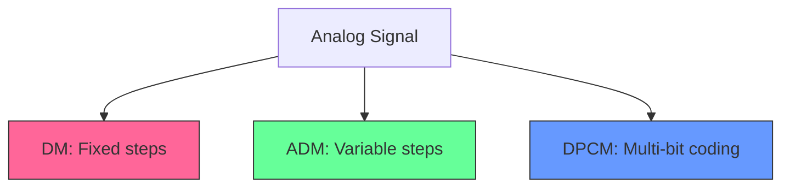

**મેમરી ટ્રીક:** "Single-bit, Adaptive-bit, Multi-bit Difference" (SAMD)

## પ્રશ્ન 4(c) OR [7 ગુણ]

**ડિફરન્શિયલ PCM (DPCM) ટ્રાન્સમીટર અને રીસીવરની કાર્યગીરી સમજાવો.**

**જવાબ**:

**DPCM ટ્રાન્સમીટર**:

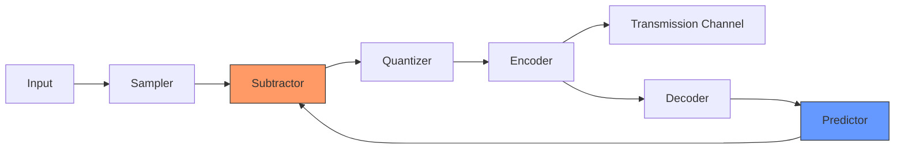

**DPCM રીસીવર**:

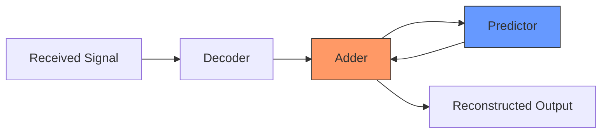

**કાર્ય સિદ્ધાંત**:

| ઘટક | કાર્ય |
|------|------|
| **સેમ્પલર** | એનાલોગને ડિસ્ક્રીટ-ટાઇમ સિગ્નલમાં રૂપાંતરિત કરે છે |
| **પ્રેડિક્ટર** | અગાઉના સેમ્પલથી વર્તમાન સેમ્પલનો અંદાજ લગાવે છે |
| **સબટ્રેક્ટર** | વાસ્તવિક અને અંદાજિત વચ્ચેનો તફાવત ગણે છે |
| **ક્વોન્ટાઇઝર** | તફાવત સિગ્નલને સ્તરો આપે છે |
| **એનકોડર** | બાઇનરી કોડમાં રૂપાંતરિત કરે છે |
| **ડિકોડર** | બાઇનરીને ક્વોન્ટાઇઝ્ડ તફાવતમાં રૂપાંતરિત કરે છે |
| **એડર** | તફાવતને પ્રેડિક્શન સાથે જોડે છે |

**મુખ્ય ફાયદા**:

- **ઘટાડેલ બિટ રેટ**: તફાવતને એનકોડ કરે છે જે નાના હોય છે
- **વધુ સારી ગુણવત્તા**: સિગ્નલ સહસંબંધનો ઉપયોગ કરે છે
- **સુસંગતતા**: PCM ફ્રેમવર્ક સાથે સમાન

**મેમરી ટ્રીક:** "Predict Subtract Quantize Difference" (PSQD)

## પ્રશ્ન 5(a) [3 ગુણ]

**TDMA ફ્રેમનું વર્ણન કરો.**

**જવાબ**:

**TDMA (ટાઇમ ડિવિઝન મલ્ટિપલ એક્સેસ) ફ્રેમ**:

| ઘટક | વર્ણન | હેતુ |
|------|------|------|
| **ટાઇમ સ્લોટ્સ** | વપરાશકર્તાઓને સોંપવામાં આવેલા વ્યક્તિગત વિભાગો | બહુવિધ વપરાશકર્તાઓને ચેનલ શેર કરવાની મંજૂરી આપે છે |
| **ગાર્ડ ટાઇમ** | સ્લોટ્સ વચ્ચે નાનો ગેપ | વપરાશકર્તાઓ વચ્ચે ઓવરલેપ અટકાવે છે |
| **પ્રીએમ્બલ** | શરૂઆતમાં સિન્ક્રોનાઇઝેશન બિટ્સ | રિસીવરને સિન્ક્રોનાઇઝ કરવામાં મદદ કરે છે |
| **કંટ્રોલ બિટ્સ** | સિસ્ટમ નિયંત્રણ માટે વિશેષ બિટ્સ | ફ્રેમ ઓપરેશન મેનેજ કરે છે |

**ડાયાગ્રામ:**

```goat
 ┌─────┬─────┬─────┬─────┬─────┬─────┐
 │Sync │User1│User2│User3│User4│Ctrl │
 └─────┴─────┴─────┴─────┴─────┴─────┘
   └┬┘   └────────────┬────────────┘
 Header         Time slots
```

**TDMA ફ્રેમ સ્ટ્રક્ચર**:

- દરેક વપરાશકર્તા સોંપાયેલ ટાઇમ સ્લોટમાં ટ્રાન્સમિટ કરે છે
- સંપૂર્ણ ફ્રેમ ચક્રીય રીતે પુનરાવર્તિત થાય છે
- ફ્રેમની લંબાઈ વપરાશકર્તાઓની સંખ્યા પર આધારિત છે

**મેમરી ટ્રીક:** "Slots In Time Divide Access" (SITDA)

## પ્રશ્ન 5(b) [4 ગુણ]

**4 સ્તરના ડિજિટલ મલ્ટિપ્લેક્સિંગ વંશવેલો દોરો અને સમજાવો.**

**જવાબ**:

**4-સ્તરીય ડિજિટલ મલ્ટિપ્લેક્સિંગ હાયરાર્કી**:

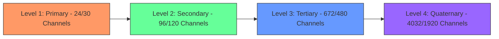

**હાયરાર્કી વિગતો**:

| સ્તર | નામ | નોર્થ અમેરિકન સિસ્ટમ | યુરોપિયન સિસ્ટમ |
|------|-----|-------------------|----------------|
| **સ્તર 1** | પ્રાથમિક (T1/E1) | 24 ચેનલ, 1.544 Mbps | 30 ચેનલ, 2.048 Mbps |
| **સ્તર 2** | માધ્યમિક (T2/E2) | 96 ચેનલ, 6.312 Mbps | 120 ચેનલ, 8.448 Mbps |
| **સ્તર 3** | તૃતીય (T3/E3) | 672 ચેનલ, 44.736 Mbps | 480 ચેનલ, 34.368 Mbps |
| **સ્તર 4** | ચતુર્થ (T4/E4) | 4032 ચેનલ, 274.176 Mbps | 1920 ચેનલ, 139.264 Mbps |

**મેમરી ટ્રીક:** "Primary, Secondary, Tertiary, Quaternary Levels" (PSTQ)

## પ્રશ્ન 5(c) [7 ગુણ]

**PCM-TDM સિસ્ટમનો બ્લોક ડાયાગ્રામ દોરો અને સમજાવો.**

**જવાબ**:

**PCM-TDM સિસ્ટમ બ્લોક ડાયાગ્રામ**:

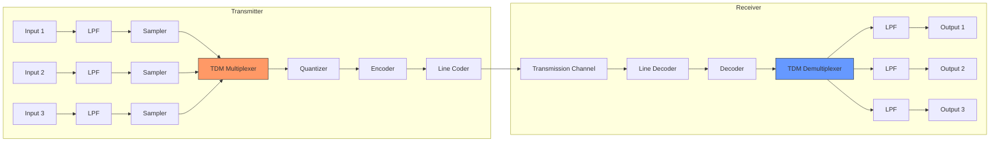

**PCM-TDM સિસ્ટમનું કાર્ય**:

| બ્લોક | કાર્ય |
|-------|-------|
| **લો-પાસ ફિલ્ટર** | એલિયાસિંગ અટકાવવા માટે સિગ્નલ બેન્ડવિડ્થ મર્યાદિત કરે છે |
| **સેમ્પલર** | એનાલોગને ડિસ્ક્રીટ-ટાઇમ સિગ્નલમાં રૂપાંતરિત કરે છે |
| **TDM મલ્ટિપ્લેક્સર** | બહુવિધ ચેનલ્સથી સેમ્પલ્સ જોડે છે |
| **ક્વોન્ટાઇઝર** | સેમ્પલ્સને ડિસ્ક્રીટ સ્તરો આપે છે |
| **એનકોડર** | બાઇનરી કોડમાં રૂપાંતરિત કરે છે |
| **લાઇન કોડર** | ટ્રાન્સમિશન માટે સિગ્નલ તૈયાર કરે છે |
| **લાઇન ડિકોડર** | બાઇનરી માહિતી પુનઃપ્રાપ્ત કરે છે |
| **ડિકોડર** | બાઇનરીને ક્વોન્ટાઇઝ્ડ મૂલ્યોમાં રૂપાંતરિત કરે છે |
| **TDM ડિમલ્ટિપ્લેક્સર** | રિસીવર પર ચેનલ્સને અલગ કરે છે |
| **રિકન્સ્ટ્રક્શન ફિલ્ટર** | એનાલોગ પુનઃપ્રાપ્ત કરવા માટે સીડી સ્મૂધ કરે છે |

**મુખ્ય લક્ષણો**:

- બહુવિધ એનાલોગ ચેનલ્સ એક સિંગલ ડિજિટલ ટ્રાન્સમિશન લિંક શેર કરે છે
- દરેક ચેનલને ક્રમિક રીતે સેમ્પલ કરવામાં આવે છે
- સેમ્પલ્સ સમયમાં ઇન્ટરલેસ્ડ થાય છે
- ફ્રેમ સિન્ક્રોનાઇઝેશન યોગ્ય ડિમલ્ટિપ્લેક્સિંગ સુનિશ્ચિત કરે છે

**મેમરી ટ્રીક:** "Many Analog Channels Share Digital Link" (MACSDL)

## પ્રશ્ન 5(a) OR [3 ગુણ]

**ડિજિટલ કમ્યુનિકેશનના ફાયદા અને ગેરફાયદાની સૂચિ બનાવો.**

**જવાબ**:

**ડિજિટલ કમ્યુનિકેશનના ફાયદા અને ગેરફાયદા**:

| ફાયદા | ગેરફાયદા |
|--------|-----------|
| **નોઇઝ ઇમ્યુનિટી**: નોઇઝ પ્રત્યે વધુ સારો પ્રતિકાર | **બેન્ડવિડ્થ**: વધુ બેન્ડવિડ્થની જરૂર પડે છે |
| **એરર ડિટેક્શન**: ભૂલો શોધી/સુધારી શકે છે | **જટિલતા**: વધુ જટિલ સર્કિટરી |
| **મલ્ટિપ્લેક્સિંગ**: કુશળ ચેનલ શેરિંગ | **સિન્ક્રોનાઇઝેશન**: ચોક્કસ ટાઇમિંગની જરૂર પડે છે |
| **સુરક્ષા**: સરળ એન્ક્રિપ્શન | **ક્વોન્ટાઇઝેશન નોઇઝ**: A/D રૂપાંતરમાં અંતર્ગત |
| **એકીકરણ**: કમ્પ્યુટર સાથે સુસંગત | **કિંમત**: પ્રારંભિક સેટઅપ કિંમત વધુ છે |
| **રિજનરેશન**: સિગ્નલ પુનઃ જનરેટ કરી શકાય છે | **રૂપાંતર**: A/D રૂપાંતર વિલંબ ઉમેરે છે |

**મેમરી ટ્રીક:** "Noise-resistant, Error-correcting, Multiplex-friendly But Bandwidth-hungry" (NEMBB)

## પ્રશ્ન 5(b) OR [4 ગુણ]

**ચેનલ કોડિંગ તકનીકોની સૂચિ બનાવો, તેમાંથી કોઇ પણ એકને ઉદાહરણ સાથે સમજાવો.**

**જવાબ**:

**ચેનલ કોડિંગ તકનીકો**:

| તકનીક | હેતુ |
|--------|------|
| **બ્લોક કોડિંગ** | પેરિટી સાથે ફિક્સ્ડ-લેન્થ બ્લોક્સ |
| **કન્વોલ્યુશનલ કોડિંગ** | મેમરી સાથે સતત એનકોડિંગ |
| **ટર્બો કોડિંગ** | પેરેલેલ કોન્કેટેનેટેડ કોડ્સ |
| **LDPC કોડિંગ** | લો-ડેન્સિટી પેરિટી ચેક |
| **રીડ-સોલોમન** | શક્તિશાળી બ્લોક કોડ |

**બ્લોક કોડિંગ ઉદાહરણ: હેમિંગ કોડ (7,4)**

આ કોડ 4 ડેટા બિટ્સ લે છે અને 7-બિટ કોડવર્ડ બનાવવા માટે 3 પેરિટી બિટ્સ ઉમેરે છે.

| પગલું | વર્ણન | ઉદાહરણ |
|-------|--------|---------|
| 1. **ડેટા બિટ્સ** | ઓરિજિનલ મેસેજ | 1011 |
| 2. **બિટ પોઝિશન** | પોઝિશન 1 થી 7 સુધી નંબર | ડેટા માટે પોઝિશન 3,5,6,7 |
| 3. **પેરિટી બિટ્સ** | પોઝિશન 1,2,4 માટે ગણતરી | P1=1, P2=0, P4=1 |
| 4. **કોડવર્ડ** | પેરિટી અને ડેટા જોડો | 1011011 |

**એરર ડિટેક્શન**:

- જો સિંગલ બિટ એરર થાય છે, તો પેરિટી બિટ્સની પુનઃગણતરી એરર પોઝિશન ઓળખે છે
- ઉદાહરણ: 1**0**11011 → 1**1**11011 (પોઝિશન 2 પર એરર)

**મેમરી ટ્રીક:** "Parity Bits Protect Data Bits" (PBPDB)

## પ્રશ્ન 5(c) OR [7 ગુણ]

**મૂળભૂત ટાઇમ ડોમેન ડિજિટલ મલ્ટિપ્લેક્સિંગની ચર્ચા કરો. TDM સિસ્ટમના ફાયદા અને ગેરફાયદા જણાવો.**

**જવાબ**:

**મૂળભૂત ટાઇમ ડોમેન ડિજિટલ મલ્ટિપ્લેક્સિંગ**:

ટાઇમ ડિવિઝન મલ્ટિપ્લેક્સિંગ (TDM) એ એક તકનીક છે જે દરેક સિગ્નલને અનન્ય ટાઇમ સ્લોટ ફાળવીને બહુવિધ ડિજિટલ સિગ્નલ્સને સામાન્ય ટ્રાન્સમિશન માધ્યમ શેર કરવાની મંજૂરી આપે છે.

| ઓપરેટિંગ સિદ્ધાંત | અમલીકરણ |
|-----------------|------------|
| **ચેનલ ફાળવણી** | દરેક સ્ત્રોતને સમયાંતરે ટાઇમ સ્લોટ મળે છે |
| **ફ્રેમ સ્ટ્રક્ચર** | સિન્ક બિટ્સ સાથે સ્લોટ્સ ફ્રેમમાં વ્યવસ્થિત કરવામાં આવે છે |
| **સિન્ક્રોનાઇઝેશન** | ટ્રાન્સમીટર અને રિસીવરે ટાઇમિંગ જાળવવી જોઈએ |
| **થ્રુપુટ** | ચેનલની સંખ્યા અને સેમ્પલિંગ રેટ પર આધારિત |

**TDM સિસ્ટમ ડાયાગ્રામ**:

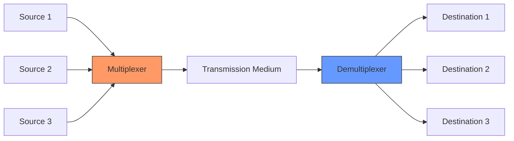

**TDM સિસ્ટમના ફાયદા**:

| ફાયદો | સમજૂતી |
|-------|---------|
| **કુશળ ઉપયોગ** | ચેનલનો સતત ઉપયોગ થાય છે |
| **ઘટાડેલ ક્રોસટોક** | ચેનલો વચ્ચે આવર્તન ઓવરલેપ નથી |
| **લવચીકતા** | ચેનલ્સ ઉમેરવું/દૂર કરવું સરળ છે |
| **ડિજિટલ સાથે સુસંગત** | ડિજિટલ સિસ્ટમ સાથે કુદરતી રીતે કામ કરે છે |
| **સરળ હાર્ડવેર** | જટિલ ફિલ્ટરની જરૂર નથી |

**TDM સિસ્ટમના ગેરફાયદા**:

| ગેરફાયદો | સમજૂતી |
|-----------|---------|
| **સિન્ક્રોનાઇઝેશન** | ચોક્કસ ટાઇમિંગની જરૂર પડે છે |
| **બફરિંગ** | સેમ્પલ્સ વચ્ચે સ્ટોરેજની જરૂર પડી શકે છે |
| **ઓવરહેડ** | સિન્ક બિટ્સ કાર્યક્ષમતા ઘટાડે છે |
| **વિલંબ** | ટાઇમ સ્લોટની રાહ જોવી પડે છે |
| **બગાડ ક્ષમતા** | ચેનલ નિષ્ક્રિય હોય તો ખાલી સ્લોટ્સ |

**મેમરી ટ્રીક:** "Time Slots Shared But Sync Required" (TSSBSR)
