## Question 1(a) [3 marks]

**Classify Noise signal and explain thermal noise.**

**Answer**:

Noise signals can be classified as:

| Type of Noise | Source | Characteristics |
|---------------|--------|-----------------|
| **External Noise** | Outside communication system | Atmospheric, Space, Industrial |
| **Internal Noise** | Inside communication system | Thermal, Shot, Transit time, Flicker |

**Thermal Noise**:

- **Definition**: Random motion of electrons in a conductor due to temperature
- **Characteristics**: White noise with uniform power across frequency spectrum
- **Formula**: N = kTB (k=Boltzmann constant, T=Temperature, B=Bandwidth)

**Mnemonic:** "Temperature Excites Random Movements" (TERM)

## Question 1(b) [4 marks]

**Comparison between Pre-emphasis and De-emphasis technique.**

**Answer**:

| Parameter | Pre-emphasis | De-emphasis |
|-----------|--------------|-------------|
| **Definition** | Boosting high-frequency components before transmission | Attenuating high-frequency components at receiver |
| **Location** | Transmitter side | Receiver side |
| **Purpose** | Improves SNR for high frequencies | Restores original signal frequency response |
| **Circuit** | High-pass filter with RC circuit | Low-pass filter with RC circuit |
| **Time Constant** | 75 μs (standard) | 75 μs (matches pre-emphasis) |

**Diagram/Circuit:**


**Mnemonic:** "Pump Up Before Transmit, Pull Down After Receive" (PUBTAR)

## Question 1(c) [7 marks]

**Derive mathematical expression of AM signal and with help of it explain frequency spectrum of AM signal.**

**Answer**:

**Mathematical Expression Derivation**:

1. Let the carrier signal be: c(t) = Ac cos(2πfct)
2. Let the modulating signal be: m(t) = Am cos(2πfmt)
3. AM signal: s(t) = Ac[1 + μ·m(t)/Am]cos(2πfct)
   where μ = modulation index

4. Substituting m(t):
   s(t) = Ac[1 + μ·cos(2πfmt)]cos(2πfct)

5. Using trigonometric identity cos(A)·cos(B) = ½cos(A+B) + ½cos(A-B):
   s(t) = Ac·cos(2πfct) + (μAc/2)·cos(2π(fc+fm)t) + (μAc/2)·cos(2π(fc-fm)t)

**Frequency Spectrum**:

| Component | Frequency | Amplitude |
|-----------|-----------|-----------|
| Carrier | fc | Ac |
| Upper Sideband | fc + fm | μAc/2 |
| Lower Sideband | fc - fm | μAc/2 |

**Diagram:**

```goat
    │    
    │           ┌─┐
    │           │ │
    │           │ │
    │    ┌─┐    │ │    ┌─┐
    │    │ │    │ │    │ │
    │    │ │    │ │    │ │
    │    │ │    │ │    │ │
────┼────┼─┼────┼─┼────┼─┼────────►f
    │   fc-fm   fc    fc+fm
    │
    │   LSB    Carrier   USB
```

**Mnemonic:** "Carrier Standing Between Twins" (CSBT)

## Question 1(c) OR [7 marks]

**Explain block diagram of Communication System.**

**Answer**:

**Block Diagram of Communication System**:

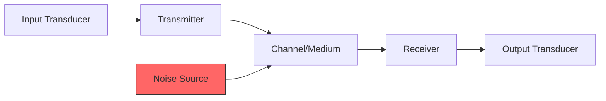

**Components and Functions**:

| Block | Function | Example |
|-------|----------|---------|
| **Input Transducer** | Converts original information to electrical signal | Microphone, Camera |
| **Transmitter** | Processes signal for efficient transmission (modulation, amplification) | Radio transmitter |
| **Channel/Medium** | Path through which signal travels | Air, Fiber, Cable |
| **Receiver** | Extracts original signal (amplification, filtering, demodulation) | Radio receiver |
| **Output Transducer** | Converts electrical signal back to original form | Speaker, Display |
| **Noise Source** | Unwanted signals that distort the information | Atmospheric, Thermal |

**Mnemonic:** "Input Transmits Through Channel, Receives Output" (ITCRO)

## Question 2(a) [3 marks]

**Discuss power distribution among sidebands and carrier in amplitude modulation.**

**Answer**:

**Power Distribution in AM Signal**:

| Component | Power Formula | Percentage (for m=1) |
|-----------|---------------|----------------------|
| Carrier | Pc = (Ac²/2) | 67% |
| Upper Sideband | PUSB = (Pc·m²)/4 | 16.5% |
| Lower Sideband | PLSB = (Pc·m²)/4 | 16.5% |
| Total Power | PT = Pc(1+m²/2) | 100% |

**Diagram:**

```goat
   Power
     │
 100%┤                ┌───┐
     │                │   │
     │                │   │
  67%┤       ┌───┐    │   │
     │       │   │    │   │
     │       │   │    │   │
     │       │   │    │   │
16.5%┤┌───┐  │   │  ┌─┴─┐ │
     ││LSB│  │ C │  │USB│ │
     │└───┘  │   │  └───┘ │
   0%┼──────────────────────►
     │ Components of AM
```

**Mnemonic:** "Carrier Takes Two-Thirds" (CTTT)

## Question 2(b) [4 marks]

**Why pre-emphases and de-emphases are used? Briefly describe how the signals are modified at transmitter side and receiver side.**

**Answer**:

**Purpose of Pre-emphasis and De-emphasis**:

| Purpose | Explanation |
|---------|-------------|
| Improve SNR | Boosts high frequencies before transmission to overcome noise |
| Reduce Noise | High frequencies in FM are more susceptible to noise |
| Maintain Fidelity | Ensures overall frequency response remains flat |

**Signal Modification Process**:

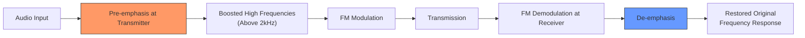

**Mnemonic:** "Boost High, Cut High, Keep Original" (BHCKO)

## Question 2(c) [7 marks]

**Explain FM generation techniques. Explain Phase locked loop FM modulator in detail.**

**Answer**:

**FM Generation Techniques**:

| Technique | Principle | Advantages |
|-----------|-----------|------------|
| Direct FM | Varying capacitance in oscillator | Simple design |
| Indirect FM | Phase modulation to produce FM | Better stability |
| PLL FM | Using phase locked loop | High frequency stability |
| Armstrong method | Using mixers and filters | Excellent linearity |

**PLL FM Modulator**:

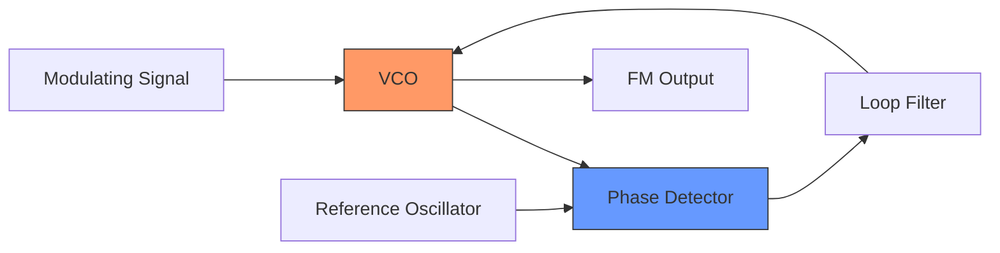

**Working Principle**:

1. **Phase Detector** compares VCO output with reference oscillator
2. **Loop Filter** removes high-frequency components
3. **VCO** (Voltage Controlled Oscillator) frequency changes with modulating signal
4. Modulating signal directly controls the VCO
5. PLL ensures high stability and linearity

**Mnemonic:** "Phase Detector Compares, Filter Smooths, VCO Varies" (PDCFV)

## Question 2(a) OR [3 marks]

**State advantages and disadvantage of SSB over DSB.**

**Answer**:

**Advantages and Disadvantages of SSB over DSB**:

| Advantages of SSB | Disadvantages of SSB |
|-------------------|----------------------|
| **Bandwidth Efficiency**: Uses only half the bandwidth | **Complex Circuitry**: Requires complex filtering |
| **Power Efficiency**: Uses about 1/3 the power | **Difficult Demodulation**: Needs carrier recovery |
| **Reduced Fading**: Less susceptible to selective fading | **Distortion**: May distort low frequencies |
| **Less Interference**: Narrower channel means less overlap | **Cost**: More expensive than DSB systems |

**Mnemonic:** "Power and Bandwidth Saved, But Complex Circuits Needed" (PBSCN)

## Question 2(b) OR [4 marks]

**Sketch the frequency spectrum of DSBSC and SSB amplitude modulated wave and pilot carrier.**

**Answer**:

**DSBSC Frequency Spectrum**:

```goat
    │    
    │    
    │    ┌─┐         ┌─┐
    │    │ │         │ │
    │    │ │         │ │
    │    │ │         │ │
────┼────┼─┼─────────┼─┼────────►f
    │   fc-fm       fc+fm
    │
    │    LSB         USB
```

**SSB (Upper Sideband) with Pilot Carrier**:

```goat
    │    
    │             │
    │             │
    │             │         ┌─┐
    │             │         │ │
    │             │         │ │
    │             │         │ │
────┼─────────────┼─────────┼─┼────►f
    │             fc        fc+fm
    │             │
    │        Pilot Carrier   USB
```

**Comparison Table**:

| Spectrum Type | Bandwidth | Components | Power Efficiency |
|---------------|-----------|------------|------------------|
| **DSBSC** | 2fm | LSB + USB | Medium (no carrier power) |
| **SSB** | fm | USB or LSB | High (one sideband only) |
| **SSB with Pilot** | fm + small | USB/LSB + reduced carrier | Good (minimal carrier power) |

**Mnemonic:** "Two Sides, One Side, or One Side Plus Pilot" (TSOSP)

## Question 2(c) OR [7 marks]

**Write a short-note on: Pulse modulation.**

**Answer**:

**Pulse Modulation Techniques**:

Pulse modulation is a process where continuous analog signal is sampled and converted into pulses.

| Type | Description | Principle | Application |
|------|-------------|-----------|-------------|
| **PAM (Pulse Amplitude Modulation)** | Amplitude of pulses varies with signal | Sampling and holding | Intermediate step for PCM |
| **PWM (Pulse Width Modulation)** | Width/duration of pulses varies | Comparing with ramp | Motor control, power control |
| **PPM (Pulse Position Modulation)** | Position of pulses varies | Timing shift | Optical communication, radar |
| **PCM (Pulse Code Modulation)** | Digital representation using binary code | Quantizing and encoding | Digital telephony, CDs |

**Waveform Comparison**:

```goat
Original Signal:
   /\      /\      /\
  /  \    /  \    /  \
 /    \  /    \  /    \
/      \/      \/      \

PAM:
   |      |      |
   |      |      |
   |      |      |
   |      |      |

PWM:
   ____    _____    __
  |    |  |     |  |  |
  |    |  |     |  |  |
__|    |__|     |__|  |__

PPM:
   _     _     _
  | |   | |   | |
  | |   | |   | |
__|_|___|_|___|_|_____
```

**Mnemonic:** "Amplitude, Width, Position, Code - All Pulse Types" (AWPC)

## Question 3(a) [3 marks]

**What is AGC? Draw and explain input-output characteristic curve of simple AGC circuit.**

**Answer**:

**Automatic Gain Control (AGC)**:

- **Definition**: Circuit that automatically adjusts gain to maintain constant output level
- **Purpose**: Compensates for varying signal strength in receivers
- **Types**: Simple AGC, Delayed AGC, Amplified AGC

**Input-Output Characteristic Curve**:

```goat
    Output
     │
  Max┤- - - - - - - - - - - - - -
     │                  ┌───────
     │                 /
     │                /
     │               /
     │              /
     │             /  With AGC
     │         ┌──┘
     │        /
     │       /
     │      /
     │     /
   Min┤    /
     │   /  Without AGC
     │  /
     │ /
     │/
     └─────────────────────────► Input
       Min               Max
```

**Working**: As input increases, gain decreases to keep output nearly constant after threshold

**Mnemonic:** "Strong Signals Get Less Gain" (SSLG)

## Question 3(b) [4 marks]

**Write a short-note on balanced ratio detector for FM demodulation.**

**Answer**:

**Balanced Ratio Detector**:

| Feature | Description |
|---------|-------------|
| **Definition** | FM demodulator using a balanced circuit to convert frequency variations to amplitude variations |
| **Key Components** | Two diodes, transformer with center-tapped secondary, balanced capacitors |
| **Advantages** | Superior noise immunity, AM rejection, stability |
| **Applications** | FM receivers, broadcast receivers |

**Circuit Diagram**:

```goat
     +-----+     +-----+
     |     |-----|     |
     |  T  |     |  D1 |
     |     |--+--|     |
in-->|     |  |  +-----+
     |     |  |
     |     |  |  +-----+
     |     |-----|     |
     +-----+     |  D2 |
                 |     |
                 +-----+
                   |
                   v
                 output
```

**Working Principle**: 

- Transformer creates phase-shifted signals for the diodes
- Diodes charge capacitors with different polarities
- As frequency deviates, voltage ratio changes proportionally
- Output is proportional to frequency deviation

**Mnemonic:** "Balanced Diodes Transform Frequency To Voltage" (BDTFV)

## Question 3(c) [7 marks]

**Explain working of various types of FM demodulator circuits.**

**Answer**:

**Types of FM Demodulator Circuits**:

| Demodulator Type | Working Principle | Advantages | Disadvantages |
|------------------|-------------------|------------|---------------|
| **Slope Detector** | Uses slope of tuned circuit response | Simple design | Poor linearity, poor AM rejection |
| **Foster-Seeley Discriminator** | Uses phase shifts in transformer | Good linearity | Sensitive to amplitude variations |
| **Ratio Detector** | Modified discriminator with amplitude limiting | Good AM rejection | Moderate linearity |
| **PLL Demodulator** | Phase comparison with VCO | Excellent linearity, good noise immunity | Complex circuit |
| **Quadrature Detector** | Phase shifting and multiplication | Simple IC implementation | Limited bandwidth |

**PLL FM Demodulator Circuit**:

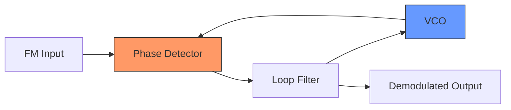

**Working Principle**:

1. Phase detector compares incoming FM with VCO output
2. Error voltage is filtered to remove high frequencies
3. VCO is forced to track input frequency
4. Filter output is proportional to frequency deviation
5. This output is the demodulated FM signal

**Mnemonic:** "Frequency Variations Drive Phase Errors" (FVDPE)

## Question 3(a) OR [3 marks]

**Explain characteristics of a Radio receiver.**

**Answer**:

**Characteristics of a Radio Receiver**:

| Characteristic | Definition | Importance |
|----------------|------------|------------|
| **Sensitivity** | Ability to amplify weak signals | Determines maximum reception range |
| **Selectivity** | Ability to separate desired signal from adjacent signals | Prevents interference |
| **Fidelity** | Accuracy in reproducing original signal | Ensures sound quality |
| **Image Frequency Rejection** | Ability to reject image frequency | Prevents duplicate reception |

**Diagram:**

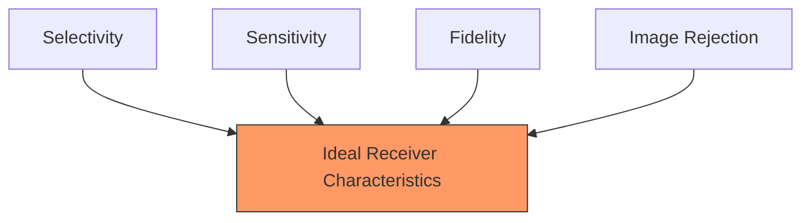

**Mnemonic:** "Select Signals Faithfully, Ignore Mirrors" (SSFIM)

## Question 3(b) OR [4 marks]

**Explain types of distortions occur in AM detector circuit.**

**Answer**:

**Types of Distortions in AM Detector Circuit**:

| Distortion Type | Cause | Effect | Prevention |
|-----------------|-------|--------|------------|
| **Diagonal Distortion** | Incorrect time constant | Inability to follow envelope | Proper RC time constant |
| **Negative Peak Clipping** | Improper biasing | Loss of information | Proper diode biasing |
| **Harmonic Distortion** | Non-linear diode characteristics | Audio distortion | High-quality diodes |
| **Frequency Distortion** | Improper filtering | Uneven frequency response | Proper filter design |

**Diagram:**

```goat
Normal Detection:
    /\      /\      /\
   /  \    /  \    /  \
  /    \  /    \  /    \
 /      \/      \/      \

Diagonal Distortion:
    /\      /\      /\
   /  \    /  \    /  \
  /    \  /    \  /    \
 /      ╲_      ╲_      ╲_

Negative Peak Clipping:
    /\      /\      /\
   /  \    /  \    /  \
  /    \  /    \  /    \
_/______\/______\/______\
```

**Mnemonic:** "Diagonal Negative Harmonics Frequency - Distortion Types" (DNHF)

## Question 3(c) OR [7 marks]

**Draw the block diagram of a Superheterodyne AM receiver and explain it.**

**Answer**:

**Superheterodyne AM Receiver**:

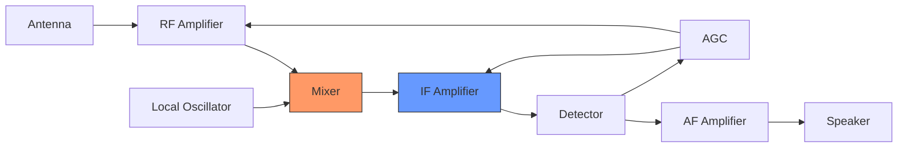

**Function of Each Block**:

| Block | Function | Key Characteristics |
|-------|----------|---------------------|
| **RF Amplifier** | Amplifies weak RF signals | Improves sensitivity, selectivity |
| **Local Oscillator** | Generates signal at fixed frequency above incoming signal | Stability is critical |
| **Mixer** | Combines RF and local oscillator to produce IF | Key to superheterodyne principle |
| **IF Amplifier** | Amplifies intermediate frequency | Main gain stage, fixed frequency |
| **Detector** | Extracts audio from modulated signal | Typically diode detector |
| **AF Amplifier** | Amplifies audio to drive speaker | Power amplification |
| **AGC** | Maintains constant output level | Controls gain of RF and IF amplifiers |

**Key Advantages**:

- Fixed IF frequency allows optimized amplification
- Better selectivity and sensitivity
- Easier tuning

**Mnemonic:** "Radio Mixing Local Intermediate Detected Audio Signals" (RMLIDAS)

## Question 4(a) [3 marks]

**Explain quantization process used in analog to digital conversion.**

**Answer**:

**Quantization Process**:

| Step | Description | Purpose |
|------|-------------|---------|
| 1. **Sampling** | Converting continuous signal to discrete-time | Prepare for quantization |
| 2. **Level Allocation** | Dividing amplitude range into discrete levels | Create digital steps |
| 3. **Assignment** | Mapping each sample to nearest quantization level | Convert to digital value |
| 4. **Encoding** | Converting levels to binary code | Final digital representation |

**Diagram:**

```goat
Analog Signal:
    /\
   /  \
  /    \
 /      \

Quantized Signal:
    __
   |  |
  _|  |_
 |      |
```

**Types of Quantization**:

- **Uniform**: Equal step sizes
- **Non-uniform**: Varying step sizes
- **Adaptive**: Adjusts based on signal

**Mnemonic:** "Sample Levels Assign Binary" (SLAB)

## Question 4(b) [4 marks]

**Give the comparison of Sampling techniques.**

**Answer**:

**Comparison of Sampling Techniques**:

| Sampling Technique | Description | Advantages | Disadvantages |
|--------------------|-------------|------------|---------------|
| **Ideal Sampling** | Instantaneous sampling of signal | Perfect representation | Practically impossible |
| **Natural Sampling** | Top of pulse follows signal amplitude | No flat tops | Difficult implementation |
| **Flat-top Sampling** | Sample and hold circuit | Easy implementation | Additional distortion |

**Diagram:**

```goat
Original Signal:
    /\      /\      /\
   /  \    /  \    /  \
  /    \  /    \  /    \
 /      \/      \/      \

Ideal Sampling:
   |      |      |
   |      |      |
   |      |      |
   |      |      |

Natural Sampling:
   /\     /\     /\
   |      |      |
   |      |      |
   |      |      |

Flat-top Sampling:
   ___     ___     ___
   |       |       |
   |       |       |
   |       |       |
```

**Mnemonic:** "Ideal Natural Flat - Sampling Types" (INF)

## Question 4(c) [7 marks]

**Draw and explain block diagram of a PCM transmitter and receiver.**

**Answer**:

**PCM Transmitter Block Diagram**:


**PCM Receiver Block Diagram**:


**Working of PCM System**:

| Block | Function |
|-------|----------|
| **Low-pass Filter** | Limits bandwidth to avoid aliasing |
| **Sample & Hold** | Samples analog signal at regular intervals |
| **Quantizer** | Assigns discrete levels to samples |
| **Encoder** | Converts quantized values to binary code |
| **Multiplexer** | Combines multiple PCM channels |
| **Line Coder** | Prepares signal for transmission |
| **Demultiplexer** | Separates channels at receiver |
| **Decoder** | Converts binary back to quantized values |
| **Reconstruction Filter** | Smooths out staircase to recover analog |

**Mnemonic:** "Filter, Sample, Quantize, Encode, Multiplex, Transmit" (FSQEMT)

## Question 4(a) OR [3 marks]

**State and explain Nyquist theorem.**

**Answer**:

**Nyquist Theorem**:

- **Statement**: To perfectly reconstruct a bandlimited signal, the sampling frequency must be at least twice the highest frequency component in the signal.

| Concept | Formula | Explanation |
|---------|---------|-------------|
| **Sampling Rate** | fs ≥ 2fmax | Minimum required sampling frequency |
| **Nyquist Rate** | 2fmax | Minimum sampling rate to avoid aliasing |
| **Nyquist Interval** | 1/(2fmax) | Maximum time between samples |

**Diagram:**

```goat
Proper Sampling (fs > 2fmax):
  *   *   *   *   *   *   *
 /|\  /|\  /|\  /|\  /|\  /|\
/ | \/| | /| | /| | /| | /| | \
  |   |   |   |   |   |   |

Undersampling (fs < 2fmax):
  *       *       *       *
 /|\     /|\     /|\     /|\
/ | \   / | \   / | \   / | \
  |       |       |       |
  |       |       |       |
  * Aliasing occurs! *    *
```

**Consequences**:

- **Undersampling**: Aliasing occurs
- **Critical sampling**: No margin for error
- **Oversampling**: Better reconstruction but more data

**Mnemonic:** "Double Maximum Frequency Stops Aliasing" (DMFSA)

## Question 4(b) OR [4 marks]

**Compare DM, ADM and DPCM.**

**Answer**:

**Comparison of DM, ADM and DPCM**:

| Parameter | Delta Modulation (DM) | Adaptive Delta Modulation (ADM) | Differential PCM (DPCM) |
|-----------|----------------------|--------------------------------|------------------------|
| **Principle** | 1-bit quantization of difference | Variable step size DM | Multi-bit quantization of difference |
| **Bit Rate** | Lowest | Low | Medium |
| **Complexity** | Simple | Moderate | Complex |
| **Signal Quality** | Low | Medium | High |
| **Problems** | Slope overload, granular noise | Reduced slope overload | Prediction errors |
| **Applications** | Speech transmission | Voice communications | Audio, video compression |

**Diagram:**

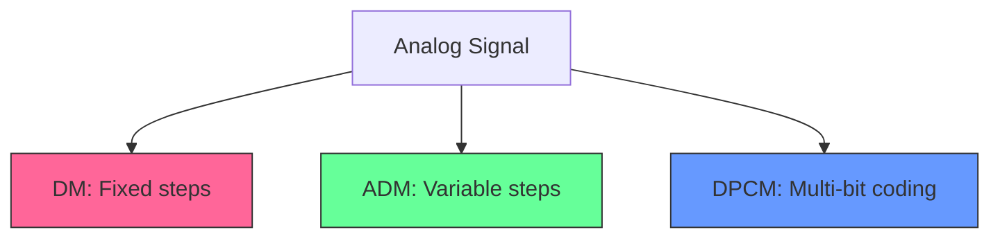

**Mnemonic:** "Single-bit, Adaptive-bit, Multi-bit Difference" (SAMD)

## Question 4(c) OR [7 marks]

**Explain working of Differential PCM (DPCM) transmitter and receiver.**

**Answer**:

**DPCM Transmitter**:

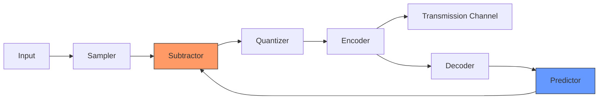

**DPCM Receiver**:

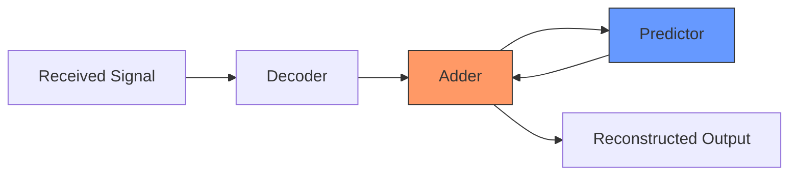

**Working Principle**:

| Component | Function |
|-----------|----------|
| **Sampler** | Converts analog to discrete-time signal |
| **Predictor** | Estimates current sample from previous samples |
| **Subtractor** | Computes difference between actual and predicted |
| **Quantizer** | Assigns levels to difference signal |
| **Encoder** | Converts to binary code |
| **Decoder** | Converts binary to quantized differences |
| **Adder** | Combines difference with prediction |

**Key Advantages**:

- **Reduced bit rate**: Encodes differences which are smaller
- **Better quality**: Uses signal correlation
- **Compatibility**: Similar to PCM framework

**Mnemonic:** "Predict Subtract Quantize Difference" (PSQD)

## Question 5(a) [3 marks]

**Describe TDMA frame.**

**Answer**:

**TDMA (Time Division Multiple Access) Frame**:

| Component | Description | Purpose |
|-----------|-------------|---------|
| **Time Slots** | Individual segments assigned to users | Allows multiple users to share channel |
| **Guard Time** | Small gap between slots | Prevents overlap between users |
| **Preamble** | Synchronization bits at start | Helps receiver synchronize |
| **Control Bits** | Special bits for system control | Manages frame operation |

**Diagram:**

```goat
 ┌─────┬─────┬─────┬─────┬─────┬─────┐
 │Sync │User1│User2│User3│User4│Ctrl │
 └─────┴─────┴─────┴─────┴─────┴─────┘
   └┬┘   └────────────┬────────────┘
 Header         Time slots
```

**TDMA Frame Structure**:

- Each user transmits in assigned time slot
- Full frame repeats cyclically
- Frame length depends on number of users

**Mnemonic:** "Slots In Time Divide Access" (SITDA)

## Question 5(b) [4 marks]

**Draw and explain 4 level digital multiplexing hierarchies.**

**Answer**:

**4-Level Digital Multiplexing Hierarchy**:

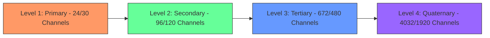

**Hierarchy Details**:

| Level | Name | North American System | European System |
|-------|------|----------------------|-----------------|
| **Level 1** | Primary (T1/E1) | 24 channels, 1.544 Mbps | 30 channels, 2.048 Mbps |
| **Level 2** | Secondary (T2/E2) | 96 channels, 6.312 Mbps | 120 channels, 8.448 Mbps |
| **Level 3** | Tertiary (T3/E3) | 672 channels, 44.736 Mbps | 480 channels, 34.368 Mbps |
| **Level 4** | Quaternary (T4/E4) | 4032 channels, 274.176 Mbps | 1920 channels, 139.264 Mbps |

**Mnemonic:** "Primary, Secondary, Tertiary, Quaternary Levels" (PSTQ)

## Question 5(c) [7 marks]

**Draw and explain block diagram of PCM-TDM system.**

**Answer**:

**PCM-TDM System Block Diagram**:

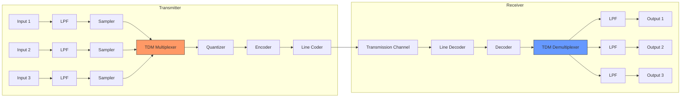

**Working of PCM-TDM System**:

| Block | Function |
|-------|----------|
| **Low-Pass Filter** | Limits signal bandwidth to prevent aliasing |
| **Sampler** | Converts analog to discrete-time signal |
| **TDM Multiplexer** | Combines samples from multiple channels |
| **Quantizer** | Assigns discrete levels to samples |
| **Encoder** | Converts to binary code |
| **Line Coder** | Prepares signal for transmission |
| **Line Decoder** | Recovers binary information |
| **Decoder** | Converts binary to quantized values |
| **TDM Demultiplexer** | Separates channels at receiver |
| **Reconstruction Filter** | Smooths out staircase to recover analog |

**Key Features**:

- Multiple analog channels share a single digital transmission link
- Each channel is sampled sequentially
- Samples are interlaced in time
- Frame synchronization ensures proper demultiplexing

**Mnemonic:** "Many Analog Channels Share Digital Link" (MACSDL)

## Question 5(a) OR [3 marks]

**List advantages and disadvantages of digital communication.**

**Answer**:

**Advantages and Disadvantages of Digital Communication**:

| Advantages | Disadvantages |
|------------|---------------|
| **Noise Immunity**: Better resistance to noise | **Bandwidth**: Requires more bandwidth |
| **Error Detection**: Can detect/correct errors | **Complexity**: More complex circuitry |
| **Multiplexing**: Efficient channel sharing | **Synchronization**: Requires precise timing |
| **Security**: Easier encryption | **Quantization Noise**: Inherent in A/D conversion |
| **Integration**: Compatible with computers | **Cost**: Initial setup cost is higher |
| **Regeneration**: Signal can be regenerated | **Conversion**: A/D conversion adds delay |

**Mnemonic:** "Noise-resistant, Error-correcting, Multiplex-friendly But Bandwidth-hungry" (NEMBB)

## Question 5(b) OR [4 marks]

**List Channel Coding Techniques, explain any one of them with example.**

**Answer**:

**Channel Coding Techniques**:

| Technique | Purpose |
|-----------|---------|
| **Block Coding** | Fixed-length blocks with parity |
| **Convolutional Coding** | Continuous encoding with memory |
| **Turbo Coding** | Parallel concatenated codes |
| **LDPC Coding** | Low-density parity check |
| **Reed-Solomon** | Powerful block code |

**Block Coding Example: Hamming Code (7,4)**

This code takes 4 data bits and adds 3 parity bits to create a 7-bit codeword.

| Step | Description | Example |
|------|-------------|---------|
| 1. **Data Bits** | Original message | 1011 |
| 2. **Bit Positions** | Number positions 1 to 7 | Positions 3,5,6,7 for data |
| 3. **Parity Bits** | Calculate for positions 1,2,4 | P1=1, P2=0, P4=1 |
| 4. **Codeword** | Combine parity and data | 1011011 |

**Error Detection**:

- If a single bit error occurs, recalculating parity bits identifies error position
- Example: 1**0**11011 → 1**1**11011 (Error at position 2)

**Mnemonic:** "Parity Bits Protect Data Bits" (PBPDB)

## Question 5(c) OR [7 marks]

**Discuss basic time domain digital multiplexing. State advantages & disadvantages of TDM system.**

**Answer**:

**Basic Time Domain Digital Multiplexing**:

Time Division Multiplexing (TDM) is a technique that allows multiple digital signals to share a common transmission medium by allocating unique time slots to each signal.

| Operating Principle | Implementation |
|--------------------|----------------|
| **Channel Allocation** | Each source gets periodic time slots |
| **Frame Structure** | Slots organized into frames with sync bits |
| **Synchronization** | Transmitter and receiver must maintain timing |
| **Throughput** | Dependent on number of channels and sampling rate |

**TDM System Diagram**:

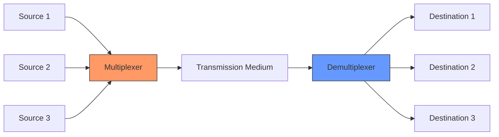

**Advantages of TDM System**:

| Advantage | Explanation |
|-----------|-------------|
| **Efficient Utilization** | Channel used continuously |
| **Reduced Crosstalk** | No frequency overlap between channels |
| **Flexibility** | Easy to add/remove channels |
| **Compatible with Digital** | Works naturally with digital systems |
| **Simple Hardware** | No complex filters needed |

**Disadvantages of TDM System**:

| Disadvantage | Explanation |
|--------------|-------------|
| **Synchronization** | Requires precise timing |
| **Buffering** | May need storage between samples |
| **Overhead** | Sync bits reduce efficiency |
| **Delay** | Must wait for time slot |
| **Wasted Capacity** | Empty slots if channel inactive |

**Mnemonic:** "Time Slots Shared But Sync Required" (TSSBSR)
