## પ્રશ્ન 1(અ) [3 ગુણ]

**C લેંગ્વેજના કોઈ પણ છ કીવર્ડ લખો.**

**જવાબ**:

**કોષ્ટક: C લેંગ્વેજના છ કીવર્ડ**

| કીવર્ડ   | ઉપયોગ                                 |
|----------|---------------------------------------|
| int      | પૂર્ણાંક ડેટા પ્રકાર                    |
| float    | અપૂર્ણાંક ડેટા પ્રકાર                  |
| if       | શરતી નિવેદન                          |
| while    | લૂપ સ્ટ્રક્ચર                         |
| return   | ફંક્શનમાંથી મૂલ્ય પાછું મેળવવા માટે    |
| void     | ખાલી રિટર્ન પ્રકાર દર્શાવવા            |

**મેમરી ટ્રીક:** "I Feel When Running Very Ill" (int, float, while, return, void, if)

## પ્રશ્ન 1(બ) [4 ગુણ]

**વેરિયેબલની વ્યાખ્યા લખો. C પ્રોગ્રામિંગમાં વેરિયેબલના નામ માટેના નિયમો લખો.**

**જવાબ**:

**વેરિયેબલ**: એક નામાંકિત મેમરી સ્થાન જેનો ઉપયોગ પ્રોગ્રામના અમલ દરમિયાન સુધારી શકાય તેવા ડેટાને સંગ્રહિત કરવા માટે થાય છે.

**કોષ્ટક: C માં વેરિયેબલના નામકરણના નિયમો**

| નિયમ                      | ઉદાહરણ                         |
|----------------------------|---------------------------------|
| અક્ષર/અંડરસ્કોરથી શરૂ થવું જોઈએ | name, _value                    |
| અક્ષરો, અંકો, અંડરસ્કોર સમાવી શકે | user_1, count99                 |
| ખાલી જગ્યા કે વિશેષ અક્ષરો ન હોવા જોઈએ | ✓: total_sum, ✗: total-sum     |
| કેસ સેન્સિટિવ છે           | Name ≠ name                     |
| રિઝર્વ કીવર્ડ્સનો ઉપયોગ ન કરી શકાય | ✗: int, while                    |
| મહત્તમ 31 અક્ષરો (સ્ટાન્ડર્ડ) | studentRegistrationNumber        |

**મેમરી ટ્રીક:** "Letters Lead, No Special Keys" (અક્ષરથી શરૂ, વિશેષ અક્ષરો નહીં, કીવર્ડ્સ નહીં)

## પ્રશ્ન 1(ક) [7 ગુણ]

**ફ્લોચાર્ટની વ્યાખ્યા લખો. ફ્લોચાર્ટના સિમ્બોલ દોરો અને સમજાવો. નીચેના સમીકરણનો ઉપયોગ કરીને સિમ્પલ ઇન્ટરેસ્ટની ગણતરી કરવા માટેનો પ્રોગ્રામ લખો. I=PRN/100 જ્યાં P=પ્રિન્સીપલ રકમ, R= વ્યાજનો દર અને N= સમયગાળો.**

**જવાબ**:

**ફ્લોચાર્ટ**: એક પ્રશ્નનો ઉકેલ કરવા માટે જરૂરી ક્રમિક ઓપરેશન્સને દર્શાવવા માટે પ્રમાણભૂત પ્રતીકોનો ઉપયોગ કરીને અલ્ગોરિધમની ગ્રાફિકલ રજૂઆત.

**કોષ્ટક: ફ્લોચાર્ટ સિમ્બોલ**

| સિમ્બોલ | નામ | ઉપયોગ |
|---------|-----|---------|
|  | ટર્મિનલ | શરૂઆત/અંત |
|  | પ્રોસેસ | ગણતરી |
|  | ઈનપુટ/આઉટપુટ | ડેટા વાંચવો/દર્શાવવો |
|  | નિર્ણય | શરતો |
|  | ફ્લો લાઈન | ક્રમ બતાવે છે |

**સિમ્પલ ઇન્ટરેસ્ટનું ફ્લોચાર્ટ:**

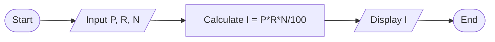

**પ્રોગ્રામ:**

```c
#include <stdio.h>
void main()
{
    float p, r, n, i;
    
    printf("Enter principal amount: ");
    scanf("%f", &p);
    
    printf("Enter rate of interest: ");
    scanf("%f", &r);
    
    printf("Enter time period in years: ");
    scanf("%f", &n);
    
    i = (p * r * n) / 100;
    
    printf("Simple Interest = %.2f", i);
}
```

**મેમરી ટ્રીક:** "Please Return Nice Interest" (Principal, Rate, Number of years, Interest)

## પ્રશ્ન 1(ક) OR [7 ગુણ]

**અલગોરિધમની વ્યાખ્યા લખો. સિલિન્ડરનું ઘનફળ શોધવા માટેનું અલગોરિધમ લખો. યુઝર પાસેથી સિલિન્ડરની ત્રિજ્યા(R) અને ઊંચાઈ(H) ઈનપુટ લઇ સિલિન્ડરના વોલ્યુમ(V)ની ગણતરી નીચેના સમીકરણનો ઉપયોગ કરીને પ્રિન્ટ કરવા માટેનો પ્રોગ્રામ લખો. V=πR²H**

**જવાબ**:

**અલગોરિધમ**: મર્યાદિત સમયમાં કોઈ સમસ્યાનો ઉકેલ કરવા માટેની પગલાવાર પ્રક્રિયા.

**સિલિન્ડરના ઘનફળ માટેનું અલગોરિધમ:**

1. શરૂ કરો
2. ત્રિજ્યા (R) અને ઊંચાઈ (H) ઇનપુટ લો
3. V = π × R² × H સૂત્રનો ઉપયોગ કરીને ઘનફળની ગણતરી કરો
4. ઘનફળ પ્રદર્શિત કરો
5. સમાપ્ત

**ડાયગ્રામ: સિલિન્ડર**

```goat
    +------+
    |      |
    |      | H
    |      |
    +------+
       R↔ 
```

**પ્રોગ્રામ:**

```c
#include <stdio.h>
void main()
{
    float radius, height, volume;
    float pi = 3.14159;
    
    printf("Enter radius of cylinder: ");
    scanf("%f", &radius);
    
    printf("Enter height of cylinder: ");
    scanf("%f", &height);
    
    volume = pi * radius * radius * height;
    
    printf("Volume of cylinder = %.2f", volume);
}
```

**મેમરી ટ્રીક:** "Round Hat Volume" (Radius, Height, Volume)

## પ્રશ્ન 2(અ) [3 ગુણ]

**C પ્રોગ્રામિંગ ભાષામાં સપોર્ટ કરતા વિવિધ ઓપરેટરોની યાદી બનાવો.**

**જવાબ**:

**કોષ્ટક: C પ્રોગ્રામિંગમાં ઓપરેટર્સ**

| ઓપરેટર પ્રકાર | ઉદાહરણો | ઉપયોગ |
|---------------|----------|-----|
| એરિથમેટિક | +, -, *, /, % | ગાણિતિક ઓપરેશન્સ |
| રિલેશનલ | <, >, ==, !=, <=, >= | મૂલ્યોની સરખામણી |
| લોજીકલ | &&, \|\|, ! | શરતોને જોડવા |
| એસાઇનમેન્ટ | =, +=, -=, *=, /= | મૂલ્યો આપવા |
| ઇનક્રિમેન્ટ/ડિક્રિમેન્ટ | ++, -- | 1 વધારવું/ઘટાડવું |
| બિટવાઇઝ | &, \|, ^, ~, <<, >> | બિટ મેનિપ્યુલેશન |
| કન્ડિશનલ | ?: | ટૂંકા if-else |

**મેમરી ટ્રીક:** "All Relationships Lead Ancestors Incrementally Beyond Conditions" (દરેક પ્રકારનો પ્રથમ અક્ષર)

## પ્રશ્ન 2(બ) [4 ગુણ]

**1 થી 50 નો સરવાળો અને સરેરાશ પ્રિન્ટ કરવા માટેનો પ્રોગ્રામ લખો.**

**જવાબ**:

**પ્રોગ્રામ:**

```c
#include <stdio.h>
void main()
{
    int i, sum = 0;
    float avg;
    
    for(i = 1; i <= 50; i++)
    {
        sum = sum + i;
    }
    
    avg = (float)sum / 50;
    
    printf("Sum of numbers from 1 to 50 = %d\n", sum);
    printf("Average of numbers from 1 to 50 = %.2f", avg);
}
```

**પ્રક્રિયા ડાયગ્રામ:**

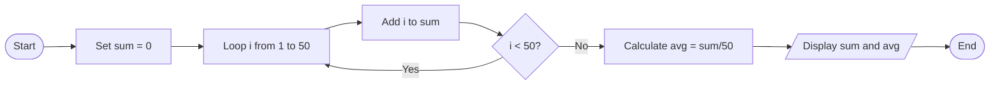

**મેમરી ટ્રીક:** "Summing And Dividing" (Sum, Average, Division)

## પ્રશ્ન 2(ક) [7 ગુણ]

**એરીથમેટીક અને રિલેશનલ ઓપરેટર ઉદાહરણ સાથે સમજાવો.**

**જવાબ**:

**એરિથમેટિક ઓપરેટર્સ:**

**કોષ્ટક: C માં એરિથમેટિક ઓપરેટર**

| ઓપરેટર | ઓપરેશન | ઉદાહરણ | પરિણામ |
|----------|-----------|---------|--------|
| + | સરવાળો | 5 + 3 | 8 |
| - | બાદબાકી | 7 - 2 | 5 |
| * | ગુણાકાર | 4 * 3 | 12 |
| / | ભાગાકાર | 8 / 4 | 2 |
| % | મોડ્યુલસ (બાકી) | 7 % 3 | 1 |

**રિલેશનલ ઓપરેટર્સ:**

**કોષ્ટક: C માં રિલેશનલ ઓપરેટર**

| ઓપરેટર | અર્થ | ઉદાહરણ | પરિણામ |
|----------|---------|---------|--------|
| < | કરતાં ઓછું | 5 < 8 | 1 (સાચું) |
| > | કરતાં વધુ | 9 > 3 | 1 (સાચું) |
| == | બરાબર | 4 == 4 | 1 (સાચું) |
| != | અસમાન | 7 != 3 | 1 (સાચું) |
| <= | કરતાં ઓછું અથવા બરાબર | 4 <= 4 | 1 (સાચું) |
| >= | કરતાં વધુ અથવા બરાબર | 6 >= 9 | 0 (ખોટું) |

**કોડ ઉદાહરણ:**

```c
#include <stdio.h>
void main()
{
    int a = 10, b = 5;
    
    // એરિથમેટિક ઓપરેટર્સ
    printf("a + b = %d\n", a + b);   // 15
    printf("a - b = %d\n", a - b);   // 5
    printf("a * b = %d\n", a * b);   // 50
    printf("a / b = %d\n", a / b);   // 2
    printf("a %% b = %d\n", a % b);  // 0
    
    // રિલેશનલ ઓપરેટર્સ
    printf("a < b: %d\n", a < b);    // 0 (ખોટું)
    printf("a > b: %d\n", a > b);    // 1 (સાચું)
    printf("a == b: %d\n", a == b);  // 0 (ખોટું)
    printf("a != b: %d\n", a != b);  // 1 (સાચું)
}
```

**મેમરી ટ્રીક:** "Add Subtract Multiply Divide Remainder" (એરિથમેટિક), "Less Greater Equal Not" (રિલેશનલ)

## પ્રશ્ન 2(અ) OR [3 ગુણ]

**gets(S) અને scanf("%s",S) ફંક્શન વચ્ચેનો તફાવત લખો જ્યાં S સ્ટ્રીંગ છે.**

**જવાબ**:

**કોષ્ટક: gets(S) અને scanf("%s",S) વચ્ચેનો તફાવત**

| લક્ષણ | gets(S) | scanf("%s",S) |
|---------|---------|---------------|
| સ્પેસ હેન્ડલિંગ | શબ્દો વચ્ચે સ્પેસ વાંચે છે | સ્પેસ પર વાંચવાનું બંધ કરે છે |
| ઇનપુટ સમાપ્તિ | ન્યૂલાઇન પર સમાપ્ત થાય છે | વ્હાઇટસ્પેસ પર સમાપ્ત થાય છે |
| બફર ઓવરફ્લો | અસુરક્ષિત, લંબાઈ ચકાસણી નથી | વિડ્થ લિમિટ સાથે સુરક્ષિત |
| ઉદાહરણ વર્તન | "Hello World" → "Hello World" | "Hello World" → "Hello" |
| સુરક્ષા | ઓવરફ્લો જોખમને કારણે અવમૂલ્યિત | વિડ્થ સ્પેસિફાયર સાથે વધુ સારું |

**મેમરી ટ્રીક:** "Gets Spaces, Scanf Stops" (gets સ્પેસ વાંચે છે, scanf સ્પેસ પર અટકે છે)

## પ્રશ્ન 2(બ) OR [4 ગુણ]

**બે સંખ્યાની અદલાબદલી કરવાનો પ્રોગ્રામ લખો.**

**જવાબ**:

**પ્રોગ્રામ:**

```c
#include <stdio.h>
void main()
{
    int a, b, temp;
    
    printf("Enter value of a: ");
    scanf("%d", &a);
    
    printf("Enter value of b: ");
    scanf("%d", &b);
    
    printf("Before swapping: a = %d, b = %d\n", a, b);
    
    // ટેમ્પ વેરિયેબલનો ઉપયોગ કરીને અદલાબદલી
    temp = a;
    a = b;
    b = temp;
    
    printf("After swapping: a = %d, b = %d", a, b);
}
```

**અદલાબદલી ડાયગ્રામ:**

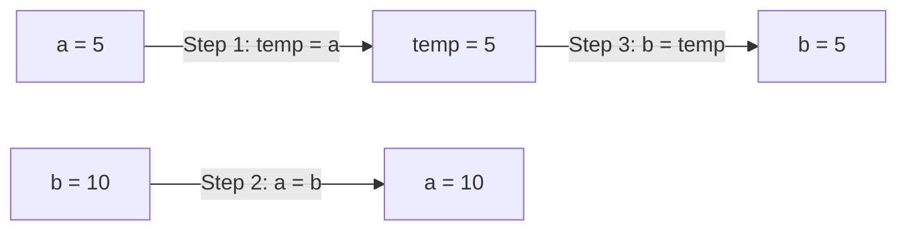

**મેમરી ટ્રીક:** "Temporary Assists Swapping" (ટેમ્પ વેરિયેબલ અદલાબદલી માટે મદદ કરે છે)

## પ્રશ્ન 2(ક) OR [7 ગુણ]

**લોજીકલ ઓપરેટર અને બીટ-વાઈસ ઓપરેટર ઉદાહરણ સાથે સમજાવો.**

**જવાબ**:

**લોજીકલ ઓપરેટર્સ:**

**કોષ્ટક: C માં લોજીકલ ઓપરેટર**

| ઓપરેટર | વર્ણન | ઉદાહરણ | પરિણામ |
|----------|-------------|---------|--------|
| && | લોજીકલ AND | (5>3) && (8>6) | 1 (બંને સાચાં) |
| \|\| | લોજીકલ OR | (5<3) \|\| (8>6) | 1 (એક સાચું) |
| ! | લોજીકલ NOT | !(5>3) | 0 (સાચાને ખોટામાં ફેરવે) |

**બિટવાઇઝ ઓપરેટર્સ:**

**કોષ્ટક: C માં બિટવાઇઝ ઓપરેટર**

| ઓપરેટર | વિગત | ઉદાહરણ | બાઇનરી પરિણામ |
|----------|-------------|---------|---------------|
| & | બિટવાઇઝ AND | 5 & 3 | 101 & 011 = 001 (1) |
| \| | બિટવાઇઝ OR | 5 \| 3 | 101 \| 011 = 111 (7) |
| ^ | બિટવાઇઝ XOR | 5 ^ 3 | 101 ^ 011 = 110 (6) |
| ~ | બિટવાઇઝ NOT | ~5 | ~0101 = 1010 (-6) |
| << | લેફ્ટ શિફ્ટ | 5 << 1 | 101 << 1 = 1010 (10) |
| >> | રાઇટ શિફ્ટ | 5 >> 1 | 101 >> 1 = 10 (2) |

**કોડ ઉદાહરણ:**

```c
#include <stdio.h>
void main()
{
    int a = 5, b = 3;
    
    // લોજીકલ ઓપરેટર્સ
    printf("a>3 && b<5: %d\n", (a>3) && (b<5));  // 1 (સાચું)
    printf("a<3 || b>1: %d\n", (a<3) || (b>1));  // 1 (સાચું)
    printf("!(a>b): %d\n", !(a>b));              // 0 (ખોટું)
    
    // બિટવાઇઝ ઓપરેટર્સ
    printf("a & b: %d\n", a & b);   // 1
    printf("a | b: %d\n", a | b);   // 7
    printf("a ^ b: %d\n", a ^ b);   // 6
    printf("~a: %d\n", ~a);         // -6
    printf("a << 1: %d\n", a << 1); // 10
    printf("a >> 1: %d\n", a >> 1); // 2
}
```

**મેમરી ટ્રીક:** "AND OR NOT" (લોજીકલ ઓપરેટર્સ), "AND OR XOR NOT SHIFT" (બિટવાઇઝ ઓપરેટર્સ)

## પ્રશ્ન 3(અ) [3 ગુણ]

**ઉદાહરણ સાથે multiple if-else સ્ટેટમેન્ટ સમજાવો.**

**જવાબ**:

**Multiple if-else**: શરતોનો ક્રમ અનુસાર ચકાસણી થાય છે જ્યાં સૌથી પહેલી સાચી શરત મળે ત્યાં સુધી.

**સ્ટ્રક્ચર:**

```c
if (condition1)
    statement1;
else if (condition2)
    statement2;
else if (condition3)
    statement3;
else
    default_statement;
```

**કોડ ઉદાહરણ:**

```c
#include <stdio.h>
void main()
{
    int marks;
    
    printf("Enter marks: ");
    scanf("%d", &marks);
    
    if (marks >= 80)
        printf("Grade: A");
    else if (marks >= 70)
        printf("Grade: B");
    else if (marks >= 60)
        printf("Grade: C");
    else if (marks >= 50)
        printf("Grade: D");
    else
        printf("Grade: F");
}
```

**ડાયગ્રામ:**

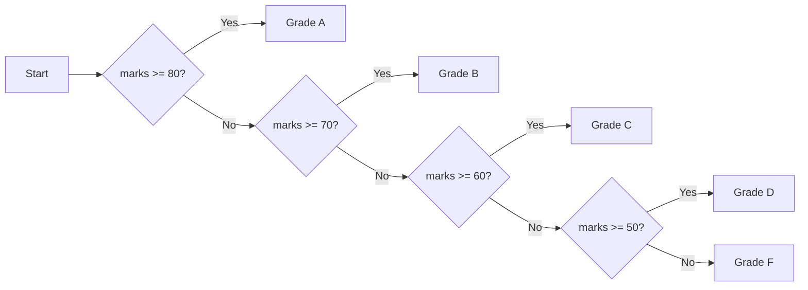

**મેમરી ટ્રીક:** "Check Each Condition in Sequence" (CECS)

## પ્રશ્ન 3(બ) [4 ગુણ]

**While લૂપ અને for લૂપનું વર્કિંગ જણાવો.**

**જવાબ**:

**કોષ્ટક: While લૂપ vs For લૂપ**

| લક્ષણ | While લૂપ | For લૂપ |
|---------|------------|----------|
| સિન્ટેક્સ | `while(condition) { statements; }` | `for(init; condition; update) { statements; }` |
| ક્યારે વાપરવું | જ્યારે પુનરાવર્તનની સંખ્યા અજ્ઞાત હોય | જ્યારે પુનરાવર્તનની સંખ્યા જાણીતી હોય |
| ઇનિશિયલાઇઝેશન | લૂપની બહાર | લૂપના ડિક્લેરેશનમાં |
| અપડેટ | લૂપ બોડીની અંદર કરવું જોઈએ | લૂપ ડિક્લેરેશનમાં આપોઆપ થાય છે |
| એક્ઝિટ કંટ્રોલ | માત્ર શરૂઆતમાં | માત્ર શરૂઆતમાં |
| ઉદાહરણ | યુઝર ઇનપુટ ચકાસવા | નિશ્ચિત વખત પુનરાવર્તન કરવા |

**While લૂપ ફ્લો:**

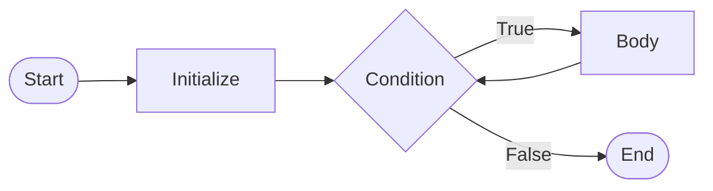

**For લૂપ ફ્લો:**

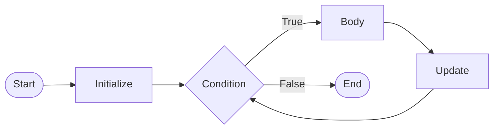

**મેમરી ટ્રીક:** "While Checks Then Acts" (WCTA), "For Initializes Tests Updates" (FITU)

## પ્રશ્ન 3(ક) [7 ગુણ]

**આપેલ સંખ્યાના ફેક્ટોરિયલ શોધવા માટેનો પ્રોગ્રામ લખો.**

**જવાબ**:

**પ્રોગ્રામ:**

```c
#include <stdio.h>
void main()
{
    int num, i;
    unsigned long fact = 1;
    
    printf("Enter a number: ");
    scanf("%d", &num);
    
    if (num < 0)
        printf("Factorial not defined for negative numbers");
    else
    {
        for(i = 1; i <= num; i++)
        {
            fact = fact * i;
        }
        printf("Factorial of %d = %lu", num, fact);
    }
}
```

**ફેક્ટોરિયલ ગણતરી કોષ્ટક:**
ઉદાહરણ તરીકે, જો num = 5:

| પુનરાવર્તન | i | fact = fact * i | નવી fact કિંમત |
|-----------|---|-----------------|----------------|
| પ્રારંભિક   | - | -               | 1              |
| 1         | 1 | 1 * 1           | 1              |
| 2         | 2 | 1 * 2           | 2              |
| 3         | 3 | 2 * 3           | 6              |
| 4         | 4 | 6 * 4           | 24             |
| 5         | 5 | 24 * 5          | 120            |

**ફેક્ટોરિયલ ગણતરી ડાયગ્રામ:**

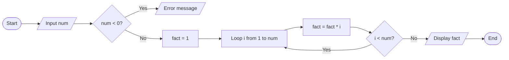

**મેમરી ટ્રીક:** "Find And Count The Numbers!" (FACTN! - Factorial)

## પ્રશ્ન 3(અ) OR [3 ગુણ]

**ઉદાહરણ સાથે switch-case સ્ટેટમેન્ટની કામગીરી સમજાવો.**

**જવાબ**:

**Switch-Case**: એક પસંદગી નિવેદન જે મૂલ્યોની યાદી (કેસ) સામે વેરિયેબલની સમાનતા ચકાસવાની મંજૂરી આપે છે.

**સ્ટ્રક્ચર:**

```c
switch(expression) {
    case value1:
        statements1;
        break;
    case value2:
        statements2;
        break;
    default:
        default_statements;
}
```

**કોડ ઉદાહરણ:**

```c
#include <stdio.h>
void main()
{
    int day;
    
    printf("Enter day number (1-7): ");
    scanf("%d", &day);
    
    switch(day) {
        case 1:
            printf("Monday");
            break;
        case 2:
            printf("Tuesday");
            break;
        case 3:
            printf("Wednesday");
            break;
        case 4:
            printf("Thursday");
            break;
        case 5:
            printf("Friday");
            break;
        case 6:
            printf("Saturday");
            break;
        case 7:
            printf("Sunday");
            break;
        default:
            printf("Invalid day");
    }
}
```

**Switch-Case ડાયગ્રામ:**

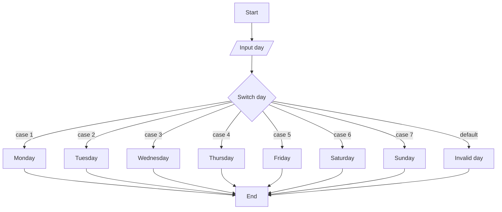

**મેમરી ટ્રીક:** "Select Value, Exit with Break" (SVEB)

## પ્રશ્ન 3(બ) OR [4 ગુણ]

**break અને continue સ્ટેટમેન્ટ ઉપયોગ લખો.**

**જવાબ**:

**કોષ્ટક: Break vs Continue Keywords**

| લક્ષણ | break | continue |
|---------|-------|----------|
| ઉદ્દેશ | વર્તમાન લૂપ/સ્વિચમાંથી બહાર નીકળે છે | વર્તમાન પુનરાવર્તન છોડી, આગલા પુનરાવર્તનમાં જાય છે |
| લૂપ પર અસર | લૂપને સમાપ્ત કરે છે | આગલા પુનરાવર્તનમાં આગળ વધે છે |
| ક્યાં વપરાય છે | લૂપ્સ & સ્વિચ સ્ટેટમેન્ટ્સ | માત્ર લૂપ્સમાં |
| કંટ્રોલ ફ્લો | લૂપ પછીના સ્ટેટમેન્ટ પર જાય છે | લૂપની શરત ચકાસણી પર જાય છે |
| ઉપયોગનું ઉદાહરણ | શરત પૂરી થાય ત્યારે લૂપમાંથી નીકળવું | ચોક્કસ પુનરાવર્તનો છોડવા |

**ફ્લો ડાયગ્રામ - break:**

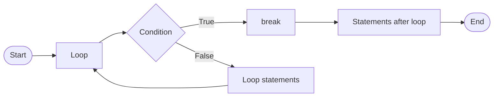

**ફ્લો ડાયગ્રામ - continue:**

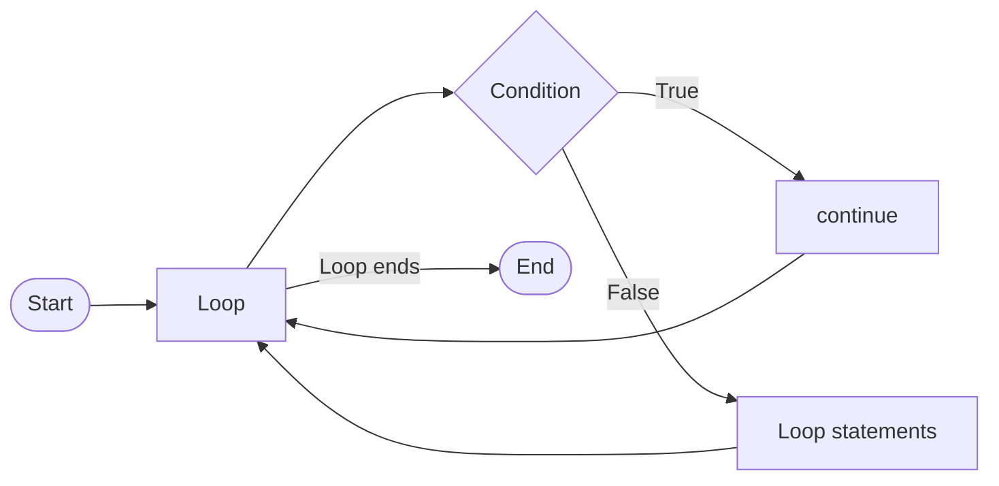

**મેમરી ટ્રીક:** "Break Exits, Continue Skips" (BECS)

## પ્રશ્ન 3(ક) OR [7 ગુણ]

**કીબોર્ડ પરથી લીટીઓની સંખ્યા (n) વાંચી અને નીચે દર્શાવેલ ત્રિકોણ પ્રિન્ટ કરવા માટેનો પ્રોગ્રામ લખો. ઉદાહરણ તરીકે, n=5**

```
1 2 3 4 5
1 2 3 4
1 2 3
1 2
1
```

**જવાબ**:

**પ્રોગ્રામ:**

```c
#include <stdio.h>
void main()
{
    int n, i, j;
    
    printf("Enter number of lines: ");
    scanf("%d", &n);
    
    for(i = n; i >= 1; i--)
    {
        for(j = 1; j <= i; j++)
        {
            printf("%d ", j);
        }
        printf("\n");
    }
}
```

**પેટર્ન લોજિક કોષ્ટક:**
n = 5 માટે:

| i | j | આઉટપુટ |
|---|---|--------|
| 5 | j=1 થી 5 | 1 2 3 4 5 |
| 4 | j=1 થી 4 | 1 2 3 4 |
| 3 | j=1 થી 3 | 1 2 3 |
| 2 | j=1 થી 2 | 1 2 |
| 1 | j=1 થી 1 | 1 |

**પેટર્ન વિઝ્યુલાઇઝેશન:**

```goat
1 2 3 4 5
1 2 3 4
1 2 3
1 2
1
```

**પ્રોગ્રામ ફ્લો:**

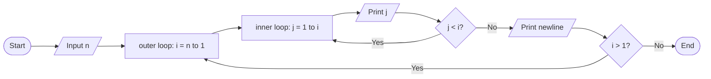

**મેમરી ટ્રીક:** "Decreasing Rows With Increasing Values" (DRWIV)

## પ્રશ્ન 4(અ) [3 ગુણ]

**નેસ્ટેડ if-else સ્ટેટમેન્ટ ઉદાહરણ સાથે સમજાવો.**

**જવાબ**:

**નેસ્ટેડ if-else**: બીજા if અથવા else બ્લોકની અંદરનું if-else સ્ટેટમેન્ટ.

**સ્ટ્રક્ચર:**

```c
if (condition1) {
    if (condition2) {
        statements1;
    } else {
        statements2;
    }
} else {
    statements3;
}
```

**કોડ ઉદાહરણ:**

```c
#include <stdio.h>
void main()
{
    int age, weight;
    
    printf("Enter age: ");
    scanf("%d", &age);
    
    if (age >= 18) {
        printf("Enter weight: ");
        scanf("%d", &weight);
        
        if (weight >= 50) {
            printf("Eligible to donate blood");
        } else {
            printf("Underweight, not eligible");
        }
    } else {
        printf("Age below 18, not eligible");
    }
}
```

**નેસ્ટેડ if-else ડાયગ્રામ:**

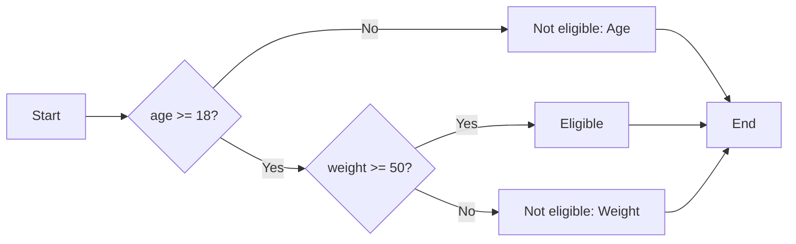

**મેમરી ટ્રીક:** "Check Outside Then Inside" (COTI)

## પ્રશ્ન 4(બ) [4 ગુણ]

**Pointer arguments નો ઉપયોગ કરીને બે પૂર્ણાંક સંખ્યાની અદલાબદલી કરવાનો પ્રોગ્રામ લખો.**

**જવાબ**:

**પ્રોગ્રામ:**

```c
#include <stdio.h>
void main()
{
    int a, b, temp;
    int *p1, *p2;
    
    printf("Enter value of a: ");
    scanf("%d", &a);
    
    printf("Enter value of b: ");
    scanf("%d", &b);
    
    p1 = &a;  // p1 a ને પોઇન્ટ કરે છે
    p2 = &b;  // p2 b ને પોઇન્ટ કરે છે
    
    printf("Before swapping: a = %d, b = %d\n", a, b);
    
    // પોઇન્ટર્સનો ઉપયોગ કરીને અદલાબદલી
    temp = *p1;
    *p1 = *p2;
    *p2 = temp;
    
    printf("After swapping: a = %d, b = %d", a, b);
}
```

**પોઇન્ટર અદલાબદલી ડાયગ્રામ:**

```goat
        +---+        +---+
        | 5 |<-------|p1 |
   a -> +---+        +---+
   
        +---+        +---+
        | 10|<-------|p2 |
   b -> +---+        +---+
   
   After swapping:
   
        +---+        +---+
        | 10|<-------|p1 |
   a -> +---+        +---+
   
        +---+        +---+
        | 5 |<-------|p2 |
   b -> +---+        +---+
```

**મેમરી ટ્રીક:** "Pointers Exchange Memory Values" (PEMV)

## પ્રશ્ન 4(ક) [7 ગુણ]

**Array ની વ્યાખ્યા લખો. One dimensional array નું initialization અને declaration સમજાવો.**

**જવાબ**:

**Array**: એક જ ડેટા પ્રકારના તત્વોનો સમૂહ જે સળંગ મેમરી સ્થાનોમાં સંગ્રહિત થાય છે અને ઇન્ડેક્સ વડે ઍક્સેસ થાય છે.

**કોષ્ટક: Array ડિક્લેરેશન & ઇનિશિયલાઇઝેશન**

| ઓપરેશન | સિન્ટેક્સ | ઉદાહરણ |
|-----------|--------|---------|
| ડિક્લેરેશન | data_type array_name[size]; | int marks[5]; |
| ડિક્લેરેશન સમયે ઇનિશિયલાઇઝેશન | data_type array_name[size] = {values}; | int nums[4] = {10, 20, 30, 40}; |
| આંશિક ઇનિશિયલાઇઝેશન | data_type array_name[size] = {values}; | int nums[5] = {10, 20}; |
| સાઇઝ વિના | data_type array_name[] = {values}; | int nums[] = {10, 20, 30}; |
| વ્યક્તિગત તત્વ | array_name[index] = value; | marks[0] = 95; |

**કોડ ઉદાહરણ:**

```c
#include <stdio.h>
void main()
{
    // ડિક્લેરેશન
    int marks[5];
    
    // ડિક્લેરેશન પછી ઇનિશિયલાઇઝેશન
    marks[0] = 85;
    marks[1] = 90;
    marks[2] = 78;
    marks[3] = 92;
    marks[4] = 88;
    
    // ડિક્લેરેશન સાથે ઇનિશિયલાઇઝેશન
    int scores[] = {95, 89, 76, 82, 91};
    
    // એરે તત્વો ઍક્સેસ કરવા
    printf("marks[2] = %d\n", marks[2]);
    printf("scores[3] = %d", scores[3]);
}
```

**એરે રજૂઆત:**

```goat
marks: [85][90][78][92][88]
        |   |   |   |   |
        0   1   2   3   4  (indices)
```

**મેમરી રજૂઆત:**

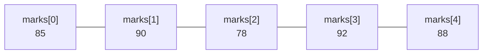

**મેમરી ટ્રીક:** "Declare, Initialize, Access With Index" (DIAWI)

## પ્રશ્ન 4(અ) OR [3 ગુણ]

**do while loop ઉદાહરણ સાથે સમજાવો.**

**જવાબ**:

**do-while loop**: એક લૂપ જે શરતની ચકાસણી કરતા પહેલા ઓછામાં ઓછી એકવાર લૂપ બોડી ચલાવે છે.

**સ્ટ્રક્ચર:**

```c
do {
    statements;
} while(condition);
```

**કોડ ઉદાહરણ:**

```c
#include <stdio.h>
void main()
{
    int num, sum = 0;
    
    do {
        printf("Enter a number (0 to stop): ");
        scanf("%d", &num);
        sum += num;
    } while(num != 0);
    
    printf("Sum of entered numbers = %d", sum);
}
```

**do-while લૂપ ફ્લો:**

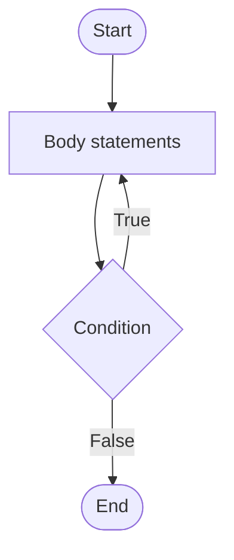

**while લૂપથી મુખ્ય તફાવતો:**

- બોડી ઓછામાં ઓછી એકવાર ચલાવે છે
- સ્ટેટમેન્ટ્સ ચલાવ્યા પછી કંડીશન ચેક કરે છે
- કંડીશન પછી સેમિકોલોન જરૂરી છે

**મેમરી ટ્રીક:** "Do First, Check Later" (DFCL)

## પ્રશ્ન 4(બ) OR [4 ગુણ]

**નીચે આપેલ ફંકશન ઉદાહરણ સાથે સમજાવો:**
**(1) gets() (2) puts() (3) strlen() (4) strcpy()**

**જવાબ**:

**કોષ્ટક: C માં સ્ટ્રિંગ ફંકશન્સ**

| ફંકશન | હેતુ | સિન્ટેક્સ | ઉદાહરણ |
|----------|---------|--------|---------|
| gets() | સ્પેસ સાથે સ્ટ્રિંગ વાંચે છે | gets(string); | gets(name); |
| puts() | ન્યૂલાઇન સાથે સ્ટ્રિંગ દર્શાવે છે | puts(string); | puts(name); |
| strlen() | સ્ટ્રિંગની લંબાઈ આપે છે | strlen(string); | n = strlen(name); |
| strcpy() | સોર્સને ડેસ્ટિનેશનમાં કોપી કરે છે | strcpy(dest, src); | strcpy(str1, str2); |

**કોડ ઉદાહરણ:**

```c
#include <stdio.h>
#include <string.h>
void main()
{
    char name[50], copy[50];
    int length;
    
    printf("Enter your name: ");
    gets(name);           // સ્પેસ સાથે નામ વાંચે છે
    
    puts("Your name is:"); // ન્યૂલાઇન સાથે દર્શાવે છે
    puts(name);
    
    length = strlen(name); // સ્ટ્રિંગની લંબાઈ મેળવે છે
    printf("Length: %d\n", length);
    
    strcpy(copy, name);    // name ને copy માં કોપી કરે છે
    printf("Copied string: %s", copy);
}
```

**મેમરી ટ્રીક:** "Gets Puts String's Length and Copies" (GPSLC)

## પ્રશ્ન 4(ક) OR [7 ગુણ]

**Recursion ની વ્યાખ્યા આપી ઉદાહરણ સાથે સમજાવો. Recursion નો ઉપયોગ કરીને આપેલા નંબરનો ફેક્ટોરીયલ શોધવાનો પ્રોગ્રામ લખો.**

**જવાબ**:

**Recursion**: એક પ્રક્રિયા જેમાં ફંક્શન સીધી કે પરોક્ષ રીતે પોતાને જ ચોક્કસ શરત પૂરી થાય ત્યાં સુધી કૉલ કરે છે.

**Recursion ના ઘટકો:**

1. બેઝ કેસ: રિકર્ઝન રોકવા માટેની શરત
2. રિકર્સિવ કેસ: ફંકશન પોતે જ પોતાને કૉલ કરે છે

**કોડ ઉદાહરણ:**

```c
#include <stdio.h>

// ફેક્ટોરિયલ શોધવા માટે રિકર્સિવ ફંક્શન
unsigned long factorial(int n)
{
    // બેઝ કેસ
    if (n == 0 || n == 1)
        return 1;
    
    // રિકર્સિવ કેસ
    else
        return n * factorial(n-1);
}

void main()
{
    int num;
    unsigned long result;
    
    printf("Enter a number: ");
    scanf("%d", &num);
    
    if (num < 0)
        printf("Factorial not defined for negative numbers");
    else
    {
        result = factorial(num);
        printf("Factorial of %d = %lu", num, result);
    }
}
```

**રિકર્સિવ ફેક્ટોરિયલ ગણતરી:**
factorial(5) માટે

**કોષ્ટક: રિકર્ઝન ટ્રેસ**

| કૉલ | રિટર્ન | ગણતરી |
|------|---------|-------------|
| factorial(5) | 5 × factorial(4) | 5 × 24 = 120 |
| factorial(4) | 4 × factorial(3) | 4 × 6 = 24 |
| factorial(3) | 3 × factorial(2) | 3 × 2 = 6 |
| factorial(2) | 2 × factorial(1) | 2 × 1 = 2 |
| factorial(1) | 1 | બેઝ કેસ |

**રિકર્ઝન ડાયગ્રામ:**

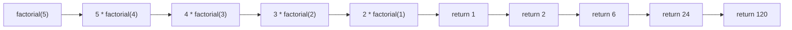

**મેમરી ટ્રીક:** "Function Calling Itself, Bottoming Out" (FCIBO)

## પ્રશ્ન 5(અ) [3 ગુણ]

**array અને structure વચ્ચેનો તફાવત લખો.**

**જવાબ**:

**કોષ્ટક: Array vs Structure**

| લક્ષણ | Array | Structure |
|---------|-------|-----------|
| ડેટા પ્રકાર | બધા તત્વો માટે એક જ ડેટા પ્રકાર | વિવિધ ડેટા પ્રકાર સંગ્રહી શકે છે |
| ઍક્સેસ | ઇન્ડેક્સનો ઉપયોગ (arr[0]) | મેમ્બર નામનો ઉપયોગ (s.name) |
| મેમરી ફાળવણી | સળંગ | સળંગ પરંતુ વિવિધ સાઇઝ |
| સાઇઝ | ડિક્લેરેશન સમયે ફિક્સ સાઇઝ | બધા મેમ્બર્સની સાઇઝનો સરવાળો |
| હેતુ | સમાન વસ્તુઓનો સંગ્રહ | વિવિધ પ્રકારના સંબંધિત ડેટાનું ગ્રુપિંગ |
| ડિક્લેરેશન | `int arr[5];` | `struct student { int id; char name[20]; };` |

**ડાયગ્રામ:**

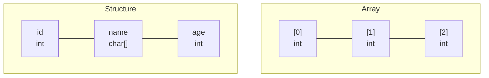

**મેમરી ટ્રીક:** "Arrays for Same, Structures for Different" (ASSD)

## પ્રશ્ન 5(બ) [4 ગુણ]

**આપેલ 10 કિંમતમાંથી મહત્તમ કિંમત શોધવાનો C પ્રોગ્રામ array નો ઉપયોગ કરીને લખો.**

**જવાબ**:

**પ્રોગ્રામ:**

```c
#include <stdio.h>
void main()
{
    int arr[10], i, max;
    
    // 10 કિંમતો ઇનપુટ
    printf("Enter 10 values:\n");
    for(i = 0; i < 10; i++)
    {
        printf("Enter value %d: ", i+1);
        scanf("%d", &arr[i]);
    }
    
    // મહત્તમ કિંમત શોધવી
    max = arr[0];  // પ્રથમ તત્વ મહત્તમ માની લો
    for(i = 1; i < 10; i++)
    {
        if(arr[i] > max)
            max = arr[i];
    }
    
    printf("Maximum value is: %d", max);
}
```

**અલ્ગોરિધમ ફ્લો:**

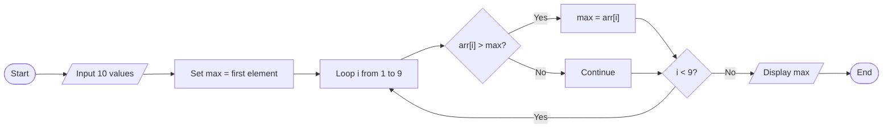

**મેમરી ટ્રીક:** "Compare And Replace Maximum" (CARM)

## પ્રશ્ન 5(ક) [7 ગુણ]

**Structure ને વ્યાખ્યા લખો. Book નામથી એક structure બનાવો કે જેમાં book વિશેની માહિતી Book title, Name of author, Price and Number of pages સ્ટોર કરી શકાય.**

**જવાબ**:

**Structure**: વિવિધ ડેટા પ્રકારના સંબંધિત વેરિયેબલ્સને એક જ નામ હેઠળ ગ્રુપ કરતું યુઝર-ડિફાઇન્ડ ડેટા પ્રકાર.

**Book Structure કોડ:**

```c
#include <stdio.h>

struct book {
    char title[50];
    char author[30];
    float price;
    int pages;
};

void main()
{
    struct book b1;
    
    // પુસ્તકની વિગતો ઇનપુટ
    printf("Enter book title: ");
    gets(b1.title);
    
    printf("Enter author name: ");
    gets(b1.author);
    
    printf("Enter price: ");
    scanf("%f", &b1.price);
    
    printf("Enter number of pages: ");
    scanf("%d", &b1.pages);
    
    // પુસ્તકની વિગતો પ્રદર્શિત
    printf("\nBook Details:\n");
    printf("Title: %s\n", b1.title);
    printf("Author: %s\n", b1.author);
    printf("Price: Rs. %.2f\n", b1.price);
    printf("Pages: %d", b1.pages);
}
```

**Structure મેમરી રજૂઆત:**

```goat
+------------------------+
| struct book            |
+------------------------+
| title[50]  |           |
|            |  "C Prog" |
+------------------------+
| author[30] |           |
|            |  "Dennis" |
+------------------------+
| price      |   450.50  |
+------------------------+
| pages      |    320    |
+------------------------+
```

**Structure ડાયગ્રામ:**

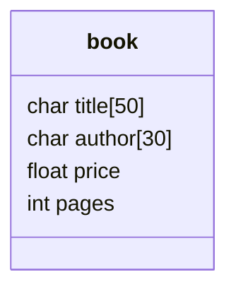

**મેમરી ટ્રીક:** "Title Author Price Pages" (TAPP)

## પ્રશ્ન 5(અ) OR [3 ગુણ]

**સ્ટ્રીંગ શું છે? સ્ટ્રીંગ ઉપર કયા ઓપરેશન પરફોર્મ થાય છે.**

**જવાબ**:

**સ્ટ્રીંગ**: NULL કેરેક્ટર '\0' દ્વારા સમાપ્ત થતા અક્ષરોની શ્રેણી.

**કોષ્ટક: C માં સ્ટ્રીંગ ઓપરેશન્સ**

| ઓપરેશન | ફંક્શન | ઉદાહરણ |
|-----------|----------|---------|
| ઇનપુટ | gets(), scanf() | gets(str), scanf("%s", str) |
| આઉટપુટ | puts(), printf() | puts(str), printf("%s", str) |
| લંબાઈ | strlen() | len = strlen(str) |
| કોપી | strcpy() | strcpy(dest, src) |
| જોડાણ | strcat() | strcat(str1, str2) |
| સરખામણી | strcmp() | result = strcmp(str1, str2) |
| શોધ | strchr(), strstr() | ptr = strchr(str, 'a') |
| રૂપાંતર | strlwr(), strupr() | strlwr(str), strupr(str) |

**સ્ટ્રીંગ રજૂઆત:**

```goat
+---+---+---+---+---+---+
| H | e | l | l | o | \0|
+---+---+---+---+---+---+
```

**મેમરી ટ્રીક:** "Input Output Length Copy Concat Compare Search Convert" (IOLCCSC)

## પ્રશ્ન 5(બ) OR [4 ગુણ]

**A to Z ની ASCII વેલ્યુ પ્રિન્ટ કરવા માટેનો પ્રોગ્રામ લખો.**

**જવાબ**:

**પ્રોગ્રામ:**

```c
#include <stdio.h>
void main()
{
    char ch;
    
    printf("ASCII values from A to Z:\n");
    printf("Character\tASCII Value\n");
    printf("-----------------------\n");
    
    for(ch = 'A'; ch <= 'Z'; ch++)
    {
        printf("    %c\t\t   %d\n", ch, ch);
    }
}
```

**સેમ્પલ આઉટપુટ કોષ્ટક:**

| Character | ASCII Value |
|-----------|-------------|
| A | 65 |
| B | 66 |
| ... | ... |
| Z | 90 |

**ASCII ચાર્ટ રજૂઆત:**

```goat
ASCII Values:
A(65) B(66) C(67) ... Z(90)
```

**મેમરી ટ્રીક:** "Alphabets Sequentially Creating Integer Indices" (ASCII)

## પ્રશ્ન 5(ક) OR [7 ગુણ]

**user defined અને library function શું છે? દરેકના બે ઉદાહરણ સાથે સમજાવો.**

**જવાબ**:

**Library Functions**: C ભાષા દ્વારા પૂરા પાડવામાં આવતા પહેલેથી વ્યાખ્યાયિત ફંક્શન્સ જે ઉપયોગ માટે તૈયાર છે.

**User-Defined Functions**: પ્રોગ્રામર દ્વારા ચોક્કસ કાર્યો કરવા માટે બનાવેલા ફંક્શન્સ.

**કોષ્ટક: Library vs User-Defined Functions**

| લક્ષણ | Library Functions | User-Defined Functions |
|---------|------------------|------------------------|
| વ્યાખ્યા | હેડર ફાઈલોમાં પહેલેથી વ્યાખ્યાયિત | પ્રોગ્રામર દ્વારા બનાવવામાં આવે છે |
| ડિક્લેરેશન | વ્યાખ્યા કરવાની જરૂર નથી | વ્યાખ્યા કરવી જ જોઈએ |
| ઉદાહરણો | printf(), scanf(), strlen() | calculateArea(), findMax() |
| હેડર ફાઇલ્સ | stdio.h, string.h, math.h, etc. | કોઈ હેડર જરૂરી નથી |
| હેતુ | સામાન્ય કાર્યો | કસ્ટમાઇઝ્ડ કાર્યો |

**Library Functions ના ઉદાહરણો:**

1. **strlen() - સ્ટ્રિંગ લંબાઈ**

```c
#include <stdio.h>
#include <string.h>
void main()
{
    char str[] = "Hello";
    int length = strlen(str);  // Library function
    printf("Length of string: %d", length);
}
```

2. **sqrt() - વર્ગમૂળ**

```c
#include <stdio.h>
#include <math.h>
void main()
{
    float num = 25, result;
    result = sqrt(num);  // Library function
    printf("Square root of %.0f = %.2f", num, result);
}
```

**User-Defined Functions ના ઉદાહરણો:**

1. **calculateArea() - લંબચોરસનું ક્ષેત્રફળ**

```c
#include <stdio.h>

// User-defined function
float calculateArea(float length, float width)
{
    return length * width;
}

void main()
{
    float length = 10.5, width = 5.5, area;
    area = calculateArea(length, width);  // User function call
    printf("Area of rectangle = %.2f", area);
}
```

2. **findMax() - ત્રણ સંખ્યાઓમાંથી મહત્તમ**

```c
#include <stdio.h>

// User-defined function
int findMax(int a, int b, int c)
{
    if(a >= b && a >= c)
        return a;
    else if(b >= a && b >= c)
        return b;
    else
        return c;
}

void main()
{
    int x = 10, y = 25, z = 15, max;
    max = findMax(x, y, z);  // User function call
    printf("Maximum number is: %d", max);
}
```

**મેમરી ટ્રીક:** "Libraries Provide, Users Create" (LPUC)
