## Question 1(a) [3 marks]

**List any six keywords of C language.**

**Answer**:

**Table: Six Keywords in C Language**

| Keyword   | Purpose                                |
|-----------|----------------------------------------|
| int       | Integer data type                      |
| float     | Floating-point data type               |
| if        | Conditional statement                  |
| while     | Loop structure                         |
| return    | Returns value from function            |
| void      | Specifies empty return type            |

**Mnemonic:** "I Feel When Running Very Ill" (int, float, while, return, void, if)

## Question 1(b) [4 marks]

**Define variable. List the rule for naming of variable in c programming.**

**Answer**:

**Variable**: A named memory location used to store data that can be modified during program execution.

**Table: Rules for Variable Naming in C**

| Rule                       | Example                         |
|----------------------------|---------------------------------|
| Must begin with letter/underscore | name, _value              |
| Can contain letters, digits, underscore | user_1, count99     |
| No spaces or special characters   | ✓: total_sum, ✗: total-sum |
| Case sensitive            | Name ≠ name                     |
| Cannot use reserved keywords | ✗: int, while                |
| Maximum 31 characters (standard) | studentRegistrationNumber |

**Mnemonic:** "Letters Lead, No Special Keys" (begins with letter, no special chars, no keywords)

## Question 1(c) [7 marks]

**Define flowchart. Draw and Explain flowchart symbols. Write a program to calculate simple interest using below equation. I=PRN/100 Where P=Principal amount, R=Rate of interest and N=Period.**

**Answer**:

**Flowchart**: A graphical representation of an algorithm that uses standard symbols to show the sequence of operations needed to solve a problem.

**Table: Flowchart Symbols**

| Symbol | Name | Purpose |
|--------|------|---------|
|  | Terminal | Start/End |
|  | Process | Calculations |
|  | Input/Output | Read/Display data |
|  | Decision | Conditions |
|  | Flow Line | Shows sequence |

**Simple Interest Flowchart:**

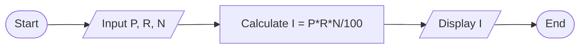

**Program:**

```c
#include <stdio.h>
void main()
{
    float p, r, n, i;
    
    printf("Enter principal amount: ");
    scanf("%f", &p);
    
    printf("Enter rate of interest: ");
    scanf("%f", &r);
    
    printf("Enter time period in years: ");
    scanf("%f", &n);
    
    i = (p * r * n) / 100;
    
    printf("Simple Interest = %.2f", i);
}
```

**Mnemonic:** "Please Return Nice Interest" (Principal, Rate, Number of years, Interest)

## Question 1(c) OR [7 marks]

**Define algorithm. Write algorithm for finding volume of cylinder. Write a program to read radius(R) and height(H) from user and print calculated the volume(V) of cylinder using. V=ΠR²H.**

**Answer**:

**Algorithm**: A step-by-step procedure to solve a problem in a finite amount of time.

**Algorithm for Cylinder Volume:**

1. Start
2. Input radius (R) and height (H)
3. Calculate volume using formula V = π × R² × H
4. Display the volume
5. End

**Diagram: Cylinder**

```goat
    +------+
    |      |
    |      | H
    |      |
    +------+
       R↔ 
```

**Program:**

```c
#include <stdio.h>
void main()
{
    float radius, height, volume;
    float pi = 3.14159;
    
    printf("Enter radius of cylinder: ");
    scanf("%f", &radius);
    
    printf("Enter height of cylinder: ");
    scanf("%f", &height);
    
    volume = pi * radius * radius * height;
    
    printf("Volume of cylinder = %.2f", volume);
}
```

**Mnemonic:** "Round Hat Volume" (Radius, Height, Volume)

## Question 2(a) [3 marks]

**List out different operators supported in C programming language.**

**Answer**:

**Table: Operators in C Programming**

| Operator Type | Examples | Use |
|---------------|----------|-----|
| Arithmetic | +, -, *, /, % | Mathematical operations |
| Relational | <, >, ==, !=, <=, >= | Compare values |
| Logical | &&, \|\|, ! | Combine conditions |
| Assignment | =, +=, -=, *=, /= | Assign values |
| Increment/Decrement | ++, -- | Increase/decrease by 1 |
| Bitwise | &, \|, ^, ~, <<, >> | Bit manipulation |
| Conditional | ?: | Short if-else |

**Mnemonic:** "All Relationships Lead Ancestors Incrementally Beyond Conditions" (first letter of each type)

## Question 2(b) [4 marks]

**Write a program to print sum and average of 1 to 50.**

**Answer**:

**Program:**

```c
#include <stdio.h>
void main()
{
    int i, sum = 0;
    float avg;
    
    for(i = 1; i <= 50; i++)
    {
        sum = sum + i;
    }
    
    avg = (float)sum / 50;
    
    printf("Sum of numbers from 1 to 50 = %d\n", sum);
    printf("Average of numbers from 1 to 50 = %.2f", avg);
}
```

**Process Diagram:**

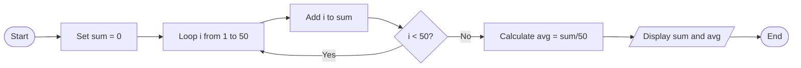

**Mnemonic:** "Summing And Dividing" (Sum, Average, Division)

## Question 2(c) [7 marks]

**Explain arithmetic & relational operators with example.**

**Answer**:

**Arithmetic Operators:**

**Table: Arithmetic Operators in C**

| Operator | Operation | Example | Result |
|----------|-----------|---------|--------|
| + | Addition | 5 + 3 | 8 |
| - | Subtraction | 7 - 2 | 5 |
| * | Multiplication | 4 * 3 | 12 |
| / | Division | 8 / 4 | 2 |
| % | Modulus (Remainder) | 7 % 3 | 1 |

**Relational Operators:**

**Table: Relational Operators in C**

| Operator | Meaning | Example | Result |
|----------|---------|---------|--------|
| < | Less than | 5 < 8 | 1 (true) |
| > | Greater than | 9 > 3 | 1 (true) |
| == | Equal to | 4 == 4 | 1 (true) |
| != | Not equal to | 7 != 3 | 1 (true) |
| <= | Less than or equal to | 4 <= 4 | 1 (true) |
| >= | Greater than or equal to | 6 >= 9 | 0 (false) |

**Code Example:**

```c
#include <stdio.h>
void main()
{
    int a = 10, b = 5;
    
    // Arithmetic operators
    printf("a + b = %d\n", a + b);   // 15
    printf("a - b = %d\n", a - b);   // 5
    printf("a * b = %d\n", a * b);   // 50
    printf("a / b = %d\n", a / b);   // 2
    printf("a %% b = %d\n", a % b);  // 0
    
    // Relational operators
    printf("a < b: %d\n", a < b);    // 0 (false)
    printf("a > b: %d\n", a > b);    // 1 (true)
    printf("a == b: %d\n", a == b);  // 0 (false)
    printf("a != b: %d\n", a != b);  // 1 (true)
}
```

**Mnemonic:** "Add Subtract Multiply Divide Remainder" (arithmetic), "Less Greater Equal Not" (relational)

## Question 2(a) OR [3 marks]

**State the difference between gets(S) and scanf("%s",S) where S is string.**

**Answer**:

**Table: Difference between gets(S) and scanf("%s",S)**

| Feature | gets(S) | scanf("%s",S) |
|---------|---------|---------------|
| Space handling | Reads spaces between words | Stops reading at space |
| Input termination | Ends at newline character | Ends at whitespace |
| Buffer overflow | Unsafe, no length check | Safer with width limit |
| Example behavior | "Hello World" → "Hello World" | "Hello World" → "Hello" |
| Security | Deprecated due to overflow risks | Better with width specifier |

**Mnemonic:** "Gets Spaces, Scanf Stops" (gets reads spaces, scanf stops at spaces)

## Question 2(b) OR [4 marks]

**Write a program to swap two numbers.**

**Answer**:

**Program:**

```c
#include <stdio.h>
void main()
{
    int a, b, temp;
    
    printf("Enter value of a: ");
    scanf("%d", &a);
    
    printf("Enter value of b: ");
    scanf("%d", &b);
    
    printf("Before swapping: a = %d, b = %d\n", a, b);
    
    // Swapping using temp variable
    temp = a;
    a = b;
    b = temp;
    
    printf("After swapping: a = %d, b = %d", a, b);
}
```

**Swapping Diagram:**

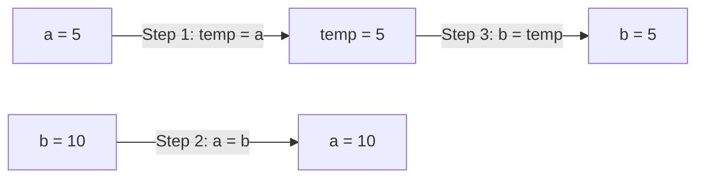

**Mnemonic:** "Temporary Assists Swapping" (Temp variable enables swapping)

## Question 2(c) OR [7 marks]

**Explain Logical operator and bit-wise operator with example.**

**Answer**:

**Logical Operators:**

**Table: Logical Operators in C**

| Operator | Description | Example | Result |
|----------|-------------|---------|--------|
| && | Logical AND | (5>3) && (8>6) | 1 (both true) |
| \|\| | Logical OR | (5<3) \|\| (8>6) | 1 (one true) |
| ! | Logical NOT | !(5>3) | 0 (inverts true to false) |

**Bitwise Operators:**

**Table: Bitwise Operators in C**

| Operator | Description | Example | Binary Result |
|----------|-------------|---------|---------------|
| & | Bitwise AND | 5 & 3 | 101 & 011 = 001 (1) |
| \| | Bitwise OR | 5 \| 3 | 101 \| 011 = 111 (7) |
| ^ | Bitwise XOR | 5 ^ 3 | 101 ^ 011 = 110 (6) |
| ~ | Bitwise NOT | ~5 | ~0101 = 1010 (-6) |
| << | Left Shift | 5 << 1 | 101 << 1 = 1010 (10) |
| >> | Right Shift | 5 >> 1 | 101 >> 1 = 10 (2) |

**Code Example:**

```c
#include <stdio.h>
void main()
{
    int a = 5, b = 3;
    
    // Logical operators
    printf("a>3 && b<5: %d\n", (a>3) && (b<5));  // 1 (true)
    printf("a<3 || b>1: %d\n", (a<3) || (b>1));  // 1 (true)
    printf("!(a>b): %d\n", !(a>b));              // 0 (false)
    
    // Bitwise operators
    printf("a & b: %d\n", a & b);   // 1
    printf("a | b: %d\n", a | b);   // 7
    printf("a ^ b: %d\n", a ^ b);   // 6
    printf("~a: %d\n", ~a);         // -6
    printf("a << 1: %d\n", a << 1); // 10
    printf("a >> 1: %d\n", a >> 1); // 2
}
```

**Mnemonic:** "AND OR NOT" (logical operators), "AND OR XOR NOT SHIFT" (bitwise operators)

## Question 3(a) [3 marks]

**Explain multiple if-else statement with example.**

**Answer**:

**Multiple if-else**: Series of if-else statements where each condition is checked sequentially until a true condition is found.

**Structure:**

```c
if (condition1)
    statement1;
else if (condition2)
    statement2;
else if (condition3)
    statement3;
else
    default_statement;
```

**Code Example:**

```c
#include <stdio.h>
void main()
{
    int marks;
    
    printf("Enter marks: ");
    scanf("%d", &marks);
    
    if (marks >= 80)
        printf("Grade: A");
    else if (marks >= 70)
        printf("Grade: B");
    else if (marks >= 60)
        printf("Grade: C");
    else if (marks >= 50)
        printf("Grade: D");
    else
        printf("Grade: F");
}
```

**Diagram:**

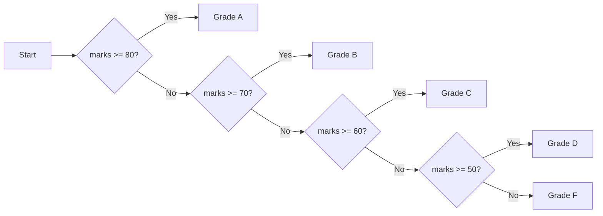

**Mnemonic:** "Check Each Condition in Sequence" (CECS)

## Question 3(b) [4 marks]

**State the working of while loop and for loop.**

**Answer**:

**Table: While Loop vs For Loop**

| Feature | While Loop | For Loop |
|---------|------------|----------|
| Syntax | `while(condition) { statements; }` | `for(init; condition; update) { statements; }` |
| When to use | When number of iterations is unknown | When number of iterations is known |
| Initialization | Before the loop | Inside the loop declaration |
| Update | Must be done inside the loop body | Automatically in loop declaration |
| Exit control | Only at the beginning | Only at the beginning |
| Example | Validating user input | Iterating fixed number of times |

**While Loop Flow:**

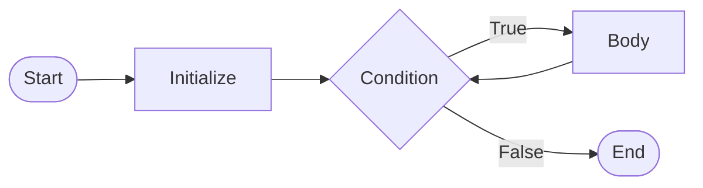

**For Loop Flow:**

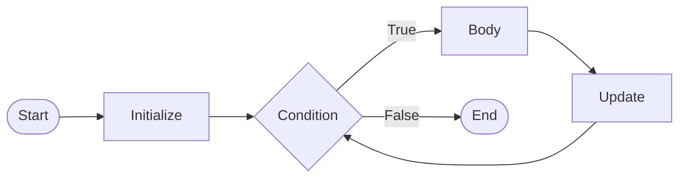

**Mnemonic:** "While Checks Then Acts" (WCTA), "For Initializes Tests Updates" (FITU)

## Question 3(c) [7 marks]

**Write a program to find factorial of a given number.**

**Answer**:

**Program:**

```c
#include <stdio.h>
void main()
{
    int num, i;
    unsigned long fact = 1;
    
    printf("Enter a number: ");
    scanf("%d", &num);
    
    if (num < 0)
        printf("Factorial not defined for negative numbers");
    else
    {
        for(i = 1; i <= num; i++)
        {
            fact = fact * i;
        }
        printf("Factorial of %d = %lu", num, fact);
    }
}
```

**Factorial Calculation Table:**
For example, if num = 5:

| Iteration | i | fact = fact * i | New fact value |
|-----------|---|-----------------|----------------|
| Initial   | - | -               | 1              |
| 1         | 1 | 1 * 1           | 1              |
| 2         | 2 | 1 * 2           | 2              |
| 3         | 3 | 2 * 3           | 6              |
| 4         | 4 | 6 * 4           | 24             |
| 5         | 5 | 24 * 5          | 120            |

**Factorial Calculation Diagram:**

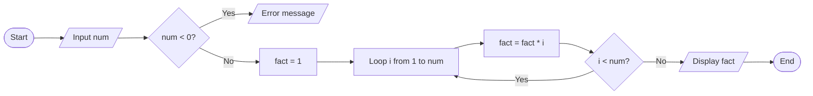

**Mnemonic:** "Find And Count The Numbers!" (FACTN! - Factorial)

## Question 3(a) OR [3 marks]

**Explain the working of switch-case statement with example.**

**Answer**:

**Switch-Case**: A selection statement that allows a variable to be tested for equality against a list of values (cases).

**Structure:**

```c
switch(expression) {
    case value1:
        statements1;
        break;
    case value2:
        statements2;
        break;
    default:
        default_statements;
}
```

**Code Example:**

```c
#include <stdio.h>
void main()
{
    int day;
    
    printf("Enter day number (1-7): ");
    scanf("%d", &day);
    
    switch(day) {
        case 1:
            printf("Monday");
            break;
        case 2:
            printf("Tuesday");
            break;
        case 3:
            printf("Wednesday");
            break;
        case 4:
            printf("Thursday");
            break;
        case 5:
            printf("Friday");
            break;
        case 6:
            printf("Saturday");
            break;
        case 7:
            printf("Sunday");
            break;
        default:
            printf("Invalid day");
    }
}
```

**Switch-Case Diagram:**

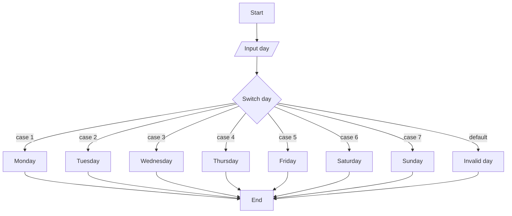

**Mnemonic:** "Select Value, Exit with Break" (SVEB)

## Question 3(b) OR [4 marks]

**State the use of break and continue keyword.**

**Answer**:

**Table: Break vs Continue Keywords**

| Feature | break | continue |
|---------|-------|----------|
| Purpose | Exits from current loop/switch | Skips current iteration, continues next iteration |
| Effect on loop | Terminates the loop | Proceeds to next iteration |
| Where used | Loops & switch statements | Only in loops |
| Control flow | Passes to statement after loop | Goes to loop condition check |
| Example use | Exit loop when condition met | Skip specific iterations |

**Flow Diagram - break:**

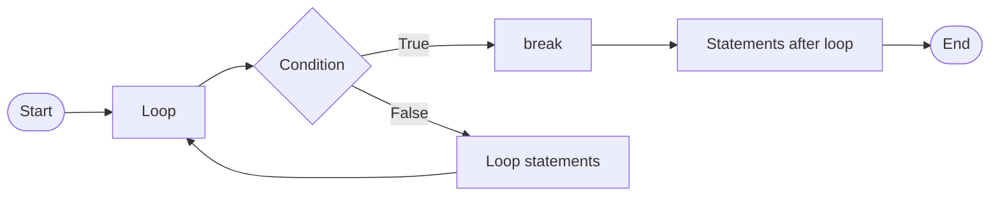

**Flow Diagram - continue:**

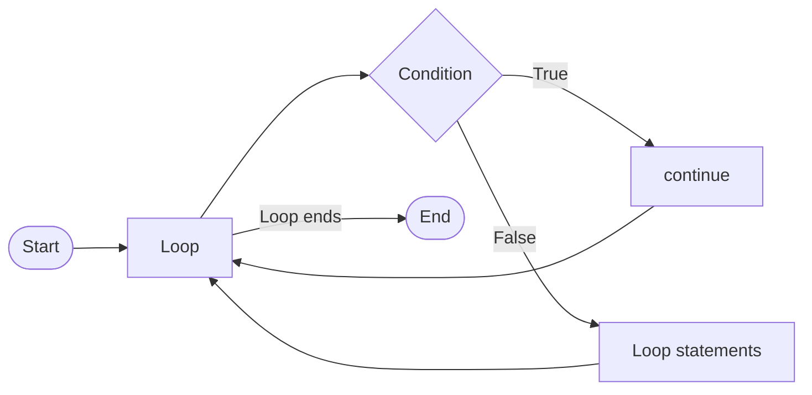

**Mnemonic:** "Break Exits, Continue Skips" (BECS)

## Question 3(c) OR [7 marks]

**Write a program to read number of lines (n) from keyboard and print the triangle shown below. For Example, n=5**

```
1 2 3 4 5
1 2 3 4
1 2 3
1 2
1
```

**Answer**:

**Program:**

```c
#include <stdio.h>
void main()
{
    int n, i, j;
    
    printf("Enter number of lines: ");
    scanf("%d", &n);
    
    for(i = n; i >= 1; i--)
    {
        for(j = 1; j <= i; j++)
        {
            printf("%d ", j);
        }
        printf("\n");
    }
}
```

**Pattern Logic Table:**
For n = 5:

| i | j | Output |
|---|---|--------|
| 5 | j=1 to 5 | 1 2 3 4 5 |
| 4 | j=1 to 4 | 1 2 3 4 |
| 3 | j=1 to 3 | 1 2 3 |
| 2 | j=1 to 2 | 1 2 |
| 1 | j=1 to 1 | 1 |

**Pattern Visualization:**

```goat
1 2 3 4 5
1 2 3 4
1 2 3
1 2
1
```

**Program Flow:**

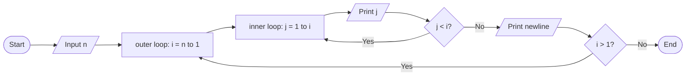

**Mnemonic:** "Decreasing Rows With Increasing Values" (DRWIV)

## Question 4(a) [3 marks]

**Explain nested if-else statement with example.**

**Answer**:

**Nested if-else**: An if-else statement inside another if or else block.

**Structure:**

```c
if (condition1) {
    if (condition2) {
        statements1;
    } else {
        statements2;
    }
} else {
    statements3;
}
```

**Code Example:**

```c
#include <stdio.h>
void main()
{
    int age, weight;
    
    printf("Enter age: ");
    scanf("%d", &age);
    
    if (age >= 18) {
        printf("Enter weight: ");
        scanf("%d", &weight);
        
        if (weight >= 50) {
            printf("Eligible to donate blood");
        } else {
            printf("Underweight, not eligible");
        }
    } else {
        printf("Age below 18, not eligible");
    }
}
```

**Nested if-else Diagram:**

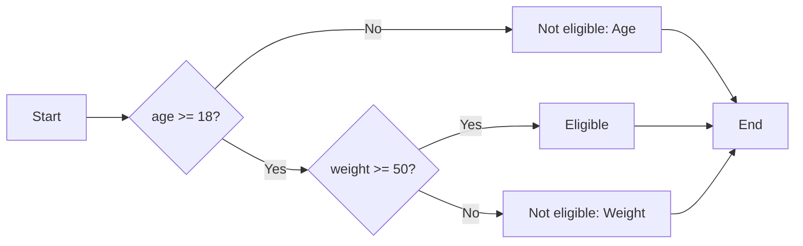

**Mnemonic:** "Check Outside Then Inside" (COTI)

## Question 4(b) [4 marks]

**Write a program to exchange two integer numbers using pointer arguments.**

**Answer**:

**Program:**

```c
#include <stdio.h>
void main()
{
    int a, b, temp;
    int *p1, *p2;
    
    printf("Enter value of a: ");
    scanf("%d", &a);
    
    printf("Enter value of b: ");
    scanf("%d", &b);
    
    p1 = &a;  // p1 points to a
    p2 = &b;  // p2 points to b
    
    printf("Before swapping: a = %d, b = %d\n", a, b);
    
    // Swapping using pointers
    temp = *p1;
    *p1 = *p2;
    *p2 = temp;
    
    printf("After swapping: a = %d, b = %d", a, b);
}
```

**Pointer Swapping Diagram:**

```goat
        +---+        +---+
        | 5 |<-------|p1 |
   a -> +---+        +---+
   
        +---+        +---+
        | 10|<-------|p2 |
   b -> +---+        +---+
   
   After swapping:
   
        +---+        +---+
        | 10|<-------|p1 |
   a -> +---+        +---+
   
        +---+        +---+
        | 5 |<-------|p2 |
   b -> +---+        +---+
```

**Mnemonic:** "Pointers Exchange Memory Values" (PEMV)

## Question 4(c) [7 marks]

**Define Array. Explain initialization & declaration of one-dimensional array.**

**Answer**:

**Array**: A collection of elements of the same data type stored in contiguous memory locations and accessed using indices.

**Table: Array Declaration & Initialization**

| Operation | Syntax | Example |
|-----------|--------|---------|
| Declaration | data_type array_name[size]; | int marks[5]; |
| Initialization at declaration | data_type array_name[size] = {values}; | int nums[4] = {10, 20, 30, 40}; |
| Partial initialization | data_type array_name[size] = {values}; | int nums[5] = {10, 20}; |
| Without size | data_type array_name[] = {values}; | int nums[] = {10, 20, 30}; |
| Individual element | array_name[index] = value; | marks[0] = 95; |

**Code Example:**

```c
#include <stdio.h>
void main()
{
    // Declaration
    int marks[5];
    
    // Initialization after declaration
    marks[0] = 85;
    marks[1] = 90;
    marks[2] = 78;
    marks[3] = 92;
    marks[4] = 88;
    
    // Declaration with initialization
    int scores[] = {95, 89, 76, 82, 91};
    
    // Accessing array elements
    printf("marks[2] = %d\n", marks[2]);
    printf("scores[3] = %d", scores[3]);
}
```

**Array Representation:**

```goat
marks: [85][90][78][92][88]
        |   |   |   |   |
        0   1   2   3   4  (indices)
```

**Memory Representation:**

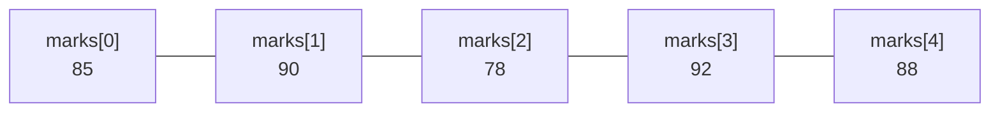

**Mnemonic:** "Declare, Initialize, Access With Index" (DIAWI)

## Question 4(a) OR [3 marks]

**Explain do while loop with example.**

**Answer**:

**do-while loop**: A loop that executes the body at least once before checking the condition.

**Structure:**

```c
do {
    statements;
} while(condition);
```

**Code Example:**

```c
#include <stdio.h>
void main()
{
    int num, sum = 0;
    
    do {
        printf("Enter a number (0 to stop): ");
        scanf("%d", &num);
        sum += num;
    } while(num != 0);
    
    printf("Sum of entered numbers = %d", sum);
}
```

**do-while Loop Flow:**

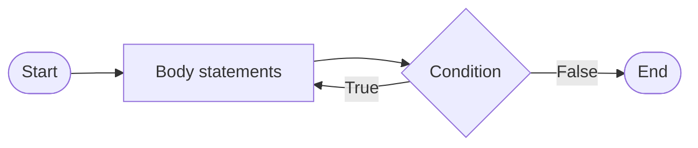

**Key Differences from while loop:**

- Body executes at least once
- Condition checked after execution
- Semicolon required after condition

**Mnemonic:** "Do First, Check Later" (DFCL)

## Question 4(b) OR [4 marks]

**Explain following functions with example:**
**(1) gets() (2) puts() (3) strlen() (4) strcpy()**

**Answer**:

**Table: String Functions in C**

| Function | Purpose | Syntax | Example |
|----------|---------|--------|---------|
| gets() | Reads string with spaces | gets(string); | gets(name); |
| puts() | Displays string with newline | puts(string); | puts(name); |
| strlen() | Returns string length | strlen(string); | n = strlen(name); |
| strcpy() | Copies source to destination | strcpy(dest, src); | strcpy(str1, str2); |

**Code Example:**

```c
#include <stdio.h>
#include <string.h>
void main()
{
    char name[50], copy[50];
    int length;
    
    printf("Enter your name: ");
    gets(name);           // Read name with spaces
    
    puts("Your name is:"); // Display with newline
    puts(name);
    
    length = strlen(name); // Get string length
    printf("Length: %d\n", length);
    
    strcpy(copy, name);    // Copy name to copy
    printf("Copied string: %s", copy);
}
```

**Mnemonic:** "Gets Puts String's Length and Copies" (GPSLC)

## Question 4(c) OR [7 marks]

**Define recursion and explain with suitable example. Write a program to find factorial of a given number using recursion.**

**Answer**:

**Recursion**: A process where a function calls itself directly or indirectly until a specific condition is met.

**Recursion Components:**

1. Base case: Condition to stop recursion
2. Recursive case: Function calling itself

**Code Example:**

```c
#include <stdio.h>

// Recursive function to find factorial
unsigned long factorial(int n)
{
    // Base case
    if (n == 0 || n == 1)
        return 1;
    
    // Recursive case
    else
        return n * factorial(n-1);
}

void main()
{
    int num;
    unsigned long result;
    
    printf("Enter a number: ");
    scanf("%d", &num);
    
    if (num < 0)
        printf("Factorial not defined for negative numbers");
    else
    {
        result = factorial(num);
        printf("Factorial of %d = %lu", num, result);
    }
}
```

**Recursive Factorial Calculation:**
For factorial(5)

**Table: Recursion Trace**

| Call | Returns | Calculation |
|------|---------|-------------|
| factorial(5) | 5 × factorial(4) | 5 × 24 = 120 |
| factorial(4) | 4 × factorial(3) | 4 × 6 = 24 |
| factorial(3) | 3 × factorial(2) | 3 × 2 = 6 |
| factorial(2) | 2 × factorial(1) | 2 × 1 = 2 |
| factorial(1) | 1 | Base case |

**Recursion Diagram:**

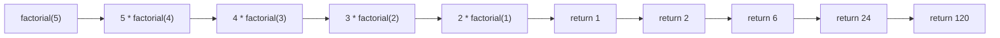

**Mnemonic:** "Function Calling Itself, Bottoming Out" (FCIBO)

## Question 5(a) [3 marks]

**Write the difference between array and structure.**

**Answer**:

**Table: Array vs Structure**

| Feature | Array | Structure |
|---------|-------|-----------|
| Data type | Same data type for all elements | Can store different data types |
| Access | Using index (arr[0]) | Using member name (s.name) |
| Memory allocation | Contiguous | Contiguous but different sizes |
| Size | Fixed size at declaration | Sum of sizes of all members |
| Purpose | Collection of similar items | Grouping related data of different types |
| Declaration | `int arr[5];` | `struct student { int id; char name[20]; };` |

**Diagram:**

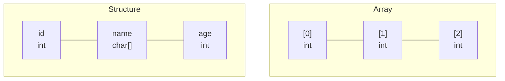

**Mnemonic:** "Arrays for Same, Structures for Different" (ASSD)

## Question 5(b) [4 marks]

**Write a C program using array that find the maximum value from given 10 values.**

**Answer**:

**Program:**

```c
#include <stdio.h>
void main()
{
    int arr[10], i, max;
    
    // Input 10 values
    printf("Enter 10 values:\n");
    for(i = 0; i < 10; i++)
    {
        printf("Enter value %d: ", i+1);
        scanf("%d", &arr[i]);
    }
    
    // Find maximum value
    max = arr[0];  // Assume first element is maximum
    for(i = 1; i < 10; i++)
    {
        if(arr[i] > max)
            max = arr[i];
    }
    
    printf("Maximum value is: %d", max);
}
```

**Algorithm Flow:**

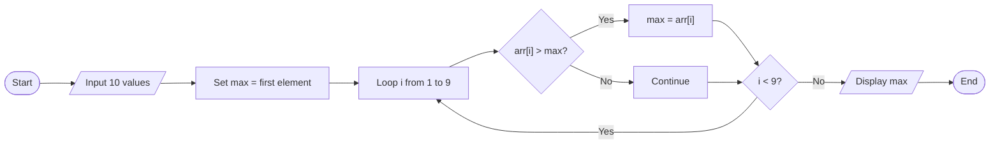

**Mnemonic:** "Compare And Replace Maximum" (CARM)

## Question 5(c) [7 marks]

**Define structure? Develop a structure named book to save following information about books. Book title, Name of author, Price and Number of pages.**

**Answer**:

**Structure**: A user-defined data type that groups related variables of different data types under a single name.

**Book Structure Code:**

```c
#include <stdio.h>

struct book {
    char title[50];
    char author[30];
    float price;
    int pages;
};

void main()
{
    struct book b1;
    
    // Input book details
    printf("Enter book title: ");
    gets(b1.title);
    
    printf("Enter author name: ");
    gets(b1.author);
    
    printf("Enter price: ");
    scanf("%f", &b1.price);
    
    printf("Enter number of pages: ");
    scanf("%d", &b1.pages);
    
    // Display book details
    printf("\nBook Details:\n");
    printf("Title: %s\n", b1.title);
    printf("Author: %s\n", b1.author);
    printf("Price: Rs. %.2f\n", b1.price);
    printf("Pages: %d", b1.pages);
}
```

**Structure Memory Representation:**

```goat
+------------------------+
| struct book            |
+------------------------+
| title[50]  |           |
|            |  "C Prog" |
+------------------------+
| author[30] |           |
|            |  "Dennis" |
+------------------------+
| price      |   450.50  |
+------------------------+
| pages      |    320    |
+------------------------+
```

**Structure Diagram:**

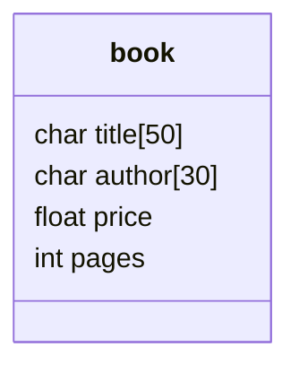

**Mnemonic:** "Title Author Price Pages" (TAPP)

## Question 5(a) OR [3 marks]

**What is a string? What are the operations that can be performed on string?**

**Answer**:

**String**: A sequence of characters terminated by a null character '\0'.

**Table: String Operations in C**

| Operation | Function | Example |
|-----------|----------|---------|
| Input | gets(), scanf() | gets(str), scanf("%s", str) |
| Output | puts(), printf() | puts(str), printf("%s", str) |
| Length | strlen() | len = strlen(str) |
| Copy | strcpy() | strcpy(dest, src) |
| Concatenate | strcat() | strcat(str1, str2) |
| Compare | strcmp() | result = strcmp(str1, str2) |
| Search | strchr(), strstr() | ptr = strchr(str, 'a') |
| Convert | strlwr(), strupr() | strlwr(str), strupr(str) |

**String Representation:**

```goat
+---+---+---+---+---+---+
| H | e | l | l | o | \0|
+---+---+---+---+---+---+
```

**Mnemonic:** "Input Output Length Copy Concat Compare Search Convert" (IOLCCSC)

## Question 5(b) OR [4 marks]

**Write a program prints its ASCII value from A to Z.**

**Answer**:

**Program:**

```c
#include <stdio.h>
void main()
{
    char ch;
    
    printf("ASCII values from A to Z:\n");
    printf("Character\tASCII Value\n");
    printf("-----------------------\n");
    
    for(ch = 'A'; ch <= 'Z'; ch++)
    {
        printf("    %c\t\t   %d\n", ch, ch);
    }
}
```

**Sample Output Table:**

| Character | ASCII Value |
|-----------|-------------|
| A | 65 |
| B | 66 |
| ... | ... |
| Z | 90 |

**ASCII Chart Representation:**

```goat
ASCII Values:
A(65) B(66) C(67) ... Z(90)
```

**Mnemaid:** "Alphabets Sequentially Creating Integer Indices" (ASCII)

## Question 5(c) OR [7 marks]

**What is user defined and library function? Explain with two examples of each.**

**Answer**:

**Library Functions**: Pre-defined functions provided by C language that are ready to use.

**User-Defined Functions**: Functions created by the programmer to perform specific tasks.

**Table: Library vs User-Defined Functions**

| Feature | Library Functions | User-Defined Functions |
|---------|------------------|------------------------|
| Definition | Pre-defined in header files | Created by programmer |
| Declaration | No need to define | Must be defined |
| Examples | printf(), scanf(), strlen() | calculateArea(), findMax() |
| Header files | stdio.h, string.h, math.h, etc. | No header required |
| Purpose | Common tasks | Customized tasks |

**Examples of Library Functions:**

1. **strlen() - String Length**

```c
#include <stdio.h>
#include <string.h>
void main()
{
    char str[] = "Hello";
    int length = strlen(str);  // Library function
    printf("Length of string: %d", length);
}
```

2. **sqrt() - Square Root**

```c
#include <stdio.h>
#include <math.h>
void main()
{
    float num = 25, result;
    result = sqrt(num);  // Library function
    printf("Square root of %.0f = %.2f", num, result);
}
```

**Examples of User-Defined Functions:**

1. **calculateArea() - Area of Rectangle**

```c
#include <stdio.h>

// User-defined function
float calculateArea(float length, float width)
{
    return length * width;
}

void main()
{
    float length = 10.5, width = 5.5, area;
    area = calculateArea(length, width);  // User function call
    printf("Area of rectangle = %.2f", area);
}
```

2. **findMax() - Maximum of Three Numbers**

```c
#include <stdio.h>

// User-defined function
int findMax(int a, int b, int c)
{
    if(a >= b && a >= c)
        return a;
    else if(b >= a && b >= c)
        return b;
    else
        return c;
}

void main()
{
    int x = 10, y = 25, z = 15, max;
    max = findMax(x, y, z);  // User function call
    printf("Maximum number is: %d", max);
}
```

**Mnemonic:** "Libraries Provide, Users Create" (LPUC)
