## પ્રશ્ન 1(અ) [3 માર્કસ]

**કીવર્ડની વ્યાખ્યા લખો. C લેંગ્વેજના કોઈપણ ૪ કીવર્ડ લખો.**

**જવાબ**:
કીવર્ડ એ C ભાષામાં પૂર્વનિર્ધારિત, અનામત શબ્દ છે જેનો કમ્પાઇલર દ્વારા વિશેષ અર્થ હોય છે અને તેનો ઓળખકર્તા તરીકે ઉપયોગ કરી શકાતો નથી.

**કોષ્ટક: સામાન્ય C કીવર્ડ્સ**

| કીવર્ડ | ઉપયોગ |
|---------|---------|
| int     | પૂર્ણાંક ડેટા પ્રકાર |
| float   | અપૂર્ણાંક ડેટા પ્રકાર |
| char    | અક્ષર ડેટા પ્રકાર |
| if      | શરતી નિવેદન |
| for     | લૂપ નિવેદન |
| while   | લૂપ નિવેદન |
| void    | રિટર્ન પ્રકાર/પેરામીટર |
| return  | ફંક્શનમાંથી મૂલ્ય પાછું આપવું |

- **અનામત શબ્દો**: કીવર્ડનો વેરિએબલ નામ તરીકે ઉપયોગ કરી શકાતો નથી
- **પૂર્વનિર્ધારિત**: તેમનો ભાષામાં નિશ્ચિત અર્થ છે
- **કેસ-સેન્સિટિવ**: બધા કીવર્ડ્સ લોઅરકેસમાં હોવા જોઈએ

**મેમરી ટ્રીક:** "If VoId FoR WhIle" (મહત્વપૂર્ણ કીવર્ડના પ્રથમ અક્ષરો)

## પ્રશ્ન 1(બ) [4 માર્કસ]

**વેરીએબલના નામ માટેના નિયમો સમજાવો.**

**જવાબ**:
C માં વેરીએબલ્સ માન્ય ઓળખકર્તા હોવા માટે ચોક્કસ નિયમોનું પાલન કરવું આવશ્યક છે.

**કોષ્ટક: C માં વેરીએબલ નામકરણ નિયમો**

| નિયમ | વિવરણ | માન્ય ઉદાહરણ | અમાન્ય ઉદાહરણ |
|------|-------------|---------------|-----------------|
| પ્રથમ અક્ષર | અક્ષર અથવા અંડરસ્કોર હોવો જોઈએ | age, _count | 1value |
| પછીના અક્ષરો | અક્ષરો, અંકો અથવા અંડરસ્કોર | user_1, total99 | user@1 |
| કેસ સંવેદનશીલતા | મોટા અને નાના અક્ષરો અલગ | Value ≠ value | - |
| કીવર્ડ્સ | અનામત કીવર્ડ્સનો ઉપયોગ ન કરી શકાય | counter | int |
| લંબાઈ | અર્થપૂર્ણ પરંતુ ખૂબ લાંબી નહીં | studentMarks | sm |
| વિશેષ અક્ષરો | માન્ય નથી | firstName | first-name |

- **વર્ણનાત્મક નામો**: હેતુ દર્શાવતા અર્થપૂર્ણ નામોનો ઉપયોગ કરો
- **સુસંગત શૈલી**: સુસંગત નામકરણ પદ્ધતિનું પાલન કરો
- **સ્પેસ નહીં**: સ્પેસને બદલે અંડરસ્કોર અથવા camelCase નો ઉપયોગ કરો

**મેમરી ટ્રીક:** "FLASKS" (First Letter, Letters/digits, Avoid keywords, Sensitive case, Keep meaningful, Skip special chars)

## પ્રશ્ન 1(ક) [7 માર્કસ]

**ફ્લોચાર્ટની વ્યાખ્યા લખો. ત્રણ પૂર્ણાંક નંબર N1, N2 અને N3 માંથી નાનો નંબર શોધવા માટેનો ફ્લોચાર્ટ દોરો.**

**જવાબ**:
ફ્લોચાર્ટ એ એલ્ગોરિધમનું ગ્રાફિકલ નિરૂપણ છે જે પગલાંઓને બોક્સ તરીકે દર્શાવે છે અને તેમના ક્રમને તીરથી જોડીને દર્શાવે છે.

**ડાયાગ્રામ:**

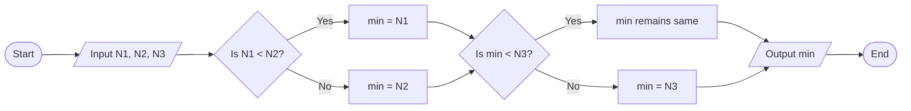

- **ઉપયોગ કરેલા સિમ્બોલ**: ઓવલ (શરુઆત/અંત), સમાંતર ચતુષ્કોણ (ઇનપુટ/આઉટપુટ), હીરા (નિર્ણય), આયત (પ્રક્રિયા)
- **નિર્ણય બિંદુઓ**: મૂલ્યોની વ્યવસ્થિત સરખામણી
- **તર્કસંગત પ્રવાહ**: તીર કાર્યોનો ક્રમ દર્શાવે છે

**મેમરી ટ્રીક:** "Start-Input-Compare-Output-End" (SICOE)

## પ્રશ્ન 1(ક) OR [7 માર્કસ]

**અલગોરિધમની વ્યાખ્યા લખો. ત્રણ પૂર્ણાંક નંબર N1, N2 અને N3 માંથી નાનો નંબર શોધવા માટેનો અલગોરિધમ લખો.**

**જવાબ**:
અલગોરિધમ એ પગલાવાર પ્રક્રિયા અથવા ચોક્કસ સમસ્યાને ઉકેલવા માટેની સુવ્યાખ્યાયિત સૂચનાઓનો પરિમિત સમૂહ છે.

**ત્રણ સંખ્યાઓમાંથી ન્યૂનતમ શોધવા માટેનો અલગોરિધમ:**

```
પગલું 1: શરૂ કરો
પગલું 2: ત્રણ સંખ્યાઓ N1, N2, અને N3 ઇનપુટ કરો
પગલું 3: min = N1 સેટ કરો (પ્રથમ સંખ્યા લઘુત્તમ માની લો)
પગલું 4: જો N2 < min, તો min = N2 સેટ કરો
પગલું 5: જો N3 < min, તો min = N3 સેટ કરો
પગલું 6: min ને લઘુત્તમ સંખ્યા તરીકે આઉટપુટ કરો
પગલું 7: અંત
```

**કોષ્ટક: અલગોરિધમ લક્ષણો**

| લક્ષણ | વિવરણ |
|----------------|-------------|
| પરિમિતતા     | અલગોરિધમ પરિમિત પગલાં પછી સમાપ્ત થવો જોઈએ |
| સુવ્યાખ્યાયિતતા   | દરેક પગલું ચોક્કસપણે વ્યાખ્યાયિત હોવું જોઈએ |
| ઇનપુટ          | અલગોરિધમ શૂન્ય અથવા વધુ ઇનપુટ લે છે |
| આઉટપુટ         | અલગોરિધમ એક અથવા વધુ આઉટપુટ આપે છે |
| અસરકારકતા  | પગલાં સરળ અને ક્રિયાન્વિત થઈ શકે તેવા હોવા જોઈએ |

- **અનુક્રમિક પગલાં**: તાર્કિક ક્રમનું પાલન કરે છે
- **તુલનાત્મક અભિગમ**: વ્યવસ્થિત રીતે લઘુત્તમ શોધે છે
- **સરળતા**: સમજવા અને અમલમાં મૂકવામાં સરળ

**મેમરી ટ્રીક:** "FIDEO" (Finiteness, Input, Definiteness, Effectiveness, Output)

## પ્રશ્ન 2(અ) [3 માર્કસ]

**gets() અને puts() વચ્ચેનો તફાવત સમજાવો.**

**જવાબ**:
gets() અને puts() એ C માં સ્ટ્રિંગ્સ સાથે ઇનપુટ અને આઉટપુટ ઓપરેશન્સ માટેના સ્ટાન્ડર્ડ લાઇબ્રેરી ફંક્શન્સ છે.

**કોષ્ટક: gets() અને puts() ની તુલના**

| લક્ષણ | gets() | puts() |
|---------|--------|--------|
| હેતુ | stdin માંથી સ્ટ્રિંગ વાંચે છે | stdout પર સ્ટ્રિંગ લખે છે |
| પ્રોટોટાઇપ | char *gets(char *str) | int puts(const char *str) |
| વર્તન | ન્યુલાઇન સુધી વાંચે છે | આપમેળે ન્યુલાઇન ઉમેરે છે |
| રિટર્ન વેલ્યુ | સફળતા પર str, નિષ્ફળતા પર NULL | સફળતા પર નોન-નેગેટિવ, એરર પર EOF |
| સુરક્ષા | અસુરક્ષિત (બફર ઓવરફ્લો જોખમ) | સુરક્ષિત |
| ભલામણ | ના (અપ્રચલિત) | હા |

- **ઇનપુટ/આઉટપુટ**: gets() ઇનપુટ માટે, puts() આઉટપુટ માટે
- **ટર્મિનેશન**: gets() ન્યુલાઇન પર અટકે છે, puts() ન્યુલાઇન ઉમેરે છે
- **સિક્યોરિટી**: gets() બફર લિમિટ ચેક કરતું નથી

**મેમરી ટ્રીક:** "Gets In, Puts Out" (gets વાંચે છે, puts લખે છે)

## પ્રશ્ન 2(બ) [4 માર્કસ]

**કન્ડીશનલ ઓપરેટરનો ઉપયોગ કરીને લીધેલ નંબર એકી છે કે બેકી તે શોધવા માટે C પ્રોગ્રામ બનાવો.**

**જવાબ**:
આ પ્રોગ્રામ કન્ડિશનલ ઓપરેટરનો ઉપયોગ કરીને નંબર એકી કે બેકી છે તે તપાસે છે.

```c
#include <stdio.h>

int main() {
    int num;
    
    printf("Enter a number: ");
    scanf("%d", &num);
    
    // કન્ડિશનલ ઓપરેટરનો ઉપયોગ કરીને એકી-બેકી તપાસો
    (num % 2 == 0) ? printf("%d is even\n", num) : printf("%d is odd\n", num);
    
    return 0;
}
```

**ડાયાગ્રામ:**

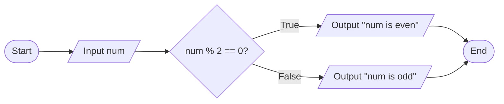

- **કન્ડિશનલ ઓપરેટર**: ? : એ ટ્રિનેરી ઓપરેટર છે
- **મોડ્યુલસ ઓપરેશન**: % ભાગાકાર પછી બાકી આપે છે
- **ટેસ્ટ કન્ડિશન**: num % 2 == 0 બેકી સંખ્યા માટે તપાસે છે

**મેમરી ટ્રીક:** "REMinder 0 = Even" (બાકી 0 એટલે બેકી)

## પ્રશ્ન 2(ક) [7 માર્કસ]

**લોજીકલ અને રીલેશનલ ઓપરેટરો ઉદાહરણ સાથે સમજાવો.**

**જવાબ**:
લોજીકલ અને રીલેશનલ ઓપરેટરો C પ્રોગ્રામમાં શરતો બનાવવા અને નિર્ણયો લેવા માટે વપરાય છે.

**કોષ્ટક: રીલેશનલ ઓપરેટરો**

| ઓપરેટર | અર્થ | ઉદાહરણ | પરિણામ |
|----------|---------|---------|--------|
| == | બરાબર | 5 == 5 | true (1) |
| != | બરાબર નથી | 5 != 3 | true (1) |
| > | કરતાં મોટું | 7 > 3 | true (1) |
| < | કરતાં નાનું | 2 < 8 | true (1) |
| >= | કરતાં મોટું અથવા બરાબર | 4 >= 4 | true (1) |
| <= | કરતાં નાનું અથવા બરાબર | 6 <= 9 | true (1) |

**કોષ્ટક: લોજીકલ ઓપરેટરો**

| ઓપરેટર | અર્થ | ઉદાહરણ | પરિણામ |
|----------|---------|---------|--------|
| && | લોજીકલ AND | (5>3) && (8>5) | true (1) |
| \|\| | લોજીકલ OR | (5>7) \|\| (3<6) | true (1) |
| ! | લોજીકલ NOT | !(5>7) | true (1) |

**કોડ ઉદાહરણ:**

```c
int age = 20;
int score = 75;

// રીલેશનલ અને લોજીકલ ઓપરેટરોનો ઉપયોગ
if ((age >= 18) && (score > 70)) {
    printf("Eligible");
}
```

- **તુલના**: રીલેશનલ ઓપરેટરો મૂલ્યોની તુલના કરે છે
- **શરતોનું જોડાણ**: લોજીકલ ઓપરેટરો અનેક શરતોને જોડે છે
- **સત્ય મૂલ્ય**: બધા ઓપરેટરો 1 (સાચું) અથવા 0 (ખોટું) પાછા આપે છે

**મેમરી ટ્રીક:** "CORNL" (Compare with relational, OR/AND/NOT with logical)

## પ્રશ્ન 2(અ) OR [3 માર્કસ]

**જો 16 + ( 216 / ( ( 3 + 6 ) * 12 ) ) -10 સમીકરણને ઉકેલવામાં આવે તો ઓપરેટરોની અગ્રીમતાને ધ્યાને લઇ દરેક સ્ટેપ અને અંતિમ જવાબ લખો.**

**જવાબ**:
ચાલો 16 + ( 216 / ( ( 3 + 6 ) * 12 ) ) - 10 એક્સપ્રેશનને ઓપરેટર પ્રિસિડન્સને અનુસરીને પગલેવાર મૂલ્યાંકન કરીએ.

**કોષ્ટક: પગલેવાર મૂલ્યાંકન**

| પગલું | ઓપરેશન | આ પગલા પછી એક્સપ્રેશન |
|------|-----------|----------------------------|
| 1 | (3 + 6) ની ગણતરી | 16 + ( 216 / ( 9 * 12 ) ) - 10 |
| 2 | (9 * 12) ની ગણતરી | 16 + ( 216 / 108 ) - 10 |
| 3 | (216 / 108) ની ગણતરી | 16 + 2 - 10 |
| 4 | 16 + 2 ની ગણતરી | 18 - 10 |
| 5 | 18 - 10 ની ગણતરી | 8 |

**અંતિમ જવાબ: 8**

**ડાયાગ્રામ:**

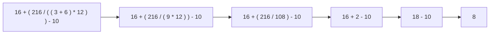

- **પ્રથમ કૌંસમાં**: સૌથી અંદરના કૌંસનું મૂલ્યાંકન પહેલા કરાય છે
- **ગુણાકાર પછી ભાગાકાર**: ડાબેથી જમણે ગણતરી કરો
- **સરવાળો અને બાદબાકી છેલ્લે**: ડાબેથી જમણે ક્રમમાં

**મેમરી ટ્રીક:** "PEMDAS" (Parentheses, Exponents, Multiplication/Division, Addition/Subtraction)

## પ્રશ્ન 2(બ) OR [4 માર્કસ]

**વર્તુળનું ક્ષેત્રફળ અને પરિઘ શોધવા માટેનો C પ્રોગ્રામ લખો.**

**જવાબ**:
આ પ્રોગ્રામ વર્તુળની ત્રિજ્યાના આધારે વર્તુળનું ક્ષેત્રફળ અને પરિઘ ગણે છે.

```c
#include <stdio.h>
#define PI 3.14159

int main() {
    float radius, area, circumference;
    
    printf("Enter the radius of circle: ");
    scanf("%f", &radius);
    
    // ક્ષેત્રફળ અને પરિઘની ગણતરી કરો
    area = PI * radius * radius;
    circumference = 2 * PI * radius;
    
    printf("Area of circle = %.2f square units\n", area);
    printf("Circumference of circle = %.2f units\n", circumference);
    
    return 0;
}
```

**ડાયાગ્રામ:**

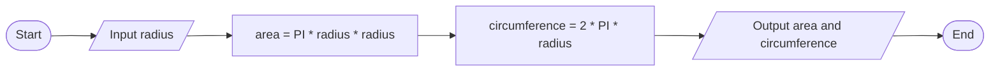

- **ફોર્મ્યુલા**: ક્ષેત્રફળ = π × r² અને પરિઘ = 2π × r
- **કોન્સ્ટન્ટ ડેફિનિશન**: PI માટે #define નો ઉપયોગ
- **ફ્લોટ વેરિએબલ્સ**: દશાંશ ચોકસાઈ માટે

**મેમરી ટ્રીક:** "PIR²" ક્ષેત્રફળ માટે, "2PIR" પરિઘ માટે

## પ્રશ્ન 2(ક) OR [7 માર્કસ]

**એરીથમેટીક અને બીટ-વાઈસ ઓપરેટરો ઉદાહરણ સાથે સમજાવો.**

**જવાબ**:
એરીથમેટીક ઓપરેટરો ગાણિતિક ઓપરેશન કરે છે જ્યારે બિટ-વાઈસ ઓપરેટરો ઇન્ટીજરના અલગ બિટ્સ સાથે કામ કરે છે.

**કોષ્ટક: એરીથમેટીક ઓપરેટરો**

| ઓપરેટર | વિવરણ | ઉદાહરણ | પરિણામ |
|----------|-------------|---------|--------|
| + | સરવાળો | 5 + 3 | 8 |
| - | બાદબાકી | 7 - 2 | 5 |
| * | ગુણાકાર | 4 * 3 | 12 |
| / | ભાગાકાર | 10 / 3 | 3 (ઇન્ટીજર ભાગાકાર) |
| % | મોડ્યુલસ (શેષ) | 10 % 3 | 1 |
| ++ | ઇનક્રિમેન્ટ | a++ | મૂલ્ય વાપર્યા પછી 1 ઉમેરે છે |
| -- | ડિક્રિમેન્ટ | --b | મૂલ્ય વાપરતા પહેલા 1 ઘટાડે છે |

**કોષ્ટક: બિટવાઈઝ ઓપરેટરો**

| ઓપરેટર | વિવરણ | ઉદાહરણ (બાઇનરી) | પરિણામ |
|----------|-------------|------------------|--------|
| & | બિટવાઈઝ AND | 5 (101) & 3 (011) | 1 (001) |
| \| | બિટવાઈઝ OR | 5 (101) \| 3 (011) | 7 (111) |
| ^ | બિટવાઈઝ XOR | 5 (101) ^ 3 (011) | 6 (110) |
| ~ | બિટવાઈઝ NOT | ~5 (101) | -6 (બિટ્સ પર આધારિત) |
| << | લેફ્ટ શિફ્ટ | 5 << 1 | 10 (1010) |
| >> | રાઈટ શિફ્ટ | 5 >> 1 | 2 (10) |

**કોડ ઉદાહરણ:**

```c
int a = 5, b = 3;
printf("a + b = %d\n", a + b);      // 8
printf("a & b = %d\n", a & b);      // 1
printf("a << 1 = %d\n", a << 1);    // 10
```

- **ગાણિતિક ઓપરેશન્સ**: એરીથમેટીક ઓપરેટરો ગણતરી માટે
- **બિટ મેનિપ્યુલેશન**: બિટવાઈઝ ઓપરેટરો બાઇનરી લેવલ પર કામ કરે છે
- **કાર્યક્ષમતા**: બિટવાઈઝ ઓપરેશન્સ અમુક કાર્યો માટે વધુ ઝડપી છે

**મેમરી ટ્રીક:** "SAME BARON" (Subtraction Addition Multiplication, Bitwise AND/OR/NOT)

## પ્રશ્ન 3(અ) [3 માર્કસ]

**'go to' સ્ટેટમેન્ટનો ઉપયોગ ઉદાહરણ સાથે સમજાવો.**

**જવાબ**:
goto સ્ટેટમેન્ટનો ઉપયોગ પ્રોગ્રામ કંટ્રોલને બિનશરતી રીતે લેબલવાળા સ્ટેટમેન્ટ પર ટ્રાન્સફર કરવા માટે થાય છે.

```c
#include <stdio.h>

int main() {
    int num, sum = 0;
    
    printf("Enter a positive number: ");
    scanf("%d", &num);
    
    if (num <= 0) {
        goto error;
    }
    
    sum = num * (num + 1) / 2;
    printf("Sum of first %d numbers = %d\n", num, sum);
    goto end;
    
    error:
        printf("Error: Please enter a positive number!\n");
    
    end:
        return 0;
}
```

**ડાયાગ્રામ:**

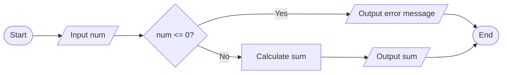

- **લેબલ ડિક્લેરેશન**: લેબલ્સ કોલન (:) સાથે સમાપ્ત થાય
- **જમ્પ સ્ટેટમેન્ટ**: goto કંટ્રોલને લેબલ પર ટ્રાન્સફર કરે છે
- **સાવધાની**: વધારે ઉપયોગ "સ્પેગેટી કોડ" બનાવે છે

**મેમરી ટ્રીક:** "JUMPing LABEL" (લેબલવાળા સ્ટેટમેન્ટ પર જમ્પ)

## પ્રશ્ન 3(બ) [4 માર્કસ]

**વિદ્યાર્થીએ ૫ અલગ અલગ વિષયોમાં મેળવેલ માર્ક્સને કીબોર્ડથી ઈનપુટમાં લો. વિધાથીને આ નિયમો પ્રમાણે ગ્રેડ મળે છે: ૯૦ કે તેથી વધુ ટકા માટે- ગ્રેડ A. ૮૦ થી ૮૯ સુધીના ટકા માટે- ગ્રેડ B. ૭૦ થી ૭૯ સુધીના ટકા માટે- ગ્રેડ C. ૬૦ થી ૬૯ સુધીના ટકા માટે- ગ્રેડ D. ૫૦ થી ૫૯ સુધીના ટકા માટે- ગ્રેડ E. ૫૦ થી ઓછા ટકા માટે- ગ્રેડ F. વિદ્યાર્થીએ મેળવેલ ગ્રેડને ડિસ્પ્લે કરવા માટેનો C પ્રોગ્રામ લખો.**

**જવાબ**:
આ પ્રોગ્રામ 5 વિષયોમાં મેળવેલ માર્ક્સના સરેરાશના આધારે ગ્રેડ ગણે છે.

```c
#include <stdio.h>

int main() {
    int marks[5], total = 0, i;
    float percentage;
    char grade;
    
    // 5 વિષયો માટે માર્ક્સ ઇનપુટ
    for (i = 0; i < 5; i++) {
        printf("Enter marks for subject %d (out of 100): ", i+1);
        scanf("%d", &marks[i]);
        total += marks[i];
    }
    
    // ટકાવારી ગણો
    percentage = total / 5.0;
    
    // ગ્રેડ નક્કી કરો
    if (percentage >= 90)
        grade = 'A';
    else if (percentage >= 80)
        grade = 'B';
    else if (percentage >= 70)
        grade = 'C';
    else if (percentage >= 60)
        grade = 'D';
    else if (percentage >= 50)
        grade = 'E';
    else
        grade = 'F';
    
    printf("Percentage: %.2f%%\n", percentage);
    printf("Grade: %c\n", grade);
    
    return 0;
}
```

**કોષ્ટક: ગ્રેડિંગ માપદંડ**

| ટકાવારી રેન્જ | ગ્રેડ |
|------------------|-------|
| ≥ 90             | A     |
| 80-89            | B     |
| 70-79            | C     |
| 60-69            | D     |
| 50-59            | E     |
| < 50             | F     |

- **ઇનપુટ એરે**: 5 વિષયોના માર્ક્સ સ્ટોર કરે છે
- **ટકાવારી ગણતરી**: સરવાળો વિષયોની સંખ્યા દ્વારા ભાગીને
- **ગ્રેડ નિર્ધારણ**: if-else લેડરનો ઉપયોગ કરીને

**મેમરી ટ્રીક:** "ABCDEF-90-80-70-60-50" (ગ્રેડ્સ તેમની ટકાવારી થ્રેશોલ્ડ સાથે)

## પ્રશ્ન 3(ક) [7 માર્કસ]

**Nested if-else નો ફ્લોચાર્ટ દોરી ઉદાહરણ સાથે સમજાવો.**

**જવાબ**:
નેસ્ટેડ if-else એ એક કંટ્રોલ સ્ટ્રક્ચર છે જ્યાં if અથવા else સ્ટેટમેન્ટમાં બીજું if-else સ્ટેટમેન્ટ સમાયેલ હોય છે.

**ડાયાગ્રામ:**

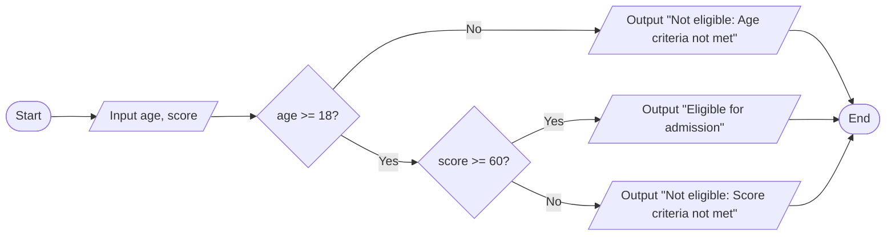

**કોડ ઉદાહરણ:**

```c
#include <stdio.h>

int main() {
    int age, score;
    
    printf("Enter age: ");
    scanf("%d", &age);
    printf("Enter score: ");
    scanf("%d", &score);
    
    if (age >= 18) {
        if (score >= 60) {
            printf("Eligible for admission");
        } else {
            printf("Not eligible: Score criteria not met");
        }
    } else {
        printf("Not eligible: Age criteria not met");
    }
    
    return 0;
}
```

- **બહુવિધ શરતો**: અનુક્રમે કેટલીક શરતોની તપાસ કરે છે
- **શ્રેણીબદ્ધ નિર્ણય**: અંદરની શરત માત્ર ત્યારે જ મૂલ્યાંકિત થાય છે જો બહારની શરત સાચી હોય
- **ઇન્ડેન્ટેશન**: યોગ્ય ઇન્ડેન્ટેશન સ્ટ્રક્ચર સમજવામાં મદદ કરે છે

**મેમરી ટ્રીક:** "CONE" (Check Outer, Nest Evaluation inside)

## પ્રશ્ન 3(અ) OR [3 માર્કસ]

**continue અને break સ્ટેટમેન્ટનો ઉપયોગ સમજાવો.**

**જવાબ**:
break અને continue સ્ટેટમેન્ટ્સ અલગ અલગ રીતે લૂપના પ્રવાહને નિયંત્રિત કરે છે.

**કોષ્ટક: break અને continue ની તુલના**

| લક્ષણ | break | continue |
|---------|-------|----------|
| હેતુ | લૂપમાંથી તરત જ બહાર નીકળે છે | વર્તમાન પુનરાવર્તન છોડે છે |
| લૂપ પર અસર | સંપૂર્ણપણે સમાપ્ત કરે છે | આગલા પુનરાવર્તન પર આગળ વધે છે |
| લાગુ પડે છે | switch, for, while, do-while | for, while, do-while |
| ઉપયોગ | જ્યારે શરત પૂરી થઈ જાય અને વધુ પુનરાવર્તનની જરૂર ન હોય | જ્યારે વર્તમાન પુનરાવર્તન છોડવું જોઈએ |

**break સાથે ઉદાહરણ:**

```c
for (int i = 1; i <= 10; i++) {
    if (i == 5)
        break;    // i 5 થાય ત્યારે લૂપથી બહાર નીકળો
    printf("%d ", i);  // આઉટપુટ: 1 2 3 4
}
```

**continue સાથે ઉદાહરણ:**

```c
for (int i = 1; i <= 10; i++) {
    if (i % 2 == 0)
        continue;  // બેકી સંખ્યાઓ છોડો
    printf("%d ", i);  // આઉટપુટ: 1 3 5 7 9
}
```

- **લૂપ કંટ્રોલ**: બંને લૂપ એક્ઝિક્યુશન મેનેજ કરવા માટે વપરાય છે
- **Break બહાર નીકળે છે**: સંપૂર્ણપણે લૂપ અટકાવે છે
- **Continue છોડે છે**: માત્ર વર્તમાન પુનરાવર્તન છોડે છે

**મેમરી ટ્રીક:** "BEC" (Break Exits Completely, Continue only current)

## પ્રશ્ન 3(બ) OR [4 માર્કસ]

**નીચે આપેલી પેટર્ન પ્રિન્ટ કરવા માટેનો C પ્રોગ્રામ ફોર લૂપનો ઉપયોગ કરીને લખો.**

```
1
1 2
1 2 3
1 2 3 4
```

**જવાબ**:
આ પ્રોગ્રામ નેસ્ટેડ ફોર લૂપનો ઉપયોગ કરીને નંબર્સની પેટર્ન પ્રિન્ટ કરે છે.

```c
#include <stdio.h>

int main() {
    int i, j;
    
    // બહારની લૂપ રો માટે (1 થી 4)
    for (i = 1; i <= 4; i++) {
        // અંદરની લૂપ કોલમ માટે (1 થી i)
        for (j = 1; j <= i; j++) {
            printf("%d ", j);
        }
        printf("\n");  // દરેક રો પછી નવી લાઈન
    }
    
    return 0;
}
```

**ડાયાગ્રામ:**

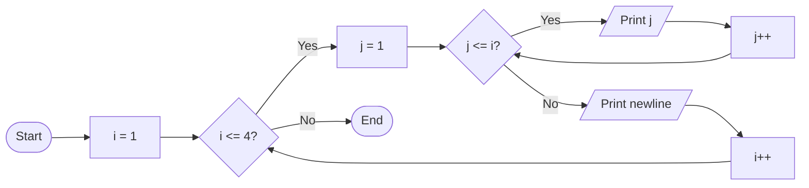

- **નેસ્ટેડ લૂપ્સ**: બહારની લૂપ રો માટે, અંદરની કોલમ માટે
- **ડાયનેમિક લિમિટ**: અંદરની લૂપ j=1 થી વર્તમાન i સુધી ચાલે છે
- **ઇન્ક્રિમેન્ટલ પેટર્ન**: દરેક રોમાં એક વધુ નંબર હોય છે

**મેમરી ટ્રીક:** "RICI" (Row Increases, Column Increases based on row number)

## પ્રશ્ન 3(ક) OR [7 માર્કસ]

**સ્વીચ સ્ટેટમેન્ટ ફ્લોચાર્ટ દોરી ઉદાહરણ સાથે સમજાવો.**

**જવાબ**:
સ્વિચ સ્ટેટમેન્ટ એક મલ્ટિ-વે ડિસિઝન મેકર છે જે વેરિએબલને વિવિધ કેસ વેલ્યુઝ સાથે ટેસ્ટ કરે છે.

**ડાયાગ્રામ:**

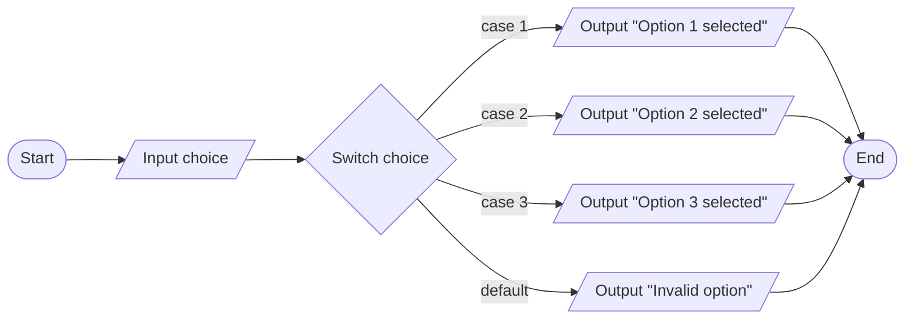

**કોડ ઉદાહરણ:**

```c
#include <stdio.h>

int main() {
    int choice;
    
    printf("Menu:\n");
    printf("1. Add\n");
    printf("2. Subtract\n");
    printf("3. Multiply\n");
    printf("Enter your choice (1-3): ");
    scanf("%d", &choice);
    
    switch (choice) {
        case 1:
            printf("Addition selected\n");
            break;
        case 2:
            printf("Subtraction selected\n");
            break;
        case 3:
            printf("Multiplication selected\n");
            break;
        default:
            printf("Invalid choice\n");
    }
    
    return 0;
}
```

- **મલ્ટિપલ કેસિઝ**: એક વેરિએબલને અનેક વેલ્યુઝ સાથે ટેસ્ટ કરે છે
- **બ્રેક સ્ટેટમેન્ટ**: આગલા કેસમાં પડતા અટકાવે છે
- **ડિફોલ્ટ કેસ**: કોઈપણ કેસ સાથે મેચ ન થતા વેલ્યુઝને સંભાળે છે
- **કેસ ઓર્ડર**: કોઈપણ ક્રમમાં હોઈ શકે, ડિફોલ્ટ સામાન્ય રીતે છેલ્લે હોય

**મેમરી ટ્રીક:** "CASED" (Check All Switch Expression's Destinations)

## પ્રશ્ન 4(અ) [3 માર્કસ]

**fahrenheit= ((celsius*9)/5)+32 સમીકરણથી સેલ્સિયસમાં આપેલા તાપમાનને ફેરનહીટમાં રૂપાંતર કરવા માટેનો C પ્રોગ્રામ લખો.**

**જવાબ**:
આ પ્રોગ્રામ તાપમાન મૂલ્યને સેલ્સિયસથી ફેરનહાઇટમાં રૂપાંતરિત કરે છે.

```c
#include <stdio.h>

int main() {
    float celsius, fahrenheit;
    
    printf("Enter temperature in Celsius: ");
    scanf("%f", &celsius);
    
    // સેલ્સિયસને ફેરનહાઇટમાં રૂપાંતરિત કરો
    fahrenheit = ((celsius * 9) / 5) + 32;
    
    printf("%.2f Celsius = %.2f Fahrenheit\n", celsius, fahrenheit);
    
    return 0;
}
```

**ડાયાગ્રામ:**

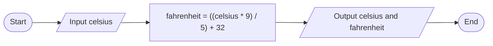

- **ફોર્મ્યુલા**: F = ((C × 9) ÷ 5) + 32
- **ફ્લોટ વેરિએબલ્સ**: દશાંશ ચોકસાઈ માટે
- **ફોર્મેટેડ આઉટપુટ**: બે દશાંશ સ્થાન માટે %.2f નો ઉપયોગ

**મેમરી ટ્રીક:** "C95+32=F" (સેલ્સિયસ × 9 ÷ 5 + 32 = ફેરનહાઇટ)

## પ્રશ્ન 4(બ) [4 માર્કસ]

**પોઈન્ટર એટલે શું? ઉદાહરણ સાથે સમજાવો.**

**જવાબ**:
પોઈન્ટર એ એક વેરિએબલ છે જે અન્ય વેરિએબલના મેમરી એડ્રેસને સ્ટોર કરે છે.

**ડાયાગ્રામ:**

```
મેમરી:
+--------+      +--------+
| ptr    |----->| var    |
| 0x1000 |      | 0x2000 |
+--------+      +--------+
  એડ્રેસ          મૂલ્ય: 10
  0x2000
  ધરાવે છે
```

**કોડ ઉદાહરણ:**

```c
#include <stdio.h>

int main() {
    int var = 10;    // સામાન્ય વેરિએબલ
    int *ptr;        // પોઈન્ટર વેરિએબલ
    
    ptr = &var;      // var નું એડ્રેસ ptr માં સ્ટોર કરો
    
    printf("Value of var: %d\n", var);       // આઉટપુટ: 10
    printf("Address of var: %p\n", &var);    // આઉટપુટ: મેમરી એડ્રેસ
    printf("Value of ptr: %p\n", ptr);       // આઉટપુટ: એજ મેમરી એડ્રેસ
    printf("Value at address stored in ptr: %d\n", *ptr); // આઉટપુટ: 10
    
    // પોઈન્ટરનો ઉપયોગ કરીને મૂલ્ય બદલો
    *ptr = 20;
    printf("New value of var: %d\n", var);   // આઉટપુટ: 20
    
    return 0;
}
```

**કોષ્ટક: પોઈન્ટર ઓપરેશન્સ**

| ઓપરેશન | સિમ્બોલ | વિવરણ | ઉદાહરણ |
|-----------|--------|-------------|---------|
| એડ્રેસ-ઓફ | & | વેરિએબલનું એડ્રેસ મેળવે છે | &var |
| ડિરેફરન્સ | * | એડ્રેસ પર વેલ્યુ એક્સેસ કરે છે | *ptr |
| ડિક્લેરેશન | * | પોઈન્ટર વેરિએબલ બનાવે છે | int *ptr; |
| એસાઈનમેન્ટ | = | પોઈન્ટરને એડ્રેસ સોંપે છે | ptr = &var; |

- **મેમરી એડ્રેસ**: પોઈન્ટર મૂલ્ય નહીં પણ સ્થાન સ્ટોર કરે છે
- **ઇન્ડાયરેક્શન**: એડ્રેસનો ઉપયોગ કરીને પરોક્ષ રીતે મૂલ્ય એક્સેસ કરે
- **મેમરી મેનિપ્યુલેશન**: ડાયનેમિક મેમરી એક્સેસની મંજૂરી આપે છે

**મેમરી ટ્રીક:** "ADA" (Address Dereferencing Access)

## પ્રશ્ન 4(ક) [7 માર્કસ]

**ડૂ-વાઇલ લૂપ ફ્લોચાર્ટ દોરી ઉદાહરણ સાથે સમજાવો.**

**જવાબ**:
ડૂ-વાઇલ લૂપ એક પોસ્ટ-ટેસ્ટ લૂપ છે જે શરત તપાસતા પહેલા ઓછામાં ઓછી એક વખત તેના બોડીને એક્ઝિક્યુટ કરે છે.

**ડાયાગ્રામ:**

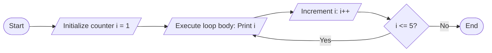

**કોડ ઉદાહરણ:**

```c
#include <stdio.h>

int main() {
    int i = 1;
    
    do {
        printf("%d ", i);
        i++;
    } while (i <= 5);  // પ્રથમ એક્ઝિક્યુશન પછી શરત ચેક થાય છે
    
    // આઉટપુટ: 1 2 3 4 5
    
    return 0;
}
```

**કોષ્ટક: ડૂ-વાઇલ લૂપની લાક્ષણિકતાઓ**

| લાક્ષણિકતા | વિવરણ |
|----------------|-------------|
| એક્ઝિક્યુશન ક્રમ | પહેલા બોડી, પછી શરત |
| ન્યૂનતમ પુનરાવર્તન | ઓછામાં ઓછું એક |
| શરત ચેક | લૂપના અંતે |
| સમાપ્તિ | જ્યારે શરત ખોટી થાય ત્યારે |
| સિન્ટેક્સ | do { statements; } while (condition); |

- **પોસ્ટ-ટેસ્ટ લૂપ**: લૂપ બોડી પછી શરત મૂલ્યાંકન
- **ગેરંટેડ એક્ઝિક્યુશન**: લૂપ બોડી હંમેશા ઓછામાં ઓછી એક વખત ચાલે છે
- **સેમિકોલોન**: વાઇલ કન્ડિશન પછી જરૂરી છે

**મેમરી ટ્રીક:** "DECAT" (Do Execute Check After That)

## પ્રશ્ન 4(અ) OR [3 માર્કસ]

**ત્રિકોણનું ક્ષેત્રફળ (૧/૨ * પાયો * ઉંચાઈ) શોધવા માટેનો C પ્રોગ્રામ લખો.**

**જવાબ**:
આ પ્રોગ્રામ ક્ષેત્રફળ = ½ × પાયો × ઉંચાઈ સૂત્રનો ઉપયોગ કરીને ત્રિકોણનું ક્ષેત્રફળ ગણે છે.

```c
#include <stdio.h>

int main() {
    float base, height, area;
    
    printf("Enter base of triangle: ");
    scanf("%f", &base);
    printf("Enter height of triangle: ");
    scanf("%f", &height);
    
    // ક્ષેત્રફળ ગણો
    area = 0.5 * base * height;
    
    printf("Area of triangle = %.2f square units\n", area);
    
    return 0;
}
```

**ડાયાગ્રામ:**

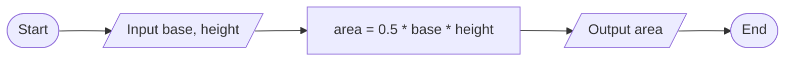

- **ફોર્મ્યુલા**: ક્ષેત્રફળ = ½ × પાયો × ઉંચાઈ
- **ફ્લોટ વેરિએબલ્સ**: દશાંશ ચોકસાઈ માટે
- **યુઝર ઇનપુટ**: યુઝર પાસેથી પાયો અને ઉંચાઈ મેળવે છે

**મેમરી ટ્રીક:** "Half-BH" (અડધો ગુણા પાયો ગુણા ઉંચાઈ)

## પ્રશ્ન 4(બ) OR [4 માર્કસ]

**પોઈન્ટરનું ડીકલેરેશન અને ઈનીશ્યલાઈઝેશન સમજાવો.**

**જવાબ**:
પોઈન્ટર ડિક્લેરેશન અને ઇનિશિયલાઇઝેશનમાં પોઈન્ટર વેરિએબલ બનાવવાનો અને તેને મેમરી એડ્રેસ સોંપવાનો સમાવેશ થાય છે.

**કોષ્ટક: પોઈન્ટર ડિક્લેરેશન અને ઇનિશિયલાઇઝેશન**

| ઓપરેશન | સિન્ટેક્સ | ઉદાહરણ | સમજૂતી |
|-----------|--------|---------|-------------|
| ડિક્લેરેશન | data_type *pointer_name; | int *ptr; | int પોઈન્ટર બનાવે છે |
| ઇનિશિયલાઇઝેશન | pointer_name = &variable; | ptr = &num; | ptr માં num નું એડ્રેસ સોંપે છે |
| સંયુક્ત | data_type *pointer_name = &variable; | int *ptr = &num; | ડિક્લેરેશન અને ઇનિશિયલાઇઝેશન એકસાથે |
| નલ પોઈન્ટર | pointer_name = NULL; | ptr = NULL; | કંઈ નહીં બતાવે (સુરક્ષિત પદ્ધતિ) |

**કોડ ઉદાહરણ:**

```c
#include <stdio.h>

int main() {
    // ડિક્લેરેશન
    int *ptr1;
    
    // ડિક્લેરેશન અને ઇનિશિયલાઇઝેશન એકસાથે
    int num = 10;
    int *ptr2 = &num;
    
    // NULL સાથે ઇનિશિયલાઇઝેશન
    int *ptr3 = NULL;
    
    printf("Value at address ptr2: %d\n", *ptr2);  // આઉટપુટ: 10
    
    return 0;
}
```

- **એસ્ટરિસ્ક સિન્ટેક્સ**: * નો ઉપયોગ ડિક્લેરેશનમાં પોઈન્ટર બનાવવા માટે
- **એડ્રેસ ઓપરેટર**: & વેરિએબલનું એડ્રેસ મેળવે છે
- **NULL ઇનિશિયલાઇઝેશન**: વાઈલ્ડ પોઈન્ટર્સ ટાળવા માટે સુરક્ષિત પદ્ધતિ
- **પોઈન્ટર ટાઈપ**: જે ડેટા ટાઈપને પોઈન્ટ કરે છે તેને મેચ કરવું જોઈએ

**મેમરી ટ્રીક:** "DINA" (Declare, Initialize with NULL or Address)

## પ્રશ્ન 4(ક) OR [7 માર્કસ]

**વાઇલ લૂપ ફ્લોચાર્ટ દોરી ઉદાહરણ સાથે સમજાવો.**

**જવાબ**:
વાઇલ લૂપ એક પ્રી-ટેસ્ટ લૂપ છે જે શરત સાચી રહે ત્યાં સુધી તેના બોડીને વારંવાર એક્ઝિક્યુટ કરે છે.

**ડાયાગ્રામ:**

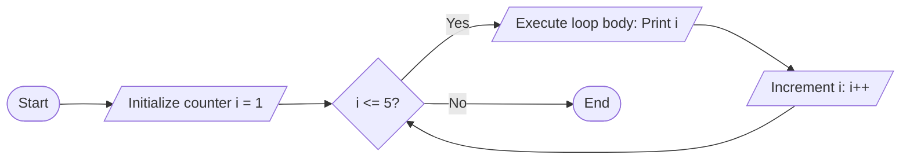

**કોડ ઉદાહરણ:**

```c
#include <stdio.h>

int main() {
    int i = 1;
    
    while (i <= 5) {  // દરેક એક્ઝિક્યુશન પહેલા શરત ચેક થાય છે
        printf("%d ", i);
        i++;
    }
    
    // આઉટપુટ: 1 2 3 4 5
    
    return 0;
}
```

**કોષ્ટક: વાઇલ લૂપની લાક્ષણિકતાઓ**

| લાક્ષણિકતા | વિવરણ |
|----------------|-------------|
| એક્ઝિક્યુશન ક્રમ | પહેલા શરત, પછી બોડી |
| ન્યૂનતમ પુનરાવર્તન | શૂન્ય (જો શરત પ્રારંભમાં ખોટી હોય) |
| શરત ચેક | લૂપની શરૂઆતમાં |
| સમાપ્તિ | જ્યારે શરત ખોટી થાય ત્યારે |
| સિન્ટેક્સ | while (condition) { statements; } |

- **પ્રી-ટેસ્ટ લૂપ**: લૂપ બોડી પહેલા શરત મૂલ્યાંકન
- **શૂન્ય પુનરાવર્તન શક્ય**: જો શરત પ્રારંભમાં ખોટી હોય તો બોડી ક્યારેય એક્ઝિક્યુટ ન થઈ શકે
- **લૂપ વેરિએબલ**: લૂપ પહેલા ઇનિશિયલાઇઝ થવું જોઈએ
- **ઇન્ફિનિટ લૂપ**: જો શરત ક્યારેય ખોટી ન થાય તો થાય છે

**મેમરી ટ્રીક:** "CELT" (Check, Execute, Loop, Terminate)

## પ્રશ્ન 5(અ) [3 માર્કસ]

**બુકની આપેલ માહિતી સ્ટોર કરવાનું સ્ટ્રક્ચર બનાવો: book_no, book_title, book_author, book_price**

**જવાબ**:
આ પ્રોગ્રામ સ્પષ્ટ કરેલા ફિલ્ડ્સ સાથે પુસ્તક માહિતી સંગ્રહ કરવા માટે સ્ટ્રક્ચર બનાવે છે.

```c
#include <stdio.h>
#include <string.h>

// પુસ્તક માહિતી માટે સ્ટ્રક્ચર ડેફિનેશન
struct Book {
    int book_no;
    char book_title[50];
    char book_author[30];
    float book_price;
};

int main() {
    // Book સ્ટ્રક્ચરના વેરિએબલની ઘોષણા
    struct Book book1;
    
    // સ્ટ્રક્ચર મેમ્બર્સને મૂલ્યો સોંપો
    book1.book_no = 101;
    strcpy(book1.book_title, "Programming in C");
    strcpy(book1.book_author, "Dennis Ritchie");
    book1.book_price = 450.75;
    
    // પુસ્તક માહિતી પ્રદર્શિત કરો
    printf("Book No: %d\n", book1.book_no);
    printf("Title: %s\n", book1.book_title);
    printf("Author: %s\n", book1.book_author);
    printf("Price: Rs. %.2f\n", book1.book_price);
    
    return 0;
}
```

**ડાયાગ્રામ:**

```
+-----------------+
| struct Book     |
+-----------------+
| int book_no     |
| char book_title |
| char book_author|
| float book_price|
+-----------------+
```

- **સ્ટ્રક્ચર ડેફિનિશન**: કંપોઝિટ ડેટા પ્રકાર વ્યાખ્યાયિત કરવા struct કીવર્ડનો ઉપયોગ કરે છે
- **મેમ્બર એક્સેસ**: સભ્યો એક્સેસ કરવા માટે ડોટ (.) ઓપરેટરનો ઉપયોગ કરે છે
- **સ્ટ્રિંગ કોપિંગ**: કેરેક્ટર એરે માટે strcpy()

**મેમરી ટ્રીક:** "NTAP" (Number, Title, Author, Price)

## પ્રશ્ન 5(બ) [4 માર્કસ]

**(1)sqrt() (2)pow() (3)strlen() (4)strcpy() ફંક્શનો ઉદાહરણ સાથે સમજાવો.**

**જવાબ**:
આ ફંક્શન C માં ગણિત ગણતરી અને સ્ટ્રિંગ મેનિપ્યુલેશન માટે વપરાતા સ્ટાન્ડર્ડ લાઇબ્રેરી ફંક્શન્સ છે.

**કોષ્ટક: લાઇબ્રેરી ફંક્શન્સ**

| ફંક્શન | હેડર ફાઈલ | હેતુ | ઉદાહરણ | આઉટપુટ |
|----------|-------------|---------|---------|--------|
| sqrt() | math.h | નંબરનો વર્ગમૂળ | sqrt(16) | 4.0 |
| pow() | math.h | નંબરને પાવર કરે | pow(2, 3) | 8.0 |
| strlen() | string.h | સ્ટ્રિંગની લંબાઈ | strlen("Hello") | 5 |
| strcpy() | string.h | એક સ્ટ્રિંગથી બીજી સ્ટ્રિંગમાં કોપી | strcpy(dest, "Hello") | dest માં "Hello" હોય છે |

**કોડ ઉદાહરણ:**

```c
#include <stdio.h>
#include <math.h>
#include <string.h>

int main() {
    // sqrt() અને pow() ઉદાહરણો
    printf("Square root of 25: %.2f\n", sqrt(25));
    printf("2 raised to power 4: %.2f\n", pow(2, 4));
    
    // strlen() ઉદાહરણ
    char str[] = "C Programming";
    printf("Length of string: %d\n", strlen(str));
    
    // strcpy() ઉદાહરણ
    char source[] = "Hello";
    char destination[10];
    strcpy(destination, source);
    printf("Copied string: %s\n", destination);
    
    return 0;
}
```

- **મેથ ફંક્શન્સ**: ગાણિતિક ગણતરી માટે sqrt() અને pow()
- **સ્ટ્રિંગ ફંક્શન્સ**: સ્ટ્રિંગ મેનિપ્યુલેશન માટે strlen() અને strcpy()
- **હેડર ફાઈલ્સ**: આ ફંક્શન્સ વાપરવા જરૂરી છે
- **રિટર્ન ટાઈપ્સ**: sqrt() અને pow() double આપે છે, strlen() size_t આપે છે

**મેમરી ટ્રીક:** "MPSL" (Math Power and String Length)

## પ્રશ્ન 5(ક) [7 માર્કસ]

**એરે અને એરેનું ઈનીશ્યલાઈઝેશન ઉદાહરણ સાથે સમજાવો.**

**જવાબ**:
એરે એ એક જ ડેટા પ્રકારના એલિમેન્ટ્સનો સમૂહ છે જે લગાતાર મેમરી લોકેશન્સમાં સ્ટોર થયેલા હોય છે.

**કોષ્ટક: એરે પ્રકારો અને ઇનિશિયલાઇઝેશન પદ્ધતિઓ**

| એરે પ્રકાર | ડિક્લેરેશન | ડિક્લેરેશન સમયે ઇનિશિયલાઇઝેશન | અલગ ઇનિશિયલાઇઝેશન |
|------------|-------------|-------------------------------|------------------------|
| ઇન્ટીજર | int arr[5]; | int arr[5] = {10, 20, 30, 40, 50}; | arr[0] = 10; arr[1] = 20; વગેરે |
| કેરેક્ટર | char str[10]; | char str[10] = "Hello"; | strcpy(str, "Hello"); |
| ફ્લોટ | float values[3]; | float values[3] = {1.5, 2.5, 3.5}; | values[0] = 1.5; વગેરે |
| આંશિક | int nums[5]; | int nums[5] = {1, 2}; | બાકીના 0 પર સેટ થાય |
| સાઇઝ ઇન્ફરન્સ | - | int nums[] = {1, 2, 3}; | ઇનિશિયલાઇઝર દ્વારા સાઇઝ નક્કી થાય |

**કોડ ઉદાહરણ:**

```c
#include <stdio.h>

int main() {
    // એરે ડિક્લેરેશન અને ઇનિશિયલાઇઝેશન
    int numbers[5] = {10, 20, 30, 40, 50};
    
    // એરે એલિમેન્ટ્સ એક્સેસ અને ડિસ્પ્લે
    printf("Array elements: ");
    for (int i = 0; i < 5; i++) {
        printf("%d ", numbers[i]);
    }
    printf("\n");
    
    // એરે એલિમેન્ટ મોડીફાય કરવું
    numbers[2] = 35;
    printf("Modified element at index 2: %d\n", numbers[2]);
    
    return 0;
}
```

**ડાયાગ્રામ:**

```
એરે: numbers[5]
+-----+-----+-----+-----+-----+
| 10  | 20  | 30  | 40  | 50  |
+-----+-----+-----+-----+-----+
  [0]   [1]   [2]   [3]   [4]
```

- **ઝીરો-બેઝ્ડ ઇન્ડેક્સિંગ**: પ્રથમ એલિમેન્ટ ઇન્ડેક્સ 0 પર
- **કન્ટિગ્યુઅસ મેમરી**: એલિમેન્ટ્સ લાગલાગટ સ્ટોર થાય છે
- **ફિક્સ્ડ સાઇઝ**: સાઇઝ કમ્પાઇલ ટાઇમે નક્કી થાય છે
- **એલિમેન્ટ એક્સેસ**: સ્ક્વેર બ્રેકેટ્સ સાથે ઇન્ડેક્સનો ઉપયોગ કરીને

**મેમરી ટ્રીક:** "DICE" (Declaration, Initialization, Contiguous storage, Element access)

## પ્રશ્ન 5(અ) OR [3 માર્કસ]

**સ્ટ્રક્ચરનું ડીકલેરેશન ઉદાહરણ સાથે સમજાવો.**

**જવાબ**:
C માં સ્ટ્રક્ચર ડિક્લેરેશનમાં એક નવો ડેટા પ્રકાર વ્યાખ્યાયિત કરવાનો સમાવેશ થાય છે જે વિવિધ ડેટા પ્રકારોને એક નામ હેઠળ જોડે છે.

**કોષ્ટક: સ્ટ્રક્ચર ડિક્લેરેશન પદ્ધતિઓ**

| પદ્ધતિ | સિન્ટેક્સ | ઉદાહરણ |
|--------|--------|---------|
| બેઝિક ડિક્લેરેશન | struct tag_name { members; }; | struct Student { int id; char name[20]; }; |
| વેરિએબલ સાથે | struct tag_name { members; } variables; | struct Point { int x, y; } p1, p2; |
| ટેગ વગર | struct { members; } variables; | struct { float real, imag; } c1; |
| ટાઇપડેફ | typedef struct { members; } alias; | typedef struct { int h, w; } Rectangle; |

**કોડ ઉદાહરણ:**

```c
#include <stdio.h>

// સ્ટ્રક્ચર ડિક્લેરેશન
struct Student {
    int id;
    char name[30];
    float percentage;
};

int main() {
    // સ્ટ્રક્ચર વેરિએબલ ડિક્લેર
    struct Student s1;
    
    // સ્ટ્રક્ચર મેમ્બર્સને મૂલ્યો સોંપો
    s1.id = 101;
    strcpy(s1.name, "John");
    s1.percentage = 85.5;
    
    // સ્ટ્રક્ચર મેમ્બર્સ ડિસ્પ્લે
    printf("Student ID: %d\n", s1.id);
    printf("Name: %s\n", s1.name);
    printf("Percentage: %.2f%%\n", s1.percentage);
    
    return 0;
}
```

- **સ્ટ્રક્ચર કીવર્ડ**: નવો ડેટા પ્રકાર વ્યાખ્યાયિત કરવા struct નો ઉપયોગ
- **મેમ્બર એક્સેસ**: મેમ્બર્સ એક્સેસ કરવા માટે . (ડોટ) ઓપરેટર
- **વિષમ ડેટા**: વિવિધ ડેટા પ્રકારોને જોડી શકે છે
- **કસ્ટમ ડેટા પ્રકાર**: યુઝર-ડિફાઇન્ડ ડેટા પ્રકાર બનાવે છે

**મેમરી ટ્રીક:** "SMUVT" (Structure Mostly Uses Various Types)

## પ્રશ્ન 5(બ) OR [4 માર્કસ]

**યુઝર ડીફાઈન ફંક્શન એટલે શું? ઉદાહરણ સાથે સમજાવો.**

**જવાબ**:
યુઝર-ડિફાઇન્ડ ફંક્શન એ પ્રોગ્રામર દ્વારા લખાયેલો કોડનો બ્લોક છે જે ચોક્કસ કાર્ય કરે છે અને પ્રોગ્રામના અન્ય ભાગોથી કોલ કરી શકાય છે.

**કોષ્ટક: ફંક્શન કોમ્પોનન્ટ્સ**

| કોમ્પોનન્ટ | વિવરણ | ઉદાહરણ |
|-----------|-------------|---------|
| રિટર્ન ટાઈપ | ફંક્શન દ્વારા પરત કરેલ ડેટા પ્રકાર | int, float, void |
| ફંક્શન નામ | ફંક્શન માટે ઓળખકર્તા | add, findMax |
| પેરામીટર્સ | કૌંસમાં ઇનપુટ મૂલ્યો | (int a, int b) |
| ફંક્શન બોડી | કર્લી બ્રેસિસની અંદર કોડ | { return a + b; } |
| ફંક્શન કોલ | ફંક્શનને બોલાવવું | result = add(5, 3); |

**કોડ ઉદાહરણ:**

```c
#include <stdio.h>

// યુઝર-ડિફાઇન્ડ ફંક્શન ડિક્લેરેશન
int findMax(int a, int b);

int main() {
    int num1 = 10, num2 = 20, max;
    
    // ફંક્શન કોલ
    max = findMax(num1, num2);
    
    printf("Maximum between %d and %d is %d\n", num1, num2, max);
    
    return 0;
}

// ફંક્શન ડેફિનિશન
int findMax(int a, int b) {
    // ફંક્શન બોડી
    if (a > b)
        return a;
    else
        return b;
}
```

**ડાયાગ્રામ:**

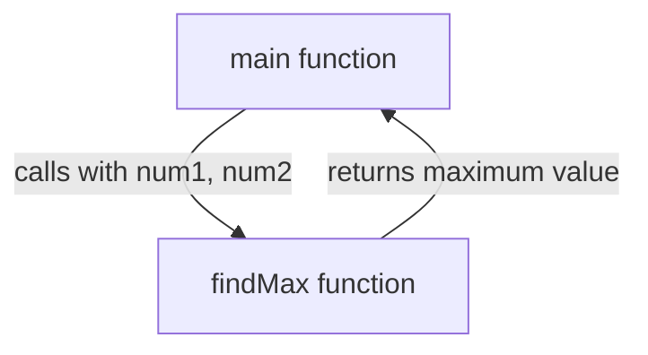

- **મોડ્યુલર કોડ**: મોટા પ્રોગ્રામને નાના ભાગોમાં વિભાજિત કરે છે
- **રીયુઝેબિલિટી**: ફંક્શનને અલગ અલગ જગ્યાએથી અનેક વખત કોલ કરી શકાય
- **ડિક્લેરેશન vs ડેફિનિશન**: ડિક્લેરેશન કમ્પાઇલરને ફંક્શન વિશે જણાવે છે, ડેફિનિશનમાં ખરેખર કોડ હોય છે
- **પેરામીટર્સ**: ફંક્શન કોલ કરતી વખતે મૂલ્યો પાસ કરે છે

**મેમરી ટ્રીક:** "CDRP" (Create, Define, Return, Pass)

## પ્રશ્ન 5(ક) OR [7 માર્કસ]

**૧૦ નંબરવાળા એરેના ઘટકોને ચઢતા ક્રમમાં ગોઠવવા માટેનો C પ્રોગ્રામ લખો.**

**જવાબ**:
આ પ્રોગ્રામ બબલ સોર્ટ અલ્ગોરિધમનો ઉપયોગ કરીને 10 ઇન્ટીજરના એરેને ચઢતા ક્રમમાં સોર્ટ કરે છે.

```c
#include <stdio.h>

int main() {
    int arr[10], i, j, temp;
    
    // એરે એલિમેન્ટ્સ ઇનપુટ કરો
    printf("Enter 10 integers: \n");
    for (i = 0; i < 10; i++) {
        scanf("%d", &arr[i]);
    }
    
    // ચઢતા ક્રમ માટે બબલ સોર્ટ અલ્ગોરિધમ
    for (i = 0; i < 9; i++) {
        for (j = 0; j < 9 - i; j++) {
            if (arr[j] > arr[j + 1]) {
                // જો વર્તમાન એલિમેન્ટ આગળના કરતાં મોટું હોય તો સ્વેપ કરો
                temp = arr[j];
                arr[j] = arr[j + 1];
                arr[j + 1] = temp;
            }
        }
    }
    
    // સોર્ટેડ એરે ડિસ્પ્લે કરો
    printf("Array in ascending order: \n");
    for (i = 0; i < 10; i++) {
        printf("%d ", arr[i]);
    }
    
    return 0;
}
```

**ડાયાગ્રામ:**

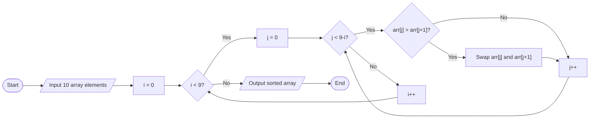

- **બબલ સોર્ટ**: બાજુના એલિમેન્ટની સરખામણી કરે અને જરૂર હોય તો સ્વેપ કરે
- **નેસ્ટેડ લૂપ્સ**: બહારની લૂપ પાસ માટે, અંદરની તુલના માટે
- **ઓપ્ટિમાઇઝેશન**: દરેક પાસ ઓછામાં ઓછા એક એલિમેન્ટને ફિક્સ કરે છે, તેથી અંદરની લૂપ ઓછી વખત ચાલે છે
- **ટેમ્પરરી વેરિએબલ**: એલિમેન્ટ્સ સ્વેપ કરવા માટે ઉપયોગ થાય છે

**મેમરી ટ્રીક:** "BSCOT" (Bubble Sort Compares and Orders Things)
