## Question 1(a) [3 marks]

**Define keyword. List any four keywords for C language.**

**Answer**:
A keyword is a predefined, reserved word in C that has special meaning to the compiler and cannot be used as an identifier.

**Table: Common C Keywords**

| Keyword | Purpose |
|---------|---------|
| int     | Integer data type |
| float   | Floating-point data type |
| char    | Character data type |
| if      | Conditional statement |
| for     | Loop statement |
| while   | Loop statement |
| void    | Return type/parameter |
| return  | Return value from function |

- **Reserved words**: Keywords cannot be used as variable names
- **Pre-defined**: They have fixed meaning in the language
- **Case-sensitive**: All keywords must be in lowercase

**Mnemonic:** "If VoId FoR WhIle" (first letters of important keywords)

## Question 1(b) [4 marks]

**Explain rules for naming a variable.**

**Answer**:
Variables in C must follow specific naming rules to be valid identifiers.

**Table: Variable Naming Rules in C**

| Rule | Description | Valid Example | Invalid Example |
|------|-------------|---------------|-----------------|
| First character | Must be a letter or underscore | age, _count | 1value |
| Subsequent characters | Letters, digits, or underscores | user_1, total99 | user@1 |
| Case sensitivity | Uppercase and lowercase are different | Value ≠ value | - |
| Keywords | Cannot use reserved keywords | counter | int |
| Length | Should be meaningful but not too long | studentMarks | sm |
| Special characters | Not allowed | firstName | first-name |

- **Descriptive names**: Use meaningful names that indicate purpose
- **Consistent style**: Follow a consistent naming convention
- **No spaces**: Use underscores or camelCase instead

**Mnemonic:** "FLASKS" (First Letter, Letters/digits, Avoid keywords, Sensitive case, Keep meaningful, Skip special chars)

## Question 1(c) [7 marks]

**Define flowchart. Draw flowchart to find minimum of three integer numbers N1, N2 and N3.**

**Answer**:
A flowchart is a graphical representation of an algorithm showing the steps as boxes and their order by connecting them with arrows.

**Diagram:**

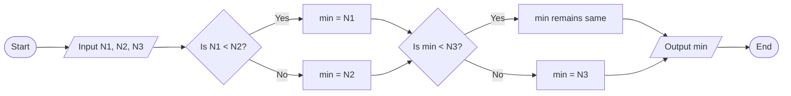

- **Symbols used**: Oval (start/end), Parallelogram (input/output), Diamond (decision), Rectangle (process)
- **Decision points**: Compare values systematically
- **Logical flow**: Arrows show the sequence of operations

**Mnemonic:** "Start-Input-Compare-Output-End" (SICOE)

## Question 1(c) OR [7 marks]

**Define algorithm. Write an algorithm to find minimum of three integer numbers N1, N2 and N3.**

**Answer**:
An algorithm is a step-by-step procedure or finite set of well-defined instructions to solve a particular problem.

**Algorithm to find minimum of three numbers:**

```
Step 1: Start
Step 2: Input three numbers N1, N2, and N3
Step 3: Set min = N1 (assume first number is minimum)
Step 4: If N2 < min, then set min = N2
Step 5: If N3 < min, then set min = N3
Step 6: Output min as the minimum number
Step 7: End
```

**Table: Algorithm Characteristics**

| Characteristic | Description |
|----------------|-------------|
| Finiteness     | Algorithm must terminate after finite steps |
| Definiteness   | Each step must be precisely defined |
| Input          | Algorithm takes zero or more inputs |
| Output         | Algorithm produces one or more outputs |
| Effectiveness  | Steps must be simple and executable |

- **Sequential steps**: Follows a logical order
- **Comparative approach**: Systematically finds minimum
- **Simplicity**: Easy to understand and implement

**Mnemonic:** "FIDEO" (Finiteness, Input, Definiteness, Effectiveness, Output)

## Question 2(a) [3 marks]

**Differentiate gets() and puts().**

**Answer**:
gets() and puts() are standard library functions in C for input and output operations with strings.

**Table: Comparison of gets() and puts()**

| Feature | gets() | puts() |
|---------|--------|--------|
| Purpose | Reads string from stdin | Writes string to stdout |
| Prototype | char *gets(char *str) | int puts(const char *str) |
| Behavior | Reads until newline | Adds newline automatically |
| Return value | Returns str on success, NULL on failure | Returns non-negative on success, EOF on error |
| Safety | Unsafe (buffer overflow risk) | Safe |
| Recommended | No (deprecated) | Yes |

- **Input/Output**: gets() for input, puts() for output
- **Termination**: gets() stops at newline, puts() adds newline
- **Security**: gets() has no buffer limit check

**Mnemonic:** "Gets In, Puts Out" (gets reads in, puts writes out)

## Question 2(b) [4 marks]

**Develop a C program to find whether the entered number is even or odd using conditional operator.**

**Answer**:
This program uses the conditional operator to check if a number is even or odd.

```c
#include <stdio.h>

int main() {
    int num;
    
    printf("Enter a number: ");
    scanf("%d", &num);
    
    // Using conditional operator to check even or odd
    (num % 2 == 0) ? printf("%d is even\n", num) : printf("%d is odd\n", num);
    
    return 0;
}
```

**Diagram:**

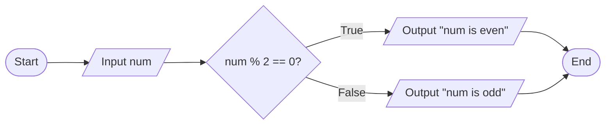

- **Conditional operator**: ? : is a ternary operator
- **Modulus operation**: % gives remainder after division
- **Test condition**: num % 2 == 0 checks for even number

**Mnemonic:** "REMinder 0 = Even" (Remainder 0 means Even)

## Question 2(c) [7 marks]

**Explain logical & relational operators with examples.**

**Answer**:
Logical and relational operators are used to create conditions and make decisions in C programs.

**Table: Relational Operators**

| Operator | Meaning | Example | Result |
|----------|---------|---------|--------|
| == | Equal to | 5 == 5 | true (1) |
| != | Not equal to | 5 != 3 | true (1) |
| > | Greater than | 7 > 3 | true (1) |
| < | Less than | 2 < 8 | true (1) |
| >= | Greater than or equal to | 4 >= 4 | true (1) |
| <= | Less than or equal to | 6 <= 9 | true (1) |

**Table: Logical Operators**

| Operator | Meaning | Example | Result |
|----------|---------|---------|--------|
| && | Logical AND | (5>3) && (8>5) | true (1) |
| \|\| | Logical OR | (5>7) \|\| (3<6) | true (1) |
| ! | Logical NOT | !(5>7) | true (1) |

**Code Example:**

```c
int age = 20;
int score = 75;

// Using both relational and logical operators
if ((age >= 18) && (score > 70)) {
    printf("Eligible");
}
```

- **Comparison**: Relational operators compare values
- **Combining conditions**: Logical operators connect multiple conditions
- **Truth value**: All operators return 1 (true) or 0 (false)

**Mnemonic:** "CORNL" (Compare with relational, OR/AND/NOT with logical)

## Question 2(a) OR [3 marks]

**Considering precedence of operators, write down each step of evaluation and final answer if expression 16 + ( 216 / ( ( 3 + 6 ) * 12 ) ) -10 is evaluated.**

**Answer**:
Let's evaluate the expression 16 + ( 216 / ( ( 3 + 6 ) * 12 ) ) - 10 step by step following operator precedence.

**Table: Step-by-Step Evaluation**

| Step | Operation | Expression after this step |
|------|-----------|----------------------------|
| 1 | Calculate (3 + 6) | 16 + ( 216 / ( 9 * 12 ) ) - 10 |
| 2 | Calculate (9 * 12) | 16 + ( 216 / 108 ) - 10 |
| 3 | Calculate (216 / 108) | 16 + 2 - 10 |
| 4 | Calculate 16 + 2 | 18 - 10 |
| 5 | Calculate 18 - 10 | 8 |

**Final Answer: 8**

**Diagram:**

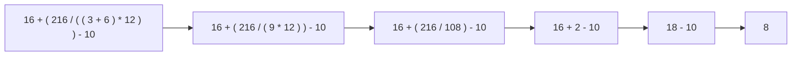

- **Parentheses first**: Innermost parentheses evaluated first
- **Multiplication before division**: Calculate from left to right
- **Addition and subtraction last**: From left to right

**Mnemonic:** "PEMDAS" (Parentheses, Exponents, Multiplication/Division, Addition/Subtraction)

## Question 2(b) OR [4 marks]

**Write a C program to find circumference and area of a circle.**

**Answer**:
This program calculates the area and circumference of a circle based on its radius.

```c
#include <stdio.h>
#define PI 3.14159

int main() {
    float radius, area, circumference;
    
    printf("Enter the radius of circle: ");
    scanf("%f", &radius);
    
    // Calculate area and circumference
    area = PI * radius * radius;
    circumference = 2 * PI * radius;
    
    printf("Area of circle = %.2f square units\n", area);
    printf("Circumference of circle = %.2f units\n", circumference);
    
    return 0;
}
```

**Diagram:**

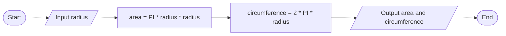

- **Formula**: Area = π × r² and Circumference = 2π × r
- **Constant definition**: Using #define for PI
- **Float variables**: For decimal precision

**Mnemonic:** "PIR²" for area, "2PIR" for circumference

## Question 2(c) OR [7 marks]

**Explain arithmetic & bit-wise operators with examples.**

**Answer**:
Arithmetic operators perform mathematical operations while bit-wise operators manipulate individual bits of integers.

**Table: Arithmetic Operators**

| Operator | Description | Example | Result |
|----------|-------------|---------|--------|
| + | Addition | 5 + 3 | 8 |
| - | Subtraction | 7 - 2 | 5 |
| * | Multiplication | 4 * 3 | 12 |
| / | Division | 10 / 3 | 3 (integer division) |
| % | Modulus (Remainder) | 10 % 3 | 1 |
| ++ | Increment | a++ | Adds 1 after using value |
| -- | Decrement | --b | Subtracts 1 before using value |

**Table: Bitwise Operators**

| Operator | Description | Example (binary) | Result |
|----------|-------------|------------------|--------|
| & | Bitwise AND | 5 (101) & 3 (011) | 1 (001) |
| \| | Bitwise OR | 5 (101) \| 3 (011) | 7 (111) |
| ^ | Bitwise XOR | 5 (101) ^ 3 (011) | 6 (110) |
| ~ | Bitwise NOT | ~5 (101) | -6 (depends on bits) |
| << | Left Shift | 5 << 1 | 10 (1010) |
| >> | Right Shift | 5 >> 1 | 2 (10) |

**Code Example:**

```c
int a = 5, b = 3;
printf("a + b = %d\n", a + b);      // 8
printf("a & b = %d\n", a & b);      // 1
printf("a << 1 = %d\n", a << 1);    // 10
```

- **Mathematical operations**: Arithmetic operators for calculations
- **Bit manipulation**: Bitwise operators work at binary level
- **Efficiency**: Bitwise operations are faster for certain tasks

**Mnemonic:** "SAME BARON" (Subtraction Addition Multiplication, Bitwise AND/OR/NOT)

## Question 3(a) [3 marks]

**Explain the use of 'go to' statement with example.**

**Answer**:
The goto statement is used to transfer program control unconditionally to a labeled statement.

```c
#include <stdio.h>

int main() {
    int num, sum = 0;
    
    printf("Enter a positive number: ");
    scanf("%d", &num);
    
    if (num <= 0) {
        goto error;
    }
    
    sum = num * (num + 1) / 2;
    printf("Sum of first %d numbers = %d\n", num, sum);
    goto end;
    
    error:
        printf("Error: Please enter a positive number!\n");
    
    end:
        return 0;
}
```

**Diagram:**

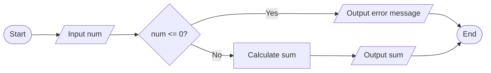

- **Label declaration**: Labels end with colon (:)
- **Jump statement**: goto transfers control to label
- **Caution**: Excessive use creates "spaghetti code"

**Mnemonic:** "JUMPing LABEL" (Jump to a labeled statement)

## Question 3(b) [4 marks]

**The marks obtained by the student in 5 different subjects are input through keyboard. The student gets grade as per following rules: Percentage above or equal to 90- Grade A. Percentage between 80 and 89- Grade B. Percentage between 70 and 79-Grade C. Percentage between 60 and 69-Grade D. Percentage between 50 and 59-Grade E. Percentage less than 50- Grade F. Write a C program to display the grade obtained by the student.**

**Answer**:
This program calculates the grade based on the average marks in 5 subjects.

```c
#include <stdio.h>

int main() {
    int marks[5], total = 0, i;
    float percentage;
    char grade;
    
    // Input marks for 5 subjects
    for (i = 0; i < 5; i++) {
        printf("Enter marks for subject %d (out of 100): ", i+1);
        scanf("%d", &marks[i]);
        total += marks[i];
    }
    
    // Calculate percentage
    percentage = total / 5.0;
    
    // Determine grade
    if (percentage >= 90)
        grade = 'A';
    else if (percentage >= 80)
        grade = 'B';
    else if (percentage >= 70)
        grade = 'C';
    else if (percentage >= 60)
        grade = 'D';
    else if (percentage >= 50)
        grade = 'E';
    else
        grade = 'F';
    
    printf("Percentage: %.2f%%\n", percentage);
    printf("Grade: %c\n", grade);
    
    return 0;
}
```

**Table: Grading Criteria**

| Percentage Range | Grade |
|------------------|-------|
| ≥ 90             | A     |
| 80-89            | B     |
| 70-79            | C     |
| 60-69            | D     |
| 50-59            | E     |
| < 50             | F     |

- **Input array**: Stores marks of 5 subjects
- **Percentage calculation**: Sum divided by number of subjects
- **Grade determination**: Using if-else ladder

**Mnemonic:** "ABCDEF-90-80-70-60-50" (Grades with their percentage thresholds)

## Question 3(c) [7 marks]

**Draw flowchart and explain nested if-else with example.**

**Answer**:
Nested if-else is a control structure where an if or else statement contains another if-else statement within it.

**Diagram:**

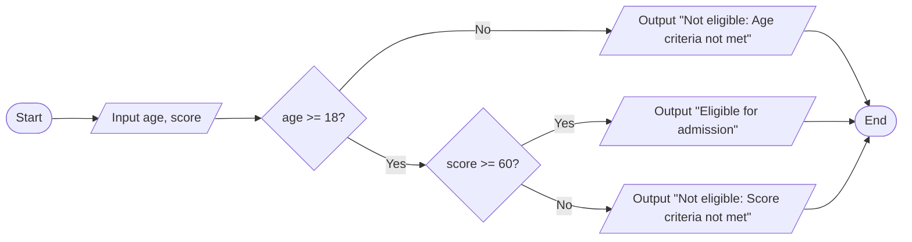

**Code Example:**

```c
#include <stdio.h>

int main() {
    int age, score;
    
    printf("Enter age: ");
    scanf("%d", &age);
    printf("Enter score: ");
    scanf("%d", &score);
    
    if (age >= 18) {
        if (score >= 60) {
            printf("Eligible for admission");
        } else {
            printf("Not eligible: Score criteria not met");
        }
    } else {
        printf("Not eligible: Age criteria not met");
    }
    
    return 0;
}
```

- **Multiple conditions**: Tests several conditions in sequence
- **Hierarchical decision**: Inner condition only evaluated if outer is true
- **Indentation**: Proper indentation helps in understanding structure

**Mnemonic:** "CONE" (Check Outer, Nest Evaluation inside)

## Question 3(a) OR [3 marks]

**Explain the use of continue and break statement.**

**Answer**:
The break and continue statements control the flow of loops in different ways.

**Table: Comparison of break and continue**

| Feature | break | continue |
|---------|-------|----------|
| Purpose | Exits the loop immediately | Skips current iteration |
| Effect on loop | Terminates completely | Proceeds to next iteration |
| Applicable in | switch, for, while, do-while | for, while, do-while |
| Usage | When condition met and no more iterations needed | When current iteration should be skipped |

**Example with break:**

```c
for (int i = 1; i <= 10; i++) {
    if (i == 5)
        break;    // Exit loop when i equals 5
    printf("%d ", i);  // Outputs: 1 2 3 4
}
```

**Example with continue:**

```c
for (int i = 1; i <= 10; i++) {
    if (i % 2 == 0)
        continue;  // Skip even numbers
    printf("%d ", i);  // Outputs: 1 3 5 7 9
}
```

- **Loop control**: Both used to manage loop execution
- **Break exits**: Completely stops the loop
- **Continue skips**: Only skips current iteration

**Mnemonic:** "BEC" (Break Exits Completely, Continue only current)

## Question 3(b) OR [4 marks]

**Write a program using for loop to print this output:**

```
1
1 2
1 2 3
1 2 3 4
```

**Answer**:
This program uses nested for loops to print the pattern of numbers.

```c
#include <stdio.h>

int main() {
    int i, j;
    
    // Outer loop for rows (1 to 4)
    for (i = 1; i <= 4; i++) {
        // Inner loop for columns (1 to i)
        for (j = 1; j <= i; j++) {
            printf("%d ", j);
        }
        printf("\n");  // Move to next line after each row
    }
    
    return 0;
}
```

**Diagram:**

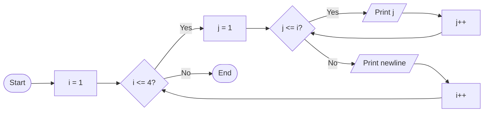

- **Nested loops**: Outer loop for rows, inner for columns
- **Dynamic limit**: Inner loop runs j from 1 to current i
- **Incremental pattern**: Each row has one more number

**Mnemonic:** "RICI" (Row Increases, Column Increases based on row number)

## Question 3(c) OR [7 marks]

**Draw flowchart and explain switch statement with example.**

**Answer**:
The switch statement is a multi-way decision maker that tests a variable against various case values.

**Diagram:**

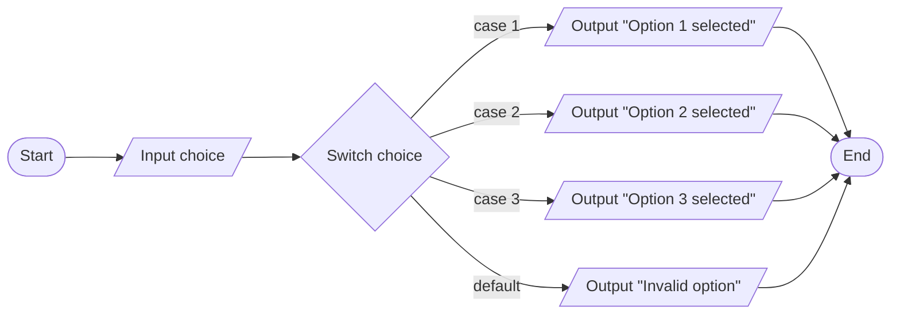

**Code Example:**

```c
#include <stdio.h>

int main() {
    int choice;
    
    printf("Menu:\n");
    printf("1. Add\n");
    printf("2. Subtract\n");
    printf("3. Multiply\n");
    printf("Enter your choice (1-3): ");
    scanf("%d", &choice);
    
    switch (choice) {
        case 1:
            printf("Addition selected\n");
            break;
        case 2:
            printf("Subtraction selected\n");
            break;
        case 3:
            printf("Multiplication selected\n");
            break;
        default:
            printf("Invalid choice\n");
    }
    
    return 0;
}
```

- **Multiple cases**: Tests one variable against multiple values
- **Break statement**: Prevents fall-through to next case
- **Default case**: Handles values not matching any case
- **Case order**: Can be in any order, default usually last

**Mnemonic:** "CASED" (Check All Switch Expression's Destinations)

## Question 4(a) [3 marks]

**Develop a C program to convert temperature from Celsius to Fahrenheit using formula fahrenheit= ((celsius*9)/5)+32.**

**Answer**:
This program converts a temperature value from Celsius to Fahrenheit.

```c
#include <stdio.h>

int main() {
    float celsius, fahrenheit;
    
    printf("Enter temperature in Celsius: ");
    scanf("%f", &celsius);
    
    // Convert Celsius to Fahrenheit
    fahrenheit = ((celsius * 9) / 5) + 32;
    
    printf("%.2f Celsius = %.2f Fahrenheit\n", celsius, fahrenheit);
    
    return 0;
}
```

**Diagram:**

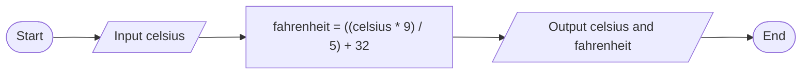

- **Formula**: F = ((C × 9) ÷ 5) + 32
- **Float variables**: For decimal precision
- **Formatted output**: Using %.2f for two decimal places

**Mnemonic:** "C95+32=F" (Celsius × 9 ÷ 5 + 32 = Fahrenheit)

## Question 4(b) [4 marks]

**What is pointer? Explain with example.**

**Answer**:
A pointer is a variable that stores the memory address of another variable.

**Diagram:**

```
Memory:
+--------+      +--------+
| ptr    |----->| var    |
| 0x1000 |      | 0x2000 |
+--------+      +--------+
  Address         Value: 10
  contains
  0x2000
```

**Code Example:**

```c
#include <stdio.h>

int main() {
    int var = 10;    // Regular variable
    int *ptr;        // Pointer variable
    
    ptr = &var;      // Store address of var in ptr
    
    printf("Value of var: %d\n", var);       // Output: 10
    printf("Address of var: %p\n", &var);    // Output: memory address
    printf("Value of ptr: %p\n", ptr);       // Output: same memory address
    printf("Value at address stored in ptr: %d\n", *ptr); // Output: 10
    
    // Modify value using pointer
    *ptr = 20;
    printf("New value of var: %d\n", var);   // Output: 20
    
    return 0;
}
```

**Table: Pointer Operations**

| Operation | Symbol | Description | Example |
|-----------|--------|-------------|---------|
| Address-of | & | Gets address of variable | &var |
| Dereference | * | Accesses value at address | *ptr |
| Declaration | * | Creates pointer variable | int *ptr; |
| Assignment | = | Assigns address to pointer | ptr = &var; |

- **Memory address**: Pointer stores location, not value
- **Indirection**: Access value indirectly using address
- **Memory manipulation**: Allows dynamic memory access

**Mnemonic:** "ADA" (Address Dereferencing Access)

## Question 4(c) [7 marks]

**Draw flowchart and explain do-while loop with example.**

**Answer**:
The do-while loop is a post-test loop that executes its body at least once before checking the condition.

**Diagram:**

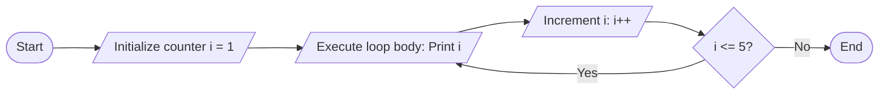

**Code Example:**

```c
#include <stdio.h>

int main() {
    int i = 1;
    
    do {
        printf("%d ", i);
        i++;
    } while (i <= 5);  // Condition checked after first execution
    
    // Output: 1 2 3 4 5
    
    return 0;
}
```

**Table: Characteristics of do-while Loop**

| Characteristic | Description |
|----------------|-------------|
| Execution order | Body first, then condition |
| Minimum iterations | At least one |
| Condition check | At the end of loop |
| Termination | When condition becomes false |
| Syntax | do { statements; } while (condition); |

- **Post-test loop**: Condition evaluated after loop body
- **Guaranteed execution**: Loop body always runs at least once
- **Semicolon**: Required after while condition

**Mnemonic:** "DECAT" (Do Execute Check After That)

## Question 4(a) OR [3 marks]

**Develop a C program to find area of a triangle (½ * base * height)?**

**Answer**:
This program calculates the area of a triangle using the formula Area = ½ × base × height.

```c
#include <stdio.h>

int main() {
    float base, height, area;
    
    printf("Enter base of triangle: ");
    scanf("%f", &base);
    printf("Enter height of triangle: ");
    scanf("%f", &height);
    
    // Calculate area
    area = 0.5 * base * height;
    
    printf("Area of triangle = %.2f square units\n", area);
    
    return 0;
}
```

**Diagram:**

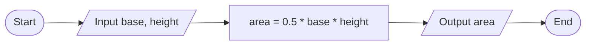

- **Formula**: Area = ½ × base × height
- **Float variables**: For decimal precision
- **User input**: Gets base and height from user

**Mnemonic:** "Half-BH" (Half times Base times Height)

## Question 4(b) OR [4 marks]

**Explain declaration and initialization of pointer.**

**Answer**:
Pointer declaration and initialization involve creating a pointer variable and assigning it a memory address.

**Table: Pointer Declaration and Initialization**

| Operation | Syntax | Example | Explanation |
|-----------|--------|---------|-------------|
| Declaration | data_type *pointer_name; | int *ptr; | Creates pointer to int |
| Initialization | pointer_name = &variable; | ptr = &num; | Assigns address of num to ptr |
| Combined | data_type *pointer_name = &variable; | int *ptr = &num; | Declares and initializes together |
| Null pointer | pointer_name = NULL; | ptr = NULL; | Points to nothing (safe practice) |

**Code Example:**

```c
#include <stdio.h>

int main() {
    // Declaration
    int *ptr1;
    
    // Declaration and initialization together
    int num = 10;
    int *ptr2 = &num;
    
    // Initialization with NULL
    int *ptr3 = NULL;
    
    printf("Value at address ptr2: %d\n", *ptr2);  // Output: 10
    
    return 0;
}
```

- **Asterisk syntax**: * used in declaration to create pointer
- **Address operator**: & gets address of variable
- **NULL initialization**: Safe practice to avoid wild pointers
- **Pointer type**: Must match the data type it points to

**Mnemonic:** "DINA" (Declare, Initialize with NULL or Address)

## Question 4(c) OR [7 marks]

**Draw flowchart and explain while loop with example.**

**Answer**:
The while loop is a pre-test loop that executes its body repeatedly as long as the condition remains true.

**Diagram:**

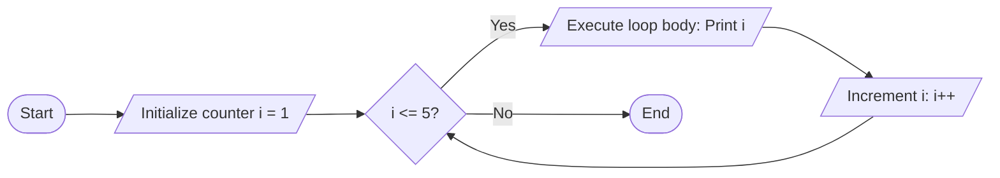

**Code Example:**

```c
#include <stdio.h>

int main() {
    int i = 1;
    
    while (i <= 5) {  // Condition checked before each execution
        printf("%d ", i);
        i++;
    }
    
    // Output: 1 2 3 4 5
    
    return 0;
}
```

**Table: Characteristics of while Loop**

| Characteristic | Description |
|----------------|-------------|
| Execution order | Condition first, then body |
| Minimum iterations | Zero (if condition initially false) |
| Condition check | At the beginning of loop |
| Termination | When condition becomes false |
| Syntax | while (condition) { statements; } |

- **Pre-test loop**: Condition evaluated before loop body
- **Zero iterations possible**: Body may never execute if condition initially false
- **Loop variable**: Must be initialized before loop
- **Infinite loop**: Occurs if condition never becomes false

**Mnemonic:** "CELT" (Check, Execute, Loop, Terminate)

## Question 5(a) [3 marks]

**Build a structure to store book information: book_no, book_title, book_author, book_price**

**Answer**:
This program creates a structure to store book information with the specified fields.

```c
#include <stdio.h>
#include <string.h>

// Define structure for book information
struct Book {
    int book_no;
    char book_title[50];
    char book_author[30];
    float book_price;
};

int main() {
    // Declare a variable of Book structure
    struct Book book1;
    
    // Assign values to structure members
    book1.book_no = 101;
    strcpy(book1.book_title, "Programming in C");
    strcpy(book1.book_author, "Dennis Ritchie");
    book1.book_price = 450.75;
    
    // Display book information
    printf("Book No: %d\n", book1.book_no);
    printf("Title: %s\n", book1.book_title);
    printf("Author: %s\n", book1.book_author);
    printf("Price: Rs. %.2f\n", book1.book_price);
    
    return 0;
}
```

**Diagram:**

```
+-----------------+
| struct Book     |
+-----------------+
| int book_no     |
| char book_title |
| char book_author|
| float book_price|
+-----------------+
```

- **Structure definition**: Uses struct keyword to define composite data type
- **Member access**: Using dot (.) operator to access members
- **String copying**: strcpy() for character arrays

**Mnemonic:** "NTAP" (Number, Title, Author, Price)

## Question 5(b) [4 marks]

**Explain following functions with example. (1) sqrt() (2) pow() (3) strlen() (4) strcpy()**

**Answer**:
These are standard library functions in C, used for mathematical calculations and string manipulations.

**Table: Library Functions**

| Function | Header File | Purpose | Example | Output |
|----------|-------------|---------|---------|--------|
| sqrt() | math.h | Square root of a number | sqrt(16) | 4.0 |
| pow() | math.h | Raises number to power | pow(2, 3) | 8.0 |
| strlen() | string.h | Length of string | strlen("Hello") | 5 |
| strcpy() | string.h | Copies one string to another | strcpy(dest, "Hello") | dest contains "Hello" |

**Code Example:**

```c
#include <stdio.h>
#include <math.h>
#include <string.h>

int main() {
    // sqrt() and pow() examples
    printf("Square root of 25: %.2f\n", sqrt(25));
    printf("2 raised to power 4: %.2f\n", pow(2, 4));
    
    // strlen() example
    char str[] = "C Programming";
    printf("Length of string: %d\n", strlen(str));
    
    // strcpy() example
    char source[] = "Hello";
    char destination[10];
    strcpy(destination, source);
    printf("Copied string: %s\n", destination);
    
    return 0;
}
```

- **Math functions**: sqrt() and pow() for mathematical calculations
- **String functions**: strlen() and strcpy() for string manipulations
- **Header files**: Required to use these functions
- **Return types**: sqrt() and pow() return double, strlen() returns size_t

**Mnemonic:** "MPSL" (Math Power and String Length)

## Question 5(c) [7 marks]

**Explain arrays and array initialization. Give example.**

**Answer**:
An array is a collection of elements of the same data type stored in contiguous memory locations.

**Table: Array Types and Initialization Methods**

| Array Type | Declaration | Initialization at Declaration | Separate Initialization |
|------------|-------------|-------------------------------|------------------------|
| Integer | int arr[5]; | int arr[5] = {10, 20, 30, 40, 50}; | arr[0] = 10; arr[1] = 20; etc. |
| Character | char str[10]; | char str[10] = "Hello"; | strcpy(str, "Hello"); |
| Float | float values[3]; | float values[3] = {1.5, 2.5, 3.5}; | values[0] = 1.5; etc. |
| Partial | int nums[5]; | int nums[5] = {1, 2}; | Remaining set to 0 |
| Size inference | - | int nums[] = {1, 2, 3}; | Size determined by initializer |

**Code Example:**

```c
#include <stdio.h>

int main() {
    // Array declaration and initialization
    int numbers[5] = {10, 20, 30, 40, 50};
    
    // Access and display array elements
    printf("Array elements: ");
    for (int i = 0; i < 5; i++) {
        printf("%d ", numbers[i]);
    }
    printf("\n");
    
    // Modifying array element
    numbers[2] = 35;
    printf("Modified element at index 2: %d\n", numbers[2]);
    
    return 0;
}
```

**Diagram:**

```
Array: numbers[5]
+-----+-----+-----+-----+-----+
| 10  | 20  | 30  | 40  | 50  |
+-----+-----+-----+-----+-----+
  [0]   [1]   [2]   [3]   [4]
```

- **Zero-based indexing**: First element at index 0
- **Contiguous memory**: Elements stored adjacently
- **Fixed size**: Size defined at compile time
- **Element access**: Using index with square brackets

**Mnemonic:** "DICE" (Declaration, Initialization, Contiguous storage, Element access)

## Question 5(a) OR [3 marks]

**Explain declaration of structure with example.**

**Answer**:
Structure declaration in C involves defining a new data type that combines different data types under a single name.

**Table: Structure Declaration Methods**

| Method | Syntax | Example |
|--------|--------|---------|
| Basic declaration | struct tag_name { members; }; | struct Student { int id; char name[20]; }; |
| With variables | struct tag_name { members; } variables; | struct Point { int x, y; } p1, p2; |
| Without tag | struct { members; } variables; | struct { float real, imag; } c1; |
| Typedef | typedef struct { members; } alias; | typedef struct { int h, w; } Rectangle; |

**Code Example:**

```c
#include <stdio.h>

// Structure declaration
struct Student {
    int id;
    char name[30];
    float percentage;
};

int main() {
    // Declaring structure variable
    struct Student s1;
    
    // Assigning values to structure members
    s1.id = 101;
    strcpy(s1.name, "John");
    s1.percentage = 85.5;
    
    // Displaying structure members
    printf("Student ID: %d\n", s1.id);
    printf("Name: %s\n", s1.name);
    printf("Percentage: %.2f%%\n", s1.percentage);
    
    return 0;
}
```

- **Structure keyword**: struct used to define new data type
- **Member access**: . (dot) operator to access members
- **Heterogeneous data**: Can combine different data types
- **Custom data type**: Creates user-defined data type

**Mnemonic:** "SMUVT" (Structure Mostly Uses Various Types)

## Question 5(b) OR [4 marks]

**What is user defined function? Explain with example.**

**Answer**:
A user-defined function is a block of code written by the programmer to perform a specific task, which can be called from other parts of the program.

**Table: Function Components**

| Component | Description | Example |
|-----------|-------------|---------|
| Return type | Data type returned by function | int, float, void |
| Function name | Identifier for the function | add, findMax |
| Parameters | Input values in parentheses | (int a, int b) |
| Function body | Code inside curly braces | { return a + b; } |
| Function call | Invoking the function | result = add(5, 3); |

**Code Example:**

```c
#include <stdio.h>

// User-defined function declaration
int findMax(int a, int b);

int main() {
    int num1 = 10, num2 = 20, max;
    
    // Function call
    max = findMax(num1, num2);
    
    printf("Maximum between %d and %d is %d\n", num1, num2, max);
    
    return 0;
}

// Function definition
int findMax(int a, int b) {
    // Function body
    if (a > b)
        return a;
    else
        return b;
}
```

**Diagram:**

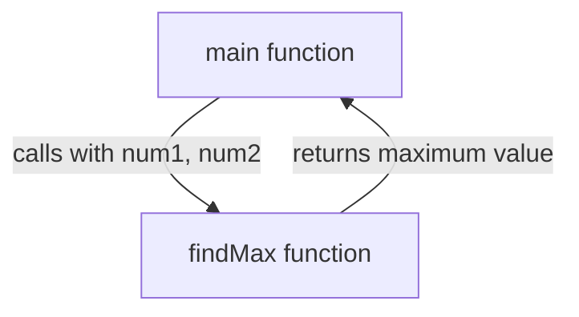

- **Modular code**: Break large program into smaller parts
- **Reusability**: Call function multiple times from different places
- **Declaration vs Definition**: Declaration tells compiler about function, definition contains actual code
- **Parameters**: Pass values to function when calling

**Mnemonic:** "CDRP" (Create, Define, Return, Pass)

## Question 5(c) OR [7 marks]

**Develop a C program to arrange elements of an array of 10 numbers in ascending order.**

**Answer**:
This program sorts an array of 10 integers in ascending order using bubble sort algorithm.

```c
#include <stdio.h>

int main() {
    int arr[10], i, j, temp;
    
    // Input array elements
    printf("Enter 10 integers: \n");
    for (i = 0; i < 10; i++) {
        scanf("%d", &arr[i]);
    }
    
    // Bubble sort algorithm for ascending order
    for (i = 0; i < 9; i++) {
        for (j = 0; j < 9 - i; j++) {
            if (arr[j] > arr[j + 1]) {
                // Swap if current element is greater than next
                temp = arr[j];
                arr[j] = arr[j + 1];
                arr[j + 1] = temp;
            }
        }
    }
    
    // Display sorted array
    printf("Array in ascending order: \n");
    for (i = 0; i < 10; i++) {
        printf("%d ", arr[i]);
    }
    
    return 0;
}
```

**Diagram:**

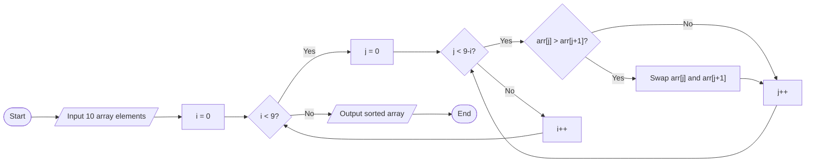

- **Bubble sort**: Compare adjacent elements and swap if needed
- **Nested loops**: Outer loop for passes, inner loop for comparisons
- **Optimization**: Each pass fixes at least one element, so inner loop runs fewer times
- **Temporary variable**: Used for swapping elements

**Mnemonic:** "BSCOT" (Bubble Sort Compares and Orders Things)
