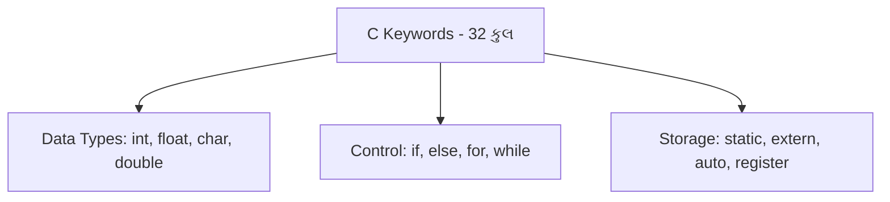
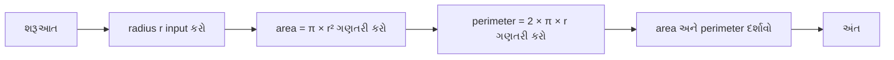
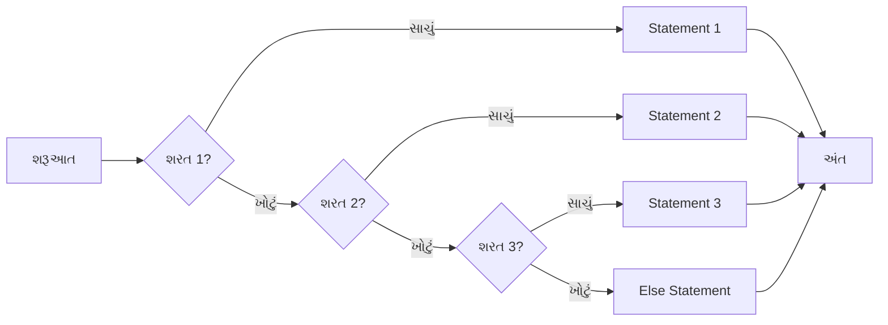
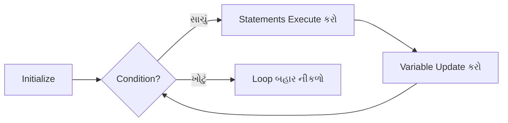
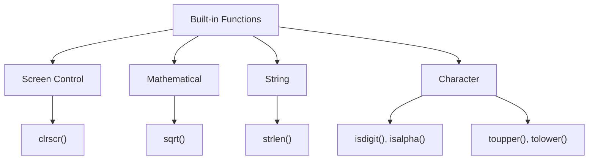

## પ્રશ્ન 1(a) [3 ગુણ]

**C માં કેટલા keywords છે? કોઈપણ ચાર keywords લખો**

**જવાબ**:

| કુલ Keywords | ઉદાહરણો |
|----------------|----------|
| 32 keywords | int, float, char, if |

**આકૃતિ:**



- **32 keywords**: C ભાષામાં કુલ આરક્ષિત શબ્દો
- **Data type keywords**: int, float, char, double વેરિએબલ જાહેર કરવા માટે
- **Control keywords**: if, else, for, while પ્રોગ્રામ ફ્લો માટે

**મેમરી ટ્રીક:** "બિલાડી ચાર રંગમાં" (char, int, float, const)

---

## પ્રશ્ન 1(b) [4 ગુણ]

**વેરિએબલ શું છે? ઉદાહરણ સાથે વેરિએબલને નામ આપવાના નિયમો સમજાવો**

**જવાબ**:

**વેરિએબલ વ્યાખ્યા:**

| પાસાં | વર્ણન |
|--------|-------------|
| વ્યાખ્યા | ડેટા સ્ટોર કરવા માટે નામવાળી મેમરી લોકેશન |
| હેતુ | પ્રોગ્રામ દરમિયાન બદલાતા મૂલ્યો રાખવા |
| જાહેરાત | datatype variable_name; |

**નામકરણના નિયમો:**

- **પ્રથમ અક્ષર**: અક્ષર અથવા underscore (_) હોવો જોઈએ
- **પછીના અક્ષરો**: અક્ષરો, અંકો, underscore માત્ર
- **Case sensitive**: 'Age' અને 'age' અલગ છે
- **Keywords નહીં**: 'int', 'float' જેવા આરક્ષિત શબ્દો વાપરી શકાતા નથી

**ઉદાહરણો:**

```c
int age;        // યોગ્ય
float _salary;  // યોગ્ય
char name123;   // યોગ્ય
int 2number;    // ખોટું - અંકથી શરૂ
float for;      // ખોટું - keyword વપરાયું
```

**મેમરી ટ્રીક:** "અક્ષર પહેલાં, keywords નહીં"

---

## પ્રશ્ન 1(c) [7 ગુણ]

**નીચેના statements માં errors શોધો**

**જવાબ**:

| Statement | Error | કારણ |
|-----------|-------|--------|
| (1) fLoat x; | ખોટો keyword | સાચું: float x; |
| (2) int min, max = 20; | અર્ધ initialization | માત્ર max initialize, min નહીં |
| (3) long char c; | ખોટું combination | long ને char સાથે વાપરી શકાતું નથી |
| (4) iNt a; | ખોટો keyword | સાચું: int a; |
| (5) FLOAT f=2; | ખોટો keyword | સાચું: float f=2; |
| (6) double m ; n; | Missing datatype | સાચું: double m, n; |
| (7) Int score (100)0; | અનેક errors | ખોટું syntax, સાચું: int score = 100; |

**મુખ્ય મુદ્દાઓ:**

- **Case sensitivity**: Keywords નાના અક્ષરમાં હોવા જોઈએ
- **Multiple declaration**: Comma separator વાપરો
- **Initialization syntax**: = operator વાપરો

**મેમરી ટ્રીક:** "Keywords હંમેશા નાના અક્ષરે"

---

## પ્રશ્ન 1(c) OR [7 ગુણ]

**અલ્ગોરિધમ શું છે? ફ્લોચાર્ટ શું છે? વર્તુળનો વિસ્તાર અને પરિમિતિ શોધવા માટે ફ્લોચાર્ટ દોરો.**

**જવાબ**:

**વ્યાખ્યાઓ:**

| શબ્દ | વ્યાખ્યા |
|------|------------|
| Algorithm | સમસ્યા હલ કરવાની પગલાબદ્ધ પ્રક્રિયા |
| Flowchart | Algorithm નું પ્રતીકો વડે દ્રશ્ય પ્રતિનિધિત્વ |

**વર્તુળ માટે ફ્લોચાર્ટ:**



**Algorithm ના પગલાં:**

- **પગલું 1**: શરૂઆત કરો
- **પગલું 2**: Radius નું મૂલ્ય input કરો
- **પગલું 3**: π×r² સૂત્ર વડે area ગણો
- **પગલું 4**: 2×π×r સૂત્ર વડે perimeter ગણો

**મેમરી ટ્રીક:** "શરૂ Input ગણતરી દર્શાવો અંત"

---

## પ્રશ્ન 2(a) [3 ગુણ]

**ઓપરેટર શું છે? C ના બધા operators ની યાદી બનાવો.**

**જવાબ**:

**ઓપરેટર વ્યાખ્યા:**

| પાસાં | વર્ણન |
|--------|-------------|
| વ્યાખ્યા | Operands પર operations કરતા ખાસ પ્રતીકો |
| હેતુ | ડેટા અને વેરિએબલ્સ સાથે કામ કરવા |

**C ઓપરેટર્સ યાદી:**

| વર્ગ | Operators |
|----------|-----------|
| Arithmetic | +, -, *, /, % |
| Relational | <, >, <=, >=, ==, != |
| Logical | &&, \|\|, ! |
| Assignment | =, +=, -=, *=, /= |
| Increment/Decrement | ++, -- |
| Conditional | ?: |

**મેમરી ટ્રીક:** "ગણતરી સંબંધ તર્ક અસાઇન વધારો શરત"

---

## પ્રશ્ન 2(b) [4 ગુણ]

**while અને do while loop વચ્ચે તફાવત લખો.**

**જવાબ**:

| પાસાં | while loop | do-while loop |
|--------|------------|---------------|
| **Entry condition** | Pre-tested | Post-tested |
| **ન્યૂનતમ execution** | 0 વખત | ઓછામાં ઓછું 1 વખત |
| **Syntax** | while(condition) { } | do { } while(condition); |
| **Semicolon** | while પછી જરૂરી નથી | while પછી જરૂરી છે |

**ઉદાહરણ:**

```c
// while loop
while(i < 5) {
    printf("%d", i);
    i++;
}

// do-while loop  
do {
    printf("%d", i);
    i++;
} while(i < 5);
```

**મુખ્ય મુદ્દાઓ:**

- **Pre-tested**: Execution પહેલાં condition ચકાસાય
- **Post-tested**: Execution પછી condition ચકાસાય

**મેમરી ટ્રીક:** "While પહેલાં, Do પછી"

---

## પ્રશ્ન 2(c) [7 ગુણ]

**scanf() function નો formatted input માટે કેવી રીતે ઉપયોગ થાય છે? ઉદાહરણ સાથે સમજાવો**

**જવાબ**:

**scanf() Function:**

| લક્ષણ | વર્ણન |
|---------|-------------|
| હેતુ | Keyboard થી formatted input વાંચવા |
| Syntax | scanf("format_string", &variable); |
| Return | સફળતાપૂર્વક વંચાયેલા inputs ની સંખ્યા |

**Format Specifiers:**

| Specifier | Data Type |
|-----------|-----------|
| %d | int |
| %f | float |
| %c | char |
| %s | string |

**ઉદાહરણો:**

```c
int age;
float salary;
char grade;

scanf("%d", &age);           // Integer વાંચો
scanf("%f", &salary);        // Float વાંચો
scanf("%c", &grade);         // Character વાંચો
scanf("%d %f", &age, &salary); // બહુવિધ inputs
```

**મહત્વના મુદ્દાઓ:**

- **Address operator (&)**: Variables માટે જરૂરી
- **Format string**: Data types સાથે match થવું જોઈએ
- **Buffer issues**: જરૂર પડે તો fflush(stdin) વાપરો

**મેમરી ટ્રીક:** "Address Format Match"

---

## પ્રશ્ન 2(a) OR [3 ગુણ]

**C ભાષાના arithmetic અને relational operators ની યાદી બનાવો**

**જવાબ**:

| Operator Type | Operators | હેતુ |
|---------------|-----------|---------|
| **Arithmetic** | +, -, *, /, % | ગાણિતિક operations |
| **Relational** | <, >, <=, >=, ==, != | Comparison operations |

**ઉદાહરણો:**

```c
// Arithmetic
int a = 10 + 5;    // Addition
int b = 10 % 3;    // Modulus (remainder)

// Relational
if(a > b)          // મોટું
if(a == b)         // બરાબર
```

**મેમરી ટ્રીક:** "ગણતરી સરખામણી"

---

## પ્રશ્ન 2(b) OR [4 ગુણ]

**else if ladder નો flow chart દોરો.**

**જવાબ**:



**માળખું:**

- **બહુવિધ શરતો**: ક્રમમાં ચકાસાય છે
- **પ્રથમ સાચી**: તેનો block execute થાય
- **Default case**: કોઈ match ન મળે તો else block

**મેમરી ટ્રીક:** "પ્રથમ સાચી શોધો execute કરો"

---

## પ્રશ્ન 2(c) OR [7 ગુણ]

**printf() function નો formatted output માટે કેવી રીતે ઉપયોગ થાય છે? ઉદાહરણ સાથે સમજાવો**

**જવાબ**:

**printf() Function:**

| લક્ષણ | વર્ણન |
|---------|-------------|
| હેતુ | Screen પર formatted output દર્શાવવા |
| Syntax | printf("format_string", variables); |
| Return | Print કરાયેલા characters ની સંખ્યા |

**Format Specifiers:**

| Specifier | વપરાશ | ઉદાહરણ |
|-----------|-------|---------|
| %d | Integer | printf("%d", 25); |
| %f | Float | printf("%.2f", 3.14); |
| %c | Character | printf("%c", 'A'); |
| %s | String | printf("%s", "Hello"); |

**Advanced Formatting:**

```c
int num = 123;
float pi = 3.14159;

printf("Number: %5d\n", num);      // Width specification
printf("Pi: %.2f\n", pi);          // Precision specification
printf("Hex: %x\n", num);          // Hexadecimal
printf("Left aligned: %-10d\n", num); // Left alignment
```

**Escape Sequences:**

- **\n**: નવી લીટી
- **\t**: Tab space
- **\\**: Backslash

**મેમરી ટ્રીક:** "Format Width Precision Align"

---

## પ્રશ્ન 3(a) [3 ગુણ]

**Logical operators ની યાદી બનાવો અને તેને સમજાવો**

**જવાબ**:

| Operator | Symbol | વર્ણન | Truth Table |
|----------|--------|-------------|-------------|
| **AND** | && | બંને operands સાચા હોય તો સાચું | T&&T = T, બાકી = F |
| **OR** | \|\| | કોઈપણ operand સાચો હોય તો સાચું | F\|\|F = F, બાકી = T |
| **NOT** | ! | Condition ઉલટાવે છે | !T = F, !F = T |

**ઉદાહરણો:**

```c
int a = 5, b = 10;

if(a > 0 && b > 0)    // બંને શરતો સાચી હોવી જોઈએ
if(a > 15 || b > 5)   // ઓછામાં ઓછી એક શરત સાચી
if(!(a > 10))         // શરતનું નકારણ
```

**મેમરી ટ્રીક:** "અને અથવા નહીં"

---

## પ્રશ્ન 3(b) [4 ગુણ]

**for loop ને ઉદાહરણ સાથે સમજાવો.**

**જવાબ**:

**For Loop માળખું:**

| ઘટક | હેતુ |
|-----------|---------|
| Initialization | શરુઆતી મૂલ્ય સેટ કરવું |
| Condition | ચાલુ રાખવા માટે ટેસ્ટ |
| Update | Loop variable ને બદલવું |

**Syntax:**

```c
for(initialization; condition; update) {
    statements;
}
```

**ઉદાહરણ:**

```c
// 1 થી 5 સુધીના નંબર print કરો
for(int i = 1; i <= 5; i++) {
    printf("%d ", i);
}
// Output: 1 2 3 4 5
```

**Execution Flow:**

- **પગલું 1**: i = 1 initialize કરો
- **પગલું 2**: i <= 5 condition ચકાસો
- **પગલું 3**: Statements execute કરો
- **પગલું 4**: i++ update કરો, પગલું 2 પર પાછા

**મેમરી ટ્રીક:** "Initialize ચકાસો Execute Update"

---

## પ્રશ્ન 3(c) [7 ગુણ]

**ત્રણ પૂર્ણાંક સંખ્યાઓ x અને y માંથી મહત્તમ શોધવા માટે પ્રોગ્રામ લખો.**

**જવાબ**:

```c
#include <stdio.h>

int main() {
    int x, y, z, max;
    
    printf("ત્રણ સંખ્યાઓ દાખલ કરો: ");
    scanf("%d %d %d", &x, &y, &z);
    
    max = x;  // પ્રથમ સંખ્યાને મહત્તમ માનો
    
    if(y > max) {
        max = y;
    }
    if(z > max) {
        max = z;
    }
    
    printf("મહત્તમ સંખ્યા છે: %d", max);
    
    return 0;
}
```

**Algorithm ના પગલાં:**

| પગલું | કાર્ય |
|------|--------|
| 1 | ત્રણ સંખ્યાઓ input કરો |
| 2 | પ્રથમને મહત્તમ માનો |
| 3 | બીજી સાથે સરખામણી, મોટી હોય તો update |
| 4 | ત્રીજી સાથે સરખામણી, મોટી હોય તો update |
| 5 | મહત્તમ દર્શાવો |

**વૈકલ્પિક પદ્ધતિ:**

```c
max = (x > y) ? ((x > z) ? x : z) : ((y > z) ? y : z);
```

**મેમરી ટ્રીક:** "માનો સરખાવો Update દર્શાવો"

---

## પ્રશ્ન 3(a) OR [3 ગુણ]

**conditional operator ને ઉદાહરણ સાથે સમજાવો.**

**જવાબ**:

**Conditional Operator (Ternary):**

| લક્ષણ | વર્ણન |
|---------|-------------|
| Symbol | ?: |
| Syntax | condition ? value1 : value2 |
| હેતુ | if-else નો ટૂંકો રસ્તો |

**ઉદાહરણો:**

```c
int a = 10, b = 20;
int max = (a > b) ? a : b;        // max = 20

char grade = (marks >= 60) ? 'P' : 'F';
printf("Status: %s", (age >= 18) ? "Adult" : "Minor");
```

**સમાન if-else:**

```c
if(a > b)
    max = a;
else
    max = b;
```

**ફાયદાઓ:**

- **સંક્ષિપ્ત**: એક લીટીમાં expression
- **કાર્યક્ષમ**: ઝડપી execution

**મેમરી ટ્રીક:** "પ્રશ્નચિહ્ન કોલન પસંદગી"

---

## પ્રશ્ન 3(b) OR [4 ગુણ]

**while loop ને ઉદાહરણ સાથે સમજાવો.**

**જવાબ**:

**While Loop:**

| લક્ષણ | વર્ણન |
|---------|-------------|
| પ્રકાર | Entry-controlled loop |
| Syntax | while(condition) { statements; } |
| Execution | શરત સાચી હોય ત્યાં સુધી repeat |

**ઉદાહરણ:**

```c
int i = 1;
while(i <= 5) {
    printf("%d ", i);
    i++;
}
// Output: 1 2 3 4 5
```

**મહત્વના મુદ્દાઓ:**

- **Initialization**: Loop પહેલાં
- **Condition**: શરૂઆતમાં ચકાસાય
- **Update**: Loop body અંદર
- **Infinite loop**: જો condition ક્યારેય false ન બને

**Flowchart માળખું:**



**મેમરી ટ્રીક:** "Initialize ચકાસો Execute Update"

---

## પ્રશ્ન 3(c) OR [7 ગુણ]

**કીબોર્ડમાંથી પૂર્ણાંક વાંચવા માટે અને આપેલ સંખ્યા odd હોય કે even હોય તે શોધવા માટેનો પ્રોગ્રામ લખો.**

**જવાબ**:

```c
#include <stdio.h>

int main() {
    int number;
    
    printf("એક પૂર્ણાંક દાખલ કરો: ");
    scanf("%d", &number);
    
    if(number % 2 == 0) {
        printf("%d એ સમ સંખ્યા છે", number);
    }
    else {
        printf("%d એ વિષમ સંખ્યા છે", number);
    }
    
    return 0;
}
```

**તર્ક સમજૂતી:**

| ખ્યાલ | વર્ણન |
|---------|-------------|
| **Modulus operator (%)** | ભાગાકાર પછી બાકી આપે છે |
| **સમ શરત** | number % 2 == 0 |
| **વિષમ શરત** | number % 2 != 0 |

**વૈકલ્પિક પદ્ધતિઓ:**

```c
// પદ્ધતિ 2: Conditional operator વાપરીને
printf("%d એ %s છે", number, (number % 2 == 0) ? "સમ" : "વિષમ");

// પદ્ધતિ 3: Bitwise AND વાપરીને
if(number & 1)
    printf("વિષમ");
else
    printf("સમ");
```

**Sample Output:**

```
એક પૂર્ણાંક દાખલ કરો: 7
7 એ વિષમ સંખ્યા છે
```

**મેમરી ટ્રીક:** "Modulus બે શૂન્ય સમ"

---

## પ્રશ્ન 4(a) [3 ગુણ]

**નીચેના arithmetic expressions નું મૂલ્યાંકન કરો: 30/4*4 – 20%6 + 17/2**

**જવાબ**:

**પગલાબદ્ધ મૂલ્યાંકન:**

| પગલું | Expression | ગણતરી | પરિણામ |
|------|------------|-------------|--------|
| 1 | 30/4*4 | (30/4)*4 = 7*4 | 28 |
| 2 | 20%6 | 20 mod 6 | 2 |
| 3 | 17/2 | Integer division | 8 |
| 4 | અંતિમ | 28 - 2 + 8 | 34 |

**Operator પ્રાધાન્યતા:**

| પ્રાધાન્યતા | Operators |
|----------|-----------|
| ઉચ્ચ | *, /, % (ડાબેથી જમણે) |
| નીચી | +, - (ડાબેથી જમણે) |

**સંપૂર્ણ ગણતરી:**

```
30/4*4 – 20%6 + 17/2
= 7*4 - 2 + 8      // પહેલાં division અને modulus
= 28 - 2 + 8       // Multiplication
= 26 + 8           // +,- માટે ડાબેથી જમણે
= 34               // અંતિમ જવાબ
```

**મેમરી ટ્રીક:** "ગુણા ભાગ પહેલાં બાદબાકી પછી"

---

## પ્રશ્ન 4(b) [4 ગુણ]

**5 પૂર્ણાંક સંખ્યાઓની array નો સરવાળો અને સરેરાશ શોધવા માટેનો પ્રોગ્રામ લખો.**

**જવાબ**:

```c
#include <stdio.h>

int main() {
    int numbers[5];
    int sum = 0;
    float average;
    
    printf("5 પૂર્ણાંકો દાખલ કરો:\n");
    for(int i = 0; i < 5; i++) {
        scanf("%d", &numbers[i]);
        sum += numbers[i];
    }
    
    average = (float)sum / 5;
    
    printf("સરવાળો = %d\n", sum);
    printf("સરેરાશ = %.2f", average);
    
    return 0;
}
```

**Algorithm:**

| પગલું | કાર્ય |
|------|--------|
| 1 | 5 integers ની array જાહેર કરો |
| 2 | Sum ને 0 થી initialize કરો |
| 3 | Loop વાપરીને 5 numbers input કરો |
| 4 | દરેક number ને sum માં ઉમેરો |
| 5 | Average = sum/5 ગણો |
| 6 | પરિણામો દર્શાવો |

**મુખ્ય મુદ્દાઓ:**

- **Type casting**: (float)sum ચોક્કસ division માટે
- **Loop વપરાશ**: Repetitive input માટે કાર્યક્ષમ

**મેમરી ટ્રીક:** "જાહેર Input ઉમેરો ગણો દર્શાવો"

---

## પ્રશ્ન 4(c) [7 ગુણ]

**Pointer વ્યાખ્યાયિત કરો. Pointers કેવી રીતે declared અને initialized કરવામાં આવે છે તે ઉદાહરણ સાથે સમજાવો.**

**જવાબ**:

**Pointer વ્યાખ્યા:**

| પાસાં | વર્ણન |
|--------|-------------|
| વ્યાખ્યા | બીજા variable નું memory address સ્ટોર કરતું variable |
| હેતુ | સીધી memory access અને dynamic memory allocation |
| Symbol | * (asterisk) declaration અને dereferencing માટે |

**Declaration અને Initialization:**

```c
// Declaration
int *ptr;           // Integer નો pointer
float *fptr;        // Float નો pointer
char *cptr;         // Character નો pointer

// Initialization
int num = 10;
int *ptr = &num;    // num ના address સાથે initialize

// વૈકલ્પિક
int *ptr;
ptr = &num;         // પછીથી address assign
```

**ઉદાહરણ પ્રોગ્રામ:**

```c
#include <stdio.h>

int main() {
    int num = 25;
    int *ptr = &num;
    
    printf("num નું મૂલ્ય: %d\n", num);
    printf("num નું address: %p\n", &num);
    printf("ptr નું મૂલ્ય: %p\n", ptr);
    printf("ptr દ્વારા pointed મૂલ્ય: %d\n", *ptr);
    
    return 0;
}
```

**મુખ્ય Operators:**

- **& (Address-of)**: Variable નું address મેળવે છે
- **\* (Dereference)**: Address પરનું મૂલ્ય મેળવે છે

**Memory Diagram:**

```
num: [25] at address 1000
ptr: [1000] at address 2000
```

**મેમરી ટ્રીક:** "Address Star Dereference"

---

## પ્રશ્ન 4(a) OR [3 ગુણ]

**નીચેના arithmetic expressions નું મૂલ્યાંકન કરો: 50 / 3 % 3 + 5 * 7**

**જવાબ**:

**પગલાબદ્ધ મૂલ્યાંકન:**

| પગલું | Expression | ગણતરી | પરિણામ |
|------|------------|-------------|--------|
| 1 | 50/3 | Integer division | 16 |
| 2 | 16%3 | 16 mod 3 | 1 |
| 3 | 5*7 | Multiplication | 35 |
| 4 | અંતિમ | 1 + 35 | 36 |

**સંપૂર્ણ ગણતરી:**

```
50 / 3 % 3 + 5 * 7
= 16 % 3 + 35      // પહેલાં division અને multiplication
= 1 + 35           // Modulus operation
= 36               // અંતિમ જવાબ
```

**Operator પ્રાધાન્યતા લાગુ:**

- **ઉચ્ચ પ્રાધાન્યતા**: /, %, * (ડાબેથી જમણે)
- **નીચી પ્રાધાન્યતા**: + (ડાબેથી જમણે)

**મેમરી ટ્રીક:** "ભાગ Mod ગુણા ઉમેરો"

---

## પ્રશ્ન 4(b) OR [4 ગુણ]

**N પૂર્ણાંકોની array માં સૌથી મોટી સંખ્યા શોધવા માટેનો પ્રોગ્રામ લખો.**

**જવાબ**:

```c
#include <stdio.h>

int main() {
    int n, i;
    int largest;
    
    printf("elements ની સંખ્યા દાખલ કરો: ");
    scanf("%d", &n);
    
    int arr[n];
    
    printf("%d સંખ્યાઓ દાખલ કરો:\n", n);
    for(i = 0; i < n; i++) {
        scanf("%d", &arr[i]);
    }
    
    largest = arr[0];  // પ્રથમ element ને largest માનો
    
    for(i = 1; i < n; i++) {
        if(arr[i] > largest) {
            largest = arr[i];
        }
    }
    
    printf("સૌથી મોટી સંખ્યા છે: %d", largest);
    
    return 0;
}
```

**Algorithm:**

| પગલું | કાર્ય |
|------|--------|
| 1 | Array નું size input કરો |
| 2 | Array elements input કરો |
| 3 | પ્રથમ element ને largest માનો |
| 4 | બાકીના elements સાથે સરખામણી કરો |
| 5 | જો મોટું મળે તો largest update કરો |
| 6 | પરિણામ દર્શાવો |

**મેમરી ટ્રીક:** "Input માનો સરખાવો Update દર્શાવો"

---

## પ્રશ્ન 4(c) OR [7 ગુણ]

**Array વ્યાખ્યાયિત કરો. Array variable ની જરૂરિયાત સમજાવો. 1-D array ને ઉદાહરણ સાથે સમજાવો**

**જવાબ**:

**Array વ્યાખ્યા:**

| પાસાં | વર્ણન |
|--------|-------------|
| વ્યાખ્યા | સમાન data type ના elements નો સંગ્રહ |
| Storage | સતત memory locations માં |
| Access | Index/subscript વાપરીને |

**Arrays ની જરૂરિયાત:**

| સમસ્યા | Array સાથે ઉકેલ |
|---------|-------------------|
| બહુવિધ values સ્ટોર કરવા | એક જ array variable |
| ઘણા variables ટાળવા | arr[100] બદલે a1, a2, ..., a100 |
| કાર્યક્ષમ processing | Loop-based operations |
| Memory organization | Contiguous allocation |

**1-D Array Declaration:**

```c
datatype arrayname[size];

// ઉદાહરણો
int marks[5];           // 5 integers ની Array
float prices[10];       // 10 floats ની Array
char name[20];         // 20 characters ની Array
```

**Array Initialization:**

```c
// પદ્ધતિ 1: Declaration વખતે
int numbers[5] = {10, 20, 30, 40, 50};

// પદ્ધતિ 2: વ્યક્તિગત assignment
int arr[3];
arr[0] = 5;
arr[1] = 15;
arr[2] = 25;
```

**ઉદાહરણ પ્રોગ્રામ:**

```c
#include <stdio.h>

int main() {
    int marks[5] = {85, 90, 78, 92, 88};
    int i, sum = 0;
    
    printf("વિદ્યાર્થીના ગુણ:\n");
    for(i = 0; i < 5; i++) {
        printf("વિષય %d: %d\n", i+1, marks[i]);
        sum += marks[i];
    }
    
    printf("કુલ ગુણ: %d", sum);
    return 0;
}
```

**Memory Layout:**

```
marks[0] marks[1] marks[2] marks[3] marks[4]
  [85]     [90]     [78]     [92]     [88]
 1000     1004     1008     1012     1016
```

**મેમરી ટ્રીક:** "સમાન ડેટા સતત Index"

---

## પ્રશ્ન 5(a) [3 ગુણ]

**if … else statement નું ઉદાહરણ આપો.**

**જવાબ**:

**If-else ઉદાહરણ:**

```c
#include <stdio.h>

int main() {
    int age;
    
    printf("તમારી ઉંમર દાખલ કરો: ");
    scanf("%d", &age);
    
    if(age >= 18) {
        printf("તમે મતદાન માટે લાયક છો");
    }
    else {
        printf("તમે મતદાન માટે લાયક નથી");
    }
    
    return 0;
}
```

**માળખું:**

| ઘટક | હેતુ |
|-----------|---------|
| **if** | શરત ટેસ્ટ કરે છે |
| **condition** | Boolean expression |
| **if-block** | શરત સાચી હોય ત્યારે execute |
| **else-block** | શરત ખોટી હોય ત્યારે execute |

**Sample Outputs:**

```
Input: 20    Output: તમે મતદાન માટે લાયક છો
Input: 16    Output: તમે મતદાન માટે લાયક નથી
```

**મેમરી ટ્રીક:** "જો સાચું નહીંતર ખોટું"

---

## પ્રશ્ન 5(b) [4 ગુણ]

**આપેલ character ની category ચકાસવા માટેનો પ્રોગ્રામ લખો.**

**જવાબ**:

```c
#include <stdio.h>
#include <ctype.h>

int main() {
    char ch;
    
    printf("એક character દાખલ કરો: ");
    scanf("%c", &ch);
    
    if(isdigit(ch)) {
        printf("'%c' એ અંક છે", ch);
    }
    else if(isupper(ch)) {
        printf("'%c' એ મોટા અક્ષર છે", ch);
    }
    else if(islower(ch)) {
        printf("'%c' એ નાના અક્ષર છે", ch);
    }
    else {
        printf("'%c' એ વિશેષ પ્રતીક છે", ch);
    }
    
    return 0;
}
```

**Character Categories:**

| Function | વર્ગ | Range |
|----------|----------|-------|
| isdigit() | અંક | 0-9 |
| isupper() | મોટા અક્ષર | A-Z |
| islower() | નાના અક્ષર | a-z |
| Others | વિશેષ પ્રતીકો | !@#$%^&* etc. |

**વૈકલ્પિક પદ્ધતિ:**

```c
if(ch >= '0' && ch <= '9')
    printf("અંક");
else if(ch >= 'A' && ch <= 'Z')
    printf("મોટા અક્ષર");
else if(ch >= 'a' && ch <= 'z')
    printf("નાના અક્ષર");
else
    printf("વિશેષ પ્રતીક");
```

**મેમરી ટ્રીક:** "અંક મોટા નાના વિશેષ"

---

## પ્રશ્ન 5(c) [7 ગુણ]

**Structure શું છે? તેની syntax યોગ્ય ઉદાહરણ સાથે સમજાવો**

**જવાબ**:

**Structure વ્યાખ્યા:**

| પાસાં | વર્ણન |
|--------|-------------|
| વ્યાખ્યા | વિવિધ data types ને જોડીને બનાવેલ user-defined data type |
| હેતુ | સંબંધિત data ને એક જ નામ હેઠળ જૂથ બનાવવા |
| Keyword | struct |

**Syntax:**

```c
struct structure_name {
    datatype member1;
    datatype member2;
    ...
};
```

**ઉદાહરણ - Student Structure:**

```c
#include <stdio.h>

struct Student {
    int roll_no;
    char name[50];
    float marks;
    char grade;
};

int main() {
    struct Student s1;
    
    // Data input
    printf("રોલ નંબર દાખલ કરો: ");
    scanf("%d", &s1.roll_no);
    
    printf("નામ દાખલ કરો: ");
    scanf("%s", s1.name);
    
    printf("ગુણ દાખલ કરો: ");
    scanf("%f", &s1.marks);
    
    printf("ગ્રેડ દાખલ કરો: ");
    scanf(" %c", &s1.grade);
    
    // Data display
    printf("\nવિદ્યાર્થીની વિગતો:\n");
    printf("રોલ નં: %d\n", s1.roll_no);
    printf("નામ: %s\n", s1.name);
    printf("ગુણ: %.2f\n", s1.marks);
    printf("ગ્રેડ: %c\n", s1.grade);
    
    return 0;
}
```

**Structure લક્ષણો:**

| લક્ષણ | વર્ણન |
|---------|-------------|
| **Dot operator (.)** | Structure members ને access કરવા |
| **Memory allocation** | કુલ size = બધા members નો સરવાળો |
| **Initialization** | Declaration વખતે initialize કરી શકાય |

**Structure Initialization:**

```c
struct Student s1 = {101, "John", 85.5, 'A'};
```

**Memory Layout:**

```
s1: [roll_no][name...][marks][grade]
     4 bytes  50 bytes 4 bytes 1 byte
```

**મેમરી ટ્રીક:** "સંબંધિત ડેટાને એકસાથે જૂથ બનાવો"

---

## પ્રશ્ન 5(a) OR [3 ગુણ]

**-5 અને +5 વચ્ચેના બધા numbers print કરવા માટેનો પ્રોગ્રામ લખો.**

**જવાબ**:

```c
#include <stdio.h>

int main() {
    int i;
    
    printf("-5 અને +5 વચ્ચેના નંબરો:\n");
    
    for(i = -5; i <= 5; i++) {
        printf("%d ", i);
    }
    
    return 0;
}
```

**Output:**

```
-5 અને +5 વચ્ચેના નંબરો:
-5 -4 -3 -2 -1 0 1 2 3 4 5
```

**વૈકલ્પિક પદ્ધતિઓ:**

```c
// પદ્ધતિ 2: while loop વાપરીને
int i = -5;
while(i <= 5) {
    printf("%d ", i);
    i++;
}

// પદ્ધતિ 3: બે અલગ loops
for(i = -5; i < 0; i++)
    printf("%d ", i);
printf("0 ");
for(i = 1; i <= 5; i++)
    printf("%d ", i);
```

**મેમરી ટ્રીક:** "નકારાત્મકથી શરૂ સકારાત્મકે અંત"

---

## પ્રશ્ન 5(b) OR [4 ગુણ]

**Quadratic equation ના roots શોધવા માટેનો પ્રોગ્રામ લખો.**

**જવાબ**:

```c
#include <stdio.h>
#include <math.h>

int main() {
    float a, b, c;
    float discriminant, root1, root2;
    
    printf("coefficients (a, b, c) દાખલ કરો: ");
    scanf("%f %f %f", &a, &b, &c);
    
    discriminant = b*b - 4*a*c;
    
    if(discriminant > 0) {
        root1 = (-b + sqrt(discriminant)) / (2*a);
        root2 = (-b - sqrt(discriminant)) / (2*a);
        printf("Roots વાસ્તવિક અને અલગ છે\n");
        printf("Root1 = %.2f\n", root1);
        printf("Root2 = %.2f\n", root2);
    }
    else if(discriminant == 0) {
        root1 = -b / (2*a);
        printf("Roots વાસ્તવિક અને સમાન છે\n");
        printf("Root = %.2f\n", root1);
    }
    else {
        float realPart = -b / (2*a);
        float imagPart = sqrt(-discriminant) / (2*a);
        printf("Roots સંકુલ છે\n");
        printf("Root1 = %.2f + %.2fi\n", realPart, imagPart);
        printf("Root2 = %.2f - %.2fi\n", realPart, imagPart);
    }
    
    return 0;
}
```

**Quadratic Formula વિશ્લેષણ:**

| Discriminant | Roots નો પ્રકાર |
|--------------|-----------------|
| **b²-4ac > 0** | વાસ્તવિક અને અલગ |
| **b²-4ac = 0** | વાસ્તવિક અને સમાન |
| **b²-4ac < 0** | સંકુલ (કાલ્પનિક) |

**સૂત્ર:** x = (-b ± √(b²-4ac)) / 2a

**Sample Output:**

```
coefficients દાખલ કરો: 1 -7 12
Roots વાસ્તવિક અને અલગ છે
Root1 = 4.00
Root2 = 3.00
```

**મેમરી ટ્રીક:** "Discriminant Roots નો પ્રકાર નક્કી કરે છે"

---

## પ્રશ્ન 5(c) OR [7 ગુણ]

**નીચેના built-in functions ને ઉદાહરણો સાથે સમજાવો**

**જવાબ**:

**Function સમજૂતીઓ:**

| Function | હેતુ | Header File | ઉદાહરણ |
|----------|---------|-------------|---------|
| clrscr() | Screen સાફ કરવા | conio.h | clrscr(); |
| sqrt() | વર્ગમૂળ | math.h | sqrt(16) = 4.0 |
| strlen() | String ની લંબાઈ | string.h | strlen("Hello") = 5 |
| isdigit() | અંક છે કે કેમ ચકાસવા | ctype.h | isdigit('5') = true |
| isalpha() | અક્ષર છે કે કેમ ચકાસવા | ctype.h | isalpha('A') = true |
| toupper() | મોટા અક્ષરમાં બદલવા | ctype.h | toupper('a') = 'A' |
| tolower() | નાના અક્ષરમાં બદલવા | ctype.h | tolower('B') = 'b' |

**ઉદાહરણ પ્રોગ્રામ:**

```c
#include <stdio.h>
#include <conio.h>
#include <math.h>
#include <string.h>
#include <ctype.h>

int main() {
    clrscr();  // Screen સાફ કરો
    
    // sqrt() ઉદાહરણ
    float num = 25.0;
    printf("%.1f નું વર્ગમૂળ = %.2f\n", num, sqrt(num));
    
    // strlen() ઉદાહરણ
    char str[] = "Programming";
    printf("'%s' ની લંબાઈ = %d\n", str, strlen(str));
    
    // Character functions
    char ch = 'a';
    printf("'%c' અંક છે: %s\n", ch, isdigit(ch) ? "હા" : "ના");
    printf("'%c' અક્ષર છે: %s\n", ch, isalpha(ch) ? "હા" : "ના");
    printf("'%c' નું મોટું અક્ષર = '%c'\n", ch, toupper(ch));
    
    ch = 'B';
    printf("'%c' નું નાનું અક્ષર = '%c'\n", ch, tolower(ch));
    
    return 0;
}
```

**Function વર્ગીકરણ:**



**મુખ્ય મુદ્દાઓ:**

- **Header files**: યોગ્ય headers include કરવા જરૂરી
- **Return values**: મોટાભાગના functions ચોક્કસ types return કરે છે
- **Parameter types**: Function parameter requirements ચકાસો

**મેમરી ટ્રીક:** "સાફ ગણિત String Character"
