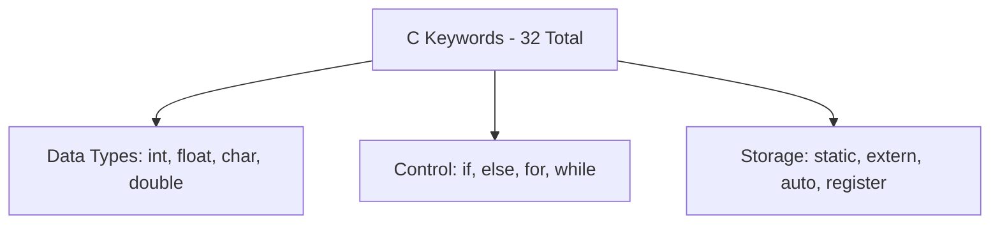
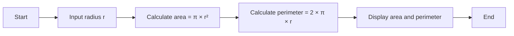
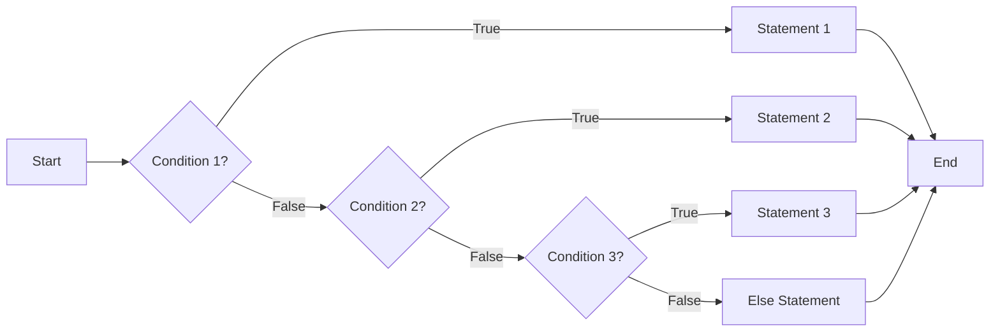
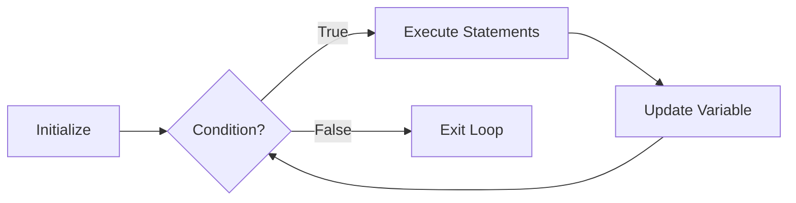
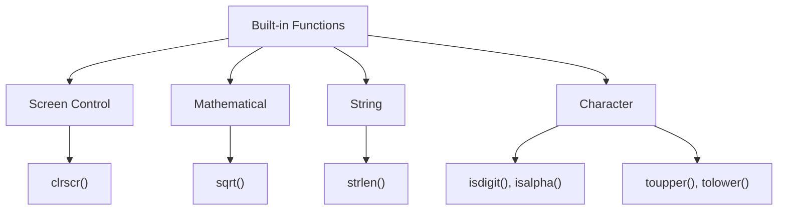

## Question 1(a) [3 marks]

**How many keywords are there in C? Write any four keywords**

**Answer**:

| Total Keywords | Examples |
|----------------|----------|
| 32 keywords | int, float, char, if |

**Diagram:**



- **32 keywords**: Total reserved words in C language
- **Data type keywords**: int, float, char, double for variable declaration
- **Control keywords**: if, else, for, while for program flow

**Mnemonic:** "Cats In Four Colors" (char, int, float, const)

---

## Question 1(b) [4 marks]

**What is variable? Explain rules for naming a variable with example**

**Answer**:

**Variable Definition:**

| Aspect | Description |
|--------|-------------|
| Definition | Named memory location to store data |
| Purpose | Hold values that can change during program execution |
| Declaration | datatype variable_name; |

**Naming Rules:**

- **First character**: Must be letter or underscore (_)
- **Subsequent characters**: Letters, digits, underscore only
- **Case sensitive**: 'Age' and 'age' are different
- **No keywords**: Cannot use reserved words like 'int', 'float'

**Examples:**

```c
int age;        // Valid
float _salary;  // Valid
char name123;   // Valid
int 2number;    // Invalid - starts with digit
float for;      // Invalid - keyword used
```

**Mnemonic:** "Letters First, No Keywords" (LF-NK)

---

## Question 1(c) [7 marks]

**Specify errors if any, in the following statements**

**Answer**:

| Statement | Error | Reason |
|-----------|-------|--------|
| (1) fLoat x; | Invalid keyword | Correct: float x; |
| (2) int min, max = 20; | Partial initialization | Only max initialized, min uninitialized |
| (3) long char c; | Invalid combination | Cannot combine long with char |
| (4) iNt a; | Invalid keyword | Correct: int a; |
| (5) FLOAT f=2; | Invalid keyword | Correct: float f=2; |
| (6) double m ; n; | Missing datatype | Correct: double m, n; |
| (7) Int score (100)0; | Multiple errors | Invalid syntax, correct: int score = 100; |

**Key Points:**

- **Case sensitivity**: Keywords must be lowercase
- **Multiple declaration**: Use comma separator
- **Initialization syntax**: Use = operator

**Mnemonic:** "Keywords Lower Case Always" (KLCA)

---

## Question 1(c) OR [7 marks]

**What is algorithm? What is flowchart? Draw a flowchart to find area and perimeter of circle.**

**Answer**:

**Definitions:**

| Term | Definition |
|------|------------|
| Algorithm | Step-by-step procedure to solve a problem |
| Flowchart | Visual representation of algorithm using symbols |

**Flowchart for Circle Area and Perimeter:**



**Algorithm Steps:**

- **Step 1**: Start
- **Step 2**: Input radius value
- **Step 3**: Calculate area using formula π×r²
- **Step 4**: Calculate perimeter using formula 2×π×r

**Mnemonic:** "Start Input Calculate Display End" (SICDE)

---

## Question 2(a) [3 marks]

**What is operator? List all the 'C' operators.**

**Answer**:

**Operator Definition:**

| Aspect | Description |
|--------|-------------|
| Definition | Special symbols that perform operations on operands |
| Purpose | Manipulate data and variables |

**C Operators List:**

| Category | Operators |
|----------|-----------|
| Arithmetic | +, -, *, /, % |
| Relational | <, >, <=, >=, ==, != |
| Logical | &&, \|\|, ! |
| Assignment | =, +=, -=, *=, /= |
| Increment/Decrement | ++, -- |
| Conditional | ?: |

**Mnemonic:** "Add Relate Logic Assign Increment Condition" (ARLIC)

---

## Question 2(b) [4 marks]

**State difference between while and do while loop.**

**Answer**:

| Aspect | while loop | do-while loop |
|--------|------------|---------------|
| **Entry condition** | Pre-tested | Post-tested |
| **Minimum execution** | 0 times | At least 1 time |
| **Syntax** | while(condition) { } | do { } while(condition); |
| **Semicolon** | Not required after while | Required after while |

**Example:**

```c
// while loop
while(i < 5) {
    printf("%d", i);
    i++;
}

// do-while loop  
do {
    printf("%d", i);
    i++;
} while(i < 5);
```

**Key Points:**

- **Pre-tested**: Condition checked before execution
- **Post-tested**: Condition checked after execution

**Mnemonic:** "While Before, Do After" (WB-DA)

---

## Question 2(c) [7 marks]

**How is scanf() function used for formatted input? Explain with example**

**Answer**:

**scanf() Function:**

| Feature | Description |
|---------|-------------|
| Purpose | Read formatted input from keyboard |
| Syntax | scanf("format_string", &variable); |
| Return | Number of successfully read inputs |

**Format Specifiers:**

| Specifier | Data Type |
|-----------|-----------|
| %d | int |
| %f | float |
| %c | char |
| %s | string |

**Examples:**

```c
int age;
float salary;
char grade;

scanf("%d", &age);           // Read integer
scanf("%f", &salary);        // Read float
scanf("%c", &grade);         // Read character
scanf("%d %f", &age, &salary); // Multiple inputs
```

**Important Points:**

- **Address operator (&)**: Required for variables
- **Format string**: Must match data types
- **Buffer issues**: Use fflush(stdin) if needed

**Mnemonic:** "Address Format Match" (AFM)

---

## Question 2(a) OR [3 marks]

**List arithmetic and relational operators of C language**

**Answer**:

| Operator Type | Operators | Purpose |
|---------------|-----------|---------|
| **Arithmetic** | +, -, *, /, % | Mathematical operations |
| **Relational** | <, >, <=, >=, ==, != | Comparison operations |

**Examples:**

```c
// Arithmetic
int a = 10 + 5;    // Addition
int b = 10 % 3;    // Modulus (remainder)

// Relational
if(a > b)          // Greater than
if(a == b)         // Equal to
```

**Mnemonic:** "Add Multiply Compare" (AMC)

---

## Question 2(b) OR [4 marks]

**Draw flow chart of else if ladder.**

**Answer**:



**Structure:**

- **Multiple conditions**: Checked sequentially
- **First true**: Corresponding block executes
- **Default case**: Else block for no match

**Mnemonic:** "Check First True Execute" (CFTE)

---

## Question 2(c) OR [7 marks]

**How is printf() function used for formatted output? Explain with example**

**Answer**:

**printf() Function:**

| Feature | Description |
|---------|-------------|
| Purpose | Display formatted output on screen |
| Syntax | printf("format_string", variables); |
| Return | Number of characters printed |

**Format Specifiers:**

| Specifier | Usage | Example |
|-----------|-------|---------|
| %d | Integer | printf("%d", 25); |
| %f | Float | printf("%.2f", 3.14); |
| %c | Character | printf("%c", 'A'); |
| %s | String | printf("%s", "Hello"); |

**Advanced Formatting:**

```c
int num = 123;
float pi = 3.14159;

printf("Number: %5d\n", num);      // Width specification
printf("Pi: %.2f\n", pi);          // Precision specification
printf("Hex: %x\n", num);          // Hexadecimal
printf("Left aligned: %-10d\n", num); // Left alignment
```

**Escape Sequences:**

- **\n**: New line
- **\t**: Tab space
- **\\**: Backslash

**Mnemonic:** "Format Width Precision Align" (FWPA)

---

## Question 3(a) [3 marks]

**List Logical operators and explain it**

**Answer**:

| Operator | Symbol | Description | Truth Table |
|----------|--------|-------------|-------------|
| **AND** | && | True if both operands true | T&&T = T, others = F |
| **OR** | \|\| | True if any operand true | F\|\|F = F, others = T |
| **NOT** | ! | Inverts the condition | !T = F, !F = T |

**Examples:**

```c
int a = 5, b = 10;

if(a > 0 && b > 0)    // Both conditions must be true
if(a > 15 || b > 5)   // At least one condition true  
if(!(a > 10))         // Negation of condition
```

**Mnemonic:** "And Or Not" (AON)

---

## Question 3(b) [4 marks]

**Explain for loop with example.**

**Answer**:

**For Loop Structure:**

| Component | Purpose |
|-----------|---------|
| Initialization | Set starting value |
| Condition | Test for continuation |
| Update | Modify loop variable |

**Syntax:**

```c
for(initialization; condition; update) {
    statements;
}
```

**Example:**

```c
// Print numbers 1 to 5
for(int i = 1; i <= 5; i++) {
    printf("%d ", i);
}
// Output: 1 2 3 4 5
```

**Execution Flow:**

- **Step 1**: Initialize i = 1
- **Step 2**: Check condition i <= 5
- **Step 3**: Execute statements
- **Step 4**: Update i++, repeat from step 2

**Mnemonic:** "Initialize Check Execute Update" (ICEU)

---

## Question 3(c) [7 marks]

**Write a program to find maximum out of three integer numbers x and y.**

**Answer**:

```c
#include <stdio.h>

int main() {
    int x, y, z, max;
    
    printf("Enter three numbers: ");
    scanf("%d %d %d", &x, &y, &z);
    
    max = x;  // Assume first number is maximum
    
    if(y > max) {
        max = y;
    }
    if(z > max) {
        max = z;
    }
    
    printf("Maximum number is: %d", max);
    
    return 0;
}
```

**Algorithm Steps:**

| Step | Action |
|------|--------|
| 1 | Input three numbers |
| 2 | Assume first as maximum |
| 3 | Compare with second, update if larger |
| 4 | Compare with third, update if larger |
| 5 | Display maximum |

**Alternative Method:**

```c
max = (x > y) ? ((x > z) ? x : z) : ((y > z) ? y : z);
```

**Mnemonic:** "Assume Compare Update Display" (ACUD)

---

## Question 3(a) OR [3 marks]

**Explain conditional operator with example.**

**Answer**:

**Conditional Operator (Ternary):**

| Feature | Description |
|---------|-------------|
| Symbol | ?: |
| Syntax | condition ? value1 : value2 |
| Purpose | Shortcut for if-else |

**Examples:**

```c
int a = 10, b = 20;
int max = (a > b) ? a : b;        // max = 20

char grade = (marks >= 60) ? 'P' : 'F';
printf("Status: %s", (age >= 18) ? "Adult" : "Minor");
```

**Equivalent if-else:**

```c
if(a > b)
    max = a;
else
    max = b;
```

**Advantages:**

- **Concise**: Single line expression
- **Efficient**: Faster execution

**Mnemonic:** "Question Mark Colon Choice" (QMCC)

---

## Question 3(b) OR [4 marks]

**Explain while loop with example.**

**Answer**:

**While Loop:**

| Feature | Description |
|---------|-------------|
| Type | Entry-controlled loop |
| Syntax | while(condition) { statements; } |
| Execution | Repeats while condition is true |

**Example:**

```c
int i = 1;
while(i <= 5) {
    printf("%d ", i);
    i++;
}
// Output: 1 2 3 4 5
```

**Important Points:**

- **Initialization**: Before loop
- **Condition**: Checked at beginning  
- **Update**: Inside loop body
- **Infinite loop**: If condition never becomes false

**Flowchart Structure:**



**Mnemonic:** "Initialize Check Execute Update" (ICEU)

---

## Question 3(c) OR [7 marks]

**WAP to read an integer from key board and print whether given number is odd or even.**

**Answer**:

```c
#include <stdio.h>

int main() {
    int number;
    
    printf("Enter an integer: ");
    scanf("%d", &number);
    
    if(number % 2 == 0) {
        printf("%d is Even number", number);
    }
    else {
        printf("%d is Odd number", number);
    }
    
    return 0;
}
```

**Logic Explanation:**

| Concept | Description |
|---------|-------------|
| **Modulus operator (%)** | Returns remainder after division |
| **Even condition** | number % 2 == 0 |
| **Odd condition** | number % 2 != 0 |

**Alternative Methods:**

```c
// Method 2: Using conditional operator
printf("%d is %s", number, (number % 2 == 0) ? "Even" : "Odd");

// Method 3: Using bitwise AND
if(number & 1)
    printf("Odd");
else
    printf("Even");
```

**Sample Output:**

```
Enter an integer: 7
7 is Odd number
```

**Mnemonic:** "Modulus Two Zero Even" (MTZE)

---

## Question 4(a) [3 marks]

**Evaluate following arithmetic expressions: 30/4*4 – 20%6 + 17/2**

**Answer**:

**Step-by-step Evaluation:**

| Step | Expression | Calculation | Result |
|------|------------|-------------|--------|
| 1 | 30/4*4 | (30/4)*4 = 7*4 | 28 |
| 2 | 20%6 | 20 mod 6 | 2 |
| 3 | 17/2 | Integer division | 8 |
| 4 | Final | 28 - 2 + 8 | 34 |

**Operator Precedence:**

| Priority | Operators |
|----------|-----------|
| High | *, /, % (Left to right) |
| Low | +, - (Left to right) |

**Complete Calculation:**

```
30/4*4 – 20%6 + 17/2
= 7*4 - 2 + 8      // Division and modulus first
= 28 - 2 + 8       // Multiplication
= 26 + 8           // Left to right for +,-
= 34               // Final answer
```

**Mnemonic:** "Multiply Divide Before Add Subtract" (MDBAS)

---

## Question 4(b) [4 marks]

**WAP to find sum and average of an array of 5 integer numbers.**

**Answer**:

```c
#include <stdio.h>

int main() {
    int numbers[5];
    int sum = 0;
    float average;
    
    printf("Enter 5 integers:\n");
    for(int i = 0; i < 5; i++) {
        scanf("%d", &numbers[i]);
        sum += numbers[i];
    }
    
    average = (float)sum / 5;
    
    printf("Sum = %d\n", sum);
    printf("Average = %.2f", average);
    
    return 0;
}
```

**Algorithm:**

| Step | Action |
|------|--------|
| 1 | Declare array of 5 integers |
| 2 | Initialize sum to 0 |
| 3 | Input 5 numbers using loop |
| 4 | Add each number to sum |
| 5 | Calculate average = sum/5 |
| 6 | Display results |

**Key Points:**

- **Type casting**: (float)sum for accurate division
- **Loop usage**: Efficient for repetitive input

**Mnemonic:** "Declare Input Add Calculate Display" (DIACD)

---

## Question 4(c) [7 marks]

**Define pointer. Explain how pointers are declared and initialized with example.**

**Answer**:

**Pointer Definition:**

| Aspect | Description |
|--------|-------------|
| Definition | Variable that stores memory address of another variable |
| Purpose | Direct memory access and dynamic memory allocation |
| Symbol | * (asterisk) for declaration and dereferencing |

**Declaration and Initialization:**

```c
// Declaration
int *ptr;           // Pointer to integer
float *fptr;        // Pointer to float
char *cptr;         // Pointer to character

// Initialization
int num = 10;
int *ptr = &num;    // Initialize with address of num

// Alternative
int *ptr;
ptr = &num;         // Assign address later
```

**Example Program:**

```c
#include <stdio.h>

int main() {
    int num = 25;
    int *ptr = &num;
    
    printf("Value of num: %d\n", num);
    printf("Address of num: %p\n", &num);
    printf("Value of ptr: %p\n", ptr);
    printf("Value pointed by ptr: %d\n", *ptr);
    
    return 0;
}
```

**Key Operators:**

- **& (Address-of)**: Gets address of variable
- **\* (Dereference)**: Gets value at address

**Memory Diagram:**

```
num: [25] at address 1000
ptr: [1000] at address 2000
```

**Mnemonic:** "Address Star Dereference" (ASD)

---

## Question 4(a) OR [3 marks]

**Evaluate following arithmetic expressions: 50 / 3 % 3 + 5 * 7**

**Answer**:

**Step-by-step Evaluation:**

| Step | Expression | Calculation | Result |
|------|------------|-------------|--------|
| 1 | 50/3 | Integer division | 16 |
| 2 | 16%3 | 16 mod 3 | 1 |
| 3 | 5*7 | Multiplication | 35 |
| 4 | Final | 1 + 35 | 36 |

**Complete Calculation:**

```
50 / 3 % 3 + 5 * 7
= 16 % 3 + 35      // Division and multiplication first
= 1 + 35           // Modulus operation
= 36               // Final answer
```

**Operator Precedence Applied:**

- **High priority**: /, %, * (left to right)
- **Low priority**: + (left to right)

**Mnemonic:** "Divide Mod Multiply Add" (DMMA)

---

## Question 4(b) OR [4 marks]

**WAP to find the largest number in an array of N integers.**

**Answer**:

```c
#include <stdio.h>

int main() {
    int n, i;
    int largest;
    
    printf("Enter number of elements: ");
    scanf("%d", &n);
    
    int arr[n];
    
    printf("Enter %d numbers:\n", n);
    for(i = 0; i < n; i++) {
        scanf("%d", &arr[i]);
    }
    
    largest = arr[0];  // Assume first element is largest
    
    for(i = 1; i < n; i++) {
        if(arr[i] > largest) {
            largest = arr[i];
        }
    }
    
    printf("Largest number is: %d", largest);
    
    return 0;
}
```

**Algorithm:**

| Step | Action |
|------|--------|
| 1 | Input array size |
| 2 | Input array elements |
| 3 | Assume first element as largest |
| 4 | Compare with remaining elements |
| 5 | Update largest if bigger found |
| 6 | Display result |

**Mnemonic:** "Input Assume Compare Update Display" (IACUD)

---

## Question 4(c) OR [7 marks]

**Define array. Explain the need for array variable. Explain 1-D array with example**

**Answer**:

**Array Definition:**

| Aspect | Description |
|--------|-------------|
| Definition | Collection of similar data type elements |
| Storage | Consecutive memory locations |
| Access | Using index/subscript |

**Need for Arrays:**

| Problem | Solution with Array |
|---------|-------------------|
| Store multiple values | Single array variable |
| Avoid multiple variables | arr[100] instead of a1, a2, ..., a100 |
| Efficient processing | Loop-based operations |
| Memory organization | Contiguous allocation |

**1-D Array Declaration:**

```c
datatype arrayname[size];

// Examples
int marks[5];           // Array of 5 integers
float prices[10];       // Array of 10 floats
char name[20];         // Array of 20 characters
```

**Array Initialization:**

```c
// Method 1: At declaration
int numbers[5] = {10, 20, 30, 40, 50};

// Method 2: Individual assignment
int arr[3];
arr[0] = 5;
arr[1] = 15;
arr[2] = 25;
```

**Example Program:**

```c
#include <stdio.h>

int main() {
    int marks[5] = {85, 90, 78, 92, 88};
    int i, sum = 0;
    
    printf("Student marks:\n");
    for(i = 0; i < 5; i++) {
        printf("Subject %d: %d\n", i+1, marks[i]);
        sum += marks[i];
    }
    
    printf("Total marks: %d", sum);
    return 0;
}
```

**Memory Layout:**

```
marks[0] marks[1] marks[2] marks[3] marks[4]
  [85]     [90]     [78]     [92]     [88]
 1000     1004     1008     1012     1016
```

**Mnemonic:** "Similar Data Consecutive Index" (SDCI)

---

## Question 5(a) [3 marks]

**Give an example of if … else statement.**

**Answer**:

**If-else Example:**

```c
#include <stdio.h>

int main() {
    int age;
    
    printf("Enter your age: ");
    scanf("%d", &age);
    
    if(age >= 18) {
        printf("You are eligible to vote");
    }
    else {
        printf("You are not eligible to vote");
    }
    
    return 0;
}
```

**Structure:**

| Component | Purpose |
|-----------|---------|
| **if** | Tests condition |
| **condition** | Boolean expression |
| **if-block** | Executes when condition true |
| **else-block** | Executes when condition false |

**Sample Outputs:**

```
Input: 20    Output: You are eligible to vote
Input: 16    Output: You are not eligible to vote
```

**Mnemonic:** "If True Else False" (ITEF)

---

## Question 5(b) [4 marks]

**WAP to check the category of given character.**

**Answer**:

```c
#include <stdio.h>
#include <ctype.h>

int main() {
    char ch;
    
    printf("Enter a character: ");
    scanf("%c", &ch);
    
    if(isdigit(ch)) {
        printf("'%c' is a Digit", ch);
    }
    else if(isupper(ch)) {
        printf("'%c' is an Uppercase letter", ch);
    }
    else if(islower(ch)) {
        printf("'%c' is a Lowercase letter", ch);
    }
    else {
        printf("'%c' is a Special symbol", ch);
    }
    
    return 0;
}
```

**Character Categories:**

| Function | Category | Range |
|----------|----------|-------|
| isdigit() | Digit | 0-9 |
| isupper() | Uppercase | A-Z |
| islower() | Lowercase | a-z |
| Others | Special symbols | !@#$%^&* etc. |

**Alternative Method:**

```c
if(ch >= '0' && ch <= '9')
    printf("Digit");
else if(ch >= 'A' && ch <= 'Z')
    printf("Uppercase");
else if(ch >= 'a' && ch <= 'z')
    printf("Lowercase");
else
    printf("Special symbol");
```

**Mnemonic:** "Digit Upper Lower Special" (DULS)

---

## Question 5(c) [7 marks]

**What is structure? Explain its syntax with suitable example**

**Answer**:

**Structure Definition:**

| Aspect | Description |
|--------|-------------|
| Definition | User-defined data type combining different data types |
| Purpose | Group related data under single name |
| Keyword | struct |

**Syntax:**

```c
struct structure_name {
    datatype member1;
    datatype member2;
    ...
};
```

**Example - Student Structure:**

```c
#include <stdio.h>

struct Student {
    int roll_no;
    char name[50];
    float marks;
    char grade;
};

int main() {
    struct Student s1;
    
    // Input data
    printf("Enter roll number: ");
    scanf("%d", &s1.roll_no);
    
    printf("Enter name: ");
    scanf("%s", s1.name);
    
    printf("Enter marks: ");
    scanf("%f", &s1.marks);
    
    printf("Enter grade: ");
    scanf(" %c", &s1.grade);
    
    // Display data
    printf("\nStudent Details:\n");
    printf("Roll No: %d\n", s1.roll_no);
    printf("Name: %s\n", s1.name);
    printf("Marks: %.2f\n", s1.marks);
    printf("Grade: %c\n", s1.grade);
    
    return 0;
}
```

**Structure Features:**

| Feature | Description |
|---------|-------------|
| **Dot operator (.)** | Access structure members |
| **Memory allocation** | Total size = sum of all members |
| **Initialization** | Can initialize at declaration |

**Structure Initialization:**

```c
struct Student s1 = {101, "John", 85.5, 'A'};
```

**Memory Layout:**

```
s1: [roll_no][name...][marks][grade]
     4 bytes  50 bytes 4 bytes 1 byte
```

**Mnemonic:** "Group Related Data Together" (GRDT)

---

## Question 5(a) OR [3 marks]

**WAP to Print all numbers between -5 & +5.**

**Answer**:

```c
#include <stdio.h>

int main() {
    int i;
    
    printf("Numbers between -5 and +5:\n");
    
    for(i = -5; i <= 5; i++) {
        printf("%d ", i);
    }
    
    return 0;
}
```

**Output:**

```
Numbers between -5 and +5:
-5 -4 -3 -2 -1 0 1 2 3 4 5
```

**Alternative Methods:**

```c
// Method 2: Using while loop
int i = -5;
while(i <= 5) {
    printf("%d ", i);
    i++;
}

// Method 3: Two separate loops
for(i = -5; i < 0; i++)
    printf("%d ", i);
printf("0 ");
for(i = 1; i <= 5; i++)
    printf("%d ", i);
```

**Mnemonic:** "Start Negative End Positive" (SNEP)

---

## Question 5(b) OR [4 marks]

**WAP to find roots of quadratic equation.**

**Answer**:

```c
#include <stdio.h>
#include <math.h>

int main() {
    float a, b, c;
    float discriminant, root1, root2;
    
    printf("Enter coefficients (a, b, c): ");
    scanf("%f %f %f", &a, &b, &c);
    
    discriminant = b*b - 4*a*c;
    
    if(discriminant > 0) {
        root1 = (-b + sqrt(discriminant)) / (2*a);
        root2 = (-b - sqrt(discriminant)) / (2*a);
        printf("Roots are real and different\n");
        printf("Root1 = %.2f\n", root1);
        printf("Root2 = %.2f\n", root2);
    }
    else if(discriminant == 0) {
        root1 = -b / (2*a);
        printf("Roots are real and equal\n");
        printf("Root = %.2f\n", root1);
    }
    else {
        float realPart = -b / (2*a);
        float imagPart = sqrt(-discriminant) / (2*a);
        printf("Roots are complex\n");
        printf("Root1 = %.2f + %.2fi\n", realPart, imagPart);
        printf("Root2 = %.2f - %.2fi\n", realPart, imagPart);
    }
    
    return 0;
}
```

**Quadratic Formula Analysis:**

| Discriminant | Nature of Roots |
|--------------|-----------------|
| **b²-4ac > 0** | Real and different |
| **b²-4ac = 0** | Real and equal |
| **b²-4ac < 0** | Complex (imaginary) |

**Formula:** x = (-b ± √(b²-4ac)) / 2a

**Sample Output:**

```
Enter coefficients: 1 -7 12
Roots are real and different
Root1 = 4.00
Root2 = 3.00
```

**Mnemonic:** "Discriminant Decides Root Nature" (DDRN)

---

## Question 5(c) OR [7 marks]

**Explain following built-in functions with examples**

**Answer**:

**Function Explanations:**

| Function | Purpose | Header File | Example |
|----------|---------|-------------|---------|
| clrscr() | Clear screen | conio.h | clrscr(); |
| sqrt() | Square root | math.h | sqrt(16) = 4.0 |
| strlen() | String length | string.h | strlen("Hello") = 5 |
| isdigit() | Check if digit | ctype.h | isdigit('5') = true |
| isalpha() | Check if alphabet | ctype.h | isalpha('A') = true |
| toupper() | Convert to uppercase | ctype.h | toupper('a') = 'A' |
| tolower() | Convert to lowercase | ctype.h | tolower('B') = 'b' |

**Example Program:**

```c
#include <stdio.h>
#include <conio.h>
#include <math.h>
#include <string.h>
#include <ctype.h>

int main() {
    clrscr();  // Clear screen
    
    // sqrt() example
    float num = 25.0;
    printf("Square root of %.1f = %.2f\n", num, sqrt(num));
    
    // strlen() example
    char str[] = "Programming";
    printf("Length of '%s' = %d\n", str, strlen(str));
    
    // Character functions
    char ch = 'a';
    printf("'%c' is digit: %s\n", ch, isdigit(ch) ? "Yes" : "No");
    printf("'%c' is alphabet: %s\n", ch, isalpha(ch) ? "Yes" : "No");
    printf("Uppercase of '%c' = '%c'\n", ch, toupper(ch));
    
    ch = 'B';
    printf("Lowercase of '%c' = '%c'\n", ch, tolower(ch));
    
    return 0;
}
```

**Function Categories:**



**Key Points:**

- **Header files**: Must include appropriate headers
- **Return values**: Most functions return specific types
- **Parameter types**: Check function parameter requirements

**Mnemonic:** "Clear Math String Character" (CMSC)
