## પ્રશ્ન 1(અ) [3 ગુણ]

**C લેંગ્વેજના બેઝીક ડેટા ટાઈપ તેની રેંજ સાથે લખો**

**જવાબ**:

| ડેટા ટાઈપ | સાઈઝ (બાઈટ્સ) | રેંજ |
|-----------|--------------|-------|
| char | 1 | -128 થી 127 |
| int | 2 અથવા 4 | -32,768 થી 32,767 (2 બાઈટ્સ) અથવા -2,147,483,648 થી 2,147,483,647 (4 બાઈટ્સ) |
| float | 4 | 3.4E-38 થી 3.4E+38 |
| double | 8 | 1.7E-308 થી 1.7E+308 |

**મેમરી ટ્રીક:** "CIFD - Computer Is Fundamentally Digital"

## પ્રશ્ન 1(બ) [4 ગુણ]

**વેરીએબલના નામ માટેના નિયમો સમજાવો.**

**જવાબ**:

| નિયમ | ઉદાહરણ |
|------|---------|
| અક્ષર અથવા અંડરસ્કોરથી શરૂ થવું જોઈએ | માન્ય: _count, name / અમાન્ય: 1score |
| અક્ષરો, અંકો, અંડરસ્કોર ધરાવી શકે | માન્ય: user_1 / અમાન્ય: user-1 |
| કીવર્ડ્સનો ઉપયોગ ન થઈ શકે | માન્ય: integer / અમાન્ય: int |
| કેસ સેન્સિટિવ | total અને TOTAL અલગ છે |

**આકૃતિ:**

```goat
┌───────────────────────────────┐
│ Variable Naming Rules         │
├───────────────────────────────┤
│ [A-Z, a-z, _] → [A-Z, a-z, 0-9, _]* │
└───────────────────────────────┘
```

**મેમરી ટ્રીક:** "LUCK - Letters Underscore Case Keywords"

## પ્રશ્ન 1(ક) [7 ગુણ]

**ફ્લોચાર્ટની વ્યાખ્યા લખો. બે પૂર્ણાંક નંબર N1 અને N2 માંથી નાનો નંબર શોધવા માટેનો ફ્લોચાર્ટ દોરો.**

**જવાબ**:

ફ્લોચાર્ટ એ એલ્ગોરિધમનું ગ્રાફિકલ રજૂઆત છે જે પ્રમાણિત સિમ્બોલ્સનો ઉપયોગ કરીને એરો દ્વારા જોડાયેલા પગલાંઓની ક્રમને દર્શાવે છે.

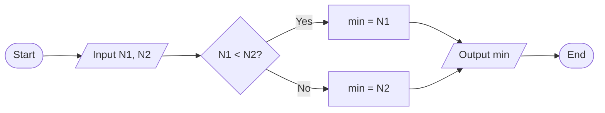

- **ફ્લોચાર્ટ સિમ્બોલ્સ**: તાર્કિક પગલાંઓની દૃશ્ય રજૂઆત
- **નિર્ણય ડાયમંડ**: શરત તપાસીને વહેણ પથ નક્કી કરે છે
- **પ્રોસેસ બોક્સેસ**: ગણતરી અથવા ઓપરેશન્સ ધરાવે છે

**મેમરી ટ્રીક:** "FAST - Flow Analysis Shown Through-charts"

## પ્રશ્ન 1(ક OR) [7 ગુણ]

**અલગોરિથમની વ્યાખ્યા લખો. વર્તુળનું ક્ષેત્રફળ અને પરિઘ ગણવા માટેનો અલગોરિથમ લખો.**

**જવાબ**:

અલગોરિધમ એ કોઈ ચોક્કસ સમસ્યાને ઉકેલવા માટેની સ્પષ્ટ રીતે વ્યાખ્યાયિત સૂચનાઓની પરિમિત ક્રમમાં પગલે-પગલાની પ્રક્રિયા છે.

**વર્તુળની ગણતરી માટેનો અલગોરિધમ:**

```
1. START
2. Input radius r
3. Calculate area = π * r * r
4. Calculate circumference = 2 * π * r
5. Output area, circumference
6. STOP
```

| પગલું | ઓપરેશન | ફોર્મ્યુલા |
|------|-----------|---------|
| 1 | ત્રિજ્યા મેળવો | Input r |
| 2 | ક્ષેત્રફળની ગણતરી | A = π × r² |
| 3 | પરિઘની ગણતરી | C = 2 × π × r |
| 4 | પરિણામ દર્શાવો | Output A, C |

**મેમરી ટ્રીક:** "SICS - Steps In Clear Sequence"

## પ્રશ્ન 2(અ) [3 ગુણ]

**printf() અને scanf() વચ્ચેનો તફાવત સમજાવો.**

**જવાબ**:

| ફીચર | printf() | scanf() |
|---------|----------|---------|
| ઉદ્દેશ | સ્ક્રીન પર ડેટા આઉટપુટ કરે છે | કીબોર્ડથી ડેટા ઇનપુટ લે છે |
| ફોર્મેટ | printf("format", variables) | scanf("format", &variables) |
| રિટર્ન | છાપેલા અક્ષરોની સંખ્યા | સફળતાપૂર્વક વાંચેલી આઇટમોની સંખ્યા |
| એડ્રેસિંગ | વેરિએબલ્સના નામનો ઉપયોગ કરે છે | વેરિએબલ્સના એડ્રેસનો ઉપયોગ કરે છે (&var) |

**મેમરી ટ્રીક:** "IO-AR - Input Output-Address Returns"

## પ્રશ્ન 2(બ) [4 ગુણ]

**કન્ડીશનલ ઓપરેટરનો ઉપયોગ કરીને બે નંબરમાંથી મોટો નંબર શોધવા માટે C પ્રોગ્રામ બનાવો.**

**જવાબ**:

```c
#include <stdio.h>

int main() {
    int num1, num2, max;
    
    printf("Enter two numbers: ");
    scanf("%d %d", &num1, &num2);
    
    max = (num1 > num2) ? num1 : num2;
    
    printf("Maximum number is: %d", max);
    
    return 0;
}
```

**આકૃતિ:**

```goat
┌─────────────┐     ┌─────────────┐      ┌─────────────┐
│ Input       │────>│ Condition   │─────>│ Output      │
│ num1, num2  │     │ num1 > num2?│      │ max         │
└─────────────┘     └─────────────┘      └─────────────┘
```

**મેમરી ટ્રીક:** "CTO - Condition Then Output"

## પ્રશ્ન 2(ક) [7 ગુણ]

**એરીથમેટીક અને રીલેશનલ ઓપરેટરો ઉદાહરણ સાથે સમજાવો.**

**જવાબ**:

| પ્રકાર | ઓપરેટર્સ | ઉદાહરણ | પરિણામ |
|------|-----------|---------|--------|
| **એરીથમેટીક ઓપરેટર્સ** | | | |
| સરવાળો | + | 5 + 3 | 8 |
| બાદબાકી | - | 5 - 3 | 2 |
| ગુણાકાર | * | 5 * 3 | 15 |
| ભાગાકાર | / | 5 / 3 | 1 (પૂર્ણાંક ભાગાકાર) |
| મોડ્યુલસ | % | 5 % 3 | 2 (શેષ) |
| **રીલેશનલ ઓપરેટર્સ** | | | |
| સમાન | == | 5 == 3 | 0 (ખોટું) |
| અસમાન | != | 5 != 3 | 1 (સાચું) |
| મોટું | > | 5 > 3 | 1 (સાચું) |
| નાનું | < | 5 < 3 | 0 (ખોટું) |
| મોટું અથવા સમાન | >= | 5 >= 5 | 1 (સાચું) |
| નાનું અથવા સમાન | <= | 5 <= 3 | 0 (ખોટું) |

**મેમરી ટ્રીક:** "ASMDCRO - Add Subtract Multiply Divide Compare Return Output"

## પ્રશ્ન 2(અ OR) [3 ગુણ]

**જો (25/3) * 4 – 10 % 3 + 9/2 સમીકરણને ઉકેલવામાં આવે તો ઓપરેટરોની અગ્રીમતાને ધ્યાને લઇ દરેક સ્ટેપ અને અંતિમ જવાબ લખો.**

**જવાબ**:

| પગલું | ઓપરેશન | ગણતરી | પરિણામ |
|------|-----------|-------------|--------|
| 1 | કૌંસ (25/3) | 25/3 = 8 (પૂર્ણાંક ભાગાકાર) | 8 |
| 2 | મોડ્યુલસ 10 % 3 | 10 % 3 = 1 | 1 |
| 3 | ભાગાકાર 9/2 | 9/2 = 4 (પૂર્ણાંક ભાગાકાર) | 4 |
| 4 | ગુણાકાર 8 * 4 | 8 * 4 = 32 | 32 |
| 5 | બાદબાકી 32 - 1 | 32 - 1 = 31 | 31 |
| 6 | સરવાળો 31 + 4 | 31 + 4 = 35 | 35 |

અંતિમ જવાબ = 35

**મેમરી ટ્રીક:** "PEMDAS - Parentheses, Exponents, Multiplication/Division, Addition/Subtraction"

## પ્રશ્ન 2(બ OR) [4 ગુણ]

**એલ્જેબ્રીક સમીકરણના ઉકેલ માટેનો C પ્રોગ્રામ લખો.**

**જવાબ**:

```c
#include <stdio.h>
#include <math.h>

int main() {
    float a, b, c;
    float discriminant, root1, root2;
    
    printf("Enter coefficients a, b, c: ");
    scanf("%f %f %f", &a, &b, &c);
    
    discriminant = b*b - 4*a*c;
    
    if (discriminant > 0) {
        root1 = (-b + sqrt(discriminant)) / (2*a);
        root2 = (-b - sqrt(discriminant)) / (2*a);
        printf("Roots: %.2f and %.2f", root1, root2);
    } else if (discriminant == 0) {
        root1 = -b / (2*a);
        printf("Root: %.2f", root1);
    } else {
        printf("No real roots");
    }
    
    return 0;
}
```

**આકૃતિ:**

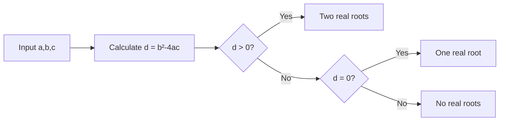

**મેમરી ટ્રીક:** "QDR - Quadratic Discriminant Roots"

## પ્રશ્ન 2(ક OR) [7 ગુણ]

**લોજીકલ અને બીટ-વાઈસ ઓપરેટરો ઉદાહરણ સાથે સમજાવો.**

**જવાબ**:

| પ્રકાર | ઓપરેટર્સ | ઉદાહરણ | પરિણામ |
|------|-----------|---------|--------|
| **લોજીકલ ઓપરેટર્સ** | | | |
| લોજીકલ AND | && | (5>3) && (4<7) | 1 (સાચું) |
| લોજીકલ OR | \|\| | (5<3) \|\| (4<7) | 1 (સાચું) |
| લોજીકલ NOT | ! | !(5>3) | 0 (ખોટું) |
| **બિટવાઈઝ ઓપરેટર્સ** | | | |
| બિટવાઈઝ AND | & | 5 & 3 (101 & 011) | 1 (001) |
| બિટવાઈઝ OR | \| | 5 \| 3 (101 \| 011) | 7 (111) |
| બિટવાઈઝ XOR | ^ | 5 ^ 3 (101 ^ 011) | 6 (110) |
| બિટવાઈઝ NOT | ~ | ~5 (~ 00000101) | -6 (11111010) |
| લેફ્ટ શિફ્ટ | << | 5 << 1 (101 << 1) | 10 (1010) |
| રાઈટ શિફ્ટ | >> | 5 >> 1 (101 >> 1) | 2 (10) |

**મેમરી ટ્રીક:** "LAND BORNS - Logical AND OR NOT, Bitwise OR AND NOT Shift"

## પ્રશ્ન 3(અ) [3 ગુણ]

**'go to' સ્ટેટમેન્ટનો ઉપયોગ ઉદાહરણ સાથે સમજાવો.**

**જવાબ**:

`goto` સ્ટેટમેન્ટ પ્રોગ્રામમાં લેબલ કરેલા સ્ટેટમેન્ટ પર બિનશરતી જમ્પની મંજૂરી આપે છે.

```c
#include <stdio.h>

int main() {
    int i = 0;
    
start:
    printf("%d ", i);
    i++;
    if (i < 5)
        goto start;
    
    return 0;
}
// આઉટપુટ: 0 1 2 3 4
```

**આકૃતિ:**

```goat
     ┌─────────┐
     │ Start   │
     └────┬────┘
          │
          ▼
┌─────────────────┐
│  print(i)       │
│  i++            │
└────────┬────────┘
         │
         ▼
     ┌────────┐    Yes
     │ i < 5? ├───────┐
     └────┬───┘       │
          │No         │
          ▼           │
     ┌────────┐       │
     │  End   │       │
     └────────┘       │
                      │
     ┌────────────────┘
     │   
     ▼   
  goto start
```

**મેમરી ટ્રીક:** "JUMP - Just Unconditionally Move Program-counter"

## પ્રશ્ન 3(બ) [4 ગુણ]

**લીધેલ નંબર એકી છે કે બેકી તે તપાસવા માટેનો C પ્રોગ્રામ લખો.**

**જવાબ**:

```c
#include <stdio.h>

int main() {
    int num;
    
    printf("Enter a number: ");
    scanf("%d", &num);
    
    if (num % 2 == 0)
        printf("%d is even", num);
    else
        printf("%d is odd", num);
        
    return 0;
}
```

**આકૃતિ:**

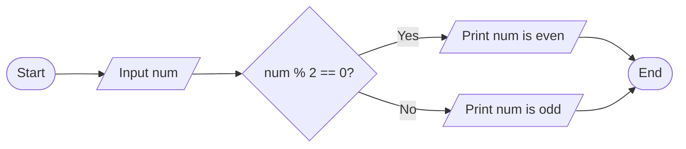

**મેમરી ટ્રીક:** "MODE - Modulo Odd-Even Determination"

## પ્રશ્ન 3(ક) [7 ગુણ]

**else if ladder ફ્લોચાર્ટ દોરી ઉદાહરણ સાથે સમજાવો.**

**જવાબ**:

else-if લેડર કધામ શરતોને ક્રમમાં ચકાસવાની મંજૂરી આપે છે, પ્રથમ સાચી શરત સાથે જોડાયેલા બ્લોકને એક્ઝીક્યુટ કરે છે.

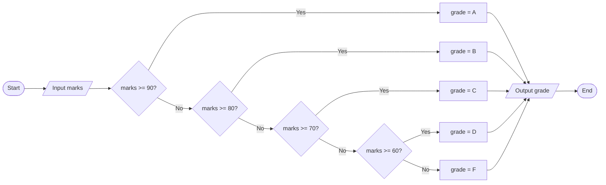

```c
#include <stdio.h>

int main() {
    int marks;
    char grade;
    
    printf("Enter marks: ");
    scanf("%d", &marks);
    
    if (marks >= 90)
        grade = 'A';
    else if (marks >= 80)
        grade = 'B';
    else if (marks >= 70)
        grade = 'C';
    else if (marks >= 60)
        grade = 'D';
    else
        grade = 'F';
        
    printf("Grade: %c", grade);
    
    return 0;
}
```

- **એકાધિક શરતો**: ક્રમાનુસાર શરતો તપાસે છે
- **પ્રથમ મિલાન**: માત્ર પ્રથમ સાચી શરત માટે કોડ એક્ઝિક્યુટ કરે છે
- **ડિફોલ્ટ કેસ**: છેલ્લો else બાકીના બધા કેસને સંભાળે છે

**મેમરી ટ્રીક:** "CAFE - Condition Assess First Eligible"

## પ્રશ્ન 3(અ OR) [3 ગુણ]

**continue અને break સ્ટેટમેન્ટનો ઉપયોગ સમજાવો.**

**જવાબ**:

| સ્ટેટમેન્ટ | હેતુ | અસર |
|-----------|---------|--------|
| break | લૂપ અથવા સ્વિચમાંથી બહાર નીકળવું | તરત જ સમગ્ર લૂપ છોડી દે છે |
| continue | વર્તમાન પુનરાવર્તન છોડવું | લૂપના આગલા પુનરાવર્તન પર જાય છે |

```c
// break ઉદાહરણ
for(int i=1; i<=10; i++) {
    if(i == 6)
        break;      // i=6 થાય ત્યારે લૂપમાંથી બહાર નીકળે છે
    printf("%d ", i); // આઉટપુટ: 1 2 3 4 5
}

// continue ઉદાહરણ
for(int i=1; i<=10; i++) {
    if(i % 2 == 0)
        continue;   // બેકી સંખ્યાઓ છોડે છે
    printf("%d ", i); // આઉટપુટ: 1 3 5 7 9
}
```

**આકૃતિ:**

```goat
  break                        continue
┌─────────┐                   ┌─────────┐
│ Loop    │                   │ Loop    │
│ ┌─────┐ │                   │ ┌─────┐ │
│ │  1  │ │                   │ │  1  │ │
│ └─────┘ │                   │ └─────┘ │
│ ┌─────┐ │                   │ ┌─────┐ │
│ │  2  │ │◄───┐              │ │  2  │ │◄───┐
│ └─────┘ │    │              │ └─────┘ │    │
│ ┌─────┐ │    │ break        │ ┌─────┐ │    │ continue 
│ │  3  ├─┘    │              │ │  3  ├─┘    │
│ └─────┘      │              │ └─────┘      │
└─────────────┐│              └───────┬──────┘
 Exit Loop    ││               Next   │
              ┘│             Iteration│
               └──────────────────────┘
```

**મેમરી ટ્રીક:** "BEST - Break Exits, Skip with conTinue"

## પ્રશ્ન 3(બ OR) [4 ગુણ]

**૧ થી ૧૦ નંબરનો સરવાળો પ્રિન્ટ કરવા માટેનો C પ્રોગ્રામ ફોર લૂપનો ઉપયોગ કરીને લખો.**

**જવાબ**:

```c
#include <stdio.h>

int main() {
    int i, sum = 0;
    
    for(i = 1; i <= 10; i++) {
        sum += i;
    }
    
    printf("Sum of numbers from 1 to 10: %d", sum);
    
    return 0;
}
```

**આકૃતિ:**

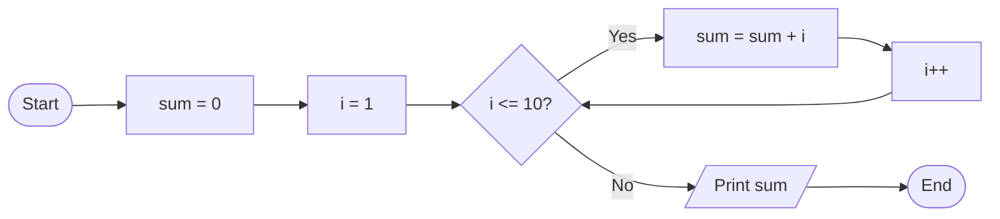

**મેમરી ટ્રીક:** "SILA - Sum Increment Loop Add"

## પ્રશ્ન 3(ક OR) [7 ગુણ]

**સ્વીચ સ્ટેટમેન્ટ ફ્લોચાર્ટ દોરી ઉદાહરણ સાથે સમજાવો.**

**જવાબ**:

સ્વિચ સ્ટેટમેન્ટ વેરિએબલની વેલ્યુના આધારે એકાધિક વિકલ્પોમાંથી એક કોડ બ્લોક પસંદ કરે છે.

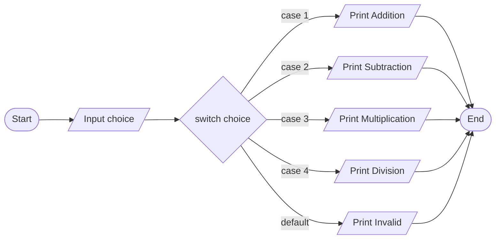

```c
#include <stdio.h>

int main() {
    int choice;
    
    printf("Enter operation (1-4): ");
    scanf("%d", &choice);
    
    switch(choice) {
        case 1:
            printf("Addition selected");
            break;
        case 2:
            printf("Subtraction selected");
            break;
        case 3:
            printf("Multiplication selected");
            break;
        case 4:
            printf("Division selected");
            break;
        default:
            printf("Invalid choice");
    }
    
    return 0;
}
```

- **એક્સપ્રેશન**: ઇન્ટિજર અથવા કેરેક્ટર એક્સપ્રેશન લે છે
- **કેસ લેબલ્સ**: કોન્સ્ટન્ટ એક્સપ્રેશન હોવા જોઈએ
- **બ્રેક સ્ટેટમેન્ટ**: આગલા કેસમાં પ્રવેશ થતો અટકાવે છે
- **ડિફોલ્ટ**: કોઈપણ કેસ મેચ ન થાય તો હેન્ડલ કરે છે

**મેમરી ટ્રીક:** "SCBD - Switch Cases Break Default"

## પ્રશ્ન 4(અ) [3 ગુણ]

**મોટા કેપિટલ મૂળાક્ષરોને નાના મૂળાક્ષરોમાં રૂપાંતર કરવા માટેનો C પ્રોગ્રામ લખો.**

**જવાબ**:

```c
#include <stdio.h>

int main() {
    char upper, lower;
    
    printf("Enter uppercase letter: ");
    scanf("%c", &upper);
    
    lower = upper + 32;
    // વૈકલ્પિક: lower = tolower(upper);
    
    printf("Lowercase letter: %c", lower);
    
    return 0;
}
```

**આકૃતિ:**

```goat
┌─────────────┐
│ Input 'A'   │
└──────┬──────┘
       │
       ▼
┌─────────────┐
│ ASCII code  │
│     65      │
└──────┬──────┘
       │ +32
       ▼
┌─────────────┐
│ ASCII code  │
│     97      │
└──────┬──────┘
       │
       ▼
┌─────────────┐
│ Output 'a'  │
└─────────────┘
```

**મેમરી ટ્રીક:** "ASCII-32 - Add 32 to Shift Characters Into Lowercase"

## પ્રશ્ન 4(બ) [4 ગુણ]

**પોઈન્ટર એટલે શું? ઉદાહરણ સાથે સમજાવો.**

**જવાબ**:

પોઇન્ટર એ એક વેરિએબલ છે જે અન્ય વેરિએબલના મેમરી એડ્રેસને સ્ટોર કરે છે.

| કોન્સેપ્ટ | સિન્ટેક્સ | વિગત |
|---------|--------|-------------|
| ડેક્લેરેશન | `int *p;` | ઇન્ટ પ્રકારનો પોઇન્ટર p ડિક્લેર કરે છે |
| ઇનિશિયલાઇઝેશન | `p = &var;` | var નું એડ્રેસ p માં સ્ટોર કરે છે |
| ડિરેફરન્સિંગ | `*p = 10;` | પોઇન્ટ થયેલી વેલ્યુને એક્સેસ/મોડિફાય કરે છે |
| પોઇન્ટર એરિથમેટિક | `p++` | આગલા મેમરી લોકેશન પર જાય છે |

```c
#include <stdio.h>

int main() {
    int num = 10;
    int *ptr;
    
    ptr = &num;  // num નું એડ્રેસ ptr માં સ્ટોર કરે છે
    
    printf("Value of num: %d\n", num);
    printf("Address of num: %p\n", &num);
    printf("Value of ptr: %p\n", ptr);
    printf("Value pointed by ptr: %d\n", *ptr);
    
    *ptr = 20;  // પોઇન્ટર દ્વારા વેલ્યુ બદલે છે
    printf("New value of num: %d\n", num);
    
    return 0;
}
```

**આકૃતિ:**

```goat
Memory:
┌─────────────┐
│    num      │ 1000  ┌───────────┐
│    (10)     │◄──────┤   *ptr    │ 2000
└─────────────┘       │  (1000)   │
                      └───────────┘
```

**મેમરી ટ્રીક:** "SAID - Store Address to Indirectly Dereference"

## પ્રશ્ન 4(ક) [7 ગુણ]

**ફોર લૂપ ફ્લોચાર્ટ દોરી ઉદાહરણ સાથે સમજાવો.**

**જવાબ**:

ફોર લૂપનો ઉપયોગ કોડના બ્લોકને નિર્દિષ્ટ સંખ્યામાં વાર રિપીટ કરવા માટે થાય છે.

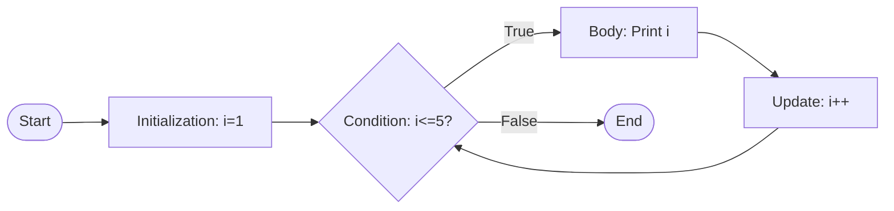

```c
#include <stdio.h>

int main() {
    int i;
    
    // સિન્ટેક્સ: for(initialization; condition; update)
    for(i = 1; i <= 5; i++) {
        printf("%d ", i);
    }
    // આઉટપુટ: 1 2 3 4 5
    
    return 0;
}
```

- **ઇનિશિયલાઇઝેશન**: લૂપ શરૂ થતાં પહેલાં એક વાર એક્ઝિક્યુટ થાય છે
- **કન્ડિશન**: દરેક પુનરાવર્તન પહેલાં ચેક થાય છે
- **અપડેટ**: દરેક પુનરાવર્તન પછી એક્ઝિક્યુટ થાય છે
- **બોડી**: કોડ બ્લોક જે રિપીટ થાય છે

**મેમરી ટ્રીક:** "ICU-B - Initialize, Check, Update, Body"

## પ્રશ્ન 4(અ OR) [3 ગુણ]

**ત્રિકોણનું ક્ષેત્રફળ (૧/૨ * પાયો * ઉંચાઈ) શોધવા માટેનો C પ્રોગ્રામ લખો.**

**જવાબ**:

```c
#include <stdio.h>

int main() {
    float base, height, area;
    
    printf("Enter base of triangle: ");
    scanf("%f", &base);
    
    printf("Enter height of triangle: ");
    scanf("%f", &height);
    
    area = 0.5 * base * height;
    
    printf("Area of triangle: %.2f", area);
    
    return 0;
}
```

**આકૃતિ:**

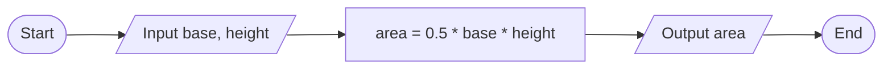

**મેમરી ટ્રીક:** "BHA - Base times Height divided by two equals Area"

## પ્રશ્ન 4(બ OR) [4 ગુણ]

**પોઈન્ટરનું ડીકલેરેશન અને ઈનીશ્યલાઈઝેશન સમજાવો.**

**જવાબ**:

| ઓપરેશન | સિન્ટેક્સ | ઉદાહરણ | વિગત |
|-----------|--------|---------|-------------|
| ડેક્લેરેશન | datatype *pointer_name; | `int *ptr;` | પોઇન્ટર વેરિએબલ બનાવે છે |
| ઇનિશિયલાઇઝેશન | pointer_name = &variable; | `ptr = &num;` | પોઇન્ટરને એડ્રેસ સોંપે છે |
| કોમ્બાઇન્ડ | datatype *pointer_name = &variable; | `int *ptr = &num;` | ડેક્લેરેશન સાથે ઇનિશિયલાઇઝેશન |
| NULL પોઇન્ટર | pointer_name = NULL; | `ptr = NULL;` | જ્યારે એડ્રેસ ઉપલબ્ધ ન હોય ત્યારે સુરક્ષિત ઇનિશિયલાઇઝેશન |

```c
#include <stdio.h>

int main() {
    int num = 10;           // સામાન્ય વેરિએબલ
    int *ptr1;              // માત્ર ડેક્લેરેશન
    int *ptr2 = &num;       // ડેક્લેરેશન સાથે ઇનિશિયલાઇઝેશન
    
    ptr1 = &num;            // ptr1 નું ઇનિશિયલાઇઝેશન
    
    printf("num value: %d\n", num);
    printf("num address: %p\n", &num);
    printf("ptr1 value: %p\n", ptr1);
    printf("ptr2 value: %p\n", ptr2);
    printf("Value via ptr1: %d\n", *ptr1);
    printf("Value via ptr2: %d\n", *ptr2);
    
    return 0;
}
```

**આકૃતિ:**

```goat
Pointer Declaration:
┌───────────┐
│ int *ptr; │
└───────────┘

Pointer Initialization:
┌─────────────┐       ┌──────────┐
│ ptr = &num; │  →    │ num (10) │
└─────────────┘       └──────────┘
```

**મેમરી ટ્રીક:** "PAIN - Pointer Allocate, Initialize, Navigate"

## પ્રશ્ન 4(ક OR) [7 ગુણ]

**વાઇલ લૂપ ફ્લોચાર્ટ દોરી ઉદાહરણ સાથે સમજાવો.**

**જવાબ**:

વાઇલ લૂપ એક સ્પષ્ટ કરેલી શરત જ્યાં સુધી સાચી હોય ત્યાં સુધી કોડના બ્લોકને રિપીટ કરે છે.

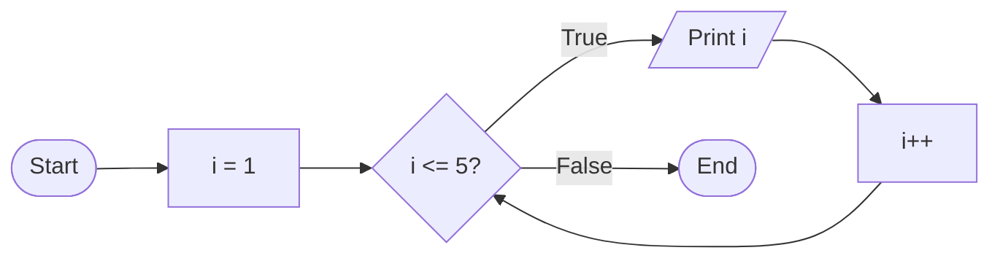

```c
#include <stdio.h>

int main() {
    int i = 1;
    
    // સિન્ટેક્સ: while(condition) { body }
    while(i <= 5) {
        printf("%d ", i);
        i++;
    }
    // આઉટપુટ: 1 2 3 4 5
    
    return 0;
}
```

- **ઇનિશિયલાઇઝેશન**: લૂપ પહેલાં કરવું જરૂરી છે
- **કન્ડિશન**: દરેક પુનરાવર્તનની શરૂઆતમાં મૂલ્યાંકન થાય છે
- **બોડી**: માત્ર જો શરત સાચી હોય તો જ એક્ઝિક્યુટ થાય છે
- **અપડેટ**: લૂપ બોડીની અંદર હોવું જોઈએ

**મેમરી ટ્રીક:** "CUBE - Condition check, Update inside Body, Exit when false"

## પ્રશ્ન 5(અ) [3 ગુણ]

**બુકની આપેલ માહિતી સ્ટોર કરવાનું સ્ટ્રક્ચર બનાવો: book_no, book_title, book_author, book_price**

**જવાબ**:

```c
#include <stdio.h>
#include <string.h>

struct Book {
    int book_no;
    char book_title[50];
    char book_author[50];
    float book_price;
};

int main() {
    struct Book book1;
    
    book1.book_no = 101;
    strcpy(book1.book_title, "Programming in C");
    strcpy(book1.book_author, "Dennis Ritchie");
    book1.book_price = 450.50;
    
    printf("Book No: %d\n", book1.book_no);
    printf("Title: %s\n", book1.book_title);
    printf("Author: %s\n", book1.book_author);
    printf("Price: %.2f", book1.book_price);
    
    return 0;
}
```

**આકૃતિ:**

```goat
struct Book
┌───────────────────────────────┐
│ book_no      (int)            │
├───────────────────────────────┤
│ book_title   (char[50])       │
├───────────────────────────────┤
│ book_author  (char[50])       │
├───────────────────────────────┤
│ book_price   (float)          │
└───────────────────────────────┘
```

**મેમરી ટ્રીક:** "SNAP - Structure Needs All Properties"

## પ્રશ્ન 5(બ) [4 ગુણ]

**(1)sqrt() (2)pow() (3)strlen() (4)strcpy() ફંક્શનો ઉદાહરણ સાથે સમજાવો.**

**જવાબ**:

| ફંક્શન | લાઇબ્રેરી | હેતુ | ઉદાહરણ |
|----------|---------|---------|---------|
| sqrt() | math.h | વર્ગમૂળ ગણે છે | `sqrt(16)` આઉટપુટ `4.0` |
| pow() | math.h | પાવર ગણે છે | `pow(2, 3)` આઉટપુટ `8.0` |
| strlen() | string.h | સ્ટ્રિંગની લંબાઈ શોધે છે | `strlen("hello")` આઉટપુટ `5` |
| strcpy() | string.h | સ્ટ્રિંગની કોપી કરે છે | `strcpy(dest, "hello")` dest માં "hello" કોપી કરે છે |

```c
#include <stdio.h>
#include <math.h>
#include <string.h>

int main() {
    double sqrtResult = sqrt(25);
    double powResult = pow(2, 4);
    char str[] = "Programming";
    char dest[20];
    int length = strlen(str);
    
    strcpy(dest, str);
    
    printf("sqrt(25) = %.2f\n", sqrtResult);
    printf("pow(2, 4) = %.2f\n", powResult);
    printf("Length of '%s' = %d\n", str, length);
    printf("Copied string: %s\n", dest);
    
    return 0;
}
```

**મેમરી ટ્રીક:** "SPSS - Square-root Power String-length String-copy"

## પ્રશ્ન 5(ક) [7 ગુણ]

**એરે અને એરેનું ઈનીશ્યલાઈઝેશન ઉદાહરણ સાથે સમજાવો.**

**જવાબ**:

એરે એ સમાન ડેટા એલિમેન્ટ્સનો સમૂહ છે જે સતત મેમરી લોકેશન પર સ્ટોર થાય છે.

| પદ્ધતિ | સિન્ટેક્સ | ઉદાહરણ |
|--------|--------|---------|
| ડેક્લેરેશન | `data_type array_name[size];` | `int marks[5];` |
| ડેક્લેરેશન સમયે ઇનિશિયલાઇઝેશન | `data_type array_name[size] = {values};` | `int marks[5] = {95, 80, 85, 75, 90};` |
| વ્યક્તિગત એલિમેન્ટ | `array_name[index] = value;` | `marks[0] = 95;` |
| આંશિક ઇનિશિયલાઇઝેશન | `int arr[5] = {1, 2};` | બાકીના એલિમેન્ટ્સ 0 હોય છે |
| સાઇઝ વગર | `int arr[] = {1, 2, 3};` | સાઇઝ એલિમેન્ટ્સ દ્વારા નક્કી થાય છે |

```c
#include <stdio.h>

int main() {
    // એરે ડેક્લેરેશન અને ઇનિશિયલાઇઝેશન
    int numbers[5] = {10, 20, 30, 40, 50};
    
    // એરે એલિમેન્ટ્સ એક્સેસ કરવા
    printf("First element: %d\n", numbers[0]);
    printf("Third element: %d\n", numbers[2]);
    
    // એરે એલિમેન્ટ બદલવી
    numbers[1] = 25;
    
    // બધા એલિમેન્ટ્સ પ્રિન્ટ કરવા
    printf("Array elements: ");
    for(int i = 0; i < 5; i++) {
        printf("%d ", numbers[i]);
    }
    
    return 0;
}
```

**આકૃતિ:**

```goat
Array in memory:
┌────┬────┬────┬────┬────┐
│ 10 │ 20 │ 30 │ 40 │ 50 │
└────┴────┴────┴────┴────┘
   0    1    2    3    4  ← indices
```

**મેમરી ટ્રીક:** "CASED - Contiguous Arrangement of Similar Elements with Direct-access"

## પ્રશ્ન 5(અ OR) [3 ગુણ]

**એરે અને સ્ટ્રક્ચર નો તફાવત લખો.**

**જવાબ**:

| ફીચર | એરે | સ્ટ્રક્ચર |
|---------|-------|-----------|
| ડેટા ટાઈપ્સ | માત્ર એક જ ડેટા ટાઈપ | અલગ અલગ ડેટા ટાઈપ્સ મંજૂર |
| એક્સેસ | ઇન્ડેક્સ દ્વારા: `arr[0]` | ડોટ ઓપરેટર દ્વારા: `emp.id` |
| મેમરી | સતત ફાળવણી | સતત ન પણ હોઈ શકે |
| સાઇઝ | ડેક્લેરેશન સમયે ફિક્સ્ડ | સભ્યોના સાઇઝનો સરવાળો |
| ઇનિશિયલાઇઝેશન | `int arr[3] = {1,2,3};` | `struct emp e = {101,"John",5000};` |
| હેતુ | સમાન આઇટમ્સનો સંગ્રહ | સંબંધિત આઇટમ્સનો સંગ્રહ |

**આકૃતિ:**

```goat
Array:                  Structure:
┌───┬───┬───┐           ┌───────────────┐
│ 1 │ 2 │ 3 │           │ id: 101       │
└───┴───┴───┘           ├───────────────┤
  int  int int          │ name: "John"  │
                        ├───────────────┤
                        │ salary: 5000.0│
                        └───────────────┘
                          int  char[]  float
```

**મેમરી ટ્રીક:** "HASDIP - Homogeneous vs. Assorted, Same vs. Different, Index vs. Point"

## પ્રશ્ન 5(બ OR) [4 ગુણ]

**યુઝર ડીફાઈન ફંક્શન એટલે શું? ઉદાહરણ સાથે સમજાવો.**

**જવાબ**:

યુઝર-ડિફાઇન્ડ ફંક્શન એ એક કોડ બ્લોક છે જે ચોક્કસ કાર્ય કરે છે, પ્રોગ્રામર દ્વારા કોડને ફરીથી ઉપયોગ કરવા અને વ્યવસ્થિત કરવા માટે બનાવવામાં આવે છે.

| કોમ્પોનન્ટ | વિગત | ઉદાહરણ |
|-----------|-------------|---------|
| રિટર્ન ટાઇપ | ફંક્શન દ્વારા પરત કરવામાં આવતા ડેટાનો પ્રકાર | `int`, `void`, વગેરે |
| ફંક્શન નામ | ફંક્શન માટેનું આઇડેન્ટિફાયર | `sum`, `findMax` |
| પેરામીટર્સ | કૌંસમાં ઇનપુટ વેલ્યુઝ | `(int a, int b)` |
| ફંક્શન બોડી | કર્લી બ્રેસિસ અંદરનો કોડ | `{ return a+b; }` |

```c
#include <stdio.h>

// ફંક્શન ડેક્લેરેશન
int sum(int a, int b);

int main() {
    int num1 = 5, num2 = 10;
    int result;
    
    // ફંક્શન કોલ
    result = sum(num1, num2);
    
    printf("Sum = %d", result);
    
    return 0;
}

// ફંક્શન ડેફિનિશન
int sum(int a, int b) {
    return a + b;
}
```

**આકૃતિ:**

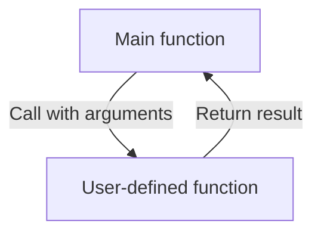

**મેમરી ટ્રીક:** "CRPB - Create, Return, Pass, Body"

## પ્રશ્ન 5(ક OR) [7 ગુણ]

**એરેના ઘટકોનો સરવાળો અને સરેરાશ શોધવા માટેનો C પ્રોગ્રામ લખો.**

**જવાબ**:

```c
#include <stdio.h>

int main() {
    int arr[100], n, i;
    int sum = 0;
    float avg;
    
    printf("Enter number of elements: ");
    scanf("%d", &n);
    
    printf("Enter %d elements:\n", n);
    for(i = 0; i < n; i++) {
        scanf("%d", &arr[i]);
        sum += arr[i];  // દરેક એલિમેન્ટને સરવાળામાં ઉમેરો
    }
    
    avg = (float)sum / n;  // સરેરાશની ગણતરી
    
    printf("Sum of array elements: %d\n", sum);
    printf("Average of array elements: %.2f", avg);
    
    return 0;
}
```

**આકૃતિ:**

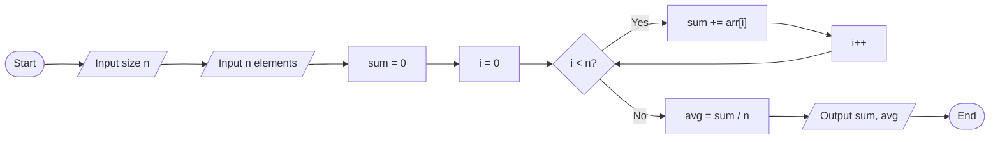

| પગલું | ઓપરેશન | ઉદાહરણ (એરે [5,10,15,20] માટે) |
|------|-----------|----------------------------------|
| 1 | ઇનપુટ એરે | [5,10,15,20] |
| 2 | sum = 0 ઇનિશિયલાઇઝ | sum = 0 |
| 3 | દરેક એલિમેન્ટ ઉમેરો | sum = 0+5+10+15+20 = 50 |
| 4 | સંખ્યા વડે વિભાજીત કરો | avg = 50/4 = 12.5 |

**મેમરી ટ્રીક:** "LISA - Loop, Increment, Sum, Average"
