## Question 1(a) [3 marks]

**List basic data types of C language with their range**

**Answer**:

| Data Type | Size (bytes) | Range |
|-----------|--------------|-------|
| char | 1 | -128 to 127 |
| int | 2 or 4 | -32,768 to 32,767 (2 bytes) or -2,147,483,648 to 2,147,483,647 (4 bytes) |
| float | 4 | 3.4E-38 to 3.4E+38 |
| double | 8 | 1.7E-308 to 1.7E+308 |

**Mnemonic:** "CIFD - Computer Is Fundamentally Digital"

## Question 1(b) [4 marks]

**Explain rules for naming a variable.**

**Answer**:

| Rule | Example |
|------|---------|
| Must start with letter or underscore | valid: _count, name / invalid: 1score |
| Can contain letters, digits, underscores | valid: user_1 / invalid: user-1 |
| Cannot use keywords | valid: integer / invalid: int |
| Case sensitive | total and TOTAL are different |

**Diagram:**

```goat
┌───────────────────────────────┐
│ Variable Naming Rules         │
├───────────────────────────────┤
│ [A-Z, a-z, _] → [A-Z, a-z, 0-9, _]* │
└───────────────────────────────┘
```

**Mnemonic:** "LUCK - Letters Underscore Case Keywords"

## Question 1(c) [7 marks]

**Define flowchart. Draw flowchart to find minimum of two integer numbers N1 and N2.**

**Answer**:

A flowchart is a graphical representation of an algorithm showing the sequence of steps using standard symbols connected by arrows.

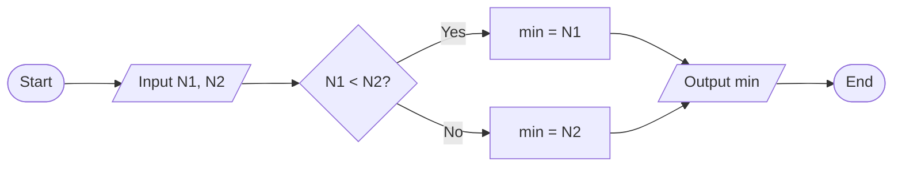

- **Flowchart symbols**: Visual representation of logical steps
- **Decision diamond**: Tests condition to determine flow path
- **Process boxes**: Contain calculations or operations

**Mnemonic:** "FAST - Flow Analysis Shown Through-charts"

## Question 1(c OR) [7 marks]

**Define algorithm. Write an algorithm to calculate area and circumference of circle.**

**Answer**:

An algorithm is a step-by-step procedure to solve a particular problem in a finite sequence of well-defined instructions.

**Algorithm for circle calculations:**

```
1. START
2. Input radius r
3. Calculate area = π * r * r
4. Calculate circumference = 2 * π * r
5. Output area, circumference
6. STOP
```

| Step | Operation | Formula |
|------|-----------|---------|
| 1 | Get radius | Input r |
| 2 | Calculate area | A = π × r² |
| 3 | Calculate circumference | C = 2 × π × r |
| 4 | Display results | Output A, C |

**Mnemonic:** "SICS - Steps In Clear Sequence"

## Question 2(a) [3 marks]

**Differentiate printf() and scanf().**

**Answer**:

| Feature | printf() | scanf() |
|---------|----------|---------|
| Purpose | Outputs data to screen | Inputs data from keyboard |
| Format | printf("format", variables) | scanf("format", &variables) |
| Returns | Number of chars printed | Number of items successfully read |
| Addressing | Uses variable names | Uses address of variables (&var) |

**Mnemonic:** "IO-AR - Input Output-Address Returns"

## Question 2(b) [4 marks]

**Develop a C program to find maximum among two numbers using conditional operator.**

**Answer**:

```c
#include <stdio.h>

int main() {
    int num1, num2, max;
    
    printf("Enter two numbers: ");
    scanf("%d %d", &num1, &num2);
    
    max = (num1 > num2) ? num1 : num2;
    
    printf("Maximum number is: %d", max);
    
    return 0;
}
```

**Diagram:**

```goat
┌─────────────┐     ┌─────────────┐      ┌─────────────┐
│ Input       │────>│ Condition   │─────>│ Output      │
│ num1, num2  │     │ num1 > num2?│      │ max         │
└─────────────┘     └─────────────┘      └─────────────┘
```

**Mnemonic:** "CTO - Condition Then Output"

## Question 2(c) [7 marks]

**Explain arithmetic & relational operators with examples.**

**Answer**:

| Type | Operators | Example | Result |
|------|-----------|---------|--------|
| **Arithmetic Operators** | | | |
| Addition | + | 5 + 3 | 8 |
| Subtraction | - | 5 - 3 | 2 |
| Multiplication | * | 5 * 3 | 15 |
| Division | / | 5 / 3 | 1 (integer division) |
| Modulus | % | 5 % 3 | 2 (remainder) |
| **Relational Operators** | | | |
| Equal to | == | 5 == 3 | 0 (false) |
| Not equal to | != | 5 != 3 | 1 (true) |
| Greater than | > | 5 > 3 | 1 (true) |
| Less than | < | 5 < 3 | 0 (false) |
| Greater than or equal | >= | 5 >= 5 | 1 (true) |
| Less than or equal | <= | 5 <= 3 | 0 (false) |

**Mnemonic:** "ASMDCRO - Add Subtract Multiply Divide Compare Return Output"

## Question 2(a OR) [3 marks]

**Considering precedence of operators, write down each step of evaluation and final answer if expression (25/3) * 4 – 10 % 3 + 9/2 is evaluated.**

**Answer**:

| Step | Operation | Calculation | Result |
|------|-----------|-------------|--------|
| 1 | Parentheses (25/3) | 25/3 = 8 (integer division) | 8 |
| 2 | Modulus 10 % 3 | 10 % 3 = 1 | 1 |
| 3 | Division 9/2 | 9/2 = 4 (integer division) | 4 |
| 4 | Multiplication 8 * 4 | 8 * 4 = 32 | 32 |
| 5 | Subtraction 32 - 1 | 32 - 1 = 31 | 31 |
| 6 | Addition 31 + 4 | 31 + 4 = 35 | 35 |

Final answer = 35

**Mnemonic:** "PEMDAS - Parentheses, Exponents, Multiplication/Division, Addition/Subtraction"

## Question 2(b OR) [4 marks]

**Develop a C program to find roots of an algebraic equation**

**Answer**:

```c
#include <stdio.h>
#include <math.h>

int main() {
    float a, b, c;
    float discriminant, root1, root2;
    
    printf("Enter coefficients a, b, c: ");
    scanf("%f %f %f", &a, &b, &c);
    
    discriminant = b*b - 4*a*c;
    
    if (discriminant > 0) {
        root1 = (-b + sqrt(discriminant)) / (2*a);
        root2 = (-b - sqrt(discriminant)) / (2*a);
        printf("Roots: %.2f and %.2f", root1, root2);
    } else if (discriminant == 0) {
        root1 = -b / (2*a);
        printf("Root: %.2f", root1);
    } else {
        printf("No real roots");
    }
    
    return 0;
}
```

**Diagram:**

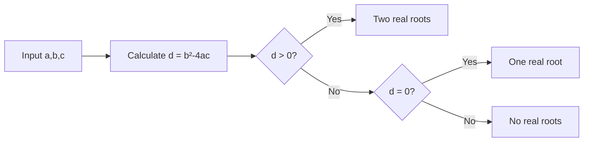

**Mnemonic:** "QDR - Quadratic Discriminant Roots"

## Question 2(c OR) [7 marks]

**Explain logical & bit-wise operators with examples.**

**Answer**:

| Type | Operators | Example | Result |
|------|-----------|---------|--------|
| **Logical Operators** | | | |
| Logical AND | && | (5>3) && (4<7) | 1 (true) |
| Logical OR | \|\| | (5<3) \|\| (4<7) | 1 (true) |
| Logical NOT | ! | !(5>3) | 0 (false) |
| **Bitwise Operators** | | | |
| Bitwise AND | & | 5 & 3 (101 & 011) | 1 (001) |
| Bitwise OR | \| | 5 \| 3 (101 \| 011) | 7 (111) |
| Bitwise XOR | ^ | 5 ^ 3 (101 ^ 011) | 6 (110) |
| Bitwise NOT | ~ | ~5 (~ 00000101) | -6 (11111010) |
| Left Shift | << | 5 << 1 (101 << 1) | 10 (1010) |
| Right Shift | >> | 5 >> 1 (101 >> 1) | 2 (10) |

**Mnemonic:** "LAND BORNS - Logical AND OR NOT, Bitwise OR AND NOT Shift"

## Question 3(a) [3 marks]

**Explain the use of 'go to' statement with example**

**Answer**:

The `goto` statement allows unconditional jump to a labeled statement in the program.

```c
#include <stdio.h>

int main() {
    int i = 0;
    
start:
    printf("%d ", i);
    i++;
    if (i < 5)
        goto start;
    
    return 0;
}
// Output: 0 1 2 3 4
```

**Diagram:**

```goat
     ┌─────────┐
     │ Start   │
     └────┬────┘
          │
          ▼
┌─────────────────┐
│  print(i)       │
│  i++            │
└────────┬────────┘
         │
         ▼
     ┌────────┐    Yes
     │ i < 5? ├───────┐
     └────┬───┘       │
          │No         │
          ▼           │
     ┌────────┐       │
     │  End   │       │
     └────────┘       │
                      │
     ┌────────────────┘
     │   
     ▼   
  goto start
```

**Mnemonic:** "JUMP - Just Unconditionally Move Program-counter"

## Question 3(b) [4 marks]

**Develop a C program to check whether the entered number is even or odd.**

**Answer**:

```c
#include <stdio.h>

int main() {
    int num;
    
    printf("Enter a number: ");
    scanf("%d", &num);
    
    if (num % 2 == 0)
        printf("%d is even", num);
    else
        printf("%d is odd", num);
        
    return 0;
}
```

**Diagram:**

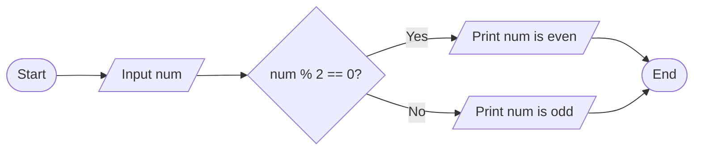

**Mnemonic:** "MODE - Modulo Odd-Even Determination"

## Question 3(c) [7 marks]

**Draw flowchart and explain else if ladder with example.**

**Answer**:

The else-if ladder allows checking multiple conditions in sequence, executing the block associated with the first true condition.

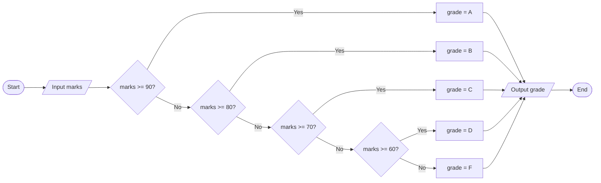

```c
#include <stdio.h>

int main() {
    int marks;
    char grade;
    
    printf("Enter marks: ");
    scanf("%d", &marks);
    
    if (marks >= 90)
        grade = 'A';
    else if (marks >= 80)
        grade = 'B';
    else if (marks >= 70)
        grade = 'C';
    else if (marks >= 60)
        grade = 'D';
    else
        grade = 'F';
        
    printf("Grade: %c", grade);
    
    return 0;
}
```

- **Multiple conditions**: Checks conditions sequentially
- **First match**: Only executes code for first true condition
- **Default case**: Final else handles all remaining cases

**Mnemonic:** "CAFE - Condition Assess First Eligible"

## Question 3(a OR) [3 marks]

**Explain the use of continue and break statement.**

**Answer**:

| Statement | Purpose | Effect |
|-----------|---------|--------|
| break | Exit a loop or switch | Terminates entire loop immediately |
| continue | Skip current iteration | Jumps to next iteration of loop |

```c
// break example
for(int i=1; i<=10; i++) {
    if(i == 6)
        break;      // Exits loop when i=6
    printf("%d ", i); // Output: 1 2 3 4 5
}

// continue example
for(int i=1; i<=10; i++) {
    if(i % 2 == 0)
        continue;   // Skips even numbers
    printf("%d ", i); // Output: 1 3 5 7 9
}
```

**Diagram:**

```goat
  break                        continue
┌─────────┐                   ┌─────────┐
│ Loop    │                   │ Loop    │
│ ┌─────┐ │                   │ ┌─────┐ │
│ │  1  │ │                   │ │  1  │ │
│ └─────┘ │                   │ └─────┘ │
│ ┌─────┐ │                   │ ┌─────┐ │
│ │  2  │ │◄───┐              │ │  2  │ │◄───┐
│ └─────┘ │    │              │ └─────┘ │    │
│ ┌─────┐ │    │ break        │ ┌─────┐ │    │ continue 
│ │  3  ├─┘    │              │ │  3  ├─┘    │
│ └─────┘      │              │ └─────┘      │
└─────────────┐│              └───────┬──────┘
 Exit Loop    ││               Next   │
              ┘│             Iteration│
               └──────────────────────┘
```

**Mnemonic:** "BEST - Break Exits, Skip with conTinue"

## Question 3(b OR) [4 marks]

**Develop a C program to print sum of 1 to 10 numbers using for loop.**

**Answer**:

```c
#include <stdio.h>

int main() {
    int i, sum = 0;
    
    for(i = 1; i <= 10; i++) {
        sum += i;
    }
    
    printf("Sum of numbers from 1 to 10: %d", sum);
    
    return 0;
}
```

**Diagram:**

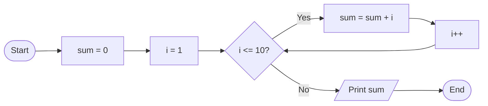

**Mnemonic:** "SILA - Sum Increment Loop Add"

## Question 3(c OR) [7 marks]

**Draw flowchart and explain switch statement with example.**

**Answer**:

The switch statement selects one code block from multiple options based on a variable's value.

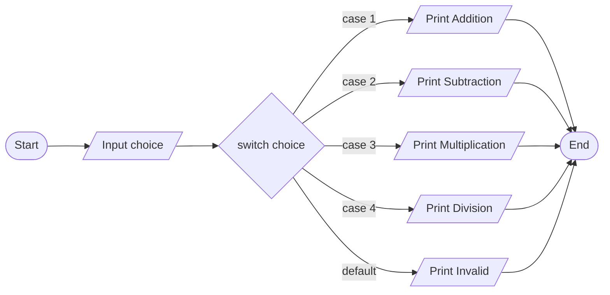

```c
#include <stdio.h>

int main() {
    int choice;
    
    printf("Enter operation (1-4): ");
    scanf("%d", &choice);
    
    switch(choice) {
        case 1:
            printf("Addition selected");
            break;
        case 2:
            printf("Subtraction selected");
            break;
        case 3:
            printf("Multiplication selected");
            break;
        case 4:
            printf("Division selected");
            break;
        default:
            printf("Invalid choice");
    }
    
    return 0;
}
```

- **Expression**: Takes integer or character expression
- **Case labels**: Must be constant expressions
- **Break statement**: Prevents fall-through to next case
- **Default**: Handles values not matching any case

**Mnemonic:** "SCBD - Switch Cases Break Default"

## Question 4(a) [3 marks]

**Develop a C program to convert uppercase alphabet to lowercase alphabet.**

**Answer**:

```c
#include <stdio.h>

int main() {
    char upper, lower;
    
    printf("Enter uppercase letter: ");
    scanf("%c", &upper);
    
    lower = upper + 32;
    // Alternatively: lower = tolower(upper);
    
    printf("Lowercase letter: %c", lower);
    
    return 0;
}
```

**Diagram:**

```goat
┌─────────────┐
│ Input 'A'   │
└──────┬──────┘
       │
       ▼
┌─────────────┐
│ ASCII code  │
│     65      │
└──────┬──────┘
       │ +32
       ▼
┌─────────────┐
│ ASCII code  │
│     97      │
└──────┬──────┘
       │
       ▼
┌─────────────┐
│ Output 'a'  │
└─────────────┘
```

**Mnemonic:** "ASCII-32 - Add 32 to Shift Characters Into Lowercase"

## Question 4(b) [4 marks]

**What is pointer? Explain with example.**

**Answer**:

A pointer is a variable that stores the memory address of another variable.

| Concept | Syntax | Description |
|---------|--------|-------------|
| Declaration | `int *p;` | Declares pointer p to int |
| Initialization | `p = &var;` | Store address of var in p |
| Dereferencing | `*p = 10;` | Access/modify pointed value |
| Pointer arithmetic | `p++` | Move to next memory location |

```c
#include <stdio.h>

int main() {
    int num = 10;
    int *ptr;
    
    ptr = &num;  // Store address of num in ptr
    
    printf("Value of num: %d\n", num);
    printf("Address of num: %p\n", &num);
    printf("Value of ptr: %p\n", ptr);
    printf("Value pointed by ptr: %d\n", *ptr);
    
    *ptr = 20;  // Change value using pointer
    printf("New value of num: %d\n", num);
    
    return 0;
}
```

**Diagram:**

```goat
Memory:
┌─────────────┐
│    num      │ 1000  ┌───────────┐
│    (10)     │◄──────┤   *ptr    │ 2000
└─────────────┘       │  (1000)   │
                      └───────────┘
```

**Mnemonic:** "SAID - Store Address to Indirectly Dereference"

## Question 4(c) [7 marks]

**Draw flowchart and explain for loop with example.**

**Answer**:

The for loop is used to repeat a block of code a specified number of times.

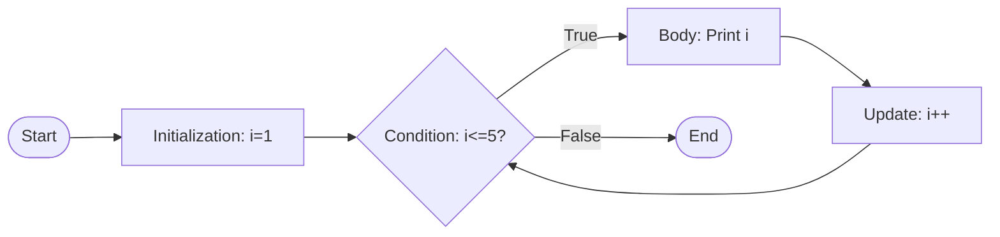

```c
#include <stdio.h>

int main() {
    int i;
    
    // Syntax: for(initialization; condition; update)
    for(i = 1; i <= 5; i++) {
        printf("%d ", i);
    }
    // Output: 1 2 3 4 5
    
    return 0;
}
```

- **Initialization**: Executes once before loop starts
- **Condition**: Checked before each iteration
- **Update**: Executes after each iteration
- **Body**: Code block that repeats

**Mnemonic:** "ICU-B - Initialize, Check, Update, Body"

## Question 4(a OR) [3 marks]

**Develop a C program to find area of a triangle (½ * base * height)?**

**Answer**:

```c
#include <stdio.h>

int main() {
    float base, height, area;
    
    printf("Enter base of triangle: ");
    scanf("%f", &base);
    
    printf("Enter height of triangle: ");
    scanf("%f", &height);
    
    area = 0.5 * base * height;
    
    printf("Area of triangle: %.2f", area);
    
    return 0;
}
```

**Diagram:**

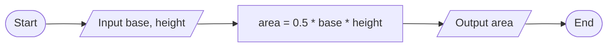

**Mnemonic:** "BHA - Base times Height divided by two equals Area"

## Question 4(b OR) [4 marks]

**Explain declaration and initialization of pointer.**

**Answer**:

| Operation | Syntax | Example | Description |
|-----------|--------|---------|-------------|
| Declaration | datatype *pointer_name; | `int *ptr;` | Creates a pointer variable |
| Initialization | pointer_name = &variable; | `ptr = &num;` | Assigns address to pointer |
| Combined | datatype *pointer_name = &variable; | `int *ptr = &num;` | Declaration with initialization |
| NULL pointer | pointer_name = NULL; | `ptr = NULL;` | Safe initialization when no address is available |

```c
#include <stdio.h>

int main() {
    int num = 10;           // Regular variable
    int *ptr1;              // Declaration only
    int *ptr2 = &num;       // Declaration with initialization
    
    ptr1 = &num;            // Initialization of ptr1
    
    printf("num value: %d\n", num);
    printf("num address: %p\n", &num);
    printf("ptr1 value: %p\n", ptr1);
    printf("ptr2 value: %p\n", ptr2);
    printf("Value via ptr1: %d\n", *ptr1);
    printf("Value via ptr2: %d\n", *ptr2);
    
    return 0;
}
```

**Diagram:**

```goat
Pointer Declaration:
┌───────────┐
│ int *ptr; │
└───────────┘

Pointer Initialization:
┌─────────────┐       ┌──────────┐
│ ptr = &num; │  →    │ num (10) │
└─────────────┘       └──────────┘
```

**Mnemonic:** "PAIN - Pointer Allocate, Initialize, Navigate"

## Question 4(c OR) [7 marks]

**Draw flowchart and explain while loop with example.**

**Answer**:

The while loop repeats a block of code as long as a specified condition is true.

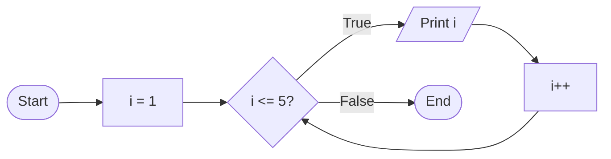

```c
#include <stdio.h>

int main() {
    int i = 1;
    
    // Syntax: while(condition) { body }
    while(i <= 5) {
        printf("%d ", i);
        i++;
    }
    // Output: 1 2 3 4 5
    
    return 0;
}
```

- **Initialization**: Must be done before loop
- **Condition**: Evaluated at beginning of each iteration
- **Body**: Executes only if condition is true
- **Update**: Must be inside loop body

**Mnemonic:** "CUBE - Condition check, Update inside Body, Exit when false"

## Question 5(a) [3 marks]

**Build a structure to store book information: book_no, book_title, book_author, book_price**

**Answer**:

```c
#include <stdio.h>
#include <string.h>

struct Book {
    int book_no;
    char book_title[50];
    char book_author[50];
    float book_price;
};

int main() {
    struct Book book1;
    
    book1.book_no = 101;
    strcpy(book1.book_title, "Programming in C");
    strcpy(book1.book_author, "Dennis Ritchie");
    book1.book_price = 450.50;
    
    printf("Book No: %d\n", book1.book_no);
    printf("Title: %s\n", book1.book_title);
    printf("Author: %s\n", book1.book_author);
    printf("Price: %.2f", book1.book_price);
    
    return 0;
}
```

**Diagram:**

```goat
struct Book
┌───────────────────────────────┐
│ book_no      (int)            │
├───────────────────────────────┤
│ book_title   (char[50])       │
├───────────────────────────────┤
│ book_author  (char[50])       │
├───────────────────────────────┤
│ book_price   (float)          │
└───────────────────────────────┘
```

**Mnemonic:** "SNAP - Structure Needs All Properties"

## Question 5(b) [4 marks]

**Explain following functions with example. (1) sqrt() (2) pow() (3) strlen() (4) strcpy()**

**Answer**:

| Function | Library | Purpose | Example |
|----------|---------|---------|---------|
| sqrt() | math.h | Calculates square root | `sqrt(16)` returns `4.0` |
| pow() | math.h | Raises to power | `pow(2, 3)` returns `8.0` |
| strlen() | string.h | Finds string length | `strlen("hello")` returns `5` |
| strcpy() | string.h | Copies string | `strcpy(dest, "hello")` copies "hello" to dest |

```c
#include <stdio.h>
#include <math.h>
#include <string.h>

int main() {
    double sqrtResult = sqrt(25);
    double powResult = pow(2, 4);
    char str[] = "Programming";
    char dest[20];
    int length = strlen(str);
    
    strcpy(dest, str);
    
    printf("sqrt(25) = %.2f\n", sqrtResult);
    printf("pow(2, 4) = %.2f\n", powResult);
    printf("Length of '%s' = %d\n", str, length);
    printf("Copied string: %s\n", dest);
    
    return 0;
}
```

**Mnemonic:** "SPSS - Square-root Power String-length String-copy"

## Question 5(c) [7 marks]

**Explain arrays and array initialization. Give example.**

**Answer**:

An array is a collection of similar data elements stored at contiguous memory locations.

| Method | Syntax | Example |
|--------|--------|---------|
| Declaration | `data_type array_name[size];` | `int marks[5];` |
| Initialization at declaration | `data_type array_name[size] = {values};` | `int marks[5] = {95, 80, 85, 75, 90};` |
| Individual element | `array_name[index] = value;` | `marks[0] = 95;` |
| Partial initialization | `int arr[5] = {1, 2};` | Remaining elements are 0 |
| Without size | `int arr[] = {1, 2, 3};` | Size determined by elements |

```c
#include <stdio.h>

int main() {
    // Array declaration and initialization
    int numbers[5] = {10, 20, 30, 40, 50};
    
    // Accessing array elements
    printf("First element: %d\n", numbers[0]);
    printf("Third element: %d\n", numbers[2]);
    
    // Changing array element
    numbers[1] = 25;
    
    // Printing all elements
    printf("Array elements: ");
    for(int i = 0; i < 5; i++) {
        printf("%d ", numbers[i]);
    }
    
    return 0;
}
```

**Diagram:**

```goat
Array in memory:
┌────┬────┬────┬────┬────┐
│ 10 │ 20 │ 30 │ 40 │ 50 │
└────┴────┴────┴────┴────┘
   0    1    2    3    4  ← indices
```

**Mnemonic:** "CASED - Contiguous Arrangement of Similar Elements with Direct-access"

## Question 5(a OR) [3 marks]

**Write the difference between array and structure.**

**Answer**:

| Feature | Array | Structure |
|---------|-------|-----------|
| Data types | Same data type only | Different data types allowed |
| Access | Using index: `arr[0]` | Using dot operator: `emp.id` |
| Memory | Contiguous allocation | May not be contiguous |
| Size | Fixed at declaration | Sum of member sizes |
| Initialization | `int arr[3] = {1,2,3};` | `struct emp e = {101,"John",5000};` |
| Purpose | Collection of similar items | Collection of related items |

**Diagram:**

```goat
Array:                  Structure:
┌───┬───┬───┐           ┌───────────────┐
│ 1 │ 2 │ 3 │           │ id: 101       │
└───┴───┴───┘           ├───────────────┤
  int  int int          │ name: "John"  │
                        ├───────────────┤
                        │ salary: 5000.0│
                        └───────────────┘
                          int  char[]  float
```

**Mnemonic:** "HASDIP - Homogeneous vs. Assorted, Same vs. Different, Index vs. Point"

## Question 5(b OR) [4 marks]

**What is user defined function? Explain with example.**

**Answer**:

A user-defined function is a code block that performs a specific task, created by the programmer to reuse and organize code.

| Component | Description | Example |
|-----------|-------------|---------|
| Return type | Data type returned by function | `int`, `void`, etc. |
| Function name | Identifier for the function | `sum`, `findMax` |
| Parameters | Input values in parentheses | `(int a, int b)` |
| Function body | Code inside curly braces | `{ return a+b; }` |

```c
#include <stdio.h>

// Function declaration
int sum(int a, int b);

int main() {
    int num1 = 5, num2 = 10;
    int result;
    
    // Function call
    result = sum(num1, num2);
    
    printf("Sum = %d", result);
    
    return 0;
}

// Function definition
int sum(int a, int b) {
    return a + b;
}
```

**Diagram:**

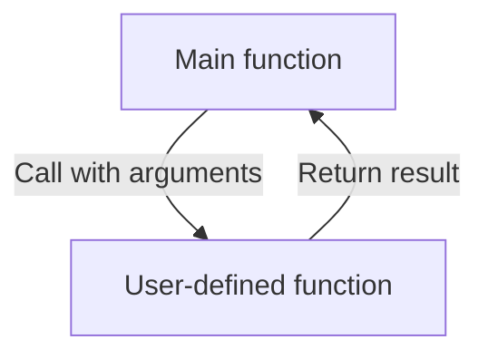

**Mnemonic:** "CRPB - Create, Return, Pass, Body"

## Question 5(c OR) [7 marks]

**Develop a C program to find sum of array elements and average of it.**

**Answer**:

```c
#include <stdio.h>

int main() {
    int arr[100], n, i;
    int sum = 0;
    float avg;
    
    printf("Enter number of elements: ");
    scanf("%d", &n);
    
    printf("Enter %d elements:\n", n);
    for(i = 0; i < n; i++) {
        scanf("%d", &arr[i]);
        sum += arr[i];  // Add each element to sum
    }
    
    avg = (float)sum / n;  // Calculate average
    
    printf("Sum of array elements: %d\n", sum);
    printf("Average of array elements: %.2f", avg);
    
    return 0;
}
```

**Diagram:**

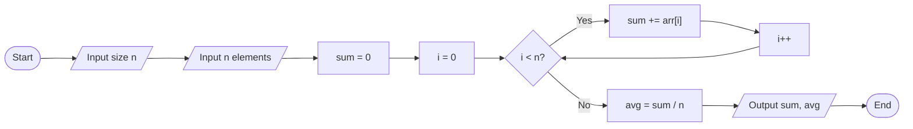

| Step | Operation | Example (for array [5,10,15,20]) |
|------|-----------|----------------------------------|
| 1 | Input array | [5,10,15,20] |
| 2 | Initialize sum = 0 | sum = 0 |
| 3 | Add each element | sum = 0+5+10+15+20 = 50 |
| 4 | Divide by count | avg = 50/4 = 12.5 |

**Mnemonic:** "LISA - Loop, Increment, Sum, Average"
