## પ્રશ્ન 1(a) [3 ગુણ]

**અલ્ગોરિધમ વ્યાખ્યાયિત કરો અને વર્તુળનું ક્ષેત્રફળ શોધવા માટેનું અલ્ગોરિધમ લખો.**

**જવાબ**:
અલ્ગોરિધમ એટલે કોઈ ચોક્કસ સમસ્યાના ઉકેલ માટેની પગલાવાર પ્રક્રિયા અથવા નિયમોનો સમૂહ.

**વર્તુળના ક્ષેત્રફળનું અલ્ગોરિધમ:**

```
પગલું 1: શરૂ
પગલું 2: વર્તુળની ત્રિજ્યા (r) ઇનપુટ લો
પગલું 3: ક્ષેત્રફળ = π × r² ની ગણતરી કરો
પગલું 4: ક્ષેત્રફળ દર્શાવો
પગલું 5: અંત
```

**મેમરી ટ્રીક:** "શરૂ, વાંચો, ગણતરી, પ્રદર્શન, અંત"

## પ્રશ્ન 1(b) [4 ગુણ]

**ફ્લોચાર્ટ વ્યાખ્યાયિત કરો અને આપેલ ત્રણ સંખ્યાઓ માંથી ઓછામાં ઓછી સંખ્યા શોધવા માટેનો ફ્લોચાર્ટ દોરો.**

**જવાબ**:
ફ્લોચાર્ટ એટલે પ્રમાણિત પ્રતીકો અને આકારોનો ઉપયોગ કરીને એલ્ગોરિધમનું દ્રશ્ય નિરૂપણ, જે પગલાઓના ક્રમને દર્શાવે છે.

**ત્રણ સંખ્યાઓમાંથી ન્યૂનતમ શોધવા માટેનો ફ્લોચાર્ટ:**

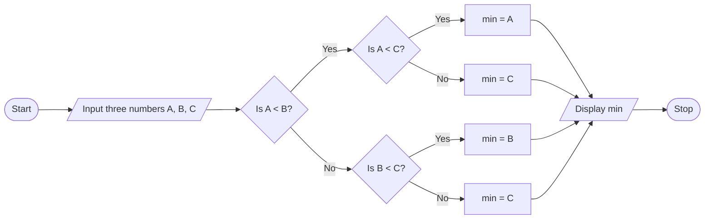

- **તુલના વ્યૂહરચના**: પહેલા A અને B ની તુલના કરો, પછી C સાથે તુલના કરો
- **બ્રાન્ચિંગ લોજિક**: સૌથી નાની કિંમત શોધવા માટે if-else સ્ટ્રક્ચરનો ઉપયોગ કરો

**મેમરી ટ્રીક:** "જોડાઓની તુલના કરો, દુર્લભ નાની કિંમત દરેક જગ્યાએ શોધો"

## પ્રશ્ન 1(c) [7 ગુણ]

**નીચેના સમીકરણનો ઉપયોગ કરીને સિમ્પલ ઇન્ટરેસ્ટની ગણતરી કરવા માટેનો પ્રોગ્રામ લખો. I=PRN/100 જ્યાં P=પ્રિન્સીપલ રકમ, R=વ્યાજનો દર અને N=સમયગાળો.**

**જવાબ**:

```c
#include <stdio.h>

int main() {
    float P, R, N, I;
    
    // પ્રિન્સિપલ રકમ, વ્યાજનો દર અને સમયગાળો ઇનપુટ લો
    printf("પ્રિન્સિપલ રકમ દાખલ કરો: ");
    scanf("%f", &P);
    
    printf("વ્યાજનો દર દાખલ કરો: ");
    scanf("%f", &R);
    
    printf("સમયગાળો (વર્ષમાં) દાખલ કરો: ");
    scanf("%f", &N);
    
    // સિમ્પલ ઇન્ટરેસ્ટની ગણતરી કરો
    I = (P * R * N) / 100;
    
    // પરિણામ દર્શાવો
    printf("સિમ્પલ ઇન્ટરેસ્ટ = %.2f\n", I);
    
    return 0;
}
```

**આકૃતિ:**

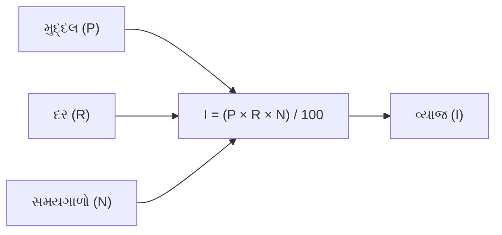

- **ફ્લોટિંગ-પોઇન્ટ વેરિએબલ્સ**: ચોકસાઈ માટે દશાંશ મૂલ્યો સ્ટોર કરે છે
- **વપરાશકર્તા ઇન્ટરેક્શન**: ઇનપુટ માટે સ્પષ્ટ પ્રોમ્પ્ટ્સ
- **પરિણામ ફોર્મેટિંગ**: %.2f બે દશાંશ સ્થાન દર્શાવે છે

**મેમરી ટ્રીક:** "મુદ્દલ, દર અને સંખ્યા, સોથી ભાગીએ તો મળે વ્યાજ"

## પ્રશ્ન 1(c OR) [7 ગુણ]

**કીબોર્ડ દ્વારા ત્રિજ્યા(R) અને ઊંચાઈ(H) ઈનપુટ લઇ સિલિન્ડરના વોલ્યુમ(V)ની ગણતરી કરીને પ્રિન્ટ કરવા માટેનો પ્રોગ્રામ લખો V=πR²H**

**જવાબ**:

```c
#include <stdio.h>

int main() {
    float radius, height, volume;
    const float PI = 3.14159;
    
    // ત્રિજ્યા અને ઊંચાઈ ઇનપુટ લો
    printf("સિલિન્ડરની ત્રિજ્યા દાખલ કરો: ");
    scanf("%f", &radius);
    
    printf("સિલિન્ડરની ઊંચાઈ દાખલ કરો: ");
    scanf("%f", &height);
    
    // સિલિન્ડરના વોલ્યુમની ગણતરી કરો
    volume = PI * radius * radius * height;
    
    // પરિણામ દર્શાવો
    printf("સિલિન્ડરનું વોલ્યુમ = %.2f\n", volume);
    
    return 0;
}
```

**આકૃતિ:**


- **કોન્સ્ટન્ટ્સ**: સ્પષ્ટતા માટે PI કોન્સ્ટન્ટ તરીકે વ્યાખ્યાયિત કરવામાં આવ્યું છે
- **ફોર્મ્યુલા**: ત્રિજ્યાને બે વખત ગુણીને R² નો ઉપયોગ કરો
- **ઇનપુટ વેલિડેશન**: ત્રિજ્યા અને ઊંચાઈ માટે ધનાત્મક મૂલ્યોની ધારણા કરે છે

**મેમરી ટ્રીક:** "ત્રિજ્યાનો વર્ગ ગુણો ઊંચાઈ ગુણો પાઈ, આપે સિલિન્ડરનું વોલ્યુમ, ન પૂછો શા માટે"

## પ્રશ્ન 2(a) [3 ગુણ]

**સી પ્રોગ્રામિંગ ભાષામાં સપોર્ટ કરતા વિવિધ ઓપરેટરોની યાદી બનાવો.**

**જવાબ**:

| વર્ગ | ઓપરેટર્સ |
|----------|-----------|
| અંકગણિત | +, -, *, /, % (સરવાળો, બાદબાકી, ગુણાકાર, ભાગાકાર, મોડ્યુલસ) |
| રિલેશનલ | ==, !=, >, <, >=, <= (સમાન, અસમાન, મોટું, નાનું, મોટું અથવા સમાન, નાનું અથવા સમાન) |
| લોજિકલ | &&, \|\|, ! (AND, OR, NOT) |
| એસાઇનમેન્ટ | =, +=, -=, *=, /=, %= (એસાઇન, પ્લસ-એસાઇન, માઇનસ-એસાઇન, વગેરે) |
| ઇન્ક્રિમેન્ટ/ડિક્રિમેન્ટ | ++, -- (ઇન્ક્રિમેન્ટ, ડિક્રિમેન્ટ) |
| બિટવાઇઝ | &, \|, ^, ~, <<, >> (AND, OR, XOR, કોમ્પ્લિમેન્ટ, લેફ્ટ શિફ્ટ, રાઇટ શિફ્ટ) |
| કન્ડિશનલ | ? : (ટર્નરી ઓપરેટર) |
| સ્પેશિયલ | sizeof(), &, *, ->, . (સાઇઝ, એડ્રેસ, પોઇન્ટર, સ્ટ્રક્ચર) |

**મેમરી ટ્રીક:** "ARABIA CS" (અંકગણિત, રિલેશનલ, એસાઇનમેન્ટ, બિટવાઇઝ, ઇન્ક્રિમેન્ટ, એસાઇનમેન્ટ, કન્ડિશનલ, સ્પેશિયલ)

## પ્રશ્ન 2(b) [4 ગુણ]

**ઉદાહરણ સાથે રિલેશનલ ઓપરેટર અને ઇન્ક્રીમેન્ટ/ડિક્રીમેન્ટ ઓપરેટર સમજાવો.**

**જવાબ**:

| ઓપરેટર પ્રકાર | વર્ણન | ઉદાહરણ | આઉટપુટ |
|---------------|-------------|---------|--------|
| રિલેશનલ | બે મૂલ્યોની વચ્ચેના સંબંધની તપાસ કરે છે | `int a = 5, b = 10;`<br>`printf("%d", a < b);` | `1` (સાચું) |
| | સમાન (==) | `printf("%d", 5 == 5);` | `1` (સાચું) |
| | અસમાન (!=) | `printf("%d", 5 != 10);` | `1` (સાચું) |
| | મોટું/નાનું | `printf("%d %d", 5 > 3, 5 < 3);` | `1 0` |
| ઇન્ક્રિમેન્ટ | મૂલ્યમાં 1 વધારો કરે છે<br>પ્રી-ઇન્ક્રિમેન્ટ (++x): પહેલા વધારો પછી ઉપયોગ<br>પોસ્ટ-ઇન્ક્રિમેન્ટ (x++): પહેલા ઉપયોગ પછી વધારો | `int x = 5;`<br>`printf("%d ", ++x);`<br>`printf("%d", x);` | `6 6` |
| ડિક્રિમેન્ટ | મૂલ્યમાં 1 ઘટાડો કરે છે<br>પ્રી-ડિક્રિમેન્ટ (--x): પહેલા ઘટાડો પછી ઉપયોગ<br>પોસ્ટ-ડિક્રિમેન્ટ (x--): પહેલા ઉપયોગ પછી ઘટાડો | `int y = 5;`<br>`printf("%d ", y--);`<br>`printf("%d", y);` | `5 4` |

- **રિલેશનલ ઓપરેટર્સ**: 1 (સાચું) અથવા 0 (ખોટું) પરત કરે છે
- **ઇન્ક્રિમેન્ટ/ડિક્રિમેન્ટ**: વેરિએબલ મૂલ્ય બદલે છે અને મૂલ્ય પરત કરે છે

**મેમરી ટ્રીક:** "રિલેશનલ કહે સાચું કે ખોટું, ઇન્ક્રિમેન્ટ/ડિક્રિમેન્ટ કરે ચઢાવ કે ઉતાર"

## પ્રશ્ન 2(c) [7 ગુણ]

**1 થી 100 નો સરવાળો અને એવરેજ પ્રિન્ટ કરવા માટેનો પ્રોગ્રામ લખો.**

**જવાબ**:

```c
#include <stdio.h>

int main() {
    int i, sum = 0;
    float average;
    
    // 1 થી 100 સુધીની સંખ્યાઓનો સરવાળો ગણો
    for(i = 1; i <= 100; i++) {
        sum += i;
    }
    
    // એવરેજ ગણો
    average = (float)sum / 100;
    
    // પરિણામો દર્શાવો
    printf("1 થી 100 સુધીની સંખ્યાઓનો સરવાળો = %d\n", sum);
    printf("1 થી 100 સુધીની સંખ્યાઓની સરેરાશ = %.2f\n", average);
    
    return 0;
}
```

**આકૃતિ:**

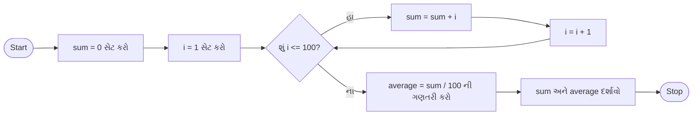

- **લૂપ કાઉન્ટર**: વેરિએબલ i 1 થી 100 સુધીની સંખ્યાઓ ટ્રેક કરે છે
- **સરવાળાની ગણતરી**: sum વેરિએબલમાં મૂલ્યો એકત્રિત કરે છે
- **ટાઇપ કાસ્ટિંગ**: (float) સરવાળાને ચોક્કસ ભાગાકાર માટે ફ્લોટિંગ-પોઇન્ટમાં કન્વર્ટ કરે છે

**મેમરી ટ્રીક:** "એક થી સો સરવાળો, પછી ભાગવાથી એવરેજ"

## પ્રશ્ન 2(a OR) [3 ગુણ]

**gets(S) અને scanf("%s",S) ફંક્શન વચ્ચેનો તફાવત લખો જ્યાં S સ્ટ્રિંગ છે.**

**જવાબ**:

| લક્ષણ | gets(S) | scanf("%s",S) |
|---------|---------|---------------|
| ઇનપુટ સમાપ્તિ | ન્યૂલાઇન કેરેક્ટર (\n) સુધી વાંચે છે | વ્હાઇટસ્પેસ (સ્પેસ, ટેબ, ન્યૂલાઇન) સુધી વાંચે છે |
| વ્હાઇટસ્પેસ હેન્ડલિંગ | સ્પેસ સાથેની સ્ટ્રિંગ વાંચી શકે છે | પ્રથમ વ્હાઇટસ્પેસ પર વાંચવાનું બંધ કરે છે |
| બફર ઓવરફ્લો | બાઉન્ડ્સ ચેકિંગ નથી (અસુરક્ષિત) | બાઉન્ડ્સ ચેકિંગ નથી (અસુરક્ષિત) |
| રિટર્ન વેલ્યુ | સફળતા પર S, ભૂલ પર NULL પરત કરે છે | સફળતાપૂર્વક વાંચેલી આઇટમ્સની સંખ્યા પરત કરે છે |
| રિપ્લેસમેન્ટ | fgets() વધુ સુરક્ષિત વિકલ્પ છે | વિડ્થ લિમિટ સાથે scanf("%ns",S) વધુ સુરક્ષિત છે |

- **સુરક્ષા ચિંતા**: બંને ફંક્શન બફર ઓવરફ્લો કરી શકે છે
- **વ્યવહારિક ઉપયોગ**: gets() પૂર્ણ લાઇન્સ માટે, scanf() એકલ શબ્દો માટે

**મેમરી ટ્રીક:** "gets મેળવે બધું ન્યૂલાઇન સુધી, scanf અટકે સફેદી જોતાં જ"

## પ્રશ્ન 2(b OR) [4 ગુણ]

**ઉદાહરણ સાથે લોજિકલ ઓપરેટર અને એસાઈનમેન્ટ ઓપરેટર સમજાવો.**

**જવાબ**:

| ઓપરેટર પ્રકાર | વર્ણન | ઉદાહરણ | આઉટપુટ |
|---------------|-------------|---------|--------|
| લોજિકલ | શરતો પર લોજિકલ ઓપરેશન્સ કરે છે | `int a = 5, b = 10;` | |
| | લોજિકલ AND (&&) | `printf("%d", (a > 0) && (b > 0));` | `1` (સાચું) |
| | લોજિકલ OR (\|\|) | `printf("%d", (a > 10) \|\| (b > 5));` | `1` (સાચું) |
| | લોજિકલ NOT (!) | `printf("%d", !(a == b));` | `1` (સાચું) |
| એસાઇનમેન્ટ | વેરિએબલ્સને મૂલ્યો આપે છે | `int x = 10;` | `x = 10` |
| | સિમ્પલ એસાઇનમેન્ટ (=) | `x = 20;` | `x = 20` |
| | એડ અને એસાઇન (+=) | `x += 5;` | `x = 25` |
| | સબટ્રેક્ટ અને એસાઇન (-=) | `x -= 10;` | `x = 15` |
| | મલ્ટિપ્લાય અને એસાઇન (*=) | `x *= 2;` | `x = 30` |
| | ડિવાઇડ અને એસાઇન (/=) | `x /= 3;` | `x = 10` |

- **લોજિકલ ઓપરેટર્સ**: નિર્ણય લેવામાં ઉપયોગ થાય છે
- **શોર્ટ-સર્કિટ ઇવેલ્યુએશન**: && અને || જરૂરી હોય એટલું જ મૂલ્યાંકન કરે છે
- **કંપાઉન્ડ એસાઇનમેન્ટ**: ઓપરેશન અને એસાઇનમેન્ટ જોડે છે

**મેમરી ટ્રીક:** "AND માગે બધા સાચા, OR માગે એક; એસાઇનમેન્ટ લે જમણું, ડાબે મૂકે એક"

## પ્રશ્ન 2(c OR) [7 ગુણ]

**આપેલ બે ફ્લોટિંગ પોઈન્ટ નંબરો વચ્ચેના તમામ પૂર્ણાંકોને પ્રિન્ટ કરવા માટેનો પ્રોગ્રામ લખો.**

**જવાબ**:

```c
#include <stdio.h>
#include <math.h>

int main() {
    float num1, num2;
    int start, end, i;
    
    // બે ફ્લોટિંગ પોઇન્ટ નંબર ઇનપુટ લો
    printf("પ્રથમ ફ્લોટિંગ પોઇન્ટ નંબર દાખલ કરો: ");
    scanf("%f", &num1);
    
    printf("બીજો ફ્લોટિંગ પોઇન્ટ નંબર દાખલ કરો: ");
    scanf("%f", &num2);
    
    // નાની સંખ્યાનો સીલિંગ અને મોટી સંખ્યાનો ફ્લોર શોધો
    if(num1 < num2) {
        start = ceil(num1);
        end = floor(num2);
    } else {
        start = ceil(num2);
        end = floor(num1);
    }
    
    // બે સંખ્યાઓ વચ્ચેના તમામ પૂર્ણાંકો પ્રિન્ટ કરો
    printf("%.2f અને %.2f વચ્ચેના પૂર્ણાંકો છે:\n", num1, num2);
    for(i = start; i <= end; i++) {
        printf("%d ", i);
    }
    printf("\n");
    
    return 0;
}
```

**આકૃતિ:**

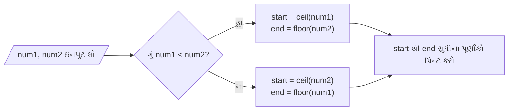

- **મેથ ફંક્શન્સ**: ceil() ઉપર રાઉન્ડ કરે છે, floor() નીચે રાઉન્ડ કરે છે
- **રેન્જ નિર્ધારણ**: ઇનપુટ ઓર્ડરથી સ્વતંત્ર કામ કરે છે
- **ઇન્ટીજર એક્સટ્રેક્શન**: ફ્લોટ્સ વચ્ચેના ફક્ત પૂર્ણાંકો પ્રિન્ટ કરે છે

**મેમરી ટ્રીક:** "નાનાને છત બનાવો, મોટાને ભોંયતળિયું, પછી પ્રિન્ટ કરો વચ્ચેના બધા પૂર્ણાંકો"

## પ્રશ્ન 3(a) [3 ગુણ]

**ઉદાહરણ સાથે multiple if-else સ્ટેટમેન્ટ સમજાવો.**

**જવાબ**:

Multiple if-else સ્ટેટમેન્ટ્સ ક્રમશઃ અનેક શરતોની તપાસ કરવા માટે વપરાય છે, જેમાં દરેક શરત માત્ર ત્યારે જ ચકાસવામાં આવે છે જ્યારે અગાઉની શરતો ખોટી હોય.

```c
#include <stdio.h>

int main() {
    int marks;
    
    printf("ગુણ દાખલ કરો (0-100): ");
    scanf("%d", &marks);
    
    if(marks >= 80) {
        printf("ગ્રેડ: A\n");
    } else if(marks >= 70) {
        printf("ગ્રેડ: B\n");
    } else if(marks >= 60) {
        printf("ગ્રેડ: C\n");
    } else if(marks >= 50) {
        printf("ગ્રેડ: D\n");
    } else {
        printf("ગ્રેડ: F\n");
    }
    
    return 0;
}
```

**આકૃતિ:**

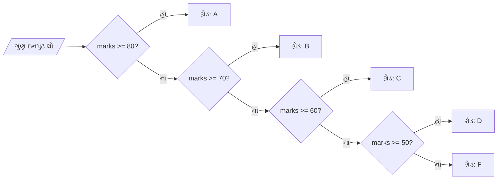

- **ક્રમિક પરીક્ષણ**: ફક્ત એક બ્લોક જ એક્ઝિક્યુટ થાય છે
- **કાર્યક્ષમતા**: સાચી શરત મળ્યા પછી તપાસ બંધ થઈ જાય છે

**મેમરી ટ્રીક:** "જો આ તો એ, નહીં તો જો પેલું તો એમ, નહીં તો જો અન્ય તો અલગ"

## પ્રશ્ન 3(b) [4 ગુણ]

**While લૂપ અને for લૂપની કામગીરી જણાવો.**

**જવાબ**:

| લૂપ પ્રકાર | કામગીરી | સિન્ટેક્સ | ઉપયોગ કેસ |
|-----------|---------|--------|-----------|
| while લૂપ | 1. શરત ચકાસો<br>2. જો સાચી હોય તો બોડી એક્ઝિક્યુટ કરો<br>3. શરત ખોટી થાય ત્યાં સુધી 1-2 પગલાં પુનરાવર્તિત કરો | `while(condition) {`<br>`    // સ્ટેટમેન્ટ્સ`<br>`}` | જ્યારે પુનરાવર્તનની સંખ્યા અગાઉથી ખબર ન હોય |
| for લૂપ | 1. ઇનિશિયલાઇઝેશન એક વખત એક્ઝિક્યુટ કરો<br>2. શરત ચકાસો<br>3. જો સાચી હોય તો બોડી એક્ઝિક્યુટ કરો<br>4. અપડેટ સ્ટેટમેન્ટ એક્ઝિક્યુટ કરો<br>5. શરત ખોટી થાય ત્યાં સુધી 2-4 પગલાં પુનરાવર્તિત કરો | `for(initialization; condition; update) {`<br>`    // સ્ટેટમેન્ટ્સ`<br>`}` | જ્યારે પુનરાવર્તનની સંખ્યા અગાઉથી ખબર હોય |

**તુલના:**

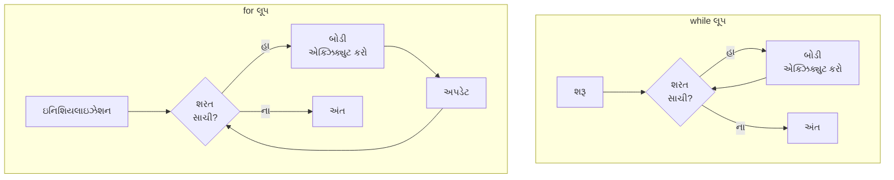

- **એન્ટ્રી કંટ્રોલ**: બંને એક્ઝિક્યુશન પહેલાં શરત ચકાસે છે
- **ઘટકો**: for લૂપ ઇનિશિયલાઇઝેશન, શરત અને અપડેટ જોડે છે

**મેમરી ટ્રીક:** "WHILE તપાસે પછી કરે, FOR શરૂ કરે તપાસે કરે અપડેટ કરે"

## પ્રશ્ન 3(c) [7 ગુણ]

**આપેલ સંખ્યાના ફેક્ટોરિયલ શોધવા માટેનો પ્રોગ્રામ લખો.**

**જવાબ**:

```c
#include <stdio.h>

int main() {
    int num, i;
    unsigned long long factorial = 1;
    
    // એક સંખ્યા ઇનપુટ લો
    printf("ધનાત્મક પૂર્ણાંક દાખલ કરો: ");
    scanf("%d", &num);
    
    // તપાસો કે સંખ્યા નકારાત્મક તો નથી
    if(num < 0) {
        printf("ભૂલ: નકારાત્મક સંખ્યાઓનું ફેક્ટોરિયલ વ્યાખ્યાયિત નથી.\n");
    } else {
        // ફેક્ટોરિયલની ગણતરી કરો
        for(i = 1; i <= num; i++) {
            factorial *= i;
        }
        
        printf("%d નું ફેક્ટોરિયલ = %llu\n", num, factorial);
    }
    
    return 0;
}
```

**આકૃતિ:**

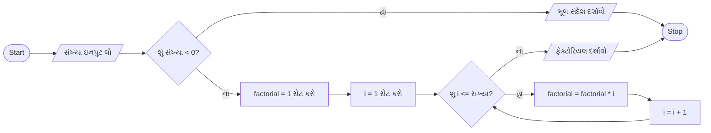

- **ડેટા ટાઇપ**: મોટા ફેક્ટોરિયલ માટે unsigned long long
- **ભૂલ હેન્ડલિંગ**: નકારાત્મક ઇનપુટ માટે ચકાસણી
- **લૂપ અમલીકરણ**: ક્રમિક પૂર્ણાંકોનો ગુણાકાર

**મેમરી ટ્રીક:** "ફેક્ટોરિયલ ફોર્મ્યુલા: એકથી સંખ્યા સુધી ગુણાકાર"

## પ્રશ્ન 3(a OR) [3 ગુણ]

**ઉદાહરણ સાથે switch-case સ્ટેટમેન્ટની કામગીરી સમજાવો.**

**જવાબ**:

Switch-case સ્ટેટમેન્ટ એ એક મલ્ટી-વે ડિસીઝન મેકર છે જે અભિવ્યક્તિના મૂલ્યને વિવિધ કેસ મૂલ્યો સામે તપાસે છે અને મેચ થતા કેસ બ્લોકને એક્ઝિક્યુટ કરે છે.

```c
#include <stdio.h>

int main() {
    int day;
    
    printf("દિવસનો નંબર દાખલ કરો (1-7): ");
    scanf("%d", &day);
    
    switch(day) {
        case 1:
            printf("સોમવાર\n");
            break;
        case 2:
            printf("મંગળવાર\n");
            break;
        case 3:
            printf("બુધવાર\n");
            break;
        case 4:
            printf("ગુરુવાર\n");
            break;
        case 5:
            printf("શુક્રવાર\n");
            break;
        case 6:
            printf("શનિવાર\n");
            break;
        case 7:
            printf("રવિવાર\n");
            break;
        default:
            printf("અમાન્ય દિવસ નંબર\n");
    }
    
    return 0;
}
```

**આકૃતિ:**

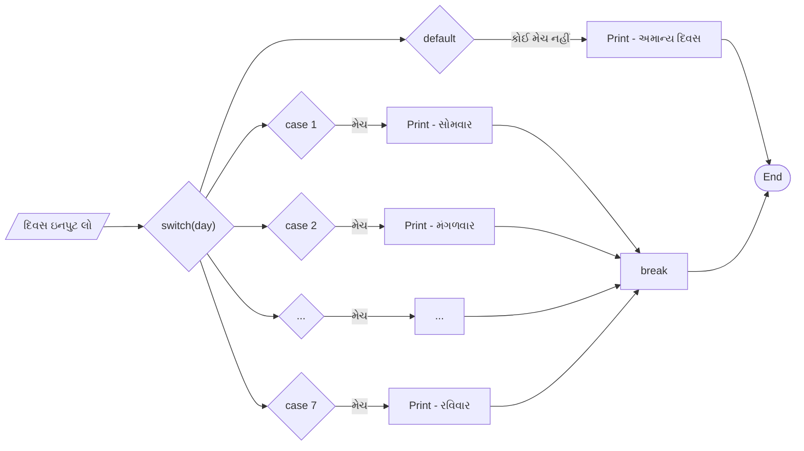

- **અભિવ્યક્તિ મૂલ્યાંકન**: ફક્ત ઇન્ટીજર અથવા કેરેક્ટર ટાઈપ્સ
- **કેસ મેચિંગ**: break સુધી મેચીંગ કેસ એક્ઝિક્યુટ કરે છે
- **ડિફોલ્ટ કેસ**: કોઈ કેસ મેચ ન થાય ત્યારે એક્ઝિક્યુટ થાય છે

**મેમરી ટ્રીક:** "SWITCH મૂલ્ય, CASE મેળ, BREAK બહાર, DEFAULT બચાવ"

## પ્રશ્ન 3(b OR) [4 ગુણ]

**break અને continue કીવર્ડ વ્યાખ્યાયિત કરો.**

**જવાબ**:

| કીવર્ડ | વ્યાખ્યા | હેતુ | ઉદાહરણ |
|---------|------------|---------|---------|
| break | સૌથી અંદરના લૂપ અથવા switch સ્ટેટમેન્ટને તરત જ સમાપ્ત કરે છે | જ્યારે કોઈ ચોક્કસ શરત પૂરી થાય ત્યારે લૂપમાંથી બહાર નીકળવા માટે | ```c for(i=1; i<=10; i++) { if(i == 5) break; printf("%d ", i); } // આઉટપુટ: 1 2 3 4``` |
| continue | લૂપના વર્તમાન પુનરાવર્તનના બાકીના ભાગને છોડીને લૂપના આગલા પુનરાવર્તન પર જાય છે | લૂપને સમાપ્ત કર્યા વિના ચોક્કસ પુનરાવર્તનો છોડવા માટે | ```c for(i=1; i<=10; i++) { if(i == 5) continue; printf("%d ", i); } // આઉટપુટ: 1 2 3 4 6 7 8 9 10``` |

**વર્તન તુલના:**

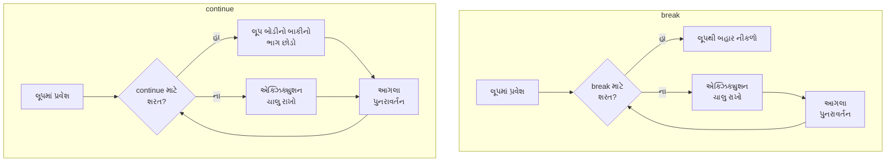

- **સ્કોપ**: બંને માત્ર સૌથી અંદરના લૂપને અસર કરે છે
- **કંટ્રોલ ટ્રાન્સફર**: break લૂપમાંથી બહાર નીકળે છે, continue આગલા પુનરાવર્તન પર જાય છે

**મેમરી ટ્રીક:** "BREAK રૂમ છોડે છે, CONTINUE આગલી ડાન્સ મૂવ પર જાય છે"

## પ્રશ્ન 3(c OR) [7 ગુણ]

**કીબોર્ડ પરથી લાઈન(n) ની સંખ્યા વાંચી અને નીચે દશાર્વેલ ટ્રાઇંગલ પ્રિન્ટ કરવા માટેનો પ્રોગ્રામ લાખો.**

**ઉદાહરણ તરીકે, n=5**

```
1
1 2
1 2 3
1 2 3 4
1 2 3 4 5
```

**જવાબ**:

```c
#include <stdio.h>

int main() {
    int n, i, j;
    
    // લાઈનની સંખ્યા ઇનપુટ લો
    printf("લાઈનની સંખ્યા દાખલ કરો: ");
    scanf("%d", &n);
    
    // ટ્રાયેંગલ પેટર્ન પ્રિન્ટ કરો
    for(i = 1; i <= n; i++) {
        // દરેક રોમાં 1 થી i સુધીની સંખ્યાઓ પ્રિન્ટ કરો
        for(j = 1; j <= i; j++) {
            printf("%d ", j);
        }
        printf("\n");
    }
    
    return 0;
}
```

**પેટર્ન વિઝ્યુલાઇઝેશન:**

```
રો 1: 1
રો 2: 1 2
રો 3: 1 2 3
રો 4: 1 2 3 4
રો 5: 1 2 3 4 5
```

**પ્રોગ્રામ પ્રવાહ:**

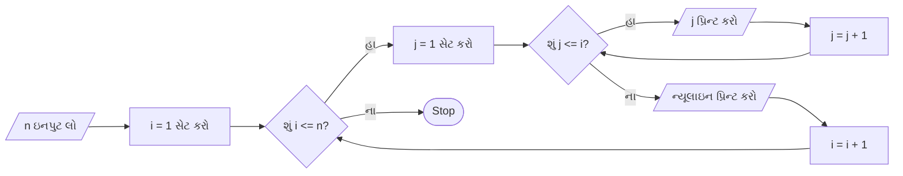

- **નેસ્ટેડ લૂપ્સ**: આઉટર લૂપ રો માટે, ઇનર લૂપ કોલમ માટે
- **પેટર્ન લોજિક**: રો નંબર નક્કી કરે છે કે કેટલી સંખ્યાઓ પ્રિન્ટ કરવી
- **સંખ્યા ક્રમ**: દરેક રો 1 થી રો નંબર સુધી પ્રિન્ટ કરે છે

**મેમરી ટ્રીક:** "રો નક્કી કરે મર્યાદા, કોલમ પ્રિન્ટ કરે એકથી રો સુધી"

## પ્રશ્ન 4(a) [3 ગુણ]

**Nested if-else સ્ટેટમેન્ટને ઉદાહરણ સાથે સમજાવો.**

**જવાબ**:

Nested if-else સ્ટેટમેન્ટ્સ એ if-else કન્સ્ટ્રક્ટ્સ છે જે બીજા if અથવા else બ્લોકની અંદર મૂકવામાં આવે છે, જે વધુ જટિલ શરતી તર્ક અને નિર્ણય લેવાના બહુવિધ સ્તરોની મંજૂરી આપે છે.

```c
#include <stdio.h>

int main() {
    int age;
    char hasID;
    
    printf("ઉંમર દાખલ કરો: ");
    scanf("%d", &age);
    
    printf("શું તમારી પાસે ID છે? (Y/N): ");
    scanf(" %c", &hasID);
    
    if(age >= 18) {
        if(hasID == 'Y' || hasID == 'y') {
            printf("તમે મત આપી શકો છો!\n");
        } else {
            printf("મત આપવા માટે ID જરૂરી છે.\n");
        }
    } else {
        printf("મત આપવા માટે તમારી ઉંમર 18 કે તેથી વધુ હોવી જોઈએ.\n");
    }
    
    return 0;
}
```

**નિર્ણય વૃક્ષ:**

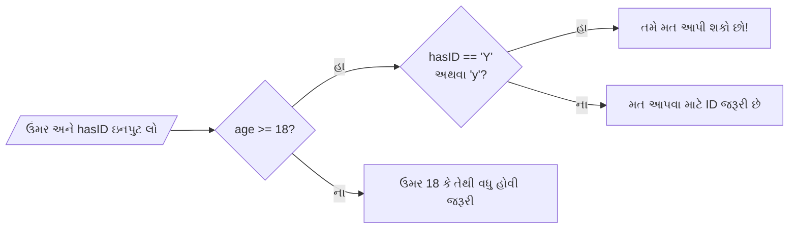

- **હાયરાર્કિકલ શરતો**: શરતોનું સ્તરમાં મૂલ્યાંકન કરે છે
- **ઇન્ડેન્ટેશન**: નેસ્ટેડ સ્ટ્રક્ચર્સની વાંચનક્ષમતા સુધારે છે
- **મલ્ટી-ફેક્ટર નિર્ણયો**: એકાધિક માપદંડો જોડે છે

**મેમરી ટ્રીક:** "If ની અંદર if, ઊંડી શરતો ચકાસે"

## પ્રશ્ન 4(b) [4 ગુણ]

**One-dimensional array ના initialization નું વર્ણન કરો.**

**જવાબ**:

| ઇનિશિયલાઇઝેશન પદ્ધતિ | સિન્ટેક્સ | ઉદાહરણ | વર્ણન |
|------------------------|--------|---------|-------------|
| સાઇઝ સાથે ડેક્લેરેશન | `data_type array_name[size];` | `int marks[5];` | નિર્દિષ્ટ સાઇઝ સાથે એરે બનાવે છે, એલિમેન્ટ્સમાં ગાર્બેજ વેલ્યુ હોય છે |
| ઇનિશિયલાઇઝેશન સાથે ડેક્લેરેશન | `data_type array_name[size] = {values};` | `int ages[4] = {21, 19, 25, 32};` | ચોક્કસ મૂલ્યો સાથે એરે બનાવે અને ઇનિશિયલાઇઝ કરે છે |
| આંશિક ઇનિશિયલાઇઝેશન | `data_type array_name[size] = {values};` | `int nums[5] = {1, 2};` | પ્રથમ એલિમેન્ટ્સ ઇનિશિયલાઇઝ કરે છે, બાકીના શૂન્ય થાય છે |
| સાઇઝ ઇન્ફરન્સ | `data_type array_name[] = {values};` | `int scores[] = {95, 88, 72, 84, 91};` | ઇનિશિયલાઇઝર્સની સંખ્યા દ્વારા સાઇઝ નક્કી થાય છે |
| વ્યક્તિગત એલિમેન્ટ | `array_name[index] = value;` | `marks[0] = 85;` | ચોક્કસ એલિમેન્ટને મૂલ્ય આપે છે |

**એરે વિઝ્યુલાઇઝેશન:**

```
int numbers[5] = {10, 20, 30, 40, 50};
```

```
┌─────┬─────┬─────┬─────┬─────┐
│ 10  │ 20  │ 30  │ 40  │ 50  │
└─────┴─────┴─────┴─────┴─────┘
  [0]   [1]   [2]   [3]   [4]   ← ઇન્ડેક્સ
```

- **ઝીરો-ઇન્ડેક્સિંગ**: પ્રથમ એલિમેન્ટ ઇન્ડેક્સ 0 પર
- **કન્ટિગ્યુઅસ મેમરી**: એલિમેન્ટ્સ ક્રમશઃ સ્ટોર થાય છે
- **સાઇઝ લિમિટેશન**: સાઇઝ કંપાઇલ ટાઇમે જાણીતી હોવી જરૂરી છે

**મેમરી ટ્રીક:** "પહેલા સાઇઝ જાહેર કરો, પછી મૂલ્યો ભરો અથવા કંપાઇલરને ગણવા દો"

## પ્રશ્ન 4(c) [7 ગુણ]

**અરેને વ્યાખ્યાયિત કરો અને સ્ટ્રિંગને રિવર્સ કરવા માટેનો પ્રોગ્રામ લખો.**

**જવાબ**:

એરે એ સમાન ડેટા આઇટમ્સનો સંગ્રહ છે જે સળંગ મેમરી સ્થાનો પર સંગ્રહિત થયેલા હોય છે અને એક સામાન્ય નામનો ઉપયોગ કરીને એક્સેસ કરવામાં આવે છે.

```c
#include <stdio.h>
#include <string.h>

int main() {
    char str[100], reversed[100];
    int i, j, length;
    
    // સ્ટ્રિંગ ઇનપુટ લો
    printf("એક સ્ટ્રિંગ દાખલ કરો: ");
    gets(str);
    
    // સ્ટ્રિંગની લંબાઈ શોધો
    length = strlen(str);
    
    // સ્ટ્રિંગને રિવર્સ કરો
    for(i = length - 1, j = 0; i >= 0; i--, j++) {
        reversed[j] = str[i];
    }
    
    // NULL ટર્મિનેટર ઉમેરો
    reversed[j] = '\0';
    
    // રિવર્સ કરેલી સ્ટ્રિંગ દર્શાવો
    printf("રિવર્સ કરેલી સ્ટ્રિંગ: %s\n", reversed);
    
    return 0;
}
```

**એલ્ગોરિધમ વિઝ્યુલાઇઝેશન:**

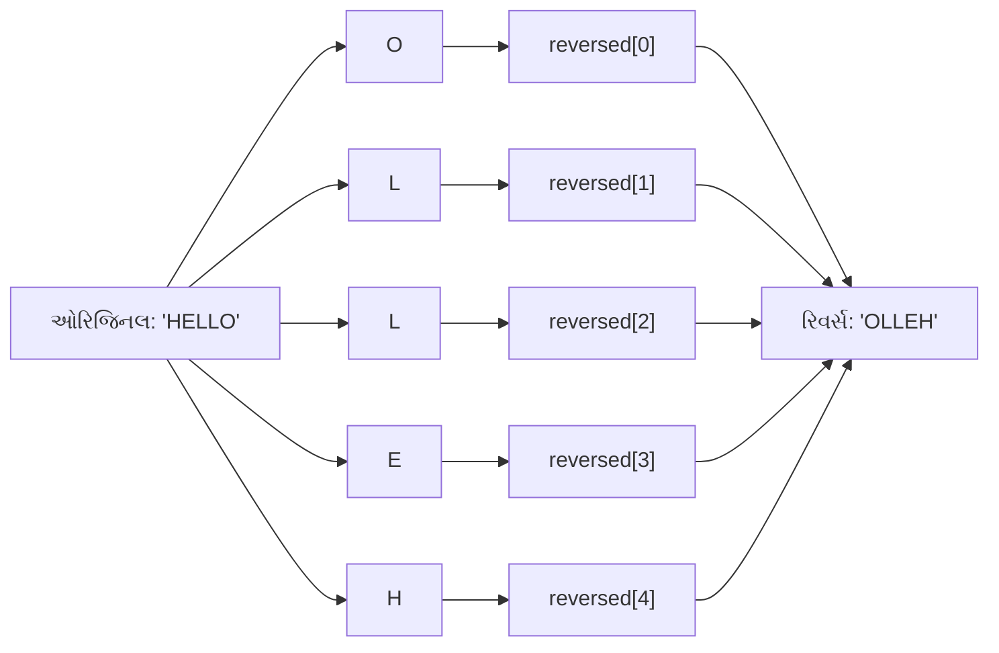

- **કેરેક્ટર એરે**: NULL ટર્મિનેટર સાથે સ્ટ્રિંગ સ્ટોર કરે છે
- **ટુ-પોઇન્ટર ટેકનિક**: એક ઓરિજિનલ માટે, એક રિવર્સ માટે
- **ઝીરો-બેઝ્ડ ઇન્ડેક્સિંગ**: એરે ઇન્ડેક્સ 0 થી શરૂ થાય છે

**મેમરી ટ્રીક:** "અંતથી શરૂ કરો, શરૂઆતમાં મૂકો, શૂન્ય પર અટકો"

## પ્રશ્ન 4(a OR) [3 ગુણ]

**do while loop ઉદાહરણ સાથે સમજાવો**

**જવાબ**:

do-while લૂપ એ એક એક્ઝિટ-કંટ્રોલ્ડ લૂપ છે જે શરત ચકાસ્યા પહેલાં ઓછામાં ઓછી એક વખત લૂપ બોડી એક્ઝિક્યુટ કરે છે.

```c
#include <stdio.h>

int main() {
    int num, sum = 0;
    
    do {
        printf("એક સંખ્યા દાખલ કરો (0 રોકવા માટે): ");
        scanf("%d", &num);
        sum += num;
    } while(num != 0);
    
    printf("બધી દાખલ કરેલી સંખ્યાઓનો સરવાળો: %d\n", sum);
    
    return 0;
}
```

**લૂપ એક્ઝિક્યુશન ફ્લો:**

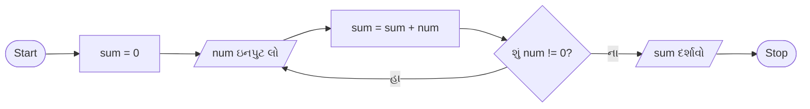

**મુખ્ય લક્ષણો:**

- **એક્ઝિક્યુશન ઓર્ડર**: પહેલા બોડી, પછી શરત ચકાસણી
- **ગેરેન્ટેડ એક્ઝિક્યુશન**: લૂપ બોડી હંમેશા ઓછામાં ઓછી એક વખત એક્ઝિક્યુટ થાય છે
- **ટર્મિનેશન**: શરત લૂપના તળિયે મૂલ્યાંકિત થાય છે

**મેમરી ટ્રીક:** "પહેલા કરો, પછી પૂછો"

## પ્રશ્ન 4(b OR) [4 ગુણ]

**પોઇન્ટરને વ્યાખ્યાયિત કરો અને ઉદાહરણ સાથે પોઇન્ટરનું વર્ણન કરો.**

**જવાબ**:

પોઇન્ટર એક એવું વેરિએબલ છે જે અન્ય વેરિએબલનું મેમરી એડ્રેસ સ્ટોર કરે છે.

| પોઇન્ટર કોન્સેપ્ટ | વર્ણન | ઉદાહરણ |
|-----------------|-------------|---------|
| ડેક્લેરેશન | Data_type *pointer_name; | `int *ptr;` |
| ઇનિશિયલાઇઝેશન | વેરિએબલનું એડ્રેસ એસાઇન કરવું | `int num = 10; int *ptr = &num;` |
| ડીરેફરન્સ | એડ્રેસ પરના મૂલ્યને એક્સેસ કરવું | `printf("%d", *ptr);` // 10 પ્રિન્ટ કરે છે |
| એડ્રેસ ઓપરેટર | વેરિએબલનું એડ્રેસ મેળવે છે | `printf("%p", &num);` // એડ્રેસ પ્રિન્ટ કરે છે |
| NULL પોઇન્ટર | કશું પોઇન્ટ ન કરતાં પોઇન્ટર | `int *ptr = NULL;` |

**પોઇન્ટર વિઝ્યુલાઇઝેશન:**

```goat
Memory:
┌──────┬───────┐    ┌──────┬───────┐
│ &num │ 1000  │    │ &ptr │ 2000  │
├──────┼───────┤    ├──────┼───────┤
│ num  │   10  │    │ ptr  │ 1000  │
└──────┴───────┘    └──────┴───────┘
                      │
                      └──────> Points to address of num
```

- **ઇનડાયરેક્ટ એક્સેસ**: તેમના એડ્રેસ દ્વારા વેરિએબલ્સ એક્સેસ કરે છે
- **મેમરી મેનિપ્યુલેશન**: કાર્યક્ષમતા માટે ડાયરેક્ટ મેમરી એક્સેસ
- **ડાયનેમિક મેમરી**: રનટાઇમ દરમિયાન એલોકેશન/ડીએલોકેશન સક્ષમ કરે છે

**મેમરી ટ્રીક:** "પોઇન્ટર્સ એડ્રેસને પોઇન્ટ કરે છે, સ્ટાર્સ મૂલ્યોને ડીરેફરન્સ કરે છે"

## પ્રશ્ન 4(c OR) [7 ગુણ]

**પોઇન્ટર વ્યાખ્યાયિત કરો અને પોઇન્ટર આર્ગ્યુમેન્ટનો ઉપયોગ કરીને બે પૂર્ણાંકોની અદલા બદલી કરવા માટેનો પ્રોગ્રામ લખો.**

**જવાબ**:

પોઇન્ટર એ એક વેરિએબલ છે જે અન્ય વેરિએબલના મેમરી એડ્રેસને ધરાવે છે, જે ડેટાનો પરોક્ષ એક્સેસ અને મેનિપ્યુલેશન કરવાની મંજૂરી આપે છે.

```c
#include <stdio.h>

// પોઇન્ટર્સનો ઉપયોગ કરીને બે ઇન્ટીજર્સની અદલાબદલી કરવાનું ફંક્શન
void swap(int *a, int *b) {
    int temp = *a;
    *a = *b;
    *b = temp;
}

int main() {
    int num1, num2;
    
    // બે પૂર્ણાંક ઇનપુટ લો
    printf("પ્રથમ સંખ્યા દાખલ કરો: ");
    scanf("%d", &num1);
    
    printf("બીજી સંખ્યા દાખલ કરો: ");
    scanf("%d", &num2);
    
    printf("અદલાબદલી પહેલાં: num1 = %d, num2 = %d\n", num1, num2);
    
    // num1 અને num2 ના એડ્રેસ સાથે swap ફંક્શન કૉલ કરો
    swap(&num1, &num2);
    
    printf("અદલાબદલી પછી: num1 = %d, num2 = %d\n", num1, num2);
    
    return 0;
}
```

**સ્વેપ પ્રોસેસ વિઝ્યુલાઇઝેશન:**

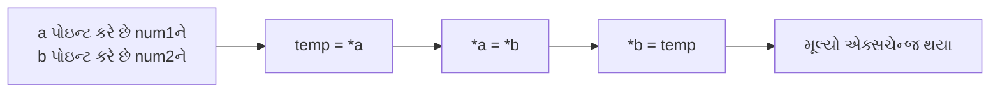

**મેમરી ચેન્જીસ:**

```
સ્વેપ પહેલાં:
num1 = 5, num2 = 10
a --> num1, b --> num2

સ્ટેપ 1: temp = *a
temp = 5, num1 = 5, num2 = 10

સ્ટેપ 2: *a = *b
temp = 5, num1 = 10, num2 = 10

સ્ટેપ 3: *b = temp
temp = 5, num1 = 10, num2 = 5

સ્વેપ પછી:
num1 = 10, num2 = 5
```

- **પાસ બાય રેફરન્સ**: પોઇન્ટર્સ ફંક્શન્સને મૂળ વેરિએબલ્સ મોડિફાય કરવાની મંજૂરી આપે છે
- **ટેમ્પરરી વેરિએબલ**: ડેટા નુકસાન વિના સ્વેપ કરવા માટે જરૂરી છે
- **ફંક્શન પેરામીટર**: પોઇન્ટર આર્ગ્યુમેન્ટ્સ એડ્રેસ પાસ કરે છે

**મેમરી ટ્રીક:** "એડ્રેસથી પકડો, કન્ટેન્ટ બદલો, હાજરી વિના"

## પ્રશ્ન 5(a) [3 ગુણ]

**50 અને 500 ની વચ્ચે 7 વડે ભાગી શકાય તેવી સંખ્યાઓ શોધવા માટેનો પ્રોગ્રામ લખો.**

**જવાબ**:

```c
#include <stdio.h>

int main() {
    int i, count = 0;
    
    printf("50 અને 500 ની વચ્ચે 7 વડે ભાગી શકાય તેવી સંખ્યાઓ:\n");
    
    // 7 વડે ભાગી શકાય તેવી સંખ્યાઓ શોધો અને પ્રિન્ટ કરો
    for(i = 50; i <= 500; i++) {
        if(i % 7 == 0) {
            printf("%d ", i);
            count++;
            
            // વધુ સારી વાંચનક્ષમતા માટે દર લાઇને 10 સંખ્યાઓ પ્રિન્ટ કરો
            if(count % 10 == 0)
                printf("\n");
        }
    }
    
    printf("\nકુલ સંખ્યા: %d\n", count);
    
    return 0;
}
```

**એલ્ગોરિધમ વિઝ્યુલાઇઝેશન:**

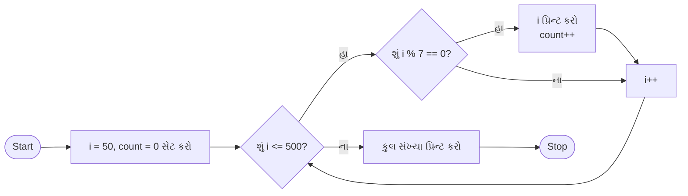

- **મોડ્યુલો ઓપરેટર**: i % 7 == 0 વિભાજ્યતા ચકાસે છે
- **આઉટપુટ ફોર્મેટિંગ**: વાંચવા માટે લાઇન બ્રેક
- **કાઉન્ટર વેરિએબલ**: કેટલી સંખ્યાઓ મળી તે ટ્રેક કરે છે

**મેમરી ટ્રીક:** "સાતથી ભાગો, શૂન્ય શેષ જીતે"

## પ્રશ્ન 5(b) [4 ગુણ]

**કીબોર્ડ પરથી પૂર્ણાંક વાંચી આપેલ સંખ્યા એકી છે કે બેકી છે તે પ્રિન્ટ કરવા માટેનો પ્રોગ્રામ લખો.**

**જવાબ**:

```c
#include <stdio.h>

int main() {
    int number;
    
    // પૂર્ણાંક ઇનપુટ લો
    printf("એક પૂર્ણાંક દાખલ કરો: ");
    scanf("%d", &number);
    
    // સંખ્યા એકી કે બેકી છે તે ચકાસો
    if(number % 2 == 0) {
        printf("%d એક બેકી સંખ્યા છે.\n", number);
    } else {
        printf("%d એક એકી સંખ્યા છે.\n", number);
    }
    
    return 0;
}
```

**નિર્ણય લોજિક:**

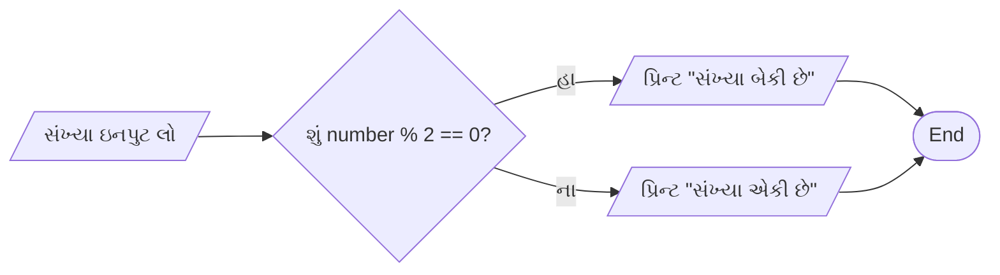

**નાની સંખ્યાઓ માટે મોડ્યુલો ડિવિઝન ટેબલ:**

| સંખ્યા | Number % 2 | એકી/બેકી |
| ---- | ---------- | ------- |
| 0    | 0          | બેકી     |
| 1    | 1          | એકી     |
| 2    | 0          | બેકી     |
| 3    | 1          | એકી     |
| 4    | 0          | બેકી     |

- **મોડ્યુલો ટેસ્ટ**: બેકી સંખ્યાઓને 2 વડે ભાગતાં શેષ 0 આવે છે
- **બાઇનરી રીપ્રેઝન્ટેશન**: બેકી સંખ્યાનો અંતિમ બિટ 0 હોય છે, એકી સંખ્યાનો 1 હોય છે
- **સિમ્પલ એલ્ગોરિધમ**: નેગેટિવ સંખ્યાઓ સહિત બધા પૂર્ણાંકો માટે કામ કરે છે

**મેમરી ટ્રીક:** "બેકી અંતે શૂન્ય, એકી અંતે એક"

## પ્રશ્ન 5(c) [7 ગુણ]

**સ્ટ્રકચર વ્યાખ્યાયિત કરો? સમજાવો કે તે એરેથી કેવી રીતે અલગ છે? પુસ્તકો વિશે નીચેની માહિતી સાચવવા માટે પુસ્તક નામનું સ્ટ્રકચર વિકસાવો. પુસ્તકનું શીર્ષક, લેખકનું નામ, કિંમત અને પાનાંની સંખ્યા.**

**જવાબ**:

સ્ટ્રક્ચર એ વપરાશકર્તા-વ્યાખ્યાયિત ડેટા ટાઇપ છે જે એક જ નામ હેઠળ વિવિધ ડેટા ટાઇપ્સના વેરિએબલ્સના સમૂહને મંજૂરી આપે છે.

**સ્ટ્રક્ચર અને એરે વચ્ચેનો તફાવત:**

| લક્ષણ | સ્ટ્રક્ચર | એરે |
|---------|-----------|-------|
| ડેટા ટાઇપ | વિવિધ ડેટા ટાઇપ્સ સ્ટોર કરી શકે | સમાન ડેટા ટાઇપના એલિમેન્ટ્સ સંગ્રહે છે |
| એક્સેસ | સભ્યો ડોટ (.) ઓપરેટર દ્વારા એક્સેસ થાય છે | એલિમેન્ટ્સ ઇન્ડેક્સ [] દ્વારા એક્સેસ થાય છે |
| મેમરી એલોકેશન | મેમરી સળંગ ન હોઈ શકે | મેમરી હંમેશા સળંગ હોય છે |
| સાઇઝ | દરેક સભ્ય માટે સાઇઝ અલગ-અલગ હોઈ શકે | બધા એલિમેન્ટ્સ માટે સાઇઝ સમાન હોય છે |
| ડેક્લેરેશન | struct કીવર્ડનો ઉપયોગ કરે છે | સ્ક્વેર બ્રેકેટ્સ []નો ઉપયોગ કરે છે |
| હેતુ | સંબંધિત વિષમ ડેટાને સંગઠિત કરે છે | સમાન ડેટાને સંગઠિત કરે છે |

**બુક સ્ટ્રક્ચર પ્રોગ્રામ:**

```c
#include <stdio.h>
#include <string.h>

// સ્ટ્રક્ચર વ્યાખ્યાયિત કરો
struct Book {
    char title[100];
    char author[50];
    float price;
    int pages;
};

int main() {
    // struct Book ટાઇપનું વેરિએબલ ડિક્લેર કરો
    struct Book myBook;
    
    // સ્ટ્રક્ચર સભ્યોને મૂલ્યો આપો
    strcpy(myBook.title, "C પ્રોગ્રામિંગ");
    strcpy(myBook.author, "ડેનિસ રિચી");
    myBook.price = 350.50;
    myBook.pages = 285;
    
    // પુસ્તકની માહિતી દર્શાવો
    printf("પુસ્તક વિગતો:\n");
    printf("શીર્ષક: %s\n", myBook.title);
    printf("લેખક: %s\n", myBook.author);
    printf("કિંમત: %.2f\n", myBook.price);
    printf("પાનાં: %d\n", myBook.pages);
    
    return 0;
}
```

**સ્ટ્રક્ચર વિઝ્યુલાઇઝેશન:**

```goat
struct Book myBook
┌───────────────────┬──────────────────────────────┐
│ Member            │ Value                        │
├───────────────────┼──────────────────────────────┤
│ title             │ "C Programming"              │
├───────────────────┼──────────────────────────────┤
│ author            │ "Dennis Ritchie"             │
├───────────────────┼──────────────────────────────┤
│ price             │ 350.50                       │
├───────────────────┼──────────────────────────────┤
│ pages             │ 285                          │
└───────────────────┴──────────────────────────────┘
```

- **સ્ટ્રક્ચર વ્યાખ્યા**: ડેટા માટે ટેમ્પ્લેટ બનાવે છે
- **સભ્ય એક્સેસ**: ડોટ ઓપરેટર (structure.member) નો ઉપયોગ કરો
- **સ્ટ્રિંગ હેન્ડલિંગ**: કેરેક્ટર એરે માટે સ્ટ્રિંગ ફંક્શન્સનો ઉપયોગ કરે છે

**મેમરી ટ્રીક:** "સ્ટ્રક્ચર જુદું એકત્ર કરે, એરે એકસરખું રાખે"

## પ્રશ્ન 5(a OR) [3 ગુણ]

**કીબોર્ડ પરથી વાસ્તવિક સંખ્યા વાંચી અને તેના કરતા મોટો સૌથી નાનો પૂર્ણાંક પ્રિન્ટ કરવા માટેનો પ્રોગ્રામ લખો.**

**જવાબ**:

```c
#include <stdio.h>
#include <math.h>

int main() {
    float number;
    int result;
    
    // વાસ્તવિક સંખ્યા ઇનપુટ લો
    printf("એક વાસ્તવિક સંખ્યા દાખલ કરો: ");
    scanf("%f", &number);
    
    // ઇનપુટથી મોટો નાનામાં નાનો પૂર્ણાંક શોધો
    result = ceil(number);
    
    // પરિણામ દર્શાવો
    printf("%.2f કરતાં મોટો સૌથી નાનો પૂર્ણાંક %d છે\n", number, result);
    
    return 0;
}
```

**ફંક્શન વર્તન:**


**ceil() ફંક્શનના ઉદાહરણો:**

```
વાસ્તવિક સંખ્યા | ceil() પરિણામ
--------------|-------------
    3.14    |      4
    5.0     |      5
   -2.7     |     -2
```

- **મેથ ફંક્શન**: ceil() આગળના પૂર્ણાંક પર રાઉન્ડ કરે છે
- **પરિણામ ટાઇપ**: ઇનપુટથી મોટો નાનામાં નાનો પૂર્ણાંક પરત કરે છે
- **એજ કેસ હેન્ડલિંગ**: નકારાત્મક સંખ્યાઓ માટે પણ કામ કરે છે

**મેમરી ટ્રીક:** "CEILING ફંક્શન, ઉપર જઈએ, આગળનો પૂર્ણાંક બતાવીએ"

## પ્રશ્ન 5(b OR) [4 ગુણ]

**કીબોર્ડ પરથી અક્ષર વાંચી અને તેની ASCII વેલ્યુ પ્રિન્ટ કરવા માટેનો પ્રોગ્રામ લખો.**

**જવાબ**:

```c
#include <stdio.h>

int main() {
    char ch;
    
    // એક અક્ષર ઇનપુટ લો
    printf("એક અક્ષર દાખલ કરો: ");
    scanf("%c", &ch);
    
    // અક્ષરની ASCII વેલ્યુ દર્શાવો
    printf("'%c' ની ASCII વેલ્યુ %d છે\n", ch, ch);
    
    return 0;
}
```

**પ્રોગ્રામ વિઝ્યુલાઇઝેશન:**


**ASCII ટેબલ સેમ્પલ:**


```
અક્ષર | ASCII વેલ્યુ
----------|------------
    'A'    |     65
    'a'    |     97
    '0'    |     48
    ' '    |     32
```

- **કેરેક્ટર સ્ટોરેજ**: કેરેક્ટર્સ મેમરીમાં ઇન્ટીજર તરીકે સંગ્રહ થાય છે
- **ટાઇપ કન્વર્ઝન**: char થી int માં ઓટોમેટિક કન્વર્ઝન
- **એક્સટેન્ડેડ ASCII**: 8-બિટ કેરેક્ટર્સ માટે 0 થી 255 સુધીની વેલ્યુ

**મેમરી ટ્રીક:** "અક્ષરો નીચે સંખ્યાઓ છુપાવે, પ્રિન્ટ બંને બાજુ બતાવે"

## પ્રશ્ન 5(c OR) [7 ગુણ]

**ફંક્શન ને વ્યાખ્યાયિત કરો? તેનો ફાયદો સમજાવો. આપેલ પૂર્ણાંક સંખ્યાના વર્ગની ગણતરી કરવા માટેનું ફંક્શન લખો.**

**જવાબ**:

ફંક્શન એ કોડનો સેલ્ફ-કન્ટેઇન્ડ બ્લોક છે જે ચોક્કસ કાર્ય કરવા માટે ડિઝાઇન કરવામાં આવ્યો છે. તે ઇનપુટ લે છે, તેને પ્રોસેસ કરે છે, અને આઉટપુટ પરત કરે છે.

**ફંક્શનના ફાયદાઓ:**

| ફાયદો | વર્ણન |
|-----------|-------------|
| કોડ રીયુઝેબિલિટી | એક વખત લખો, અનેક વખત વાપરો |
| મોડ્યુલારિટી | જટિલ સમસ્યાઓને સંચાલિત ભાગોમાં વિભાજિત કરો |
| મેઇન્ટેનેબિલિટી | ઇસોલેટેડ કોડને ડિબગ અને મોડિફાય કરવું સરળ છે |
| એબ્સ્ટ્રેક્શન | અમલીકરણની વિગતો છુપાવો |
| વાંચનક્ષમતા | કોડને વધુ સંગઠિત અને સમજવા યોગ્ય બનાવે છે |
| સ્કોપ કંટ્રોલ | ફંક્શન્સ માટે લોકલ વેરિએબલ્સ નેમિંગ કોન્ફ્લિક્ટ ઘટાડે છે |

**સ્ક્વેર ફંક્શન સાથે પ્રોગ્રામ:**

```c
#include <stdio.h>

// પૂર્ણાંકના વર્ગની ગણતરી કરવાનું ફંક્શન
int square(int num) {
    return num * num;
}

int main() {
    int number, result;
    
    // પૂર્ણાંક ઇનપુટ લો
    printf("એક પૂર્ણાંક દાખલ કરો: ");
    scanf("%d", &number);
    
    // square ફંક્શન કૉલ કરો
    result = square(number);
    
    // પરિણામ દર્શાવો
    printf("%d નો વર્ગ %d છે\n", number, result);
    
    return 0;
}
```

**ફંક્શન ફ્લો:**

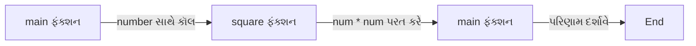

**ફંક્શન ઘટકો:**

```
Return Type    Function Name    Parameters
    ↓               ↓               ↓
   int           square          (int num)
                    ↓
              Function Body
            {                
             return num * num;   ← Function Logic
            }
```

- **ફંક્શન પ્રોટોટાઇપ**: ફંક્શન સિગ્નેચર જાહેર કરે છે
- **પેરામીટર્સ**: ફંક્શનમાં પાસ કરેલા ઇનપુટ મૂલ્યો
- **રિટર્ન વેલ્યુ**: ફંક્શનમાંથી આઉટપુટ અથવા પરિણામ

**મેમરી ટ્રીક:** "ફંક્શન કાર્યોને ENCAPSULATE કરે, INPUTS લે, OUTPUTS આપે"
