## Question 1(a) [3 marks]

**Define algorithm and write an algorithm to find area of circle.**

**Answer**:
An algorithm is a step-by-step procedure or set of rules for solving a specific problem or accomplishing a particular task.

**Algorithm to find area of circle:**

```
Step 1: Start
Step 2: Input radius (r) of the circle
Step 3: Calculate area = π × r²
Step 4: Display the area
Step 5: Stop
```

**Mnemonic:** "Start, Read, Calculate, Display, Stop"

## Question 1(b) [4 marks]

**Define flowchart and draw a flowchart to find minimum of three numbers.**

**Answer**:
A flowchart is a visual representation of an algorithm using standardized symbols and shapes connected by arrows to show the sequence of steps.

**Flowchart to find minimum of three numbers:**

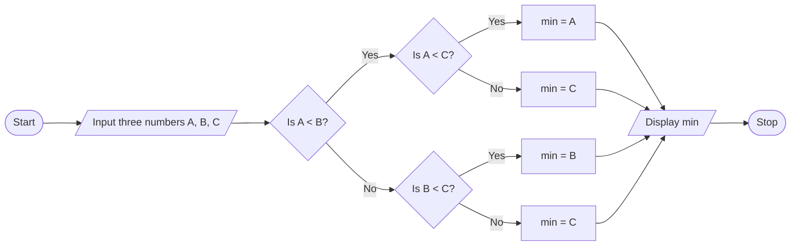

- **Comparison Strategy**: First compare A and B, then compare with C
- **Branching Logic**: Use if-else structure to find smallest value

**Mnemonic:** "Compare pairs, find the rare small value everywhere"

## Question 1(c) [7 marks]

**Write a program to calculate simple interest using below equation. I=PRN/100 Where P=Principle amount, R=Rate of interest and N=Period.**

**Answer**:

```c
#include <stdio.h>

int main() {
    float P, R, N, I;
    
    // Input principal amount, rate of interest and time period
    printf("Enter Principal amount: ");
    scanf("%f", &P);
    
    printf("Enter Rate of interest: ");
    scanf("%f", &R);
    
    printf("Enter Time period (in years): ");
    scanf("%f", &N);
    
    // Calculate Simple Interest
    I = (P * R * N) / 100;
    
    // Display the result
    printf("Simple Interest = %.2f\n", I);
    
    return 0;
}
```

**Diagram:**

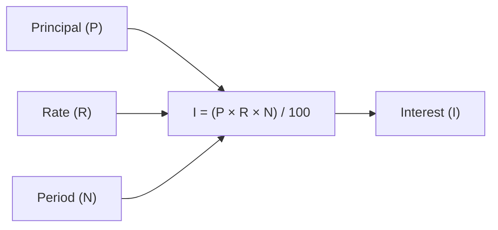

- **Floating-point variables**: Store decimal values for precision
- **User interaction**: Clear prompts for input
- **Result formatting**: %.2f displays two decimal places

**Mnemonic:** "Principal, Rate and Number, divided by Hundred gives Interest"

## Question 1(c OR) [7 marks]

**Write a program to read radius(R) and height(H) from keyboard and print calculated the volume(V) of cylinder using V=πR²H**

**Answer**:

```c
#include <stdio.h>

int main() {
    float radius, height, volume;
    const float PI = 3.14159;
    
    // Input radius and height
    printf("Enter radius of cylinder: ");
    scanf("%f", &radius);
    
    printf("Enter height of cylinder: ");
    scanf("%f", &height);
    
    // Calculate volume of cylinder
    volume = PI * radius * radius * height;
    
    // Display the result
    printf("Volume of cylinder = %.2f\n", volume);
    
    return 0;
}
```

**Diagram:**

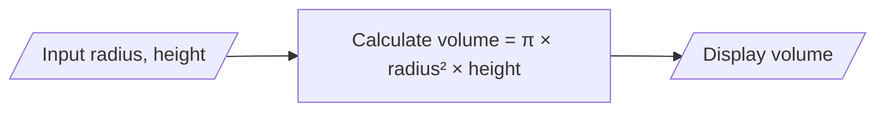

- **Constants**: PI defined as constant for clarity
- **Formula**: Use R² by multiplying radius twice
- **Input validation**: Assumes positive values for radius and height

**Mnemonic:** "Radius squared times height times Pi, gives cylinder volume, don't ask why"

## Question 2(a) [3 marks]

**List out different operators supported in C programming language.**

**Answer**:

| Category | Operators |
|----------|-----------|
| Arithmetic | +, -, *, /, % (addition, subtraction, multiplication, division, modulus) |
| Relational | ==, !=, >, <, >=, <= (equal, not equal, greater than, less than, greater than or equal to, less than or equal to) |
| Logical | &&, \|\|, ! (AND, OR, NOT) |
| Assignment | =, +=, -=, *=, /=, %= (assign, plus-assign, minus-assign, etc.) |
| Increment/Decrement | ++, -- (increment, decrement) |
| Bitwise | &, \|, ^, ~, <<, >> (AND, OR, XOR, complement, left shift, right shift) |
| Conditional | ? : (ternary operator) |
| Special | sizeof(), &, *, ->, . (size, address, pointer, structure) |

**Mnemonic:** "ARABIA CS" (Arithmetic, Relational, Assignment, Bitwise, Increment, Assignment, Conditional, Special)

## Question 2(b) [4 marks]

**Explain Relational operator and Increment/Decrement operator with example.**

**Answer**:

| Operator Type | Description | Example | Output |
|---------------|-------------|---------|--------|
| Relational | Compare two values to test the relationship between them | `int a = 5, b = 10;`<br>`printf("%d", a < b);` | `1` (true) |
| | Equal to (==) | `printf("%d", 5 == 5);` | `1` (true) |
| | Not equal to (!=) | `printf("%d", 5 != 10);` | `1` (true) |
| | Greater/Less than | `printf("%d %d", 5 > 3, 5 < 3);` | `1 0` |
| Increment | Increases value by 1<br>Pre-increment (++x): increment then use<br>Post-increment (x++): use then increment | `int x = 5;`<br>`printf("%d ", ++x);`<br>`printf("%d", x);` | `6 6` |
| Decrement | Decreases value by 1<br>Pre-decrement (--x): decrement then use<br>Post-decrement (x--): use then decrement | `int y = 5;`<br>`printf("%d ", y--);`<br>`printf("%d", y);` | `5 4` |

- **Relational operators**: Return 1 (true) or 0 (false)
- **Increment/Decrement**: Changes variable value and returns a value

**Mnemonic:** "Relational tells if TRUE or LIE, Increment/Decrement makes values rise or DIE"

## Question 2(c) [7 marks]

**Write a program to print sum and average of 1 to 100.**

**Answer**:

```c
#include <stdio.h>

int main() {
    int i, sum = 0;
    float average;
    
    // Calculate sum of numbers from 1 to 100
    for(i = 1; i <= 100; i++) {
        sum += i;
    }
    
    // Calculate average
    average = (float)sum / 100;
    
    // Display the results
    printf("Sum of numbers from 1 to 100 = %d\n", sum);
    printf("Average of numbers from 1 to 100 = %.2f\n", average);
    
    return 0;
}
```

**Diagram:**

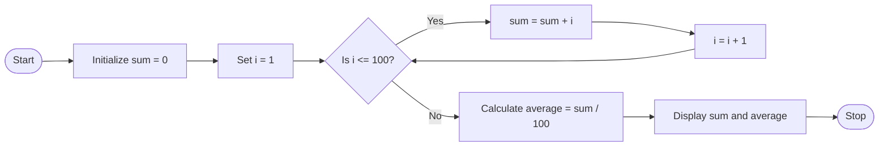

- **Loop counter**: Variable i tracks numbers 1 to 100
- **Sum calculation**: Accumulates values in sum variable
- **Type casting**: (float) converts sum to floating-point for accurate division

**Mnemonic:** "Sum One to Hundred, then Divide for Average"

## Question 2(a OR) [3 marks]

**State the difference between gets(S) and scanf("%s",S) where S is string.**

**Answer**:

| Feature | gets(S) | scanf("%s",S) |
|---------|---------|---------------|
| Input termination | Reads until newline character (\n) | Reads until whitespace (space, tab, newline) |
| Whitespace handling | Can read string with spaces | Stops reading at first whitespace |
| Buffer overflow | No bounds checking (unsafe) | No bounds checking (unsafe) |
| Return value | Returns S on success, NULL on error | Returns number of items successfully read |
| Replacement | fgets() is safer alternative | scanf("%ns",S) with width limit is safer |

- **Safety concern**: Both functions can cause buffer overflow
- **Practical usage**: gets() for full lines, scanf() for single words

**Mnemonic:** "gets Gets Everything Till newline, scanf Stops Catching After Finding whitespace"

## Question 2(b OR) [4 marks]

**Explain Logical operator and Assignment operator with example.**

**Answer**:

| Operator Type | Description | Example | Output |
|---------------|-------------|---------|--------|
| Logical | Perform logical operations on conditions | `int a = 5, b = 10;` | |
| | Logical AND (&&) | `printf("%d", (a > 0) && (b > 0));` | `1` (true) |
| | Logical OR (\\|\\|) | `printf("%d", (a > 10) \|\| (b > 5));` | `1` (true) |
| | Logical NOT (!) | `printf("%d", !(a == b));` | `1` (true) |
| Assignment | Assign values to variables | `int x = 10;` | `x = 10` |
| | Simple assignment (=) | `x = 20;` | `x = 20` |
| | Add and assign (+=) | `x += 5;` | `x = 25` |
| | Subtract and assign (-=) | `x -= 10;` | `x = 15` |
| | Multiply and assign (*=) | `x *= 2;` | `x = 30` |
| | Divide and assign (/=) | `x /= 3;` | `x = 10` |

- **Logical operators**: Used in decision making
- **Short-circuit evaluation**: && and || evaluate only what's necessary
- **Compound assignment**: Combines operation and assignment

**Mnemonic:** "AND needs all TRUE, OR needs just one; Assignment takes right, puts it on the left throne"

## Question 2(c OR) [7 marks]

**Write a program to print all the integers between given two floating point numbers.**

**Answer**:

```c
#include <stdio.h>
#include <math.h>

int main() {
    float num1, num2;
    int start, end, i;
    
    // Input two floating point numbers
    printf("Enter first floating point number: ");
    scanf("%f", &num1);
    
    printf("Enter second floating point number: ");
    scanf("%f", &num2);
    
    // Find the ceil of smaller number and floor of larger number
    if(num1 < num2) {
        start = ceil(num1);
        end = floor(num2);
    } else {
        start = ceil(num2);
        end = floor(num1);
    }
    
    // Print all integers between the two numbers
    printf("Integers between %.2f and %.2f are:\n", num1, num2);
    for(i = start; i <= end; i++) {
        printf("%d ", i);
    }
    printf("\n");
    
    return 0;
}
```

**Diagram:**

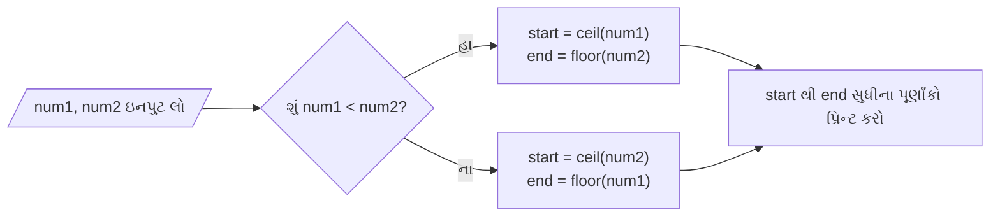

- **Math functions**: ceil() rounds up, floor() rounds down
- **Range determination**: Works regardless of input order
- **Integer extraction**: Only prints whole numbers between floats

**Mnemonic:** "Ceiling the small, flooring the big, then print every Integer in between"

## Question 3(a) [3 marks]

**Explain multiple if-else statement with example.**

**Answer**:

Multiple if-else statements allow testing several conditions in sequence, where each condition is checked only if the previous conditions are false.

```c
#include <stdio.h>

int main() {
    int marks;
    
    printf("Enter marks (0-100): ");
    scanf("%d", &marks);
    
    if(marks >= 80) {
        printf("Grade: A\n");
    } else if(marks >= 70) {
        printf("Grade: B\n");
    } else if(marks >= 60) {
        printf("Grade: C\n");
    } else if(marks >= 50) {
        printf("Grade: D\n");
    } else {
        printf("Grade: F\n");
    }
    
    return 0;
}
```

**Diagram:**

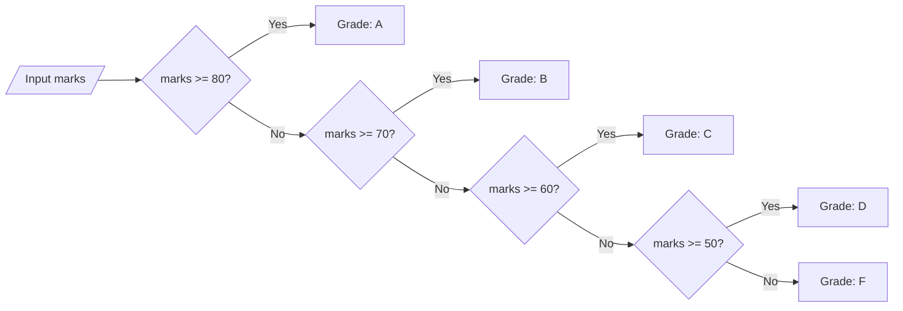

- **Sequential testing**: Only one block executes
- **Efficiency**: Stops checking after finding true condition

**Mnemonic:** "If this THEN that, ELSE IF another THEN something else"

## Question 3(b) [4 marks]

**State the working of while loop and for loop.**

**Answer**:

| Loop Type | Working | Syntax | Use Cases |
|-----------|---------|--------|-----------|
| while loop | 1. Test condition<br>2. If true, execute body<br>3. Repeat steps 1-2 until condition is false | `while(condition) {`<br>`    // statements`<br>`}` | When number of iterations is unknown beforehand |
| for loop | 1. Execute initialization once<br>2. Test condition<br>3. If true, execute body<br>4. Execute update statement<br>5. Repeat steps 2-4 until condition is false | `for(initialization; condition; update) {`<br>`    // statements`<br>`}` | When number of iterations is known beforehand |

**Comparison:**

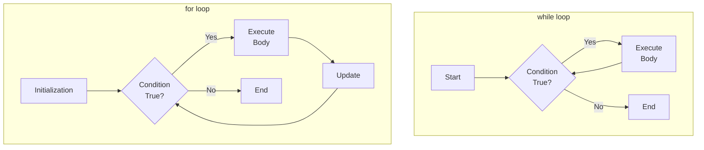

- **Entry control**: Both check condition before execution
- **Components**: for loop combines initialization, condition, and update

**Mnemonic:** "WHILE checks THEN acts, FOR initializes CHECKS acts UPDATES"

## Question 3(c) [7 marks]

**Write a program to find factorial of a given number.**

**Answer**:

```c
#include <stdio.h>

int main() {
    int num, i;
    unsigned long long factorial = 1;
    
    // Input a number
    printf("Enter a positive integer: ");
    scanf("%d", &num);
    
    // Check if the number is negative
    if(num < 0) {
        printf("Error: Factorial is not defined for negative numbers.\n");
    } else {
        // Calculate factorial
        for(i = 1; i <= num; i++) {
            factorial *= i;
        }
        
        printf("Factorial of %d = %llu\n", num, factorial);
    }
    
    return 0;
}
```

**Diagram:**

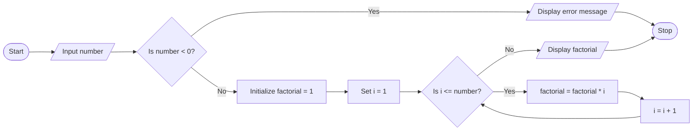

- **Data type**: unsigned long long for large factorials
- **Error handling**: Checks for negative input
- **Loop implementation**: Multiply successive integers

**Mnemonic:** "Factorial Formula: Multiply From One to Number"

## Question 3(a OR) [3 marks]

**Explain the working of switch-case statement with example.**

**Answer**:

The switch-case statement is a multi-way decision maker that tests the value of an expression against various case values and executes the matching case block.

```c
#include <stdio.h>

int main() {
    int day;
    
    printf("Enter day number (1-7): ");
    scanf("%d", &day);
    
    switch(day) {
        case 1:
            printf("Monday\n");
            break;
        case 2:
            printf("Tuesday\n");
            break;
        case 3:
            printf("Wednesday\n");
            break;
        case 4:
            printf("Thursday\n");
            break;
        case 5:
            printf("Friday\n");
            break;
        case 6:
            printf("Saturday\n");
            break;
        case 7:
            printf("Sunday\n");
            break;
        default:
            printf("Invalid day number\n");
    }
    
    return 0;
}
```

**Diagram:**

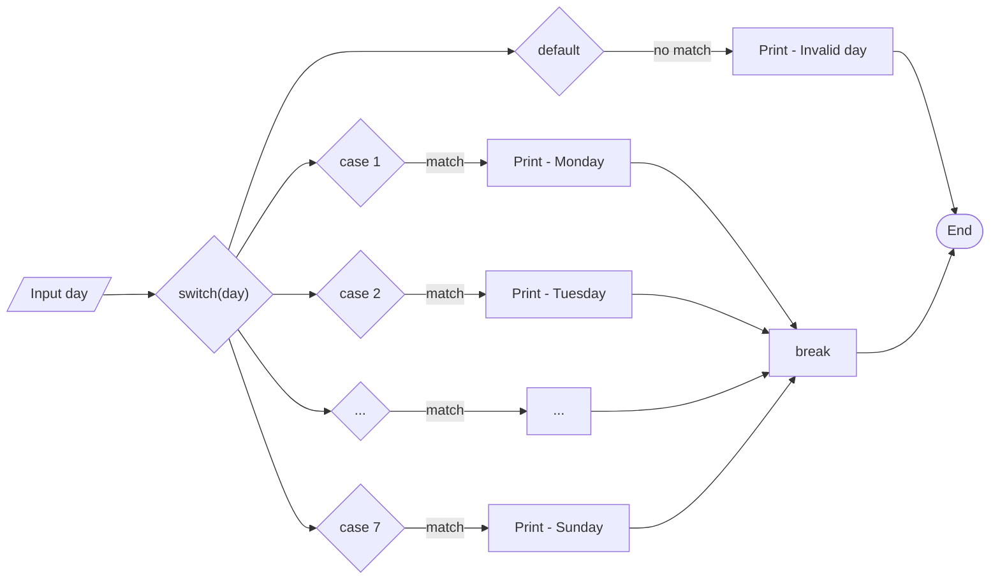

- **Expression evaluation**: Only integer or character types
- **Case matching**: Executes matching case until break
- **Default case**: Executes when no case matches

**Mnemonic:** "SWITCH value, CASE match, BREAK out, DEFAULT rescue"

## Question 3(b OR) [4 marks]

**Define break and continue keyword.**

**Answer**:

| Keyword | Definition | Purpose | Example |
|---------|------------|---------|---------|
| break | Terminates the innermost loop or switch statement immediately | To exit a loop prematurely when a certain condition is met | ```c for(i=1; i<=10; i++) { if(i == 5) break; printf("%d ", i); } // Output: 1 2 3 4``` |
| continue | Skips the rest of the current iteration and jumps to the next iteration of the loop | To skip specific iterations without terminating the loop | ```c for(i=1; i<=10; i++) { if(i == 5) continue; printf("%d ", i); } // Output: 1 2 3 4 6 7 8 9 10``` |

**Behavioral Comparison:**

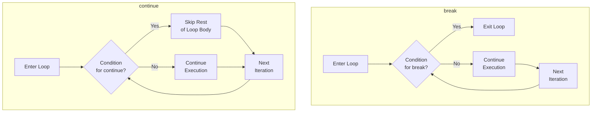

- **Scope**: Both affect only the innermost loop
- **Control transfer**: break exits loop, continue jumps to next iteration

**Mnemonic:** "BREAK leaves the room, CONTINUE skips to the next dance move"

## Question 3(c OR) [7 marks]

**Write a program to read number of lines (n) from keyboard and print the triangle shown below.**

**For Example, n=5**

```
1
1 2
1 2 3
1 2 3 4
1 2 3 4 5
```

**Answer**:

```c
#include <stdio.h>

int main() {
    int n, i, j;
    
    // Input number of lines
    printf("Enter number of lines: ");
    scanf("%d", &n);
    
    // Print the triangle pattern
    for(i = 1; i <= n; i++) {
        // Print numbers from 1 to i in each row
        for(j = 1; j <= i; j++) {
            printf("%d ", j);
        }
        printf("\n");
    }
    
    return 0;
}
```

**Pattern Visualization:**

```
Row 1: 1
Row 2: 1 2
Row 3: 1 2 3
Row 4: 1 2 3 4
Row 5: 1 2 3 4 5
```

**Program Flow:**

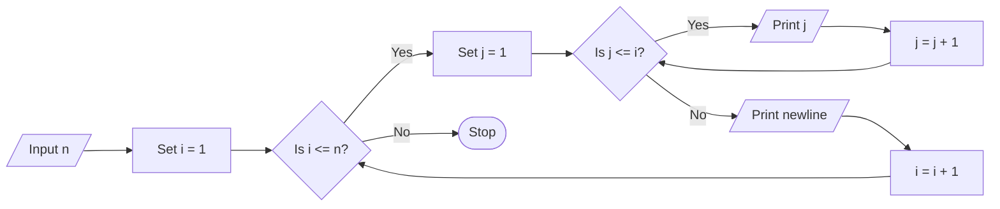

- **Nested loops**: Outer loop for rows, inner loop for columns
- **Pattern logic**: Row number determines how many numbers to print
- **Number sequence**: Each row prints 1 to row number

**Mnemonic:** "Rows decide COUNTer limit, COLumns print ONE to ROW"

## Question 4(a) [3 marks]

**Explain nested if-else statement with example.**

**Answer**:

Nested if-else statements are if-else constructs placed inside another if or else block, allowing more complex conditional logic and multiple levels of decision making.

```c
#include <stdio.h>

int main() {
    int age;
    char hasID;
    
    printf("Enter age: ");
    scanf("%d", &age);
    
    printf("Do you have ID? (Y/N): ");
    scanf(" %c", &hasID);
    
    if(age >= 18) {
        if(hasID == 'Y' || hasID == 'y') {
            printf("You can vote!\n");
        } else {
            printf("You need ID to vote.\n");
        }
    } else {
        printf("You must be 18 or older to vote.\n");
    }
    
    return 0;
}
```

**Decision Tree:**

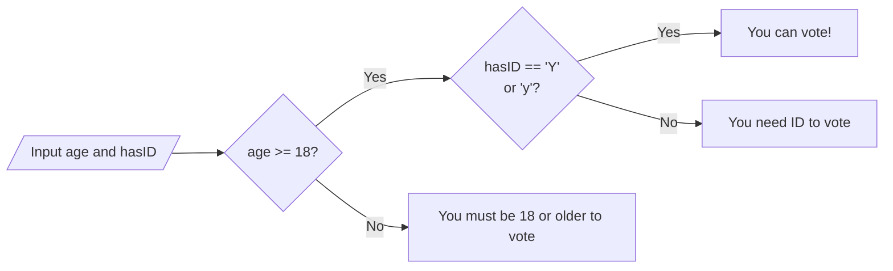

- **Hierarchical conditions**: Evaluates conditions in layers
- **Indentation**: Improves readability of nested structures
- **Multi-factor decisions**: Combines multiple criteria

**Mnemonic:** "If INSIDE if, check DEEPER conditions"

## Question 4(b) [4 marks]

**Describe initialization of one-dimensional array.**

**Answer**:

| Initialization Method | Syntax | Example | Description |
|------------------------|--------|---------|-------------|
| Declaration with size | `data_type array_name[size];` | `int marks[5];` | Creates array with specified size, elements have garbage values |
| Declaration with initialization | `data_type array_name[size] = {values};` | `int ages[4] = {21, 19, 25, 32};` | Creates and initializes array with specific values |
| Partial initialization | `data_type array_name[size] = {values};` | `int nums[5] = {1, 2};` | Initializes first elements, rest become zero |
| Size inference | `data_type array_name[] = {values};` | `int scores[] = {95, 88, 72, 84, 91};` | Size determined by number of initializers |
| Individual element | `array_name[index] = value;` | `marks[0] = 85;` | Assigns value to specific element |

**Array Visualization:**

```
int numbers[5] = {10, 20, 30, 40, 50};
```

```
┌─────┬─────┬─────┬─────┬─────┐
│ 10  │ 20  │ 30  │ 40  │ 50  │
└─────┴─────┴─────┴─────┴─────┘
  [0]   [1]   [2]   [3]   [4]   ← indices
```

- **Zero-indexing**: First element at index 0
- **Contiguous memory**: Elements stored sequentially
- **Size limitation**: Size must be known at compile time

**Mnemonic:** "Declare SIZE first, then FILL with values or let COMPILER COUNT"

## Question 4(c) [7 marks]

**Define Array and write a program to reverse a string.**

**Answer**:

An array is a collection of similar data items stored at contiguous memory locations and accessed using a common name.

```c
#include <stdio.h>
#include <string.h>

int main() {
    char str[100], reversed[100];
    int i, j, length;
    
    // Input a string
    printf("Enter a string: ");
    gets(str);
    
    // Find the length of string
    length = strlen(str);
    
    // Reverse the string
    for(i = length - 1, j = 0; i >= 0; i--, j++) {
        reversed[j] = str[i];
    }
    
    // Add null terminator
    reversed[j] = '\0';
    
    // Display the reversed string
    printf("Reversed string: %s\n", reversed);
    
    return 0;
}
```

**Algorithm Visualization:**

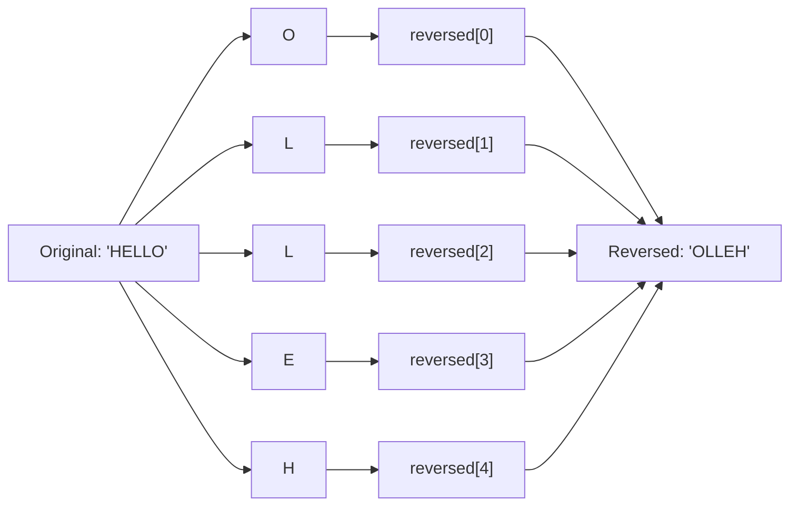

- **Character array**: Stores string with null terminator
- **Two-pointer technique**: One for original, one for reversed
- **Zero-based indexing**: Arrays start at index 0

**Mnemonic:** "Start from END, place at BEGIN, stop at ZERO"

## Question 4(a OR) [3 marks]

**Explain do while loop with example**

**Answer**:

The do-while loop is an exit-controlled loop that executes the loop body at least once before checking the condition.

```c
#include <stdio.h>

int main() {
    int num, sum = 0;
    
    do {
        printf("Enter a number (0 to stop): ");
        scanf("%d", &num);
        sum += num;
    } while(num != 0);
    
    printf("Sum of all entered numbers: %d\n", sum);
    
    return 0;
}
```

**Loop Execution Flow:**

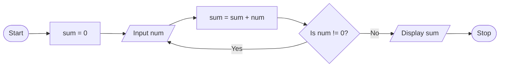

**Key Characteristics:**

- **Execution order**: Body first, condition check later
- **Guaranteed execution**: Loop body always executes at least once
- **Termination**: Condition evaluated at bottom of loop

**Mnemonic:** "DO first, ask questions WHILE later"

## Question 4(b OR) [4 marks]

**Define pointer and describe pointer with example.**

**Answer**:

A pointer is a variable that stores the memory address of another variable.

| Pointer Concept | Description | Example |
|-----------------|-------------|---------|
| Declaration | Data_type *pointer_name; | `int *ptr;` |
| Initialization | Assign address of a variable | `int num = 10; int *ptr = &num;` |
| Dereference | Access the value at the address | `printf("%d", *ptr);` // Prints 10 |
| Address operator | Gets address of a variable | `printf("%p", &num);` // Prints address |
| Null pointer | Pointer that points to nothing | `int *ptr = NULL;` |

**Pointer Visualization:**

```goat
Memory:
┌──────┬───────┐    ┌──────┬───────┐
│ &num │ 1000  │    │ &ptr │ 2000  │
├──────┼───────┤    ├──────┼───────┤
│ num  │   10  │    │ ptr  │ 1000  │
└──────┴───────┘    └──────┴───────┘
                      │
                      └──────> Points to address of num
```

- **Indirect access**: Access variables through their addresses
- **Memory manipulation**: Direct memory access for efficiency
- **Dynamic memory**: Enables allocation/deallocation during runtime

**Mnemonic:** "Pointers POINT to ADDRESS, STARS dereference to VALUES"

## Question 4(c OR) [7 marks]

**Define pointer and write a program to exchange two integers using pointer arguments.**

**Answer**:

A pointer is a variable that contains the memory address of another variable, allowing indirect access and manipulation of data.

```c
#include <stdio.h>

// Function to swap two integers using pointers
void swap(int *a, int *b) {
    int temp = *a;
    *a = *b;
    *b = temp;
}

int main() {
    int num1, num2;
    
    // Input two integers
    printf("Enter first number: ");
    scanf("%d", &num1);
    
    printf("Enter second number: ");
    scanf("%d", &num2);
    
    printf("Before swapping: num1 = %d, num2 = %d\n", num1, num2);
    
    // Call swap function with addresses of num1 and num2
    swap(&num1, &num2);
    
    printf("After swapping: num1 = %d, num2 = %d\n", num1, num2);
    
    return 0;
}
```

**Swap Process Visualization:**

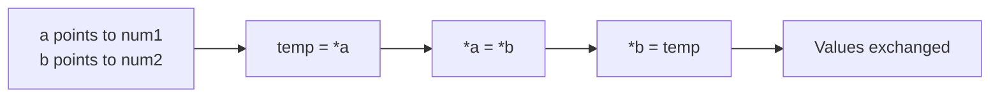

**Memory Changes:**

```
Before swap:
num1 = 5, num2 = 10
a --> num1, b --> num2

Step 1: temp = *a
temp = 5, num1 = 5, num2 = 10

Step 2: *a = *b
temp = 5, num1 = 10, num2 = 10

Step 3: *b = temp
temp = 5, num1 = 10, num2 = 5

After swap:
num1 = 10, num2 = 5
```

- **Pass by reference**: Pointers allow functions to modify original variables
- **Temporary variable**: Required for swapping without data loss
- **Function parameter**: Pointer arguments pass addresses

**Mnemonic:** "Grab by ADDRESS, change the CONTENT, without being PRESENT"

## Question 5(a) [3 marks]

**Write a program to find the numbers which are divisible by 7 in between the numbers 50 and 500.**

**Answer**:

```c
#include <stdio.h>

int main() {
    int i, count = 0;
    
    printf("Numbers divisible by 7 between 50 and 500:\n");
    
    // Find and print numbers divisible by 7
    for(i = 50; i <= 500; i++) {
        if(i % 7 == 0) {
            printf("%d ", i);
            count++;
            
            // Print 10 numbers per line for better readability
            if(count % 10 == 0)
                printf("\n");
        }
    }
    
    printf("\nTotal count: %d\n", count);
    
    return 0;
}
```

**Algorithm Visualization:**

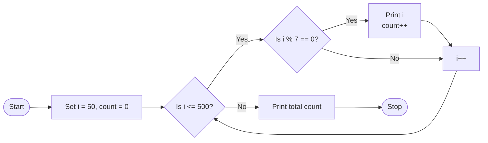

- **Modulo operator**: i % 7 == 0 checks divisibility
- **Formatting output**: Line breaks for readability
- **Counter variable**: Tracks how many numbers found

**Mnemonic:** "DIVide by SEVEN, ZERO remainder wins"

## Question 5(b) [4 marks]

**Write a program which reads an integer from keyboard and prints whether given number is odd or even.**

**Answer**:

```c
#include <stdio.h>

int main() {
    int number;
    
    // Input an integer
    printf("Enter an integer: ");
    scanf("%d", &number);
    
    // Check if the number is even or odd
    if(number % 2 == 0) {
        printf("%d is an even number.\n", number);
    } else {
        printf("%d is an odd number.\n", number);
    }
    
    return 0;
}
```

**Decision Logic:**

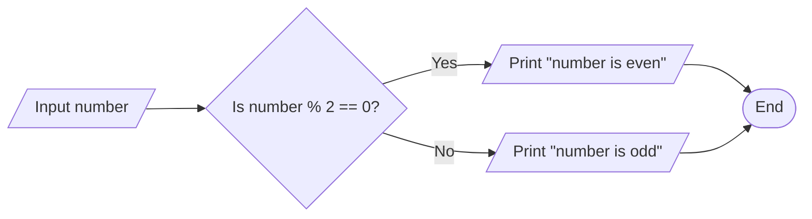

**Modulo Division Table for Small Numbers:**

| Number | Number % 2 | Even/Odd |
| ------ | ---------- | -------- |
| 0      | 0          | Even     |
| 1      | 1          | Odd      |
| 2      | 0          | Even     |
| 3      | 1          | Odd      |
| 4      | 0          | Even     |

- **Modulo test**: Even numbers have remainder 0 when divided by 2
- **Binary representation**: Last bit is 0 for even, 1 for odd
- **Simple algorithm**: Works for all integers including negatives

**Mnemonic:** "EVEN with ZERO end, ODD with ONE bend"

## Question 5(c) [7 marks]

**Define structure? Explain how it differs from array? Develop a structure named book to save following information about books. Book title, Name of author, Price and Number of pages.**

**Answer**:

A structure is a user-defined data type that allows grouping of variables of different data types under a single name.

**Difference between Structure and Array:**

| Feature | Structure | Array |
|---------|-----------|-------|
| Data type | Can store different data types | Stores elements of same data type |
| Access | Members accessed using dot (.) operator | Elements accessed using index [] |
| Memory allocation | Memory may not be contiguous | Memory is always contiguous |
| Size | Size can vary for each member | Size is same for all elements |
| Declaration | Uses struct keyword | Uses square brackets [] |
| Purpose | Organizes related heterogeneous data | Organizes homogeneous data |

**Book Structure Program:**

```c
#include <stdio.h>
#include <string.h>

// Define the structure
struct Book {
    char title[100];
    char author[50];
    float price;
    int pages;
};

int main() {
    // Declare a variable of type struct Book
    struct Book myBook;
    
    // Assign values to the structure members
    strcpy(myBook.title, "C Programming");
    strcpy(myBook.author, "Dennis Ritchie");
    myBook.price = 350.50;
    myBook.pages = 285;
    
    // Display book information
    printf("Book Details:\n");
    printf("Title: %s\n", myBook.title);
    printf("Author: %s\n", myBook.author);
    printf("Price: %.2f\n", myBook.price);
    printf("Pages: %d\n", myBook.pages);
    
    return 0;
}
```

**Structure Visualization:**

```goat
struct Book myBook
┌───────────────────┬──────────────────────────────┐
│ Member            │ Value                        │
├───────────────────┼──────────────────────────────┤
│ title             │ "C Programming"              │
├───────────────────┼──────────────────────────────┤
│ author            │ "Dennis Ritchie"             │
├───────────────────┼──────────────────────────────┤
│ price             │ 350.50                       │
├───────────────────┼──────────────────────────────┤
│ pages             │ 285                          │
└───────────────────┴──────────────────────────────┘
```

- **Structure definition**: Creates template for data
- **Member access**: Use dot operator (structure.member)
- **String handling**: Uses string functions for character arrays

**Mnemonic:** "STRUCTURE groups DIFFERENT, ARRAY repeats SAME"

## Question 5(a OR) [3 marks]

**Write a program which reads a real number from keyboard and prints a smallest integer greater than it.**

**Answer**:

```c
#include <stdio.h>
#include <math.h>

int main() {
    float number;
    int result;
    
    // Input a real number
    printf("Enter a real number: ");
    scanf("%f", &number);
    
    // Find smallest integer greater than the input
    result = ceil(number);
    
    // Display the result
    printf("Smallest integer greater than %.2f is %d\n", number, result);
    
    return 0;
}
```

**Function Behavior:**

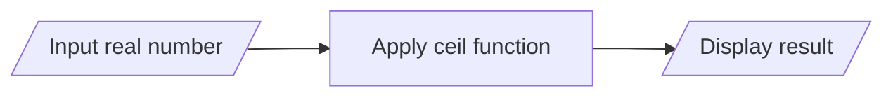

**Examples of ceil() function:**

```
Real Number | ceil() Result
------------|-------------
    3.14    |      4
    5.0     |      5
   -2.7     |     -2
```

- **Math function**: ceil() rounds up to next integer
- **Result type**: Returns smallest integer greater than input
- **Handling edge cases**: Works with negative numbers

**Mnemonic:** "CEILING function, UP we go, NEXT integer we show"

## Question 5(b OR) [4 marks]

**Write a program which reads character from keyboard and prints its ASCII value.**

**Answer**:

```c
#include <stdio.h>

int main() {
    char ch;
    
    // Input a character
    printf("Enter a character: ");
    scanf("%c", &ch);
    
    // Display ASCII value of the character
    printf("ASCII value of '%c' is %d\n", ch, ch);
    
    return 0;
}
```

**Program Visualization:**

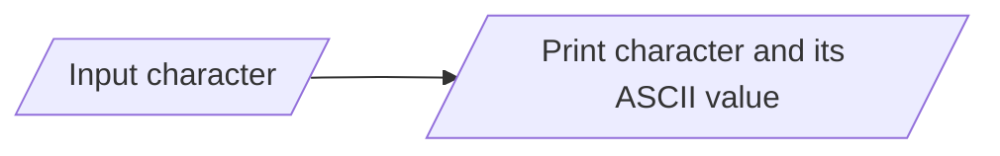

**ASCII Table Sample:**

```
Character | ASCII Value
----------|------------
    'A'    |     65
    'a'    |     97
    '0'    |     48
    ' '    |     32
```

- **Character storage**: Characters stored as integers in memory
- **Type conversion**: Automatic conversion from char to int
- **Extended ASCII**: Values from 0 to 255 for 8-bit characters

**Mnemonic:** "CHARS have NUMBERS underneath, PRINT shows BOTH sides"

## Question 5(c OR) [7 marks]

**Define function? Explain its advantage. Write function to calculate the square of a given integer number.**

**Answer**:

A function is a self-contained block of code designed to perform a specific task. It takes input, processes it, and returns an output.

**Advantages of Functions:**

| Advantage | Description |
|-----------|-------------|
| Code reusability | Write once, use many times |
| Modularity | Break complex problems into manageable parts |
| Maintainability | Easier to debug and modify isolated code |
| Abstraction | Hide implementation details |
| Readability | Makes code more organized and understandable |
| Scope control | Variables local to functions reduce naming conflicts |

**Program with Square Function:**

```c
#include <stdio.h>

// Function to calculate square of an integer
int square(int num) {
    return num * num;
}

int main() {
    int number, result;
    
    // Input an integer
    printf("Enter an integer: ");
    scanf("%d", &number);
    
    // Call the square function
    result = square(number);
    
    // Display the result
    printf("Square of %d is %d\n", number, result);
    
    return 0;
}
```

**Function Flow:**

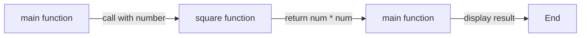

**Function Components:**

```
Return Type    Function Name    Parameters
    ↓               ↓               ↓
   int           square          (int num)
                    ↓
              Function Body
            {                
             return num * num;   ← Function Logic
            }
```

- **Function prototype**: Declares function signature
- **Parameters**: Input values passed to function
- **Return value**: Output or result from function

**Mnemonic:** "Functions ENCAPSULATE tasks, take INPUTS, give OUTPUTS"
