## પ્રશ્ન 1(a) [3 ગુણ]

**C લેંગ્વેજના કોઈ પણ છ કીવર્ડ લખો.**

**જવાબ**:

| વર્ગ | કીવર્ડ |
|----------|----------|
| **ડેટા ટાઈપ્સ** | int, float, char |
| **કંટ્રોલ ફ્લો** | if, for, return |

**મેમરી ટ્રીક:** "I Find Clever Reasons For Results"

## પ્રશ્ન 1(b) [4 ગુણ]

**ઓપરેટરની વ્યાખ્યા આપી operand ના આધારે તેના પ્રકાર જણાવો.**

**જવાબ**:

**ઓપરેટર**: એવું ચિહ્ન કે જે ઓપરન્ડ્સ પર કામ કરીને પરિણામ આપે છે.

| પ્રકાર | વિગત | ઉદાહરણ |
|------|-------------|----------|
| **યુનરી** | એક ઓપરન્ડ | ++, --, ! |
| **બાઇનરી** | બે ઓપરન્ડ | +, -, *, /, % |
| **ટર્નરી** | ત્રણ ઓપરન્ડ | ?: |

**મેમરી ટ્રીક:** "U-B-T: Use Binary Then Ternary"

## પ્રશ્ન 1(c) [7 ગુણ]

**ફ્લોચાર્ટની વ્યાખ્યા લખો. ફ્લોચાર્ટના સિમ્બોલ દોરો. બે પૂર્ણાંક નંબર N1 અને N2 માંથી નાનો નંબર શોધવા માટેનો ફ્લોચાર્ટ દોરો.**

**જવાબ**:

**ફ્લોચાર્ટ**: અલ્ગોરિધમનું ગ્રાફિકલ નિરૂપણ જેમાં પ્રમાણિત ચિહ્નો દ્વારા ક્રમબદ્ધ ઓપરેશનો દર્શાવવામાં આવે છે.

**ફ્લોચાર્ટના સામાન્ય ચિહ્નો:**

| ચિહ્ન | અર્થ |
|--------|---------|
| **ઓવલ** | શરૂઆત/અંત |
| **પેરાલેલોગ્રામ** | ઇનપુટ/આઉટપુટ |
| **લંબચોરસ** | પ્રક્રિયા |
| **ડાયમંડ** | નિર્ણય |
| **એરો** | ફ્લો દિશા |

**N1 અને N2 માંથી નાનો નંબર શોધવા માટેનો ફ્લોચાર્ટ:**

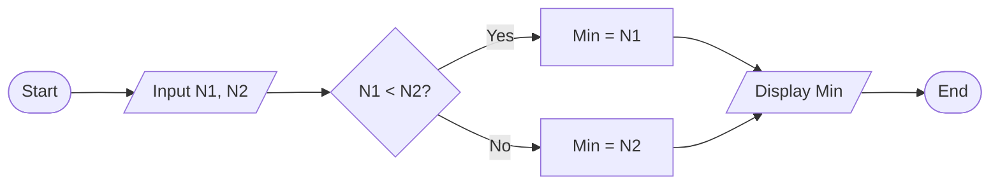

**મેમરી ટ્રીક:** "SPADE: Start-Process-Arrow-Decision-End"

## પ્રશ્ન 1(c) OR [7 ગુણ]

**અલગોરિધમની વ્યાખ્યા લખો. વર્તુળનું ક્ષેત્રફળ અને પરિઘ શોધવા માટેનો અલગોરિધમ લખો.**

**જવાબ**:

**અલગોરિધમ**: કોઈ સમસ્યાને ઉકેલવા માટેનું પગલે પગલે પદ્ધતિસરનું કાર્યવાહી, જેમાં સુનિશ્ચિત સંખ્યામાં સુવ્યાખ્યાયિત સૂચનાઓનો ઉપયોગ થાય છે.

**વર્તુળનું ક્ષેત્રફળ અને પરિઘ શોધવા માટેનો અલગોરિધમ:**

1. **શરૂઆત**
2. **ત્રિજ્યા r ઇનપુટ કરો**
3. **PI = 3.14159 સેટ કરો**
4. **ક્ષેત્રફળ = PI × r × r ગણો**
5. **પરિઘ = 2 × PI × r ગણો**
6. **ક્ષેત્રફળ અને પરિઘ દર્શાવો**
7. **અંત**

**ઉપયોગિત સૂત્રોનો કોષ્ટક:**

| માપન | સૂત્ર |
|-------------|---------|
| **ક્ષેત્રફળ** | π × r² |
| **પરિઘ** | 2 × π × r |

**મેમરી ટ્રીક:** "RICARD: Radius Input, Calculate Area, Reveal Dimensions"

## પ્રશ્ન 2(a) [3 ગુણ]

**printf() અને scanf() વચ્ચેનો તફાવત સમજાવો.**

**જવાબ**:

| લક્ષણ | printf() | scanf() |
|---------|---------|---------|
| **હેતુ** | સ્ક્રીન પર ડેટા આઉટપુટ કરે | કીબોર્ડથી ડેટા ઇનપુટ કરે |
| **દિશા** | આઉટપુટ ફંક્શન | ઇનપુટ ફંક્શન |
| **ફોર્મેટ સ્પેસિફાયર** | જરૂરી | જરૂરી |
| **પેરામીટર** | વાસ્તવિક મૂલ્યો | ચલનું સરનામું (&) |

**મેમરી ટ્રીક:** "OIAD: Output-Input, Actual-Destination"

## પ્રશ્ન 2(b) [4 ગુણ]

**1 થી n સુધીનો સરવાળો અને સરેરાશ પ્રિન્ટ કરવા માટે પ્રોગ્રામ C લખો.**

**જવાબ**:

```c
#include <stdio.h>

int main() {
    int n, i, sum = 0;
    float avg;
    
    printf("Enter n: ");
    scanf("%d", &n);
    
    for(i = 1; i <= n; i++) {
        sum += i;
    }
    
    avg = (float)sum / n;
    
    printf("Sum = %d\n", sum);
    printf("Average = %.2f\n", avg);
    
    return 0;
}
```

**મુખ્ય બિંદુઓ:**

- **ઇનિશિયલાઇઝેશન**: sum = 0
- **પુનરાવર્તન**: 1 થી n સુધી for લૂપ
- **ટાઇપ કાસ્ટિંગ**: સાચા સરેરાશ માટે (float)

**મેમરી ટ્રીક:** "SIAP: Sum Initialize, Add in loop, Print results"

## પ્રશ્ન 2(c) [7 ગુણ]

**એરિથમેટિક ઓપરેટર અને રિલેશનલ ઓપરેટરને ઉદાહરણ સાથે સમજાવો.**

**જવાબ**:

**1. એરિથમેટિક ઓપરેટર:**

| ઓપરેટર | ઓપરેશન | ઉદાહરણ | પરિણામ |
|----------|-----------|---------|--------|
| **+** | સરવાળો | 5 + 3 | 8 |
| **-** | બાદબાકી | 5 - 3 | 2 |
| **\*** | ગુણાકાર | 5 * 3 | 15 |
| **/** | ભાગાકાર | 5 / 2 | 2 (પૂર્ણાંક) |
| **%** | મોડ્યુલો (શેષ) | 5 % 2 | 1 |

**2. રિલેશનલ ઓપરેટર:**

| ઓપરેટર | અર્થ | ઉદાહરણ | પરિણામ |
|----------|---------|---------|--------|
| **<** | કરતાં નાનું | 5 < 3 | 0 (ખોટું) |
| **>** | કરતાં મોટું | 5 > 3 | 1 (સાચું) |
| **<=** | નાનું અથવા સમાન | 5 <= 5 | 1 (સાચું) |
| **>=** | મોટું અથવા સમાન | 3 >= 5 | 0 (ખોટું) |
| **==** | સમાન | 5 == 5 | 1 (સાચું) |
| **!=** | અસમાન | 5 != 3 | 1 (સાચું) |

**કોડ ઉદાહરણ:**

```c
int a = 5, b = 3;
printf("a + b = %d\n", a + b);     // આઉટપુટ: 8
printf("a > b is %d\n", a > b);    // આઉટપુટ: 1 (સાચું)
```

**મેમરી ટ્રીક:** "ASMDR for Arithmetic, LEGENE for Relational"

## પ્રશ્ન 2(a) OR [3 ગુણ]

**get(S) અને scanf("%s",S) વચ્ચેનો તફાવત સમજાવો.**

**જવાબ**:

| લક્ષણ | gets(S) | scanf("%s",S) |
|---------|---------|---------------|
| **વ્હાઇટસ્પેસ હેન્ડલિંગ** | સ્પેસ વાંચે છે | વ્હાઇટસ્પેસ પર બંધ થાય છે |
| **બફર ઓવરફ્લો** | બાઉન્ડરી ચેક નથી | વિડ્થ લિમિટ સાથે સલામત |
| **રિટર્ન ટાઇપ** | char* | વાંચેલા આઇટમની સંખ્યા |
| **ઉપયોગ સુરક્ષા** | ડેપ્રિકેટેડ, અસુરક્ષિત | ફોર્મેટ કંટ્રોલ સાથે સલામત |

**મેમરી ટ્રીક:** "WBRU: Whitespace-Boundary-Return-Usage"

## પ્રશ્ન 2(b) OR [4 ગુણ]

**બે નંબરોના મૂલ્યની અદલાબદલી (એક્સચેન્જ) કરવા માટે C પ્રોગ્રામ લખો.**

**જવાબ**:

```c
#include <stdio.h>

int main() {
    int a, b, temp;
    
    printf("Enter two numbers: ");
    scanf("%d %d", &a, &b);
    
    printf("Before swap: a = %d, b = %d\n", a, b);
    
    temp = a;
    a = b;
    b = temp;
    
    printf("After swap: a = %d, b = %d\n", a, b);
    
    return 0;
}
```

**ડાયાગ્રામ:**

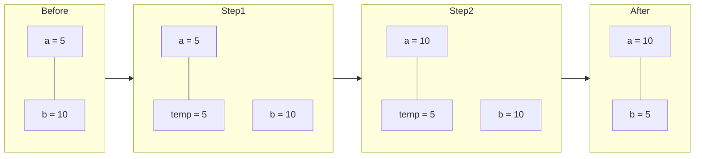

**મેમરી ટ્રીક:** "TAB: Temp-Assign-Backfill"

## પ્રશ્ન 2(c) OR [7 ગુણ]

**બુલિયન ઓપરેટર અને લોજિકલ ઓપરેટર ઉદાહરણ સાથે સમજાવો.**

**જવાબ**:

**1. બુલિયન ઓપરેટર:**

| ઓપરેટર | ઓપરેશન | ઉદાહરણ | પરિણામ |
|----------|-----------|---------|--------|
| **&** | બિટવાઇઝ AND | 5 & 3 | 1 |
| **\|** | બિટવાઇઝ OR | 5 \| 3 | 7 |
| **^** | બિટવાઇઝ XOR | 5 ^ 3 | 6 |
| **~** | બિટવાઇઝ NOT | ~5 | -6 |
| **<<** | લેફ્ટ શિફ્ટ | 5 << 1 | 10 |
| **>>** | રાઇટ શિફ્ટ | 5 >> 1 | 2 |

**2. લોજિકલ ઓપરેટર:**

| ઓપરેટર | અર્થ | ઉદાહરણ | પરિણામ |
|----------|---------|---------|--------|
| **&&** | લોજિકલ AND | (5>3) && (2<4) | 1 (સાચું) |
| **\|\|** | લોજિકલ OR | (5<3) \|\| (2<4) | 1 (સાચું) |
| **!** | લોજિકલ NOT | !(5>3) | 0 (ખોટું) |

**ઉદાહરણ:**

```c
int a = 5, b = 3;
printf("a & b = %d\n", a & b);           // આઉટપુટ: 1 (બિટવાઇઝ AND)
printf("a > b && b < 10 is %d\n", a > b && b < 10);  // આઉટપુટ: 1 (સાચું)
```

**બિટ રિપ્રેઝન્ટેશન (5 & 3):**

```
5 = 101
3 = 011
& = 001 (1 in decimal)
```

**મેમરી ટ્રીક:** "BOXNRL for Boolean, AON for Logical"

## પ્રશ્ન 3(a) [3 ગુણ]

**Entry controlled અને exit controlled લૂપની ઉદાહરણ સાથે સરખામણી કરો.**

**જવાબ**:

| લક્ષણ | Entry Controlled | Exit Controlled |
|---------|-----------------|-----------------|
| **શરત ચકાસણી** | અમલ પહેલા | અમલ પછી |
| **ન્યૂનતમ પુનરાવર્તન** | શૂન્ય | એક |
| **ઉદાહરણ** | while, for | do-while |
| **ઉપયોગ** | પ્રી-ચેક જરૂરી હોય | ઓછામાં ઓછું એક વાર અમલ જરૂરી હોય |

**મેમરી ટ્રીક:** "BCME: Before-Check-Multiple-Examples"

## પ્રશ્ન 3(b) [4 ગુણ]

**સ્વીચ કેસનો ઉપયોગ કરીને બે નંબરોના સરવાળા અને બાદબાકી દર્શાવવા માટેનો C પ્રોગ્રામ લખો.**

**જવાબ**:

```c
#include <stdio.h>

int main() {
    int a, b, choice, result;
    
    printf("Enter two numbers: ");
    scanf("%d %d", &a, &b);
    
    printf("1. Addition\n2. Subtraction\n");
    printf("Enter choice (1/2): ");
    scanf("%d", &choice);
    
    switch(choice) {
        case 1:
            result = a + b;
            printf("Addition: %d\n", result);
            break;
        case 2:
            result = a - b;
            printf("Subtraction: %d\n", result);
            break;
        default:
            printf("Invalid choice\n");
    }
    
    return 0;
}
```

**ફ્લોચાર્ટ:**

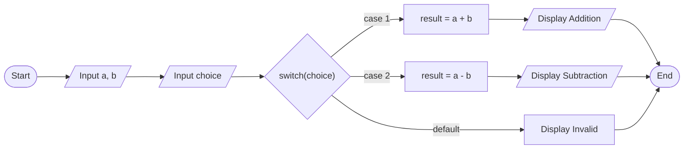

**મેમરી ટ્રીક:** "CIRCA: Choice-Input-Result-Calculate-Action"

## પ્રશ્ન 3(c) [7 ગુણ]

**સિન્ટેક્સ, ફ્લોચાર્ટ અને ઉદાહરણ સાથે multiple if-else સ્ટેટમેન્ટ સમજાવો.**

**જવાબ**:

**multiple if-else સિન્ટેક્સ:**

```c
if (condition1) {
    // code block 1
} 
else if (condition2) {
    // code block 2
} 
else if (condition3) {
    // code block 3
} 
else {
    // default code block
}
```

**ફ્લોચાર્ટ:**

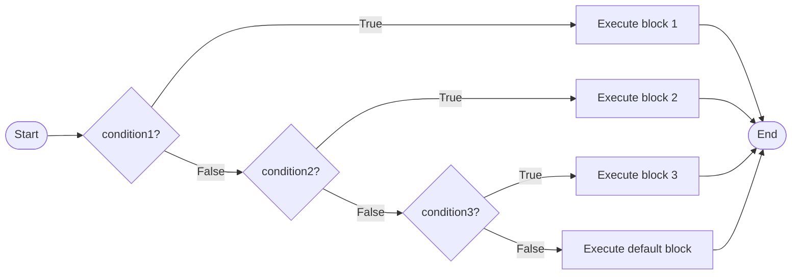

**ઉદાહરણ:**

```c
#include <stdio.h>

int main() {
    int marks;
    
    printf("Enter marks: ");
    scanf("%d", &marks);
    
    if (marks >= 80) {
        printf("Grade: A\n");
    } 
    else if (marks >= 70) {
        printf("Grade: B\n");
    } 
    else if (marks >= 60) {
        printf("Grade: C\n");
    } 
    else {
        printf("Grade: F\n");
    }
    
    return 0;
}
```

**મેમરી ટ્રીક:** "TEST: Try Each Statement Then default"

## પ્રશ્ન 3(a) OR [3 ગુણ]

**break અને continue કીવર્ડનો ઉપયોગ જણાવો.**

**જવાબ**:

| કીવર્ડ | હેતુ | અસર | સામાન્ય ઉપયોગ |
|---------|---------|--------|------------|
| **break** | લૂપ/સ્વિચ ટર્મિનેટ કરે | વર્તમાન લૂપ/સ્વિચ છોડી દે | શરત પૂરી થાય ત્યારે બહાર નીકળવા |
| **continue** | ઇટરેશન છોડે | આગામી ઇટરેશન પર જાય | ચોક્કસ મૂલ્યો છોડવા |

**ઉદાહરણ કોડ:**

```c
// break ઉદાહરણ
for(i=1; i<=10; i++) {
    if(i == 5) break; // i=5 પર લૂપ છોડે
    printf("%d ", i);  // 1 2 3 4 પ્રિન્ટ કરે
}

// continue ઉદાહરણ
for(i=1; i<=5; i++) {
    if(i == 3) continue; // i=3 છોડે
    printf("%d ", i);  // 1 2 4 5 પ્રિન્ટ કરે
}
```

**મેમરી ટ્રીક:** "EXIT-SKIP: EXit IT or SKIP iteration"

## પ્રશ્ન 3(b) OR [4 ગુણ]

**આપેલ સંખ્યા એકી છે કે બેકી તે ચકાસવા માટે C પ્રોગ્રામનો લખો.**

**જવાબ**:

```c
#include <stdio.h>

int main() {
    int num;
    
    printf("Enter a number: ");
    scanf("%d", &num);
    
    if (num % 2 == 0) {
        printf("%d is even.\n", num);
    } 
    else {
        printf("%d is odd.\n", num);
    }
    
    return 0;
}
```

**ડાયાગ્રામ:**

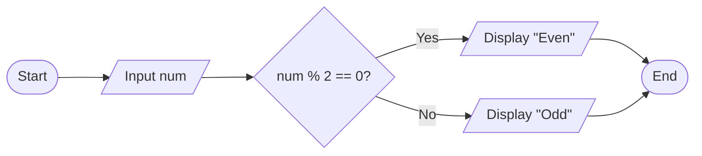

**મુખ્ય બિંદુઓ:**

- **ચકાસણી**: મોડ્યુલો (%) ઓપરેટરનો ઉપયોગ
- **નિર્ણય**: 2 સાથેના શેષ પર આધારિત
- **આઉટપુટ**: શેષ 0 હોય તો બેકી, અન્યથા એકી

**મેમરી ટ્રીક:** "MODE: MODulo Equals zero for even"

## પ્રશ્ન 3(c) OR [7 ગુણ]

**સિન્ટેક્સ, ફ્લોચાર્ટ અને ઉદાહરણ સાથે switch-case statement સ્ટેટમેન્ટ સમજાવો.**

**જવાબ**:

**switch-case સિન્ટેક્સ:**

```c
switch (expression) {
    case constant1:
        // code block 1
        break;
    case constant2:
        // code block 2
        break;
    ...
    default:
        // default code block
}
```

**ફ્લોચાર્ટ:**

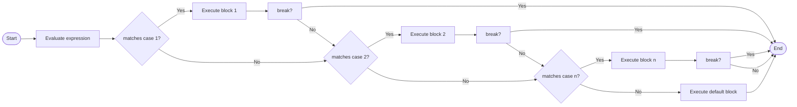

**ઉદાહરણ:**

```c
#include <stdio.h>

int main() {
    char grade;
    
    printf("Enter grade (A-D): ");
    scanf(" %c", &grade);
    
    switch (grade) {
        case 'A':
            printf("Excellent!\n");
            break;
        case 'B':
            printf("Good job!\n");
            break;
        case 'C':
            printf("Satisfactory\n");
            break;
        case 'D':
            printf("Needs improvement\n");
            break;
        default:
            printf("Invalid grade\n");
    }
    
    return 0;
}
```

**મેમરી ટ્રીક:** "CEBID: Compare-Execute-Break-If-Done"

## પ્રશ્ન 4(a) [3 ગુણ]

**સ્ટ્રિંગ વ્યાખ્યાયિત કરો. સ્ટ્રિંગ પર કરી શકાય તેવા વિવિધ ઓપરેશન્સની યાદી આપો.**

**જવાબ**:

**સ્ટ્રિંગ**: કેરેક્ટર્સનો એરે જે NULL કેરેક્ટર '\0' થી સમાપ્ત થાય છે.

| ઓપરેશન | વિગત | ફંક્શન |
|-----------|-------------|----------|
| **ઇનપુટ/આઉટપુટ** | સ્ટ્રિંગ વાંચવી/લખવી | gets(), puts() |
| **કોપી** | એક સ્ટ્રિંગને બીજી સ્ટ્રિંગમાં કોપી કરવી | strcpy() |
| **જોડાણ** | બે સ્ટ્રિંગ જોડવી | strcat() |
| **સરખામણી** | બે સ્ટ્રિંગની સરખામણી | strcmp() |
| **લંબાઈ** | સ્ટ્રિંગની લંબાઈ શોધવી | strlen() |
| **શોધ** | સબસ્ટ્રિંગ શોધવી | strstr() |

**મેમરી ટ્રીક:** "ICCLS: Input-Copy-Concatenate-Length-Search"

## પ્રશ્ન 4(b) [4 ગુણ]

**અપરકેસ આલ્ફાબેટને લોઅરકેસ આલ્ફાબેટમાં કન્વર્ટ કરવા માટે C પ્રોગ્રામ લખો.**

**જવાબ**:

```c
#include <stdio.h>

int main() {
    char ch;
    
    printf("Enter an uppercase letter: ");
    scanf(" %c", &ch);
    
    if (ch >= 'A' && ch <= 'Z') {
        char lowercase = ch + 32;  // ASCII તફાવત 32 છે
        printf("Lowercase: %c\n", lowercase);
    } 
    else {
        printf("Not an uppercase letter\n");
    }
    
    return 0;
}
```

**ASCII ટેબલનો અંશ:**

| કેરેક્ટર | ASCII મૂલ્ય |
|-----------|-------------|
| **A** | 65 |
| **a** | 97 |
| **Z** | 90 |
| **z** | 122 |
| **તફાવત** | 32 |

**મેમરી ટ્રીક:** "COOL: Character Offset Of Lowercase"

## પ્રશ્ન 4(c) [7 ગુણ]

**for લૂપ માટેનો ફ્લોચાર્ટ દોરો અને ઉદાહરણ સાથે સમજાવો.**

**જવાબ**:

**For Loop સિન્ટેક્સ:**

```c
for (initialization; condition; increment/decrement) {
    // code block
}
```

**ફ્લોચાર્ટ:**

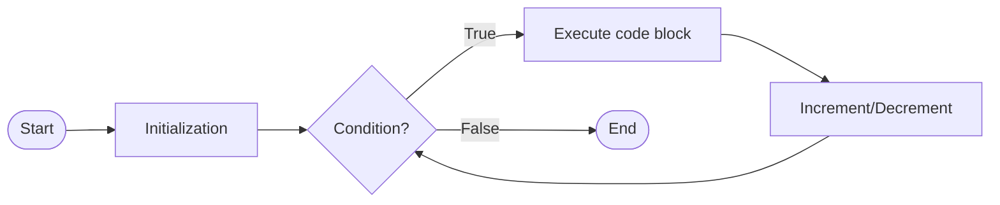

**For Loop ઘટકો:**

1. **ઇનિશિયલાઇઝેશન**: શરૂઆતમાં એક વખત અમલ
2. **શરત**: દરેક પુનરાવર્તન પહેલાં ચકાસાય
3. **વૃદ્ધિ/ઘટાડો**: દરેક પુનરાવર્તન પછી અમલ
4. **બોડી**: શરત સાચી હોય તો અમલ

**ઉદાહરણ:**

```c
#include <stdio.h>

int main() {
    int i;
    
    for (i = 1; i <= 5; i++) {
        printf("%d ", i);
    }
    // આઉટપુટ: 1 2 3 4 5
    
    return 0;
}
```

**અમલીકરણનો પ્રવાહ:**

1. i = 1 પ્રારંભિક
2. શરત ચકાસો (1 <= 5) - સાચું
3. બોડી અમલ - 1 પ્રિન્ટ
4. i ને 2 માં વૃદ્ધિ
5. શરત ચકાસો (2 <= 5) - સાચું
6. અને એ રીતે આગળ i = 6 થાય ત્યાં સુધી

**મેમરી ટ્રીક:** "ICE-T: Initialize, Check, Execute, Then increment"

## પ્રશ્ન 4(a) OR [3 ગુણ]

**એરે વ્યાખ્યાયિત કરો. એરે પર કરી શકાય તેવા વિવિધ ઓપરેશન્સની યાદી આપો.**

**જવાબ**:

**એરે**: સમાન ડેટા પ્રકારના તત્વો જે ક્રમિક મેમરી સ્થાનોમાં સંગ્રહિત થાય છે.

| ઓપરેશન | વિગત | ઉદાહરણ |
|-----------|-------------|---------|
| **ઘોષણા** | એરે બનાવો | int arr[5]; |
| **ઇનિશિયલાઇઝેશન** | મૂલ્ય આપો | arr[0] = 10; |
| **ટ્રેવર્સલ** | તમામ તત્વો એક્સેસ કરો | for loop |
| **ઇન્સર્શન** | નવું તત્વ ઉમેરો | arr[pos] = value; |
| **ડિલીશન** | તત્વ દૂર કરો | તત્વો શિફ્ટ કરો |
| **સર્ચિંગ** | તત્વ શોધો | લિનિયર/બાઇનરી શોધ |
| **સોર્ટિંગ** | તત્વો ગોઠવો | બબલ/સિલેક્શન સોર્ટ |

**મેમરી ટ્રીક:** "DITIDSS: Declare-Initialize-Traverse-Insert-Delete-Search-Sort"

## પ્રશ્ન 4(b) OR [4 ગુણ]

**pointer વ્યાખ્યાયિત કરો. ઉદાહરણ સાથે સમજાવો.**

**જવાબ**:

**પોઇન્ટર**: એવું ચલ જે અન્ય ચલના મેમરી સરનામાને સંગ્રહિત કરે છે.

| કન્સેપ્ટ | વિગત | સિન્ટેક્સ |
|---------|-------------|--------|
| **ઘોષણા** | પોઇન્ટર બનાવો | int *ptr; |
| **એડ્રેસ ઓપરેટર** | સરનામું મેળવો | &variable |
| **ડિરેફરન્સિંગ** | સરનામા પર મૂલ્ય એક્સેસ કરો | *ptr |
| **એસાઇનમેન્ટ** | પોઇન્ટરમાં સરનામું સંગ્રહો | ptr = &variable; |

**ઉદાહરણ:**

```c
#include <stdio.h>

int main() {
    int num = 10;
    int *ptr;
    
    ptr = &num;  // num નું સરનામું ptr માં સંગ્રહો
    
    printf("Value of num: %d\n", num);           // 10
    printf("Address of num: %p\n", &num);        // num નું સરનામું
    printf("Value of ptr: %p\n", ptr);           // સમાન સરનામું
    printf("Value pointed by ptr: %d\n", *ptr);  // 10
    
    *ptr = 20;   // પોઇન્ટર દ્વારા મૂલ્ય બદલો
    printf("New value of num: %d\n", num);       // 20
    
    return 0;
}
```

**ડાયાગ્રામ:**

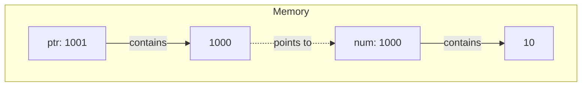

**મેમરી ટ્રીક:** "SAVD: Store Address, Value through Dereferencing"

## પ્રશ્ન 4(c) OR [7 ગુણ]

**while લૂપ માટેનો ફ્લોચાર્ટ દોરો અને ઉદાહરણ સાથે સમજાવો.**

**જવાબ**:

**While Loop સિન્ટેક્સ:**

```c
while (condition) {
    // code block
}
```

**ફ્લોચાર્ટ:**

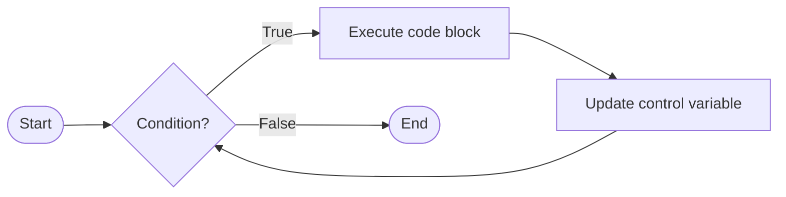

**While Loop ઘટકો:**

1. **ઇનિશિયલાઇઝેશન**: લૂપની પહેલાં
2. **શરત**: દરેક પુનરાવર્તન પહેલાં ચકાસાય
3. **બોડી**: શરત સાચી હોય તો અમલ
4. **અપડેટ**: બોડીની અંદર કરવું જરૂરી

**ઉદાહરણ:**

```c
#include <stdio.h>

int main() {
    int i = 1;
    
    while (i <= 5) {
        printf("%d ", i);
        i++;
    }
    // આઉટપુટ: 1 2 3 4 5
    
    return 0;
}
```

**અમલીકરણનો પ્રવાહ:**

1. i = 1 પ્રારંભિક (લૂપ પહેલાં)
2. શરત ચકાસો (1 <= 5) - સાચું
3. બોડી અમલ - 1 પ્રિન્ટ
4. i ને 2 માં અપડેટ
5. શરત ચકાસો (2 <= 5) - સાચું
6. અને એ રીતે આગળ i = 6 થાય ત્યાં સુધી

**મેમરી ટ્રીક:** "CHECK-UPDATE: CHECK before entering, UPDATE before repeating"

## પ્રશ્ન 5(a) [3 ગુણ]

**નીચેના functions નો ઉપયોગ જણાવો. (1) strcat() (2) strlen() (3) strcpy()**

**જવાબ**:

| ફંક્શન | હેતુ | સિન્ટેક્સ | ઉદાહરણ |
|----------|---------|--------|---------|
| **strcat()** | સ્ટ્રિંગ્સ જોડે છે | strcat(dest, src) | "Hello" + "World" -> "HelloWorld" |
| **strlen()** | સ્ટ્રિંગની લંબાઈ આપે છે | strlen(str) | "Hello" -> 5 |
| **strcpy()** | સ્ટ્રિંગ કોપી કરે છે | strcpy(dest, src) | src -> dest |

**કોડ ઉદાહરણ:**

```c
#include <string.h>

char str1[20] = "Hello";
char str2[20] = "World";
char str3[20];

strcat(str1, str2);    // str1 "HelloWorld" બને છે
int len = strlen(str1); // len 10 બને છે
strcpy(str3, str1);    // str3 "HelloWorld" બને છે
```

**મેમરી ટ્રીક:** "CLS: Concatenate-Length-Source copy"

## પ્રશ્ન 5(b) [4 ગુણ]

**પુસ્તકની માહિતી સંગ્રહિત કરવા માટે એક સ્ટ્રક્ચર બનાવો: book_no, book_title, book_author, book_price.**

**જવાબ**:

```c
#include <stdio.h>
#include <string.h>

struct Book {
    int book_no;
    char book_title[50];
    char book_author[30];
    float book_price;
};

int main() {
    struct Book book1;
    
    // મૂલ્યો આપો
    book1.book_no = 101;
    strcpy(book1.book_title, "Programming in C");
    strcpy(book1.book_author, "Dennis Ritchie");
    book1.book_price = 450.75;
    
    // પુસ્તક માહિતી દર્શાવો
    printf("Book No: %d\n", book1.book_no);
    printf("Title: %s\n", book1.book_title);
    printf("Author: %s\n", book1.book_author);
    printf("Price: %.2f\n", book1.book_price);
    
    return 0;
}
```

**સ્ટ્રક્ચર મેમરી લેઆઉટ:**

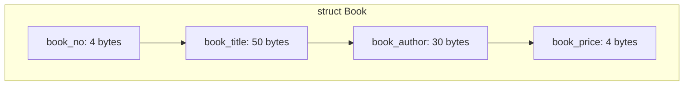

**મેમરી ટ્રીક:** "NTAP: Number-Title-Author-Price"

## પ્રશ્ન 5(c) [7 ગુણ]

**એરે અને એરે initialization સમજાવો. ઉદાહરણ આપો.**

**જવાબ**:

**એરે**: સમાન ડેટા પ્રકારના તત્વોનો સમૂહ જે ક્રમિક મેમરી સ્થાનોમાં સંગ્રહિત થાય છે.

**એરે ઇનિશિયલાઇઝેશન પદ્ધતિઓ:**

| પદ્ધતિ | સિન્ટેક્સ | ઉદાહરણ |
|--------|--------|---------|
| **ઘોષણા સમયે** | datatype array_name[size] = {values}; | int arr[5] = {10, 20, 30, 40, 50}; |
| **આંશિક** | datatype array_name[size] = {values}; | int arr[5] = {10, 20}; // બાકીના 0 છે |
| **બધા શૂન્ય** | datatype array_name[size] = {0}; | int arr[5] = {0}; |
| **તત્વ દર તત્વ** | array_name[index] = value; | arr[0] = 10; arr[1] = 20; |
| **સાઇઝ અનુમાન** | datatype array_name[] = {values}; | int arr[] = {10, 20, 30}; // સાઇઝ 3 |

**ઉદાહરણ:**

```c
#include <stdio.h>

int main() {
    // પદ્ધતિ 1: પૂર્ણ ઇનિશિયલાઇઝેશન
    int arr1[5] = {10, 20, 30, 40, 50};
    
    // પદ્ધતિ 2: આંશિક ઇનિશિયલાઇઝેશન (બાકીના તત્વો 0 થાય છે)
    int arr2[5] = {10, 20};  // arr2[2], arr2[3], arr2[4] શૂન્ય થાય છે
    
    // પદ્ધતિ 3: તત્વ દર તત્વ
    int arr3[3];
    arr3[0] = 100;
    arr3[1] = 200;
    arr3[2] = 300;
    
    // પદ્ધતિ 4: સાઇઝ અનુમાન
    int arr4[] = {1, 2, 3, 4, 5};  // સાઇઝ આપોઆપ 5 થાય છે
    
    // તત્વો એક્સેસ
    printf("arr1[2] = %d\n", arr1[2]);  // આઉટપુટ: 30
    
    // એરે ટ્રેવર્સલ
    printf("arr4 elements: ");
    for(int i = 0; i < 5; i++) {
        printf("%d ", arr4[i]);  // આઉટપુટ: 1 2 3 4 5
    }
    
    return 0;
}
```

**મેમરી રિપ્રેઝન્ટેશન:**

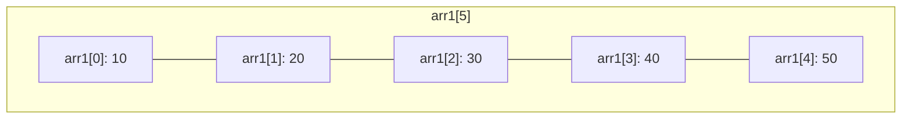

**મેમરી ટ્રીક:** "CAPES: Complete, Automatic, Partial, Element, Size-inferred"

## પ્રશ્ન 5(a) OR [3 ગુણ]

**array અને structure ઉદાહરણ સાથે સરખામણી કરો.**

**જવાબ**:

| લક્ષણ | Array | Structure |
|---------|-------|-----------|
| **ડેટા ટાઇપ** | સમાન પ્રકારના તત્વો | અલગ પ્રકારના તત્વો |
| **એક્સેસ** | ઇન્ડેક્સનો ઉપયોગ (arr[i]) | ડોટ ઓપરેટરનો ઉપયોગ (s.member) |
| **મેમરી** | ક્રમિક, ફિક્સ સાઇઝ | ક્રમિક, પેડિંગ હોઈ શકે |
| **એસાઇનમેન્ટ** | તત્વ દર તત્વ | સીધું જ સુસંગત સ્ટ્રક્ચર સાથે |
| **હેતુ** | સમાન આઇટમોનો સંગ્રહ | સંબંધિત ડેટાનો સમૂહ |

**એરે ઉદાહરણ:**

```c
int marks[5] = {85, 90, 78, 92, 88};
printf("%d", marks[2]);  // ઇન્ડેક્સ 2 (78) પર તત્વ એક્સેસ
```

**સ્ટ્રક્ચર ઉદાહરણ:**

```c
struct Student {
    int roll_no;
    char name[20];
    float percentage;
};

struct Student s1 = {101, "Raj", 85.5};
printf("%s", s1.name);  // name મેમ્બર ("Raj") એક્સેસ
```

**મેમરી ટ્રીક:** "DAMPA: Datatype-Access-Memory-Purpose-Assignment"

## પ્રશ્ન 5(b) OR [4 ગુણ]

**User Defined Function વ્યાખ્યાયિત કરો. ઉદાહરણ સાથે સમજાવો.**

**જવાબ**:

**User Defined Function**: પ્રોગ્રામર દ્વારા લખાયેલ કોડનો બ્લોક જે ચોક્કસ કાર્ય કરે છે અને તેને વારંવાર કોલ કરી શકાય છે.

| ઘટક | વિગત | ઉદાહરણ |
|-----------|-------------|---------|
| **રિટર્ન ટાઇપ** | પરત થતા ડેટાનો પ્રકાર | int, float, void |
| **ફંક્શન નેમ** | અનન્ય ઓળખકર્તા | sum, findMax |
| **પેરામીટર્સ** | ઇનપુટ ડેટા | (int a, int b) |
| **બોડી** | સ્ટેટમેન્ટ સમૂહ | { return a+b; } |

**ઉદાહરણ:**

```c
#include <stdio.h>

// ફંક્શન ઘોષણા
int sum(int a, int b);

int main() {
    int num1 = 10, num2 = 20, result;
    
    // ફંક્શન કોલ
    result = sum(num1, num2);
    
    printf("Sum = %d\n", result);
    
    return 0;
}

// ફંક્શન વ્યાખ્યા
int sum(int a, int b) {
    return a + b;
}
```

**ફંક્શન ફ્લો:**

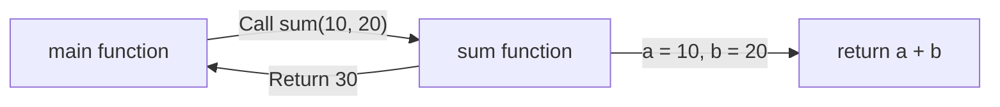

**મેમરી ટ્રીક:** "DPCR: Declaration-Parameters-Call-Return"

## પ્રશ્ન 5(c) OR [7 ગુણ]

**એરેમાંથી મહત્તમ અને લઘુત્તમ element શોધવા માટે C પ્રોગ્રામનો લખો.**

**જવાબ**:

```c
#include <stdio.h>

int main() {
    int arr[100], n, i;
    int max, min;
    
    printf("Enter number of elements: ");
    scanf("%d", &n);
    
    printf("Enter %d integers: ", n);
    for(i = 0; i < n; i++) {
        scanf("%d", &arr[i]);
    }
    
    // max અને min પ્રથમ તત્વ સાથે પ્રારંભિક કરો
    max = min = arr[0];
    
    // max અને min શોધો
    for(i = 1; i < n; i++) {
        if(arr[i] > max) {
            max = arr[i];
        }
        if(arr[i] < min) {
            min = arr[i];
        }
    }
    
    printf("Maximum element: %d\n", max);
    printf("Minimum element: %d\n", min);
    
    return 0;
    }
```

**અલ્ગોરિધમ:**

1. એરે સાઇઝ અને તત્વો ઇનપુટ કરો
2. max અને min ને પ્રથમ તત્વ સાથે પ્રારંભિક કરો
3. દરેક બાકીના તત્વ માટે:
   - જો તત્વ > max, max અપડેટ કરો
   - જો તત્વ < min, min અપડેટ કરો
4. max અને min ને દર્શાવો

**ફ્લોચાર્ટ:**

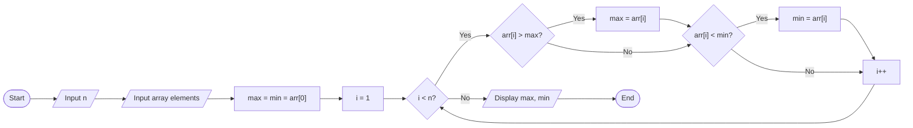

**મેમરી ટ્રીક:** "FILLS: First Initialize, Loop through, Look for Small/large"
