## Question 1(a) [3 marks]

**List any six keywords of C language.**

**Answer**:

| Category | Keywords |
|----------|----------|
| **Data Types** | int, float, char |
| **Control Flow** | if, for, return |

**Mnemonic:** "I Find Clever Reasons For Results"

## Question 1(b) [4 marks]

**Define Operator. Summarize types of operators based on operands.**

**Answer**:

**Operator**: Symbol that performs operations on operands to produce a result.

| Type | Description | Examples |
|------|-------------|----------|
| **Unary** | Single operand | ++, --, ! |
| **Binary** | Two operands | +, -, *, /, % |
| **Ternary** | Three operands | ?: |

**Mnemonic:** "U-B-T: Use Binary Then Ternary"

## Question 1(c) [7 marks]

**Define flowchart. Draw flowchart symbols. Draw flowchart to find minimum of two integer numbers N1 & N2.**

**Answer**:

**Flowchart**: Graphical representation of algorithm using standardized symbols to show the sequence of operations.

**Common Flowchart Symbols:**

| Symbol | Meaning |
|--------|---------|
| **Oval** | Start/Stop |
| **Parallelogram** | Input/Output |
| **Rectangle** | Process |
| **Diamond** | Decision |
| **Arrow** | Flow direction |

**Flowchart to find minimum of N1 & N2:**

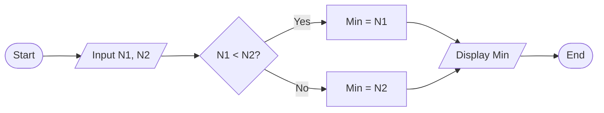

**Mnemonic:** "SPADE: Start-Process-Arrow-Decision-End"

## Question 1(c) OR [7 marks]

**Define algorithm. Write an algorithm to calculate area and circumference of circle.**

**Answer**:

**Algorithm**: Step-by-step procedure to solve a problem using finite number of well-defined instructions.

**Algorithm to calculate area and circumference of circle:**

1. **Start**
2. **Input radius r**
3. **Set PI = 3.14159**
4. **Calculate area = PI × r × r**
5. **Calculate circumference = 2 × PI × r**
6. **Display area and circumference**
7. **Stop**

**Table of formulas used:**

| Measurement | Formula |
|-------------|---------|
| **Area** | π × r² |
| **Circumference** | 2 × π × r |

**Mnemonic:** "RICARD: Radius Input, Calculate Area, Reveal Dimensions"

## Question 2(a) [3 marks]

**Differentiate printf() and scanf().**

**Answer**:

| Feature | printf() | scanf() |
|---------|---------|---------|
| **Purpose** | Outputs data to screen | Inputs data from keyboard |
| **Direction** | Output function | Input function |
| **Format specifier** | Required | Required |
| **Parameter** | Actual values | Address of variables (&) |

**Mnemonic:** "OIAD: Output-Input, Actual-Destination"

## Question 2(b) [4 marks]

**Develop a C program to print sum & average of 1 to n.**

**Answer**:

```c
#include <stdio.h>

int main() {
    int n, i, sum = 0;
    float avg;
    
    printf("Enter n: ");
    scanf("%d", &n);
    
    for(i = 1; i <= n; i++) {
        sum += i;
    }
    
    avg = (float)sum / n;
    
    printf("Sum = %d\n", sum);
    printf("Average = %.2f\n", avg);
    
    return 0;
}
```

**Key Points:**

- **Initialization**: sum = 0
- **Iteration**: for loop from 1 to n
- **Type Casting**: (float) for correct average

**Mnemonic:** "SIAP: Sum Initialize, Add in loop, Print results"

## Question 2(c) [7 marks]

**Explain Arithmetic operator and Relational operator with example.**

**Answer**:

**1. Arithmetic Operators:**

| Operator | Operation | Example | Result |
|----------|-----------|---------|--------|
| **+** | Addition | 5 + 3 | 8 |
| **-** | Subtraction | 5 - 3 | 2 |
| **\*** | Multiplication | 5 * 3 | 15 |
| **/** | Division | 5 / 2 | 2 (integer) |
| **%** | Modulo (Remainder) | 5 % 2 | 1 |

**2. Relational Operators:**

| Operator | Meaning | Example | Result |
|----------|---------|---------|--------|
| **<** | Less than | 5 < 3 | 0 (false) |
| **>** | Greater than | 5 > 3 | 1 (true) |
| **<=** | Less than or equal | 5 <= 5 | 1 (true) |
| **>=** | Greater than or equal | 3 >= 5 | 0 (false) |
| **==** | Equal to | 5 == 5 | 1 (true) |
| **!=** | Not equal to | 5 != 3 | 1 (true) |

**Code Example:**

```c
int a = 5, b = 3;
printf("a + b = %d\n", a + b);     // Output: 8
printf("a > b is %d\n", a > b);    // Output: 1 (true)
```

**Mnemonic:** "ASMDR for Arithmetic, LEGENE for Relational"

## Question 2(a) OR [3 marks]

**What is the difference between get(S) and scanf("%s",S)**

**Answer**:

| Feature | gets(S) | scanf("%s",S) |
|---------|---------|---------------|
| **Whitespace handling** | Reads space | Stops at whitespace |
| **Buffer overflow** | No boundary check | Safer with width limit |
| **Return type** | char* | Number of items read |
| **Usage safety** | Deprecated, unsafe | Safer with format control |

**Mnemonic:** "WBRU: Whitespace-Boundary-Return-Usage"

## Question 2(b) OR [4 marks]

**Develop a C program to swap (exchange) value of two numbers.**

**Answer**:

```c
#include <stdio.h>

int main() {
    int a, b, temp;
    
    printf("Enter two numbers: ");
    scanf("%d %d", &a, &b);
    
    printf("Before swap: a = %d, b = %d\n", a, b);
    
    temp = a;
    a = b;
    b = temp;
    
    printf("After swap: a = %d, b = %d\n", a, b);
    
    return 0;
}
```

**Diagram:**

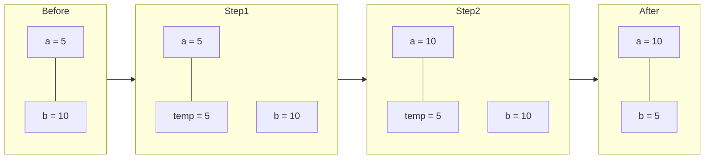

**Mnemonic:** "TAB: Temp-Assign-Backfill"

## Question 2(c) OR [7 marks]

**Explain Boolean operator and Logical operator with example.**

**Answer**:

**1. Boolean Operators:**

| Operator | Operation | Example | Result |
|----------|-----------|---------|--------|
| **&** | Bitwise AND | 5 & 3 | 1 |
| **\|** | Bitwise OR | 5 \| 3 | 7 |
| **^** | Bitwise XOR | 5 ^ 3 | 6 |
| **~** | Bitwise NOT | ~5 | -6 |
| **<<** | Left Shift | 5 << 1 | 10 |
| **>>** | Right Shift | 5 >> 1 | 2 |

**2. Logical Operators:**

| Operator | Meaning | Example | Result |
|----------|---------|---------|--------|
| **&&** | Logical AND | (5>3) && (2<4) | 1 (true) |
| **\|\|** | Logical OR | (5<3) \|\| (2<4) | 1 (true) |
| **!** | Logical NOT | !(5>3) | 0 (false) |

**Example:**

```c
int a = 5, b = 3;
printf("a & b = %d\n", a & b);           // Output: 1 (bitwise AND)
printf("a > b && b < 10 is %d\n", a > b && b < 10);  // Output: 1 (true)
```

**Bit Representation (5 & 3):**

```
5 = 101
3 = 011
& = 001 (1 in decimal)
```

**Mnemonic:** "BOXNRL for Boolean, AON for Logical"

## Question 3(a) [3 marks]

**Compare entry controlled and exit controlled loop with example.**

**Answer**:

| Feature | Entry Controlled | Exit Controlled |
|---------|-----------------|-----------------|
| **Condition check** | Before execution | After execution |
| **Minimum iterations** | Zero | One |
| **Example** | while, for | do-while |
| **Usage** | When pre-check needed | When at least one execution needed |

**Mnemonic:** "BCME: Before-Check-Multiple-Examples"

## Question 3(b) [4 marks]

**Develop a C program to display addition and subtraction of two numbers using switch case.**

**Answer**:

```c
#include <stdio.h>

int main() {
    int a, b, choice, result;
    
    printf("Enter two numbers: ");
    scanf("%d %d", &a, &b);
    
    printf("1. Addition\n2. Subtraction\n");
    printf("Enter choice (1/2): ");
    scanf("%d", &choice);
    
    switch(choice) {
        case 1:
            result = a + b;
            printf("Addition: %d\n", result);
            break;
        case 2:
            result = a - b;
            printf("Subtraction: %d\n", result);
            break;
        default:
            printf("Invalid choice\n");
    }
    
    return 0;
}
```

**Flowchart:**

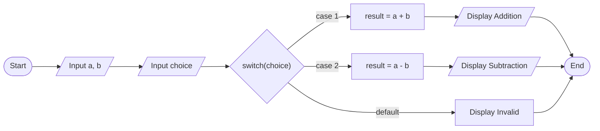

**Mnemonic:** "CIRCA: Choice-Input-Result-Calculate-Action"

## Question 3(c) [7 marks]

**Explain multiple if-else statement with syntax, flowchart and an example.**

**Answer**:

**Syntax of multiple if-else:**

```c
if (condition1) {
    // code block 1
} 
else if (condition2) {
    // code block 2
} 
else if (condition3) {
    // code block 3
} 
else {
    // default code block
}
```

**Flowchart:**

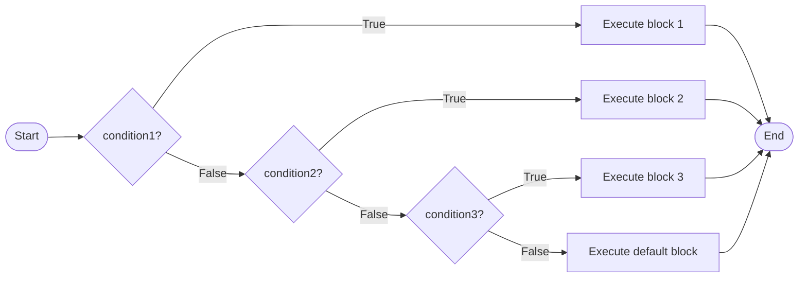

**Example:**

```c
#include <stdio.h>

int main() {
    int marks;
    
    printf("Enter marks: ");
    scanf("%d", &marks);
    
    if (marks >= 80) {
        printf("Grade: A\n");
    } 
    else if (marks >= 70) {
        printf("Grade: B\n");
    } 
    else if (marks >= 60) {
        printf("Grade: C\n");
    } 
    else {
        printf("Grade: F\n");
    }
    
    return 0;
}
```

**Mnemonic:** "TEST: Try Each Statement Then default"

## Question 3(a) OR [3 marks]

**State the use of break and continue keyword.**

**Answer**:

| Keyword | Purpose | Effect | Common Use |
|---------|---------|--------|------------|
| **break** | Terminates loop/switch | Exits the current loop/switch | To exit when condition met |
| **continue** | Skips iteration | Jumps to next iteration | To skip specific values |

**Example Code:**

```c
// break example
for(i=1; i<=10; i++) {
    if(i == 5) break; // exits loop at i=5
    printf("%d ", i);  // prints 1 2 3 4
}

// continue example
for(i=1; i<=5; i++) {
    if(i == 3) continue; // skips i=3
    printf("%d ", i);  // prints 1 2 4 5
}
```

**Mnemonic:** "EXIT-SKIP: EXit IT or SKIP iteration"

## Question 3(b) OR [4 marks]

**Develop a C program to check whether the given number is even or odd.**

**Answer**:

```c
#include <stdio.h>

int main() {
    int num;
    
    printf("Enter a number: ");
    scanf("%d", &num);
    
    if (num % 2 == 0) {
        printf("%d is even.\n", num);
    } 
    else {
        printf("%d is odd.\n", num);
    }
    
    return 0;
}
```

**Diagram:**

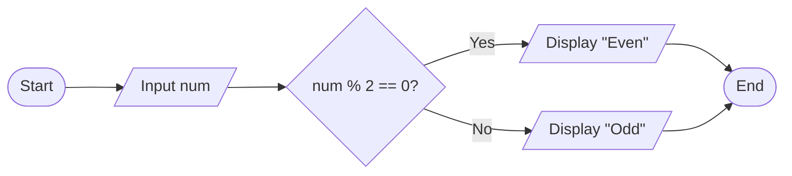

**Key Points:**

- **Check**: Using modulo (%) operator
- **Decision**: Based on remainder with 2
- **Output**: Even for remainder 0, Odd otherwise

**Mnemonic:** "MODE: MODulo Equals zero for even"

## Question 3(c) OR [7 marks]

**Explain switch-case statement with syntax, flowchart and an example.**

**Answer**:

**Syntax of switch-case:**

```c
switch (expression) {
    case constant1:
        // code block 1
        break;
    case constant2:
        // code block 2
        break;
    ...
    default:
        // default code block
}
```

**Flowchart:**

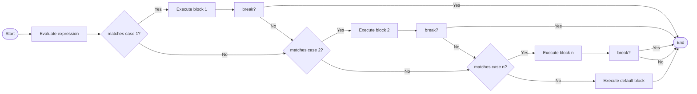

**Example:**

```c
#include <stdio.h>

int main() {
    char grade;
    
    printf("Enter grade (A-D): ");
    scanf(" %c", &grade);
    
    switch (grade) {
        case 'A':
            printf("Excellent!\n");
            break;
        case 'B':
            printf("Good job!\n");
            break;
        case 'C':
            printf("Satisfactory\n");
            break;
        case 'D':
            printf("Needs improvement\n");
            break;
        default:
            printf("Invalid grade\n");
    }
    
    return 0;
}
```

**Mnemonic:** "CEBID: Compare-Execute-Break-If-Done"

## Question 4(a) [3 marks]

**Define string. List out different operations that can be performed on string.**

**Answer**:

**String**: Array of characters terminated by null character '\0'.

| Operation | Description | Function |
|-----------|-------------|----------|
| **Input/Output** | Read/write strings | gets(), puts() |
| **Copy** | Copy one string to another | strcpy() |
| **Concatenation** | Join two strings | strcat() |
| **Comparison** | Compare two strings | strcmp() |
| **Length** | Find string length | strlen() |
| **Search** | Find substring | strstr() |

**Mnemonic:** "ICCLS: Input-Copy-Concatenate-Length-Search"

## Question 4(b) [4 marks]

**Develop a C program to convert uppercase alphabet to lowercase alphabet.**

**Answer**:

```c
#include <stdio.h>

int main() {
    char ch;
    
    printf("Enter an uppercase letter: ");
    scanf(" %c", &ch);
    
    if (ch >= 'A' && ch <= 'Z') {
        char lowercase = ch + 32;  // ASCII difference is 32
        printf("Lowercase: %c\n", lowercase);
    } 
    else {
        printf("Not an uppercase letter\n");
    }
    
    return 0;
}
```

**ASCII Table Excerpt:**

| Character | ASCII Value |
|-----------|-------------|
| **A** | 65 |
| **a** | 97 |
| **Z** | 90 |
| **z** | 122 |
| **Difference** | 32 |

**Mnemonic:** "COOL: Character Offset Of Lowercase"

## Question 4(c) [7 marks]

**Draw flowchart of for loop and explain with example.**

**Answer**:

**For Loop Syntax:**

```c
for (initialization; condition; increment/decrement) {
    // code block
}
```

**Flowchart:**

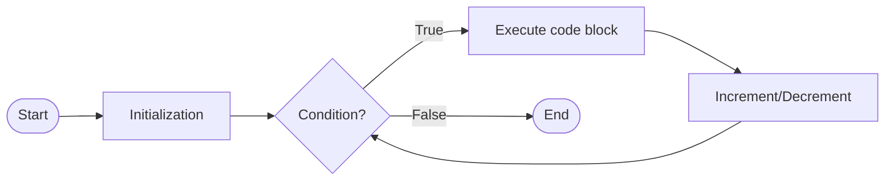

**For Loop Components:**

1. **Initialization**: Executed once at beginning
2. **Condition**: Checked before each iteration
3. **Increment/Decrement**: Executed after each iteration
4. **Body**: Executed if condition is true

**Example:**

```c
#include <stdio.h>

int main() {
    int i;
    
    for (i = 1; i <= 5; i++) {
        printf("%d ", i);
    }
    // Output: 1 2 3 4 5
    
    return 0;
}
```

**Execution Flow:**

1. Initialize i = 1
2. Check condition (1 <= 5) - True
3. Execute body - Print 1
4. Increment i to 2
5. Check condition (2 <= 5) - True
6. And so on until i becomes 6

**Mnemonic:** "ICE-T: Initialize, Check, Execute, Then increment"

## Question 4(a) OR [3 marks]

**Define array. List out different operations that can be performed on array.**

**Answer**:

**Array**: Collection of similar data types stored in contiguous memory locations.

| Operation | Description | Example |
|-----------|-------------|---------|
| **Declaration** | Create array | int arr[5]; |
| **Initialization** | Assign values | arr[0] = 10; |
| **Traversal** | Access all elements | for loop |
| **Insertion** | Add new element | arr[pos] = value; |
| **Deletion** | Remove element | Shift elements |
| **Searching** | Find element | Linear/binary search |
| **Sorting** | Arrange elements | Bubble/Selection sort |

**Mnemonic:** "DITIDSS: Declare-Initialize-Traverse-Insert-Delete-Search-Sort"

## Question 4(b) OR [4 marks]

**Define pointer. Explain with example.**

**Answer**:

**Pointer**: Variable that stores the memory address of another variable.

| Concept | Description | Syntax |
|---------|-------------|--------|
| **Declaration** | Create pointer | int *ptr; |
| **Address operator** | Get address | &variable |
| **Dereferencing** | Access value at address | *ptr |
| **Assignment** | Store address in pointer | ptr = &variable; |

**Example:**

```c
#include <stdio.h>

int main() {
    int num = 10;
    int *ptr;
    
    ptr = &num;  // Store address of num in ptr
    
    printf("Value of num: %d\n", num);           // 10
    printf("Address of num: %p\n", &num);        // Address of num
    printf("Value of ptr: %p\n", ptr);           // Same address
    printf("Value pointed by ptr: %d\n", *ptr);  // 10
    
    *ptr = 20;   // Change value using pointer
    printf("New value of num: %d\n", num);       // 20
    
    return 0;
}
```

**Diagram:**

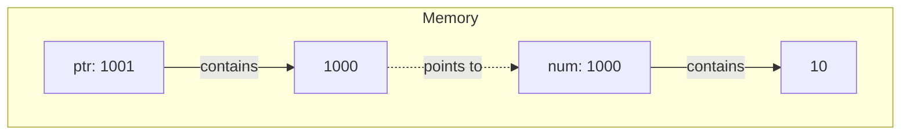

**Mnemonic:** "SAVD: Store Address, Value through Dereferencing"

## Question 4(c) OR [7 marks]

**Draw flowchart of while loop and explain with example.**

**Answer**:

**While Loop Syntax:**

```c
while (condition) {
    // code block
}
```

**Flowchart:**

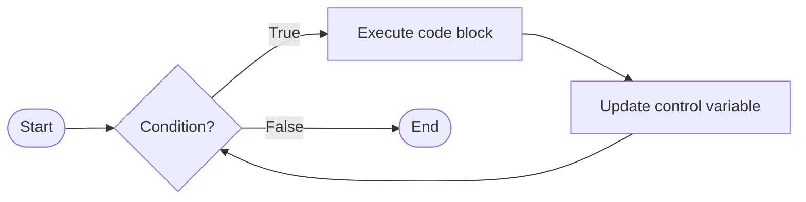

**While Loop Components:**

1. **Initialization**: Before the loop
2. **Condition**: Checked before each iteration
3. **Body**: Executed if condition is true
4. **Update**: Must be done inside the body

**Example:**

```c
#include <stdio.h>

int main() {
    int i = 1;
    
    while (i <= 5) {
        printf("%d ", i);
        i++;
    }
    // Output: 1 2 3 4 5
    
    return 0;
}
```

**Execution Flow:**

1. Initialize i = 1 (before loop)
2. Check condition (1 <= 5) - True
3. Execute body - Print 1
4. Update i to 2
5. Check condition (2 <= 5) - True
6. And so on until i becomes 6

**Mnemonic:** "CHECK-UPDATE: CHECK before entering, UPDATE before repeating"

## Question 5(a) [3 marks]

**State the use of following functions. (1) strcat() (2) strlen() (3) strcpy()**

**Answer**:

| Function | Purpose | Syntax | Example |
|----------|---------|--------|---------|
| **strcat()** | Concatenates strings | strcat(dest, src) | "Hello" + "World" -> "HelloWorld" |
| **strlen()** | Returns string length | strlen(str) | "Hello" -> 5 |
| **strcpy()** | Copies string | strcpy(dest, src) | src -> dest |

**Code Example:**

```c
#include <string.h>

char str1[20] = "Hello";
char str2[20] = "World";
char str3[20];

strcat(str1, str2);    // str1 becomes "HelloWorld"
int len = strlen(str1); // len becomes 10
strcpy(str3, str1);    // str3 becomes "HelloWorld"
```

**Mnemonic:** "CLS: Concatenate-Length-Source copy"

## Question 5(b) [4 marks]

**Build a structure to store book information: book_no, book_title, book_author, book_price.**

**Answer**:

```c
#include <stdio.h>
#include <string.h>

struct Book {
    int book_no;
    char book_title[50];
    char book_author[30];
    float book_price;
};

int main() {
    struct Book book1;
    
    // Assign values
    book1.book_no = 101;
    strcpy(book1.book_title, "Programming in C");
    strcpy(book1.book_author, "Dennis Ritchie");
    book1.book_price = 450.75;
    
    // Display book information
    printf("Book No: %d\n", book1.book_no);
    printf("Title: %s\n", book1.book_title);
    printf("Author: %s\n", book1.book_author);
    printf("Price: %.2f\n", book1.book_price);
    
    return 0;
}
```

**Structure Memory Layout:**

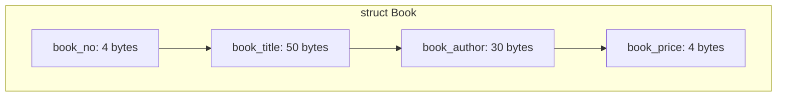

**Mnemonic:** "NTAP: Number-Title-Author-Price"

## Question 5(c) [7 marks]

**Explain array and array initialization. Give example.**

**Answer**:

**Array**: Collection of same data type elements stored at contiguous memory locations.

**Array Initialization Methods:**

| Method | Syntax | Example |
|--------|--------|---------|
| **At declaration** | datatype array_name[size] = {values}; | int arr[5] = {10, 20, 30, 40, 50}; |
| **Partial** | datatype array_name[size] = {values}; | int arr[5] = {10, 20}; // Rest are 0 |
| **All zeros** | datatype array_name[size] = {0}; | int arr[5] = {0}; |
| **Element by element** | array_name[index] = value; | arr[0] = 10; arr[1] = 20; |
| **Size inference** | datatype array_name[] = {values}; | int arr[] = {10, 20, 30}; // Size 3 |

**Example:**

```c
#include <stdio.h>

int main() {
    // Method 1: Complete initialization
    int arr1[5] = {10, 20, 30, 40, 50};
    
    // Method 2: Partial initialization (remaining elements set to 0)
    int arr2[5] = {10, 20};  // arr2[2], arr2[3], arr2[4] become 0
    
    // Method 3: Element by element
    int arr3[3];
    arr3[0] = 100;
    arr3[1] = 200;
    arr3[2] = 300;
    
    // Method 4: Size inference
    int arr4[] = {1, 2, 3, 4, 5};  // Size automatically set to 5
    
    // Accessing elements
    printf("arr1[2] = %d\n", arr1[2]);  // Output: 30
    
    // Array traversal
    printf("arr4 elements: ");
    for(int i = 0; i < 5; i++) {
        printf("%d ", arr4[i]);  // Output: 1 2 3 4 5
    }
    
    return 0;
}
```

**Memory Representation:**

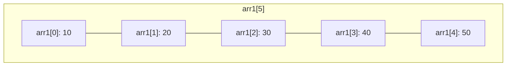

**Mnemonic:** "CAPES: Complete, Automatic, Partial, Element, Size-inferred"

## Question 5(a) OR [3 marks]

**Compare array and structure with example.**

**Answer**:

| Feature | Array | Structure |
|---------|-------|-----------|
| **Data type** | Same type elements | Different type elements |
| **Access** | Using index (arr[i]) | Using dot operator (s.member) |
| **Memory** | Contiguous, fixed size | Contiguous, may have padding |
| **Assignment** | Element by element | Direct with compatible structures |
| **Purpose** | Collection of similar items | Group of related data |

**Array Example:**

```c
int marks[5] = {85, 90, 78, 92, 88};
printf("%d", marks[2]);  // Access element at index 2 (78)
```

**Structure Example:**

```c
struct Student {
    int roll_no;
    char name[20];
    float percentage;
};

struct Student s1 = {101, "Raj", 85.5};
printf("%s", s1.name);  // Access name member ("Raj")
```

**Mnemonic:** "DAMPA: Datatype-Access-Memory-Purpose-Assignment"

## Question 5(b) OR [4 marks]

**Define User Defined Function. Explain with example.**

**Answer**:

**User Defined Function**: Block of code written by programmer to perform specific task, which can be called multiple times.

| Component | Description | Example |
|-----------|-------------|---------|
| **Return type** | Data type returned | int, float, void |
| **Function name** | Unique identifier | sum, findMax |
| **Parameters** | Input data | (int a, int b) |
| **Body** | Set of statements | { return a+b; } |

**Example:**

```c
#include <stdio.h>

// Function declaration
int sum(int a, int b);

int main() {
    int num1 = 10, num2 = 20, result;
    
    // Function call
    result = sum(num1, num2);
    
    printf("Sum = %d\n", result);
    
    return 0;
}

// Function definition
int sum(int a, int b) {
    return a + b;
}
```

**Function Flow:**

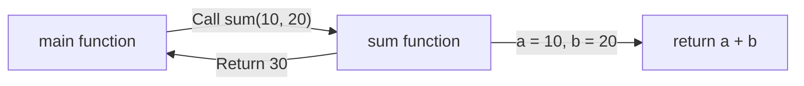

**Mnemonic:** "DPCR: Declaration-Parameters-Call-Return"

## Question 5(c) OR [7 marks]

**Develop a C program to find maximum and minimum element of array.**

**Answer**:

```c
#include <stdio.h>

int main() {
    int arr[100], n, i;
    int max, min;
    
    printf("Enter number of elements: ");
    scanf("%d", &n);
    
    printf("Enter %d integers: ", n);
    for(i = 0; i < n; i++) {
        scanf("%d", &arr[i]);
    }
    
    // Initialize max and min with first element
    max = min = arr[0];
    
    // Find max and min
    for(i = 1; i < n; i++) {
        if(arr[i] > max) {
            max = arr[i];
        }
        if(arr[i] < min) {
            min = arr[i];
        }
    }
    
    printf("Maximum element: %d\n", max);
    printf("Minimum element: %d\n", min);
    
    return 0;
}
```

**Algorithm:**

1. Input array size and elements
2. Initialize max and min with first element
3. For each remaining element:
   - If element > max, update max
   - If element < min, update min
4. Display max and min

**Flowchart:**

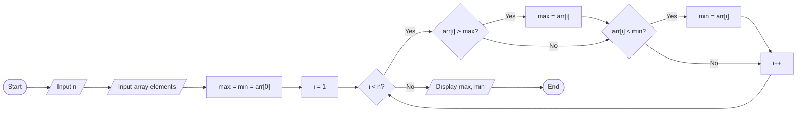

**Mnemonic:** "FILLS: First Initialize, Loop through, Look for Small/large"
