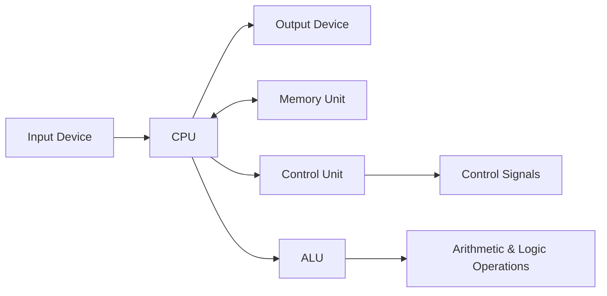
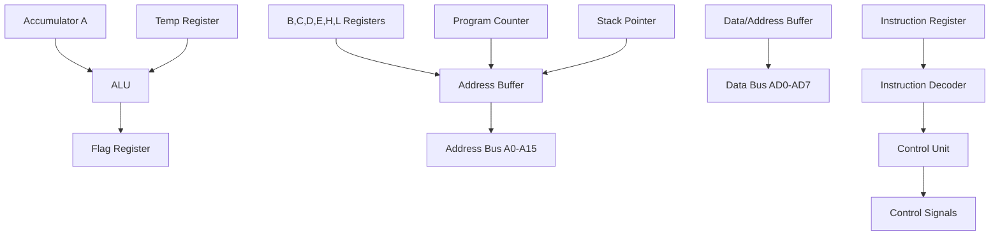
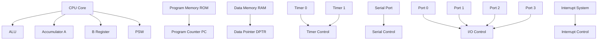

## પ્રશ્ન 1(અ) [3 ગુણ]

**માઇક્રોપ્રોસેસરને વ્યાખ્યાયિત કરો અને તેનો બ્લોક ડાયાગ્રામ દોરો.**

**જવાબ**:
**માઇક્રોપ્રોસેસર** એક પ્રોગ્રામેબલ ડિજિટલ ઉપકરણ છે જે સંગ્રહિત સૂચનાઓ અનુસાર ડેટા પર અંકગણિત અને તાર્કિક કામગીરી કરે છે.

**બ્લોક ડાયાગ્રામ:**



- **CPU**: **સેન્ટ્રલ પ્રોસેસિંગ યુનિટ** બધી કામગીરી કરે છે
- **મેમરી**: **પ્રોગ્રામ અને ડેટા** સંગ્રહ કરે છે
- **કંટ્રોલ યુનિટ**: **સૂચના અમલીકરણ** ક્રમને નિયંત્રિત કરે છે

**યાદગાર વાક્ય**: "મારું કમ્પ્યુટર પ્રોગ્રામ સમજે" (મેમરી-CPU-પ્રોગ્રામ-સૂચનાઓ)

## પ્રશ્ન 1(બ) [4 ગુણ]

**યોગ્ય instruction ના ઉદાહરણ સાથે ઓપરેન્ડ અને ઓપકોડ સમજાવો.**

**જવાબ**:
**ઓપકોડ** કરવાની કામગીરી સ્પષ્ટ કરે છે. **ઓપરેન્ડ** કામગીરી થવાનો ડેટા સ્પષ્ટ કરે છે.

**ઉદાહરણ કોષ્ટક:**

| સૂચના | ઓપકોડ | ઓપરેન્ડ | કાર્ય |
|--------|--------|----------|-------|
| MOV A,B | MOV | A,B | B ને A માં ખસેડો |
| ADD A,#05H | ADD | A,#05H | A માં 05H ઉમેરો |

- **ઓપકોડ**: **ઓપરેશન કોડ** (MOV, ADD, SUB)
- **ઓપરેન્ડ**: **ડેટા કે એડ્રેસ** (A, B, #05H)
- **ફોર્મેટ**: **ઓપકોડ + ઓપરેન્ડ = સંપૂર્ણ સૂચના**

**યાદગાર વાક્ય**: "ઓપરેશન ઓન ડેટા" (ઓપકોડ-ઓપરેન્ડ-ડેટા)

## પ્રશ્ન 1(ક) [7 ગુણ]

**માઇક્રોપ્રોસેસર અને માઇક્રોકંટ્રોલરની સરખામણી કરો.**

**જવાબ**:

| પેરામીટર | માઇક્રોપ્રોસેસર | માઇક્રોકંટ્રોલર |
|----------|-----------------|------------------|
| **વ્યાખ્યા** | માત્ર CPU | CPU + મેમરી + I/O |
| **મેમરી** | બાહ્ય RAM/ROM | આંતરિક RAM/ROM |
| **I/O પોર્ટ્સ** | બાહ્ય ઇન્ટરફેસ | બિલ્ટ-ઇન પોર્ટ્સ |
| **કિંમત** | વધુ સિસ્ટમ કિંમત | ઓછી સિસ્ટમ કિંમત |
| **પાવર** | વધુ વપરાશ | ઓછો વપરાશ |
| **ઝડપ** | ઝડપી પ્રક્રિયા | મધ્યમ ઝડપ |
| **ઉપયોગ** | કમ્પ્યુટર, લેપટોપ | વોશિંગ મશીન, માઇક્રોવેવ |

- **માઇક્રોપ્રોસેસર**: **સામાન્ય હેતુ** કમ્પ્યુટિંગ
- **માઇક્રોકંટ્રોલર**: **વિશિષ્ટ એમ્બેડેડ** એપ્લિકેશન્સ
- **ઇન્ટિગ્રેશન**: **માઇક્રોકંટ્રોલર** માં બધું એક ચિપ પર

**યાદગાર વાક્ય**: "માઇક્રો મીન્સ મોર ઇન્ટિગ્રેશન" (માઇક્રોકંટ્રોલર-મેમરી-મોર-ઇન્ટેગ્રેશન)

## પ્રશ્ન 1(ક અથવા) [7 ગુણ]

**RISC અને CISC ની સરખામણી કરો.**

**જવાબ**:

| પેરામીટર | RISC | CISC |
|----------|------|------|
| **સૂચનાઓ** | સરળ, ઓછી | જટિલ, વધુ |
| **સૂચના સાઇઝ** | નિશ્ચિત લંબાઇ | વેરિયેબલ લંબાઇ |
| **એક્ઝિક્યુશન ટાઇમ** | સિંગલ સાઇકલ | બહુવિધ સાઇકલ |
| **મેમરી એક્સેસ** | ફક્ત લોડ/સ્ટોર | કોઇપણ સૂચના |
| **રજિસ્ટર્સ** | વધુ રજિસ્ટર્સ | ઓછા રજિસ્ટર્સ |
| **પાઇપલાઇન** | કાર્યક્ષમ પાઇપલાઇનિંગ | જટિલ પાઇપલાઇનિંગ |
| **ઉદાહરણો** | ARM, MIPS | x86, 8085 |

- **RISC**: **રિડ્યુસ્ડ ઇન્સ્ટ્રક્શન સેટ કમ્પ્યુટર**
- **CISC**: **કોમ્પ્લેક્સ ઇન્સ્ટ્રક્શન સેટ કમ્પ્યુટર**
- **પર્ફોર્મન્સ**: **RISC ઝડપી, CISC વધુ લવચીક**

**યાદગાર વાક્ય**: "રિડ્યુસ્ડ ઇન્સ્ટ્રક્શન્સ સ્પીડ કમ્પ્યુટિંગ" (RISC-ઇન્સ્ટ્રક્શન્સ-સ્પીડ-કમ્પ્યુટિંગ)

## પ્રશ્ન 2(અ) [3 ગુણ]

**8085 માઇક્રોપ્રોસેસરનું બસ ઓર્ગેનાઇઝેશન સમજાવો.**

**જવાબ**:
8085 માં બાહ્ય ઉપકરણો સાથે સંચાર માટે **ત્રણ પ્રકારની** બસ છે.

**બસ ઓર્ગેનાઇઝેશન કોષ્ટક:**

| બસ પ્રકાર | લાઇન્સ | કાર્ય |
|----------|-------|------|
| **એડ્રેસ બસ** | 16 લાઇન્સ (A0-A15) | મેમરી એડ્રેસિંગ |
| **ડેટા બસ** | 8 લાઇન્સ (D0-D7) | ડેટા ટ્રાન્સફર |
| **કંટ્રોલ બસ** | બહુવિધ લાઇન્સ | કંટ્રોલ સિગ્નલ્સ |

- **એડ્રેસ બસ**: **યુનિડાયરેક્શનલ**, 64KB મેમરી એડ્રેસિંગ
- **ડેટા બસ**: **બાઇડાયરેક્શનલ**, 8-બિટ ડેટા ટ્રાન્સફર
- **કંટ્રોલ બસ**: **રીડ, રાઇટ, IO/M સિગ્નલ્સ**

**યાદગાર વાક્ય**: "એડ્રેસ ડેટા કંટ્રોલ" (ADC)

## પ્રશ્ન 2(બ) [4 ગુણ]

**ડાયાગ્રામ સાથે ALE સિગ્નલનું કાર્ય સમજાવો.**

**જવાબ**:
**ALE (એડ્રેસ લેચ એનેબલ)** મલ્ટિપ્લેક્સ્ડ બસ પર એડ્રેસ અને ડેટાને અલગ કરે છે.

**ALE ટાઇમિંગ ડાયાગ્રામ:**

```goat
    ALE  ____      ____
        |    |____|    |____
        
  AD7-0 ADDR |   DATA  | ADDR
        _____|_________|_____
```

- **હાઇ ALE**: **એડ્રેસ** AD0-AD7 પર ઉપલબ્ધ
- **લો ALE**: **ડેટા** AD0-AD7 પર ઉપલબ્ધ
- **કાર્ય**: **લોઅર એડ્રેસ બાઇટ** લેચ કરે છે
- **ફ્રીક્વન્સી**: **ALE = Clock frequency ÷ 2**

**યાદગાર વાક્ય**: "એડ્રેસ લેચ એનેબલ" (ALE)

## પ્રશ્ન 2(ક) [7 ગુણ]

**આકૃતિની મદદથી 8085 માઇક્રોપ્રોસેસરના આર્કિટેક્ચરનું વર્ણન કરો.**

**જવાબ**:



**મુખ્ય ઘટકો:**

- **ALU**: **અંકગણિત અને તાર્કિક** કામગીરી કરે છે
- **રજિસ્ટર્સ**: **અસ્થાયી ડેટા** સંગ્રહ કરે છે (A, B, C, D, E, H, L)
- **પ્રોગ્રામ કાઉન્ટર**: **આગળની સૂચના** તરફ નિર્દેશ કરે છે
- **સ્ટેક પોઇન્ટર**: **સ્ટેક ટોપ** તરફ નિર્દેશ કરે છે
- **કંટ્રોલ યુનિટ**: **કંટ્રોલ સિગ્નલ્સ** જનરેટ કરે છે

**યાદગાર વાક્ય**: "ઓલ રજિસ્ટર્સ પ્રોગ્રામ સ્ટેક કંટ્રોલ" (A-R-P-S-C)

## પ્રશ્ન 2(અ અથવા) [3 ગુણ]

**8085 માઇક્રોપ્રોસેસરનો ફ્લેગ રજિસ્ટર દોરો અને તેને સમજાવો.**

**જવાબ**:

**ફ્લેગ રજિસ્ટર ફોર્મેટ:**

```goat
 D7  D6  D5  D4  D3  D2  D1  D0
+---+---+---+---+---+---+---+---+
| S | Z | 0 |AC | 0 | P | 1 | C |
+---+---+---+---+---+---+---+---+
```

**ફ્લેગ કાર્યો:**

- **S (સાઇન)**: **પરિણામ નેગેટિવ** હોય તો સેટ
- **Z (ઝીરો)**: **પરિણામ શૂન્ય** હોય તો સેટ
- **AC (ઓક્સિલિયરી કેરી)**: **BCD ઓપરેશન્સ** માટે સેટ
- **P (પેરિટી)**: **ઇવન પેરિટી** માટે સેટ
- **C (કેરી)**: **કેરી/બોરો** જ્યારે થાય તો સેટ

**યાદગાર વાક્ય**: "સમ ઝીરો ઓક્સિલિયરી પેરિટી કેરી" (SZAPC)

## પ્રશ્ન 2(બ અથવા) [4 ગુણ]

**8085 માઇક્રોપ્રોસેસર માટે એડ્રેસ અને ડેટા બસોનું ડીમલ્ટિપ્લેક્સિંગ સમજાવો.**

**જવાબ**:
**ડીમલ્ટિપ્લેક્સિંગ** AD0-AD7 લાઇન્સમાંથી એડ્રેસ અને ડેટા સિગ્નલ્સને અલગ કરે છે.

**ડીમલ્ટિપ્લેક્સિંગ સર્કિટ:**

```goat
AD0-AD7 ----+---- D-Latch ---- A0-A7 (Address)
            |         ^
            |         |
            |       ALE
            |
            +---- Data Buffer ---- D0-D7 (Data)
```

- **ALE હાઇ**: **એડ્રેસ** બાહ્ય લેચમાં લેચ થાય છે
- **ALE લો**: **ડેટા** બફર દ્વારા વહે છે
- **74LS373**: **સામાન્ય લેચ IC** વપરાય છે
- **ફાયદો**: **અલગ એડ્રેસ અને ડેટા બસ**

**યાદગાર વાક્ય**: "એડ્રેસ લેચ એક્સ્ટર્નલ ડિમલ્ટિપ્લેક્સ" (ALED)

## પ્રશ્ન 2(ક અથવા) [7 ગુણ]

**આકૃતિની મદદથી 8085 માઇક્રોપ્રોસેસરના પિન ડાયાગ્રામનું વર્ણન કરો.**

**જવાબ**:

```goat
         8085 Microprocessor
        +-------------------+
   X1 --| 1              40 |-- VCC
   X2 --| 2              39 |-- HOLD
RESET --| 3              38 |-- HLDA
  SOD --| 4              37 |-- CLK
  SID --| 5              36 |-- RESET
 TRAP --| 6              35 |-- READY
RST7.5--| 7              34 |-- IO/M
RST6.5--| 8              33 |-- S1
RST5.5--| 9              32 |-- RD
 INTR --| 10             31 |-- WR
 INTA --| 11             30 |-- ALE
  AD0 --| 12             29 |-- S0
  AD1 --| 13             28 |-- A15
  AD2 --| 14             27 |-- A14
  AD3 --| 15             26 |-- A13
  AD4 --| 16             25 |-- A12
  AD5 --| 17             24 |-- A11
  AD6 --| 18             23 |-- A10
  AD7 --| 19             22 |-- A9
  VSS --| 20             21 |-- A8
        +-------------------+
```

**પિન કેટેગરીઝ:**

- **પાવર**: **VCC, VSS**
- **ક્લોક**: **X1, X2, CLK**
- **એડ્રેસ/ડેટા**: **AD0-AD7, A8-A15**
- **કંટ્રોલ**: **ALE, RD, WR, IO/M**
- **ઇન્ટરપ્ટ**: **INTR, INTA, RST7.5, RST6.5, RST5.5, TRAP**

**યાદગાર વાક્ય**: "પાવર ક્લોક એડ્રેસ કંટ્રોલ ઇન્ટરપ્ટ" (PCACI)

## પ્રશ્ન 3(અ) [3 ગુણ]

**DPTR અને PC નું કાર્ય લખો.**

**જવાબ**:

**કાર્યો કોષ્ટક:**

| રજિસ્ટર | કાર્ય | સાઇઝ |
|-----------|------|------|
| **DPTR** | ડેટા પોઇન્ટર | 16-બિટ |
| **PC** | પ્રોગ્રામ કાઉન્ટર | 16-બિટ |

**DPTR કાર્યો:**

- **બાહ્ય મેમરી**: **બાહ્ય ડેટા મેમરી** એક્સેસ કરે છે
- **એડ્રેસિંગ**: **MOVX સૂચનાઓ** માટે 16-બિટ એડ્રેસ

**PC કાર્યો:**

- **ઇન્સ્ટ્રક્શન પોઇન્ટર**: **આગળની સૂચના** તરફ નિર્દેશ કરે છે
- **ઓટો ઇન્ક્રિમેન્ટ**: **દરેક સૂચના ફેચ** પછી વધે છે

**યાદગાર વાક્ય**: "ડેટા પ્રોગ્રામ કાઉન્ટર" (DPC)

## પ્રશ્ન 3(બ) [4 ગુણ]

**8051 નું PCON SFR દોરો અને દરેક બિટનું કાર્ય સમજાવો.**

**જવાબ**:

**PCON રજિસ્ટર (87H):**

```goat
 D7  D6  D5  D4  D3  D2  D1  D0
+---+---+---+---+---+---+---+---+
|SMOD| - | - | - |GF1|GF0|PD |IDL|
+---+---+---+---+---+---+---+---+
```

**બિટ કાર્યો:**

- **SMOD**: **સીરિયલ પોર્ટ બોડ રેટ** ડબલર
- **GF1, GF0**: **સામાન્ય હેતુ** ફ્લેગ્સ
- **PD**: **પાવર ડાઉન મોડ** કંટ્રોલ
- **IDL**: **આઇડલ મોડ** કંટ્રોલ

**પાવર મેનેજમેન્ટ:**

- **IDL = 1**: **CPU બંધ, પેરિફેરલ્સ** ચાલે છે
- **PD = 1**: **સંપૂર્ણ પાવર ડાઉન**

**યાદગાર વાક્ય**: "સીરિયલ જનરલ પાવર આઇડલ" (SGPI)

## પ્રશ્ન 3(ક) [7 ગુણ]

**આકૃતિની મદદથી 8051 માઇક્રોકંટ્રોલરનું આર્કિટેક્ચર સમજાવો.**

**જવાબ**:



**મુખ્ય બ્લોક્સ:**

- **CPU**: **ALU સાથે 8-બિટ** પ્રોસેસર
- **મેમરી**: **4KB ROM, 128B RAM**
- **ટાઇમર્સ**: **બે 16-બિટ** ટાઇમર્સ
- **સીરિયલ પોર્ટ**: **ફુલ ડુપ્લેક્સ UART**
- **I/O પોર્ટ્સ**: **ચાર 8-બિટ** પોર્ટ્સ
- **ઇન્ટરપ્ટ્સ**: **5 ઇન્ટરપ્ટ** સોર્સ

**યાદગાર વાક્ય**: "CPU મેમરી ટાઇમર સીરિયલ IO ઇન્ટરપ્ટ" (CMTSII)

## પ્રશ્ન 3(અ અથવા) [3 ગુણ]

**8051 માઇક્રોકંટ્રોલરના સામાન્ય ફીચર્સની યાદી બનાવો.**

**જવાબ**:

**સામાન્ય ફીચર્સ:**

- **CPU**: **8-બિટ માઇક્રોકંટ્રોલર**
- **મેમરી**: **4KB ROM, 128B RAM**
- **I/O પોર્ટ્સ**: **32 I/O લાઇન્સ** (4 પોર્ટ્સ)
- **ટાઇમર્સ**: **બે 16-બિટ** ટાઇમર્સ/કાઉન્ટર્સ
- **સીરિયલ પોર્ટ**: **ફુલ ડુપ્લેક્સ UART**
- **ઇન્ટરપ્ટ્સ**: **5 ઇન્ટરપ્ટ** સોર્સ
- **ક્લોક**: **12MHz મહત્તમ** ફ્રીક્વન્સી

**યાદગાર વાક્ય**: "CPU મેમરી IO ટાઇમર સીરિયલ ઇન્ટરપ્ટ ક્લોક" (CMITSIC)

## પ્રશ્ન 3(બ અથવા) [4 ગુણ]

**8051 નું IP SFR દોરો અને દરેક બિટનું કાર્ય સમજાવો.**

**જવાબ**:

**IP રજિસ્ટર (B8H):**

```goat
 D7  D6  D5  D4  D3  D2  D1  D0
+---+---+---+---+---+---+---+---+
| - | - | - |PS |PT1|PX1|PT0|PX0|
+---+---+---+---+---+---+---+---+
```

**બિટ કાર્યો:**

- **PS**: **સીરિયલ પોર્ટ ઇન્ટરપ્ટ** પ્રાઇઓરિટી
- **PT1**: **ટાઇમર 1 ઇન્ટરપ્ટ** પ્રાઇઓરિટી
- **PX1**: **એક્સ્ટર્નલ ઇન્ટરપ્ટ 1** પ્રાઇઓરિટી
- **PT0**: **ટાઇમર 0 ઇન્ટરપ્ટ** પ્રાઇઓરિટી
- **PX0**: **એક્સ્ટર્નલ ઇન્ટરપ્ટ 0** પ્રાઇઓરિટી

**પ્રાઇઓરિટી લેવલ્સ:**

- **1**: **હાઇ પ્રાઇઓરિટી**
- **0**: **લો પ્રાઇઓરિટી**

**યાદગાર વાક્ય**: "પ્રાઇઓરિટી સીરિયલ ટાઇમર એક્સ્ટર્નલ" (PSTE)

## પ્રશ્ન 3(ક અથવા) [7 ગુણ]

**આકૃતિની મદદથી 8051 માઇક્રોકંટ્રોલરનો પિન ડાયાગ્રામ સમજાવો.**

**જવાબ**:

```goat
          8051 Microcontroller
         +-------------------+
   P1.0--| 1              40 |--VCC
   P1.1--| 2              39 |--P0.0/AD0
   P1.2--| 3              38 |--P0.1/AD1
   P1.3--| 4              37 |--P0.2/AD2
   P1.4--| 5              36 |--P0.3/AD3
   P1.5--| 6              35 |--P0.4/AD4
   P1.6--| 7              34 |--P0.5/AD5
   P1.7--| 8              33 |--P0.6/AD6
   RST --| 9              32 |--P0.7/AD7
 P3.0/RXD| 10             31 |--EA/VPP
 P3.1/TXD| 11             30 |--ALE/PROG
P3.2/INT0| 12             29 |--PSEN
P3.3/INT1| 13             28 |--P2.7/A15
 P3.4/T0-| 14             27 |--P2.6/A14
 P3.5/T1-| 15             26 |--P2.5/A13
 P3.6/WR-| 16             25 |--P2.4/A12
 P3.7/RD-| 17             24 |--P2.3/A11
 XTAL2 --| 18             23 |--P2.2/A10
 XTAL1 --| 19             22 |--P2.1/A9
   VSS --| 20             21 |--P2.0/A8
         +-------------------+
```

**પિન ગ્રુપ્સ:**

- **પાવર**: **VCC (40), VSS (20)**
- **ક્લોક**: **XTAL1 (19), XTAL2 (18)**
- **રીસેટ**: **RST (9)**
- **પોર્ટ્સ**: **P0, P1, P2, P3**
- **કંટ્રોલ**: **ALE, PSEN, EA**

**યાદગાર વાક્ય**: "પાવર ક્લોક રીસેટ પોર્ટ્સ કંટ્રોલ" (PCRPC)

## પ્રશ્ન 4(અ) [3 ગુણ]

**એરિથમેટિક instruction ઉદાહરણ સાથે સમજાવો.**

**જવાબ**:

**અંકગણિત સૂચનાઓ:**

| સૂચના | કાર્ય | ઉદાહરણ |
|--------|------|---------|
| **ADD** | બસ્તારણ | ADD A,#10H |
| **SUBB** | બાદબાકી | SUBB A,R0 |
| **MUL** | ગુણાકાર | MUL AB |
| **DIV** | ભાગાકાર | DIV AB |
| **INC** | વૃદ્ધિ | INC A |
| **DEC** | ઘટાડો | DEC R1 |

- **ADD A,#10H**: **એક્યુમ્યુલેટરમાં 10H ઉમેરો**
- **ફ્લેગ્સ**: **અંકગણિત કામગીરીથી** પ્રભાવિત થાય છે

**યાદગાર વાક્ય**: "એડ સબ મલ ડિવ ઇન્ક ડેક" (ASMIDI)

## પ્રશ્ન 4(બ) [4 ગુણ]

**મેમરી લોકેશન 65H પર સંગ્રહિત મૂલ્યના 2's complement ને શોધવા માટે 8051 એસેમ્બલી લેંગ્વેજ પ્રોગ્રામ લખો તેમજ પરિણામ સમાન સ્થાન પર મૂકો.**

**જવાબ**:

```assembly
ORG 0000H           ; પ્રોગ્રામ સ્ટાર્ટ એડ્રેસ
MOV A,65H           ; 65H લોકેશનથી વેલ્યુ લોડ કરો
CPL A               ; વેલ્યુનો કોમ્પ્લિમેન્ટ કરો (1's complement)
ADD A,#01H          ; 2's complement મેળવવા 1 ઉમેરો
MOV 65H,A           ; પરિણામ પાછું 65H માં સ્ટોર કરો
SJMP $              ; પ્રોગ્રામ બંધ કરો
END
```

**પ્રોગ્રામ સ્ટેપ્સ:**

- **લોડ**: **મેમરી લોકેશન 65H** થી વેલ્યુ મેળવો
- **કોમ્પ્લિમેન્ટ**: **CPL વાપરીને 1's complement** જનરેટ કરો
- **1 ઉમેરો**: **2's complement માં** કન્વર્ટ કરો
- **સ્ટોર**: **પરિણામ સમાન લોકેશન** પર પાછું મૂકો

**યાદગાર વાક્ય**: "લોડ કોમ્પ્લિમેન્ટ એડ સ્ટોર" (LCAS)

## પ્રશ્ન 4(ક) [7 ગુણ]

**8051 માઇક્રોકંટ્રોલરના એડ્રેસિંગ મોડ્સની યાદી બનાવો અને તેમને ઉદાહરણ સાથે સમજાવો.**

**જવાબ**:

**એડ્રેસિંગ મોડ્સ કોષ્ટક:**

| મોડ | વર્ણન | ઉદાહરણ | ઉપયોગ |
|-----|-------|---------|-------|
| **ઇમીડિયેટ** | સૂચનામાં ડેટા | MOV A,#25H | કોન્સ્ટંટ ડેટા |
| **રજિસ્ટર** | રજિસ્ટરમાં ડેટા | MOV A,R0 | ઝડપી એક્સેસ |
| **ડાયરેક્ટ** | મેમરી એડ્રેસ | MOV A,30H | RAM એક્સેસ |
| **ઇન્ડાયરેક્ટ** | રજિસ્ટરમાં એડ્રેસ | MOV A,@R0 | પોઇન્ટર એક્સેસ |
| **ઇન્ડેક્સ્ડ** | બેઝ + ઓફસેટ | MOVC A,@A+DPTR | ટેબલ એક્સેસ |
| **રિલેટિવ** | PC + ઓફસેટ | SJMP LOOP | બ્રાન્ચ સૂચનાઓ |
| **બિટ** | બિટ એડ્રેસ | SETB P1.0 | બિટ ઓપરેશન્સ |

**ઉદાહરણો:**

- **MOV A,#25H**: **ઇમીડિયેટ વેલ્યુ 25H** લોડ કરો
- **MOV A,@R0**: **R0 માં આપેલા એડ્રેસ** થી લોડ કરો
- **SJMP LOOP**: **વર્તમાન PC ની સાપેક્ષે** જમ્પ કરો

**યાદગાર વાક્ય**: "ઇમીડિયેટ રજિસ્ટર ડાયરેક્ટ ઇન્ડાયરેક્ટ ઇન્ડેક્સ્ડ રિલેટિવ બિટ" (IRDIIRB)

## પ્રશ્ન 4(અ અથવા) [3 ગુણ]

**લોજીકલ instruction ઉદાહરણ સાથે સમજાવો.**

**જવાબ**:

**તાર્કિક સૂચનાઓ:**

| સૂચના | કાર્ય | ઉદાહરણ |
|--------|------|---------|
| **ANL** | AND ઓપરેશન | ANL A,#0FH |
| **ORL** | OR ઓપરેશન | ORL A,R1 |
| **XRL** | XOR ઓપરેશન | XRL A,#55H |
| **CPL** | કોમ્પ્લિમેન્ટ | CPL A |
| **RL** | લેફ્ટ રોટેટ | RL A |
| **RR** | રાઇટ રોટેટ | RR A |

- **ANL A,#0FH**: **એક્યુમ્યુલેટરને 0FH સાથે AND** કરો (માસ્ક ઓપરેશન)
- **એપ્લિકેશન્સ**: **બિટ માસ્કિંગ, ડેટા મેનિપ્યુલેશન**

**યાદગાર વાક્ય**: "એન્ડ ઓર એક્સઓર કોમ્પ્લિમેન્ટ રોટેટ" (AOXCR)

## પ્રશ્ન 4(બ અથવા) [4 ગુણ]

**રજિસ્ટર R3 માં સંગ્રહિત સંખ્યાને રજિસ્ટર R0 માં સંગ્રહિત સંખ્યા વડે ગુણાકાર કરવા માટે 8051 એસેમ્બલી લેંગ્વેજ પ્રોગ્રામ લખો અને પરિણામને ઇન્ટર્નલ RAM સ્થાન 10h(MSB) અને 11h(LSB) માં મૂકો.**

**જવાબ**:

```assembly
ORG 0000H           ; પ્રોગ્રામ સ્ટાર્ટ એડ્રેસ
MOV A,R3            ; R3 ને એક્યુમ્યુલેટરમાં મૂવ કરો
MOV B,R0            ; R0 ને B રજિસ્ટરમાં મૂવ કરો
MUL AB              ; A અને B નો ગુણાકાર કરો
MOV 10H,B           ; MSB (B) ને લોકેશન 10H માં સ્ટોર કરો
MOV 11H,A           ; LSB (A) ને લોકેશન 11H માં સ્ટોર કરો
SJMP $              ; પ્રોગ્રામ બંધ કરો
END
```

**પ્રોગ્રામ ફ્લો:**

- **લોડ**: **ગુણ્ય અને ગુણક** ને A અને B માં મૂવ કરો
- **ગુણાકાર**: **MUL AB સૂચના** વાપરો
- **સ્ટોર**: **MSB B રજિસ્ટરમાં, LSB A રજિસ્ટરમાં**
- **પરિણામ**: **16-બિટ પરિણામ બે લોકેશન** માં સ્ટોર કર્યું

**યાદગાર વાક્ય**: "લોડ મલ્ટિપ્લાય સ્ટોર રિઝલ્ટ" (LMSR)

## પ્રશ્ન 4(ક અથવા) [7 ગુણ]

**ઉદાહરણ સાથે ડેટા ટ્રાન્સફર instruction સમજાવો.**

**જવાબ**:

**ડેટા ટ્રાન્સફર સૂચનાઓ:**

| કેટેગરી | સૂચના | ઉદાહરણ | કાર્ય |
|---------|--------|---------|------|
| **રજિસ્ટર** | MOV | MOV A,R0 | રજિસ્ટર થી રજિસ્ટર |
| **ઇમીડિયેટ** | MOV | MOV A,#25H | ઇમીડિયેટ થી રજિસ્ટર |
| **ડાયરેક્ટ** | MOV | MOV A,30H | મેમરી થી રજિસ્ટર |
| **ઇન્ડાયરેક્ટ** | MOV | MOV A,@R0 | ઇન્ડાયરેક્ટ એડ્રેસિંગ |
| **એક્સ્ટર્નલ** | MOVX | MOVX A,@DPTR | એક્સ્ટર્નલ મેમરી |
| **કોડ** | MOVC | MOVC A,@A+DPTR | કોડ મેમરી |
| **સ્ટેક** | PUSH/POP | PUSH ACC | સ્ટેક ઓપરેશન્સ |

**ઉદાહરણો:**

- **MOV A,R0**: **R0 ની સામગ્રી એક્યુમ્યુલેટર** માં મૂવ કરો
- **MOVX A,@DPTR**: **એક્સ્ટર્નલ ડેટા મેમરી** થી વાંચો
- **PUSH ACC**: **એક્યુમ્યુલેટરને સ્ટેક** પર પુશ કરો

**ડેટા મૂવમેન્ટ:**

- **આંતરિક**: **8051 મેમરી સ્પેસ** અંદર
- **બાહ્ય**: **એક્સ્ટર્નલ મેમરી** તરફ/થી
- **કોડ**: **પ્રોગ્રામ મેમરી** થી

**યાદગાર વાક્ય**: "મૂવ ડેટા બિટવીન લોકેશન્સ" (MDBL)

## પ્રશ્ન 5(અ) [3 ગુણ]

**PSW ફોર્મેટની મદદથી 8051 ફ્લેગ્સ સમજાવો.**

**જવાબ**:

**PSW રજિસ્ટર (D0H):**

```goat
 D7  D6  D5  D4  D3  D2  D1  D0
+---+---+---+---+---+---+---+---+
| C |AC | F0|RS1|RS0| OV| - | P |
+---+---+---+---+---+---+---+---+
```

**ફ્લેગ કાર્યો:**

- **C (કેરી)**: **કેરી/બોરો** જ્યારે થાય તો સેટ
- **AC (ઓક્સિલિયરી કેરી)**: **BCD અંકગણિત** માટે
- **OV (ઓવરફ્લો)**: **સાઇન્ડ ઓવરફ્લો** થાય તો સેટ
- **P (પેરિટી)**: **એક્યુમ્યુલેટરની ઇવન પેરિટી**
- **RS1, RS0**: **રજિસ્ટર બેંક સિલેક્ટ** બિટ્સ

**યાદગાર વાક્ય**: "કેરી ઓક્સિલિયરી ઓવરફ્લો પેરિટી રજિસ્ટર" (CAOPR)

## પ્રશ્ન 5(બ) [4 ગુણ]

**માઇક્રોકંટ્રોલર સાથે 7 સેગમેન્ટ ઇન્ટરફેસિંગ ડાયાગ્રામ દોરો અને સમજાવો.**

**જવાબ**:

**7-સેગમેન્ટ ઇન્ટરફેસ સર્કિટ:**

```goat
    8051           ULN2003        7-Segment Display
    P1.0 ---------> I1 -----> O1 -----> a
    P1.1 ---------> I2 -----> O2 -----> b  
    P1.2 ---------> I3 -----> O3 -----> c
    P1.3 ---------> I4 -----> O4 -----> d
    P1.4 ---------> I5 -----> O5 -----> e
    P1.5 ---------> I6 -----> O6 -----> f
    P1.6 ---------> I7 -----> O7 -----> g
    P1.7 ---------> I8 -----> O8 -----> DP
                                        |
                                    Common Cathode
                                        |
                                       GND
```

**ઘટકો:**

- **ULN2003**: **કરંટ ડ્રાઇવર IC**
- **રેઝિસ્ટર્સ**: **કરંટ લિમિટિંગ** (330Ω)
- **ડિસ્પ્લે**: **કોમન કેથોડ** પ્રકાર

**કામકાજ**: **પોર્ટ ડેટા કરંટ ડ્રાઇવર** દ્વારા ડિસ્પ્લે સેગમેન્ટ્સ ચલાવે છે

**યાદગાર વાક્ય**: "પોર્ટ ડ્રાઇવર ડિસ્પ્લે ગ્રાઉન્ડ" (PDDG)

## પ્રશ્ન 5(ક) [7 ગુણ]

**માઇક્રોકંટ્રોલર સાથે 8 LED ને ઇન્ટરફેસ કરો અને ચાલુ અને બંધ કરવા માટે પ્રોગ્રામ લખો.**

**જવાબ**:

**LED ઇન્ટરફેસ સર્કિટ:**

```goat
    8051           Current Limiting      LEDs
    P1.0 ---------> 330Ω ---------> LED0 -----> +5V
    P1.1 ---------> 330Ω ---------> LED1 -----> +5V
    P1.2 ---------> 330Ω ---------> LED2 -----> +5V
    P1.3 ---------> 330Ω ---------> LED3 -----> +5V
    P1.4 ---------> 330Ω ---------> LED4 -----> +5V
    P1.5 ---------> 330Ω ---------> LED5 -----> +5V
    P1.6 ---------> 330Ω ---------> LED6 -----> +5V
    P1.7 ---------> 330Ω ---------> LED7 -----> +5V
```

**એસેમ્બલી પ્રોગ્રામ:**

```assembly
ORG 0000H           ; સ્ટાર્ટ એડ્રેસ
MAIN:
    MOV P1,#0FFH    ; બધા LEDs ચાલુ કરો (logic 0)
    CALL DELAY      ; ડિલે સબરૂટિન કોલ કરો
    MOV P1,#00H     ; બધા LEDs બંધ કરો (logic 1)
    CALL DELAY      ; ડિલે સબરૂટિન કોલ કરો
    SJMP MAIN       ; સતત રિપીટ કરો

DELAY:
    MOV R2,#250     ; આઉટર લૂપ કાઉન્ટર
D1: MOV R3,#250     ; ઇનર લૂપ કાઉન્ટર
D2: DJNZ R3,D2      ; R3 શૂન્ય થાય ત્યાં સુધી ઘટાડો
    DJNZ R2,D1      ; R2 શૂન્ય થાય ત્યાં સુધી ઘટાડો
    RET             ; સબરૂટિનથી રિટર્ન કરો
END
```

**યાદગાર વાક્ય**: "લાઇટ ઇમિટિંગ ડિસ્પ્લે ઇન્ટરફેસ" (LEDI)

## પ્રશ્ન 5(અ અથવા) [3 ગુણ]

**વિવિધ ક્ષેત્રોમાં માઇક્રોકંટ્રોલરની એપ્લિકેશનોની સૂચિ બનાવો.**

**જવાબ**:

**ક્ષેત્ર પ્રમાણે એપ્લિકેશન્સ:**

| ક્ષેત્ર | એપ્લિકેશન્સ |
|------|-------------|
| **ઘર** | વોશિંગ મશીન, માઇક્રોવેવ, AC |
| **ઓટોમોટિવ** | એન્જિન કંટ્રોલ, ABS, એરબેગ |
| **ઇન્ડસ્ટ્રિયલ** | પ્રોસેસ કંટ્રોલ, રોબોટિક્સ |
| **મેડિકલ** | પેસમેકર, બ્લડ પ્રેશર મોનિટર |
| **કમ્યુનિકેશન** | મોબાઇલ ફોન્સ, મોડેમ્સ |
| **સિક્યુરિટી** | એક્સેસ કંટ્રોલ, બર્ગલર એલાર્મ |
| **એન્ટરટેનમેન્ટ** | ગેમિંગ કન્સોલ્સ, રિમોટ કંટ્રોલ |

**યાદગાર વાક્ય**: "હોમ ઓટો ઇન્ડસ્ટ્રિયલ મેડિકલ કમ્યુનિકેશન સિક્યુરિટી એન્ટરટેનમેન્ટ" (HAIMCSE)

## પ્રશ્ન 5(બ અથવા) [4 ગુણ]

**8051 સાથે ડીસી મોટરનું ઇન્ટરફેસિંગ ડાયાગ્રામ દોરો અને સમજાવો.**

**જવાબ**:

**ડીસી મોટર ઇન્ટરફેસ:**

```goat
    8051       L293D Motor Driver         DC Motor
    P1.0 -------> Enable Pin                 |
    P1.1 -------> Input 1  -----> Output 1 --+
    P1.2 -------> Input 2  -----> Output 2 --+
                    |              |
                   VCC            GND
                    |              |
                  +12V           Motor
```

**ઘટકો:**

- **L293D**: **ડ્યુઅલ H-બ્રિજ ડ્રાઇવર IC**
- **મોટર**: **12V ડીસી મોટર**
- **કંટ્રોલ**: **દિશા અને સ્પીડ કંટ્રોલ**

**કંટ્રોલ લોજિક:**

- **આગળ**: **P1.1=1, P1.2=0**
- **પાછળ**: **P1.1=0, P1.2=1**
- **બંધ**: **P1.1=0, P1.2=0**

**યાદગાર વાક્ય**: "ડ્રાઇવર કંટ્રોલ મોટર ડાયરેક્શન" (DCMD)

## પ્રશ્ન 5(ક અથવા) [7 ગુણ]

**માઇક્રોકંટ્રોલર સાથે એલસીડી ઇન્ટરફેસ કરો અને "માઇક્રોપ્રોસેસર અને માઇક્રોકંટ્રોલર" દર્શાવવા માટે એક પ્રોગ્રામ લખો.**

**જવાબ**:

**LCD ઇન્ટરફેસ:**

```goat
    8051                16x2 LCD
    P2.0 --------------> RS (Register Select)
    P2.1 --------------> EN (Enable)  
    P1.0-P1.7 ---------> D0-D7 (Data lines)
    GND ---------------> VSS, RW
    +5V ---------------> VDD, VEE (via 10kΩ pot)
```

**એસેમ્બલી પ્રોગ્રામ:**

```assembly
ORG 0000H
    CALL LCD_INIT       ; LCD ઇનિશિયલાઇઝ કરો
    MOV DPTR,#MSG1      ; મેસેજ તરફ પોઇન્ટ કરો
    CALL DISPLAY_MSG    ; મેસેજ ડિસ્પ્લે કરો
    SJMP $              ; બંધ કરો

LCD_INIT:
    MOV P1,#38H         ; Function set: 8-bit, 2-line
    CLR P2.0            ; RS=0 (command)
    SETB P2.1           ; EN=1
    CLR P2.1            ; EN=0 (pulse)
    CALL DELAY
    MOV P1,#01H         ; Clear display
    CLR P2.0
    SETB P2.1
    CLR P2.1
    CALL DELAY
    RET

DISPLAY_MSG:
    MOVC A,@A+DPTR      ; કેરેક્ટર મેળવો
    JZ EXIT             ; જો શૂન્ય હોય તો બહાર નીકળો
    MOV P1,A            ; કેરેક્ટર મોકલો
    SETB P2.0           ; RS=1 (data)
    SETB P2.1           ; EN=1
    CLR P2.1            ; EN=0
    CALL DELAY
    INC DPTR            ; આગળનો કેરેક્ટર
    SJMP DISPLAY_MSG    ; ચાલુ રાખો
EXIT:
    RET

MSG1: DB "Microprocessor and Microcontroller",0

DELAY:
    MOV R1,#50
D1: MOV R2,#255
D2: DJNZ R2,D2
    DJNZ R1,D1
    RET
END
```

**મુખ્ય પગલાઓ:**

- **LCD ઇનિશિયલાઇઝેશન**: **8-બિટ મોડ, 2-લાઇન ડિસ્પ્લે**
- **મેસેજ ડિસ્પ્લે**: **કેરેક્ટર દ્વારા કેરેક્ટર**
- **કંટ્રોલ સિગ્નલ્સ**: **RS અને EN સિગ્નલ્સ**

**યાદગાર વાક્ય**: "લિક્વિડ ક્રિસ્ટલ ડિસ્પ્લે ઇન્ટરફેસ" (LCDI)
