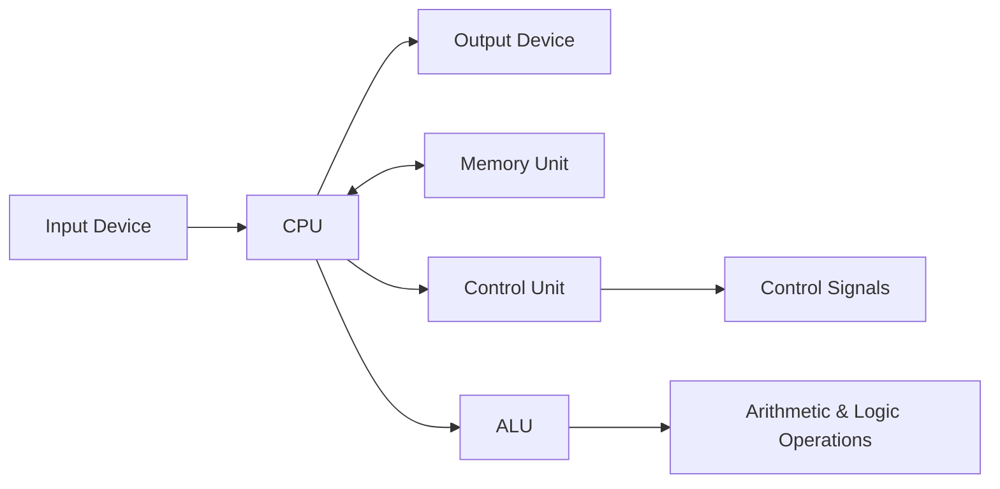
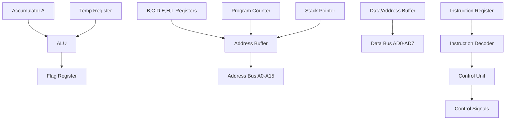
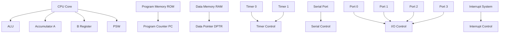

## Question 1(a) [3 marks]

**Define Microprocessor and draw its block diagram.**

**Answer**:
A **microprocessor** is a programmable digital device that performs arithmetic and logical operations on data according to stored instructions.

**Block Diagram:**



- **CPU**: Central Processing Unit performs all operations
- **Memory**: Stores programs and data
- **Control Unit**: Controls instruction execution sequence

**Mnemonic**: "My Computer Processes Instructions" (Memory-CPU-Program-Instructions)

## Question 1(b) [4 marks]

**Explain operand and opcode with proper instruction example.**

**Answer**:
**Opcode** specifies the operation to be performed. **Operand** specifies the data on which operation is performed.

**Example Table:**

| Instruction | Opcode | Operand | Function |
|-------------|--------|---------|----------|
| MOV A,B | MOV | A,B | Move B to A |
| ADD A,#05H | ADD | A,#05H | Add 05H to A |

- **Opcode**: Operation code (MOV, ADD, SUB)
- **Operand**: Data or address (A, B, #05H)
- **Format**: Opcode + Operand = Complete Instruction

**Mnemonic**: "Operation On Data" (Opcode-Operand-Data)

## Question 1(c) [7 marks]

**Compare Microprocessor and Microcontroller.**

**Answer**:

| Parameter | Microprocessor | Microcontroller |
|-----------|----------------|-----------------|
| **Definition** | CPU only | CPU + Memory + I/O |
| **Memory** | External RAM/ROM | Internal RAM/ROM |
| **I/O Ports** | External interface | Built-in ports |
| **Cost** | Higher system cost | Lower system cost |
| **Power** | Higher consumption | Lower consumption |
| **Speed** | Faster processing | Moderate speed |
| **Applications** | Computers, laptops | Washing machine, microwave |

- **Microprocessor**: General purpose computing
- **Microcontroller**: Specific embedded applications
- **Integration**: Microcontroller has everything on single chip

**Mnemonic**: "Micro Means More Integration" (Microcontroller-Memory-More-Integration)

## Question 1(c OR) [7 marks]

**Compare RISC and CISC.**

**Answer**:

| Parameter | RISC | CISC |
|-----------|------|------|
| **Instructions** | Simple, few | Complex, many |
| **Instruction Size** | Fixed length | Variable length |
| **Execution Time** | Single cycle | Multiple cycles |
| **Memory Access** | Load/Store only | Any instruction |
| **Registers** | More registers | Fewer registers |
| **Pipeline** | Efficient pipelining | Complex pipelining |
| **Examples** | ARM, MIPS | x86, 8085 |

- **RISC**: Reduced Instruction Set Computer
- **CISC**: Complex Instruction Set Computer
- **Performance**: RISC faster, CISC more flexible

**Mnemonic**: "Reduced Instructions Speed Computing" (RISC-Instructions-Speed-Computing)

## Question 2(a) [3 marks]

**Explain Bus Organization of 8085 microprocessor.**

**Answer**:
8085 has **three types** of buses for communication with external devices.

**Bus Organization Table:**

| Bus Type | Lines | Function |
|----------|-------|----------|
| **Address Bus** | 16 lines (A0-A15) | Memory addressing |
| **Data Bus** | 8 lines (D0-D7) | Data transfer |
| **Control Bus** | Multiple lines | Control signals |

- **Address Bus**: Unidirectional, 64KB memory addressing
- **Data Bus**: Bidirectional, 8-bit data transfer
- **Control Bus**: Read, Write, IO/M signals

**Mnemonic**: "Address Data Control" (ADC)

## Question 2(b) [4 marks]

**Explain function of ALE signal with diagram.**

**Answer**:
**ALE (Address Latch Enable)** separates address and data on multiplexed bus.

**ALE Timing Diagram:**

```goat
    ALE  ____      ____
        |    |____|    |____
        
  AD7-0 ADDR |   DATA  | ADDR
        _____|_________|_____
```

- **High ALE**: Address is available on AD0-AD7
- **Low ALE**: Data is available on AD0-AD7
- **Function**: Latches lower address byte
- **Frequency**: ALE = Clock frequency ÷ 2

**Mnemonic**: "Address Latch Enable" (ALE)

## Question 2(c) [7 marks]

**Describe architecture of 8085 microprocessor with the help of neat diagram.**

**Answer**:



**Key Components:**

- **ALU**: Performs arithmetic and logical operations
- **Registers**: Store temporary data (A, B, C, D, E, H, L)
- **Program Counter**: Points to next instruction
- **Stack Pointer**: Points to stack top
- **Control Unit**: Generates control signals

**Mnemonic**: "All Registers Program Stack Control" (A-R-P-S-C)

## Question 2(a OR) [3 marks]

**Draw Flag Register of 8085 microprocessor & explain it.**

**Answer**:

**Flag Register Format:**

```goat
 D7  D6  D5  D4  D3  D2  D1  D0
+---+---+---+---+---+---+---+---+
| S | Z | 0 |AC | 0 | P | 1 | C |
+---+---+---+---+---+---+---+---+
```

**Flag Functions:**

- **S (Sign)**: Set if result is negative
- **Z (Zero)**: Set if result is zero
- **AC (Auxiliary Carry)**: Set for BCD operations
- **P (Parity)**: Set for even parity
- **C (Carry)**: Set when carry/borrow occurs

**Mnemonic**: "Some Zero Auxiliary Parity Carry" (SZAPC)

## Question 2(b OR) [4 marks]

**Explain De-multiplexing of Address and Data buses for 8085 Microprocessor.**

**Answer**:
**De-multiplexing** separates address and data signals from AD0-AD7 lines.

**De-multiplexing Circuit:**

```goat
AD0-AD7 ----+---- D-Latch ---- A0-A7 (Address)
            |         ^
            |         |
            |       ALE
            |
            +---- Data Buffer ---- D0-D7 (Data)
```

- **ALE High**: Address latched in external latch
- **ALE Low**: Data flows through buffer
- **74LS373**: Common latch IC used
- **Benefit**: Separate address and data buses

**Mnemonic**: "Address Latch External Demultiplex" (ALED)

## Question 2(c OR) [7 marks]

**Describe Pin diagram of 8085 microprocessor with the help of neat diagram.**

**Answer**:

```goat
         8085 Microprocessor
        +-------------------+
   X1 --| 1              40 |-- VCC
   X2 --| 2              39 |-- HOLD
RESET --| 3              38 |-- HLDA
  SOD --| 4              37 |-- CLK
  SID --| 5              36 |-- RESET
 TRAP --| 6              35 |-- READY
RST7.5--| 7              34 |-- IO/M
RST6.5--| 8              33 |-- S1
RST5.5--| 9              32 |-- RD
 INTR --| 10             31 |-- WR
 INTA --| 11             30 |-- ALE
  AD0 --| 12             29 |-- S0
  AD1 --| 13             28 |-- A15
  AD2 --| 14             27 |-- A14
  AD3 --| 15             26 |-- A13
  AD4 --| 16             25 |-- A12
  AD5 --| 17             24 |-- A11
  AD6 --| 18             23 |-- A10
  AD7 --| 19             22 |-- A9
  VSS --| 20             21 |-- A8
        +-------------------+
```

**Pin Categories:**

- **Power**: VCC, VSS
- **Clock**: X1, X2, CLK
- **Address/Data**: AD0-AD7, A8-A15
- **Control**: ALE, RD, WR, IO/M
- **Interrupt**: INTR, INTA, RST7.5, RST6.5, RST5.5, TRAP

**Mnemonic**: "Power Clock Address Control Interrupt" (PCACI)

## Question 3(a) [3 marks]

**Write a function of DPTR and PC.**

**Answer**:

**Functions Table:**

| Register | Function | Size |
|----------|----------|------|
| **DPTR** | Data Pointer | 16-bit |
| **PC** | Program Counter | 16-bit |

**DPTR Functions:**

- **External Memory**: Access external data memory
- **Addressing**: 16-bit address for MOVX instructions

**PC Functions:**

- **Instruction Pointer**: Points to next instruction
- **Auto Increment**: Increments after each instruction fetch

**Mnemonic**: "Data Program Counter" (DPC)

## Question 3(b) [4 marks]

**Draw PCON SFR of 8051and Explain function of each bit.**

**Answer**:

**PCON Register (87H):**

```goat
 D7  D6  D5  D4  D3  D2  D1  D0
+---+---+---+---+---+---+---+---+
|SMOD| - | - | - |GF1|GF0|PD |IDL|
+---+---+---+---+---+---+---+---+
```

**Bit Functions:**

- **SMOD**: Serial port baud rate doubler
- **GF1, GF0**: General purpose flags
- **PD**: Power Down mode control  
- **IDL**: Idle mode control

**Power Management:**

- **IDL = 1**: CPU stops, peripherals run
- **PD = 1**: Complete power down

**Mnemonic**: "Serial General Power Idle" (SGPI)

## Question 3(c) [7 marks]

**Explain architecture of 8051 microcontroller with the help of neat diagram.**

**Answer**:



**Major Blocks:**

- **CPU**: 8-bit processor with ALU
- **Memory**: 4KB ROM, 128B RAM
- **Timers**: Two 16-bit timers
- **Serial Port**: Full duplex UART
- **I/O Ports**: Four 8-bit ports
- **Interrupts**: 5 interrupt sources

**Mnemonic**: "CPU Memory Timer Serial IO Interrupt" (CMTSII)

## Question 3(a OR) [3 marks]

**List common features of 8051 microcontroller.**

**Answer**:

**Common Features:**

- **CPU**: 8-bit microcontroller
- **Memory**: 4KB ROM, 128B RAM
- **I/O Ports**: 32 I/O lines (4 ports)
- **Timers**: Two 16-bit timers/counters
- **Serial Port**: Full duplex UART
- **Interrupts**: 5 interrupt sources
- **Clock**: 12MHz maximum frequency

**Mnemonic**: "CPU Memory IO Timer Serial Interrupt Clock" (CMITSIC)

## Question 3(b OR) [4 marks]

**Draw IP SFR of 8051 and Explain function of each bit.**

**Answer**:

**IP Register (B8H):**

```goat
 D7  D6  D5  D4  D3  D2  D1  D0
+---+---+---+---+---+---+---+---+
| - | - | - |PS |PT1|PX1|PT0|PX0|
+---+---+---+---+---+---+---+---+
```

**Bit Functions:**

- **PS**: Serial port interrupt priority
- **PT1**: Timer 1 interrupt priority
- **PX1**: External interrupt 1 priority
- **PT0**: Timer 0 interrupt priority
- **PX0**: External interrupt 0 priority

**Priority Levels:**

- **1**: High priority
- **0**: Low priority

**Mnemonic**: "Priority Serial Timer External" (PSTE)

## Question 3(c OR) [7 marks]

**With the help of neat diagram explain Pin diagram of 8051 microcontroller.**

**Answer**:

```goat
         8051 Microcontroller
         +-------------------+
   P1.0--| 1              40 |--VCC
   P1.1--| 2              39 |--P0.0/AD0
   P1.2--| 3              38 |--P0.1/AD1
   P1.3--| 4              37 |--P0.2/AD2
   P1.4--| 5              36 |--P0.3/AD3
   P1.5--| 6              35 |--P0.4/AD4
   P1.6--| 7              34 |--P0.5/AD5
   P1.7--| 8              33 |--P0.6/AD6
   RST --| 9              32 |--P0.7/AD7
 P3.0/RXD| 10             31 |--EA/VPP
 P3.1/TXD| 11             30 |--ALE/PROG
P3.2/INT0| 12             29 |--PSEN
P3.3/INT1| 13             28 |--P2.7/A15
 P3.4/T0-| 14             27 |--P2.6/A14
 P3.5/T1-| 15             26 |--P2.5/A13
 P3.6/WR-| 16             25 |--P2.4/A12
 P3.7/RD-| 17             24 |--P2.3/A11
 XTAL2 --| 18             23 |--P2.2/A10
 XTAL1 --| 19             22 |--P2.1/A9
   VSS --| 20             21 |--P2.0/A8
         +-------------------+
```

**Pin Groups:**

- **Power**: VCC (40), VSS (20)
- **Clock**: XTAL1 (19), XTAL2 (18)
- **Reset**: RST (9)
- **Ports**: P0, P1, P2, P3
- **Control**: ALE, PSEN, EA

**Mnemonic**: "Power Clock Reset Ports Control" (PCRPC)

## Question 4(a) [3 marks]

**Explain arithmetic instructions with example.**

**Answer**:

**Arithmetic Instructions:**

| Instruction | Function | Example |
|-------------|----------|---------|
| **ADD** | Addition | ADD A,#10H |
| **SUBB** | Subtraction | SUBB A,R0 |
| **MUL** | Multiplication | MUL AB |
| **DIV** | Division | DIV AB |
| **INC** | Increment | INC A |
| **DEC** | Decrement | DEC R1 |

- **ADD A,#10H**: Add 10H to accumulator
- **Flags**: Affected by arithmetic operations

**Mnemonic**: "Add Subtract Multiply Divide Increment Decrement" (ASMIDI)

## Question 4(b) [4 marks]

**Write an 8051 Assembly Language Program to Find 2's complement of a value stored at memory location 65H. Put the result on same location.**

**Answer**:

```assembly
ORG 0000H           ; Program start address
MOV A,65H           ; Load value from location 65H
CPL A               ; Complement the value (1's complement)
ADD A,#01H          ; Add 1 to get 2's complement
MOV 65H,A           ; Store result back to 65H
SJMP $              ; Stop program
END
```

**Program Steps:**

- **Load**: Get value from memory location 65H
- **Complement**: Generate 1's complement using CPL
- **Add 1**: Convert to 2's complement
- **Store**: Put result back to same location

**Mnemonic**: "Load Complement Add Store" (LCAS)

## Question 4(c) [7 marks]

**List Addressing Modes of 8051 Microcontroller and explain them with example.**

**Answer**:

**Addressing Modes Table:**

| Mode | Description | Example | Usage |
|------|-------------|---------|--------|
| **Immediate** | Data in instruction | MOV A,#25H | Constant data |
| **Register** | Data in register | MOV A,R0 | Fast access |
| **Direct** | Memory address | MOV A,30H | RAM access |
| **Indirect** | Address in register | MOV A,@R0 | Pointer access |
| **Indexed** | Base + offset | MOVC A,@A+DPTR | Table access |
| **Relative** | PC + offset | SJMP LOOP | Branch instructions |
| **Bit** | Bit address | SETB P1.0 | Bit operations |

**Examples:**

- **MOV A,#25H**: Load immediate value 25H
- **MOV A,@R0**: Load from address in R0
- **SJMP LOOP**: Jump relative to current PC

**Mnemonic**: "Immediate Register Direct Indirect Indexed Relative Bit" (IRDIIRB)

## Question 4(a OR) [3 marks]

**Explain logical instruction with example.**

**Answer**:

**Logical Instructions:**

| Instruction | Function | Example |
|-------------|----------|---------|
| **ANL** | AND operation | ANL A,#0FH |
| **ORL** | OR operation | ORL A,R1 |
| **XRL** | XOR operation | XRL A,#55H |
| **CPL** | Complement | CPL A |
| **RL** | Rotate left | RL A |
| **RR** | Rotate right | RR A |

- **ANL A,#0FH**: AND accumulator with 0FH (mask operation)
- **Applications**: Bit masking, data manipulation

**Mnemonic**: "AND OR XOR Complement Rotate" (AOXCR)

## Question 4(b OR) [4 marks]

**Write an 8051 Assembly Language Program to Multiply the number in register R3 by the number in register R0 and put the result in internal RAM location 10h(MSB) and 11h(LSB).**

**Answer**:

```assembly
ORG 0000H           ; Program start address
MOV A,R3            ; Move R3 to accumulator
MOV B,R0            ; Move R0 to B register
MUL AB              ; Multiply A and B
MOV 10H,B           ; Store MSB (B) to location 10H
MOV 11H,A           ; Store LSB (A) to location 11H  
SJMP $              ; Stop program
END
```

**Program Flow:**

- **Load**: Move multiplicand and multiplier to A and B
- **Multiply**: Use MUL AB instruction
- **Store**: MSB in B register, LSB in A register
- **Result**: 16-bit result stored in two locations

**Mnemonic**: "Load Multiply Store Result" (LMSR)

## Question 4(c OR) [7 marks]

**Explain data transfer instruction with example.**

**Answer**:

**Data Transfer Instructions:**

| Category | Instruction | Example | Function |
|----------|-------------|---------|----------|
| **Register** | MOV | MOV A,R0 | Register to register |
| **Immediate** | MOV | MOV A,#25H | Immediate to register |
| **Direct** | MOV | MOV A,30H | Memory to register |
| **Indirect** | MOV | MOV A,@R0 | Indirect addressing |
| **External** | MOVX | MOVX A,@DPTR | External memory |
| **Code** | MOVC | MOVC A,@A+DPTR | Code memory |
| **Stack** | PUSH/POP | PUSH ACC | Stack operations |

**Examples:**

- **MOV A,R0**: Move R0 content to accumulator
- **MOVX A,@DPTR**: Read from external data memory
- **PUSH ACC**: Push accumulator to stack

**Data Movement:**

- **Internal**: Within 8051 memory space
- **External**: To/from external memory
- **Code**: From program memory

**Mnemonic**: "Move Data Between Locations" (MDBL)

## Question 5(a) [3 marks]

**Explain the 8051 flags with the help of PSW format.**

**Answer**:

**PSW Register (D0H):**

```goat
 D7  D6  D5  D4  D3  D2  D1  D0
+---+---+---+---+---+---+---+---+
| C |AC | F0|RS1|RS0| OV| - | P |
+---+---+---+---+---+---+---+---+
```

**Flag Functions:**

- **C (Carry)**: Set when carry/borrow occurs
- **AC (Auxiliary Carry)**: For BCD arithmetic
- **OV (Overflow)**: Set when signed overflow
- **P (Parity)**: Even parity of accumulator
- **RS1, RS0**: Register bank select bits

**Mnemonic**: "Carry Auxiliary Overflow Parity Register" (CAOPR)

## Question 5(b) [4 marks]

**Draw and explain diagram Interfacing 7 segment with microcontroller.**

**Answer**:

**7-Segment Interface Circuit:**

```goat
    8051           ULN2003        7-Segment Display
    P1.0 ---------> I1 -----> O1 -----> a
    P1.1 ---------> I2 -----> O2 -----> b  
    P1.2 ---------> I3 -----> O3 -----> c
    P1.3 ---------> I4 -----> O4 -----> d
    P1.4 ---------> I5 -----> O5 -----> e
    P1.5 ---------> I6 -----> O6 -----> f
    P1.6 ---------> I7 -----> O7 -----> g
    P1.7 ---------> I8 -----> O8 -----> DP
                                        |
                                    Common Cathode
                                        |
                                       GND
```

**Components:**

- **ULN2003**: Current driver IC
- **Resistors**: Current limiting (330Ω)
- **Display**: Common cathode type

**Working**: Port data drives display segments through current driver

**Mnemonic**: "Port Driver Display Ground" (PDDG)

## Question 5(c) [7 marks]

**Interface 8 LEDs with microcontroller and write a program to turn on and off.**

**Answer**:

**LED Interface Circuit:**

```goat
    8051           Current Limiting      LEDs
    P1.0 ---------> 330Ω ---------> LED0 -----> +5V
    P1.1 ---------> 330Ω ---------> LED1 -----> +5V
    P1.2 ---------> 330Ω ---------> LED2 -----> +5V
    P1.3 ---------> 330Ω ---------> LED3 -----> +5V
    P1.4 ---------> 330Ω ---------> LED4 -----> +5V
    P1.5 ---------> 330Ω ---------> LED5 -----> +5V
    P1.6 ---------> 330Ω ---------> LED6 -----> +5V
    P1.7 ---------> 330Ω ---------> LED7 -----> +5V
```

**Assembly Program:**

```assembly
ORG 0000H           ; Start address
MAIN:
    MOV P1,#0FFH    ; Turn on all LEDs (logic 0)
    CALL DELAY      ; Call delay subroutine
    MOV P1,#00H     ; Turn off all LEDs (logic 1)
    CALL DELAY      ; Call delay subroutine
    SJMP MAIN       ; Repeat continuously

DELAY:
    MOV R2,#250     ; Outer loop counter
D1: MOV R3,#250     ; Inner loop counter  
D2: DJNZ R3,D2      ; Decrement R3 until zero
    DJNZ R2,D1      ; Decrement R2 until zero
    RET             ; Return from subroutine
END
```

**Mnemonic**: "Light Emitting Display Interface" (LEDI)

## Question 5(a OR) [3 marks]

**List Applications of microcontroller in various fields.**

**Answer**:

**Applications by Field:**

| Field | Applications |
|-------|-------------|
| **Home** | Washing machine, Microwave, AC |
| **Automotive** | Engine control, ABS, Airbag |
| **Industrial** | Process control, Robotics |
| **Medical** | Pacemaker, Blood pressure monitor |
| **Communication** | Mobile phones, Modems |
| **Security** | Access control, Burglar alarm |
| **Entertainment** | Gaming consoles, Remote control |

**Mnemonic**: "Home Auto Industrial Medical Communication Security Entertainment" (HAIMCSE)

## Question 5(b OR) [4 marks]

**Draw and explain diagram interfacing of DC motor with 8051.**

**Answer**:

**DC Motor Interface:**

```goat
    8051       L293D Motor Driver         DC Motor
    P1.0 -------> Enable Pin                 |
    P1.1 -------> Input 1  -----> Output 1 --+
    P1.2 -------> Input 2  -----> Output 2 --+
                    |              |
                   VCC            GND
                    |              |
                  +12V           Motor
```

**Components:**

- **L293D**: Dual H-bridge driver IC
- **Motor**: 12V DC motor
- **Control**: Direction and speed control

**Control Logic:**

- **Forward**: P1.1=1, P1.2=0
- **Reverse**: P1.1=0, P1.2=1
- **Stop**: P1.1=0, P1.2=0

**Mnemonic**: "Driver Control Motor Direction" (DCMD)

## Question 5(c OR) [7 marks]

**Interface LCD with microcontroller and write a program to display "Microprocessor and Microcontroller".**

**Answer**:

**LCD Interface:**

```goat
    8051                16x2 LCD
    P2.0 --------------> RS (Register Select)
    P2.1 --------------> EN (Enable)  
    P1.0-P1.7 ---------> D0-D7 (Data lines)
    GND ---------------> VSS, RW
    +5V ---------------> VDD, VEE (via 10kΩ pot)
```

**Assembly Program:**

```assembly
ORG 0000H
    CALL LCD_INIT       ; Initialize LCD
    MOV DPTR,#MSG1      ; Point to message
    CALL DISPLAY_MSG    ; Display message
    SJMP $              ; Stop

LCD_INIT:
    MOV P1,#38H         ; Function set: 8-bit, 2-line
    CLR P2.0            ; RS=0 (command)
    SETB P2.1           ; EN=1
    CLR P2.1            ; EN=0 (pulse)
    CALL DELAY
    MOV P1,#01H         ; Clear display
    CLR P2.0
    SETB P2.1
    CLR P2.1
    CALL DELAY
    RET

DISPLAY_MSG:
    MOV P1,A            ; Send character
    SETB P2.0           ; RS=1 (data)
    SETB P2.1           ; EN=1
    CLR P2.1            ; EN=0
    CALL DELAY
    RET

MSG1: DB "Microprocessor and Microcontroller",0

DELAY:
    MOV R1,#50
D1: MOV R2,#255
D2: DJNZ R2,D2
    DJNZ R1,D1
    RET
END
```

**Mnemonic**: "Liquid Crystal Display Interface" (LCDI)
