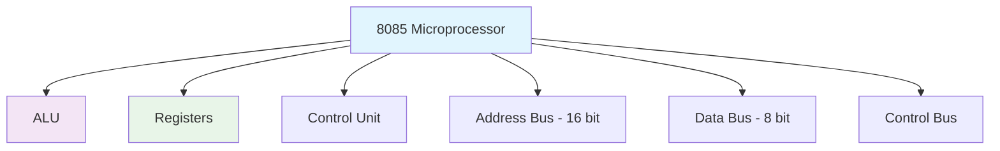
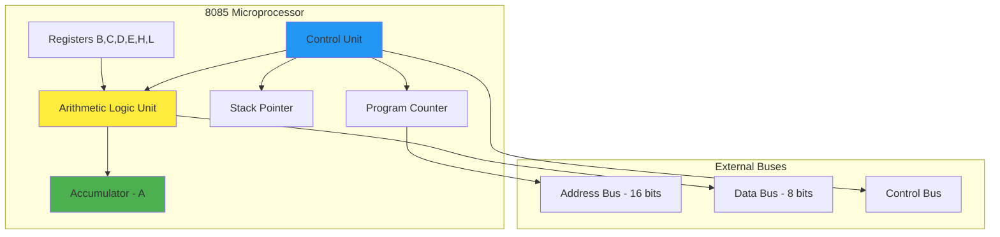

# Microprocessor Basics
## Introduction to 8085 Microprocessor

### Electronics & Communication Engineering
### Semester 4 - MPMC (4341101)

---

# What is a Microprocessor?

## 🧠 Definition
A **microprocessor** is a programmable digital electronic component that incorporates the functions of a CPU on a single integrated circuit.

### Key Characteristics:
- **Programmable** - Can execute different sets of instructions
- **Digital** - Works with binary data (0s and 1s)  
- **Integrated Circuit** - All components on single chip
- **CPU Functions** - Arithmetic, logic, control operations

## 📊 8085 Architecture Overview

---

# 8085 Block Diagram

---

# Thank You!

## Next: Assembly Language Basics

  
    Press Space for next presentation <carbon:arrow-right class="inline"/>
  

