## પ્રશ્ન 1(અ) [3 ગુણ]

**સિગ્નલને વ્યાખ્યાયિત કરો અને તેનું વર્ગીકરણ આપો.**

**જવાબ**:
સિગ્નલ એ એક ભૌતિક માત્રા છે જે સમય, સ્થળ અથવા અન્ય સ્વતંત્ર ચલ સાથે બદલાય છે અને તેમાં માહિતી સમાયેલી હોય છે.

**સિગ્નલનું વર્ગીકરણ:**

| વર્ગીકરણ માપદંડ | સિગ્નલના પ્રકાર |
|-----------------|----------------|
| **સમય ડોમેન** | કંટીન્યુઅસ-ટાઈમ સિગ્નલ, ડિસ્ક્રીટ-ટાઈમ સિગ્નલ |
| **એમ્પ્લિટ્યુડ** | એનાલોગ સિગ્નલ, ડિજિટલ સિગ્નલ |
| **પ્રકૃતિ** | ડીટર્મિનિસ્ટિક સિગ્નલ, રેન્ડમ સિગ્નલ |
| **સિમેટ્રી** | ઈવન સિગ્નલ, ઓડ સિગ્નલ |
| **એનર્જી/પાવર** | એનર્જી સિગ્નલ, પાવર સિગ્નલ |

**મેમરી ટ્રીક:** "CADEN" (Continuous/Discrete, Analog/Digital, Deterministic/Random, Even/Odd, Energy/Power)

## પ્રશ્ન 1(બ) [4 ગુણ]

**કંટીન્યુઅસ અને ડિસ્ક્રીટ ટાઈમ સિગ્નલ સમજાવો.**

**જવાબ**:

| કંટીન્યુઅસ-ટાઈમ સિગ્નલ | ડિસ્ક્રીટ-ટાઈમ સિગ્નલ |
|------------------------|------------------------|
| સમયના તમામ મૂલ્યો માટે વ્યાખ્યાયિત | માત્ર ચોક્કસ સમય અંતરાલ પર વ્યાખ્યાયિત |
| x(t) તરીકે રજુ થાય છે | x[n] અથવા x(nT) તરીકે રજુ થાય છે |
| ઉદાહરણ: સાઇન વેવ જેવા એનાલોગ સિગ્નલ | ઉદાહરણ: સેમ્પલ કરેલા સ્પીચ જેવા ડિજિટલ સિગ્નલ |
| ગ્રાફ પર સળંગ વક્ર | ગ્રાફ પર બિંદુઓની શ્રેણી |
| પ્રોસેસિંગ માટે એનાલોગ સર્કિટની જરૂર પડે | પ્રોસેસિંગ ડિજિટલ પ્રોસેસર દ્વારા કરી શકાય |

**આકૃતિ:**

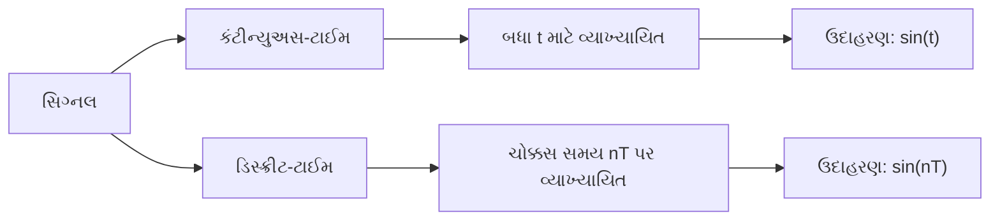

**મેમરી ટ્રીક:** "CAD" - Continuous signals are Analog and Defined for all time; Discrete signals are digital and defined at specific points.

## પ્રશ્ન 1(ક) [7 ગુણ]

**યુનિટ ઇમ્પલ્સ અને યુનિટ સ્ટેપ ફંક્શન સમજાવો.**

**જવાબ**:

| યુનિટ ઇમ્પલ્સ ફંક્શન (δ(t)) | યુનિટ સ્ટેપ ફંક્શન (u(t)) |
|----------------------------|---------------------------|
| t=0 પર અનંત ઊંચાઈ, બાકી જગ્યાએ શૂન્ય | t≥0 માટે મૂલ્ય 1, t<0 માટે 0 |
| વક્ર નીચેનું ક્ષેત્રફળ = 1 | ઇન્ટિગ્રલ રેમ્પ ફંક્શન આપે છે |
| તાત્કાલિક ઘટનાઓને રજૂ કરવા માટે | અચાનક બદલાવને રજૂ કરવા માટે |
| LTI સિસ્ટમ એનાલિસિસનો ગાણિતિક આધાર | સિસ્ટમ રિસ્પોન્સ એનાલિસિસ માટે ઉપયોગી |
| લાપ્લાસ ટ્રાન્સફોર્મ = 1 | લાપ્લાસ ટ્રાન્સફોર્મ = 1/s |

**આકૃતિ:**

```goat
            |     ^
            |     |
            |     |
Unit        |     |               Unit
Impulse     | δ(t)| Area = 1      Step        u(t)
            |     |               Function    ---------->
            |     |                           |
            +-----+------->                   +------------>
           -1  0  1  t                       -1  0  1  t    
```

**ગુણધર્મો:**

- **સેમ્પલિંગ પ્રોપર્ટી**: ∫f(t)δ(t-t₀)dt = f(t₀)
- **યુનિટ સ્ટેપ ઇમ્પલ્સનું ઇન્ટિગ્રલ છે**: u(t) = ∫δ(τ)dτ from -∞ to t
- **ઇમ્પલ્સ યુનિટ સ્ટેપનો ડેરિવેટિવ છે**: δ(t) = du(t)/dt

**મેમરી ટ્રીક:** "SHARP-FLAT" - Impulse is Sharp and momentary; Step is Flat and persistent.

## પ્રશ્ન 1(ક) OR [7 ગુણ]

**ડિજિટલ કોમ્યુનિકેશન સિસ્ટમનો બ્લોક ડાયાગ્રામ સમજાવો.**

**જવાબ**:

**ડિજિટલ કોમ્યુનિકેશન સિસ્ટમનો બ્લોક ડાયાગ્રામ:**

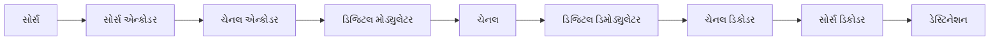

**સમજૂતી:**

| બ્લોક | કાર્ય |
|-------|------|
| **સોર્સ** | ટ્રાન્સમિટ કરવાનો મેસેજ ઉત્પન્ન કરે છે |
| **સોર્સ એન્કોડર** | મેસેજને ડિજિટલ ફોર્મમાં રૂપાંતરિત કરે છે, રિડન્ડન્સી દૂર કરે છે |
| **ચેનલ એન્કોડર** | એરર ડિટેક્શન/કરેક્શન માટે નિયંત્રિત રિડન્ડન્સી ઉમેરે છે |
| **ડિજિટલ મોડ્યુલેટર** | ડિજિટલ બિટ્સને ટ્રાન્સમિશન માટે યોગ્ય સિગ્નલમાં રૂપાંતરિત કરે છે |
| **ચેનલ** | ભૌતિક માધ્યમ જેના દ્વારા સિગ્નલ પ્રવાસ કરે છે |
| **ડિજિટલ ડિમોડ્યુલેટર** | પ્રાપ્ત સિગ્નલમાંથી ડિજિટલ ડેટા પુનઃપ્રાપ્ત કરે છે |
| **ચેનલ ડિકોડર** | ઉમેરેલી રિડન્ડન્સીનો ઉપયોગ કરીને એરર શોધે/સુધારે છે |
| **સોર્સ ડિકોડર** | પ્રાપ્ત બિટ્સમાંથી મૂળ સંદેશ પુનઃનિર્માણ કરે છે |
| **ડેસ્ટિનેશન** | પ્રેષિત સંદેશ પ્રાપ્ત કરે છે |

**મેમરી ટ્રીક:** "SECDCSD" - "Seven Engineers Can Design Communication Systems Diligently"

## પ્રશ્ન 2(અ) [3 ગુણ]

**સિગ્નલમાં 8000 બીટ/સેકન્ડનો બીટ રેટ અને 1000 બોડનો બોડ દર હોય છે. દરેક સિગ્નલ એલીમેંટ દ્વારા કેટલા ડેટા એલીમેંટ વહન કરવામાં આવે છે?**

**જવાબ**:

દરેક સિગ્નલ એલિમેન્ટ દ્વારા વહન કરાતા ડેટા એલિમેન્ટ (બિટ્સ)ની સંખ્યા:
= બીટ રેટ ÷ બોડ રેટ
= 8000 બિટ્સ/સેકન્ડ ÷ 1000 બોડ
= 8 બિટ્સ/સિગ્નલ એલિમેન્ટ

**કોષ્ટક:**

| પેરામીટર | મૂલ્ય | સંબંધ |
|-----------|------|-------|
| બીટ રેટ | 8000 બિટ્સ/સેક | આપેલ |
| બોડ રેટ | 1000 બોડ | આપેલ |
| બિટ્સ/સિગ્નલ | 8 બિટ્સ | બીટ રેટ ÷ બોડ રેટ |

**મેમરી ટ્રીક:** "Bits Divided By Bauds" (BDBB)

## પ્રશ્ન 2(બ) [4 ગુણ]

**એનર્જી અને પાવર સિગ્નલ સમજાવો.**

**જવાબ**:

| એનર્જી સિગ્નલ | પાવર સિગ્નલ |
|----------------|---------------|
| અંતિમ કુલ એનર્જી | અનંત કુલ એનર્જી પરંતુ અંતિમ સરેરાશ પાવર |
| શૂન્ય સરેરાશ પાવર | બિન-શૂન્ય સરેરાશ પાવર |
| E = ∫\|x(t)\|²dt (અંતિમ) | P = lim(T→∞) 1/2T ∫\|x(t)\|²dt (અંતિમ) |
| ઉદાહરણ: પલ્સ, ક્ષયિત એક્સપોનેન્શિયલ | ઉદાહરણ: સાઇન વેવ, સ્ક્વેર વેવ |
| સમયમાં સીમિત | બધા સમય માટે અસ્તિત્વમાં |

**આકૃતિ:**

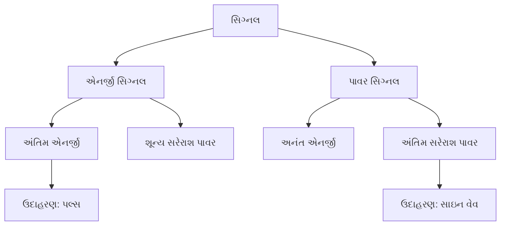

**મેમરી ટ્રીક:** "FEZIL" - Finite Energy is Zero in Long-term; Power signals are Infinite in Length

## પ્રશ્ન 2(ક) [7 ગુણ]

**FSK મોડ્યુલેટર અને ડી-મોડ્યુલેટરના બ્લોક ડાયાગ્રામને વેવફોર્મ સાથે સમજાવો.**

**જવાબ**:

**FSK મોડ્યુલેટર અને ડિમોડ્યુલેટર:**

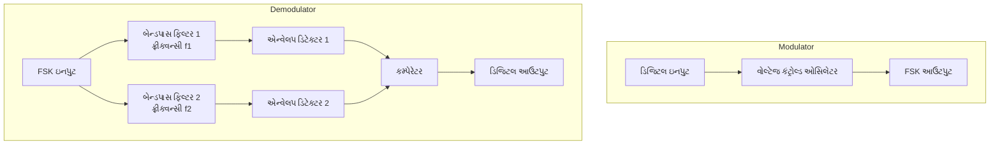

**વેવફોર્મ:**

```goat
Digital Input: _____‾‾‾‾‾_____‾‾‾‾‾_____
                 0     1     0     1     0

FSK Output:  /\/\/\MMMMMM/\/\/\MMMMMM/\/\/\
             f1    f2    f1    f2    f1
             
Received at BPF1: /\/\/\_____/\/\/\_____/\/\/\
                   f1          f1          f1
                   
Received at BPF2: _____MMMMMM_____MMMMMM_____
                        f2          f2
                        
Digital Output: _____‾‾‾‾‾_____‾‾‾‾‾_____
                 0     1     0     1     0
```

**મુખ્ય સિદ્ધાંતો:**

- **બિટ 0**: ફ્રીક્વન્સી f₁ તરીકે ટ્રાન્સમિટ થાય છે
- **બિટ 1**: ફ્રીક્વન્સી f₂ તરીકે ટ્રાન્સમિટ થાય છે
- **ડિમોડ્યુલેશન**: ફ્રીક્વન્સીઓને અલગ કરવા માટે બેન્ડપાસ ફિલ્ટર્સનો ઉપયોગ કરે છે
- **ડિટેક્શન**: એન્વેલપ ડિટેક્ટર્સ ડિજિટલ સિગ્નલને પુનઃપ્રાપ્ત કરે છે

**મેમરી ટ્રીક:** "FIST" - Frequency Is Shifted for Transmission

## પ્રશ્ન 2(અ) OR [3 ગુણ]

**સિગ્નલ 4 બીટ/સિગ્નલ એલીમેંટ ધરાવે છે. જો 1000 સિગ્નલ એલીમેંટ પ્રતિ સેકન્ડ મોકલવામાં આવે છે. તો બીટ રેટ શોધો.**

**જવાબ**:

બીટ રેટ = સિગ્નલ એલિમેન્ટ દીઠ બિટ્સની સંખ્યા × પ્રતિ સેકન્ડ સિગ્નલ એલિમેન્ટ
બીટ રેટ = 4 બિટ્સ/સિગ્નલ એલિમેન્ટ × 1000 સિગ્નલ એલિમેન્ટ/સેકન્ડ
બીટ રેટ = 4000 બિટ્સ/સેકન્ડ

**કોષ્ટક:**

| પેરામીટર | મૂલ્ય | સંબંધ |
|-----------|------|-------|
| સિમ્બોલ દીઠ બિટ્સ | 4 | આપેલ |
| સિમ્બોલ રેટ | 1000 સિમ્બોલ/સેક | આપેલ |
| બીટ રેટ | 4000 બિટ્સ/સેક | બિટ્સ/સિમ્બોલ × સિમ્બોલ રેટ |

**મેમરી ટ્રીક:** "BBS" - Bit rate equals Bits per symbol times Symbol rate

## પ્રશ્ન 2(બ) OR [4 ગુણ]

**ઈવન અને ઓડ સિગ્નલ સમજાવો.**

**જવાબ**:

| ઈવન સિગ્નલ | ઓડ સિગ્નલ |
|-------------|-----------|
| y-અક્ષની આસપાસ સિમેટ્રિક | y-અક્ષની આસપાસ એન્ટી-સિમેટ્રિક |
| x(-t) = x(t) | x(-t) = -x(t) |
| ઉદાહરણ: cos(t) | ઉદાહરણ: sin(t) |
| ફૂરિયર ટ્રાન્સફોર્મ વાસ્તવિક છે | ફૂરિયર ટ્રાન્સફોર્મ કાલ્પનિક છે |
| ઈવન સિગ્નલનો સરવાળો ઈવન છે | ઓડ સિગ્નલનો સરવાળો ઓડ છે |

**આકૃતિ:**

```goat
Even Signal x(t)             Odd Signal x(t)
    |                            |
    |     *     *                |     *
    |   *         *              |   *   \
    | *             *            | *      \
----+---------------+---->   ----+--------+----+---->
    |                            |        /     *
    |                            |      /   *
    |                            |     *
```

**ગુણધર્મો:**

- કોઈપણ સિગ્નલને ઈવન અને ઓડ ઘટકોના સરવાળા તરીકે વ્યક્ત કરી શકાય છે
- ઈવન ઘટક: x₁(t) = [x(t) + x(-t)]/2
- ઓડ ઘટક: x₂(t) = [x(t) - x(-t)]/2

**મેમરી ટ્રીક:** "SAME-FLIP" - Even signals are the SAME when flipped; Odd signals FLIP their sign.

## પ્રશ્ન 2(ક) OR [7 ગુણ]

**QPSK મોડ્યુલેટર અને ડી-મોડ્યુલેટરના બ્લોક ડાયાગ્રામને કોન્સોલેશન ડાયાગ્રામ સાથે સમજાવો.**

**જવાબ**:

**QPSK મોડ્યુલેટર અને ડિમોડ્યુલેટર:**

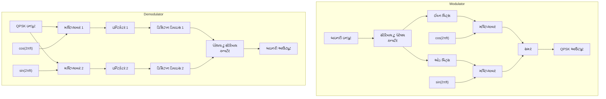

**કોન્સ્ટેલેશન ડાયાગ્રામ:**

```goat
             Q
             |
      01     |     00
      •      |      •
             |
-------------+-------------
             |
      11     |     10
      •      |      •
             |             I
```

**મુખ્ય લક્ષણો:**

- **ઇનપુટ**: દરેક સિમ્બોલ 2 બિટ્સ દ્વારા નક્કી થાય છે
- **ફેઝ**: 4 ફેઝ (0°, 90°, 180°, 270°)
- **બિટ્સથી ફેઝ**:
  - 00: 45°
  - 01: 135°
  - 11: 225°
  - 10: 315°
- **બેન્ડવિડ્થ એફિશિયન્સી**: 2 બિટ્સ પ્રતિ સિમ્બોલ

**મેમરી ટ્રીક:** "QUADrature" - 4 phases for 4 possible 2-bit combinations

## પ્રશ્ન 3(અ) [3 ગુણ]

**ASK મોડ્યુલેટરનું કાર્ય બ્લોક ડાયાગ્રામ અને વેવફોર્મ સાથે સમજાવો.**

**જવાબ**:

**ASK મોડ્યુલેટર બ્લોક ડાયાગ્રામ:**

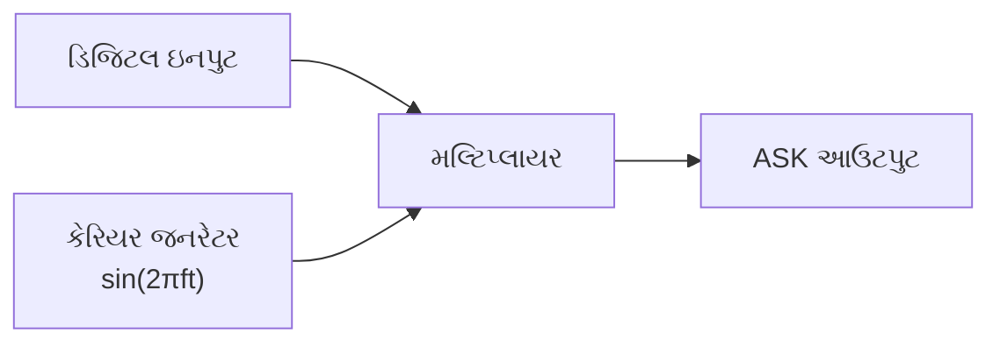

**વેવફોર્મ:**

```goat
ડિજિટલ ઇનપુટ: _____‾‾‾‾‾_____‾‾‾‾‾_____
                 0     1     0     1     0

કેરિયર:      /\/\/\/\/\/\/\/\/\/\/\/\/\/\

ASK આઉટપુટ:   _____/\/\/\_____/\/\/\_____
                 0     1     0     1     0
```

**કાર્ય સિદ્ધાંત:**

- ડિજિટલ 1: કેરિયર સિગ્નલ ટ્રાન્સમિટ થાય છે
- ડિજિટલ 0: કોઈ સિગ્નલ નહીં (અથવા ઓછી એમ્પ્લિટ્યુડ) ટ્રાન્સમિટ થાય છે
- આઉટપુટ એમ્પ્લિટ્યુડ ઇનપુટ ડિજિટલ સિગ્નલ સાથે બદલાય છે

**મેમરી ટ્રીક:** "ASKY" - Amplitude Switches the Carrier? Yes!

## પ્રશ્ન 3(બ) [4 ગુણ]

**8-PSK અને 16-QAM ના કોન્સોલેશન ડાયાગ્રામ દોરો.**

**જવાબ**:

**8-PSK કોન્સ્ટેલેશન ડાયાગ્રામ:**

```goat
                  Q
                  |
        011  •    |    • 000
              \   |   /
         110 •  \ | /  • 001
                 \|/
        ---------+--------- I
                /|\
         101 •  / | \  • 010
              /   |   \
        100  •    |    • 011
                  |
```

**16-QAM કોન્સ્ટેલેશન ડાયાગ્રામ:**

```goat
                Q
        •   •   |   •   •
                |
        •   •   |   •   •
                |
        --------+--------
                |
        •   •   |   •   •
                |
        •   •   |   •   •
                |         I
```

**મુખ્ય તફાવતો:**

- **8-PSK**: 8 સિમ્બોલ, સમાન એમ્પ્લિટ્યુડ, 45° અંતરે ફેઝ
- **16-QAM**: 16 સિમ્બોલ, બદલાતી એમ્પ્લિટ્યુડ અને ફેઝ

**મેમરી ટ્રીક:** "P-Phase Q-Quantity" - PSK varies Phase only; QAM varies both amplitude (Quantity) and phase

## પ્રશ્ન 3(ક) [7 ગુણ]

**1100101101 ના ક્રમ માટે ASK અને FSK મોડ્યુલેશન વેવફોર્મ દોરો.**

**જવાબ**:

**મોડ્યુલેશન વેવફોર્મ:**

```goat
Binary Input:  ‾‾‾‾‾‾‾‾‾‾_____‾‾‾‾‾_____‾‾‾‾‾‾‾‾‾‾
               1  1  0  0  1  0  1  1  0  1
               
Carrier:       /\/\/\/\/\/\/\/\/\/\/\/\/\/\/\/\/\/\

ASK Output:    /\/\/\/\/\/\_____/\/\/\_____/\/\/\/\/\
               1  1  0  0  1  0  1  1  0  1
               
FSK Output:    MMMMMMMMMM/\/\/\/MMMMM/\/\/\/MMMMMMMMMM
               1  1  0  0  1  0  1  1  0  1
               f2 f2 f1 f1 f2 f1 f2 f2 f1 f2
```

**મુખ્ય લક્ષણો:**

- **ASK**: બિટ 1 માટે કેરિયર હાજર, બિટ 0 માટે ગેરહાજર
- **FSK**: બિટ 1 માટે ઉચ્ચ ફ્રીક્વન્સી (f₂), બિટ 0 માટે નીચી ફ્રીક્વન્સી (f₁)

**મોડ્યુલેશન પદ્ધતિનું કોષ્ટક:**

| મોડ્યુલેશન | બિટ 0 | બિટ 1 | બદલાતો પેરામીટર |
|------------|-------|-------|----------------|
| ASK | શૂન્ય અથવા ઓછી એમ્પ્લિટ્યુડ | ઉચ્ચ એમ્પ્લિટ્યુડ | એમ્પ્લિટ્યુડ |
| FSK | ફ્રીક્વન્સી f₁ | ફ્રીક્વન્સી f₂ | ફ્રીક્વન્સી |

**મેમરી ટ્રીક:** "AFRO" - Amplitude For 1, Remove for 0 (ASK); Frequency Rises for 1, Off-peak for 0 (FSK)

## પ્રશ્ન 3(અ) OR [3 ગુણ]

**PSK મોડ્યુલેટરનું કાર્ય બ્લોક ડાયાગ્રામ અને વેવફોર્મ સાથે સમજાવો.**

**જવાબ**:

**PSK મોડ્યુલેટર બ્લોક ડાયાગ્રામ:**

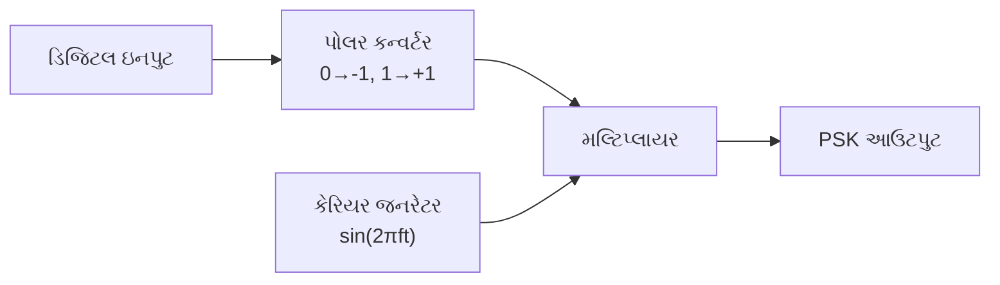

**વેવફોર્મ:**

```goat
Digital Input: _____‾‾‾‾‾_____‾‾‾‾‾_____
                 0     1     0     1     0

Carrier:      /\/\/\/\/\/\/\/\/\/\/\/\/\/\

PSK Output:   \/\/\/\/\/\/\/\/\/\/\/\/\/\/
               0     1     0     1     0
               180°  0°   180°  0°   180°
```

**કાર્ય સિદ્ધાંત:**

- ડિજિટલ 1: 0° ફેઝ સાથે કેરિયર સિગ્નલ
- ડિજિટલ 0: 180° ફેઝ સાથે કેરિયર સિગ્નલ (ઉલટું)
- એમ્પ્લિટ્યુડ સ્થિર રહે છે, માત્ર ફેઝ બદલાય છે

**મેમરી ટ્રીક:** "PSKIT" - Phase Shift Keeps Information True

## પ્રશ્ન 3(બ) OR [4 ગુણ]

**1101001101 ના ક્રમ માટે MSK મોડ્યુલેશન વેવફોર્મ દોરો.**

**જવાબ**:

**MSK મોડ્યુલેશન વેવફોર્મ:**

```goat
Binary Input:  ‾‾‾‾‾_____‾‾‾‾‾_____‾‾‾‾‾‾‾‾‾‾
               1  1  0  1  0  0  1  1  0  1
               
MSK Output:    \/\/MMMMM\/\/MMMMM\/\/\/\/MMMMM
               1  1  0  1  0  0  1  1  0  1
```

**MSKના લક્ષણો:**

- સતત ફેઝ ટ્રાન્ઝિશન (કોઈ ફેઝ જમ્પ નહીં)
- f₁ અને f₂ વચ્ચે ફ્રીક્વન્સી શિફ્ટ
- ન્યૂનતમ ફ્રીક્વન્સી સેપરેશન: Δf = 1/(2T)
- FSK કરતાં વધુ સ્મૂધ ટ્રાન્ઝિશન

**કોષ્ટક:**

| લક્ષણ | MSK લક્ષણ |
|-------|-----------|
| ફેઝ કન્ટિન્યુઇટી | સતત, કોઈ અચાનક બદલાવ નહીં |
| ફ્રીક્વન્સી ડેવિએશન | ન્યૂનતમ શક્ય (1/2T) |
| સ્પેક્ટ્રલ એફિશિયન્સી | પરંપરાગત FSK કરતાં વધુ સારી |
| બેન્ડવિડ્થ | બીટ રેટનો 1.5 ગણો |

**મેમરી ટ્રીક:** "MINIMUM SMOOTH" - MSK uses Minimum frequency separation with Smooth transitions

## પ્રશ્ન 3(ક) OR [7 ગુણ]

**1100101011 માટે BPSK અને QPSK મોડ્યુલેશન વેવફોર્મ દોરો.**

**જવાબ**:

**BPSK અને QPSK મોડ્યુલેશન વેવફોર્મ:**

```goat
Binary Input:     ‾‾‾‾‾‾‾‾‾‾_____‾‾‾‾‾_____‾‾‾‾‾‾‾‾‾‾
                  1  1  0  0  1  0  1  0  1  1
                  
BPSK Output:      /\/\/\/\/\/\/\/\/\/\/\/\/\/\/\/\/\/\
                  0°  0° 180°180° 0° 180° 0° 180° 0°  0°
                  
QPSK (I channel): /\/\/\_____/\/\/\_____/\/\/\
                  11   00    10    01    11
                  
QPSK (Q channel): /\/\/\/\/\/\_____/\/\/\_____
                  11   00    10    01    11
                  
QPSK (combined):  \/\/\/MMMMM\/\/\/MMMMM\/\/\/
                  11   00    10    01    11
```

**મુખ્ય તફાવતો:**

- **BPSK**: 1 બીટ પ્રતિ સિમ્બોલ, 2 ફેઝ (0° અને 180°)
- **QPSK**: 2 બીટ પ્રતિ સિમ્બોલ, 4 ફેઝ (45°, 135°, 225°, 315°)
- **QPSK જોડી**: 00, 01, 10, 11 અલગ-અલગ ફેઝને મેપ કરે છે

**કોષ્ટક:**

| મોડ્યુલેશન | બીટ્સ/સિમ્બોલ | ફેઝની સંખ્યા | બેન્ડવિડ્થ એફિશિયન્સી |
|------------|--------------|-------------|----------------------|
| BPSK | 1 | 2 | 1 બીટ/Hz |
| QPSK | 2 | 4 | 2 બીટ/Hz |

**મેમરી ટ્રીક:** "ONE-TWO" - ONE bit for BPSK, TWO bits for QPSK

## પ્રશ્ન 4(અ) [3 ગુણ]

**નીચેની પ્રોબેબીલીટી ક્રમ માટે હફમેન કોડનો ઉપયોગ કરીને ડેટાને એન્કોડ કરો. P = { 0.4, 0.2, 0.2, 0.1, 0.1}**

**જવાબ**:

**હફમેન કોડિંગ પ્રક્રિયા:**

| સિમ્બોલ | પ્રોબેબિલિટી | હફમેન કોડ |
|---------|-------------|-----------|
| A | 0.4 | 0 |
| B | 0.2 | 10 |
| C | 0.2 | 11 |
| D | 0.1 | 110 |
| E | 0.1 | 111 |

**હફમેન ટ્રી:**

```goat
                [1.0]
               /     \
              /       \
           [0.6]      [0.4] A:0
          /     \
         /       \
      [0.4]     [0.2] B:10
     /     \
    /       \
 [0.2] C:11 [0.2]
           /     \
          /       \
     [0.1] D:110 [0.1] E:111
```

**મેમરી ટ્રીક:** "Higher Probability Means Shorter Code"

## પ્રશ્ન 4(બ) [4 ગુણ]

**સંભાવના અને એન્ટ્રોપી વ્યાખ્યાયિત કરો.**

**જવાબ**:

| સંકલ્પના | વ્યાખ્યા | સૂત્ર | મહત્વ |
|---------|---------|-----|------|
| **સંભાવના** | ઘટના ઘટવાની સંભાવનાનું માપ | P(A) = અનુકૂળ પરિણામોની સંખ્યા / કુલ શક્ય પરિણામોની સંખ્યા | કોમ્યુનિકેશનમાં અનિશ્ચિતતા મોડેલ કરવા માટે ઉપયોગી |
| **એન્ટ્રોપી** | સિસ્ટમમાં અનિશ્ચિતતા અથવા રેન્ડમનેસનું માપ | H(X) = -∑ P(xi) log₂ P(xi) | સરેરાશ માહિતી સામગ્રી દર્શાવે છે |

**મુખ્ય લક્ષણો:**

- **સંભાવના રેન્જ**: 0 ≤ P(A) ≤ 1
- **એન્ટ્રોપી એકમો**: બિટ્સ (log₂નો ઉપયોગ કરીને)
- **મહત્તમ એન્ટ્રોપી**: જ્યારે બધી ઘટનાઓ સમાન સંભાવના ધરાવે છે
- **ન્યૂનતમ એન્ટ્રોપી**: જ્યારે પરિણામ નિશ્ચિત હોય (સંભાવના = 1)

**મેમરી ટ્રીક:** "PURE" - Probability Underpins Randomness Estimation

## પ્રશ્ન 4(ક) [7 ગુણ]

**CDMA ટેકનિકને વિગતવાર સમજાવો.**

**જવાબ**:

**CDMA (કોડ ડિવિઝન મલ્ટિપલ એક્સેસ):**

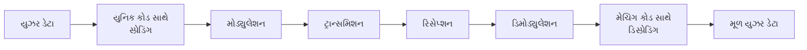

**CDMA લક્ષણોનું કોષ્ટક:**

| લક્ષણ | વર્ણન |
|-------|-------|
| **એક્સેસ મેથડ** | બહુવિધ વપરાશકર્તાઓ એક જ ફ્રીક્વન્સી અને સમય શેર કરે છે |
| **વિભાજન** | વપરાશકર્તાઓને અનન્ય સ્પ્રેડિંગ કોડ દ્વારા અલગ પાડવામાં આવે છે |
| **સ્પ્રેડિંગ કોડ** | ઓર્થોગોનલ અથવા પ્સ્યુડો-ઓર્થોગોનલ સિક્વન્સ |
| **પ્રોસેસિંગ ગેઇન** | સ્પ્રેડ બેન્ડવિડ્થનો મૂળ બેન્ડવિડ્થ સાથેનો ગુણોત્તર |
| **મલ્ટિપલ એક્સેસ** | ફ્રીક્વન્સી અથવા સમય વિભાજનને બદલે કોડ સ્પેસનો ઉપયોગ કરે છે |
| **ઇન્ટરફેરન્સ રિજેક્શન** | નેરોબેન્ડ ઇન્ટરફેરન્સને નકારવાની અંતર્ગત ક્ષમતા |

**મુખ્ય ફાયદાઓ:**

- **ક્ષમતા**: ઘણા કિસ્સાઓમાં FDMA/TDMA કરતાં વધારે
- **સુરક્ષા**: સ્પ્રેડિંગ કોડ દ્વારા અંતર્ગત એન્ક્રિપ્શન
- **મલ્ટિપાથ રિજેક્શન**: રેક રિસીવર મલ્ટિપાથ ઘટકોને જોડી શકે છે
- **સોફ્ટ હેન્ડઓફ**: મોબાઇલ એક સાથે બહુવિધ બેઝ સ્ટેશનો સાથે વાતચીત કરી શકે છે

**મેમરી ટ્રીક:** "CODES" - Capacity Optimized with Direct-sequence Encoding Schemes

## પ્રશ્ન 4(અ) OR [3 ગુણ]

**નીચેના પ્રોબેબીલીટી ક્રમ માટે શેનોન ફેનો કોડનો ઉપયોગ કરીને ડેટાને એન્કોડ કરો. P = { 0.5, 0.25, 0.125, 0.125}**

**જવાબ**:

**શેનોન-ફેનો કોડિંગ પ્રક્રિયા:**

| સિમ્બોલ | પ્રોબેબિલિટી | શેનોન-ફેનો કોડ |
|---------|-------------|----------------|
| A | 0.5 | 0 |
| B | 0.25 | 10 |
| C | 0.125 | 110 |
| D | 0.125 | 111 |

**શેનોન-ફેનો ટ્રી:**

```goat
               [1.0]
              /     \
             /       \
        [0.5] A      [0.5]
                    /     \
                   /       \
              [0.25] B     [0.25]
                          /     \
                         /       \
                  [0.125] C     [0.125] D
                   કોડ:110     કોડ:111
```

**મેમરી ટ્રીક:** "Split For Optimum" - Shannon-Fano splits groups for optimum coding

## પ્રશ્ન 4(બ) OR [4 ગુણ]

**ઈન્ફોર્મેશન અને ચેનલ કેપેસિટી વ્યાખ્યાયિત કરો.**

**જવાબ**:

| સંકલ્પના | વ્યાખ્યા | સૂત્ર | મહત્વ |
|---------|---------|-----|------|
| **ઈન્ફોર્મેશન** | અનિશ્ચિતતામાં ઘટાડાનું માપ | I(x) = -log₂ P(x) | ઓછી સંભાવના ધરાવતી ઘટનાઓ વધુ માહિતી ધરાવે છે |
| **ચેનલ કેપેસિટી** | મહત્તમ દર જે પર નિર્ધારિત ત્રુટિ સાથે માહિતી પ્રસારિત કરી શકાય | C = B log₂(1 + S/N) | વિશ્વસનીય કોમ્યુનિકેશનની મૂળભૂત મર્યાદા |

**મુખ્ય મુદ્દાઓ:**

- **ઈન્ફોર્મેશન એકમો**: બિટ્સ (log₂નો ઉપયોગ કરીને)
- **ચેનલ કેપેસિટી એકમો**: બિટ્સ પ્રતિ સેકન્ડ
- **કેપેસિટીને અસર કરતા પરિબળો**:
  - બેન્ડવિડ્થ (B)
  - સિગ્નલ-ટુ-નોઇઝ રેશિયો (S/N)

**મેમરી ટ્રીક:** "INCHES" - Information Numerically Calculated, Hopping through Efficient Shannon limit

## પ્રશ્ન 4(ક) OR [7 ગુણ]

**TDMA ટેકનિકને વિગતવાર સમજાવો.**

**જવાબ**:

**TDMA (ટાઇમ ડિવિઝન મલ્ટિપલ એક્સેસ):**

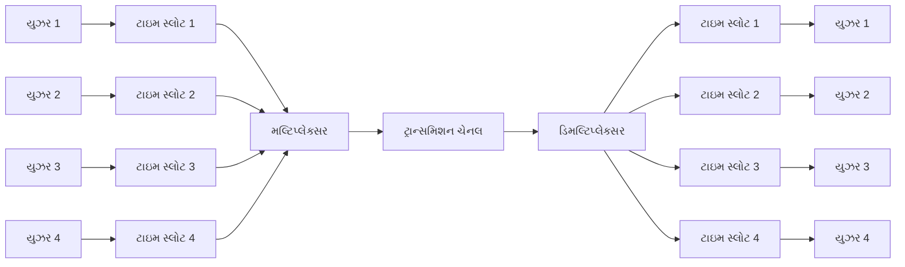

**TDMA લક્ષણોનું કોષ્ટક:**

| લક્ષણ | વર્ણન |
|-------|-------|
| **એક્સેસ મેથડ** | બહુવિધ વપરાશકર્તાઓ એક જ ફ્રીક્વન્સી અલગ-અલગ ટાઇમ સ્લોટમાં શેર કરે છે |
| **ફ્રેમ સ્ટ્રક્ચર** | સમય ફ્રેમમાં વિભાજિત, ફ્રેમ સ્લોટમાં વિભાજિત |
| **ગાર્ડ ટાઇમ** | ઓવરલેપ ટાળવા માટે સ્લોટ વચ્ચે ટૂંકા સમયગાળા |
| **સિન્ક્રોનાઇઝેશન** | ટ્રાન્સમિટર અને રિસીવર વચ્ચે ચોક્કસ ટાઇમિંગની જરૂર |
| **કાર્યક્ષમતા** | ઉચ્ચ સ્પેક્ટ્રમ ઉપયોગ |
| **પાવર કન્ઝમ્પશન** | ટ્રાન્સમિટર માત્ર સોંપાયેલા સ્લોટ દરમિયાન ચાલુ |

**TDMA ફ્રેમ સ્ટ્રક્ચર:**

```goat
|<------------------- TDMA Frame ------------------->|
| TS1 | TS2 | TS3 | TS4 | TS1 | TS2 | TS3 | TS4 | ...
|User1|User2|User3|User4|User1|User2|User3|User4| ...
```

**મેમરી ટ્રીક:** "TIME" - Transmission In Measured Epochs

## પ્રશ્ન 5(અ) [3 ગુણ]

**T1 કેરિયર સિસ્ટમ સમજાવો.**

**જવાબ**:

**T1 કેરિયર સિસ્ટમ:**

| લક્ષણ | સ્પેસિફિકેશન |
|-----------|--------------|
| **ડેટા રેટ** | 1.544 Mbps |
| **ચેનલ** | 24 વોઇસ ચેનલ |
| **વોઇસ સેમ્પલિંગ** | 8000 સેમ્પલ/સેકન્ડ |
| **સેમ્પલ સાઇઝ** | 8 બિટ્સ પ્રતિ સેમ્પલ |
| **ફ્રેમ સાઇઝ** | 193 બિટ્સ (24×8 + 1) |
| **ફ્રેમ રેટ** | 8000 ફ્રેમ/સેકન્ડ |

**T1 ફ્રેમ સ્ટ્રક્ચર:**

```goat
|<--------------- T1 Frame (193 bits) ------------------>|
| F | Ch1 | Ch2 | Ch3 | ... | Ch24 | F | Ch1 | Ch2 | ... |
| 1 |  8  |  8  |  8  | ... |  8   | 1 |  8  |  8  | ... |
```

**મેમરી ટ્રીક:** "T1-24-8-8" - T1 has 24 channels, 8 bits, 8kHz

## પ્રશ્ન 5(બ) [4 ગુણ]

**ટાઈમ ડિવિઝન મલ્ટિપ્લેક્સિંગ ટેકનિક (TDM) ને વિગતવાર સમજાવો.**

**જવાબ**:

**ટાઇમ ડિવિઝન મલ્ટિપ્લેક્સિંગ (TDM):**

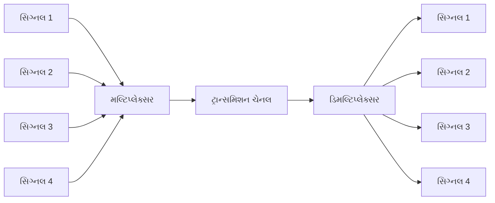

**TDM લક્ષણોનું કોષ્ટક:**

| લક્ષણ | વર્ણન |
|-------|-------|
| **સિદ્ધાંત** | બહુવિધ સિગ્નલ વારાફરતી લઈને એક ચેનલ શેર કરે છે |
| **સમય ફાળવણી** | દરેક સિગ્નલને નિશ્ચિત સમય સ્લોટ ફાળવવામાં આવે છે |
| **સિન્ક્રોનાઇઝેશન** | મલ્ટિપ્લેક્સર અને ડિમલ્ટિપ્લેક્સર વચ્ચે ચોક્કસ ટાઇમિંગની જરૂર |
| **ઇન્ટરલીવિંગ** | વિવિધ સ્ત્રોતોના સેમ્પલ સમયમાં ઇન્ટરલીવ્ડ |
| **પ્રકારો** | સિન્ક્રોનસ TDM અને એસિન્ક્રોનસ (સ્ટેટિસ્ટિકલ) TDM |

**TDM ફ્રેમ સ્ટ્રક્ચર:**

```goat
|<---------------- TDM Frame ---------------->|
| S1 | S2 | S3 | S4 | S1 | S2 | S3 | S4 | ... |
```

**મેમરી ટ્રીક:** "TWIST" - Time Windows Interleaving Signals Together

## પ્રશ્ન 5(ક) [7 ગુણ]

**ઇન્ફોમેશન સિક્યોરિટીમાં આવતા સિક્યોરિટી ઘટકોને વિગતવાર સમજાવો.**

**જવાબ**:

**ઇન્ફોર્મેશન સિક્યોરિટી ઘટકો:**

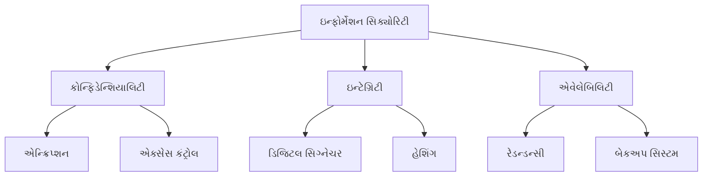

**સિક્યોરિટી ઘટકોનું કોષ્ટક:**

| ઘટક | વર્ણન | અમલીકરણ પદ્ધતિઓ |
|-----------|-------------|------------------------|
| **કોન્ફિડેન્શિયાલિટી** | માહિતી માત્ર અધિકૃત વપરાશકર્તાઓને જ ઉપલબ્ધ થાય તેની ખાતરી | એન્ક્રિપ્શન, એક્સેસ કંટ્રોલ, ઓથેન્ટિકેશન |
| **ઇન્ટેગ્રિટી** | ડેટાની સચોટતા અને સુસંગતતા જાળવવી | ડિજિટલ સિગ્નેચર, હેશિંગ, ચેકસમ |
| **એવેલેબિલિટી** | જ્યારે જરૂર હોય ત્યારે માહિતી ઉપલબ્ધ થાય તેની ખાતરી | રેડન્ડન્સી, બેકઅપ સિસ્ટમ, ડિઝાસ્ટર રિકવરી |
| **ઓથેન્ટિકેશન** | વપરાશકર્તાઓની ઓળખની ચકાસણી | પાસવર્ડ, બાયોમેટ્રિક્સ, ડિજિટલ સર્ટિફિકેટ |
| **નોન-રેપ્યુડિએશન** | માહિતી મોકલવા/પ્રાપ્ત કરવાના ઇન્કારને રોકવું | ડિજિટલ સિગ્નેચર, ઓડિટ ટ્રેઇલ્સ |

**સામાન્ય સુરક્ષા ધમકીઓ:**

- **માલવેર**: વાયરસ, વોર્મ્સ, ટ્રોજન, રેન્સમવેર
- **સોશિયલ એન્જિનિયરિંગ**: ફિશિંગ, પ્રીટેક્સ્ટિંગ
- **મેન-ઇન-ધ-મિડલ એટેક**: વાતચીતને અવરોધવી
- **ડિનાયલ-ઓફ-સર્વિસ**: કાયદેસર એક્સેસને રોકવી

**મેમરી ટ્રીક:** "CIA" - Confidentiality, Integrity, Availability

## પ્રશ્ન 5(અ) OR [3 ગુણ]

**E1 કેરિયર સિસ્ટમ સમજાવો.**

**જવાબ**:

**E1 કેરિયર સિસ્ટમ:**

| લક્ષણ | સ્પેસિફિકેશન |
|-----------|--------------|
| **ડેટા રેટ** | 2.048 Mbps |
| **ચેનલ** | 32 ટાઇમ સ્લોટ (30 વોઇસ + 2 સિગ્નલિંગ) |
| **વોઇસ સેમ્પલિંગ** | 8000 સેમ્પલ/સેકન્ડ |
| **સેમ્પલ સાઇઝ** | 8 બિટ્સ પ્રતિ સેમ્પલ |
| **ફ્રેમ સાઇઝ** | 256 બિટ્સ (32×8) |
| **ફ્રેમ રેટ** | 8000 ફ્રેમ/સેકન્ડ |

**E1 ફ્રેમ સ્ટ્રક્ચર:**

```goat
|<----------------- E1 Frame (256 bits) ----------------->|
| TS0 | TS1 | TS2 | ... | TS15 | TS16 | TS17 | ... | TS31 |
|  8  |  8  |  8  | ... |  8   |  8   |  8   | ... |  8   |
```

**સ્પેશિયલ ટાઇમ સ્લોટ:**

- **TS0**: ફ્રેમ એલાઇનમેન્ટ સિગ્નલ
- **TS16**: સિગ્નલિંગ ચેનલ

**મેમરી ટ્રીક:** "E1-32-8-8" - E1 has 32 channels, 8 bits, 8kHz

## પ્રશ્ન 5(બ) OR [4 ગુણ]

**ફ્રીક્વન્સી ડિવિઝન મલ્ટિપ્લેક્સિંગ ટેકનિક (FDM) ને વિગતવાર સમજાવો.**

**જવાબ**:

**ફ્રીક્વન્સી ડિવિઝન મલ્ટિપ્લેક્સિંગ (FDM):**

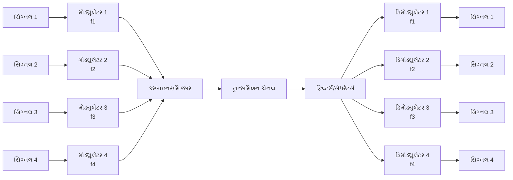

**FDM લક્ષણોનું કોષ્ટક:**

| લક્ષણ | વર્ણન |
|-------|-------|
| **સિદ્ધાંત** | બહુવિધ સિગ્નલ અલગ-અલગ ફ્રીક્વન્સી બેન્ડનો ઉપયોગ કરીને એક ચેનલ શેર કરે છે |
| **ગાર્ડ બેન્ડ** | ઇન્ટરફેરન્સને રોકવા માટે ચેનલો વચ્ચે વપરાય ન હોય તેવા ફ્રીક્વન્સી બેન્ડ |
| **ચેનલ બેન્ડવિડ્થ** | દરેક સિગ્નલને ચોક્કસ ફ્રીક્વન્સી રેન્જ ફાળવેલી હોય છે |
| **અમલીકરણ** | સિગ્નલને અલગ-અલગ ફ્રીક્વન્સી બેન્ડમાં શિફ્ટ કરવા માટે મોડ્યુલેટર્સનો ઉપયોગ |
| **ઉપયોગો** | રેડિયો બ્રોડકાસ્ટિંગ, ટેલિવિઝન, કેબલ સિસ્ટમ |

**FDM સ્પેક્ટ્રમ:**

```goat
  Power
    ^
    |    ___      ___      ___      ___
    |   /   \    /   \    /   \    /   \
    |  /     \  /     \  /     \  /     \
    | /       \/       \/       \/       \
    +-----------------------------------------> Frequency
        Ch1      Ch2      Ch3      Ch4
      |<--->|<->|<--->|<->|<--->|<->|<--->|
             GB      GB      GB
```

**મેમરી ટ્રીક:** "FROG" - FRequencies Organized with Gaps

## પ્રશ્ન 5(ક) OR [7 ગુણ]

**ઈન્ટરનેટ ઓફ થિંગ્સ (IoT) ના ખ્યાલ અને મુખ્ય લક્ષણો સમજાવો.**

**જવાબ**:

**ઈન્ટરનેટ ઓફ થિંગ્સ (IoT) ખ્યાલ:**

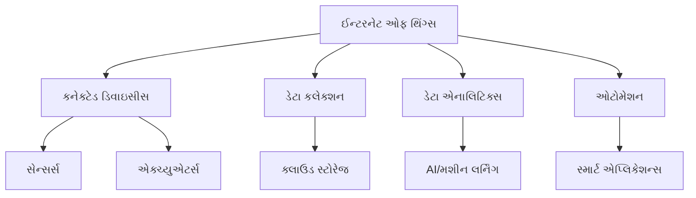

**IoTના મુખ્ય લક્ષણોનું કોષ્ટક:**

| લક્ષણ | વર્ણન |
|-------|-------|
| **કનેક્ટિવિટી** | ડિવાઇસીસ ઇન્ટરનેટ અને એકબીજા સાથે જોડાયેલી |
| **ઇન્ટેલિજન્સ** | સ્માર્ટ પ્રોસેસિંગ, નિર્ણય લેવાની ક્ષમતાઓ |
| **સેન્સિંગ** | સેન્સર્સ દ્વારા પર્યાવરણમાંથી ડેટા એકત્રિત કરવો |
| **એક્સપ્રેસિંગ** | એક્ચ્યુએટર્સ દ્વારા કાર્યવાહી કરવી |
| **એનર્જી એફિશિયન્સી** | બેટરી-સંચાલિત ડિવાઇસીસ માટે ઓછી પાવર વપરાશ |
| **સિક્યોરિટી** | અનધિકૃત એક્સેસ અને હુમલાઓથી સુરક્ષા |
| **સ્કેલેબિલિટી** | નેટવર્કમાં વધુ ડિવાઇસીસ ઉમેરવાની ક્ષમતા |

**IoT આર્કિટેક્ચર લેયર્સ:**

```goat
               +------------------+
               |    Application   |
               +------------------+
               |  Data Analytics  |
               +------------------+
               |  Data Processing |
               +------------------+
               |  Data Transport  |
               +------------------+
               |    Perception    |
               +------------------+
```

**IoT એપ્લિકેશન્સ:**

- સ્માર્ટ હોમ અને બિલ્ડિંગ
- હેલ્થકેર મોનિટરિંગ
- ઇન્ડસ્ટ્રિયલ ઓટોમેશન
- સ્માર્ટ સિટીઝ
- એગ્રીકલ્ચર મોનિટરિંગ
- સપ્લાય ચેઇન મેનેજમેન્ટ

**મેમરી ટ્રીક:** "CASED" - Connected, Automated, Sensing, Expressing, Data-driven
