## Question 1(a) [3 marks]

**Define signal and give its classification.**

**Answer**:
A signal is a physical quantity that varies with time, space, or any other independent variable and contains information.

**Classification of Signals:**

| Classification Criteria | Types of Signals |
|------------------------|------------------|
| **Time Domain** | Continuous-time signals, Discrete-time signals |
| **Amplitude** | Analog signals, Digital signals |
| **Nature** | Deterministic signals, Random signals |
| **Symmetry** | Even signals, Odd signals |
| **Energy/Power** | Energy signals, Power signals |

**Mnemonic:** "CADEN" (Continuous/Discrete, Analog/Digital, Deterministic/Random, Even/Odd, Energy/Power)

## Question 1(b) [4 marks]

**Explain continuous and discrete time signals.**

**Answer**:

| Continuous-time Signals | Discrete-time Signals |
|-------------------------|------------------------|
| Defined for all values of time | Defined only at specific time instants |
| Represented as x(t) | Represented as x[n] or x(nT) |
| Example: Analog signals like sinusoidal wave | Example: Digital signals like sampled speech |
| Continuous curve on graph | Series of points on graph |
| Processing requires analog circuits | Processing can be done with digital processors |

**Diagram:**

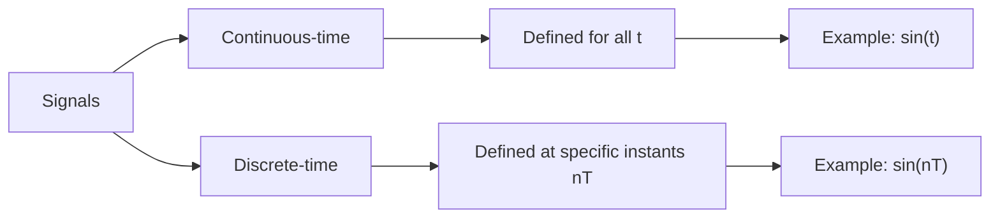

**Mnemonic:** "CAD" - Continuous signals are Analog and Defined for all time; Discrete signals are digital and defined at specific points.

## Question 1(c) [7 marks]

**Explain Unit Impulse and Unit Step function.**

**Answer**:

| Unit Impulse Function (δ(t)) | Unit Step Function (u(t)) |
|------------------------------|---------------------------|
| Infinitely high at t=0, zero elsewhere | Value is 1 for t≥0, 0 for t<0 |
| Area under curve = 1 | Integral gives ramp function |
| Used to represent instantaneous events | Used to represent sudden transitions |
| Mathematical basis for LTI system analysis | Used for system response analysis |
| Laplace transform = 1 | Laplace transform = 1/s |

**Diagram:**

```goat
            |     ^
            |     |
            |     |
Unit        |     |               Unit
Impulse     | δ(t)| Area = 1      Step        u(t)
            |     |               Function    ---------->
            |     |                           |
            +-----+------->                   +------------>
           -1  0  1  t                       -1  0  1  t    
```

**Properties:**

- **Sampling property**: ∫f(t)δ(t-t₀)dt = f(t₀)
- **Unit step is integral of impulse**: u(t) = ∫δ(τ)dτ from -∞ to t
- **Impulse is derivative of unit step**: δ(t) = du(t)/dt

**Mnemonic:** "SHARP-FLAT" - Impulse is Sharp and momentary; Step is Flat and persistent.

## Question 1(c) OR [7 marks]

**Explain block diagram of digital communication system.**

**Answer**:

**Block Diagram of Digital Communication System:**


**Explanation:**

| Block | Function |
|-------|----------|
| **Source** | Generates the message to be transmitted |
| **Source Encoder** | Converts message to digital form, removes redundancy |
| **Channel Encoder** | Adds controlled redundancy for error detection/correction |
| **Digital Modulator** | Maps digital bits to signals suitable for transmission |
| **Channel** | Physical medium through which signal travels |
| **Digital Demodulator** | Recovers digital data from received signal |
| **Channel Decoder** | Detects/corrects errors using added redundancy |
| **Source Decoder** | Reconstructs original message from received bits |
| **Destination** | Receives the transmitted message |

**Mnemonic:** "SECDCSD" - "Seven Engineers Can Design Communication Systems Diligently"

## Question 2(a) [3 marks]

**A signal has a bit rate of 8000 bit/second and a baud rate of 1000 baud. How many data elements are carried by each signal element?**

**Answer**:

Number of data elements (bits) per signal element:
= Bit rate ÷ Baud rate
= 8000 bits/second ÷ 1000 baud
= 8 bits/signal element

**Table:**

| Parameter | Value | Relation |
|-----------|-------|----------|
| Bit rate | 8000 bits/sec | Given |
| Baud rate | 1000 baud | Given |
| Bits/signal | 8 bits | Bit rate ÷ Baud rate |

**Mnemonic:** "Bits Divided By Bauds" (BDBB)

## Question 2(b) [4 marks]

**Explain Energy and power signals.**

**Answer**:

| Energy Signals | Power Signals |
|----------------|---------------|
| Finite total energy | Infinite total energy but finite average power |
| Zero average power | Non-zero average power |
| E = ∫\|x(t)\|²dt (finite) | P = lim(T→∞) 1/2T ∫\|x(t)\|²dt (finite) |
| Examples: Pulse, Decaying exponential | Examples: Sine wave, Square wave |
| Localized in time | Exist for all time |

**Diagram:**

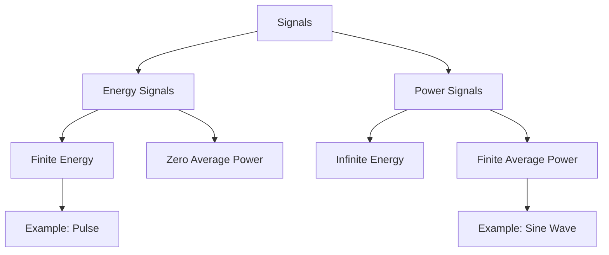

**Mnemonic:** "FEZIL" - Finite Energy is Zero in Long-term; Power signals are Infinite in Length

## Question 2(c) [7 marks]

**Explain the block diagram of FSK modulator and de-modulator with waveform.**

**Answer**:

**FSK Modulator and Demodulator:**

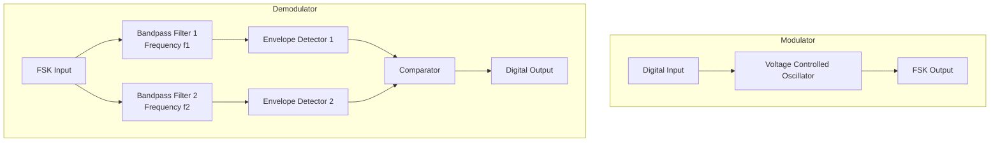

**Waveforms:**

```goat
Digital Input: _____‾‾‾‾‾_____‾‾‾‾‾_____
                 0     1     0     1     0

FSK Output:  /\/\/\MMMMMM/\/\/\MMMMMM/\/\/\
             f1    f2    f1    f2    f1
             
Received at BPF1: /\/\/\_____/\/\/\_____/\/\/\
                   f1          f1          f1
                   
Received at BPF2: _____MMMMMM_____MMMMMM_____
                        f2          f2
                        
Digital Output: _____‾‾‾‾‾_____‾‾‾‾‾_____
                 0     1     0     1     0
```

**Key Principles:**

- **Bit 0**: Transmitted as frequency f₁
- **Bit 1**: Transmitted as frequency f₂
- **Demodulation**: Uses bandpass filters to separate frequencies
- **Detection**: Envelope detectors recover the digital signal

**Mnemonic:** "FIST" - Frequency Is Shifted for Transmission

## Question 2(a) OR [3 marks]

**A signal carries 4 bit/signal elements. If 1000 signal elements sent per second. Find the bit rate.**

**Answer**:

Bit rate = Number of bits per signal element × Signal elements per second
Bit rate = 4 bits/signal element × 1000 signal elements/second
Bit rate = 4000 bits/second

**Table:**

| Parameter | Value | Relation |
|-----------|-------|----------|
| Bits per symbol | 4 | Given |
| Symbol rate | 1000 symbols/sec | Given |
| Bit rate | 4000 bits/sec | Bits/symbol × Symbol rate |

**Mnemonic:** "BBS" - Bit rate equals Bits per symbol times Symbol rate

## Question 2(b) OR [4 marks]

**Explain Even and Odd signals.**

**Answer**:

| Even Signals | Odd Signals |
|--------------|-------------|
| Symmetric around y-axis | Anti-symmetric around y-axis |
| x(-t) = x(t) | x(-t) = -x(t) |
| Example: cos(t) | Example: sin(t) |
| Fourier transform is real | Fourier transform is imaginary |
| Sum of even signals is even | Sum of odd signals is odd |

**Diagram:**

```goat
Even Signal x(t)             Odd Signal x(t)
    |                            |
    |     *     *                |     *
    |   *         *              |   *   \
    | *             *            | *      \
----+---------------+---->   ----+--------+----+---->
    |                            |        /     *
    |                            |      /   *
    |                            |     *
```

**Properties:**

- Any signal can be expressed as sum of even and odd components
- Even component: x₁(t) = [x(t) + x(-t)]/2
- Odd component: x₂(t) = [x(t) - x(-t)]/2

**Mnemonic:** "SAME-FLIP" - Even signals are the SAME when flipped; Odd signals FLIP their sign.

## Question 2(c) OR [7 marks]

**Explain the block diagram of QPSK modulator and de-modulator with constellation diagram.**

**Answer**:

**QPSK Modulator and Demodulator:**

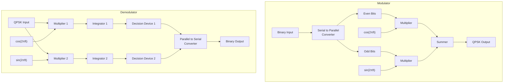

**Constellation Diagram:**

```goat
             Q
             |
      01     |     00
      •      |      •
             |
-------------+-------------
             |
      11     |     10
      •      |      •
             |             I
```

**Key Characteristics:**

- **Input**: 2 bits determine each symbol
- **Phases**: 4 phases (0°, 90°, 180°, 270°)
- **Bits to phases**:
  - 00: 45°
  - 01: 135°
  - 11: 225°
  - 10: 315°
- **Bandwidth efficiency**: 2 bits per symbol

**Mnemonic:** "QUADrature" - 4 phases for 4 possible 2-bit combinations

## Question 3(a) [3 marks]

**Explain the working of ASK modulator with block diagram and output waveforms.**

**Answer**:

**ASK Modulator Block Diagram:**

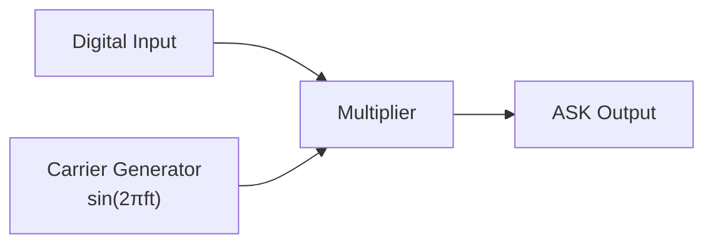

**Waveforms:**

```goat
Digital Input: _____‾‾‾‾‾_____‾‾‾‾‾_____
                 0     1     0     1     0

Carrier:      /\/\/\/\/\/\/\/\/\/\/\/\/\/\

ASK Output:   _____/\/\/\_____/\/\/\_____
                 0     1     0     1     0
```

**Working Principle:**

- Digital 1: Carrier signal is transmitted
- Digital 0: No signal (or low amplitude) is transmitted
- Output amplitude varies with input digital signal

**Mnemonic:** "ASKY" - Amplitude Switches the Carrier? Yes!

## Question 3(b) [4 marks]

**Draw the constellation diagram of 8-PSK and 16-QAM.**

**Answer**:

**8-PSK Constellation Diagram:**

```goat
                  Q
                  |
        011  •    |    • 000
              \   |   /
         110 •  \ | /  • 001
                 \|/
        ---------+--------- I
                /|\
         101 •  / | \  • 010
              /   |   \
        100  •    |    • 011
                  |
```

**16-QAM Constellation Diagram:**

```goat
                Q
        •   •   |   •   •
                |
        •   •   |   •   •
                |
        --------+--------
                |
        •   •   |   •   •
                |
        •   •   |   •   •
                |         I
```

**Key Differences:**

- **8-PSK**: 8 symbols, equal amplitude, phases at 45° intervals
- **16-QAM**: 16 symbols, varying amplitudes and phases

**Mnemonic:** "P-Phase Q-Quantity" - PSK varies Phase only; QAM varies both amplitude (Quantity) and phase

## Question 3(c) [7 marks]

**Draw the ASK and FSK modulation waveform for the sequence of 1100101101.**

**Answer**:

**Modulation Waveforms:**

```goat
Binary Input:  ‾‾‾‾‾‾‾‾‾‾_____‾‾‾‾‾_____‾‾‾‾‾‾‾‾‾‾
               1  1  0  0  1  0  1  1  0  1
               
Carrier:       /\/\/\/\/\/\/\/\/\/\/\/\/\/\/\/\/\/\

ASK Output:    /\/\/\/\/\/\_____/\/\/\_____/\/\/\/\/\
               1  1  0  0  1  0  1  1  0  1
               
FSK Output:    MMMMMMMMMM/\/\/\/MMMMM/\/\/\/MMMMMMMMMM
               1  1  0  0  1  0  1  1  0  1
               f2 f2 f1 f1 f2 f1 f2 f2 f1 f2
```

**Key Characteristics:**

- **ASK**: Carrier present for bit 1, absent for bit 0
- **FSK**: Higher frequency (f₂) for bit 1, lower frequency (f₁) for bit 0

**Table of Modulation Methods:**

| Modulation | Bit 0 | Bit 1 | Parameter Varied |
|------------|-------|-------|------------------|
| ASK | Zero or low amplitude | High amplitude | Amplitude |
| FSK | Frequency f₁ | Frequency f₂ | Frequency |

**Mnemonic:** "AFRO" - Amplitude For 1, Remove for 0 (ASK); Frequency Rises for 1, Off-peak for 0 (FSK)

## Question 3(a) OR [3 marks]

**Explain the working of PSK modulator with block diagram and output waveforms.**

**Answer**:

**PSK Modulator Block Diagram:**

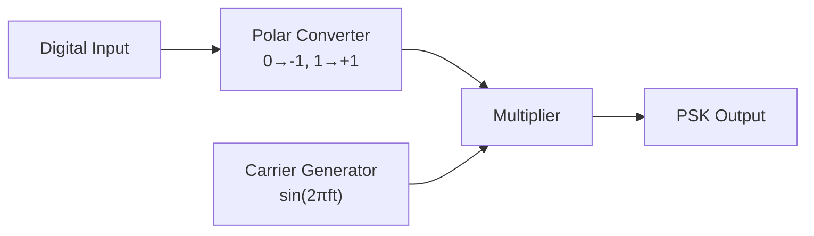

**Waveforms:**

```goat
Digital Input: _____‾‾‾‾‾_____‾‾‾‾‾_____
                 0     1     0     1     0

Carrier:      /\/\/\/\/\/\/\/\/\/\/\/\/\/\

PSK Output:   \/\/\/\/\/\/\/\/\/\/\/\/\/\/
               0     1     0     1     0
               180°  0°   180°  0°   180°
```

**Working Principle:**

- Digital 1: Carrier signal with 0° phase
- Digital 0: Carrier signal with 180° phase (inverted)
- Amplitude remains constant, only phase changes

**Mnemonic:** "PSKIT" - Phase Shift Keeps Information True

## Question 3(b) OR [4 marks]

**Draw the MSK modulation waveform for the sequence of 1101001101.**

**Answer**:

**MSK Modulation Waveform:**

```goat
Binary Input:  ‾‾‾‾‾_____‾‾‾‾‾_____‾‾‾‾‾‾‾‾‾‾
               1  1  0  1  0  0  1  1  0  1
               
MSK Output:    \/\/MMMMM\/\/MMMMM\/\/\/\/MMMMM
               1  1  0  1  0  0  1  1  0  1
```

**Characteristics of MSK:**

- Continuous phase transitions (no phase jumps)
- Frequency shifts between f₁ and f₂
- Minimum frequency separation: Δf = 1/(2T)
- Smoother transitions than FSK

**Table:**

| Feature | MSK Characteristic |
|---------|-------------------|
| Phase continuity | Continuous, no abrupt changes |
| Frequency deviation | Minimum possible (1/2T) |
| Spectral efficiency | Better than conventional FSK |
| Bandwidth | 1.5 times bit rate |

**Mnemonic:** "MINIMUM SMOOTH" - MSK uses Minimum frequency separation with Smooth transitions

## Question 3(c) OR [7 marks]

**Draw BPSK and QPSK modulation waveform for 1100101011.**

**Answer**:

**BPSK and QPSK Modulation Waveforms:**

```goat
Binary Input:     ‾‾‾‾‾‾‾‾‾‾_____‾‾‾‾‾_____‾‾‾‾‾‾‾‾‾‾
                  1  1  0  0  1  0  1  0  1  1
                  
BPSK Output:      /\/\/\/\/\/\/\/\/\/\/\/\/\/\/\/\/\/\
                  0°  0° 180°180° 0° 180° 0° 180° 0°  0°
                  
QPSK (I channel): /\/\/\_____/\/\/\_____/\/\/\
                  11   00    10    01    11
                  
QPSK (Q channel): /\/\/\/\/\/\_____/\/\/\_____
                  11   00    10    01    11
                  
QPSK (combined):  \/\/\/MMMMM\/\/\/MMMMM\/\/\/
                  11   00    10    01    11
```

**Key Differences:**

- **BPSK**: 1 bit per symbol, 2 phases (0° and 180°)
- **QPSK**: 2 bits per symbol, 4 phases (45°, 135°, 225°, 315°)
- **QPSK Pairs**: 00, 01, 10, 11 map to different phases

**Table:**

| Modulation | Bits/Symbol | Number of Phases | Bandwidth Efficiency |
|------------|-------------|------------------|---------------------|
| BPSK | 1 | 2 | 1 bit/Hz |
| QPSK | 2 | 4 | 2 bits/Hz |

**Mnemonic:** "ONE-TWO" - ONE bit for BPSK, TWO bits for QPSK

## Question 4(a) [3 marks]

**Encode the data using Huffman code for below probability sequence. P = { 0.4, 0.2, 0.2, 0.1, 0.1}**

**Answer**:

**Huffman Coding Process:**

| Symbol | Probability | Huffman Code |
|--------|------------|--------------|
| A | 0.4 | 0 |
| B | 0.2 | 10 |
| C | 0.2 | 11 |
| D | 0.1 | 110 |
| E | 0.1 | 111 |

**Huffman Tree:**

```goat
                [1.0]
               /     \
              /       \
           [0.6]      [0.4] A:0
          /     \
         /       \
      [0.4]     [0.2] B:10
     /     \
    /       \
 [0.2] C:11 [0.2]
           /     \
          /       \
     [0.1] D:110 [0.1] E:111
```

**Mnemonic:** "Higher Probability Means Shorter Code"

## Question 4(b) [4 marks]

**Define Probability and Entropy.**

**Answer**:

| Concept | Definition | Formula | Significance |
|---------|------------|---------|-------------|
| **Probability** | Measure of likelihood of an event occurring | P(A) = Number of favorable outcomes / Total number of possible outcomes | Used to model uncertainty in communication |
| **Entropy** | Measure of uncertainty or randomness in a system | H(X) = -∑ P(xi) log₂ P(xi) | Indicates average information content |

**Key Characteristics:**

- **Probability Range**: 0 ≤ P(A) ≤ 1
- **Entropy Units**: Bits (using log₂)
- **Maximum Entropy**: When all events are equally likely
- **Minimum Entropy**: When outcome is certain (probability = 1)

**Mnemonic:** "PURE" - Probability Underpins Randomness Estimation

## Question 4(c) [7 marks]

**Explain CDMA technique in detail.**

**Answer**:

**CDMA (Code Division Multiple Access):**


**Table of CDMA Characteristics:**

| Feature | Description |
|---------|-------------|
| **Access Method** | Multiple users share same frequency and time |
| **Separation** | Users distinguished by unique spreading codes |
| **Spreading Codes** | Orthogonal or pseudo-orthogonal sequences |
| **Processing Gain** | Ratio of spread bandwidth to original bandwidth |
| **Multiple Access** | Uses code space rather than frequency or time division |
| **Interference Rejection** | Inherent ability to reject narrowband interference |

**Key Advantages:**

- **Capacity**: Higher than FDMA/TDMA in many scenarios
- **Security**: Inherent encryption through spreading codes
- **Multipath Rejection**: Rake receivers can combine multipath components
- **Soft Handoff**: Mobile can communicate with multiple base stations

**Mnemonic:** "CODES" - Capacity Optimized with Direct-sequence Encoding Schemes

## Question 4(a) OR [3 marks]

**Encode the data using Shanon Fano code for below probability sequence. P = { 0.5, 0.25, 0.125, 0.125}**

**Answer**:

**Shannon-Fano Coding Process:**

| Symbol | Probability | Shannon-Fano Code |
|--------|------------|-------------------|
| A | 0.5 | 0 |
| B | 0.25 | 10 |
| C | 0.125 | 110 |
| D | 0.125 | 111 |

**Shannon-Fano Tree:**

```goat
               [1.0]
              /     \
             /       \
        [0.5] A      [0.5]
                    /     \
                   /       \
              [0.25] B     [0.25]
                          /     \
                         /       \
                  [0.125] C     [0.125] D
                   Code:110     Code:111
```

**Mnemonic:** "Split For Optimum" - Shannon-Fano splits groups for optimum coding

## Question 4(b) OR [4 marks]

**Define Information and Channel Capacity.**

**Answer**:

| Concept | Definition | Formula | Significance |
|---------|------------|---------|-------------|
| **Information** | Measure of reduction in uncertainty | I(x) = -log₂ P(x) | Less probable events carry more information |
| **Channel Capacity** | Maximum rate at which information can be transmitted with arbitrarily small error | C = B log₂(1 + S/N) | Fundamental limit of reliable communication |

**Key Points:**

- **Information Units**: Bits (using log₂)
- **Channel Capacity Units**: Bits per second
- **Factors Affecting Capacity**:
  - Bandwidth (B)
  - Signal-to-Noise Ratio (S/N)

**Mnemonic:** "INCHES" - Information Numerically Calculated, Hopping through Efficient Shannon limit

## Question 4(c) OR [7 marks]

**Explain TDMA technique in detail.**

**Answer**:

**TDMA (Time Division Multiple Access):**

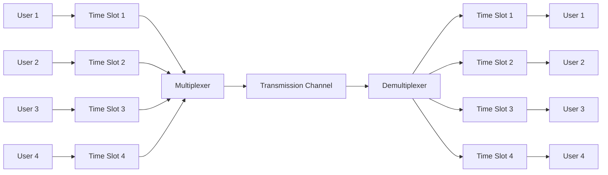

**Table of TDMA Characteristics:**

| Feature | Description |
|---------|-------------|
| **Access Method** | Multiple users share same frequency at different time slots |
| **Frame Structure** | Time divided into frames, frames into slots |
| **Guard Time** | Short periods between slots to prevent overlap |
| **Synchronization** | Precise timing required between transmitter and receiver |
| **Efficiency** | High spectrum utilization |
| **Power Consumption** | Transmitter on only during assigned slots |

**TDMA Frame Structure:**

```goat
|<------------------- TDMA Frame ------------------->|
| TS1 | TS2 | TS3 | TS4 | TS1 | TS2 | TS3 | TS4 | ...
|User1|User2|User3|User4|User1|User2|User3|User4| ...
```

**Mnemonic:** "TIME" - Transmission In Measured Epochs

## Question 5(a) [3 marks]

**Explain T1 carrier system.**

**Answer**:

**T1 Carrier System:**

| Characteristic | Specification |
|----------------|---------------|
| **Data Rate** | 1.544 Mbps |
| **Channels** | 24 voice channels |
| **Voice Sampling** | 8000 samples/second |
| **Sample Size** | 8 bits per sample |
| **Frame Size** | 193 bits (24×8 + 1) |
| **Frame Rate** | 8000 frames/second |

**T1 Frame Structure:**

```goat
|<--------------- T1 Frame (193 bits) ------------------>|
| F | Ch1 | Ch2 | Ch3 | ... | Ch24 | F | Ch1 | Ch2 | ... |
| 1 |  8  |  8  |  8  | ... |  8   | 1 |  8  |  8  | ... |
```

**Mnemonic:** "T1-24-8-8" - T1 has 24 channels, 8 bits, 8kHz

## Question 5(b) [4 marks]

**Explain Time Division Multiplexing technique (TDM) in detail.**

**Answer**:

**Time Division Multiplexing (TDM):**

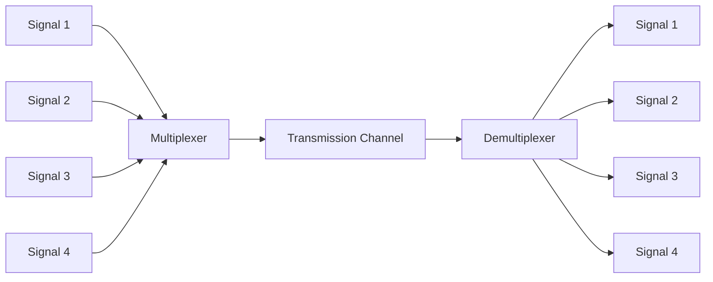

**Table of TDM Characteristics:**

| Feature | Description |
|---------|-------------|
| **Principle** | Multiple signals share a single channel by taking turns |
| **Time Allocation** | Each signal assigned a fixed time slot |
| **Synchronization** | Precise timing required between multiplexer and demultiplexer |
| **Interleaving** | Samples from different sources interleaved in time |
| **Types** | Synchronous TDM and Asynchronous (Statistical) TDM |

**TDM Frame Structure:**

```goat
|<---------------- TDM Frame ---------------->|
| S1 | S2 | S3 | S4 | S1 | S2 | S3 | S4 | ... |
```

**Mnemonic:** "TWIST" - Time Windows Interleaving Signals Together

## Question 5(c) [7 marks]

**Explain security components of information security in detail.**

**Answer**:

**Information Security Components:**

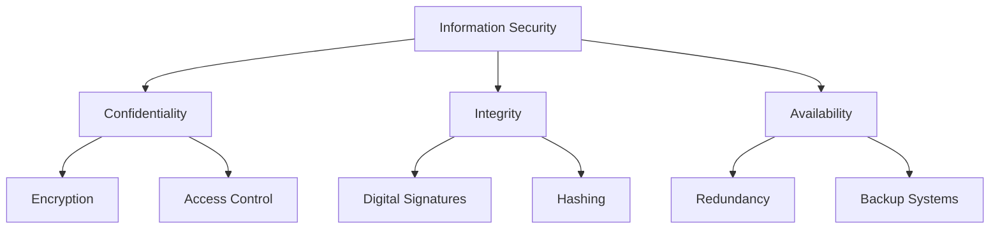

**Table of Security Components:**

| Component | Description | Implementation Methods |
|-----------|-------------|------------------------|
| **Confidentiality** | Ensuring information is accessible only to authorized users | Encryption, Access control, Authentication |
| **Integrity** | Maintaining accuracy and consistency of data | Digital signatures, Hashing, Checksums |
| **Availability** | Ensuring information is accessible when needed | Redundancy, Backup systems, Disaster recovery |
| **Authentication** | Verifying identity of users | Passwords, Biometrics, Digital certificates |
| **Non-repudiation** | Preventing denial of sending/receiving information | Digital signatures, Audit trails |

**Common Security Threats:**

- **Malware**: Viruses, worms, trojans, ransomware
- **Social Engineering**: Phishing, pretexting
- **Man-in-the-Middle Attacks**: Intercepting communications
- **Denial-of-Service**: Preventing legitimate access

**Mnemonic:** "CIA" - Confidentiality, Integrity, Availability

## Question 5(a) OR [3 marks]

**Explain E1 carrier system.**

**Answer**:

**E1 Carrier System:**

| Characteristic | Specification |
|----------------|---------------|
| **Data Rate** | 2.048 Mbps |
| **Channels** | 32 time slots (30 voice + 2 signaling) |
| **Voice Sampling** | 8000 samples/second |
| **Sample Size** | 8 bits per sample |
| **Frame Size** | 256 bits (32×8) |
| **Frame Rate** | 8000 frames/second |

**E1 Frame Structure:**

```goat
|<----------------- E1 Frame (256 bits) ----------------->|
| TS0 | TS1 | TS2 | ... | TS15 | TS16 | TS17 | ... | TS31 |
|  8  |  8  |  8  | ... |  8   |  8   |  8   | ... |  8   |
```

**Special Time Slots:**

- **TS0**: Frame alignment signal
- **TS16**: Signaling channel

**Mnemonic:** "E1-32-8-8" - E1 has 32 channels, 8 bits, 8kHz

## Question 5(b) OR [4 marks]

**Explain Frequency Division Multiplexing technique (FDM) in detail.**

**Answer**:

**Frequency Division Multiplexing (FDM):**

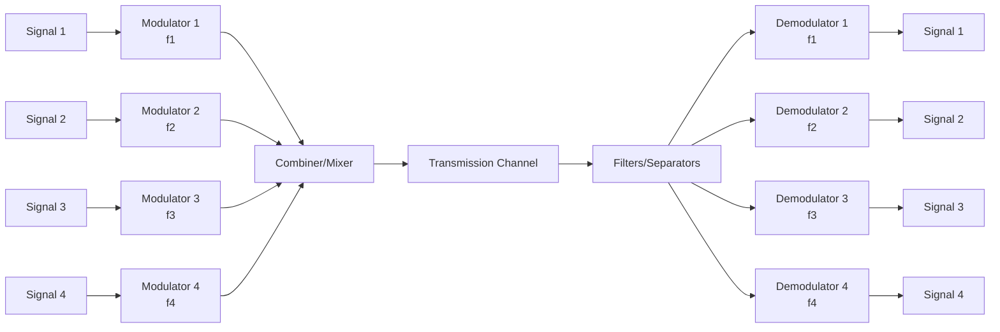

**Table of FDM Characteristics:**

| Feature | Description |
|---------|-------------|
| **Principle** | Multiple signals share a single channel by using different frequency bands |
| **Guard Bands** | Unused frequency bands between channels to prevent interference |
| **Channel Bandwidth** | Each signal allocated a specific frequency range |
| **Implementation** | Uses modulators to shift signals to different frequency bands |
| **Applications** | Radio broadcasting, television, cable systems |

**FDM Spectrum:**

```goat
  Power
    ^
    |    ___      ___      ___      ___
    |   /   \    /   \    /   \    /   \
    |  /     \  /     \  /     \  /     \
    | /       \/       \/       \/       \
    +-----------------------------------------> Frequency
        Ch1      Ch2      Ch3      Ch4
      |<--->|<->|<--->|<->|<--->|<->|<--->|
             GB      GB      GB
```

**Mnemonic:** "FROG" - FRequencies Organized with Gaps

## Question 5(c) OR [7 marks]

**Explain concept and key features of Internet of Things (IoT).**

**Answer**:

**Internet of Things (IoT) Concept:**

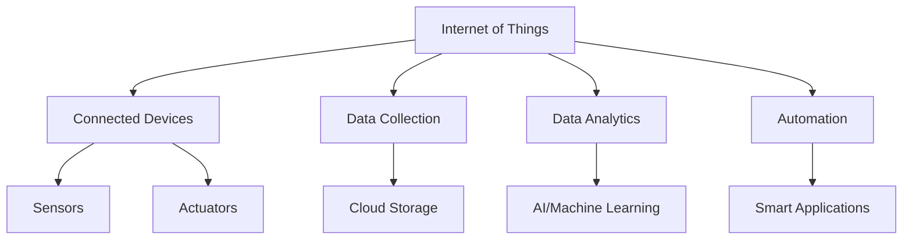

**Table of IoT Key Features:**

| Feature | Description |
|---------|-------------|
| **Connectivity** | Devices connected to internet and each other |
| **Intelligence** | Smart processing, decision-making capabilities |
| **Sensing** | Gathering data from environment through sensors |
| **Expressing** | Taking actions through actuators |
| **Energy Efficiency** | Low power consumption for battery-operated devices |
| **Security** | Protection against unauthorized access and attacks |
| **Scalability** | Ability to add more devices to the network |

**IoT Architecture Layers:**

```goat
               +------------------+
               |    Application   |
               +------------------+
               |  Data Analytics  |
               +------------------+
               |  Data Processing |
               +------------------+
               |  Data Transport  |
               +------------------+
               |    Perception    |
               +------------------+
```

**IoT Applications:**

- Smart homes and buildings
- Healthcare monitoring
- Industrial automation
- Smart cities
- Agriculture monitoring
- Supply chain management

s**Mnemonic:** "CASED" - Connected, Automated, Sensing, Expressing, Data-driven
