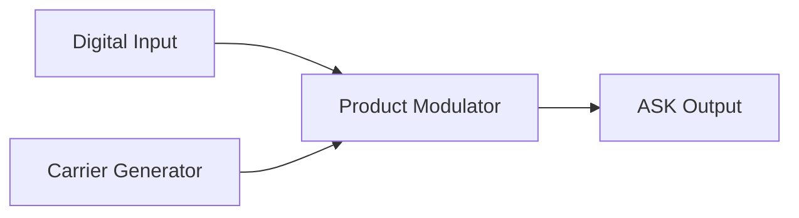
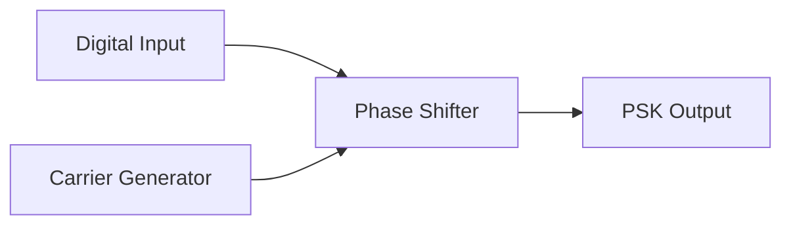
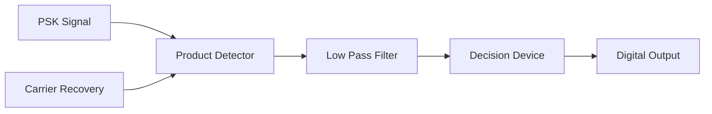
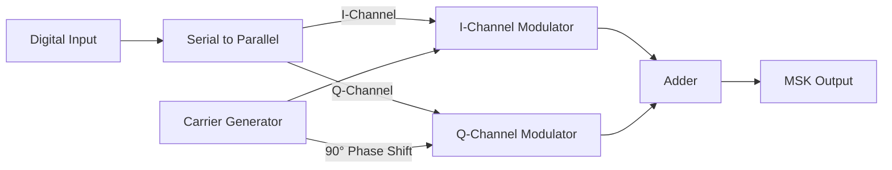
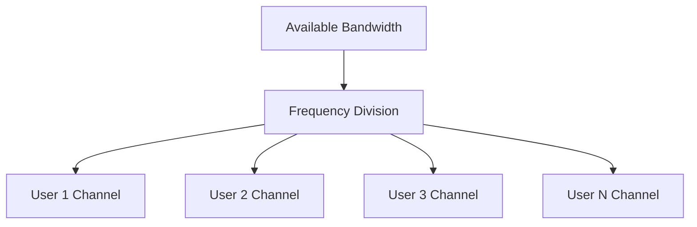
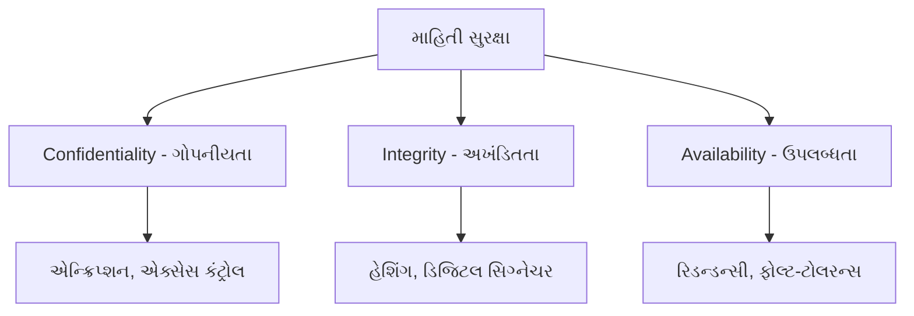

## પ્રશ્ન 1(અ) [3 ગુણ]

**વેવ ફોર્મ સાથે કંટીન્યુઅસ ટાઇમ સિગ્નલ અને ડિસ્ક્રીટ ટાઇમ સિગ્નલ વ્યાખ્યાયિત કરો.**

**જવાબ**:

| સિગ્નલ પ્રકાર | વ્યાખ્યા | વેવફોર્મ |
|-------------|---------|---------|
| **કંટીન્યુઅસ ટાઇમ સિગ્નલ** | સમયની તમામ કિંમતો માટે વ્યાખ્યાયિત સિગ્નલ જેમાં કોઈ વિરામ નથી | ```mermaid graph LR; A[t] --> B[x(t)]; style B fill:#fff,stroke:#333,stroke-width:2px``` |
| **ડિસ્ક્રીટ ટાઇમ સિગ્નલ** | માત્ર અલગ-અલગ સમય અંતરાલો પર વ્યાખ્યાયિત સિગ્નલ | ```mermaid graph LR; A[n] --> B[x[n]]; style B fill:#fff,stroke:#333,stroke-width:2px``` |

**આકૃતિ**:

```goat
                      Continuous                          Discrete
 Signal                                                       o
 Amplitude    /\      /\                                      |
             /  \    /  \                                     o     o
            /    \  /    \                                    |     |
           /      \/      \                            o      |     |      o
          /                \                           |      o     |      |
 --------/------------------\--------- time   -----o---|------|-----|------o----- time
                                                   |   |      |     o      |
                                                   o   o      |            |
                                                                           o
```

**મેમરી ટ્રીક:** "કંટીન્યુઅસમાં કર્વ, ડિસ્ક્રીટમાં ડોટ્સ"

## પ્રશ્ન 1(બ) [4 ગુણ]

**એનર્જી અને પાવર સિગ્નલ સમજાવો.**

**જવાબ**:

| પેરામીટર | એનર્જી સિગ્નલ | પાવર સિગ્નલ |
|-----------|---------------|-------------|
| **વ્યાખ્યા** | મર્યાદિત એનર્જી પરંતુ શૂન્ય સરેરાશ પાવર ધરાવે છે | મર્યાદિત સરેરાશ પાવર પરંતુ અનંત એનર્જી ધરાવે છે |
| **ગાણિતિક સૂત્ર** | ∫\|x(t)\|²dt < ∞ | lim(T→∞) (1/2T)∫\|x(t)\|²dt < ∞ |
| **ઉદાહરણો** | પલ્સ, ડિકેઇંગ એક્સપોનેન્શિયલ | સાઇન વેવ, સ્ક્વેર વેવ |
| **પ્રકૃતિ** | મર્યાદિત સમયગાળો અથવા ઘટતી એમ્પ્લિટ્યૂડ | પિરિયોડિક અથવા અનંત સમયગાળો |

**આકૃતિ**:

```goat
     Energy Signal                      Power Signal
        /\                              /\    /\    /\
       /  \                            /  \  /  \  /  \
      /    \                          /    \/    \/    \
 ----/------\------- time   ---------/-------------------- time
    /        \                      /
   /          \                    /
                                 Never ends...
```

**મેમરી ટ્રીક:** "એનર્જી ખતમ થાય, પાવર કાયમ રહે"

## પ્રશ્ન 1(ક) [7 ગુણ]

**ડિજિટલ કોમ્યુનિકેશન સિસ્ટમનો બ્લોક ડાયાગ્રામ સમજાવો.**

**જવાબ**:


| બ્લોક | કાર્ય |
|-------|------|
| **Source** | પ્રસારિત કરવા માટે સંદેશ ઉત્પન્ન કરે છે |
| **Source Encoder** | સંદેશને ડિજિટલ ક્રમમાં રૂપાંતરિત કરે છે, વધારાનું રિડન્ડન્સી દૂર કરે છે |
| **Channel Encoder** | ભૂલ શોધવા/સુધારવા માટે નિયંત્રિત રિડન્ડન્સી ઉમેરે છે |
| **Digital Modulator** | ડિજિટલ સિમ્બોલ્સને ચેનલ માટે યોગ્ય વેવફોર્મમાં રૂપાંતરિત કરે છે |
| **Channel** | પ્રસારણ માધ્યમ, નોઈઝ અને ડિસ્ટોર્શન ઉમેરે છે |
| **Digital Demodulator** | પ્રાપ્ત વેવફોર્મને પાછા ડિજિટલ સિમ્બોલ્સમાં રૂપાંતરિત કરે છે |
| **Channel Decoder** | ઉમેરેલા રિડન્ડન્સીનો ઉપયોગ કરીને ભૂલોને શોધે/સુધારે છે |
| **Source Decoder** | ડિજિટલ ક્રમમાંથી મૂળ સંદેશ પુનઃનિર્માણ કરે છે |

**મેમરી ટ્રીક:** "સંદેશને સૂચના સંરક્ષિત, ડિજિટલ માધ્યમથી ચોક્કસ ડેટા સંચારિત"

## પ્રશ્ન 1(ક) અથવા [7 ગુણ]

**યુનિટ સ્ટેપ ફંક્શન અને યુનિટ ઈમ્પલ્સ ફંક્શન સમજાવો.**

**જવાબ**:

| ફંક્શન | ગાણિતિક વ્યાખ્યા | ગુણધર્મો | ઉપયોગો |
|--------|-----------------|---------|--------|
| **યુનિટ સ્ટેપ ફંક્શન (u(t))** | u(t) = 0 જ્યારે t < 0<br>u(t) = 1 જ્યારે t ≥ 0 | - અચાનક પરિવર્તન દર્શાવે છે<br>- ઈમ્પલ્સ ફંક્શનનું ઈન્ટિગ્રલ | સિસ્ટમ રિસ્પોન્સ એનાલિસિસ |
| **યુનિટ ઈમ્પલ્સ ફંક્શન (δ(t))** | δ(t) = 0 જ્યારે t ≠ 0<br>∫δ(t)dt = 1 | - અત્યંત સાંકડો પલ્સ<br>- સેમ્પલિંગ પ્રોપર્ટી<br>- સ્ટેપ ફંક્શનનું ડેરિવેટિવ | સેમ્પલિંગ, સિસ્ટમ એનાલિસિસ |

**આકૃતિઓ**:

```goat
          Unit Step Function                 Unit Impulse Function
                    ______                            ^
                   |                                  |
                   |                                  |
                   |                               (infinite)
        ___________|                                  |
                                                      |
        ----------0----------- t       ------0------------------  t
```

**મેમરી ટ્રીક:** "સ્ટેપ શૂન્ય પછી સ્થિર રહે, ઈમ્પલ્સ ક્ષણિક ઉદ્ભવે અને અદૃશ્ય થાય"

## પ્રશ્ન 2(અ) [3 ગુણ]

**સિગ્નલ 8 બીટ/સિગ્નલ એલીમેન્ટ ધરાવે છે. જો સેકન્ડ દીઠ 1000 સિગ્નલ એલીમેન્ટ મોકલવામાં આવે છે. બીટ રેટ શોધો.**

**જવાબ**:

| પેરામીટર | કિંમત |
|-----------|-------|
| સિગ્નલ એલીમેન્ટ દીઠ બિટ્સ | 8 બિટ્સ |
| સેકન્ડ દીઠ સિગ્નલ એલીમેન્ટ્સ | 1000 |
| **ગણતરી** | બિટ રેટ = (સિગ્નલ એલીમેન્ટ દીઠ બિટ્સ) × (સેકન્ડ દીઠ સિગ્નલ એલીમેન્ટ્સ) |
| **બિટ રેટ** | = 8 × 1000 = 8000 બિટ્સ/સેકન્ડ અથવા 8 kbps |

**મેમરી ટ્રીક:** "સિગ્નલ દીઠ બિટ્સ × સેકન્ડ દીઠ સિગ્નલ = સેકન્ડ દીઠ બિટ્સ"

## પ્રશ્ન 2(બ) [4 ગુણ]

**ઈવન અને ઓડ સિગ્નલ સમજાવો.**

**જવાબ**:

| સિગ્નલ પ્રકાર | ગાણિતિક વ્યાખ્યા | ગુણધર્મો | ઉદાહરણો |
|--------------|-----------------|---------|---------|
| **ઈવન સિગ્નલ** | x(-t) = x(t) | - y-અક્ષ પર સમમિત<br>- કોસાઇન એક ઈવન ફંક્શન છે | કોસાઇન ફંક્શન, \|t\| |
| **ઓડ સિગ્નલ** | x(-t) = -x(t) | - y-અક્ષ પર એન્ટી-સમમિત<br>- સાઇન એક ઓડ ફંક્શન છે | સાઇન ફંક્શન, t |

**આકૃતિ**:

```goat
        Even Signal                        Odd Signal
            /\                                 /
           /  \                               /
          /    \                             /
         /      \                           /
 -------0---------                  -------0-------
         \      /                         /
          \    /                         /
           \  /                         /
            \/                         v
```

**મેમરી ટ્રીક:** "ઈવન એકસરખું પ્રતિબિંબિત થાય, ઓડ વિપરીત પ્રતિબિંબિત થાય"

## પ્રશ્ન 2(ક) [7 ગુણ]

**ASK મોડ્યુલેટર અને ડી-મોડ્યુલેટરના બ્લોક ડાયાગ્રામને વેવફોર્મ સાથે સમજાવો.**

**જવાબ**:

**ASK મોડ્યુલેટર:**



**ASK ડિમોડ્યુલેટર:**


**વેવફોર્મ્સ:**

```goat
Digital Input:   _____       _____
                |     |     |     |
         _______|     |_____|     |_____

Carrier:  /\/\/\/\/\/\/\/\/\/\/\/\/\/\/\

ASK Output:      /\/\/\       /\/\/\
                |      |     |      |
         _______|      |_____|      |_____
```

| વિષય | વર્ણન |
|------|-------|
| **ASK મોડ્યુલેશન** | ડિજિટલ ડેટા (0 અથવા 1) અનુસાર એમ્પ્લિટ્યૂડ બદલાય છે |
| **મોડ્યુલેટર ઘટકો** | પ્રોડક્ટ મોડ્યુલેટર કેરિયરને ડિજિટલ સિગ્નલ સાથે ગુણાકાર કરે છે |
| **ડિમોડ્યુલેટર ઘટકો** | એન્વેલોપ ડિટેક્ટર એમ્પ્લિટ્યૂડ શોધે છે, કમ્પેરેટર ડિજિટલ સિગ્નલ પુનઃનિર્માણ કરે છે |

**મેમરી ટ્રીક:** "ASK એમ્પ્લિટ્યૂડ સિગ્નલ કાંટાકૂટ"

## પ્રશ્ન 2(અ) અથવા [3 ગુણ]

**સિગ્નલમાં 4000 બીટ/સેકન્ડનો બીટ રેટ અને 1000 બોદનો બોદ દર હોય છે. દરેક સિગ્નલ એલીમેન્ટ દ્વારા કેટલા ડેટા એલીમેન્ટ વહન કરવામાં આવે છે?**

**જવાબ**:

| પેરામીટર | કિંમત |
|-----------|-------|
| બિટ રેટ | 4000 બિટ્સ/સેકન્ડ |
| બોદ રેટ | 1000 બોદ (સિગ્નલ એલીમેન્ટ્સ/સેકન્ડ) |
| **સૂત્ર** | ડેટા એલીમેન્ટ્સની સંખ્યા = બિટ રેટ ÷ બોદ રેટ |
| **સિગ્નલ દીઠ ડેટા એલીમેન્ટ્સ** | = 4000 ÷ 1000 = 4 બિટ્સ/સિગ્નલ એલીમેન્ટ |

**મેમરી ટ્રીક:** "બિટ્સને બોદથી ભાગતા સિગ્નલ દીઠ બિટ્સ મળે"

## પ્રશ્ન 2(બ) અથવા [4 ગુણ]

**પિરિઓડિક અને એપિરિઓડિક સિગ્નલ સમજાવો.**

**જવાબ**:

| સિગ્નલ પ્રકાર | વ્યાખ્યા | ગાણિતિક શરત | ઉદાહરણો |
|--------------|---------|---------------|---------|
| **પિરિઓડિક સિગ્નલ** | ચોક્કસ સમય પછી પુનરાવર્તન થાય છે | x(t) = x(t+T) દરેક t માટે | સાઇન વેવ, સ્ક્વેર વેવ |
| **એપિરિઓડિક સિગ્નલ** | કોઈપણ સમય પછી પુનરાવર્તન થતું નથી | x(t) ≠ x(t+T) કોઈપણ T માટે | પલ્સ, નોઈઝ |

**આકૃતિ**:

```goat
    Periodic Signal                Aperiodic Signal
    /\    /\    /\                       /\
   /  \  /  \  /  \                     /  \
  /    \/    \/    \                   /    \___________
                                      /
 One period (T) -->|                 /
```

**મેમરી ટ્રીક:** "પિરિઓડિક પરફેક્ટ રીતે પુનરાવર્તિત થાય, એપિરિઓડિક હંમેશા બદલાતું રહે"

## પ્રશ્ન 2(ક) અથવા [7 ગુણ]

**PSK મોડ્યુલેટર અને ડી-મોડ્યુલેટરના બ્લોક ડાયાગ્રામને વેવફોર્મ સાથે સમજાવો.**

**જવાબ**:

**PSK મોડ્યુલેટર:**



**PSK ડિમોડ્યુલેટર:**



**વેવફોર્મ્સ:**

```goat
Digital Input:   _____       _____
                |     |     |     |
         _______|     |_____|     |_____

Carrier:  /\/\/\/\/\/\/\/\/\/\/\/\/\/\/\

PSK Output: /\/\/\\/\/\/\/\/\\\/\/\/\/\/\
           (0°)   (180°) (0°)  (180°)
           Phase shifts at bit transitions
```

| પેરામીટર | વર્ણન |
|----------|-------|
| **PSK મોડ્યુલેશન** | ડિજિટલ ડેટા (0 અથવા 1) અનુસાર ફેઝ બદલાય છે |
| **ફેઝ સ્ટેટ્સ** | બિટ '1' માટે 0°, બિટ '0' માટે 180° |
| **ફાયદા** | ASK કરતાં નોઈઝ સામે વધુ પ્રતિરક્ષા |

**મેમરી ટ્રીક:** "PSK ફેઝ શિફ્ટ કરે જાણકારીથી"

## પ્રશ્ન 3(અ) [3 ગુણ]

**બ્લોક ડાયાગ્રામ અને આઉટપુટ વેવફોર્મ સાથે FSK મોડ્યુલેટરનું કાર્ય સમજાવો.**

**જવાબ**:

**FSK મોડ્યુલેટર બ્લોક ડાયાગ્રામ:**


**FSK વેવફોર્મ્સ:**

```goat
Digital Input:   _____       _____
                |     |     |     |
         _______|     |_____|     |_____

FSK Output: /\/\/\  /\/\/\/\/\  /\/\/\
           (f1)    (f2)       (f1)
```

- **સિદ્ધાંત**: ડિજિટલ બિટ '1' ફ્રિક્વન્સી f1 સાથે કેરિયર મોકલે છે, બિટ '0' ફ્રિક્વન્સી f2 સાથે કેરિયર મોકલે છે
- **કાર્યપ્રણાલી**: વોલ્ટેજ કંટ્રોલ્ડ ઓસિલેટર ઇનપુટ બિટ મૂલ્ય આધારે ફ્રિક્વન્સી બદલે છે

**મેમરી ટ્રીક:** "ફ્રિક્વન્સી શિફ્ટ કરે જાણકારી સંચાર"

## પ્રશ્ન 3(બ) [4 ગુણ]

**1010110110 ના ક્રમ માટે PSK મોડ્યુલેશન વેવફોર્મ દોરો.**

**જવાબ**:

```goat
Digital Input:  ___     ___     _______     _______   
               |   |   |   |   |       |   |       |  
          _____|   |___|   |___|       |___|       |___
          
          1     0     1     0     1     1     0     1     1     0
          
PSK Output:    
          /\/\ /\/\ /\/\ /\/\ /\/\ /\/\ /\/\ /\/\ /\/\ /\/\
          0°   180° 0°   180° 0°   0°   180° 0°   0°   180°
          
Phase:    0°   180° 0°   180° 0°   0°   180° 0°   0°   180°
```

**PSK મોડ્યુલેશન માટે ટેબલ:**

| બિટ | ફેઝ |
|-----|-----|
| 1 | 0° |
| 0 | 180° |

**મેમરી ટ્રીક:** "એક-શૂન્ય, ફેઝ-શિફ્ટ, સિગ્નલ મોડ્યુલેટેડ"

## પ્રશ્ન 3(ક) [7 ગુણ]

**1100110101 ના ક્રમ માટે ASK અને FSK મોડ્યુલેશન વેવફોર્મ દોરો.**

**જવાબ**:

**ડિજિટલ ઇનપુટ સિક્વન્સ: 1100110101**

```goat
Digital Input:  _______         _______     ___     ___
               |       |       |       |   |   |   |   |
          _____|       |_______|       |___|   |___|   |___
          
          1     1     0     0     1     1     0     1     0     1
          
ASK Output:     
          /\/\  /\/\         /\/\  /\/\        /\/\        /\/\
          
          On    On    Off   Off   On    On    Off   On    Off   On
          
FSK Output:     
          /\/\  /\/\  /\/\/ /\/\/ /\/\  /\/\  /\/\/ /\/\  /\/\/ /\/\
          
          f1    f1    f2    f2    f1    f1    f2    f1    f2    f1
```

**તુલના માટે ટેબલ:**

| બિટ | ASK | FSK |
|-----|-----|-----|
| 1 | કેરિયર ON (ઉચ્ચ એમ્પ્લિટ્યૂડ) | ઉચ્ચ ફ્રિક્વન્સી (f1) |
| 0 | કેરિયર OFF (શૂન્ય/નીચી એમ્પ્લિટ્યૂડ) | નીચી ફ્રિક્વન્સી (f2) |

**મેમરી ટ્રીક:** "એમ્પ્લિટ્યૂડ જાણકારી દર્શાવે, ફ્રિક્વન્સી જાણકારી બદલાવે"

## પ્રશ્ન 3(અ) અથવા [3 ગુણ]

**બ્લોક ડાયાગ્રામ અને આઉટપુટ વેવફોર્મ સાથે MSK મોડ્યુલેટરનું કાર્ય સમજાવો.**

**જવાબ**:

**MSK મોડ્યુલેટર બ્લોક ડાયાગ્રામ:**



**MSK વિશેષતાઓ:**

- કન્ટિન્યુઅસ ફેઝ FSK જેમાં ફ્રિક્વન્સી ડેવિએશન એક્ઝેક્ટલી બિટ રેટના અર્ધા જેટલું હોય છે
- ફેઝમાં ફેરફાર સરળતાથી થાય છે (અચાનક ફેઝ પરિવર્તન નથી)
- FSK કરતાં વધુ સારી સ્પેક્ટ્રલ કાર્યક્ષમતા

**મેમરી ટ્રીક:** "મિનિમમ શિફ્ટ સ્પેક્ટ્રમને સાંકડું રાખે"

## પ્રશ્ન 3(બ) અથવા [4 ગુણ]

**8-PSK અને 16-QAM ના નક્ષત્ર રેખાંકિત દોરો.**

**જવાબ**:

**8-PSK નક્ષત્ર રેખાંકિત:**

```goat
           001  *    *  000
               /|\  /|\
                |    |
          010 * |    | * 111
              \ |    | /
               \|    |/
          011  *     *  110
               /|\  /|\
               / \   /\
          100 *   \ /  * 101
```

**16-QAM નક્ષત્ર રેખાંકિત:**

```goat
     *     *     *     *
    0000  0001  0100  0101
     
     *     *     *     *
    0010  0011  0110  0111
    
     *     *     *     *
    1000  1001  1100  1101
     
     *     *     *     *
    1010  1011  1110  1111
```

| મોડ્યુલેશન | વર્ણન |
|------------|-------|
| **8-PSK** | 8 પોઇન્ટ્સ વર્તુળ પર સરખા અંતરે, 3 બિટ્સ પ્રતિ સિમ્બોલ |
| **16-QAM** | 16 પોઇન્ટ્સ ચોરસ ગ્રીડમાં, બદલાતા એમ્પ્લિટ્યૂડ અને ફેઝ, 4 બિટ્સ પ્રતિ સિમ્બોલ |

**મેમરી ટ્રીક:** "PSK પોઇન્ટ્સ એક વર્તુળ પર, QAM ચોરસ એમ્પ્લિટ્યૂડ મેટ્રિક્સ"

## પ્રશ્ન 3(ક) અથવા [7 ગુણ]

**1010101011 માટે BPSK અને QPSK મોડ્યુલેશન વેવફોર્મ દોરો.**

**જવાબ**:

**BPSK મોડ્યુલેશન:**

```goat
Digital Input:  ___     ___     ___     ___       
               |   |   |   |   |   |   |   |    
          _____|   |___|   |___|   |___|   |_____
          
          1     0     1     0     1     0     1     0     1     1
          
BPSK Output:    
          /\/\  /\/\  /\/\  /\/\  /\/\  /\/\  /\/\  /\/\  /\/\  /\/\
          0°    180°  0°    180°  0°    180°  0°    180°  0°    0°
```

**QPSK મોડ્યુલેશન (બિટ્સને જોડીમાં વર્ગીકૃત કરીને):**

```goat
                    10           10           10           11
Input Pairs:    |--------|   |--------|   |--------|   |--------|
                
I-Channel:      ___      ___      ___      ___      ___
               |   |    |   |    |   |    |   |    |   |
          _____|   |____|   |____|   |____|   |____|   |____
                1      0      1      0      1      0      1      1
                
Q-Channel:     ___      ___      ___           ___
              |   |    |   |    |   |         |   |
          ____|   |____|   |____|   |_________|   |____
                0      1      0      1      0      1      1
                
QPSK Phase:     90°     270°    90°     270°    90°     270°    90°     45°
```

| બિટ જોડી | QPSK ફેઝ |
|----------|---------|
| 10 | 90° |
| 00 | 180° |
| 01 | 270° |
| 11 | 0° |

**મેમરી ટ્રીક:** "બાઇનરી ફેઝ શિફ્ટ કી, ક્વોડ્રેચર ફેઝ શિફ્ટ કી"

## પ્રશ્ન 4(અ) [3 ગુણ]

**નીચેના સંભવિત ક્રમ માટે શેનોન ફેનો કોડનો ઉપયોગ કરીને ડેટાને એન્કોડ કરો. P = {0.30, 0.25, 0.20, 0.12, 0.08, 0.05}**

**જવાબ**:

| સિમ્બોલ | સંભાવના | શેનોન-ફેનો કોડ |
|--------|---------|---------------|
| S1 | 0.30 | 00 |
| S2 | 0.25 | 01 |
| S3 | 0.20 | 10 |
| S4 | 0.12 | 110 |
| S5 | 0.08 | 1110 |
| S6 | 0.05 | 1111 |

**પ્રક્રિયા:**

1. સિમ્બોલ્સને ઘટતી સંભાવના અનુસાર ગોઠવો
2. લગભગ સમાન સંભાવના સાથે બે જૂથોમાં વિભાજિત કરો (0.30+0.25=0.55, 0.20+0.12+0.08+0.05=0.45)
3. પ્રથમ જૂથને 0, બીજા જૂથને 1 આપો
4. દરેક પેટા જૂથ માટે આ પ્રક્રિયા પુનરાવર્તિત કરો

**મેમરી ટ્રીક:** "વિભાજન, ફેનો વહેંચે, કોડ કાર્યક્ષમ"

## પ્રશ્ન 4(બ) [4 ગુણ]

**હેમિંગ કોડ સમજાવો.**

**જવાબ**:

| પાસું | વર્ણન |
|------|-------|
| **વ્યાખ્યા** | લિનિયર ઇરર-કરેક્ટિંગ કોડ જે ડબલ ભૂલોને શોધે છે અને સિંગલ ભૂલોને સુધારે છે |
| **પેરિટી બિટ્સ** | m ડેટા બિટ્સ માટે, k પેરિટી બિટ્સ જોઈએ જ્યાં 2^k ≥ m+k+1 |
| **પોઝિશન** | પેરિટી બિટ્સ 1, 2, 4, 8, 16... (2ની પાવર) સ્થાનો પર મુકાય છે |
| **ભૂલ શોધ** | ભૂલની સ્થિતિ શોધવા માટે સિન્ડ્રોમ ગણતરી |

**ઉદાહરણ હેમિંગ(7,4):**

```goat
Positions:  1   2   3   4   5   6   7
            P1  P2  D1  P4  D2  D3  D4
            
Parity check equations:
P1 checks: P1, D1, D2, D4
P2 checks: P2, D1, D3, D4
P4 checks: P4, D2, D3, D4
```

**મેમરી ટ્રીક:** "હેમિંગ હેન્ડલ બિટ ભૂલો"

## પ્રશ્ન 4(ક) [7 ગુણ]

**TDMA અને FDMA ની સરખામણી કરો.**

**જવાબ**:

| પેરામીટર | TDMA (ટાઇમ ડિવિઝન મલ્ટિપલ એક્સેસ) | FDMA (ફ્રિક્વન્સી ડિવિઝન મલ્ટિપલ એક્સેસ) |
|-----------|--------------------------------------|------------------------------------------|
| **મૂળભૂત સિદ્ધાંત** | ચેનલને સમય સ્લોટ્સ દ્વારા વિભાજિત કરે છે | ચેનલને ફ્રિક્વન્સી બેન્ડ્સ દ્વારા વિભાજિત કરે છે |
| **રિસોર્સ એલોકેશન** | દરેક યુઝરને ટૂંકા સમય માટે સંપૂર્ણ બેન્ડવિડ્થ મળે | દરેક યુઝરને બેન્ડવિડ્થનો ભાગ હંમેશા મળે |
| **ગાર્ડ પીરિયડ** | સ્લોટ્સ વચ્ચે ટાઈમ ગાર્ડ બેન્ડ્સ | ચેનલો વચ્ચે ફ્રિક્વન્સી ગાર્ડ બેન્ડ્સ |
| **સિન્ક્રોનાઈઝેશન** | ચુસ્ત સમય સિન્ક્રોનાઈઝેશન જરૂરી | સમય સિન્ક્રોનાઈઝેશનની જરૂર નથી |
| **કાર્યક્ષમતા** | બર્સ્ટ ટ્રાન્સમિશનને કારણે ઉચ્ચ | ફિક્સ્ડ એસાઇન્મેન્ટને કારણે નીચી |
| **જટિલતા** | વધુ જટિલ | તુલનાત્મક રીતે સરળ |
| **ઉદાહરણો** | GSM, DECT | FM રેડિયો, પરંપરાગત સેટેલાઇટ સિસ્ટમ્સ |

**આકૃતિ:**

```goat
TDMA:                          FDMA:
        User 1  User 2  User 3         ^
Time    |-----|-----|-----|--->        | User 3
slots   |-----|-----|-----|--->        |-------
        |-----|-----|-----|--->  Freq. | User 2
                                       |-------
                                       | User 1
                                       |--------->
                                          Time
```

**મેમરી ટ્રીક:** "સમય વિભાજિત મલ્ટિપલ એક્સેસ, ફ્રિક્વન્સી વિભાજિત મલ્ટિપલ એક્સેસ"

## પ્રશ્ન 4(અ) અથવા [3 ગુણ]

**નીચેના સંભવિત ક્રમ માટે હફમેન કોડનો ઉપયોગ કરીને ડેટાને એન્કોડ કરો. P = {0.4, 0.2, 0.2, 0.1, 0.1}**

**જવાબ**:

| સિમ્બોલ | સંભાવના | હફમેન કોડ |
|--------|---------|-----------|
| S1 | 0.4 | 0 |
| S2 | 0.2 | 10 |
| S3 | 0.2 | 11 |
| S4 | 0.1 | 100 |
| S5 | 0.1 | 101 |

**પ્રક્રિયા:**

1. ક્રમાંકિત સંભાવના સાથે શરૂ કરો
2. સૌથી નીચી બે સંભાવનાઓને જોડો (0.1+0.1=0.2)
3. ફરીથી ગોઠવો અને માત્ર બે નોડ્સ રહે ત્યાં સુધી પુનરાવર્તન કરો
4. ટ્રી પર ફરીને બિટ્સ આપો

**ટ્રી કન્સ્ટ્રક્શન:**

```goat
                  1.0
                 /   \
                /     \
             0.6       0.4(S1)
            /   \
           /     \
        0.4      0.2(S2,S3)
       /   \     / \
    0.2    0.2  0  1
   /   \
0.1    0.1
```

**મેમરી ટ્રીક:** "હફમેન હાઈ-ફ્રિક્વન્સી ડેટા એન્કોડ કરે"

## પ્રશ્ન 4(બ) અથવા [4 ગુણ]

**પેરિટી કોડ સમજાવો.**

**જવાબ**:

| પાસું | વર્ણન |
|------|-------|
| **વ્યાખ્યા** | સરળ ભૂલ શોધ સ્કીમ જે પેરિટી બિટ ઉમેરે છે |
| **પ્રકારો** | ઈવન પેરિટી: કુલ 1ની સંખ્યા ઈવન<br>ઓડ પેરિટી: કુલ 1ની સંખ્યા ઓડ |
| **ગણતરી** | પેરિટી બિટ ઉત્પન્ન કરવા માટે બધા ડેટા બિટ્સને XOR કરો |
| **ક્ષમતા** | ઓડ સંખ્યાની ભૂલોને શોધે, ભૂલોને સુધારી શકતું નથી |

**ઉદાહરણો:**

```goat
Even Parity:
Data: 1011 → Parity: 0 → Coded: 10110 (Even number of 1s: 4)

Odd Parity:
Data: 1011 → Parity: 1 → Coded: 10111 (Odd number of 1s: 5)
```

**મેમરી ટ્રીક:** "પેરિટી પ્રાથમિક ભૂલ શોધ પૂરી પાડે"

## પ્રશ્ન 4(ક) અથવા [7 ગુણ]

**FDMA ટેકનિકને વિગતવાર સમજાવો.**

**જવાબ**:

**FDMA (ફ્રિક્વન્સી ડિવિઝન મલ્ટિપલ એક્સેસ):**



| પેરામીટર | વર્ણન |
|-----------|-------|
| **મૂળભૂત સિદ્ધાંત** | કુલ બેન્ડવિડ્થને નોન-ઓવરલેપિંગ ફ્રિક્વન્સી બેન્ડ્સમાં વિભાજિત કરવામાં આવે છે |
| **ચેનલ એસાઇનમેન્ટ** | દરેક યુઝરને સમર્પિત ફ્રિક્વન્સી બેન્ડ સોંપવામાં આવે છે |
| **ગાર્ડ બેન્ડ્સ** | દખલને રોકવા માટે ચેનલો વચ્ચે નાના ફ્રિક્વન્સી અંતરો |
| **ડુપ્લેક્સિંગ** | સામાન્ય રીતે FDD (ફ્રિક્વન્સી ડિવિઝન ડુપ્લેક્સિંગ) સાથે અમલમાં મુકાય છે |
| **ફાયદા** | સરળ અમલીકરણ, સિન્ક્રોનાઈઝેશનની જરૂર નથી |
| **ગેરફાયદા** | બર્સ્ટી ટ્રાફિક માટે અકાર્યક્ષમ, ફિક્સ્ડ એલોકેશન બેન્ડવિડ્થ બગાડે છે |
| **એપ્લિકેશન્સ** | AM/FM રેડિયો, પરંપરાગત કેબલ ટીવી, પ્રથમ પેઢીના મોબાઇલ સિસ્ટમ્સ |

**ફ્રિક્વન્સી એલોકેશન:**

```goat
Frequency
    ^
    |   Guard Bands
    |    ↓  ↓  ↓  ↓  ↓
    |   |--|--|--|--|--
    |   |  |  |  |  |
    |   |  |  |  |  |-- User N
    |   |  |  |  |
    |   |  |  |  |-- User 3
    |   |  |  |
    |   |  |  |-- User 2
    |   |  |
    |   |  |-- User 1
    |   |
    |---|-----------------> Time
```

**મેમરી ટ્રીક:** "ફિક્સ્ડ ડિવિઝન મલ્ટિપલ એક્સેસ"

## પ્રશ્ન 5(અ) [3 ગુણ]

**E1 કેરીયર સિસ્ટમ સમજાવો.**

**જવાબ**:

| પેરામીટર | વર્ણન |
|-----------|-------|
| **વર્ણન** | યુરોપિયન સ્ટાન્ડર્ડ ડિજિટલ ટ્રાન્સમિશન ફોર્મેટ |
| **ક્ષમતા** | 2.048 Mbps |
| **ચેનલ સ્ટ્રક્ચર** | 32 ટાઇમ સ્લોટ્સ (0-31 સુધી ક્રમાંકિત) |
| **વોઇસ ચેનલ્સ** | 30 વોઇસ ચેનલ્સ (દરેક 64 kbps) |
| **સિગ્નલિંગ** | સિગ્નલિંગ માટે ટાઇમ સ્લોટ 16 |
| **ફ્રેમ એલાઇન્મેન્ટ** | સિન્ક્રોનાઈઝેશન માટે ટાઇમ સ્લોટ 0 |

**આકૃતિ:**

```goat
One E1 Frame (32 time slots)
 _______________________________________________________
|   |   |   |   |   |   |   |   |   |   |   |   |   |   |
| 0 | 1 | 2 |...| 15| 16| 17|...| 30| 31| 0 | 1 | 2 |...|
|___|___|___|___|___|___|___|___|___|___|___|___|___|___|

TS0: Frame alignment
TS16: Signaling
TS1-15, TS17-31: Voice/data channels (30 channels)
```

**મેમરી ટ્રીક:** "E1 30 + 2 ટાઇમ સ્લોટ્સ"

## પ્રશ્ન 5(બ) [4 ગુણ]

**TDMA એક્સેસ ટેકનિક સમજાવો.**

**જવાબ**:

| પેરામીટર | વર્ણન |
|-----------|-------|
| **વ્યાખ્યા** | મલ્ટિપલ એક્સેસ ટેકનિક જે સમયને વિભિન્ન યુઝર્સ માટે સ્લોટ્સમાં વિભાજિત કરે છે |
| **કાર્ય સિદ્ધાંત** | દરેક યુઝરને ટૂંકા સમય માટે સંપૂર્ણ બેન્ડવિડ્થ મળે છે |
| **ફ્રેમ સ્ટ્રક્ચર** | સમય ફ્રેમ્સમાં વિભાજિત, ફ્રેમ્સ સ્લોટ્સમાં વિભાજિત |
| **ગાર્ડ ટાઇમ** | ઓવરલેપ અટકાવવા માટે સ્લોટ્સ વચ્ચે નાનો સમય અંતરાલ |
| **સિન્ક્રોનાઈઝેશન** | ચોક્કસ સમય સિન્ક્રોનાઈઝેશનની જરૂર પડે છે |

**TDMA ફ્રેમ સ્ટ્રક્ચર:**

```goat
             One TDMA Frame
 ________________________________________
|      |      |      |      |      |     |
| TS 1 | TS 2 | TS 3 | TS 4 | TS 5 | ... |
|______|______|______|______|______|_____|
   |      |      |
   |      |      |--- User 3
   |      |
   |      |--- User 2
   |
   |--- User 1

Each time slot (TS) contains:
- User data
- Guard time
- Synchronization bits
- Control bits
```

**મેમરી ટ્રીક:** "સમય વિભાજિત મલ્ટિપલ એક્સેસ"

## પ્રશ્ન 5(ક) [7 ગુણ]

**IoT − ખ્યાલ, લક્ષણો, ફાયદા અને ગેરફાયદા સમજાવો.**

**જવાબ**:

**IoT ખ્યાલ:**


| પાસું | વર્ણન |
|------|-------|
| **ખ્યાલ** | ભૌતિક વસ્તુઓનું નેટવર્ક જેમાં સેન્સર્સ, સોફ્ટવેર, અને કનેક્ટિવિટી એમ્બેડ કરેલા હોય |
| **લક્ષણો** | - કનેક્ટિવિટી (ઇન્ટરનેટ સાથે જોડાયેલા ડિવાઇસિસ)<br>- ઇન્ટેલિજન્સ (સ્માર્ટ નિર્ણય લેવાની ક્ષમતા)<br>- સેન્સિંગ (પર્યાવરણમાંથી ડેટા એકત્રિત કરવું)<br>- ઓટોમેશન (ન્યૂનતમ માનવ હસ્તક્ષેપ)<br>- સ્કેલેબિલિટી (ઘણા ડિવાઇસિસ સંભાળે) |
| **ફાયદા** | - સુધારેલ કાર્યક્ષમતા અને ઉત્પાદકતા<br>- બેહતર સંસાધન વ્યવસ્થાપન<br>- વધુ સારા નિર્ણયો લેવાની ક્ષમતા<br>- સુવિધા અને સમય બચાવ<br>- નવા વ્યાવસાયિક અવસરો |
| **ગેરફાયદા** | - સુરક્ષા કમજોરીઓ<br>- ગોપનીયતા સંબંધી ચિંતાઓ<br>- અમલીકરણમાં જટિલતા<br>- સુસંગતતા સમસ્યાઓ<br>- ઇન્ટરનેટ પર નિર્ભરતા |

**એપ્લિકેશન ક્ષેત્રો:**

- સ્માર્ટ હોમ્સ, શહેરો
- હેલ્થકેર મોનિટરિંગ
- ઔદ્યોગિક ઓટોમેશન
- કૃષિ
- પરિવહન

**મેમરી ટ્રીક:** "ઇન્ટરનેટ ઓફ થિંગ્સ: કનેક્ટેડ, ઓટોમેટેડ, સ્માર્ટર નિર્ણયો"

## પ્રશ્ન 5(અ) અથવા [4 ગુણ]

**T1 કેરીયર TDM સિસ્ટમ સમજાવો.**

**જવાબ**:

| પેરામીટર | વર્ણન |
|-----------|-------|
| **વર્ણન** | નોર્થ અમેરિકન સ્ટાન્ડર્ડ ડિજિટલ ટ્રાન્સમિશન ફોર્મેટ |
| **ક્ષમતા** | 1.544 Mbps |
| **ચેનલ સ્ટ્રક્ચર** | 24 ટાઇમ સ્લોટ્સ (ચેનલ્સ) + 1 ફ્રેમિંગ બિટ |
| **વોઇસ ચેનલ્સ** | 24 વોઇસ ચેનલ્સ (દરેક 64 kbps) |
| **ફ્રેમ સ્ટ્રક્ચર** | 193 બિટ્સ પ્રતિ ફ્રેમ (24 × 8 + 1) |
| **સિગ્નલિંગ** | રોબ્ડ બિટ સિગ્નલિંગ (લીસ્ટ સિગ્નિફિકન્ટ બિટ) |

**આકૃતિ:**

```goat
One T1 Frame (193 bits)
 ___________________________________________________________
|   |       |       |       |       |       |       |       |
| F | Ch 1  | Ch 2  | Ch 3  |  ...  | Ch 22 | Ch 23 | Ch 24 |
|___|_______|_______|_______|_______|_______|_______|_______|

F: Framing bit
Each channel: 8 bits (1 byte)
```

**મેમરી ટ્રીક:** "T1 24 ચેનલ્સ ટ્રાન્સમિટ કરે"

## પ્રશ્ન 5(બ) અથવા [3 ગુણ]

**TDM અને FDM ની સરખામણી કરો.**

**જવાબ**:

| પેરામીટર | TDM (ટાઇમ ડિવિઝન મલ્ટિપ્લેક્સિંગ) | FDM (ફ્રિક્વન્સી ડિવિઝન મલ્ટિપ્લેક્સિંગ) |
|-----------|----------------------------------|--------------------------------------|
| **મૂળભૂત સિદ્ધાંત** | ચેનલને સમય દ્વારા વિભાજિત કરે | ચેનલને ફ્રિક્વન્સી દ્વારા વિભાજિત કરે |
| **સિગ્નલ સેપરેશન** | ટાઇમ ડોમેઇનમાં | ફ્રિક્વન્સી ડોમેઇનમાં |
| **ગાર્ડ બેન્ડ્સ** | ટાઇમ ગાર્ડ બેન્ડ્સ | ફ્રિક્વન્સી ગાર્ડ બેન્ડ્સ |
| **અમલીકરણ** | ડિજિટલ ટેકનિક | એનાલોગ ટેકનિક (મૂળ રીતે) |
| **ક્રોસટોક** | ઓછી સંવેદનશીલ | વધુ સંવેદનશીલ |
| **સિન્ક્રોનાઈઝેશન** | જરૂરી | જરૂરી નથી |

**આકૃતિ:**

```goat
TDM:                         FDM:
     Ch1  Ch2  Ch3  Ch1            ^
Time  |--|--|--|--|-->             | Ch3
      |--|--|--|--|-->  Frequency  |-----
      |--|--|--|--|-->             | Ch2
                                   |-----
                                   | Ch1
                                   |------->
                                      Time
```

**મેમરી ટ્રીક:** "સમય વિભાજિત મલ્ટિપ્લેક્સિંગ, ફ્રિક્વન્સી વિભાજિત મલ્ટિપ્લેક્સિંગ"

## પ્રશ્ન 5(ક) અથવા [7 ગુણ]

**માહિતી સુરક્ષાના સુરક્ષા ઘટકો સમજાવો.**

**જવાબ**:

**માહિતી સુરક્ષાનો CIA ત્રિકોણ:**



| ઘટક | વર્ણન | અમલીકરણ પદ્ધતિઓ |
|-----|-------|------------------|
| **ગોપનીયતા (Confidentiality)** | અનધિકૃત એક્સેસથી સુરક્ષા | - એન્ક્રિપ્શન<br>- એક્સેસ કંટ્રોલ<br>- ઓથેન્ટિકેશન<br>- સ્ટેગનોગ્રાફી |
| **અખંડિતતા (Integrity)** | ડેટા સચોટ અને અપરિવર્તિત છે તેની ખાતરી | - હેશિંગ<br>- ડિજિટલ સિગ્નેચર<br>- વર્ઝન કંટ્રોલ<br>- ચેકસમ |
| **ઉપલબ્ધતા (Availability)** | જરૂર પડે ત્યારે સિસ્ટમ્સ એક્સેસિબલ હોવાની ખાતરી | - રિડન્ડન્સી<br>- બેકઅપ<br>- ડિઝાસ્ટર રિકવરી<br>- ફોલ્ટ ટોલરન્સ |
| **ઓથેન્ટિકેશન (Authentication)** | ઓળખની ચકાસણી | - પાસવર્ડ<br>- બાયોમેટ્રિક્સ<br>- સ્માર્ટ કાર્ડ્સ<br>- મલ્ટિ-ફેક્ટર |
| **નોન-રીપ્યુડિએશન (Non-repudiation)** | ક્રિયાઓના ઇનકાર અટકાવવા | - ડિજિટલ સિગ્નેચર<br>- ઓડિટ લોગ<br>- ટાઇમસ્ટેમ્પ |

**સુરક્ષા ખતરાઓ:**

- માલવેર (વાયરસ, વોર્મ્સ, ટ્રોજન)
- સોશિયલ એન્જિનિયરિંગ
- ડિનાયલ ઓફ સર્વિસ (DoS)
- મેન-ઇન-ધ-મિડલ એટેક્સ
- ઇન્સાઇડર થ્રેટ્સ

**મેમરી ટ્રીક:** "CIA સર્વ નેટવર્ક ડેટા સુરક્ષિત રાખે"
