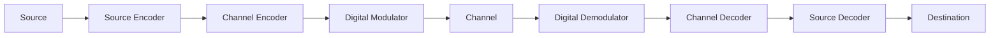
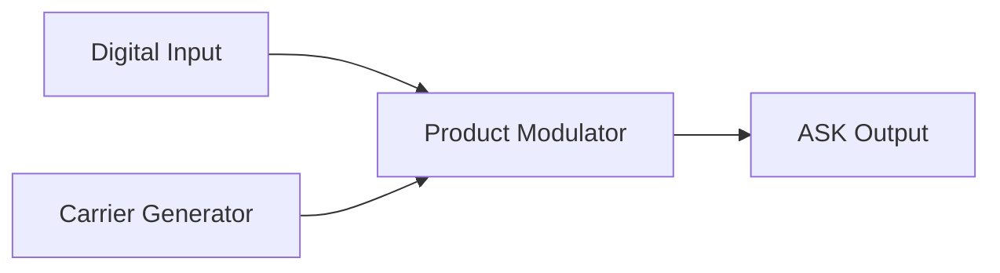
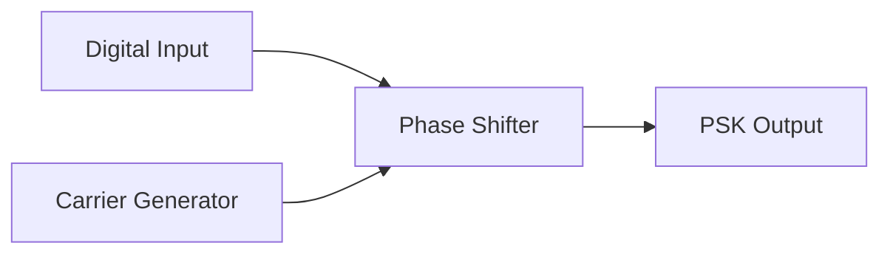
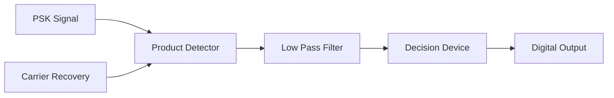
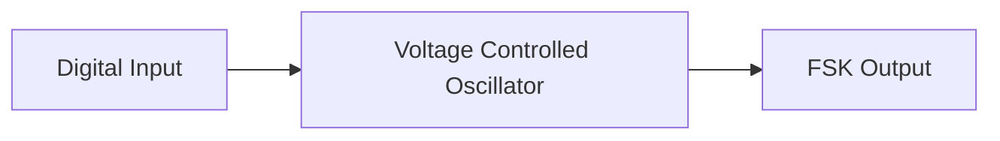
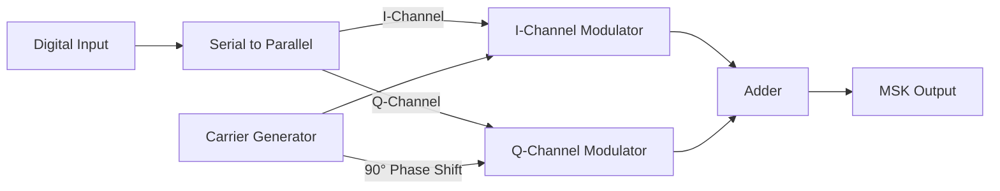
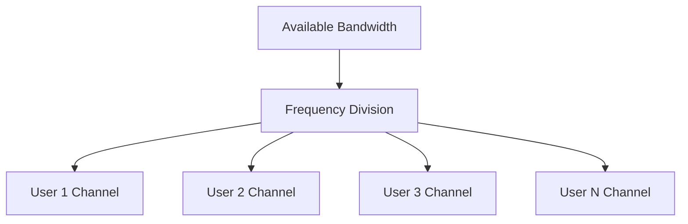
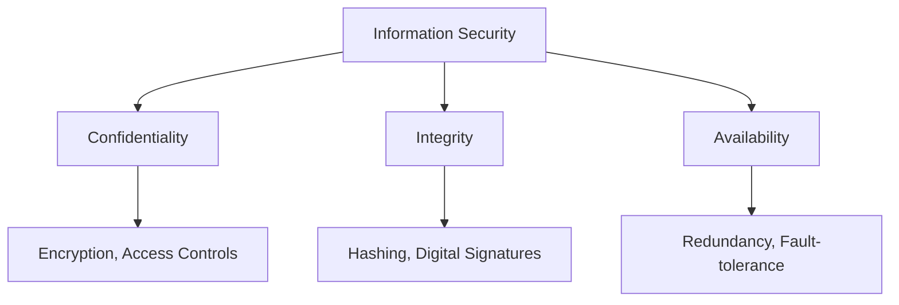

## Question 1(a) [3 marks]

**Define Continuous time Signal and Discrete time Signal with Wave form.**

**Answer**:

| Signal Type | Definition | Waveform |
|-------------|------------|----------|
| **Continuous Time Signal** | Signal defined for all values of time with no breaks | ```mermaid graph LR; A[t] --> B[x(t)]; style B fill:#fff,stroke:#333,stroke-width:2px``` |
| **Discrete Time Signal** | Signal defined only at discrete time intervals | ```mermaid graph LR; A[n] --> B[x[n]]; style B fill:#fff,stroke:#333,stroke-width:2px``` |

**Diagram**:

```goat
                      Continuous                          Discrete
 Signal                                                       o
 Amplitude    /\      /\                                      |
             /  \    /  \                                     o     o
            /    \  /    \                                    |     |
           /      \/      \                            o      |     |      o
          /                \                           |      o     |      |
 --------/------------------\--------- time   -----o---|------|-----|------o----- time
                                                   |   |      |     o      |
                                                   o   o      |            |
                                                                           o
```

**Mnemonic:** "Continuous Curves, Discrete Dots"

## Question 1(b) [4 marks]

**Explain Energy and power signal.**

**Answer**:

| Parameter | Energy Signal | Power Signal |
|-----------|---------------|--------------|
| **Definition** | Has finite energy but zero average power | Has finite average power but infinite energy |
| **Mathematical Expression** | ∫\|x(t)\|²dt < ∞ | lim(T→∞) (1/2T)∫\|x(t)\|²dt < ∞ |
| **Examples** | Pulse, Decaying exponential | Sine wave, Square wave |
| **Nature** | Finite duration or decreasing amplitude | Periodic or infinite duration |

**Diagram**:

```goat
     Energy Signal                      Power Signal
        /\                              /\    /\    /\
       /  \                            /  \  /  \  /  \
      /    \                          /    \/    \/    \
 ----/------\------- time   ---------/-------------------- time
    /        \                      /
   /          \                    /
                                 Never ends...
```

**Mnemonic:** "Energy Expires, Power Persists"

## Question 1(c) [7 marks]

**Explain block diagram of digital communication system.**

**Answer**:



| Block | Function |
|-------|----------|
| **Source** | Generates message to be transmitted |
| **Source Encoder** | Converts message to digital sequence, removes redundancy |
| **Channel Encoder** | Adds controlled redundancy for error detection/correction |
| **Digital Modulator** | Converts digital symbols to waveforms suitable for channel |
| **Channel** | Transmission medium, adds noise and distortion |
| **Digital Demodulator** | Converts received waveforms back to digital symbols |
| **Channel Decoder** | Detects/corrects errors using added redundancy |
| **Source Decoder** | Reconstructs original message from digital sequence |

**Mnemonic:** "Send Signals Carefully, Digital Messages Communicate Data Safely"

## Question 1(c) OR [7 marks]

**Explain Unit Step function and Unit impulse function.**

**Answer**:

| Function | Mathematical Definition | Properties | Applications |
|----------|-------------------------|------------|--------------|
| **Unit Step Function (u(t))** | u(t) = 0 for t < 0<br>u(t) = 1 for t ≥ 0 | - Represents sudden transition<br>- Integral of impulse function | System response analysis |
| **Unit Impulse Function (δ(t))** | δ(t) = 0 for t ≠ 0<br>∫δ(t)dt = 1 | - Infinitesimally narrow pulse<br>- Sampling property<br>- Derivative of step function | Sampling, system analysis |

**Diagrams**:

```goat
          Unit Step Function                 Unit Impulse Function
                    ______                            ^
                   |                                  |
                   |                                  |
                   |                               (infinite)
        ___________|                                  |
                                                      |
        ----------0----------- t       ------0------------------  t
```

**Mnemonic:** "Step Stays steady after zero, Impulse Instantly appears then vanishes"

## Question 2(a) [3 marks]

**A signal carries 8 bit/signal elements. If 1000 signal elements sent per second. Find the bit rate.**

**Answer**:

| Parameter | Value |
|-----------|-------|
| Bits per signal element | 8 bits |
| Signal elements per second | 1000 |
| **Calculation** | Bit rate = (Bits per signal element) × (Signal elements per second) |
| **Bit rate** | = 8 × 1000 = 8000 bits/second or 8 kbps |

**Mnemonic:** "Bits per signal × Signals per second = Bits per second"

## Question 2(b) [4 marks]

**Explain Even and Odd signal.**

**Answer**:

| Signal Type | Mathematical Definition | Properties | Examples |
|-------------|-------------------------|------------|----------|
| **Even Signal** | x(-t) = x(t) | - Symmetric about y-axis<br>- Cosine is even | Cosine function, \|t\| |
| **Odd Signal** | x(-t) = -x(t) | - Anti-symmetric about y-axis<br>- Sine is odd | Sine function, t |

**Diagram**:

```goat
        Even Signal                        Odd Signal
            /\                                 /
           /  \                               /
          /    \                             /
         /      \                           /
 -------0---------                  -------0-------
         \      /                         /
          \    /                         /
           \  /                         /
            \/                         v
```

**Mnemonic:** "Even reflects Exactly, Odd reflects Oppositely"

## Question 2(c) [7 marks]

**Explain the block diagram of ASK modulator and de-modulator with waveform.**

**Answer**:

**ASK Modulator:**



**ASK Demodulator:**


**Waveforms:**

```goat
Digital Input:   _____       _____
                |     |     |     |
         _______|     |_____|     |_____

Carrier:  /\/\/\/\/\/\/\/\/\/\/\/\/\/\/\

ASK Output:      /\/\/\       /\/\/\
                |      |     |      |
         _______|      |_____|      |_____
```

| Concept | Description |
|---------|-------------|
| **ASK Modulation** | Amplitude varies according to digital data (0 or 1) |
| **Modulator Components** | Product modulator multiplies carrier with digital signal |
| **Demodulator Components** | Envelope detector extracts amplitude, comparator regenerates digital signal |

**Mnemonic:** "ASK Adjusts Signal's Knockout amplitude"

## Question 2(a) OR [3 marks]

**A signal has a bit rate of 4000 bit/second and a baud rate of 1000 baud. How many data elements are carried by each signal element?**

**Answer**:

| Parameter | Value |
|-----------|-------|
| Bit rate | 4000 bits/second |
| Baud rate | 1000 baud (signal elements/second) |
| **Formula** | Number of data elements = Bit rate ÷ Baud rate |
| **Data elements per signal** | = 4000 ÷ 1000 = 4 bits/signal element |

**Mnemonic:** "Bits divided by Bauds equals Bits per signal"

## Question 2(b) OR [4 marks]

**Explain Periodic and aperiodic signal.**

**Answer**:

| Signal Type | Definition | Mathematical Condition | Examples |
|-------------|------------|------------------------|----------|
| **Periodic Signal** | Repeats after fixed time interval | x(t) = x(t+T) for all t | Sine wave, Square wave |
| **Aperiodic Signal** | Does not repeat after any time interval | x(t) ≠ x(t+T) for any T | Pulse, Noise |

**Diagram**:

```goat
    Periodic Signal                Aperiodic Signal
    /\    /\    /\                       /\
   /  \  /  \  /  \                     /  \
  /    \/    \/    \                   /    \___________
                                      /
 One period (T) -->|                 /
```

**Mnemonic:** "Periodic Perfectly repeats, Aperiodic Alters always"

## Question 2(c) OR [7 marks]

**Explain the block diagram of PSK modulator and de-modulator with waveform.**

**Answer**:

**PSK Modulator:**



**PSK Demodulator:**



**Waveforms:**

```goat
Digital Input:   _____       _____
                |     |     |     |
         _______|     |_____|     |_____

Carrier:  /\/\/\/\/\/\/\/\/\/\/\/\/\/\/\

PSK Output: /\/\/\\/\/\/\/\/\\\/\/\/\/\/\
           (0°)   (180°) (0°)  (180°)
           Phase shifts at bit transitions
```

| Parameter | Description |
|-----------|-------------|
| **PSK Modulation** | Phase shifts according to digital data (0 or 1) |
| **Phase States** | 0° for bit '1', 180° for bit '0' |
| **Advantages** | Better noise immunity than ASK |

**Mnemonic:** "PSK Phases Shift with Knowledge"

## Question 3(a) [3 marks]

**Explain the working of FSK modulator with block diagram and output Waveform.**

**Answer**:

**FSK Modulator Block Diagram:**



**FSK Waveforms:**

```goat
Digital Input:   _____       _____
                |     |     |     |
         _______|     |_____|     |_____

FSK Output: /\/\/\  /\/\/\/\/\  /\/\/\
           (f1)    (f2)       (f1)
```

- **Principle**: Digital bit '1' sends carrier with frequency f1, bit '0' sends carrier with frequency f2
- **Working**: Voltage controlled oscillator changes frequency based on input bit value

**Mnemonic:** "Frequency Shifts for Knowledge transmission"

## Question 3(b) [4 marks]

**Draw the PSK modulation waveform for the sequence of 1010110110.**

**Answer**:

```goat
Digital Input:  ___     ___     _______     _______   
               |   |   |   |   |       |   |       |  
          _____|   |___|   |___|       |___|       |___
          
          1     0     1     0     1     1     0     1     1     0
          
PSK Output:    
          /\/\ /\/\ /\/\ /\/\ /\/\ /\/\ /\/\ /\/\ /\/\ /\/\
          0°   180° 0°   180° 0°   0°   180° 0°   0°   180°
          
Phase:    0°   180° 0°   180° 0°   0°   180° 0°   0°   180°
```

**Table for PSK modulation:**

| Bit | Phase |
|-----|-------|
| 1 | 0° |
| 0 | 180° |

**Mnemonic:** "One-Zero, Phase-Shifts, Keep-Signal Modulated"

## Question 3(c) [7 marks]

**Draw the ASK and FSK modulation waveform for the sequence of 1100110101.**

**Answer**:

**Digital Input Sequence: 1100110101**

```goat
Digital Input:  _______         _______     ___     ___
               |       |       |       |   |   |   |   |
          _____|       |_______|       |___|   |___|   |___
          
          1     1     0     0     1     1     0     1     0     1
          
ASK Output:     
          /\/\  /\/\         /\/\  /\/\        /\/\        /\/\
          
          On    On    Off   Off   On    On    Off   On    Off   On
          
FSK Output:     
          /\/\  /\/\  /\/\/ /\/\/ /\/\  /\/\  /\/\/ /\/\  /\/\/ /\/\
          
          f1    f1    f2    f2    f1    f1    f2    f1    f2    f1
```

**Table for comparison:**

| Bit | ASK | FSK |
|-----|-----|-----|
| 1 | Carrier ON (high amplitude) | Higher frequency (f1) |
| 0 | Carrier OFF (zero/low amplitude) | Lower frequency (f2) |

**Mnemonic:** "Amplitude Shows Knowledge, Frequency Shifts Knowledge"

## Question 3(a) OR [3 marks]

**Explain the working of MSK modulator with block diagram and output Waveform.**

**Answer**:

**MSK Modulator Block Diagram:**



**MSK Features:**

- Continuous phase FSK with frequency deviation exactly half bit rate
- Phase changes occur smoothly (no abrupt phase changes)
- Better spectral efficiency than FSK

**Mnemonic:** "Minimum Shift Keeps spectrum narrow"

## Question 3(b) [4 marks]

**Draw the constellation diagram of 8-PSK and 16-QAM.**

**Answer**:

**8-PSK Constellation:**

```goat
           001  *    *  000
               /|\  /|\
                |    |
          010 * |    | * 111
              \ |    | /
               \|    |/
          011  *     *  110
               /|\  /|\
               / \   /\
          100 *   \ /  * 101
```

**16-QAM Constellation:**

```goat
     *     *     *     *
    0000  0001  0100  0101
     
     *     *     *     *
    0010  0011  0110  0111
    
     *     *     *     *
    1000  1001  1100  1101
     
     *     *     *     *
    1010  1011  1110  1111
```

| Modulation | Description |
|------------|-------------|
| **8-PSK** | 8 points equally spaced around circle, 3 bits per symbol |
| **16-QAM** | 16 points in square grid, varying amplitude and phase, 4 bits per symbol |

**Mnemonic:** "PSK Points on Single circle, QAM Quadrature Amplitude Matrix"

## Question 3(c) OR [7 marks]

**Draw BPSK and QPSK modulation waveform for 1010101011.**

**Answer**:

**BPSK Modulation:**

```goat
Digital Input:  ___     ___     ___     ___       
               |   |   |   |   |   |   |   |    
          _____|   |___|   |___|   |___|   |_____
          
          1     0     1     0     1     0     1     0     1     1
          
BPSK Output:    
          /\/\  /\/\  /\/\  /\/\  /\/\  /\/\  /\/\  /\/\  /\/\  /\/\
          0°    180°  0°    180°  0°    180°  0°    180°  0°    0°
```

**QPSK Modulation (grouping bits in pairs):**

```goat
                    10           10           10           11
Input Pairs:    |--------|   |--------|   |--------|   |--------|
                
I-Channel:      ___      ___      ___      ___      ___
               |   |    |   |    |   |    |   |    |   |
          _____|   |____|   |____|   |____|   |____|   |____
                1      0      1      0      1      0      1      1
                
Q-Channel:     ___      ___      ___           ___
              |   |    |   |    |   |         |   |
          ____|   |____|   |____|   |_________|   |____
                0      1      0      1      0      1      1
                
QPSK Phase:     90°     270°    90°     270°    90°     270°    90°     45°
```

| Bit Pair | QPSK Phase |
|----------|------------|
| 10 | 90° |
| 00 | 180° |
| 01 | 270° |
| 11 | 0° |

**Mnemonic:** "Binary Phase Shifts Keys, Quadrature Phase Shifts Keys"

## Question 4(a) [3 marks]

**Encode the data using Shanon Fano code for below probability sequence. P = {0.30, 0.25, 0.20, 0.12, 0.08, 0.05}**

**Answer**:

| Symbol | Probability | Shannon-Fano Code |
|--------|-------------|-------------------|
| S1 | 0.30 | 00 |
| S2 | 0.25 | 01 |
| S3 | 0.20 | 10 |
| S4 | 0.12 | 110 |
| S5 | 0.08 | 1110 |
| S6 | 0.05 | 1111 |

**Process:**

1. Sort symbols by decreasing probability
2. Split into two groups with nearly equal probability (0.30+0.25=0.55, 0.20+0.12+0.08+0.05=0.45)
3. Assign 0 to first group, 1 to second group
4. Recursively continue for each subgroup

**Mnemonic:** "Separate, Fano divides, Code efficiently"

## Question 4(b) [4 marks]

**Explain Hamming code.**

**Answer**:

| Aspect | Description |
|--------|-------------|
| **Definition** | Linear error-correcting code that detects double errors and corrects single errors |
| **Parity bits** | For m data bits, need k parity bits where 2^k ≥ m+k+1 |
| **Position** | Parity bits placed at positions 1, 2, 4, 8, 16... (powers of 2) |
| **Error detection** | Calculate syndrome to locate error position |

**Example Hamming(7,4):**

```goat
Positions:  1   2   3   4   5   6   7
            P1  P2  D1  P4  D2  D3  D4
            
Parity check equations:
P1 checks: P1, D1, D2, D4
P2 checks: P2, D1, D3, D4
P4 checks: P4, D2, D3, D4
```

**Mnemonic:** "Hamming Helps Handle Bit Errors"

## Question 4(c) [7 marks]

**Compare TDMA and FDMA.**

**Answer**:

| Parameter | TDMA (Time Division Multiple Access) | FDMA (Frequency Division Multiple Access) |
|-----------|--------------------------------------|------------------------------------------|
| **Basic Principle** | Divides channel by time slots | Divides channel by frequency bands |
| **Resource Allocation** | Each user gets entire bandwidth for short time | Each user gets portion of bandwidth all the time |
| **Guard Period** | Time guard bands between slots | Frequency guard bands between channels |
| **Synchronization** | Strict timing synchronization required | No timing synchronization needed |
| **Efficiency** | Higher, due to burst transmission | Lower, due to fixed assignment |
| **Complexity** | More complex | Relatively simple |
| **Examples** | GSM, DECT | FM radio, Traditional satellite systems |

**Diagram:**

```goat
TDMA:                          FDMA:
        User 1  User 2  User 3         ^
Time    |-----|-----|-----|--->        | User 3
slots   |-----|-----|-----|--->        |-------
        |-----|-----|-----|--->  Freq. | User 2
                                       |-------
                                       | User 1
                                       |--------->
                                          Time
```

**Mnemonic:** "Time Divides Multiple Access, Frequency Divides Multiple Access"

## Question 4(a) OR [3 marks]

**Encode the data using Huffman code for below probability sequence. P = {0.4, 0.2, 0.2, 0.1, 0.1}**

**Answer**:

| Symbol | Probability | Huffman Code |
|--------|-------------|--------------|
| S1 | 0.4 | 0 |
| S2 | 0.2 | 10 |
| S3 | 0.2 | 11 |
| S4 | 0.1 | 100 |
| S5 | 0.1 | 101 |

**Process:**

1. Start with sorted probabilities
2. Combine lowest two probabilities (0.1+0.1=0.2)
3. Rearrange and repeat until only two nodes remain
4. Assign bits by traversing tree

**Tree Construction:**

```goat
                  1.0
                 /   \
                /     \
             0.6       0.4(S1)
            /   \
           /     \
        0.4      0.2(S2,S3)
       /   \     / \
    0.2    0.2  0  1
   /   \
0.1    0.1
```

**Mnemonic:** "Huffman Helps encode High-frequency data"

## Question 4(b) OR [4 marks]

**Explain parity code.**

**Answer**:

| Aspect | Description |
|--------|-------------|
| **Definition** | Simple error detection scheme that adds parity bit |
| **Types** | Even parity: total 1s is even<br>Odd parity: total 1s is odd |
| **Calculation** | XOR all data bits to generate parity bit |
| **Capability** | Detects odd number of errors, cannot correct errors |

**Examples:**

```goat
Even Parity:
Data: 1011 → Parity: 0 → Coded: 10110 (Even number of 1s: 4)

Odd Parity:
Data: 1011 → Parity: 1 → Coded: 10111 (Odd number of 1s: 5)
```

**Mnemonic:** "Parity Provides Primitive Error detection"

## Question 4(c) OR [7 marks]

**Explain FDMA Technique in detail.**

**Answer**:

**FDMA (Frequency Division Multiple Access):**



| Parameter | Description |
|-----------|-------------|
| **Basic Principle** | Total bandwidth divided into non-overlapping frequency bands |
| **Channel Assignment** | Each user assigned dedicated frequency band |
| **Guard Bands** | Small frequency gaps between channels to prevent interference |
| **Duplexing** | Usually implemented with FDD (Frequency Division Duplexing) |
| **Advantages** | Simple implementation, no synchronization required |
| **Disadvantages** | Inefficient for bursty traffic, fixed allocation wastes bandwidth |
| **Applications** | AM/FM radio, Traditional cable TV, First-generation mobile systems |

**Frequency Allocation:**

```goat
Frequency
    ^
    |   Guard Bands
    |    ↓  ↓  ↓  ↓  ↓
    |   |--|--|--|--|--
    |   |  |  |  |  |
    |   |  |  |  |  |-- User N
    |   |  |  |  |
    |   |  |  |  |-- User 3
    |   |  |  |
    |   |  |  |-- User 2
    |   |  |
    |   |  |-- User 1
    |   |
    |---|-----------------> Time
```

**Mnemonic:** "Fixed Division for Multiple Access"

## Question 5(a) [3 marks]

**Explain E1 Career system.**

**Answer**:

| Parameter | Description |
|-----------|-------------|
| **Description** | European standard digital transmission format |
| **Capacity** | 2.048 Mbps |
| **Channel Structure** | 32 time slots (numbered 0-31) |
| **Voice Channels** | 30 voice channels (64 kbps each) |
| **Signaling** | Time slot 16 for signaling |
| **Frame Alignment** | Time slot 0 for synchronization |

**Diagram:**

```goat
One E1 Frame (32 time slots)
 _______________________________________________________
|   |   |   |   |   |   |   |   |   |   |   |   |   |   |
| 0 | 1 | 2 |...| 15| 16| 17|...| 30| 31| 0 | 1 | 2 |...|
|___|___|___|___|___|___|___|___|___|___|___|___|___|___|

TS0: Frame alignment
TS16: Signaling
TS1-15, TS17-31: Voice/data channels (30 channels)
```

**Mnemonic:** "E1 Enables 30 + 2 time slots"

## Question 5(b) [4 marks]

**Explain TDMA Access technique.**

**Answer**:

| Parameter | Description |
|-----------|-------------|
| **Definition** | Multiple access technique that divides time into slots for different users |
| **Working Principle** | Each user gets entire bandwidth for a short time period |
| **Frame Structure** | Time divided into frames, frames divided into slots |
| **Guard Time** | Small time gap between slots to prevent overlap |
| **Synchronization** | Requires precise timing synchronization |

**TDMA Frame Structure:**

```goat
             One TDMA Frame
 ________________________________________
|      |      |      |      |      |     |
| TS 1 | TS 2 | TS 3 | TS 4 | TS 5 | ... |
|______|______|______|______|______|_____|
   |      |      |
   |      |      |--- User 3
   |      |
   |      |--- User 2
   |
   |--- User 1

Each time slot (TS) contains:
- User data
- Guard time
- Synchronization bits
- Control bits
```

**Mnemonic:** "Time Divides Multiple Access"

## Question 5(c) [7 marks]

**Explain IoT − Concept, Features, Advantages and Disadvantages.**

**Answer**:

**IoT Concept:**


| Aspect | Description |
|--------|-------------|
| **Concept** | Network of physical objects embedded with sensors, software, and connectivity |
| **Features** | - Connectivity (devices connected to internet)<br>- Intelligence (smart decision making)<br>- Sensing (collecting data from environment)<br>- Automation (minimal human intervention)<br>- Scalability (handles many devices) |
| **Advantages** | - Improved efficiency and productivity<br>- Better resource management<br>- Enhanced decision making<br>- Convenience and time-saving<br>- New business opportunities |
| **Disadvantages** | - Security vulnerabilities<br>- Privacy concerns<br>- Complexity in implementation<br>- Compatibility issues<br>- Dependence on internet |

**Application Areas:**

- Smart homes, cities
- Healthcare monitoring
- Industrial automation
- Agriculture
- Transportation

**Mnemonic:** "Internet of Things: Connected, Automated, Smarter Decisions"

## Question 5(a) OR [4 marks]

**Explain T1 Career TDM system.**

**Answer**:

| Parameter | Description |
|-----------|-------------|
| **Description** | North American standard digital transmission format |
| **Capacity** | 1.544 Mbps |
| **Channel Structure** | 24 time slots (channels) + 1 framing bit |
| **Voice Channels** | 24 voice channels (64 kbps each) |
| **Frame Structure** | 193 bits per frame (24 × 8 + 1) |
| **Signaling** | Robbed bit signaling (least significant bit) |

**Diagram:**

```goat
One T1 Frame (193 bits)
 ___________________________________________________________
|   |       |       |       |       |       |       |       |
| F | Ch 1  | Ch 2  | Ch 3  |  ...  | Ch 22 | Ch 23 | Ch 24 |
|___|_______|_______|_______|_______|_______|_______|_______|

F: Framing bit
Each channel: 8 bits (1 byte)
```

**Mnemonic:** "T1 Transmits 24 channels"

## Question 5(b) OR [3 marks]

**Compare TDM and FDM.**

**Answer**:

| Parameter | TDM (Time Division Multiplexing) | FDM (Frequency Division Multiplexing) |
|-----------|----------------------------------|--------------------------------------|
| **Basic Principle** | Divides channel by time | Divides channel by frequency |
| **Signal Separation** | In time domain | In frequency domain |
| **Guard Bands** | Time guard bands | Frequency guard bands |
| **Implementation** | Digital technique | Analog technique (originally) |
| **Crosstalk** | Less susceptible | More susceptible |
| **Synchronization** | Required | Not required |

**Diagram:**

```goat
TDM:                         FDM:
     Ch1  Ch2  Ch3  Ch1            ^
Time  |--|--|--|--|-->             | Ch3
      |--|--|--|--|-->  Frequency  |-----
      |--|--|--|--|-->             | Ch2
                                   |-----
                                   | Ch1
                                   |------->
                                      Time
```

**Mnemonic:** "Time Divides Multiplexing, Frequency Divides Multiplexing"

## Question 5(c) OR [7 marks]

**Explain security components of information security.**

**Answer**:

**The CIA Triad of Information Security:**



| Component | Description | Implementation Methods |
|-----------|-------------|------------------------|
| **Confidentiality** | Protection against unauthorized access | - Encryption<br>- Access controls<br>- Authentication<br>- Steganography |
| **Integrity** | Ensuring data is accurate and unaltered | - Hashing<br>- Digital signatures<br>- Version control<br>- Checksums |
| **Availability** | Ensuring systems are accessible when needed | - Redundancy<br>- Backups<br>- Disaster recovery<br>- Fault tolerance |
| **Authentication** | Verifying identity | - Passwords<br>- Biometrics<br>- Smart cards<br>- Multi-factor |
| **Non-repudiation** | Preventing denial of actions | - Digital signatures<br>- Audit logs<br>- Timestamps |

**Security Threats:**

- Malware (viruses, worms, trojans)
- Social engineering
- Denial of Service (DoS)
- Man-in-the-middle attacks
- Insider threats

**Mnemonic:** "CIA Protects All Network Data"
