## પ્રશ્ન 1(અ) [3 ગુણ]

**ડિજિટલ કોમ્યુનિકેશન સિસ્ટમનો બ્લોક ડાયાગ્રામ દોરો.**

**જવાબ**:

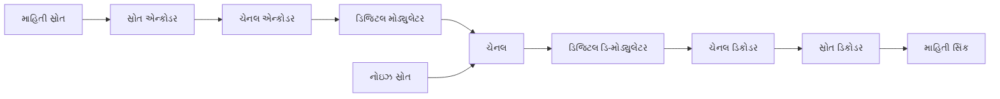

**મુખ્ય ઘટકો:**

- **માહિતી સ્રોત**: સંદેશ સિગ્નલ જનરેટ કરે છે
- **સ્રોત એન્કોડર**: એનાલોગને ડિજિટલમાં કન્વર્ટ કરે છે
- **ચેનલ એન્કોડર**: એરર કરેક્શન કોડ ઉમેરે છે
- **ડિજિટલ મોડ્યુલેટર**: ડિજિટલ બિટ્સને એનાલોગ સિગ્નલમાં કન્વર્ટ કરે છે

**યાદગાર વાક્ય:** "સ્રોત ચેનલ મોડ્યુલેટર ચેનલમાંથી ડિ-મોડ્યુલેટર ચેનલ સિંક સુધી જાય છે"

## પ્રશ્ન 1(બ) [4 ગુણ]

**ડિજિટલ કોમ્યુનિકેશન સિસ્ટમના ટ્રાન્સમીટર અને રીસીવરના કાર્યો લખો.**

**જવાબ**:

| ઘટક | કાર્ય |
|------|------|
| **ટ્રાન્સમીટર** | માહિતી સિગ્નલને ટ્રાન્સમિશન માટે યોગ્ય સ્વરૂપમાં કન્વર્ટ કરે છે |
| **સ્રોત એન્કોડર** | એનાલોગ ટુ ડિજિટલ કન્વર્ઝન, સેમ્પલિંગ, ક્વાન્ટાઇઝેશન |
| **ચેનલ એન્કોડર** | એરર ડિટેક્શન અને કરેક્શન કોડિંગ |
| **ડિજિટલ મોડ્યુલેટર** | ડિજિટલ બિટ્સને એનાલોગ વેવફોર્મમાં કન્વર્ટ કરે છે |

| ઘટક | કાર્ય |
|------|------|
| **રીસીવર** | પ્રાપ્ત સિગ્નલમાંથી મૂળ માહિતી પુનઃપ્રાપ્ત કરે છે |
| **ડિજિટલ ડિ-મોડ્યુલેટર** | પ્રાપ્ત એનાલોગ સિગ્નલને ડિજિટલ બિટ્સમાં કન્વર્ટ કરે છે |
| **ચેનલ ડિકોડર** | એરર ડિટેક્શન અને કરેક્શન |
| **સ્રોત ડિકોડર** | ડિજિટલ ટુ એનાલોગ કન્વર્ઝન |

**મુખ્ય કાર્યો:**

- **સિગ્નલ પ્રોસેસિંગ**: એન્કોડિંગ, મોડ્યુલેશન, ફિલ્ટરિંગ
- **એરર કન્ટ્રોલ**: ટ્રાન્સમિશન એરર્સનું ડિટેક્શન અને કરેક્શન
- **સિગ્નલ રિકવરી**: રીસીવર પર ડિ-મોડ્યુલેશન અને ડિકોડિંગ

**યાદગાર વાક્ય:** "ટ્રાન્સમીટર એન્કોડ કરી મોડ્યુલેટ કરે, રીસીવર ડિ-મોડ્યુલેટ કરી ડિકોડ કરે"

## પ્રશ્ન 1(ક) [7 ગુણ]

**વ્યાખ્યા કરો અને ઉદાહરણ સાથે સમજાવો: કન્ટિન્યુઅસ ટાઇમ અને ડિસક્રીટ ટાઇમ સિગ્નલ્સ, રીઅલ અને કોમ્પ્લેક્સ સિગ્નલ્સ તથા ઇવન અને ઓડ સિગ્નલ્સ.**

**જવાબ**:

| સિગ્નલનો પ્રકાર | વ્યાખ્યા | ઉદાહરણ |
|----------------|--------|---------|
| **કન્ટિન્યુઅસ ટાઇમ** | તમામ સમય વેલ્યુઝ માટે વ્યાખ્યાયિત સિગ્નલ | x(t) = sin(2πt) |
| **ડિસક્રીટ ટાઇમ** | ફક્ત ચોક્કસ સમય ક્ષણોએ જ વ્યાખ્યાયિત સિગ્નલ | x[n] = sin(2πn/8) |
| **રીઅલ સિગ્નલ** | ફક્ત વાસ્તવિક વેલ્યુઝ ધરાવતું સિગ્નલ | x(t) = 5cos(t) |
| **કોમ્પ્લેક્સ સિગ્નલ** | વાસ્તવિક અને કાલ્પનિક ભાગો ધરાવતું સિગ્નલ | x(t) = 3 + j4sin(t) |

**ઇવન અને ઓડ સિગ્નલ્સ:**

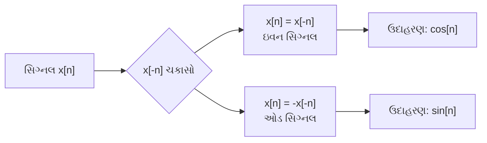

**ગુણધર્મો:**

- **ઇવન સિગ્નલ**: y-અક્ષની આસપાસ સપ્રમાણ, x(t) = x(-t)
- **ઓડ સિગ્નલ**: મૂળબિંદુની આસપાસ વિરોધી-સપ્રમાણ, x(t) = -x(-t)
- **કોમ્પ્લેક્સ સિગ્નલ**: z(t) = x(t) + jy(t)
- **ડિસક્રીટ સિગ્નલ**: કન્ટિન્યુઅસ સિગ્નલનું સેમ્પલ કરેલું સ્વરૂપ

**યાદગાર વાક્ય:** "કન્ટિન્યુઅસ સર્વત્ર, ડિસક્રીટ ચોક્કસ, રીઅલ સાદું, કોમ્પ્લેક્સ મિશ્રિત"

## પ્રશ્ન 1(ક અથવા) [7 ગુણ]

**વ્યાખ્યા કરો અને ઉદાહરણ સાથે સમજાવો: યુનિટ સ્ટેપ ફંકશન, યુનિટ ઇમ્પલ્સ ફંકશન અને યુનિટ રેમ્પ ફંકશન**

**જવાબ**:

| ફંકશન | વ્યાખ્યા | ગાણિતિક સ્વરૂપ |
|-------|--------|------------------|
| **યુનિટ સ્ટેપ** | u(t) = t≥0 માટે 1, t<0 માટે 0 | u(t) = t≥0 માટે 1 |
| **યુનિટ ઇમ્પલ્સ** | δ(t) = t=0 માટે ∞, અન્યત્ર 0 | ∫δ(t)dt = 1 |
| **યુનિટ રેમ્પ** | r(t) = t≥0 માટે t, t<0 માટે 0 | r(t) = t·u(t) |

```goat
Unit Step Function:        Unit Impulse Function:      Unit Ramp Function:
                          
    1 |----                   ∞ |                           |  /
      |                         | |                         | /
    0 |____                   0 |_|____                   0 |/____
      0    t                     0    t                     0    t
```

**ઉપયોગો:**

- **યુનિટ સ્ટેપ**: સ્વિચ ઓપરેશન્સ, સિસ્ટમ રિસ્પોન્સ વિશ્લેષણ
- **યુનિટ ઇમ્પલ્સ**: સિસ્ટમ ઇમ્પલ્સ રિસ્પોન્સ, કોન્વોલ્યુશન
- **યુનિટ રેમ્પ**: સિસ્ટમ રેમ્પ રિસ્પોન્સ, ઇન્ટિગ્રેશન

**ગુણધર્મો:**

- **સ્ટેપ**: રેમ્પનો વ્યુત્પન્ન, ઇમ્પલ્સનો સંકલન
- **ઇમ્પલ્સ**: સ્ટેપ ફંકશનનો વ્યુત્પન્ન
- **રેમ્પ**: સ્ટેપ ફંકશનનો સંકલન

**યાદગાર વાક્ય:** "સ્ટેપ અચાનક, ઇમ્પલ્સ તાત્કાલિક, રેમ્પ વધતું"

## પ્રશ્ન 2(અ) [3 ગુણ]

**વ્યાખ્યાયિત કરો: બિટ રેટ, બોડ રેટ અને બેન્ડવિડ્થ.**

**જવાબ**:

| પેરામીટર | વ્યાખ્યા | એકમ |
|---------|--------|-----|
| **બિટ રેટ** | પ્રતિ સેકન્ડે ટ્રાન્સમિટ થતી બિટ્સની સંખ્યા | bps (બિટ્સ પર સેકન્ડ) |
| **બોડ રેટ** | પ્રતિ સેકન્ડે સિગ્નલ ફેરફારોની સંખ્યા | Baud (સિમ્બોલ્સ પર સેકન્ડ) |
| **બેન્ડવિડ્થ** | સિગ્નલમાં ફ્રીક્વેન્સીઝની રેન્જ | Hz (હર્ટ્ઝ) |

**સંબંધ:**

- બિટ રેટ = બોડ રેટ × log₂(M)
- M = સિગ્નલ લેવલ્સની સંખ્યા
- બેન્ડવિડ્થ ∝ બોડ રેટ

**મુખ્ય મુદ્દાઓ:**

- **ઊંચો બિટ રેટ**: વધુ ડેટા ટ્રાન્સમિશન
- **બોડ રેટ**: સિમ્બોલ ટ્રાન્સમિશન રેટ
- **બેન્ડવિડ્થ**: કબજામાં લેવાયેલું ફ્રીક્વેન્સી સ્પેક્ટ્રમ

**યાદગાર વાક્ય:** "બિટ્સ બોડ બેન્ડવિડ્થ - ડેટા સિમ્બોલ ફ્રીક્વેન્સી"

## પ્રશ્ન 2(બ) [4 ગુણ]

**એનર્જી અને પાવર સિગ્નલ સમજાવો.**

**જવાબ**:

| સિગ્નલનો પ્રકાર | વ્યાખ્યા | ગાણિતિક સ્વરૂપ |
|----------------|--------|------------------|
| **એનર્જી સિગ્નલ** | મર્યાદિત એનર્જી, ઝીરો એવરેજ પાવર | E = ∫|x(t)|²dt < ∞ |
| **પાવર સિગ્નલ** | મર્યાદિત એવરેજ પાવર, અનંત એનર્જી | P = lim(T→∞) 1/T ∫|x(t)|²dt |

**વર્ગીકરણ:**

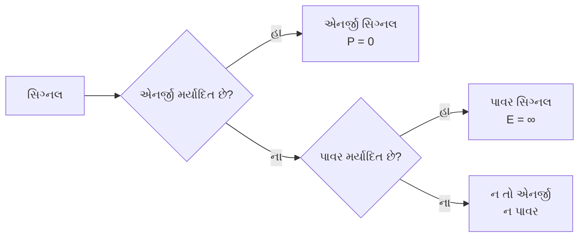

**ઉદાહરણો:**

- **એનર્જી સિગ્નલ**: ઘટતું exponential સિગ્નલ e^(-t)u(t)
- **પાવર સિગ્નલ**: Sinusoidal સિગ્નલ sin(ωt)
- **બંનેમાંથી કોઈ નહીં**: રેમ્પ સિગ્નલ t·u(t)

**ગુણધર્મો:**

- એનર્જી અને પાવર સિગ્નલ્સ એકબીજાને બાકાત રાખે છે
- આવર્તિ સિગ્નલ્સ સામાન્ય રીતે પાવર સિગ્નલ્સ હોય છે
- બિન-આવર્તિ મર્યાદિત અવધિના સિગ્નલ્સ એનર્જી સિગ્નલ્સ હોય છે

**યાદગાર વાક્ય:** "એનર્જી સમાપ્ત, પાવર ચાલુ"

## પ્રશ્ન 2(ક) [7 ગુણ]

**ASK, FSK અને PSK મોડ્યુલેશન ટેકનિકો વચ્ચે સરખામણી કરો અને તેના વેવફોર્મ્સ દોરો.**

**જવાબ**:

| પેરામીટર | ASK | FSK | PSK |
|---------|-----|-----|-----|
| **પૂરું નામ** | Amplitude Shift Keying | Frequency Shift Keying | Phase Shift Keying |
| **બદલાતો પેરામીટર** | એમ્પ્લિટ્યુડ | ફ્રીક્વેન્સી | ફેઝ |
| **બેન્ડવિડ્થ** | સાંકડી | પહોળી | સાંકડી |
| **નોઇઝ ઇમ્યુનિટી** | નબળી | સારી | શ્રેષ્ઠ |
| **પાવર એફિશિયન્સી** | નબળી | સારી | શ્રેષ્ઠ |
| **અમલીકરણ** | સરળ | મધ્યમ | જટિલ |

```goat
ASK Waveform:
Data:    1    0    1    1    0
        ___       ___  ___      
       |   |     |   ||   |     
    ___|   |_____|   ||   |_____
    
FSK Waveform:
       ~~~       ~~~ ~~~      
      ~   ~     ~   ~   ~     
    ~~     ~~   ~     ~   ~~   
    
PSK Waveform:
       ___       ___ ___      
      |   |     |   |   |     
    __|   |_____|   |   |_____
      phase shift at data change
```

**ઉપયોગો:**

- **ASK**: ઓપ્ટિકલ કોમ્યુનિકેશન, સરળ રેડિયો સિસ્ટમ્સ
- **FSK**: ટેલિફોન મોડેમ્સ, રેડિયો સિસ્ટમ્સ
- **PSK**: સેટેલાઇટ કોમ્યુનિકેશન, વાયરલેસ સિસ્ટમ્સ

**ફાયદાઓ:**

- **ASK**: સરળ અમલીકરણ, ઓછી કિંમત
- **FSK**: સારી નોઇઝ પર્ફોર્મન્સ, કોન્સ્ટન્ટ એન્વેલોપ
- **PSK**: શ્રેષ્ઠ નોઇઝ પર્ફોર્મન્સ, બેન્ડવિડ્થ એફિશિયન્ટ

**યાદગાર વાક્ય:** "ASK એમ્પ્લિટ્યુડ, FSK ફ્રીક્વેન્સી, PSK ફેઝ"

## પ્રશ્ન 2(અ અથવા) [3 ગુણ]

**8-બિટ જનરેટરમાંથી સિગ્નલ જનરેટરનો બિટ દર 1600 bps છે. સિગ્નલનો બોડ રેટ ની ગणતરી કરો.**

**જવાબ**:

**આપેલ:**

- બિટ રેટ = 1600 bps
- પ્રતિ સિમ્બોલ બિટ્સની સંખ્યા = 8 બિટ્સ

**સૂત્ર:**
બોડ રેટ = બિટ રેટ / પ્રતિ સિમ્બોલ બિટ્સની સંખ્યા

**ગણતરી:**
બોડ રેટ = 1600 bps / 8 બિટ્સ
બોડ રેટ = 200 Baud

**પરિણામ:**
સિગ્નલનો બોડ રેટ **200 Baud** છે.

**સમજૂતી:**

- દરેક સિમ્બોલ 8 બિટ્સની માહિતી ધરાવે છે
- પ્રતિ સેકન્ડે 1600 બિટ્સ ÷ પ્રતિ સિમ્બોલ 8 બિટ્સ = પ્રતિ સેકન્ડે 200 સિમ્બોલ્સ
- તેથી, બોડ રેટ = 200 Baud

**યાદગાર વાક્ય:** "બિટ રેટને બિટ્સ પર સિમ્બોલથી ભાગવાથી બોડ મળે"

## પ્રશ્ન 2(બ અથવા) [4 ગુણ]

**શોધો કે સિગ્નલ્સ ઇવન અથવા ઓડ છે કે નહીં:**
**1. x(t) = e^(-5t)**
**2. x(t) = sin 2t**
**3. x(t) = cos 5t**

**જવાબ**:

| સિગ્નલ | x(-t) ટેસ્ટ | પરિણામ | પ્રકાર |
|-------|------------|--------|------|
| x(t) = e^(-5t) | x(-t) = e^(5t) ≠ x(t) ≠ -x(t) | બંનેમાંથી કોઈ નહીં | ન તો ઇવન ન ઓડ |
| x(t) = sin 2t | x(-t) = sin(-2t) = -sin 2t = -x(t) | -x(t) | **ઓડ સિગ્નલ** |
| x(t) = cos 5t | x(-t) = cos(-5t) = cos 5t = x(t) | x(t) | **ઇવન સિગ્નલ** |

**ટેસ્ટ પ્રક્રિયા:**

1. **ઇવન સિગ્નલ ટેસ્ટ**: તપાસો કે x(t) = x(-t)
2. **ઓડ સિગ્નલ ટેસ્ટ**: તપાસો કે x(t) = -x(-t)

**વપરાયેલ ગુણધર્મો:**

- **Exponential**: e^(-at) ન તો ઇવન ન ઓડ છે (a > 0)
- **Sine ફંકશન**: sin(-x) = -sin(x) → ઓડ ફંકશન
- **Cosine ફંકશન**: cos(-x) = cos(x) → ઇવન ફંકશન

**પરિણામો:**

- **સિગ્નલ 1**: ન તો ઇવન ન ઓડ
- **સિગ્નલ 2**: ઓડ સિગ્નલ
- **સિગ્નલ 3**: ઇવન સિગ્નલ

**યાદગાર વાક્ય:** "Cosine ઇવન, Sine ઓડ, Exponential બંનેમાંથી કોઈ નહીં"

## પ્રશ્ન 2(ક અથવા) [7 ગુણ]

**QPSK સિગ્નલનો સિદ્ધાંત સમજાવો. તેના મોડ્યુલેટર અને ડિ-મોડ્યુલેટરના બ્લોક ડાયાગ્રામ દોરો. તેમજ તેના કોન્સ્ટેલેશન ડાયાગ્રામ અને વેવફોર્મ્સ દોરો.**

**જવાબ**:

**QPSK સિદ્ધાંત:**
QPSK (Quadrature Phase Shift Keying) 2 બિટ્સ પર સિમ્બોલ દર્શાવવા માટે ચાર અલગ ફેઝ સ્ટેટ્સનો ઉપયોગ કરે છે.

| બિટ્સ | ફેઝ | I | Q |
|------|-----|---|---|
| 00 | 45° | +1 | +1 |
| 01 | 135° | -1 | +1 |
| 10 | -45° | +1 | -1 |
| 11 | -135° | -1 | -1 |

**QPSK મોડ્યુલેટર:**

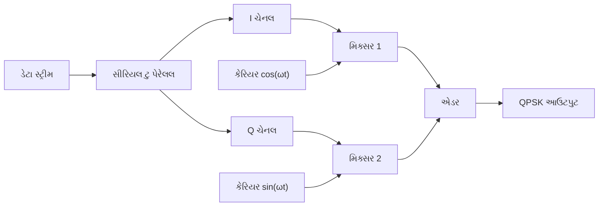

**કોન્સ્ટેલેશન ડાયાગ્રામ:**

```goat
        Q
        |
   01   |   00
  (-1,1)| (1,1)
        |
  ------+------ I
        |
  (-1,-1)|(1,-1)
   11   |   10
        |
```

**QPSK ડિ-મોડ્યુલેટર:**

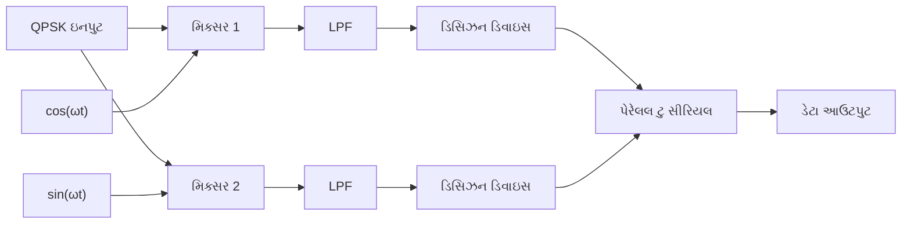

**ફાયદાઓ:**

- **બેન્ડવિડ્થ એફિશિયન્ટ**: પ્રતિ સિમ્બોલ 2 બિટ્સ
- **સારી નોઇઝ પર્ફોર્મન્સ**: કોન્સ્ટન્ટ એન્વેલોપ
- **વ્યાપક ઉપયોગ**: ડિજિટલ કોમ્યુનિકેશનમાં સ્ટાન્ડર્ડ

**ઉપયોગો:**

- સેટેલાઇટ કોમ્યુનિકેશન
- ડિજિટલ TV બ્રોડકાસ્ટિંગ
- વાયરલેસ કોમ્યુનિકેશન સિસ્ટમ્સ

**યાદગાર વાક્ય:** "QPSK - ક્વાડ્રેચર ફેઝ, 2 બિટ્સ, 4 ફેઝ"

## પ્રશ્ન 3(અ) [3 ગુણ]

**FSK મોડ્યુલેટરનો બ્લોક ડાયાગ્રામ દોરો**

**જવાબ**:

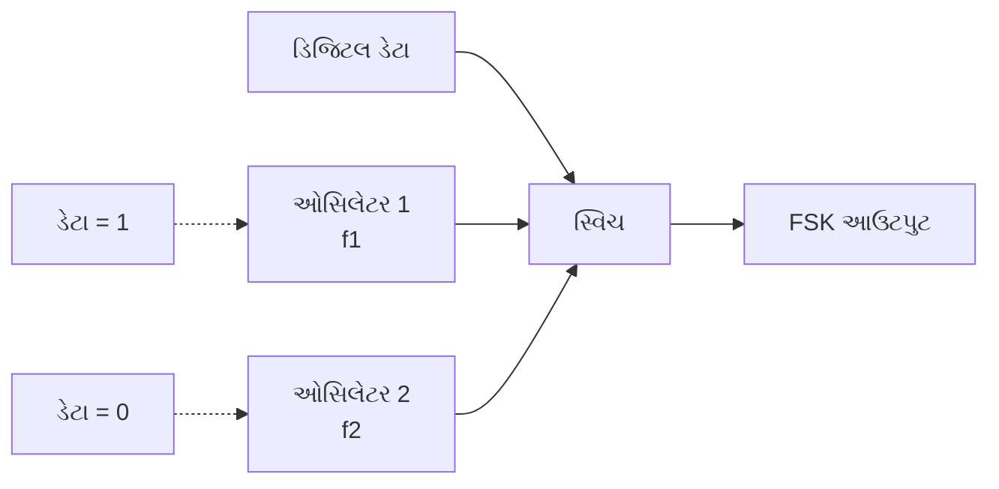

**ઘટકો:**

- **ડિજિટલ ડેટા ઇનપુટ**: બાઇનરી ડેટા સ્ટ્રીમ (0s અને 1s)
- **બે ઓસિલેટર્સ**: બિટ '1' માટે f₁, બિટ '0' માટે f₂
- **ઇલેક્ટ્રોનિક સ્વિચ**: ઇનપુટ બિટના આધારે ફ્રીક્વેન્સી પસંદ કરે છે
- **FSK આઉટપુટ**: ફ્રીક્વેન્સી મોડ્યુલેટેડ સિગ્નલ

**કામગીરી:**

- **બિટ '1'**: સ્વિચ ઓસિલેટર 1 (ઊંચી ફ્રીક્વેન્સી) સાથે જોડાય છે
- **બિટ '0'**: સ્વિચ ઓસિલેટર 2 (નીચી ફ્રીક્વેન્સી) સાથે જોડાય છે
- **આઉટપુટ**: ડેટાના આધારે સતત ફ્રીક્વેન્સી બદલાતી રહે છે

**યાદગાર વાક્ય:** "FSK - ડેટા કીઝના આધારે ફ્રીક્વેન્સી સ્વિચ"

## પ્રશ્ન 3(બ) [4 ગુણ]

**PSK મોડ્યુલેટરનો બ્લોક ડાયાગ્રામ દોરો અને સમજાવો.**

**જવાબ**:

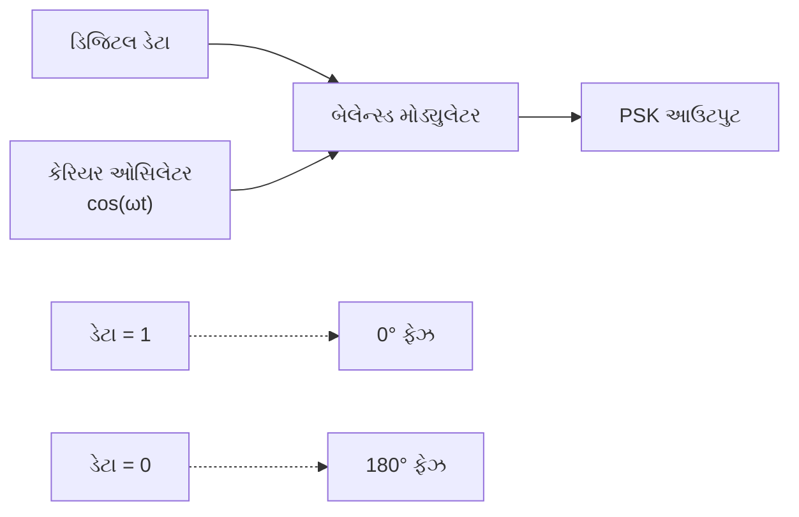

**ઘટકો અને કાર્ય:**

| ઘટક | કાર્ય |
|------|------|
| **ડિજિટલ ડેટા** | બાઇનરી ઇનપુટ સ્ટ્રીમ (0s અને 1s) |
| **કેરિયર ઓસિલેટર** | રેફરન્સ કેરિયર સિગ્નલ બનાવે છે |
| **બેલેન્સ્ડ મોડ્યુલેટર** | ડેટાને કેરિયર સાથે ગુણાકાર કરે છે |
| **PSK આઉટપુટ** | ફેઝ મોડ્યુલેટેડ સિગ્નલ |

**કામગીરી:**

- **ડેટા '1'**: આઉટપુટ = +cos(ωt) (0° ફેઝ)
- **ડેટા '0'**: આઉટપુટ = -cos(ωt) (180° ફેઝ)
- **ફેઝ શિફ્ટ**: '1' અને '0' વચ્ચે 180° તફાવત

**ગાણિતિક અભિવ્યક્તિ:**

- PSK સિગ્નલ: s(t) = A·d(t)·cos(ωt)
- જ્યાં d(t) = '1' માટે +1, '0' માટે -1

**ફાયદાઓ:**

- **કોન્સ્ટન્ટ એન્વેલોપ**: બહેતર નોઇઝ ઇમ્યુનિટી
- **બેન્ડવિડ્થ એફિશિયન્ટ**: ASK જેટલું જ બેન્ડવિડ્થ લે છે
- **સરળ ડિટેક્શન**: કોહેરન્ટ ડિટેક્શન જરૂરી

**યાદગાર વાક્ય:** "PSK - બેલેન્સ્ડ મોડ્યુલેટર કીનો ઉપયોગ કરીને ફેઝ શિફ્ટ"

## પ્રશ્ન 3(ક) [7 ગુણ]

**ASK મોડ્યુલેટર અને ડિ-મોડ્યુલેટરના બ્લોક ડાયાગ્રામને વેવફોર્મ સાથે સમજાવો.**

**જવાબ**:

**ASK મોડ્યુલેટર:**

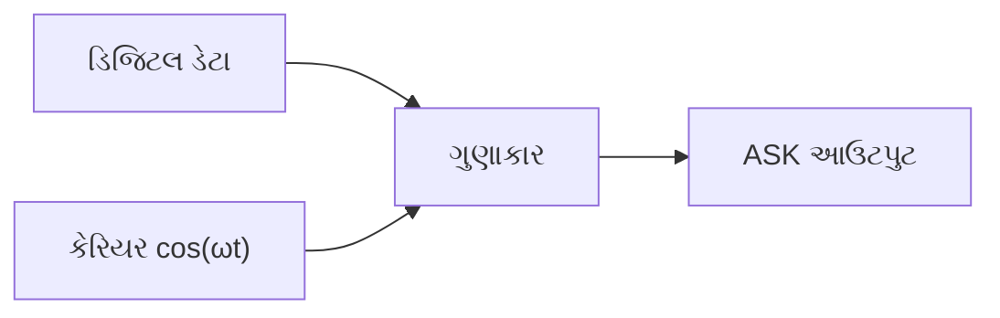

**ASK ડિ-મોડ્યુલેટર:**

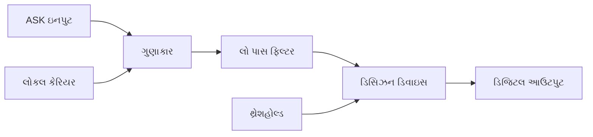

**વેવફોર્મ્સ:**

```goat
Digital Data:
    1    0    1    1    0
   ___       ___  ___      
  |   |     |   ||   |     
__|   |_____|   ||   |_____

Carrier Signal:
  ∩   ∩   ∩   ∩   ∩   ∩
 ∩ ∩ ∩ ∩ ∩ ∩ ∩ ∩ ∩ ∩ ∩ ∩
∩   ∩   ∩   ∩   ∩   ∩   ∩

ASK Output:
  ∩∩∩     ∩∩∩ ∩∩∩    
 ∩   ∩   ∩   ∩   ∩   
∩     ∩ ∩     ∩   ∩  
```

**મોડ્યુલેશન પ્રક્રિયા:**

| ડેટા બિટ | કેરિયર | ASK આઉટપુટ |
|----------|--------|------------|
| **'1'** | A·cos(ωt) | A·cos(ωt) |
| **'0'** | A·cos(ωt) | 0 |

**ડિ-મોડ્યુલેશન પ્રક્રિયા:**

1. **ગુણાકાર**: ASK સિગ્નલ × લોકલ કેરિયર
2. **લો પાસ ફિલ્ટરિંગ**: ઊંચી ફ્રીક્વેન્સી ઘટકો દૂર કરો
3. **ડિસિઝન**: થ્રેશહોલ્ડ સાથે સરખાવીને ડેટા પુનઃપ્રાપ્ત કરો

**ઉપયોગો:**

- **ઓપ્ટિકલ કોમ્યુનિકેશન**: LED/લેઝર ઓન-ઓફ કીઇંગ
- **સરળ રેડિયો સિસ્ટમ્સ**: AM રેડિયો મોડિફિકેશન
- **શોર્ટ રેન્જ કોમ્યુનિકેશન**: IR રિમોટ કન્ટ્રોલ્સ

**ફાયદાઓ/નુકસાનો:**

| ફાયદાઓ | નુકસાનો |
|---------|----------|
| સરળ અમલીકરણ | નબળી નોઇઝ પર્ફોર્મન્સ |
| ઓછી કિંમત | બેન્ડવિડ્થ અકુશળ |
| સરળ ડિટેક્શન | ફેડિંગ માટે સંવેદનશીલ |

**યાદગાર વાક્ય:** "ASK - એમ્પ્લિટ્યુડ સ્વિચ, ગુણાકાર અને ફિલ્ટર કી"

## પ્રશ્ન 3(અ અથવા) [3 ગુણ]

**MSK નો સિદ્ધાંત લખો અને કોન્સ્ટેલેશન ડાયાગ્રામ દોરો.**

**જવાબ**:

**MSK સિદ્ધાંત:**
MSK (Minimum Shift Keying) એ સતત-ફેઝ FSK નું એક સ્વરૂપ છે જ્યાં ફ્રીક્વેન્સી ડેવિએશન બરાબર બિટ રેટનો અડધો છે.

**મુખ્ય ગુણધર્મો:**

- **સતત ફેઝ**: કોઈ ફેઝ અસાતત્યતા નથી
- **ન્યૂનતમ ફ્રીક્વેન્સી વિભાજન**: Δf = Rb/2
- **કોન્સ્ટન્ટ એન્વેલોપ**: નોનલીનિયર એમ્પ્લિફાયર્સ માટે સારું

**કોન્સ્ટેલેશન ડાયાગ્રામ:**

```goat
        Q
        |
        ●  (I=0, Q=1)
        |
   ●----+----●  I
        |
        ●  (I=0, Q=-1)
        |
        
Points rotate continuously
between ±1 on I and Q axes
```

**ગાણિતિક રજૂઆત:**

- **બિટ '1'**: f₁ = fc + Rb/4
- **બિટ '0'**: f₂ = fc - Rb/4
- **ફ્રીક્વેન્સી ડેવિએશન**: Δf = Rb/2

**લાક્ષણિકતાઓ:**

- **સ્પેક્ટ્રલ એફિશિયન્સી**: પરંપરાગત FSK કરતાં બહેતર
- **સતત ફેઝ**: આઉટ-ઓફ-બેન્ડ રેડિએશન ઘટાડે છે
- **ઓર્થોગોનલ ડિટેક્શન**: OQPSK તરીકે ડિટેક્ટ કરી શકાય છે

**યાદગાર વાક્ય:** "MSK - મિનિમમ શિફ્ટ, સતત ફેઝ કી"

## પ્રશ્ન 3(બ અથવા) [4 ગુણ]

**16-QAM નો કોન્સ્ટેલેશન ડાયાગ્રામ દોરો અને સમજાવો**

**જવાબ**:

**16-QAM કોન્સ્ટેલેશન:**

```goat
           Q
           |
     ●  ●  |  ●  ●
           |
     ●  ● -3-1 1 3 ● I
           |
     ●  ●  |  ●  ●
           |
     ●  ●  |  ●  ●
           |
```

**16-QAM મેપિંગ ટેબલ:**

| બિટ્સ | I | Q | એમ્પ્લિટ્યુડ | ફેઝ |
|------|---|---|-----------|------|
| 0000 | -3 | -3 | √18 | 225° |
| 0001 | -3 | -1 | √10 | 198.4° |
| 0010 | -3 | +1 | √10 | 161.6° |
| 0011 | -3 | +3 | √18 | 135° |
| 0100 | -1 | -3 | √10 | 251.6° |
| 0101 | -1 | -1 | √2 | 225° |
| ... | ... | ... | ... | ... |

**મુખ્ય લાક્ષણિકતાઓ:**

- **16 સિમ્બોલ પોઇન્ટ્સ**: પ્રતિ સિમ્બોલ 4 બિટ્સ
- **ગ્રે કોડિંગ**: નજીકના સિમ્બોલ્સ 1 બિટથી અલગ પડે છે
- **વેરિયેબલ એમ્પ્લિટ્યુડ**: અલગ પાવર લેવલ્સ
- **ઊંચો ડેટા રેટ**: QPSK કરતાં 4 ગણો ડેટા રેટ

**સિગ્નલ રજૂઆત:**
s(t) = I(t)·cos(ωt) - Q(t)·sin(ωt)

**ઉપયોગો:**

- **ડિજિટલ કેબલ TV**: ઊંચો ડેટા રેટ ટ્રાન્સમિશન
- **માઇક્રોવેવ લિંક્સ**: પોઇન્ટ-ટુ-પોઇન્ટ કોમ્યુનિકેશન
- **WiFi સિસ્ટમ્સ**: 802.11 સ્ટાન્ડર્ડ્સ

**ફાયદાઓ:**

- **ઊંચી સ્પેક્ટ્રલ એફિશિયન્સી**: પ્રતિ સિમ્બોલ 4 બિટ્સ
- **સારી BER પર્ફોર્મન્સ**: યોગ્ય કોડિંગ સાથે
- **લવચીક અમલીકરણ**: સોફ્ટવેર ડિફાઇન્ડ રેડિયો

**ટ્રેડ-ઓફ્સ:**

- **ઊંચી જટિલતા**: QPSK કરતાં વધુ જટિલ
- **પાવર વેરીએશન**: લીનિયર એમ્પ્લિફાયર્સ જરૂરી
- **નોઇઝ સેન્સિટિવિટી**: કોન્સ્ટન્ટ એન્વેલોપ સ્કીમ્સ કરતાં ઊંચી

**યાદગાર વાક્ય:** "16-QAM - 16 પોઇન્ટ્સ, 4 બિટ્સ, ક્વાડ્રેચર એમ્પ્લિટ્યુડ મોડ્યુલેશન"

## પ્રશ્ન 3(ક અથવા) [7 ગુણ]

**ડિજિટલ મોડ્યુલેશન ટેકનિક્સ-ASK, FSK, PSK, QPSK,8-PSK, MSK અને 16-QAM માટે બિટ્સ પર સિમ્બોલની સરખામણી કરો**

**જવાબ**:

**બિટ્સ પર સિમ્બોલ સરખામણી:**

| મોડ્યુલેશન | બિટ્સ પર સિમ્બોલ | સિમ્બોલ રેટ | ડેટા રેટ સંબંધ |
|------------|----------------|-------------|-----------------|
| **ASK** | 1 | Rs = Rb | Rb = Rs × 1 |
| **FSK** | 1 | Rs = Rb | Rb = Rs × 1 |
| **PSK (BPSK)** | 1 | Rs = Rb | Rb = Rs × 1 |
| **QPSK** | 2 | Rs = Rb/2 | Rb = Rs × 2 |
| **8-PSK** | 3 | Rs = Rb/3 | Rb = Rs × 3 |
| **MSK** | 1 | Rs = Rb | Rb = Rs × 1 |
| **16-QAM** | 4 | Rs = Rb/4 | Rb = Rs × 4 |

**વિગતવાર વિશ્લેષણ:**


**બેન્ડવિડ્થ એફિશિયન્સી:**

| મોડ્યુલેશન | M | બિટ્સ/સિમ્બોલ | બેન્ડવિડ્થ એફિશિયન્સી |
|------------|---|-------------|---------------------|
| ASK, FSK, PSK | 2 | 1 | 1 bit/s/Hz |
| QPSK | 4 | 2 | 2 bits/s/Hz |
| 8-PSK | 8 | 3 | 3 bits/s/Hz |
| 16-QAM | 16 | 4 | 4 bits/s/Hz |

**પાવર આવશ્યકતાઓ:**

| મોડ્યુલેશન | સંબંધિત પાવર | BER પર્ફોર્મન્સ |
|------------|-------------|-----------------|
| **PSK** | રેફરન્સ | શ્રેષ્ઠ |
| **ASK** | +3dB પેનલ્ટી | નબળી |
| **FSK** | PSK જેટલી | સારી |
| **QPSK** | PSK જેટલી | PSK જેટલી |
| **8-PSK** | +2.5dB પેનલ્ટી | મધ્યમ |
| **16-QAM** | +4dB પેનલ્ટી | કોડિંગ સાથે સારી |

**ટ્રેડ-ઓફ્સ:**

- **ઊંચો M**: વધુ બિટ્સ પર સિમ્બોલ પરંતુ ઊંચી જટિલતા
- **બેન્ડવિડ્થ વિ પાવર**: સ્પેક્ટ્રલ અને પાવર એફિશિયન્સી વચ્ચે ટ્રેડ-ઓફ
- **અમલીકરણ**: ઊંચા ઓર્ડરના મોડ્યુલેશનને બહેતર હાર્ડવેર જોઈએ છે

**ઉપયોગો:**

- **નીચો રેટ**: સરળ સિસ્ટમ્સ માટે ASK, FSK, PSK
- **મધ્યમ રેટ**: સંતુલિત પર્ફોર્મન્સ માટે QPSK
- **ઊંચો રેટ**: હાઇ-સ્પીડ સિસ્ટમ્સ માટે 8-PSK, 16-QAM

**સૂત્ર:**
બિટ્સ પર સિમ્બોલ = log₂(M), જ્યાં M = સિમ્બોલ્સની સંખ્યા

**યાદગાર વાક્ય:** "વધુ સિમ્બોલ્સ, વધુ બિટ્સ, વધુ જટિલતા"

## પ્રશ્ન 4(અ) [3 ગુણ]

**સંભાવનાની વ્યાખ્યા કરો અને કોમ્યુનિકેશનમાં તેનું મહત્વ લખો**

**જવાબ**:

**સંભાવનાની વ્યાખ્યા:**
સંભાવના એ કોઈ ઘટના બનવાની શક્યતાનું માપ છે, જે 0 અને 1 વચ્ચેની સંખ્યા તરીકે દર્શાવવામાં આવે છે.

P(ઘટના) = અનુકૂળ પરિણામોની સંખ્યા / કુલ શક્ય પરિણામોની સંખ્યા

**કોમ્યુનિકેશનમાં મહત્વ:**

| ઉપયોગ | મહત્વ |
|-------|------|
| **એરર વિશ્લેષણ** | બિટ એરર રેટ (BER) ની ગણતરી |
| **ચેનલ મોડેલિંગ** | નોઇઝ અને ફેડિંગ આંકડાશાસ્ત્ર |
| **કોડિંગ થિયરી** | એરર કરેક્શન સંભાવના |
| **સિગ્નલ ડિટેક્શન** | ડિટેક્શન અને ફોલ્સ એલાર્મ રેટ્સ |

**મુખ્ય ઉપયોગો:**

- **BER ગણતરી**: P(error) = Q(√(2Eb/N0))
- **ચેનલ કેપેસિટી**: શેનોનનું થિયરમ સંભાવનાનો ઉપયોગ કરે છે
- **ઇન્ફોર્મેશન થિયરી**: એન્ટ્રહોપી સંભાવના પર આધારિત છે
- **સિસ્ટમ ડિઝાઇન**: પર્ફોર્મન્સ પૂર્વાનુમાન

**ગાણિતિક સાધનો:**

- **ગૌસિયન ડિસ્ટ્રિબ્યુશન**: નોઇઝ વિશ્લેષણ માટે
- **રેલે ડિસ્ટ્રિબ્યુશન**: ફેડિંગ ચેનલ્સ માટે
- **પોઇસન ડિસ્ટ્રિબ્યુશન**: આગમન પ્રક્રિયાઓ માટે

**યાદગાર વાક્ય:** "સંભાવના કોમ્યુનિકેશન સિસ્ટમ્સમાં પર્ફોર્મન્સની આગાહી કરે છે"

## પ્રશ્ન 4(બ) [4 ગુણ]

**હફમેન કોડ યોગ્ય દાખલા સાથે સમજાવો**

**જવાબ**:

**હફમેન કોડિંગ સિદ્ધાંત:**
વેરિએબલ લેન્થ કોડિંગ જ્યાં વારંવાર આવતા સિમ્બોલ્સને ટૂંકા કોડ મળે છે.

**એલ્ગોરિધમ:**

1. સંભાવનાઓ સાથે સિમ્બોલ્સની યાદી બનાવો
2. બે સૌથી ઓછી સંભાવના વાળા સિમ્બોલ્સને જોડો
3. જ્યાં સુધી એક સિમ્બોલ બાકી ન રહે ત્યાં સુધી પુનરાવર્તન કરો
4. કોડ આપો: ડાબે = 0, જમણે = 1

**ઉદાહરણ:**

| સિમ્બોલ | સંભાવના | હફમેન કોડ |
|--------|---------|-----------|
| A | 0.4 | 0 |
| B | 0.3 | 10 |
| C | 0.2 | 110 |
| D | 0.1 | 111 |

**હફમેન ટ્રી નિર્માણ:**

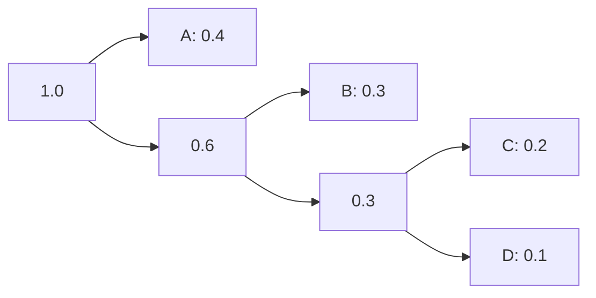

**કોડ એસાઇનમેન્ટ:**

- **A**: 0 (1 બિટ)
- **B**: 10 (2 બિટ)  
- **C**: 110 (3 બિટ)
- **D**: 111 (3 બિટ)

**એવરેજ કોડ લેન્થ:**
L = 0.4×1 + 0.3×2 + 0.2×3 + 0.1×3 = 1.9 બિટ્સ/સિમ્બોલ

**ફાયદાઓ:**

- **ઓપ્ટિમલ**: ન્યૂનતમ એવરેજ કોડ લેન્થ
- **પ્રીફિક્સ પ્રોપર્ટી**: કોઈ કોડ બીજાનો પ્રીફિક્સ નથી
- **એફિશિયન્ટ**: ટ્રાન્સમિશન બેન્ડવિડ્થ ઘટાડે છે

**યાદગાર વાક્ય:** "હફમેન - વારંવાર આવતા સિમ્બોલ્સને ટૂંકા કોડ"

## પ્રશ્ન 4(ક) [7 ગુણ]

**ઇન્ટરનેટ ઓફ થિંગ્સ (IoT) નો ખ્યાલ અને મુખ્ય લક્ષણો સમજાવો.**

**જવાબ**:

**IoT ખ્યાલ:**
ઇન્ટરનેટ ઓફ થિંગ્સ એ સેન્સર્સ, સોફ્ટવેર અને કનેક્ટિવિટી સાથે એમ્બેડેડ ભૌતિક ઉપકરણોનું નેટવર્ક છે જે ડેટા એકત્રિત કરવા અને વિનિમય કરવા માટે છે.

**IoT આર્કિટેક્ચર:**

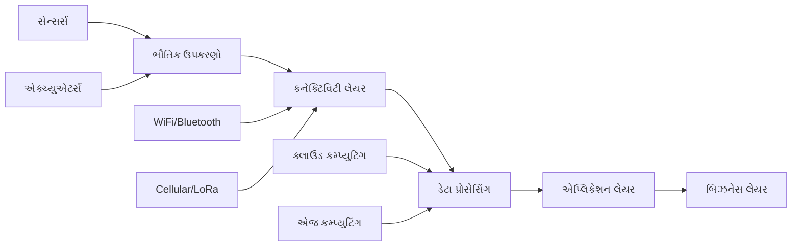

**મુખ્ય લક્ષણો:**

| લક્ષણ | વર્ણન | ઉદાહરણ |
|------|-------|---------|
| **કનેક્ટિવિટી** | ઉપકરણો ઇન્ટરનેટ સાથે જોડાયેલા | WiFi, 4G, 5G |
| **બુદ્ધિમત્તા** | સ્માર્ટ નિર્ણય લેવા | AI અલ્ગોરિધમ્સ |
| **સેન્સિંગ** | પર્યાવરણમાંથી ડેટા એકત્રીકરણ | તાપમાન, ભેજ |
| **એક્ચ્યુએશન** | ભૌતિક પ્રક્રિયાઓનું નિયંત્રણ | મોટર્સ, વાલ્વ્સ |
| **ઇન્ટરઓપરેબિલિટી** | ઉપકરણો સાથે મળીને કાર્ય | સ્ટાન્ડર્ડ પ્રોટોકોલ્સ |

**IoT પ્રોટોકોલ સ્ટેક:**

| લેયર | પ્રોટોકોલ્સ | કાર્ય |
|------|-----------|------|
| **એપ્લિકેશન** | HTTP, CoAP, MQTT | ડેટા વિનિમય |
| **ટ્રાન્સપોર્ટ** | TCP, UDP | વિશ્વસનીય ટ્રાન્સમિશન |
| **નેટવર્ક** | IPv6, 6LoWPAN | રાઉટિંગ |
| **ભૌતિક** | WiFi, ZigBee, LoRa | કનેક્ટિવિટી |

**ઉપયોગો:**

- **સ્માર્ટ હોમ**: સ્વચાલિત લાઇટિંગ, સિક્યોરિટી
- **ઇન્ડસ્ટ્રિયલ IoT**: મેન્યુફેક્ચરિંગ ઓટોમેશન
- **આરોગ્યસેવા**: દૂરસ્થ પેશન્ટ મોનિટરિંગ
- **સ્માર્ટ સિટીઝ**: ટ્રાફિક મેનેજમેન્ટ, યુટિલિટીઝ

**પડકારો:**

- **સિક્યોરિટી**: ઉપકરણની નબળાઈઓ, ડેટા પ્રાઇવેસી
- **સ્કેલેબિલિટી**: અબજો ઉપકરણો
- **ઇન્ટરઓપરેબિલિટી**: અલગ અલગ સ્ટાન્ડર્ડ્સ
- **પાવર કન્ઝમ્પશન**: બેટરી ચાલિત ઉપકરણો

**ફાયદાઓ:**

- **ઓટોમેશન**: માનવ હસ્તક્ષેપ ઘટાડો
- **એફિશિયન્સી**: સંસાધનોનો શ્રેષ્ઠ ઉપયોગ
- **રીઅલ-ટાઇમ મોનિટરિંગ**: તાત્કાલિક ડેટા ઍક્સેસ
- **કોસ્ટ રિડક્શન**: પ્રિડિક્ટિવ મેઇન્ટેનન્સ

**ટેકનોલોજીઓ:**

- **કોમ્યુનિકેશન**: WiFi, Bluetooth, Cellular, LoRa
- **પ્રોસેસિંગ**: એજ કમ્પ્યુટિંગ, ક્લાઉડ કમ્પ્યુટિંગ
- **એનાલિટિક્સ**: બિગ ડેટા, મશીન લર્નિંગ
- **સિક્યોરિટી**: એન્ક્રિપ્શન, ઓથેન્ટિકેશન

**યાદગાર વાક્ય:** "IoT - ઇન્ટરનેટ ઓફ થિંગ્સ, સ્માર્ટ કનેક્ટેડ ઉપકરણો સર્વત્ર"

## પ્રશ્ન 4(અ અથવા) [3 ગુણ]

**એરર કરેક્શન કોડની વ્યાખ્યા કરો અને સામાન્ય એરર કરેક્ટિંગ કોડની યાદી આપો.**

**જવાબ**:

**એરર કરેક્શન કોડ વ્યાખ્યા:**
એરર કરેક્શન કોડ એ એવી તકનીકો છે જે ટ્રાન્સમિશન એરર્સને સ્વચાલિત રીતે શોધવા અને સુધારવા માટે ડેટામાં રિડન્ડન્ટ બિટ્સ ઉમેરે છે.

**સામાન્ય એરર કરેક્ટિંગ કોડઝ:**

| કોડનો પ્રકાર | વર્ણન | ક્ષમતા |
|------------|--------|-------|
| **હેમિંગ કોડ** | સિંગલ એરર કરેક્શન | 1-બિટ એરર સુધારે છે |
| **રીડ-સોલોમન** | બર્સ્ટ એરર્સ માટે બ્લોક કોડ | મલ્ટિપલ એરર્સ સુધારે છે |
| **BCH કોડ** | બાઇનરી સાયક્લિક કોડ | t એરર્સ સુધારે છે |
| **કોન્વોલ્યુશનલ કોડ** | સતત એન્કોડિંગ | નોઇઝી ચેનલ્સ માટે સારું |
| **ટર્બો કોડ** | ઇટરેટિવ ડિકોડિંગ | શેનોન લિમિટની નજીક |
| **LDPC કોડ** | લો ડેન્સિટી પેરિટી ચેક | શ્રેષ્ઠ પર્ફોર્મન્સ |

**ઉપયોગો:**

- **મેમરી સિસ્ટમ્સ**: ECC RAM
- **સ્ટોરેજ ડિવાઇસેસ**: હાર્ડ ડ્રાઇવ્સ, CDs
- **કોમ્યુનિકેશન**: સેટેલાઇટ, સેલ્યુલર
- **બ્રોડકાસ્ટિંગ**: ડિજિટલ TV, રેડિયો

**યાદગાર વાક્ય:** "એરર કરેક્શન કોડઝ - હેમિંગ રીડ BCH કોન્વોલ્યુશનલ ટર્બો LDPC"

## પ્રશ્ન 4(બ અથવા) [4 ગુણ]

**શેનોન ફેનો કોડ યોગ્ય દાખલા સાથે સમજાવો**

**જવાબ**:

**શેનોન-ફેનો કોડિંગ એલ્ગોરિધમ:**
ટોપ-ડાઉન અપ્રોચ જે સિમ્બોલ્સને લગભગ સમાન સંભાવનાઓ ધરાવતા બે જૂથોમાં વિભાજિત કરે છે.

**એલ્ગોરિધમ સ્ટેપ્સ:**

1. સિમ્બોલ્સને ઘટતા સંભાવના ક્રમમાં ગોઠવો
2. લગભગ સમાન કુલ સંભાવના સાથે બે જૂથોમાં વિભાજિત કરો
3. પહેલા જૂથને '0', બીજા જૂથને '1' આપો
4. દરેક સબગ્રુપ માટે પુનરાવર્તન કરો

**ઉદાહરણ:**

| સિમ્બોલ | સંભાવના | શેનોન-ફેનો કોડ |
|--------|---------|----------------|
| A | 0.4 | 00 |
| B | 0.3 | 01 |
| C | 0.2 | 10 |
| D | 0.1 | 11 |

**કન્સ્ટ્રક્શન ટ્રી:**

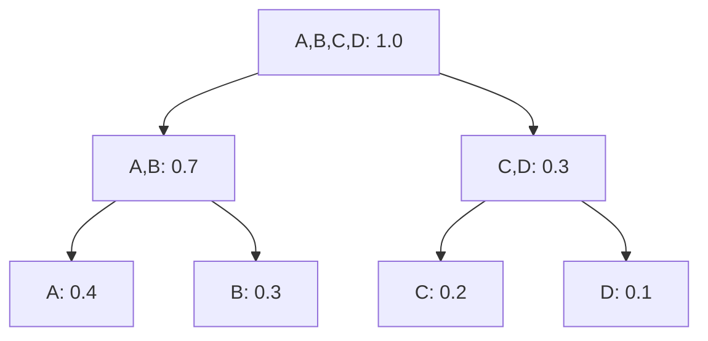

**કોડ એસાઇનમેન્ટ:**

- જૂથ 1 (A,B): કોડ '0' થી શરૂ થાય છે
- જૂથ 2 (C,D): કોડ '1' થી શરૂ થાય છે
- A: 00, B: 01, C: 10, D: 11

**હફમેન સાથે સરખામણી:**

- **શેનોન-ફેનો**: ટોપ-ડાઉન અપ્રોચ
- **હફમેન**: બોટમ-અપ અપ્રોચ
- **હફમેન**: હંમેશા ઓપ્ટિમલ
- **શેનોન-ફેનો**: ઓપ્ટિમલ ન પણ હોય

**એવરેજ કોડ લેન્થ:**
L = 0.4×2 + 0.3×2 + 0.2×2 + 0.1×2 = 2.0 બિટ્સ/સિમ્બોલ

**યાદગાર વાક્ય:** "શેનોન-ફેનો - જૂથો વિભાજિત કરો, ટોપ-ડાઉન કોડ આપો"

## પ્રશ્ન 4(ક અથવા) [7 ગુણ]

**ઓડિયો સિગ્નલના વિવિધ પ્રમાણભૂત ફોર્મેટ્સ સમજાવો.**

**જવાબ**:

**ઓડિયો સિગ્નલ ફોર્મેટ્સ:**

| ફોર્મેટ | પૂરું નામ | કોમ્પ્રેશન | ગુણવત્તા | ફાઇલ સાઇઝ |
|--------|-----------|------------|--------|-----------|
| **WAV** | Waveform Audio File | અનકોમ્પ્રેસ્ડ | સૌથી ઊંચી | સૌથી મોટી |
| **MP3** | MPEG Layer 3 | લોસી | સારી | નાની |
| **AAC** | Advanced Audio Coding | લોસી | MP3 કરતાં બહેતર | નાની |
| **FLAC** | Free Lossless Audio Codec | લોસલેસ | મૂળ | મધ્યમ |
| **OGG** | Ogg Vorbis | લોસી | સારી | નાની |

**ઓડિયો પેરામીટર્સ:**

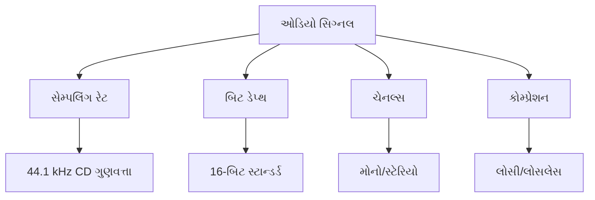

**સેમ્પલિંગ સ્ટાન્ડર્ડ્સ:**

| સ્ટાન્ડર્ડ | સેમ્પલિંગ રેટ | બિટ ડેપ્થ | ઉપયોગ |
|---------|--------------|-----------|------|
| **CD ગુણવત્તા** | 44.1 kHz | 16-બિટ | કન્ઝ્યુમર ઓડિયો |
| **સ્ટુડિયો ગુણવત્તા** | 48 kHz | 24-બિટ | પ્રોફેશનલ રેકોર્ડિંગ |
| **હાઇ રેઝોલ્યુશન** | 96 kHz | 24-બિટ | ઓડિયોફાઇલ |
| **ટેલિફોન** | 8 kHz | 8-બિટ | વૉઇસ કોમ્યુનિકેશન |

**કોમ્પ્રેશનના પ્રકારો:**

- **લોસલેસ**: મૂળ ગુણવત્તા સાચવાય છે (FLAC, ALAC)
- **લોસી**: નાની સાઇઝ માટે કંઈક ગુણવત્તા ગુમાવાય છે (MP3, AAC)
- **અનકોમ્પ્રેસ્ડ**: કોઈ કોમ્પ્રેશન નથી (WAV, AIFF)

**ઉપયોગો:**

- **બ્રોડકાસ્ટિંગ**: ડિજિટલ રેડિયો માટે AAC
- **સ્ટ્રીમિંગ**: ઇન્ટરનેટ માટે MP3, AAC
- **પ્રોફેશનલ**: સ્ટુડિયો માટે WAV, FLAC
- **મોબાઇલ**: સ્માર્ટફોન માટે AAC

**ફાઇલ સાઇઝ સરખામણી (3-મિનિટ ગીત):**

- **WAV**: 30 MB
- **FLAC**: 20 MB
- **MP3**: 3 MB
- **AAC**: 2.5 MB

**ગુણવત્તા વિ સાઇઝ ટ્રેડ-ઓફ:**

- **સૌથી ઊંચી ગુણવત્તા**: WAV (અનકોમ્પ્રેસ્ડ)
- **શ્રેષ્ઠ સંતુલન**: AAC (લોસી કોમ્પ્રેસ્ડ)
- **સૌથી નાની સાઇઝ**: લો બિટરેટ MP3
- **લોસલેસ કોમ્પ્રેસ્ડ**: FLAC

**યાદગાર વાક્ય:** "WAV MP3 AAC FLAC - વેવ, લેયર3, એડવાન્સ્ડ, ફ્રી લોસલેસ"

## પ્રશ્ન 5(અ) [3 ગુણ]

**E1 કેરિયર મલ્ટિપ્લેક્સિંગ હાયરાર્કી સમજાવો.**

**જવાબ**:

**E1 કેરિયર સિસ્ટમ:**
વૉઇસ ચેનલ્સને મલ્ટિપ્લેક્સ કરવા માટેનું યુરોપીયન ડિજિટલ ટ્રાન્સમિશન સ્ટાન્ડર્ડ.

**E1 હાયરાર્કી:**

| લેવલ | નામ | બિટ રેટ | વૉઇસ ચેનલ્સ | મલ્ટિપ્લેક્સિંગ |
|------|-----|---------|-------------|--------------|
| **E0** | બેઝિક ચેનલ | 64 kbps | 1 | - |
| **E1** | પ્રાઇમરી રેટ | 2.048 Mbps | 30 | 30 × E0 + 2 |
| **E2** | સેકન્ડરી રેટ | 8.448 Mbps | 120 | 4 × E1 |
| **E3** | ટર્શિયરી રેટ | 34.368 Mbps | 480 | 4 × E2 |
| **E4** | ક્વેટર્નરી રેટ | 139.264 Mbps | 1920 | 4 × E3 |

**E1 ફ્રેમ સ્ટ્રક્ચર:**

```goat
Frame (125 μs, 256 bits)
|TS0|TS1|TS2|...|TS15|TS16|TS17|...|TS31|
 32 time slots × 8 bits = 256 bits

TS0: Synchronization + Alarm
TS16: Signaling (voice channels)
TS1-15, 17-31: 30 voice channels
```

**મલ્ટિપ્લેક્સિંગ પ્રક્રિયા:**

- **લેવલ 1**: 30 વૉઇસ ચેનલ્સ + 2 કન્ટ્રોલ → E1
- **લેવલ 2**: 4 E1 સ્ટ્રીમ્સ → E2
- **લેવલ 3**: 4 E2 સ્ટ્રીમ્સ → E3
- **લેવલ 4**: 4 E3 સ્ટ્રીમ્સ → E4

**ઉપયોગો:**

- **ISDN**: પ્રાઇમરી રેટ ઇન્ટરફેસ
- **સેલ્યુલર**: બેઝ સ્ટેશન કનેક્ટિવિટી
- **એન્ટરપ્રાઇઝ**: પ્રાઇવેટ બ્રાન્ચ એક્સચેન્જ (PBX)
- **ઇન્ટરનેટ**: ડિજિટલ સબ્સ્ક્રાઇબર લાઇન (DSL)

**યાદગાર વાક્ય:** "E1 - 30 અવાજો, 2.048 Mbps, યુરોપીયન સ્ટાન્ડર્ડ"

## પ્રશ્ન 5(બ) [4 ગુણ]

**TDMA સાથે FDMA ની સરખામણી કરો.**

**જવાબ**:

**FDMA વિ TDMA સરખામણી:**

| પેરામીટર | FDMA | TDMA |
|---------|------|------|
| **પૂરું નામ** | Frequency Division Multiple Access | Time Division Multiple Access |
| **ડોમેન** | ફ્રીક્વેન્સી | સમય |
| **ચેનલ એલોકેશન** | દરેક યુઝરને અલગ ફ્રીક્વેન્સી મળે છે | દરેક યુઝરને અલગ ટાઇમ સ્લોટ મળે છે |
| **યુઝર દીઠ બેન્ડવિડ્થ** | સતત સાંકડી બેન્ડવિડ્થ | ટૂંકા સમય માટે સંપૂર્ણ બેન્ડવિડ્થ |
| **ગાર્ડ બેન્ડ્સ** | ફ્રીક્વેન્સીઝ વચ્ચે જરૂરી | જરૂરી નથી |
| **સિંક્રોનાઇઝેશન** | મહત્વપૂર્ણ નથી | મહત્વપૂર્ણ છે |
| **લવચીકતા** | ઓછી લવચીક | વધુ લવચીક |
| **હેન્ડઓફ** | સરળ | જટિલ |
| **નીયર-ફાર ઇફેક્ટ** | ઓછી સમસ્યાજનક | વધુ સમસ્યાજનક |

**FDMA સિસ્ટમ:**

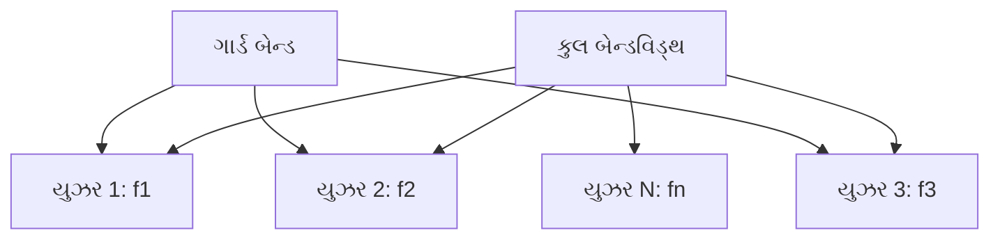

**TDMA સિસ્ટમ:**

```mermaid
gantt
    title TDMA ટાઇમ સ્લોટ્સ
    dateFormat X
    axisFormat %s
    
    section ફ્રેમ
    યુઝર 1 :done, u1, 0, 1
    યુઝર 2 :done, u2, 1, 2
    યુઝર 3 :done, u3, 2, 3
    યુઝર 4 :done, u4, 3, 4
```

**ફાયદાઓ/નુકસાનો:**

| FDMA ફાયદાઓ | FDMA નુકસાનો |
|-------------|-------------|
| સરળ અમલીકરણ | ગાર્ડ બેન્ડ્સને કારણે બેન્ડવિડ્થનો વેસ્ટેજ |
| સિંક્રોનાઇઝેશનની જરૂર નથી | ઓછી લવચીક |
| સતત ટ્રાન્સમિશન | વિવિધ રેટ્સ સામાવવાનું મુશ્કેલ |

| TDMA ફાયદાઓ | TDMA નુકસાનો |
|-------------|-------------|
| બેન્ડવિડ્થનો કુશળ ઉપયોગ | જટિલ સિંક્રોનાઇઝેશન |
| લવચીક ડેટા રેટ્સ | બેટરી લાઇફ સમસ્યાઓ (બર્સ્ટ ટ્રાન્સમિશન) |
| યુઝર્સ ઉમેરવા/કાઢવા સરળ | નીયર-ફાર પ્રોબ્લેમ |

**ઉપયોગો:**

- **FDMA**: AMPS (1G), સેટેલાઇટ કોમ્યુનિકેશન
- **TDMA**: GSM (2G), સેટેલાઇટ કોમ્યુનિકેશન

**યાદગાર વાક્ય:** "FDMA ફ્રીક્વેન્સી, TDMA ટાઇમ - મલ્ટિપલ ઍક્સેસ માટે અલગ ડોમેન્સ"

## પ્રશ્ન 5(ક) [7 ગુણ]

**CDMA ટેકનિકને વિગતવાર સમજાવો.**

**CDMA સિદ્ધાંત:**
કોડ ડિવિઝન મલ્ટિપલ ઍક્સેસ મલ્ટિપલ યુઝર્સને યુનિક સ્પ્રેડિંગ કોડ્સનો ઉપયોગ કરીને સમાન ફ્રીક્વેન્સી અને સમય શેર કરવાની મંજૂરી આપે છે.

**CDMA સિસ્ટમ આર્કિટેક્ચર:**

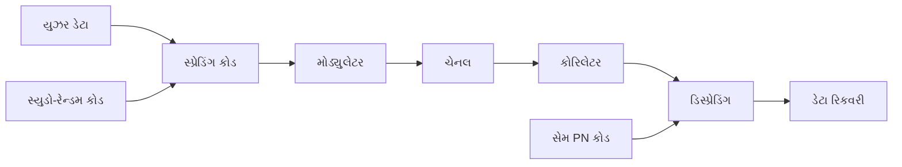

**સ્પ્રેડિંગ પ્રક્રિયા:**

| પેરામીટર | સ્પ્રેડિંગ પહેલાં | સ્પ્રેડિંગ પછી |
|---------|-----------------|----------------|
| **ડેટા રેટ** | Rb | Rb |
| **ચિપ રેટ** | - | Rc (= N × Rb) |
| **બેન્ડવિડ્થ** | Rb | Rc |
| **પ્રોસેસિંગ ગેઇન** | 1 | N = Rc/Rb |

**CDMA ગુણધર્મો:**

```goat
Original Data:    1  0  1
PN Code:         101 010 101
XOR Result:      101 010 101
(Spread Signal)

At Receiver:
Received:        101 010 101
Same PN Code:    101 010 101  
XOR Result:       1   0   1
(Original Data)
```

**મુખ્ય લક્ષણો:**

| લક્ષણ | વર્ણન | ફાયદો |
|------|-------|------|
| **સ્પ્રેડિંગ** | PN કોડ સાથે ડેટા XOR | બેન્ડવિડ્થ વિસ્તરણ |
| **પ્રોસેસિંગ ગેઇન** | Rc/Rb રેશિયો | ઇન્ટરફેરન્સ રિજેક્શન |
| **સોફ્ટ હેન્ડઓફ** | એક સાથે બહુવિધ કનેક્શન્સ | બહેતર ગુણવત્તા |
| **પાવર કન્ટ્રોલ** | ડાયનામિક પાવર એડજસ્ટમેન્ટ | નીયર-ફાર સોલ્યુશન |

**CDMA ફાયદાઓ:**

- **કેપેસિટી**: FDMA/TDMA કરતાં ઊંચી યુઝર કેપેસિટી
- **સિક્યોરિટી**: સ્પ્રેડિંગ કોડથી એન્ક્રિપ્ટેડ
- **સોફ્ટ હેન્ડઓફ**: હેન્ડઓફ દરમિયાન કોલ ડ્રોપિંગ નથી
- **એન્ટી-જેમિંગ**: સ્પ્રેડ સ્પેક્ટ્રમ ઇમ્યુનિટી
- **ફ્રીક્વેન્સી પ્લાનિંગ નથી**: સમાન ફ્રીક્વેન્સી રીયુઝ

**CDMA નુકસાનો:**

- **નીયર-ફાર પ્રોબ્લેમ**: પાવર કન્ટ્રોલ જરૂરી
- **જટિલતા**: FDMA/TDMA કરતાં વધુ જટિલ
- **સેલ્ફ ઇન્ટરફેરન્સ**: યુઝર્સ એકબીજા સાથે ઇન્ટરફેર કરે છે
- **બ્રીધિંગ ઇફેક્ટ**: લોડિંગ સાથે કવરેજ બદલાય છે

**ગાણિતિક વિશ્લેષણ:**

- **પ્રોસેસિંગ ગેઇન**: G = Rc/Rb = 10log₁₀(Rc/Rb) dB
- **કેપેસિટી**: M ≈ 1 + G/(Eb/I₀)
- **BER**: સક્રિય યુઝર્સની સંખ્યા પર આધારિત

**પાવર કન્ટ્રોલ:**

- **ઓપન લૂપ**: પ્રાપ્ત સિગ્નલ સ્ટ્રેન્થના આધારે
- **ક્લોઝ્ડ લૂપ**: બેઝ સ્ટેશન મોબાઇલને કમાન્ડ કરે છે
- **આવશ્યકતા**: ±1 dB ચોકસાઈ જરૂરી

**ઉપયોગો:**

- **IS-95 (cdmaOne)**: 2G CDMA સ્ટાન્ડર્ડ
- **WCDMA**: 3G UMTS સિસ્ટમ
- **GPS**: સેટેલાઇટ નેવિગેશન
- **WiFi**: સ્પ્રેડ સ્પેક્ટ્રમ વિકલ્પ

**PN કોડ ગુણધર્મો:**

- **ઓટોકોરિલેશન**: સિંક્રોનાઇઝ્ડ માટે ઊંચું, અનસિંક્રોનાઇઝ્ડ માટે નીચું
- **ક્રોસ-કોરિલેશન**: અલગ કોડ્સ વચ્ચે નીચું
- **બેલેન્સ**: 1s અને 0s ની સમાન સંખ્યા
- **રન લેન્થ**: સતત બિટ્સનું વિતરણ

**યાદગાર વાક્ય:** "CDMA - કોડ ડિવિઝન, સમાન ફ્રીક્વેન્સી/સમય, મલ્ટિપલ ઍક્સેસ માટે યુનિક કોડ્સ"

## પ્રશ્ન 5(અ અથવા) [3 ગુણ]

**ટાઇમ ડિવિઝન મલ્ટિપ્લેક્સિંગ ટેકનિક (TDM) નો બ્લોક ડાયાગ્રામ દોરો.**

**જવાબ**:

**TDM બ્લોક ડાયાગ્રામ:**

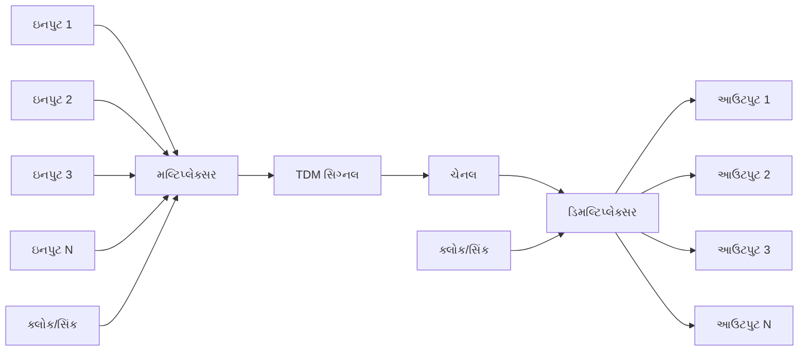

**TDM ફ્રેમ સ્ટ્રક્ચર:**

```goat
|<---- Frame Period T ---->|
|Ch1|Ch2|Ch3|...|ChN|Sync|
 TS1 TS2 TS3     TSN
 
Each time slot = T/N
Frame Rate = 1/T
```

**ઘટકો:**

- **મલ્ટિપ્લેક્સર**: ઇનપુટ્સને અનુક્રમે સેમ્પલ કરે છે
- **ક્લોક/સિંક્રોનાઇઝેશન**: સ્વિચિંગ ટાઇમિંગ કન્ટ્રોલ કરે છે
- **ચેનલ**: ટ્રાન્સમિશન માધ્યમ
- **ડિમલ્ટિપ્લેક્સર**: મલ્ટિપ્લેક્સ્ડ સિગ્નલને અલગ કરે છે

**કામગીરી:**

- દરેક ઇનપુટ ચેનલને ડેડિકેટેડ ટાઇમ સ્લોટ મળે છે
- સેમ્પલિંગ રેટ નાયક્વિસ્ટ માપદંડ સંતોષવો જોઈએ
- રીસીવર પર ફ્રેમ સિંક્રોનાઇઝેશન જરૂરી

**યાદગાર વાક્ય:** "TDM - ટાઇમ ડિવિઝન, સિક્વેન્શિયલ સેમ્પલિંગ, મલ્ટિપ્લેક્સિંગ"

## પ્રશ્ન 5(બ અથવા) [4 ગુણ]

**મલ્ટિપ્લેક્સિંગ ટેકનિકોના વર્ગીકરણ પર ટૂંકી નોંધ લખો.**

**જવાબ**:

**મલ્ટિપ્લેક્સિંગ ટેકનિકોનું વર્ગીકરણ:**

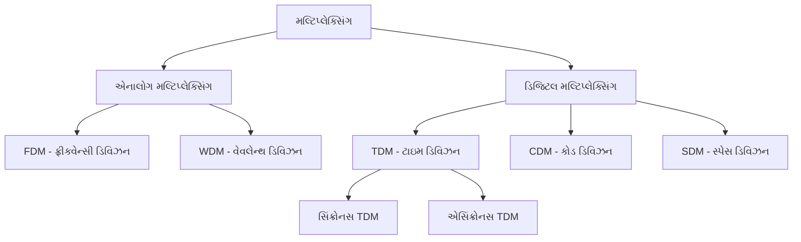

**વિગતવાર વર્ગીકરણ:**

| પ્રકાર | પદ્ધતિ | ડોમેન | ઉપયોગ |
|------|------|-------|-------|
| **FDM** | ફ્રીક્વેન્સી વિભાજન | ફ્રીક્વેન્સી | રેડિયો, TV બ્રોડકાસ્ટિંગ |
| **TDM** | ટાઇમ સ્લોટ એલોકેશન | સમય | ડિજિટલ ટેલિફોની |
| **CDM** | કોડ વિભાજન | કોડ | CDMA સેલ્યુલર |
| **WDM** | વેવલેન્થ વિભાજન | વેવલેન્થ | ઓપ્ટિકલ ફાઇબર |
| **SDM** | સ્પેસ વિભાજન | સ્પેસ | MIMO સિસ્ટમ્સ |

**સિંક્રોનસ વિ એસિંક્રોનસ TDM:**

| પેરામીટર | સિંક્રોનસ TDM | એસિંક્રોનસ TDM |
|---------|---------------|------------------|
| **ટાઇમ સ્લોટ્સ** | ફિક્સ્ડ એલોકેશન | ડાયનામિક એલોકેશન |
| **એફિશિયન્સી** | નીચી | ઊંચી |
| **જટિલતા** | સરળ | જટિલ |
| **બેન્ડવિડ્થ વેસ્ટ** | થઈ શકે છે | મિનિમલ |

**પસંદગીના માપદંડો:**

- **સિગ્નલનો પ્રકાર**: એનાલોગ → FDM, ડિજિટલ → TDM
- **બેન્ડવિડ્થ**: મર્યાદિત → TDM, પુષ્કળ → FDM
- **સિંક્રોનાઇઝેશન**: મહત્વપૂર્ણ → સિંક્રોનસ, લવચીક → એસિંક્રોનસ
- **ઉપયોગ**: અવાજ → TDM, ડેટા → સ્ટેટિસ્ટિકલ TDM

**આધુનિક ટેકનિકો:**

- **OFDM**: ઓર્થોગોનલ ફ્રીક્વેન્સી ડિવિઝન મલ્ટિપ્લેક્સિંગ
- **MIMO**: મલ્ટિપલ ઇનપુટ મલ્ટિપલ આઉટપુટ
- **કેરિયર એગ્રીગેશન**: મલ્ટિપલ ફ્રીક્વેન્સી બેન્ડ્સ

**યાદગાર વાક્ય:** "FDM TDM CDM WDM SDM - ફ્રીક્વેન્સી ટાઇમ કોડ વેવ સ્પેસ ડિવિઝન મલ્ટિપ્લેક્સિંગ"

## પ્રશ્ન 5(ક અથવા) [7 ગુણ]

**કોડ ડિવિઝન મલ્ટિપ્લેક્સિંગ સર્કિટમાં મુશ્કેલી નિવારણ માટેની પ્રક્રિયાનું વર્ણન કરો**

**જવાબ**:

**CDMA ટ્રબલશૂટિંગ પ્રક્રિયા:**

**1. સિસ્ટમ ઓવરવ્યુ ચેક:**

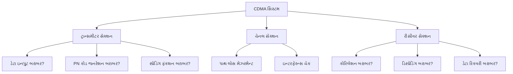

**2. સ્ટેપ-બાય-સ્ટેપ ટ્રબલશૂટિંગ:**

| સ્ટેપ | પેરામીટર | ટેસ્ટ મેથડ | અપેક્ષિત પરિણામ |
|------|----------|-----------|-----------------|
| **1** | ઇનપુટ ડેટા | ડેટા સ્ટ્રીમ વેરિફાઇ કરો | સ્વચ્છ ડિજિટલ સિગ્નલ |
| **2** | PN કોડ | કોડ જનરેશન ચેક કરો | યોગ્ય સિક્વેન્સ |
| **3** | સ્પ્રેડિંગ | XOR આઉટપુટ મોનિટર કરો | સ્પ્રેડ સ્પેક્ટ્રમ સિગ્નલ |
| **4** | ટ્રાન્સમિશન** | પાવર લેવલ માપો | પર્યાપ્ત સિગ્નલ સ્ટ્રેન્થ |
| **5** | રિસેપ્શન | પ્રાપ્ત સિગ્નલ ચેક કરો | નોઇઝ ફ્લોર ઉપર |
| **6** | કોરિલેશન | કોરિલેટર આઉટપુટ વેરિફાઇ કરો | યોગ્ય ટાઇમિંગ પર પીક |
| **7** | ડિસ્પ્રેડિંગ | લોકલ PN સાથે XOR ચેક કરો | ડિસ્પ્રેડ સિગ્નલ |
| **8** | ડેટા રિકવરી** | આઉટપુટ ડેટા વેરિફાઇ કરો | મૂળ ડેટા પુનઃપ્રાપ્ત |

**3. સામાન્ય સમસ્યાઓ અને ઉકેલો:**

| સમસ્યા | લક્ષણો | સંભવિત કારણો | ઉકેલો |
|-------|--------|-------------|-------|
| **સિગ્નલ નથી** | ઝીરો આઉટપુટ | પાવર સપ્લાય નિષ્ફળતા | પાવર કનેક્શન્સ ચેક કરો |
| **ઊંચો BER** | ઘણી બિટ એરર્સ | નબળો કોરિલેશન | ટાઇમિંગ/પાવર એડજસ્ટ કરો |
| **ઇન્ટરફેરન્સ** | ડિગ્રેડેડ પર્ફોર્મન્સ | અન્ય યુઝર્સ/નોઇઝ | પાવર કન્ટ્રોલ એડજસ્ટમેન્ટ |
| **સિંક લોસ** | અન્તરવાળો સિગ્નલ | PN કોડ મિસમેચ | કોડ સિક્વેન્સિસ વેરિફાઇ કરો |

**4. જરૂરી ટેસ્ટ ઇક્વિપમેન્ટ:**

| ઇક્વિપમેન્ટ | હેતુ | માપ |
|----------|-----|-----|
| **સ્પેક્ટ્રમ એનાલાઇઝર** | સિગ્નલ એનાલિસિસ | પાવર સ્પેક્ટ્રલ ડેન્સિટી |
| **BER ટેસ્ટર** | એરર મેઝરમેન્ટ | બિટ એરર રેટ |
| **પાવર મીટર** | પાવર મેઝરમેન્ટ | ટ્રાન્સમિટેડ/રીસીવ્ડ પાવર |
| **ઓસિલોસ્કોપ** | વેવફોર્મ એનાલિસિસ | ટાઇમ ડોમેન સિગ્નલ્સ |
| **વેક્ટર એનાલાઇઝર** | મોડ્યુલેશન ક્વાલિટી | EVM, કોન્સ્ટેલેશન |

**5. મેઝરમેન્ટ પ્રક્રિયાઓ:**

**પ્રોસેસિંગ ગેઇન વેરિફિકેશન:**

```
Gp = 10 log₁₀(Rc/Rb) dB
જ્યાં: Rc = ચિપ રેટ, Rb = બિટ રેટ
```

**BER વિ Eb/N0 મેઝરમેન્ટ:**

```
BER = Q(√(2Eb/N0))
વિવિધ પાવર લેવલ્સ પર માપો
```

**નીયર-ફાર ઇફેક્ટ ચેક:**

- વિવિધ યુઝર્સના પાવર લેવલ્સ માપો
- પાવર કન્ટ્રોલ ઓપરેશન વેરિફાઇ કરો
- ડાયનામિક રેન્જ આવશ્યકતાઓ ચેક કરો

**6. પર્ફોર્મન્સ ઓપ્ટિમાઇઝેશન:**

| પેરામીટર | ઓપ્ટિમાઇઝેશન મેથડ | ટાર્ગેટ વેલ્યુ |
|---------|-------------------|-------------|
| **પાવર કન્ટ્રોલ** | લૂપ ગેઇન એડજસ્ટ કરો | ±1 dB ચોકસાઈ |
| **કોડ સિલેક્શન** | ઓર્થોગોનલ કોડ્સ પસંદ કરો | નીચો ક્રોસ-કોરિલેશન |
| **ટાઇમિંગ** | PN જનરેટર્સ સિંક્રોનાઇઝ કરો | <0.5 ચિપ ચોકસાઈ |
| **ફિલ્ટરિંગ** | સિગ્નલ્સ બેન્ડલિમિટ કરો | ISI મિનિમાઇઝ કરો |

**7. ડોક્યુમેન્ટેશન:**

- બધા મેઝરમેન્ટ્સ રેકોર્ડ કરો
- સમસ્યાના લક્ષણો ડોક્યુમેન્ટ કરો
- લાગુ કરેલા ઉકેલો નોંધો
- ટ્રબલશૂટિંગ લોગ બનાવો

**સિસ્ટેમેટિક એપ્રોચ:**

1. **આઇસોલેટ**: ખામીયુક્ત સેક્શન ઓળખો
2. **માપો**: યોગ્ય ટેસ્ટ ઇક્વિપમેન્ટનો ઉપયોગ કરો
3. **એનાલાઇઝ**: સ્પેસિફિકેશન્સ સાથે સરખાવો
4. **સુધારો**: યોગ્ય ઉકેલ લાગુ કરો
5. **વેરિફાઇ**: સમસ્યા ઉકેલાઈ હોવાની પુષ્ટિ કરો

**સેફ્ટી કન્સિડરેશન્સ:**

- પાવર લેવલ્સ સુરક્ષિત મર્યાદામાં
- યોગ્ય ગ્રાઉન્ડિંગ પ્રક્રિયાઓ
- RF એક્સપોઝર ગાઇડલાઇન્સ
- ઇક્વિપમેન્ટ કેલિબ્રેશન સ્ટેટસ

**યાદગાર વાક્ય:** "CDMA ટ્રબલશૂટ - ડેટા, PN કોડ, સ્પ્રેડિંગ, ચેનલ, કોરિલેશન, રિકવરી ચેક કરો"
