## Question 1(a) [3 marks]

**Draw block diagram of digital communication system.**

**Answer**:


**Key Components:**

- **Information Source**: Generates message signal
- **Source Encoder**: Converts analog to digital
- **Channel Encoder**: Adds error correction codes
- **Digital Modulator**: Converts digital bits to analog signal

**Mnemonic:** "Source Channel Modulator travels through Channel to Demodulator Channel Sink"

## Question 1(b) [4 marks]

**Write the function of transmitter and receiver of digital communication system.**

**Answer**:

| Component | Function |
|-----------|----------|
| **Transmitter** | Converts information signal into suitable form for transmission |
| **Source Encoder** | Analog to digital conversion, sampling, quantization |
| **Channel Encoder** | Error detection and correction coding |
| **Digital Modulator** | Converts digital bits to analog waveform |

| Component | Function |
|-----------|----------|
| **Receiver** | Recovers original information from received signal |
| **Digital Demodulator** | Converts received analog signal to digital bits |
| **Channel Decoder** | Error detection and correction |
| **Source Decoder** | Digital to analog conversion |

**Key Functions:**

- **Signal Processing**: Encoding, modulation, filtering
- **Error Control**: Detection and correction of transmission errors
- **Signal Recovery**: Demodulation and decoding at receiver

**Mnemonic:** "Transmitter Encodes Modulates, Receiver Demodulates Decodes"

## Question 1(c) [7 marks]

**Define and explain with example: Continues time and discrete time signals, Real and complex signals and even and odd signals.**

**Answer**:

| Signal Type | Definition | Example |
|-------------|------------|---------|
| **Continuous Time** | Signal defined for all time values | x(t) = sin(2πt) |
| **Discrete Time** | Signal defined only at specific time instants | x[n] = sin(2πn/8) |
| **Real Signal** | Signal with real values only | x(t) = 5cos(t) |
| **Complex Signal** | Signal with real and imaginary parts | x(t) = 3 + j4sin(t) |

**Even and Odd Signals:**

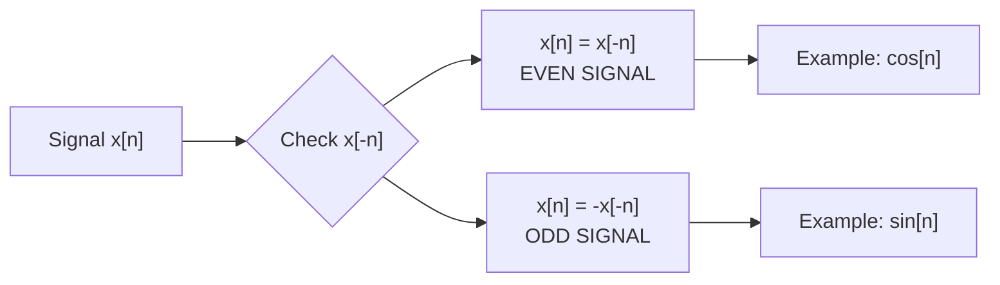

**Properties:**

- **Even Signal**: Symmetric about y-axis, x(t) = x(-t)
- **Odd Signal**: Anti-symmetric about origin, x(t) = -x(-t)
- **Complex Signal**: z(t) = x(t) + jy(t)
- **Discrete Signal**: Sampled version of continuous signal

**Mnemonic:** "Continuous Everywhere, Discrete Specific, Real Simple, Complex Combined"

## Question 1(c OR) [7 marks]

**Define and explain with example: Unit step function, Unit impulse function, Unit ramp function**

**Answer**:

| Function | Definition | Mathematical Form |
|----------|------------|------------------|
| **Unit Step** | u(t) = 1 for t≥0, 0 for t<0 | u(t) = 1 for t≥0 |
| **Unit Impulse** | δ(t) = ∞ for t=0, 0 elsewhere | ∫δ(t)dt = 1 |
| **Unit Ramp** | r(t) = t for t≥0, 0 for t<0 | r(t) = t·u(t) |

```goat
Unit Step Function:        Unit Impulse Function:      Unit Ramp Function:
                          
    1 |----                   ∞ |                           |  /
      |                         | |                         | /
    0 |____                   0 |_|____                   0 |/____
      0    t                     0    t                     0    t
```

**Applications:**

- **Unit Step**: Switch operations, system response analysis
- **Unit Impulse**: System impulse response, convolution
- **Unit Ramp**: System ramp response, integration

**Properties:**

- **Step**: Derivative of ramp, integral of impulse
- **Impulse**: Derivative of step function
- **Ramp**: Integral of step function

**Mnemonic:** "Step Sudden, Impulse Instant, Ramp Rising"

## Question 2(a) [3 marks]

**Define: bit rate, baud rate and bandwidth.**

**Answer**:

| Parameter | Definition | Unit |
|-----------|------------|------|
| **Bit Rate** | Number of bits transmitted per second | bps (bits per second) |
| **Baud Rate** | Number of signal changes per second | Baud (symbols per second) |
| **Bandwidth** | Range of frequencies in signal | Hz (Hertz) |

**Relationship:**

- Bit Rate = Baud Rate × log₂(M)
- M = number of signal levels
- Bandwidth ∝ Baud Rate

**Key Points:**

- **Higher bit rate**: More data transmission
- **Baud rate**: Symbol transmission rate
- **Bandwidth**: Frequency spectrum occupied

**Mnemonic:** "Bits Baud Bandwidth - Data Symbol Frequency"

## Question 2(b) [4 marks]

**Explain Energy and power signal.**

**Answer**:

| Signal Type | Definition | Mathematical Form |
|-------------|------------|------------------|
| **Energy Signal** | Finite energy, zero average power | E = ∫|x(t)|²dt < ∞ |
| **Power Signal** | Finite average power, infinite energy | P = lim(T→∞) 1/T ∫|x(t)|²dt |

**Classification:**

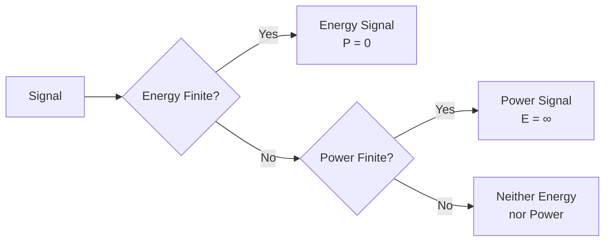

**Examples:**

- **Energy Signal**: Exponentially decaying signal e^(-t)u(t)
- **Power Signal**: Sinusoidal signal sin(ωt)
- **Neither**: Ramp signal t·u(t)

**Properties:**

- Energy and power signals are mutually exclusive
- Periodic signals are generally power signals
- Non-periodic finite duration signals are energy signals

**Mnemonic:** "Energy Ends, Power Persists"

## Question 2(c) [7 marks]

**Give the comparison between ASK, FSK and PSK modulation techniques and draw their waveforms.**

**Answer**:

| Parameter | ASK | FSK | PSK |
|-----------|-----|-----|-----|
| **Full Form** | Amplitude Shift Keying | Frequency Shift Keying | Phase Shift Keying |
| **Varied Parameter** | Amplitude | Frequency | Phase |
| **Bandwidth** | Narrow | Wide | Narrow |
| **Noise Immunity** | Poor | Good | Excellent |
| **Power Efficiency** | Poor | Good | Excellent |
| **Implementation** | Simple | Moderate | Complex |

```goat
ASK Waveform:
Data:    1    0    1    1    0
        ___       ___  ___      
       |   |     |   ||   |     
    ___|   |_____|   ||   |_____
    
FSK Waveform:
       ~~~       ~~~ ~~~      
      ~   ~     ~   ~   ~     
    ~~     ~~   ~     ~   ~~   
    
PSK Waveform:
       ___       ___ ___      
      |   |     |   |   |     
    __|   |_____|   |   |_____
      phase shift at data change
```

**Applications:**

- **ASK**: Optical communication, simple radio systems
- **FSK**: Telephone modems, radio systems
- **PSK**: Satellite communication, wireless systems

**Advantages:**

- **ASK**: Simple implementation, low cost
- **FSK**: Good noise performance, constant envelope
- **PSK**: Best noise performance, bandwidth efficient

**Mnemonic:** "ASK Amplitude, FSK Frequency, PSK Phase"

## Question 2(a OR) [3 marks]

**A bit rate of signal generator from 8-bit generator is 1600 bps. Calculate the baud rate of signal.**

**Answer**:

**Given:**

- Bit rate = 1600 bps
- Number of bits per symbol = 8 bits

**Formula:**
Baud Rate = Bit Rate / Number of bits per symbol

**Calculation:**
Baud Rate = 1600 bps / 8 bits
Baud Rate = 200 Baud

**Result:**
The baud rate of the signal is **200 Baud**.

**Explanation:**

- Each symbol carries 8 bits of information
- 1600 bits per second ÷ 8 bits per symbol = 200 symbols per second
- Therefore, baud rate = 200 Baud

**Mnemonic:** "Bit Rate divided by Bits per Symbol gives Baud"

## Question 2(b OR) [4 marks]

**Find whether the signals are even or odd:**
**1. x(t) = e^(-5t)**
**2. x(t) = sin 2t**
**3. x(t) = cos 5t**

**Answer**:

| Signal | Test x(-t) | Result | Type |
|--------|------------|--------|------|
| x(t) = e^(-5t) | x(-t) = e^(5t) ≠ x(t) ≠ -x(t) | Neither | Neither Even nor Odd |
| x(t) = sin 2t | x(-t) = sin(-2t) = -sin 2t = -x(t) | -x(t) | **Odd Signal** |
| x(t) = cos 5t | x(-t) = cos(-5t) = cos 5t = x(t) | x(t) | **Even Signal** |

**Test Procedure:**

1. **Even Signal Test**: Check if x(t) = x(-t)
2. **Odd Signal Test**: Check if x(t) = -x(-t)

**Properties Used:**

- **Exponential**: e^(-at) is neither even nor odd (a > 0)
- **Sine Function**: sin(-x) = -sin(x) → Odd function
- **Cosine Function**: cos(-x) = cos(x) → Even function

**Results:**

- **Signal 1**: Neither even nor odd
- **Signal 2**: Odd signal
- **Signal 3**: Even signal

**Mnemonic:** "Cosine Even, Sine Odd, Exponential Neither"

## Question 2(c OR) [7 marks]

**Explain the Principle of QPSK signal. Draw its modulator and demodulator diagram. Also draw constellation diagram and waveforms of its.**

**Answer**:

**QPSK Principle:**
QPSK (Quadrature Phase Shift Keying) uses four different phase states to represent 2 bits per symbol.

| Bits | Phase | I | Q |
|------|-------|---|---|
| 00 | 45° | +1 | +1 |
| 01 | 135° | -1 | +1 |
| 10 | -45° | +1 | -1 |
| 11 | -135° | -1 | -1 |

**QPSK Modulator:**

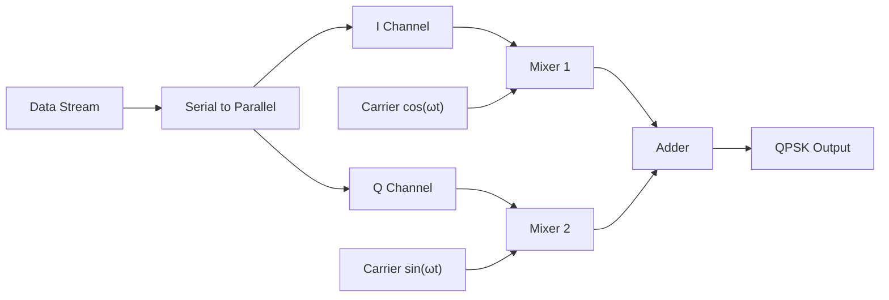

**Constellation Diagram:**

```goat
        Q
        |
   01   |   00
  (-1,1)| (1,1)
        |
  ------+------ I
        |
  (-1,-1)|(1,-1)
   11   |   10
        |
```

**QPSK Demodulator:**

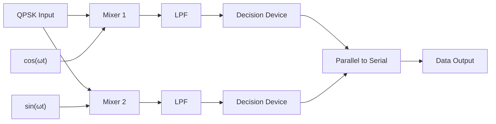

**Advantages:**

- **Bandwidth Efficient**: 2 bits per symbol
- **Good Noise Performance**: Constant envelope
- **Widely Used**: Standard in digital communication

**Applications:**

- Satellite communication
- Digital TV broadcasting
- Wireless communication systems

**Mnemonic:** "QPSK - Quadrature Phase, 2 bits, 4 phases"

## Question 3(a) [3 marks]

**Draw the block diagram of FSK modulator**

**Answer**:

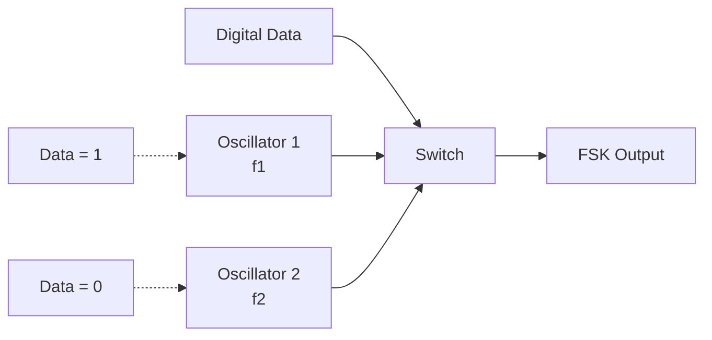

**Components:**

- **Digital Data Input**: Binary data stream (0s and 1s)
- **Two Oscillators**: f₁ for bit '1', f₂ for bit '0'
- **Electronic Switch**: Selects frequency based on input bit
- **FSK Output**: Frequency modulated signal

**Operation:**

- **Bit '1'**: Switch connects oscillator 1 (higher frequency)
- **Bit '0'**: Switch connects oscillator 2 (lower frequency)
- **Output**: Continuous frequency shifting based on data

**Mnemonic:** "FSK - Frequency Switch based on data Keys"

## Question 3(b) [4 marks]

**Draw and explain block diagram of PSK modulator.**

**Answer**:

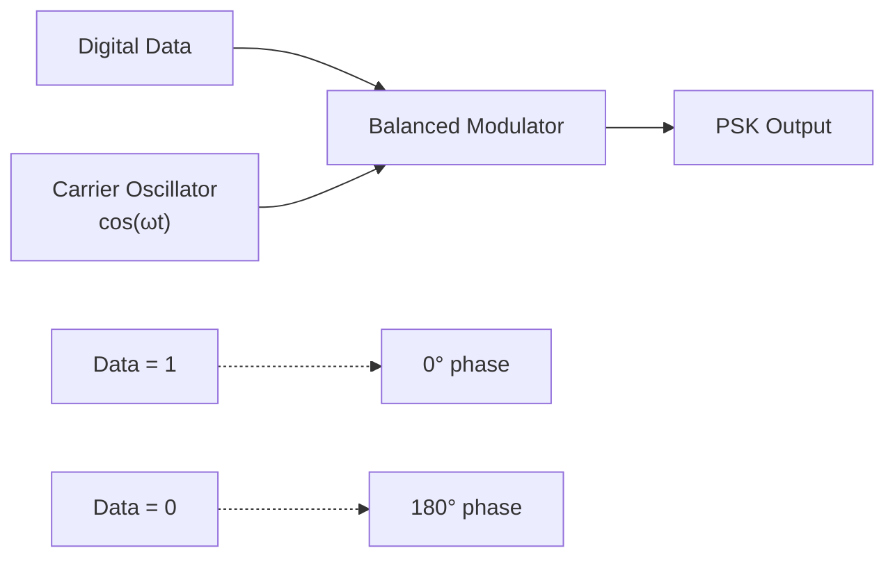

**Components and Function:**

| Component | Function |
|-----------|----------|
| **Digital Data** | Binary input stream (0s and 1s) |
| **Carrier Oscillator** | Generates reference carrier signal |
| **Balanced Modulator** | Multiplies data with carrier |
| **PSK Output** | Phase modulated signal |

**Operation:**

- **Data '1'**: Output = +cos(ωt) (0° phase)
- **Data '0'**: Output = -cos(ωt) (180° phase)
- **Phase Shift**: 180° difference between '1' and '0'

**Mathematical Expression:**

- PSK Signal: s(t) = A·d(t)·cos(ωt)
- Where d(t) = +1 for '1', -1 for '0'

**Advantages:**

- **Constant Envelope**: Better noise immunity
- **Bandwidth Efficient**: Occupies same bandwidth as ASK
- **Simple Detection**: Coherent detection required

**Mnemonic:** "PSK - Phase Shift using balanced modulator Key"

## Question 3(c) [7 marks]

**Explain the block diagram of ASK modulator and de-modulator with waveform.**

**Answer**:

**ASK Modulator:**

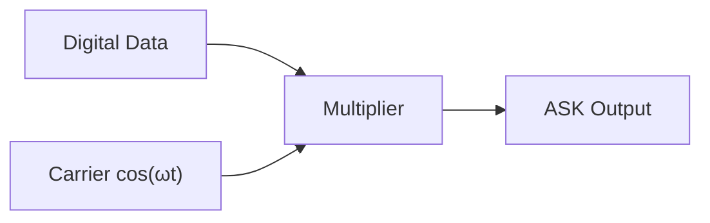

**ASK Demodulator:**

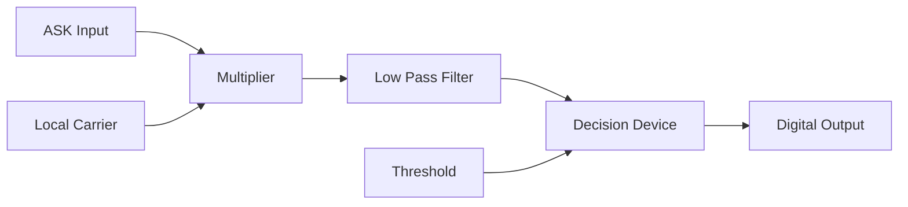

**Waveforms:**

```goat
Digital Data:
    1    0    1    1    0
   ___       ___  ___      
  |   |     |   ||   |     
__|   |_____|   ||   |_____

Carrier Signal:
  ∩   ∩   ∩   ∩   ∩   ∩
 ∩ ∩ ∩ ∩ ∩ ∩ ∩ ∩ ∩ ∩ ∩ ∩
∩   ∩   ∩   ∩   ∩   ∩   ∩

ASK Output:
  ∩∩∩     ∩∩∩ ∩∩∩    
 ∩   ∩   ∩   ∩   ∩   
∩     ∩ ∩     ∩   ∩  
```

**Modulation Process:**

| Data Bit | Carrier | ASK Output |
|----------|---------|------------|
| **'1'** | A·cos(ωt) | A·cos(ωt) |
| **'0'** | A·cos(ωt) | 0 |

**Demodulation Process:**

1. **Multiplication**: ASK signal × Local carrier
2. **Low Pass Filtering**: Remove high frequency components
3. **Decision**: Compare with threshold to recover data

**Applications:**

- **Optical Communication**: LED/Laser on-off keying
- **Simple Radio Systems**: AM radio modification
- **Short Range Communication**: IR remote controls

**Advantages/Disadvantages:**

| Advantages | Disadvantages |
|------------|---------------|
| Simple implementation | Poor noise performance |
| Low cost | Bandwidth inefficient |
| Easy detection | Susceptible to fading |

**Mnemonic:** "ASK - Amplitude Switch, multiply and filter Key"

## Question 3(a OR) [3 marks]

**Write Principle and draw the constellation diagram of MSK.**

**Answer**:

**MSK Principle:**
MSK (Minimum Shift Keying) is a form of continuous-phase FSK where the frequency deviation is exactly half the bit rate.

**Key Properties:**

- **Continuous Phase**: No phase discontinuities
- **Minimum Frequency Separation**: Δf = Rb/2
- **Constant Envelope**: Good for nonlinear amplifiers

**Constellation Diagram:**

```goat
        Q
        |
        ●  (I=0, Q=1)
        |
   ●----+----●  I
        |
        ●  (I=0, Q=-1)
        |
        
Points rotate continuously
between ±1 on I and Q axes
```

**Mathematical Representation:**

- **Bit '1'**: f₁ = fc + Rb/4
- **Bit '0'**: f₂ = fc - Rb/4
- **Frequency Deviation**: Δf = Rb/2

**Characteristics:**

- **Spectral Efficiency**: Better than conventional FSK
- **Continuous Phase**: Reduces out-of-band radiation
- **Orthogonal Detection**: Can be detected as OQPSK

**Mnemonic:** "MSK - Minimum Shift, Continuous phase Key"

## Question 3(b OR) [4 marks]

**Draw and explain the constellation diagram of 16-QAM**

**Answer**:

**16-QAM Constellation:**

```goat
           Q
           |
     ●  ●  |  ●  ●
           |
     ●  ● -3-1 1 3 ● I
           |
     ●  ●  |  ●  ●
           |
     ●  ●  |  ●  ●
           |
```

**16-QAM Mapping Table:**

| Bits | I | Q | Amplitude | Phase |
|------|---|---|-----------|-------|
| 0000 | -3 | -3 | √18 | 225° |
| 0001 | -3 | -1 | √10 | 198.4° |
| 0010 | -3 | +1 | √10 | 161.6° |
| 0011 | -3 | +3 | √18 | 135° |
| 0100 | -1 | -3 | √10 | 251.6° |
| 0101 | -1 | -1 | √2 | 225° |
| ... | ... | ... | ... | ... |

**Key Features:**

- **16 Symbol Points**: 4 bits per symbol
- **Gray Coding**: Adjacent symbols differ by 1 bit
- **Variable Amplitude**: Different power levels
- **High Data Rate**: 4 times QPSK data rate

**Signal Representation:**
s(t) = I(t)·cos(ωt) - Q(t)·sin(ωt)

**Applications:**

- **Digital Cable TV**: High data rate transmission
- **Microwave Links**: Point-to-point communication
- **WiFi Systems**: 802.11 standards

**Advantages:**

- **High Spectral Efficiency**: 4 bits per symbol
- **Good BER Performance**: With proper coding
- **Flexible Implementation**: Software defined radio

**Trade-offs:**

- **Higher Complexity**: More complex than QPSK
- **Power Variation**: Requires linear amplifiers
- **Noise Sensitivity**: Higher than constant envelope schemes

**Mnemonic:** "16-QAM - 16 points, 4 bits, Quadrature Amplitude Modulation"

## Question 3(c OR) [7 marks]

**Compare Bits PER Symbol for digital modulation techniques-ASK, FSK, PSK, QPSK,8-PSK, MSK and 16-QAM**

**Answer**:

**Bits per Symbol Comparison:**

| Modulation | Bits per Symbol | Symbol Rate | Data Rate Relationship |
|------------|----------------|-------------|----------------------|
| **ASK** | 1 | Rs = Rb | Rb = Rs × 1 |
| **FSK** | 1 | Rs = Rb | Rb = Rs × 1 |
| **PSK (BPSK)** | 1 | Rs = Rb | Rb = Rs × 1 |
| **QPSK** | 2 | Rs = Rb/2 | Rb = Rs × 2 |
| **8-PSK** | 3 | Rs = Rb/3 | Rb = Rs × 3 |
| **MSK** | 1 | Rs = Rb | Rb = Rs × 1 |
| **16-QAM** | 4 | Rs = Rb/4 | Rb = Rs × 4 |

**Detailed Analysis:**


**Bandwidth Efficiency:**

| Modulation | M | Bits/Symbol | Bandwidth Efficiency |
|------------|---|-------------|---------------------|
| ASK, FSK, PSK | 2 | 1 | 1 bit/s/Hz |
| QPSK | 4 | 2 | 2 bits/s/Hz |
| 8-PSK | 8 | 3 | 3 bits/s/Hz |
| 16-QAM | 16 | 4 | 4 bits/s/Hz |

**Power Requirements:**

| Modulation | Relative Power | BER Performance |
|------------|----------------|-----------------|
| **PSK** | Reference | Best |
| **ASK** | +3dB penalty | Poor |
| **FSK** | Same as PSK | Good |
| **QPSK** | Same as PSK | Same as PSK |
| **8-PSK** | +2.5dB penalty | Moderate |
| **16-QAM** | +4dB penalty | Good with coding |

**Trade-offs:**

- **Higher M**: More bits per symbol but higher complexity
- **Bandwidth vs Power**: Trade-off between spectral and power efficiency
- **Implementation**: Higher order modulation needs better hardware

**Applications:**

- **Low Rate**: ASK, FSK, PSK for simple systems
- **Medium Rate**: QPSK for balanced performance
- **High Rate**: 8-PSK, 16-QAM for high-speed systems

**Formula:**
Bits per Symbol = log₂(M), where M = number of symbols

**Mnemonic:** "More symbols, More bits, More complexity"

## Question 4(a) [3 marks]

**Define probability and write it Significance of in communication**

**Answer**:

**Definition of Probability:**
Probability is the measure of likelihood that an event will occur, expressed as a number between 0 and 1.

P(Event) = Number of favorable outcomes / Total number of possible outcomes

**Significance in Communication:**

| Application | Significance |
|-------------|--------------|
| **Error Analysis** | Calculate bit error rate (BER) |
| **Channel Modeling** | Noise and fading statistics |
| **Coding Theory** | Error correction probability |
| **Signal Detection** | Detection and false alarm rates |

**Key Applications:**

- **BER Calculation**: P(error) = Q(√(2Eb/N0))
- **Channel Capacity**: Shannon's theorem uses probability
- **Information Theory**: Entropy based on probability
- **System Design**: Performance prediction

**Mathematical Tools:**

- **Gaussian Distribution**: For noise analysis
- **Rayleigh Distribution**: For fading channels
- **Poisson Distribution**: For arrival processes

**Mnemonic:** "Probability Predicts Performance in communication systems"

## Question 4(b) [4 marks]

**Explain Huffman code with suitable example**

**Answer**:

**Huffman Coding Principle:**
Variable length coding where frequently occurring symbols get shorter codes.

**Algorithm:**

1. List symbols with probabilities
2. Combine two lowest probability symbols
3. Repeat until single symbol remains
4. Assign codes: left = 0, right = 1

**Example:**

| Symbol | Probability | Huffman Code |
|--------|-------------|--------------|
| A | 0.4 | 0 |
| B | 0.3 | 10 |
| C | 0.2 | 110 |
| D | 0.1 | 111 |

**Huffman Tree Construction:**

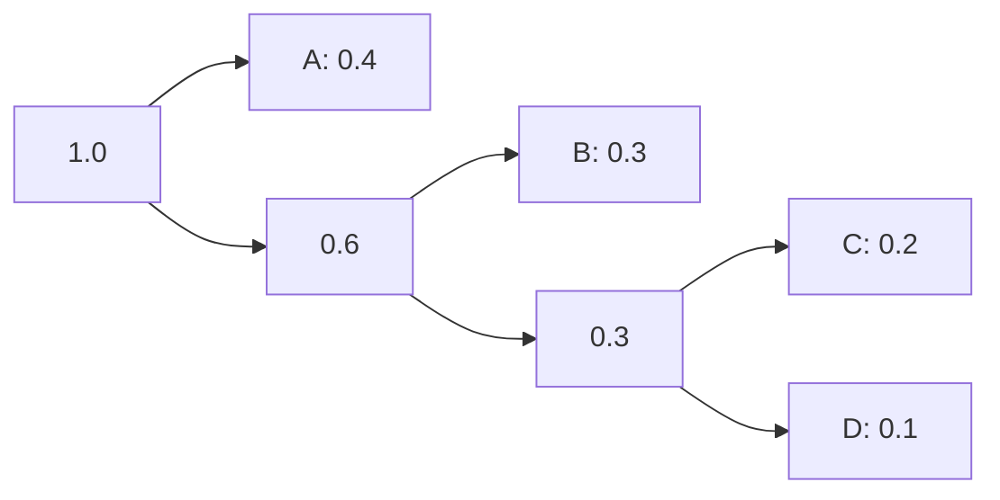

**Code Assignment:**

- **A**: 0 (1 bit)
- **B**: 10 (2 bits)  
- **C**: 110 (3 bits)
- **D**: 111 (3 bits)

**Average Code Length:**
L = 0.4×1 + 0.3×2 + 0.2×3 + 0.1×3 = 1.9 bits/symbol

**Advantages:**

- **Optimal**: Minimum average code length
- **Prefix Property**: No code is prefix of another
- **Efficient**: Reduces transmission bandwidth

**Mnemonic:** "Huffman - Frequent symbols get Shorter codes"

## Question 4(c) [7 marks]

**Explain concept and key features of Internet of Things (IoT).**

**Answer**:

**IoT Concept:**
Internet of Things is the network of physical devices embedded with sensors, software, and connectivity to collect and exchange data.

**IoT Architecture:**

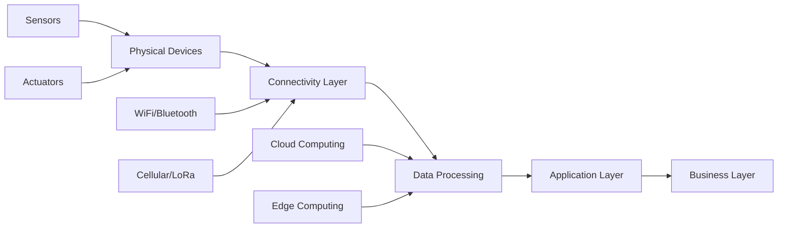

**Key Features:**

| Feature | Description | Example |
|---------|-------------|---------|
| **Connectivity** | Devices connected to internet | WiFi, 4G, 5G |
| **Intelligence** | Smart decision making | AI algorithms |
| **Sensing** | Data collection from environment | Temperature, humidity |
| **Actuation** | Control physical processes | Motors, valves |
| **Interoperability** | Devices work together | Standard protocols |

**IoT Protocol Stack:**

| Layer | Protocols | Function |
|-------|-----------|----------|
| **Application** | HTTP, CoAP, MQTT | Data exchange |
| **Transport** | TCP, UDP | Reliable transmission |
| **Network** | IPv6, 6LoWPAN | Routing |
| **Physical** | WiFi, ZigBee, LoRa | Connectivity |

**Applications:**

- **Smart Home**: Automated lighting, security
- **Industrial IoT**: Manufacturing automation
- **Healthcare**: Remote patient monitoring
- **Smart Cities**: Traffic management, utilities

**Challenges:**

- **Security**: Device vulnerabilities, data privacy
- **Scalability**: Billions of devices
- **Interoperability**: Different standards
- **Power Consumption**: Battery-operated devices

**Benefits:**

- **Automation**: Reduced human intervention
- **Efficiency**: Optimized resource usage  
- **Real-time Monitoring**: Instant data access
- **Cost Reduction**: Predictive maintenance

**Technologies:**

- **Communication**: WiFi, Bluetooth, Cellular, LoRa
- **Processing**: Edge computing, cloud computing
- **Analytics**: Big data, machine learning
- **Security**: Encryption, authentication

**Mnemonic:** "IoT - Internet of Things, Smart Connected Devices everywhere"

## Question 4(a OR) [3 marks]

**Define error correction code and list common error correcting code.**

**Answer**:

**Error Correction Code Definition:**
Error correction codes are techniques that add redundant bits to data to detect and correct transmission errors automatically.

**Common Error Correcting Codes:**

| Code Type | Description | Capability |
|-----------|-------------|------------|
| **Hamming Code** | Single error correction | Correct 1-bit error |
| **Reed-Solomon** | Block code for burst errors | Correct multiple errors |
| **BCH Code** | Binary cyclic code | Correct t errors |
| **Convolutional Code** | Continuous encoding | Good for noisy channels |
| **Turbo Code** | Iterative decoding | Near Shannon limit |
| **LDPC Code** | Low density parity check | Excellent performance |

**Applications:**

- **Memory Systems**: ECC RAM
- **Storage Devices**: Hard drives, CDs
- **Communication**: Satellite, cellular
- **Broadcasting**: Digital TV, radio

**Mnemonic:** "Error Correction Codes - Hamming Reed BCH Convolutional Turbo LDPC"

## Question 4(b OR) [4 marks]

**Explain Shanon Fano code with suitable example**

**Answer**:

**Shannon-Fano Coding Algorithm:**
Top-down approach that divides symbols into two groups with approximately equal probabilities.

**Algorithm Steps:**

1. Arrange symbols in decreasing probability order
2. Divide into two groups with nearly equal total probability
3. Assign '0' to first group, '1' to second group
4. Repeat for each subgroup

**Example:**

| Symbol | Probability | Shannon-Fano Code |
|--------|-------------|-------------------|
| A | 0.4 | 00 |
| B | 0.3 | 01 |
| C | 0.2 | 10 |
| D | 0.1 | 11 |

**Construction Tree:**

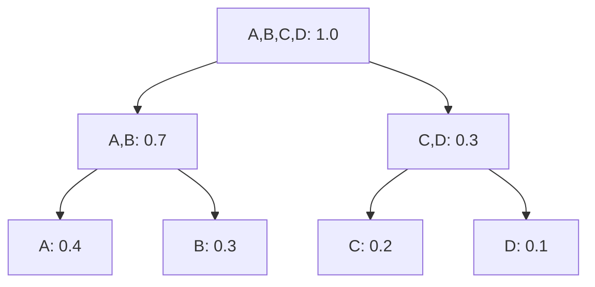

**Code Assignment:**

- Group 1 (A,B): Code starts with '0'
- Group 2 (C,D): Code starts with '1'
- A: 00, B: 01, C: 10, D: 11

**Comparison with Huffman:**

- **Shannon-Fano**: Top-down approach
- **Huffman**: Bottom-up approach
- **Huffman**: Always optimal
- **Shannon-Fano**: May not be optimal

**Average Code Length:**
L = 0.4×2 + 0.3×2 + 0.2×2 + 0.1×2 = 2.0 bits/symbol

**Mnemonic:** "Shannon-Fano - Split groups, assign codes Top-down"

## Question 4(c OR) [7 marks]

**Explain different standard formats of audio signal.**

**Answer**:

**Audio Signal Formats:**

| Format | Full Form | Compression | Quality | File Size |
|--------|-----------|-------------|---------|-----------|
| **WAV** | Waveform Audio File | Uncompressed | Highest | Largest |
| **MP3** | MPEG Layer 3 | Lossy | Good | Small |
| **AAC** | Advanced Audio Coding | Lossy | Better than MP3 | Small |
| **FLAC** | Free Lossless Audio Codec | Lossless | Original | Medium |
| **OGG** | Ogg Vorbis | Lossy | Good | Small |

**Audio Parameters:**

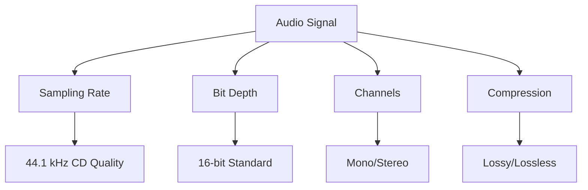

**Sampling Standards:**

| Standard | Sampling Rate | Bit Depth | Application |
|----------|---------------|-----------|-------------|
| **CD Quality** | 44.1 kHz | 16-bit | Consumer audio |
| **Studio Quality** | 48 kHz | 24-bit | Professional recording |
| **High Resolution** | 96 kHz | 24-bit | Audiophile |
| **Telephone** | 8 kHz | 8-bit | Voice communication |

**Compression Types:**

- **Lossless**: Original quality preserved (FLAC, ALAC)
- **Lossy**: Some quality lost for smaller size (MP3, AAC)
- **Uncompressed**: No compression (WAV, AIFF)

**Applications:**

- **Broadcasting**: AAC for digital radio
- **Streaming**: MP3, AAC for internet
- **Professional**: WAV, FLAC for studios
- **Mobile**: AAC for smartphones

**File Size Comparison (3-minute song):**

- **WAV**: 30 MB
- **FLAC**: 20 MB
- **MP3**: 3 MB
- **AAC**: 2.5 MB

**Quality vs Size Trade-off:**

- **Highest Quality**: WAV (uncompressed)
- **Best Balance**: AAC (lossy compressed)
- **Smallest Size**: Low bitrate MP3
- **Lossless Compressed**: FLAC

**Mnemonic:** "WAV MP3 AAC FLAC - Wave, Layer3, Advanced, Free Lossless"

## Question 5(a) [3 marks]

**Explain E1 carrier multiplexing hierarchy.**

**Answer**:

**E1 Carrier System:**
European digital transmission standard for multiplexing voice channels.

**E1 Hierarchy:**

| Level | Name | Bit Rate | Voice Channels | Multiplexing |
|-------|------|----------|----------------|--------------|
| **E0** | Basic Channel | 64 kbps | 1 | - |
| **E1** | Primary Rate | 2.048 Mbps | 30 | 30 × E0 + 2 |
| **E2** | Secondary Rate | 8.448 Mbps | 120 | 4 × E1 |
| **E3** | Tertiary Rate | 34.368 Mbps | 480 | 4 × E2 |
| **E4** | Quaternary Rate | 139.264 Mbps | 1920 | 4 × E3 |

**E1 Frame Structure:**

```goat
Frame (125 μs, 256 bits)
|TS0|TS1|TS2|...|TS15|TS16|TS17|...|TS31|
 32 time slots × 8 bits = 256 bits

TS0: Synchronization + Alarm
TS16: Signaling (voice channels)
TS1-15, 17-31: 30 voice channels
```

**Multiplexing Process:**

- **Level 1**: 30 voice channels + 2 control → E1
- **Level 2**: 4 E1 streams → E2
- **Level 3**: 4 E2 streams → E3
- **Level 4**: 4 E3 streams → E4

**Applications:**

- **ISDN**: Primary rate interface
- **Cellular**: Base station connectivity
- **Enterprise**: Private branch exchange (PBX)
- **Internet**: Digital subscriber line (DSL)

**Mnemonic:** "E1 - 30 voices, 2.048 Mbps, European standard"

## Question 5(b) [4 marks]

**Compare FDMA with TDMA.**

**Answer**:

**FDMA vs TDMA Comparison:**

| Parameter | FDMA | TDMA |
|-----------|------|------|
| **Full Form** | Frequency Division Multiple Access | Time Division Multiple Access |
| **Domain** | Frequency | Time |
| **Channel Allocation** | Each user gets different frequency | Each user gets different time slot |
| **Bandwidth per User** | Narrow bandwidth continuously | Full bandwidth for short duration |
| **Guard Bands** | Required between frequencies | Not required |
| **Synchronization** | Not critical | Critical |
| **Flexibility** | Less flexible | More flexible |
| **Handoff** | Simple | Complex |
| **Near-Far Effect** | Less problematic | More problematic |

**FDMA System:**

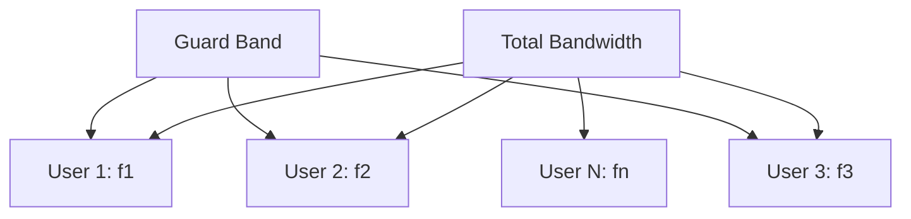

**TDMA System:**

```mermaid
gantt
    title TDMA Time Slots
    dateFormat X
    axisFormat %s
    
    section Frame
    User 1 :done, u1, 0, 1
    User 2 :done, u2, 1, 2
    User 3 :done, u3, 2, 3
    User 4 :done, u4, 3, 4
```

**Advantages/Disadvantages:**

| FDMA Advantages | FDMA Disadvantages |
|-----------------|-------------------|
| Simple implementation | Waste of bandwidth due to guard bands |
| No synchronization needed | Less flexible |
| Continuous transmission | Difficult to accommodate varying rates |

| TDMA Advantages | TDMA Disadvantages |
|-----------------|-------------------|
| Efficient bandwidth usage | Complex synchronization |
| Flexible data rates | Battery life issues (burst transmission) |
| Easy to add/remove users | Near-far problem |

**Applications:**

- **FDMA**: AMPS (1G), satellite communication
- **TDMA**: GSM (2G), satellite communication

**Mnemonic:** "FDMA Frequency, TDMA Time - different domains for multiple access"

## Question 5(c) [7 marks]

**Explain CDMA technique in detail.**

**Answer**:

**CDMA Principle:**
Code Division Multiple Access allows multiple users to share the same frequency and time by using unique spreading codes.

**CDMA System Architecture:**

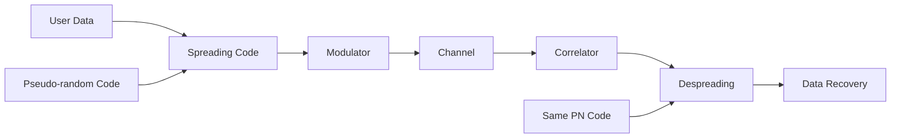

**Spreading Process:**

| Parameter | Before Spreading | After Spreading |
|-----------|------------------|-----------------|
| **Data Rate** | Rb | Rb |
| **Chip Rate** | - | Rc (= N × Rb) |
| **Bandwidth** | Rb | Rc |
| **Processing Gain** | 1 | N = Rc/Rb |

**CDMA Properties:**

```goat
Original Data:    1  0  1
PN Code:         101 010 101
XOR Result:      101 010 101
(Spread Signal)

At Receiver:
Received:        101 010 101
Same PN Code:    101 010 101  
XOR Result:       1   0   1
(Original Data)
```

**Key Features:**

| Feature | Description | Benefit |
|---------|-------------|---------|
| **Spreading** | Data XOR with PN code | Bandwidth expansion |
| **Processing Gain** | Rc/Rb ratio | Interference rejection |
| **Soft Handoff** | Simultaneous connections | Better quality |
| **Power Control** | Dynamic power adjustment | Near-far solution |

**CDMA Advantages:**

- **Capacity**: Higher user capacity than FDMA/TDMA
- **Security**: Encrypted by spreading code
- **Soft Handoff**: No call dropping during handoff
- **Anti-jamming**: Spread spectrum immunity
- **No Frequency Planning**: Same frequency reuse

**CDMA Disadvantages:**

- **Near-Far Problem**: Requires power control
- **Complexity**: More complex than FDMA/TDMA
- **Self Interference**: Users interfere with each other
- **Breathing Effect**: Coverage varies with loading

**Mathematical Analysis:**

- **Processing Gain**: G = Rc/Rb = 10log₁₀(Rc/Rb) dB
- **Capacity**: M ≈ 1 + G/(Eb/I₀)
- **BER**: Depends on number of active users

**Power Control:**

- **Open Loop**: Based on received signal strength
- **Closed Loop**: Base station commands mobile
- **Requirement**: ±1 dB accuracy needed

**Applications:**

- **IS-95 (cdmaOne)**: 2G CDMA standard
- **WCDMA**: 3G UMTS system
- **GPS**: Satellite navigation
- **WiFi**: Spread spectrum option

**PN Code Properties:**

- **Autocorrelation**: High for synchronized, low for unsynchronized
- **Cross-correlation**: Low between different codes
- **Balance**: Equal number of 1s and 0s
- **Run Length**: Distribution of consecutive bits

**Mnemonic:** "CDMA - Code Division, same frequency/time, unique codes for Multiple Access"

## Question 5(a OR) [3 marks]

**Draw block diagram of Time Division Multiplexing technique (TDM).**

**Answer**:

**TDM Block Diagram:**

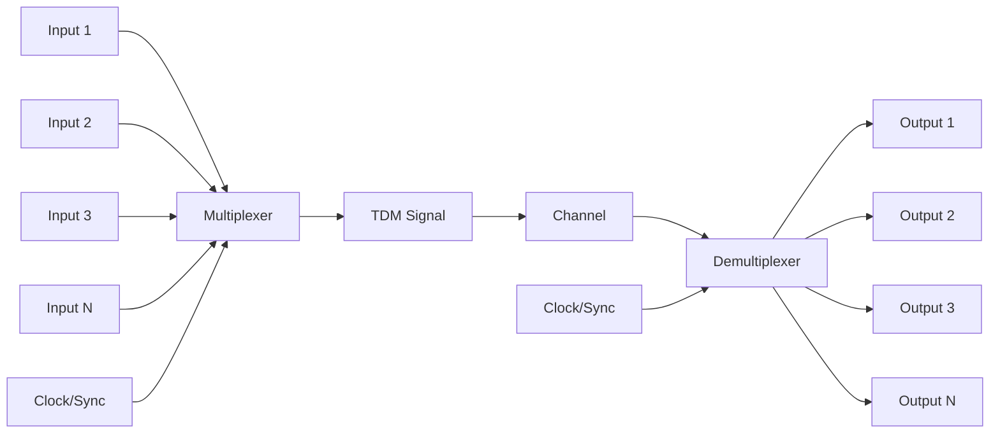

**TDM Frame Structure:**

```goat
|<---- Frame Period T ---->|
|Ch1|Ch2|Ch3|...|ChN|Sync|
 TS1 TS2 TS3     TSN
 
Each time slot = T/N
Frame Rate = 1/T
```

**Components:**

- **Multiplexer**: Samples inputs sequentially
- **Clock/Synchronization**: Controls switching timing
- **Channel**: Transmission medium
- **Demultiplexer**: Separates multiplexed signal

**Operation:**

- Each input channel gets dedicated time slot
- Sampling rate must satisfy Nyquist criterion
- Frame synchronization required at receiver

**Mnemonic:** "TDM - Time Division, sequential sampling, Multiplexing"

## Question 5(b OR) [4 marks]

**Write a short not on classification of multiplexing techniques.**

**Answer**:

**Classification of Multiplexing Techniques:**

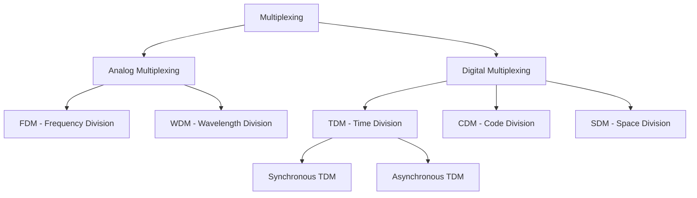

**Detailed Classification:**

| Type | Method | Domain | Application |
|------|--------|--------|-------------|
| **FDM** | Frequency separation | Frequency | Radio, TV broadcasting |
| **TDM** | Time slot allocation | Time | Digital telephony |
| **CDM** | Code separation | Code | CDMA cellular |
| **WDM** | Wavelength separation | Wavelength | Optical fiber |
| **SDM** | Space separation | Space | MIMO systems |

**Synchronous vs Asynchronous TDM:**

| Parameter | Synchronous TDM | Asynchronous TDM |
|-----------|-----------------|------------------|
| **Time Slots** | Fixed allocation | Dynamic allocation |
| **Efficiency** | Lower | Higher |
| **Complexity** | Simple | Complex |
| **Bandwidth Waste** | May occur | Minimal |

**Selection Criteria:**

- **Nature of Signal**: Analog → FDM, Digital → TDM
- **Bandwidth**: Limited → TDM, Abundant → FDM
- **Synchronization**: Critical → Synchronous, Flexible → Asynchronous
- **Application**: Voice → TDM, Data → Statistical TDM

**Modern Techniques:**

- **OFDM**: Orthogonal Frequency Division Multiplexing
- **MIMO**: Multiple Input Multiple Output
- **Carrier Aggregation**: Multiple frequency bands

**Mnemonic:** "FDM TDM CDM WDM SDM - Frequency Time Code Wave Space Division Multiplexing"

## Question 5(c OR) [7 marks]

**Describe the procedure to troubleshoot the code division multiplexing circuit**

**Answer**:

**CDMA Troubleshooting Procedure:**

**1. System Overview Check:**

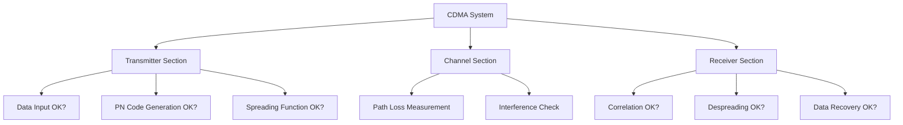

**2. Step-by-Step Troubleshooting:**

| Step | Parameter | Test Method | Expected Result |
|------|-----------|-------------|-----------------|
| **1** | Input Data | Verify data stream | Clean digital signal |
| **2** | PN Code | Check code generation | Proper sequence |
| **3** | Spreading | Monitor XOR output | Spread spectrum signal |
| **4** | Transmission** | Measure power level | Adequate signal strength |
| **5** | Reception | Check received signal | Above noise floor |
| **6** | Correlation | Verify correlator output | Peak at correct timing |
| **7** | Despreading | Check XOR with local PN | Despread signal |
| **8** | Data Recovery** | Verify output data | Original data recovered |

**3. Common Problems and Solutions:**

| Problem | Symptoms | Possible Causes | Solutions |
|---------|----------|-----------------|-----------|
| **No Signal** | Zero output | Power supply failure | Check power connections |
| **High BER** | Many bit errors | Poor correlation | Adjust timing/power |
| **Interference** | Degraded performance | Other users/noise | Power control adjustment |
| **Sync Loss** | Intermittent signal | PN code mismatch | Verify code sequences |

**4. Test Equipment Required:**

| Equipment | Purpose | Measurement |
|-----------|---------|-------------|
| **Spectrum Analyzer** | Signal analysis | Power spectral density |
| **BER Tester** | Error measurement | Bit error rate |
| **Power Meter** | Power measurement | Transmitted/received power |
| **Oscilloscope** | Waveform analysis | Time domain signals |
| **Vector Analyzer** | Modulation quality | EVM, constellation |

**5. Measurement Procedures:**

**Processing Gain Verification:**

```
Gp = 10 log₁₀(Rc/Rb) dB
Where: Rc = chip rate, Rb = bit rate
```

**BER vs Eb/N0 Measurement:**

```
BER = Q(√(2Eb/N0))
Measure at various power levels
```

**Near-Far Effect Check:**

- Measure power levels of different users
- Verify power control operation
- Check dynamic range requirements

**6. Performance Optimization:**

| Parameter | Optimization Method | Target Value |
|-----------|-------------------|--------------|
| **Power Control** | Adjust loop gain | ±1 dB accuracy |
| **Code Selection** | Choose orthogonal codes | Low cross-correlation |
| **Timing** | Synchronize PN generators | <0.5 chip accuracy |
| **Filtering** | Bandlimit signals | Minimize ISI |

**7. Documentation:**

- Record all measurements
- Document problem symptoms
- Note solutions applied
- Create troubleshooting log

**Systematic Approach:**

1. **Isolate**: Identify faulty section
2. **Measure**: Use appropriate test equipment
3. **Analyze**: Compare with specifications
4. **Correct**: Apply appropriate solution
5. **Verify**: Confirm problem resolution

**Safety Considerations:**

- Power levels within safe limits
- Proper grounding procedures
- RF exposure guidelines
- Equipment calibration status

**Mnemonic:** "CDMA Troubleshoot - Check Data, PN code, Spreading, Channel, Correlation, Recovery"
