## પ્રશ્ન 1(અ) [3 ગુણ]

**કોમ્યુનિકેશન ની વિવિધ ચેનલોની લાક્ષણિકતાઓ ચર્ચો.**

**જવાબ**:

| ચેનલ લાક્ષણિકતા | વર્ણન |
|-----------------|-------|
| **બિટ રેટ** | પ્રતિ સેકન્ડ મહત્તમ પ્રસારિત બિટ્સની સંખ્યા |
| **બોડ રેટ** | પ્રતિ સેકન્ડ પ્રસારિત સિગ્નલ એકમો/પ્રતીકોની સંખ્યા |
| **બેન્ડવિડ્થ** | પ્રસારણ માટે જરૂરી આવૃત્તિઓની શ્રેણી |
| **રિપીટર અંતર** | સિગ્નલ ગુણવત્તા જાળવવા માટે રિપીટર્સ વચ્ચેનું મહત્તમ અંતર |
| **નોઈઝ ઇમ્યુનિટી** | બાહ્ય સ્ત્રોતોથી દખલ સામે પ્રતિકાર કરવાની ક્ષમતા |

**મેમરી ટ્રીક:** "BBRN" - "બેટર બેન્ડવિડ્થ રિક્વાયર્સ નાઇસ પ્લાનિંગ"

## પ્રશ્ન 1(બ) [4 ગુણ]

**ઈવન અને ઓડ સિગ્નલ વચ્ચે તફાવત આપો.**

**જવાબ**:

| ઈવન સિગ્નલ | ઓડ સિગ્નલ |
|------------|-----------|
| **ગાણિતિક રજૂઆત**: x(−t) = x(t) | **ગાણિતિક રજૂઆત**: x(−t) = −x(t) |
| **સિમેટ્રી**: y-અક્ષની આસપાસ મિરર સિમેટ્રી | **સિમેટ્રી**: ઓરિજિન સિમેટ્રી (રોટેશનલ) |
| **ફૂરિયર સીરીઝ**: ફક્ત કોસાઈન ટર્મ્સ ધરાવે છે | **ફૂરિયર સીરીઝ**: ફક્ત સાઈન ટર્મ્સ ધરાવે છે |
| **ઉદાહરણો**: cos(t), t² | **ઉદાહરણો**: sin(t), t³ |

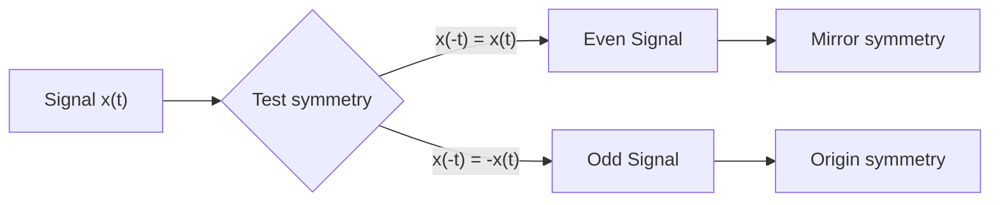

**મેમરી ટ્રીક:** "ઈવન સિગ્નલ્સ ફ્લિપ થતાં સમાન રહે છે, ઓડ સિગ્નલ્સ ફ્લિપ થતાં વિપરીત થાય છે"

## પ્રશ્ન 1(ક) [7 ગુણ]

**રિપીટર ને વ્યાખ્યાયિત કરો. રિપીટર કેવી રીતે કામ કરે છે તે જરૂરી સર્કિટ અને વેવફોર્મ્સ સાથે સમજાવો.**

**જવાબ**:

**રિપીટર**: એક ઉપકરણ જે સિગ્નલને પ્રાપ્ત કરે છે, એમ્પ્લિફાય કરે છે, અને પુનઃપ્રસારિત કરે છે જેથી પ્રસારણ અંતરને ડિગ્રેડેશન વિના વધારી શકાય.

**કાર્ય સિદ્ધાંત**: 
રિપીટર્સ ડિજિટલ સિગ્નલ્સને પુનર્જનન કરે છે જેથી ટ્રાન્સમિશન લાઈન્સમાં ક્ષીણન અને નોઈઝ એકત્રીકરણને દૂર કરી શકાય.

**સર્કિટ ડાયાગ્રામ**:

```goat
            +-------------+                  +-------------+
 Input      |             |    Regenerated   |             |    Output
Signal -->--|  Receiver   |------Signal----->|  Transmitter|----Signal-->
            |             |                  |             |
            +-------------+                  +-------------+
                    |                               |
                    |       +------------+          |
                    +------>|   Clock    |<---------+
                            | Recovery   |
                            +------------+
```

**વેવફોર્મ**:

```goat
  Input Signal            Repeater              Output Signal
     _____                                         _____
    |     |                                       |     |
____|     |____     -->     ___         -->   ____|     |____
    |     |                                       |     |
    |     |                                       |     |
      Degraded                                    Regenerated
```

- **સિગ્નલ રિસેપ્શન**: આવતા નબળા/વિકૃત સિગ્નલ્સને શોધે છે
- **એમ્પ્લિફિકેશન**: સિગ્નલ પાવરને મજબૂત કરે છે
- **રિજનરેશન**: મૂળ ડિજિટલ વેવફોર્મને પુનઃનિર્માણ કરે છે
- **રિટ્રાન્સમિશન**: પુનઃસ્થાપિત સિગ્નલને આગલા સેગમેન્ટમાં મોકલે છે

**મેમરી ટ્રીક:** "RARE" - "રિસીવ, એમ્પ્લિફાય, રિજનરેટ, એમિટ"

## પ્રશ્ન 1(ક) અથવા [7 ગુણ]

**ડિજિટલ કોમ્યુનિકેશન સિસ્ટમ નો બ્લોક ડાયાગ્રામ દોરો અને ઊંડાણથી સમજાવો.**

**જવાબ**:


| બ્લોક | કાર્ય |
|------|------|
| **ઇન્ફોર્મેશન સોર્સ** | પ્રસારિત કરવા માટેનો સંદેશ તૈયાર કરે છે (વૉઇસ, વિડિઓ, ડેટા) |
| **સોર્સ એન્કોડર** | સોર્સ ડેટાને ડિજિટલ ફોર્મમાં રૂપાંતરિત કરે છે અને રિડન્ડન્સી દૂર કરે છે |
| **ચેનલ એન્કોડર** | ભૂલ શોધ/સુધારણા માટે નિયંત્રિત રિડન્ડન્સી ઉમેરે છે |
| **ડિજિટલ મોડ્યુલેટર** | ડિજિટલ ડેટાને પ્રસારણ માટે યોગ્ય સિગ્નલ્સમાં રૂપાંતરિત કરે છે |
| **ચેનલ** | ભૌતિક માધ્યમ જેના દ્વારા સિગ્નલ્સ પ્રવાસ કરે છે |
| **ડિજિટલ ડિમોડ્યુલેટર** | પ્રાપ્ત સિગ્નલ્સમાંથી ડિજિટલ ડેટા કાઢે છે |
| **ચેનલ ડિકોડર** | ઉમેરાયેલ રિડન્ડન્સીનો ઉપયોગ કરીને ભૂલો શોધે/સુધારે છે |
| **સોર્સ ડિકોડર** | મૂળ સોર્સ માહિતીનું પુનઃનિર્માણ કરે છે |

**મેમરી ટ્રીક:** "સ્પષ્ટ ડેટા સંદેશો મોકલો, કાળજીપૂર્વક સુરક્ષિત માહિતી ડિકોડ કરો"

## પ્રશ્ન 2(અ) [3 ગુણ]

**યુનિટ સ્ટેપ ફંકશન, યુનિટ ઇમ્પલ્સ ફંકશન અને યુનિટ રેમ્પ ફંકશન ને વ્યાખ્યાયિત કરો.**

**જવાબ**:

| ફંક્શન | વ્યાખ્યા | ગાણિતિક રૂપ |
|--------|---------|-------------|
| **યુનિટ સ્ટેપ ફંક્શન** | નકારાત્મક સમય માટે 0 અને હકારાત્મક સમય માટે 1 મૂલ્ય લે છે | u(t) = {0, t < 0; 1, t ≥ 0} |
| **યુનિટ ઇમ્પલ્સ ફંક્શન** | અનંત ઊંચો, શૂન્ય પહોળાઈનો પલ્સ જેનું ક્ષેત્રફળ 1 છે | δ(t) = {∞, t = 0; 0, t ≠ 0} |
| **યુનિટ રેમ્પ ફંક્શન** | હકારાત્મક સમય માટે સમય સાથે રેખીય રીતે વધે છે | r(t) = {0, t < 0; t, t ≥ 0} |

**મેમરી ટ્રીક:** "SIR" - "સ્ટેપ ઇન્સટન્ટલી, ઇમ્પલ્સ રેપિડલી, રેમ્પ ગ્રેજ્યુઅલી"

## પ્રશ્ન 2(બ) [4 ગુણ]

**કંટીન્યુયસ ટાઇમ અને ડિસક્રીટ ટાઇમ સિગ્નલ્સ ને વ્યાખ્યાયિત કરો અને ઉદાહરણ સાથે સમજાવો.**

**જવાબ**:

| સિગ્નલ પ્રકાર | વ્યાખ્યા | ઉદાહરણ | રજૂઆત |
|--------------|---------|--------|--------|
| **કન્ટિન્યુઅસ-ટાઈમ સિગ્નલ** | તેના સમયગાળા દરમિયાન બધા સમય મૂલ્યો માટે વ્યાખ્યાયિત | સાઈન વેવ x(t) = sin(t) | સ્મૂથ, અવિરત કર્વ |
| **ડિસ્ક્રીટ-ટાઈમ સિગ્નલ** | ફક્ત ચોક્કસ સમય ક્ષણો પર વ્યાખ્યાયિત | ડિજિટલ સેમ્પલ્સ x[n] = sin(nTs) | અલગ મૂલ્યોની શ્રેણી |

**ડાયાગ્રામ**:

```goat
Continuous-time:   
      /\      /\      /\      /\      /\  
     /  \    /  \    /  \    /  \    /  \ 
----/    \--/    \--/    \--/    \--/    \----> t
    
Discrete-time:
      o       o       o       o       o  
     /       /       /       /       /    
----/-------/-------/-------/-------/----> n
    o       o       o       o       o
```

- **કન્ટિન્યુઅસ-ટાઈમ**: બધા સમય t ∈ R માટે વ્યાખ્યાયિત (અનંત મૂલ્યો)
- **ડિસ્ક્રીટ-ટાઈમ**: ફક્ત ચોક્કસ ક્ષણો n ∈ Z પર વ્યાખ્યાયિત (ગણી શકાય તેવા મૂલ્યો)

**મેમરી ટ્રીક:** "CADD" - "કન્ટિન્યુઅસ ઓલવેઝ, ડિસ્ક્રીટ ડોટ્સ"

## પ્રશ્ન 2(ક) [7 ગુણ]

**ASK મોડયુલેટર અને ડી-મોડ્યુલેટરના બ્લોક ડાયાગ્રામને વેવફોર્મ સાથે સમજાવો.**

**જવાબ**:

**ASK (એમ્પ્લિટ્યુડ શિફ્ટ કીઇંગ)**:
એક ડિજિટલ મોડ્યુલેશન ટેકનિક જ્યાં બાઇનરી ડેટા કેરિયર વેવની એમ્પ્લિટ્યુડ બદલીને રજૂ કરવામાં આવે છે.

**ASK મોડ્યુલેટર**:

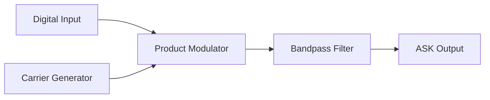

**ASK ડિમોડ્યુલેટર**:


**વેવફોર્મ્સ**:

```goat
Digital Input:
    ___     ___         ___     ___
___|   |___|   |_______|   |___|   |___
    1   0   1     0     1   0   1

Carrier Wave:
/\/\/\/\/\/\/\/\/\/\/\/\/\/\/\/\/\/\/\

ASK Output:
    /\/\    /\/\        /\/\    /\/\
___/    \__/    \______/    \__/    \___
High  Low  High   Low   High Low  High
```

- **મોડ્યુલેટર**: ડિજિટલ ઇનપુટના આધારે કેરિયર એમ્પ્લિટ્યુડ બદલે છે
- **ડિમોડ્યુલેટર**: એન્વેલોપ એક્સટ્રેક્ટ કરે છે અને થ્રેશોલ્ડ સાથે સરખાવે છે

**મેમરી ટ્રીક:** "APE" - "પોઝિટિવ હોય ત્યારે એમ્પ્લિફાય કરો, ઝીરો હોય ત્યારે એલિમિનેટ કરો"

## પ્રશ્ન 2(અ) અથવા [3 ગુણ]

**સિંગ્યુલરિટી ફંક્શન સમજાવો.**

**જવાબ**:

**સિંગ્યુલરિટી ફંક્શન**: ગાણિતિક ફંક્શન્સ જેમાં ચોક્કસ બિંદુઓ પર અવિરતતા અથવા અવ્યાખ્યાયિત મૂલ્યો હોય છે.

| સામાન્ય સિંગ્યુલરિટી ફંક્શન્સ | ગુણધર્મો |
|----------------------------|---------|
| **યુનિટ સ્ટેપ ફંક્શન u(t)** | t=0 પર 0 થી 1 પર કૂદકો મારે છે |
| **યુનિટ ઇમ્પલ્સ ફંક્શન δ(t)** | t=0 પર અનંત, બીજે ક્યાંય શૂન્ય, ક્ષેત્રફળ=1 |
| **યુનિટ રેમ્પ ફંક્શન r(t)** | યુનિટ સ્ટેપનું ડેરિવેટિવ ઇમ્પલ્સ છે |

**સંબંધો**:

- δ(t) = d/dt[u(t)]
- u(t) = ∫δ(t)dt
- r(t) = ∫u(t)dt

**મેમરી ટ્રીક:** "SIR" - "સિંગ્યુલરિટીઝ ઇન્ક્લુડ રેપિડ ચેન્જીસ"

## પ્રશ્ન 2(બ) અથવા [4 ગુણ]

**બીટ રેટ અને બોડ રેટ વચ્ચેનો તફાવત આપો.**

**જવાબ**:

| પેરામીટર | બિટ રેટ | બોડ રેટ |
|----------|---------|---------|
| **વ્યાખ્યા** | પ્રતિ સેકન્ડ પ્રસારિત બિટ્સની સંખ્યા | પ્રતિ સેકન્ડ પ્રસારિત સિમ્બોલ્સની સંખ્યા |
| **એકમ** | બિટ્સ પ્રતિ સેકન્ડ (bps) | સિમ્બોલ્સ પ્રતિ સેકન્ડ (બોડ) |
| **સંબંધ** | બિટ રેટ = બોડ રેટ × પ્રતિ સિમ્બોલ બિટ્સની સંખ્યા | બોડ રેટ = બિટ રેટ ÷ પ્રતિ સિમ્બોલ બિટ્સની સંખ્યા |
| **ઉદાહરણ** | QPSK માં, જો બોડ રેટ = 1200, બિટ રેટ = 2400 bps | 16-QAM માં, જો બિટ રેટ = 9600 bps, બોડ રેટ = 2400 |

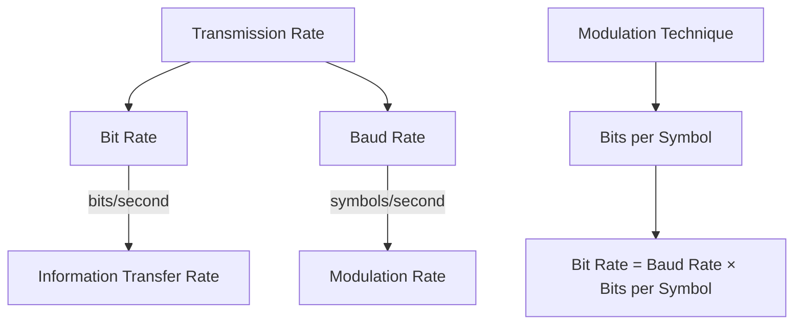

**મેમરી ટ્રીક:** "BBSR" - "બિટ્સ ફોર બાઇનરી સ્પીડ, બોડ્સ ફોર સિમ્બોલ રેટ"

## પ્રશ્ન 2(ક) અથવા [7 ગુણ]

**8-PSK સિગ્નલ નો સિધ્ધાંત સમજાવો. તેમજ તેના કોન્સ્ટેલેશન ડાયાગ્રામ અને વેવફોર્મ્સ દોરો.**

**જવાબ**:

**8-PSK (ફેઝ શિફ્ટ કીઇંગ)**:
એક ડિજિટલ મોડ્યુલેશન ટેકનિક જ્યાં ડેટા કેરિયર સિગ્નલના ફેઝને 8 અલગ અલગ પોઝિશન પર શિફ્ટ કરીને એન્કોડ કરવામાં આવે છે.

**સિદ્ધાંત**:

- દરેક સિમ્બોલ 3 બિટ્સ રજૂ કરે છે (log₂8 = 3)
- 45° ના ગુણાંકોમાં ફેઝ શિફ્ટ (360°÷8)
- સ્થિર એમ્પ્લિટ્યુડ જાળવે છે

**કોન્સ્ટેલેશન ડાયાગ્રામ**:

```goat
                  000(0°)
                     o
                     |
            001(45°) o         o 111(315°)
                   /             \
                  /               \
        010(90°) o                 o 110(270°)
                  \               /
                   \             /
           011(135°) o         o 101(225°)
                     |
                     o
                  100(180°)
```

**વેવફોર્મ**:

```goat
Data:   000    001    010    011    100    101    110    111
        ___    ___    ___    ___    ___    ___    ___    ___
       |   |  |   |  |   |  |   |  |   |  |   |  |   |  |   |
       |   |  |   |  |   |  |   |  |   |  |   |  |   |  |   |
Phase:  0°    45°    90°   135°   180°   225°   270°   315°
        /\     /\     /\     /\     /\     /\     /\     /\
       /  \   /  \   /  \   /  \   /  \   /  \   /  \   /  \
Signal:/    \ /    \ /    \ /    \ /    \ /    \ /    \ /    \
```

- **બેન્ડવિડ્થ કાર્યક્ષમતા**: 3 બિટ્સ પ્રતિ સિમ્બોલ
- **સ્થિર એમ્પ્લિટ્યુડ**: વધુ સારી પાવર કાર્યક્ષમતા
- **ભૂલની સંભાવના**: BPSK/QPSK કરતાં વધારે પરંતુ 16-PSK કરતાં ઓછી

**મેમરી ટ્રીક:** "8 પોઇન્ટ્સ શિફ્ટેડ ઇન K-સર્કલ" (8-PSK)

## પ્રશ્ન 3(અ) [3 ગુણ]

**FSK મોડયુલેટરનો બ્લોક ડાયાગ્રામ સમજાવો.**

**જવાબ**:

**FSK (ફ્રિક્વન્સી શિફ્ટ કીઇંગ)**: 
એક ડિજિટલ મોડ્યુલેશન ટેકનિક જ્યાં બાઇનરી ડેટા કેરિયર વેવની ફ્રિક્વન્સી બદલીને રજૂ કરવામાં આવે છે.

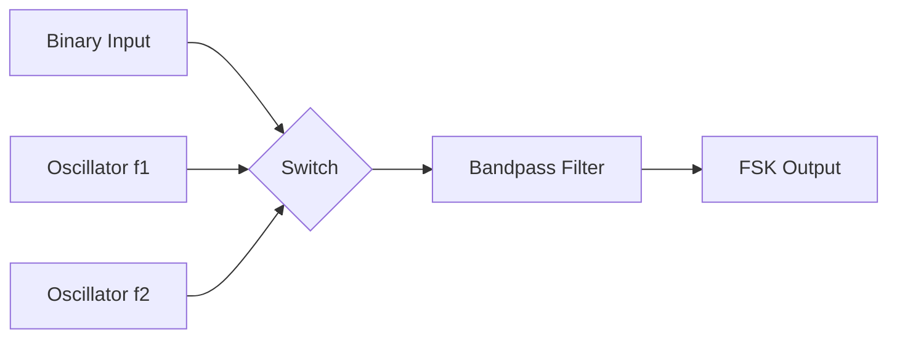

| કોમ્પોનન્ટ | કાર્ય |
|-----------|------|
| **બાઇનરી ઇનપુટ** | પ્રસારિત કરવાનો ડિજિટલ ડેટા (0s અને 1s) |
| **ઓસીલેટર 1** | બિટ '1' માટે ફ્રિક્વન્સી f₁ પર કેરિયર જનરેટ કરે છે |
| **ઓસીલેટર 2** | બિટ '0' માટે ફ્રિક્વન્સી f₂ પર કેરિયર જનરેટ કરે છે |
| **સ્વિચ** | ઇનપુટ બિટના આધારે યોગ્ય ફ્રિક્વન્સી પસંદ કરે છે |
| **બેન્ડપાસ ફિલ્ટર** | ફ્રિક્વન્સીઓ વચ્ચેના ટ્રાન્ઝિશન્સને સ્મૂધ કરે છે |

**મેમરી ટ્રીક:** "FISO" - "ફ્રિક્વન્સી ઇનપુટ સિલેક્ટ્સ ઓસિલેટર"

## પ્રશ્ન 3(બ) [4 ગુણ]

**1010110011 શ્રેણી માટે ASK અને FSK ના મોડયુલેશન વેવફોર્મ્સ દોરો.**

**જવાબ**:

```goat
Binary Input: 1    0    1    0    1    1    0    0    1    1
             _   _   _   _   _   _   _   _   _   _   _   _   _
             |   |   |   |   |   |   |   |   |   |   |   |   |
             |   |   |   |   |   |   |   |   |   |   |   |   |
            _|___|___|___|___|___|___|___|___|___|___|___|___|_

ASK Output:  |||       |||       |||||||||       ||||||||| 
             |||       |||       |||||||||       |||||||||
            _|||_____|||_____|||||||_____|||||||_______

FSK Output:  |||       |||       |||       |||       |||
             |||       |||       |||       |||       |||
            _|||_~~~~~~_|||_~~~~~~_|||||||_~~~~~~~~~~~~~~~~~~~~~~_|||||||_ 
                 ~~~~~~     ~~~~~~         ~~~~~~~~~~~~~~~~~~~~~~
High freq   (1)  Low(0)  (1)  Low(0)  (1)(1)  Low(0)  Low(0)  (1)(1)
```

**સમજૂતી**:

- **ASK**: બિટ '1' માટે ઉચ્ચ એમ્પ્લિટ્યુડ, બિટ '0' માટે નીચી એમ્પ્લિટ્યુડ
- **FSK**: બિટ '1' માટે ઉચ્ચતર ફ્રિક્વન્સી f₁, બિટ '0' માટે નીચી ફ્રિક્વન્સી f₂

**મેમરી ટ્રીક:** "ASK એમ્પ્લિટ્યુડ બદલે છે, FSK ફ્રિક્વન્સી બદલે છે"

## પ્રશ્ન 3(ક) [7 ગુણ]

**PSK સિગ્નલ નું નિર્માણ અને શોધ તેના કાર્યરત ડાયાગ્રામ ની મદદ સાથે સમજાવો.**

**જવાબ**:

**PSK (ફેઝ શિફ્ટ કીઇંગ)**:
એક ડિજિટલ મોડ્યુલેશન ટેકનિક જ્યાં ડેટાને કેરિયર સિગ્નલના ફેઝ બદલીને એન્કોડ કરવામાં આવે છે.

**PSK મોડ્યુલેટર**:

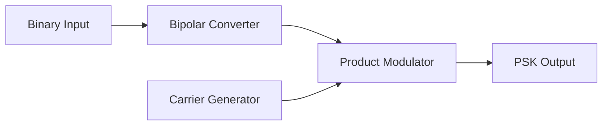

**PSK ડિમોડ્યુલેટર**:

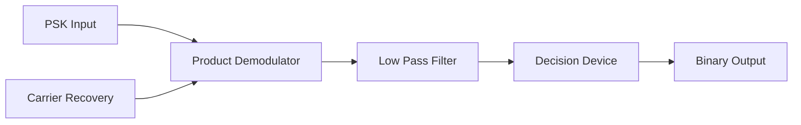

**વેવફોર્મ્સ**:

```goat
Binary Input:  1     0     1     1     0
              _    _    _    _    _    _    _
              |    |    |    |    |    |    |
              |    |    |    |    |    |    |
             _|____|____|____|____|____|____|___

Bipolar:      +A   -A    +A   +A   -A
              _    _    _    _    _    _    _
              |    |    |    |    |    |    |
              |    |    |    |    |    |    |
             _|____|____|____|____|____|____|___

Carrier:      /\/\/\/\/\/\/\/\/\/\/\/\/\/\/\/\

PSK Output:   /\/\  /\/\  /\/\  /\/\  /\/\
              phase phase phase phase phase
               0°   180°   0°    0°   180°
```

- **ઉત્પાદન**: બાઇનરી 1 → 0° ફેઝ, બાઇનરી 0 → 180° ફેઝ
- **શોધ**: કેરિયર રિકવરી સાથે કોહેરન્ટ ડિમોડ્યુલેશન
- **ફાયદા**: ASK કરતાં વધુ સારી નોઈઝ ઇમ્યુનિટી

**મેમરી ટ્રીક:** "PSK ફેઝીસ શિફ્ટ વિથ નોલેજ ઓફ કેરિયર"

## પ્રશ્ન 3(અ) અથવા [3 ગુણ]

**ASK,FSK,PSK,QPSK,8-PSK અને 16-QAM ડિજિટલ મોડ્યુલેશન ટેકનિક્સ માટે બિટ્સ પર સિમ્બોલ સરખાવો.**

**જવાબ**:

| મોડ્યુલેશન ટેકનિક | પ્રતિ સિમ્બોલ બિટ્સ | સ્ટેટ્સ | બેન્ડવિડ્થ કાર્યક્ષમતા |
|--------------------|------------------|---------|-------------------|
| **ASK** | 1 | 2 | 1 bit/Hz |
| **FSK** | 1 | 2 | 0.5 bit/Hz |
| **PSK (BPSK)** | 1 | 2 | 1 bit/Hz |
| **QPSK** | 2 | 4 | 2 bits/Hz |
| **8-PSK** | 3 | 8 | 3 bits/Hz |
| **16-QAM** | 4 | 16 | 4 bits/Hz |

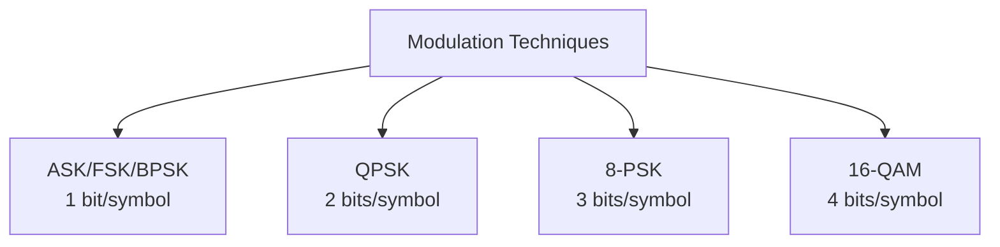

**મેમરી ટ્રીક:** "જેમ ફ્રિક્વન્સી/ફેઝ સ્ટેટ્સ ચોગણા થાય, બેન્ડવિડ્થ કાર્યક્ષમતા બમણી થાય"

## પ્રશ્ન 3(બ) અથવા [4 ગુણ]

**16 QAM નો કોન્સ્ટેલેશન ડાયાગ્રામ દોરો અને સમજાવો.**

**જવાબ**:

**16-QAM (ક્વોડ્રેચર એમ્પ્લિટ્યુડ મોડ્યુલેશન)**:
એક મોડ્યુલેશન ટેકનિક જે એમ્પ્લિટ્યુડ અને ફેઝ મોડ્યુલેશનને સંયોજિત કરે છે, જ્યાં દરેક સિમ્બોલ 4 બિટ્સ રજૂ કરે છે.

**કોન્સ્ટેલેશન ડાયાગ્રામ**:

```goat
      Q
      ^
      |   o   o   o   o
      |
      |   o   o   o   o
      |
------|---------------> I
      |   o   o   o   o
      |
      |   o   o   o   o
      |
```

**સમજૂતી**:

- **16 અલગ અલગ સ્ટેટ્સ**: દરેક પોઇન્ટ એક અનન્ય 4-બિટ સંયોજન રજૂ કરે છે
- **પ્રતિ સિમ્બોલ 4 બિટ્સ**: log₂16 = 4
- **મોડ્યુલેશન પેરામીટર્સ**: એમ્પ્લિટ્યુડ અને ફેઝ બંને બદલાય છે
- **સિમ્બોલ મેપિંગ**: બિટ ભૂલોને ઓછી કરવા માટે ગ્રે કોડિંગનો ઉપયોગ થાય છે

**મેમરી ટ્રીક:** "16 ક્વોડ્રન્ટ્સ એરેન્જ્ડ ઇન મેટ્રિક્સ"

## પ્રશ્ન 3(ક) અથવા [7 ગુણ]

**MSK સિગ્નલ નો સિધ્ધાંત સમજાવો. તેમજ તેના કોન્સ્ટેલેશન ડાયાગ્રામ અને વેવફોર્મ્સ દોરો.**

**જવાબ**:

**MSK (મિનિમમ શિફ્ટ કીઇંગ)**:
0.5 ના મોડ્યુલેશન ઇન્ડેક્સ સાથે એક સતત ફેઝ FSK મોડ્યુલેશન, જે સરળ ફેઝ પરિવર્તનો સુનિશ્ચિત કરે છે.

**સિદ્ધાંત**:

- CPFSK (કન્ટિન્યુઅસ ફેઝ FSK) નો વિશેષ કેસ
- ફ્રિક્વન્સી સેપરેશન બિટ રેટના અડધા જેટલું જ હોય છે
- અચાનક પરિવર્તનો ટાળીને સતત ફેઝ જાળવે છે
- મોડ્યુલેશન ઇન્ડેક્સ h = 0.5

**કોન્સ્ટેલેશન ડાયાગ્રામ**:

```goat
      Q
      ^
      |       o
      |     /   \
      |    /     \ 
      |   o       o
------|---------------> I
      |   o       o
      |    \     /
      |     \   /
      |       o
```

**વેવફોર્મ્સ**:

```goat
Data:      1      0      1      1      0
           _      _      _      _      _      _
           |      |      |      |      |      |
          _|______|______|______|______|______|___

MSK:      /        \      /\      /        \
         /          \    /  \    /          \
        /            \  /    \  /            \
       /              \/      \/              \
      /                                        \
```

મુખ્ય લક્ષણો:

- **સ્થિર એન્વેલોપ**: વધુ સારી પાવર કાર્યક્ષમતા
- **સ્પેક્ટ્રલ કાર્યક્ષમતા**: BFSK કરતાં સાંકડી બેન્ડવિડ્થ
- **સતત ફેઝ**: સરળ ટ્રાન્ઝિશન્સ, ઘટાડેલ સ્પેક્ટ્રલ ફેલાવો
- **OQPSK સંબંધ**: સાઇનસોઇડલ પલ્સ શેપિંગ સાથે ઓફસેટ QPSK તરીકે જોઈ શકાય છે

**મેમરી ટ્રીક:** "MSK મેક્સ સ્મૂથ K-ટ્રાન્ઝિશન્સ"

## પ્રશ્ન 4(અ) [3 ગુણ]

**FDD મલ્ટિપ્લેક્સિંગ સર્કિટ માં ખામી નિવારણ ની પ્રક્રિયા વર્ણવો.**

**જવાબ**:

| સ્ટેપ | ખામી નિવારણ પ્રક્રિયા |
|------|------------------------|
| **1. સિગ્નલ વેરિફિકેશન** | દરેક ફ્રિક્વન્સી બેન્ડ પર ઇનપુટ સિગ્નલ્સ ચેક કરો |
| **2. ફિલ્ટર એનાલિસિસ** | દરેક ચેનલ માટે બેન્ડપાસ ફિલ્ટર્સ ચકાસો |
| **3. મોડ્યુલેટર ટેસ્ટિંગ** | દરેક ચેનલમાં ફ્રિક્વન્સી ટ્રાન્સલેશન ટેસ્ટ કરો |
| **4. પાવર લેવલ્સ** | ઇનપુટ/આઉટપુટ પર સિગ્નલ સ્ટ્રેન્થ માપો |
| **5. આઇસોલેશન ચેક** | ચેનલો વચ્ચે ક્રોસ-ટોક માટે ટેસ્ટ કરો |

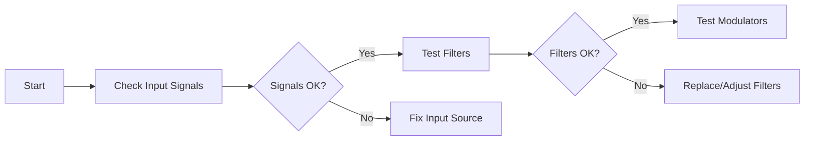

**મેમરી ટ્રીક:** "SFMPI" - "સિગ્નલ, ફિલ્ટર, મોડ્યુલેટર, પાવર, આઇસોલેશન"

## પ્રશ્ન 4(બ) [4 ગુણ]

**E1 કેરિયર ને T1 કેરિયર સાથે સરખાવો.**

**જવાબ**:

| પેરામીટર | E1 કેરિયર | T1 કેરિયર |
|----------|-----------|-----------|
| **સ્ટાન્ડર્ડ** | યુરોપિયન સ્ટાન્ડર્ડ | નોર્થ અમેરિકન સ્ટાન્ડર્ડ |
| **ડેટા રેટ** | 2.048 Mbps | 1.544 Mbps |
| **વૉઇસ ચેનલ્સ** | 30 ચેનલ્સ | 24 ચેનલ્સ |
| **ટાઇમ સ્લોટ્સ** | 32 ટાઇમ સ્લોટ્સ (TS0, TS1-TS15, TS16, TS17-TS31) | 24 ટાઇમ સ્લોટ્સ + ફ્રેમિંગ બિટ |
| **સિગ્નલિંગ** | ચેનલ 16 સિગ્નલિંગ માટે વપરાય છે | રોબ્ડ બિટ સિગ્નલિંગ |
| **ફ્રેમ સાઈઝ** | 256 બિટ્સ | 193 બિટ્સ |
| **બિટ રેટ પર ચેનલ** | 64 kbps | 64 kbps |

**મેમરી ટ્રીક:** "ET-DR" - "યુરોપિયન થર્ટી, ડબલ રેટ

## પ્રશ્ન 4(ક) [7 ગુણ]

**CDMA ટેકનિકને વિગતવાર સમજાવો.**

**જવાબ**:

**CDMA (કોડ ડિવિઝન મલ્ટિપલ એક્સેસ)**:
એક મલ્ટિપલ એક્સેસ ટેકનિક જ્યાં એક જ ફ્રિક્વન્સી બેન્ડને એક સાથે અનેક યુઝર્સ દ્વારા અનન્ય સ્પ્રેડિંગ કોડ્સનો ઉપયોગ કરીને શેર કરવામાં આવે છે.

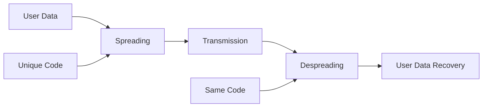

| મુખ્ય લક્ષણ | વર્ણન |
|-----------|------|
| **સ્પ્રેડિંગ કોડ્સ** | દરેક યુઝરને અનન્ય ઓર્થોગોનલ અથવા સ્યુડો-રેન્ડમ કોડ્સ આપવામાં આવે છે |
| **પ્રોસેસ ગેઇન** | સ્પ્રેડ બેન્ડવિડ્થનો મૂળ બેન્ડવિડ્થ સાથેનો ગુણોત્તર |
| **ઇન્ટરફેરન્સ રિજેક્શન** | અલગ કોડ્સ ધરાવતા યુઝર્સ એકબીજા માટે નોઇઝ તરીકે દેખાય છે |
| **સોફ્ટ હેન્ડઓફ** | મોબાઇલ એક સાથે બહુવિધ બેઝ સ્ટેશનો સાથે કોમ્યુનિકેટ કરી શકે છે |
| **પાવર કંટ્રોલ** | નજીક-દૂર સમસ્યા હલ કરવા માટે મહત્વપૂર્ણ |
| **કેપેસિટી** | ફ્રિક્વન્સી દ્વારા સખત રીતે મર્યાદિત નથી, પરંતુ સ્વીકાર્ય નોઇઝ લેવલ દ્વારા |

**કામકાજનો સિદ્ધાંત**:

- દરેક બિટને હાઇ-રેટ સ્પ્રેડિંગ કોડ (ચિપ્સ) સાથે ગુણાકાર કરવામાં આવે છે
- પરિણામી સિગ્નલ ઘણી વધારે પહોળી બેન્ડવિડ્થ રોકે છે
- રિસીવર મૂળ ડેટા પુનર્પ્રાપ્ત કરવા માટે સમાન કોડનો ઉપયોગ કરે છે
- અન્ય સિગ્નલ્સ રેન્ડમ નોઇઝ તરીકે દેખાય છે, કોરિલેશન દ્વારા નકારવામાં આવે છે

**મેમરી ટ્રીક:** "CUPS" - "કોડ્સ યુનિકલી પ્રોવાઇડ સેપરેશન"

## પ્રશ્ન 4(અ) અથવા [3 ગુણ]

**મલ્ટિપ્લેક્સિંગ ટેકનિક્સ ના વર્ગીકરણ પર ટંકનોંધ લખો.**

**જવાબ**:

**મલ્ટિપ્લેક્સિંગ ટેકનિક્સ**: એક જ માધ્યમ પર પ્રસારણ માટે બહુવિધ સિગ્નલ્સને સંયોજિત કરવાની પદ્ધતિઓ.

| પ્રકાર | આધારિત | ઉદાહરણો |
|-------|--------|----------|
| **ફ્રિક્વન્સી ડિવિઝન મલ્ટિપ્લેક્સિંગ (FDM)** | ફ્રિક્વન્સી ડોમેન | રેડિયો બ્રોડકાસ્ટિંગ, કેબલ TV |
| **ટાઇમ ડિવિઝન મલ્ટિપ્લેક્સિંગ (TDM)** | ટાઇમ ડોમેન | ડિજિટલ ટેલિફોન સિસ્ટમ, GSM |
| **કોડ ડિવિઝન મલ્ટિપ્લેક્સિંગ (CDM)** | કોડ ડોમેન | CDMA સેલ્યુલર સિસ્ટમ |
| **વેવલેન્થ ડિવિઝન મલ્ટિપ્લેક્સિંગ (WDM)** | વેવલેન્થ ડોમેન | ફાઇબર ઓપ્ટિક કોમ્યુનિકેશન |
| **સ્પેસ ડિવિઝન મલ્ટિપ્લેક્સિંગ (SDM)** | સ્પેશિયલ ડોમેન | MIMO વાયરલેસ સિસ્ટમ |

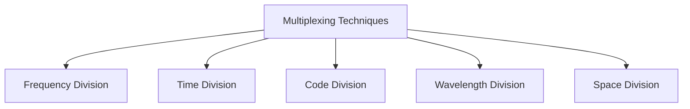

**મેમરી ટ્રીક:** "FTCWS" - "ફાઇવ ટેકનિક્સ ક્રિએટ વાઇડ સિસ્ટમ્સ"

## પ્રશ્ન 4(બ) અથવા [4 ગુણ]

**ટાઈમ ડિવિજન મલ્ટિપ્લેક્સિંગ ટેકનિક (TDM)નો બ્લોક ડાયાગ્રામ દોરો અને સમજાવો.**

**જવાબ**:

**ટાઇમ ડિવિઝન મલ્ટિપ્લેક્સિંગ (TDM)**:
એક ટેકનિક જ્યાં બહુવિધ સિગ્નલ્સ એક જ ચેનલને શેર કરે છે, દરેક સિગ્નલને અલગ અલગ ટાઇમ સ્લોટ્સ ફાળવીને.

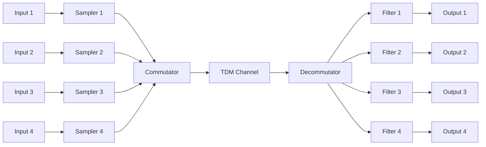

| કોમ્પોનન્ટ | કાર્ય |
|-----------|------|
| **સેમ્પલર્સ** | દરેક ઇનપુટ સિગ્નલને ≥ 2 × ઉચ્ચતમ ફ્રિક્વન્સી રેટે સેમ્પલ કરે છે |
| **કોમ્યુટેટર** | ક્રમશઃ દરેક ઇનપુટ ચેનલમાંથી સેમ્પલ્સ પસંદ કરે છે |
| **TDM ચેનલ** | સંયોજિત સિગ્નલ વહન કરે છે |
| **ડિકોમ્યુટેટર** | પ્રાપ્ત સેમ્પલ્સને યોગ્ય ચેનલ્સમાં વિતરિત કરે છે |
| **ફિલ્ટર્સ** | સેમ્પલ્સમાંથી મૂળ સિગ્નલ્સનું પુનઃનિર્માણ કરે છે |

**મેમરી ટ્રીક:** "SCTDF" - "સેમ્પલ, કમ્બાઇન, ટ્રાન્સમિટ, ડિસ્ટ્રિબ્યુટ, ફિલ્ટર"

## પ્રશ્ન 4(ક) અથવા [7 ગુણ]

**TDMA ટેકનિકને વિગતવાર સમજાવો.**

**જવાબ**:

**TDMA (ટાઇમ ડિવિઝન મલ્ટિપલ એક્સેસ)**:
એક ચેનલ એક્સેસ મેથડ જ્યાં બહુવિધ યુઝર્સ એક જ ફ્રિક્વન્સી ચેનલને અલગ અલગ ટાઇમ સ્લોટ્સમાં વિભાજિત કરીને શેર કરે છે.

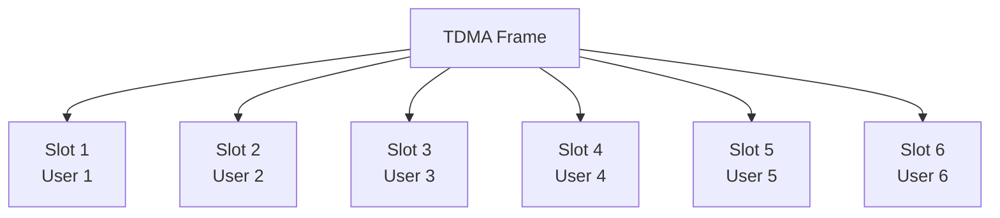

| મુખ્ય લક્ષણ | વર્ણન |
|-----------|------|
| **ફ્રેમ સ્ટ્રક્ચર** | ટાઇમ સ્લોટ્સમાં વિભાજિત નિશ્ચિત લંબાઈના ફ્રેમ્સ |
| **ગાર્ડ ટાઇમ** | ઓવરલેપ રોકવા માટે સ્લોટ્સ વચ્ચે નાના સમય અંતરાલ |
| **સિન્ક્રોનાઇઝેશન** | ચોક્કસ ટાઇમિંગ કોઓર્ડિનેશનની જરૂર |
| **ચેનલ યુટિલાઇઝેશન** | દરેક યુઝરને ટૂંકા સમયગાળા માટે સંપૂર્ણ બેન્ડવિડ્થ મળે છે |
| **પાવર કાર્યક્ષમતા** | ટ્રાન્સમીટર્સ વિરામયુક્ત કામ કરે છે, પાવર બચાવે છે |
| **કેપેસિટી** | ફ્રેમમાં ઉપલબ્ધ ટાઇમ સ્લોટ્સ દ્વારા મર્યાદિત |

**અમલીકરણની વિગતો**:

- દરેક યુઝર ફાળવેલ સ્લોટમાં ઝડપી બર્સ્ટમાં ટ્રાન્સમિટ કરે છે
- અવિરત ટ્રાન્સમિશન ન હોવાથી હેન્ડસેટ્સ નજીકના સેલ્સની સિગ્નલ સ્ટ્રેન્થ માપી શકે છે
- GSM (પ્રતિ ફ્રેમ 8 સ્લોટ્સ), DECT, સેટેલાઇટ સિસ્ટમ્સમાં વપરાય છે
- અનેક સ્લોટ્સ ફાળવીને અલગ અલગ ડેટા રેટ્સ સાથે સરળતાથી અનુકૂલ થઈ શકે છે

**મેમરી ટ્રીક:** "TDMA ટેક્સ ડિસ્ટિંક્ટ મોમેન્ટ્સ ફોર એક્સેસ"

## પ્રશ્ન 5(અ) [3 ગુણ]

**સંભાવના વ્યાખ્યાયિત કરો અને કોમ્યુનિકેશન માં તેનું મહત્વ લખો.**

**જવાબ**:

**સંભાવના**: કોઈ ઘટના ઘટવાની સંભાવનાનું માપ, 0 અને 1 વચ્ચેના નંબર તરીકે વ્યક્ત થાય છે.

| કોમ્યુનિકેશનમાં મહત્વ | સમજૂતી |
|-------------------|--------|
| **વિશ્વસનીયતા વિશ્લેષણ** | ભૂલ સંભાવના અને સિસ્ટમ વિશ્વસનીયતા ગણતરી |
| **નોઇઝ પર્ફોર્મન્સ** | રેન્ડમ નોઇઝની હાજરીમાં સિસ્ટમ પર્ફોર્મન્સની મૂલ્યાંકન |
| **ઇન્ફોર્મેશન થિયરી** | શેનનના ચેનલ કેપેસિટી સિદ્ધાંત માટે આધાર |
| **સિગ્નલ ડિટેક્શન** | ઓપ્ટિમલ ડિટેક્શન થ્રેશોલ્ડ નક્કી કરવું |

**મેમરી ટ્રીક:** "PRONIS" - "પ્રોબેબિલિટી ન્યુમેરિકલી ઇન્ડિકેટ્સ સિગ્નલ ક્વોલિટી"

## પ્રશ્ન 5(બ) [4 ગુણ]

**હાફમેન કોડ યોગ્ય દાખલા સાથે સમજાવો.**

**જવાબ**:

**હફમેન કોડ**: વેરિએબલ-લેન્થ પ્રીફિક્સ કોડિંગ અલ્ગોરિધમ જે વધુ વારંવાર આવતા સિમ્બોલ્સને ટૂંકા કોડ આપે છે.

**ઉદાહરણ**:
સિમ્બોલ્સ A, B, C, D ની સંભાવના 0.4, 0.3, 0.2, 0.1 અનુક્રમે વિચારો.

**હફમેન કોડિંગ પ્રક્રિયા**:


| સિમ્બોલ | સંભાવના | હફમેન કોડ |
|---------|---------|-----------|
| A | 0.4 | 0 |
| B | 0.3 | 10 |
| C | 0.2 | 110 |
| D | 0.1 | 111 |

**સરેરાશ કોડ લંબાઈ** = 0.4×1 + 0.3×2 + 0.2×3 + 0.1×3 = 1.9 બિટ્સ/સિમ્બોલ

**મેમરી ટ્રીક:** "HEMP" - "હફમેન એન્કોડ્સ મોર પ્રોબેબલ સિમ્બોલ્સ વિથ શોર્ટર કોડ્સ"

## પ્રશ્ન 5(ક) [7 ગુણ]

**ઈન્ટરનેટ ઓફ થિંગ્સ(IoT) ના ખ્યાલ અને મુખ્ય લક્ષણો સમજાવો.**

**જવાબ**:

**ઇન્ટરનેટ ઓફ થિંગ્સ (IoT)**: સેન્સર્સ, સોફ્ટવેર અને કનેક્ટિવિટી સાથે એમ્બેડેડ ભૌતિક વસ્તુઓનું નેટવર્ક જે તેમને ડેટા એકત્રિત કરવા અને આદાન-પ્રદાન કરવા સક્ષમ બનાવે છે.

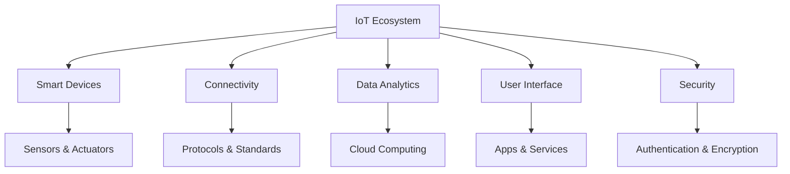

| મુખ્ય લક્ષણ | વર્ણન |
|-----------|------|
| **કનેક્ટિવિટી** | ડિવાઇસીસ વિવિધ પ્રોટોકોલ્સ (Wi-Fi, Bluetooth, LPWAN, 5G) દ્વારા ઇન્ટરનેટ/એકબીજા સાથે જોડાયેલ |
| **સેન્સિંગ કેપેબિલિટી** | સેન્સર્સ દ્વારા ભૌતિક પેરામીટર્સને ડિટેક્ટ કરવાની ક્ષમતા |
| **ઇન્ટેલિજન્સ** | ડિવાઇસ (એજ) અથવા ક્લાઉડ લેવલ પર ડેટા પ્રોસેસિંગ |
| **ઇન્ટરઓપરેબિલિટી** | વિવિધ પ્લેટફોર્મ્સ અને સિસ્ટમ્સ પર કામ કરવાની ક્ષમતા |
| **ઓટોમેશન** | માનવ હસ્તક્ષેપ વિના સ્વાયત્ત કાર્ય |
| **સ્કેલેબિલિટી** | કનેક્ટેડ ડિવાઇસીસની સંખ્યામાં વૃદ્ધિને સંભાળવાની ક્ષમતા |

**એપ્લિકેશન્સ**:

- સ્માર્ટ હોમ્સ (થર્મોસ્ટેટ, સિક્યુરિટી સિસ્ટમ)
- હેલ્થકેર (વેરેબલ ડિવાઇસીસ, રિમોટ મોનિટરિંગ)
- ઔદ્યોગિક ઓટોમેશન (પ્રિડિક્ટિવ મેન્ટેનન્સ)
- સ્માર્ટ સિટીઝ (ટ્રાફિક મેનેજમેન્ટ, વેસ્ટ મેનેજમેન્ટ)
- એગ્રીકલ્ચર (પ્રિસિઝન ફાર્મિંગ, લાઇવસ્ટોક મોનિટરિંગ)

**મેમરી ટ્રીક:** "CSIA" - "કનેક્ટ, સેન્સ, ઇન્ટરપ્રેટ, ઓટોમેટ"

## પ્રશ્ન 5(અ) અથવા [3 ગુણ]

**ચેનલ કેપસીટી ને SNR ના સંદર્ભમાં વ્યાખ્યાયિત કરો અને કોમ્યુનિકેશન માં તેનું મહત્વ લખો.**

**જવાબ**:

**ચેનલ કેપેસિટી**: કોમ્યુનિકેશન ચેનલ પર લગભગ નગણ્ય ભૂલ સંભાવના સાથે માહિતી પ્રસારિત કરી શકાય તે મહત્તમ દર.

**શેનનની ચેનલ કેપેસિટી ફોર્મ્યુલા**:
C = B × log₂(1 + SNR)

જ્યાં:

- C = ચેનલ કેપેસિટી (બિટ્સ પર સેકન્ડ)
- B = બેન્ડવિડ્થ (હર્ટ્ઝ)
- SNR = સિગ્નલ-ટુ-નોઇઝ રેશિયો

| કોમ્યુનિકેશનમાં મહત્વ | સમજૂતી |
|-------------------|--------|
| **પર્ફોર્મન્સ લિમિટ** | ભૂલ-મુક્ત ટ્રાન્સમિશન માટે સૈદ્ધાંતિક મહત્તમ ડેટા રેટ સેટ કરે છે |
| **સિસ્ટમ ડિઝાઇન** | મોડ્યુલેશન, કોડિંગ સ્કીમ્સની પસંદગીને માર્ગદર્શન આપે છે |
| **બેન્ડવિડ્થ કાર્યક્ષમતા** | બેન્ડવિડ્થ અને SNR વચ્ચેના ટ્રેડઓફ બતાવે છે |
| **લિંક બજેટ એનાલિસિસ** | જરૂરી ટ્રાન્સમિટ પાવર નક્કી કરવામાં મદદ કરે છે |

**મેમરી ટ્રીક:** "CBLSN" - "કેપેસિટી ઇક્વલ્સ બેન્ડવિડ્થ ટાઇમ્સ લોગ ઓફ સિગ્નલ-ટુ-નોઇઝ રેશિયો"

## પ્રશ્ન 5(બ) અથવા [4 ગુણ]

**શેનો ફેનો કોડ યોગ્ય દાખલા સાથે સમજાવો.**

**જવાબ**:

**શેનન-ફેનો કોડિંગ**: સિમ્બોલ્સના સેટને લગભગ સમાન સંભાવના સાથે બે સબસેટ્સમાં પુનરાવર્તી રીતે વિભાજિત કરીને તેમની સંભાવનાના આધારે સિમ્બોલ્સને વેરિએબલ-લેન્થ કોડ આપવાની ટેકનિક.

**ઉદાહરણ**:
સિમ્બોલ્સ A, B, C, D ની સંભાવના 0.4, 0.3, 0.2, 0.1 અનુક્રમે વિચારો.

**શેનન-ફેનો પ્રક્રિયા**:

1. સિમ્બોલ્સને સંભાવના અનુસાર ક્રમબદ્ધ કરો: A(0.4), B(0.3), C(0.2), D(0.1)
2. લગભગ સમાન સંભાવના સાથે ગ્રૂપમાં વિભાજિત કરો:
   - ગ્રૂપ 1: A(0.4) - '0' આપવામાં આવે છે
   - ગ્રૂપ 2: B(0.3), C(0.2), D(0.1) = 0.6 - '1' આપવામાં આવે છે
3. ગ્રૂપ 2 ને પુનરાવર્તી રીતે વિભાજિત કરો:
   - ગ્રૂપ 2.1: B(0.3) - '10' આપવામાં આવે છે
   - ગ્રૂપ 2.2: C(0.2), D(0.1) = 0.3 - '11' આપવામાં આવે છે
4. ગ્રૂપ 2.2 વિભાજિત કરો:
   - C(0.2) - '110' આપવામાં આવે છે
   - D(0.1) - '111' આપવામાં આવે છે

| સિમ્બોલ | સંભાવના | શેનન-ફેનો કોડ |
|---------|---------|---------------|
| A | 0.4 | 0 |
| B | 0.3 | 10 |
| C | 0.2 | 110 |
| D | 0.1 | 111 |

**સરેરાશ કોડ લંબાઈ** = 0.4×1 + 0.3×2 + 0.2×3 + 0.1×3 = 1.9 બિટ્સ/સિમ્બોલ

**મેમરી ટ્રીક:** "SFDS" - "શેનન ફેનો ડિવાઇડ્સ સિમ્બોલસેટ્સ"

## પ્રશ્ન 5(ક) અથવા [7 ગુણ]

**ડિજિટલ ટેલિફોન એક્સચેંજ નો બ્લોક ડાયાગ્રામ દોરો અને સમજાવો.**

**જવાબ**:

**ડિજિટલ ટેલિફોન એક્સચેંજ**: એક સિસ્ટમ જે એનાલોગ વૉઇસ સિગ્નલ્સને ડિજિટલ ફોર્મમાં રૂપાંતરિત કરીને અને ડિજિટલ સર્કિટ્સ દ્વારા સ્વિચિંગ કરીને ટેલિફોન કૉલ્સ જોડે છે.

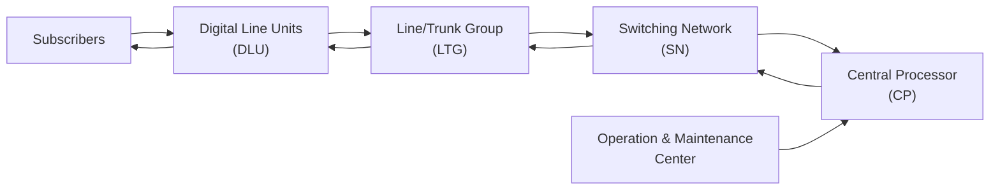

| બ્લોક | કાર્ય |
|------|------|
| **ડિજિટલ લાઇન યુનિટ્સ (DLU)** | સબ્સ્ક્રાઇબર લાઇન્સ અને એક્સચેંજ વચ્ચે ઇન્ટરફેસ, A/D રૂપાંતરણ, લાઇન કોડિંગ કરે છે |
| **લાઇન/ટ્રંક ગ્રુપ (LTG)** | સિગ્નલિંગ મેનેજ કરે છે, સબ્સ્ક્રાઇબર ચેનલ્સને મલ્ટિપ્લેક્સ/ડિમલ્ટિપ્લેક્સ કરે છે |
| **સ્વિચિંગ નેટવર્ક (SN)** | કોર સ્વિચિંગ ફેબ્રિક, ચેનલ્સ વચ્ચે કનેક્શન પાથ સ્થાપિત કરે છે |
| **સેન્ટ્રલ પ્રોસેસર (CP)** | બધી એક્સચેંજ ઓપરેશન્સ, કૉલ પ્રોસેસિંગ, રાઉટિંગ નિર્ણયો નિયંત્રિત કરે છે |
| **ઓપરેશન & મેન્ટેનન્સ સેન્ટર** | સિસ્ટમ પર્ફોર્મન્સ મોનિટર કરે છે, ફોલ્ટ ડિટેક્શન, ટ્રાફિક એનાલિસિસ |

**મુખ્ય લક્ષણો**:

- **ટાઇમ ડિવિઝન સ્વિચિંગ**: અલગ અલગ ટાઇમ સ્લોટ્સ જોડે છે
- **સ્પેસ ડિવિઝન સ્વિચિંગ**: અલગ અલગ ભૌતિક પાથ જોડે છે
- **સ્ટોર્ડ પ્રોગ્રામ કંટ્રોલ**: સોફ્ટવેર-આધારિત કૉલ પ્રોસેસિંગ
- **કોમન ચેનલ સિગ્નલિંગ**: અલગ સિગ્નલિંગ ચેનલ (SS7)
- **નોન-બ્લોકિંગ આર્કિટેક્ચર**: બધા કૉલ્સ એક સાથે જોડી શકાય છે

**મેમરી ટ્રીક:** "DLSCO" - "ડિજિટલ લાઇન્સ સ્વિચ કૉલ્સ ઓર્ડરલી"
