## Question 1(a) [3 marks]

**Discuss the various communication channels characteristics.**

**Answer**:

| Channel Characteristic | Description |
|------------------------|-------------|
| **Bit rate** | Maximum number of bits transmitted per second |
| **Baud rate** | Number of signal units/symbols transmitted per second |
| **Bandwidth** | Range of frequencies required for transmission |
| **Repeater distance** | Maximum distance between repeaters to maintain signal quality |
| **Noise immunity** | Ability to resist interference from external sources |

**Mnemonic:** "BBRN" - "Better Bandwidth Requires Nice planning"

## Question 1(b) [4 marks]

**Give the difference between even and odd signal.**

**Answer**:

| Even Signal | Odd Signal |
|-------------|------------|
| **Mathematical representation**: x(−t) = x(t) | **Mathematical representation**: x(−t) = −x(t) |
| **Symmetry**: Mirror symmetry around y-axis | **Symmetry**: Origin symmetry (rotational) |
| **Fourier series**: Contains only cosine terms | **Fourier series**: Contains only sine terms |
| **Examples**: cos(t), t² | **Examples**: sin(t), t³ |

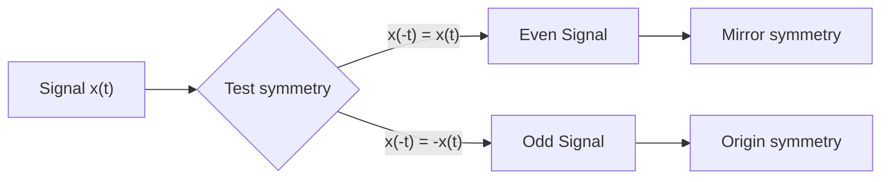

**Mnemonic:** "EVEN signals are Equal when flipped, ODD signals are Opposite when flipped"

## Question 1(c) [7 marks]

**Define repeater. Explain how repeater works with help of necessary circuit and waveforms.**

**Answer**:

**Repeater**: A device that receives, amplifies, and retransmits a signal to extend the transmission distance without degradation.

**Working Principle**: 
Repeaters regenerate digital signals to overcome attenuation and noise accumulation in transmission lines.

**Circuit Diagram**:

```goat
            +-------------+                  +-------------+
 Input      |             |    Regenerated   |             |    Output
Signal -->--|  Receiver   |------Signal----->|  Transmitter|----Signal-->
            |             |                  |             |
            +-------------+                  +-------------+
                    |                               |
                    |       +------------+          |
                    +------>|   Clock    |<---------+
                            | Recovery   |
                            +------------+
```

**Waveform**:

```goat
  Input Signal            Repeater              Output Signal
     _____                                         _____
    |     |                                       |     |
____|     |____     -->     ___         -->   ____|     |____
    |     |                                       |     |
    |     |                                       |     |
      Degraded                                    Regenerated
```

- **Signal reception**: Detects incoming weak/distorted signals
- **Amplification**: Strengthens the signal power
- **Regeneration**: Reconstructs original digital waveform
- **Retransmission**: Sends restored signal to next segment

**Mnemonic:** "RARE" - "Receive, Amplify, Regenerate, Emit"

## Question 1(c) OR [7 marks]

**Draw block diagram of digital communication system and explain in detail.**

**Answer**:

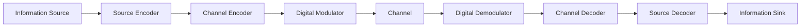

| Block | Function |
|-------|----------|
| **Information Source** | Generates message to be transmitted (voice, video, data) |
| **Source Encoder** | Converts source data to digital form and removes redundancy |
| **Channel Encoder** | Adds controlled redundancy for error detection/correction |
| **Digital Modulator** | Converts digital data to signals suitable for transmission |
| **Channel** | Physical medium through which signals travel |
| **Digital Demodulator** | Extracts digital data from received signals |
| **Channel Decoder** | Detects/corrects errors using added redundancy |
| **Source Decoder** | Reconstructs original source information |

**Mnemonic:** "Send Clear Data Messages, Carefully Decode Secure Information"

## Question 2(a) [3 marks]

**Define Unit step function, Unit impulse function, Unit ramp function.**

**Answer**:

| Function | Definition | Mathematical Form |
|----------|------------|-------------------|
| **Unit Step Function** | Takes value 0 for negative time and 1 for positive time | u(t) = {0, t < 0; 1, t ≥ 0} |
| **Unit Impulse Function** | Infinitely high, zero width pulse with area 1 | δ(t) = {∞, t = 0; 0, t ≠ 0} |
| **Unit Ramp Function** | Increases linearly with time for positive time values | r(t) = {0, t < 0; t, t ≥ 0} |

**Mnemonic:** "SIR" - "Step Instantly, Impulse Rapidly, Ramp Gradually"

## Question 2(b) [4 marks]

**Define Continues time and discrete time signals and explain with example.**

**Answer**:

| Signal Type | Definition | Example | Representation |
|-------------|------------|---------|----------------|
| **Continuous-time Signal** | Defined for all values of time within its duration | Sinusoidal wave x(t) = sin(t) | Smooth, unbroken curve |
| **Discrete-time Signal** | Defined only at specific time instants | Digital samples x[n] = sin(nTs) | Sequence of distinct values |

**Diagram**:

```goat
Continuous-time:   
      /\      /\      /\      /\      /\  
     /  \    /  \    /  \    /  \    /  \ 
----/    \--/    \--/    \--/    \--/    \----> t
    
Discrete-time:
      o       o       o       o       o  
     /       /       /       /       /    
----/-------/-------/-------/-------/----> n
    o       o       o       o       o
```

- **Continuous-time**: Defined for all time t ∈ R (infinite values)
- **Discrete-time**: Defined only at specific instants n ∈ Z (countable values)

**Mnemonic:** "CADD" - "Continuous Always, Discrete Dots"

## Question 2(c) [7 marks]

**Explain the block diagram of ASK modulator and de-modulator with waveform.**

**Answer**:

**ASK (Amplitude Shift Keying)**:
A digital modulation technique where binary data is represented by varying the amplitude of a carrier wave.

**ASK Modulator**:

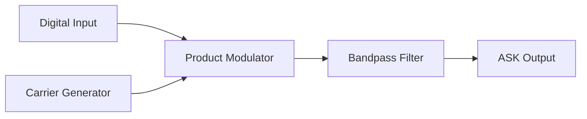

**ASK Demodulator**:


**Waveforms**:

```goat
Digital Input:
    ___     ___         ___     ___
___|   |___|   |_______|   |___|   |___
    1   0   1     0     1   0   1

Carrier Wave:
/\/\/\/\/\/\/\/\/\/\/\/\/\/\/\/\/\/\/\

ASK Output:
    /\/\    /\/\        /\/\    /\/\
___/    \__/    \______/    \__/    \___
High  Low  High   Low   High Low  High
```

- **Modulator**: Varies carrier amplitude based on digital input
- **Demodulator**: Extracts envelope and compares to threshold

**Mnemonic:** "APE" - "Amplify when Positive, Eliminate when zero"

## Question 2(a) OR [3 marks]

**Explain Singularity function.**

**Answer**:

**Singularity Function**: Mathematical functions that have discontinuities or undefined values at specific points.

| Common Singularity Functions | Properties |
|------------------------------|------------|
| **Unit Step Function u(t)** | Jumps from 0 to 1 at t=0 |
| **Unit Impulse Function δ(t)** | Infinite at t=0, zero elsewhere, with area=1 |
| **Unit Ramp Function r(t)** | Derivative of unit step is impulse |

**Relationships**:

- δ(t) = d/dt[u(t)]
- u(t) = ∫δ(t)dt
- r(t) = ∫u(t)dt

**Mnemonic:** "SIR" - "Singularities Include Rapid changes"

## Question 2(b) OR [4 marks]

**Give the difference between bit rate and baud rate.**

**Answer**:

| Parameter | Bit Rate | Baud Rate |
|-----------|----------|-----------|
| **Definition** | Number of bits transmitted per second | Number of symbols transmitted per second |
| **Unit** | bits per second (bps) | symbols per second (Baud) |
| **Relation** | Bit rate = Baud rate × Number of bits per symbol | Baud rate = Bit rate ÷ Number of bits per symbol |
| **Example** | In QPSK, if Baud rate = 1200, Bit rate = 2400 bps | In 16-QAM, if Bit rate = 9600 bps, Baud rate = 2400 |

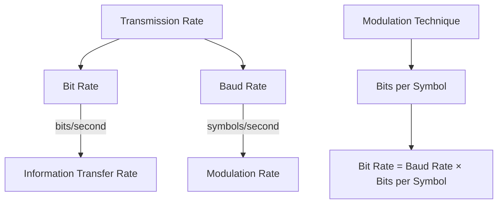

**Mnemonic:** "BBSR" - "Bits for Binary Speed, Bauds for Symbol Rate"

## Question 2(c) OR [7 marks]

**Explain the Principle of 8-PSK signal. Also draw constellation diagram and waveforms of its.**

**Answer**:

**8-PSK (Phase Shift Keying)**:
A digital modulation technique where data is encoded by shifting the phase of a carrier signal to 8 different positions.

**Principle**:

- Each symbol represents 3 bits (log₂8 = 3)
- Phase shifts in multiples of 45° (360°÷8)
- Maintains constant amplitude

**Constellation Diagram**:

```goat
                  000(0°)
                     o
                     |
            001(45°) o         o 111(315°)
                   /             \
                  /               \
        010(90°) o                 o 110(270°)
                  \               /
                   \             /
           011(135°) o         o 101(225°)
                     |
                     o
                  100(180°)
```

**Waveform**:

```goat
Data:   000    001    010    011    100    101    110    111
        ___    ___    ___    ___    ___    ___    ___    ___
       |   |  |   |  |   |  |   |  |   |  |   |  |   |  |   |
       |   |  |   |  |   |  |   |  |   |  |   |  |   |  |   |
Phase:  0°    45°    90°   135°   180°   225°   270°   315°
        /\     /\     /\     /\     /\     /\     /\     /\
       /  \   /  \   /  \   /  \   /  \   /  \   /  \   /  \
Signal:/    \ /    \ /    \ /    \ /    \ /    \ /    \ /    \
```

- **Bandwidth efficiency**: 3 bits per symbol
- **Constant amplitude**: Better power efficiency
- **Error probability**: Higher than BPSK/QPSK but lower than 16-PSK

**Mnemonic:** "8 Points Shifted in K-circle" (8-PSK)

## Question 3(a) [3 marks]

**Explain the block diagram of FSK modulator.**

**Answer**:

**FSK (Frequency Shift Keying)**: 
A digital modulation technique where binary data is represented by varying the frequency of a carrier wave.

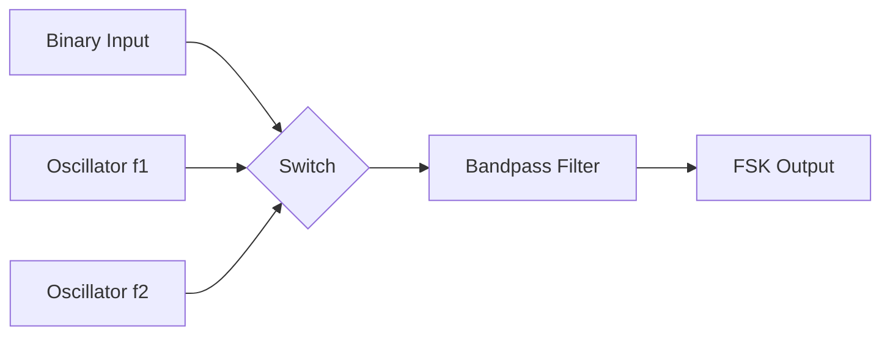

| Component | Function |
|-----------|----------|
| **Binary Input** | Digital data (0s and 1s) to be transmitted |
| **Oscillator 1** | Generates carrier at frequency f₁ for bit '1' |
| **Oscillator 2** | Generates carrier at frequency f₂ for bit '0' |
| **Switch** | Selects appropriate frequency based on input bit |
| **Bandpass Filter** | Smooths transitions between frequencies |

**Mnemonic:** "FISO" - "Frequency Input Selects Oscillator"

## Question 3(b) [4 marks]

**Draw the ASK and FSK modulation waveform for the sequence of 1010110011.**

**Answer**:

```goat
Binary Input: 1    0    1    0    1    1    0    0    1    1
             _   _   _   _   _   _   _   _   _   _   _   _   _
             |   |   |   |   |   |   |   |   |   |   |   |   |
             |   |   |   |   |   |   |   |   |   |   |   |   |
            _|___|___|___|___|___|___|___|___|___|___|___|___|_

ASK Output:  |||       |||       |||||||||       ||||||||| 
             |||       |||       |||||||||       |||||||||
            _|||_____|||_____|||||||_____|||||||_______

FSK Output:  |||       |||       |||       |||       |||
             |||       |||       |||       |||       |||
            _|||_~~~~~~_|||_~~~~~~_|||||||_~~~~~~~~~~~~~~~~~~~~~~_|||||||_ 
                 ~~~~~~     ~~~~~~         ~~~~~~~~~~~~~~~~~~~~~~
High freq   (1)  Low(0)  (1)  Low(0)  (1)(1)  Low(0)  Low(0)  (1)(1)
```

**Explanation**:

- **ASK**: High amplitude for bit '1', low amplitude for bit '0'
- **FSK**: Higher frequency f₁ for bit '1', lower frequency f₂ for bit '0'

**Mnemonic:** "ASK changes Amplitude, FSK changes Frequency"

## Question 3(c) [7 marks]

**Explain PSK signal generation and detection with help of its functional diagram.**

**Answer**:

**PSK (Phase Shift Keying)**:
A digital modulation technique where data is encoded by changing the phase of a carrier signal.

**PSK Modulator**:

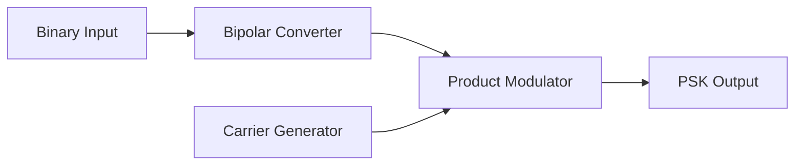

**PSK Demodulator**:

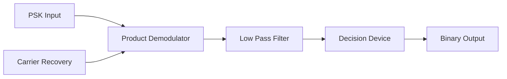

**Waveforms**:

```goat
Binary Input:  1     0     1     1     0
              _    _    _    _    _    _    _
              |    |    |    |    |    |    |
              |    |    |    |    |    |    |
             _|____|____|____|____|____|____|___

Bipolar:      +A   -A    +A   +A   -A
              _    _    _    _    _    _    _
              |    |    |    |    |    |    |
              |    |    |    |    |    |    |
             _|____|____|____|____|____|____|___

Carrier:      /\/\/\/\/\/\/\/\/\/\/\/\/\/\/\/\

PSK Output:   /\/\  /\/\  /\/\  /\/\  /\/\
              phase phase phase phase phase
               0°   180°   0°    0°   180°
```

- **Generation**: Binary 1 → 0° phase, Binary 0 → 180° phase
- **Detection**: Coherent demodulation with carrier recovery
- **Advantages**: Better noise immunity than ASK

**Mnemonic:** "PSK Phases Shift with Knowledge of carrier"

## Question 3(a) OR [3 marks]

**Compare Bits PER Symbol for digital modulation techniques-ASK, FSK, PSK, QPSK, 8-PSK and 16-QAM.**

**Answer**:

| Modulation Technique | Bits per Symbol | States | Bandwidth Efficiency |
|----------------------|-----------------|--------|---------------------|
| **ASK** | 1 | 2 | 1 bit/Hz |
| **FSK** | 1 | 2 | 0.5 bit/Hz |
| **PSK (BPSK)** | 1 | 2 | 1 bit/Hz |
| **QPSK** | 2 | 4 | 2 bits/Hz |
| **8-PSK** | 3 | 8 | 3 bits/Hz |
| **16-QAM** | 4 | 16 | 4 bits/Hz |

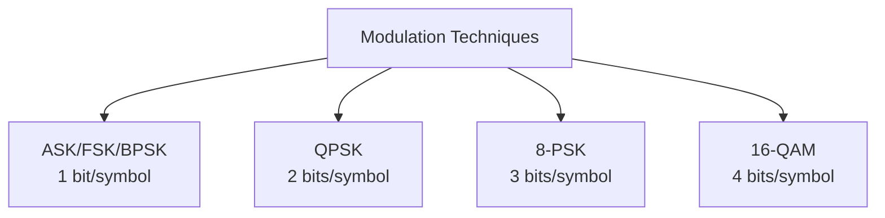

**Mnemonic:** "As Frequency/Phase States Quadruple, Bandwidth Efficiency Doubles"

## Question 3(b) OR [4 marks]

**Draw and explain the constellation diagram of 16-QAM.**

**Answer**:

**16-QAM (Quadrature Amplitude Modulation)**:
A modulation technique that combines amplitude and phase modulation, where each symbol represents 4 bits.

**Constellation Diagram**:

```goat
      Q
      ^
      |   o   o   o   o
      |
      |   o   o   o   o
      |
------|---------------> I
      |   o   o   o   o
      |
      |   o   o   o   o
      |
```

**Explanation**:

- **16 distinct states**: Each point represents a unique 4-bit combination
- **Carries 4 bits per symbol**: log₂16 = 4
- **Modulation parameters**: Both amplitude and phase are varied
- **Symbol mapping**: Gray coding used to minimize bit errors

**Mnemonic:** "16 Quadrants Arranged in Matrix"

## Question 3(c) OR [7 marks]

**Explain the Principle of MSK signal. Also draw constellation diagram and waveforms of its.**

**Answer**:

**MSK (Minimum Shift Keying)**:
A continuous phase FSK modulation with a modulation index of 0.5, ensuring smooth phase transitions.

**Principle**:

- Special case of CPFSK (Continuous Phase FSK)
- Frequency separation exactly equals half the bit rate
- Maintains continuous phase, avoiding abrupt transitions
- Modulation index h = 0.5

**Constellation Diagram**:

```goat
      Q
      ^
      |       o
      |     /   \
      |    /     \ 
      |   o       o
------|---------------> I
      |   o       o
      |    \     /
      |     \   /
      |       o
```

**Waveforms**:

```goat
Data:      1      0      1      1      0
           _      _      _      _      _      _
           |      |      |      |      |      |
          _|______|______|______|______|______|___

MSK:      /        \      /\      /        \
         /          \    /  \    /          \
        /            \  /    \  /            \
       /              \/      \/              \
      /                                        \
```

Key Features:

- **Constant envelope**: Better power efficiency
- **Spectral efficiency**: Narrower bandwidth than BFSK
- **Continuous phase**: Smoother transitions, reduced spectral spreading
- **OQPSK relation**: Can be viewed as offset QPSK with sinusoidal pulse shaping

**Mnemonic:** "MSK Makes Smooth K-transitions"

## Question 4(a) [3 marks]

**Describe the procedure to troubleshoot the FDD multiplexing circuit.**

**Answer**:

| Step | Troubleshooting Procedure |
|------|---------------------------|
| **1. Signal Verification** | Check input signals at each frequency band |
| **2. Filter Analysis** | Verify bandpass filters for each channel |
| **3. Modulator Testing** | Test frequency translation in each channel |
| **4. Power Levels** | Measure signal strength at input/output |
| **5. Isolation Check** | Test for cross-talk between channels |

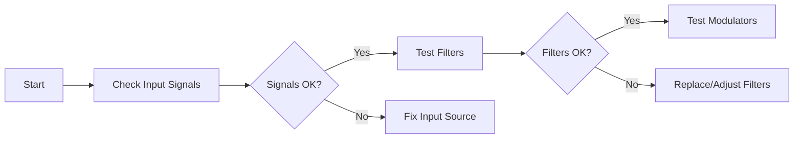

**Mnemonic:** "SFMPI" - "Signal, Filter, Modulator, Power, Isolation"

## Question 4(b) [4 marks]

**Compare E1 carrier with T1 carrier.**

**Answer**:

| Parameter | E1 Carrier | T1 Carrier |
|-----------|------------|------------|
| **Standard** | European standard | North American standard |
| **Data Rate** | 2.048 Mbps | 1.544 Mbps |
| **Voice Channels** | 30 channels | 24 channels |
| **Time Slots** | 32 time slots (TS0, TS1-TS15, TS16, TS17-TS31) | 24 time slots + framing bit |
| **Signaling** | Channel 16 used for signaling | Robbed bit signaling |
| **Frame Size** | 256 bits | 193 bits |
| **Bit Rate per Channel** | 64 kbps | 64 kbps |

**Mnemonic:** "ET-DR" - "European Thirty, Double Rate"

## Question 4(c) [7 marks]

**Explain CDMA technique in detail.**

**Answer**:

**CDMA (Code Division Multiple Access)**:
A multiple access technique where multiple users share the same frequency band simultaneously by using unique spreading codes.

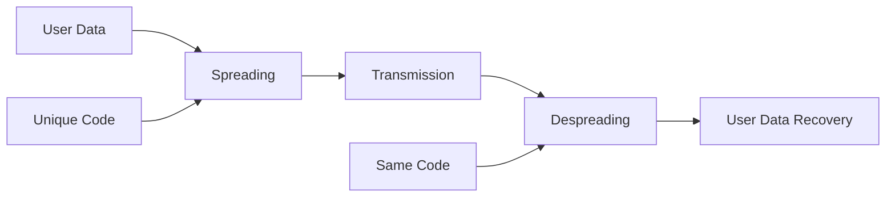

| Key Feature | Description |
|-------------|-------------|
| **Spreading Codes** | Unique orthogonal or pseudo-random codes assigned to each user |
| **Process Gain** | Ratio of spread bandwidth to original bandwidth |
| **Interference Rejection** | Users with different codes appear as noise to each other |
| **Soft Handoff** | Mobile can communicate with multiple base stations simultaneously |
| **Power Control** | Critical to solve near-far problem |
| **Capacity** | Not strictly limited by frequency, but by acceptable noise level |

**Working Principle**:

- Each bit is multiplied by a high-rate spreading code (chips)
- Resulting signal occupies much wider bandwidth
- Receiver uses same code to recover original data
- Other signals appear as random noise, rejected by correlation

**Mnemonic:** "CUPS" - "Codes Uniquely Provide Separation"

## Question 4(a) OR [3 marks]

**Write a short not on classification of multiplexing techniques.**

**Answer**:

**Multiplexing Techniques**: Methods to combine multiple signals for transmission over a single medium.

| Type | Based On | Examples |
|------|----------|----------|
| **Frequency Division Multiplexing (FDM)** | Frequency domain | Radio broadcasting, cable TV |
| **Time Division Multiplexing (TDM)** | Time domain | Digital telephone systems, GSM |
| **Code Division Multiplexing (CDM)** | Code domain | CDMA cellular systems |
| **Wavelength Division Multiplexing (WDM)** | Wavelength domain | Fiber optic communications |
| **Space Division Multiplexing (SDM)** | Spatial domain | MIMO wireless systems |

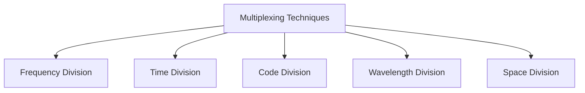

**Mnemonic:** "FTCWS" - "Five Techniques Create Wide Systems"

## Question 4(b) OR [4 marks]

**Draw and explain block diagram of Time Division Multiplexing technique (TDM).**

**Answer**:

**Time Division Multiplexing (TDM)**:
A technique where multiple signals share the same channel by allocating different time slots to each signal.

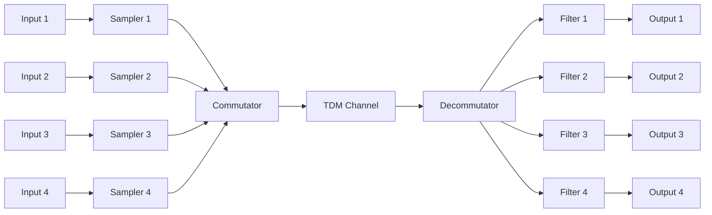

| Component | Function |
|-----------|----------|
| **Samplers** | Sample each input signal at rate ≥ 2 × highest frequency |
| **Commutator** | Sequentially selects samples from each input channel |
| **TDM Channel** | Carries the combined signal |
| **Decommutator** | Distributes received samples to appropriate channels |
| **Filters** | Reconstruct original signals from samples |

**Mnemonic:** "SCTDF" - "Sample, Combine, Transmit, Distribute, Filter"

## Question 4(c) OR [7 marks]

**Explain TDMA technique in detail.**

**Answer**:

**TDMA (Time Division Multiple Access)**:
A channel access method where multiple users share the same frequency channel by dividing it into different time slots.

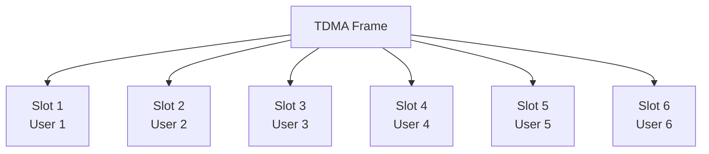

| Key Feature | Description |
|-------------|-------------|
| **Frame Structure** | Fixed-length frames divided into time slots |
| **Guard Time** | Small time gaps between slots to prevent overlap |
| **Synchronization** | Requires precise timing coordination |
| **Channel Utilization** | Each user gets entire bandwidth for short duration |
| **Power Efficiency** | Transmitters operate intermittently, saving power |
| **Capacity** | Limited by available time slots in frame |

**Implementation Details**:

- Each user transmits in rapid bursts within assigned slot
- Non-continuous transmission allows handsets to measure signal strengths of nearby cells
- Used in GSM (8 slots per frame), DECT, satellite systems
- Easily adapts to varying data rates by assigning multiple slots

**Mnemonic:** "TDMA Takes Distinct Moments for Access"

## Question 5(a) [3 marks]

**Define probability and write it Significance of in communication.**

**Answer**:

**Probability**: A measure of the likelihood of an event occurring, expressed as a number between 0 and 1.

| Significance in Communication | Explanation |
|-------------------------------|-------------|
| **Reliability Analysis** | Calculating error probabilities and system reliability |
| **Noise Performance** | Evaluating system performance in presence of random noise |
| **Information Theory** | Foundation for Shannon's channel capacity theorem |
| **Signal Detection** | Determining optimal detection thresholds |

**Mnemonic:** "PRONIS" - "PRObability Numerically Indicates Signal quality"

## Question 5(b) [4 marks]

**Explain Huffman code with suitable example.**

**Answer**:

**Huffman Code**: A variable-length prefix coding algorithm that assigns shorter codes to more frequent symbols.

**Example**:
Consider symbols A, B, C, D with probabilities 0.4, 0.3, 0.2, 0.1

**Huffman Coding Process**:

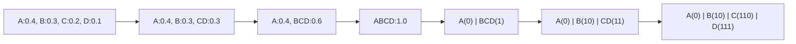

| Symbol | Probability | Huffman Code |
|--------|-------------|--------------|
| A | 0.4 | 0 |
| B | 0.3 | 10 |
| C | 0.2 | 110 |
| D | 0.1 | 111 |

**Average Code Length** = 0.4×1 + 0.3×2 + 0.2×3 + 0.1×3 = 1.9 bits/symbol

**Mnemonic:** "HEMP" - "Huffman Encodes More Probable symbols with shorter codes"

## Question 5(c) [7 marks]

**Explain concept and key features of Internet of Things (IoT).**

**Answer**:

**Internet of Things (IoT)**: A network of physical objects embedded with sensors, software, and connectivity that enables them to collect and exchange data.

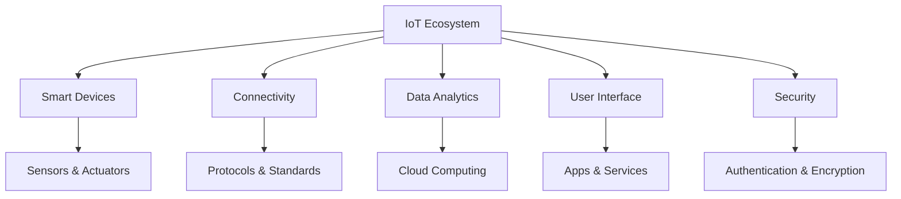

| Key Feature | Description |
|-------------|-------------|
| **Connectivity** | Devices connected to internet/each other via various protocols (Wi-Fi, Bluetooth, LPWAN, 5G) |
| **Sensing Capability** | Ability to detect physical parameters through sensors |
| **Intelligence** | Data processing at device (edge) or cloud level |
| **Interoperability** | Ability to work across different platforms and systems |
| **Automation** | Autonomous functioning without human intervention |
| **Scalability** | Ability to handle growth in number of connected devices |

**Applications**:

- Smart homes (thermostats, security systems)
- Healthcare (wearable devices, remote monitoring)
- Industrial automation (predictive maintenance)
- Smart cities (traffic management, waste management)
- Agriculture (precision farming, livestock monitoring)

**Mnemonic:** "CSIA" - "Connect, Sense, Interpret, Automate"

## Question 5(a) OR [3 marks]

**Define Channel Capacity in terms of SNR and its importance in communication.**

**Answer**:

**Channel Capacity**: Maximum rate at which information can be transmitted over a communication channel with arbitrarily small error probability.

**Shannon's Channel Capacity Formula**:
C = B × log₂(1 + SNR)

Where:

- C = Channel capacity in bits per second
- B = Bandwidth in Hertz
- SNR = Signal-to-Noise Ratio

| Importance in Communication | Explanation |
|----------------------------|-------------|
| **Performance Limit** | Sets theoretical maximum data rate for error-free transmission |
| **System Design** | Guides selection of modulation, coding schemes |
| **Bandwidth Efficiency** | Shows tradeoff between bandwidth and SNR |
| **Link Budget Analysis** | Helps determine required transmit power |

**Mnemonic:** "CBLSN" - "Capacity equals Bandwidth times Log of Signal-to-Noise ratio"

## Question 5(b) OR [4 marks]

**Explain Shanon Fano code with suitable example.**

**Answer**:

**Shannon-Fano Coding**: A technique that assigns variable-length codes to symbols based on their probabilities by recursively dividing the set of symbols into two subsets with approximately equal probabilities.

**Example**:
Consider symbols A, B, C, D with probabilities 0.4, 0.3, 0.2, 0.1

**Shannon-Fano Procedure**:

1. Sort symbols by probability: A(0.4), B(0.3), C(0.2), D(0.1)
2. Divide into groups with nearly equal probability:
   - Group 1: A(0.4) - assigned '0'
   - Group 2: B(0.3), C(0.2), D(0.1) = 0.6 - assigned '1'
3. Recursively divide Group 2:
   - Group 2.1: B(0.3) - assigned '10'
   - Group 2.2: C(0.2), D(0.1) = 0.3 - assigned '11'
4. Divide Group 2.2:
   - C(0.2) - assigned '110'
   - D(0.1) - assigned '111'

| Symbol | Probability | Shannon-Fano Code |
|--------|-------------|-------------------|
| A | 0.4 | 0 |
| B | 0.3 | 10 |
| C | 0.2 | 110 |
| D | 0.1 | 111 |

**Average Code Length** = 0.4×1 + 0.3×2 + 0.2×3 + 0.1×3 = 1.9 bits/symbol

**Mnemonic:** "SFDS" - "Shannon Fano Divides Symbolsets"

## Question 5(c) OR [7 marks]

**Draw and explain block diagram of Digital telephone exchange.**

**Answer**:

**Digital Telephone Exchange**: A system that connects telephone calls by converting analog voice signals to digital form and switching them through digital circuits.

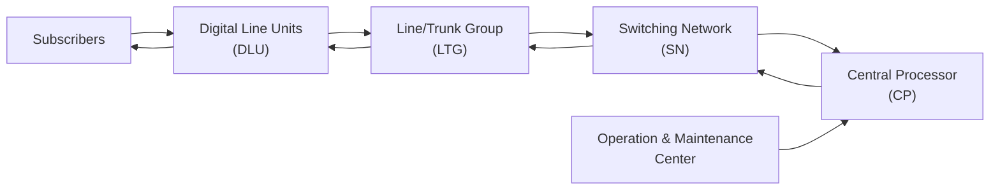

| Block | Function |
|-------|----------|
| **Digital Line Units (DLU)** | Interface between subscriber lines and exchange, perform A/D conversion, line coding |
| **Line/Trunk Group (LTG)** | Manages signaling, multiplexes/demultiplexes subscriber channels |
| **Switching Network (SN)** | Core switching fabric, establishes connection paths between channels |
| **Central Processor (CP)** | Controls all exchange operations, call processing, routing decisions |
| **Operation & Maintenance Center** | Monitors system performance, fault detection, traffic analysis |

**Key Features**:

- **Time Division Switching**: Connects different time slots
- **Space Division Switching**: Connects different physical paths
- **Stored Program Control**: Software-based call processing
- **Common Channel Signaling**: Separate signaling channel (SS7)
- **Non-blocking Architecture**: All calls can be connected simultaneously

**Mnemonic:** "DLSCO" - "Digital Lines Switch Calls Orderly"
