## પ્રશ્ન 1(અ) [3 ગુણ]

**વેવ ફોર્મ સાથે કંટીન્યુઅસ ટાઇમ સિગ્નલ અને ડિસ્ક્રીટ ટાઇમ સિગ્નલ વ્યાખ્યાયિત કરો.**

**જવાબ**:

**કોષ્ટક: સિગ્નલ પ્રકારોની તુલના**

| સિગ્નલ પ્રકાર | વ્યાખ્યા | વેવફોર્મ ઉદાહરણ |
|-------------|------------|------------------|
| **કંટીન્યુઅસ ટાઇમ સિગ્નલ** | દરેક સમય બિંદુ પર સતત મૂલ્યો સાથે વ્યાખ્યાયિત થયેલું સિગ્નલ | સ્મૂધ, અવિચ્છિન્ન વક્ર |
| **ડિસ્ક્રીટ ટાઇમ સિગ્નલ** | ફક્ત ચોક્કસ સમય બિંદુઓ પર સેમ્પલ્સ સાથે વ્યાખ્યાયિત થયેલું સિગ્નલ | અલગ-અલગ બિંદુઓની શ્રેણી |

**આકૃતિ:**

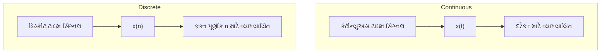

- **એમ્પ્લિટ્યુડ સાતત્ય**: કંટીન્યુઅસ સિગ્નલમાં, એમ્પ્લિટ્યુડ કોઈપણ મૂલ્ય લઈ શકે છે, જ્યારે ડિસ્ક્રીટ સિગ્નલમાં ચોક્કસ એમ્પ્લિટ્યુડ મૂલ્યો હોય છે
- **ગાણિતિક નોંધ**: કંટીન્યુઅસ સિગ્નલ માટે x(t), ડિસ્ક્રીટ સિગ્નલ માટે x[n] અથવા x(n) વપરાય છે

**મેમરી ટ્રીક:** "કોસીડી" - **કો**ન્ટિન્યુઅસ **સી**ગ્નલ નદીની જેમ વહે છે, **ડી**સ્ક્રીટ સિગ્નલ પગલાં જેવા હોય છે

## પ્રશ્ન 1(બ) [4 ગુણ]

**પિરિયોડિક અને એપિરિયોડિક સિગ્નલ સમજાવો.**

**જવાબ**:

**કોષ્ટક: પિરિયોડિક અને એપિરિયોડિક સિગ્નલની તુલના**

| ગુણધર્મ | પિરિયોડિક સિગ્નલ | એપિરિયોડિક સિગ્નલ |
|----------|----------------|------------------|
| **વ્યાખ્યા** | નિશ્ચિત સમય અંતરાલ પછી એકદમ પુનરાવર્તિત થાય છે | પુનરાવર્તિત થતું નથી અથવા અનંત પીરિયડ ધરાવે છે |
| **ગાણિતિક અભિવ્યક્તિ** | x(t) = x(t + nT) દરેક t માટે | x(t) ≠ x(t + T) કોઈપણ T માટે |
| **ઊર્જા/પાવર** | અનંત ઊર્જા, મર્યાદિત પાવર | મર્યાદિત ઊર્જા, શૂન્ય સરેરાશ પાવર |
| **ઉદાહરણો** | સાઇન વેવ્સ, સ્ક્વેર વેવ્સ | સિંગલ પલ્સ, ડેમ્પ્ડ સાઇન્યુસોઇડ |

**આકૃતિ:**

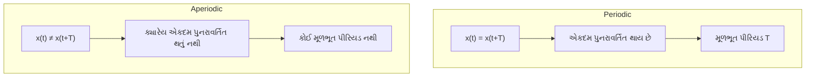

- **સ્પેક્ટ્રલ પ્રોપર્ટી**: પિરિયોડિક સિગ્નલમાં ડિસ્ક્રીટ ફ્રિક્વન્સી કોમ્પોનન્ટ્સ હોય છે, એપિરિયોડિકમાં સતત સ્પેક્ટ્રમ હોય છે
- **ફૂરિયર એનાલિસિસ**: પિરિયોડિક સિગ્નલ માટે ફૂરિયર સીરીઝ, એપિરિયોડિક માટે ફૂરિયર ટ્રાન્સફોર્મ વપરાય છે

**મેમરી ટ્રીક:** "પાઅસ" - **પિ**રિયોડિક સિગ્નલ્સ હંમેશા **સ**મયમાં **આ**વર્તિત થાય છે

## પ્રશ્ન 1(ક) [7 ગુણ]

**ડિજિટલ કોમ્યુનિકેશન સિસ્ટમનો બ્લોક ડાયાગ્રામ સમજાવો.**

**જવાબ**:

**આકૃતિ: ડિજિટલ કોમ્યુનિકેશન સિસ્ટમ**

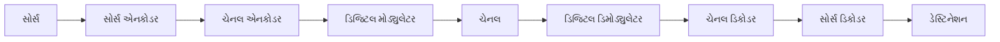

**કોષ્ટક: ડિજિટલ કોમ્યુનિકેશન સિસ્ટમના બ્લોક્સના કાર્યો**

| બ્લોક | કાર્ય | ઉદાહરણ |
|-------|----------|---------|
| **સોર્સ** | ટ્રાન્સમિટ કરવાના સંદેશાનું જનરેશન | માઇક્રોફોન, કીબોર્ડ |
| **સોર્સ એનકોડર** | રિડન્ડન્સી દૂર કરે છે, ડેટા કોમ્પ્રેસ કરે છે | હફમેન કોડિંગ, JPEG |
| **ચેનલ એનકોડર** | ભૂલ શોધવા/સુધારવા માટે નિયંત્રિત રિડન્ડન્સી ઉમેરે છે | હેમિંગ કોડ્સ, CRC |
| **ડિજિટલ મોડ્યુલેટર** | ડિજિટલ ડેટાને એનાલોગ સિગ્નલમાં રૂપાંતરિત કરે છે | ASK, FSK, PSK |
| **ચેનલ** | સિગ્નલ વહન કરતું માધ્યમ | વાયર્ડ, વાયરલેસ, ઓપ્ટિકલ ફાઇબર |
| **ડિજિટલ ડિમોડ્યુલેટર** | પ્રાપ્ત સિગ્નલને પાછું ડિજિટલમાં રૂપાંતરિત કરે છે | ASK, FSK, PSK ડિમોડ્યુલેટર્સ |
| **ચેનલ ડિકોડર** | ઉમેરાયેલી રિડન્ડન્સીનો ઉપયોગ કરી ભૂલો શોધે/સુધારે છે | ભૂલ સુધારણા સર્કિટ્સ |
| **સોર્સ ડિકોડર** | મૂળ સંદેશાનું પુનઃનિર્માણ કરે છે | ડેટા ડિકોમ્પ્રેશન |

- **ફાયદો**: નોઇઝ ઇમ્યુનિટી, સુરક્ષિત ટ્રાન્સમિશન, મલ્ટિપ્લેક્સિંગ ક્ષમતા, ડિજિટલ સિસ્ટમ્સ સાથે એકીકરણ
- **મુખ્ય પ્રક્રિયાઓ**: સેમ્પલિંગ, ક્વોન્ટાઇઝેશન, કોડિંગ, મોડ્યુલેશન/ડિમોડ્યુલેશન

**મેમરી ટ્રીક:** "સેચમદેસિ" - **સો**ર્સ **એ**ન્કોડ કરે, **ચે**નલ કોડ, **મો**ડ્યુલેટ, **ચે**નલ, **ડિ**મોડ્યુલેટ, **સિ**ંક પ્રાપ્ત કરે

## પ્રશ્ન 1(ક) OR [7 ગુણ]

**સિંગ્યુલારીટી ફંકશન સમજાવો.**

**જવાબ**:

**કોષ્ટક: સામાન્ય સિંગ્યુલારીટી ફંકશન્સ**

| ફંકશન | ગાણિતિક વ્યાખ્યા | ગુણધર્મો | ઉપયોગો |
|----------|-------------------------|------------|--------------|
| **યુનિટ સ્ટેપ** | u(t) = 1 જ્યારે t ≥ 0, 0 જ્યારે t < 0 | t=0 પર અસાતત્ય | સ્વિચ-ઓન સિગ્નલ્સ, હેવિસાઇડ ફંકશન |
| **યુનિટ ઇમ્પલ્સ** | δ(t) = ∞ જ્યારે t = 0, અન્યત્ર 0, ∫δ(t)dt = 1 | અનંત ઊંચાઈવાળું, શૂન્ય પહોળાઈવાળું | ઇમ્પલ્સ રિસ્પોન્સ, સેમ્પલિંગ |
| **યુનિટ રેમ્પ** | r(t) = t·u(t) | સાતત્ય પરંતુ t=0 પર ડિફરેન્શિયેબલ નથી | લિનિયર ટાઇમ ફંકશન્સ |
| **યુનિટ પેરાબોલા** | p(t) = (t²/2)·u(t) | યુનિટ ઇમ્પલ્સનું બીજું ઇન્ટિગ્રલ | એક્સેલરેશનથી પોઝિશન |

**આકૃતિ:**

```goat
   ^
   |                    ┌────────────────
   |                    │ Unit Step
   |────────────────────┘
   |
   +-------------------------> t
   |
   ^                     /
   |                    /
   |                   / Unit Ramp
   |─────────────────/
   |                /
   +---------------/------------> t
   |              /
   ^
   |             .
   |             │ Unit Impulse
   |─────────────┼──────────────> t
   |             '
```

- **ઇન્ટિગ્રેશન સંબંધ**: દરેક ફંકશન એ અગાઉના ફંકશનનું ઇન્ટિગ્રલ છે
- **ગાણિતિક ટૂલકિટ**: જટિલ સિસ્ટમ્સને સરળ ઘટકોમાં વિભાજિત કરીને વિશ્લેષણ કરવા માટે ઉપયોગી

**મેમરી ટ્રીક:** "સ્ટેઇંપેરે" - **સ્ટે**પ **ઇં**પલ્સ **પે**રાબોલા **રે**મ્પ - ઇન્ટિગ્રેશનના વધતા ક્રમમાં ફંકશન્સ

## પ્રશ્ન 2(અ) [3 ગુણ]

**સિગ્નલ 10 બીટ/સિગ્નલ એલીમેન્ટ ધરાવે છે. જો સેકન્ડ દીઠ 100 સિગ્નલ એલીમેન્ટ મોકલવામાં આવે છે. બીટ રેટ શોધો.**

**જવાબ**:

**ઉકેલ:**

```
બીટ રેટ = સિગ્નલ એલિમેન્ટ દીઠ બિટ્સની સંખ્યા × પ્રતિ સેકન્ડ સિગ્નલ એલિમેન્ટની સંખ્યા
બીટ રેટ = 10 બિટ્સ/સિગ્નલ એલિમેન્ટ × 100 સિગ્નલ એલિમેન્ટ/સેકન્ડ
બીટ રેટ = 1000 બિટ્સ/સેકન્ડ = 1 kbps
```

**આકૃતિ:**


- **બીટ રેટ**: પ્રતિ સેકંડ ટ્રાન્સમિટ થતા બિટ્સની સંખ્યા (bps)
- **સિગ્નલ એલિમેન્ટ**: એક કે વધુ બિટ્સનું ભૌતિક પ્રગટીકરણ

**મેમરી ટ્રીક:** "બીએઈ" - **બી**ટ રેટ એ **એ**લિમેન્ટ્સ ગુણ્યા દરેક **ઈ**લેમેન્ટ દીઠ બિટ્સ

## પ્રશ્ન 2(બ) [4 ગુણ]

**ઈવન અને ઓડ સિગ્નલ સમજાવો.**

**જવાબ**:

**કોષ્ટક: ઈવન અને ઓડ સિગ્નલની તુલના**

| ગુણધર્મ | ઈવન સિગ્નલ | ઓડ સિગ્નલ |
|----------|-------------|------------|
| **વ્યાખ્યા** | f(-t) = f(t) | f(-t) = -f(t) |
| **સિમેટ્રી** | y-અક્ષની આસપાસ મિરર સિમેટ્રી | ઓરિજિન સિમેટ્રી (રોટેશનલ) |
| **ફૂરિયર સીરીઝ** | માત્ર કોસાઇન ટર્મ્સ ધરાવે છે | માત્ર સાઇન ટર્મ્સ ધરાવે છે |
| **ઉદાહરણો** | કોસાઇન, |t|, cos(ωt) | સાઇન, t, sgn(t) |

**આકૃતિ:**

```goat
  Even Signal             Odd Signal
     ^                       ^
     |                       |
     |     .-.               |      /
     |    /   \              |     /
     |---/-----\----->       |----/----\----->
     |  /       \            |   /      \
     | '         '           |  /        \
     |                       | /          \
```

- **ડિકમ્પોઝિશન**: કોઈપણ સિગ્નલને ઈવન અને ઓડ ઘટકોના સરવાળા તરીકે વિભાજિત કરી શકાય છે
- **ઈવન પાર્ટ**: f_e(t) = [f(t) + f(-t)]/2
- **ઓડ પાર્ટ**: f_o(t) = [f(t) - f(-t)]/2

**મેમરી ટ્રીક:** "ઈસઓપ" - **ઈ**વન **સિ**ગ્નલ્સ મિરર સિમેટ્રી ધરાવે છે, **ઓ**ડ સિગ્નલ્સ મિરર થતાં ઊલટા થઈ જાય છે - **પ**રાવર્તન

## પ્રશ્ન 2(ક) [7 ગુણ]

**ASK મોડ્યુલેટર અને ડી-મોડ્યુલેટરના બ્લોક ડાયાગ્રામને વેવફોર્મ સાથે સમજાવો.**

**જવાબ**:

**ASK મોડ્યુલેટર ડાયાગ્રામ:**

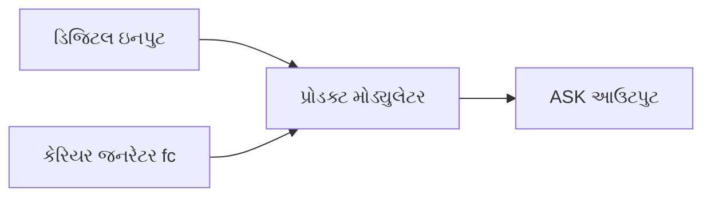

**ASK ડિમોડ્યુલેટર ડાયાગ્રામ:**


**વેવફોર્મ:**

```goat
Digital Input
   _    __     _
  | |  |  |   | |
__|_|__|  |___|_|___

Carrier Signal
 /\/\/\/\/\/\/\/\/\/\

ASK Output
     /\/\    /\/\/\
    /    \  /      \
___/      \/        \___
```

**કોષ્ટક: ASK મોડ્યુલેશન અને ડિમોડ્યુલેશન પ્રક્રિયા**

| પ્રક્રિયા | કાર્ય | ગાણિતિક રજૂઆત |
|---------|----------|----------------------------|
| **મોડ્યુલેશન** | કેરિયરની એમ્પ્લિટ્યુડમાં ફેરફાર | s(t) = A·m(t)·cos(2πf_c·t) |
| **ફિલ્ટરિંગ** | બેન્ડની બહારનો નોઇઝ દૂર કરે છે | f_c પર કેન્દ્રિત બેન્ડપાસ ફિલ્ટર |
| **ડિટેક્શન** | એન્વેલપ પુનઃપ્રાપ્ત કરે છે | ડાયોડ અને કેપેસિટરનો ઉપયોગ |
| **નિર્ણય** | ડિજિટલમાં રૂપાંતરિત કરે છે | થ્રેશોલ્ડ કમ્પેરિઝન |

- **બાઇનરી ASK**: '1' માટે કેરિયર હાજર, '0' માટે ગેરહાજર
- **બેન્ડવિડ્થ**: ન્યૂનતમ BW = બિટ રેટ, સામાન્ય રીતે બેવડો બિટ રેટ વપરાય છે

**મેમરી ટ્રીક:** "એએમપીએસ" - **એ**એસકે કેરિયર **એ**મ્પ્લિટ્યુડને ડિજિટલ સિગ્નલ સાથે **મો**ડ્યુલેટ કરે છે

## પ્રશ્ન 2(અ) OR [3 ગુણ]

**સિગ્નલમાં 4000 બીટ/સેકન્ડનો બીટ રેટ અને 1000 બોડનો બોડ રેટ હોય છે. દરેક સિગ્નલ એલીમેન્ટ દ્વારા કેટલા ડેટા એલીમેન્ટ વહન કરવામાં આવે છે?**

**જવાબ**:

**ઉકેલ:**

```
સિગ્નલ એલિમેન્ટ દીઠ બિટ્સની સંખ્યા = બિટ રેટ / બોડ રેટ
સિગ્નલ એલિમેન્ટ દીઠ બિટ્સની સંખ્યા = 4000 બિટ્સ/સેકન્ડ / 1000 સિગ્નલ એલિમેન્ટ/સેકન્ડ
સિગ્નલ એલિમેન્ટ દીઠ બિટ્સની સંખ્યા = 4 બિટ્સ/સિગ્નલ એલિમેન્ટ
```

**આકૃતિ:**

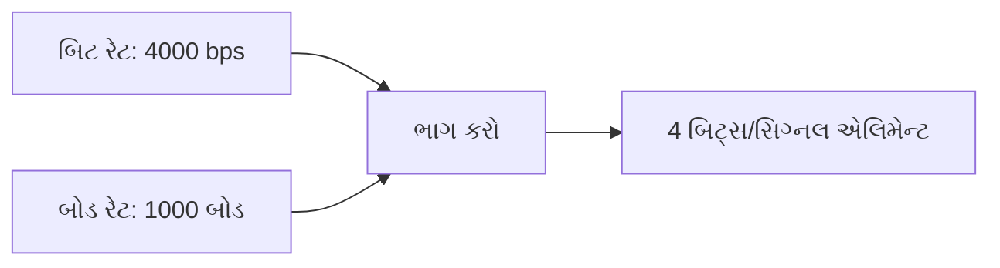

- **બિટ રેટ**: બિટ્સ પ્રતિ સેકંડમાં ડેટા ટ્રાન્સમિશન સ્પીડ
- **બોડ રેટ**: સિગ્નલ એલિમેન્ટ્સ (સિમ્બોલ્સ) પ્રતિ સેકંડની સંખ્યા

**મેમરી ટ્રીક:** "બીબીઆર" - સિમ્બોલ દીઠ **બી**ટ્સ બરાબર **બી**ટ રેટ ભાગ્યા બોડ **ર**ેટ

## પ્રશ્ન 2(બ) OR [4 ગુણ]

**વિવિધ સંચાર ચેનલોની લાક્ષણિકતાઓની ચર્ચા કરો.**

**જવાબ**:

**કોષ્ટક: સંચાર ચેનલની લાક્ષણિકતાઓ**

| લાક્ષણિકતા | વર્ણન | મહત્વ |
|----------------|-------------|------------|
| **બેન્ડવિડ્થ** | ચેનલ ટ્રાન્સમિટ કરી શકે તેવી ફ્રિક્વન્સીઓની રેન્જ | મહત્તમ ડેટા રેટ નક્કી કરે છે |
| **નોઇઝ** | અનચાહ્યા સિગ્નલ્સ જે ટ્રાન્સમિશનને બગાડે છે | સિગ્નલ ક્વોલિટી અને ભૂલ દરને અસર કરે છે |
| **એટેન્યુએશન** | ટ્રાન્સમિશન દરમિયાન સિગ્નલ સ્ટ્રેન્થની ઘટાડો | ટ્રાન્સમિશન અંતરને મર્યાદિત કરે છે |
| **ડિસ્ટોર્શન** | સિગ્નલના આકાર/ટાઈમિંગમાં ફેરફાર | ઇન્ટરસિમ્બોલ ઇન્ટરફેરન્સ કારણે બને છે |
| **ચેનલ કેપેસિટી** | મનસ્વી નાના એરર સાથે મહત્તમ ડેટા રેટ | શેનનના થિયરમ દ્વારા આપવામાં આવે છે |

**આકૃતિ:**

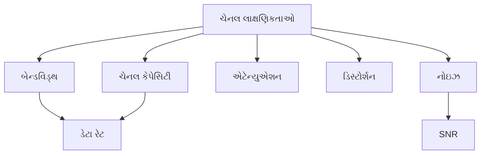

- **SNR (સિગ્નલ-ટુ-નોઇઝ રેશિયો)**: સિગ્નલ પાવર અને નોઇઝ પાવરનો ગુણોત્તર
- **ચેનલ કેપેસિટી**: C = B·log₂(1+SNR), જ્યાં B એ બેન્ડવિડ્થ છે

**મેમરી ટ્રીક:** "બએનડક" - **બે**ન્ડવિડ્થ, **એ**ટેન્યુએશન, **ન**ોઇઝ, **ડિ**સ્ટોર્શન **ક**ેપેસિટી નક્કી કરે છે

## પ્રશ્ન 2(ક) OR [7 ગુણ]

**ASK, FSK અને PSK ની સરખામણી કરો.**

**જવાબ**:

**કોષ્ટક: ડિજિટલ મોડ્યુલેશન ટેકનિક્સની સરખામણી**

| પેરામીટર | ASK | FSK | PSK |
|-----------|-----|-----|-----|
| **સિદ્ધાંત** | એમ્પ્લિટ્યુડમાં ફેરફાર | ફ્રિક્વન્સીમાં ફેરફાર | ફેઝમાં ફેરફાર |
| **ગાણિતિક અભિવ્યક્તિ** | s(t) = A·m(t)·cos(2πf_c·t) | s(t) = A·cos(2π[f_c+m(t)Δf]t) | s(t) = A·cos(2πf_c·t+m(t)·π) |
| **બેન્ડવિડ્થ** | r_b (ન્યૂનતમ) | 2(Δf+r_b/2) | 2r_b |
| **પાવર એફિશિયન્સી** | નબળી | મધ્યમ | સારી |
| **નોઇઝ ઇમ્યુનિટી** | નબળી | વધુ સારી | શ્રેષ્ઠ |
| **અમલીકરણ જટિલતા** | સરળ | મધ્યમ | જટિલ |
| **ઉપયોગો** | ઓછી કિંમતની સિસ્ટમ્સ | નોઇઝવાળા વાતાવરણ | ઉચ્ચ કાર્યક્ષમતાવાળી સિસ્ટમ્સ |

**આકૃતિ:**

```goat
Digital Input:
   _    __     _
  | |  |  |   | |
__|_|__|  |___|_|___

ASK:
     /\/\    /\/\/\
    /    \  /      \
___/      \/        \___

FSK:
 /\/\/\      /\/\/\
/      \    /      \
        \/\/        \/\/

PSK:
 /\/\/\/\/\/\/\/\/\/\/\
/  \  /  \  /  \  /  \
    \/    \/    \/    \
```

- **બિટ એરર રેટ**: PSK < FSK < ASK (PSK શ્રેષ્ઠ છે)
- **જટિલતા ક્રમ**: ASK < FSK < PSK (ASK સૌથી સરળ છે)

**મેમરી ટ્રીક:** "એફપી" - **એ**મ્પ્લિટ્યુડ, **ફ્રી**ક્વન્સી, **ફે**ઝ - ASK, FSK, PSK માં સંશોધિત થાય છે

## પ્રશ્ન 3(અ) [3 ગુણ]

**બ્લોક ડાયાગ્રામ અને આઉટપુટ વેવફોર્મ સાથે FSK મોડ્યુલેટરનું કાર્ય સમજાવો.**

**જવાબ**:

**FSK મોડ્યુલેટર બ્લોક ડાયાગ્રામ:**

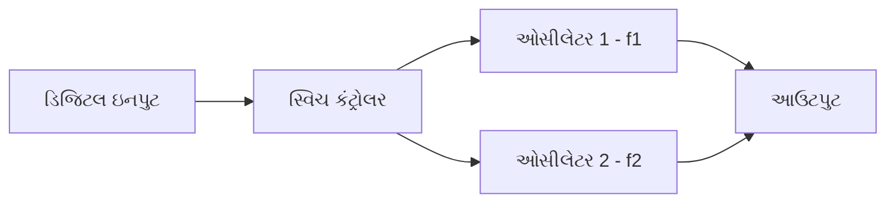

**વેવફોર્મ:**

```goat
Digital Input:
   _    _      
  | |  | |     
__|_|__|_|_____

FSK Output:
 /\/\/\    /\/\/\
/      \  /      \
        \/        \
        /\        /\
       /  \      /  \
```

**કોષ્ટક: FSK મોડ્યુલેશન પ્રક્રિયા**

| સ્ટેપ | વર્ણન |
|------|-------------|
| **ડિજિટલ ઇનપુટ** | બાઇનરી ડેટા (0s અને 1s) |
| **ફ્રિક્વન્સી પસંદગી** | f₁ બિટ '1' માટે, f₂ બિટ '0' માટે |
| **વેવફોર્મ જનરેશન** | s(t) = A·cos(2πf₁t) બિટ '1' માટે, s(t) = A·cos(2πf₂t) બિટ '0' માટે |
| **આઉટપુટ** | સતત ફેઝ ફ્રિક્વન્સી-શિફ્ટેડ સિગ્નલ |

- **બાઇનરી FSK**: બે ફ્રિક્વન્સી f₁ અને f₂ વપરાય છે જે ફ્રિક્વન્સી ડેવિએશન દ્વારા અલગ પડે છે
- **ફાયદો**: ASK કરતાં વધુ સારી નોઇઝ ઇમ્યુનિટી

**મેમરી ટ્રીક:** "ફઆફાસ્ટ" - **ફ્રી**ક્વન્સી **આ**વર્તન **ફ**રક **સ્વ**ર વચ્ચે બદલાય છે

## પ્રશ્ન 3(બ) [4 ગુણ]

**1010110110 ના ક્રમ માટે PSK મોડ્યુલેશન વેવફોર્મ દોરો.**

**જવાબ**:

**1010110110 માટે BPSK મોડ્યુલેશન:**

```goat
Digital Input:
   _    _   ___   _ _
  | |  | | |   | | | |
__| |__| |_|   |_| | |__

Carrier Signal:
 /\/\/\/\/\/\/\/\/\/\/\

BPSK Output:
 /\/\/\ /\/\/\ /\/\/\ /\
      \/      \/      \/
      /\/\/\/\ /\/\/\/\ /\
                      \/
```

**કોષ્ટક: BPSK મેપિંગ**

| બિટ | ફેઝ | અર્થઘટન |
|-----|-------|----------------|
| **1** | 0° | કેરિયર સાથે ઇન-ફેઝ (પોઝિટીવ) |
| **0** | 180° | કેરિયરથી આઉટ-ઓફ-ફેઝ (નેગેટિવ) |

**આકૃતિ:**

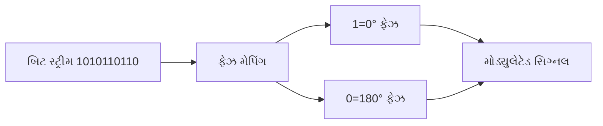

- **ફેઝ શિફ્ટ**: દરેક બિટ બદલાવ પર 180° ફેરફાર
- **સ્થિર એમ્પ્લિટ્યુડ**: ASKથી વિપરીત, એમ્પ્લિટ્યુડ સ્થિર રહે છે

**મેમરી ટ્રીક:** "ફોફા" - **ફે**ઝ વિરુદ્ધાર્થી બિટ **જો**ડી માટે **ફ**ીચર **આ**પે છે

## પ્રશ્ન 3(ક) [7 ગુણ]

**1100110101 ના ક્રમ માટે ASK અને FSK મોડ્યુલેશન વેવફોર્મ દોરો.**

**જવાબ**:

**ઇનપુટ બિટ સિક્વન્સ: 1100110101**

**ASK મોડ્યુલેશન:**

```goat
Digital Input:
   __    __    _  _
  |  |  |  |  | || |
__|  |__|  |__| ||_|__

ASK Output:
 /\/\/\/\    /\/\/\/\  /\/\ /\
         \  /         \/    \ \
         /______________      \_
```

**FSK મોડ્યુલેશન:**

```goat
Digital Input:
   __    __    _  _
  |  |  |  |  | || |
__|  |__|  |__| ||_|__

FSK Output (f1=high, f0=low):
 /\/\/\/\        /\/\/\/\      /\/\    
        \      /        \    /    \  /\
         \    /          \  /      \/  \
          \/\/            \/            \
           Higher freq     Higher freq   Higher freq
           for 1s          for 1s        for 1s
         
             Lower freq      Lower freq    Lower freq
             for 0s          for 0s        for 0s
```

**કોષ્ટક: 1100110101 સિક્વન્સ માટે તુલના**

| બિટ પોઝિશન | બિટ વેલ્યુ | ASK રજૂઆત | FSK રજૂઆત |
|--------------|-----------|--------------------|--------------------|
| **1-2** | 11 | કેરિયર હાજર | ઉચ્ચ ફ્રિક્વન્સી |
| **3-4** | 00 | કેરિયર ગેરહાજર | નીચી ફ્રિક્વન્સી |
| **5-7** | 110 | કેરિયર હાજર/ગેરહાજર | ઉચ્ચ/નીચી ફ્રિક્વન્સી |
| **8-10** | 101 | કેરિયર હાજર/ગેરહાજર/હાજર | ઉચ્ચ/નીચી/ઉચ્ચ ફ્રિક્વન્સી |

- **ASK મોડ્યુલેશન**: સરળ ઓન-ઓફ કીઇંગ જ્યાં '1' માટે કેરિયર હાજર અને '0' માટે ગેરહાજર હોય છે
- **FSK મોડ્યુલેશન**: બિટ વેલ્યુના આધારે બે અલગ-અલગ મૂલ્યો વચ્ચે ફ્રિક્વન્સી શિફ્ટ થાય છે

**મેમરી ટ્રીક:** "એબફ્ફ" - **એ**એસકે કેરિયર **બં**ધ-**ચા**લુ કરે છે, જ્યારે **ફ્રી**ક્વન્સી **જો**ડી વચ્ચે FSK શિફ્ટ કરે છે

## પ્રશ્ન 3(અ) OR [3 ગુણ]

**બ્લોક ડાયાગ્રામ અને આઉટપુટ વેવફોર્મ સાથે MSK મોડ્યુલેટરનું કાર્ય સમજાવો.**

**જવાબ**:

**MSK મોડ્યુલેટર બ્લોક ડાયાગ્રામ:**

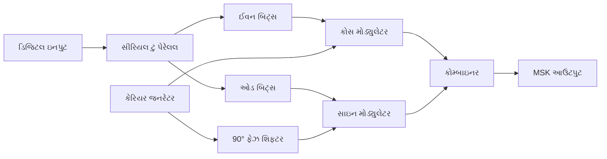

**વેવફોર્મ:**

```goat
Digital Input:
   _    _      
  | |  | |     
__|_|__|_|_____

MSK Output:
  _-_     _-_  
 /   \   /   \ 
/     \_/     \_
       _-_     _-
      /   \   /  
     /     \_/    
```

**કોષ્ટક: MSK મોડ્યુલેશન પ્રક્રિયા**

| લાક્ષણિકતા | વર્ણન |
|----------------|-------------|
| **સિદ્ધાંત** | સાઇન્યુસોઇડલ પલ્સ શેપિંગ સાથે OQPSKનો ખાસ કેસ |
| **ફેઝ સાતત્ય** | સરળ ફેઝ ટ્રાન્ઝિશન સુનિશ્ચિત કરે છે (અચાનક ફેઝ ફેરફાર નહીં) |
| **ફ્રિક્વન્સી ડેવિએશન** | કેરિયર ફ્રિક્વન્સીથી ±0.25 બિટ રેટ |
| **બેન્ડવિડ્થ એફિશિયન્સી** | પરંપરાગત FSK કરતાં વધારે સારી |

- **ફેઝ સાતત્ય**: મુખ્ય ફાયદો - FSKની તુલનામાં બેન્ડવિડ્થ ઘટાડે છે
- **સ્થિર એન્વેલપ**: નોન-લિનિયર એમ્પ્લિફિકેશન પ્રત્યે પ્રતિરોધક

**મેમરી ટ્રીક:** "એમસફ" - **એમ**એસકે **સ**તત **ફે**ઝ શિફ્ટ્સ સુનિશ્ચિત કરે છે

## પ્રશ્ન 3(બ) OR [4 ગુણ]

**8-PSK અને 16-QAM ના નક્ષત્ર રેખાકૃતિ દોરો.**

**જવાબ**:

**8-PSK કોન્સ્ટેલેશન ડાયાગ્રામ:**

```goat
       001 * * 000
           \|/
    010 *---+---* 111
           /|\
       011 * * 101
           100
```

**16-QAM કોન્સ્ટેલેશન ડાયાગ્રામ:**

```goat
    *   *   *   *
    
    *   *   *   *
    
    *   *   *   *
    
    *   *   *   *
```

**કોષ્ટક: કોન્સ્ટેલેશન ડાયાગ્રામ્સની તુલના**

| પેરામીટર | 8-PSK | 16-QAM |
|-----------|-------|--------|
| **સિમ્બોલ દીઠ બિટ્સ** | 3 બિટ્સ | 4 બિટ્સ |
| **સિમ્બોલ પોઝિશન્સ** | વર્તુળ પર 8 પોઇન્ટ્સ | ગ્રિડમાં 16 પોઇન્ટ્સ |
| **એમ્પ્લિટ્યુડ લેવલ્સ** | 1 (સ્થિર) | 3 (વેરિએબલ) |
| **ફેઝ એંગલ્સ** | 8 ખૂણા (45° તફાવત) | 12 ખૂણા |
| **એરર સેન્સિટિવિટી** | મધ્યમ | 8-PSK કરતાં વધારે |
| **સ્પેક્ટ્રલ એફિશિયન્સી** | 3 બિટ્સ/Hz | 4 બિટ્સ/Hz |

- **8-PSK**: સમાન એમ્પ્લિટ્યુડ સાથે વર્તુળની આસપાસ સમાન અંતરે પોઇન્ટ્સ
- **16-QAM**: અલગ-અલગ એમ્પ્લિટ્યુડ અને ફેઝ સાથે ચોરસ ગ્રિડમાં પોઇન્ટ્સ ગોઠવાયેલા હોય છે

**મેમરી ટ્રીક:** "સીપા" - **કો**ન્સ્ટેલેશન પોઇન્ટ્સ PSKમાં સમાન **એ**મ્પ્લિટ્યુડ પરંતુ અલગ **ફે**ઝ ધરાવે છે, QAMમાં **એ**મ્પ્લિટ્યુડ અને ફેઝ બંને ફેરફાર ધરાવે છે

## પ્રશ્ન 3(ક) OR [7 ગુણ]

**1010101011 માટે BPSK અને QPSK મોડ્યુલેશન વેવફોર્મ દોરો.**

**જવાબ**:

**ઇનપુટ બિટ સિક્વન્સ: 1010101011**

**BPSK મોડ્યુલેશન:**

```goat
Digital Input:
   _ _ _ _ _ _ _ _
  | | | | | | | | |
__| |_| |_| |_| |_| |__

BPSK Output:
 /\/\/\ /\/\/\ /\/\/\ /\/\/\ /\
      \/      \/      \/      \/
      /\/\/\/\ /\/\/\/\ /\/\/\/\
```

**QPSK મોડ્યુલેશન (બિટ્સ ગ્રુપિંગ: 10,10,10,10,11):**

```goat
Grouped Bits:
   10    10    10    10    11
   
I-channel (odd bits):
   _     _     _     _     _
  | |   | |   | |   | |   | |
__| |___| |___| |___| |___| |__

Q-channel (even bits):
    _     _     _     _      
   | |   | |   | |   | |    |
___| |___| |___| |___| |____|

QPSK Output:
 /\  /\  /\  /\  /\
/  \/  \/  \/  \/  \
    Phase    Phase   Different 
    00       00      phase for 11
```

**કોષ્ટક: 1010101011 માટે BPSK અને QPSK ની તુલના**

| લાક્ષણિકતા | BPSK | QPSK |
|----------------|------|------|
| **સિમ્બોલ દીઠ બિટ્સ** | 1 | 2 |
| **સિમ્બોલની સંખ્યા** | 10 | 5 |
| **સિમ્બોલ રેટ** | બિટ રેટ જેટલો જ | બિટ રેટનો અર્ધો |
| **બેન્ડવિડ્થ એફિશિયન્સી** | 1 બિટ/Hz | 2 બિટ્સ/Hz |
| **ફેઝ સ્ટેટ્સ** | 2 (0°, 180°) | 4 (45°, 135°, 225°, 315°) |

- **BPSK**: દરેક બિટ 180° ફેઝ શિફ્ટ લાવી શકે છે
- **QPSK**: એક સાથે બે બિટ પ્રોસેસ કરે છે, ચાર ફેઝ સ્ટેટ્સ વાપરે છે

**મેમરી ટ્રીક:** "બીક્ય્સસ" - **બી**પીએસકે **1** બિટ લે છે જ્યારે **ક્યુ**પીએસકે **2** બિટ લે છે, જેનાથી **સ્પે**ક્ટ્રલ **સ**ક્ષમતા બમણી થાય છે

## પ્રશ્ન 4(અ) [3 ગુણ]

**નીચેના સંભવિત ક્રમ માટે શેનોન ફેનો કોડનો ઉપયોગ કરીને ડેટાને એન્કોડ કરો. P = { 0.30, 0.25, 0.20, 0.12, 0.08, 0.05}**

**જવાબ**:

**કોષ્ટક: શેનન-ફેનો કોડિંગ પ્રક્રિયા**

| સિમ્બોલ | પ્રોબેબિલિટી | ડિવિઝન સ્ટેપ્સ | શેનન-ફેનો કોડ |
|--------|------------|----------------|-------------------|
| **A** | 0.30 | ટોપ ગ્રુપ | 0 |
| **B** | 0.25 | ટોપ ગ્રુપ | 10 |
| **C** | 0.20 | બોટમ ગ્રુપ | 110 |
| **D** | 0.12 | બોટમ ગ્રુપ | 1110 |
| **E** | 0.08 | બોટમ ગ્રુપ | 1111 0 |
| **F** | 0.05 | બોટમ ગ્રુપ | 1111 1 |

**આકૃતિ:**

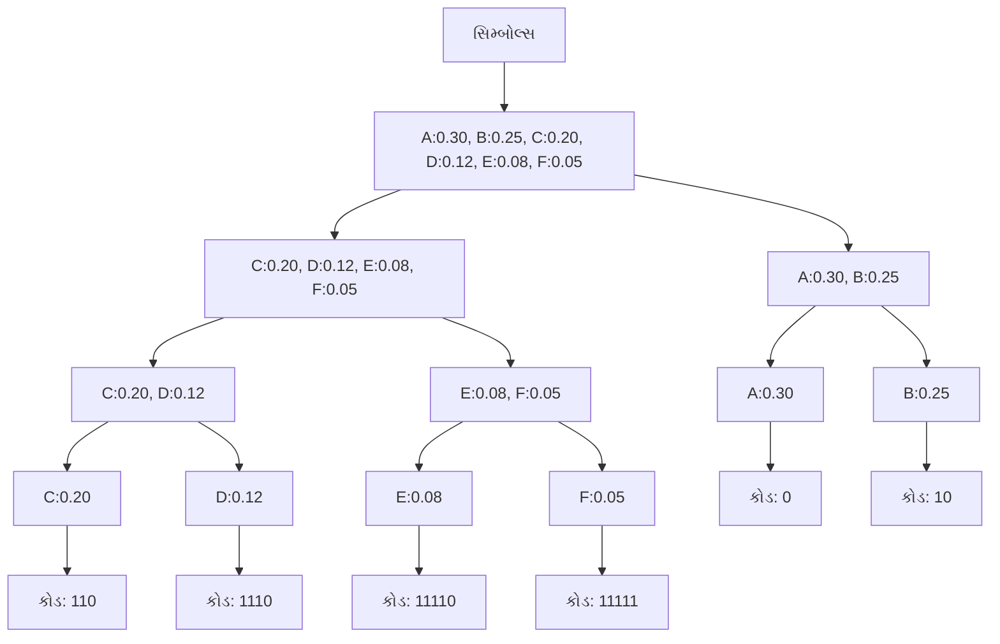

- **શેનન-ફેનો એલ્ગોરિધમ**: લગભગ સમાન પ્રોબેબિલિટી ધરાવતા બે જૂથોમાં રિકર્સિવલી સિમ્બોલ્સને વિભાજિત કરે છે
- **કોડ એફિશિયન્સી**: હંમેશા શ્રેષ્ઠ ન હોય શકે પરંતુ સામાન્ય રીતે સારું કોમ્પ્રેશન

**મેમરી ટ્રીક:** "સપઆઅ" - **સં**ભાવના **પ્ર**માણે **અં**કો **આ**વૃત્તિ આધારિત ફાળવાય છે

## પ્રશ્ન 4(બ) [4 ગુણ]

**હેમિંગ કોડ સમજાવો.**

**જવાબ**:

**કોષ્ટક: હેમિંગ કોડના ગુણધર્મો**

| ગુણધર્મ | વર્ણન |
|----------|-------------|
| **પ્રકાર** | લિનિયર એરર-કરેક્ટિંગ કોડ |
| **એરર ડિટેક્શન** | 2 બિટ સુધીની ભૂલ શોધી શકે છે |
| **એરર કરેક્શન** | સિંગલ બિટ ભૂલોને સુધારી શકે છે |
| **પેરિટી બિટ્સ (r)** | n ડેટા બિટ્સ માટે: 2^r ≥ n + r + 1 |
| **કોડ સ્ટ્રક્ચર** | સિસ્ટેમેટિક: મેસેજ બિટ્સ + પેરિટી બિટ્સ |
| **પેરિટી બિટ્સની પોઝિશન** | 2ની ઘાત: પોઝિશન 1, 2, 4, 8, 16... |

**આકૃતિ:**

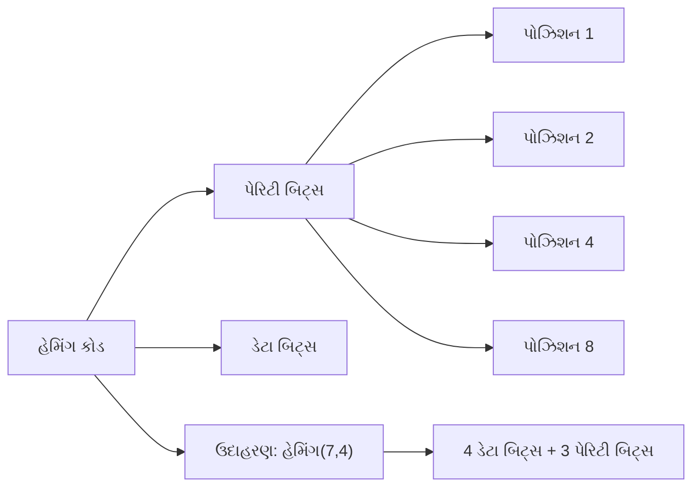

- **એનકોડિંગ**: ચોક્કસ બિટ પોઝિશન્સ પર ઇવન/ઓડ પેરિટી સુનિશ્ચિત કરવા માટે પેરિટી બિટ્સની ગણતરી
- **ડિકોડિંગ**: ભૂલની પોઝિશન નક્કી કરવા માટે સિન્ડ્રોમની ગણતરી

**મેમરી ટ્રીક:** "સાપો" - **સ**ત્તાની ઘાત પોઝિશનમાં **પે**રિટી બિટ **સ**િસ્ટેમેટિક રીતે ભૂલ **સુ**ધાર **ઓ**ળખે

## પ્રશ્ન 4(ક) [7 ગુણ]

**TDMA અને FDMA ની સરખામણી કરો.**

**જવાબ**:

**કોષ્ટક: TDMA અને FDMA ની તુલના**

| પેરામીટર | TDMA | FDMA |
|-----------|------|------|
| **મૂળ સિદ્ધાંત** | સમયને સ્લોટ્સમાં વિભાજિત કરે છે | ફ્રિક્વન્સીને ચેનલ્સમાં વિભાજિત કરે છે |
| **રિસોર્સ ફાળવણી** | દરેક વપરાશકર્તાને ટૂંકા સમય માટે સંપૂર્ણ બેન્ડવિડ્થ મળે છે | દરેક વપરાશકર્તાને સંપૂર્ણ સમય માટે સાંકડી બેન્ડવિડ્થ મળે છે |
| **ગાર્ડ ટાઇમ/બેન્ડ** | સ્લોટ્સ વચ્ચે ગાર્ડ ટાઇમની જરૂર પડે છે | ચેનલ્સ વચ્ચે ગાર્ડ બેન્ડની જરૂર પડે છે |
| **સિન્ક્રોનાઇઝેશન** | અત્યંત મહત્વપૂર્ણ (ટાઇમિંગ-આધારિત) | જરૂરી નથી (ફ્રિક્વન્સી સેપરેશન) |
| **એફિશિયન્સી** | બર્સ્ટી ડેટા માટે વધુ સારી | સતત ડેટા માટે વધુ સારી |
| **ઇન્ટરફેરન્સ** | ઇન્ટરફેરન્સને ઓછો અસરગ્રસ્ત | એડજેસન્ટ ચેનલ ઇન્ટરફેરન્સથી વધુ અસરગ્રસ્ત |
| **હાર્ડવેર જટિલતા** | જટિલ (બફરિંગ, સિન્ક્રોનાઇઝેશનની જરૂર) | સરળ (ફિક્સ્ડ ફિલ્ટર્સ) |
| **પાવર કન્ઝમ્પશન** | ઓછો (ટ્રાન્સમિટર ફક્ત ટાઇમ સ્લોટ દરમિયાન ચાલુ) | વધારે (સતત ટ્રાન્સમિશન) |
| **ક્ષમતા** | ટાઇમ સ્લોટ્સ ઉમેરીને સરળતાથી વિસ્તૃત કરી શકાય | ઉપલબ્ધ સ્પેક્ટ્રમથી મર્યાદિત |
| **ઉપયોગો** | GSM, DECT કોર્ડલેસ ફોન | એનાલોગ સેલ્યુલર, સેટેલાઇટ સિસ્ટમ્સ |

**આકૃતિ:**

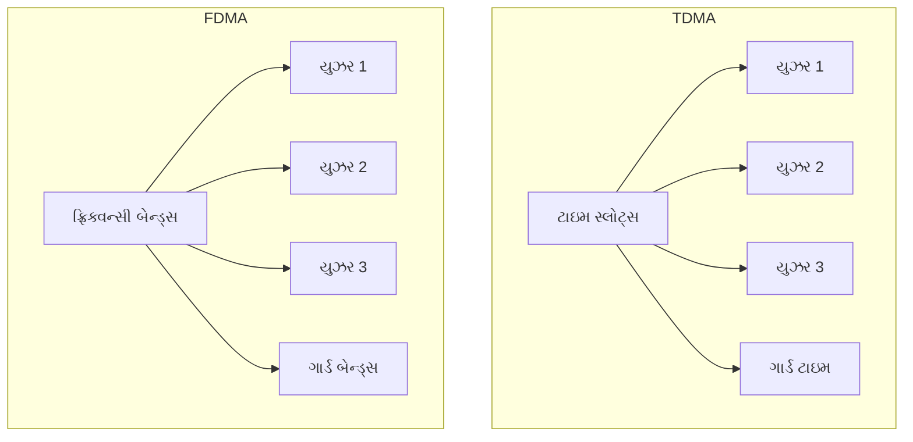

- **સિસ્ટમ ફ્લેક્સિબિલિટી**: TDMA ગતિશીલ રીતે સ્લોટ્સ ફાળવી શકે છે, FDMA ફિક્સ્ડ એલોકેશન છે
- **અમલીકરણ**: TDMA માટે ડિજિટલ ટેકનોલોજીની જરૂર પડે છે, FDMA એનાલોગ/ડિજિટલ સાથે કામ કરે છે

**મેમરી ટ્રીક:** "સમયઆ" - **સ**મયના **અં**તરાલોને **ટી**ડીએમએ વિભાજિત કરે છે, **ફ્રિ**ક્વન્સીના **રે**ન્જને **એફ**ડીએમએ વિભાજિત કરે છે

## પ્રશ્ન 4(અ) OR [3 ગુણ]

**નીચેના સંભવિત ક્રમ માટે હફમેન કોડનો ઉપયોગ કરીને ડેટાને એન્કોડ કરો. P = { 0.4, 0.19, 0.16, 0.15, 0.1}**

**જવાબ**:

**કોષ્ટક: હફમેન કોડિંગ પ્રક્રિયા**

| સિમ્બોલ | પ્રોબેબિલિટી | હફમેન કોડ |
|--------|------------|--------------|
| **A** | 0.40 | 0 |
| **B** | 0.19 | 10 |
| **C** | 0.16 | 110 |
| **D** | 0.15 | 111 |
| **E** | 0.10 | 110 |

**આકૃતિ:**

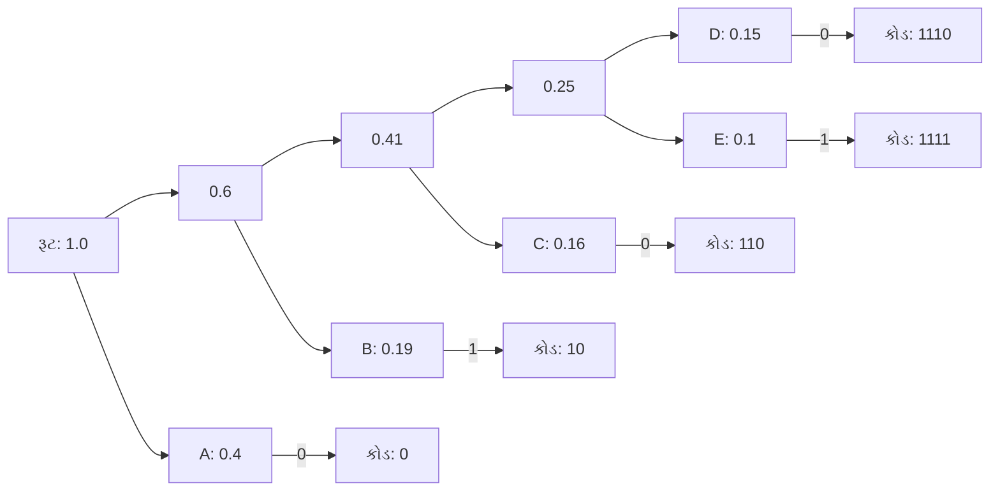

- **હફમેન એલ્ગોરિધમ**: ઓછામાં ઓછી સંભાવના ધરાવતા સિમ્બોલ્સથી શરૂઆત કરીને, નીચેથી ઉપર બાઇનરી ટ્રી બનાવે છે
- **ઓપ્ટિમાલિટી**: મિનિમલ એવરેજ કોડ લેન્થ આપે છે

**મેમરી ટ્રીક:** "હઆસ" - **હ**ફમેન ઉચ્ચ **આ**વૃત્તિના **સં**કેતો માટે ટૂંકા કોડ બનાવે છે

## પ્રશ્ન 4(બ) OR [4 ગુણ]

**SNR અને સંચારમાં તેના મહત્વના સંદર્ભમાં ચેનલ ક્ષમતાને વ્યાખ્યાયિત કરો.**

**જવાબ**:

**શેનનનું ચેનલ ક્ષમતા ફોર્મ્યુલા:**

```
C = B × log₂(1 + SNR)
```

જ્યાં:

- C = ચેનલ ક્ષમતા બિટ્સ પ્રતિ સેકન્ડમાં
- B = બેન્ડવિડ્થ Hz માં
- SNR = સિગ્નલ-ટુ-નોઇઝ રેશિયો

**કોષ્ટક: ચેનલ ક્ષમતાની લાક્ષણિકતાઓ**

| પાસું | વર્ણન | મહત્વ |
|--------|-------------|------------|
| **વ્યાખ્યા** | શક્ય એરર-ફ્રી ડેટા રેટનું મહત્તમ મૂલ્ય | મૂળભૂત સીમાઓ નક્કી કરે છે |
| **SNR પર આધાર** | SNR સાથે લોગેરિધમિક રીતે વધે છે | પાવરના ઘટતા વળતરો દર્શાવે છે |
| **બેન્ડવિડ્થ પર આધાર** | બેન્ડવિડ્થ સાથે લિનિયર રીતે વધે છે | સ્પેક્ટ્રમનું મૂલ્ય દર્શાવે છે |
| **થિયોરેટિકલ બાઉન્ડ** | કોઈપણ કોડિંગ સાથે શેનન લિમિટને વટાવી શકાતી નથી | સિસ્ટમ ડિઝાઇનને માર્ગદર્શન આપે છે |

**આકૃતિ:**

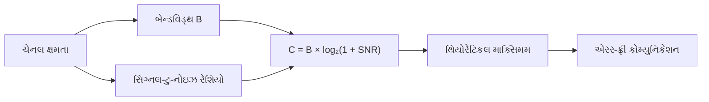

- **શેનન-હાર્ટલી થિયરમ**: ડેટા ટ્રાન્સફર રેટની થિયોરેટિકલ મહત્તમ મર્યાદા સ્થાપિત કરે છે
- **એરર પ્રોબેબિલિટી**: જો ડેટા રેટ < ચેનલ ક્ષમતા હોય તો મનસ્વી રીતે નાની બનાવી શકાય છે

**મેમરી ટ્રીક:** "શનબ" - **શે**નન ક્ષમતા **ન**ોઇઝ રેશિયો અને **બે**ન્ડવિડ્થ પર આધાર રાખે છે

## પ્રશ્ન 4(ક) OR [7 ગુણ]

**FDMA ટેકનિકને વિગતવાર સમજાવો.**

**જવાબ**:

**FDMA (ફ્રિક્વન્સી ડિવિઝન મલ્ટિપલ એક્સેસ)**

**કોષ્ટક: FDMA સિસ્ટમની લાક્ષણિકતાઓ**

| પાસું | વર્ણન | મહત્વ |
|--------|-------------|--------------|
| **મૂળ સિદ્ધાંત** | ઉપલબ્ધ સ્પેક્ટ્રમને ચેનલોમાં વિભાજિત કરે છે | અનેક સમકાલીન વપરાશકર્તાઓને સક્ષમ બનાવે છે |
| **ચેનલ ફાળવણી** | દરેક વપરાશકર્તા માટે ફિક્સ્ડ ફ્રિક્વન્સી બેન્ડ | હાર્ડવેર ડિઝાઇનને સરળ બનાવે છે |
| **ગાર્ડ બેન્ડ્સ** | ચેનલો વચ્ચે ફ્રિક્વન્સી સેપરેશન | એડજેસન્ટ ચેનલ ઇન્ટરફેરન્સને અટકાવે છે |
| **ડુપ્લેક્સિંગ** | ઘણીવાર FDD (સેપરેટ Tx/Rx બેન્ડ્સ) સાથે જોડાયેલું | સમકાલીન બે-માર્ગી સંચારને સક્ષમ બનાવે છે |
| **બેન્ડવિડ્થ ઉપયોગ** | દરેક ચેનલ ફિક્સ્ડ બેન્ડવિડ્થ ધરાવે છે | બર્સ્ટી ડેટા માટે સંભવિત રીતે અકાર્યક્ષમ |
| **ઇન્ટરમોડ્યુલેશન** | મલ્ટિપલ કેરિયર્સના પ્રોડક્ટ્સ | કાળજીપૂર્વક પાવર એમ્પ્લિફાયર ડિઝાઇનની જરૂર |

**આકૃતિ:**

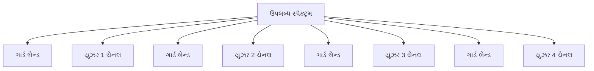

**FDMA અમલીકરણ:**

```goat
   ^
   |
 F |  +-----+  +-----+  +-----+  +-----+
 r |  |User1|  |User2|  |User3|  |User4|
 e |  |     |  |     |  |     |  |     |
 q |  |     |  |     |  |     |  |     |
   |  +-----+  +-----+  +-----+  +-----+
   |
   |   Guard    Guard    Guard    
   |   Band     Band     Band     
   +---------------------------------------->
                     Time
```

- **અમલીકરણ**: બેન્ડપાસ ફિલ્ટર્સનો ઉપયોગ કરીને તુલનાત્મક રીતે સરળ
- **ફાયદા**: સિન્ક્રોનાઇઝેશનની જરૂર નથી, સતત ટ્રાન્સમિશન
- **ગેરફાયદા**: સ્પેક્ટ્રમ અકાર્યક્ષમતા, મર્યાદિત ફ્લેક્સિબિલિટી

**મેમરી ટ્રીક:** "ફગવચ" - **ફ્રિ**ક્વન્સી ડિવિઝન **ગા**ર્ડ બેન્ડ સાથે **વિ**ભિન્ન **ચે**નલો બનાવે છે

## પ્રશ્ન 5(અ) [3 ગુણ]

**TDMA એક્સેસ ટેકનિક સમજાવો.**

**જવાબ**:

**TDMA (ટાઇમ ડિવિઝન મલ્ટિપલ એક્સેસ)**

**કોષ્ટક: TDMA મુખ્ય લાક્ષણિકતાઓ**

| લાક્ષણિકતા | વર્ણન |
|----------------|-------------|
| **મૂળ સિદ્ધાંત** | સમયને ફ્રેમ્સ અને સ્લોટ્સમાં વિભાજિત કરે છે | 
| **રિસોર્સ શેરિંગ** | દરેક યુઝરને ચોક્કસ ટાઇમ સ્લોટ ફાળવવામાં આવે છે |
| **ગાર્ડ ટાઇમ** | સ્લોટ્સ વચ્ચે નાનું સમય અંતર |
| **ફ્રેમ સ્ટ્રક્ચર** | અનેક સ્લોટ્સ મળીને સંપૂર્ણ ફ્રેમ બનાવે છે |
| **સિન્ક્રોનાઇઝેશન** | બધા વપરાશકર્તાઓ માટે ટાઇમિંગ રેફરન્સની જરૂર |

**આકૃતિ:**

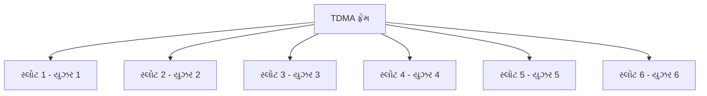

- **ડિજિટલ અમલીકરણ**: એનાલોગ સિગ્નલ્સ માટે ADC/DAC ની જરૂર
- **બર્સ્ટ ટ્રાન્સમિશન**: વપરાશકર્તાઓ ફક્ત ફાળવેલા સ્લોટ્સમાં જ ટ્રાન્સમિટ કરે છે

**મેમરી ટ્રીક:** "ટેદવ" - **ટા**ઇમ સ્લોટ્સ **દ**રેક **વ**પરાશકર્તા માટે અલગથી વ્યવસ્થિત

## પ્રશ્ન 5(બ) [4 ગુણ]

**E1 કેરીયર સિસ્ટમ સમજાવો.**

**જવાબ**:

**E1 કેરીયર સિસ્ટમ**

**કોષ્ટક: E1 કેરીયર સિસ્ટમ સ્પેસિફિકેશન્સ**

| પેરામીટર | સ્પેસિફિકેશન | વિગતો |
|-----------|--------------|---------|
| **કુલ બિટ રેટ** | 2.048 Mbps | યુરોપિયન સ્ટાન્ડર્ડ |
| **ચેનલોની સંખ્યા** | 32 ટાઇમ સ્લોટ્સ (0-31) | 30 વોઇસ + 2 કંટ્રોલ |
| **વોઇસ ચેનલ્સ** | ટાઇમ સ્લોટ્સ 1-15, 17-31 | દરેક 64 kbps |
| **સિગ્નલિંગ ચેનલ** | ટાઇમ સ્લોટ 16 | ચેનલ સિગ્નલિંગ માટે |
| **ફ્રેમ એલાઇનમેન્ટ** | ટાઇમ સ્લોટ 0 | સિન્ક્રોનાઇઝેશન |
| **ફ્રેમ અવધિ** | 125 μs | 8000 ફ્રેમ્સ પ્રતિ સેકન્ડ |
| **સેમ્પલિંગ રેટ** | 8 kHz | નાયક્વિસ્ટ થિયરમને અનુસરે છે |

**આકૃતિ:**

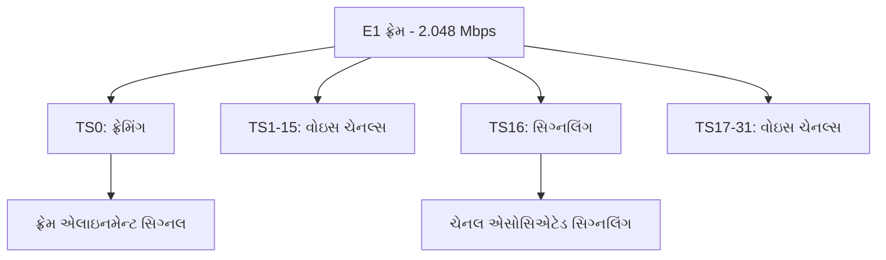

- **મલ્ટિપ્લેક્સિંગ ટેકનિક**: TDM (ટાઇમ ડિવિઝન મલ્ટિપ્લેક્સિંગ)
- **PCM એનકોડિંગ**: 8 kHz સેમ્પલિંગ રેટ પર 8-બિટ સેમ્પલ્સ

**મેમરી ટ્રીક:** "ઈ132" - **E1** માં **32** ટાઇમ સ્લોટ્સ **2**.048 Mbps સાથે

## પ્રશ્ન 5(ક) [7 ગુણ]

**ડિજિટલ ટેલિફોન એક્સચેન્જના બ્લોક ડાયાગ્રામ, હાર્ડવેર સબ સિસ્ટમના એલીમેન્ટ સમજાવો.**

**જવાબ**:

**ડિજિટલ ટેલિફોન એક્સચેન્જ બ્લોક ડાયાગ્રામ**

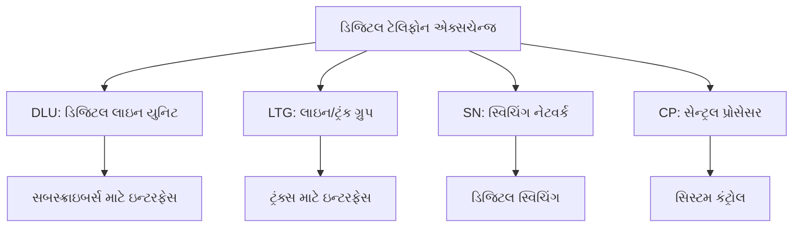

**કોષ્ટક: ડિજિટલ ટેલિફોન એક્સચેન્જના હાર્ડવેર સબસિસ્ટમ્સ**

| સબસિસ્ટમ | કાર્ય | મુખ્ય ઘટકો |
|-----------|----------|----------------|
| **DLU (ડિજિટલ લાઇન યુનિટ)** | સબસ્ક્રાઇબર લાઇન્સ અને એક્સચેન્જ વચ્ચે ઇન્ટરફેસ | લાઇન કાર્ડ્સ, CODEC, SLIC, PCM કન્વર્ઝન |
| **LTG (લાઇન/ટ્રંક ગ્રુપ)** | ટ્રંક લાઇન્સ સંભાળે છે, અન્ય એક્સચેન્જ સાથે ઇન્ટરફેસ | ટ્રંક કાર્ડ્સ, સિગ્નલિંગ યુનિટ્સ, ઇકો કેન્સેલર્સ |
| **SN (સ્વિચિંગ નેટવર્ક)** | પોર્ટ્સ વચ્ચે કોલ્સ રૂટ કરે છે, કનેક્ટિવિટી પ્રદાન કરે છે | ટાઇમ/સ્પેસ સ્વિચ, કનેક્શન મેમોરી, કંટ્રોલ લોજિક |
| **CP (સેન્ટ્રલ પ્રોસેસર)** | સમગ્ર સિસ્ટમ ઓપરેશન નિયંત્રિત કરે છે | મુખ્ય પ્રોસેસર, મેમોરી, ઓપરેટિંગ સિસ્ટમ, ડેટાબેઝ |
| **પેરિફેરલ્સ** | સપોર્ટિંગ ફંક્શન્સ | પાવર સપ્લાય, અલાર્મ સિસ્ટમ્સ, મેઇન્ટેનન્સ ટર્મિનલ્સ |

**હાર્ડવેર એલિમેન્ટ્સ વિગતો:**

- **DLU**: એનાલોગ વોઇસને 64 kbps PCM માં કન્વર્ટ કરે છે, લાઇન સિગ્નલિંગ સંભાળે છે
- **LTG**: E1/T1 ટ્રંક્સ મેનેજ કરે છે, SS7 જેવા પ્રોટોકોલ્સ અમલમાં મૂકે છે
- **SN**: સામાન્ય રીતે ટાઇમ-ડિવિઝન સ્વિચિંગ ફેબ્રિક, નોન-બ્લોકિંગ આર્કિટેક્ચર 
- **CP**: કોલ પ્રોસેસિંગ, બિલિંગ, મેઇન્ટેનન્સ, એડમિનિસ્ટ્રેટિવ ફંક્શન્સ

**મેમરી ટ્રીક:** "ડલસપ્ર" - **ડી**એલયુ સબસ્ક્રાઇબર્સ જોડે છે, **લા**ઇન ટ્રંક ગ્રુપ ટ્રંક્સ જોડે છે, **સ્વિ**ચિંગ નેટવર્ક કોલ્સ સ્વિચ કરે છે, **પ્ર**ોસેસર બધું નિયંત્રિત કરે છે

## પ્રશ્ન 5(અ) OR [3 ગુણ]

**TDM અને FDM ની સરખામણી કરો.**

**જવાબ**:

**કોષ્ટક: TDM અને FDM ની તુલના**

| પેરામીટર | TDM | FDM |
|-----------|-----|-----|
| **ડોમેન ડિવિઝન** | સમય | ફ્રિક્વન્સી |
| **ચેનલ સેપરેશન** | ગાર્ડ ટાઇમ | ગાર્ડ બેન્ડ્સ |
| **મલ્ટિપ્લેક્સિંગ પ્રક્રિયા** | ક્રમિક ટાઇમ સ્લોટ્સ | સમાંતર ફ્રિક્વન્સી બેન્ડ્સ |
| **અમલીકરણ** | ડિજિટલ (મુખ્યત્વે) | એનાલોગ અથવા ડિજિટલ |
| **ક્રોસટોક** | સામાન્ય રીતે ઓછું | વધુ સંવેદનશીલ |
| **સિન્ક્રોનાઇઝેશન** | અત્યંત મહત્વપૂર્ણ | જરૂરી નથી |

**આકૃતિ:**

```goat
TDM:
  Time -->
  +-----------+------+------+------+
  | Channel 1 | Ch 2 | Ch 3 | Ch 1 |...
  +-----------+------+------+------+
  
FDM:
  ^
  |   +-----+
F |   | Ch3 |
r |   +-----+
e |   | Ch2 |
q |   +-----+
  |   | Ch1 |
  |   +-----+
  +--------------->
        Time
```

- **બેન્ડવિડ્થ ઉપયોગ**: ડિજિટલ માટે TDM વધુ કાર્યક્ષમ, એનાલોગ માટે FDM વધુ સારું
- **સિસ્ટમ જટિલતા**: TDM ને ચોક્કસ ટાઇમિંગની જરૂર પડે છે, FDM ને ચોક્કસ ફિલ્ટર્સની જરૂર પડે છે

**મેમરી ટ્રીક:** "ટફવિ" - **ટા**ઇમ અને **ફ્રિ**ક્વન્સી **વિ**ભાજન સિસ્ટમ્સ અલગ-અલગ ડોમેન વિભાજિત કરે છે

## પ્રશ્ન 5(બ) OR [4 ગુણ]

**T1 મલ્ટિપ્લેક્સિંગ હાયરાર્કી દોરો અને સમજાવો.**

**જવાબ**:

**કોષ્ટક: T1 મલ્ટિપ્લેક્સિંગ હાયરાર્કી**

| લેવલ | ડેઝિગ્નેશન | ડેટા રેટ | વોઇસ ચેનલોની સંખ્યા | મલ્ટિપ્લેક્સિંગ |
|-------|-------------|-----------|--------------------------|--------------|
| **T1** | DS1 | 1.544 Mbps | 24 | 24 DS0 (64 kbps) |
| **T2** | DS2 | 6.312 Mbps | 96 | 4 DS1 |
| **T3** | DS3 | 44.736 Mbps | 672 | 7 DS2 |
| **T4** | DS4 | 274.176 Mbps | 4032 | 6 DS3 |

**આકૃતિ:**

```mermaid
graph LR
    A[વ્યક્તિગત વોઇસ ચેનલ્સ - DS0 64 kbps] --> B[T1/DS1 - 1.544 Mbps]
    B --> C[T2/DS2 - 6.312 Mbps]
    C --> D[T3/DS3 - 44.736 Mbps]
    D --> E[T4/DS4 - 274.176 Mbps]
```

**T1 ફ્રેમ સ્ટ્રક્ચર:**

```goat
T1 Frame (193 bits):
  F  Ch1  Ch2  ...  Ch24  F  Ch1  ...
  |  |    |         |     |
  |  8    8         8     |
  |  bits bits      bits  |
  |                       |
  Framing bit (1 bit)     Next frame
```

- **T1 ફ્રેમ ફોર્મેટ**: 193 બિટ્સ (24 ચેનલ્સ × 8 બિટ્સ + 1 ફ્રેમિંગ બિટ)
- **ફ્રેમ અવધિ**: 125 μs (8000 ફ્રેમ્સ પ્રતિ સેકન્ડ)

**મેમરી ટ્રીક:** "ટીચાર" - **ટી**1, ટી2, ટી3, ટી4 મલ્ટિપ્લેક્સિંગના **ચા**ર સ્તરોની હાયરાર્કી બનાવે છે

## પ્રશ્ન 5(ક) OR [7 ગુણ]

**IoT ના લક્ષણો, લાક્ષણિકતાઓ, ફાયદા અને ગેરફાયદાની સૂચિ બનાવો.**

**જવાબ**:

**કોષ્ટક: ઇન્ટરનેટ ઓફ થિંગ્સ (IoT) ઓવરવ્યુ**

| શ્રેણી | મુખ્ય મુદ્દાઓ |
|----------|------------|
| **લક્ષણો** | ડિવાઇસ કનેક્ટિવિટી, સેન્સર ઇન્ટિગ્રેશન, ઓટોમેટેડ કંટ્રોલ, ડેટા એનાલિટિક્સ, રિમોટ મોનિટરિંગ |
| **લાક્ષણિકતાઓ** | લો પાવર કન્ઝમ્પશન, સ્મોલ ફોર્મ ફેક્ટર, વાયરલેસ કોમ્યુનિકેશન, રિયલ-ટાઇમ ડેટા પ્રોસેસિંગ, સ્કેલેબિલિટી |
| **ફાયદા** | બહેતર કાર્યક્ષમતા, ડેટા-ડ્રિવન નિર્ણયો, રિમોટ મેનેજમેન્ટ, પ્રિડિક્ટિવ મેઇન્ટેનન્સ, રિસોર્સ ઓપ્ટિમાઇઝેશન |
| **ગેરફાયદા** | સિક્યોરિટી વલ્નરેબિલિટીઝ, પ્રાઇવસી સંબંધિત ચિંતાઓ, ઇન્ટરઓપરેબિલિટી સમસ્યાઓ, અમલીકરણ જટિલતા, પાવર બંધનો |

**IoT ના લક્ષણો:**

```mermaid
graph TD
    A[IoT લક્ષણો] --> B[કનેક્ટિવિટી]
    A --> C[ઇન્ટેલિજન્સ]
    A --> D[સેન્સિંગ]
    A --> E[ઓટોમેશન]
    A --> F[ક્લાઉડ ઇન્ટિગ્રેશન]
    A --> G[ડેટા એનાલિટિક્સ]
```

**ફાયદા અને ગેરફાયદા:**

```goat
Advantages                    Disadvantages
+---------------------+      +----------------------+
| ✓ Automation        |      | ✗ Security risks     |
| ✓ Enhanced data     |      | ✗ Privacy concerns   |
| ✓ Remote control    |      | ✗ Complex setup      |
| ✓ Cost reduction    |      | ✗ High initial cost  |
| ✓ Quality of life   |      | ✗ Battery life       |
| ✓ Resource savings  |      | ✗ Compatibility      |
+---------------------+      +----------------------+
```

**લાક્ષણિકતા વિગતો:**

- **ઇન્ટરકનેક્ટિવિટી**: કોઈપણ વસ્તુને વૈશ્વિક માહિતી અને સંચાર ઇન્ફ્રાસ્ટ્રક્ચર સાથે જોડી શકાય છે
- **થિંગ-સંબંધિત સેવાઓ**: IoT પ્રાઇવસી પ્રોટેક્શન જેવી થિંગ-સંબંધિત સેવાઓ પ્રદાન કરે છે
- **હેટરોજેનિટી**: ડિવાઇસિસ અલગ-અલગ હાર્ડવેર/સોફ્ટવેર પ્લેટફોર્મ પર આધારિત
- **ડાયનેમિક ચેન્જીસ**: ડિવાઇસ સ્ટેટ્સ ડાયનેમિકલી બદલાય છે (કનેક્ટિંગ/ડિસકનેક્ટિંગ, સ્લીપિંગ/વેકિંગ)
- **વિશાળ સ્કેલ**: મેનેજમેન્ટની જરૂર પડતા ડિવાઇસની સંખ્યા પરંપરાગત ઇન્ટરનેટ કનેક્ટેડ ડિવાઇસોથી વધુ છે

**મેમરી ટ્રીક:** "કઓસેડ" - **ક**નેક્ટિવિટી, **ઓ**ટોમેશન, **સે**ન્સિંગ, **કા**ર્યક્ષમતા, **ડે**ટા એનાલિટિક્સ - IoTના મુખ્ય લક્ષણો
