## Question 1(a) [3 marks]

**Define Continuous time Signal and Discrete time Signal with Wave form.**

**Answer**:

**Table: Comparison of Signal Types**

| Signal Type | Definition | Waveform Example |
|-------------|------------|------------------|
| **Continuous time Signal** | Signal defined for all time instants with continuous values | Smooth, unbroken curve |
| **Discrete time Signal** | Signal defined only at specific time instants with samples | Series of distinct points |

**Diagram:**

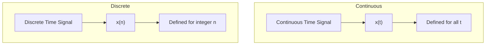

- **Amplitude continuity**: In continuous signals, amplitude can take any value, while discrete signals have specific amplitude values
- **Mathematical notation**: Continuous signals use x(t), discrete signals use x[n] or x(n)

**Mnemonic:** "CoSiDi" - **Co**ntinuous **Si**gnals flow like rivers, **Di**screte signals are like stepping stones

## Question 1(b) [4 marks]

**Explain periodic and aperiodic signal.**

**Answer**:

**Table: Periodic vs. Aperiodic Signals**

| Property | Periodic Signal | Aperiodic Signal |
|----------|----------------|------------------|
| **Definition** | Repeats exactly after fixed time interval | Does not repeat or has infinite period |
| **Mathematical Expression** | x(t) = x(t + nT) for all t | x(t) ≠ x(t + T) for any T |
| **Energy/Power** | Infinite energy, finite power | Finite energy, zero average power |
| **Examples** | Sine waves, square waves | Single pulse, damped sinusoid |

**Diagram:**

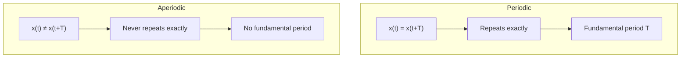

- **Spectral property**: Periodic signals have discrete frequency components, aperiodic have continuous spectrum
- **Fourier analysis**: Periodic signals use Fourier series, aperiodic use Fourier transform

**Mnemonic:** "PART" - **P**eriodic signals **A**lways **R**epeat in **T**ime

## Question 1(c) [7 marks]

**Explain block diagram of digital communication system.**

**Answer**:

**Diagram: Digital Communication System**


**Table: Functions of Digital Communication System Blocks**

| Block | Function | Example |
|-------|----------|---------|
| **Source** | Generates message to be transmitted | Microphone, Keyboard |
| **Source Encoder** | Removes redundancy, compresses data | Huffman coding, JPEG |
| **Channel Encoder** | Adds controlled redundancy for error detection/correction | Hamming codes, CRC |
| **Digital Modulator** | Converts digital data to analog signals | ASK, FSK, PSK |
| **Channel** | Medium that carries the signal | Wired, Wireless, Optical fiber |
| **Digital Demodulator** | Converts received signal back to digital | ASK, FSK, PSK demodulators |
| **Channel Decoder** | Detects/corrects errors using added redundancy | Error correction circuits |
| **Source Decoder** | Reconstructs original message | Data decompression |

- **Advantage**: Noise immunity, secure transmission, multiplexing capability, integration with digital systems
- **Key processes**: Sampling, quantization, coding, modulation/demodulation

**Mnemonic:** "SECMCDS" - **S**ource **E**ncodes, **C**hannel codes, **M**odulates, **C**hannel, **D**emodulates, **S**ink receives

## Question 1(c) OR [7 marks]

**Explain singularity functions.**

**Answer**:

**Table: Common Singularity Functions**

| Function | Mathematical Definition | Properties | Applications |
|----------|-------------------------|------------|--------------|
| **Unit Step** | u(t) = 1 for t ≥ 0, 0 for t < 0 | Discontinuous at t=0 | Switch-on signals, Heaviside function |
| **Unit Impulse** | δ(t) = ∞ for t = 0, 0 elsewhere, ∫δ(t)dt = 1 | Infinitely tall, zero-width | Impulse response, sampling |
| **Unit Ramp** | r(t) = t·u(t) | Continuous but not differentiable at t=0 | Linear time functions |
| **Unit Parabola** | p(t) = (t²/2)·u(t) | Second integral of unit impulse | Acceleration to position |

**Diagram:**

```goat
   ^
   |                    ┌────────────────
   |                    │ Unit Step
   |────────────────────┘
   |
   +-------------------------> t
   |
   ^                     /
   |                    /
   |                   / Unit Ramp
   |─────────────────/
   |                /
   +---------------/------------> t
   |              /
   ^
   |             .
   |             │ Unit Impulse
   |─────────────┼──────────────> t
   |             '
```

- **Integration relationship**: Each function is the integral of the previous one
- **Mathematical toolkit**: Used to analyze complex systems by breaking into simpler components

**Mnemonic:** "SIPR" - **S**tep **I**mpulse **P**arable **R**amp - functions ordered by increasing order of integration

## Question 2(a) [3 marks]

**A signal carries 10 bit/signal elements. If 100 signal elements sent per second. Find the bit rate.**

**Answer**:

**Solution:**

```
Bit Rate = Number of bits per signal element × Number of signal elements per second
Bit Rate = 10 bits/signal element × 100 signal elements/second
Bit Rate = 1000 bits/second = 1 kbps
```

**Diagram:**


- **Bit rate**: Number of bits transmitted per second (bps)
- **Signal element**: Physical manifestation of one or more bits

**Mnemonic:** "BEE" - **B**it rate equals **E**lements times bits per **E**lement

## Question 2(b) [4 marks]

**Explain Even and Odd signal.**

**Answer**:

**Table: Even vs. Odd Signals**

| Property | Even Signal | Odd Signal |
|----------|-------------|------------|
| **Definition** | f(-t) = f(t) | f(-t) = -f(t) |
| **Symmetry** | Mirror symmetry about y-axis | Origin symmetry (rotational) |
| **Fourier Series** | Contains only cosine terms | Contains only sine terms |
| **Examples** | Cosine, |t|, cos(ωt) | Sine, t, sgn(t) |

**Diagram:**

```goat
  Even Signal             Odd Signal
     ^                       ^
     |                       |
     |     .-.               |      /
     |    /   \              |     /
     |---/-----\----->       |----/----\----->
     |  /       \            |   /      \
     | '         '           |  /        \
     |                       | /          \
```

- **Decomposition**: Any signal can be decomposed as sum of even and odd components
- **Even part**: f_e(t) = [f(t) + f(-t)]/2
- **Odd part**: f_o(t) = [f(t) - f(-t)]/2

**Mnemonic:** "ESOM" - **E**ven **S**ignals have mirror symmetry, **O**dd signals flip when **M**irrored

## Question 2(c) [7 marks]

**Explain the block diagram of ASK modulator and de-modulator with waveform.**

**Answer**:

**ASK Modulator Diagram:**

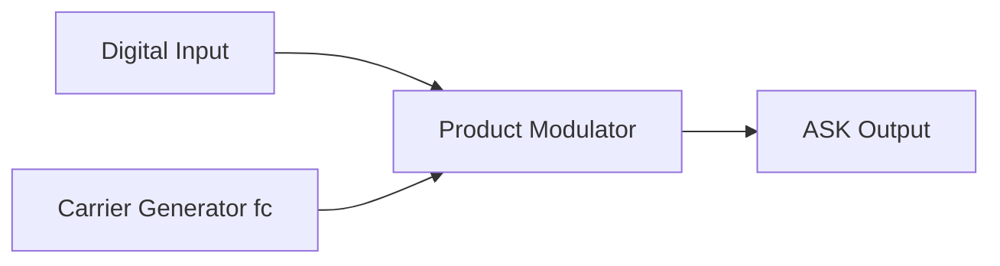

**ASK Demodulator Diagram:**


**Waveform:**

```goat
Digital Input
   _    __     _
  | |  |  |   | |
__|_|__|  |___|_|___

Carrier Signal
 /\/\/\/\/\/\/\/\/\/\

ASK Output
     /\/\    /\/\/\
    /    \  /      \
___/      \/        \___
```

**Table: ASK Modulation and Demodulation Process**

| Process | Function | Mathematical Representation |
|---------|----------|----------------------------|
| **Modulation** | Varies amplitude of carrier | s(t) = A·m(t)·cos(2πf_c·t) |
| **Filtering** | Removes noise outside band | Bandpass filter centered at f_c |
| **Detection** | Recovers envelope | Using diode and capacitor |
| **Decision** | Converts to digital | Threshold comparison |

- **Binary ASK**: Carrier present for '1', absent for '0'
- **Bandwidth**: Minimum BW = bit rate, typically twice bit rate used

**Mnemonic:** "AMPS" - **A**SK **M**odulates carrier **P**ower (amplitude) with digital **S**ignal

## Question 2(a) OR [3 marks]

**A signal has a bit rate of 4000 bit/second and a baud rate of 1000 baud. How many data elements are carried by each signal element?**

**Answer**:

**Solution:**

```
Number of bits per signal element = Bit rate / Baud rate
Number of bits per signal element = 4000 bits/second / 1000 signal elements/second
Number of bits per signal element = 4 bits/signal element
```

**Diagram:**

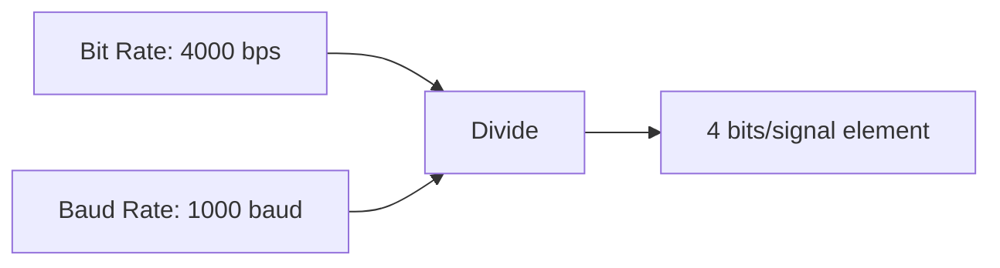

- **Bit rate**: Data transmission speed in bits per second
- **Baud rate**: Number of signal elements (symbols) per second

**Mnemonic:** "BBR" - **B**its per symbol equals **B**it rate divided by **B**aud **R**ate

## Question 2(b) OR [4 marks]

**Discuss the various communication channels characteristics.**

**Answer**:

**Table: Communication Channel Characteristics**

| Characteristic | Description | Importance |
|----------------|-------------|------------|
| **Bandwidth** | Range of frequencies channel can transmit | Determines maximum data rate |
| **Noise** | Unwanted signals that corrupt transmission | Affects signal quality and error rate |
| **Attenuation** | Loss of signal strength during transmission | Limits transmission distance |
| **Distortion** | Change in signal shape/timing | Causes intersymbol interference |
| **Channel capacity** | Maximum data rate with arbitrary small error | Given by Shannon's theorem |

**Diagram:**

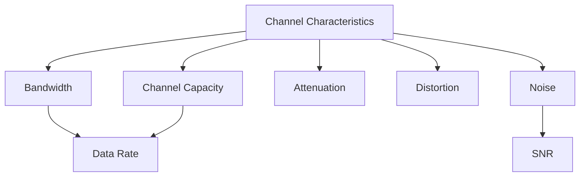

- **SNR (Signal-to-Noise Ratio)**: Ratio of signal power to noise power
- **Channel capacity**: C = B·log₂(1+SNR), where B is bandwidth

**Mnemonic:** "BAND-C" - **B**andwidth, **A**ttenuation, **N**oise, **D**istortion define **C**apacity

## Question 2(c) OR [7 marks]

**Compare ASK, FSK and PSK.**

**Answer**:

**Table: Comparison of Digital Modulation Techniques**

| Parameter | ASK | FSK | PSK |
|-----------|-----|-----|-----|
| **Principle** | Varies amplitude | Varies frequency | Varies phase |
| **Mathematical Expression** | s(t) = A·m(t)·cos(2πf_c·t) | s(t) = A·cos(2π[f_c+m(t)Δf]t) | s(t) = A·cos(2πf_c·t+m(t)·π) |
| **Bandwidth** | r_b (minimum) | 2(Δf+r_b/2) | 2r_b |
| **Power Efficiency** | Poor | Moderate | Good |
| **Noise Immunity** | Poor | Better | Best |
| **Implementation Complexity** | Simple | Moderate | Complex |
| **Applications** | Low-cost systems | Noise-prone environments | High-performance systems |

**Diagram:**

```goat
Digital Input:
   _    __     _
  | |  |  |   | |
__|_|__|  |___|_|___

ASK:
     /\/\    /\/\/\
    /    \  /      \
___/      \/        \___

FSK:
 /\/\/\      /\/\/\
/      \    /      \
        \/\/        \/\/

PSK:
 /\/\/\/\/\/\/\/\/\/\/\
/  \  /  \  /  \  /  \
    \/    \/    \/    \
```

- **Bit error rate**: PSK < FSK < ASK (PSK is best)
- **Complexity order**: ASK < FSK < PSK (ASK is simplest)

**Mnemonic:** "AFP" - **A**mplitude, **F**requency, **P**hase are modified in ASK, FSK, PSK respectively

## Question 3(a) [3 marks]

**Explain the working of FSK modulator with block diagram and output Waveform.**

**Answer**:

**FSK Modulator Block Diagram:**

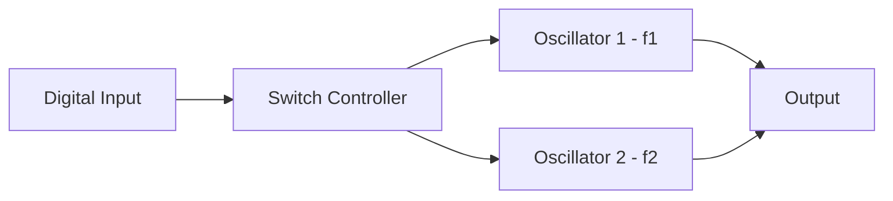

**Waveform:**

```goat
Digital Input:
   _    _      
  | |  | |     
__|_|__|_|_____

FSK Output:
 /\/\/\    /\/\/\
/      \  /      \
        \/        \
        /\        /\
       /  \      /  \
```

**Table: FSK Modulation Process**

| Step | Description |
|------|-------------|
| **Digital Input** | Binary data (0s and 1s) |
| **Frequency Selection** | f₁ for bit '1', f₂ for bit '0' |
| **Waveform Generation** | s(t) = A·cos(2πf₁t) for bit '1', s(t) = A·cos(2πf₂t) for bit '0' |
| **Output** | Continuous phase frequency-shifted signal |

- **Binary FSK**: Uses two frequencies f₁ and f₂ separated by frequency deviation
- **Advantage**: Better noise immunity than ASK

**Mnemonic:** "FAST" - **F**requency **A**lternates between **S**eparate **T**ones

## Question 3(b) [4 marks]

**Draw the PSK modulation waveform for the sequence of 1010110110.**

**Answer**:

**BPSK Modulation for 1010110110:**

```goat
Digital Input:
   _    _   ___   _ _
  | |  | | |   | | | |
__| |__| |_|   |_| | |__

Carrier Signal:
 /\/\/\/\/\/\/\/\/\/\/\

BPSK Output:
 /\/\/\ /\/\/\ /\/\/\ /\
      \/      \/      \/
      /\/\/\/\ /\/\/\/\ /\
                      \/
```

**Table: BPSK Mapping**

| Bit | Phase | Interpretation |
|-----|-------|----------------|
| **1** | 0° | In-phase with carrier (positive) |
| **0** | 180° | Out-of-phase with carrier (negative) |

**Diagram:**

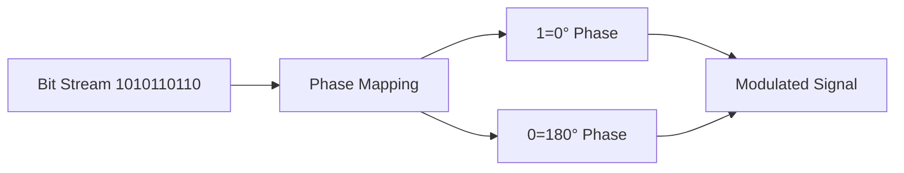

- **Phase shift**: 180° transition at each bit change
- **Constant amplitude**: Unlike ASK, amplitude remains constant

**Mnemonic:** "POPI" - **P**hase **O**pposites for bit **P**airs represent **I**nformation

## Question 3(c) [7 marks]

**Draw the ASK and FSK modulation waveform for the sequence of 1100110101.**

**Answer**:

**Input Bit Sequence: 1100110101**

**ASK Modulation:**

```goat
Digital Input:
   __    __    _  _
  |  |  |  |  | || |
__|  |__|  |__| ||_|__

ASK Output:
 /\/\/\/\    /\/\/\/\  /\/\ /\
         \  /         \/    \ \
         /______________      \_
```

**FSK Modulation:**

```goat
Digital Input:
   __    __    _  _
  |  |  |  |  | || |
__|  |__|  |__| ||_|__

FSK Output (f1=high, f0=low):
 /\/\/\/\        /\/\/\/\      /\/\    
        \      /        \    /    \  /\
         \    /          \  /      \/  \
          \/\/            \/            \
           Higher freq     Higher freq   Higher freq
           for 1s          for 1s        for 1s
         
             Lower freq      Lower freq    Lower freq
             for 0s          for 0s        for 0s
```

**Table: Comparison for the Sequence 1100110101**

| Bit Position | Bit Value | ASK Representation | FSK Representation |
|--------------|-----------|--------------------|--------------------|
| **1-2** | 11 | Carrier present | Higher frequency |
| **3-4** | 00 | Carrier absent | Lower frequency |
| **5-7** | 110 | Carrier present/absent | Higher/lower frequency |
| **8-10** | 101 | Carrier present/absent/present | Higher/lower/higher frequency |

- **ASK modulation**: Simple on-off keying where carrier is present for '1' and absent for '0'
- **FSK modulation**: Frequency shifts between two distinct values based on bit value

**Mnemonic:** "AFOP" - **A**SK switches carrier **O**n-**O**ff while **F**SK shifts between **P**airs of frequencies

## Question 3(a) OR [3 marks]

**Explain the working of MSK modulator with block diagram and output Waveform.**

**Answer**:

**MSK Modulator Block Diagram:**

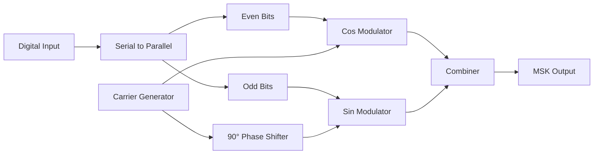

**Waveform:**

```goat
Digital Input:
   _    _      
  | |  | |     
__|_|__|_|_____

MSK Output:
  _-_     _-_  
 /   \   /   \ 
/     \_/     \_
       _-_     _-
      /   \   /  
     /     \_/    
```

**Table: MSK Modulation Process**

| Characteristic | Description |
|----------------|-------------|
| **Principle** | Special case of OQPSK with sinusoidal pulse shaping |
| **Phase Continuity** | Ensures smooth phase transitions (no abrupt phase changes) |
| **Frequency Deviation** | ±0.25 bit rate from carrier frequency |
| **Bandwidth Efficiency** | Better than conventional FSK |

- **Phase continuity**: Key advantage - reduces bandwidth compared to FSK
- **Constant envelope**: Resistant to non-linear amplification

**Mnemonic:** "MCPS" - **M**SK ensures **C**ontinuous **P**hase **S**hifts

## Question 3(b) OR [4 marks]

**Draw the constellation diagram of 8-PSK and 16-QAM.**

**Answer**:

**8-PSK Constellation Diagram:**

```goat
       001 * * 000
           \|/
    010 *---+---* 111
           /|\
       011 * * 101
           100
```

**16-QAM Constellation Diagram:**

```goat
    *   *   *   *
    
    *   *   *   *
    
    *   *   *   *
    
    *   *   *   *
```

**Table: Comparison of Constellation Diagrams**

| Parameter | 8-PSK | 16-QAM |
|-----------|-------|--------|
| **Bits per Symbol** | 3 bits | 4 bits |
| **Symbol Positions** | 8 points on circle | 16 points in grid |
| **Amplitude Levels** | 1 (constant) | 3 (variable) |
| **Phase Angles** | 8 angles (45° apart) | 12 angles |
| **Error Sensitivity** | Moderate | Higher than 8-PSK |
| **Spectral Efficiency** | 3 bits/Hz | 4 bits/Hz |

- **8-PSK**: Points equally spaced around circle with constant amplitude
- **16-QAM**: Points arranged in square grid with different amplitudes and phases

**Mnemonic:** "CEPA" - **C**onstellation points in PSK have **E**qual amplitudes but different **P**hases, QAM has both **A**mplitude and phase variations

## Question 3(c) OR [7 marks]

**Draw BPSK and QPSK modulation waveform for 1010101011.**

**Answer**:

**Input Bit Sequence: 1010101011**

**BPSK Modulation:**

```goat
Digital Input:
   _ _ _ _ _ _ _ _
  | | | | | | | | |
__| |_| |_| |_| |_| |__

BPSK Output:
 /\/\/\ /\/\/\ /\/\/\ /\/\/\ /\
      \/      \/      \/      \/
      /\/\/\/\ /\/\/\/\ /\/\/\/\
```

**QPSK Modulation (Grouping bits: 10,10,10,10,11):**

```goat
Grouped Bits:
   10    10    10    10    11
   
I-channel (odd bits):
   _     _     _     _     _
  | |   | |   | |   | |   | |
__| |___| |___| |___| |___| |__

Q-channel (even bits):
    _     _     _     _      
   | |   | |   | |   | |    |
___| |___| |___| |___| |____|

QPSK Output:
 /\  /\  /\  /\  /\
/  \/  \/  \/  \/  \
    Phase    Phase   Different 
    00       00      phase for 11
```

**Table: BPSK vs. QPSK for 1010101011**

| Characteristic | BPSK | QPSK |
|----------------|------|------|
| **Bits per symbol** | 1 | 2 |
| **Number of symbols** | 10 | 5 |
| **Symbol rate** | Same as bit rate | Half of bit rate |
| **Bandwidth efficiency** | 1 bit/Hz | 2 bits/Hz |
| **Phase states** | 2 (0°, 180°) | 4 (45°, 135°, 225°, 315°) |

- **BPSK**: Each bit causes a potential 180° phase shift
- **QPSK**: Processes two bits at once, uses four phase states

**Mnemonic:** "BQSE" - **B**PSK takes **1** bit while **Q**PSK takes **2** bits, doubling **S**pectral **E**fficiency

## Question 4(a) [3 marks]

**Encode the data using Shanon Fano code for below probability sequence. P = { 0.30, 0.25, 0.20, 0.12, 0.08, 0.05}**

**Answer**:

**Table: Shannon-Fano Coding Process**

| Symbol | Probability | Division Steps | Shannon-Fano Code |
|--------|------------|----------------|-------------------|
| **A** | 0.30 | Top Group | 0 |
| **B** | 0.25 | Top Group | 10 |
| **C** | 0.20 | Bottom Group | 110 |
| **D** | 0.12 | Bottom Group | 1110 |
| **E** | 0.08 | Bottom Group | 1111 0 |
| **F** | 0.05 | Bottom Group | 1111 1 |

**Diagram:**

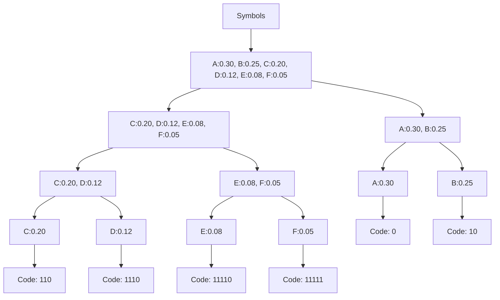

- **Shannon-Fano algorithm**: Recursively divide symbols into two groups with nearly equal probabilities
- **Code efficiency**: Not always optimal but generally good compression

**Mnemonic:** "SPDF" - **S**plit **P**robabilities and assign **D**igits based on **F**requency

## Question 4(b) [4 marks]

**Explain Hamming code.**

**Answer**:

**Table: Hamming Code Properties**

| Property | Description |
|----------|-------------|
| **Type** | Linear error-correcting code |
| **Error Detection** | Can detect up to 2 bit errors |
| **Error Correction** | Can correct single bit errors |
| **Parity Bits (r)** | For n data bits: 2^r ≥ n + r + 1 |
| **Code Structure** | Systematic: message bits + parity bits |
| **Positions of Parity Bits** | Powers of 2: positions 1, 2, 4, 8, 16... |

**Diagram:**

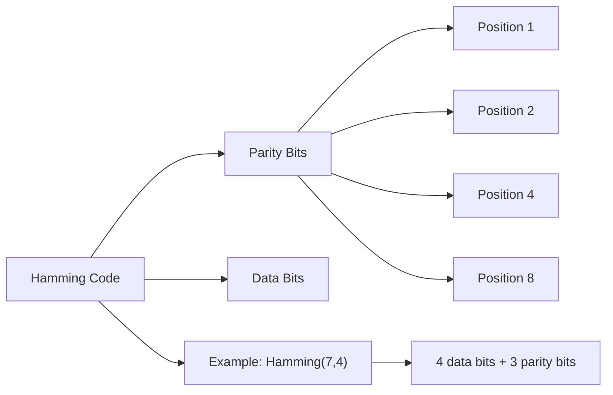

- **Encoding**: Calculate parity bits to ensure specific bit positions have even/odd parity
- **Decoding**: Calculate syndrome to determine error position

**Mnemonic:** "PSEC" - **P**arity bits in **P**ower of 2 positions **S**ystematically **E**nable error **C**orrection

## Question 4(c) [7 marks]

**Compare TDMA and FDMA.**

**Answer**:

**Table: Comparison of TDMA and FDMA**

| Parameter | TDMA | FDMA |
|-----------|------|------|
| **Basic Principle** | Divides time into slots | Divides frequency into channels |
| **Resource Allocation** | Each user gets full bandwidth for short time | Each user gets narrow bandwidth for entire time |
| **Guard Time/Band** | Requires guard time between slots | Requires guard bands between channels |
| **Synchronization** | Critical (timing-dependent) | Not required (frequency separation) |
| **Efficiency** | Better for bursty data | Better for continuous data |
| **Interference** | Less susceptible to interference | More susceptible to adjacent channel interference |
| **Hardware Complexity** | Complex (needs buffering, synchronization) | Simpler (fixed filters) |
| **Power Consumption** | Lower (transmitter on only during time slot) | Higher (continuous transmission) |
| **Capacity** | Easily expanded by adding time slots | Limited by available spectrum |
| **Applications** | GSM, DECT cordless phones | Analog cellular, satellite systems |

**Diagram:**

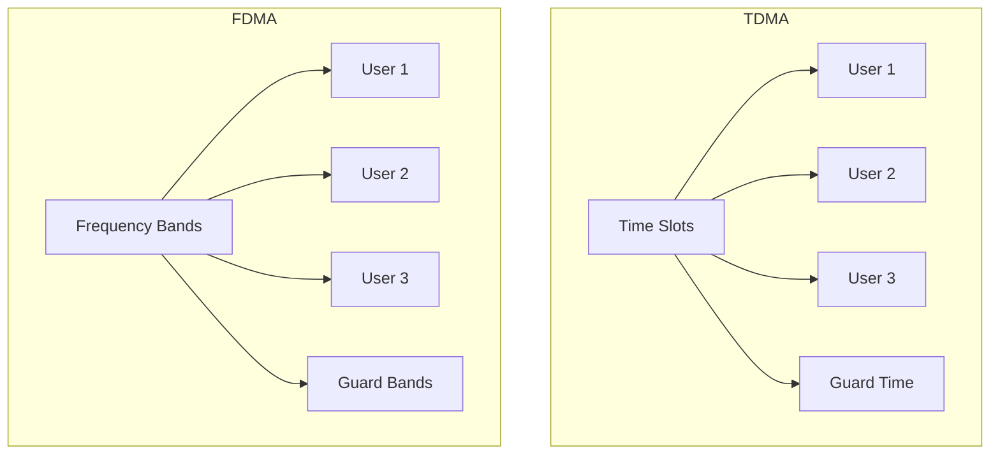

- **System flexibility**: TDMA can dynamically allocate slots, FDMA is fixed allocation
- **Implementation**: TDMA requires digital technology, FDMA works with analog/digital

**Mnemonic:** "TIME-FREQ" - **T**DMA splits **I**ntervals of ti**ME**, **F**DMA splits **R**anges of fr**EQ**uency

## Question 4(a) OR [3 marks]

**Encode the data using Huffman code for below probability sequence. P = { 0.4, 0.19, 0.16, 0.15, 0.1}**

**Answer**:

**Table: Huffman Coding Process**

| Symbol | Probability | Huffman Code |
|--------|------------|--------------|
| **A** | 0.40 | 0 |
| **B** | 0.19 | 10 |
| **C** | 0.16 | 110 |
| **D** | 0.15 | 111 |
| **E** | 0.10 | 110 |

**Diagram:**

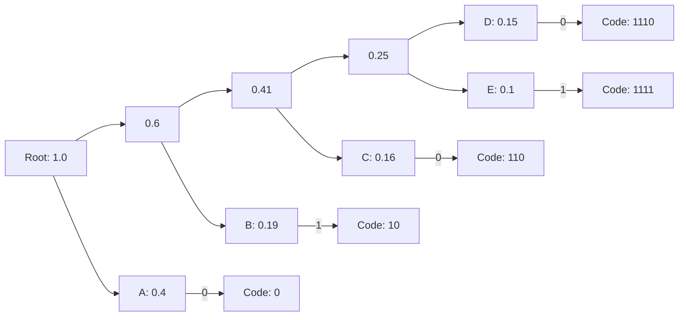

- **Huffman algorithm**: Build a binary tree from bottom up, starting with least probable symbols
- **Optimality**: Produces minimal average code length

**Mnemonic:** "HUMP" - **H**uffman creates shorter codes for **H**igher **P**robabilities

## Question 4(b) OR [4 marks]

**Define Channel Capacity in terms of SNR and its importance in communication.**

**Answer**:

**Shannon's Channel Capacity Formula:**

```
C = B × log₂(1 + SNR)
```
Where:
- C = Channel capacity in bits per second
- B = Bandwidth in Hz
- SNR = Signal-to-Noise Ratio

**Table: Channel Capacity Characteristics**

| Aspect | Description | Importance |
|--------|-------------|------------|
| **Definition** | Maximum error-free data rate possible | Sets fundamental limits |
| **SNR Dependence** | Logarithmically increases with SNR | Shows diminishing returns of power |
| **Bandwidth Dependence** | Linearly increases with bandwidth | Shows value of spectrum |
| **Theoretical Bound** | Can't exceed Shannon limit with any coding | Guides system design |

**Diagram:**

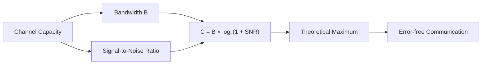

- **Shannon-Hartley theorem**: Establishes theoretical maximum data transfer rate
- **Error probability**: Can be made arbitrarily small if data rate < channel capacity

**Mnemonic:** "SNRB" - **S**hannon capacity depends on **N**oise ratio and **B**andwidth

## Question 4(c) OR [7 marks]

**Explain FDMA Technique in detail.**

**Answer**:

**FDMA (Frequency Division Multiple Access)**

**Table: FDMA System Characteristics**

| Aspect | Description | Significance |
|--------|-------------|--------------|
| **Basic Principle** | Divides available spectrum into channels | Enables multiple simultaneous users |
| **Channel Allocation** | Fixed frequency bands per user | Simplifies hardware design |
| **Guard Bands** | Frequency separation between channels | Prevents adjacent channel interference |
| **Duplexing** | Often paired with FDD (separate Tx/Rx bands) | Enables simultaneous two-way communication |
| **Bandwidth Utilization** | Each channel has fixed bandwidth | Potentially inefficient for bursty data |
| **Intermodulation** | Products of multiple carriers | Requires careful power amplifier design |

**Diagram:**

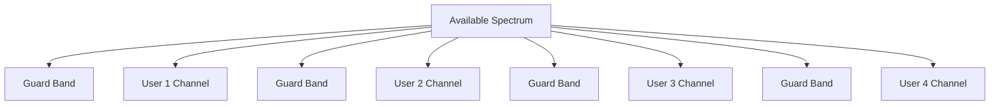

**FDMA Implementation:**

```goat
   ^
   |
 F |  +-----+  +-----+  +-----+  +-----+
 r |  |User1|  |User2|  |User3|  |User4|
 e |  |     |  |     |  |     |  |     |
 q |  |     |  |     |  |     |  |     |
   |  +-----+  +-----+  +-----+  +-----+
   |
   |   Guard    Guard    Guard    
   |   Band     Band     Band     
   +---------------------------------------->
                     Time
```

- **Implementation**: Relatively simple using bandpass filters
- **Advantages**: No synchronization required, continuous transmission
- **Disadvantages**: Spectrum inefficiency, limited flexibility

**Mnemonic:** "FDMA-CIGS" - **F**requency **D**ivision creates **M**ultiple **A**ccess through **C**hannels with **I**ndividual **G**uard band **S**eparation

## Question 5(a) [3 marks]

**Explain TDMA Access technique.**

**Answer**:

**TDMA (Time Division Multiple Access)**

**Table: TDMA Key Characteristics**

| Characteristic | Description |
|----------------|-------------|
| **Basic Principle** | Divides time into frames and slots | 
| **Resource Sharing** | Each user assigned specific time slot |
| **Guard Time** | Small time separation between slots |
| **Frame Structure** | Multiple slots form a complete frame |
| **Synchronization** | Timing reference required for all users |

**Diagram:**

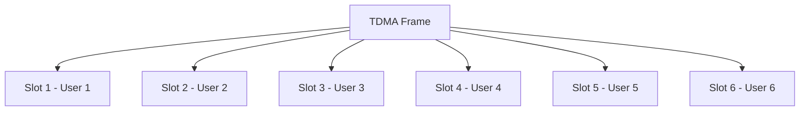

- **Digital implementation**: Requires ADC/DAC for analog signals
- **Burst transmission**: Users transmit only during assigned slots

**Mnemonic:** "TIME" - **T**ime slots **I**ndividually **M**anaged for **E**ach user

## Question 5(b) [4 marks]

**Explain E1 Career system.**

**Answer**:

**E1 Carrier System**

**Table: E1 Carrier System Specifications**

| Parameter | Specification | Details |
|-----------|--------------|---------|
| **Total Bit Rate** | 2.048 Mbps | European standard |
| **Number of Channels** | 32 time slots (0-31) | 30 voice + 2 control |
| **Voice Channels** | Time slots 1-15, 17-31 | Each 64 kbps |
| **Signaling Channel** | Time slot 16 | For channel signaling |
| **Frame Alignment** | Time slot 0 | Synchronization |
| **Frame Duration** | 125 μs | 8000 frames per second |
| **Sampling Rate** | 8 kHz | Follows Nyquist theorem |

**Diagram:**

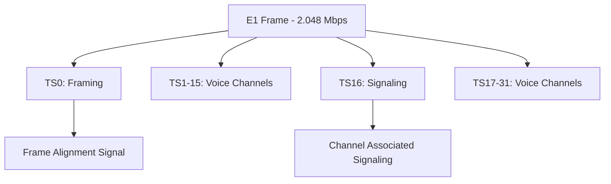

- **Multiplexing technique**: TDM (Time Division Multiplexing)
- **PCM encoding**: 8-bit samples at 8 kHz sampling rate

**Mnemonic:** "E132" - **E1** has **32** time slots with **2**.048 Mbps

## Question 5(c) [7 marks]

**Explain block diagram of Digital telephone exchange, elements of hardware sub systems.**

**Answer**:

**Digital Telephone Exchange Block Diagram**

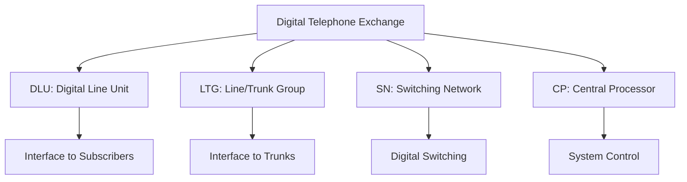

**Table: Hardware Subsystems of Digital Telephone Exchange**

| Subsystem | Function | Key Components |
|-----------|----------|----------------|
| **DLU (Digital Line Unit)** | Interface between subscriber lines and exchange | Line cards, CODEC, SLIC, PCM conversion |
| **LTG (Line/Trunk Group)** | Handles trunk lines, interfaces with other exchanges | Trunk cards, signaling units, echo cancellers |
| **SN (Switching Network)** | Routes calls between ports, provides connectivity | Time/space switches, connection memory, control logic |
| **CP (Central Processor)** | Controls overall system operation | Main processor, memory, operating system, databases |
| **Peripherals** | Supporting functions | Power supply, alarm systems, maintenance terminals |

**Hardware Elements Details:**

- **DLU**: Converts analog voice to 64 kbps PCM, handles line signaling
- **LTG**: Manages E1/T1 trunks, implements protocols like SS7
- **SN**: Typically time-division switching fabric, non-blocking architecture
- **CP**: Call processing, billing, maintenance, administrative functions

**Mnemonic:** "DLSC" - **D**LU connects subscribers, **L**TG connects trunks, **S**N switches calls, **C**P controls everything

## Question 5(a) OR [3 marks]

**Compare TDM and FDM.**

**Answer**:

**Table: Comparison of TDM and FDM**

| Parameter | TDM | FDM |
|-----------|-----|-----|
| **Domain Division** | Time | Frequency |
| **Channel Separation** | Guard time | Guard bands |
| **Multiplexing Process** | Sequential time slots | Parallel frequency bands |
| **Implementation** | Digital (primarily) | Analog or digital |
| **Crosstalk** | Generally less | More susceptible |
| **Synchronization** | Critical | Not required |

**Diagram:**

```goat
TDM:
  Time -->
  +-----------+------+------+------+
  | Channel 1 | Ch 2 | Ch 3 | Ch 1 |...
  +-----------+------+------+------+
  
FDM:
  ^
  |   +-----+
F |   | Ch3 |
r |   +-----+
e |   | Ch2 |
q |   +-----+
  |   | Ch1 |
  |   +-----+
  +--------------->
        Time
```

- **Bandwidth utilization**: TDM more efficient for digital, FDM better for analog
- **System complexity**: TDM requires precise timing, FDM needs precise filters

**Mnemonic:** "TFDS" - **T**ime and **F**requency **D**ivision **S**ystems divide different domains

## Question 5(b) OR [4 marks]

**Discuss T1 Multiplexing hierarchy.**

**Answer**:

**Table: T1 Multiplexing Hierarchy**

| Level | Designation | Data Rate | Number of Voice Channels | Multiplexing |
|-------|-------------|-----------|--------------------------|--------------|
| **T1** | DS1 | 1.544 Mbps | 24 | 24 DS0 (64 kbps) |
| **T2** | DS2 | 6.312 Mbps | 96 | 4 DS1 |
| **T3** | DS3 | 44.736 Mbps | 672 | 7 DS2 |
| **T4** | DS4 | 274.176 Mbps | 4032 | 6 DS3 |

**Diagram:**

```mermaid
graph LR
    A[Individual Voice Channels - DS0 64 kbps] --> B[T1/DS1 - 1.544 Mbps]
    B --> C[T2/DS2 - 6.312 Mbps]
    C --> D[T3/DS3 - 44.736 Mbps]
    D --> E[T4/DS4 - 274.176 Mbps]
```

**T1 Frame Structure:**

```goat
T1 Frame (193 bits):
  F  Ch1  Ch2  ...  Ch24  F  Ch1  ...
  |  |    |         |     |
  |  8    8         8     |
  |  bits bits      bits  |
  |                       |
  Framing bit (1 bit)     Next frame
```

- **T1 frame format**: 193 bits (24 channels × 8 bits + 1 framing bit)
- **Frame duration**: 125 μs (8000 frames per second)

**Mnemonic:** "T-QUAD" - **T**1, T2, T3, T4 form a **QUAD**ruple hierarchy of multiplexing levels

## Question 5(c) OR [7 marks]

**List Features, Characteristics, Advantages and Disadvantages of IoT.**

**Answer**:

**Table: Internet of Things (IoT) Overview**

| Category | Key Points |
|----------|------------|
| **Features** | Device connectivity, Sensor integration, Automated control, Data analytics, Remote monitoring |
| **Characteristics** | Low power consumption, Small form factor, Wireless communication, Real-time data processing, Scalability |
| **Advantages** | Improved efficiency, Data-driven decisions, Remote management, Predictive maintenance, Resource optimization |
| **Disadvantages** | Security vulnerabilities, Privacy concerns, Interoperability issues, Implementation complexity, Power constraints |

**Features of IoT:**

```mermaid
graph TD
    A[IoT Features] --> B[Connectivity]
    A --> C[Intelligence]
    A --> D[Sensing]
    A --> E[Automation]
    A --> F[Cloud Integration]
    A --> G[Data Analytics]
```

**Advantages & Disadvantages:**

```goat
Advantages                    Disadvantages
+---------------------+      +----------------------+
| ✓ Automation        |      | ✗ Security risks     |
| ✓ Enhanced data     |      | ✗ Privacy concerns   |
| ✓ Remote control    |      | ✗ Complex setup      |
| ✓ Cost reduction    |      | ✗ High initial cost  |
| ✓ Quality of life   |      | ✗ Battery life       |
| ✓ Resource savings  |      | ✗ Compatibility      |
+---------------------+      +----------------------+
```

**Characteristics Details:**

- **Interconnectivity**: Anything can be connected to global information & communication infrastructure
- **Things-related services**: IoT provides thing-related services like privacy protection
- **Heterogeneity**: Devices based on different hardware/software platforms
- **Dynamic changes**: Device state changes dynamically (connecting/disconnecting, sleeping/waking)
- **Enormous scale**: Number of devices requiring management exceeds traditional internet connected devices

**Mnemonic:** "CASED" - **C**onnectivity, **A**utomation, **S**ensing, **E**fficiency, **D**ata analytics - key IoT features
