## પ્રશ્ન 1(અ) [3 ગુણ]

**નેગેટીવ ફીડબેક એમ્પ્લીફાયરના ફાયદા અને ગેરફાયદા લખો.**

**જવાબ**:

| ફાયદા | ગેરફાયદા |
|------------|---------------|
| બેન્ડવિડ્થ વધારે છે | ગેઇન ઘટાડે છે |
| ગેઇન સ્થિર કરે છે | વધારે કોમ્પોનન્ટ્સ જરૂરી પડે છે |
| ડિસ્ટોર્શન ઘટાડે છે | ખર્ચ વધારે છે |
| ઇનપુટ ઇમ્પીડન્સ વધારે છે (વોલ્ટેજ સીરીઝ) | જો યોગ્ય રીતે ડિઝાઇન ન કરવામાં આવે તો ઓસિલેશન થઈ શકે છે |
| આઉટપુટ ઇમ્પીડન્સ ઘટાડે છે (વોલ્ટેજ સીરીઝ) | કાળજીપૂર્વક ફેઝ કમ્પેન્સેશન જરૂરી છે |

**મેમરી ટ્રીક:** "GRASS ઊગે પણ ડ્રાય સોઇલ પર" (Gain Reduction, Amplifies Stability, Stops distortion, Better impedance)

## પ્રશ્ન 1(બ) [4 ગુણ]

**નેગેટીવ ફીડબેક એમ્પ્લીફાયરનુ ઓવરઓલ ગેઇન સૂત્ર મેળવો અને નેગેટીવ ફીડબેકની એપ્લીકેશન જણાવો.**

**જવાબ**:

**નેગેટીવ ફીડબેક સાથે ઓવરઓલ ગેઇનની મેળવણી:**

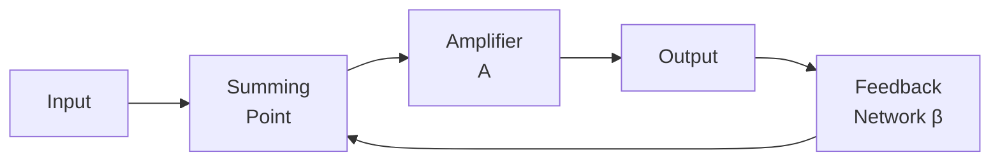

- એમ્પ્લીફાયર ગેઇન A અને ફીડબેક ફેક્ટર β માટે:
  - ઇનપુટ સિગ્નલ = Vin
  - ફીડબેક સિગ્નલ = βVout
  - એમ્પ્લીફાયરમાં વાસ્તવિક ઇનપુટ = Vin - βVout
  - આઉટપુટ = A(Vin - βVout)
  - આથી, Vout = A(Vin - βVout)
  - Vout + AβVout = AVin
  - Vout(1 + Aβ) = AVin
  - **ઓવરઓલ ગેઇન = Vout/Vin = A/(1 + Aβ)**

**નેગેટીવ ફીડબેકની એપ્લીકેશન:**

- ઓપરેશનલ એમ્પ્લીફાયર
- વોલ્ટેજ રેગ્યુલેટર્સ
- ઓડિયો એમ્પ્લીફાયર્સ
- ઇન્સ્ટ્રુમેન્ટેશન એમ્પ્લીફાયર્સ

**મેમરી ટ્રીક:** "AVOI" (Amplifiers, Voltage regulators, Oscillation control, Instrumentation)

## પ્રશ્ન 1(ક) [7 ગુણ]

**કરંટ શન્ટ નેગેટીવ ફીડબેક એમ્પ્લીફાયર દોરી ને સમજાવો અને ઈનપુટ અને આઉટપુટ ઈમ્પપીડન્સ નું સૂત્ર મેળવો.**

**જવાબ**:

**કરંટ શન્ટ નેગેટીવ ફીડબેક એમ્પ્લીફાયર:**

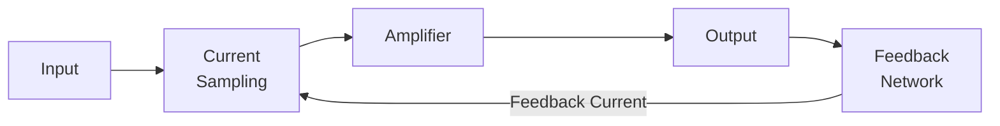

કરંટ શન્ટ ફીડબેકમાં, આઉટપુટ વોલ્ટેજનું સેમ્પલિંગ કરવામાં આવે છે અને તેને કરંટમાં રૂપાંતરિત કરીને ઇનપુટ કરંટમાંથી બાદ કરવામાં આવે છે.

**સર્કિટ ડાયાગ્રામ:**

```goat
                     +Vcc
                       |
                       R
                       |
                       |
  Iin  o----+----------|-------o Vout
            |          |
            |          |
           Zin        Zo
            |          |
            |          |
      +-----+          |
      |                |
   Feedback            |
   Network(β)          |
      |                |
      +----------------+
            |
            |
           GND
```

**લાક્ષણિકતાઓ:**

- **ફીડબેક પ્રકાર**: ઇનપુટ પર કરંટ સેમ્પલિંગ, ઇનપુટ પર શન્ટ મિક્સિંગ
- **સેમ્પલ્સ**: આઉટપુટ વોલ્ટેજ
- **ફીડબેક ટુ**: ઇનપુટ કરંટ

**ઇનપુટ ઇમ્પીડન્સનું સૂત્ર:**

- ફીડબેક વિના: Zin
- કરંટ શન્ટ ફીડબેક સાથે: Zin' = Zin/(1 + Aβ)
- **આથી, ઇનપુટ ઇમ્પીડન્સ (1 + Aβ) ફેક્ટર દ્વારા ઘટે છે**

**આઉટપુટ ઇમ્પીડન્સનું સૂત્ર:**

- ફીડબેક વિના: Zo
- કરંટ શન્ટ ફીડબેક સાથે: Zo' = Zo/(1 + Aβ)
- **આથી, આઉટપુટ ઇમ્પીડન્સ (1 + Aβ) ફેક્ટર દ્વારા ઘટે છે**

**મેમરી ટ્રીક:** "DISCO" (Decreased Impedances with Shunt Current Operation)

## પ્રશ્ન 1(ક) OR [7 ગુણ]

**વોલ્ટેજ સીરીઝ નેગેટીવ ફીડબેક એમ્પ્લીફાયર દોરી ને સમજાવો અને ઈનપુટ અને આઉટપુટ ઈમ્પપીડન્સ નું સૂત્ર મેળવો.**

**જવાબ**:

**વોલ્ટેજ સીરીઝ નેગેટીવ ફીડબેક એમ્પ્લીફાયર:**

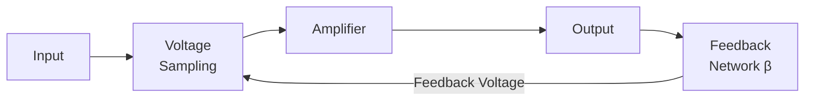

વોલ્ટેજ સીરીઝ ફીડબેકમાં, આઉટપુટ વોલ્ટેજનું સેમ્પલિંગ કરવામાં આવે છે અને તેને ઇનપુટ વોલ્ટેજ સાથે સીરીઝમાં ફીડબેક કરવામાં આવે છે.

**સર્કિટ ડાયાગ્રામ:**

```goat
                     +Vcc
                       |
                       R
                       |
                       |
  Vin  o--+-------+----+-------o Vout
          |       |    |
          Z       |    Z
          i       |    o
          n       |    |
          |       |    |
          +---+   |    |
              |   |    |
              |   |    |
           Feedback    |
           Network(β)  |
              |        |
              +--------+
              |
             GND
```

**લાક્ષણિકતાઓ:**

- **ફીડબેક પ્રકાર**: આઉટપુટ પર વોલ્ટેજ સેમ્પલિંગ, ઇનપુટ પર સીરીઝ મિક્સિંગ
- **સેમ્પલ્સ**: આઉટપુટ વોલ્ટેજ
- **ફીડબેક ટુ**: ઇનપુટ વોલ્ટેજ

**ઇનપુટ ઇમ્પીડન્સનું સૂત્ર:**

- ફીડબેક વિના: Zin
- વોલ્ટેજ સીરીઝ ફીડબેક સાથે: Zin' = Zin × (1 + Aβ)
- **આથી, ઇનપુટ ઇમ્પીડન્સ (1 + Aβ) ફેક્ટર દ્વારા વધે છે**

**આઉટપુટ ઇમ્પીડન્સનું સૂત્ર:**

- ફીડબેક વિના: Zo
- વોલ્ટેજ સીરીઝ ફીડબેક સાથે: Zo' = Zo/(1 + Aβ)
- **આથી, આઉટપુટ ઇમ્પીડન્સ (1 + Aβ) ફેક્ટર દ્વારા ઘટે છે**

**મેમરી ટ્રીક:** "ISDO" (Increased input impedance, Series feedback, Decreased output impedance, Output voltage sampled)

## પ્રશ્ન 2(અ) [3 ગુણ]

**UJT રીલેક્ષેશન ઓસીલેટરનો સરકીટ ડાયાગ્રામ દોરીને સમજાવો.**

**જવાબ**:

**UJT રીલેક્ષેશન ઓસીલેટર:**

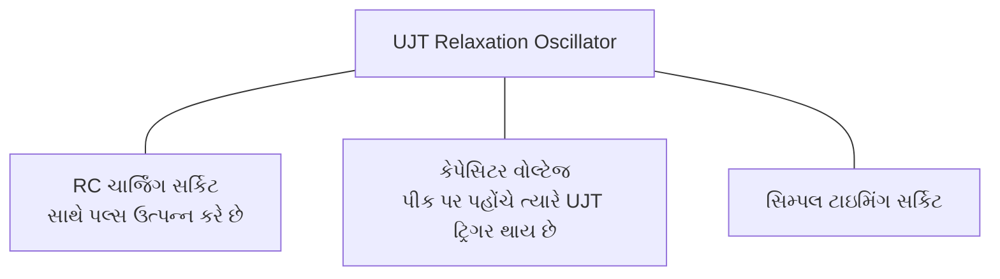

**સર્કિટ ડાયાગ્રામ:**

```goat
    +Vcc
     |
     R1
     |
     +------+
     |      |
     |      |
     |     B2
     |      |   UJT
     |      |
  C1 --- E  |
     |      |
     |     B1
     |      |
     |      |
     +------+
     |
    GND
```

આ સર્કિટમાં:

- C1 ચાર્જ થાય છે R1 દ્વારા
- જ્યારે કેપેસિટર વોલ્ટેજ UJT ના પીક પોઇન્ટ સુધી પહોંચે છે, UJT ચાલુ થાય છે
- કેપેસિટર UJT દ્વારા ઝડપથી ડિસ્ચાર્જ થાય છે
- પ્રક્રિયા પુનરાવર્તિત થાય છે અને ઓસિલેશન ઉત્પન્ન થાય છે

**મેમરી ટ્રીક:** "CURD" (Capacitor charges Until Reaching Discharge point)

## પ્રશ્ન 2(અ) OR [3 ગુણ]

**હાર્ટલી ઓસીલેટર દોરી ને સમજાવો.**

**જવાબ**:

**હાર્ટલી ઓસીલેટર:**

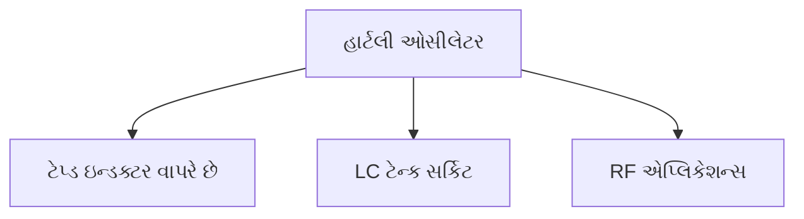

**સર્કિટ ડાયાગ્રામ:**

```goat
                +Vcc
                  |
                  R
                  |
    +-------------+-------------+
    |             |             |
    |             C3            |
    |             |             |
    |      +------+------+      |
    |      |      |      |      |
    |     C1      L1     L2     |
    |      |      |      |      |
    |      +------+------+      |
    |                           |
    +---------------------------+
                |
               GND
```

**કાર્યપ્રણાલી:**

- LC ટેન્ક સર્કિટ સાથે ટેપ્ડ ઇન્ડક્ટર (L1 અને L2) વાપરે છે
- ટ્રાન્ઝિસ્ટર એમ્પ્લિફાય કરે છે અને ટેન્ક સર્કિટને ઊર્જા પૂરી પાડે છે
- ઓસિલેશન ફ્રીક્વન્સી: f = 1/[2π√(L×C)] જ્યાં L = L1 + L2
- ઇન્ડક્ટિવ કપલિંગ દ્વારા ફીડબેક

**મેમરી ટ્રીક:** "TIC" (Tapped inductor Circuit)

## પ્રશ્ન 2(બ) [4 ગુણ]

**કોલપીટ ઓસીલેટરનો સરકીટ ડાયાગ્રામ દોરો અને વિસ્તૃત માં સમજાવો. તેના ફાયદા અને ગેરફાયદા પણ જણાવો.**

**જવાબ**:

**કોલપીટ્સ ઓસીલેટર:**

**સર્કિટ ડાયાગ્રામ:**

```goat
                  +Vcc
                    |
                    RL
                    |
                    |
    +---------------+---------------+
    |               |               |
    |              C3               |
    |               |               |
    |              C1               |
    |              C2               |
    |               +---+           |
    |               |   |           |
    +---+           +---+           |
    |   |----+      |   |           |
    +---+    |      +---+           |
              |                     |
              +---------------------+
              |
             GND
```

**કાર્યપ્રણાલી:**

- કેપેસિટિવ વોલ્ટેજ ડિવાઇડર (C1 અને C2) સાથે LC ટેન્ક સર્કિટ વાપરે છે
- ટ્રાન્ઝિસ્ટર એમ્પ્લિફાય કરે છે અને ટેન્ક સર્કિટને ઊર્જા પૂરી પાડે છે
- ઓસિલેશન ફ્રીક્વન્સી: f = 1/[2π√(L×(C1×C2)/(C1+C2))]

| ફાયદા | ગેરફાયદા |
|------------|---------------|
| સારી ફ્રીક્વન્સી સ્થિરતા | બે કેપેસિટર (C1, C2) જરૂરી છે |
| ઉચ્ચ ફ્રીક્વન્સી પર સારું કામ કરે છે | અન્ય ઓસિલેટર કરતાં ટ્યુન કરવું વધુ મુશ્કેલ છે |
| ઓછા હાર્મોનિક્સ | ટ્રાન્ઝિસ્ટર પેરામીટર્સ પ્રત્યે સંવેદનશીલ |
| સરળ ડિઝાઇન | સીમિત ફ્રીક્વન્સી રેન્જ |

**મેમરી ટ્રીક:** "FAST Circuits" (Frequency stable, Appropriate for high frequencies, Simple design, Two capacitors needed)

## પ્રશ્ન 2(બ) OR [4 ગુણ]

**વિએન બ્રીજ ઓસીલેટર દોરીને સમજાવો.**

**જવાબ**:

**વિએન બ્રીજ ઓસીલેટર:**

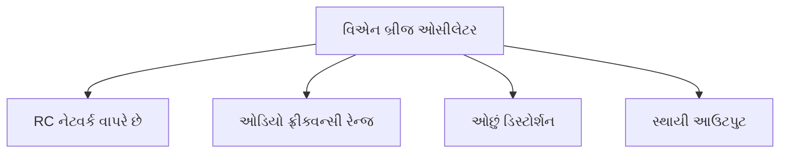

**સર્કિટ ડાયાગ્રામ:**

```goat
          +--------+--------+
          |        |        |
          |        R1       |
          |        |        |
     C1   |        |        |    R3
    ||----+        +---/\/\/\----+
    ||    |        |             |
          |        |             |
          |        |             |
     R2   |       Op-Amp         |
    /\/\--+        |             |
          |        |             |
          |        |             |
    +-----+        +-------------+
    |     |        |             |
    C2    |        |             |
    |     |        |       R4    |
    +-----+--------+------/\/\/\-+
          |
         GND
```

**કાર્યપ્રણાલી:**

- ફ્રીક્વન્સી-સિલેક્ટિવ ફીડબેક તરીકે RC વિએન બ્રીજ નેટવર્ક વાપરે છે
- સૌથી સરળ ડિઝાઇન માટે R1=R2 અને C1=C2
- ઓસિલેશન ફ્રીક્વન્સી: f = 1/(2πRC)
- સતત ઓસિલેશન માટે ગેઇન ≥ 3 હોવું જરૂરી છે
- ઓછા ડિસ્ટોર્શન સાથે ઓડિયો ફ્રીક્વન્સી જનરેશન માટે વપરાય છે

**મેમરી ટ્રીક:** "FEAR" (Frequency selective, Equal RC components, Audio range, Reduced distortion)

## પ્રશ્ન 2(ક) [7 ગુણ]

**Crystal ઓસીલેટર સમજાવો.**

**જવાબ**:

**ક્રિસ્ટલ ઓસીલેટર:**

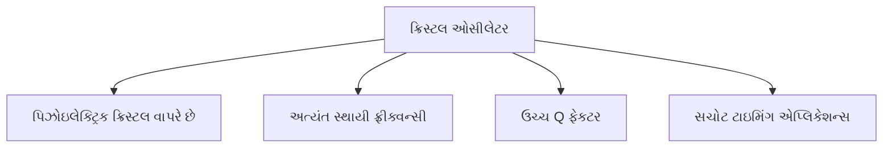

**સર્કિટ ડાયાગ્રામ:**

```goat
                +Vcc
                  |
                  RL
                  |
    +-------------+-------------+
    |             |             |
    |            C3             |
    |             |             |
    |      +------+------+      |
    |      |      |      |      |
    |     C1    XTAL     C2     |
    |      |      |      |      |
    |      +------+------+      |
    |                           |
    +---------------------------+
                |
               GND
```

**કાર્યપ્રણાલી સિદ્ધાંત:**

- ક્વાર્ટ્ઝ ક્રિસ્ટલના પિઝોઇલેક્ટ્રિક ઇફેક્ટ પર આધારિત છે
- જ્યારે વોલ્ટેજ લાગુ કરવામાં આવે ત્યારે ક્રિસ્ટલ તેની કુદરતી રેઝોનન્ટ ફ્રીક્વન્સી પર કંપન કરે છે
- અત્યંત ઊંચા Q ફેક્ટર સાથે ખૂબ જ સ્થાયી રેઝોનેટર તરીકે કામ કરે છે
- સચોટ ફ્રીક્વન્સી પર ફીડબેક પ્રદાન કરે છે

**લાક્ષણિકતાઓ:**

- **રેઝોનન્ટ ફ્રીક્વન્સી**: ક્રિસ્ટલ કટ અને પરિમાણો દ્વારા નક્કી થાય છે
- **Q ફેક્ટર**: સામાન્ય રીતે 10,000-100,000 (LC સર્કિટ્સ કરતાં ઘણું વધારે)
- **ફ્રીક્વન્સી સ્થિરતા**: સામાન્ય રીતે 0.001% થી 0.01%
- **તાપમાન કોએફિશિયન્ટ**: સામાન્ય રીતે ઓછો, ઝીરો તાપમાન કોએફિશિયન્ટ માટે વિશેષ રીતે કાપી શકાય છે

**એપ્લિકેશન્સ:**

- કમ્પ્યુટર્સમાં ક્લોક જનરેશન
- ફ્રીક્વન્સી સ્ટાન્ડર્ડ્સ
- રેડિયો ટ્રાન્સમિટર/રિસીવર
- ડિજિટલ ઘડિયાળ અને ક્લોક્સ
- માઇક્રોકન્ટ્રોલર ટાઇમિંગ

**મેમરી ટ્રીક:** "STOP Precisely" (Stable, Temperature-resistant, Oscillates, Piezoelectric, Precisely)

## પ્રશ્ન 2(ક) OR [7 ગુણ]

**UJT નું સ્ટ્રક્ચર, સીમ્બોલ, એક્વીવેલેન્ટ સરકીટ દોરો અને સમજાવો.**

**જવાબ**:

**યુનિજંક્શન ટ્રાન્ઝિસ્ટર (UJT):**

**સ્ટ્રક્ચર:**

```goat
              Base 2 (B2)
                  |
                  |
                  v
                +---+
                |   |
                |   |
                |   |
                |   |
                |   |
                |   |
                |   |
                |   |
   Emitter (E) >|   |< Base 1 (B1)
                +---+
```

**સિમ્બોલ:**

```goat
                  B2
                  |
                  |
                  |
                  o
                 /|
                / |
               /  |
              /   |
     E o----o     |
              \   |
               \  |
                \ |
                 \|
                  o
                  |
                  |
                  |
                  B1
```

**એક્વિવેલેન્ટ સર્કિટ:**

```goat
                B2
                 |
                 |
                 R
                /\/\
                 |
                 |
      E o---+---|<|---+ B1
             |         |
             |         |
             R         |
            /\/\       |
             |         |
             +---------+
```

**કાર્યપ્રણાલી સિદ્ધાંત:**

- UJT એ એક એમિટર અને બે બેઝ સાથેનું ત્રણ-ટર્મિનલ ડિવાઇસ છે
- P-ટાઇપ એમિટર જંક્શન સાથે N-ટાઇપ સિલિકોન બાર
- આંતરિક રેસિસ્ટન્સ RB1 અને RB2 સાથે વોલ્ટેજ ડિવાઇડર બનાવે છે
- એમિટર કરંટ વહેવાનું શરૂ થાય છે જ્યારે VE > η×VBB + VD
- જ્યાં η ઇન્ટ્રિન્સિક સ્ટેન્ડઓફ રેશિયો = RB1/(RB1+RB2)

**લાક્ષણિકતાઓ:**

- **ઇન્ટ્રિન્સિક સ્ટેન્ડઓફ રેશિયો (η)**: સામાન્ય રીતે 0.5 થી 0.8
- **નેગેટિવ રેઝિસ્ટન્સ રીજન**: વોલ્ટેજ ઘટે છે ત્યારે કરંટ વધે છે
- **પીક પોઇન્ટ**: નેગેટિવ રેઝિસ્ટન્સ રીજનની શરૂઆત
- **વેલી પોઇન્ટ**: નેગેટિવ રેઝિસ્ટન્સ રીજનનો અંત

**એપ્લિકેશન્સ:**

- રિલેક્ઝેશન ઓસિલેટર્સ
- ટાઇમિંગ સર્કિટ્સ
- ટ્રિગર જનરેટર્સ
- SCR ટ્રિગરિંગ સર્કિટ્સ
- સૉટૂથ જનરેટર્સ

**મેમરી ટ્રીક:** "NEVER" (Negative resistance, Emitter-triggered, Valley and peak points, Easily timed, Relaxation oscillator)

## પ્રશ્ન 3(અ) [3 ગુણ]

**વોલ્ટેજ અને પાવર એમ્પ્લીફાયર વચ્ચેનો તફાવત સમજાવો.**

**જવાબ**:

| પેરામીટર | વોલ્ટેજ એમ્પ્લીફાયર | પાવર એમ્પ્લીફાયર |
|-----------|-------------------|-----------------|
| ઉદ્દેશ | વોલ્ટેજને એમ્પ્લિફાય કરે છે | લોડને પાવર પહોંચાડે છે |
| આઉટપુટ ઇમ્પીડન્સ | ઊંચી | નીચી |
| ઇનપુટ ઇમ્પીડન્સ | ઊંચી | તુલનાત્મક રીતે નીચી |
| કાર્યક્ષમતા | મહત્વપૂર્ણ નથી | ખૂબ મહત્વપૂર્ણ છે |
| હીટ ડિસિપેશન | ઓછી | ઊંચી (હીટ સિંક જરૂરી) |
| સર્કિટમાં સ્થાન | શરૂઆતના તબક્કામાં | છેલ્લા તબક્કામાં |

**મેમરી ટ્રીક:** "PEHIP" (Power for Efficiency and Heat, Impedance matters, Position differs)

## પ્રશ્ન 3(અ) OR [3 ગુણ]

**વ્યાખ્યા આપો: 1) Efficiency 2) Distortion 3) Power dissipation capability**

**જવાબ**:

| શબ્દ | વ્યાખ્યા |
|------|------------|
| **Efficiency** | લોડને પહોંચાડવામાં આવતી AC આઉટપુટ પાવરનો સપ્લાયમાંથી લેવામાં આવતી DC ઇનપુટ પાવર સાથેનો ગુણોત્તર. ગાણિતિક રીતે: η = (Pout/Pin) × 100%. ઉચ્ચ કાર્યક્ષમતા એટલે ઓછી પાવર ગરમી તરીકે વેડફાય છે. |
| **Distortion** | ઇનપુટ વેવફોર્મની તુલનામાં આઉટપુટ વેવફોર્મમાં અનિચ્છનીય ફેરફાર. Total Harmonic Distortion (THD) તરીકે માપવામાં આવે છે. હાર્મોનિક, ઇન્ટરમોડ્યુલેશન, ક્રોસઓવર અને એમ્પ્લિટ્યુડ ડિસ્ટોર્શન શામેલ છે. |
| **Power Dissipation Capability** | નુકસાન વિના એમ્પ્લિફાયર દ્વારા વેડફી શકાતી મહત્તમ પાવર. હીટ સિંક, થર્મલ રેઝિસ્ટન્સ અને ટ્રાન્ઝિસ્ટરના મહત્તમ જંક્શન તાપમાન પર આધાર રાખે છે. |

**મેમરી ટ્રીક:** "EDP" (Efficiency converts, Distortion deforms, Power capability protects)

## પ્રશ્ન 3(બ) [4 ગુણ]

**ક્લાસ-બી પુશ પુલ પાવર એમ્પ્લીફાયર સમજાવો.**

**જવાબ**:

**ક્લાસ-B પુશ-પુલ એમ્પ્લિફાયર:**

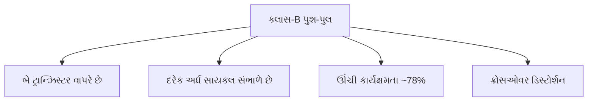

**સર્કિટ ડાયાગ્રામ:**

```goat
         +Vcc
           |
           |
        +--+--+
        |     |
        Q1    |
        |     |
Input o-+     +---o Output
        |     |
        Q2    |
        |     |
        +--+--+
           |
           |
          GND
```

**કાર્યપ્રણાલી:**

- બે કોમ્પ્લિમેન્ટરી ટ્રાન્ઝિસ્ટરનો ઉપયોગ કરે છે
- Q1 પોઝિટિવ અર્ધ-સાયકલ દરમિયાન કન્ડક્ટ કરે છે
- Q2 નેગેટિવ અર્ધ-સાયકલ દરમિયાન કન્ડક્ટ કરે છે
- દરેક ટ્રાન્ઝિસ્ટર ઇનપુટ સાયકલના 180° માટે કન્ડક્ટ કરે છે
- સૈદ્ધાંતિક કાર્યક્ષમતા: 78.5%

**મેમરી ટ્રીક:** "ECHO" (Efficiency high, Crossover distortion, Half-cycle operation, Output high power)

## પ્રશ્ન 3(બ) OR [4 ગુણ]

**ઓપરેશન મોડ નાં આધારે પાવર એમ્પ્લીફાયરનું વર્ગીકરણ કરો અને વિવિધ પ્રકારના પાવર એમ્પ્લીફાયરની કામગીરી સમજાવો.**

**જવાબ**:

**પાવર એમ્પ્લિફાયરનું વર્ગીકરણ:**

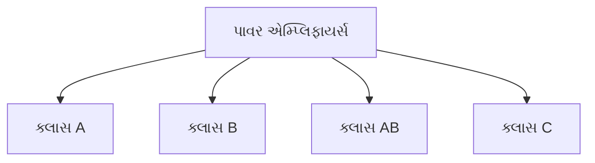

| ક્લાસ | કન્ડક્શન એંગલ | કાર્યપ્રણાલી |
|-------|------------------|---------|
| **ક્લાસ A** | 360° | એમ્પ્લિફાયર સંપૂર્ણ ઇનપુટ સાયકલ માટે કન્ડક્ટ કરે છે. આઉટપુટ સિગ્નલ ઇનપુટની સચોટ પ્રતિકૃતિ હોય છે પરંતુ એમ્પ્લિફાય થયેલી. લિનિયર પરંતુ અકાર્યક્ષમ (25-30%). |
| **ક્લાસ B** | 180° | બે ટ્રાન્ઝિસ્ટર દરેક અર્ધ સાયકલ માટે કન્ડક્ટ કરે છે. એક પોઝિટિવ અર્ધ, બીજો નેગેટિવ અર્ધ સંભાળે છે. વધુ કાર્યક્ષમ (70-80%) પરંતુ ક્રોસઓવર ડિસ્ટોર્શન છે. |
| **ક્લાસ AB** | 180°-360° | ક્લાસ A અને B વચ્ચેનો સમાધાન. ક્રોસઓવર ડિસ્ટોર્શન ઘટાડવા માટે થોડું બાયસ. સારી કાર્યક્ષમતા (50-70%) સાથે સ્વીકાર્ય ડિસ્ટોર્શન. |
| **ક્લાસ C** | <180° | અર્ધ સાયકલથી ઓછા સમય માટે કન્ડક્ટ કરે છે. ખૂબ કાર્યક્ષમ (>80%) પરંતુ અત્યંત ડિસ્ટોર્ટેડ. મુખ્યત્વે RF ટ્યૂન્ડ એમ્પ્લિફાયર્સમાં વપરાય છે. |

**મેમરી ટ્રીક:** "ABCE" (A-all cycle, B-both halves separately, C-compromise solution, E-efficiency with distortion)

## પ્રશ્ન 3(ક) [7 ગુણ]

**Complementary symmetry પુશ પુલ પાવર એમ્પ્લીફાયર દોરી ને સમજાવો અને તેના ગેરફાયદા લખો.**

**જવાબ**:

**કોમ્પ્લિમેન્ટરી સિમેટ્રી પુશ-પુલ એમ્પ્લિફાયર:**

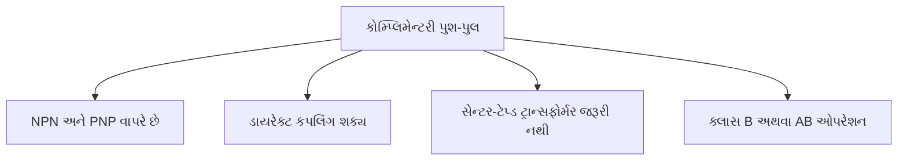

**સર્કિટ ડાયાગ્રામ:**

```goat
               +Vcc
                |
                |
                Q1 (NPN)
                |
   +-----+------+-----+
   |     |            |
   |     |            |
   |     |            |
Input   Bias       Output
   |     |            |
   |     |            |
   +-----+------+-----+
                |
                |
                Q2 (PNP)
                |
                |
               GND
```

**કાર્યપ્રણાલી:**

- કોમ્પ્લિમેન્ટરી પેર (NPN અને PNP ટ્રાન્ઝિસ્ટર) વાપરે છે
- સેન્ટર-ટેપ્ડ ટ્રાન્સફોર્મરની જરૂર નથી
- NPN પોઝિટિવ અર્ધ-સાયકલ સંભાળે છે
- PNP નેગેટિવ અર્ધ-સાયકલ સંભાળે છે
- બાયસિંગ નેટવર્ક ક્રોસઓવર ડિસ્ટોર્શન ઘટાડે છે
- સ્પીકર સાથે ડાયરેક્ટ કપલિંગ શક્ય છે

**ગેરફાયદા:**

- યોગ્ય રીતે બાયસ ન થાય તો થર્મલ રનવે
- કોમ્પ્લિમેન્ટરી મેચ્ડ ટ્રાન્ઝિસ્ટર જરૂરી છે
- ક્લાસ-B ઓપરેશનમાં ક્રોસઓવર ડિસ્ટોર્શન
- પોઝિટિવ અને નેગેટિવ બંને પાવર સપ્લાય જરૂરી છે
- સચોટ કોમ્પ્લિમેન્ટરી પેર શોધવામાં મુશ્કેલી

**મેમરી ટ્રીક:** "MATCH Precisely" (Matched transistors, Avoids transformers, Thermal issues, Crossover distortion, Heat dissipation needed)

## પ્રશ્ન 3(ક) OR [7 ગુણ]

**ક્લાસ-બી પુશ પુલ પાવર એમ્પ્લીફાયરનું કાર્યક્ષમતાનું સમીકરણ મેળવો.**

**જવાબ**:

**ક્લાસ-B પુશ-પુલ એમ્પ્લિફાયર કાર્યક્ષમતાની મેળવણી:**

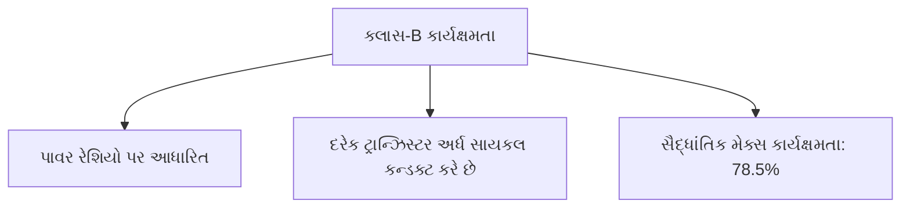

**સર્કિટ ડાયાગ્રામ:**

```goat
         +Vcc
           |
           |
        +--+--+
        |     |
        Q1    |
        |     |
Input o-+     +---o Output
        |     |
        Q2    |
        |     |
        +--+--+
           |
           |
          GND
```

**કાર્યક્ષમતા ગણતરી:**

1. **DC પાવર ઇનપુટ ગણતરી:**
   - દરેક ટ્રાન્ઝિસ્ટર અર્ધ સાયકલ માટે કન્ડક્ટ કરે છે
   - એવરેજ DC કરંટ: Idc = Imax/π
   - DC પાવર ઇનપુટ: Pdc = Vcc × Idc = Vcc × Imax/π

2. **AC પાવર આઉટપુટ ગણતરી:**
   - કરંટની RMS વેલ્યુ: Irms = Imax/2
   - AC પાવર આઉટપુટ: Pac = (Irms)² × RL = (Imax/2)² × RL
   - મહત્તમ પાવર માટે: Imax × RL = Vcc
   - આથી: Pac = (Vcc)²/(2π × RL)

3. **કાર્યક્ષમતા ગણતરી:**
   - η = (Pac/Pdc) × 100%
   - η = [(Vcc)²/(2π × RL)] ÷ [Vcc × Imax/π] × 100%
   - η = [(Vcc)²/(2π × RL)] ÷ [Vcc × Vcc/(π × RL)] × 100%
   - η = [(Vcc)²/(2π × RL)] × [π × RL/Vcc²] × 100%
   - η = π/4 × 100% ≈ 78.5%

**ક્લાસ-B પુશ-પુલ એમ્પ્લિફાયરની મહત્તમ સૈદ્ધાંતિક કાર્યક્ષમતા 78.5% છે**

**મેમરી ટ્રીક:** "PIPE" (Power ratio, Input DC vs output AC, Pi in formula, Efficiency maximum 78.5%)

## પ્રશ્ન 4(અ) [3 ગુણ]

**IC 741 નો પીન ડાયાગ્રામ અને યોજનાકીય પ્રતિક દોરો અને તેને વિગતવાર સમજાવો.**

**જવાબ**:

**IC 741 ઓપ-એમ્પ પીન ડાયાગ્રામ અને સિમ્બોલ:**

**પીન ડાયાગ્રામ:**

```goat
        +-------+
  1 o---|       |---o 8
        |       |
  2 o---|  741  |---o 7
        |       |
  3 o---|       |---o 6
        |       |
  4 o---|       |---o 5
        +-------+
```

**સ્કેમેટિક સિમ્બોલ:**

```goat
            
        |\ 
        | \
   +---o|  \
        |   >---o Output
   -o---| /
        |/
            
```

**પીન વિગત:**

1. ઓફસેટ નલ (NC1)
2. ઇન્વર્ટિંગ ઇનપુટ (-)
3. નોન-ઇન્વર્ટિંગ ઇનપુટ (+)
4. નેગેટિવ સપ્લાય (-Vcc)
5. ઓફસેટ નલ (NC2)  
6. આઉટપુટ
7. પોઝિટિવ સપ્લાય (+Vcc)
8. NC (નો કનેક્શન)

**મેમરી ટ્રીક:** "ON-INO" (Offset Null, Inverting input, Negative supply, Input non-inverting, Output, No connection)

## પ્રશ્ન 4(અ) OR [3 ગુણ]

**Ideal Op-amp ની લાક્ષણિકતાની યાદી બનાવો.**

**જવાબ**:

| લાક્ષણિકતા | આદર્શ મૂલ્ય |
|----------------|-------------|
| **ઓપન-લૂપ ગેઇન** | અનંત |
| **ઇનપુટ ઇમ્પીડન્સ** | અનંત |
| **આઉટપુટ ઇમ્પીડન્સ** | શૂન્ય |
| **બેન્ડવિડ્થ** | અનંત |
| **CMRR** | અનંત |
| **સ્લ્યુ રેટ** | અનંત |
| **ઓફસેટ વોલ્ટેજ** | શૂન્ય |
| **નોઇઝ** | શૂન્ય |

**મેમરી ટ્રીક:** "ZINC BOSS" (Zero offset, Infinite bandwidth, No noise, CMRR infinite, Bandwidth unlimited, Output impedance zero, Slew rate unlimited, Speed unlimited)

## પ્રશ્ન 4(બ) [4 ગુણ]

**OPAMP નો ઉપયોગ કરીને differential એમ્પ્લીફાયર સમજાવો.**

**જવાબ**:

**ઓપ-એમ્પનો ઉપયોગ કરીને ડિફરેન્શિયલ એમ્પ્લિફાયર:**

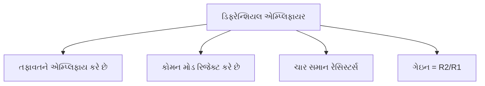

**સર્કિટ ડાયાગ્રામ:**

```goat
             R2
   v1 o---/\/\/\---+
                   |
                   |
      R1           |      R2
   +--/\/\/\--+---o|+     /\/\/\--o Vout
   |           |    |-
   |           |    |
   |           |    |
   +--/\/\/\--+----+
      R1           |
                   |
   v2 o---/\/\/\---+
             R2
```

**કાર્યપ્રણાલી:**

- આઉટપુટ ઇનપુટ્સ વચ્ચેના તફાવતને પ્રપોર્શનલ હોય છે
- જો R1 = R3 અને R2 = R4, તો: Vout = (R2/R1)(V2-V1)
- બંને ઇનપુટ્સ માટે સામાન્ય સિગ્નલ્સને રિજેક્ટ કરે છે (કોમન-મોડ રિજેક્શન)
- ઇન્સ્ટ્રુમેન્ટેશન એપ્લિકેશન્સમાં વપરાય છે

**મેમરી ટ્રીક:** "CARE" (Common-mode rejection, Amplifies difference, Resistor matching important, Equal resistors for balance)

## પ્રશ્ન 4(બ) OR [4 ગુણ]

**ઓપરેશનલ એમ્પ્લીફાયર (OP-AMP) નો બ્લોક ડાયાગ્રામ દોરીને વિસ્તૃતમાં સમજાવો.**

**જવાબ**:

**ઓપ-એમ્પ બ્લોક ડાયાગ્રામ:**

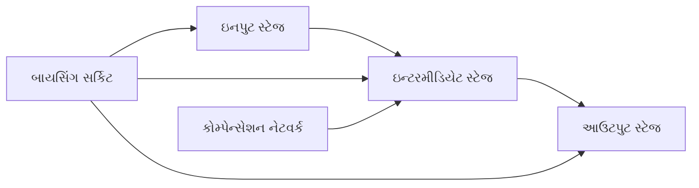

**વિગતવાર બ્લોક ડાયાગ્રામ:**

```goat
                                Power Supply
                                    |
                                    v
 +------+     +------------+     +----------+     +------+
 |      |     |            |     |          |     |      |
 | Input|---->|Differential|---->|  Voltage |---->|Output|---> Output
 | Pins |     |   Stage    |     |   Gain   |     | Stage|
 |      |     |            |     |   Stage  |     |      |
 +------+     +------------+     +----------+     +------+
                  ^                 ^               ^
                  |                 |               |
              +---+----+            |               |
              |        |            |               |
              | Biasing|------------+---------------+
              | Circuit|
              |        |
              +--------+
                  ^
                  |
            Power Supply
```

**બ્લોક્સની કાર્યપ્રણાલી:**

1. **ઇનપુટ સ્ટેજ**: ઊંચા ઇનપુટ ઇમ્પીડન્સ સાથે ડિફરેન્શિયલ એમ્પ્લિફાયર
2. **ઇન્ટરમીડિયેટ સ્ટેજ**: ફ્રીક્વન્સી કોમ્પેન્સેશન સાથે હાઇ-ગેઇન વોલ્ટેજ એમ્પ્લિફાયર
3. **આઉટપુટ સ્ટેજ**: ઓછા આઉટપુટ ઇમ્પીડન્સ બફર, કરંટ ગેઇન પ્રદાન કરે છે
4. **બાયસિંગ સર્કિટ**: બધા સ્ટેજને યોગ્ય DC સ્તર પ્રદાન કરે છે
5. **કોમ્પેન્સેશન નેટવર્ક**: ઓસિલેશન અટકાવે છે, સ્થિરતા સુનિશ્ચિત કરે છે

**મેમરી ટ્રીક:** "DISCO" (Differential stage Input, Second stage amplifies, Compensation network, Output buffer)

## પ્રશ્ન 4(ક) [7 ગુણ]

**OP-Amp પેરામીટર સમજાવો: 1) ઈનપુટ ઓફસેટ વોલ્ટેજ 2) આઉટપુટ ઓફસેટ વોલ્ટેજ 3) ઈનપુટ ઓફસેટ કરંટ 4) ઈનપુટ બાયસ કરંટ 5) CMRR 6) સ્લુ રેટ 7) ગેઇન.**

**જવાબ**:

**ઓપ-એમ્પના પેરામીટર્સ:**

| પેરામીટર | વર્ણન | 741 માટે ટિપિકલ વેલ્યુ |
|-----------|-------------|------------------------|
| **ઇનપુટ ઓફસેટ વોલ્ટેજ** | આઉટપુટને શૂન્ય કરવા માટે ઇનપુટ પર જરૂરી વોલ્ટેજ | 1-5 mV |
| **આઉટપુટ ઓફસેટ વોલ્ટેજ** | ઇનપુટ્સ ગ્રાઉન્ડ કરવામાં આવે ત્યારે આઉટપુટ વોલ્ટેજ | ઇનપુટ ઓફસેટ અને ગેઇન પર આધારિત |
| **ઇનપુટ ઓફસેટ કરંટ** | ઇનપુટ બાયસ કરંટ્સ વચ્ચેનો તફાવત | 3-30 nA |
| **ઇનપુટ બાયસ કરંટ** | બે ઇનપુટ કરંટ્સની સરેરાશ | 30-500 nA |
| **CMRR** | કોમન-મોડ સિગ્નલ્સને રિજેક્ટ કરવાની ક્ષમતા | 70-100 dB |
| **સ્લ્યુ રેટ** | આઉટપુટ વોલ્ટેજ પરિવર્તનનો મહત્તમ દર | 0.5 V/μs |
| **ગેઇન (Aol)** | ઓપન-લૂપ વોલ્ટેજ ગેઇન | 104-106 (80-120 dB) |

**ઇનપુટ ઓફસેટ વોલ્ટેજ માટે ડાયાગ્રામ:**

```goat
                 Vos
                  |
                  v
      +-----+     |     +-----+
      |     |     |     |     |
   ---+  +  +-----+-----+     +---
      |     |           |     |
      +-----+           +-----+
```

**મેમરી ટ્રીક:** "VICS BGR" (Voltage offset at Input, Current offset, Slew rate, Bias current, Gain, Rejection ratio)

## પ્રશ્ન 4(ક) OR [7 ગુણ]

**Inverting અને Non-inverting Op-amp એમ્પ્લીફાયર આકૃતિ દોરી વોલ્ટેજ ગેઇન નું સૂત્ર તારવી સમજાવો.**

**જવાબ**:

**ઇન્વર્ટિંગ એમ્પ્લિફાયર:**

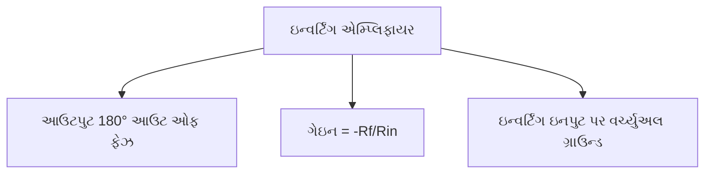

**સર્કિટ ડાયાગ્રામ:**

```goat
                 Rf
           +----/\/\/\----+
           |              |
           |              |
     Rin   |    +\        |
Vin o--/\/\/\---|-\       |
           |    |  \      |
           |    |   \-----o Vout
           |    |  /
           |    |-/
           |    +/
           |    |
           |    |
           +----+
                |
               GND
```

**ગેઇન મેળવણી:**

- વર્ચ્યુઅલ ગ્રાઉન્ડ કન્સેપ્ટનો ઉપયોગ (V- ≈ 0)
- Rin દ્વારા કરંટ: Iin = Vin/Rin
- Rf દ્વારા કરંટ: If = Iin (ઓપ-એમ્પ ઇનપુટમાં કોઈ કરંટ નથી)
- Rf પર વોલ્ટેજ: Vout = -If × Rf = -Iin × Rf = -Vin × Rf/Rin
- આથી, ગેઇન = Vout/Vin = -Rf/Rin

**નોન-ઇન્વર્ટિંગ એમ્પ્લિફાયર:**

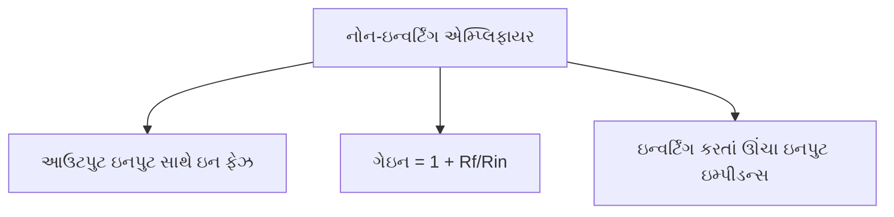

**સર્કિટ ડાયાગ્રામ:**

```goat
                 Rf
           +----/\/\/\----+
           |              |
           |              |
           |    +\        |
Vin o------+----|-\       |
           |    |  \      |
           |    |   \-----o Vout
           |    |  /
           |    |-/
           |    +/
           |    |
           |    |
           +--/\/\/\--+
              Rin     |
                      |
                     GND
```

**ગેઇન મેળવણી:**

- નેગેટિવ ફીડબેકને કારણે, V- ≈ V+ = Vin
- Rin પર વોલ્ટેજ: V- = Vin
- Rin દ્વારા કરંટ: IRin = V-/Rin = Vin/Rin
- સમાન કરંટ Rf દ્વારા વહે છે: IRf = IRin
- Rf પર વોલ્ટેજ: VRf = IRf × Rf = Vin × Rf/Rin
- આઉટપુટ વોલ્ટેજ: Vout = V- + VRf = Vin + Vin × Rf/Rin = Vin(1 + Rf/Rin)
- આથી, ગેઇન = Vout/Vin = 1 + Rf/Rin

**તુલના:**

| પેરામીટર | ઇન્વર્ટિંગ એમ્પ્લિફાયર | નોન-ઇન્વર્ટિંગ એમ્પ્લિફાયર |
|-----------|---------------------|-------------------------|
| **ગેઇન ફોર્મ્યુલા** | -Rf/Rin | 1 + Rf/Rin |
| **ફેઝ શિફ્ટ** | 180° | 0° |
| **ઇનપુટ ઇમ્પીડન્સ** | Rin ની બરાબર | ખૂબ ઊંચી (≈ અનંત) |
| **ન્યૂનતમ સંભવિત ગેઇન** | <1 હોઈ શકે છે | હંમેશા ≥1 હોય છે |

**મેમરી ટ્રીક:** "PING-PONG" (Phase Inverted Negative Gain vs Positive Output Non-inverted Gain)

## પ્રશ્ન 5(અ) [3 ગુણ]

**Op-Amp નો ઉપયોગ કરીને ઇન્ટીગ્રેટર દોરો અને સમજાવો.**

**જવાબ**:

**ઓપ-એમ્પ ઇન્ટીગ્રેટર:**

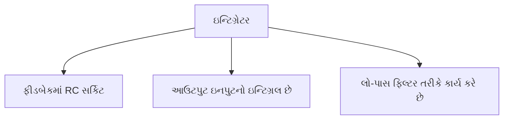

**સર્કિટ ડાયાગ્રામ:**

```goat
                  C
              +---||---+
              |        |
              |        |
   Vin o--/\/\/\--+---o|+      |
            R     |    |-      +---o Vout
                  |    |       |
                  |    |
                  +----+
                  |
                 GND
```

**કાર્યપ્રણાલી:**

- આઉટપુટ વોલ્ટેજ ઇનપુટના ઇન્ટિગ્રલને પ્રપોર્શનલ છે
- Vout = -1/RC ∫Vin dt
- વેવફોર્મ જનરેટર્સ, એનાલોગ કમ્પ્યુટર્સમાં વપરાય છે
- -20dB/decade સ્લોપ સાથે લો-પાસ ફિલ્ટર તરીકે કાર્ય કરે છે

**મેમરી ટ્રીક:** "TIME" (Takes Input and Makes integral over time Exactly)

## પ્રશ્ન 5(અ) OR [3 ગુણ]

**Op-Amp નો ઉપયોગ કરી સમિંગ એમ્પ્લીફાયર દોરો અને સમજાવો.**

**જવાબ**:

**ઓપ-એમ્પ સમિંગ એમ્પ્લિફાયર:**

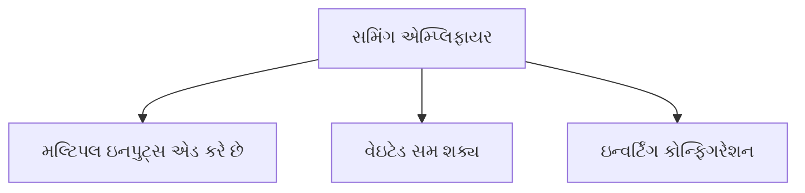

**સર્કિટ ડાયાગ્રામ:**

```goat
              Rf
        +---/\/\/\---+
        |            |
        |            |
  R1    |    +\      |
V1 o--/\/\/\--|-\     |
        |    |  \    |
  R2    |    |   \---o Vout
V2 o--/\/\/\--+   /
        |    |  /
  R3    |    |-/
V3 o--/\/\/\--+/
        |     |
        |     |
        +-----+
              |
             GND
```

**કાર્યપ્રણાલી:**

- મલ્ટિપલ ઇનપુટ્સ સાથે ઇન્વર્ટિંગ કોન્ફિગરેશન વાપરે છે
- દરેક ઇનપુટ તેના રેઝિસ્ટન્સના આધારે આઉટપુટમાં યોગદાન આપે છે
- જો R1 = R2 = R3 = R અને Rf = R, તો Vout = -(V1 + V2 + V3)
- જો રેઝિસ્ટર્સ અલગ હોય, તો વેઇટેડ સમ ઉત્પન્ન થાય છે: Vout = -Rf(V1/R1 + V2/R2 + V3/R3)
- ઇન્વર્ટિંગ ઇનપુટ પર વર્ચ્યુઅલ ગ્રાઉન્ડ એનાલિસિસને સરળ બનાવે છે

**મેમરી ટ્રીક:** "SWIM" (Summing Weighted Inputs with Mixing)

## પ્રશ્ન 5(બ) [4 ગુણ]

**વિવિધ પ્રકારના પાવર એમ્પ્લીફાયરની સરખામણી કરો.**

**જવાબ**:

| પેરામીટર | ક્લાસ A | ક્લાસ B | ક્લાસ AB | ક્લાસ C |
|-----------|---------|---------|----------|---------|
| **કન્ડક્શન એંગલ** | 360° | 180° | 180°-360° | <180° |
| **કાર્યક્ષમતા** | 25-30% | 70-80% | 50-70% | >80% |
| **ડિસ્ટોર્શન** | ખૂબ ઓછું | ઊંચું (ક્રોસઓવર) | ઓછું | ખૂબ ઊંચું |
| **બાયસિંગ** | કટઓફ ઉપર | કટઓફ પર | કટઓફથી થોડું ઉપર | કટઓફથી નીચે |
| **એપ્લિકેશન્સ** | હાઇ ફિડેલિટી ઓડિયો | જનરલ પર્પઝ | ઓડિયો એમ્પ્લિફાયર્સ | RF એમ્પ્લિફાયર્સ |

**મેમરી ટ્રીક:** "CABINET" (Conduction angle, Amplification quality, Biasing, Ideal applications, Noise/distortion, Efficiency, Temperature concerns)

## પ્રશ્ન 5(બ) OR [4 ગુણ]

**પુશ પુલ એમ્પ્લીફાયર અને કોમ્પ્લીમેન્ટરી પુશ પુલ એમ્પ્લીફાયર ની સરખામણી કરો.**

**જવાબ**:

| પેરામીટર | પુશ-પુલ એમ્પ્લિફાયર | કોમ્પ્લિમેન્ટરી પુશ-પુલ એમ્પ્લિફાયર |
|-----------|---------------------|-----------------------------------|
| **વપરાતા ટ્રાન્ઝિસ્ટર્સ** | સમાન પ્રકાર (NPN અથવા PNP) | કોમ્પ્લિમેન્ટરી જોડી (NPN અને PNP) |
| **ઇનપુટ ટ્રાન્સફોર્મર** | જરૂરી (સેન્ટર-ટેપ્ડ) | જરૂરી નથી |
| **આઉટપુટ ટ્રાન્સફોર્મર** | જરૂરી | જરૂરી નથી |
| **સર્કિટ જટિલતા** | વધુ જટિલ | સરળ |
| **ખર્ચ** | ટ્રાન્સફોર્મર્સને કારણે ઊંચો | નીચો |
| **ફ્રીક્વન્સી રિસ્પોન્સ** | ટ્રાન્સફોર્મર્સ દ્વારા મર્યાદિત | વધુ સારું (વિશાળ રેન્જ) |
| **ફેઝ ડિસ્ટોર્શન** | ઊંચું | નીચું |
| **પાવર સપ્લાય** | સિંગલ પોલારિટી | સામાન્ય રીતે ડ્યુઅલ પોલારિટી જરૂરી |

**મેમરી ટ્રીક:** "TONIC" (Transformers vs None, One type vs complementary, Nice frequency response, Improved distortion, Cost effectiveness)

## પ્રશ્ન 5(ક) [7 ગુણ]

**IC555 ના ઉપયોગો લખો અને કોઈ પણ એક વિસ્તૃતમાં સમજાવો.**

**જવાબ**:

**IC 555 ના એપ્લિકેશન્સ:**

1. એસ્ટેબલ મલ્ટિવાયબ્રેટર
2. મોનોસ્ટેબલ મલ્ટિવાયબ્રેટર
3. બાયસ્ટેબલ મલ્ટિવાયબ્રેટર
4. પલ્સ વિડ્થ મોડુલેટર
5. સિક્વેન્શિયલ ટાઇમર
6. ફ્રીક્વન્સી ડિવાઇડર
7. ટોન જનરેટર

**IC 555 નો ઉપયોગ કરીને એસ્ટેબલ મલ્ટિવાયબ્રેટર:**

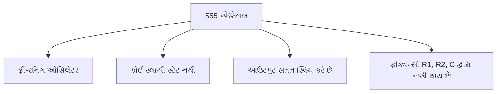

**સર્કિટ ડાયાગ્રામ:**

```goat
                  +Vcc
                    |
                    |
             +------+------+
             |      |      |
             |     R1      |
             |      |      |
             +------+------+
             |      |      |
             |     R2      |
             |      |      |
    +--------+------+------+--------+
    |        |      |      |        |
    |   +----+    8 |      |        |
    |   |    |      |      |        |
    |   |    |    7 |      |        |
    |   |    |      |      |        |
    |   |    |    6 |      |        |
    |  C1    |      | 555  |        |
    |   |    |    5 +------+        |
    |   |    |      |      |        |
    |   |    |    4 |      |        |
    |   |    |      |      |        |
    |   |    |    3 |      +---o Output
    |   |    |      |      |        |
    |   |    |    2 |      |        |
    |   |    |      |      |        |
    |   |    |    1 |      |        |
    |   |    +------+------+        |
    |   |           |               |
    +---+-----------+---------------+
        |           |
       GND         GND
```

**કાર્યપ્રણાલી:**

- R1, R2 અને C ફ્રીક્વન્સી નક્કી કરે છે
- આઉટપુટ HIGH અને LOW વચ્ચે ઓસિલેટ કરે છે
- ચાર્જિંગ ટાઇમ: t1 = 0.693(R1+R2)C
- ડિસ્ચાર્જિંગ ટાઇમ: t2 = 0.693(R2)C
- કુલ પીરિયડ: T = t1 + t2 = 0.693(R1+2R2)C
- ફ્રીક્વન્સી: f = 1.44/[(R1+2R2)C]
- ડ્યુટી સાયકલ: D = (R1+R2)/(R1+2R2)

**એપ્લિકેશન્સ:**

- LED ફ્લેશર્સ
- ક્લોક જનરેટર્સ
- ટોન જનરેટર્સ
- પલ્સ જનરેશન

**મેમરી ટ્રીક:** "FREE" (Frequency determined by Resistors and capacitor, Endless oscillation, Easy to configure)

## પ્રશ્ન 5(ક) OR [7 ગુણ]

**IC555 નો પીન ડાયાગ્રામ અને બ્લોક ડાયાગ્રામ દોરો અને વિસ્તૃતમાં સમજાવો.**

**જવાબ**:

**IC 555 ટાઇમર:**

**પીન ડાયાગ્રામ:**

```goat
        +-------+
  1 o---|       |---o 8
        |       |
  2 o---|  555  |---o 7
        |       |
  3 o---|       |---o 6
        |       |
  4 o---|       |---o 5
        +-------+
```

**પીન વિગત:**

1. ગ્રાઉન્ડ - સર્કિટ ગ્રાઉન્ડથી જોડાયેલ
2. ટ્રિગર - વોલ્ટેજ 1/3 Vcc થી નીચે પડે ત્યારે ટાઇમિંગ સાયકલ શરૂ કરે છે
3. આઉટપુટ - આઉટપુટ સિગ્નલ પ્રદાન કરે છે, 200mA સુધી સોર્સ અથવા સિંક કરી શકે છે
4. રીસેટ - લો પર ખેંચવામાં આવે ત્યારે ટાઇમિંગ સાયકલ સમાપ્ત કરે છે
5. કન્ટ્રોલ વોલ્ટેજ - આંતરિક વોલ્ટેજ ડિવાઇડર (2/3 Vcc) ને ઍક્સેસ કરવાની મંજૂરી આપે છે
6. થ્રેશોલ્ડ - વોલ્ટેજ 2/3 Vcc થી વધે ત્યારે ટાઇમિંગ સાયકલ સમાપ્ત કરે છે
7. ડિસ્ચાર્જ - આંતરિક ટ્રાન્ઝિસ્ટરના ઓપન કલેક્ટરથી જોડાયેલ
8. Vcc - પોઝિટિવ સપ્લાય વોલ્ટેજ (4.5V થી 16V)

**બ્લોક ડાયાગ્રામ:**

```goat
    8                               
    o------+---------------------+  
    Vcc    |                     |  
           |    +-----------+    |  
    5      |    |           |    |  
    o------+----| Voltage   |    |  
    Control|    | Divider   |    |  
           |    |           |    |  
           |    +-----------+    |  
           |      |     |        |  
           |      |     |        |  
    2      |    +-v-+ +-v-+      |  
    o------+--->|   | |   |      |  
    Trigger     |Comp| |Comp|    |  
                |   | |   |      |  
    6           +-+-+ +-+-+      |  
    o------------+|     |+-------+  
    Threshold     |     |           
                +-v-----v-+         
                |         |         
                | Flip    |         
    4           | Flop    |         
    o---------->|         |         
    Reset       +-+-----+-+         
                  |     |           
                  |     |           
                +-v-+ +-v-+         
                |   | |   |         
                |Buf| |Out|         
                |   | |   |         
                +-+-+ +-+-+         
                  |     |           
    7             |     |  3        
    o-------------+     +--o        
    Discharge               Output  
                                    
    1                               
    o----------------------------+  
    GND                          |  
                                 |  
    +----------------------------+  
```

**કાર્યપ્રણાલી:**

1. **વોલ્ટેજ ડિવાઇડર**: Vcc ના 1/3 અને 2/3 પર રેફરન્સ વોલ્ટેજ બનાવે છે
2. **કમ્પેરેટર્સ**: ઇનપુટ વોલ્ટેજને રેફરન્સ વોલ્ટેજ સાથે સરખાવે છે
3. **ફ્લિપ-ફ્લોપ**: કમ્પેરેટર્સના આઉટપુટના આધારે ટાઇમિંગ સ્ટેટ સ્ટોર કરે છે
4. **આઉટપુટ સ્ટેજ**: ફ્લિપ-ફ્લોપ આઉટપુટને બફર અને એમ્પ્લિફાય કરે છે
5. **ડિસ્ચાર્જ ટ્રાન્ઝિસ્ટર**: ટાઇમિંગ કેપેસિટર ડિસ્ચાર્જ કરવા માટે ફ્લિપ-ફ્લોપ દ્વારા નિયંત્રિત

**ઓપરેટિંગ મોડ્સ:**

1. **મોનોસ્ટેબલ**: ઇનપુટ પલ્સ દ્વારા ટ્રિગર થયેલ વન-શોટ ટાઇમર
2. **એસ્ટેબલ**: પલ્સ જનરેશન માટે ફ્રી-રનિંગ ઓસિલેટર
3. **બાયસ્ટેબલ**: સેટ અને રીસેટ ફંક્શનાલિટી સાથે ફ્લિપ-ફ્લોપ

**એપ્લિકેશન્સ:**

- પલ્સ જનરેશન
- ટાઇમ ડિલે
- ઓસિલેટર્સ
- PWM કન્ટ્રોલર્સ
- સિક્વેન્શિયલ ટાઇમર્સ

**મેમરી ટ્રીક:** "VICTOR" (Voltage divider, Internal comparators, Control flip-flop, Timing capabilities, Output buffer, Reset function)
