## Question 1(a) [3 marks]

**Write advantages and disadvantages of negative feedback amplifier**

**Answer**:

| Advantages | Disadvantages |
|------------|---------------|
| Increases bandwidth | Reduces gain |
| Stabilizes gain | Requires more components |
| Reduces distortion | Increases cost |
| Increases input impedance (voltage series) | May cause oscillations if improperly designed |
| Decreases output impedance (voltage series) | Requires careful phase compensation |

**Mnemonic:** "GRASS Grows Better Despite Dry Soil" (Gain Reduction, Amplifies Stability, Stops distortion, Better impedance)

## Question 1(b) [4 marks]

**Derive the equation of overall gain with negative feedback in amplifier and give application of negative feedback.**

**Answer**:

**Derivation of overall gain with negative feedback:**


- For an amplifier with gain A and feedback factor β:
  - Input signal = Vin
  - Feedback signal = βVout
  - Actual input to amplifier = Vin - βVout
  - Output = A(Vin - βVout)
  - Therefore, Vout = A(Vin - βVout)
  - Vout + AβVout = AVin
  - Vout(1 + Aβ) = AVin
  - **Overall gain = Vout/Vin = A/(1 + Aβ)**

**Applications of negative feedback:**

- Operational amplifiers
- Voltage regulators
- Audio amplifiers
- Instrumentation amplifiers

**Mnemonic:** "AVOI" (Amplifiers, Voltage regulators, Oscillation control, Instrumentation)

## Question 1(c) [7 marks]

**Draw and Explain current shunt type negative feedback amplifier and Derive the formula of input impedance and output impedance of it.**

**Answer**:

**Current Shunt Negative Feedback Amplifier:**


In current shunt feedback, the output voltage is sampled and converted to a current that is subtracted from the input current.

**Circuit Diagram:**

```goat
                     +Vcc
                       |
                       R
                       |
                       |
  Iin  o----+----------|-------o Vout
            |          |
            |          |
           Zin        Zo
            |          |
            |          |
      +-----+          |
      |                |
   Feedback            |
   Network(β)          |
      |                |
      +----------------+
            |
            |
           GND
```

**Characteristics:**

- **Feedback type**: Current sampling at input, shunt mixing at input
- **Samples**: Output voltage
- **Feedback to**: Input current

**Derivation of Input Impedance:**

- Without feedback: Zin
- With current shunt feedback: Zin' = Zin/(1 + Aβ)
- **Therefore, input impedance decreases by factor (1 + Aβ)**

**Derivation of Output Impedance:**

- Without feedback: Zo
- With current shunt feedback: Zo' = Zo/(1 + Aβ)
- **Therefore, output impedance decreases by factor (1 + Aβ)**

**Mnemonic:** "DISCO" (Decreased Impedances with Shunt Current Operation)

## Question 1(c) OR [7 marks]

**Draw and Explain voltage series type negative feedback amplifier and Derive the formula of input impedance and output impedance of it.**

**Answer**:

**Voltage Series Negative Feedback Amplifier:**


In voltage series feedback, the output voltage is sampled and fed back in series with the input voltage.

**Circuit Diagram:**

```goat
                     +Vcc
                       |
                       R
                       |
                       |
  Vin  o--+-------+----+-------o Vout
          |       |    |
          Z       |    Z
          i       |    o
          n       |    |
          |       |    |
          +---+   |    |
              |   |    |
              |   |    |
           Feedback    |
           Network(β)  |
              |        |
              +--------+
              |
             GND
```

**Characteristics:**

- **Feedback type**: Voltage sampling at output, series mixing at input
- **Samples**: Output voltage
- **Feedback to**: Input voltage

**Derivation of Input Impedance:**

- Without feedback: Zin
- With voltage series feedback: Zin' = Zin × (1 + Aβ)
- **Therefore, input impedance increases by factor (1 + Aβ)**

**Derivation of Output Impedance:**

- Without feedback: Zo
- With voltage series feedback: Zo' = Zo/(1 + Aβ)
- **Therefore, output impedance decreases by factor (1 + Aβ)**

**Mnemonic:** "ISDO" (Increased input impedance, Series feedback, Decreased output impedance, Output voltage sampled)

## Question 2(a) [3 marks]

**Draw and Explain the circuit diagram of UJT as a relaxation oscillator.**

**Answer**:

**UJT Relaxation Oscillator:**

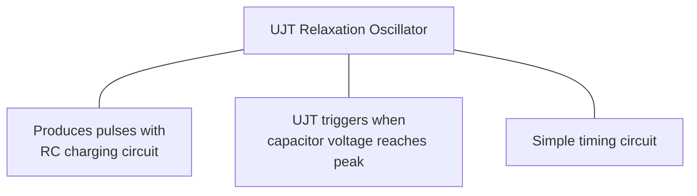

**Circuit Diagram:**

```goat
    +Vcc
     |
     R1
     |
     +------+
     |      |
     |      |
     |     B2
     |      |   UJT
     |      |
  C1 --- E  |
     |      |
     |     B1
     |      |
     |      |
     +------+
     |
    GND
```

In this circuit:

- C1 charges through R1
- When capacitor voltage reaches UJT's peak point, UJT turns on
- Capacitor discharges rapidly through UJT
- Process repeats creating oscillations

**Mnemonic:** "CURD" (Capacitor charges Until Reaching Discharge point)

## Question 2(b) [4 marks]

**Draw circuit diagram of Colpitts oscillator and explain in brief. Give the advantages and disadvantages of it.**

**Answer**:

**Colpitts Oscillator:**

**Circuit Diagram:**

```goat
                  +Vcc
                    |
                    RL
                    |
                    |
    +---------------+---------------+
    |               |               |
    |              C3               |
    |               |               |
    |              C1               |
    |              C2               |
    |               +---+           |
    |               |   |           |
    +---+           +---+           |
    |   |----+      |   |           |
    +---+    |      +---+           |
              |                     |
              +---------------------+
              |
             GND
```

**Working:**

- Uses LC tank circuit with capacitive voltage divider (C1 and C2)
- Transistor amplifies and provides energy to tank circuit
- Oscillation frequency: f = 1/[2π√(L×(C1×C2)/(C1+C2))]

| Advantages | Disadvantages |
|------------|---------------|
| Good frequency stability | Requires two capacitors (C1, C2) |
| Works well at high frequencies | More difficult to tune than some oscillators |
| Lower harmonics | Sensitive to transistor parameters |
| Simple design | Limited frequency range |

**Mnemonic:** "FAST Circuits" (Frequency stable, Appropriate for high frequencies, Simple design, Two capacitors needed)

## Question 2(c) [7 marks]

**Explain the Crystal Oscillator.**

**Answer**:

**Crystal Oscillator:**

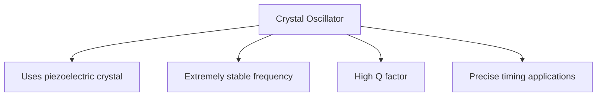

**Circuit Diagram:**

```goat
                +Vcc
                  |
                  RL
                  |
    +-------------+-------------+
    |             |             |
    |            C3             |
    |             |             |
    |      +------+------+      |
    |      |      |      |      |
    |     C1    XTAL     C2     |
    |      |      |      |      |
    |      +------+------+      |
    |                           |
    +---------------------------+
                |
               GND
```

**Working Principle:**

- Based on piezoelectric effect of quartz crystal
- Crystal vibrates at natural resonant frequency when voltage applied
- Acts as very stable resonator with extremely high Q factor
- Provides feedback at precise frequency

**Characteristics:**

- **Resonant frequency**: Determined by crystal cut and dimensions
- **Q factor**: Typically 10,000-100,000 (much higher than LC circuits)
- **Frequency stability**: Typically 0.001% to 0.01%
- **Temperature coefficient**: Usually low, can be specially cut for zero temp coefficient

**Applications:**

- Clock generation in computers
- Frequency standards
- Radio transmitters/receivers
- Digital watches and clocks
- Microcontroller timing

**Mnemonic:** "STOP Precisely" (Stable, Temperature-resistant, Oscillates, Piezoelectric, Precisely)

## Question 2(a) OR [3 marks]

**Draw and explain the Hartley Oscillator.**

**Answer**:

**Hartley Oscillator:**

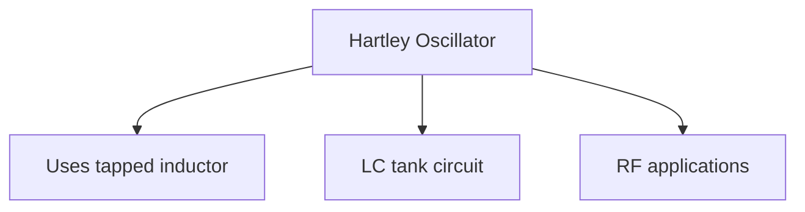

**Circuit Diagram:**

```goat
                +Vcc
                  |
                  R
                  |
    +-------------+-------------+
    |             |             |
    |             C3            |
    |             |             |
    |      +------+------+      |
    |      |      |      |      |
    |     C1      L1     L2     |
    |      |      |      |      |
    |      +------+------+      |
    |                           |
    +---------------------------+
                |
               GND
```

**Working:**

- Uses LC tank circuit with tapped inductor (L1 and L2)
- Transistor amplifies and provides energy to tank circuit
- Oscillation frequency: f = 1/[2π√(L×C)] where L = L1 + L2
- Feedback through inductive coupling

**Mnemonic:** "TIC" (Tapped inductor Circuit)

## Question 2(b) OR [4 marks]

**Draw and explain Wien Bridge oscillator.**

**Answer**:

**Wien Bridge Oscillator:**

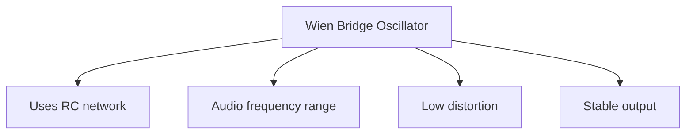

**Circuit Diagram:**

```goat
          +--------+--------+
          |        |        |
          |        R1       |
          |        |        |
     C1   |        |        |    R3
    ||----+        +---/\/\/\----+
    ||    |        |             |
          |        |             |
          |        |             |
     R2   |       Op-Amp         |
    /\/\--+        |             |
          |        |             |
          |        |             |
    +-----+        +-------------+
    |     |        |             |
    C2    |        |             |
    |     |        |       R4    |
    +-----+--------+------/\/\/\-+
          |
         GND
```

**Working:**

- Uses RC Wien bridge network as frequency-selective feedback
- R1=R2 and C1=C2 for simplest design
- Oscillation frequency: f = 1/(2πRC)
- Gain must be ≥ 3 for sustained oscillations
- Used for audio frequency generation with low distortion

**Mnemonic:** "FEAR" (Frequency selective, Equal RC components, Audio range, Reduced distortion)

## Question 2(c) OR [7 marks]

**Draw the Structure, symbol, equivalent circuit of UJT and explain in brief.**

**Answer**:

**Unijunction Transistor (UJT):**

**Structure:**

```goat
              Base 2 (B2)
                  |
                  |
                  v
                +---+
                |   |
                |   |
                |   |
                |   |
                |   |
                |   |
                |   |
                |   |
   Emitter (E) >|   |< Base 1 (B1)
                +---+
```

**Symbol:**

```goat
                  B2
                  |
                  |
                  |
                  o
                 /|
                / |
               /  |
              /   |
     E o----o     |
              \   |
               \  |
                \ |
                 \|
                  o
                  |
                  |
                  |
                  B1
```

**Equivalent Circuit:**

```goat
                B2
                 |
                 |
                 R
                /\/\
                 |
                 |
      E o---+---|<|---+ B1
             |         |
             |         |
             R         |
            /\/\       |
             |         |
             +---------+
```

**Working Principle:**

- UJT is a three-terminal device with one emitter and two bases
- N-type silicon bar with P-type emitter junction
- Forms a voltage divider with internal resistances RB1 and RB2
- Emitter current starts flowing when VE > η×VBB + VD
- Where η is intrinsic standoff ratio = RB1/(RB1+RB2)

**Characteristics:**

- **Intrinsic standoff ratio (η)**: Typically 0.5 to 0.8
- **Negative resistance region**: Current increases as voltage decreases
- **Peak point**: Beginning of negative resistance region
- **Valley point**: End of negative resistance region

**Applications:**

- Relaxation oscillators
- Timing circuits
- Trigger generators
- SCR triggering circuits
- Sawtooth generators

**Mnemonic:** "NEVER" (Negative resistance, Emitter-triggered, Valley and peak points, Easily timed, Relaxation oscillator)

## Question 3(a) [3 marks]

**Differentiate between voltage and power amplifier.**

**Answer**:

| Parameter | Voltage Amplifier | Power Amplifier |
|-----------|-------------------|-----------------|
| Purpose | Amplifies voltage | Delivers power to load |
| Output impedance | High | Low |
| Input impedance | High | Relatively low |
| Efficiency | Not important | Very important |
| Heat dissipation | Low | High (requires heat sink) |
| Position in circuit | Early stages | Final stage |

**Mnemonic:** "PEHIP" (Power for Efficiency and Heat, Impedance matters, Position differs)

## Question 3(b) [4 marks]

**Explain class-B push pull power amplifier in detail.**

**Answer**:

**Class-B Push-Pull Amplifier:**

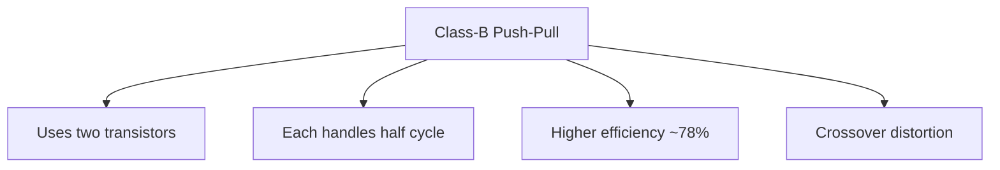

**Circuit Diagram:**

```goat
         +Vcc
           |
           |
        +--+--+
        |     |
        Q1    |
        |     |
Input o-+     +---o Output
        |     |
        Q2    |
        |     |
        +--+--+
           |
           |
          GND
```

**Working:**

- Uses two complementary transistors
- Q1 conducts during positive half-cycle
- Q2 conducts during negative half-cycle
- Each transistor conducts for 180° of input cycle
- Theoretical efficiency: 78.5%

**Mnemonic:** "ECHO" (Efficiency high, Crossover distortion, Half-cycle operation, Output high power)

## Question 3(c) [7 marks]

**Draw and Explain Complementary symmetry push-pull power amplifier in detail also list the disadvantages of it.**

**Answer**:

**Complementary Symmetry Push-Pull Amplifier:**

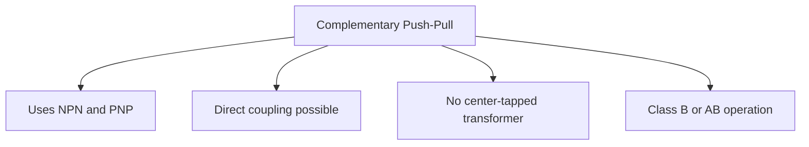

**Circuit Diagram:**

```goat
               +Vcc
                |
                |
                Q1 (NPN)
                |
   +-----+------+-----+
   |     |            |
   |     |            |
   |     |            |
Input   Bias       Output
   |     |            |
   |     |            |
   +-----+------+-----+
                |
                |
                Q2 (PNP)
                |
                |
               GND
```

**Working:**

- Uses complementary pair (NPN and PNP transistors)
- No need for center-tapped transformer
- NPN handles positive half-cycle
- PNP handles negative half-cycle
- Biasing network reduces crossover distortion
- Direct coupling to speaker possible

**Disadvantages:**

- Thermal runaway if not properly biased
- Requires complementary matched transistors
- Crossover distortion in Class-B operation
- Needs both positive and negative power supplies
- Difficulty finding exact complementary pairs

**Mnemonic:** "MATCH Precisely" (Matched transistors, Avoids transformers, Thermal issues, Crossover distortion, Heat dissipation needed)

## Question 3(a) OR [3 marks]

**Define the terms related to power amplifier. i)Efficiency ii)Distortion iii)power dissipation capability**

**Answer**:

| Term | Definition |
|------|------------|
| **Efficiency** | Ratio of AC output power delivered to the load to the DC input power drawn from the supply. Mathematically: η = (Pout/Pin) × 100%. Higher efficiency means less power wasted as heat. |
| **Distortion** | Unwanted alteration of the output waveform compared to input waveform. Measured as Total Harmonic Distortion (THD). Includes harmonic, intermodulation, crossover, and amplitude distortion. |
| **Power Dissipation Capability** | Maximum power that can be dissipated by the amplifier without damage. Depends on heat sink, thermal resistance, and maximum junction temperature of transistors. |

**Mnemonic:** "EDP" (Efficiency converts, Distortion deforms, Power capability protects)

## Question 3(b) OR [4 marks]

**Classify the power amplifier for mode of operation and explain working of different type power amplifier**

**Answer**:

**Classification of Power Amplifiers:**

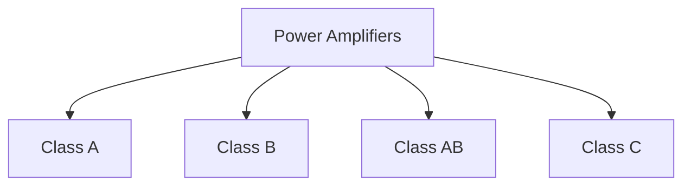

| Class | Conduction Angle | Working |
|-------|------------------|---------|
| **Class A** | 360° | Amplifier conducts for entire input cycle. Output signal is exact replica of input but amplified. Linear but inefficient (25-30%). |
| **Class B** | 180° | Two transistors each conduct for half cycle. One handles positive half, other handles negative half. More efficient (70-80%) but has crossover distortion. |
| **Class AB** | 180°-360° | Compromise between Class A and B. Slight bias to reduce crossover distortion. Good efficiency (50-70%) with acceptable distortion. |
| **Class C** | <180° | Conducts for less than half cycle. Very efficient (>80%) but highly distorted. Used mainly in RF tuned amplifiers. |

**Mnemonic:** "ABCE" (A-all cycle, B-both halves separately, C-compromise solution, E-efficiency with distortion)

## Question 3(c) OR [7 marks]

**Derive efficiency of class-B push pull power amplifier.**

**Answer**:

**Derivation of Class-B Push-Pull Amplifier Efficiency:**

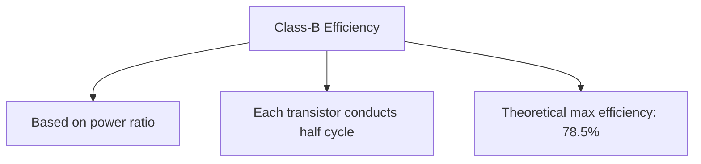

**Circuit Diagram:**

```goat
         +Vcc
           |
           |
        +--+--+
        |     |
        Q1    |
        |     |
Input o-+     +---o Output
        |     |
        Q2    |
        |     |
        +--+--+
           |
           |
          GND
```

**Efficiency Calculation:**

1. **DC power input calculation:**
   - Each transistor conducts for half cycle
   - Average DC current: Idc = Imax/π
   - DC power input: Pdc = Vcc × Idc = Vcc × Imax/π

2. **AC power output calculation:**
   - RMS value of current: Irms = Imax/2
   - AC power output: Pac = (Irms)² × RL = (Imax/2)² × RL
   - For maximum power: Imax × RL = Vcc
   - Therefore: Pac = (Vcc)²/(2π × RL)

3. **Efficiency calculation:**
   - η = (Pac/Pdc) × 100%
   - η = [(Vcc)²/(2π × RL)] ÷ [Vcc × Imax/π] × 100%
   - η = [(Vcc)²/(2π × RL)] ÷ [Vcc × Vcc/(π × RL)] × 100%
   - η = [(Vcc)²/(2π × RL)] × [π × RL/Vcc²] × 100%
   - η = π/4 × 100% ≈ 78.5%

**Maximum theoretical efficiency of Class-B push-pull amplifier is 78.5%**

**Mnemonic:** "PIPE" (Power ratio, Input DC vs output AC, Pi in formula, Efficiency maximum 78.5%)

## Question 4(a) [3 marks]

**Draw pin diagram and Schematic symbol of IC 741 and explain it in detail.**

**Answer**:

**IC 741 Op-Amp Pin Diagram and Symbol:**

**Pin Diagram:**

```goat
        +-------+
  1 o---|       |---o 8
        |       |
  2 o---|  741  |---o 7
        |       |
  3 o---|       |---o 6
        |       |
  4 o---|       |---o 5
        +-------+
```

**Schematic Symbol:**

```goat
            
        |\ 
        | \
   +---o|  \
        |   >---o Output
   -o---| /
        |/
            
```

**Pin Description:**

1. Offset Null (NC1)
2. Inverting Input (-)
3. Non-inverting Input (+)
4. Negative Supply (-Vcc)
5. Offset Null (NC2)  
6. Output
7. Positive Supply (+Vcc)
8. NC (No Connection)

**Mnemonic:** "ON-INO" (Offset Null, Inverting input, Negative supply, Input non-inverting, Output, No connection)

## Question 4(b) [4 marks]

**Explain differential Amplifier using OPAMP.**

**Answer**:

**Differential Amplifier Using Op-Amp:**

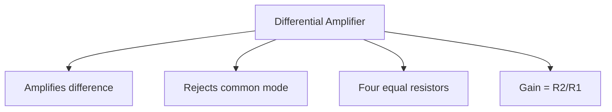

**Circuit Diagram:**

```goat
             R2
   v1 o---/\/\/\---+
                   |
                   |
      R1           |      R2
   +--/\/\/\--+---o|+     /\/\/\--o Vout
   |           |    |-
   |           |    |
   |           |    |
   +--/\/\/\--+----+
      R1           |
                   |
   v2 o---/\/\/\---+
             R2
```

**Working:**

- Output is proportional to difference between inputs
- If R1 = R3 and R2 = R4, then: Vout = (R2/R1)(V2-V1)
- Rejects signals common to both inputs (common-mode rejection)
- Used in instrumentation applications

**Mnemonic:** "CARE" (Common-mode rejection, Amplifies difference, Resistor matching important, Equal resistors for balance)

## Question 4(c) [7 marks]

**Explain the following parameters of an OP-Amp: 1)Input offset voltage 2) Output Offset Voltage 3) Input Offset Current 4)Input Bias Current 5) CMRR 6) Slew rate 7) Gain.**

**Answer**:

**Parameters of an Op-Amp:**

| Parameter | Description | Typical Value for 741 |
|-----------|-------------|------------------------|
| **Input Offset Voltage** | Voltage needed at input to zero the output | 1-5 mV |
| **Output Offset Voltage** | Output voltage when inputs are grounded | Depends on input offset and gain |
| **Input Offset Current** | Difference between input bias currents | 3-30 nA |
| **Input Bias Current** | Average of the two input currents | 30-500 nA |
| **CMRR** | Ability to reject common-mode signals | 70-100 dB |
| **Slew Rate** | Maximum rate of output voltage change | 0.5 V/μs |
| **Gain (Aol)** | Open-loop voltage gain | 104-106 (80-120 dB) |

**Diagram for Input Offset Voltage:**

```goat
                 Vos
                  |
                  v
      +-----+     |     +-----+
      |     |     |     |     |
   ---+  +  +-----+-----+     +---
      |     |           |     |
      +-----+           +-----+
```

**Mnemonic:** "VICS BGR" (Voltage offset at Input, Current offset, Slew rate, Bias current, Gain, Rejection ratio)

## Question 4(a) OR [3 marks]

**List characteristics of ideal op-amp.**

**Answer**:

| Characteristic | Ideal Value |
|----------------|-------------|
| **Open-loop gain** | Infinite |
| **Input impedance** | Infinite |
| **Output impedance** | Zero |
| **Bandwidth** | Infinite |
| **CMRR** | Infinite |
| **Slew rate** | Infinite |
| **Offset voltage** | Zero |
| **Noise** | Zero |

**Mnemonic:** "ZINC BOSS" (Zero offset, Infinite bandwidth, No noise, CMRR infinite, Bandwidth unlimited, Output impedance zero, Slew rate unlimited, Speed unlimited)

## Question 4(b) OR [4 marks]

**Draw and explain the block diagram of the Operational Amplifier (OPAMP) in detail.**

**Answer**:

**Op-Amp Block Diagram:**

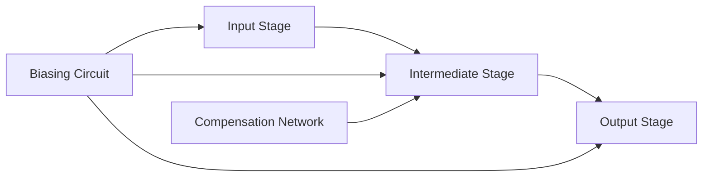

**Detailed Block Diagram:**

```goat
                                Power Supply
                                    |
                                    v
 +------+     +------------+     +----------+     +------+
 |      |     |            |     |          |     |      |
 | Input|---->|Differential|---->|  Voltage |---->|Output|---> Output
 | Pins |     |   Stage    |     |   Gain   |     | Stage|
 |      |     |            |     |   Stage  |     |      |
 +------+     +------------+     +----------+     +------+
                  ^                 ^               ^
                  |                 |               |
              +---+----+            |               |
              |        |            |               |
              | Biasing|------------+---------------+
              | Circuit|
              |        |
              +--------+
                  ^
                  |
            Power Supply
```

**Working of Blocks:**

1. **Input Stage**: Differential amplifier with high input impedance
2. **Intermediate Stage**: High-gain voltage amplifier with frequency compensation
3. **Output Stage**: Low output impedance buffer, provides current gain
4. **Biasing Circuit**: Provides proper DC levels to all stages
5. **Compensation Network**: Prevents oscillation, ensures stability

**Mnemonic:** "DISCO" (Differential stage Input, Second stage amplifies, Compensation network, Output buffer)

## Question 4(c) OR [7 marks]

**Draw & explain Inverting and Non-inverting Op-amp amplifier with the derivation of voltage gain.**

**Answer**:

**Inverting Amplifier:**

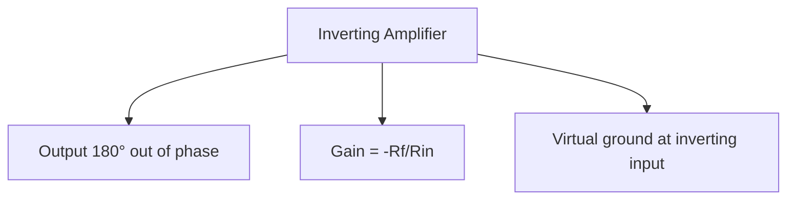

**Circuit Diagram:**

```goat
                 Rf
           +----/\/\/\----+
           |              |
           |              |
     Rin   |    +\        |
Vin o--/\/\/\---|-\       |
           |    |  \      |
           |    |   \-----o Vout
           |    |  /
           |    |-/
           |    +/
           |    |
           |    |
           +----+
                |
               GND
```

**Gain Derivation:**

- Using virtual ground concept (V- ≈ 0)
- Current through Rin: Iin = Vin/Rin
- Current through Rf: If = Iin (no current into op-amp input)
- Voltage across Rf: Vout = -If × Rf = -Iin × Rf = -Vin × Rf/Rin
- Therefore, Gain = Vout/Vin = -Rf/Rin

**Non-Inverting Amplifier:**

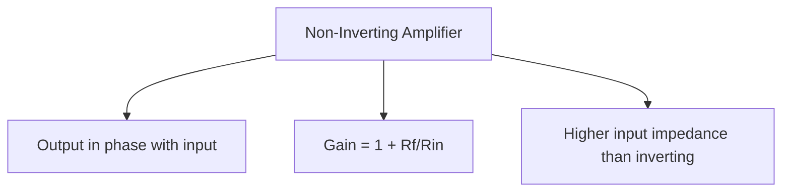

**Circuit Diagram:**

```goat
                 Rf
           +----/\/\/\----+
           |              |
           |              |
           |    +\        |
Vin o------+----|-\       |
           |    |  \      |
           |    |   \-----o Vout
           |    |  /
           |    |-/
           |    +/
           |    |
           |    |
           +--/\/\/\--+
              Rin     |
                      |
                     GND
```

**Gain Derivation:**

- Due to negative feedback, V- ≈ V+ = Vin
- Voltage across Rin: V- = Vin
- Current through Rin: IRin = V-/Rin = Vin/Rin
- Same current flows through Rf: IRf = IRin
- Voltage across Rf: VRf = IRf × Rf = Vin × Rf/Rin
- Output voltage: Vout = V- + VRf = Vin + Vin × Rf/Rin = Vin(1 + Rf/Rin)
- Therefore, Gain = Vout/Vin = 1 + Rf/Rin

**Comparison:**

| Parameter | Inverting Amplifier | Non-Inverting Amplifier |
|-----------|---------------------|-------------------------|
| **Gain formula** | -Rf/Rin | 1 + Rf/Rin |
| **Phase shift** | 180° | 0° |
| **Input impedance** | Equal to Rin | Very high (≈ infinite) |
| **Min. possible gain** | Can be <1 | Always ≥1 |

**Mnemonic:** "PING-PONG" (Phase Inverted Negative Gain vs Positive Output Non-inverted Gain)

## Question 5(a) [3 marks]

**Draw and explain integrator using Op-Amp.**

**Answer**:

**Op-Amp Integrator:**

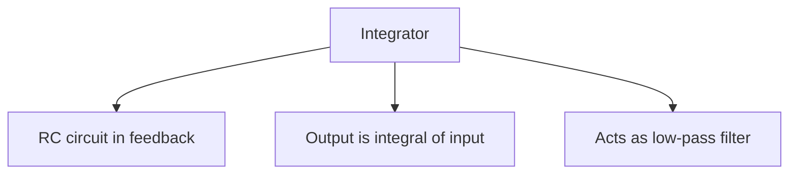

**Circuit Diagram:**

```goat
                  C
              +---||---+
              |        |
              |        |
   Vin o--/\/\/\--+---o|+      |
            R     |    |-      +---o Vout
                  |    |       |
                  |    |
                  +----+
                  |
                 GND
```

**Working:**

- Output voltage is proportional to integral of input
- Vout = -1/RC ∫Vin dt
- Used in waveform generators, analog computers
- Acts as low-pass filter with -20dB/decade slope

**Mnemonic:** "TIME" (Takes Input and Makes integral over time Exactly)

## Question 5(b) [4 marks]

**Compare different types of power amplifier.**

**Answer**:

| Parameter | Class A | Class B | Class AB | Class C |
|-----------|---------|---------|----------|---------|
| **Conduction angle** | 360° | 180° | 180°-360° | <180° |
| **Efficiency** | 25-30% | 70-80% | 50-70% | >80% |
| **Distortion** | Very low | High (crossover) | Low | Very high |
| **Biasing** | Above cutoff | At cutoff | Slightly above cutoff | Below cutoff |
| **Applications** | High fidelity audio | General purpose | Audio amplifiers | RF amplifiers |

**Mnemonic:** "CABINET" (Conduction angle, Amplification quality, Biasing, Ideal applications, Noise/distortion, Efficiency, Temperature concerns)

## Question 5(c) [7 marks]

**List applications of IC555 and explain any one in detail.**

**Answer**:

**Applications of IC 555:**

1. Astable multivibrator
2. Monostable multivibrator
3. Bistable multivibrator
4. Pulse width modulator
5. Sequential timer
6. Frequency divider
7. Tone generator

**Astable Multivibrator Using IC 555:**

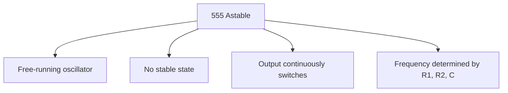

**Circuit Diagram:**

```goat
                  +Vcc
                    |
                    |
             +------+------+
             |      |      |
             |     R1      |
             |      |      |
             +------+------+
             |      |      |
             |     R2      |
             |      |      |
    +--------+------+------+--------+
    |        |      |      |        |
    |   +----+    8 |      |        |
    |   |    |      |      |        |
    |   |    |    7 |      |        |
    |   |    |      |      |        |
    |   |    |    6 |      |        |
    |  C1    |      | 555  |        |
    |   |    |    5 +------+        |
    |   |    |      |      |        |
    |   |    |    4 |      |        |
    |   |    |      |      |        |
    |   |    |    3 |      +---o Output
    |   |    |      |      |        |
    |   |    |    2 |      |        |
    |   |    |      |      |        |
    |   |    |    1 |      |        |
    |   |    +------+------+        |
    |   |           |               |
    +---+-----------+---------------+
        |           |
       GND         GND
```

**Working:**

- R1, R2, and C determine frequency
- Output oscillates between HIGH and LOW
- Charging time: t1 = 0.693(R1+R2)C
- Discharging time: t2 = 0.693(R2)C
- Total period: T = t1 + t2 = 0.693(R1+2R2)C
- Frequency: f = 1.44/[(R1+2R2)C]
- Duty cycle: D = (R1+R2)/(R1+2R2)

**Applications:**

- LED flashers
- Clock generators
- Tone generators
- Pulse generation

**Mnemonic:** "FREE" (Frequency determined by Resistors and capacitor, Endless oscillation, Easy to configure)

## Question 5(a) OR [3 marks]

**Draw and explain summing amplifier using Op-Amp.**

**Answer**:

**Summing Amplifier Using Op-Amp:**

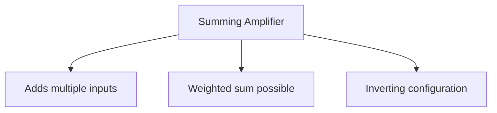

**Circuit Diagram:**

```goat
              Rf
        +---/\/\/\---+
        |            |
        |            |
  R1    |    +\      |
V1 o--/\/\/\--|-\     |
        |    |  \    |
  R2    |    |   \---o Vout
V2 o--/\/\/\--+   /
        |    |  /
  R3    |    |-/
V3 o--/\/\/\--+/
        |     |
        |     |
        +-----+
              |
             GND
```

**Working:**

- Uses inverting configuration with multiple inputs
- Each input contributes to output based on its resistance
- If R1 = R2 = R3 = R, and Rf = R, then Vout = -(V1 + V2 + V3)
- If resistors differ, weighted sum is produced: Vout = -Rf(V1/R1 + V2/R2 + V3/R3)
- Virtual ground at inverting input simplifies analysis

**Mnemonic:** "SWIM" (Summing Weighted Inputs with Mixing)

## Question 5(b) OR [4 marks]

**Compare between push-pull amplifier and Complementary push-pull power amplifier.**

**Answer**:

| Parameter | Push-Pull Amplifier | Complementary Push-Pull Amplifier |
|-----------|---------------------|-----------------------------------|
| **Transistors used** | Same type (NPN or PNP) | Complementary pair (NPN and PNP) |
| **Input transformer** | Required (center-tapped) | Not required |
| **Output transformer** | Required | Not required |
| **Circuit complexity** | More complex | Simpler |
| **Cost** | Higher due to transformers | Lower |
| **Frequency response** | Limited by transformers | Better (wider range) |
| **Phase distortion** | Higher | Lower |
| **Power supply** | Single polarity | Dual polarity usually required |

**Mnemonic:** "TONIC" (Transformers vs None, One type vs complementary, Nice frequency response, Improved distortion, Cost effectiveness)

## Question 5(c) OR [7 marks]

**Draw pin diagram and block diagram of IC555 and explain in detail.**

**Answer**:

**IC 555 Timer:**

**Pin Diagram:**

```goat
        +-------+
  1 o---|       |---o 8
        |       |
  2 o---|  555  |---o 7
        |       |
  3 o---|       |---o 6
        |       |
  4 o---|       |---o 5
        +-------+
```

**Pin Description:**

1. Ground - Connected to circuit ground
2. Trigger - Starts the timing cycle when voltage falls below 1/3 Vcc
3. Output - Provides the output signal, can source or sink up to 200mA
4. Reset - Terminates timing cycle when pulled low
5. Control Voltage - Allows access to internal voltage divider (2/3 Vcc)
6. Threshold - Ends timing cycle when voltage exceeds 2/3 Vcc
7. Discharge - Connected to open collector of internal transistor
8. Vcc - Positive supply voltage (4.5V to 16V)

**Block Diagram:**

```goat
    8                               
    o------+---------------------+  
    Vcc    |                     |  
           |    +-----------+    |  
    5      |    |           |    |  
    o------+----| Voltage   |    |  
    Control|    | Divider   |    |  
           |    |           |    |  
           |    +-----------+    |  
           |      |     |        |  
           |      |     |        |  
    2      |    +-v-+ +-v-+      |  
    o------+--->|   | |   |      |  
    Trigger     |Comp| |Comp|    |  
                |   | |   |      |  
    6           +-+-+ +-+-+      |  
    o------------+|     |+-------+  
    Threshold     |     |           
                +-v-----v-+         
                |         |         
                | Flip    |         
    4           | Flop    |         
    o---------->|         |         
    Reset       +-+-----+-+         
                  |     |           
                  |     |           
                +-v-+ +-v-+         
                |   | |   |         
                |Buf| |Out|         
                |   | |   |         
                +-+-+ +-+-+         
                  |     |           
    7             |     |  3        
    o-------------+     +--o        
    Discharge               Output  
                                    
    1                               
    o----------------------------+  
    GND                          |  
                                 |  
    +----------------------------+  
```

**Working:**

1. **Voltage Divider**: Creates reference voltages at 1/3 and 2/3 of Vcc
2. **Comparators**: Compare input voltages with reference voltages
3. **Flip-Flop**: Stores timing state based on comparator outputs
4. **Output Stage**: Buffers and amplifies flip-flop output
5. **Discharge Transistor**: Controlled by flip-flop to discharge timing capacitor

**Operating Modes:**

1. **Monostable**: One-shot timer triggered by input pulse
2. **Astable**: Free-running oscillator for pulse generation
3. **Bistable**: Flip-flop with set and reset functionality

**Applications:**

- Pulse generation
- Time delays
- Oscillators
- PWM controllers
- Sequential timers

**Mnemonic:** "VICTOR" (Voltage divider, Internal comparators, Control flip-flop, Timing capabilities, Output buffer, Reset function)
