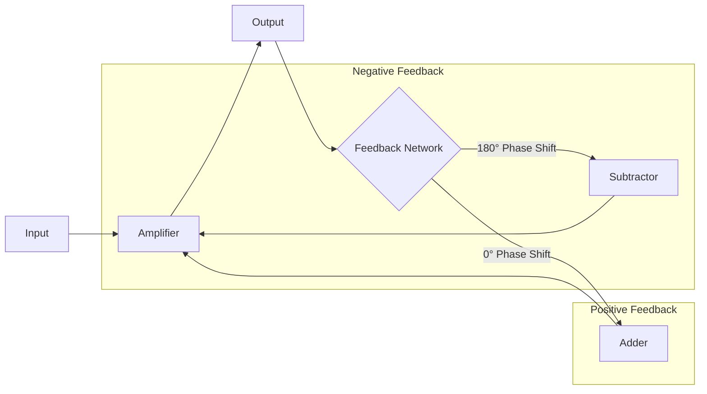
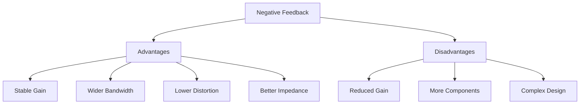
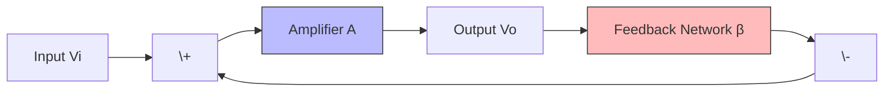
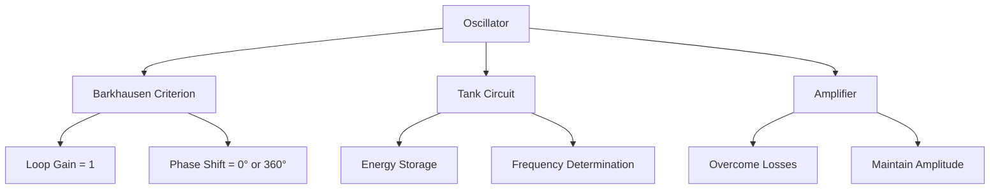
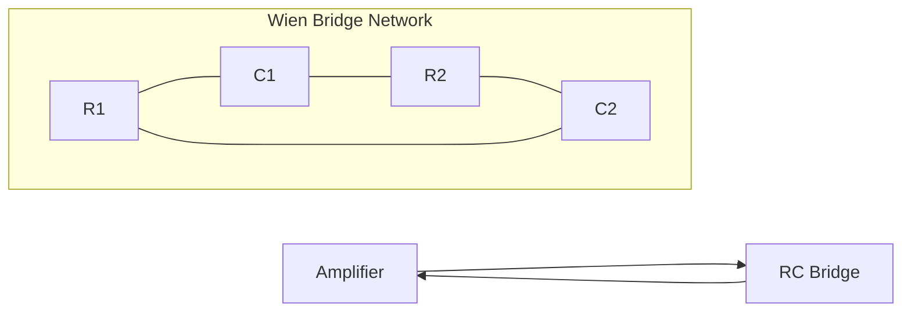
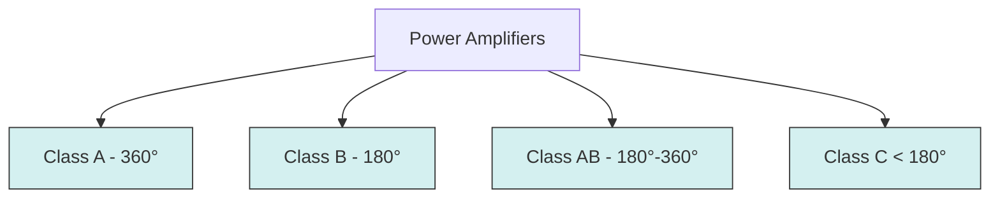
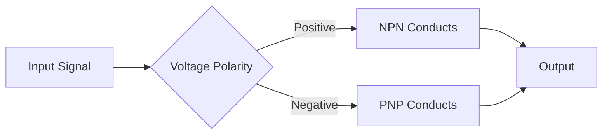
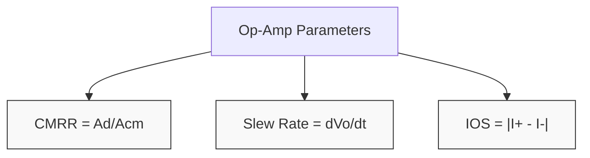
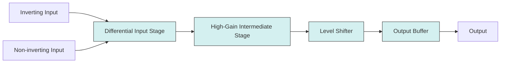
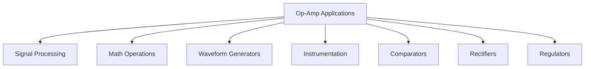

## પ્રશ્ન 1(અ) [3 ગુણ]

**આકૃતિ સાથે પોઝિટિવ અને નેગેટિવ ફીડબેક વચ્ચેનો તફાવત જણાવો અને સમજાવો.**

**જવાબ**:

| પરિમાણ | નેગેટિવ ફીડબેક | પોઝિટિવ ફીડબેક |
|-----------|-------------------|-------------------|
| સિગ્નલ | આઉટપુટ સિગ્નલ વિરુદ્ધ તબક્કા સાથે ઇનપુટ પર પાછો ફીડ કરવામાં આવે છે | આઉટપુટ સિગ્નલ સમાન તબક્કા સાથે ઇનપુટ પર પાછો ફીડ કરવામાં આવે છે |
| ગેઇન | ઘટાડે છે | વધારે છે |
| સ્થિરતા | સુધારે છે | ઘટાડે છે |
| ઉપયોગો | એમ્પલિફાયર્સ | ઓસિલેટર્સ |

**આકૃતિ:**



- **ફેઝ સંબંધ**: નેગેટિવ ફીડબેકમાં, સિગ્નલ 180° આઉટ ઓફ ફેઝ હોય છે જ્યારે પોઝિટિવ ફીડબેકમાં, સિગ્નલ ઇન ફેઝ હોય છે
- **હેતુ**: નેગેટિવ ફીડબેક સિસ્ટમને સ્થિર કરે છે જ્યારે પોઝિટિવ ફીડબેક ઓસિલેશન ઉત્પન્ન કરે છે

**મેમરી ટ્રીક:** "નેગેટિવ નિયમિતતા માંગે, પોઝિટિવ પરિવર્તન આપે"

## પ્રશ્ન 1(બ) [4 ગુણ]

**એમ્પલીફાયરના ઇનપુટ ઇમ્પીડન્સ પર નેગેટિવ ફીડબેક ની અસર સમજાવો.**

**જવાબ**:

| ફીડબેકનો પ્રકાર | ઇનપુટ ઇમ્પિડન્સ પર અસર | સૂત્ર |
|------------------|---------------------------|---------|
| વોલ્ટેજ સિરીઝ | વધારે છે | Z(in-f) = Z(in)(1+Aβ) |
| કરંટ સિરીઝ | વધારે છે | Z(in-f) = Z(in)(1+Aβ) |
| વોલ્ટેજ શંટ | ઘટાડે છે | Z(in-f) = Z(in)/(1+Aβ) |
| કરંટ શંટ | ઘટાડે છે | Z(in-f) = Z(in)/(1+Aβ) |

**આકૃતિ:**


- **સિરીઝ ફીડબેક**: જ્યારે ફીડબેક સિગ્નલ ઇનપુટની સાથે સિરીઝમાં હોય, ઇનપુટ ઇમ્પિડન્સ વધે છે
- **શંટ ફીડબેક**: જ્યારે ફીડબેક સિગ્નલ ઇનપુટની સમાંતર હોય, ઇનપુટ ઇમ્પિડન્સ ઘટે છે
- **મેગ્નિટ્યુડ**: ફેરફાર (1+Aβ)ના પ્રમાણમાં હોય છે જ્યાં A એ ગેઇન અને β એ ફીડબેક ફેક્ટર છે

**મેમરી ટ્રીક:** "સિરીઝ સંવર્ધન કરે, શંટ સંકોચન કરે"

## પ્રશ્ન 1(ક) [7 ગુણ]

**નેગેટિવ ફીડબેકના ફાયદા અને ગેરફાયદાની યાદી બનાવો.**

**જવાબ**:

| ફાયદા | ગેરફાયદા |
|------------|---------------|
| ગેઇન સ્થિર કરે છે | સમગ્ર ગેઇન ઘટાડે છે |
| બેન્ડવિડ્થ વધારે છે | વધારાના ઘટકોની જરૂર પડે છે |
| ડિસ્ટોર્શન ઘટાડે છે | યોગ્ય રીતે ડિઝાઇન ન કરવામાં આવે તો ઓસિલેશન થઈ શકે છે |
| નોઇઝ ઘટાડે છે | કાળજીપૂર્વક ફેઝ કોમ્પેન્સેશનની જરૂર પડે છે |
| ઇનપુટ/આઉટપુટ ઇમ્પિડન્સ સુધારે છે | પાવર કન્ઝમ્પશન વધારે છે |
| તાપમાન સંવેદનશીલતા ઘટાડે છે | સર્કિટ વધુ જટિલ બનાવે છે |
| ફ્રિક્વન્સી રિસ્પોન્સ નિયંત્રિત કરે છે | કેટલાક કિસ્સાઓમાં સિગ્નલ-ટુ-નોઇઝ રેશિયો ઘટાડી શકે છે |

**આકૃતિ:**



- **પર્ફોર્મન્સ ટ્રેડઓફ**: બેહતર સ્થિરતા અને લિનિયરિટી મેળવવા માટે ગેઇનનો ત્યાગ કરે છે
- **ફ્રિક્વન્સી વિચારણા**: ઉચ્ચ ફ્રિક્વન્સી પર ઓસિલેશન રોકવા માટે કોમ્પેન્સેશનની જરૂર પડી શકે છે
- **ડિઝાઇન જટિલતા**: યોગ્ય રીતે ડિઝાઇન કરવું વધુ જટિલ છે પરંતુ લાંબા ગાળે બેહતર કામગીરી આપે છે

**મેમરી ટ્રીક:** "ગેઇન ગુમાવી, સ્થિરતા મેળવી"

## પ્રશ્ન 1(ક) અથવા [7 ગુણ]

**વોલ્ટેજ શ્રેણી ફીડબેક એમ્પ્લીફાયરને બ્લોક ડાયગ્રામ દોરી વિગતવાર સમજાવો અને પ્રાયોગિક વોલ્ટેજ શ્રેણી ફિડબક સર્કિટ દોરો.**

**જવાબ**:

| પરિમાણ | વોલ્ટેજ સિરીઝ ફીડબેકમાં અસર |
|-----------|----------------------------------|
| ઇનપુટ સિગ્નલ | વોલ્ટેજ |
| ફીડબેક સિગ્નલ | વોલ્ટેજ |
| ઇનપુટ ઇમ્પિડન્સ | વધે છે |
| આઉટપુટ ઇમ્પિડન્સ | ઘટે છે |
| ગેઇન સ્થિરતા | સુધરે છે |
| બેન્ડવિડ્થ | વધે છે |

**આકૃતિ:**



**પ્રાયોગિક સર્કિટ:**

```goat
          +Vcc
            |
            R2
            |
            +-----+
            |     |
Vin o---R1--+--+  |
            |  |  |
            C1 | C2
            |  |  |
            |  +--+----o Vout
            |     |
            RE   RC
            |     |
            +-----+
            |
           GND
```

- **સેમ્પલિંગ પદ્ધતિ**: આઉટપુટ વોલ્ટેજ સેમ્પલ કરવામાં આવે છે અને ઇનપુટ પર પાછો ફીડ કરવામાં આવે છે
- **મિક્સિંગ પદ્ધતિ**: ફીડબેક સિગ્નલ ઇનપુટ સિગ્નલ સાથે શ્રેણીમાં મિક્સ કરવામાં આવે છે
- **કાર્ય સિદ્ધાંત**: સુધારેલી સ્થિરતા અને લિનિયરિટી માટે ગેઇન ઘટાડે છે
- **અનુપ્રયોગો**: ઓડિયો એમ્પલિફાયર્સ, ઇન્સ્ટ્રુમેન્ટેશન એમ્પલિફાયર્સ

**મેમરી ટ્રીક:** "વોલ્ટેજ સિરીઝ - ઇમ્પિડન્સ ઇન ઉપર, આઉટ નીચે"

## પ્રશ્ન 2(અ) [3 ગુણ]

**કોલપીટ્સ ઓસીલેટર સર્કિટ પર ટૂંકી નોંધ લખો.**

**જવાબ**:

| ઘટક | કાર્ય |
|-----------|----------|
| LC ટેંક | ઓસિલેશન ફ્રિક્વન્સી નક્કી કરે છે |
| કેપેસિટીવ વોલ્ટેજ ડિવાઇડર | ફીડબેક પ્રદાન કરે છે |
| સક્રિય ઉપકરણ | ઓસિલેશન જાળવી રાખવા માટે ગેઇન પ્રદાન કરે છે |

**આકૃતિ:**

```goat
     +Vcc
       |
       R1
       |
       +-----+
       |     |
       |     C3
       |     |
       +--+--+---o Output
       |  |  |
       L1 |  |
       |  |  |
       +--+  |
       |     |
       C1    |
       |     |
       +-----+
       |     |
       C2    |
       |     |
      GND   GND
```

- **ફ્રિક્વન્સી સૂત્ર**: f = 1/(2π√(L×(C1×C2)/(C1+C2)))
- **ફીડબેક**: કેપેસિટીવ વોલ્ટેજ ડિવાઇડર (C1 અને C2) દ્વારા પ્રદાન કરવામાં આવે છે
- **અનુપ્રયોગો**: RF ઓસિલેટર્સ, કમ્યુનિકેશન સર્કિટ્સ

**મેમરી ટ્રીક:** "કોલપીટ્સમાં કેપેસિટિવ ડિવાઇડર છે"

## પ્રશ્ન 2(બ) [4 ગુણ]

**ઓસીલેટરની જરૂરિયાત સમજાવો. i) બાર્કસન માપદંડ. ii) ટેન્ક સર્કિટ. iii) એમ્પ્લીફાયર.**

**જવાબ**:

| જરૂરિયાત | કાર્ય | સમજૂતી |
|-------------|----------|-------------|
| બાર્કસન માપદંડ | સતત ઓસિલેશન સુનિશ્ચિત કરે છે | લૂપ ગેઇન = 1, ફેઝ શિફ્ટ = 0° અથવા 360° |
| ટેંક સર્કિટ | ફ્રિક્વન્સી નક્કી કરે છે | ઊર્જા સંગ્રહ કરતી રેઝોનન્ટ LC સર્કિટ |
| એમ્પલિફાયર | ગેઇન પ્રદાન કરે છે | સર્કિટ ખોટને ભરપાઈ કરે છે |

**આકૃતિ:**



- **બાર્કસન માપદંડ**: ડેમ્પિંગ વિના સતત ઓસિલેશન માટેની ગાણિતિક શરત
- **ટેંક સર્કિટ**: ઓસિલેશનની ફ્રિક્વન્સી નક્કી કરતી LC સર્કિટ
- **એમ્પલિફાયર**: ઓસિલેશન જાળવવા માટે ઊર્જા પ્રદાન કરતું સક્રિય ઉપકરણ

**મેમરી ટ્રીક:** "BAT - બાર્કસન એમ્પલિફાયર ટેંક"

## પ્રશ્ન 2(ક) [7 ગુણ]

**UJT ના બાંધકામ, કાર્ય અને V-I લાક્ષણિકતાઓ સમજાવો.**

**જવાબ**:

| પરિમાણ | વર્ણન |
|-----------|-------------|
| બાંધકામ | બે બેઝ કનેક્શન અને એક એમિટર સાથેનો સિલિકોન બાર |
| સિમ્બોલ | એક બાજુએ એમિટર સાથેનો ત્રિકોણ અને બે બેઝ |
| સમકક્ષ સર્કિટ | ડાયોડ સાથેનો વોલ્ટેજ ડિવાઇડર |
| મુખ્ય પરિમાણ | ઇન્ટ્રિન્સિક સ્ટેંડઓફ રેશિયો (η) |

**આકૃતિ:**

```goat
         E
         |
         v
    +----+----+
    |    |    |
    |    D    |
    |    |    |
B1 o+---www---+o B2
         R1    R2
     
UJT Symbol & Equivalent Circuit
```

**V-I લાક્ષણિક કર્વ:**

```goat
  I
  ^
  |
  |       Peak point
  |         o
  |        /|
  |       / |
  |      /  |
  |     /   |
  |    /    |
  |   /     |
  |  /      |
  | /       |
  |/        |
  +---------> V
  |
  | Valley point
```

- **બાંધકામ**: P-ટાઇપ એમિટર જંક્શન સાથેનો N-ટાઇપ સિલિકોન બાર
- **કાર્ય સિદ્ધાંત**: જ્યારે એમિટર વોલ્ટેજ > (η×VBB), ડિવાઇસ કન્ડક્ટ કરે છે
- **ઓપરેશનના વિસ્તારો**: કટ-ઓફ, નેગેટિવ રેસિસ્ટન્સ, અને સેચુરેશન
- **અનુપ્રયોગો**: રિલેક્સેશન ઓસિલેટર્સ, ટાઇમિંગ સર્કિટ્સ, ટ્રિગરિંગ ડિવાઇસીસ

**મેમરી ટ્રીક:** "UJT પહેલા ઉંચું પછી નીચું - નકારાત્મક પ્રતિરોધ રાજ કરે"

## પ્રશ્ન 2(અ) અથવા [3 ગુણ]

**હાર્ટલી ઓસીલેટરના ફાયદા, ગેરફાયદા અને એપ્લીકેશન જણાવો.**

**જવાબ**:

| ફાયદા | ગેરફાયદા | અનુપ્રયોગો |
|------------|---------------|--------------|
| સરળ ટ્યુનિંગ | ભારે ઇન્ડક્ટર્સ | RF જનરેટર્સ |
| વિશાળ ફ્રિક્વન્સી રેન્જ | મ્યુચ્યુઅલ ઇન્ડક્ટન્સ સમસ્યાઓ | રેડિયો રિસીવર્સ |
| સરળ ડિઝાઇન | ઉચ્ચ ફ્રિક્વન્સી પર મુશ્કેલ | એમેચ્યોર રેડિયો |
| સારી ફ્રિક્વન્સી સ્થિરતા | સેન્ટર-ટેપ્ડ કોઇલની જરૂર પડે છે | કમ્યુનિકેશન ઇક્વિપમેન્ટ |

**આકૃતિ:**

```goat
            +Vcc
              |
              R1
              |
              +-----+
              |     |
              |     C2
              |     |
              +--+--+----o Output
              |  |  |
              L1 |  |
              |  |  |
              L2 |  |
              |  |  |
              +--+  |
              |     |
              C1    |
              |     |
             GND   GND
```

- **મુખ્ય લક્ષણ**: ફીડબેક માટે ટેપ્ડ ઇન્ડક્ટર વાપરે છે
- **ફ્રિક્વન્સી સૂત્ર**: f = 1/(2π√(C×(L1+L2)))
- **ખાસ લક્ષણ**: ફીડબેક માટે ઇન્ડક્ટિવ વોલ્ટેજ ડિવાઇડર

**મેમરી ટ્રીક:** "હાર્ટલીમાં હંમેશા ટેપ્ડ ઇન્ડક્ટર"

## પ્રશ્ન 2(બ) અથવા [4 ગુણ]

**UJT ને રિલેક્સેસન ઓસીલેટર તરીકે સમજાવો.**

**જવાબ**:

| ઘટક | કાર્ય |
|-----------|----------|
| UJT | સ્વીચિંગ ક્રિયા પ્રદાન કરે છે |
| કેપેસિટર | ટાઇમિંગ ઘટક |
| રેસિસ્ટર | ચાર્જિંગ રેટ નિયંત્રિત કરે છે |
| આઉટપુટ | સોટૂથ વેવફોર્મ |

**આકૃતિ:**

```goat
      +Vcc
        |
        R
        |
        +-------+
        |       |
        |       |
        +--| |--+----o Output
        |   C   |
        |       |
        E       |
       UJT      |
       B1  B2   |
        |   |   |
        +---+---+
            |
           GND
```

**વેવફોર્મ્સ:**

```goat
  Vc
  ^
  |  /|  /|  /|
  | / | / | / |
  |/  |/  |/  |
  +------------> t

  Vo
  ^
  |
  |  _   _   _
  | | | | | | |
  |_| |_| |_| |_
  +------------> t
```

- **ઓપરેટિંગ પ્રિન્સિપલ**: કેપેસિટર UJT ફાયરિંગ વોલ્ટેજ સુધી ચાર્જ થાય ત્યાં સુધી, પછી ઝડપથી ડિસ્ચાર્જ થાય છે
- **ફ્રિક્વન્સી સૂત્ર**: f ≈ 1/(RC×ln(1/(1-η)))
- **અનુપ્રયોગો**: ટાઇમિંગ સર્કિટ્સ, પલ્સ જનરેટર્સ, કંટ્રોલ સિસ્ટમ્સ

**મેમરી ટ્રીક:** "ચાર્જ-ફાયર-રિપીટ - સોટૂથની ધબક"

## પ્રશ્ન 2(ક) અથવા [7 ગુણ]

**વેઇનબ્રિજ ઓસિલેટરનું કાર્ય સુઘડ રેખાકૃતિ સાથે સમજાવો, તેના માટે ફાયદા, ગેરફાયદા અને એપ્લિકેશન પણ જણાવો.**

**જવાબ**:

| પરિમાણ | વર્ણન |
|-----------|-------------|
| રચના | બ્રિજ ફોર્મેશનમાં RC ફીડબેક નેટવર્ક |
| ફ્રિક્વન્સી સૂત્ર | f = 1/(2πRC) જ્યારે R1=R3 અને C2=C4 |
| ફીડબેક | RC નેટવર્ક મારફતે પોઝિટિવ ફીડબેક |
| ફેઝ શિફ્ટ | રેઝોનન્ટ ફ્રિક્વન્સી પર 0° |

**આકૃતિ:**



**સર્કિટ:**

```goat
                +Vcc
                  |
                  |
                  v
    +---R2---+----+----+
    |        |         |
    C2       |        R4
    |        |         |
    +---+    +    +----+
    |   |    |    |    |
    |   +----+----+    |
    |        |         |
    R1       +        R3
    |        |         |
    C1       v        R5
    |       Op-Amp     |
    +--------+         |
             |         |
             +---------+
                  |
                 GND
```

**ફાયદા:**

- ઉચ્ચ ફ્રિક્વન્સી સ્થિરતા
- ઓછા ડિસ્ટોર્શન આઉટપુટ
- સરળ RC ઘટકો
- સરળતાથી ટ્યુન કરી શકાય

**ગેરફાયદા:**

- મર્યાદિત ફ્રિક્વન્સી રેન્જ
- એમ્પલિટ્યુડ સ્ટેબિલાઇઝેશનની જરૂર
- ઘટક વેરિએશન પ્રત્યે સંવેદનશીલ
- ઓસિલેશન શરૂ કરવા મુશ્કેલ

**અનુપ્રયોગો:**

- ઓડિયો ટેસ્ટ ઇક્વિપમેન્ટ
- ફંક્શન જનરેટર્સ
- સંગીત વાદ્યો
- લેબોરેટરી સિગ્નલ સોર્સીસ

**મેમરી ટ્રીક:** "વાઇન વર્ક્સ એટ R1C1=R2C2 ફ્રિક્વન્સી"

## પ્રશ્ન 3(અ) [3 ગુણ]

**પાવર એમ્પલીફાયરનું વર્ગીકરણ આપો.**

**જવાબ**:

| વર્ગીકરણ આધાર | પ્રકારો |
|---------------------|-------|
| કન્ડક્શન એંગલ પર આધારિત | ક્લાસ A, B, AB, C |
| રચના પર આધારિત | સિંગલ-એન્ડેડ, પુશ-પુલ, કોમ્પ્લિમેન્ટરી |
| કપલિંગ પર આધારિત | RC કપલ્ડ, ટ્રાન્સફોર્મર કપલ્ડ, ડાયરેક્ટ કપલ્ડ |
| ઓપરેશન પર આધારિત | લિનિયર, સ્વિચિંગ |

**આકૃતિ:**



- **ક્લાસ A**: સંપૂર્ણ 360° સાયકલ માટે કન્ડક્ટ કરે છે, સૌથી વધુ લિનિયરિટી, સૌથી ઓછી કાર્યક્ષમતા
- **ક્લાસ B**: 180° સાયકલ માટે કન્ડક્ટ કરે છે, મધ્યમ ડિસ્ટોર્શન, મધ્યમ કાર્યક્ષમતા
- **ક્લાસ AB**: 180°-360° સાયકલ માટે કન્ડક્ટ કરે છે, સારી લિનિયરિટી, સારી કાર્યક્ષમતા
- **ક્લાસ C**: <180° સાયકલ માટે કન્ડક્ટ કરે છે, સૌથી વધુ ડિસ્ટોર્શન, સૌથી વધુ કાર્યક્ષમતા

**મેમરી ટ્રીક:** "A આખો સમય, B અર્ધો, AB લગભગ અર્ધો, C વધુ કાપે"

## પ્રશ્ન 3(બ) [4 ગુણ]

**વર્ગ A પાવર એમ્પલિફાયર સમજાવો.**

**જવાબ**:

| પરિમાણ | ક્લાસ A એમ્પલિફાયર |
|-----------|-------------------|
| કન્ડક્શન એંગલ | 360° (પૂર્ણ સાયકલ) |
| બાયસિંગ | લોડ લાઇનના કેન્દ્રમાં Q-પોઇન્ટ |
| કાર્યક્ષમતા | ઓછી (25-30% મહત્તમ) |
| ડિસ્ટોર્શન | ખૂબ ઓછું |

**આકૃતિ:**

```goat
         +Vcc
           |
           |
         Rcollector
           |
           +-----+
           |     |
           |     +---> Output
           |     |
       +---+     |
       |   |     |
   In -+   Q1    |
       |   |     |
       +---+     |
           |     |
         Remitter|
           |     |
           +-----+
           |
          GND
```

**લોડ લાઇન:**

```goat
 Ic
  ^
  |          Load Line
  |         /
  |        /
  |       /
  |      *  Q-point
  |     /
  |    /
  |   /
  |  /
  | /
  |/
  +---------------> Vce
```

- **ઓપરેટિંગ પ્રિન્સિપલ**: ટ્રાન્ઝિસ્ટર સમગ્ર ઇનપુટ સાયકલ માટે કન્ડક્ટ કરે છે
- **કાર્યક્ષમતા ગણતરી**: મહત્તમ સૈદ્ધાંતિક કાર્યક્ષમતા = 50%
- **વ્યવહારિક કાર્યક્ષમતા**: સામાન્ય રીતે ખોટ કારણે 25-30%
- **અનુપ્રયોગો**: ઓડિયો પ્રી-એમ્પલિફાયર્સ, ઓછી પાવરના એમ્પલિફાયર્સ જ્યાં કાર્યક્ષમતા કરતાં ગુણવત્તા વધુ મહત્વની છે

**મેમરી ટ્રીક:** "ક્લાસ A - હંમેશાં કન્ડકટિંગ, આખો સાયકલ"

## પ્રશ્ન 3(ક) [7 ગુણ]

**પુશ પુલ એમ્પલીફાયરનો સિદ્ધાંત સમજાવો અને વર્ગ B પુશ પુલ એમ્પલીફાયર પર ટૂંકી નોંધ લખો.**

**જવાબ**:

| પુશ-પુલ સિદ્ધાંત | ક્લાસ B પુશ-પુલ |
|---------------------|-------------------|
| બે પૂરક ઉપકરણો વાપરે છે | દરેક ટ્રાન્ઝિસ્ટર અર્ધા સાયકલ માટે કન્ડક્ટ કરે છે |
| ઇવન હાર્મોનિક ડિસ્ટોર્શન ઘટાડે છે | ઉચ્ચ કાર્યક્ષમતા (78.5% સૈદ્ધાંતિક) |
| ટ્રાન્સફોર્મરમાં DC મેગ્નેટાઇઝેશનને રદ કરે છે | ક્રોસઓવર ડિસ્ટોર્શનથી પીડાય છે |
| ઉચ્ચ આઉટપુટ પાવર પ્રદાન કરે છે | ડિસ્ટોર્શન ઘટાડવા માટે યોગ્ય બાયસિંગની જરૂર પડે છે |

**આકૃતિ:**

```goat
           +Vcc
             |
             |
        +----+----+
        |         |
        Q1        Q2
        |         |
        +----+----+
             |
             +------> Output
             |
             R
             |
            GND
```

**વેવફોર્મ્સ:**

```goat
  Input      Q1 Current    Q2 Current     Output
    ^            ^             ^             ^
    |            |             |             |
    |  /\        |  /\         |    /\       |  /\
    | /  \       | /  \        |   /  \      | /  \
----+------     -+------      -+-------     -+------
    |    \       |             |    \        |    \
    |     \      |             |     \       |     \
    |      \     |             |      \      |      \
    v       v    v             v       v     v       v
```

- **કાર્ય સિદ્ધાંત**: દરેક ટ્રાન્ઝિસ્ટર વૈકલ્પિક અર્ધ-સાયકલ માટે કન્ડક્ટ કરે છે
- **ફાયદા**: ઉચ્ચ કાર્યક્ષમતા, ઓછા ઇવન હાર્મોનિક્સ, ઓછી ગરમી ઉત્પન્ન થાય છે
- **ગેરફાયદા**: ટ્રાન્ઝિશન પોઇન્ટ્સ પર ક્રોસઓવર ડિસ્ટોર્શન
- **અનુપ્રયોગો**: ઓડિયો પાવર એમ્પલિફાયર્સ, ઉચ્ચ-પાવર સિસ્ટમના આઉટપુટ સ્ટેજ

**મેમરી ટ્રીક:** "પુશ-પુલ: જોડીએ પ્રોસેસ કરે અલગ પલસેશન"

## પ્રશ્ન 3(અ) અથવા [3 ગુણ]

**પુશ પુલ એમ્પલીફાયરમાં ક્રોસઓવર ડિસ્ટોરશન ની ચર્ચા કરો. તેને કેવી રીતે દૂર કરી શકાય છે.**

**જવાબ**:

| ક્રોસઓવર ડિસ્ટોર્શન | ઉકેલ પદ્ધતિઓ |
|----------------------|------------------|
| સિગ્નલ ક્રોસઓવર પોઇન્ટ્સ પર થાય છે | નાનો બાયસ વોલ્ટેજ લાગુ કરો (ક્લાસ AB) |
| ટ્રાન્ઝિસ્ટરના નોન-લિનિયર રીજન કારણે | ડાયોડ કોમ્પેન્સેશન નેટવર્ક વાપરો |
| શૂન્યની આસપાસ "ડેડ ઝોન" બનાવે છે | ફીડબેક કરેક્શન લાગુ કરો |
| નાના સિગ્નલ્સને વધુ અસર કરે છે | કોમ્પ્લિમેન્ટરી એમિટર-ફોલોઅર સ્ટેજ વાપરો |

**આકૃતિ:**

```goat
  Input          Output with Distortion
    ^                  ^
    |                  |
    |  /\              |   /\
    | /  \             |  /  \
----+------           -+------
    |    \             |     \
    |     \            | gap  \
    |      \           |       \
    v       v          v        v
```

**કરેક્શન સર્કિટ:**

```goat
          +Vcc
            |
            |
       +----+----+
       |    |    |
       |    R    |
       |    |    |
       |    D1   |
       |    |    |
       Q1   +    Q2
       |    |    |
       |    D2   |
       |    |    |
       +----+----+
            |
            R
            |
           GND
```

- **કારણ**: ટ્રાન્ઝિસ્ટર્સને ચાલુ થવા માટે ~0.7V જરૂરી છે, જે ડેડ ઝોન બનાવે છે
- **અસર**: ડિસ્ટોર્શન ખાસ કરીને ઓછા વોલ્યુમ પર નોંધપાત્ર રીતે જોવા મળે છે
- **ઉકેલ**: ડાયોડ્સ અથવા VBE મલ્ટિપ્લાયર સાથે ક્લાસ AB બાયસિંગ
- **પરિણામ**: પોઝિટિવ અને નેગેટિવ હાફ-સાયકલ વચ્ચે સરળ ટ્રાન્ઝિશન

**મેમરી ટ્રીક:** "ક્લાસ AB ગેપને સરળ બનાવે"

## પ્રશ્ન 3(બ) અથવા [4 ગુણ]

**કોંપલિમેંટરી સિમેટરી પુશ-પુલ એમ્પલીફાયર સમજાવો.**

**જવાબ**:

| ઘટક | હેતુ |
|-----------|---------|
| NPN ટ્રાન્ઝિસ્ટર | પોઝિટિવ હાફ-સાયકલ સંભાળે છે |
| PNP ટ્રાન્ઝિસ્ટર | નેગેટિવ હાફ-સાયકલ સંભાળે છે |
| બાયસિંગ નેટવર્ક | ક્રોસઓવર ડિસ્ટોર્શન ઘટાડે છે |
| આઉટપુટ કપલિંગ | લોડમાં ડાયરેક્ટ કપલિંગ |

**આકૃતિ:**

```goat
          +Vcc
            |
            |
            Q1 (NPN)
            |
      R1    |
       +----+
       |    |
Input  |    +-----o Output
       |    |
       +----+
            |
            Q2 (PNP)
            |
            |
           GND
```

**કાર્ય સિદ્ધાંત:**



- **મુખ્ય લક્ષણ**: પુશ-પુલ ઓપરેશન માટે પૂરક ટ્રાન્ઝિસ્ટર્સ (NPN અને PNP) વાપરે છે
- **ફાયદો**: આઉટપુટ ટ્રાન્સફોર્મરની જરૂર નથી, લોડમાં ડાયરેક્ટ કપલિંગ
- **કાર્યક્ષમતા**: સામાન્ય રીતે 78.5% સૈદ્ધાંતિક મહત્તમ
- **અનુપ્રયોગો**: ઓડિયો એમ્પલિફાયર્સ, પાવર આઉટપુટ સ્ટેજ

**મેમરી ટ્રીક:** "NPN ઉપર તાણે, PNP નીચે તાણે"

## પ્રશ્ન 3(ક) અથવા [7 ગુણ]

**વર્ગ B પુશ પુલ એમ્પલીફાયર માટે કાર્યક્ષમતાનું સમીકરણ મેળવો.**

**જવાબ**:

| પરિમાણ | સૂત્ર | વર્ણન |
|-----------|----------|-------------|
| DC ઇનપુટ પાવર | PDC = 2VCC×IDC | સપ્લાયમાંથી લેવામાં આવતી પાવર |
| AC આઉટપુટ પાવર | PAC = Vrms²/RL | લોડમાં ડેલિવર થતી પાવર |
| મહત્તમ કાર્યક્ષમતા | η = (π/4)×100% = 78.5% | સૈદ્ધાંતિક મહત્તમ |
| વ્યવહારિક કાર્યક્ષમતા | 60-70% | ખોટને ધ્યાનમાં લેતા |

**ગાણિતિક વ્યુત્પત્તિ:**

સાઇનસોઇડલ ઇનપુટ માટે: v(t) = Vm sin(ωt)

**સ્ટેપ 1**: DC ઇનપુટ પાવર

- પ્રતિ ટ્રાન્ઝિસ્ટર ઇનપુટ કરંટ: Im/π
- કુલ DC ઇનપુટ પાવર: PDC = 2VCC×Im/π

**સ્ટેપ 2**: AC આઉટપુટ પાવર

- RMS આઉટપુટ વોલ્ટેજ: Vrms = Vm/√2
- મહત્તમ આઉટપુટ વોલ્ટેજ: Vm = VCC
- આઉટપુટ પાવર: PAC = Vrms²/RL = Vm²/2RL

**સ્ટેપ 3**: કાર્યક્ષમતા ગણતરી

- η = (PAC/PDC)×100%
- η = ((Vm²/2RL)/(2VCC×Im/π))×100%
- જ્યારે Vm = VCC અને Im = VCC/RL
- η = (π/4)×100% = 78.5%

**આકૃતિ:**

```goat
 Vm=VCC
    ^
    |         /\
    |        /  \
    |       /    \
    |      /      \
    |     /        \
0   +----/----------\-----> t
    |   /            \
    |  /              \
    | /                \
    |/                  \
    v
```

- **પાવર ડિસિપેશન**: આઉટપુટ વોલ્ટેજ સ્વિંગ VCC નજીક પહોંચે ત્યારે સૌથી વધુ કાર્યક્ષમ
- **કન્ડક્શન એંગલ**: દરેક ટ્રાન્ઝિસ્ટર ચોક્કસ 180° માટે કન્ડક્ટ કરે છે
- **વ્યવહારિક પરિબળો**: બાયસિંગ કરંટ, સેચુરેશન વોલ્ટેજ અને અન્ય ખોટ કાર્યક્ષમતા ઘટાડે છે
- **તુલના**: ક્લાસ A (25-30%) કરતાં ઘણી ઊંચી, ક્લાસ C (>80%) કરતાં ઓછી

**મેમરી ટ્રીક:** "પાઈ-ડિવાઈડ-બાય-4 આપે 78.5% - ક્લાસ B નું બેસ્ટ"

## પ્રશ્ન 4(અ) [3 ગુણ]

**વ્યાખ્યાયિત કરો. (i) CMRR (ii)સ્લ્યુ રેટ. (iii)ઇનપુટ ઓફસેટ પ્રવાહ.**

**જવાબ**:

| પરિમાણ | વ્યાખ્યા | સામાન્ય મૂલ્યો |
|-----------|------------|----------------|
| CMRR | ડિફરન્શિયલ ગેઇનનો કોમન-મોડ ગેઇનના ગુણોત્તર | 80-120 dB |
| સ્લ્યુ રેટ | આઉટપુટ વોલ્ટેજના પરિવર્તનનો મહત્તમ દર | 0.5-20 V/μs |
| ઇનપુટ ઓફસેટ કરંટ | બે ઇનપુટ્સમાં જતા કરંટનો તફાવત | 1-100 nA |

**આકૃતિ:**



- **CMRR**: ઓપ-એમ્પની કોમન-મોડ સિગ્નલ્સને નકારવાની ક્ષમતા માપે છે
- **સ્લ્યુ રેટ**: અવિકૃત આઉટપુટ માટે મહત્તમ ફ્રિક્વન્સીને મર્યાદિત કરે છે
- **ઇનપુટ ઓફસેટ કરંટ**: સમાન ઇનપુટ્સ હોવા છતાં આઉટપુટ એરર કરાવે છે

**મેમરી ટ્રીક:** "ભૂલો રદ કરવા રેશિયો જોઈએ"

## પ્રશ્ન 4(બ) [4 ગુણ]

**ઓપરેશનલ એમ્પલીફાયરનો મૂળભૂત બ્લોક ડાયાગ્રામ દોરો અને સમજાવો.**

**જવાબ**:

| સ્ટેજ | કાર્ય |
|-------|----------|
| ડિફરન્શિયલ ઇનપુટ | ઇનપુટ્સ વચ્ચેના તફાવતને સ્વીકારે અને એમ્પલિફાય કરે છે |
| હાઈ-ગેઇન ઇન્ટરમીડિયેટ | વોલ્ટેજ એમ્પલિફિકેશન પ્રદાન કરે છે |
| લેવલ શિફ્ટર | આઉટપુટ સ્ટેજ માટે DC લેવલ શિફ્ટ કરે છે |
| આઉટપુટ બફર | ઓછો આઉટપુટ ઇમ્પિડન્સ પ્રદાન કરે છે |

**આકૃતિ:**



- **ડિફરન્શિયલ ઇનપુટ સ્ટેજ**: ડિફરન્શિયલ ઇનપુટને સિંગલ-એન્ડેડ આઉટપુટમાં કન્વર્ટ કરે છે
- **હાઈ-ગેઇન સ્ટેજ**: મોટાભાગનો ઓપન-લૂપ ગેઇન પ્રદાન કરે છે
- **લેવલ શિફ્ટર**: યોગ્ય આઉટપુટ ઓપરેશન માટે સિગ્નલ લેવલ શિફ્ટ કરે છે
- **આઉટપુટ સ્ટેજ**: કરંટ ગેઇન અને ઓછો આઉટપુટ ઇમ્પિડન્સ પ્રદાન કરે છે

**મેમરી ટ્રીક:** "ડિફ-એમ્પ ગેઇન શિફ્ટ આઉટ"

## પ્રશ્ન 4(ક) [7 ગુણ]

**ઇન્ટિગ્રેટર તરીકે ઓપરેશનલ એમ્પલીફાયરને વિગતવાર સમજાવો.**

**જવાબ**:

| પરિમાણ | વર્ણન | સૂત્ર |
|-----------|-------------|---------|
| સર્કિટ | ફીડબેકમાં કેપેસિટર સાથે ઓપ-એમ્પ | - |
| ટ્રાન્સફર ફંક્શન | આઉટપુટ ઇનપુટના ઇન્ટિગ્રલને પ્રમાણસર | Vo = -(1/RC)∫Vi dt |
| ફ્રિક્વન્સી રિસ્પોન્સ | લો-પાસ ફિલ્ટર તરીકે કાર્ય કરે છે | ગેઇન = 1/(jωRC) |
| ફેઝ શિફ્ટ | -90° | - |

**આકૃતિ:**

```goat
              C
       +------||------+
       |              |
       |    +-----+   |
       |    |     |   |
       +----+  -  |   |
       |    |     |   |
Vin o--+--R-+     +---+--o Vout
            |  +  |
            |     |
            +-----+
              |
             GND
```

**ઇનપુટ/આઉટપુટ વેવફોર્મ્સ:**

```goat
 Input Square Wave     Output Triangle Wave
       ___                      /|
      |   |                    / |
      |   |                   /  |
  ____|   |____         ____/    |\____
      |   |                      |
      |   |                      |
      |___|                      |
                                \|
```

- **કાર્ય સિદ્ધાંત**: કેપેસિટર સમય સાથે કરંટને ઇન્ટિગ્રેટ કરે છે 
- **ગાણિતિક આધાર**: Vo(t) = -(1/RC)∫Vi(t)dt + Vo(0)
- **મર્યાદાઓ**: કેપેસિટર લીકેજ, ઓપ-એમ્પ ઇનપુટ બાયસ કરંટ ડ્રિફ્ટ ઉત્પન્ન કરે છે
- **અનુપ્રયોગો**: વેવફોર્મ જનરેટર્સ, એનાલોગ કમ્પ્યુટર્સ, એક્ટિવ ફિલ્ટર્સ

**મેમરી ટ્રીક:** "સ્ક્વેર-ઇન ટ્રાયેંગલ-આઉટ, RC સેટ્સ ધ સ્લોપ"

## પ્રશ્ન 4(અ) અથવા [3 ગુણ]

**ઓપરેશનલ એમ્પલીફાયરને સમિંગ એમ્પલીફાયર તરીકે સમજાવો.**

**જવાબ**:

| પરિમાણ | વર્ણન | સૂત્ર |
|-----------|-------------|---------|
| સર્કિટ | સમાન ફીડબેક સાથે મલ્ટિપલ ઇનપુટ્સ | Vo = -(R₁/R₁×V₁ + R₁/R₂×V₂ + ...) |
| સમાન રેસિસ્ટર્સ | સરળ યોગ/સરેરાશ | Vo = -(V₁ + V₂ + ... + Vₙ) |
| વેઇટેડ સમ | અલગ ઇનપુટ રેસિસ્ટર્સ | Vo = -(K₁V₁ + K₂V₂ + ... + KₙVₙ) |
| ઇન્વર્ટિંગ | ઇનપુટ્સથી આઉટપુટ ઇન્વર્ટેડ થયેલો | - |

**આકૃતિ:**

```goat
        R1
V1 o---www---+
             |
        R2   |    +-----+
V2 o---www---+----+     |
             |    |  -  |
        R3   |    |     |
V3 o---www---+----+     +---o Vout
                  |  +  |
                  |     |
                  +-----+
                    |
          Rf        |
        +---www-----+
        |
       GND
```

- **કાર્ય સિદ્ધાંત**: દરેક ઇનપુટ સમિંગ જંક્શનમાં કરંટ યોગદાન આપે છે
- **અનુપ્રયોગો**: ઓડિયો મિક્સર્સ, સિગ્નલ પ્રોસેસિંગ, એનાલોગ કમ્પ્યુટર્સ
- **વર્ચ્યુઅલ ગ્રાઉન્ડ**: સમિંગ પોઇન્ટ લગભગ-શૂન્ય વોલ્ટેજ જાળવે છે
- **વેરિએશન્સ**: ઇન્વર્ટિંગ, નોન-ઇન્વર્ટિંગ અને ડિફરન્શિયલ સમર

**મેમરી ટ્રીક:** "ઘણા ઇનપુટ, એક આઉટપુટ - બધું બેરેબાર"

## પ્રશ્ન 4(બ) અથવા [4 ગુણ]

**ઓપરેશનલ એમ્પલીફાયરના ઉપયોગો જણાવો.**

**જવાબ**:

| અનુપ્રયોગ કેટેગરી | ઉદાહરણો |
|----------------------|----------|
| સિગ્નલ પ્રોસેસિંગ | એમ્પલિફાયર્સ, ફિલ્ટર્સ, બફર્સ |
| ગાણિતિક ઓપરેશન્સ | એડર્સ, સબટ્રેક્ટર્સ, ઇન્ટિગ્રેટર્સ, ડિફરન્શિએટર્સ |
| વેવફોર્મ જનરેટર્સ | સાઇન, સ્ક્વેર, ટ્રાયેંગલ, પલ્સ જનરેટર્સ |
| ઇન્સ્ટ્રુમેન્ટેશન | ઇન્સ્ટ્રુમેન્ટેશન એમ્પલિફાયર્સ, કરંટ-ટુ-વોલ્ટેજ કન્વર્ટર્સ |
| કોમ્પેરેટર્સ | ઝીરો ક્રોસિંગ ડિટેક્ટર્સ, વિન્ડો કોમ્પેરેટર્સ |
| પ્રિસિઝન રેક્ટિફાયર્સ | ફુલ-વેવ, હાફ-વેવ રેક્ટિફાયર્સ |
| વોલ્ટેજ રેગ્યુલેટર્સ | સિરીઝ રેગ્યુલેટર્સ, શંટ રેગ્યુલેટર્સ |

**આકૃતિ:**



- **લિનિયર અનુપ્રયોગો**: એમ્પલિફિકેશન, ફિલ્ટરિંગ માટે લિનિયર રીજનમાં ઓપ-એમ્પ વાપરે છે
- **નોન-લિનિયર અનુપ્રયોગો**: કમ્પેરિઝન, લિમિટેશન માટે સેચુરેશન લક્ષણો વાપરે છે
- **એનાલોગ કોમ્પ્યુટેશન**: એનાલોગ સિગ્નલ પર ગાણિતિક ઓપરેશન્સ કરવા
- **સિગ્નલ કન્ડિશનિંગ**: એનાલોગ-ટુ-ડિજિટલ કન્વર્ઝન માટે સિગ્નલ્સ અડેપ્ટ કરવા

**મેમરી ટ્રીક:** "SMWIG-CR: સિગ્નલ, મેથ, વેવ, ઇન્સ્ટ્રુમેન્ટ, ગેટ, કન્વર્ટ, રેગ્યુલેટ"

## પ્રશ્ન 4(ક) અથવા [7 ગુણ]

**ઓપરેશનલ એંપ્લિફાયર ને ઇનવરટિંગ અને નોન-ઈનવરટિંગ અંપ્લિફાયર તરીકે સમજાવો.**

**જવાબ**:

| પરિમાણ | ઇન્વર્ટિંગ એમ્પલિફાયર | નોન-ઇન્વર્ટિંગ એમ્પલિફાયર |
|-----------|---------------------|-------------------------|
| સર્કિટ કન્ફિગરેશન | નેગેટિવ ટર્મિનલ પર ઇનપુટ | પોઝિટિવ ટર્મિનલ પર ઇનપુટ |
| ગેઇન ફોર્મ્યુલા | A = -Rf/Rin | A = 1 + Rf/Rin |
| ઇનપુટ ઇમ્પિડન્સ | = Rin | ખૂબ ઊંચી (≈ 10⁹ ohms) |
| ફેઝ શિફ્ટ | 180° | 0° |
| વર્ચ્યુઅલ ગ્રાઉન્ડ | નેગેટિવ ઇનપુટ પર | લાગુ પડતું નથી |

**ઇન્વર્ટિંગ એમ્પલિફાયર:**

```goat
            Rf
        +----www---+
        |          |
        |   +-----+|
        |   |     ||
Vin o---w---+  -  ||
       Rin  |     ||
            |     +---o Vout
            |  +  |
            |     |
            +-----+
              |
             GND
```

**નોન-ઇન્વર્ટિંગ એમ્પલિફાયર:**

```goat
                Rf
            +----www---+
            |          |
            |   +-----+|
            |   |     ||
Vin o-------+---+  +  ||
            |   |     ||
            |   |     +---o Vout
            |   |  -  |
            |   |     |
            |   +-----+
            |     |
            |    GND
            |
            +----www-----+
                 Rin     |
                        GND
```

**ઇન્વર્ટિંગ મોડ:**

- **ગેઇન સમીકરણ**: Vout = -(Rf/Rin)×Vin
- **વર્ચ્યુઅલ ગ્રાઉન્ડ**: નેગેટિવ ઇનપુટ ~0V પર જાળવવામાં આવે છે
- **અનુપ્રયોગો**: સિગ્નલ ઇન્વર્ઝન, નિયંત્રિત ગેઇન, સમિંગ

**નોન-ઇન્વર્ટિંગ મોડ:**

- **ગેઇન સમીકરણ**: Vout = (1 + Rf/Rin)×Vin
- **લઘુત્તમ ગેઇન**: હંમેશા ≥ 1
- **અનુપ્રયોગો**: બફરિંગ, ઊંચા ઇનપુટ ઇમ્પિડન્સ સાથે વોલ્ટેજ એમ્પલિફિકેશન

**મેમરી ટ્રીક:** "ઇન્વર્ટ: નેગેટિવ ઇનપુટ લે, નોન-ઇન્વર્ટ: પોઝિટિવ સિગ્નલ લે"

## પ્રશ્ન 5(અ) [3 ગુણ]

**IC555 નું પિન વર્ણન આપો.**

**જવાબ**:

| પિન નંબર | પિન નામ | વર્ણન |
|------------|----------|-------------|
| 1 | ગ્રાઉન્ડ | સર્કિટ ગ્રાઉન્ડ સાથે જોડાયેલ |
| 2 | ટ્રિગર | < 1/3 VCC હોય ત્યારે ટાઇમિંગ સાયકલ શરૂ કરે છે |
| 3 | આઉટપુટ | આઉટપુટ સિગ્નલ પ્રદાન કરે છે |
| 4 | રીસેટ | LOW હોય ત્યારે ટાઇમિંગ સમાપ્ત કરે છે |
| 5 | કંટ્રોલ વોલ્ટેજ | થ્રેશોલ્ડ વોલ્ટેજ એડજસ્ટ કરે છે |
| 6 | થ્રેશોલ્ડ | > 2/3 VCC હોય ત્યારે ટાઇમિંગ સાયકલ સમાપ્ત કરે છે |
| 7 | ડિસ્ચાર્જ | ટાઇમિંગ કેપેસિટર સાથે જોડાયેલ |
| 8 | VCC | પોઝિટિવ સપ્લાય વોલ્ટેજ (5-15V) |

**આકૃતિ:**

```goat
    +--------+
  8 |        | 7
+---+ VCC    | DISCHARGE +---+
    |        |               |
  7 |        | 6             |
+---+ DISCHARGE THRESHOLD +--+
    |        |               |
  6 |        | 5             |
+---+ THRESHOLD CONTROL   +--+
    |        |               |
  5 |        | 4             |
+---+ CONTROL  RESET     +---+
    |        |               |
  4 |        | 3             |
+---+ RESET   OUTPUT    +----+
    |        |               |
  3 |        | 2             |
+---+ OUTPUT  TRIGGER   +----+
    |        |               |
  2 |        | 1             |
+---+ TRIGGER GND       +----+
    |        |
    +--------+
```

- **ઇનપુટ પિન્સ**: ટ્રિગર, રીસેટ, થ્રેશોલ્ડ, કંટ્રોલ વોલ્ટેજ
- **આઉટપુટ પિન્સ**: આઉટપુટ, ડિસ્ચાર્જ
- **પાવર પિન્સ**: VCC, ગ્રાઉન્ડ
- **આંતરિક સ્ટ્રક્ચર**: કોમ્પેરેટર્સ, ફ્લિપ-ફ્લોપ, ડિસ્ચાર્જ ટ્રાન્ઝિસ્ટરથી બનેલું છે

**મેમરી ટ્રીક:** "ગ્રાઉન્ડ ટ્રિગર આઉટપુટ રીસેટ કંટ્રોલ થ્રેશોલ્ડ ડિસ્ચાર્જ વોલ્ટેજ"

## પ્રશ્ન 5(બ) [4 ગુણ]

**દિફ્ફેરેંટિયાટર તરીકે op-amp સમજાવો.**

**જવાબ**:

| પરિમાણ | વર્ણન | સૂત્ર |
|-----------|-------------|---------|
| સર્કિટ | ઇનપુટમાં કેપેસિટર સાથેનો ઓપ-એમ્પ | Vo = -RC(dVi/dt) |
| ટ્રાન્સફર ફંક્શન | આઉટપુટ પરિવર્તનના દરને પ્રમાણસર | H(s) = -sRC |
| ફ્રિક્વન્સી રિસ્પોન્સ | હાઈ-પાસ ફિલ્ટર તરીકે કાર્ય કરે છે | ગેઇન ફ્રિક્વન્સી સાથે વધે છે |
| ફેઝ શિફ્ટ | +90° | - |

**આકૃતિ:**

```goat
                 R
            +----www----+
            |           |
            |    +-----+|
            |    |     ||
Vin o-------|----+  -  ||
            ||   |     ||
            ||   |     +----o Vout
            |C   |  +  |
            ||   |     |
            |    +-----+
            |      |
           GND    GND
```

**ઇનપુટ/આઉટપુટ વેવફોર્મ્સ:**

```goat
  Triangle Input       Square Output
       /\                 _
      /  \               | |
     /    \              | |
____/      \____    _____| |_____
               \         | |
                \        | |
                 \       | |
                  \     _| |_
```

- **કાર્ય સિદ્ધાંત**: આઉટપુટ વોલ્ટેજ ઇનપુટના પરિવર્તન દરને પ્રમાણસર છે
- **ગાણિતિક આધાર**: Vo = -RC(dVin/dt)
- **વ્યવહારિક મર્યાદાઓ**: ઉચ્ચ-આવૃત્તિના નોઇઝ પ્રત્યે સંવેદનશીલ
- **અનુપ્રયોગો**: વેવફોર્મ જનરેશન, એજ ડિટેક્શન, રેટ-ઓફ-ચેન્જ ઇન્ડિકેટર

**મેમરી ટ્રીક:** "ડિફરન્શિએટર ડેરિવેટિવ્સ આપે - RC સ્પીડ નક્કી કરે"

## પ્રશ્ન 5(ક) [7 ગુણ]

**IC 555 ને અસ્ટેબલ અને મોનોસ્ટેબલ મલ્ટિવાઇબ્રેટર તરીકે સમજાવો.**

**જવાબ**:

| પરિમાણ | અસ્ટેબલ મલ્ટિવાઇબ્રેટર | મોનોસ્ટેબલ મલ્ટિવાઇબ્રેટર |
|-----------|----------------------|--------------------------|
| વ્યાખ્યા | ફ્રી-રનિંગ ઓસિલેટર | વન-શોટ પલ્સ જનરેટર |
| સ્ટેબલ સ્ટેટ્સ | કોઈ નહીં (સતત ઓસિલેટ) | એક સ્ટેબલ સ્ટેટ |
| ટાઇમિંગ | T = 0.693(RA+2RB)C | T = 1.1RC |
| ટ્રિગર | સેલ્ફ-ટ્રિગરિંગ | બાહ્ય ટ્રિગરની જરૂર |
| આઉટપુટ | સતત સ્ક્વેર વેવ | ફિક્સ્ડ પહોળાઈનો સિંગલ પલ્સ |

**અસ્ટેબલ સર્કિટ:**

```goat
        +Vcc
         |
         |
      +--+--+
      |     |
      R1    |
      |     |
      +--+--+--------+
      |  |           |
      |  +--+        |
      |     |   8    |     7
      R2    +---+-------+---+
      |         |       |   |
      +------+  | 555   |   |
      |      |  |       |   |
      C1     |  |       |   |
      |      |  |       |   |
      +------+--+-------+---+
             |  |       |   |
           2 |  |   3   |   |
      +------+--+-------+   |
      |         |           |
      |         |           |
      +---------+-----------+
                |
              Output
```

**મોનોસ્ટેબલ સર્કિટ:**

```goat
     +Vcc
      |
      |
      R
      |
      +--------+--+
      |        |  |
      |    8   |  |
      +----+-------+----+
      |    |       |    |
      |    | 555   |    |
      |    |       |    |
      |    |       |    |
      |  4 |       | 7  |
      +----+-------+----+
           |       |    |
         2 |       |    |
      +----+       |    |
      |    |       |    |
      |  3 |       |    |
      +----+-------+    |
           |            |
         Output         |
           |            |
           +-----+------+
                 |
                 C
                 |
                GND
```

**અસ્ટેબલ ઓપરેશન:**

- **કાર્ય**: કેપેસિટર RA+RB મારફતે ચાર્જ થાય છે અને RB મારફતે ડિસ્ચાર્જ થાય છે
- **ડ્યુટી સાયકલ**: RA અને RB ના યોગ્ય પસંદગીથી એડજસ્ટ કરી શકાય છે
- **ફ્રિક્વન્સી**: f = 1.44/((RA+2RB)C)
- **અનુપ્રયોગો**: LED ફ્લેશર્સ, ટોન જનરેટર્સ, ક્લોક પલ્સ જનરેટર્સ

**મોનોસ્ટેબલ ઓપરેશન:**

- **કાર્ય**: પિન 2 પર ફોલિંગ એજથી ટ્રિગર થાય છે, સમય T માટે HIGH આઉટપુટ આપે છે
- **સમય અવધિ**: T = 1.1RC
- **અનુપ્રયોગો**: ટાઇમ ડિલે, પલ્સ વિડ્થ મોડ્યુલેશન, ડિબાઉન્સિંગ

**મેમરી ટ્રીક:** "અસ્ટેબલ હંમેશાં બદલે, મોનોસ્ટેબલ એક પલ્સ બનાવે"

## પ્રશ્ન 5(અ) અથવા [3 ગુણ]

**IC555 ને બાયસ્ટેબલ માલતિવાયબરેટર તરીકે સમજાવો.**

**જવાબ**:

| પરિમાણ | વર્ણન |
|-----------|-------------|
| વ્યાખ્યા | બે સ્ટેબલ સ્ટેટ્સ ધરાવતી ફ્લિપ-ફ્લોપ સર્કિટ |
| ટ્રિગરિંગ | ટ્રિગર પિન (2) દ્વારા SET, રીસેટ પિન (4) દ્વારા RESET |
| સ્ટેબલ સ્ટેટ્સ | બે (HIGH અથવા LOW) |
| સમય અવધિ | ટાઇમિંગ ઘટકોની જરૂર નથી |

**આકૃતિ:**

```goat
           +Vcc
            |
            |
       +----|----+
       |    |    |
       |  8 |  4 |
   +---+----+----+---+
   |   |         |   |
   |   |   555   |   |
   |   |         |   |
   |   |         |   |
   | 2 |         | 3 |
   +---+---------+---+
       |         |
    Trigger    Output
       |         |
      GND       GND
```

**ટ્રુથ ટેબલ:**

| ટ્રિગર (પિન 2) | રીસેટ (પિન 4) | આઉટપુટ (પિન 3) |
|-----------------|---------------|----------------|
| < 1/3 VCC       | HIGH          | HIGH           |
| > 1/3 VCC       | HIGH          | No change      |
| Any             | LOW           | LOW            |

- **SET ઓપરેશન**: ટ્રિગર પિન 1/3 VCC કરતાં નીચે જાય ત્યારે થાય છે
- **RESET ઓપરેશન**: રીસેટ પિન LOW ખેંચવામાં આવે ત્યારે થાય છે
- **અનુપ્રયોગો**: લેચિંગ સ્વિચ, મેમરી એલિમેન્ટ્સ, ફ્લિપ-ફ્લોપ્સ
- **લક્ષણો**: ટાઇમિંગ ઘટકો (R, C) ની જરૂર નથી

**મેમરી ટ્રીક:** "બાયસ્ટેબલ બે સ્ટેટમાં આવજા કરે"

## પ્રશ્ન 5(બ) અથવા [4 ગુણ]

**આંતરિક બ્લોક ડાયાગ્રામ સાથે IC555 ની મૂળભૂત કામગીરી સમજાવો.**

**જવાબ**:

| બ્લોક | કાર્ય |
|-------|----------|
| કોમ્પેરેટર્સ | ટ્રિગર અને થ્રેશોલ્ડ વોલ્ટેજનું મોનિટરિંગ કરે છે |
| ફ્લિપ-ફ્લોપ | આઉટપુટ સ્ટેટને નિયંત્રિત કરે છે |
| ડિસ્ચાર્જ ટ્રાન્ઝિસ્ટર | ટાઇમિંગ કેપેસિટરને ડિસ્ચાર્જ કરે છે |
| વોલ્ટેજ ડિવાઇડર | રેફરન્સ વોલ્ટેજ સ્થાપિત કરે છે |

**આંતરિક બ્લોક ડાયાગ્રામ:**

```goat
                         +Vcc (8)
                            |
                            v
             +-----------------------------+
             |        Voltage Divider      |
             |     +-------+-------+       |
             |     |       |       |       |
             |     R       R       R       |
             |     |       |       |       |
             |     +       +       +       |
             |     |       |       |       |
Control (5)--+-----+       |       |       |
             |             |       |       |
Threshold(6)-+----->|------+       |       |
             |      |+             |       |
             |    Comp2            |       |
             |      |              |       |
             |      v              |       |
             |    +-+-+            |       |
Trigger (2)--+--->|   |        S   |       |
             |    |+  |---------->Q+-------+-->Output (3)
             |    Comp1         FF |       |
             |      |          R   |       |
             |      |          ^   |       |
Reset (4)----+------|----------|---+       |
             |      |          |   |       |
             |      |          |   |       |
             |      v          |   |       |
             |    Transistor   |   |       |
             |      |          |   |       |
Discharge(7)-+------+----------+---+       |
             |                             |
             |                             |
             |                             |
             +-----------------------------+
                            |
                           GND (1)
```

**મૂળભૂત ઓપરેશન:**

1. **વોલ્ટેજ ડિવાઇડર**: 2/3 VCC અને 1/3 VCC રેફરન્સ પોઇન્ટ્સ બનાવે છે
2. **કોમ્પેરેટર 1**: પિન 2, 1/3 VCC થી નીચે જાય ત્યારે ટ્રિગર થાય છે
3. **કોમ્પેરેટર 2**: પિન 6, 2/3 VCC થી ઉપર જાય ત્યારે રીસેટ થાય છે
4. **ફ્લિપ-ફ્લોપ**: કોમ્પેરેટર ઇનપુટ્સના આધારે આઉટપુટ સ્ટેટને નિયંત્રિત કરે છે
5. **ડિસ્ચાર્જ ટ્રાન્ઝિસ્ટર**: આઉટપુટ LOW હોય ત્યારે પિન 7ને ગ્રાઉન્ડ સાથે જોડે છે

- **વર્સેટિલિટી**: મલ્ટિપલ મોડ્સમાં કોન્ફિગર કરી શકાય છે (અસ્ટેબલ, મોનોસ્ટેબલ, બાયસ્ટેબલ)
- **ટાઇમિંગ પ્રિસિઝન**: બાહ્ય RC ઘટકો દ્વારા નક્કી થાય છે
- **વિશાળ સપ્લાય રેન્જ**: 4.5V થી 16V સુધી કાર્ય કરે છે

**મેમરી ટ્રીક:** "કોમ્પેરેટર્સ કંટ્રોલ ફ્લિપ-ફ્લોપ ફોર ટાઇમિંગ"

## પ્રશ્ન 5(ક) અથવા [7 ગુણ]

**વર્ગ A, ક્લાસ B, ક્લાસ C અને ક્લાસ AB પાવર એમ્પલીફાયરને તેમના Q પોઇન્ટ સ્થાનના આધારે લોડ લાઇન પર, રેખાકૃતિ સાથે કેવી રીતે વર્ગીકૃત કરવામાં આવે છે તે સમજાવો.**

**જવાબ**:

| એમ્પલિફાયર ક્લાસ | Q-પોઇન્ટ સ્થાન | કન્ડક્શન એંગલ | કાર્યક્ષમતા |
|-----------------|------------------|------------------|------------|
| ક્લાસ A | લોડ લાઇનના કેન્દ્રમાં | 360° | 25-30% |
| ક્લાસ B | કટ-ઓફ પોઇન્ટ | 180° | 78.5% |
| ક્લાસ AB | કટ-ઓફથી થોડું ઉપર | 180°-360° | 50-78.5% |
| ક્લાસ C | કટ-ઓફથી નીચે | <180° | >80% |

**ડાયાગ્રામ લોડ લાઇન:**

```goat
     Ic
      ^
      |
      |               Load Line
      |              /
      |             /
      |            /
  IcQ1|       A   /
      |        *  /
      |         \/
  IcQ2|     AB * /
      |         \/
      |      B * /
  IcQ3|         \/
      |         /
      |    C * /
      |       /
      |      /
      |     /
      |    /
      |   /
      |  /
      | /
      |/
      +--------------------------------> Vce
          VceC   VceB   VceAB   VceA
```

**ઇનપુટ/આઉટપુટ વેવફોર્મ્સ:**

```goat
   Input          Class A         Class B          Class AB         Class C
     ^              ^               ^                ^                ^
     |              |               |                |                |
     |  /\          |  /\           |  /\            |  /\            |  /\
     | /  \         | /  \          | /  \           | /  \           | /  \
-----+------       -+------        -+------         -+------         -+------
     |    \         |    \          |                |    \           |
     |     \        |     \         |                |     \          |
     |      \       |      \        |      \         |      \         |
     v       v      v       v       v       v        v       v        v       v
                                    Distortion       Small Distortion
```

**ક્લાસ A લક્ષણો:**

- **Q-પોઇન્ટ**: લોડ લાઇનના કેન્દ્રમાં
- **બાયસ**: સમગ્ર સાયકલ માટે કન્ડક્શન જાળવવા માટે ફિક્સ્ડ બાયસ
- **લિનિયરિટી**: ઉત્કૃષ્ટ લિનિયરિટી, ન્યૂનતમ ડિસ્ટોર્શન
- **કાર્યક્ષમતા**: નબળી (25-30%)

**ક્લાસ B લક્ષણો:**

- **Q-પોઇન્ટ**: કટઓફ પોઇન્ટ પર
- **બાયસ**: કટઓફ પર બાયસ, દરેક ડિવાઇસ અર્ધા-સાયકલ માટે કન્ડક્ટ કરે છે
- **ડિસ્ટોર્શન**: ઝીરો-ક્રોસિંગ પર ક્રોસઓવર ડિસ્ટોર્શન
- **કાર્યક્ષમતા**: સારી (78.5% સૈદ્ધાંતિક)

**ક્લાસ AB લક્ષણો:**

- **Q-પોઇન્ટ**: કટઓફથી થોડું ઉપર
- **બાયસ**: ક્રોસઓવર ડિસ્ટોર્શન દૂર કરવા માટે નાનો બાયસ કરંટ
- **લિનિયરિટી**: A અને B વચ્ચે સારો સમાધાન
- **કાર્યક્ષમતા**: મધ્યમ (50-78.5%)

**ક્લાસ C લક્ષણો:**

- **Q-પોઇન્ટ**: કટઓફથી નીચે
- **બાયસ**: અર્ધા-સાયકલથી ઓછા માટે કન્ડક્ટ કરે છે
- **ડિસ્ટોર્શન**: ગંભીર ડિસ્ટોર્શન, ટ્યુન્ડ સર્કિટની જરૂર
- **કાર્યક્ષમતા**: ઉત્કૃષ્ટ (>80%)

**મેમરી ટ્રીક:** "કેન્દ્રથી ઉપર, કેન્દ્રથી નીચે, કટ-ઓફ પોઇન્ટ, નીચે બિલકુલ - ABCD ક્રમ Q-પોઇન્ટ સ્થાન માટે"
