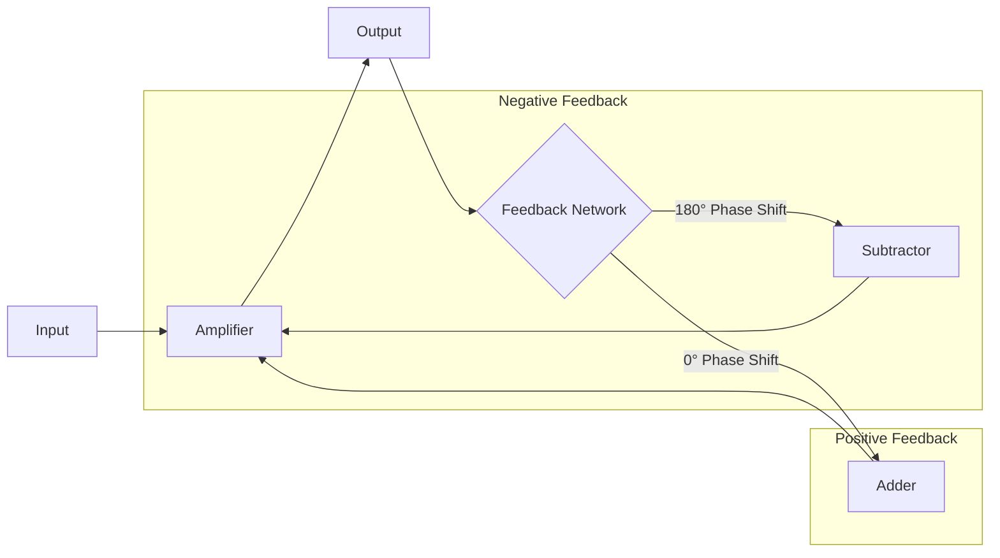
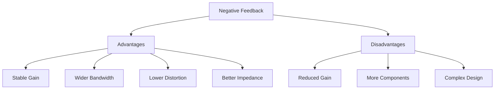
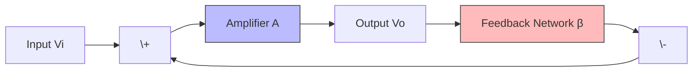
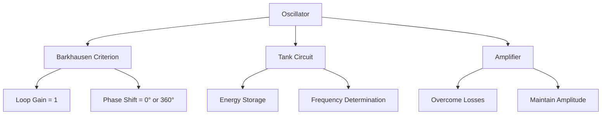
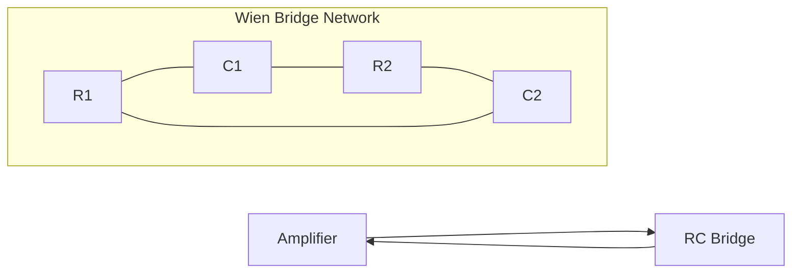
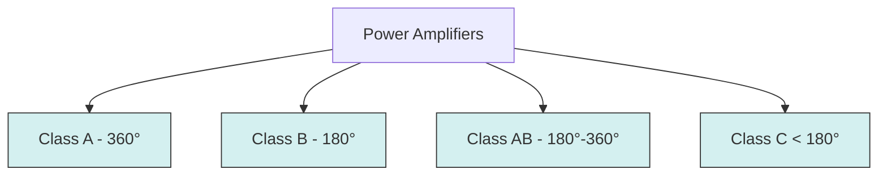
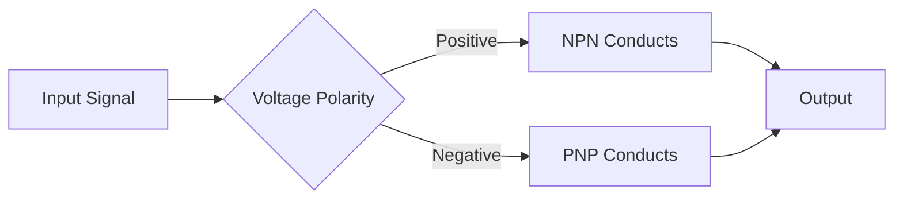
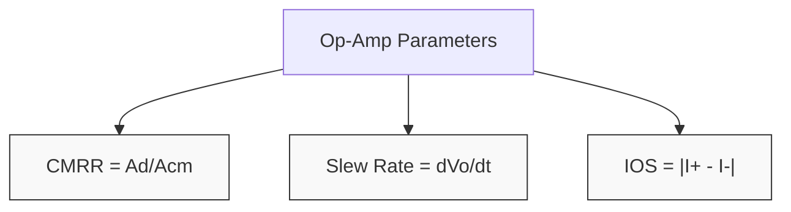
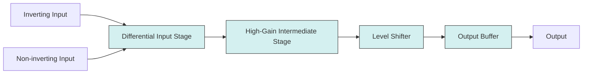
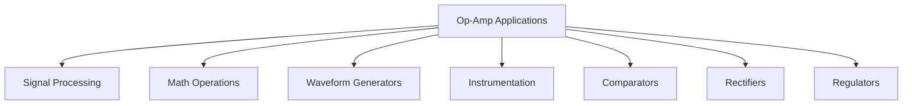

## Question 1(a) [3 marks]

**State and explain the difference between positive and negative feedback with diagram.**

**Answer**:

| Parameter | Negative Feedback | Positive Feedback |
|-----------|-------------------|-------------------|
| Signal | Output signal is fed back to input with opposite phase | Output signal is fed back to input with same phase |
| Gain | Decreases | Increases |
| Stability | Improves | Reduces |
| Applications | Amplifiers | Oscillators |

**Diagram:**



- **Phase relationship**: In negative feedback, signal is 180° out of phase while in positive feedback, signal is in phase
- **Purpose**: Negative feedback stabilizes system while positive feedback creates oscillations

**Mnemonic:** "Negative Needs Stability, Positive Produces Oscillations"

## Question 1(b) [4 marks]

**Explain the effect of negative feedback on input impedance of the Amplifier.**

**Answer**:

| Type of Feedback | Effect on Input Impedance | Formula |
|------------------|---------------------------|---------|
| Voltage Series | Increases | Z(in-f) = Z(in)(1+Aβ) |
| Current Series | Increases | Z(in-f) = Z(in)(1+Aβ) |
| Voltage Shunt | Decreases | Z(in-f) = Z(in)/(1+Aβ) |
| Current Shunt | Decreases | Z(in-f) = Z(in)/(1+Aβ) |

**Diagram:**


- **Series feedback**: When feedback signal is in series with input, input impedance increases
- **Shunt feedback**: When feedback signal is in parallel with input, input impedance decreases
- **Magnitude**: Change is proportional to (1+Aβ) where A is gain and β is feedback factor

**Mnemonic:** "Series Soars, Shunt Shrinks"

## Question 1(c) [7 marks]

**List the advantages and Disadvantages of negative feedback.**

**Answer**:

| Advantages | Disadvantages |
|------------|---------------|
| Stabilizes gain | Reduces overall gain |
| Increases bandwidth | Requires additional components |
| Reduces distortion | May cause oscillation if improperly designed |
| Reduces noise | Requires careful phase compensation |
| Improves input/output impedance | Increases power consumption |
| Reduces temperature sensitivity | Makes circuit more complex |
| Controls frequency response | May reduce signal-to-noise ratio in some cases |

**Diagram:**



- **Performance tradeoff**: Sacrifices gain to achieve better stability and linearity
- **Frequency considerations**: May require compensation to prevent oscillations at high frequencies
- **Design complexity**: More complex to design properly but offers better long-term performance

**Mnemonic:** "Stability Grows As Gain Drops"

## Question 1(c) OR [7 marks]

**Explain Voltage series feedback amplifier in detail with block diagram and draw the Practical voltage series feedback circuit.**

**Answer**:

| Parameter | Effect in Voltage Series Feedback |
|-----------|----------------------------------|
| Input signal | Voltage |
| Feedback signal | Voltage |
| Input impedance | Increases |
| Output impedance | Decreases |
| Gain stability | Improves |
| Bandwidth | Increases |

**Diagram:**



**Practical Circuit:**

```goat
          +Vcc
            |
            R2
            |
            +-----+
            |     |
Vin o---R1--+--+  |
            |  |  |
            C1 | C2
            |  |  |
            |  +--+----o Vout
            |     |
            RE   RC
            |     |
            +-----+
            |
           GND
```

- **Sampling method**: Output voltage is sampled and fed back to input
- **Mixing method**: Feedback signal is mixed in series with input signal
- **Working principle**: Reduces gain for improved stability and linearity
- **Applications**: Audio amplifiers, instrumentation amplifiers

**Mnemonic:** "Voltage Series - Impedance In Up, Out Down"

## Question 2(a) [3 marks]

**Write short note on Colpitts oscillator circuit.**

**Answer**:

| Component | Function |
|-----------|----------|
| LC Tank | Determines oscillation frequency |
| Capacitive Voltage Divider | Provides feedback |
| Active Device | Provides gain to sustain oscillations |

**Diagram:**

```goat
     +Vcc
       |
       R1
       |
       +-----+
       |     |
       |     C3
       |     |
       +--+--+---o Output
       |  |  |
       L1 |  |
       |  |  |
       +--+  |
       |     |
       C1    |
       |     |
       +-----+
       |     |
       C2    |
       |     |
      GND   GND
```

- **Frequency formula**: f = 1/(2π√(L×(C1×C2)/(C1+C2)))
- **Feedback**: Provided by capacitive voltage divider (C1 and C2)
- **Applications**: RF oscillators, communication circuits

**Mnemonic:** "Colpitts Contains Capacitive divider"

## Question 2(b) [4 marks]

**Explain requirement of oscillator. i) Barkhausen Criterion. ii) Tank circuit. iii) Amplifier.**

**Answer**:

| Requirement | Function | Explanation |
|-------------|----------|-------------|
| Barkhausen Criterion | Ensures sustained oscillation | Loop gain = 1, Phase shift = 0° or 360° |
| Tank Circuit | Determines frequency | Resonant LC circuit that stores energy |
| Amplifier | Provides gain | Compensates for circuit losses |

**Diagram:**



- **Barkhausen Criterion**: Mathematical condition for sustained oscillations without damping
- **Tank Circuit**: LC circuit that determines frequency of oscillations
- **Amplifier**: Active device that provides energy to maintain oscillations

**Mnemonic:** "BAT - Barkhausen Amplifies Tank"

## Question 2(c) [7 marks]

**Explain construction, working and V-I characteristics of UJT.**

**Answer**:

| Parameter | Description |
|-----------|-------------|
| Construction | Silicon bar with two base connections and one emitter |
| Symbol | Triangle with emitter on one side and two bases |
| Equivalent Circuit | Voltage divider with diode |
| Key Parameter | Intrinsic standoff ratio (η) |

**Diagram:**

```goat
         E
         |
         v
    +----+----+
    |    |    |
    |    D    |
    |    |    |
B1 o+---www---+o B2
         R1    R2
     
UJT Symbol & Equivalent Circuit
```

**V-I Characteristic Curve:**

```goat
  I
  ^
  |
  |       Peak point
  |         o
  |        /|
  |       / |
  |      /  |
  |     /   |
  |    /    |
  |   /     |
  |  /      |
  | /       |
  |/        |
  +---------> V
  |
  | Valley point
```

- **Construction**: N-type silicon bar with P-type emitter junction
- **Working principle**: When emitter voltage > (η×VBB), device conducts
- **Regions of operation**: Cut-off, negative resistance, and saturation
- **Applications**: Relaxation oscillators, timing circuits, triggering devices

**Mnemonic:** "UJT Peaks Then Valleys - Negative Resistance Rules"

## Question 2(a) OR [3 marks]

**State the advantages, disadvantages and applications of Hartley oscillator.**

**Answer**:

| Advantages | Disadvantages | Applications |
|------------|---------------|--------------|
| Easy tuning | Bulky inductors | RF generators |
| Wide frequency range | Mutual inductance issues | Radio receivers |
| Simple design | Difficult at high frequencies | Amateur radio |
| Good frequency stability | Requires center-tapped coil | Communication equipment |

**Diagram:**

```goat
            +Vcc
              |
              R1
              |
              +-----+
              |     |
              |     C2
              |     |
              +--+--+----o Output
              |  |  |
              L1 |  |
              |  |  |
              L2 |  |
              |  |  |
              +--+  |
              |     |
              C1    |
              |     |
             GND   GND
```

- **Key feature**: Uses tapped inductor for feedback
- **Frequency formula**: f = 1/(2π√(C×(L1+L2)))
- **Distinguishing characteristic**: Inductive voltage divider for feedback

**Mnemonic:** "Hartley Has tapped Inductor"

## Question 2(b) OR [4 marks]

**Explain UJT as relaxation oscillator.**

**Answer**:

| Component | Function |
|-----------|----------|
| UJT | Provides switching action |
| Capacitor | Timing element |
| Resistor | Controls charging rate |
| Output | Sawtooth waveform |

**Diagram:**

```goat
      +Vcc
        |
        R
        |
        +-------+
        |       |
        |       |
        +--| |--+----o Output
        |   C   |
        |       |
        E       |
       UJT      |
       B1  B2   |
        |   |   |
        +---+---+
            |
           GND
```

**Waveforms:**

```goat
  Vc
  ^
  |  /|  /|  /|
  | / | / | / |
  |/  |/  |/  |
  +------------> t

  Vo
  ^
  |
  |  _   _   _
  | | | | | | |
  |_| |_| |_| |_
  +------------> t
```

- **Operating principle**: Capacitor charges until UJT firing voltage, then rapidly discharges
- **Frequency formula**: f ≈ 1/(RC×ln(1/(1-η)))
- **Applications**: Timing circuits, pulse generators, control systems

**Mnemonic:** "Charge-Fire-Repeat - Sawtooth's Beat"

## Question 2(c) OR [7 marks]

**Explain working of weinbridge oscillator with neat diagram also state the advantage, disadvantage and application for the same.**

**Answer**:

| Parameter | Description |
|-----------|-------------|
| Configuration | RC feedback network in bridge formation |
| Frequency Formula | f = 1/(2πRC) when R1=R3 and C2=C4 |
| Feedback | Positive feedback through RC network |
| Phase Shift | 0° at resonant frequency |

**Diagram:**



**Circuit:**

```goat
                +Vcc
                  |
                  |
                  v
    +---R2---+----+----+
    |        |         |
    C2       |        R4
    |        |         |
    +---+    +    +----+
    |   |    |    |    |
    |   +----+----+    |
    |        |         |
    R1       +        R3
    |        |         |
    C1       v        R5
    |       Op-Amp     |
    +--------+         |
             |         |
             +---------+
                  |
                 GND
```

**Advantages:**

- High frequency stability
- Low distortion output
- Simple RC components
- Easy to tune

**Disadvantages:**

- Limited frequency range
- Amplitude stabilization needed
- Sensitive to component variations
- Difficult to start oscillations

**Applications:**

- Audio test equipment
- Function generators
- Musical instruments
- Laboratory signal sources

**Mnemonic:** "Wien Works at R1C1=R2C2 frequency"

## Question 3(a) [3 marks]

**Give classification of power Amplifier.**

**Answer**:

| Classification Basis | Types |
|---------------------|-------|
| Based on Conduction Angle | Class A, B, AB, C |
| Based on Configuration | Single-ended, Push-pull, Complementary |
| Based on Coupling | RC coupled, Transformer coupled, Direct coupled |
| Based on Operation | Linear, Switching |

**Diagram:**



- **Class A**: Conducts for full 360° cycle, highest linearity, lowest efficiency
- **Class B**: Conducts for 180° cycle, medium distortion, medium efficiency
- **Class AB**: Conducts for 180°-360° cycle, good linearity, good efficiency
- **Class C**: Conducts for <180° cycle, highest distortion, highest efficiency

**Mnemonic:** "A All-time, B Bisects, AB Almost-Bisects, C Cuts-more"

## Question 3(b) [4 marks]

**Explain class A power amplifier.**

**Answer**:

| Parameter | Class A Amplifier |
|-----------|-------------------|
| Conduction Angle | 360° (full cycle) |
| Biasing | Q-point at center of load line |
| Efficiency | Low (25-30% max) |
| Distortion | Very low |

**Diagram:**

```goat
         +Vcc
           |
           |
         Rcollector
           |
           +-----+
           |     |
           |     +---> Output
           |     |
       +---+     |
       |   |     |
   In -+   Q1    |
       |   |     |
       +---+     |
           |     |
         Remitter|
           |     |
           +-----+
           |
          GND
```

**Load Line:**

```goat
 Ic
  ^
  |          Load Line
  |         /
  |        /
  |       /
  |      *  Q-point
  |     /
  |    /
  |   /
  |  /
  | /
  |/
  +---------------> Vce
```

- **Operating principle**: Transistor conducts for entire input cycle
- **Efficiency calculation**: Maximum theoretical efficiency = 50%
- **Practical efficiency**: Typically 25-30% due to losses
- **Applications**: Audio pre-amplifiers, low-power amplifiers where quality matters more than efficiency

**Mnemonic:** "Class A - Always conducting, All cycle"

## Question 3(c) [7 marks]

**Explain the principle of push pull amplifiers and write short note on class B push pull amplifier.**

**Answer**:

| Push-Pull Principle | Class B Push-Pull |
|---------------------|-------------------|
| Uses two complementary devices | Each transistor conducts for half cycle |
| Reduces even harmonic distortion | Higher efficiency (78.5% theoretical) |
| Cancels DC magnetization in transformer | Suffers from crossover distortion |
| Provides higher output power | Requires proper biasing to minimize distortion |

**Diagram:**

```goat
           +Vcc
             |
             |
        +----+----+
        |         |
        Q1        Q2
        |         |
        +----+----+
             |
             +------> Output
             |
             R
             |
            GND
```

**Waveforms:**

```goat
  Input      Q1 Current    Q2 Current     Output
    ^            ^             ^             ^
    |            |             |             |
    |  /\        |  /\         |    /\       |  /\
    | /  \       | /  \        |   /  \      | /  \
----+------     -+------      -+-------     -+------
    |    \       |             |    \        |    \
    |     \      |             |     \       |     \
    |      \     |             |      \      |      \
    v       v    v             v       v     v       v
```

- **Working principle**: Each transistor conducts for alternate half-cycles
- **Advantages**: Higher efficiency, reduced even harmonics, lower heat generation
- **Disadvantages**: Crossover distortion at transition points
- **Applications**: Audio power amplifiers, output stages of high-power systems

**Mnemonic:** "Push-Pull: Pair Processes alternate Pulses"

## Question 3(a) OR [3 marks]

**Discuss crossover distortion in push pull amplifier. How it can be removed.**

**Answer**:

| Crossover Distortion | Solution Methods |
|----------------------|------------------|
| Occurs at signal crossover points | Apply small bias voltage (Class AB) |
| Due to transistor's non-linear region | Use diode compensation networks |
| Creates "dead zone" around zero | Implement feedback correction |
| Affects small signals more | Use complementary emitter-follower stage |

**Diagram:**

```goat
  Input          Output with Distortion
    ^                  ^
    |                  |
    |  /\              |   /\
    | /  \             |  /  \
----+------           -+------
    |    \             |     \
    |     \            | gap  \
    |      \           |       \
    v       v          v        v
```

**Correction Circuit:**

```goat
          +Vcc
            |
            |
       +----+----+
       |    |    |
       |    R    |
       |    |    |
       |    D1   |
       |    |    |
       Q1   +    Q2
       |    |    |
       |    D2   |
       |    |    |
       +----+----+
            |
            R
            |
           GND
```

- **Cause**: Transistors require ~0.7V to turn on, creating dead zone
- **Effect**: Distortion particularly noticeable at low volumes
- **Solution**: Class AB biasing with diodes or VBE multiplier
- **Result**: Smoother transition between positive and negative half-cycles

**Mnemonic:** "Cross to Class AB Smooths the Gap"

## Question 3(b) OR [4 marks]

**Explain complimentary symmetry push-pull amplifier.**

**Answer**:

| Component | Purpose |
|-----------|---------|
| NPN Transistor | Handles positive half-cycle |
| PNP Transistor | Handles negative half-cycle |
| Biasing Network | Reduces crossover distortion |
| Output Coupling | Direct coupling to load |

**Diagram:**

```goat
          +Vcc
            |
            |
            Q1 (NPN)
            |
      R1    |
       +----+
       |    |
Input  |    +-----o Output
       |    |
       +----+
            |
            Q2 (PNP)
            |
            |
           GND
```

**Working Principle:**



- **Key feature**: Uses complementary transistors (NPN and PNP) for push-pull operation
- **Advantage**: No output transformer required, direct coupling to load
- **Efficiency**: Typically 78.5% theoretical maximum
- **Applications**: Audio amplifiers, power output stages

**Mnemonic:** "NPN Pulls-up, PNP Pulls-down"

## Question 3(c) OR [7 marks]

**Derive the equation of efficiency for class B push pull Amplifier.**

**Answer**:

| Parameter | Formula | Description |
|-----------|---------|-------------|
| DC Input Power | PDC = 2VCC×IDC | Power drawn from supply |
| AC Output Power | PAC = Vrms²/RL | Power delivered to load |
| Maximum Efficiency | η = (π/4)×100% = 78.5% | Theoretical maximum |
| Practical Efficiency | 60-70% | Considering losses |

**Mathematical Derivation:**

For a sinusoidal input: v(t) = Vm sin(ωt)

**Step 1**: DC Input Power

- Input current per transistor: Im/π
- Total DC input power: PDC = 2VCC×Im/π

**Step 2**: AC Output Power

- RMS output voltage: Vrms = Vm/√2
- Maximum output voltage: Vm = VCC
- Output power: PAC = Vrms²/RL = Vm²/2RL

**Step 3**: Efficiency Calculation

- η = (PAC/PDC)×100%
- η = ((Vm²/2RL)/(2VCC×Im/π))×100%
- Since Vm = VCC and Im = VCC/RL
- η = (π/4)×100% = 78.5%

**Diagram:**

```goat
 Vm=VCC
    ^
    |         /\
    |        /  \
    |       /    \
    |      /      \
    |     /        \
0   +----/----------\-----> t
    |   /            \
    |  /              \
    | /                \
    |/                  \
    v
```

- **Power dissipation**: Most efficient when output voltage swing approaches VCC
- **Conduction angle**: Each transistor conducts for exactly 180°
- **Practical factors**: Biasing current, saturation voltage, and other losses reduce efficiency
- **Comparison**: Much higher than Class A (25-30%), less than Class C (>80%)

**Mnemonic:** "Pi-over-4 gives 78.5% - Class B's best"

## Question 4(a) [3 marks]

**Define.(i) CMRR (ii)slew rate.(iii)Input offset Current.**

**Answer**:

| Parameter | Definition | Typical Values |
|-----------|------------|----------------|
| CMRR | Ratio of differential gain to common-mode gain | 80-120 dB |
| Slew Rate | Maximum rate of change of output voltage | 0.5-20 V/μs |
| Input Offset Current | Difference between currents into the two inputs | 1-100 nA |

**Diagram:**



- **CMRR**: Measures op-amp's ability to reject common-mode signals
- **Slew Rate**: Limits maximum frequency for undistorted output
- **Input Offset Current**: Causes output error even with identical inputs

**Mnemonic:** "Cancelling Mistakes Requires Ratios"

## Question 4(b) [4 marks]

**Draw and explain the basic block diagram of an operational amplifier.**

**Answer**:

| Stage | Function |
|-------|----------|
| Differential Input | Accepts and amplifies difference between inputs |
| High-Gain Intermediate | Provides voltage amplification |
| Level Shifter | Shifts DC level for output stage |
| Output Buffer | Provides low output impedance |

**Diagram:**



- **Differential input stage**: Converts differential input to single-ended output
- **High-gain stage**: Provides most of the open-loop gain
- **Level shifter**: Shifts signal level for proper output operation
- **Output stage**: Provides current gain and low output impedance

**Mnemonic:** "Diff-Amp Gain Shift Out"

## Question 4(c) [7 marks]

**Explain in detail operational amplifier as integrator.**

**Answer**:

| Parameter | Description | Formula |
|-----------|-------------|---------|
| Circuit | Op-amp with capacitor in feedback | - |
| Transfer Function | Output proportional to integral of input | Vo = -(1/RC)∫Vi dt |
| Frequency Response | Acts as low-pass filter | Gain = 1/(jωRC) |
| Phase Shift | -90° | - |

**Diagram:**

```goat
              C
       +------||------+
       |              |
       |    +-----+   |
       |    |     |   |
       +----+  -  |   |
       |    |     |   |
Vin o--+--R-+     +---+--o Vout
            |  +  |
            |     |
            +-----+
              |
             GND
```

**Input/Output Waveforms:**

```goat
 Input Square Wave     Output Triangle Wave
       ___                      /|
      |   |                    / |
      |   |                   /  |
  ____|   |____         ____/    |\____
      |   |                      |
      |   |                      |
      |___|                      |
                                \|
```

- **Working principle**: Capacitor integrates current over time 
- **Mathematical basis**: Vo(t) = -(1/RC)∫Vi(t)dt + Vo(0)
- **Limitations**: Capacitor leakage, op-amp input bias current cause drift
- **Applications**: Waveform generators, analog computers, active filters

**Mnemonic:** "Square-In Triangle-Out, RC sets the Slope"

## Question 4(a) OR [3 marks]

**Explain operational amplifier as summing amplifier.**

**Answer**:

| Parameter | Description | Formula |
|-----------|-------------|---------|
| Circuit | Multiple inputs with same feedback | Vo = -(R₁/R₁×V₁ + R₁/R₂×V₂ + ...) |
| Equal Resistors | Simple addition/averaging | Vo = -(V₁ + V₂ + ... + Vₙ) |
| Weighted Sum | Different input resistors | Vo = -(K₁V₁ + K₂V₂ + ... + KₙVₙ) |
| Inverting | Output inverted from inputs | - |

**Diagram:**

```goat
        R1
V1 o---www---+
             |
        R2   |    +-----+
V2 o---www---+----+     |
             |    |  -  |
        R3   |    |     |
V3 o---www---+----+     +---o Vout
                  |  +  |
                  |     |
                  +-----+
                    |
          Rf        |
        +---www-----+
        |
       GND
```

- **Working principle**: Each input contributes current to summing junction
- **Applications**: Audio mixers, signal processing, analog computers
- **Virtual ground**: Summing point maintains near-zero voltage
- **Variations**: Inverting, non-inverting, and differential summer

**Mnemonic:** "Many Inputs, One Output - Sum It All"

## Question 4(b) OR [4 marks]

**State the applications of operational amplifier.**

**Answer**:

| Application Category | Examples |
|----------------------|----------|
| Signal Processing | Amplifiers, Filters, Buffers |
| Mathematical Operations | Adders, Subtractors, Integrators, Differentiators |
| Waveform Generators | Sine, Square, Triangle, Pulse generators |
| Instrumentation | Instrumentation amplifiers, Current-to-voltage converters |
| Comparators | Zero crossing detectors, Window comparators |
| Precision Rectifiers | Full-wave, Half-wave rectifiers |
| Voltage Regulators | Series regulators, Shunt regulators |

**Diagram:**



- **Linear applications**: Utilize op-amp in linear region for amplification, filtering
- **Non-linear applications**: Use saturation characteristics for comparison, limitation
- **Analog computation**: Perform mathematical operations on analog signals
- **Signal conditioning**: Adapt signals for analog-to-digital conversion

**Mnemonic:** "SMWIG-CR: Signal, Math, Wave, Instrument, Gate, Convert, Regulate"

## Question 4(c) OR [7 marks]

**Explain op-amp as inverting and non-inverting amplifier.**

**Answer**:

| Parameter | Inverting Amplifier | Non-Inverting Amplifier |
|-----------|---------------------|-------------------------|
| Circuit Configuration | Input to negative terminal | Input to positive terminal |
| Gain Formula | A = -Rf/Rin | A = 1 + Rf/Rin |
| Input Impedance | = Rin | Very high (≈ 10⁹ ohms) |
| Phase Shift | 180° | 0° |
| Virtual Ground | At negative input | Not applicable |

**Inverting Amplifier:**

```goat
            Rf
        +----www---+
        |          |
        |   +-----+|
        |   |     ||
Vin o---w---+  -  ||
       Rin  |     ||
            |     +---o Vout
            |  +  |
            |     |
            +-----+
              |
             GND
```

**Non-Inverting Amplifier:**

```goat
                Rf
            +----www---+
            |          |
            |   +-----+|
            |   |     ||
Vin o-------+---+  +  ||
            |   |     ||
            |   |     +---o Vout
            |   |  -  |
            |   |     |
            |   +-----+
            |     |
            |    GND
            |
            +----www-----+
                 Rin     |
                        GND
```

**Inverting Mode:**

- **Gain equation**: Vout = -(Rf/Rin)×Vin
- **Virtual ground**: Negative input maintained at ~0V
- **Applications**: Signal inversion, controlled gain, summing

**Non-Inverting Mode:**

- **Gain equation**: Vout = (1 + Rf/Rin)×Vin
- **Minimum gain**: Always ≥ 1
- **Applications**: Buffering, voltage amplification with high input impedance

**Mnemonic:** "Invert: Negative is Input, Non-invert: Positive gets signal"

## Question 5(a) [3 marks]

**Give pin description of IC555.**

**Answer**:

| Pin Number | Pin Name | Description |
|------------|----------|-------------|
| 1 | Ground | Connected to circuit ground |
| 2 | Trigger | Starts timing cycle when < 1/3 VCC |
| 3 | Output | Provides output signal |
| 4 | Reset | Terminates timing when LOW |
| 5 | Control Voltage | Adjusts threshold voltage |
| 6 | Threshold | Ends timing cycle when > 2/3 VCC |
| 7 | Discharge | Connected to timing capacitor |
| 8 | VCC | Positive supply voltage (5-15V) |

**Diagram:**

```goat
    +--------+
  8 |        | 7
+---+ VCC    | DISCHARGE +---+
    |        |               |
  7 |        | 6             |
+---+ DISCHARGE THRESHOLD +--+
    |        |               |
  6 |        | 5             |
+---+ THRESHOLD CONTROL   +--+
    |        |               |
  5 |        | 4             |
+---+ CONTROL  RESET     +---+
    |        |               |
  4 |        | 3             |
+---+ RESET   OUTPUT    +----+
    |        |               |
  3 |        | 2             |
+---+ OUTPUT  TRIGGER   +----+
    |        |               |
  2 |        | 1             |
+---+ TRIGGER GND       +----+
    |        |
    +--------+
```

- **Input pins**: Trigger, Reset, Threshold, Control Voltage
- **Output pins**: Output, Discharge
- **Power pins**: VCC, Ground
- **Internal structure**: Composed of comparators, flip-flop, discharge transistor

**Mnemonic:** "Ground Triggers Output Reset Control Threshold Discharges Voltage"

## Question 5(b) [4 marks]

**Explain op-amp as differentiator.**

**Answer**:

| Parameter | Description | Formula |
|-----------|-------------|---------|
| Circuit | Op-amp with capacitor in input | Vo = -RC(dVi/dt) |
| Transfer Function | Output proportional to rate of change | H(s) = -sRC |
| Frequency Response | Acts as high-pass filter | Gain increases with frequency |
| Phase Shift | +90° | - |

**Diagram:**

```goat
                 R
            +----www----+
            |           |
            |    +-----+|
            |    |     ||
Vin o-------|----+  -  ||
            ||   |     ||
            ||   |     +----o Vout
            |C   |  +  |
            ||   |     |
            |    +-----+
            |      |
           GND    GND
```

**Input/Output Waveforms:**

```goat
  Triangle Input       Square Output
       /\                 _
      /  \               | |
     /    \              | |
____/      \____    _____| |_____
               \         | |
                \        | |
                 \       | |
                  \     _| |_
```

- **Working principle**: Output voltage proportional to rate of change of input
- **Mathematical basis**: Vo = -RC(dVin/dt)
- **Practical limitations**: Sensitive to high-frequency noise
- **Applications**: Waveform generation, edge detection, rate-of-change indicator

**Mnemonic:** "Differentiator Delivers Derivatives - RC determines speed"

## Question 5(c) [7 marks]

**Explain IC 555 as astable and Monostable multivibrator.**

**Answer**:

| Parameter | Astable Multivibrator | Monostable Multivibrator |
|-----------|----------------------|--------------------------|
| Definition | Free-running oscillator | One-shot pulse generator |
| Stable States | None (continuously oscillates) | One stable state |
| Timing | T = 0.693(RA+2RB)C | T = 1.1RC |
| Trigger | Self-triggering | External trigger required |
| Output | Continuous square wave | Single pulse of fixed width |

**Astable Circuit:**

```goat
        +Vcc
         |
         |
      +--+--+
      |     |
      R1    |
      |     |
      +--+--+--------+
      |  |           |
      |  +--+        |
      |     |   8    |     7
      R2    +---+-------+---+
      |         |       |   |
      +------+  | 555   |   |
      |      |  |       |   |
      C1     |  |       |   |
      |      |  |       |   |
      +------+--+-------+---+
             |  |       |   |
           2 |  |   3   |   |
      +------+--+-------+   |
      |         |           |
      |         |           |
      +---------+-----------+
                |
              Output
```

**Monostable Circuit:**

```goat
     +Vcc
      |
      |
      R
      |
      +--------+--+
      |        |  |
      |    8   |  |
      +----+-------+----+
      |    |       |    |
      |    | 555   |    |
      |    |       |    |
      |    |       |    |
      |  4 |       | 7  |
      +----+-------+----+
           |       |    |
         2 |       |    |
      +----+       |    |
      |    |       |    |
      |  3 |       |    |
      +----+-------+    |
           |            |
         Output         |
           |            |
           +-----+------+
                 |
                 C
                 |
                GND
```

**Astable Operation:**

- **Working**: Capacitor charges through RA+RB and discharges through RB
- **Duty cycle**: Can be adjusted by proper selection of RA and RB
- **Frequency**: f = 1.44/((RA+2RB)C)
- **Applications**: LED flashers, tone generators, clock pulse generators

**Monostable Operation:**

- **Working**: Triggered by falling edge on pin 2, outputs HIGH for time T
- **Time period**: T = 1.1RC
- **Applications**: Time delays, pulse width modulation, debouncing

**Mnemonic:** "Astable Always Alternates, Monostable Makes One pulse"

## Question 5(a) OR [3 marks]

**Explain IC555 as Bistable multivibrator.**

**Answer**:

| Parameter | Description |
|-----------|-------------|
| Definition | Flip-flop circuit with two stable states |
| Triggering | SET by trigger pin (2), RESET by reset pin (4) |
| Stable States | Two (HIGH or LOW) |
| Time Period | No timing components needed |

**Diagram:**

```goat
           +Vcc
            |
            |
       +----|----+
       |    |    |
       |  8 |  4 |
   +---+----+----+---+
   |   |         |   |
   |   |   555   |   |
   |   |         |   |
   |   |         |   |
   | 2 |         | 3 |
   +---+---------+---+
       |         |
    Trigger    Output
       |         |
      GND       GND
```

**Truth Table:**

| Trigger (Pin 2) | Reset (Pin 4) | Output (Pin 3) |
|-----------------|---------------|----------------|
| < 1/3 VCC       | HIGH          | HIGH           |
| > 1/3 VCC       | HIGH          | No change      |
| Any             | LOW           | LOW            |

- **SET operation**: Occurs when trigger pin falls below 1/3 VCC
- **RESET operation**: Occurs when reset pin is pulled LOW
- **Applications**: Latching switches, memory elements, flip-flops
- **Features**: No timing components (R, C) required

**Mnemonic:** "Bistable Bounces Between two states"

## Question 5(b) OR [4 marks]

**Explain the basic operation of IC555 with internal block diagram.**

**Answer**:

| Block | Function |
|-------|----------|
| Comparators | Monitor trigger and threshold voltages |
| Flip-Flop | Controls output state |
| Discharge Transistor | Discharges timing capacitor |
| Voltage Divider | Establishes reference voltages |

**Internal Block Diagram:**

```goat
                         +Vcc (8)
                            |
                            v
             +-----------------------------+
             |        Voltage Divider      |
             |     +-------+-------+       |
             |     |       |       |       |
             |     R       R       R       |
             |     |       |       |       |
             |     +       +       +       |
             |     |       |       |       |
Control (5)--+-----+       |       |       |
             |             |       |       |
Threshold(6)-+----->|------+       |       |
             |      |+             |       |
             |    Comp2            |       |
             |      |              |       |
             |      v              |       |
             |    +-+-+            |       |
Trigger (2)--+--->|   |        S   |       |
             |    |+  |---------->Q+-------+-->Output (3)
             |    Comp1         FF |       |
             |      |          R   |       |
             |      |          ^   |       |
Reset (4)----+------|----------|---+       |
             |      |          |   |       |
             |      |          |   |       |
             |      v          |   |       |
             |    Transistor   |   |       |
             |      |          |   |       |
Discharge(7)-+------+----------+---+       |
             |                             |
             |                             |
             |                             |
             +-----------------------------+
                            |
                           GND (1)
```

**Basic Operation:**

1. **Voltage divider**: Creates 2/3 VCC and 1/3 VCC reference points
2. **Comparator 1**: Triggers when pin 2 goes below 1/3 VCC
3. **Comparator 2**: Resets when pin 6 goes above 2/3 VCC
4. **Flip-flop**: Controls output state based on comparator inputs
5. **Discharge transistor**: Connects pin 7 to ground when output is LOW

- **Versatility**: Can be configured in multiple modes (astable, monostable, bistable)
- **Timing precision**: Determined by external RC components
- **Wide supply range**: Functions from 4.5V to 16V

**Mnemonic:** "Comparators Control Flip-flop For Timing"

## Question 5(c) OR [7 marks]

**Explain how class A, Class B, Class C and Class AB Power amplifier are classified based on their Q Point location on load line, with diagram.**

**Answer**:

| Amplifier Class | Q-Point Location | Conduction Angle | Efficiency |
|-----------------|------------------|------------------|------------|
| Class A | Center of load line | 360° | 25-30% |
| Class B | Cut-off point | 180° | 78.5% |
| Class AB | Slightly above cut-off | 180°-360° | 50-78.5% |
| Class C | Below cut-off | <180° | >80% |

**Diagram Load Line:**

```goat
     Ic
      ^
      |
      |               Load Line
      |              /
      |             /
      |            /
  IcQ1|       A   /
      |        *  /
      |         \/
  IcQ2|     AB * /
      |         \/
      |      B * /
  IcQ3|         \/
      |         /
      |    C * /
      |       /
      |      /
      |     /
      |    /
      |   /
      |  /
      | /
      |/
      +--------------------------------> Vce
          VceC   VceB   VceAB   VceA
```

**Input/Output Waveforms:**

```goat
   Input          Class A         Class B          Class AB         Class C
     ^              ^               ^                ^                ^
     |              |               |                |                |
     |  /\          |  /\           |  /\            |  /\            |  /\
     | /  \         | /  \          | /  \           | /  \           | /  \
-----+------       -+------        -+------         -+------         -+------
     |    \         |    \          |                |    \           |
     |     \        |     \         |                |     \          |
     |      \       |      \        |      \         |      \         |
     v       v      v       v       v       v        v       v        v       v
                                    Distortion       Small Distortion
```

**Class A Characteristics:**

- **Q-point**: Center of load line
- **Bias**: Fixed bias maintains conduction for entire cycle
- **Linearity**: Excellent linearity, minimal distortion
- **Efficiency**: Poor (25-30%)

**Class B Characteristics:**

- **Q-point**: At cutoff point
- **Bias**: Biased at cutoff, each device conducts for half-cycle
- **Distortion**: Crossover distortion at zero-crossing
- **Efficiency**: Good (78.5% theoretical)

**Class AB Characteristics:**

- **Q-point**: Slightly above cutoff
- **Bias**: Small bias current eliminates crossover distortion
- **Linearity**: Good compromise between A and B
- **Efficiency**: Moderate (50-78.5%)

**Class C Characteristics:**

- **Q-point**: Below cutoff
- **Bias**: Conducts for less than half-cycle
- **Distortion**: Severe distortion, requires tuned circuit
- **Efficiency**: Excellent (>80%)

**Mnemonic:** "Above center, Below center, Cut-off point, Down below - ABCD order for Q-point location"
