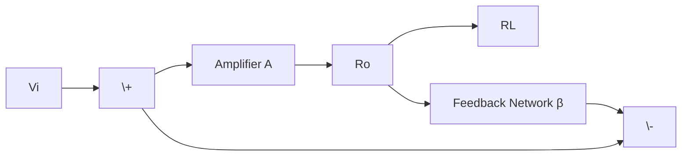
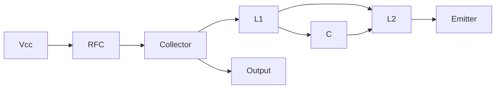
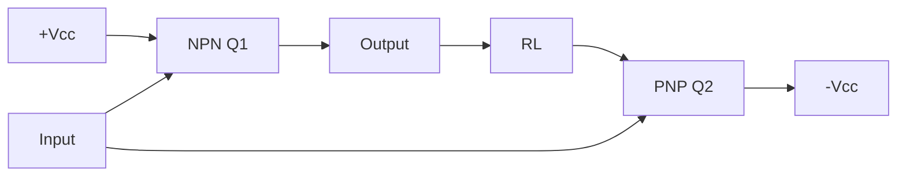
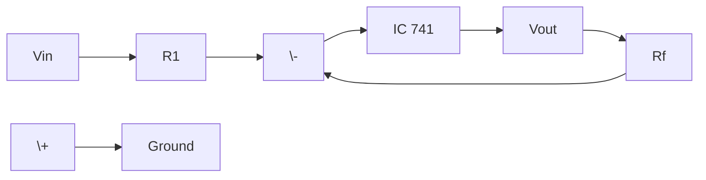
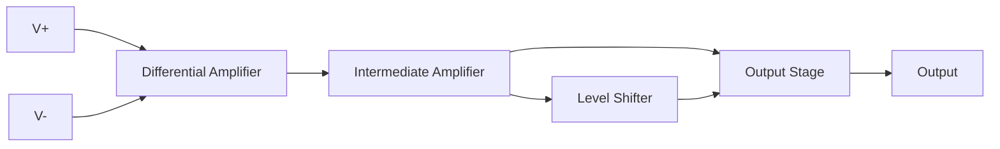

## પ્રશ્ન ૧(અ) [૩ ગુણ]

**ગેઈન અને સ્ટેબિલિટી પર નેગેટિવ ફીડબેકની અસર સમજાવો.**

**જવાબ**:
નેગેટિવ ફીડબેક એમ્પ્લીફાયરની કામગીરીને નોંધપાત્ર રીતે સુધારે છે.

**ટેબલ:**

| પરિમાણ | નેગેટિવ ફીડબેકની અસર |
|---------|----------------------|
| **ગેઈન** | એકુલ ગેઈન ઘટાડે છે |
| **સ્ટેબિલિટી** | સ્થિરતા વધારે છે |
| **બેન્ડવિડ્થ** | બેન્ડવિડ્થ વધારે છે |

- **ગેઈન ઘટાડો**: એમ્પ્લીફાયરને વધુ અનુમાનિત બનાવે છે
- **સ્થિરતા સુધારો**: ઓસિલેશન અને વિકૃતિ ઘટાડે છે
- **સારું નિયંત્રણ**: સતત કામગીરી પ્રદાન કરે છે

**મેમરી ટ્રીક:** "ગેઈન ઘટે, સ્ટેબિલિટી સારી"

## પ્રશ્ન ૧(બ) [૪ ગુણ]

**ફીડબેક એમ્પ્લીફાયરના જુદા જુદા પ્રકારો અને નેગેટિવ ફીડબેકના એમ્પ્લીફાયરના ફાયદા જણાવો.**

**જવાબ**:
ઇનપુટ અને આઉટપુટ કનેક્શનના આધારે ચાર મૂળભૂત ફીડબેક પ્રકારો છે.

**ટેબલ:**

| પ્રકાર | ઇનપુટ કનેક્શન | આઉટપુટ કનેક્શન |
|-------|----------------|------------------|
| **વોલ્ટેજ સીરીઝ** | સીરીઝ | વોલ્ટેજ |
| **વોલ્ટેજ શન્ટ** | શન્ટ | વોલ્ટેજ |
| **કરંટ સીરીઝ** | સીરીઝ | કરંટ |
| **કરંટ શન્ટ** | શન્ટ | કરંટ |

**ફાયદા:**

- **વિકૃતિ ઘટાડો**: હાર્મોનિક કન્ટેન્ટ ઘટાડે છે
- **બેન્ડવિડ્થ વૃદ્ધિ**: સારી ફ્રીક્વન્સી રિસ્પોન્સ
- **સુધારેલી સ્થિરતા**: સતત ઓપરેશન

**મેમરી ટ્રીક:** "ખૂબ સ્માર્ટ કરંટ કંટ્રોલ"

## પ્રશ્ન ૧(ક) [૭ ગુણ]

**નેગેટીવ ફીડબેક વોલ્ટેજ એમ્પ્લીફાયરનું ઓવરઓલ ગેઈનનું સૂત્ર મેળવો.**

**જવાબ**:
નેગેટિવ ફીડબેક એમ્પ્લીફાયરમાં આઉટપુટ ઇનપુટમાં વિપરીત ફેઝમાં ફીડ થાય છે.

**ડાયગ્રામ:**


**વ્યુત્પત્તિ:**

- એમ્પ્લીફાયરનું ઇનપુટ: Vi - βVo
- આઉટપુટ: Vo = A(Vi - βVo)
- Vo = AVi - AβVo
- Vo + AβVo = AVi
- Vo(1 + Aβ) = AVi
- **એકુલ ગેઈન: Af = A/(1 + Aβ)**

**મુખ્ય મુદ્દા:**

- **હર (1 + Aβ)**: લૂપ ગેઈન કહેવાય છે
- **સ્થિરતા ફેક્ટર**: સિસ્ટમ રિસ્પોન્સ નક્કી કરે છે
- **ગેઈન ઘટાડો**: સારી કામગીરી માટે ગેઈન આપવામાં આવે છે

**મેમરી ટ્રીક:** "હંમેશા (1 + લૂપ) થી ભાગો"

## પ્રશ્ન ૧(ક અથવા) [૭ ગુણ]

**કરંટ શન્ટ પ્રકારના નેગેટીવ ફીડબેક એમ્પ્લીફાયર દોરો અને સમજાવો અને તેના ઇનપુટ અને આઉટપુટ ઇમ્પીડન્સના સૂત્ર મેળવો.**

**જવાબ**:
કરંટ શન્ટ ફીડબેક આઉટપુટ કરંટ સેમ્પલ કરે છે અને ઇનપુટ સાથે શન્ટમાં વોલ્ટેજ ફીડ કરે છે.

**સર્કિટ ડાયગ્રામ:**



**વિશ્લેષણ:**

- **ફીડબેક પ્રકાર**: કરંટ સેમ્પલિંગ, વોલ્ટેજ મિક્સિંગ
- **ઇનપુટ ઇમ્પીડન્સ**: શન્ટ ફીડબેકને કારણે ઘટે છે
- **આઉટપુટ ઇમ્પીડન્સ**: કરંટ સેમ્પલિંગને કારણે ઘટે છે

**સૂત્રો:**

- **ઇનપુટ ઇમ્પીડન્સ: Zif = Zi/(1 + Aβ)**
- **આઉટપુટ ઇમ્પીડન્સ: Zof = Zo/(1 + Aβ)**

**લાક્ષણિકતાઓ:**

- **નીચું ઇનપુટ ઇમ્પીડન્સ**: કરંટ સોર્સ માટે સારું
- **નીચું આઉટપુટ ઇમ્પીડન્સ**: વોલ્ટેજ આઉટપુટ માટે સારું
- **કરંટ-ટુ-વોલ્ટેજ કન્વર્ટર**: એપ્લીકેશનમાં ઉપયોગી

**મેમરી ટ્રીક:** "કરંટ શન્ટ બંને ઇમ્પીડન્સ ઘટાડે"

## પ્રશ્ન ૨(અ) [૩ ગુણ]

**ઓસિલેટર માટે બારખૌસન ક્રાઈટેરીઆ સમજાવો.**

**જવાબ**:
ફીડબેક સર્કિટમાં સતત ઓસિલેશન માટે બે શરતો એક સાથે પૂરી થવી જોઈએ.

**ટેબલ:**

| ક્રાઈટેરીઆ | શરત | વર્ણન |
|------------|-----|--------|
| **મેગ્નિટ્યુડ** | \|Aβ\| = 1 | લૂપ ગેઈન એકમ |
| **ફેઝ** | ∠Aβ = 0° અથવા 360° | શૂન્ય ફેઝ શિફ્ટ |

- **એકમ લૂપ ગેઈન**: સિગ્નલ એમ્પ્લિટ્યુડ જાળવે છે
- **શૂન્ય ફેઝ શિફ્ટ**: પોઝીટીવ ફીડબેક સુનિશ્ચિત કરે છે
- **સતત ઓસિલેશન**: બંને શરતો સ્વ-ટકાઉ સિગ્નલ બનાવે છે

**મેમરી ટ્રીક:** "એક મેગ્નિટ્યુડ, શૂન્ય ફેઝ"

## પ્રશ્ન ૨(બ) [૪ ગુણ]

**સ્વચ્છ ડાયગ્રામની મદદથી ટેન્ક સર્કિટ સમજાવો.**

**જવાબ**:
ટેન્ક સર્કિટ ઓસિલેટર સર્કિટ માટે ફ્રીક્વન્સી સિલેક્ટિવ પોઝીટીવ ફીડબેક પ્રદાન કરે છે.

**સર્કિટ ડાયગ્રામ:**

```goat
    +---L---+
    |       |
    C       R
    |       |
    +-------+
```

**ઓપરેશન:**
રેઝોનન્ટ ફ્રીક્વન્સી પર, LC ટેન્ક સર્કિટ દર્શાવે છે:

**ટેબલ:**

| પેરામીટર | મૂલ્ય | અસર |
|-----------|------|-----|
| **રીએક્ટન્સ** | XL = XC | રેઝોનન્સ |
| **ઇમ્પીડન્સ** | મહત્તમ | ઉચ્ચ સિલેક્ટિવિટી |
| **ફેઝ** | 0° | એકમ ફીડબેક |

- **ઊર્જા સંગ્રહ**: L અને C ઊર્જાની આપ-લે કરે છે
- **ફ્રીક્વન્સી પસંદગી**: તીક્ષ્ણ રેઝોનન્સ લાક્ષણિકતા
- **ઓસિલેશન ટકાવી રાખવું**: પોઝીટીવ ફીડબેક પ્રદાન કરે છે

**મેમરી ટ્રીક:** "ટેન્ક ઊર્જા સંગ્રહે, ફ્રીક્વન્સી પસંદ કરે"

## પ્રશ્ન ૨(ક) [૭ ગુણ]

**હાર્ટલી ઓસિલેટર દોરો અને સમજાવો. ઉપરાંત હાર્ટલી ઓસિલેટરની ઓસિલેશનની ફ્રીક્વન્સીનું સૂત્ર જણાવો.**

**જવાબ**:
હાર્ટલી ઓસિલેટર ફ્રીક્વન્સી જનરેશન માટે ટેન્ક સર્કિટમાં ટેપ્ડ ઇન્ડક્ટરનો ઉપયોગ કરે છે.

**સર્કિટ ડાયગ્રામ:**



**ઓપરેશન:**

- **ટેપ્ડ ઇન્ડક્ટર**: L1 અને L2 ફીડબેક પ્રદાન કરે છે
- **ટેન્ક સર્કિટ**: L1+L2 સાથે C ફ્રીક્વન્સી નક્કી કરે છે
- **પોઝીટીવ ફીડબેક**: L1-L2 કપલિંગ દ્વારા ફેઝ શિફ્ટ

**ફ્રીક્વન્સી સૂત્ર:**
**f = 1/[2π√((L1+L2)C)]**

**મુખ્ય લાક્ષણિકતાઓ:**

- **સારી ફ્રીક્વન્સી સ્થિરતા**: ઇન્ડક્ટર-આધારિત ટ્યુનિંગ
- **સરળ ટ્યુનિંગ**: વેરિયેબલ ઇન્ડક્ટર અથવા કેપેસિટર
- **RF એપ્લીકેશન**: ઉચ્ચ ફ્રીક્વન્સી માટે યોગ્ય

**મેમરી ટ્રીક:** "હાર્ટલીમાં ટેપ્ડ ઇન્ડક્ટર હોય છે"

## પ્રશ્ન ૨(અ અથવા) [૩ ગુણ]

**ઓસિલેટરના પદને પોઝીટીવ ફીડબેક એમ્પ્લીફાયર તરીકે સમજાવો.**

**જવાબ**:
ઓસિલેટર બાહ્ય ઇનપુટ સિગ્નલ વિના પોઝીટીવ ફીડબેકનો ઉપયોગ કરીને AC સિગ્નલ ઉત્પન્ન કરે છે.

**ટેબલ:**

| પેરામીટર | એમ્પ્લીફાયર | ઓસિલેટર |
|-----------|-------------|----------|
| **ઇનપુટ** | બાહ્ય સિગ્નલ | બાહ્ય ઇનપુટ નહીં |
| **ફીડબેક** | નેગેટિવ ઉપયોગ કરી શકે | પોઝીટીવ ઉપયોગ કરે |
| **આઉટપુટ** | એમ્પ્લિફાઇડ ઇનપુટ | સ્વ-ઉત્પન્ન AC |

- **સ્વ-ટકાઉ**: પોઝીટીવ ફીડબેક ઓસિલેશન જાળવે છે
- **બારખૌસન ક્રાઈટેરીઆ**: લૂપ ગેઈન = 1, ફેઝ = 0°
- **સિગ્નલ જનરેશન**: DC સપ્લાયમાંથી AC બનાવે છે

**મેમરી ટ્રીક:** "પોઝીટીવ ફીડબેક સતત સિગ્નલ ચલાવે"

## પ્રશ્ન ૨(બ અથવા) [૪ ગુણ]

**ક્રિસ્ટલ ઓસિલેટર દોરો અને સમજાવો.**

**જવાબ**:
ક્રિસ્ટલ ઓસિલેટર ઉચ્ચ સ્થિરતા માટે ક્વાર્ટ્ઝ ક્રિસ્ટલના પીઝોઇલેક્ટ્રિક ઇફેક્ટનો ઉપયોગ કરે છે.

**સર્કિટ ડાયગ્રામ:**

```goat
         Vcc
          |
          R
          |
    +-----+-----+
    |           |
    |     Q     |
    |           |
    +-----+-----+
          |
        XTAL
          |
         GND
```

**લાક્ષણિકતાઓ:**

**ટેબલ:**

| ગુણધર્મ | મૂલ્ય | ફાયદો |
|---------|------|-------|
| **સ્થિરતા** | ±0.01% | ખૂબ ઉચ્ચી |
| **Q ફેક્ટર** | >10,000 | તીક્ષ્ણ રેઝોનન્સ |
| **તાપમાન** | નીચું ડ્રિફ્ટ | સ્થિર ફ્રીક્વન્સી |

- **પીઝોઇલેક્ટ્રિક ઇફેક્ટ**: મિકેનિકલ વાઇબ્રેશન ઇલેક્ટ્રિકલ સિગ્નલ બનાવે છે
- **ઉચ્ચ Q**: ખૂબ સ્થિર ફ્રીક્વન્સી જનરેશન
- **ક્લોક એપ્લીકેશન**: ડિજિટલ સિસ્ટમમાં ઉપયોગ

**મેમરી ટ્રીક:** "ક્રિસ્ટલ સતત ફ્રીક્વન્સી બનાવે"

## પ્રશ્ન ૨(ક અથવા) [૭ ગુણ]

**UJTની રચના, સિમ્બોલ તથા ઇક્વિવેલેન્ટ સર્કિટ દોરો અને તેને વિસ્તૃતમાં સમજાવો.**

**જવાબ**:
UJT (Unijunction Transistor) અનોખી સ્વિચિંગ લાક્ષણિકતાઓ ધરાવતું ત્રણ-ટર્મિનલ ડિવાઇસ છે.

**રચના:**

```goat
    B2 +-------+
       |   n   |
       |       |
    E  +   p   +
       |       |
       |   n   |
    B1 +-------+
```

**સિમ્બોલ:**

```goat
    B2
     |
     +
    /|
   / |
  /  +--- E
     |
     +
     |
    B1
```

**ઇક્વિવેલેન્ટ સર્કિટ:**

```goat
    B2 +---R2---+
               |
    E  +-------+
               |
    B1 +---R1---+
```

**ઓપરેશન:**

- **ઇન્ટ્રિન્સિક સ્ટેન્ડઓફ રેશિયો**: η = R1/(R1+R2)
- **પીક પોઇન્ટ વોલ્ટેજ**: VP = ηVBB + VD
- **નેગેટિવ રેઝિસ્ટન્સ**: પીક પોઇન્ટ પછી

**એપ્લીકેશન:**

- **રિલેક્સેશન ઓસિલેટર**: સોટૂથ વેવ જનરેશન
- **ટ્રિગર સર્કિટ**: SCR ફાયરિંગ સર્કિટ
- **ટાઇમિંગ એપ્લીકેશન**: RC ચાર્જિંગ સર્કિટ

**મેમરી ટ્રીક:** "UJT અનોખી જંક્શન ટેકનોલોજી વાપરે"

## પ્રશ્ન ૩(અ) [૩ ગુણ]

**ઓપરેટિંગ પોઇન્ટના આધારે પાવર એમ્પ્લીફાયરને વર્ગીકૃત કરો.**

**જવાબ**:
પાવર એમ્પ્લીફાયર ટ્રાન્ઝિસ્ટર કન્ડક્શન એંગલ અને બાયસ પોઇન્ટના આધારે વર્ગીકૃત થાય છે.

**ટેબલ:**

| ક્લાસ | કન્ડક્શન એંગલ | કાર્યક્ષમતા | એપ્લીકેશન |
|-------|---------------|-------------|-------------|
| **ક્લાસ A** | 360° | 25-50% | ઓડિયો, લો પાવર |
| **ક્લાસ B** | 180° | 78.5% | પુશ-પુલ |
| **ક્લાસ AB** | 180°-360° | 60-70% | ઓડિયો પાવર |
| **ક્લાસ C** | <180° | >90% | RF, ટ્યુન્ડ |

- **બાયસ પોઇન્ટ**: ઓપરેટિંગ ક્લાસ નક્કી કરે છે
- **કાર્યક્ષમતા ટ્રેડ-ઓફ**: ઉચ્ચ કાર્યક્ષમતા, વધુ વિકૃતિ
- **એપ્લીકેશન સ્પેસિફિક**: જરૂરિયાત પ્રમાણે પસંદગી

**મેમરી ટ્રીક:** "બધા મોટા એમ્પ્લીફાયર પાવર આપી શકે"

## પ્રશ્ન ૩(બ) [૪ ગુણ]

**કોમ્પ્લીમેંટરી સિમેટ્રી પુશ પુલ પાવર એમ્પ્લીફાયરને દોરો અને સમજાવો.**

**જવાબ**:
સેન્ટર-ટેપ્ડ ટ્રાન્સફોર્મર વિના કાર્યક્ષમ પાવર એમ્પ્લિફિકેશન માટે NPN અને PNP ટ્રાન્ઝિસ્ટરનો ઉપયોગ કરે છે.

**સર્કિટ ડાયગ્રામ:**



**ઓપરેશન:**

- **પોઝીટીવ હાફ-સાયકલ**: NPN કન્ડક્ટ કરે, PNP બંધ
- **નેગેટિવ હાફ-સાયકલ**: PNP કન્ડક્ટ કરે, NPN બંધ
- **કોમ્પ્લીમેંટરી એક્શન**: બંને ટ્રાન્ઝિસ્ટર વૈકલ્પિક હાફ-સાયકલ હેન્ડલ કરે

**ફાયદા:**

- **ટ્રાન્સફોર્મર નહીં**: ડાયરેક્ટ કપલિંગ ટુ લોડ
- **ઉચ્ચ કાર્યક્ષમતા**: ક્લાસ B ઓપરેશન
- **કોમ્પેક્ટ ડિઝાઇન**: ઓછા કોમ્પોનન્ટ્સ
- **સારું પાવર ટ્રાન્સફર**: ડાયરેક્ટ કપલિંગ

**મેમરી ટ્રીક:** "કોમ્પ્લીમેંટરી ટ્રાન્ઝિસ્ટર સાયકલ પૂરું કરે"

## પ્રશ્ન ૩(ક) [૭ ગુણ]

**ક્લાસ-B પુશ પુલ એમ્પ્લીફાયરની કાર્યક્ષમતાનું સૂત્ર મેળવો.**

**જવાબ**:
ક્લાસ B પુશ-પુલ એમ્પ્લીફાયરમાં દરેક ટ્રાન્ઝિસ્ટર ઇનપુટ સાયકલના 180° માટે કન્ડક્ટ કરે છે.

**વિશ્લેષણ:**
સાઇનુસોઇડલ ઇનપુટ માટે: Vi = Vm sin ωt

**આઉટપુટ પાવર:**

- પીક આઉટપુટ વોલ્ટેજ: Vom = Vcc
- RMS આઉટપુટ વોલ્ટેજ: Vo(rms) = Vcc/√2
- **Po = Vo²(rms)/RL = Vcc²/2RL**

**ઇનપુટ પાવર:**

- DC કરંટ (એવરેજ): Idc = 2Im/π
- જ્યાં Im = Vcc/RL
- **Pin = Vcc × Idc = 2VccIm/π = 2Vcc²/πRL**

**કાર્યક્ષમતા ગણતરી:**
**η = Po/Pin = (Vcc²/2RL)/(2Vcc²/πRL)**
**η = π/4 = 0.785 = 78.5%**

**મુખ્ય મુદ્દા:**

- **મહત્તમ સૈદ્ધાંતિક કાર્યક્ષમતા**: 78.5%
- **ક્લાસ B ફાયદો**: ક્લાસ A (25%) કરતાં ખૂબ ઊંચી
- **પ્રેક્ટિકલ કાર્યક્ષમતા**: નુકસાનને કારણે થોડી ઓછી

**મેમરી ટ્રીક:** "પુશ-પુલ π/4 કાર્યક્ષમતા આપે"

## પ્રશ્ન ૩(અ અથવા) [૩ ગુણ]

**વોલ્ટેજ અને પાવર એમ્પ્લીફાયર વચ્ચેનો તફાવત કરો.**

**જવાબ**:
વોલ્ટેજ અને પાવર એમ્પ્લીફાયર ઇલેક્ટ્રોનિક સિસ્ટમમાં જુદા હેતુઓ સેવે છે.

**ટેબલ:**

| પેરામીટર | વોલ્ટેજ એમ્પ્લીફાયર | પાવર એમ્પ્લીફાયર |
|-----------|-------------------|-----------------|
| **હેતુ** | વોલ્ટેજ વધારવું | પાવર વધારવું |
| **લોડ** | ઉચ્ચ ઇમ્પીડન્સ | નીચું ઇમ્પીડન્સ |
| **કાર્યક્ષમતા** | મહત્વપૂર્ણ નથી | ખૂબ મહત્વપૂર્ણ |
| **વિકૃતિ** | ઓછી હોવી જોઈએ | મધ્યમ સ્વીકાર્ય |
| **કપલિંગ** | RC/ડાયરેક્ટ | ટ્રાન્સફોર્મર |

- **ડિઝાઇન પ્રાથમિકતા**: વોલ્ટેજ ગેઈન વર્સીસ પાવર ડિલિવરી
- **એપ્લીકેશન**: સિગ્નલ પ્રોસેસિંગ વર્સીસ લોડ ડ્રાઇવિંગ
- **સર્કિટ જટિલતા**: સરળ વર્સીસ જટિલ પાવર સ્ટેજ

**મેમરી ટ્રીક:** "વોલ્ટેજ સિગ્નલ વધારે, પાવર લોડ ચલાવે"

## પ્રશ્ન ૩(બ અથવા) [૪ ગુણ]

**ક્લાસ AB પાવર એમ્પ્લીફાયર ડાયગ્રામ સાથે સમજાવો.**

**જવાબ**:
ક્લાસ AB ક્લાસ A અને ક્લાસ B વચ્ચે ઓપરેટ કરે છે, ક્રોસઓવર ડિસ્ટોર્શન ઘટાડે છે.

**સર્કિટ ડાયગ્રામ:**

```goat
    +Vcc
      |
      R
      |
    +-+-+
    |   |
   Q1  Q2  
    |   |
    +---+--- Output
    |   |
   D1  D2
    |   |
    +---+
      |
      R
      |
    -Vcc
```

**ઓપરેશન:**

- **થોડું ફોરવર્ડ બાયસ**: બંને ટ્રાન્ઝિસ્ટર થોડા ઓન
- **કન્ડક્શન એંગલ**: >180° પણ <360°
- **ઓવરલેપ કન્ડક્શન**: ક્રોસઓવર ડિસ્ટોર્શન દૂર કરે છે

**લાક્ષણિકતાઓ:**

**ટેબલ:**

| પેરામીટર | મૂલ્ય | ફાયદો |
|-----------|------|-------|
| **કાર્યક્ષમતા** | 60-70% | ક્લાસ A કરતાં સારી |
| **વિકૃતિ** | ઓછી | ક્લાસ B કરતાં સારી |
| **બાયસ** | થોડું ફોરવર્ડ | સમાધાનકારી ઉકેલ |

**મેમરી ટ્રીક:** "AB ખરાબ ક્રોસઓવર ડિસ્ટોર્શન ટાળે"

## પ્રશ્ન ૩(ક અથવા) [૭ ગુણ]

**સીરીજ ફેડ ક્લાસ-A પાવર એમ્પ્લીફાયરની કાર્યક્ષમતાનું સૂત્ર મેળવો.**

**જવાબ**:
સીરીજ ફેડ ક્લાસ A એમ્પ્લીફાયરમાં DC સપ્લાય લોડ સાથે સીરીજમાં જોડાયેલું હોય છે.

**સર્કિટ વિશ્લેષણ:**

- **DC સપ્લાય વોલ્ટેજ**: Vcc
- **ક્વિસન્ટ કરંટ**: Icq = Vcc/2RL (મહત્તમ પાવર માટે)
- **ક્વિસન્ટ વોલ્ટેજ**: Vceq = Vcc/2

**AC વિશ્લેષણ:**

- **મહત્તમ આઉટપુટ વોલ્ટેજ સ્વિંગ**: Vom = Vcc/2
- **આઉટપુટ પાવર**: Po = Vom²/2RL = Vcc²/8RL

**DC પાવર:**

- **DC કરંટ**: Idc = Icq = Vcc/2RL
- **ઇનપુટ પાવર**: Pin = Vcc × Idc = Vcc²/2RL

**કાર્યક્ષમતા:**
**η = Po/Pin = (Vcc²/8RL)/(Vcc²/2RL)**
**η = 1/4 = 0.25 = 25%**

**મુખ્ય મુદ્દા:**

- **મહત્તમ સૈદ્ધાંતિક કાર્યક્ષમતા**: 25%
- **પાવર બર્બાદી**: 75% ગરમીમાં ખોવાય છે
- **ડિઝાઇન મર્યાદા**: નબળી કાર્યક્ષમતા પણ સારી લીનિયરિટી

**મેમરી ટ્રીક:** "ક્લાસ A ક્વાર્ટર કાર્યક્ષમતા મેળવે"

## પ્રશ્ન ૪(અ) [૩ ગુણ]

**IC 741 OP-AMPનો પિન ડાયગ્રામ દોરો અને સમજાવો.**

**જવાબ**:
IC 741 ઇન્ડસ્ટ્રી સ્ટાન્ડર્ડ પિનઆઉટ સાથે 8-પિન ડ્યુઅલ-ઇન-લાઇન પેકેજ ઓપરેશનલ એમ્પ્લીફાયર છે.

**પિન ડાયગ્રામ:**

```goat
    +---U---+
  1 |       | 8
    |  741  |
  2 |       | 7
    |       |
  3 |       | 6
    |       |
  4 |       | 5
    +-------+
```

**પિન કન્ફિગરેશન:**

**ટેબલ:**

| પિન | ફંક્શન | વર્ણન |
|-----|---------|--------|
| **1** | ઓફસેટ નલ | ઓફસેટ એડજસ્ટમેન્ટ |
| **2** | ઇન્વર્ટિંગ ઇનપુટ | નેગેટિવ ઇનપુટ |
| **3** | નોન-ઇન્વર્ટિંગ ઇનપુટ | પોઝિટિવ ઇનપુટ |
| **4** | -Vcc | નેગેટિવ સપ્લાય |
| **5** | ઓફસેટ નલ | ઓફસેટ એડજસ્ટમેન્ટ |
| **6** | આઉટપુટ | એમ્પ્લીફાયર આઉટપુટ |
| **7** | +Vcc | પોઝિટિવ સપ્લાય |
| **8** | NC | કોઈ કનેક્શન નહીં |

**મેમરી ટ્રીક:** "નલ, નેગેટિવ, પોઝિટિવ, નેગેટિવ સપ્લાય, નલ, આઉટપુટ, પોઝિટિવ સપ્લાય, કંઈ નહીં"

## પ્રશ્ન ૪(બ) [૪ ગુણ]

**OP-AMPના નીચેના પરિમાણ વ્યાખ્યાયિત કરો. ૧. ઇનપુટ ઓફસેટ વોલ્ટેજ ૨. સી.એમ.આર.આર**

**જવાબ**:
આ પેરામીટર્સ પ્રેક્ટિકલ ઓપરેશનલ એમ્પ્લીફાયરની નોન-આઇડીયલ લાક્ષણિકતાઓ વ્યાખ્યાયિત કરે છે.

**૧. ઇનપુટ ઓફસેટ વોલ્ટેજ (Vio):**

- **વ્યાખ્યા**: આઉટપુટ શૂન્ય બનાવવા માટે ઇનપુટ્સ વચ્ચે લાગુ કરવામાં આવતું DC વોલ્ટેજ
- **સામાન્ય મૂલ્ય**: 741 માટે 1-5 mV
- **કારણ**: ઇનપુટ ટ્રાન્ઝિસ્ટરમાં મિસમેચ
- **અસર**: DC એપ્લીકેશનમાં આઉટપુટ એરર

**૨. કોમન મોડ રિજેક્શન રેશિયો (CMRR):**

- **વ્યાખ્યા**: બંને ઇનપુટ્સ પર કોમન સિગ્નલ રિજેક્ટ કરવાની ક્ષમતા
- **સૂત્ર**: CMRR = Ad/Acm
- **સામાન્ય મૂલ્ય**: 741 માટે 90 dB
- **મહત્વ**: નોઇઝ ઇમ્યુનિટી

**ટેબલ:**

| પેરામીટર | સિમ્બોલ | એકમ | આઇડીયલ | 741 સામાન્ય |
|-----------|---------|------|---------|-------------|
| **ઇનપુટ ઓફસેટ વોલ્ટેજ** | Vio | mV | 0 | 2 |
| **CMRR** | - | dB | ∞ | 90 |

**મેમરી ટ્રીક:** "ઓફસેટ આઉટપુટ એરર બનાવે, CMRR કોમન સિગ્નલ રિજેક્ટ કરે"

## પ્રશ્ન ૪(ક) [૭ ગુણ]

**IC 741ની મદદથી ઇન્વર્ટિંગ એમ્પ્લીફાયર વિસ્તૃતમાં સમજાવો.**

**જવાબ**:
ઇન્વર્ટિંગ એમ્પ્લીફાયર ઇન્વર્ટિંગ ટર્મિનલ પર લાગુ ઇનપુટ સાથે નેગેટિવ ફીડબેકનો ઉપયોગ કરે છે.

**સર્કિટ ડાયગ્રામ:**



**વિશ્લેષણ:**
વર્ચ્યુઅલ શોર્ટ કોન્સેપ્ટનો ઉપયોગ કરીને:

- **V+ = V- = 0V** (વર્ચ્યુઅલ ગ્રાઉન્ડ)
- **ઇનપુટ કરંટ**: I1 = Vin/R1
- **ફીડબેક કરંટ**: If = Vout/Rf
- **કરંટ બેલેન્સ**: I1 = If (ઓપ-એમ્પમાં કોઈ કરંટ નહીં)

**વ્યુત્પત્તિ:**

- Vin/R1 = -Vout/Rf
- **વોલ્ટેજ ગેઈન: Av = -Rf/R1**

**લાક્ષણિકતાઓ:**

**ટેબલ:**

| પેરામીટર | એક્સપ્રેશન | નોંધ |
|-----------|------------|-----|
| **વોલ્ટેજ ગેઈન** | -Rf/R1 | નેગેટિવ સાઇન |
| **ઇનપુટ ઇમ્પીડન્સ** | R1 | નીચું ઇમ્પીડન્સ |
| **આઉટપુટ ઇમ્પીડન્સ** | ~0Ω | ખૂબ નીચું |
| **બેન્ડવિડ્થ** | f = GBW/\|Av\| | ગેઈન-બેન્ડવિડ્થ પ્રોડક્ટ |

**એપ્લીકેશન:**

- **સિગ્નલ ઇન્વર્શન**: ફેઝ રિવર્સલ
- **સ્કેલ ફેક્ટર**: પ્રોગ્રામેબલ ગેઈન
- **AC એમ્પ્લિફિકેશન**: કપલિંગ કેપેસિટર સાથે

**મેમરી ટ્રીક:** "ઇન્વર્ટિંગ ઇનપુટ ઇન્વર્ટેડ આઉટપુટ આપે"

## પ્રશ્ન ૪(અ અથવા) [૩ ગુણ]

**Ideal OP-AMPની લાક્ષણિકતાની સૂચિ બનાવો.**

**જવાબ**:
આઇડીયલ ઓપ-એમ્પ બધા પેરામીટર્સ માટે સૈદ્ધાંતિક મર્યાદા સાથે સંપૂર્ણ એમ્પ્લીફાયરનું પ્રતિનિધિત્વ કરે છે.

**ટેબલ:**

| પેરામીટર | આઇડીયલ મૂલ્ય | પ્રેક્ટિકલ ઇમ્પેક્ટ |
|-----------|-------------|------------------|
| **ઓપન લૂપ ગેઈન** | ∞ | સંપૂર્ણ એમ્પ્લિફિકેશન |
| **ઇનપુટ ઇમ્પીડન્સ** | ∞ | કોઈ ઇનપુટ કરંટ નહીં |
| **આઉટપુટ ઇમ્પીડન્સ** | 0Ω | સંપૂર્ણ વોલ્ટેજ સોર્સ |
| **બેન્ડવિડ્થ** | ∞ | કોઈ ફ્રીક્વન્સી મર્યાદા નહીં |
| **CMRR** | ∞ | સંપૂર્ણ નોઇઝ રિજેક્શન |
| **સ્લ્યુ રેટ** | ∞ | કોઈ સ્લ્યુ રેટ લિમિટિંગ નહીં |
| **ઇનપુટ ઓફસેટ** | 0V | કોઈ DC એરર નહીં |

- **સંપૂર્ણ કામગીરી**: બધા પેરામીટર્સ ઓપ્ટિમાઇઝ્ડ
- **ડિઝાઇન સરળીકરણ**: વિશ્લેષણ સરળ બને છે
- **પ્રેક્ટિકલ અપ્રોક્સિમેશન**: ઘણી એપ્લીકેશનમાં આઇડીયલની નજીક

**મેમરી ટ્રીક:** "અનંત ઇનપુટ, શૂન્ય આઉટપુટ, સંપૂર્ણ કામગીરી"

## પ્રશ્ન ૪(બ અથવા) [૪ ગુણ]

**Op-ampની મદદથી સમિંગ એમ્પ્લીફાયર દોરો અને સમજાવો.**

**જવાબ**:
સમિંગ એમ્પ્લીફાયર દરેક ઇનપુટ માટે પ્રોગ્રામેબલ ગેઈન સાથે બહુવિધ ઇનપુટ વોલ્ટેજ ઉમેરે છે.

**સર્કિટ ડાયગ્રામ:**

```goat
V1 ---R1---+
           |
V2 ---R2---+--- (-) IC741 --- Vout
           |             |
V3 ---R3---+             |
                        Rf
           (+) --------GND
```

**વિશ્લેષણ:**
વર્ચ્યુઅલ ગ્રાઉન્ડ કોન્સેપ્ટનો ઉપયોગ કરીને (V- = 0V):

- **R1 દ્વારા કરંટ**: I1 = V1/R1
- **R2 દ્વારા કરંટ**: I2 = V2/R2  
- **R3 દ્વારા કરંટ**: I3 = V3/R3
- **કુલ ઇનપુટ કરંટ**: Iin = I1 + I2 + I3

**આઉટપુટ સમીકરણ:**
**Vout = -Rf(V1/R1 + V2/R2 + V3/R3)**

**વિશેષ કેસો:**

- **સમાન રેઝિસ્ટર**: Vout = -(Rf/R)(V1 + V2 + V3)
- **યુનિટી ગેઈન**: Rf = R, Vout = -(V1 + V2 + V3)

**એપ્લીકેશન:**

- **ઓડિયો મિક્સિંગ**: બહુવિધ સિગ્નલ કમ્બિનેશન
- **ડિજિટલ-ટુ-એનાલોગ**: વેઈટેડ રેઝિસ્ટર DAC
- **સિગ્નલ પ્રોસેસિંગ**: ગણિતીય ઓપરેશન

**મેમરી ટ્રીક:** "ઇનપુટ્સ સરવાળો, રેઝિસ્ટર રેશિયો દ્વારા સ્કેલ કરો"

## પ્રશ્ન ૪(ક અથવા) [૭ ગુણ]

**IC741ની મદદથી ડિફરેન્શિયલ એમ્પ્લીફાયર વિસ્તૃતમાં સમજાવો.**

**જવાબ**:
ડિફરેન્શિયલ એમ્પ્લીફાયર કોમન સિગ્નલ રિજેક્ટ કરતાં બે ઇનપુટ સિગ્નલ વચ્ચેનો તફાવત એમ્પ્લિફાઇ કરે છે.

**સર્કિટ ડાયગ્રામ:**

```goat
V1 ---R1--- (-) 
            IC741 --- Vout
V2 ---R2--- (+)  |
              |  |
             R3  Rf
              |  |
             GND +
```

**વિશ્લેષણ:**
નોન-ઇન્વર્ટિંગ ઇનપુટ માટે:

- **V+ = V2 × R3/(R2+R3)**

ઇન્વર્ટિંગ ઇનપુટ માટે વર્ચ્યુઅલ શોર્ટનો ઉપયોગ કરીને:

- **V- = V+ = V2 × R3/(R2+R3)**

કરંટ બેલેન્સનો ઉપયોગ કરીને:

- **(V1-V-)/R1 = (V--Vout)/Rf**

**આઉટપુટ સમીકરણ:**
જ્યારે R1 = R2 અને R3 = Rf:
**Vout = (Rf/R1)(V2 - V1)**

**મુખ્ય લાક્ષણિકતાઓ:**

**ટેબલ:**

| પેરામીટર | મૂલ્ય | ફાયદો |
|-----------|------|-------|
| **ડિફરેન્શિયલ ગેઈન** | Rf/R1 | તફાવત એમ્પ્લિફાઇ કરે |
| **કોમન મોડ ગેઈન** | ~0 | કોમન સિગ્નલ રિજેક્ટ કરે |
| **CMRR** | ખૂબ ઊંચું | શ્રેષ્ઠ નોઇઝ ઇમ્યુનિટી |

**એપ્લીકેશન:**

- **ઇન્સ્ટ્રુમેન્ટેશન**: સેન્સર સિગ્નલ પ્રોસેસિંગ
- **નોઇઝ રિજેક્શન**: ડિફરેન્શિયલ સિગ્નલ ટ્રાન્સમિશ
- **બ્રિજ સર્કિટ**: સ્ટ્રેઇન ગેજ મેઝરમેન્ટ

**મેમરી ટ્રીક:** "તફાવત એમ્પ્લિફાઇડ, કોમન રિજેક્ટેડ"

## પ્રશ્ન ૫(અ) [૩ ગુણ]

**OP-AMPની મદદથી ઇન્ટીગ્રેટર સર્કિટ દોરો અને તેના ઇનપુટ અને આઉટપુટ વેવફોર્મ દોરો.**

**જવાબ**:
ઓપ-એમ્પ ઇન્ટીગ્રેટર RC ફીડબેકનો ઉપયોગ કરીને ઇનપુટ સિગ્નલનું ગાણિતિક ઇન્ટીગ્રેશન કરે છે.

**સર્કિટ ડાયગ્રામ:**

```goat
Vin ---R--- (-) IC741 --- Vout
              |        |
             (+)       C
              |        |
             GND      /
```

**વેવફોર્મ:**

```goat
ઇનપુટ (સ્ક્વેર વેવ):
     +V |‾‾|__|‾‾|__|‾‾
        |  |  |  |  |
      0 +--+--+--+--+-- t
        |  |  |  |  |
     -V    |__|  |__|

આઉટપુટ (ત્રિકોણાકાર):
      0 +  /\  /\  -- t
        | /  \/  \
     -V +/        \
```

**ઓપરેશન:**

- **ઇન્ટીગ્રેશન ફંક્શન**: Vout = -(1/RC)∫Vin dt
- **સ્ક્વેર વેવ ઇનપુટ**: ત્રિકોણાકાર આઉટપુટ ઉત્પન્ન કરે છે
- **રેમ્પ જનરેશન**: કોન્સ્ટન્ટ ઇનપુટ લીનિયર રેમ્પ આપે છે

**મેમરી ટ્રીક:** "ઇન્ટીગ્રેશન સ્ક્વેરમાંથી ત્રિકોણાકાર બનાવે"

## પ્રશ્ન ૫(બ) [૪ ગુણ]

**પુશ પુલ એરેન્જમેન્ટ પાવર એમ્પ્લીફાયરના ફાયદા તથા ગેરફાયદા જણાવો.**

**જવાબ**:
પુશ-પુલ કન્ફિગરેશન પાવર એમ્પ્લિફિકેશન માટે કમ્પ્લીમેન્ટરી રીતે ઓપરેટ કરતા બે ટ્રાન્ઝિસ્ટરનો ઉપયોગ કરે છે.

**ફાયદા:**

**ટેબલ:**

| ફાયદો | લાભ | એપ્લીકેશન |
|-------|-----|-------------|
| **ঊચ્ચ કાર્યక્ષમતા** | 78.5% સુધી | બેટરી ઓપરેટેડ |
| **ટ્રાન્સફોર્મર નહીં** | કોમ્પેક્ટ ડિઝાઇન | પોર્ટેબલ ડિવાઇસ |
| **ઓછી વિકૃતિ** | સારી લીનિયરિટી | ઓડિયો સિસ્ટમ |
| **ગરમીનું વિતરણ** | ટ્રાન્ઝિસ્ટર વચ્ચે વહેંચાયેલું | થર્મલ મેનેજમેન્ટ |

**ગેરફાયદા:**

| ગેરફાયદો | સમસ્યા | ઉકેલ |
|-----------|-------|-------|
| **ક્રોસઓવર ડિસ્ટોર્શન** | શૂન્ય ક્રોસિંગ પર ડેડ ઝોન | ક્લાસ AB બાયસ |
| **કોમ્પોનન્ટ મેચિંગ** | મેચ્ડ ટ્રાન્ઝિસ્ટરની જરૂર | કાળજીપૂર્વક પસંદગી |
| **થર્મલ રનઅવે** | તાપમાન કોઇફિશન્ટ મિસમેચ | થર્મલ કપલિંગ |

**એપ્લીકેશન:**

- **ઓડિયો એમ્પ્લીફાયર**: હાઇ ફિડેલિટી સિસ્ટમ
- **મોટર ડ્રાઇવર**: DC મોટર કંટ્રોલ
- **RF એમ્પ્લીફાયર**: કમ્યુનિકેશન સિસ્ટમ

**મેમરી ટ્રીક:** "પુશ-પુલ પાવર પ્રદાન કરે પણ સમસ્યાઓ છે"

## પ્રશ્ન ૫(ક) [૭ ગુણ]

**555 ટાઇમર ICની મદદથી એસ્ટેબલ મલ્ટીવાઇબ્રેટર દોરો અને સમજાવો.**

**જવાબ**:
એસ્ટેબલ મલ્ટીવાઇબ્રેટર 555 ટાઇમરનો ઉપયોગ કરીને બાહ્ય ટ્રિગર વિના સતત સ્ક્વેર વેવ આઉટપુટ ઉત્પન્ન કરે છે.

**સર્કિટ ડાયગ્રામ:**

```goat
    +Vcc
      |
      RA
      |
   +--+--+ (7)
   |     |
   RB   (2)+(6) 555 (3)--- Output
   |         |     |
   C        (1)   (4)
   |         |     |
  GND       GND   +Vcc
```

**પિન કનેક્શન:**

- **પિન 1**: ગ્રાઉન્ડ
- **પિન 2**: ટ્રિગર (પિન 6 સાથે કનેક્ટેડ)
- **પિન 3**: આઉટપુટ
- **પિન 4**: રીસેટ (+Vcc)
- **પિન 6**: થ્રેશોલ્ડ
- **પિન 7**: ડિસચાર્જ
- **પિન 8**: +Vcc

**ઓપરેશન:**

1. **ચાર્જિંગ ફેઝ**: C એ RA + RB દ્વારા ચાર્જ થાય છે
2. **થ્રેશોલ્ડ પહોંચ્યું**: 2/3 Vcc પર, આઉટપુટ LOW જાય છે
3. **ડિસચાર્જિંગ ફેઝ**: C એ RB દ્વારા ડિસચાર્જ થાય છે
4. **ટ્રિગર પહોંચ્યું**: 1/3 Vcc પર, આઉટપુટ HIGH જાય છે
5. **સાયકલ રિપીટ**: સતત ઓસિલેશન

**ટાઇમિંગ સમીકરણો:**

- **HIGH સમય**: t1 = 0.693(RA + RB)C
- **LOW સમય**: t2 = 0.693(RB)C  
- **કુલ પીરિયડ**: T = t1 + t2 = 0.693(RA + 2RB)C
- **ફ્રીક્વન્સી**: f = 1.44/[(RA + 2RB)C]
- **ડ્યુટી સાયકલ**: D = (RA + RB)/(RA + 2RB) × 100%

**એપ્લીકેશન:**

- **ક્લોક જનરેશન**: ડિજિટલ સિસ્ટમ
- **LED ફ્લેશર**: બ્લિંકિંગ સર્કિટ
- **ટોન જનરેશન**: ઓડિયો ઓસિલેટર
- **PWM જનરેશન**: મોટર સ્પીડ કંટ્રોલ

**મેમરી ટ્રીક:** "એસ્ટેબલ હંમેશા ઓટોમેટિક ઓસિલેટ કરે"

## પ્રશ્ન ૫(અ અથવા) [૩ ગુણ]

**Op-ampનો બ્લોક ડાયગ્રામ દોરો અને તેને સમજાવો.**

**જવાબ**:
ઓપ-એમ્પની આંતરિક રચના ઉચ્ચ ગેઈન અને કામગીરી માટે બહુવિધ સ્ટેજનો સમાવેશ કરે છે.

**બ્લોક ડાયગ્રામ:**



**સ્ટેજ ફંક્શન:**

**ટેબલ:**

| સ્ટેજ | ફંક્શન | લાક્ષણિકતાઓ |
|-------|---------|---------------|
| **ડિફરેન્શિયલ ઇનપુટ** | ઉચ્ચ ઇનપુટ ઇમ્પીડન્સ | નીચું ઓફસેટ, ઉચ્ચ CMRR |
| **ઇન્ટરમીડિયેટ એમ્પ્લીફાયર** | ઉચ્ચ વોલ્ટેજ ગેઈન | મોટાભાગનું ગેઈન |
| **લેવલ શિફ્ટર** | DC લેવલ એડજસ્ટમેન્ટ | AC સ્ટેજ કપલ કરે છે |
| **આઉટપુટ સ્ટેજ** | નીચું આઉટપુટ ઇમ્પીડન્સ | કરંટ બફર |

- **ઉચ્ચ ગેઈન**: સામાન્ય રીતે 100,000 અથવા વધુ
- **વાઇડ બેન્ડવિડ્થ**: MHz રેન્જ ક્ષમતા  
- **નીચું આઉટપુટ ઇમ્પીડન્સ**: વિવિધ લોડ ડ્રાઇવ કરે છે

**મેમરી ટ્રીક:** "ડિફરેન્શિયલ ઇનપુટ, ઇન્ટરમીડિયેટ ગેઈન, લેવલ શિફ્ટ, આઉટપુટ બફર"

## પ્રશ્ન ૫(બ અથવા) [૪ ગુણ]

**પાવર એમ્પ્લીફાયરના સંદર્ભમાં પદો વિશે સમજાવો.i) કાર્યક્ષમતા ii) ડિસ્ટોર્શન.**

**જવાબ**:
આ પેરામીટર્સ પાવર એમ્પ્લીફાયરની કામગીરી અને એપ્લીકેશન માટે યોગ્યતા નક્કી કરે છે.

**i) કાર્યક્ષમતા (η):**

- **વ્યાખ્યા**: AC આઉટપુટ પાવર અને DC ઇનપુટ પાવરનો ગુણોત્તર
- **સૂત્ર**: η = Po(AC)/Pin(DC) × 100%
- **મહત્વ**: ગરમી વિસર્જન અને બેટરી લાઇફ નક્કી કરે છે

**કાર્યક્ષમતા સરખામણી:**

**ટેબલ:**

| ક્લાસ | કાર્યક્ષમતા | એપ્લીકેશન |
|-------|-------------|-------------|
| **A** | 25% | લો પાવર, હાઇ ફિડેલિટી |
| **B** | 78.5% | પુશ-પુલ એમ્પ્લીફાયર |
| **AB** | 60-70% | ઓડિયો એમ્પ્લીફાયર |
| **C** | >90% | RF એપ્લીકેશન |

**ii) ડિસ્ટોર્શન:**

- **વ્યાખ્યા**: આઉટપુટ સિગ્નલ શેપમાં અનિચ્છનીય ફેરફારો
- **પ્રકારો**: હાર્મોનિક, ઇન્ટરમોડ્યુલેશન, ક્રોસઓવર
- **મેઝરમેન્ટ**: ટોટલ હાર્મોનિક ડિસ્ટોર્શન (THD)

**ડિસ્ટોર્શન સોર્સ:**

- **નોનલીનિયરિટી**: ટ્રાન્ઝિસ્ટર લાક્ષણિકતાઓ
- **ક્રોસઓવર**: પુશ-પુલમાં ડેડ ઝોન
- **થર્મલ ઇફેક્ટ**: તાપમાન વેરિયેશન

**મેમરી ટ્રીક:** "કાર્યક્ષમતા ઊર્જા ઉપયોગ માપે, ડિસ્ટોર્શન સિગ્નલ ડિગ્રેડેશન દર્શાવે"

## પ્રશ્ન ૫(ક અથવા) [૭ ગુણ]

**555 ટાઇમર IC નો પિન ડાયગ્રામ દોરો. ઉપરાંત 555 ટાઇમર ICની મદદથી બે સ્ટેજવાળું સિક્વન્સિયલ ટાઇમર દોરો.**

**જવાબ**:
555 ટાઇમર સ્ટાન્ડર્ડ 8-પિન પેકેજ સાથે ટાઇમિંગ એપ્લીકેશન માટે વર્સેટાઇલ IC છે.

**પિન ડાયગ્રામ:**

```goat
    +---U---+
  1 |       | 8  +Vcc
GND |  555  | 7  Discharge
    |       |
  2 |       | 6  Threshold
Trig|       |
    |       | 5  Control
  3 |       |
Out |       | 4  Reset
    +-------+
```

**પિન ફંક્શન:**

**ટેબલ:**

| પિન | નામ | ફંક્શન |
|-----|------|--------|
| **1** | ગ્રાઉન્ડ | કોમન ગ્રાઉન્ડ |
| **2** | ટ્રિગર | ટાઇમિંગ સાયકલ શરૂ કરે |
| **3** | આઉટપુટ | ટાઇમર આઉટપુટ |
| **4** | રીસેટ | ટાઇમર રીસેટ કરે |
| **5** | કંટ્રોલ | વોલ્ટેજ રેફરન્સ |
| **6** | થ્રેશોલ્ડ | ટાઇમિંગ સાયકલ બંધ કરે |
| **7** | ડિસચાર્જ | ટાઇમિંગ કેપેસિટર ડિસચાર્જ કરે |
| **8** | Vcc | સપ્લાય વોલ્ટેજ |

**બે સ્ટેજ સિક્વન્સિયલ ટાઇમર સર્કિટ:**

```goat
First Stage (555A):
    +Vcc
      |
      R1
      |
   +--+--+ (7)
   |     |
   R2   (2)+(6) 555A (3)---+
   |         |      |      |
   C1       (1)    (4)     |
   |         |      |      |
  GND       GND    +Vcc    |
                           |
Second Stage (555B):       |
    +Vcc                   |
      |                    |
      R3                   |
      |                    |
   +--+--+ (7)             |
   |     |                 |
   R4   (2) 555B (3)--- Output
   |     |   |      |
   C2   (6) (1)    (4)
   |     |   |      |
  GND----+--GND    +Vcc
         |
         +----------+
```

**ઓપરેશન:**

1. **પ્રથમ ટાઇમર**: મોનોસ્ટેબલ મોડમાં ઓપરેટ કરે છે
2. **ટ્રિગર લાગુ**: પ્રથમ ટાઇમર આઉટપુટ પલ્સ આપે છે
3. **આઉટપુટ અવધિ**: T1 = 1.1 × R2 × C1
4. **બીજું ટાઇમર**: પ્રથમ ટાઇમરના આઉટપુટ દ્વારા ટ્રિગર થાય છે
5. **સિક્વન્સિયલ ઓપરેશન**: પ્રથમ પૂર્ણ થયા પછી બીજું શરૂ થાય છે
6. **કુલ વિલંબ**: T1 + T2 જ્યાં T2 = 1.1 × R4 × C2

**એપ્લીકેશન:**

- **ડિલે સર્કિટ**: સિક્વન્સિયલ સ્વિચિંગ
- **ટ્રાફિક લાઇટ**: ટાઇમ્ડ સિક્વન્સ કંટ્રોલ
- **ઇન્ડસ્ટ્રિયલ ઓટોમેશન**: પ્રોસેસ ટાઇમિંગ
- **મોટર કંટ્રોલ**: સ્ટાર્ટ-સ્ટોપ સિક્વન્સ

**ટાઇમિંગ સમીકરણો:**

- **સ્ટેજ 1 વિલંબ**: T1 = 1.1 R2 C1
- **સ્ટેજ 2 વિલંબ**: T2 = 1.1 R4 C2
- **કુલ સિક્વન્સ સમય**: Ttotal = T1 + T2

**મુખ્ય લાક્ષણિકતાઓ:**

- **સ્વતંત્ર ટાઇમિંગ**: દરેક સ્ટેજ અલગથી એડજસ્ટેબલ
- **સિક્વન્સિયલ ઓપરેશન**: સ્ટેજ વચ્ચે કોઈ ઓવરલેપ નહીં
- **વિશ્વસનીય સ્વિચિંગ**: સ્વચ્છ ડિજિટલ ટ્રાન્ઝિશન
- **સરળ ડિઝાઇન**: સરળ કોમ્પોનન્ટ ગણતરી

**મેમરી ટ્રીક:** "સિક્વન્સિયલ સ્ટેજ અલગથી શરૂ થાય"
