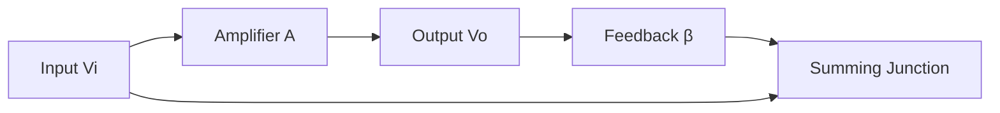
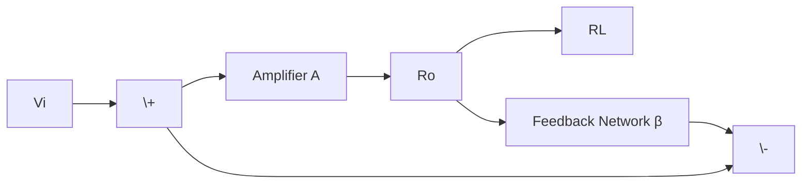
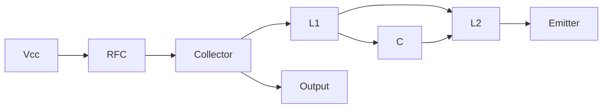
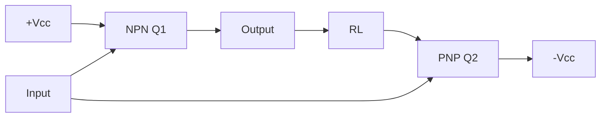
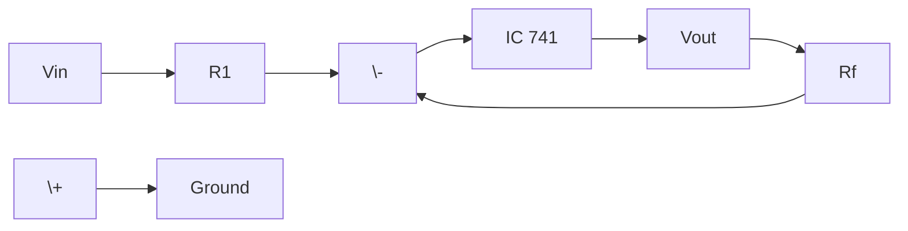
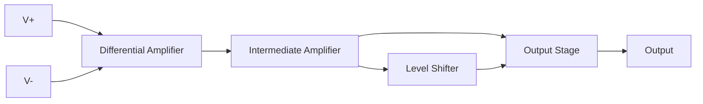

## Question 1(a) [3 marks]

**Explain effect of negative feedback on gain and stability.**

**Answer**:
Negative feedback significantly improves amplifier performance by reducing gain but enhancing stability and other parameters.

**Table:**

| Parameter | Effect of Negative Feedback |
|-----------|----------------------------|
| **Gain** | Reduces overall gain |
| **Stability** | Increases stability |
| **Bandwidth** | Increases bandwidth |

- **Gain reduction**: Makes amplifier more predictable
- **Stability improvement**: Reduces oscillations and distortions
- **Better control**: Provides consistent performance

**Mnemonic:** "Gain Goes Down, Stability Stays Strong"

## Question 1(b) [4 marks]

**State different types of feedback amplifier and advantages of negative feedback amplifier.**

**Answer**:
Four basic feedback topologies exist based on input and output connections.

**Table:**

| Type | Input Connection | Output Connection |
|------|------------------|-------------------|
| **Voltage Series** | Series | Voltage |
| **Voltage Shunt** | Shunt | Voltage |
| **Current Series** | Series | Current |
| **Current Shunt** | Shunt | Current |

**Advantages:**

- **Reduced distortion**: Minimizes harmonic content
- **Increased bandwidth**: Better frequency response
- **Improved stability**: Consistent operation

**Mnemonic:** "Very Smart Current Control"

## Question 1(c) [7 marks]

**Derive an equation for overall gain of negative feedback voltage amplifier.**

**Answer**:
For negative feedback amplifier, output is fed back to input in opposite phase.

**Circuit Analysis:**
Let A = Open loop gain, β = Feedback factor

**Diagram:**



**Derivation:**

- Input to amplifier: Vi - βVo
- Output: Vo = A(Vi - βVo)
- Vo = AVi - AβVo
- Vo + AβVo = AVi
- Vo(1 + Aβ) = AVi
- **Overall Gain: Af = A/(1 + Aβ)**

**Key Points:**

- **Denominator (1 + Aβ)**: Called loop gain
- **Stability factor**: Determines system response
- **Gain reduction**: Traded for better performance

**Mnemonic:** "Always Divide by (1 + Loop)"

## Question 1(c OR) [7 marks]

**Draw and explain current shunt type negative feedback amplifier and Derive the formula of input impedance and output impedance of it.**

**Answer**:
Current shunt feedback samples output current and feeds back voltage in shunt with input.

**Circuit Diagram:**



**Analysis:**

- **Feedback type**: Current sampling, voltage mixing
- **Input impedance**: Decreases due to shunt feedback
- **Output impedance**: Decreases due to current sampling

**Formulas:**

- **Input Impedance: Zif = Zi/(1 + Aβ)**
- **Output Impedance: Zof = Zo/(1 + Aβ)**

**Characteristics:**

- **Low input impedance**: Good for current sources
- **Low output impedance**: Good for voltage output
- **Current-to-voltage converter**: Useful in applications

**Mnemonic:** "Current Shunt Lowers Both Impedances"

## Question 2(a) [3 marks]

**Explain Barkhausen criteria for oscillations.**

**Answer**:
For sustained oscillations in feedback circuits, two conditions must be satisfied simultaneously.

**Table:**

| Criteria | Condition | Description |
|----------|-----------|-------------|
| **Magnitude** | \|Aβ\| = 1 | Loop gain unity |
| **Phase** | ∠Aβ = 0° or 360° | Zero phase shift |

- **Unity loop gain**: Ensures signal maintains amplitude
- **Zero phase shift**: Ensures positive feedback
- **Sustained oscillation**: Both conditions create self-sustaining signals

**Mnemonic:** "One Magnitude, Zero Phase"

## Question 2(b) [4 marks]

**Explain use of tank circuit with neat diagram.**

**Answer**:
Tank circuit provides frequency selective positive feedback for oscillator circuits.

**Circuit Diagram:**

```goat
    +---L---+
    |       |
    C       R
    |       |
    +-------+
```

**Operation:**
At resonant frequency, LC tank circuit exhibits:

**Table:**

| Parameter | Value | Effect |
|-----------|--------|--------|
| **Reactance** | XL = XC | Resonance |
| **Impedance** | Maximum | High selectivity |
| **Phase** | 0° | Unity feedback |

- **Energy storage**: L and C exchange energy
- **Frequency selection**: Sharp resonance characteristic
- **Oscillation sustenance**: Provides positive feedback

**Mnemonic:** "Tank Stores Energy, Selects Frequency"

## Question 2(c) [7 marks]

**Draw and explain the Hartley Oscillator. Also state equation of oscillation frequency of it.**

**Answer**:
Hartley oscillator uses tapped inductor in tank circuit for frequency generation.

**Circuit Diagram:**



**Operation:**

- **Tapped inductor**: L1 and L2 provide feedback
- **Tank circuit**: L1+L2 with C determines frequency
- **Positive feedback**: Phase shift through L1-L2 coupling

**Frequency Formula:**
**f = 1/[2π√((L1+L2)C)]**

**Key Features:**

- **Good frequency stability**: Inductor-based tuning
- **Easy tuning**: Variable inductor or capacitor
- **RF applications**: Suitable for high frequencies

**Mnemonic:** "Hartley Has Tapped inductor"

## Question 2(a OR) [3 marks]

**Explain term oscillator as positive feedback amplifier.**

**Answer**:
Oscillator generates AC signals using positive feedback without external input signal.

**Table:**

| Parameter | Amplifier | Oscillator |
|-----------|-----------|------------|
| **Input** | External signal | No external input |
| **Feedback** | May use negative | Uses positive |
| **Output** | Amplified input | Self-generated AC |

- **Self-sustaining**: Positive feedback maintains oscillation
- **Barkhausen criteria**: Loop gain = 1, phase = 0°
- **Signal generation**: Creates AC from DC supply

**Mnemonic:** "Positive feedback Powers Perpetual signals"

## Question 2(b OR) [4 marks]

**Draw and explain the Crystal Oscillator.**

**Answer**:
Crystal oscillator uses piezoelectric effect of quartz crystal for high stability.

**Circuit Diagram:**

```goat
         Vcc
          |
          R
          |
    +-----+-----+
    |           |
    |     Q     |
    |           |
    +-----+-----+
          |
        XTAL
          |
         GND
```

**Characteristics:**

**Table:**

| Property | Value | Advantage |
|----------|--------|-----------|
| **Stability** | ±0.01% | Very high |
| **Q factor** | >10,000 | Sharp resonance |
| **Temperature** | Low drift | Stable frequency |

- **Piezoelectric effect**: Mechanical vibration creates electrical signal
- **High Q**: Very stable frequency generation
- **Clock applications**: Used in digital systems

**Mnemonic:** "Crystal Creates Constant frequency"

## Question 2(c OR) [7 marks]

**Draw the Structure, symbol, equivalent circuit of UJT and explain it in brief.**

**Answer**:
UJT (Unijunction Transistor) is three-terminal device with unique switching characteristics.

**Structure:**

```goat
    B2 +-------+
       |   n   |
       |       |
    E  +   p   +
       |       |
       |   n   |
    B1 +-------+
```

**Symbol:**

```goat
    B2
     |
     +
    /|
   / |
  /  +--- E
     |
     +
     |
    B1
```

**Equivalent Circuit:**

```goat
    B2 +---R2---+
               |
    E  +-------+
               |
    B1 +---R1---+
```

**Operation:**

- **Intrinsic standoff ratio**: η = R1/(R1+R2)
- **Peak point voltage**: VP = ηVBB + VD
- **Negative resistance**: After peak point

**Applications:**

- **Relaxation oscillator**: Sawtooth wave generation
- **Trigger circuits**: SCR firing circuits
- **Timing applications**: RC charging circuits

**Mnemonic:** "UJT Uses Unique Junction Technology"

## Question 3(a) [3 marks]

**Classify power amplifier based on operating point.**

**Answer**:
Power amplifiers are classified based on transistor conduction angle and bias point.

**Table:**

| Class | Conduction Angle | Efficiency | Application |
|-------|------------------|------------|-------------|
| **Class A** | 360° | 25-50% | Audio, low power |
| **Class B** | 180° | 78.5% | Push-pull |
| **Class AB** | 180°-360° | 60-70% | Audio power |
| **Class C** | <180° | >90% | RF, tuned |

- **Bias point**: Determines operating class
- **Efficiency trade-off**: Higher efficiency, more distortion
- **Application specific**: Choose based on requirements

**Mnemonic:** "All Big Amplifiers Can deliver power"

## Question 3(b) [4 marks]

**Draw and Explain Complementary symmetry push-pull power amplifier.**

**Answer**:
Uses NPN and PNP transistors for efficient power amplification without center-tapped transformer.

**Circuit Diagram:**



**Operation:**

- **Positive half-cycle**: NPN conducts, PNP off
- **Negative half-cycle**: PNP conducts, NPN off
- **Complementary action**: Both transistors handle alternate half-cycles

**Advantages:**

- **No transformer**: Direct coupling to load
- **High efficiency**: Class B operation
- **Compact design**: Fewer components
- **Good power transfer**: Direct coupling

**Mnemonic:** "Complementary transistors Complete the cycle"

## Question 3(c) [7 marks]

**Derive an equation for Efficiency of class B push pull amplifier.**

**Answer**:
Class B push-pull amplifier has each transistor conducting for 180° of input cycle.

**Analysis:**
For sinusoidal input: Vi = Vm sin ωt

**Output Power:**

- Peak output voltage: Vom = Vcc
- RMS output voltage: Vo(rms) = Vcc/√2
- **Po = Vo²(rms)/RL = Vcc²/2RL**

**Input Power:**

- DC current (average): Idc = 2Im/π
- Where Im = Vcc/RL
- **Pin = Vcc × Idc = 2VccIm/π = 2Vcc²/πRL**

**Efficiency Calculation:**
**η = Po/Pin = (Vcc²/2RL)/(2Vcc²/πRL)**
**η = π/4 = 0.785 = 78.5%**

**Key Points:**

- **Maximum theoretical efficiency**: 78.5%
- **Class B advantage**: Much higher than Class A (25%)
- **Practical efficiency**: Slightly lower due to losses

**Mnemonic:** "Push-Pull Provides Pi/4 efficiency"

## Question 3(a OR) [3 marks]

**Differentiate between voltage and power amplifier.**

**Answer**:
Voltage and power amplifiers serve different purposes in electronic systems.

**Table:**

| Parameter | Voltage Amplifier | Power Amplifier |
|-----------|-------------------|-----------------|
| **Purpose** | Increase voltage | Increase power |
| **Load** | High impedance | Low impedance |
| **Efficiency** | Not critical | Very important |
| **Distortion** | Must be low | Moderate acceptable |
| **Coupling** | RC/Direct | Transformer |

- **Design priority**: Voltage gain vs power delivery
- **Application**: Signal processing vs driving loads
- **Circuit complexity**: Simple vs complex power stages

**Mnemonic:** "Voltage amplifies signal, Power drives load"

## Question 3(b OR) [4 marks]

**Explain Class AB power amplifier with diagram.**

**Answer**:
Class AB operates between Class A and Class B, reducing crossover distortion.

**Circuit Diagram:**

```goat
    +Vcc
      |
      R
      |
    +-+-+
    |   |
   Q1  Q2  
    |   |
    +---+--- Output
    |   |
   D1  D2
    |   |
    +---+
      |
      R
      |
    -Vcc
```

**Operation:**

- **Slight forward bias**: Both transistors slightly on
- **Conduction angle**: >180° but <360°
- **Overlap conduction**: Eliminates crossover distortion

**Characteristics:**

**Table:**

| Parameter | Value | Benefit |
|-----------|-------|---------|
| **Efficiency** | 60-70% | Better than Class A |
| **Distortion** | Low | Better than Class B |
| **Bias** | Slight forward | Compromise solution |

**Mnemonic:** "AB Avoids Bad crossover distortion"

## Question 3(c OR) [7 marks]

**Derive an equation for Efficiency of series fed class A power amplifier.**

**Answer**:
Series fed Class A amplifier has DC supply connected in series with load.

**Circuit Analysis:**

- **DC supply voltage**: Vcc
- **Quiescent current**: Icq = Vcc/2RL (for maximum power)
- **Quiescent voltage**: Vceq = Vcc/2

**AC Analysis:**

- **Maximum output voltage swing**: Vom = Vcc/2
- **Output power**: Po = Vom²/2RL = Vcc²/8RL

**DC Power:**

- **DC current**: Idc = Icq = Vcc/2RL
- **Input power**: Pin = Vcc × Idc = Vcc²/2RL

**Efficiency:**
**η = Po/Pin = (Vcc²/8RL)/(Vcc²/2RL)**
**η = 1/4 = 0.25 = 25%**

**Key Points:**

- **Maximum theoretical efficiency**: 25%
- **Power wastage**: 75% lost as heat
- **Design limitation**: Poor efficiency but good linearity

**Mnemonic:** "Class A Achieves quarter efficiency"

## Question 4(a) [3 marks]

**Draw pin diagram of IC 741 OP-AMP and explain it.**

**Answer**:
IC 741 is 8-pin dual-in-line package operational amplifier with industry standard pinout.

**Pin Diagram:**

```goat
    +---U---+
  1 |       | 8
    |  741  |
  2 |       | 7
    |       |
  3 |       | 6
    |       |
  4 |       | 5
    +-------+
```

**Pin Configuration:**

**Table:**

| Pin | Function | Description |
|-----|----------|-------------|
| **1** | Offset Null | Offset adjustment |
| **2** | Inverting Input | Negative input |
| **3** | Non-inverting Input | Positive input |
| **4** | -Vcc | Negative supply |
| **5** | Offset Null | Offset adjustment |
| **6** | Output | Amplifier output |
| **7** | +Vcc | Positive supply |
| **8** | NC | No connection |

**Mnemonic:** "Null, Negative, Positive, Negative supply, Null, Output, Positive supply, Nothing"

## Question 4(b) [4 marks]

**Define the following OP-AMP parameters. 1. Input offset voltage 2. CMRR**

**Answer**:
These parameters define the non-ideal characteristics of practical operational amplifiers.

**1. Input Offset Voltage (Vio):**

- **Definition**: DC voltage applied between inputs to make output zero
- **Typical value**: 1-5 mV for 741
- **Cause**: Mismatch in input transistors
- **Effect**: Output error in DC applications

**2. Common Mode Rejection Ratio (CMRR):**

- **Definition**: Ability to reject common signals at both inputs
- **Formula**: CMRR = Ad/Acm
- **Typical value**: 90 dB for 741
- **Importance**: Noise immunity

**Table:**

| Parameter | Symbol | Unit | Ideal | 741 Typical |
|-----------|--------|------|-------|-------------|
| **Input Offset Voltage** | Vio | mV | 0 | 2 |
| **CMRR** | - | dB | ∞ | 90 |

**Mnemonic:** "Offset creates Output error, CMRR Rejects common signals"

## Question 4(c) [7 marks]

**Explain inverting amplifier using IC 741 in detail.**

**Answer**:
Inverting amplifier uses negative feedback with input applied to inverting terminal.

**Circuit Diagram:**



**Analysis:**
Using virtual short concept:

- **V+ = V- = 0V** (virtual ground)
- **Input current**: I1 = Vin/R1
- **Feedback current**: If = Vout/Rf
- **Current balance**: I1 = If (no current into op-amp)

**Derivation:**

- Vin/R1 = -Vout/Rf
- **Voltage Gain: Av = -Rf/R1**

**Characteristics:**

**Table:**

| Parameter | Expression | Notes |
|-----------|------------|-------|
| **Voltage Gain** | -Rf/R1 | Negative sign |
| **Input Impedance** | R1 | Low impedance |
| **Output Impedance** | ~0Ω | Very low |
| **Bandwidth** | f = GBW/\|Av\| | Gain-bandwidth product |

**Applications:**

- **Signal inversion**: Phase reversal
- **Scale factor**: Programmable gain
- **AC amplification**: With coupling capacitors

**Mnemonic:** "Inverting Input gives Inverted output"

## Question 4(a OR) [3 marks]

**List characteristics of ideal OP-AMP.**

**Answer**:
Ideal op-amp represents perfect amplifier with theoretical limits for all parameters.

**Table:**

| Parameter | Ideal Value | Practical Impact |
|-----------|-------------|------------------|
| **Open Loop Gain** | ∞ | Perfect amplification |
| **Input Impedance** | ∞ | No input current |
| **Output Impedance** | 0Ω | Perfect voltage source |
| **Bandwidth** | ∞ | No frequency limitation |
| **CMRR** | ∞ | Perfect noise rejection |
| **Slew Rate** | ∞ | No slew rate limiting |
| **Input Offset** | 0V | No DC errors |

- **Perfect performance**: All parameters optimized
- **Design simplification**: Analysis becomes easier
- **Practical approximation**: Close to ideal in many applications

**Mnemonic:** "Infinite Input, Zero Output, Perfect Performance"

## Question 4(b OR) [4 marks]

**Draw and explain summing amplifier using Op-amp.**

**Answer**:
Summing amplifier adds multiple input voltages with programmable gain for each input.

**Circuit Diagram:**

```goat
V1 ---R1---+
           |
V2 ---R2---+--- (-) IC741 --- Vout
           |             |
V3 ---R3---+             |
                        Rf
           (+) --------GND
```

**Analysis:**
Using virtual ground concept (V- = 0V):

- **Current through R1**: I1 = V1/R1
- **Current through R2**: I2 = V2/R2  
- **Current through R3**: I3 = V3/R3
- **Total input current**: Iin = I1 + I2 + I3

**Output Equation:**
**Vout = -Rf(V1/R1 + V2/R2 + V3/R3)**

**Special Cases:**

- **Equal resistors**: Vout = -(Rf/R)(V1 + V2 + V3)
- **Unity gain**: Rf = R, Vout = -(V1 + V2 + V3)

**Applications:**

- **Audio mixing**: Multiple signal combination
- **Digital-to-analog**: Weighted resistor DAC
- **Signal processing**: Mathematical operations

**Mnemonic:** "Sum inputs, Scale by resistor ratios"

## Question 4(c OR) [7 marks]

**Explain differential amplifier using IC 741 in detail.**

**Answer**:
Differential amplifier amplifies the difference between two input signals while rejecting common signals.

**Circuit Diagram:**

```goat
V1 ---R1--- (-) 
            IC741 --- Vout
V2 ---R2--- (+)  |
              |  |
             R3  Rf
              |  |
             GND +
```

**Analysis:**
For the non-inverting input:

- **V+ = V2 × R3/(R2+R3)**

For the inverting input using virtual short:

- **V- = V+ = V2 × R3/(R2+R3)**

Using current balance:

- **(V1-V-)/R1 = (V--Vout)/Rf**

**Output Equation:**
When R1 = R2 and R3 = Rf:
**Vout = (Rf/R1)(V2 - V1)**

**Key Features:**

**Table:**

| Parameter | Value | Advantage |
|-----------|-------|-----------|
| **Differential Gain** | Rf/R1 | Amplifies difference |
| **Common Mode Gain** | ~0 | Rejects common signals |
| **CMRR** | Very high | Excellent noise immunity |

**Applications:**

- **Instrumentation**: Sensor signal processing
- **Noise rejection**: Differential signal transmission
- **Bridge circuits**: Strain gauge measurements

**Mnemonic:** "Difference amplified, Common rejected"

## Question 5(a) [3 marks]

**Draw the circuit of integrator using Op-amp and its input and output waveforms.**

**Answer**:
Op-amp integrator performs mathematical integration of input signal using RC feedback.

**Circuit Diagram:**

```goat
Vin ---R--- (-) IC741 --- Vout
              |        |
             (+)       C
              |        |
             GND      /
```

**Waveforms:**

```goat
Input (Square Wave):
     +V |‾‾|__|‾‾|__|‾‾
        |  |  |  |  |
      0 +--+--+--+--+-- t
        |  |  |  |  |
     -V    |__|  |__|

Output (Triangular):
      0 +  /\  /\  -- t
        | /  \/  \
     -V +/        \
```

**Operation:**

- **Integration function**: Vout = -(1/RC)∫Vin dt
- **Square wave input**: Produces triangular output
- **Ramp generation**: Constant input gives linear ramp

**Mnemonic:** "Integration creates Triangular from square"

## Question 5(b) [4 marks]

**State advantage and disadvantage of push-pull arrangement of power amplifier**

**Answer**:
Push-pull configuration uses two transistors operating in complementary fashion for power amplification.

**Advantages:**

**Table:**

| Advantage | Benefit | Application |
|-----------|---------|-------------|
| **High Efficiency** | Up to 78.5% | Battery operated |
| **No Transformer** | Compact design | Portable devices |
| **Low Distortion** | Better linearity | Audio systems |
| **Heat Distribution** | Shared between transistors | Thermal management |

**Disadvantages:**

| Disadvantage | Problem | Solution |
|-------------|---------|----------|
| **Crossover Distortion** | Dead zone at zero crossing | Class AB bias |
| **Component Matching** | Requires matched transistors | Careful selection |
| **Thermal Runaway** | Temperature coefficient mismatch | Thermal coupling |

**Applications:**

- **Audio amplifiers**: High fidelity systems
- **Motor drivers**: DC motor control
- **RF amplifiers**: Communication systems

**Mnemonic:** "Push-Pull Provides Power but Problems exist"

## Question 5(c) [7 marks]

**Draw and explain astable multivibrator using 555 timer IC.**

**Answer**:
Astable multivibrator generates continuous square wave output without external trigger using 555 timer.

**Circuit Diagram:**

```goat
    +Vcc
      |
      RA
      |
   +--+--+ (7)
   |     |
   RB   (2)+(6) 555 (3)--- Output
   |         |     |
   C        (1)   (4)
   |         |     |
  GND       GND   +Vcc
```

**Pin Connections:**

- **Pin 1**: Ground
- **Pin 2**: Trigger (connected to pin 6)
- **Pin 3**: Output
- **Pin 4**: Reset (+Vcc)
- **Pin 6**: Threshold
- **Pin 7**: Discharge
- **Pin 8**: +Vcc

**Operation:**

1. **Charging phase**: C charges through RA + RB
2. **Threshold reached**: At 2/3 Vcc, output goes LOW
3. **Discharging phase**: C discharges through RB
4. **Trigger reached**: At 1/3 Vcc, output goes HIGH
5. **Cycle repeats**: Continuous oscillation

**Timing Equations:**

- **HIGH time**: t1 = 0.693(RA + RB)C
- **LOW time**: t2 = 0.693(RB)C  
- **Total period**: T = t1 + t2 = 0.693(RA + 2RB)C
- **Frequency**: f = 1.44/[(RA + 2RB)C]
- **Duty cycle**: D = (RA + RB)/(RA + 2RB) × 100%

**Applications:**

- **Clock generation**: Digital systems
- **LED flasher**: Blinking circuits
- **Tone generation**: Audio oscillators
- **PWM generation**: Motor speed control

**Mnemonic:** "Astable Always oscillates Automatically"

## Question 5(a OR) [3 marks]

**Draw the block diagram of Op-amp and explain it.**

**Answer**:
Op-amp internal structure consists of multiple stages for high gain and performance.

**Block Diagram:**



**Stage Functions:**

**Table:**

| Stage | Function | Characteristics |
|-------|----------|----------------|
| **Differential Input** | High input impedance | Low offset, high CMRR |
| **Intermediate Amplifier** | High voltage gain | Most of the gain |
| **Level Shifter** | DC level adjustment | Couples AC stages |
| **Output Stage** | Low output impedance | Current buffer |

- **High gain**: Typically 100,000 or more
- **Wide bandwidth**: MHz range capability  
- **Low output impedance**: Drives various loads

**Mnemonic:** "Differential Input, Intermediate gain, Level shift, Output buffer"

## Question 5(b OR) [4 marks]

**Explain about the terms related to power amplifier. i) Efficiency ii) Distortion.**

**Answer**:
These parameters determine power amplifier performance and suitability for applications.

**i) Efficiency (η):**

- **Definition**: Ratio of AC output power to DC input power
- **Formula**: η = Po(AC)/Pin(DC) × 100%
- **Importance**: Determines heat dissipation and battery life

**Efficiency Comparison:**

**Table:**

| Class | Efficiency | Application |
|-------|------------|-------------|
| **A** | 25% | Low power, high fidelity |
| **B** | 78.5% | Push-pull amplifiers |
| **AB** | 60-70% | Audio amplifiers |
| **C** | >90% | RF applications |

**ii) Distortion:**

- **Definition**: Unwanted changes in output signal shape
- **Types**: Harmonic, intermodulation, crossover
- **Measurement**: Total Harmonic Distortion (THD)

**Distortion Sources:**

- **Nonlinearity**: Transistor characteristics
- **Crossover**: Dead zone in push-pull
- **Thermal effects**: Temperature variations

**Mnemonic:** "Efficiency measures Energy use, Distortion shows signal Degradation"

## Question 5(c OR) [7 marks]

**Draw pin diagram of 555 timer IC. Also draw circuit diagram of two stage sequential timer using 555 timer IC.**

**Answer**:
555 timer is versatile IC used for timing applications with standard 8-pin package.

**Pin Diagram:**

```goat
    +---U---+
  1 |       | 8  +Vcc
GND |  555  | 7  Discharge
    |       |
  2 |       | 6  Threshold
Trig|       |
    |       | 5  Control
  3 |       |
Out |       | 4  Reset
    +-------+
```

**Pin Functions:**

**Table:**

| Pin | Name | Function |
|-----|------|----------|
| **1** | Ground | Common ground |
| **2** | Trigger | Starts timing cycle |
| **3** | Output | Timer output |
| **4** | Reset | Resets timer |
| **5** | Control | Voltage reference |
| **6** | Threshold | Stops timing cycle |
| **7** | Discharge | Discharges timing capacitor |
| **8** | Vcc | Supply voltage |

**Two Stage Sequential Timer Circuit:**

```goat
First Stage (555A):
    +Vcc
      |
      R1
      |
   +--+--+ (7)
   |     |
   R2   (2)+(6) 555A (3)---+
   |         |      |      |
   C1       (1)    (4)     |
   |         |      |      |
  GND       GND    +Vcc    |
                           |
Second Stage (555B):       |
    +Vcc                   |
      |                    |
      R3                   |
      |                    |
   +--+--+ (7)             |
   |     |                 |
   R4   (2) 555B (3)--- Output
   |     |   |      |
   C2   (6) (1)    (4)
   |     |   |      |
  GND----+--GND    +Vcc
         |
         +----------+
```

**Operation:**

1. **First timer**: Operates in monostable mode
2. **Trigger applied**: First timer gives output pulse
3. **Output duration**: T1 = 1.1 × R2 × C1
4. **Second timer**: Triggered by first timer's output
5. **Sequential operation**: Second timer starts after first completes
6. **Total delay**: T1 + T2 where T2 = 1.1 × R4 × C2

**Applications:**

- **Delay circuits**: Sequential switching
- **Traffic lights**: Timed sequence control
- **Industrial automation**: Process timing
- **Motor control**: Start-stop sequences

**Timing Equations:**

- **Stage 1 delay**: T1 = 1.1 R2 C1
- **Stage 2 delay**: T2 = 1.1 R4 C2
- **Total sequence time**: Ttotal = T1 + T2

**Key Features:**

- **Independent timing**: Each stage separately adjustable
- **Sequential operation**: No overlap between stages
- **Reliable switching**: Clean digital transitions
- **Easy design**: Simple component calculation

**Mnemonic:** "Sequential Stages Start Separately"
