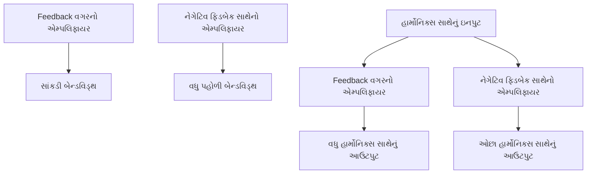
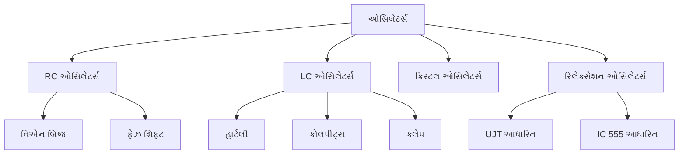
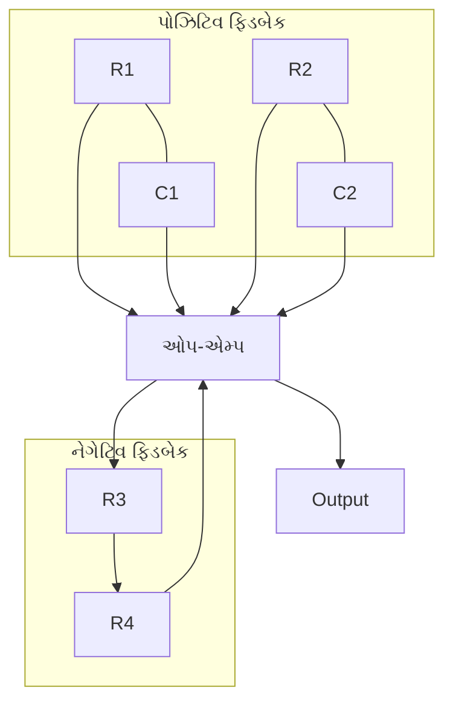
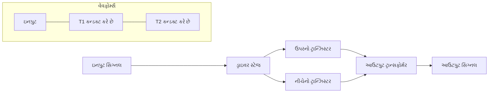
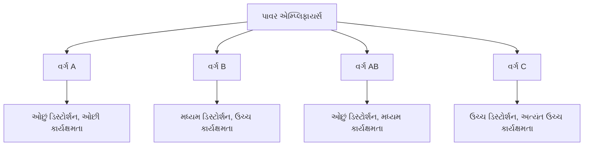
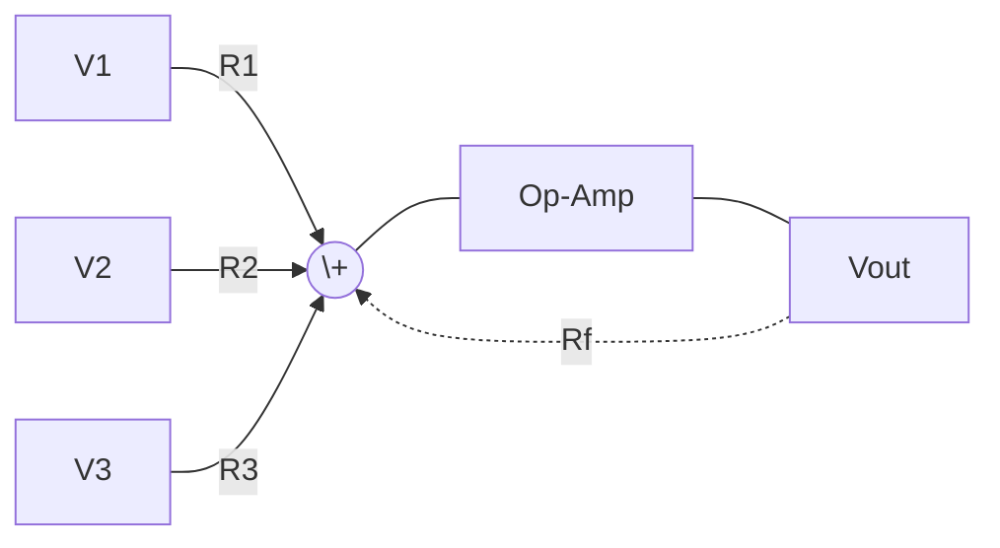
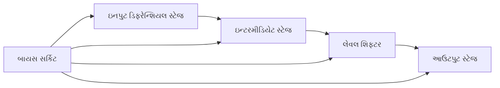
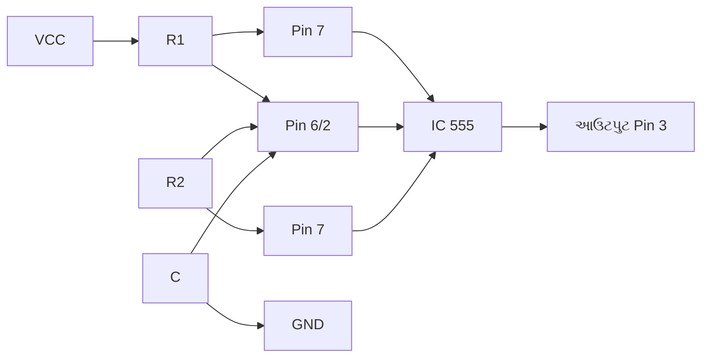
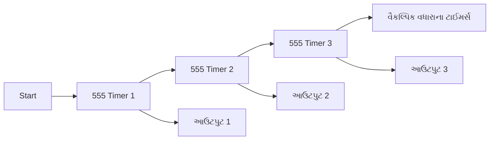
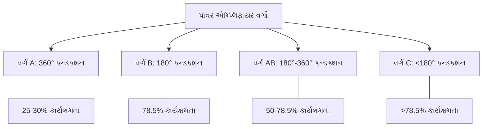

## પ્રશ્ન 1(અ) [3 ગુણ]

**નેગેટિવ ફિડબેક શું છે? નેગેટિવ ફિડબેકના ફાયદા અને ગેરફાયદાની સૂચિ બનાવો.**

**જવાબ**:
નેગેટિવ ફિડબેક એટલે આઉટપુટ સિગ્નલનો એક ભાગ 180° ફેઝ શિફ્ટ સાથે ઇનપુટમાં પાછો મોકલવો જેથી ઇનપુટ સિગ્નલમાં ઘટાડો થાય.

| ફાયદા | ગેરફાયદા |
|------------|---------------|
| સ્થિરતામાં વધારો | ગેઇનમાં ઘટાડો |
| ડિસ્ટોર્શનમાં ઘટાડો | જટિલ સર્કિટ ડિઝાઇન |
| બેન્ડવિડ્થમાં વધારો | વધુ ઘટકોની જરૂર |
| નોઈઝમાં ઘટાડો | વધુ પાવર વપરાશ |

**મેમરી ટ્રીક:** "SIRS" - Stability Improved, Reduced distortion, Sensitivity decreased

## પ્રશ્ન 1(બ) [4 ગુણ]

**એમ્પલિફાયરના ફ્રિક્વન્સી રિસ્પોન્સ અને ડિસ્ટોર્શન ઉપર નેગેટિવ ફિડબેકની અસર સમજાવો.**

**જવાબ**:
નેગેટિવ ફિડબેક એમ્પલિફાયરમાં ફ્રિક્વન્સી રિસ્પોન્સ સુધારે છે અને ડિસ્ટોર્શન ઘટાડે છે.

**આકૃતિ:**



| અસર | ફિડબેક વગર | નેગેટિવ ફિડબેક સાથે |
|-----------|------------------|------------------------|
| ફ્રિક્વન્સી રિસ્પોન્સ | સાંકડી બેન્ડવિડ્થ | વધુ પહોળી બેન્ડવિડ્થ |
| ડિસ્ટોર્શન | વધુ હાર્મોનિક્સ | ઓછા હાર્મોનિક્સ |

**મેમરી ટ્રીક:** "WIDE" - With negative feedback, Improved response, Distortion reduced, Extended bandwidth

## પ્રશ્ન 1(ક) [7 ગુણ]

**નેગેટિવ ફિડબેક વોલ્ટેજ એમ્પલિફાયરના ઓવરઓલ ગેઇન માટે સમીકરણ તારવો.**

**જવાબ**:
નેગેટિવ ફિડબેક વોલ્ટેજ એમ્પલિફાયરના ઓવરઓલ ગેઇન માટેનું સમીકરણ નીચે મુજબ તારવી શકાય:

**આકૃતિ:**

```goat
    Input +-----+      +-------+
    Vi -->|  Σ  |----->|       |----> Vo (Output)
          +-----+      |   A   |
             ^         |       |
             |         +-------+
             |             |
             |         +-------+
             +---------|   β   |
                       +-------+
```

- **ઇનપુટ સમીકરણ**: V' = Vi - βVo
- **આઉટપુટ સમીકરણ**: Vo = AV'
- **બંનેને જોડતા**: Vo = A(Vi - βVo)
- **Vo માટે ઉકેલતા**: Vo = AVi - AβVo
- **ફેરવીને**: Vo(1 + Aβ) = AVi
- **અંતિમ સમીકરણ**: Vo/Vi = A/(1 + Aβ) = Af

**મેમરી ટ્રીક:** "LOOP" - Look at Original Open-loop gain and Proceed with feedback

## પ્રશ્ન 1(ક) OR [7 ગુણ]

**વોલ્ટેજ શંટ એમ્પ્લીફાયર અને વર્તમાન શ્રેણીના એમ્પ્લીફાયરની તુલના કરો.**

**જવાબ**:

| પેરામીટર | વોલ્ટેજ શંટ એમ્પ્લીફાયર | વર્તમાન શ્રેણી એમ્પ્લીફાયર |
|-----------|-------------------------|--------------------------|
| ઇનપુટ | વોલ્ટેજ | વર્તમાન |
| આઉટપુટ | વર્તમાન | વોલ્ટેજ |
| ફિડબેક નેટવર્ક જોડાણ | ઇનપુટ પર સમાંતર | ઇનપુટ પર શ્રેણીમાં |
| ઇનપુટ ઇમ્પિડન્સ | ઘટાડો | વધારો |
| આઉટપુટ ઇમ્પિડન્સ | વધારો | ઘટાડો |
| ગેઇન | વર્તમાન ગેઇનમાં ઘટાડો | વોલ્ટેજ ગેઇનમાં ઘટાડો |
| એપ્લિકેશન | વર્તમાન એમ્પલિફિકેશન | વોલ્ટેજ એમ્પલિફિકેશન |

**આકૃતિ:**


**મેમરી ટ્રીક:** "VICS" - Voltage shunt In, Current out; Series has opposite

## પ્રશ્ન 2(અ) [3 ગુણ]

**ઓસિલેશન માટે Barkhausen's criteriaની ચર્ચા કરો.**

**જવાબ**:
Barkhausen's criteria અનુસાર સતત ઓસિલેશન માટે, નીચેની શરતો પૂરી થવી જોઈએ:

| ક્રાઇટેરિયા | જરૂરિયાત |
|----------|-------------|
| લૂપ ગેઇન | \|Aβ\| = 1 (મેગ્નિટ્યુડ 1 જેટલી) |
| ફેઝ શિફ્ટ | લૂપમાં કુલ ફેઝ શિફ્ટ = 0° અથવા 360° |

**આકૃતિ:**

```goat
    +-------+      +-------+
    |       |----->|       |--+
    |   A   |      |   β   |  |
    |       |<-----|       |<-+
    +-------+      +-------+
```

**મેમરી ટ્રીક:** "LOOP" - Loop gain One, Oscillation needs Phase shift zero

## પ્રશ્ન 2(બ) [4 ગુણ]

**હાર્ટલી ઓસીલેટર અને કોલપીટ્સ ઓસીલેટરનો સર્કિટ ડાયાગ્રામ દોરો.**

**જવાબ**:

**હાર્ટલી ઓસીલેટર:**

```goat
    +-----+     +----||-----+
    |     |     |           |
    +     |     C1          |
   ===    +-----+           |
   GND    |     |           |
          |     Z    +------+
          |     Z    |      |
          |     Z    |      |
          +-----+    |      |
            L1  |    |  L2  |
                |    |      |
                +----+------+
                |    |
                |    |
          +-----+    +-----+
          |     |    |     |
          |  Q  |    |     |
          |     |    |     |
          +--+--+    |     |
             |       |     |
             +-------+     |
             |             |
            === GND        |
                           |
    +----||----------------+
    |       C2
    |
   === GND
```

**કોલપીટ્સ ઓસીલેટર:**

```goat
    +-----+     +----||----+
    |     |     |     C1    |
    +     |     |           |
   ===    +-----+           |
   GND    |     |           |
          |     |    +------+
          |     |    |      |
          |     Z    |      |
          +-----Z    |      |
            L   Z    |      |
                |    |      |
                |    |      |
                +----+------+
                |    |
                |    |
          +-----+    +-----+
          |     |    |     |
          |  Q  |    |     |
          |     |    |     |
          +--+--+    |     |
             |       |     |
             +-------+     |
             |             |
            === GND        |
             |             |
             +-------------+
             |
            ===
            C2
            ===
            GND
```

**મેમરી ટ્રીક:** "HaLs CoCs" - Hartley has inductors in series, Colpitts has Capacitors in series

## પ્રશ્ન 2(ક) [7 ગુણ]

**UJT ને રિલેક્સેશન ઓસિલેટર તરીકે સમજાવો**

**જવાબ**:
UJT (Unijunction Transistor) કૅપેસિટરને વારંવાર ચાર્જ અને ડિસ્ચાર્જ કરીને રિલેક્સેશન ઓસિલેટર તરીકે કામ કરે છે.

**આકૃતિ:**

```goat
         RB1
    B2 +---/\/\/\---+ VCC
         |          |
         |          |
         |          |
    +----|          |
    |    |          |
    |    |  UJT     |
    |    |          |
    |    |          |
    |    |          |
    |    +----------+ B1
    |    |
    |    |
    |    |
    C    R
    |    |
    |    |
    +----+----+ GND
```

| ફેઝ | વર્ણન |
|-------|-------------|
| ચાર્જિંગ | કેપેસિટર R દ્વારા ચાર્જ થાય છે જ્યાં સુધી વોલ્ટેજ VP (પીક વોલ્ટેજ) સુધી ન પહોંચે |
| ફાયરિંગ | જ્યારે એમિટર વોલ્ટેજ VP પર પહોંચે ત્યારે UJT ચાલુ થાય છે |
| ડિસ્ચાર્જ | કેપેસિટર UJT દ્વારા ઝડપથી ડિસ્ચાર્જ થાય છે |
| રીસેટ | વોલ્ટેજ વેલી વોલ્ટેજ કરતાં નીચે જાય છે, UJT બંધ થાય છે, ચક્ર ફરીથી શરૂ થાય છે |

- **ઇન્ટ્રિન્સિક સ્ટેન્ડઓફ રેશિયો**: η = RB1/(RB1+RB2)
- **પીક વોલ્ટેજ**: VP = η×VBB + VD
- **ફ્રિક્વન્સી**: f = 1/[R×C×ln(1/(1-η))]

**મેમરી ટ્રીક:** "CFDR" - Charge, Fire, Discharge, Repeat

## પ્રશ્ન 2(અ) OR [3 ગુણ]

**ઓસિલેટરનું વર્ગીકરણ કરો.**

**જવાબ**:

| વર્ગીકરણ | પ્રકાર |
|----------------|-------|
| ફિડબેક આધારિત | RC, LC, ક્રિસ્ટલ |
| વેવફોર્મ આધારિત | સાઇન્યુસોઇડલ, નોન-સાઇન્યુસોઇડલ |
| ફ્રિક્વન્સી આધારિત | ઓડિયો, રેડિયો, VHF, UHF |
| સર્કિટ આધારિત | હાર્ટલી, કોલપીટ્સ, વિએન-બ્રિજ, RC-ફેઝ શિફ્ટ |

**આકૃતિ:**



**મેમરી ટ્રીક:** "SRLC" - Sine waves from RC, LC, and Crystal oscillators

## પ્રશ્ન 2(બ) OR [4 ગુણ]

**UJT નું બાંધકામ તેના પ્રતીક (સિમ્બોલ) સાથે સમજાવો.**

**જવાબ**:
UJT (Unijunction Transistor) માં હલકા ડોપ્ડ N-પ્રકારના સિલિકોન બાર હોય છે જેમાં બંને છેડે ઇલેક્ટ્રિકલ કનેક્શન (બેઝિસ) અને P-પ્રકારના એમિટર જંક્શન હોય છે.

**આકૃતિ:**

```goat
    સિમ્બોલ:               સ્ટ્રક્ચર:
    
      B2                     B2
       |                      |
       |                  +---+---+
       |                  |   |   |
       +---+          +---+---+---+---+
           |          |   |   |   |   |
           +          |   | N-type    |
           |          |   |   |   |   |
       +---+          |   +---+---+   |
       |              |       |       |
       |              |       |       |
       E              |       | P     |
       |              |       |       |
       |              +-------+-------+
       |                      |
       |                      |
       |                      |
      B1                     B1
```

| ઘટક | વર્ણન |
|-----------|-------------|
| બેઝ 1 (B1) | N-પ્રકારના બારના એક છેડા સાથે જોડાયેલ |
| બેઝ 2 (B2) | N-પ્રકારના બારના બીજા છેડા સાથે જોડાયેલ |
| એમિટર (E) | N-પ્રકારના બારમાં ડિફ્યુઝ થયેલ P-પ્રકારના ક્ષેત્ર સાથે જોડાયેલ |
| RB1 | એમિટર અને B1 વચ્ચેનો રેઝિસ્ટન્સ |
| RB2 | એમિટર અને B2 વચ્ચેનો રેઝિસ્ટન્સ |

**મેમરી ટ્રીક:** "BEB" - Bases at Ends, Emitter in Between

## પ્રશ્ન 2(ક) OR [7 ગુણ]

**વેન બ્રિજ ઓસિલેટર સર્કિટનું કાર્ય સમજાવો.તેની એપ્લિકેશનની યાદી બનાવો.**

**જવાબ**:
વેન બ્રિજ ઓસિલેટર પોઝિટિવ ફિડબેક માટે RC નેટવર્ક અને એમ્પ્લિટ્યુડ સ્ટેબિલિટી માટે નેગેટિવ ફિડબેક વાપરીને સાઇન વેવ્સ ઉત્પન્ન કરે છે.

**આકૃતિ:**



| ઘટક | કાર્ય |
|-----------|----------|
| R1, C1 (શ્રેણીમાં) | પોઝિટિવ ફિડબેક, ફેઝ લીડ |
| R2, C2 (સમાંતર) | પોઝિટિવ ફિડબેક, ફેઝ લેગ |
| R3, R4 | નેગેટિવ ફિડબેક, એમ્પ્લિટ્યુડ નિયંત્રણ |
| ઓપ-એમ્પ | એક્ટિવ એમ્પ્લિફાયર એલિમેન્ટ |

**એપ્લિકેશન્સ:**

- ઓડિયો સિગ્નલ જનરેટર્સ
- ફંક્શન જનરેટર્સ
- મ્યુઝિકલ ઇન્સ્ટ્રુમેન્ટ ટ્યુનિંગ
- ટેસ્ટ ઇક્વિપમેન્ટ
- ફિલ્ટર સર્કિટ્સ

**મેમરી ટ્રીક:** "APPS" - Audio Production, Pure Sine waves, Stable frequency

## પ્રશ્ન 3(અ) [3 ગુણ]

**વોલ્ટેજ અને પાવર એમ્પ્લીફાયર વચ્ચે તફાવત કરો.**

**જવાબ**:

| પેરામીટર | વોલ્ટેજ એમ્પ્લિફાયર | પાવર એમ્પ્લિફાયર |
|-----------|-------------------|-----------------|
| મુખ્ય કાર્ય | વોલ્ટેજ લેવલ વધારે છે | પાવર લેવલ વધારે છે |
| આઉટપુટ | ઓછી વર્તમાન ક્ષમતા | ઉચ્ચ વર્તમાન ક્ષમતા |
| કાર્યક્ષમતા | મહત્વપૂર્ણ નથી | અત્યંત મહત્વપૂર્ણ |
| હીટ ડિસિપેશન | ઓછું | ઉચ્ચ, હીટ સિંક જરૂરી |
| બાયસિંગ | સામાન્ય રીતે ક્લાસ A | ક્લાસ A, B, AB, અથવા C |
| એપ્લિકેશન્સ | પ્રી-એમ્પ્લિફિકેશન સ્ટેજ | સ્પીકર્સ, મોટર્સ ડ્રાઇવિંગ |

**મેમરી ટ્રીક:** "VICE" - Voltage amplifiers Increase voltage, Current not important, Efficiency not critical

## પ્રશ્ન 3(બ) [4 ગુણ]

**વર્ગ B પુશ પુલ એમ્પ્લીફાયરની કાર્યક્ષમતા માટે સમીકરણ મેળવો.**

**જવાબ**:
વર્ગ B પુશ-પુલ એમ્પ્લિફાયરની કાર્યક્ષમતા (η) નીચે મુજબ મેળવવામાં આવે છે:

**આકૃતિ:**

```goat
          +VCC
           |
           |
    +------+------+
    |             |
    |      T1     |
   +++            |
    |             |
   +++     +------+------+
    |      |      |      |
Input+---+ |      |      +---+Output
    |      |      |      |
   +++     +------+------+
    |             |
    |      T2     |
    +------+------+
           |
           |
          -VCC
```

- **AC પાવર આઉટપુટ**: P₀ = Vrms × Irms = (Vm/√2) × (Im/√2) = Vm × Im/2
- **DC પાવર ઇનપુટ**: PDC = VCC × IDC = VCC × (2×Im/π)
- **કાર્યક્ષમતા**: η = P₀/PDC = (Vm×Im/2)/(VCC×2×Im/π) = (Vm×π)/(4×VCC)
- **મહત્તમ સ્વિંગ માટે**: Vm = VCC, તેથી η = π/4 = 78.5%

**મેમરી ટ્રીક:** "POP" - Push-pull Output Power = π/4 or 78.5%

## પ્રશ્ન 3(ક) [7 ગુણ]

**વેવફોર્મ અને તેની કાર્યક્ષમતા સાથે વર્ગ-બી પુશ પુલ એમ્પ્લીફાયરનું કાર્ય સમજાવો.**

**જવાબ**:
વર્ગ B પુશ-પુલ એમ્પ્લિફાયર ઇનપુટ વેવફોર્મના વિપરીત અર્ધચક્રોને એમ્પ્લિફાય કરવા માટે બે ટ્રાન્ઝિસ્ટર્સનો ઉપયોગ કરે છે.

**આકૃતિ:**



| ફેઝ | વર્ણન |
|-------|-------------|
| પોઝિટિવ અર્ધચક્ર | ઉપરનો ટ્રાન્ઝિસ્ટર (T1) કન્ડક્ટ કરે છે, T2 બંધ હોય છે |
| નેગેટિવ અર્ધચક્ર | નીચેનો ટ્રાન્ઝિસ્ટર (T2) કન્ડક્ટ કરે છે, T1 બંધ હોય છે |
| ક્રોસઓવર | બંને ટ્રાન્ઝિસ્ટર્સ કટઓફ નજીક હોય છે, જેનાથી ડિસ્ટોર્શન થાય છે |

**મુખ્ય મુદ્દાઓ:**

- **કાર્યક્ષમતા**: આશરે 78.5% (π/4)
- **કન્ડક્શન એંગલ**: દરેક ટ્રાન્ઝિસ્ટર માટે 180°
- **ક્રોસઓવર ડિસ્ટોર્શન**: શૂન્ય ક્રોસિંગ નજીક બંને ટ્રાન્ઝિસ્ટર્સ બંધ હોવાને કારણે
- **ફાયદા**: ઉચ્ચ કાર્યક્ષમતા, ઓછી ગરમી, ઉચ્ચ પાવર માટે યોગ્ય

**મેમરી ટ્રીક:** "HOPE" - Half cycle Operation, Push-pull, Efficiency high

## પ્રશ્ન 3(અ) OR [3 ગુણ]

**પાવર એમ્પ્લીફાયરનું વર્ગીકરણ સમજાવો.**

**જવાબ**:

| વર્ગ | કન્ડક્શન એંગલ | કાર્યક્ષમતા | ડિસ્ટોર્શન |
|-------|------------------|------------|------------|
| વર્ગ A | 360° | 25-30% | ઓછું |
| વર્ગ B | 180° | 78.5% | મધ્યમ |
| વર્ગ AB | 180°-360° | 50-78.5% | ઓછું-મધ્યમ |
| વર્ગ C | <180° | >78.5% | ઉચ્ચ |

**આકૃતિ:**



**મેમરી ટ્રીક:** "ABCE" - As Biasing Changes, Efficiency increases

## પ્રશ્ન 3(બ) OR [4 ગુણ]

**વર્ગ A પાવર એમ્પ્લીફાયરની કાર્યક્ષમતા માટે સમીકરણ મેળવો.**

**જવાબ**:
વર્ગ A પાવર એમ્પ્લિફાયરની કાર્યક્ષમતા નીચે મુજબ મેળવવામાં આવે છે:

**આકૃતિ:**

```goat
     +VCC
       |
       |
       Z
       Z RL
       Z
       |
       +---+Output
       |
       |
       Q
       |
       |
     Input
       |
      GND
```

- **મહત્તમ AC પાવર આઉટપુટ**: P₀ = (Vrms)²/RL = (VCC/2√2)²/RL = VCC²/8RL
- **DC પાવર ઇનપુટ**: PDC = VCC × IDC = VCC × (VCC/2RL) = VCC²/2RL
- **કાર્યક્ષમતા**: η = P₀/PDC = (VCC²/8RL)/(VCC²/2RL) = 1/4 = 25%

**મેમરી ટ્રીક:** "ONE" - Output Never Exceeds 25% efficiency in Class A

## પ્રશ્ન 3(ક) OR [7 ગુણ]

**વેવફોર્મ અને તેની કાર્યક્ષમતા સાથે વર્ગ-A ટ્રાન્સફોર્મર કપલ્ડ એમ્પ્લીફાયરનું કાર્ય સમજાવો.**

**જવાબ**:
વર્ગ A ટ્રાન્સફોર્મર કપલ્ડ એમ્પ્લિફાયર આઉટપુટ કપલિંગ માટે ટ્રાન્સફોર્મરનો ઉપયોગ કરીને સંપૂર્ણ ઇનપુટ સાયકલ (360°) માટે કન્ડક્ટ કરે છે.

**આકૃતિ:**

```goat
     +VCC
       |
       |
    +--+--+
    |     |
    | Pri |
    |     |
    +--+--+
       |
       +---+
       |   |
    Q  |   |
       |   |
       |   +--+Output
       |      |
      === C   +--+--+
       |      |     |
      GND     | Sec |
              |     |
              +--+--+
                 |
                GND
```

| ઘટક | કાર્ય |
|-----------|----------|
| ટ્રાન્સફોર્મર | ઇમ્પિડન્સ મેચિંગ, DC દૂર કરે, આઇસોલેશન આપે |
| ટ્રાન્ઝિસ્ટર | સંપૂર્ણ 360° સાયકલ માટે કન્ડક્ટ કરે |
| કેપેસિટર | AC કપલિંગ |
| VCC | DC પાવર સપ્લાય |

**વેવફોર્મ લક્ષણો:**

- ઇનપુટ અને આઉટપુટ વેવફોર્મ્સ ફેઝમાં હોય છે
- ક્રોસઓવર ડિસ્ટોર્શન નથી
- સંપૂર્ણ સાયકલ એમ્પ્લિફિકેશન
- ઓછી કાર્યક્ષમતા (25%)
- ઓછું ડિસ્ટોર્શન

**મેમરી ટ્રીક:** "FACT" - Full cycle Amplification in Class-a with Transformer

## પ્રશ્ન 4(અ) [3 ગુણ]

**વ્યાખ્યાયિત કરો (i) CMRR (ii) સ્લ્યુ રેટ**

**જવાબ**:

| પેરામીટર | વ્યાખ્યા | પ્રમાણભૂત મૂલ્ય |
|-----------|------------|---------------|
| CMRR | કોમન મોડ રિજેક્શન રેશિયો, ડિફરેન્શિયલ ગેઇનનો કોમન મોડ ગેઇન સાથેનો ગુણોત્તર | 90 dB (IC 741) |
| સ્લ્યુ રેટ | આઉટપુટ વોલ્ટેજના પરિવર્તનનો સમય એકમ દીઠ મહત્તમ દર | 0.5 V/μs (IC 741) |

**CMRR**: CMRR = 20 log₁₀(Ad/Acm) જ્યાં Ad એ ડિફરેન્શિયલ ગેઇન અને Acm એ કોમન મોડ ગેઇન છે

**સ્લ્યુ રેટ**: SR = dVout/dt (V/μs)

**મેમરી ટ્રીક:** "CRiSp" - CMRR Rejects common signals, Slew Rate limits speed

## પ્રશ્ન 4(બ) [4 ગુણ]

**સ્કેચ સાથે ઓપરેશનલ એમ્પ્લીફાયરના ઇન્વર્ટિંગ એમ્પ્લીફાયર સમજાવો.**

**જવાબ**:
ઇન્વર્ટિંગ એમ્પ્લિફાયર નેગેટિવ ફિડબેકનો ઉપયોગ કરીને 180° ફેઝ શિફ્ટ સાથે ગેઇન પ્રદાન કરે છે.

**આકૃતિ:**

```goat
        Rf
    +---/\/\/\---+
    |            |
    |            |
    |    +-------+
    |    |       |
    |    |   +   |
Vin +----+---+   +----+ Vout
    Ri   |   -   |
         |       |
         +-------+
              |
              |
             === GND
```

| ઘટક | કાર્ય |
|-----------|----------|
| Ri | ઇનપુટ રેઝિસ્ટર |
| Rf | ફિડબેક રેઝિસ્ટર |
| ઓપ-એમ્પ | ઉચ્ચ ગેઇન સાથે સિગ્નલને એમ્પ્લિફાય કરે |

**મુખ્ય સમીકરણો:**

- **ગેઇન**: A = -Rf/Ri
- **ઇનપુટ ઇમ્પિડન્સ**: Z = Ri
- **બેન્ડવિડ્થ**: ઓપ-એમ્પ અને ગેઇન પર આધારિત

**મેમરી ટ્રીક:** "IRON" - Inverting, Resistance ratio gives gain, Output Negative phase

## પ્રશ્ન 4(ક) [7 ગુણ]

**Op-amp ને સમિંગ એમ્પ્લીફાયર તરીકે સમજાવો.**

**જવાબ**:
સમિંગ એમ્પ્લિફાયર ભારિત યોગદાન સાથે બહુવિધ ઇનપુટ સિગ્નલોને ઉમેરે છે.

**આકૃતિ:**



**સર્કિટ:**

```goat
       R1             Rf
    +--/\/\/\--+---/\/\/\---+
    |          |            |
V1  |          |            |
    +          |    +-------+
               |    |       |
    +--/\/\/\--+    |   +   |
    |          |----+---+   +----+ Vout
V2  +   R2     |    |   -   |
               |    |       |
    +--/\/\/\--+    +-------+
    |          |        |
V3  +   R3     |        |
               |       === GND
              === GND
```

| પેરામીટર | મૂલ્ય |
|-----------|-------|
| આઉટપુટ વોલ્ટેજ | Vout = -(Rf/R1)V1 - (Rf/R2)V2 - (Rf/R3)V3 ... |
| દરેક ઇનપુટ માટે ગેઇન | -Rf/Rn જ્યાં Rn ઇનપુટ રેઝિસ્ટર છે |
| સમાન ભારિત સમિંગ | બધા ઇનપુટ રેઝિસ્ટર્સ સમાન: R1 = R2 = R3 = Rf |

**એપ્લિકેશન્સ:**

- ઓડિયો મિક્સર્સ
- સિગ્નલ પ્રોસેસિંગ
- એનેલોગ કમ્પ્યુટર્સ
- ભારિત સરેરાશ

**મેમરી ટ્રીક:** "SARI" - Summing Amplifier Requires Inverting configuration

## પ્રશ્ન 4(અ) OR [3 ગુણ]

**ઓપરેશનલ એમ્પ્લિફાયરના મૂળભૂત બ્લોક ડાયાગ્રામનું સ્કેચ કરો.**

**જવાબ**:

**આકૃતિ:**



| સ્ટેજ | કાર્ય |
|-------|----------|
| ઇનપુટ ડિફરેન્શિયલ સ્ટેજ | ઉચ્ચ ઇનપુટ ઇમ્પિડન્સ, કોમન મોડ સિગ્નલોને રિજેક્ટ કરે |
| ઇન્ટરમીડિયેટ સ્ટેજ | ઉચ્ચ ગેઇન, ફ્રિક્વન્સી કમ્પેનસેશન |
| લેવલ શિફ્ટર | આઉટપુટ સ્ટેજ માટે DC લેવલ શિફ્ટ કરે |
| આઉટપુટ સ્ટેજ | ઓછી આઉટપુટ ઇમ્પિડન્સ, વર્તમાન એમ્પ્લિફિકેશન |
| બાયસ સર્કિટ | યોગ્ય ઓપરેટિંગ પોઇન્ટ્સ પ્રદાન કરે |

**મેમરી ટ્રીક:** "DILO" - Differential Input, Level shifting, Output amplification

## પ્રશ્ન 4(બ) OR [4 ગુણ]

**ઓપરેશનલ એમ્પ્લીફાયરના નોન ઇન્વર્ટીંગ એમ્પ્લીફાયરને સ્કેચ સાથે સમજાવો.**

**જવાબ**:
નોન-ઇન્વર્ટિંગ એમ્પ્લિફાયર નેગેટિવ ફિડબેકનો ઉપયોગ કરીને ફેઝ ઇન્વર્ઝન વગર ગેઇન પ્રદાન કરે છે.

**આકૃતિ:**

```goat
              +-------+
              |       |
              |   +   |
Vin +---------)---+   +----+ Vout
              |   -   |
              |       |
              +---+---+
                  |
                  |
         Ri       |
    +---/\/\/\----+
    |              
    |              
    |    Rf        
    +---/\/\/\----+
    |             |
    |             |
   === GND        |
                  |
                  +
```

| પેરામીટર | મૂલ્ય |
|-----------|-------|
| ગેઇન | A = 1 + Rf/Ri |
| ઇનપુટ ઇમ્પિડન્સ | અત્યંત ઉચ્ચ (ઓપ-એમ્પ પર આધારિત) |
| ફેઝ | ઇનપુટ સાથે ફેઝમાં |
| સામાન્ય એપ્લિકેશન | વોલ્ટેજ ફોલોવર (જ્યારે Rf=0, Ri=∞) |

**મેમરી ટ્રીક:** "NIPS" - Non-inverting, Input and output In Phase, Same polarity

## પ્રશ્ન 4(ક) OR [7 ગુણ]

**Op-amp ને ઇન્ટિગ્રેટર તરીકે સમજાવો.**

**જવાબ**:
ઓપ-એમ્પ ઇન્ટિગ્રેટર ઇનપુટના સમય ઇન્ટિગ્રલના પ્રમાણમાં આઉટપુટ ઉત્પન્ન કરે છે.

**આકૃતિ:**

```goat
           C
    +------||------+
    |              |
    |              |
    |      +-------+
    |      |       |
    |      |   +   |
Vin +------+---+   +----+ Vout
    R      |   -   |
           |       |
           +-------+
                |
                |
               === GND
```

| પેરામીટર | સૂત્ર |
|-----------|---------|
| આઉટપુટ વોલ્ટેજ | Vout = -(1/RC)∫Vin dt |
| ટ્રાન્સફર ફંક્શન | Vout/Vin = -1/(sRC) in Laplace domain |
| ગેઇન | ફ્રિક્વન્સી સાથે 20dB/decade ઘટે છે |
| ફેઝ શિફ્ટ | -90° (આદર્શ રીતે) |

**એપ્લિકેશન્સ:**

- એનેલોગ કમ્પ્યુટર્સ
- વેવફોર્મ જનરેટર્સ
- PID કન્ટ્રોલર્સ
- એક્ટિવ ફિલ્ટર્સ
- સિગ્નલ પ્રોસેસિંગ

**મેમરી ટ્રીક:** "TIME" - Takes Input and Makes time-dependent Effect

## પ્રશ્ન 5(અ) [3 ગુણ]

**IC 555 નો પિન ડાયાગ્રામ દોરો.**

**જવાબ**:

**આકૃતિ:**

```goat
     +-------+
  1 -|       |- 8
     |       |
  2 -|       |- 7
     |  555  |
  3 -|       |- 6
     |       |
  4 -|       |- 5
     +-------+
```

| પિન નંબર | નામ | કાર્ય |
|------------|------|----------|
| 1 | GND | ગ્રાઉન્ડ |
| 2 | TRIGGER | ટાઇમિંગ સાયકલ શરૂ કરે |
| 3 | OUTPUT | ટાઇમર આઉટપુટ |
| 4 | RESET | ટાઇમર રીસેટ કરે |
| 5 | CONTROL | ટાઇમિંગમાં ફેરફાર કરે |
| 6 | THRESHOLD | ટાઇમિંગ સાયકલ સમાપ્ત કરે |
| 7 | DISCHARGE | ટાઇમિંગ કેપેસિટર ડિસ્ચાર્જ કરે |
| 8 | VCC | પોઝિટિવ સપ્લાય |

**મેમરી ટ્રીક:** "GTOR-CTD" - Ground, Trigger, Output, Reset, Control, Threshold, Discharge

## પ્રશ્ન 5(બ) [4 ગુણ]

**ટાઈમર IC 555ના એસ્ટેબલ મલ્ટિવાઈબ્રેટર સમજાવો.**

**જવાબ**:
IC 555 નો ઉપયોગ કરતો એસ્ટેબલ મલ્ટિવાઈબ્રેટર કોઈપણ બાહ્ય ટ્રિગર વગર સતત સ્ક્વેર વેવ આઉટપુટ ઉત્પન્ન કરે છે.

**આકૃતિ:**



| પેરામીટર | સૂત્ર |
|-----------|---------|
| ચાર્જિંગ સમય | t₁ = 0.693(R₁+R₂)C |
| ડિસ્ચાર્જિંગ સમય | t₂ = 0.693(R₂)C |
| ફ્રિક્વન્સી | f = 1.44/((R₁+2R₂)C) |
| ડ્યુટી સાયકલ | D = (R₁+R₂)/(R₁+2R₂) |

**મેમરી ટ્રીક:** "FREE" - FREquency Established by External RC network

## પ્રશ્ન 5(ક) [7 ગુણ]

**Complementary symmetry પુશ પુલ એમ્પ્લીફાયર્સનું કાર્ય સમજાવો.**

**જવાબ**:
Complementary symmetry પુશ-પુલ એમ્પ્લિફાયર વેવફોર્મના બંને અર્ધભાગોને એમ્પ્લિફાય કરવા માટે કોમ્પ્લિમેન્ટરી ટ્રાન્ઝિસ્ટર્સ (NPN અને PNP) નો ઉપયોગ કરે છે.

**આકૃતિ:**

```goat
            VCC
             |
             |
        Q1  /+\  NPN
             |
             +------+
             |      |
Input +------+      +---+ Output
             |      |
             +------+
             |
        Q2  \-/  PNP
             |
             |
            GND
```

| ટ્રાન્ઝિસ્ટર | કન્ડક્શન | વર્તમાન પ્રવાહ |
|------------|------------|--------------|
| Q1 (NPN) | પોઝિટિવ અર્ધ-સાયકલ | સોર્સથી લોડ તરફ |
| Q2 (PNP) | નેગેટિવ અર્ધ-સાયકલ | લોડથી સિંક તરફ |

**મુખ્ય લક્ષણો:**

- **સેન્ટર-ટેપ્ડ ટ્રાન્સફોર્મર નથી**: ટ્રાન્સફોર્મર-કપલ્ડ પુશ-પુલ કરતાં સરળ ડિઝાઇન
- **ક્રોસઓવર ડિસ્ટોર્શન**: ઓછું કરવા માટે બાયસિંગની જરૂર પડે છે
- **કાર્યક્ષમતા**: આશરે 78.5% (વર્ગ B ઓપરેશન)
- **થર્મલ રનઅવે**: યોગ્ય રીતે ડિઝાઇન ન થયેલ હોય તો જોખમ
- **એપ્લિકેશન્સ**: ઓડિયો પાવર એમ્પ્લિફાયર્સ, ઓપ-એમ્પ્સના આઉટપુટ સ્ટેજ

**મેમરી ટ્રીક:** "COPS" - Complementary Opposing Pair of transistors for Symmetrical operation

## પ્રશ્ન 5(અ) OR [3 ગુણ]

**સિક્વન્શિયલ ટાઈમરનો આકૃતિ દોરો.**

**જવાબ**:

**આકૃતિ:**



```goat
   +-----+      +-----+      +-----+
   |     |      |     |      |     |
   | 555 |      | 555 |      | 555 |
   |  1  |      |  2  |      |  3  |
   |     |      |     |      |     |
   +--|--+      +--|--+      +--|--+
      |            |            |
      v            v            v
   Output 1     Output 2     Output 3
      |            |            |
   Start        Trigger      Trigger
   Input          from         from
                Timer 1      Timer 2
```

**મેમરી ટ્રીક:** "SET" - Sequential Events Triggered one after another

## પ્રશ્ન 5(બ) OR [4 ગુણ]

**ટાઈમર IC 555 ના બાયસ્ટેબલ મલ્ટિવાઈબ્રેટર સમજાવો.**

**જવાબ**:
IC 555નો ઉપયોગ કરતો બાયસ્ટેબલ મલ્ટિવાઈબ્રેટરમાં બે સ્થિર અવસ્થાઓ હોય છે અને માત્ર ટ્રિગર થાય ત્યારે જ અવસ્થા બદલે છે.

**આકૃતિ:**

```goat
        VCC
         |
     +---+---+
     |       |
     +---+---+         +-----+
     |   |R  |         |     |
     |   +---+----+----+ 555 |
     |           |    4|     |
     |         +-+     |     |
     |   Set   | |     |     |
     +----o----+ +-----+  3  +---- આઉટપુટ
               |       |     |
     +----o----+ +-----+     |
     |   Reset | |    2|     |
     |         +-+     +-----+
     |             |      |
     |             |      |
    === GND       === GND  
```

| ટર્મિનલ | કાર્ય | ઓપરેશન |
|----------|----------|-----------|
| Pin 2 (TRIGGER) | SET ઇનપુટ | જ્યારે 1/3 VCC થી નીચે ખેંચાય, આઉટપુટ HIGH થાય |
| Pin 4 (RESET) | RESET ઇનપુટ | જ્યારે LOW ખેંચાય, આઉટપુટ LOW થાય |
| Pin 3 | આઉટપુટ | ટ્રિગર ન થાય ત્યાં સુધી છેલ્લી અવસ્થામાં રહે |

**મેમરી ટ્રીક:** "FLIP" - Firmly Latched In Position until triggered

## પ્રશ્ન 5(ક) OR [7 ગુણ]

**વિવિધ પ્રકારના પાવર એમ્પ્લીફાયરની સરખામણી કરો.**

**જવાબ**:

| પેરામીટર | વર્ગ A | વર્ગ B | વર્ગ AB | વર્ગ C |
|-----------|---------|---------|----------|---------|
| કન્ડક્શન એંગલ | 360° | 180° | 180°-360° | <180° |
| કાર્યક્ષમતા | 25-30% | 78.5% | 50-78.5% | >78.5% |
| ડિસ્ટોર્શન | અત્યંત ઓછું | મધ્યમ | ઓછું | ઉચ્ચ |
| બાયસિંગ | કટઓફથી ઉપર | કટઓફ પર | કટઓફથી થોડું ઉપર | કટઓફથી નીચે |
| સર્કિટ જટિલતા | ઓછી | મધ્યમ | મધ્યમ | ઓછી |
| હીટ ડિસિપેશન | ઉચ્ચ | મધ્યમ | મધ્યમ | ઓછું |
| એપ્લિકેશન્સ | હાઈ ફિડેલિટી ઓડિયો | ઓડિયો પાવર એમ્પ્સ | ઓડિયો પાવર એમ્પ્સ | RF ટ્રાન્સમિટર્સ |

**આકૃતિ:**



**મેમરી ટ્રીક:** "ABCE" - As Biasing Condition changes, Efficiency increases
