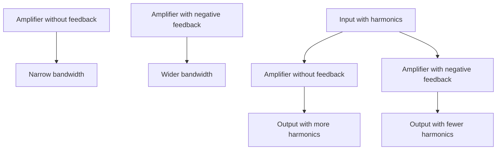
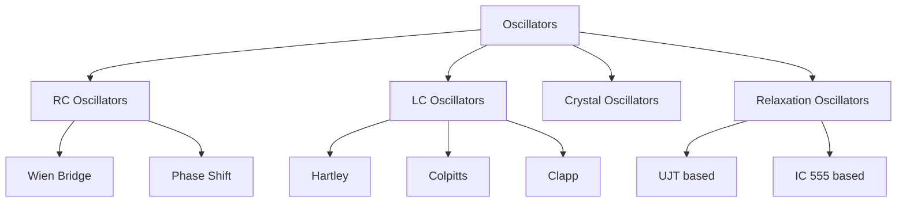
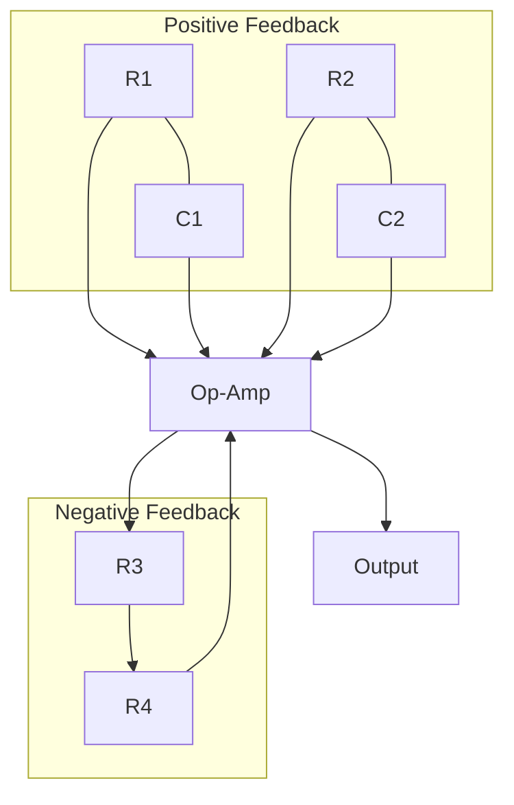
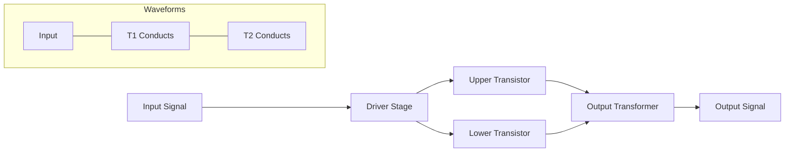
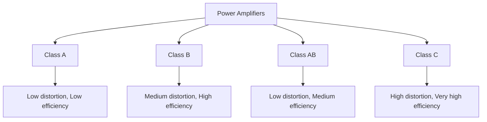
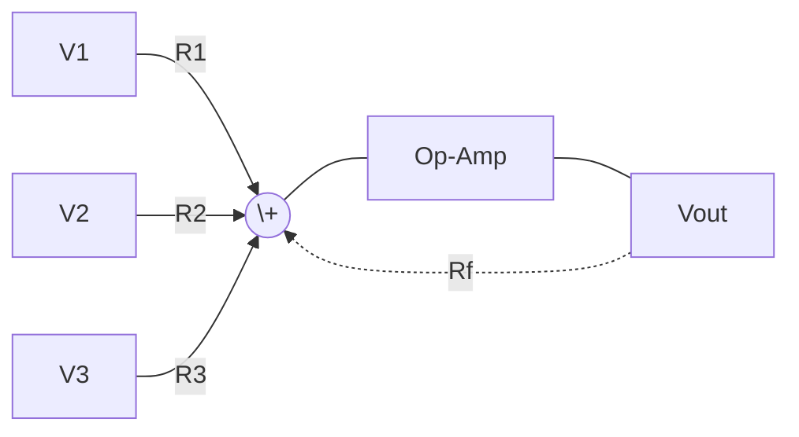
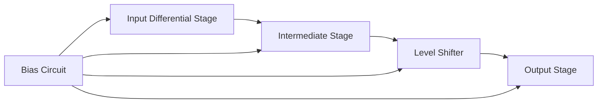
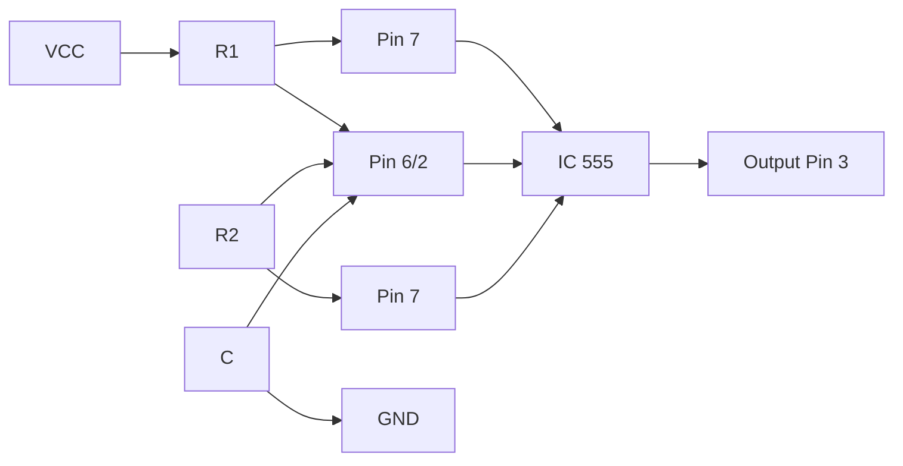
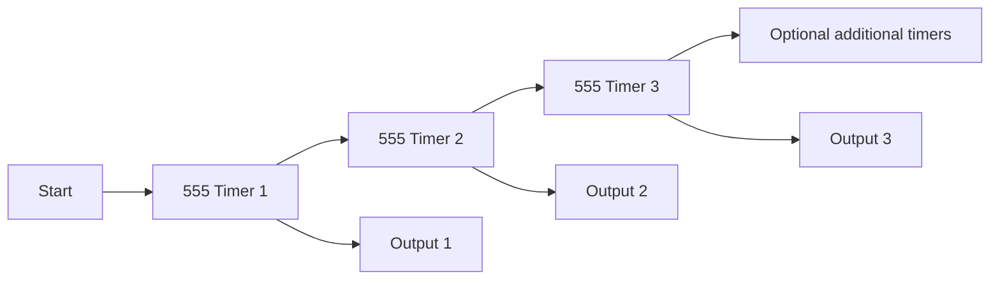
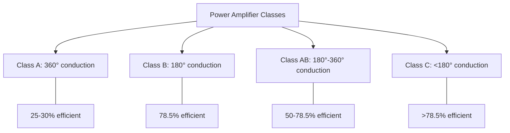

## Question 1(a) [3 marks]

**What is negative feedback? List out advantages and disadvantages of negative feedback.**

**Answer**:
Negative feedback is feeding a portion of output signal back to the input with 180° phase shift to reduce the input signal.

| Advantages | Disadvantages |
|------------|---------------|
| Increased stability | Reduced gain |
| Reduced distortion | Complex circuit design |
| Increased bandwidth | More components required |
| Reduced noise | Higher power consumption |

**Mnemonic:** "SIRS" - Stability Improved, Reduced distortion, Sensitivity decreased

## Question 1(b) [4 marks]

**Describe the effect of negative feedback on frequency response and distortion of an amplifier.**

**Answer**:
Negative feedback improves both frequency response and reduces distortion in amplifiers.

**Diagram:**



| Effect on | Without feedback | With negative feedback |
|-----------|------------------|------------------------|
| Frequency response | Narrow bandwidth | Wider bandwidth |
| Distortion | Higher harmonics | Reduced harmonics |

**Mnemonic:** "WIDE" - With negative feedback, Improved response, Distortion reduced, Extended bandwidth

## Question 1(c) [7 marks]

**Derive an equation for overall gain of negative feedback voltage amplifier.**

**Answer**:
The equation for overall gain of negative feedback voltage amplifier can be derived as follows:

**Diagram:**

```goat
    Input +-----+      +-------+
    Vi -->|  Σ  |----->|       |----> Vo (Output)
          +-----+      |   A   |
             ^         |       |
             |         +-------+
             |             |
             |         +-------+
             +---------|   β   |
                       +-------+
```

- **Input equation**: V' = Vi - βVo
- **Output equation**: Vo = AV'
- **Substituting**: Vo = A(Vi - βVo)
- **Solving for Vo**: Vo = AVi - AβVo
- **Rearranging**: Vo(1 + Aβ) = AVi
- **Final equation**: Vo/Vi = A/(1 + Aβ) = Af

**Mnemonic:** "LOOP" - Look at Original Open-loop gain and Proceed with feedback

## Question 1(c) OR [7 marks]

**Compare voltage shunt amplifier and current series amplifier.**

**Answer**:

| Parameter | Voltage Shunt Amplifier | Current Series Amplifier |
|-----------|-------------------------|--------------------------|
| Input | Voltage | Current |
| Output | Current | Voltage |
| Feedback network connection | Parallel at input | Series at input |
| Input impedance | Decreased | Increased |
| Output impedance | Increased | Decreased |
| Gain | Current gain decreases | Voltage gain decreases |
| Application | Current amplification | Voltage amplification |

**Diagram:**


**Mnemonic:** "VICS" - Voltage shunt In, Current out Series has opposite

## Question 2(a) [3 marks]

**Discuss Barkhausen's criteria for oscillation.**

**Answer**:
Barkhausen's criteria states that for sustained oscillations, the following conditions must be met:

| Criteria | Requirement |
|----------|-------------|
| Loop gain | \|Aβ\| = 1 (magnitude equals 1) |
| Phase shift | Total phase shift around loop = 0° or 360° |

**Diagram:**

```goat
    +-------+      +-------+
    |       |----->|       |--+
    |   A   |      |   β   |  |
    |       |<-----|       |<-+
    +-------+      +-------+
```

**Mnemonic:** "LOOP" - Loop gain One, Oscillation needs Phase shift zero

## Question 2(b) [4 marks]

**Draw circuit diagram of Hartley oscillator and Colpitts oscillator.**

**Answer**:

**Hartley Oscillator:**

```goat
    +-----+     +----||-----+
    |     |     |           |
    +     |     C1          |
   ===    +-----+           |
   GND    |     |           |
          |     Z    +------+
          |     Z    |      |
          |     Z    |      |
          +-----+    |      |
            L1  |    |  L2  |
                |    |      |
                +----+------+
                |    |
                |    |
          +-----+    +-----+
          |     |    |     |
          |  Q  |    |     |
          |     |    |     |
          +--+--+    |     |
             |       |     |
             +-------+     |
             |             |
            === GND        |
                           |
    +----||----------------+
    |       C2
    |
   === GND
```

**Colpitts Oscillator:**

```goat
    +-----+     +----||-----+
    |     |     |     C1    |
    +     |     |           |
   ===    +-----+           |
   GND    |     |           |
          |     |    +------+
          |     |    |      |
          |     Z    |      |
          +-----Z    |      |
            L   Z    |      |
                |    |      |
                |    |      |
                +----+------+
                |    |
                |    |
          +-----+    +-----+
          |     |    |     |
          |  Q  |    |     |
          |     |    |     |
          +--+--+    |     |
             |       |     |
             +-------+     |
             |             |
            === GND        |
             |             |
             +-------------+
             |
            ===
            C2
            ===
            GND
```

**Mnemonic:** "HaLs CoCs" - Hartley has inductors in series, Colpitts has Capacitors in series

## Question 2(c) [7 marks]

**Explain UJT as a relaxation oscillator.**

**Answer**:
UJT (Unijunction Transistor) works as a relaxation oscillator by repeatedly charging and discharging a capacitor.

**Diagram:**

```goat
         RB1
    B2 +---/\/\/\---+ VCC
         |          |
         |          |
         |          |
    +----|          |
    |    |          |
    |    |  UJT     |
    |    |          |
    |    |          |
    |    |          |
    |    +----------+ B1
    |    |
    |    |
    |    |
    C    R
    |    |
    |    |
    +----+----+ GND
```

| Phase | Description |
|-------|-------------|
| Charging | Capacitor charges through R until voltage reaches VP (peak voltage) |
| Firing | UJT turns ON when emitter voltage reaches VP |
| Discharge | Capacitor discharges rapidly through UJT |
| Reset | Voltage falls below valley voltage, UJT turns OFF, cycle repeats |

- **Intrinsic standoff ratio**: η = RB1/(RB1+RB2)
- **Peak voltage**: VP = η×VBB + VD
- **Frequency**: f = 1/[R×C×ln(1/(1-η))]

**Mnemonic:** "CFDR" - Charge, Fire, Discharge, Repeat

## Question 2(a) OR [3 marks]

**Classify Oscillators.**

**Answer**:

| Classification | Types |
|----------------|-------|
| Based on feedback | RC, LC, Crystal |
| Based on waveform | Sinusoidal, Non-sinusoidal |
| Based on frequency | Audio, Radio, VHF, UHF |
| Based on circuit | Hartley, Colpitts, Wien-bridge, RC-phase shift |

**Diagram:**



**Mnemonic:** "SRLC" - Sine waves from RC, LC, and Crystal oscillators

## Question 2(b) OR [4 marks]

**Explain construction of UJT with its symbol.**

**Answer**:
UJT (Unijunction Transistor) consists of a lightly doped N-type silicon bar with electrical connections at both ends (bases) and a P-type emitter junction.

**Diagram:**

```goat
    Symbol:               Structure:
    
      B2                     B2
       |                      |
       |                  +---+---+
       |                  |   |   |
       +---+          +---+---+---+---+
           |          |   |   |   |   |
           +          |   | N-type    |
           |          |   |   |   |   |
       +---+          |   +---+---+   |
       |              |       |       |
       |              |       |       |
       E              |       | P     |
       |              |       |       |
       |              +-------+-------+
       |                      |
       |                      |
       |                      |
      B1                     B1
```

| Component | Description |
|-----------|-------------|
| Base 1 (B1) | Connected to one end of N-type bar |
| Base 2 (B2) | Connected to other end of N-type bar |
| Emitter (E) | Connected to P-type region diffused into N-type bar |
| RB1 | Resistance between emitter and B1 |
| RB2 | Resistance between emitter and B2 |

**Mnemonic:** "BEB" - Bases at Ends, Emitter in Between

## Question 2(c) OR [7 marks]

**Explain working of Wien Bridge oscillator circuit. List out its application.**

**Answer**:
Wien Bridge oscillator produces sine waves using RC network for positive feedback and negative feedback for amplitude stability.

**Diagram:**



| Component | Function |
|-----------|----------|
| R1, C1 (series) | Positive feedback, phase lead |
| R2, C2 (parallel) | Positive feedback, phase lag |
| R3, R4 | Negative feedback, amplitude control |
| Op-Amp | Active amplifier element |

**Applications:**

- Audio signal generators
- Function generators
- Musical instrument tuning
- Test equipment
- Filter circuits

**Mnemonic:** "APPS" - Audio Production, Pure Sine waves, Stable frequency

## Question 3(a) [3 marks]

**Differentiate between voltage and power amplifier.**

**Answer**:

| Parameter | Voltage Amplifier | Power Amplifier |
|-----------|-------------------|-----------------|
| Primary function | Increases voltage level | Increases power level |
| Output | Low current capability | High current capability |
| Efficiency | Not critical | Critical parameter |
| Heat dissipation | Low | High, needs heat sink |
| Biasing | Class A typically | Class A, B, AB, or C |
| Applications | Pre-amplification stages | Driving speakers, motors |

**Mnemonic:** "VICE" - Voltage amplifiers Increase voltage, Current not important, Efficiency not critical

## Question 3(b) [4 marks]

**Derive an equation for Efficiency of class B push pull amplifier.**

**Answer**:
Efficiency (η) of a Class B push-pull amplifier is derived as follows:

**Diagram:**

```goat
          +VCC
           |
           |
    +------+------+
    |             |
    |      T1     |
   +++            |
    |             |
   +++     +------+------+
    |      |      |      |
Input+---+ |      |      +---+Output
    |      |      |      |
   +++     +------+------+
    |             |
    |      T2     |
    +------+------+
           |
           |
          -VCC
```

- **AC power output**: P₀ = Vrms × Irms = (Vm/√2) × (Im/√2) = Vm × Im/2
- **DC power input**: PDC = VCC × IDC = VCC × (2×Im/π)
- **Efficiency**: η = P₀/PDC = (Vm×Im/2)/(VCC×2×Im/π) = (Vm×π)/(4×VCC)
- **For maximum swing**: Vm = VCC, so η = π/4 = 78.5%

**Mnemonic:** "POP" - Push-pull Output Power = π/4 or 78.5%

## Question 3(c) [7 marks]

**Explain working of Class-B Push Pull Amplifiers along with waveform.**

**Answer**:
Class B push-pull amplifier uses two transistors to amplify opposite halves of the input waveform.

**Diagram:**



| Phase | Description |
|-------|-------------|
| Positive half | Upper transistor (T1) conducts, T2 is off |
| Negative half | Lower transistor (T2) conducts, T1 is off |
| Crossover | Both transistors are near cutoff, causing distortion |

**Key points:**

- **Efficiency**: Approximately 78.5% (π/4)
- **Conduction angle**: 180° for each transistor
- **Crossover distortion**: Due to both transistors being off near zero crossing
- **Advantages**: Higher efficiency, less heat, suitable for high power

**Mnemonic:** "HOPE" - Half cycle Operation, Push-pull, Efficiency high

## Question 3(a) OR [3 marks]

**Explain Classification of Power amplifier.**

**Answer**:

| Class | Conduction Angle | Efficiency | Distortion |
|-------|------------------|------------|------------|
| Class A | 360° | 25-30% | Low |
| Class B | 180° | 78.5% | Medium |
| Class AB | 180°-360° | 50-78.5% | Low-Medium |
| Class C | <180° | >78.5% | High |

**Diagram:**



**Mnemonic:** "ABCE" - As Biasing Changes, Efficiency increases

## Question 3(b) OR [4 marks]

**Derive an equation for Efficiency of class A power amplifier.**

**Answer**:
Efficiency of Class A power amplifier is derived as follows:

**Diagram:**

```goat
     +VCC
       |
       |
       Z
       Z RL
       Z
       |
       +---+Output
       |
       |
       Q
       |
       |
     Input
       |
      GND
```

- **Maximum AC power output**: P₀ = (Vrms)²/RL = (VCC/2√2)²/RL = VCC²/8RL
- **DC power input**: PDC = VCC × IDC = VCC × (VCC/2RL) = VCC²/2RL
- **Efficiency**: η = P₀/PDC = (VCC²/8RL)/(VCC²/2RL) = 1/4 = 25%

**Mnemonic:** "ONE" - Output Never Exceeds 25% efficiency in Class A

## Question 3(c) OR [7 marks]

**Explain working of Class-A transformer coupled Amplifiers along with waveform.**

**Answer**:
Class A transformer coupled amplifier conducts for the full input cycle (360°) using a transformer for output coupling.

**Diagram:**

```goat
     +VCC
       |
       |
    +--+--+
    |     |
    | Pri |
    |     |
    +--+--+
       |
       +---+
       |   |
    Q  |   |
       |   |
       |   +--+Output
       |      |
      === C   +--+--+
       |      |     |
      GND     | Sec |
              |     |
              +--+--+
                 |
                GND
```

| Component | Function |
|-----------|----------|
| Transformer | Matches impedance, removes DC, provides isolation |
| Transistor | Conducts for full 360° cycle |
| Capacitor | AC coupling |
| VCC | DC power supply |

**Waveform characteristics:**

- Input and output waveforms are in phase
- No crossover distortion
- Full cycle amplification
- Low efficiency (25%)
- Low distortion

**Mnemonic:** "FACT" - Full cycle Amplification in Class-a with Transformer

## Question 4(a) [3 marks]

**Define (i) CMRR (ii) Slew Rate**

**Answer**:

| Parameter | Definition | Typical Value |
|-----------|------------|---------------|
| CMRR | Common Mode Rejection Ratio, the ratio of differential gain to common mode gain | 90 dB (IC 741) |
| Slew Rate | Maximum rate of change of output voltage per unit of time | 0.5 V/μs (IC 741) |

**CMRR**: CMRR = 20 log₁₀(Ad/Acm) where Ad is differential gain and Acm is common mode gain

**Slew Rate**: SR = dVout/dt (V/μs)

**Mnemonic:** "CRiSp" - CMRR Rejects common signals, Slew Rate limits speed

## Question 4(b) [4 marks]

**Explain inverting amplifier of operational amplifiers with sketch.**

**Answer**:
Inverting amplifier provides gain with 180° phase shift using negative feedback.

**Diagram:**

```goat
        Rf
    +---/\/\/\---+
    |            |
    |            |
    |    +-------+
    |    |       |
    |    |   +   |
Vin +----+---+   +----+ Vout
    Ri   |   -   |
         |       |
         +-------+
              |
              |
             === GND
```

| Component | Function |
|-----------|----------|
| Ri | Input resistor |
| Rf | Feedback resistor |
| Op-Amp | Amplifies signal with high gain |

**Key equations:**

- **Gain**: A = -Rf/Ri
- **Input impedance**: Z = Ri
- **Bandwidth**: Depends on op-amp and gain

**Mnemonic:** "IRON" - Inverting, Resistance ratio gives gain, Output Negative phase

## Question 4(c) [7 marks]

**Explain Op-amp as a Summing amplifier.**

**Answer**:
Summing amplifier adds multiple input signals with weighted contributions.

**Diagram:**



**Circuit:**

```goat
       R1             Rf
    +--/\/\/\--+---/\/\/\---+
    |          |            |
V1  |          |            |
    +          |    +-------+
               |    |       |
    +--/\/\/\--+    |   +   |
    |          |----+---+   +----+ Vout
V2  +   R2     |    |   -   |
               |    |       |
    +--/\/\/\--+    +-------+
    |          |        |
V3  +   R3     |        |
               |       === GND
              === GND
```

| Parameter | Value |
|-----------|-------|
| Output voltage | Vout = -(Rf/R1)V1 - (Rf/R2)V2 - (Rf/R3)V3 ... |
| Gain for each input | -Rf/Rn where Rn is input resistor |
| Equal weight summing | All input resistors equal: R1 = R2 = R3 = Rf |

**Applications:**

- Audio mixers
- Signal processing
- Analog computers
- Weighted averages

**Mnemonic:** "SARI" - Summing Amplifier Requires Inverting configuration

## Question 4(a) OR [3 marks]

**Sketch basic Block diagram of an operational amplifier.**

**Answer**:

**Diagram:**



| Stage | Function |
|-------|----------|
| Input differential stage | High input impedance, rejects common mode signals |
| Intermediate stage | High gain, frequency compensation |
| Level shifter | Shifts DC level for output stage |
| Output stage | Low output impedance, current amplification |
| Bias circuit | Provides proper operating points |

**Mnemonic:** "DILO" - Differential Input, Level shifting, Output amplification

## Question 4(b) OR [4 marks]

**Explain non inverting amplifier of operational amplifiers with sketch.**

**Answer**:
Non-inverting amplifier provides gain without phase inversion using negative feedback.

**Diagram:**

```goat
              +-------+
              |       |
              |   +   |
Vin +---------)---+   +----+ Vout
              |   -   |
              |       |
              +---+---+
                  |
                  |
         Ri       |
    +---/\/\/\----+
    |              
    |              
    |    Rf        
    +---/\/\/\----+
    |             |
    |             |
   === GND        |
                  |
                  +
```

| Parameter | Value |
|-----------|-------|
| Gain | A = 1 + Rf/Ri |
| Input impedance | Very high (depends on op-amp) |
| Phase | In-phase with input |
| Common application | Voltage follower (when Rf=0, Ri=∞) |

**Mnemonic:** "NIPS" - Non-inverting, Input and output In Phase, Same polarity

## Question 4(c) OR [7 marks]

**Explain Op-amp as an Integrator.**

**Answer**:
Op-amp integrator produces output proportional to the time integral of the input.

**Diagram:**

```goat
           C
    +------||------+
    |              |
    |              |
    |      +-------+
    |      |       |
    |      |   +   |
Vin +------+---+   +----+ Vout
    R      |   -   |
           |       |
           +-------+
                |
                |
               === GND
```

| Parameter | Formula |
|-----------|---------|
| Output voltage | Vout = -(1/RC)∫Vin dt |
| Transfer function | Vout/Vin = -1/(sRC) in Laplace domain |
| Gain | Decreases at 20dB/decade with frequency |
| Phase shift | -90° (ideally) |

**Applications:**

- Analog computers
- Waveform generators
- PID controllers
- Active filters
- Signal processing

**Mnemonic:** "TIME" - Takes Input and Makes time-dependent Effect

## Question 5(a) [3 marks]

**Draw Pin Diagram of IC 555.**

**Answer**:

**Diagram:**

```goat
     +-------+
  1 -|       |- 8
     |       |
  2 -|       |- 7
     |  555  |
  3 -|       |- 6
     |       |
  4 -|       |- 5
     +-------+
```

| Pin Number | Name | Function |
|------------|------|----------|
| 1 | GND | Ground |
| 2 | TRIGGER | Starts timing cycle |
| 3 | OUTPUT | Timer output |
| 4 | RESET | Resets timer |
| 5 | CONTROL | Modifies timing |
| 6 | THRESHOLD | Ends timing cycle |
| 7 | DISCHARGE | Discharges timing capacitor |
| 8 | VCC | Positive supply |

**Mnemonic:** "GTOR-CTD" - Ground, Trigger, Output, Reset, Control, Threshold, Discharge

## Question 5(b) [4 marks]

**Explain astable multivibrator of timer IC 555.**

**Answer**:
Astable multivibrator using IC 555 generates continuous square wave output without any external trigger.

**Diagram:**



| Parameter | Formula |
|-----------|---------|
| Charging time | t₁ = 0.693(R₁+R₂)C |
| Discharging time | t₂ = 0.693(R₂)C |
| Frequency | f = 1.44/((R₁+2R₂)C) |
| Duty cycle | D = (R₁+R₂)/(R₁+2R₂) |

**Mnemonic:** "FREE" - FREquency Established by External RC network

## Question 5(c) [7 marks]

**Explain working of Complementary symmetry Push Pull Amplifiers.**

**Answer**:
Complementary symmetry push-pull amplifier uses complementary transistors (NPN and PNP) to amplify both halves of the waveform.

**Diagram:**

```goat
            VCC
             |
             |
        Q1  /+\  NPN
             |
             +------+
             |      |
Input +------+      +---+ Output
             |      |
             +------+
             |
        Q2  \-/  PNP
             |
             |
            GND
```

| Transistor | Conduction | Current Flow |
|------------|------------|--------------|
| Q1 (NPN) | Positive half-cycle | Source to load |
| Q2 (PNP) | Negative half-cycle | Sink from load |

**Key features:**

- **No center-tapped transformer**: Simpler design than transformer-coupled push-pull
- **Crossover distortion**: Requires biasing to minimize
- **Efficiency**: About 78.5% (Class B operation)
- **Thermal runaway**: Risk if not properly designed
- **Applications**: Audio power amplifiers, output stages of op-amps

**Mnemonic:** "COPS" - Complementary Opposing Pair of transistors for Symmetrical operation

## Question 5(a) OR [3 marks]

**Draw the diagram of Sequential Timer.**

**Answer**:

**Diagram:**



```goat
   +-----+      +-----+      +-----+
   |     |      |     |      |     |
   | 555 |      | 555 |      | 555 |
   |  1  |      |  2  |      |  3  |
   |     |      |     |      |     |
   +--|--+      +--|--+      +--|--+
      |            |            |
      v            v            v
   Output 1     Output 2     Output 3
      |            |            |
   Start        Trigger      Trigger
   Input          from         from
                Timer 1      Timer 2
```

**Mnemonic:** "SET" - Sequential Events Triggered one after another

## Question 5(b) OR [4 marks]

**Explain bistable multivibrator of timer IC 555.**

**Answer**:
Bistable multivibrator using IC 555 has two stable states and changes state only when triggered.

**Diagram:**

```goat
        VCC
         |
     +---+---+
     |       |
     +---+---+         +-----+
     |   |R  |         |     |
     |   +---+----+----+ 555 |
     |           |    4|     |
     |         +-+     |     |
     |   Set   | |     |     |
     +----o----+ +-----+  3  +---- Output
               |       |     |
     +----o----+ +-----+     |
     |   Reset | |    2|     |
     |         +-+     +-----+
     |             |      |
     |             |      |
    === GND       === GND  
```

| Terminal | Function | Operation |
|----------|----------|-----------|
| Pin 2 (TRIGGER) | SET input | When pulled below 1/3 VCC, output goes HIGH |
| Pin 4 (RESET) | RESET input | When pulled LOW, output goes LOW |
| Pin 3 | Output | Remains in last state until triggered |

**Mnemonic:** "FLIP" - Firmly Latched In Position until triggered

## Question 5(c) OR [7 marks]

**Compare different types of power Amplifiers.**

**Answer**:

| Parameter | Class A | Class B | Class AB | Class C |
|-----------|---------|---------|----------|---------|
| Conduction angle | 360° | 180° | 180°-360° | <180° |
| Efficiency | 25-30% | 78.5% | 50-78.5% | >78.5% |
| Distortion | Very low | Moderate | Low | High |
| Biasing | Above cutoff | At cutoff | Slightly above cutoff | Below cutoff |
| Circuit complexity | Low | Medium | Medium | Low |
| Heat dissipation | High | Medium | Medium | Low |
| Applications | High fidelity audio | Audio power amps | Audio power amps | RF transmitters |

**Diagram:**



**Mnemonic:** "ABCE" - As Biasing Condition changes, Efficiency increases
