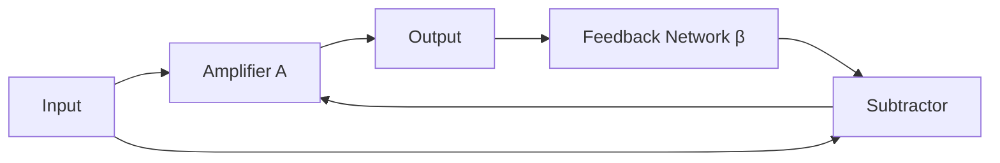
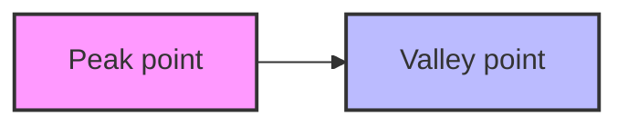
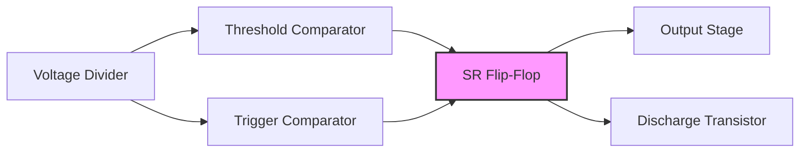

## પ્રશ્ન 1(અ) [3 ગુણ]

**નેગેટિવ ફીડબેકના ફાયદા અને ગેરફાયદાની સૂચિ બનાવો**

**જવાબ**:

| નેગેટિવ ફીડબેકના ફાયદા | નેગેટિવ ફીડબેકના ગેરફાયદા |
|------------------------|------------------------|
| બેન્ડવિડ્થમાં વધારો | ગેઈનમાં ઘટાડો |
| સ્થિરતામાં સુધારો | વધુ ઘટકોની જરૂર |
| વિકૃતિમાં ઘટાડો | જટિલ સર્કિટ ડિઝાઈન |
| નોઈઝમાં ઘટાડો | યોગ્ય રીતે ડિઝાઈન ન કરવામાં આવે તો ઓસિલેશનની શક્યતા |
| સારું ઇનપુટ/આઉટપુટ ઇમ્પીડન્સ નિયંત્રણ | વધુ પાવર વપરાશ |

**મેમરી ટ્રીક:** "STAND" - Stability, linearity, Amplitude reduction, Noise reduction, Distortion reduction

## પ્રશ્ન 1(બ) [4 ગુણ]

**ગેઇન અને સ્ટેબિલિટી ઉપર નેગેટિવ ફીડબેકની અસર સમજાવો.**

**જવાબ**:

| ગેઇન પર અસર | સ્થિરતા પર અસર |
|------------|--------------|
| (1+Aβ) ફેક્ટર દ્વારા ગેઇનમાં ઘટાડો | તાપમાન પરિવર્તન સામે સ્થિરતામાં વધારો |
| ગેઇન સમીકરણ: A' = A/(1+Aβ) | ઘટક પરિમાણોમાં ફેરફારોથી સંવેદનશીલતામાં ઘટાડો |
| વધુ અનુમાનિત ગેઇન મૂલ્યો | સામાન્ય કાર્ય સ્થિતિમાં ઓસિલેશન અટકાવે છે |
| તાપમાન સાથે ગેઇનમાં ઓછો ફેરફાર | સમય સાથે વધુ સુસંગત સર્કિટ કાર્યક્ષમતા |

**આકૃતિ:**



**મેમરી ટ્રીક:** "GRIP" - Gain Reduction, Improved stability, Predictable performance

## પ્રશ્ન 1(ક) [7 ગુણ]

**નેગેટિવ ફિડબેક વોલ્ટેજ એમ્પલિફાયરના ઓવરઓલ ગેઇન માટે સમીકરણ તારવો.**

**જવાબ**:

| પગલું | સમીકરણ | વર્ણન |
|------|--------|------|
| 1 | Vi = Vs - Vf | ઇનપુટ વોલ્ટેજ = સોર્સ - ફીડબેક |
| 2 | Vf = β × Vo | ફીડબેક વોલ્ટેજ = β ગુણા આઉટપુટ વોલ્ટેજ |
| 3 | Vo = A × Vi | આઉટપુટ વોલ્ટેજ = એમ્પલિફાયર ગેઇન ગુણા ઇનપુટ વોલ્ટેજ |
| 4 | Vo = A × (Vs - β × Vo) | (1) અને (2) ને (3) માં મૂકતા |
| 5 | Vo + A × β × Vo = A × Vs | પદોને ફરીથી ગોઠવતા |
| 6 | Vo(1 + Aβ) = A × Vs | Vo ને ફેક્ટર કરતા |
| 7 | Vo/Vs = A/(1+Aβ) | ઓવરઓલ ગેઇન સમીકરણ |

**આકૃતિ:**


**મેમરી ટ્રીક:** "SAFE" - Source, Amplifier, Feedback, Equation A/(1+Aβ)

## પ્રશ્ન 1(ક-OR) [7 ગુણ]

**વોલ્ટેજ શંટ એમ્પ્લીફાયર, વોલ્ટેજ સીરીઝ, કરંટ શંટ અને કરંટ સીરીઝ એમ્પ્લીફાયરની તુલના કરો.**

**જવાબ**:

| પરિમાણ | વોલ્ટેજ સીરીઝ | વોલ્ટેજ શંટ | કરંટ સીરીઝ | કરંટ શંટ |
|--------|-------------|-----------|-----------|---------|
| **ઇનપુટ સિગ્નલ** | વોલ્ટેજ | વોલ્ટેજ | કરંટ | કરંટ |
| **આઉટપુટ સિગ્નલ** | વોલ્ટેજ | કરંટ | વોલ્ટેજ | કરંટ |
| **ઇનપુટ કોન્ફિગરેશન** | સીરીઝ | પેરેલેલ | સીરીઝ | પેરેલેલ |
| **આઉટપુટ કોન્ફિગરેશન** | સીરીઝ | સીરીઝ | પેરેલેલ | પેરેલેલ |
| **ઇનપુટ ઇમ્પીડન્સ** | વધારે | ઘટાડે | ઘટાડે | વધારે |
| **આઉટપુટ ઇમ્પીડન્સ** | ઘટાડે | ઘટાડે | વધારે | વધારે |
| **ઉપયોગિતા** | વોલ્ટેજ એમ્પલિફાયર | ટ્રાન્સકન્ડક્ટન્સ એમ્પલિફાયર | ટ્રાન્સરેસિસ્ટન્સ એમ્પલિફાયર | કરંટ એમ્પલિફાયર |

**આકૃતિ:**

```goat
+---------------------+       +---------------------+
|                     |       |                     |
| Voltage Series      |       | Voltage Shunt       |
| Zi↑ Zo↓             |       | Zi↓ Zo↓             |  
| Av↓                 |       | Av↓                 |
|                     |       |                     |
+---------------------+       +---------------------+

+---------------------+       +---------------------+
|                     |       |                     |
| Current Series      |       | Current Shunt       |
| Zi↓ Zo↑             |       | Zi↑ Zo↑             |
| Ai↓                 |       | Ai↓                 |
|                     |       |                     |
+---------------------+       +---------------------+
```

**મેમરી ટ્રીક:** "VISC" - Voltage In (Series/shunt), Signal Current (series/shunt)

## પ્રશ્ન 2(અ) [3 ગુણ]

**યુજેટીની એપ્લિકેશન લખો.**

**જવાબ**:

| UJT ની એપ્લિકેશન |
|------------------|
| રિલેક્સેશન ઓસિલેટર |
| ટાઈમિંગ સર્કિટ |
| SCR અને TRIAC માટે ટ્રિગર સર્કિટ |
| સોટૂથ વેવ જનરેટર |
| પલ્સ જનરેટર |
| પાવર ઇલેક્ટ્રોનિક્સમાં ફેઝ કંટ્રોલ |

**મેમરી ટ્રીક:** "ROBOTS" - Relaxation Oscillators, Bistable circuits, Oscillators, Timing, Switching

## પ્રશ્ન 2(બ) [4 ગુણ]

**વેઈન બ્રિજ ઓસિલેટર અને હાર્ટલી ઓસિલેટરનો સર્કિટ ડાયાગ્રામ દોરો.**

**જવાબ**:

**વેઈન બ્રિજ ઓસિલેટર:**

```goat
      R1
      ┌──┐
      │  │
┌─────┤  ├─────┬─────────┐
│     └──┘     │         │
│              │        ┌┴┐
│      C1     ┌┴┐ R2    │ │
│     ┌──┐    │ │       │ │ R3
│ ┌───┤  ├────┘ │       │ │
│ │   └──┘      │       └┬┘
│ │             │        │
│ │    R4       │        │
┌┴┐┌──┐         │        │
│ ││  │         │        │
│ ││  │        ┌┴┐       │
└┬┘└──┘        │ │       │
 │             │ │Op-amp │
 └─────────────┤ ├───────┘
               └┬┘
                │
                │ C2
             ┌──┤
             │  │
             │  │
             └──┘
```

**હાર્ટલી ઓસિલેટર:**

```goat
                   C1
            ┌───┤ ├────┐
            │         ┌┴┐
            │         │ │
            │         │ │ RFC
            │         │ │
            │         └┬┘
            │   ┌──────┴───┐
            │   │          │
            │   │  Q       │
            │   │    ┌─────┤
            │   └────┴─────┘
            │    │    │
           ┌┴┐  ┌┴┐  ┌┴┐
L1         │ │  │ │  │ │ L2
┌───┐      │ │  │ │  │ │ ┌───┐
│   ├──────┘ │  │ │  │ └─┤   │
│   │        │  │ │  │   │   │
└───┘        └──┴─┴──┘   └───┘
            L tap point
               │  │
              ┌┴┐ │
              │ │ │
              │ │ │  C2
              │ │ └─┤ ├─┐
              └┬┘       │
               │        │
               └────────┘
```

**મેમરી ટ્રીક:** "WH-RC-LC" - Wein uses RC, Hartley uses LC

## પ્રશ્ન 2(ક) [7 ગુણ]

**યુજેટીની રચના, કાર્ય અને લાક્ષણિકતાઓ દોરો અને સમજાવો.**

**જવાબ**:

**UJT ની રચના:**

```goat
              Base 2 (B2)
                 │
                 ▼
              ┌─────┐
              │     │
              │  N  │
              │     │
              ├─────┤
              │     │◄── Emitter (E)
              │  P  │
              │     │
              ├─────┤
              │     │
              │  N  │
              │     │
              └─────┘
                 │
                 ▼
              Base 1 (B1)
```

| રચના | કાર્યપ્રણાલી | લાક્ષણિકતાઓ |
|------|------------|------------|
| N-પ્રકારની સિલિકોન બાર સાથે P-પ્રકારનું જંક્શન | ઇન્ટ્રિન્સિક સ્ટેન્ડ-ઓફ રેશિયો η સાથે વોલ્ટેજ ડિવાઇડર તરીકે કાર્ય કરે છે | V-I કર્વમાં નેગેટિવ રેઝિસ્ટન્સ વિસ્તાર |
| ત્રણ ટર્મિનલ: બેઝ1, બેઝ2, એમિટર | જ્યારે VE > ηVBB, ત્યારે તે વાહક થાય છે | પીક પોઇન્ટ અને વેલી પોઇન્ટ |
| સિંગલ P-N જંક્શન | આંતરિક રેઝિસ્ટન્સ ઝડપથી ઘટે છે | સ્થિર સ્વિચિંગ ઓપરેશન |
| સિંગલ જંક્શન પરંતુ બે બેઝ | રિલેક્સેશન ઓસિલેશન ઉત્પન્ન કરે છે | તાપમાન સંવેદનશીલતા |

**V-I લાક્ષણિકતાઓ:**



**મેમરી ટ્રીક:** "PNVB" - P-N junction, Negative resistance, Valley point, Bases two

## પ્રશ્ન 2(અ-OR) [3 ગુણ]

**વપરાયેલ ઘટક અને ઓપરેટિંગ આવર્તનના આધારે ઓસિલેટરનું વર્ગીકરણ કરો.**

**જવાબ**:

| ઘટકના આધારે | ઓપરેટિંગ આવર્તનના આધારે |
|------------|----------------------|
| RC ઓસિલેટર (વિયન બ્રિજ, ફેઝ શિફ્ટ) | ઓડિઓ ફ્રિક્વન્સી (20Hz-20kHz) |
| LC ઓસિલેટર (હાર્ટલી, કોલપિટ્સ, ક્લેપ) | રેડિયો ફ્રિક્વન્સી (20kHz-30MHz) |
| ક્રિસ્ટલ ઓસિલેટર (ક્વાર્ટ્ઝ ક્રિસ્ટલ) | વેરી હાઇ ફ્રિક્વન્સી (30MHz-300MHz) |
| રિલેક્સેશન ઓસિલેટર (UJT આધારિત) | અલ્ટ્રા હાઇ ફ્રિક્વન્સી (300MHz-3GHz) |
| નેગેટિવ રેઝિસ્ટન્સ ઓસિલેટર (ટનલ ડાયોડ) | માઇક્રોવેવ ફ્રિક્વન્સી (>3GHz) |

**મેમરી ટ્રીક:** "RCLCN" - RC, LC, Crystal, Negative resistance

## પ્રશ્ન 2(બ-OR) [4 ગુણ]

**UJT ને રિલેક્સેશન ઓસિલેટર તરીકે સમજાવો**

**જવાબ**:

| ઓપરેશન સ્ટેજ | વર્ણન |
|--------------|------|
| ચાર્જિંગ ફેઝ | કેપેસિટર રેઝિસ્ટર R થી ચાર્જ થાય છે |
| થ્રેશોલ્ડ પોઇન્ટ | જ્યારે કેપેસિટર વોલ્ટેજ પીક પોઇન્ટ વોલ્ટેજ (ηVBB) સુધી પહોંચે ત્યારે UJT ચાલુ થાય છે |
| ડિસ્ચાર્જ ફેઝ | કેપેસિટર UJT ના ઓછા રેઝિસ્ટન્સ દ્વારા ઝડપથી ડિસ્ચાર્જ થાય છે |
| રિસેટ | કેપેસિટરનો વોલ્ટેજ વેલી પોઇન્ટથી નીચે પડ્યા પછી UJT બંધ થાય છે |

**સર્કિટ ડાયાગ્રામ:**

```goat
        VBB
         │
         ▼
        ┌┴┐
        │ │
        │ │ R1
        │ │
        └┬┘
         │     B2
         └───┬───┐
             │   │
             │   │
         R   │ UJT
      ┌──┐   │   │
  Vcc │  │   │   │
  ────┤  ├───┤   │
      └──┘   │   │
         │   │   │
         │   └───┘
         │     │
         │     │ B1
        ┌┴┐    │
  C     │ │    │
        │ │    │
        └┬┘    │
         │     │
         └─────┘
          GND
```

**મેમરી ટ્રીક:** "CTDR" - Charge, Threshold, Discharge, Repeat

## પ્રશ્ન 2(ક-OR) [7 ગુણ]

**કોલપિટ્સ ઓસિલેટરના સર્કિટનું સ્કેચ કરો અને તેનું કામ સંક્ષિપ્તમાં સમજાવો**

**જવાબ**:

**કોલપિટ્સ ઓસિલેટર સર્કિટ:**

```goat
                    Vcc
                     │
                     ▼
                    ┌┴┐
                    │ │
                    │ │ RFC
                    │ │
                    └┬┘
          ┌──────────┴───────┐
          │                  │
          │    ┌─────────┐   │
          │    │         │   │
          │    │    Q    │   │
          │    │         │   │
          │    └─┬─────┬─┘   │
          │      │     │     │
          │      │     │     │
C1      ┌─┴─┐   ┌┴┐   ┌┴┐    │ C2
┌──┐    │   │   │ │   │ │    │ ┌──┐
│  ├────┤   │   │ │   │ │    ├─┤  │
│  │    │   │   │ │   │ │    │ │  │
└──┘    └─┬─┘   └┬┘   └┬┘    │ └──┘
          │      │     │     │
          │      └─────┘     │
          │        │         │
          │       ┌┴┐        │
          │       │ │        │
          │       │ │ L      │
          │       │ │        │
          │       └┬┘        │
          │        │         │
          └────────┴─────────┘
```

| ઘટક | કાર્ય |
|-----|------|
| C1 અને C2 | ફીડબેક પ્રદાન કરતું વોલ્ટેજ ડિવાઇડર નેટવર્ક |
| ઇન્ડક્ટર L | C1 અને C2 સાથે LC ટેંક સર્કિટ બનાવે છે |
| ટ્રાન્ઝિસ્ટર Q | એમ્પ્લિફિકેશન પ્રદાન કરે છે |
| RFC (રેડિયો ફ્રિક્વન્સી ચોક) | DC ને પસાર કરતાં AC ને અવરોધે છે |

**કાર્યપ્રણાલી:**

1. ટેંક સર્કિટ (L સાથે C1+C2) દોલન આવૃત્તિ નક્કી કરે છે
2. આવૃત્તિ ફોર્મ્યુલા: f = 1/(2π√(L×(C1×C2)/(C1+C2)))
3. કેપેસિટિવ વોલ્ટેજ ડિવાઇડર મારફતે ફીડબેક
4. ટ્રાન્ઝિસ્ટર એમ્પ્લિફાય કરે છે અને દોલનો જાળવે છે
5. ટ્રાન્ઝિસ્ટર મારફતે 180° ફેઝ શિફ્ટ, ફીડબેક નેટવર્ક મારફતે 180° ફેઝ શિફ્ટ

**મેમરી ટ્રીક:** "COLTS" - Capacitors form Oscillations with L-Tank circuit Sustainably

## પ્રશ્ન 3(અ) [3 ગુણ]

**પાવર એમ્પ્લીફાયર સંબંધિત શરતો વ્યાખ્યાયિત કરો:**
**i) collector Efficiency ii) Distortion iii) power dissipation capability**

**જવાબ**:

| શબ્દ | વ્યાખ્યા |
|------|----------|
| **કલેક્ટર કાર્યક્ષમતા** | કલેક્ટર બેટરી દ્વારા પૂરા પાડવામાં આવતા DC પાવરથી AC આઉટપુટ પાવરનો ગુણોત્તર (η = P_out/P_DC × 100%) |
| **ડિસ્ટોર્શન** | ઇનપુટથી આઉટપુટ સુધી વેવફોર્મ આકારમાં અનિચ્છનીય ફેરફાર (THD - ટોટલ હાર્મોનિક ડિસ્ટોર્શન તરીકે માપવામાં આવે છે) |
| **પાવર ડિસિપેશન કેપેબિલિટી** | મહત્તમ પાવર જે એમ્પ્લિફાયર નુકસાન વિના ગરમી તરીકે સુરક્ષિત રીતે ઓગાળી શકે છે (P_D = V_CE × I_C) |

**મેમરી ટ્રીક:** "EDP" - Efficiency measures DC-to-AC conversion, Distortion alters signal, Power dissipation limits operation

## પ્રશ્ન 3(બ) [4 ગુણ]

**વર્ગ-A પાવર એમ્પ્લીફાયરની કાર્યક્ષમતા મેળવો.**

**જવાબ**:

| પગલું | સમીકરણ | વર્ણન |
|------|--------|------|
| 1 | P_DC = V_CC × I_C | DC પાવર ઇનપુટ |
| 2 | P_out = (V_peak × I_peak)/2 | AC પાવર આઉટપુટ |
| 3 | V_peak = V_CC | મહત્તમ વોલ્ટેજ સ્વિંગ |
| 4 | I_peak = I_C | મહત્તમ કરંટ સ્વિંગ |
| 5 | P_out = (V_CC × I_C)/2 | મહત્તમ મૂલ્યો મૂકતા |
| 6 | η = (P_out/P_DC) × 100% | કાર્યક્ષમતાની વ્યાખ્યા |
| 7 | η = ((V_CC × I_C)/2)/(V_CC × I_C) × 100% | પાવર મૂલ્યો મૂકતા |
| 8 | η = 50% | મહત્તમ સૈદ્ધાંતિક કાર્યક્ષમતા |

**આકૃતિ:**


**મેમરી ટ્રીક:** "HALF" - Highest Achievable Level Fifty percent

## પ્રશ્ન 3(ક) [7 ગુણ]

**કંપલીમેંટરી સીમેંટરી પુશ-પુલ એમ્પ્લીફાયરની કામગીરી સમજાવો.**

**જવાબ**:

**સર્કિટ ડાયાગ્રામ:**

```goat
              Vcc
               │
               ▼
              ┌┴┐
              │ │
              │ │ Rc1
              │ │
              └┬┘
               │
               ├────────┐
               │        │
               │   NPN  │
               │  Q1    │
               │   ┌────┴─┐
           R1  │   │      │ Output
       ┌──┐    │   │      ├─┬────►
 Input │  ├────┴───┤      │ │
 ──────┤  │        └──────┘ │
       └──┘             ┌───┴───┐
                        │       │
                        │  PNP  │
                        │  Q2   │
                        │       │
                        └───┬───┘
                            │
                           ┌┴┐
                           │ │
                           │ │ Rc2
                           │ │
                           └┬┘
                            │
                            ▼
                           -Vcc
```

| ઓપરેશન | વર્ણન |
|--------|------|
| **પોઝિટિવ હાફ સાયકલ** | NPN ટ્રાન્ઝિસ્ટર Q1 કન્ડક્ટ કરે છે, PNP ટ્રાન્ઝિસ્ટર Q2 બંધ રહે છે |
| **નેગેટિવ હાફ સાયકલ** | PNP ટ્રાન્ઝિસ્ટર Q2 કન્ડક્ટ કરે છે, NPN ટ્રાન્ઝિસ્ટર Q1 બંધ રહે છે |
| **ક્રોસઓવર રીજન** | બંને ટ્રાન્ઝિસ્ટર લગભગ બંધ હોય છે, ક્રોસઓવર ડિસ્ટોર્શન થાય છે |
| **બાયસ સર્કિટ** | થોડો ફોરવર્ડ બાયસ આપીને ક્રોસઓવર ડિસ્ટોર્શન ઘટાડે છે |
| **કાર્યક્ષમતા** | ક્લાસ A કરતાં વધુ (સૈદ્ધાંતિક રીતે 78.5% સુધી) |
| **હીટ ડિસિપેશન** | ક્લાસ A કરતાં સારું કારણ કે એક સમયે માત્ર એક ટ્રાન્ઝિસ્ટર કન્ડક્ટ કરે છે |

**મેમરી ટ્રીક:** "COPS" - Complementary transistors, Opposite conducting cycles, Push-pull operation, Symmetrical output

## પ્રશ્ન 3(અ-OR) [3 ગુણ]

**પાવર એમ્પ્લીફાયરનું વર્ગીકરણ આપો**

**જવાબ**:

| વર્ગીકરણ આધાર | પ્રકારો |
|--------------|-------|
| **બાયસિંગના આધારે** | ક્લાસ A, ક્લાસ B, ક્લાસ AB, ક્લાસ C |
| **કોન્ફિગરેશનના આધારે** | સિંગલ-એન્ડેડ, પુશ-પુલ, કોમ્પ્લિમેન્ટરી સિમેટ્રી |
| **કપલિંગના આધારે** | RC કપલ્ડ, ટ્રાન્સફોર્મર કપલ્ડ, ડાયરેક્ટ કપલ્ડ |
| **ફ્રિક્વન્સી રેન્જના આધારે** | ઓડિઓ પાવર એમ્પ્લિફાયર, RF પાવર એમ્પ્લિફાયર |
| **ઓપરેટિંગ મોડના આધારે** | લિનિયર, સ્વિચિંગ (ક્લાસ D, E, F) |

**મેમરી ટ્રીક:** "ABCDE" - A, B, C classes, Direct/transformer coupling, Efficiency increases from A to C

## પ્રશ્ન 3(બ-OR) [4 ગુણ]

**વર્ગ B પુશ પુલ એમ્પ્લીફાયરની કાર્યક્ષમતા મેળવો**

**જવાબ**:

| પગલું | સમીકરણ | વર્ણન |
|------|--------|------|
| 1 | P_DC = (2 × V_CC × I_max)/π | DC પાવર ઇનપુટ (દરેક ટ્રાન્ઝિસ્ટર અર્ધા ચક્ર માટે કન્ડક્ટ કરે છે) |
| 2 | P_out = (V_CC × I_max)/2 | AC પાવર આઉટપુટ |
| 3 | η = (P_out/P_DC) × 100% | કાર્યક્ષમતાની વ્યાખ્યા |
| 4 | η = ((V_CC × I_max)/2)/((2 × V_CC × I_max)/π) × 100% | પાવર મૂલ્યો મૂકતા |
| 5 | η = (π/4) × 100% | સરળીકરણ કરતા |
| 6 | η = 78.5% | મહત્તમ સૈદ્ધાંતિક કાર્યક્ષમતા |

**આકૃતિ:**


**મેમરી ટ્રીક:** "PIPE" - Pi divided by four Equals efficiency

## પ્રશ્ન 3(ક-OR) [7 ગુણ]

**વર્ગ A, B, C અને AB પાવર એમ્પ્લીફાયર વચ્ચે તફાવત કરો.**

**જવાબ**:

| પરિમાણ | ક્લાસ A | ક્લાસ B | ક્લાસ AB | ક્લાસ C |
|---------|---------|---------|----------|---------|
| **કન્ડક્શન એંગલ** | 360° | 180° | 180°-360° | <180° |
| **બાયસ પોઇન્ટ** | લોડ લાઇનના સેન્ટરમાં | કટ-ઓફ પર | કટ-ઓફથી થોડું ઉપર | કટ-ઓફથી નીચે |
| **કાર્યક્ષમતા** | 25-30% | 78.5% | 50-78.5% | 90% સુધી |
| **ડિસ્ટોર્શન** | સૌથી ઓછું | વધારે (ક્રોસઓવર) | ઓછું | ખૂબ વધારે |
| **લિનિયારિટી** | સારું | નબળું | સારું | નબળું |
| **પાવર આઉટપુટ** | ઓછો | મધ્યમ | મધ્યમ | વધારે |
| **ઉપયોગો** | હાઇ-ફિડેલિટી ઓડિઓ | ઓડિઓ પાવર એમ્પ્લિફાયર | ઓડિઓ પાવર એમ્પ્લિફાયર | RF પાવર એમ્પ્લિફાયર |

**વેવફોર્મ તુલના:**

```goat
Class A:      Class B:      Class AB:     Class C:
   ┌───┐         ┌───┐        ┌───┐         ┌───┐
   │   │         │   │        │   │         │   │
───┘   └───   ───┘   │      ───┘   │      ───┘   │
                └───┐         └───┐         └───┐
                    │            │            │
                    └───         └───         └───
```

**મેમરી ટ્રીક:** "ABCE" - Angle decreases, Bias moves to cutoff, Conduction decreases, Efficiency increases

## પ્રશ્ન 4(અ) [3 ગુણ]

**વ્યાખ્યાયિત કરો (i) CMRR (ii) Slew rate**

**જવાબ**:

| પરિમાણ | વ્યાખ્યા | પ્રમાણભૂત મૂલ્ય |
|---------|----------|--------------|
| **CMRR (કોમન મોડ રિજેક્શન રેશિયો)** | ડિફરેન્શિયલ મોડ ગેઇનનો કોમન મોડ ગેઇન સાથેનો ગુણોત્તર, dB માં વ્યક્ત | 90-120 dB |
| | CMRR = 20 log(Ad/Acm) | વધારે એટલે વધુ સારું |
| **સ્લ્યુ રેટ** | આઉટપુટ વોલ્ટેજના એકમ સમય દીઠ મહત્તમ ફેરફારનો દર | 0.5-10 V/μs |
| | SR = dVo/dt | વધારે એટલે ઝડપી પ્રતિસાદ |

**મેમરી ટ્રીક:** "CRSR" - Common Rejection Slope Rate

## પ્રશ્ન 4(બ) [4 ગુણ]

**ઓપ-એમ્પને સમિંગ એમ્પ્લીફાયર તરીકે સમજાવો.**

**જવાબ**:

**સર્કિટ ડાયાગ્રામ:**

```goat
         R_f
      ┌──────┐
      │      │
      │      │
      │    ┌─┴─┐
R1    │    │   │
┌──────┐   │   │
│      │   │   │
V1─────┤    >──┼──── V_out
       │   │   │
└──────┘   │   │
      │    │   │
R2    │    └─┬─┘
┌──────┐     │
│      │     │
V2─────┤     │
       │     │
└──────┘     │
      │      │
      └──────┘
```

| ઓપરેશન | વર્ણન |
|--------|------|
| **કાર્ય સિદ્ધાંત** | વર્ચ્યુઅલ ગ્રાઉન્ડ કન્સેપ્ટ - ઇન્વર્ટિંગ ઇનપુટને ગ્રાઉન્ડ પોટેન્શિયલ પર જાળવવામાં આવે છે |
| **આઉટપુટ સમીકરણ** | V_out = -(R_f/R1 × V1 + R_f/R2 × V2 + ... + R_f/Rn × Vn) |
| **સ્પેશિયલ કેસ** | જ્યારે બધા ઇનપુટ રેઝિસ્ટર સમાન હોય (R1=R2=...=Rn=R), V_out = -(R_f/R) × (V1+V2+...+Vn) |
| **ઉપયોગો** | ઓડિઓ મિક્સર્સ, એનાલોગ કમ્પ્યુટર્સ, સિગ્નલ કંડિશનિંગ સર્કિટ્સ |

**મેમરી ટ્રીક:** "SWAP" - Summing With Amplification Property

## પ્રશ્ન 4(ક) [7 ગુણ]

**op Amp નો ઉપયોગ કરીને નોન-ઇનવર્ટિંગ એમ્પ્લીફાયર દોરો અને વોલ્ટેજ ગેઇનનું સમીકરણ મેળવો. તેના માટે ઇનપુટ અને આઉટપુટ વેવફોર્મ પણ દોરો**

**જવાબ**:

**સર્કિટ ડાયાગ્રામ:**

```goat
         ┌───────────┐
         │           │
         │           │
         │         ┌─┴─┐
         │         │   │
         │   R_f   │   │
     ┌───┴───┐     │   │
     │       │     │   │
     │       │     │   │ V_out
     └───┬───┘     └─┬─┼───────►
         │           │ │
         │           │ │
         └───────────┘ │
                       │
                       │
     V_in              │
     ───────────┬──────┘
                │
                │
                │  R1
               ┌┴┐
               │ │
               │ │
               └┬┘
                │
                │
                ▼
               GND
```

| પરિમાણ | વર્ણન |
|---------|------|
| **વોલ્ટેજ ગેઇન સમીકરણ** | A_v = 1 + (R_f/R1) |
| **ઇનપુટ ઇમ્પીડન્સ** | ખૂબ ઊંચું (સામાન્ય રીતે >10⁶ Ω) |
| **આઉટપુટ ઇમ્પીડન્સ** | ખૂબ નીચું (સામાન્ય રીતે <100 Ω) |
| **ફેઝ શિફ્ટ** | 0° (ઇન ફેઝ) |

**ઇનપુટ અને આઉટપુટ વેવફોર્મ:**

```goat
Input:               Output:
      ┌───┐                ┌───────┐
      │   │                │       │
      │   │                │       │
      │   │                │       │
______│   │______    ______│       │______
      └───┘                └───────┘

Gain = 1 + (R_f/R1) > 1
```

**સમીકરણ મેળવવાની રીત:**

1. બંને ઇનપુટ પિન પર વોલ્ટેજ સરખા હોય છે (V⁺ = V⁻)
2. આદર્શ ઓપ-એમ્પમાં ઇનવર્ટિંગ ઇનપુટ પર વોલ્ટેજ, V⁻ = V_in
3. ફીડબેક નેટવર્કમાં વોલ્ટેજ ડિવાઇડર બને છે:
   V⁻ = V_out × [R1/(R1+R_f)]
4. ઉપરના બંને સમીકરણ સરખાવીએ:
   V_in = V_out × [R1/(R1+R_f)]
5. ફેરવીએ તો:
   V_out/V_in = (R1+R_f)/R1 = 1 + (R_f/R1)
6. તેથી, A_v = 1 + (R_f/R1)

**નોન-ઇનવર્ટિંગ એમ્પ્લીફાયરના લક્ષણો:**

- આઉટપુટ ઇનપુટ સાથે ફેઝમાં હોય છે (0° ફેઝ શિફ્ટ)
- ઊંચો ઇનપુટ ઇમ્પીડન્સ હોવાથી આદર્શ વોલ્ટેજ એમ્પ્લીફાયર તરીકે ઉપયોગી
- ગેઇન હંમેશા 1 કરતાં વધારે હોય છે
- નોઇઝ રિજેક્શન ઇન્વર્ટિંગ એમ્પ્લીફાયર કરતાં ઓછું હોય છે

**મેમરી ટ્રીક:** "UPON" - Unity Plus One plus Noninverting gain

## પ્રશ્ન 4(અ-OR) [3 ગુણ]

**ઓપરેશનલ એમ્પ્લીફાયરનું પ્રતીક દોરો. IC 741 નો પિન ડાયાગ્રામ દોરો.**

**જવાબ**:

**ઓપ-એમ્પ પ્રતીક:**

```goat
             ┌───────────────┐
             │               │
  Non-inv    │               │
  Input ─────┤+              │
             │               │
             │      Op-Amp   ├───── Output
             │               │
  Inverting  │               │
  Input ─────┤-              │
             │               │
             └───┬─────┬─────┘
                 │     │
                 │     │
            V+   ▼     ▼   V-
           Supply voltages
```

**IC 741 પિન ડાયાગ્રામ:**

```goat
        ┌────┐
Offset  │1  8│  NC
Null  1 ├────┤
        │    │
     -  │2  7│  V+
  Input ├────┤
        │    │
     +  │3  6│  Output
  Input ├────┤
        │    │
     V- │4  5│  Offset
        ├────┤     Null 2
        └────┘
```

**મેમરી ટ્રીક:** "7-PIN" - 741 Pinout INcludes power, inputs, null, output

## પ્રશ્ન 4(બ-OR) [4 ગુણ]

**વોલ્ટેજ ગેઇનની સમીકરણ સાથે ઓપ-એમ્પનું ઇન્વર્ટિંગ કન્ફિગરેશન દોરો અને સમજાવો.**

**જવાબ**:

**ઇન્વર્ટિંગ એમ્પ્લિફાયર સર્કિટ:**

```goat
       R_f
     ┌─────┐
     │     │
     │     │
     │   ┌─┴─┐
     │   │   │
R_i  │   │   │
 ┌───┴───┤   │
 │       │   │
Vin      │   │ V_out
 └───────┤   ├───────►
         └─┬─┘
   ┌─────┐ │
   │     │ │
   │     │ │
   └─────┘ │
     │     │
     ▼     │
    GND    │
           └─────────
```

| પગલું | વર્ણન |
|------|------|
| 1 | વર્ચ્યુઅલ ગ્રાઉન્ડ કન્સેપ્ટ લાગુ કરો (V⁻ ≈ 0) |
| 2 | R_i થી પસાર થતો કરંટ: I_i = V_in/R_i |
| 3 | R_f થી પસાર થતો કરંટ: I_f = -V_out/R_f |
| 4 | કિર્ચોફના કરંટ સિદ્ધાંત મુજબ: I_i + I_f = 0 |
| 5 | તેથી, V_in/R_i = V_out/R_f |
| 6 | વોલ્ટેજ ગેઇન: A_v = V_out/V_in = -R_f/R_i |

**મેમરી ટ્રીક:** "IRON" - Inverting Ratio Of Negative feedback

## પ્રશ્ન 4(ક-OR) [7 ગુણ]

**ઓપ-એમ્પને ઇન્ટીગ્રેટર તરીકે સમજાવો.**

**જવાબ**:

**ઇન્ટીગ્રેટર સર્કિટ:**

```goat
         R
    ┌─────────┐
    │         │
Vin │         │      C
    └─────────┤  ┌─────────┐
              │  │         │
              │  │         │
              └──┤       ┌─┴─┐
                 │       │   │
                 │       │   │
                 └───────┤   │ V_out
                         │   ├───────►
                         │   │
                         └─┬─┘
                     ┌─────┴───┐
                     │         │
                     │         │
                     └─────────┘
                          │
                          │
                          ▼
                         GND
```

| પરિમાણ | વર્ણન |
|---------|------|
| **ટ્રાન્સફર ફંક્શન** | V_out = -(1/RC) ∫V_in dt |
| **ઇનપુટ સિગ્નલ** | કોઈપણ વેવફોર્મ (DC, સાઇન, સ્ક્વેર, વગેરે) |
| **કોન્સ્ટન્ટ ઇનપુટ માટે આઉટપુટ** | રેમ્પ (રેખીય રીતે વધતું/ઘટતું) |
| **સ્ક્વેર વેવ માટે આઉટપુટ** | ત્રિકોણાકાર વેવ |
| **સાઇન વેવ માટે આઉટપુટ** | કોસાઇન વેવ (90° ફેઝ શિફ્ટ) |

**વેવફોર્મ ટ્રાન્સફોર્મેશન:**

```goat
Input:               Output:
DC:                  Ramp:
──────                   ∕
                        ∕
                       ∕
                      ∕

Square Wave:         Triangular Wave:
      ┌───┐                  ∕\
      │   │                 ∕  \
      │   │                ∕    \
______│   │______         ∕      \____
      └───┘

Sine Wave:           Cosine Wave:
     ┌─┐                   ┌─┐
    ∕   \                 │   │
   ∕     \               ∕     \
──┘       └──          ─┘       └─
```

**પ્રેક્ટિકલ કન્સિડરેશન:**

- કેપેસિટર પર રિસેટ સ્વિચની જરૂર
- ઇનપુટ ઓફસેટ વોલ્ટેજને કારણે સેચ્યુરેશન
- ઓપ-એમ્પ બેન્ડવિડ્થને કારણે મર્યાદિત ફ્રિક્વન્સી રેન્જ

**મેમરી ટ્રીક:** "SIRT" - Signal Integration Results in Time-domain transformation

## પ્રશ્ન 5(અ) [3 ગુણ]

**સિક્વેન્શિયલ ટાઈમરની આકૃતિ દોરો.**

**જવાબ**:

**IC 555 નો ઉપયોગ કરીને સિક્વેન્શિયલ ટાઈમર સર્કિટ:**

```goat
                        Vcc
                         │
                         ▼
                ┌────────┬────────┐
                │        │        │
               ┌┴┐      ┌┴┐      ┌┴┐
               │ │      │ │      │ │
          R1   │ │      │ │ R2   │ │ R3
               │ │      │ │      │ │
               └┬┘      └┬┘      └┬┘
                │        │        │
                │   ┌────┼────┐   │   ┌────────┐
                │   │    │ 8  │   │   │        │
          ┌─────┼───┤7   └────┤3  ├───┤7       │
          │     │   │         │   │   │        │
          │     │   │         │   │   │        │
 C1      ┌┴┐    │   │  555    │   │   │  555   │
┌──┐     │ │    │   │  (1)    │   │   │  (2)   │
│  ├─────┤ ├────┼───┤6        │   └───┤2       │
│  │     │ │    │   │         │       │        │
└──┘     └┬┘    └───┤2        │       │        │    More stages
          │         │         │       │        │       can be
          │         │   GND   │       │Output  │       added
          │         └────┬────┘       └────┬───┘
          │              │                 │
          └──────────────┘                 ▼
```

**મેમરી ટ્રીક:** "STTR" - Sequential Timing Through Relay-like operation

## પ્રશ્ન 5(બ) [4 ગુણ]

**બ્લોક ડાયાગ્રામનો ઉપયોગ કરીને ટાઈમર IC 555 નું કાર્ય સમજાવો**

**જવાબ**:

**IC 555 નો બ્લોક ડાયાગ્રામ:**



| બ્લોક | કાર્ય |
|------|------|
| **વોલ્ટેજ ડિવાઇડર** | (2/3)VCC અને (1/3)VCC ના રેફરન્સ વોલ્ટેજ બનાવે છે |
| **થ્રેશોલ્ડ કંપેરેટર** | થ્રેશોલ્ડ પિન વોલ્ટેજની (2/3)VCC સાથે તુલના કરે છે |
| **ટ્રિગર કંપેરેટર** | ટ્રિગર પિન વોલ્ટેજની (1/3)VCC સાથે તુલના કરે છે |
| **SR ફ્લિપ-ફ્લોપ** | કંપેરેટર ઇનપુટ્સના આધારે આઉટપુટ સ્ટેટ કંટ્રોલ કરે છે |
| **આઉટપુટ સ્ટેજ** | બાહ્ય લોડ ચલાવવા માટે કરંટ પ્રદાન કરે છે |
| **ડિસ્ચાર્જ ટ્રાન્ઝિસ્ટર** | આઉટપુટ લો હોય ત્યારે ટાઇમિંગ કેપેસિટર ડિસ્ચાર્જ કરે છે |

**મેમરી ટ્રીક:** "VTTDO" - Voltage divider, Two comparators, Toggle flip-flop, Discharge, Output

## પ્રશ્ન 5(ક) [7 ગુણ]

**ટાઈમર IC 555 ના એસ્ટેબલ મલ્ટિવાઈબ્રેટર સમજાવો.**

**જવાબ**:

**એસ્ટેબલ મલ્ટિવાઈબ્રેટર સર્કિટ:**

```goat
               Vcc
                │
                ▼
               ┌┴┐
               │ │
               │ │ Ra
               │ │
               └┬┘
                │        ┌──────────┐
                ├────────┤8  Vcc    │
                │        │          │
                │       ┌┴┐         │
                │       │ │         │
                │       │ │ Rb      │   Output
                │       │ │  ┌──────┼───────►
                │       └┬┘  │      │3
                │ ┌──────┼───┤7 Dis │
                │ │      │   │      │
                │ │      ├───┤6 Thr │
              ┌─┴─┐      │   │      │
              │   │      |   │ 555  │
         C    │   │      │   │      │
        ┌──┐  │   │      ├───┤2 Trg │
        │  ├──┤   │      │   │      │
        │  │  │   │      │   │      │
        └──┘  └───┘      │   │      │
               │         │   │      │
               │         │ ┌─┴─┐    │
               │         └─┤5  │    │
               │           │   │    │
               │           └───┘    │
               │        ┌───────────┘
               │        │
               └────────┤1 GND
                        │
                        ▼
```

| પરિમાણ | ફોર્મ્યુલા | વર્ણન |
|---------|---------|------|
| **ચાર્જિંગ ટાઈમ (HIGH)** | t₁ = 0.693 × (Ra + Rb) × C | આઉટપુટ HIGH સમયગાળો |
| **ડિસ્ચાર્જિંગ ટાઈમ (LOW)** | t₂ = 0.693 × Rb × C | આઉટપુટ LOW સમયગાળો |
| **કુલ પીરિયડ** | T = t₁ + t₂ = 0.693 × (Ra + 2Rb) × C | સંપૂર્ણ ચક્ર સમય |
| **ફ્રિક્વન્સી** | f = 1.44/((Ra + 2Rb) × C) | એક સેકન્ડમાં ચક્રોની સંખ્યા |
| **ડ્યુટી સાયકલ** | D = (Ra + Rb)/(Ra + 2Rb) | કુલ સમયગાળા સાથે HIGH સમયનો ગુણોત્તર |

**વેવફોર્મ:**

```goat
Capacitor Voltage:       Output Voltage:
      ┌─┐ ┌─┐ ┌─┐             ┌───┐ ┌───┐ ┌───┐
     ∕ │∕ │∕ │∕ │             │   │ │   │ │   │
    ∕  │  │  │  │             │   │ │   │ │   │
   ∕   │  │  │  │             │   │ │   │ │   │
──┘    └─┘ └─┘ └─┘     _______│   │_│   │_│   │____
  2/3Vcc                       t₁    t₂
  1/3Vcc
```

**મેમરી ટ્રીક:** "FREE" - Frequency Related to External Elements

## પ્રશ્ન 5(અ-OR) [3 ગુણ]

**IC 555 નો પિન ડાયાગ્રામ દોરો.**

**જવાબ**:

**IC 555 પિન કોન્ફિગરેશન:**

```goat
          ┌───────┐
  GND   1 │       │ 8   Vcc
          │       │
TRIGGER 2 │       │ 7   DISCHARGE
          │  555  │
 OUTPUT 3 │       │ 6   THRESHOLD
          │       │
 RESET  4 │       │ 5   CONTROL
          └───────┘
```

| પિન નામ | પિન નંબર | કાર્ય |
|---------|----------|------|
| GND | 1 | ગ્રાઉન્ડ રેફરન્સ |
| TRIGGER | 2 | જ્યારે < 1/3 VCC થાય ત્યારે ટાઇમિંગ સાયકલ શરૂ કરે છે |
| OUTPUT | 3 | આઉટપુટ ટર્મિનલ |
| RESET | 4 | LOW હોય ત્યારે ટાઇમિંગ સાયકલ રિસેટ કરે છે |
| CONTROL | 5 | થ્રેશોલ્ડ અને ટ્રિગર લેવલ કંટ્રોલ કરે છે |
| THRESHOLD | 6 | જ્યારે > 2/3 VCC થાય ત્યારે ટાઇમિંગ સાયકલ સમાપ્ત કરે છે |
| DISCHARGE | 7 | ટાઇમિંગ કેપેસિટર ડિસ્ચાર્જ કરે છે |
| VCC | 8 | પોઝિટિવ સપ્લાય વોલ્ટેજ (4.5V-18V) |

**મેમરી ટ્રીક:** "GTORCTDV" - Ground, Trigger, Output, Reset, Control, Threshold, Discharge, Vcc

## પ્રશ્ન 5(બ-OR) [4 ગુણ]

**ટાઈમર IC 555 ના મોનોસ્ટેબલ મલ્ટિવાઈબ્રેટર સમજાવો.**

**જવાબ**:

**મોનોસ્ટેબલ મલ્ટિવાઈબ્રેટર સર્કિટ:**

```goat
               Vcc
                │
                ▼
               ┌┴┐
               │ │
               │ │ R
               │ │
               └┬┘
                │        ┌──────────┐
                ├────────┤8  Vcc    │
                │        │          │
                │        │          │
                │        │          │
                ├────────┤7 Dis     │   Output
                │        │       ┌──┼───────►
                │        │       │  │3
                │        │       │  │
                │ ┌──────┼───────┤  │
                │ │      │       │  │
                │ │      └───────┤6 Thr │
              ┌─┴─┐              │      │
              │   │              │ 555  │
         C    │   │              │      │
        ┌──┐  │   │          ┌───┤2 Trg │
        │  ├──┤   │  Trigger │   │      │
        │  │  │   │   ───────┘   │      │
        └──┘  └───┘              │      │
               │                ┌┴┐     │
               │                │ │     │
               │                │ │     │
               │                └┬┘     │
               │        ┌────────┼──────┘
               │        │        │
               └────────┤1 GND   │4 RST
                        │        │
                        ▼        ▼
```

| પરિમાણ | વર્ણન |
|---------|------|
| **ટ્રિગર** | પિન 2 પર નેગેટિવ એજ ટ્રિગર્ડ (<1/3 VCC) |
| **પલ્સ વિડ્થ** | T = 1.1 × R × C સેકન્ડ |
| **ઓપરેટિંગ સ્ટેટ્સ** | સ્ટેબલ સ્ટેટ (આઉટપુટ LOW) અને ક્વાસી-સ્ટેબલ સ્ટેટ (આઉટપુટ HIGH) |
| **રિસેટ** | રિસેટ પિનને LOW કરીને વહેલા સમાપ્ત કરી શકાય છે |

**મોનોસ્ટેબલ ઓપરેશન:**

1. આઉટપુટ સામાન્ય રીતે LOW રહે છે
2. નેગેટિવ ટ્રિગર પલ્સ ટાઇમિંગ સાયકલ શરૂ કરે છે
3. આઉટપુટ T સમયગાળા માટે HIGH જાય છે
4. સમય T પછી, આઉટપુટ LOW પર પાછો આવે છે
5. ટાઇમિંગ સાયકલ દરમિયાન સર્કિટ વધારાના ટ્રિગર પલ્સને અવગણે છે

**મેમરી ટ્રીક:** "OPTS" - One Pulse Timed by Single trigger

## પ્રશ્ન 5(ક-OR) [7 ગુણ]

**ટાઈમર IC 555 ના બાઈસ્ટેબલ મલ્ટિવાઈબ્રેટર સમજાવો.**

**જવાબ**:

**બાઈસ્ટેબલ મલ્ટિવાઈબ્રેટર સર્કિટ:**

```goat
               Vcc
                │
                ▼
               ┌┴┐
               │ │
               │ │ R1
               │ │
               └┬┘
                │        ┌──────────┐
                ├────────┤8  Vcc    │
                │        │          │
                │        │          │
                │        │          │
                ├────────┤4 RST     │   Output
                │        │       ┌──┼───────►
                │        │       │  │3
                │        │       │  │
                │        │       │  │
                │        │       │  │
                │        │       │  │
                │        │  555  │  │
                │        │       │  │
  Reset       ┌─┴─┐      │       │  │
  Switch      │ o │──────┤6 THR  │  │
  ───────── ──┤ o │      │       │  │
              └───┘      │       │  │
                │        │       │  │
                │        │       │  │
              ┌─┴─┐      │       │  │
  Set         │ o │──────┤2 TRG  │  │
  Switch      │ o │      │       │  │
  ────────────┤   │      │       │  │
              └───┘      │       │  │
               │         │       │  │
               │         │       │  │
               │      ┌──┴───────┘  │
               │      │             │
               └──────┤1 GND        │
                      │             │
                      ▼             │
```

| સ્ટેટ | શરત | આઉટપુટ |
|------|-----|--------|
| **સેટ સ્ટેટ** | ટ્રિગર પિન (2) ક્ષણભર માટે 1/3 VCC કરતાં નીચે ખેંચવામાં આવે | HIGH |
| **રિસેટ સ્ટેટ** | રિસેટ પિન (4) ક્ષણભર માટે LOW ખેંચવામાં આવે | LOW |
| **મેમોરી ફંક્શન** | ઇનપુટ દ્વારા બદલાય નહીં ત્યાં સુધી સ્ટેટ જાળવે છે | કોઈપણ સ્ટેટમાં સ્થિર |

**બાઈસ્ટેબલ ઓપરેશન:**

1. સર્કિટના બે સ્થિર સ્ટેટ છે (HIGH અથવા LOW)
2. SET ઇનપુટ (ટ્રિગર) આઉટપુટને HIGH બનાવે છે
3. RESET ઇનપુટ આઉટપુટને LOW બનાવે છે
4. કોઈ ટાઇમિંગ ઘટકોની જરૂર નથી
5. બેઝિક લેચ અથવા ફ્લિપ-ફ્લોપ તરીકે કાર્ય કરે છે

**ઉપયોગો:**

- ટોગલ સ્વિચ
- મેમોરી એલિમેન્ટ્સ
- બાઉન્સ-ફ્રી સ્વિચિંગ
- લેવલ શિફ્ટિંગ
- પુશ-બટન ON/OFF કંટ્રોલ

**મેમરી ટ્રીક:** "SRSS" - Set-Reset Stable States
