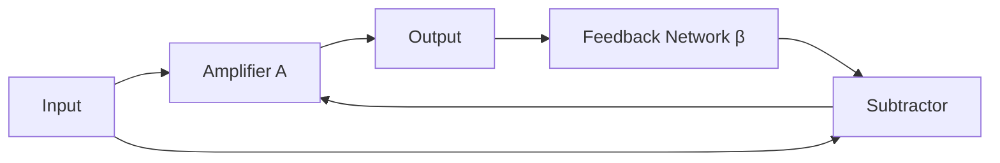
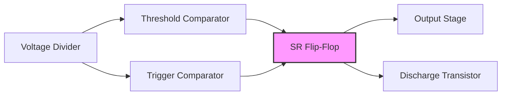

## Question 1(a) [3 marks]

**List advantages and disadvantages of negative feedback**

**Answer**:

| Advantages of Negative Feedback | Disadvantages of Negative Feedback |
|--------------------------------|----------------------------------|
| Increases bandwidth | Reduces gain |
| Improves stability | More components required |
| Reduces distortion | Complex circuit design |
| Decreases noise | Possibility of oscillations if improperly designed |
| Provides better input/output impedance control | Increased power consumption |

**Mnemonic:** "STAND" - Stability, linearity, Amplitude reduction, Noise reduction, Distortion reduction

## Question 1(b) [4 marks]

**Explain effect of negative feedback on gain and stability**

**Answer**:

| Effect on Gain | Effect on Stability |
|---------------|-------------------|
| Reduces gain by factor (1+Aβ) | Increases stability against temperature variations |
| Gain equation: A' = A/(1+Aβ) | Reduces sensitivity to component parameter changes |
| More predictable gain values | Prevents oscillations in normal operating conditions |
| Less variation in gain with temperature | Makes circuit performance more consistent over time |

**Diagram:**



**Mnemonic:** "GRIP" - Gain Reduction, Improved stability, Predictable performance

## Question 1(c) [7 marks]

**Derive an equation for overall gain of negative feedback voltage amplifier.**

**Answer**:

| Step | Equation | Description |
|------|----------|-------------|
| 1 | Vi = Vs - Vf | Input voltage equals source minus feedback |
| 2 | Vf = β × Vo | Feedback voltage is β times output voltage |
| 3 | Vo = A × Vi | Output voltage is amplifier gain times input voltage |
| 4 | Vo = A × (Vs - β × Vo) | Substituting (1) and (2) into (3) |
| 5 | Vo + A × β × Vo = A × Vs | Rearranging terms |
| 6 | Vo(1 + Aβ) = A × Vs | Factoring Vo |
| 7 | Vo/Vs = A/(1+Aβ) | Overall gain equation |

**Diagram:**


**Mnemonic:** "SAFE" - Source, Amplifier, Feedback, Equation A/(1+Aβ)

## Question 1(c-OR) [7 marks]

**Compare voltage shunt amplifier, voltage series, current shunt and current series amplifier.**

**Answer**:

| Parameter | Voltage Series | Voltage Shunt | Current Series | Current Shunt |
|-----------|---------------|--------------|----------------|---------------|
| **Input Signal** | Voltage | Voltage | Current | Current |
| **Output Signal** | Voltage | Current | Voltage | Current |
| **Input Configuration** | Series | Parallel | Series | Parallel |
| **Output Configuration** | Series | Series | Parallel | Parallel |
| **Input Impedance** | Increases | Decreases | Decreases | Increases |
| **Output Impedance** | Decreases | Decreases | Increases | Increases |
| **Application** | Voltage amplifiers | Transconductance amplifiers | Transresistance amplifiers | Current amplifiers |

**Diagram:**

```goat
+---------------------+       +---------------------+
|                     |       |                     |
| Voltage Series      |       | Voltage Shunt       |
| Zi↑ Zo↓             |       | Zi↓ Zo↓             |  
| Av↓                 |       | Av↓                 |
|                     |       |                     |
+---------------------+       +---------------------+

+---------------------+       +---------------------+
|                     |       |                     |
| Current Series      |       | Current Shunt       |
| Zi↓ Zo↑             |       | Zi↑ Zo↑             |
| Ai↓                 |       | Ai↓                 |
|                     |       |                     |
+---------------------+       +---------------------+
```

**Mnemonic:** "VISC" - Voltage In (Series/shunt), Signal Current (series/shunt)

## Question 2(a) [3 marks]

**Write application of UJT.**

**Answer**:

| Applications of UJT |
|---------------------|
| Relaxation oscillators |
| Timing circuits |
| Trigger circuits for SCR and TRIAC |
| Sawtooth wave generators |
| Pulse generators |
| Phase control in power electronics |

**Mnemonic:** "ROBOTS" - Relaxation Oscillators, Bistable circuits, Oscillators, Timing, Switching

## Question 2(b) [4 marks]

**Draw circuit diagram of Wein bridge oscillator and Heartly oscillator.**

**Answer**:

**Wein Bridge Oscillator:**

```goat
      R1
      ┌──┐
      │  │
┌─────┤  ├─────┬─────────┐
│     └──┘     │         │
│              │        ┌┴┐
│      C1     ┌┴┐ R2    │ │
│     ┌──┐    │ │       │ │ R3
│ ┌───┤  ├────┘ │       │ │
│ │   └──┘      │       └┬┘
│ │             │        │
│ │    R4       │        │
┌┴┐┌──┐         │        │
│ ││  │         │        │
│ ││  │        ┌┴┐       │
└┬┘└──┘        │ │       │
 │             │ │Op-amp │
 └─────────────┤ ├───────┘
               └┬┘
                │
                │ C2
             ┌──┤
             │  │
             │  │
             └──┘
```

**Hartley Oscillator:**

```goat
                   C1
            ┌───┤ ├────┐
            │         ┌┴┐
            │         │ │
            │         │ │ RFC
            │         │ │
            │         └┬┘
            │   ┌──────┴───┐
            │   │          │
            │   │  Q       │
            │   │    ┌─────┤
            │   └────┴─────┘
            │    │    │
           ┌┴┐  ┌┴┐  ┌┴┐
L1         │ │  │ │  │ │ L2
┌───┐      │ │  │ │  │ │ ┌───┐
│   ├──────┘ │  │ │  │ └─┤   │
│   │        │  │ │  │   │   │
└───┘        └──┴─┴──┘   └───┘
            L tap point
               │  │
              ┌┴┐ │
              │ │ │
              │ │ │  C2
              │ │ └─┤ ├─┐
              └┬┘       │
               │        │
               └────────┘
```

**Mnemonic:** "WH-RC-LC" - Wein uses RC, Hartley uses LC

## Question 2(c) [7 marks]

**Draw and explain the structure, working and characteristics of UJT.**

**Answer**:

**Structure of UJT:**

```goat
              Base 2 (B2)
                 │
                 ▼
              ┌─────┐
              │     │
              │  N  │
              │     │
              ├─────┤
              │     │◄── Emitter (E)
              │  P  │
              │     │
              ├─────┤
              │     │
              │  N  │
              │     │
              └─────┘
                 │
                 ▼
              Base 1 (B1)
```

| Structure | Working | Characteristics |
|-----------|---------|-----------------|
| N-type silicon bar with P-type junction | Acts as voltage divider with intrinsic stand-off ratio η | Negative resistance region in V-I curve |
| Three terminals: Base1, Base2, Emitter | When VE > ηVBB, it conducts | Peak point and valley point |
| Single P-N junction | Internal resistance decreases rapidly | Stable switching operation |
| Single junction but two bases | Generates relaxation oscillations | Temperature sensitivity |

**V-I Characteristics:**


**Mnemonic:** "PNVB" - P-N junction, Negative resistance, Valley point, Bases two

## Question 2(a-OR) [3 marks]

**Classify oscillators based on component used and operating frequency.**

**Answer**:

| Based on Components | Based on Operating Frequency |
|--------------------|----------------------------|
| RC Oscillators (Wien bridge, Phase shift) | Audio Frequency (20Hz-20kHz) |
| LC Oscillators (Hartley, Colpitts, Clapp) | Radio Frequency (20kHz-30MHz) |
| Crystal Oscillators (Quartz crystal) | Very High Frequency (30MHz-300MHz) |
| Relaxation Oscillators (UJT based) | Ultra High Frequency (300MHz-3GHz) |
| Negative Resistance Oscillators (Tunnel diode) | Microwave Frequency (>3GHz) |

**Mnemonic:** "RCLCN" - RC, LC, Crystal, Negative resistance

## Question 2(b-OR) [4 marks]

**Explain UJT as a relaxation oscillator**

**Answer**:

| Operation Stage | Description |
|----------------|-------------|
| Charging Phase | Capacitor charges through resistor R |
| Threshold Point | When capacitor voltage reaches peak point voltage (ηVBB), UJT turns ON |
| Discharge Phase | Capacitor discharges rapidly through UJT's low resistance |
| Reset | UJT turns OFF after capacitor voltage falls below valley point |

**Circuit Diagram:**

```goat
        VBB
         │
         ▼
        ┌┴┐
        │ │
        │ │ R1
        │ │
        └┬┘
         │     B2
         └───┬───┐
             │   │
             │   │
         R   │ UJT
      ┌──┐   │   │
  Vcc │  │   │   │
  ────┤  ├───┤   │
      └──┘   │   │
         │   │   │
         │   └───┘
         │     │
         │     │ B1
        ┌┴┐    │
  C     │ │    │
        │ │    │
        └┬┘    │
         │     │
         └─────┘
          GND
```

**Mnemonic:** "CTDR" - Charge, Threshold, Discharge, Repeat

## Question 2(c-OR) [7 marks]

**Sketch the circuit of Colpitts oscillator and explain working of it in brief**

**Answer**:

**Colpitts Oscillator Circuit:**

```goat
                    Vcc
                     │
                     ▼
                    ┌┴┐
                    │ │
                    │ │ RFC
                    │ │
                    └┬┘
          ┌──────────┴───────┐
          │                  │
          │    ┌─────────┐   │
          │    │         │   │
          │    │    Q    │   │
          │    │         │   │
          │    └─┬─────┬─┘   │
          │      │     │     │
          │      │     │     │
C1      ┌─┴─┐   ┌┴┐   ┌┴┐    │ C2
┌──┐    │   │   │ │   │ │    │ ┌──┐
│  ├────┤   │   │ │   │ │    ├─┤  │
│  │    │   │   │ │   │ │    │ │  │
└──┘    └─┬─┘   └┬┘   └┬┘    │ └──┘
          │      │     │     │
          │      └─────┘     │
          │        │         │
          │       ┌┴┐        │
          │       │ │        │
          │       │ │ L      │
          │       │ │        │
          │       └┬┘        │
          │        │         │
          └────────┴─────────┘
```

| Component | Function |
|-----------|----------|
| C1 and C2 | Voltage divider network that provides feedback |
| Inductor L | Forms LC tank circuit with C1 and C2 |
| Transistor Q | Provides amplification |
| RFC (Radio Frequency Choke) | Blocks AC while allowing DC |

**Working:**

1. Tank circuit (L with C1+C2) determines oscillation frequency
2. Frequency formula: f = 1/(2π√(L×(C1×C2)/(C1+C2)))
3. Feedback through capacitive voltage divider
4. Transistor amplifies and sustains oscillations
5. Phase shift of 180° through transistor, 180° through feedback network

**Mnemonic:** "COLTS" - Capacitors form Oscillations with L-Tank circuit Sustainably

## Question 3(a) [3 marks]

**Define the terms related to power amplifier:**
**i) collector Efficiency ii) Distortion iii) power dissipation capability**

**Answer**:

| Term | Definition |
|------|------------|
| **Collector Efficiency** | Ratio of AC output power to DC power supplied by the collector battery (η = P_out/P_DC × 100%) |
| **Distortion** | Unwanted change in waveform shape from input to output (measured as THD - Total Harmonic Distortion) |
| **Power Dissipation Capability** | Maximum power that amplifier can safely dissipate as heat without damage (P_D = V_CE × I_C) |

**Mnemonic:** "EDP" - Efficiency measures DC-to-AC conversion, Distortion alters signal, Power dissipation limits operation

## Question 3(b) [4 marks]

**Derive efficiency of class-A power amplifier.**

**Answer**:

| Step | Equation | Description |
|------|----------|-------------|
| 1 | P_DC = V_CC × I_C | DC power input |
| 2 | P_out = (V_peak × I_peak)/2 | AC power output |
| 3 | V_peak = V_CC | Maximum voltage swing |
| 4 | I_peak = I_C | Maximum current swing |
| 5 | P_out = (V_CC × I_C)/2 | Substituting max values |
| 6 | η = (P_out/P_DC) × 100% | Definition of efficiency |
| 7 | η = ((V_CC × I_C)/2)/(V_CC × I_C) × 100% | Substituting power values |
| 8 | η = 50% | Maximum theoretical efficiency |

**Diagram:**


**Mnemonic:** "HALF" - Highest Achievable Level Fifty percent

## Question 3(c) [7 marks]

**Explain operation of Complementary symmetry push-pull amplifier**

**Answer**:

**Circuit Diagram:**

```goat
              Vcc
               │
               ▼
              ┌┴┐
              │ │
              │ │ Rc1
              │ │
              └┬┘
               │
               ├────────┐
               │        │
               │   NPN  │
               │  Q1    │
               │   ┌────┴─┐
           R1  │   │      │ Output
       ┌──┐    │   │      ├─┬────►
 Input │  ├────┴───┤      │ │
 ──────┤  │        └──────┘ │
       └──┘             ┌───┴───┐
                        │       │
                        │  PNP  │
                        │  Q2   │
                        │       │
                        └───┬───┘
                            │
                           ┌┴┐
                           │ │
                           │ │ Rc2
                           │ │
                           └┬┘
                            │
                            ▼
                           -Vcc
```

| Operation | Description |
|-----------|-------------|
| **Positive Half Cycle** | NPN transistor Q1 conducts, PNP transistor Q2 is OFF |
| **Negative Half Cycle** | PNP transistor Q2 conducts, NPN transistor Q1 is OFF |
| **Crossover Region** | Both transistors are almost OFF, causing crossover distortion |
| **Bias Circuit** | Reduces crossover distortion by providing slight forward bias |
| **Efficiency** | Higher than Class A (theoretically up to 78.5%) |
| **Heat Dissipation** | Better than Class A as only one transistor conducts at a time |

**Mnemonic:** "COPS" - Complementary transistors, Opposite conducting cycles, Push-pull operation, Symmetrical output

## Question 3(a-OR) [3 marks]

**Give classification of Power amplifier**

**Answer**:

| Classification Basis | Types |
|---------------------|-------|
| **Based on Biasing** | Class A, Class B, Class AB, Class C |
| **Based on Configuration** | Single-ended, Push-pull, Complementary symmetry |
| **Based on Coupling** | RC coupled, Transformer coupled, Direct coupled |
| **Based on Frequency Range** | Audio power amplifier, RF power amplifier |
| **Based on Operating Mode** | Linear, Switching (Class D, E, F) |

**Mnemonic:** "ABCDE" - A, B, C classes, Direct/transformer coupling, Efficiency increases from A to C

## Question 3(b-OR) [4 marks]

**Derive efficiency of class B push pull amplifier**

**Answer**:

| Step | Equation | Description |
|------|----------|-------------|
| 1 | P_DC = (2 × V_CC × I_max)/π | DC power input (each transistor conducts for half cycle) |
| 2 | P_out = (V_CC × I_max)/2 | AC power output |
| 3 | η = (P_out/P_DC) × 100% | Definition of efficiency |
| 4 | η = ((V_CC × I_max)/2)/((2 × V_CC × I_max)/π) × 100% | Substituting power values |
| 5 | η = (π/4) × 100% | Simplifying |
| 6 | η = 78.5% | Maximum theoretical efficiency |

**Diagram:**


**Mnemonic:** "PIPE" - Pi divided by four Equals efficiency

## Question 3(c-OR) [7 marks]

**Differentiate between class A, B, C and AB power amplifier.**

**Answer**:

| Parameter | Class A | Class B | Class AB | Class C |
|-----------|---------|---------|----------|---------|
| **Conduction Angle** | 360° | 180° | 180°-360° | <180° |
| **Bias Point** | At center of load line | At cutoff | Slightly above cutoff | Below cutoff |
| **Efficiency** | 25-30% | 78.5% | 50-78.5% | Up to 90% |
| **Distortion** | Lowest | High (crossover) | Low | Very high |
| **Linearity** | Best | Poor | Good | Poor |
| **Power Output** | Low | Medium | Medium | High |
| **Applications** | High-fidelity audio | Audio power amplifiers | Audio power amplifiers | RF power amplifiers |

**Waveform Comparison:**

```goat
Class A:      Class B:      Class AB:     Class C:
   ┌───┐         ┌───┐        ┌───┐         ┌───┐
   │   │         │   │        │   │         │   │
───┘   └───   ───┘   │      ───┘   │      ───┘   │
                └───┐         └───┐         └───┐
                    │            │            │
                    └───         └───         └───
```

**Mnemonic:** "ABCE" - Angle decreases, Bias moves to cutoff, Conduction decreases, Efficiency increases

## Question 4(a) [3 marks]

**Define (i) CMRR (ii) Slew rate**

**Answer**:

| Parameter | Definition | Typical Value |
|-----------|------------|---------------|
| **CMRR (Common Mode Rejection Ratio)** | Ratio of differential mode gain to common mode gain, expressed in dB | 90-120 dB |
| | CMRR = 20 log(Ad/Acm) | Higher is better |
| **Slew Rate** | Maximum rate of change of output voltage per unit time | 0.5-10 V/μs |
| | SR = dVo/dt | Higher means faster response |

**Mnemonic:** "CRSR" - Common Rejection Slope Rate

## Question 4(b) [4 marks]

**Explain Op-amp as a Summing amplifier.**

**Answer**:

**Circuit Diagram:**

```goat
         R_f
      ┌──────┐
      │      │
      │      │
      │    ┌─┴─┐
R1    │    │   │
┌──────┐   │   │
│      │   │   │
V1─────┤    >──┼──── V_out
       │   │   │
└──────┘   │   │
      │    │   │
R2    │    └─┬─┘
┌──────┐     │
│      │     │
V2─────┤     │
       │     │
└──────┘     │
      │      │
      └──────┘
```

| Operation | Description |
|-----------|-------------|
| **Working Principle** | Virtual ground concept - inverting input maintained at ground potential |
| **Output Equation** | V_out = -(R_f/R1 × V1 + R_f/R2 × V2 + ... + R_f/Rn × Vn) |
| **Special Case** | When all input resistors equal (R1=R2=...=Rn=R), V_out = -(R_f/R) × (V1+V2+...+Vn) |
| **Applications** | Audio mixers, Analog computers, Signal conditioning circuits |

**Mnemonic:** "SWAP" - Summing With Amplification Property

## Question 4(c) [7 marks]

**Draw noninverting amplifier using op Amp and Derive equation of voltage Gain. Also draw input and output waveform for it**

**Answer**:

**Circuit Diagram:**

```goat
         ┌───────────┐
         │           │
         │           │
         │         ┌─┴─┐
         │         │   │
         │   R_f   │   │
     ┌───┴───┐     │   │
     │       │     │   │
     │       │     │   │ V_out
     └───┬───┘     └─┬─┼───────►
         │           │ │
         │           │ │
         └───────────┘ │
                       │
                       │
     V_in              │
     ───────────┬──────┘
                │
                │
                │  R1
               ┌┴┐
               │ │
               │ │
               └┬┘
                │
                │
                ▼
               GND
```

| Parameter | Description |
|-----------|-------------|
| **Voltage Gain Equation** | A_v = 1 + (R_f/R1) |
| **Input Impedance** | Very high (typically >10⁶ Ω) |
| **Output Impedance** | Very low (typically <100 Ω) |
| **Phase Shift** | 0° (in phase) |

**Input and Output Waveforms:**

```goat
Input:               Output:
      ┌───┐                ┌───────┐
      │   │                │       │
      │   │                │       │
      │   │                │       │
______│   │______    ______│       │______
      └───┘                └───────┘

Gain = 1 + (R_f/R1) > 1
```

**Derivation of Voltage Gain:**

1. Voltage at both input pins is equal (V⁺ = V⁻)
2. In an ideal op-amp, voltage at the inverting input, V⁻ = V_in
3. The feedback network forms a voltage divider:
   V⁻ = V_out × [R1/(R1+R_f)]
4. Equating the above two equations:
   V_in = V_out × [R1/(R1+R_f)]
5. Rearranging:
   V_out/V_in = (R1+R_f)/R1 = 1 + (R_f/R1)
6. Therefore, A_v = 1 + (R_f/R1)

**Characteristics of Non-inverting Amplifier:**

- Output is in phase with input (0° phase shift)
- High input impedance makes it ideal as voltage amplifier
- Gain is always greater than 1
- Noise rejection is lower than inverting amplifier

**Mnemonic:** "UPON" - Unity Plus One plus Noninverting gain

## Question 4(a-OR) [3 marks]

**Draw symbol of operational amplifier. Draw pin diagram of IC 741.**

**Answer**:

**Op-Amp Symbol:**

```goat
             ┌───────────────┐
             │               │
  Non-inv    │               │
  Input ─────┤+              │
             │               │
             │      Op-Amp   ├───── Output
             │               │
  Inverting  │               │
  Input ─────┤-              │
             │               │
             └───┬─────┬─────┘
                 │     │
                 │     │
            V+   ▼     ▼   V-
           Supply voltages
```

**IC 741 Pin Diagram:**

```goat
        ┌────┐
Offset  │1  8│  NC
Null  1 ├────┤
        │    │
     -  │2  7│  V+
  Input ├────┤
        │    │
     +  │3  6│  Output
  Input ├────┤
        │    │
     V- │4  5│  Offset
        ├────┤     Null 2
        └────┘
```

**Mnemonic:** "7-PIN" - 741 Pinout INcludes power, inputs, null, output

## Question 4(b-OR) [4 marks]

**Draw and explain inverting configuration of op-amp with derivation of voltage gain.**

**Answer**:

**Inverting Amplifier Circuit:**

```goat
       R_f
     ┌─────┐
     │     │
     │     │
     │   ┌─┴─┐
     │   │   │
R_i  │   │   │
 ┌───┴───┤   │
 │       │   │
Vin      │   │ V_out
 └───────┤   ├───────►
         └─┬─┘
   ┌─────┐ │
   │     │ │
   │     │ │
   └─────┘ │
     │     │
     ▼     │
    GND    │
           └─────────
```

| Step | Description |
|------|-------------|
| 1 | Apply virtual ground concept (V⁻ ≈ 0) |
| 2 | Current through R_i: I_i = V_in/R_i |
| 3 | Current through R_f: I_f = -V_out/R_f |
| 4 | By Kirchhoff's current law: I_i + I_f = 0 |
| 5 | Therefore, V_in/R_i = V_out/R_f |
| 6 | Voltage gain: A_v = V_out/V_in = -R_f/R_i |

**Mnemonic:** "IRON" - Inverting Ratio Of Negative feedback

## Question 4(c-OR) [7 marks]

**Explain Op-amp as an Integrator.**

**Answer**:

**Integrator Circuit:**

```goat
         R
    ┌─────────┐
    │         │
Vin │         │      C
    └─────────┤  ┌─────────┐
              │  │         │
              │  │         │
              └──┤       ┌─┴─┐
                 │       │   │
                 │       │   │
                 └───────┤   │ V_out
                         │   ├───────►
                         │   │
                         └─┬─┘
                     ┌─────┴───┐
                     │         │
                     │         │
                     └─────────┘
                          │
                          │
                          ▼
                         GND
```

| Parameter | Description |
|-----------|-------------|
| **Transfer Function** | V_out = -(1/RC) ∫V_in dt |
| **Input Signal** | Any waveform (DC, sine, square, etc.) |
| **Output for Constant Input** | Ramp (linearly increasing/decreasing) |
| **Output for Square Wave** | Triangular wave |
| **Output for Sine Wave** | Cosine wave (90° phase shift) |

**Waveform Transformations:**

```goat
Input:               Output:
DC:                  Ramp:
──────                   ∕
                        ∕
                       ∕
                      ∕

Square Wave:         Triangular Wave:
      ┌───┐                  ∕\
      │   │                 ∕  \
      │   │                ∕    \
______│   │______         ∕      \____
      └───┘

Sine Wave:           Cosine Wave:
     ┌─┐                   ┌─┐
    ∕   \                 │   │
   ∕     \               ∕     \
──┘       └──          ─┘       └─
```

**Practical Considerations:**

- Need for reset switch across capacitor
- Saturation due to input offset voltage
- Limited frequency range due to op-amp bandwidth

**Mnemonic:** "SIRT" - Signal Integration Results in Time-domain transformation

## Question 5(a) [3 marks]

**Draw the diagram of Sequential Timer.**

**Answer**:

**Sequential Timer Circuit using IC 555:**

```goat
                        Vcc
                         │
                         ▼
                ┌────────┬────────┐
                │        │        │
               ┌┴┐      ┌┴┐      ┌┴┐
               │ │      │ │      │ │
          R1   │ │      │ │ R2   │ │ R3
               │ │      │ │      │ │
               └┬┘      └┬┘      └┬┘
                │        │        │
                │   ┌────┼────┐   │   ┌────────┐
                │   │    │ 8  │   │   │        │
          ┌─────┼───┤7   └────┤3  ├───┤7       │
          │     │   │         │   │   │        │
          │     │   │         │   │   │        │
 C1      ┌┴┐    │   │  555    │   │   │  555   │
┌──┐     │ │    │   │  (1)    │   │   │  (2)   │
│  ├─────┤ ├────┼───┤6        │   └───┤2       │
│  │     │ │    │   │         │       │        │
└──┘     └┬┘    └───┤2        │       │        │    More stages
          │         │         │       │        │       can be
          │         │   GND   │       │Output  │       added
          │         └────┬────┘       └────┬───┘
          │              │                 │
          └──────────────┘                 ▼
```

**Mnemonic:** "STTR" - Sequential Timing Through Relay-like operation

## Question 5(b) [4 marks]

**Explain working of timer IC 555 using block diagram**

**Answer**:

**Block Diagram of IC 555:**



| Block | Function |
|-------|----------|
| **Voltage Divider** | Creates reference voltages of (2/3)VCC and (1/3)VCC |
| **Threshold Comparator** | Compares threshold pin voltage with (2/3)VCC |
| **Trigger Comparator** | Compares trigger pin voltage with (1/3)VCC |
| **SR Flip-Flop** | Controls output state based on comparator inputs |
| **Output Stage** | Provides current to drive external loads |
| **Discharge Transistor** | Discharges timing capacitor when output is low |

**Mnemonic:** "VTTDO" - Voltage divider, Two comparators, Toggle flip-flop, Discharge, Output

## Question 5(c) [7 marks]

**Explain astable multivibrator of timer IC 555.**

**Answer**:

**Astable Multivibrator Circuit:**

```goat
               Vcc
                │
                ▼
               ┌┴┐
               │ │
               │ │ Ra
               │ │
               └┬┘
                │        ┌──────────┐
                ├────────┤8  Vcc    │
                │        │          │
                │       ┌┴┐         │
                │       │ │         │
                │       │ │ Rb      │   Output
                │       │ │  ┌──────┼───────►
                │       └┬┘  │      │3
                │ ┌──────┼───┤7 Dis │
                │ │      │   │      │
                │ │      ├───┤6 Thr │
              ┌─┴─┐      │   │      │
              │   │      |   │ 555  │
         C    │   │      │   │      │
        ┌──┐  │   │      ├───┤2 Trg │
        │  ├──┤   │      │   │      │
        │  │  │   │      │   │      │
        └──┘  └───┘      │   │      │
               │         │   │      │
               │         │ ┌─┴─┐    │
               │         └─┤5  │    │
               │           │   │    │
               │           └───┘    │
               │        ┌───────────┘
               │        │
               └────────┤1 GND
                        │
                        ▼
```

| Parameter | Formula | Description |
|-----------|---------|-------------|
| **Charging Time (HIGH)** | t₁ = 0.693 × (Ra + Rb) × C | Output HIGH duration |
| **Discharging Time (LOW)** | t₂ = 0.693 × Rb × C | Output LOW duration |
| **Total Period** | T = t₁ + t₂ = 0.693 × (Ra + 2Rb) × C | Complete cycle time |
| **Frequency** | f = 1.44/((Ra + 2Rb) × C) | Number of cycles per second |
| **Duty Cycle** | D = (Ra + Rb)/(Ra + 2Rb) | Ratio of HIGH time to total period |

**Waveforms:**

```goat
Capacitor Voltage:       Output Voltage:
      ┌─┐ ┌─┐ ┌─┐              ┌───┐ ┌───┐ ┌───┐
     ∕ │∕ │∕ │∕ │             │   │ │   │ │   │
    ∕  │  │  │  │             │   │ │   │ │   │
   ∕   │  │  │  │             │   │ │   │ │   │
──┘    └─┘ └─┘ └─┘     _______│   │_│   │_│   │____
  2/3Vcc                       t₁    t₂
  1/3Vcc
```

**Mnemonic:** "FREE" - Frequency Related to External Elements

## Question 5(a-OR) [3 marks]

**Draw Pin Diagram of IC 555.**

**Answer**:

**IC 555 Pin Configuration:**

```goat
          ┌───────┐
  GND   1 │       │ 8   Vcc
          │       │
TRIGGER 2 │       │ 7   DISCHARGE
          │  555  │
 OUTPUT 3 │       │ 6   THRESHOLD
          │       │
 RESET  4 │       │ 5   CONTROL
          └───────┘
```

| Pin Name | Pin Number | Function |
|----------|------------|----------|
| GND | 1 | Ground reference |
| TRIGGER | 2 | Starts timing cycle when < 1/3 VCC |
| OUTPUT | 3 | Output terminal |
| RESET | 4 | Resets timing cycle when LOW |
| CONTROL | 5 | Controls threshold and trigger levels |
| THRESHOLD | 6 | Ends timing cycle when > 2/3 VCC |
| DISCHARGE | 7 | Discharges timing capacitor |
| VCC | 8 | Positive supply voltage (4.5V-18V) |

**Mnemonic:** "GTORCTDV" - Ground, Trigger, Output, Reset, Control, Threshold, Discharge, Vcc

## Question 5(b-OR) [4 marks]

**Explain monostable multivibrator of timer IC 555.**

**Answer**:

**Monostable Multivibrator Circuit:**

```goat
               Vcc
                │
                ▼
               ┌┴┐
               │ │
               │ │ R
               │ │
               └┬┘
                │        ┌──────────┐
                ├────────┤8  Vcc    │
                │        │          │
                │        │          │
                │        │          │
                ├────────┤7 Dis     │   Output
                │        │       ┌──┼───────►
                │        │       │  │3
                │        │       │  │
                │ ┌──────┼───────┤  │
                │ │      │       │  │
                │ │      └───────┤6 Thr │
              ┌─┴─┐              │      │
              │   │              │ 555  │
         C    │   │              │      │
        ┌──┐  │   │          ┌───┤2 Trg │
        │  ├──┤   │  Trigger │   │      │
        │  │  │   │   ───────┘   │      │
        └──┘  └───┘              │      │
               │                ┌┴┐     │
               │                │ │     │
               │                │ │     │
               │                └┬┘     │
               │        ┌────────┼──────┘
               │        │        │
               └────────┤1 GND   │4 RST
                        │        │
                        ▼        ▼
```

| Parameter | Description |
|-----------|-------------|
| **Trigger** | Negative edge triggered at pin 2 (<1/3 VCC) |
| **Pulse Width** | T = 1.1 × R × C seconds |
| **Operating States** | Stable state (output LOW) and quasi-stable state (output HIGH) |
| **Reset** | Can be terminated early by applying LOW to Reset pin |

**Monostable Operation:**

1. Output normally LOW
2. Negative trigger pulse initiates timing cycle
3. Output goes HIGH for duration T
4. After time T, output returns to LOW
5. Circuit ignores additional trigger pulses during timing cycle

**Mnemonic:** "OPTS" - One Pulse Timed by Single trigger

## Question 5(c-OR) [7 marks]

**Explain bistable multivibrator of timer IC 555.**

**Answer**:

**Bistable Multivibrator Circuit:**

```goat
               Vcc
                │
                ▼
               ┌┴┐
               │ │
               │ │ R1
               │ │
               └┬┘
                │        ┌──────────┐
                ├────────┤8  Vcc    │
                │        │          │
                │        │          │
                │        │          │
                ├────────┤4 RST     │   Output
                │        │       ┌──┼───────►
                │        │       │  │3
                │        │       │  │
                │        │       │  │
                │        │       │  │
                │        │       │  │
                │        │  555  │  │
                │        │       │  │
  Reset       ┌─┴─┐      │       │  │
  Switch      │ o │──────┤6 THR  │  │
  ───────── ──┤ o │      │       │  │
              └───┘      │       │  │
                │        │       │  │
                │        │       │  │
              ┌─┴─┐      │       │  │
  Set         │ o │──────┤2 TRG  │  │
  Switch      │ o │      │       │  │
  ────────────┤   │      │       │  │
              └───┘      │       │  │
               │         │       │  │
               │         │       │  │
               │      ┌──┴───────┘  │
               │      │             │
               └──────┤1 GND        │
                      │             │
                      ▼             │
```

| State | Condition | Output |
|-------|-----------|--------|
| **Set State** | Trigger pin (2) momentarily pulled below 1/3 VCC | HIGH |
| **Reset State** | Reset pin (4) momentarily pulled LOW | LOW |
| **Memory Function** | Maintains state until changed by input | Stable in either state |

**Bistable Operation:**

1. Circuit has two stable states (HIGH or LOW)
2. SET input (Trigger) makes output HIGH
3. RESET input makes output LOW
4. No timing components needed
5. Functions as a basic latch or flip-flop

**Applications:**

- Toggle switches
- Memory elements
- Bounce-free switching
- Level shifting
- Push-button ON/OFF control

**Mnemonic:** "SRSS" - Set-Reset Stable States
