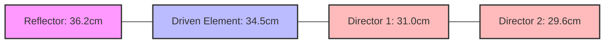

## પ્રશ્ન 1(અ) [3 ગુણ]

**ઇલેક્ટ્રોમેગ્નેટિક તરંગોના કોઈપણ ત્રણ ગુણધર્મો લખો**

**જવાબ**:

| ઇલેક્ટ્રોમેગ્નેટિક તરંગોના ગુણધર્મો |
|:-----------------------------------|
| 1. EM તરંગો નિર્વાત અથવા પદાર્થ માધ્યમમાં પ્રવાસ કરી શકે છે |
| 2. EM તરંગો ફ્રી સ્પેસમાં પ્રકાશની ગતિએ પ્રવાસ કરે છે (3×10⁸ m/s) |
| 3. EM તરંગો દોલનશીલ વીજળી અને ચુંબકીય ક્ષેત્રો સાથે આડી લાક્ષણિકતાઓ દર્શાવે છે |

**મેમરી ટ્રીક:** "VTS" - Vacuum travel, Transverse nature, Speed of light

## પ્રશ્ન 1(બ) [4 ગુણ]

**વ્યાખ્યા લખો: (1) રેડિયેશન રેઝિસ્ટન્સ (2) ડાયરેક્ટિવિટી (3) ગેઈન**

**જવાબ**:

| શબ્દ | વ્યાખ્યા |
|:-----|:-----------|
| **રેડિયેશન રેઝિસ્ટન્સ** | તે સમકક્ષ અવરોધ છે જે એન્ટેના ઇનપુટ કરંટની બરાબર હોય ત્યારે એન્ટેના દ્વારા વિકિરણ કરવામાં આવતી ઊર્જા જેટલી જ ઊર્જા વેડફે છે |
| **ડાયરેક્ટિવિટી** | ચોક્કસ દિશામાં મહત્તમ વિકિરણ તીવ્રતા અને બધી દિશાઓમાં સરેરાશ વિકિરણ તીવ્રતાનો ગુણોત્તર |
| **ગેઈન** | નિર્દિષ્ટ દિશામાં રેડિયો તરંગોમાં ઇનપુટ પાવરને કેટલી કાર્યક્ષમતાથી રૂપાંતરિત કરે છે તે માપતા ડાયરેક્ટિવિટી અને રેડિયેશન એફિશિયન્સીનો ગુણાકાર |

**મેમરી ટ્રીક:** "RDG" - Resistance dissipates power, Direction concentration, Gain includes efficiency

## પ્રશ્ન 1(ક) [7 ગુણ]

**ઇલેક્ટ્રોમેગ્નેટિક તરંગોના નિર્માણની ભૌતિક ખ્યાલ સુઘડ રેખાકૃતિ સાથે સમજાવો**

**જવાબ**:

ઇલેક્ટ્રોમેગ્નેટિક તરંગો ત્યારે ઉત્પન્ન થાય છે જ્યારે ઇલેક્ટ્રિક ચાર્જ પ્રવેગ કરે છે અથવા દોલન કરે છે, જે અવકાશમાં પ્રસરિત થતા યુગ્મિત દોલનશીલ ઇલેક્ટ્રિક અને ચુંબકીય ક્ષેત્રો બનાવે છે.


**ડાયગ્રામ: ડાયપોલ એન્ટેના EM તરંગ ઉત્પાદન**

```goat
                 +
                 |
                 |
    Oscillator   |      Electric field lines
    +---------+  |      ∽∽∽∽∽∽∽∽∽∽∽∽∽∽∽>
    |         |  |
    |    ~    |--+      Magnetic field lines
    |         |  |      ⊙⊙⊙⊙⊙⊙⊙⊙⊙⊙⊙⊙⊙⊙⊙
    +---------+  |
                 |
                 |
                 -
```

- **મૂળભૂત ખ્યાલ**: જ્યારે AC કરંટ એન્ટેનામાં વહે છે, ત્યારે ઇલેક્ટ્રોન ઉપર અને નીચે પ્રવેગ કરે છે
- **ઇલેક્ટ્રિક ફિલ્ડ**: એન્ટેનામાં ચાર્જ વિભાજનથી બને છે
- **મેગ્નેટિક ફિલ્ડ**: કરંટ પ્રવાહથી ઉત્પન્ન થાય છે, ઇલેક્ટ્રિક ફિલ્ડને લંબરૂપે
- **પ્રસરણ**: ફિલ્ડ એન્ટેનાથી અલગ થઈને પ્રકાશની ગતિએ બહારની તરફ પ્રસરે છે
- **સ્વ-ટકાઉ**: તરંગ પ્રવાસ કરતાં દરેક ફિલ્ડ ઘટક અન્ય ઘટકને પુનર્જીવિત કરે છે

**મેમરી ટ્રીક:** "COMAP" - Current Oscillations Make Alternating Propagations

## પ્રશ્ન 1(ક) OR [7 ગુણ]

**435 MHZ આવૃત્તિ માટે 4 એલિમેન્ટ વાળુ યાગી ઉદા એન્ટેના ની ડિઝાઇન બનાવો.**

**જવાબ**:

435 MHz માટે 4-એલિમેન્ટ યાગી-ઉદા એન્ટેના માટે:

| એલિમેન્ટ | લંબાઈ ફોર્મ્યુલા | અંતર ફોર્મ્યુલા | ગણતરી કરેલ મૂલ્ય |
|:----------|:----------------|:-----------------|:-----------------|
| **રિફ્લેક્ટર** | 0.5λ × 1.05 | - | 36.2 cm |
| **ડ્રાઇવન એલિમેન્ટ** | 0.5λ | - | 34.5 cm |
| **ડાયરેક્ટર 1** | 0.45λ | ડ્રાઇવનથી 0.2λ | 31.0 cm, 13.8 cm અંતર |
| **ડાયરેક્ટર 2** | 0.43λ | ડાયરેક્ટર 1થી 0.25λ | 29.6 cm, 17.2 cm અંતર |

**વપરાયેલા સૂત્રો**:

- તરંગલંબાઈ: λ = c/f = 3×10⁸/435×10⁶ = 0.69 મીટર
- હાફ-વેવ ડાયપોલ: L = 0.5λ = 34.5 cm
- એલિમેન્ટ અંતર: S = 0.15λ થી 0.25λ



**મેમરી ટ્રીક:** "RDDS" - Reflector Driven Directors Shrink

## પ્રશ્ન 2(અ) [3 ગુણ]

**લુપ એન્ટેના આકૃતિની મદદથી સમજાવો**

**જવાબ**:

લુપ એન્ટેના એક વાહક ને લુપ આકારમાં બનાવીને વિકિરણ ઘટક બનાવવામાં આવે છે.

```goat
    ┌───────────┐
    │           │
    │           │
    │           │
    │           │
    │     ↺     │ Current flow
    │           │
    │           │
    │           │
    └─────┬─────┘
          │
          │ Feed point
       ───┴───
```

- **નાના લુપ**: પરિઘ < λ/10, રેડિએશન પેટર્ન મેગ્નેટિક ડાયપોલ જેવા
- **મોટા લુપ**: પરિઘ ≈ તરંગલંબાઈ, દ્વિદિશાત્મક રેડિએશન પેટર્ન
- **ઉપયોગો**: દિશા શોધવી, AM રેડિયો રિસેપ્શન, RFID ટેગ્સ

**મેમરી ટ્રીક:** "SLC" - Size affects Loop Characteristics

## પ્રશ્ન 2(બ) [4 ગુણ]

**નોન રેઝોનેંટ વાયર એન્ટેના સમજાવો**

**જવાબ**:

| લક્ષણ | વર્ણન |
|:------------|:-----------|
| **વ્યાખ્યા** | એવા આવૃત્તિઓ પર કાર્ય કરતા એન્ટેના જ્યાં તેની ભૌતિક લંબાઈ અર્ધ-તરંગલંબાઈના ગુણાંક નથી |
| **ઇમ્પીડન્સ** | જટિલ, રેઝિસ્ટિવ અને રિએક્ટિવ બંને ઘટકો સાથે |
| **સ્ટેન્ડિંગ વેવ્સ** | એન્ટેનાની લંબાઈ પર હાજર |
| **ઉદાહરણ** | રોમ્બિક એન્ટેના, અંતમાં અવરોધથી ટર્મિનેટ કરેલ |
| **ફાયદો** | વાઇડબેન્ડ ઓપરેશન, મલ્ટીપલ ફ્રીક્વન્સી માટે યોગ્ય |

**મેમરી ટ્રીક:** "NITRO" - Non-resonance Incurs Termination for Resistance and Operation

## પ્રશ્ન 2(ક) [7 ગુણ]

**હાફ વેવ ડાયપોલ એન્ટેના નું રેડિયેશન રેઝીસ્ટંસ કેટલું હોય છે? λ/2, λ અને λ/4 લમ્બાઇ ના એન્ટેના રેડિયેશન ની પેટર્ન દોરો**

**જવાબ**:

હાફ-વેવ ડાયપોલનું રેડિયેશન રેઝીસ્ટંસ આશરે 73 ઓહ્મ હોય છે.

**રેડિયેશન પેટર્ન:**

```goat
   λ/2 Dipole             λ Dipole              λ/4 Dipole
   
      0°                     0°                     0°
      |                      |                      |
270°--+--90°   vs.     270°---+---90°   vs.    270°---+---90°
      |                      |                      |
     180°                   180°                   180°
    (Figure-8)         (Multiple lobes)         (Broad pattern)
```

| ડાયપોલ લંબાઈ | પેટર્ન લક્ષણો |
|:--------------|:------------------------|
| **λ/2 ડાયપોલ** | ફિગર-8 પેટર્ન; એન્ટેના અક્ષને લંબરૂપે મહત્તમ વિકિરણ; HPBW = 78° |
| **λ ડાયપોલ** | મલ્ટી-લોબ્ડ પેટર્ન; એન્ટેના અક્ષ પર કોણે ચાર મુખ્ય લોબ |
| **λ/4 ડાયપોલ** | λ/2 કરતાં વધુ વિશાળ પેટર્ન; સમતુલ્ય ડાયપોલ પૂર્ણ કરવા માટે ગ્રાઉન્ડ પ્લેનની જરૂર |

**મેમરી ટ્રીક:** "SHORT" - Smaller Half-dipole Offers Rounded-Transmissions

## પ્રશ્ન 2(અ) OR [3 ગુણ]

**ફોલ્ડેડ ડાઇપોલ એન્ટેના આકૃતિની મદદથી સમજાવો**

**જવાબ**:

ફોલ્ડેડ ડાયપોલ એ હાફ-વેવ ડાયપોલનો એક પ્રકાર છે જેમાં છેડાઓને પાછા વાળીને લૂપ બનાવવા માટે જોડવામાં આવે છે.

```goat
    ┌───────────────────────────┐
    │                           │
    │                           │
    │                           │
    └───────────┬───────────────┘
                │
                │ Feed point
             ───┴───
```

- **ઇનપુટ ઇમ્પીડન્સ**: આશરે 300 ઓહ્મ (સામાન્ય ડાયપોલના 4 ગણા)
- **બેન્ડવિડ્થ**: સામાન્ય ડાયપોલ કરતાં વધારે
- **ઉપયોગો**: TV રિસેપ્શન, FM રેડિયો, બેલેન્સ્ડ ટ્રાન્સમિશન લાઇન્સ

**મેમરી ટ્રીક:** "FIB" - Folded Increases Bandwidth

## પ્રશ્ન 2(બ) OR [4 ગુણ]

**રોમ્બિક એન્ટેના આકૃતિની મદદથી સમજાવો**

**જવાબ**:

રોમ્બિક એન્ટેના એક રોમ્બસ અથવા હીરા આકારમાં ગોઠવાયેલા ચાર તારોનો બનેલો હોય છે.

```goat
              Direction of 
                radiation
                   ↓
            A ◄─────────► B
            /             \
           /               \
          /                 \
Feed ────┐                   ┌──── Termination
          \                 /
           \               /
            \             /
            D ◄─────────► C
```

| લક્ષણ | વર્ણન |
|:---------------|:------------|
| **આકાર** | ડાયમંડ/રોમ્બસ, દૂરના છેડે ટર્મિનેટિંગ રેઝિસ્ટર સાથે |
| **ઓપરેશન** | નોન-રેઝોનન્ટ ટ્રાવેલિંગ-વેવ એન્ટેના |
| **ડાયરેક્ટિવિટી** | ઉચ્ચ ગેઇન, યુનિડાયરેક્શનલ પેટર્ન |
| **બેન્ડવિડ્થ** | ખૂબ વિશાળ આવૃત્તિ શ્રેણી |
| **ઉપયોગો** | HF કમ્યુનિકેશન્સ, પોઇન્ટ-ટુ-પોઇન્ટ લિંક્સ |

**મેમરી ટ્રીક:** "TREND" - Terminated Rhombic Enables Numerous Directions

## પ્રશ્ન 2(ક) OR [7 ગુણ]

**આકૃતિની મદદથી એન્ડ ફાયર અને બ્રોડ સાઇડ એન્ટેના નો તફાવત સમજાવો**

**જવાબ**:

| પેરામીટર | બ્રોડસાઇડ એરે | એન્ડ ફાયર એરે |
|:----------|:----------------|:---------------|
| **મહત્તમ વિકિરણની દિશા** | એરે અક્ષને લંબરૂપે | એરે અક્ષ સાથે |
| **એલિમેન્ટ ફેઝિંગ** | સમાન ફેઝ (0°) | પ્રગતિશીલ ફેઝ શિફ્ટ |
| **એલિમેન્ટ અંતર** | સામાન્ય રીતે λ/2 | સામાન્ય રીતે λ/4 |
| **રેડિયેશન પેટર્ન** | ફેન-આકારનો બીમ | પેન્સિલ-આકારનો બીમ |
| **ઉપયોગો** | બ્રોડકાસ્ટિંગ, બેઝ સ્ટેશન્સ | પોઇન્ટ-ટુ-પોઇન્ટ લિંક્સ |

**ડાયાગ્રામ સરખામણી:**

```goat
   Broadside Array                     End fire Array
   
   ─o─────o─────o─────o─         ─o─────o─────o─────o─
        Array Axis                     Array Axis
         
         ↑ ↑ ↑ ↑                 →→→→→→→→→→→→→→→→→→→→→
      Main radiation                Main radiation
        direction                     direction
```

**મેમરી ટ્રીક:** "PAPER" - Perpendicular And Parallel Emission Respectively

## પ્રશ્ન 3(અ) [3 ગુણ]

**આકૃતિની મદદથી ઇન્વર્ટેડ વી એન્ટેના સમજાવો**

**જવાબ**:

ઇન્વર્ટેડ V એન્ટેના એ ડાયપોલ છે જેની બાહુઓ નીચેની તરફ વળેલી હોય છે, ઉલટા "V" જેવી દેખાય છે.

```goat
                   ▲
                   │ Support
                   │
                   │
                  /│\
                 / │ \
                /  │  \
               /   │   \
              /    │    \
             /     │     \
            ◄─────┐│┌─────►
                  ││
                Feed point
```

- **ખૂણો**: બાહુઓ સામાન્ય રીતે 90°-120° ખૂણો બનાવે છે
- **ઇમ્પીડન્સ**: આશરે 50 ઓહ્મ, આડા ડાયપોલ કરતાં ઓછું
- **પેટર્ન**: સર્વવ્યાપી, આડા ડાયપોલ કરતાં થોડું વધુ વિશાળ
- **ઉપયોગો**: એમેચ્યોર રેડિયો, શોર્ટવેવ કમ્યુનિકેશન્સ

**મેમરી ટ્રીક:** "AVS" - Angle Varies Signal

## પ્રશ્ન 3(બ) [4 ગુણ]

**આકૃતિની મદદથી પેરાબોલિક રીફ્લેક્ટર એન્ટેના સમજાવો**

**જવાબ**:

```goat
           │        ╱│╲        ┌───────►
           │      ╱  │  ╲      │
           │    ╱    │    ╲    │
           │  ╱      │      ╲  │
    ───────┼╱        ↓        ╲┼─┘
           │                   │
     Feed ─┤                   │
           │                   │
    ───────┼╲                 ╱┼───────►
           │  ╲             ╱  │
           │    ╲         ╱    │
           │      ╲     ╱      │
           │        ╲│╱        │
                   Focus
```

| ઘટક | કાર્ય |
|:----------|:---------|
| **પેરાબોલિક રિફ્લેક્ટર** | આવતા સિગ્નલ્સને એકત્રિત કરે છે અને કેન્દ્રિત કરે છે અથવા ટ્રાન્સમિટ થયેલા સિગ્નલોને નિર્દેશિત કરે છે |
| **ફીડ એલિમેન્ટ** | પેરાબોલાના ફોકલ પોઇન્ટ પર સ્થિત, સિગ્નલ્સને એકત્રિત/પ્રસારિત કરે છે |
| **ફોકલ લેન્થ** | વર્ટેક્સથી ફોકસ સુધીનું અંતર, બીમની લાક્ષણિકતાઓ નક્કી કરે છે |
| **ઉપયોગો** | સેટેલાઇટ કમ્યુનિકેશન, રડાર, રેડિયો એસ્ટ્રોનોમી, માઇક્રોવેવ લિંક્સ |

**મેમરી ટ્રીક:** "FOLD" - Focus Of Large Dish

## પ્રશ્ન 3(ક) [7 ગુણ]

**HF, VHF અને UHF માટેની આવૃત્તિની રેન્જ લખો. માઇક્રોસ્ટ્રીપ એન્ટેના વિશે ટૂંક નોંધ લખો.**

**જવાબ**:

| ફ્રિક્વન્સી બેન્ડ | રેન્જ |
|:---------------|:------|
| **HF (હાઇ ફ્રિક્વન્સી)** | 3 MHz - 30 MHz |
| **VHF (વેરી હાઇ ફ્રિક્વન્સી)** | 30 MHz - 300 MHz |
| **UHF (અલ્ટ્રા હાઇ ફ્રિક્વન્સી)** | 300 MHz - 3 GHz |

**માઇક્રોસ્ટ્રીપ એન્ટેના:**

```goat
         ┌─────────────────────┐
         │  Radiating Patch    │
         └─────────────────────┘
    ┌───────────────────────────────┐ ─┐
    │      Dielectric Substrate     │  │h
    └───────────────────────────────┘ ─┘
    ┌───────────────────────────────┐
    │       Ground Plane            │
    └───────────────────────────────┘
```

- **રચના**: ડાયલેક્ટ્રિક સબસ્ટ્રેટ પર ગ્રાઉન્ડ પ્લેન સાથે કન્ડક્ટિવ પેચ
- **ફીડિંગ મેથડ્સ**: માઇક્રોસ્ટ્રીપ લાઇન, કોએક્સિયલ પ્રોબ, એપર્ચર-કપલ્ડ
- **ફાયદા**: લો પ્રોફાઇલ, હળવા વજનના, સરળ ફેબ્રિકેશન, PCB સાથે સુસંગત
- **મર્યાદાઓ**: સાંકડી બેન્ડવિડ્થ, ઓછો ગેઇન, ઓછી પાવર હેન્ડલિંગ
- **ઉપયોગો**: મોબાઇલ ડિવાઇસ, RFID, GPS, સેટેલાઇટ કમ્યુનિકેશન્સ

**મેમરી ટ્રીક:** "PATCH" - Planar Antenna That's Cheaply Handled

## પ્રશ્ન 3(અ) OR [3 ગુણ]

**"LINE OF SIGHT" શબ્દ માટે મોર્સ કોડ લખો**

**જવાબ**:

| અક્ષર | મોર્સ કોડ |
|:-------|:-----------|
| L | .-.. |
| I | .. |
| N | -. |
| E | . |
| (સ્પેસ) | / |
| O | --- |
| F | ..-. |
| (સ્પેસ) | / |
| S | ... |
| I | .. |
| G | --. |
| H | .... |
| T | - |

"LINE OF SIGHT" મોર્સ કોડમાં:
.-.. .. -. . / --- ..-. / ... .. --. .... -

**મેમરી ટ્રીક:** "Listen In Now, Every Other Frequency Supports Immediate Global Heightened Transmission"

## પ્રશ્ન 3(બ) OR [4 ગુણ]

**આકૃતિની મદદથી ટર્નસ્ટાઇલ અને સુપર ટર્નસ્ટાઇલ એન્ટેના સમજાવો**

**જવાબ**:

**ટર્નસ્ટાઇલ એન્ટેના:**

```goat
         ───┬───
            │
            │
    ────────┼────────
            │
            │
         ───┴───
```

**સુપર ટર્નસ્ટાઇલ એન્ટેના:**

```goat
       ┌───┐       ┌───┐
       │   │       │   │ 
       │   │       │   │
       └───┘       └───┘
       
       ┌───┐       ┌───┐
       │   │       │   │
       │   │       │   │
       └───┘       └───┘
```

| પ્રકાર | લક્ષણો |
|:-----|:----------------|
| **ટર્નસ્ટાઇલ** | કાટખૂણે બે આડા ડાયપોલ, 90° ફેઝ શિફ્ટ સાથે ફીડ કરેલ |
| **સુપર ટર્નસ્ટાઇલ** | લંબચોરસ લૂપ્સ બનાવતા મલ્ટીપલ એલિમેન્ટ્સ સાથે સુધારો |
| **પેટર્ન** | આડા પ્લેનમાં સર્વવ્યાપી, ઊભા પ્લેનમાં ફિગર-8 |
| **પોલરાઇઝેશન** | આડું અથવા સર્ક્યુલર પોલરાઇઝેશન |
| **ઉપયોગો** | TV બ્રોડકાસ્ટિંગ, FM બ્રોડકાસ્ટિંગ, સેટેલાઇટ કમ્યુનિકેશન્સ |

**મેમરી ટ્રીક:** "TOPS" - Turnstile Offers Perpendicular Symmetry

## પ્રશ્ન 3(ક) OR [7 ગુણ]

**પોલરાઇઝેશન શું છે? આકૃતિની મદદથી હેલીકલ એન્ટેના સમજાવો**

**જવાબ**:

**પોલરાઇઝેશન** એ અવકાશમાં પ્રસરણ કરતી વખતે ઇલેક્ટ્રોમેગ્નેટિક તરંગના ઇલેક્ટ્રિક ફિલ્ડ વેક્ટરનું અભિગમન છે.

**હેલીકલ એન્ટેના:**

```goat
          ┌─┐     ┌─┐
         /   \   /   \
        │     \ /     │
        │      X      │
        │     / \     │
         \   /   \   /
          └─┘     └─┘
               │
               │
           ────┴────
          Ground plane
```

| પેરામીટર | વર્ણન |
|:----------|:------------|
| **રચના** | ગ્રાઉન્ડ પ્લેન પર હેલિકલ આકારમાં વાયર વીંટાળેલો |
| **વ્યાસ** | સામાન્ય રીતે λ/π |
| **પિચ** | વીંટાળા વચ્ચેનું અંતર, સામાન્ય રીતે λ/4 |
| **વીંટાળા** | ગેઇન જરૂરિયાતો આધારિત 3-10 વીંટાળા |
| **મોડ્સ** | નોર્મલ મોડ (બ્રોડસાઇડ) અથવા એક્સિયલ મોડ (એન્ડ-ફાયર) |
| **પોલરાઇઝેશન** | એક્સિયલ મોડમાં સર્ક્યુલર પોલરાઇઝેશન |
| **ઉપયોગો** | સેટેલાઇટ કમ્યુનિકેશન્સ, સ્પેસ ટેલિમેટ્રી, ટ્રેકિંગ |

**મેમરી ટ્રીક:** "HASP" - Helical Antenna Supports Polarization

## પ્રશ્ન 4(અ) [3 ગુણ]

**ટ્રોપોસ્ફેરિક સ્કેટર્ડ પ્રોપોગેશન સમજાવો**

**જવાબ**:

| પાસું | વર્ણન |
|:-------|:------------|
| **મિકેનિઝમ** | રેડિયો સિગ્નલ્સ ટ્રોપોસ્ફિયરિક અનિયમિતતાઓ અને રિફ્રેક્ટિવ ઇન્ડેક્સ વેરિએશન્સથી વિખેરાય છે |
| **ફ્રિક્વન્સી** | સામાન્ય રીતે VHF, UHF (100 MHz - 10 GHz) |
| **રેન્જ** | 100-800 km, લાઇન-ઓફ-સાઇટથી આગળ |
| **વિશ્વસનીયતા** | લાઇન-ઓફ-સાઇટ કરતાં હવામાનથી ઓછી અસરગ્રસ્ત; આયનોસ્ફેરિક કરતાં વધુ વિશ્વસનીય |
| **ઉપયોગો** | મિલિટરી કમ્યુનિકેશન્સ, દૂરસ્થ વિસ્તારો જ્યાં અન્ય સિસ્ટમ્સ વ્યવહારિક નથી |

**મેમરી ટ્રીક:** "STRIP" - Scatter Through Refractive Index Patterns

## પ્રશ્ન 4(બ) [4 ગુણ]

**વ્યાખ્યા લખો: (1) વર્ચ્યુઅલ હાઇટ (2) મેક્સિમમ યુઝેબલ ફ્રિક્વન્સી - MUF (3) ક્રિટિકલ ફ્રિક્વન્સી**

**જવાબ**:

| શબ્દ | વ્યાખ્યા |
|:-----|:-----------|
| **વર્ચ્યુઅલ હાઇટ** | આયનોસ્ફિયરનું આભાસી ઊંચાઈ જે પૃથ્વી પર પાછા પરાવર્તિત થયેલા રેડિયો સિગ્નલના સમય વિલંબથી ગણવામાં આવે છે, જાણે કે પરાવર્તન એક જ બિંદુએ થયું હોય |
| **મેક્સિમમ યુઝેબલ ફ્રિક્વન્સી (MUF)** | નિર્દિષ્ટ પાથ અને સમય માટે આયનોસ્ફિયરિક પરાવર્તન દ્વારા વિશ્વસનીય કમ્યુનિકેશન માટે ઉપયોગ કરી શકાય તેવી ઉચ્ચતમ ફ્રિક્વન્સી |
| **ક્રિટિકલ ફ્રિક્વન્સી** | ઊભી દિશામાં આયનોસ્ફિયર તરફ પ્રસારિત થયા પછી પાછી પરાવર્તિત થઈ શકે તેવી ઉચ્ચતમ ફ્રિક્વન્સી (જ્યારે આપાત કોણ 90° હોય) |

**મેમરી ટ્રીક:** "VMC" - Virtual height Measures Critical reflection

## પ્રશ્ન 4(ક) [7 ગુણ]

**ઇલેક્ટ્રો મેગ્નેટીક વેવ પર ગ્રાઉંડની અસરો સમજાવો**

**જવાબ**:

```goat
              /|\ Direct wave
               |
   Transmitter | Receiver
      o        |        o
       \       |       /
        \      |      /
         \     |     /
          \    |    /
           \   |   /
            \  |  /
             \ | /
              \|/
     ──────────────────────
           Ground
     .............|...........
                  |
                  | Ground reflected wave
                 \|/
```

| અસર | વર્ણન |
|:-------|:------------|
| **ગ્રાઉન્ડ રિફ્લેક્શન** | સિગ્નલ ગ્રાઉન્ડ પરથી પરાવર્તિત થાય છે, જેનાથી મલ્ટીપાથ રિસેપ્શન થાય છે |
| **ગ્રાઉન્ડ એબ્સોર્પશન** | સિગ્નલ ઊર્જાનો એક ભાગ ભૂમિ દ્વારા શોષાય છે, જેથી સિગ્નલ શક્તિ ઘટે છે |
| **ગ્રાઉન્ડ ડિફ્રેક્શન** | તરંગો અવરોધોની આસપાસ વળે છે, લાઇન-ઓફ-સાઇટથી આગળ કવરેજ વધારે છે |
| **પૃથ્વીની વક્રતા** | એન્ટેનાની ઊંચાઈના આધારે લાઇન-ઓફ-સાઇટ અંતરને મર્યાદિત કરે છે |
| **ગ્રાઉન્ડ કન્ડક્ટિવિટી** | ઉચ્ચ કન્ડક્ટિવિટી (પાણી, ભીની માટી) નબળા કન્ડક્ટર્સ (સૂકા, ખડકાળ ભૂમિ) કરતાં વધુ સારો પ્રસરણ મંજૂરી આપે છે |

**તરંગ વર્તન સમીકરણ:**

- રેન્જ (km) ≈ 4.12(√h₁ + √h₂) જ્યાં h₁, h₂ એન્ટેનાની મીટરમાં ઊંચાઈ છે

**મેમરી ટ્રીક:** "RADAR" - Reflection Absorption Diffraction Affect Range

## પ્રશ્ન 4(અ) OR [3 ગુણ]

**ડક્ટ પ્રોપોગેશન સમજાવો**

**જવાબ**:

ડક્ટ પ્રોપોગેશન ત્યારે થાય છે જ્યારે રેડિયો તરંગો વિશેષ રિફ્રેક્ટિવ ગુણધર્મો સાથેના વાતાવરણીય સ્તરોમાં ફસાઈ જાય છે.

```goat
   ──────────────────────────────────
   Normal atmosphere
   ──────────────────────────────────
   Temperature inversion layer
   ∿∿∿∿∿∿∿∿∿∿∿∿∿∿∿∿∿∿∿∿∿∿∿∿∿∿∿∿∿∿∿∿
   o TX                           o RX
   ──────────────────────────────────
   Normal atmosphere
   ──────────────────────────────────
```

- **ફોર્મેશન**: તાપમાન વિપરીતતા અથવા ભેજ ગ્રેડિયન્ટ વાતાવરણીય ડક્ટ બનાવે છે
- **અસર**: સિગ્નલ્સ ડક્ટની અંદર ફસાય છે, સામાન્ય રેન્જથી ઘણી દૂર સુધી પ્રસરણની મંજૂરી આપે છે
- **ફ્રિક્વન્સી**: UHF અને માઇક્રોવેવ બેન્ડમાં સૌથી સામાન્ય
- **ઉપયોગો**: વિસ્તારિત ઓવર-વોટર કમ્યુનિકેશન્સ, રડાર એનોમલીઝ

**મેમરી ટ્રીક:** "TIDE" - Trapped In Ducting Environment

## પ્રશ્ન 4(બ) OR [4 ગુણ]

**આઇનોસ્ફીયર ના જુદા જુદા સ્તરો સમજાવો**

**જવાબ**:

| સ્તર | ઊંચાઈ | લક્ષણો |
|:------|:---------|:----------------|
| **D સ્તર** | 60-90 km | દિવસના સમયે HF તરંગોને શોષે છે, રાત્રે ગાયબ થઈ જાય છે |
| **E સ્તર** | 90-150 km | 10 MHz સુધીની આવૃત્તિઓને પરાવર્તિત કરે છે, સ્પોરેડિક E ઘટના |
| **F1 સ્તર** | 150-210 km | દિવસ દરમિયાન હાજર, રાત્રે F2 સાથે ભળી જાય છે |
| **F2 સ્તર** | 210-400+ km | મુખ્ય પરાવર્તન સ્તર, ઉચ્ચતમ ઇલેક્ટ્રોન ઘનતા, દિવસ અને રાત હાજર |

**મેમરી ટ્રીક:** "DEAF" - D absorbs, E reflects, All merge, F2 persists

## પ્રશ્ન 4(ક) OR [7 ગુણ]

**ગ્રાઉંડ વેવ અને સ્કાય વેવ પ્રોપોગેશન સમજાવો**

**જવાબ**:

**ગ્રાઉન્ડ વેવ પ્રોપોગેશન:**

```goat
    TX                                RX
     o─────────────────────────────────o
      \                               /
       \                             /
        \                           /
         -----------------------------
              Earth's surface
```

- **ફ્રિક્વન્સી રેન્જ**: LF, MF (30 kHz - 3 MHz)
- **ઘટકો**: ડાયરેક્ટ, ગ્રાઉન્ડ-રિફ્લેક્ટેડ, સરફેસ વેવ્સ
- **રેન્જ**: આવૃત્તિ, ગ્રાઉન્ડ કન્ડક્ટિવિટી, ટ્રાન્સમીટર પાવર પર નિર્ભર
- **ઉપયોગો**: AM બ્રોડકાસ્ટિંગ, નેવિગેશન સિસ્ટમ્સ, મેરીટાઇમ કમ્યુનિકેશન્સ

**સ્કાય વેવ પ્રોપોગેશન:**

```goat
                     /|\
                      |  Ionosphere
    ─────────────────────────────────────
                /     |     \
               /      |      \
     TX o─────/       |       \────o RX
              \                /
               \              /
                \            /
                 ------------
                 Earth's surface
```

- **મિકેનિઝમ**: આયનોસ્ફિયર દ્વારા તરંગો પૃથ્વી પર પાછા વળે છે
- **ફ્રિક્વન્સી**: મુખ્યત્વે HF (3-30 MHz)
- **રેન્જ**: 100-10,000+ km, મલ્ટીપલ હોપ્સ શક્ય
- **વેરિએબિલિટી**: દિવસનો સમય, ઋતુ, સૌર પ્રવૃત્તિ, આવૃત્તિ
- **ઉપયોગો**: આંતરરાષ્ટ્રીય પ્રસારણ, એમેચ્યોર રેડિયો, લશ્કરી

**મેમરી ટ્રીક:** "GIST" - Ground-Interface Surface Transmission vs Ionospheric Sky Transmission

## પ્રશ્ન 5(અ) [3 ગુણ]

**ત્રણ જુદી જુદી જાતના ઉપગ્રહો સમજાવો**

**જવાબ**:

| ઉપગ્રહ પ્રકાર | લક્ષણો |
|:---------------|:----------------|
| **LEO (લો અર્થ ઓર્બિટ)** | ઊંચાઈ: 160-2,000 km, અવધિ: 90 મિનિટ, ઉપયોગો: પૃથ્વી નિરીક્ષણ, કમ્યુનિકેશન્સ |
| **MEO (મીડિયમ અર્થ ઓર્બિટ)** | ઊંચાઈ: 2,000-35,786 km, અવધિ: 2-24 કલાક, ઉપયોગો: નેવિગેશન (GPS) |
| **GEO (જિઓસ્ટેશનરી ઓર્બિટ)** | ઊંચાઈ: 35,786 km, અવધિ: 24 કલાક, ઉપયોગો: TV બ્રોડકાસ્ટિંગ, હવામાન નિરીક્ષણ |

**મેમરી ટ્રીક:** "LMG" - Low Medium Geostationary

## પ્રશ્ન 5(બ) [4 ગુણ]

**સ્માર્ટ એન્ટેના શું છે? તેના બે ઉપયોગો જણાવો**

**જવાબ**:

સ્માર્ટ એન્ટેના એવી એન્ટેના સિસ્ટમ છે જે સ્પેશિયલ સિગ્નેચર્સને ઓળખવા અને ડાયનેમિકલી રેડિએશન પેટર્ન એડજસ્ટ કરવા માટે ડિજિટલ સિગ્નલ પ્રોસેસિંગ એલ્ગોરિધમનો ઉપયોગ કરે છે.

| ફીચર | વર્ણન |
|:--------|:------------|
| **પ્રકારો** | સ્વિચ્ડ બીમ સિસ્ટમ્સ, એડેપ્ટિવ એરે સિસ્ટમ્સ |
| **ઓપરેશન** | બદલાતી પરિસ્થિતિઓને અનુકૂળ થવા માટે મલ્ટીપલ એન્ટેના એલિમેન્ટ્સ અને સિગ્નલ પ્રોસેસિંગનો ઉપયોગ કરે છે |
| **લાભો** | ક્ષમતા વધારી, કવરેજમાં સુધારો, દખલમાં ઘટાડો |

**ઉપયોગો:**

1. મોબાઇલ સેલ્યુલર નેટવર્ક્સ (4G, 5G) ક્ષમતા અને કવરેજ વધારવા માટે
2. સુધારેલા થ્રૂપુટ અને ઘટાડેલા દખલગીરી માટે વાયરલેસ LAN

**મેમરી ટ્રીક:** "SMART" - Signal Manipulation And Response Technology

## પ્રશ્ન 5(ક) [7 ગુણ]

**ઉપગ્રહ આધારિત સંદેશા વ્યવહાર શું છે? ડેટા કમ્યુનિકેશન વિશે સમજાવો.**

**જવાબ**:

**સેટેલાઇટ કમ્યુનિકેશન** એ પૃથ્વી પરના વિવિધ બિંદુઓ વચ્ચે કમ્યુનિકેશન લિંક્સ પ્રદાન કરવા માટે કૃત્રિમ ઉપગ્રહોનો ઉપયોગ છે.

```goat
               ┌───────┐
               │       │
               │  SAT  │
               │       │
               └───────┘
                /     \
               /       \
       Uplink /         \ Downlink
             /           \
            /             \
     ┌─────┐               ┌─────┐
     │     │               │     │
     │ TX  │               │ RX  │
     │     │               │     │
     └─────┘               └─────┘
```

**ઉપગ્રહ દ્વારા ડેટા કમ્યુનિકેશન:**

| ઘટક | કાર્ય |
|:----------|:---------|
| **અર્થ સ્ટેશન** | ઉપગ્રહોને/થી સિગ્નલ્સ ટ્રાન્સમિટ/રિસીવ કરે છે |
| **ટ્રાન્સપોન્ડર** | અલગ-અલગ આવૃત્તિઓ પર સિગ્નલ્સ પ્રાપ્ત કરે છે, એમ્પલિફાય કરે છે અને ફરીથી પ્રસારિત કરે છે |
| **એક્સેસ મેથડ્સ** | FDMA, TDMA, CDMA મલ્ટિપલ યુઝર્સને ઉપગ્રહ ક્ષમતા શેર કરવાની મંજૂરી આપે છે |
| **પ્રોટોકોલ્સ** | સેટેલાઇટ લેટેન્સી, સ્પેશિયલાઇઝ્ડ પ્રોટોકોલ્સ માટે TCP/IP એડેપ્ટેશન |
| **ઉપયોગો** | ઇન્ટરનેટ બેકહોલ, VSAT નેટવર્ક્સ, IoT, કોર્પોરેટ નેટવર્ક્સ |
| **ફાયદા** | વિશાળ કવરેજ વિસ્તાર, ટેરેસ્ટ્રિયલ ઇન્ફ્રાસ્ટ્રક્ચરથી સ્વતંત્રતા |
| **પડકારો** | સિગ્નલ ડિલે (લેટેન્સી), પાવર મર્યાદાઓ, હવામાન અસરો |

**મેમરી ટ્રીક:** "UPDATA" - Uplink Provides Data Access To All

## પ્રશ્ન 5(અ) OR [3 ગુણ]

**કેપલરના ઉપગ્રહ વિશેના નિયમો લખો**

**જવાબ**:

| કેપલરના નિયમો | વર્ણન |
|:--------------|:------------|
| **પ્રથમ નિયમ** | ઉપગ્રહો ઇલિપ્ટિકલ પાથમાં ભ્રમણ કરે છે જેમાં પૃથ્વી એલિપ્સના એક ફોકસ પર હોય છે |
| **બીજો નિયમ** | ઉપગ્રહ અને પૃથ્વીને જોડતી રેખા સમાન સમયમાં સમાન ક્ષેત્રફળ પસાર કરે છે (એન્ગ્યુલર મોમેન્ટમ સંરક્ષણ) |
| **ત્રીજો નિયમ** | કક્ષીય અવધિનો વર્ગ કક્ષાના અર્ધ-મેજર અક્ષના ઘનફળના સમપ્રમાણમાં હોય છે |

**મેમરી ટ્રીક:** "ESP" - Elliptical orbits, Sweep equal areas, Period-distance relation

## પ્રશ્ન 5(બ) OR [4 ગુણ]

**બેઝ સ્ટેશન અને મોબાઇલ સ્ટેશન એન્ટેના વિશે સમજાવો**

**જવાબ**:

**બેઝ સ્ટેશન એન્ટેના:**

```goat
       ┌─┐
       │ │
       │ │
       │ │
       │ │
       │ │ Vertical collinear
       │ │
       │ │
       │ │
       └─┘
```

- **પ્રકારો**: ઓમ્નિડાયરેક્શનલ, સેક્ટર, પેનલ એન્ટેના
- **ગેઇન**: સામાન્ય રીતે 10-18 dBi
- **માઉન્ટિંગ**: ટાવર અથવા છત પર ઇન્સ્ટોલેશન
- **ફીચર્સ**: ડાઉનટિલ્ટ ક્ષમતા, મલ્ટીપલ ફ્રિક્વન્સી બેન્ડ

**મોબાઇલ સ્ટેશન એન્ટેના:**

```goat
       ┌───────┐
       │       │
       │  ─┬─  │ Internal antenna
       │       │
       └───────┘  Smartphone
```

- **પ્રકારો**: ઇન્ટરનલ PIFA, પેચ, મોનોપોલ એન્ટેના
- **ગેઇન**: લો ગેઇન (0-3 dBi)
- **સાઇઝ**: કોમ્પેક્ટ, ઘણી વખત ડિવાઇસની અંદર એકીકૃત
- **લક્ષણો**: ઓમ્નિડાયરેક્શનલ પેટર્ન, મલ્ટીપલ બેન્ડ

**મેમરી ટ્રીક:** "BIMS" - Base stations Install Multiple Sectors, Mobile stations Stay small

## પ્રશ્ન 5(ક) OR [7 ગુણ]

**DTH રીસીવર સિસ્ટમ વિસ્તારથી સમજાવો**

**જવાબ**:

DTH (ડાયરેક્ટ-ટુ-હોમ) રિસીવર સિસ્ટમ ઉપગ્રહ દ્વારા સીધા વપરાશકર્તાઓને ટેલિવિઝન સિગ્નલ્સ પહોંચાડે છે.

```goat
                    ┌───────┐
                    │ \\\\\ │ Satellite
                    └───────┘
                        │
                        │
                        V
                    ┌───────┐
                    │ ///// │ Dish antenna
                    └───┬───┘
                        │
                        │
         ┌──────────────┴──────────┐
         │                         │
    ┌────┴─────┐             ┌─────┴─────┐
    │  LNB     │             │ Set-top   │
    │(Outdoor) │─────Cable───│   Box     │──────► TV
    └──────────┘             │ (Indoor)  │
                             └───────────┘
```

| ઘટક | કાર્ય |
|:----------|:---------|
| **ડિશ એન્ટેના** | ઉપગ્રહ સિગ્નલ્સ એકત્રિત કરવા માટે પેરાબોલિક રિફ્લેક્ટર (45-90 cm સામાન્ય વ્યાસ) |
| **LNB (લો નોઇઝ બ્લોક)** | કોએક્સિયલ કેબલ દ્વારા ટ્રાન્સમિશન માટે ઉચ્ચ-આવૃત્તિના ઉપગ્રહ સિગ્નલ્સને નીચી આવૃત્તિઓમાં રૂપાંતરિત કરે છે |
| **કોએક્સિયલ કેબલ** | LNBથી સેટ-ટોપ બોક્સ સુધી સિગ્નલ્સ લઈ જાય છે |
| **સેટ-ટોપ બોક્સ** | સિગ્નલ્સને ડીકોડ/ડીમોડ્યુલેટ કરે છે, યુઝર ઇન્ટરફેસ, કન્ડિશનલ એક્સેસ પ્રદાન કરે છે |
| **કન્ડિશનલ એક્સેસ મોડ્યુલ** | સુરક્ષા અને સબ્સ્ક્રિપ્શન મેનેજમેન્ટ પ્રદાન કરે છે |
| **ફીચર્સ** | ઇલેક્ટ્રોનિક પ્રોગ્રામ ગાઇડ, રેકોર્ડિંગ, ઇન્ટરેક્ટિવ સર્વિસીસ |

**મેમરી ટ્રીક:** "DISCS" - Dish Intercepts Signals, Converter Sends to Set-top box
