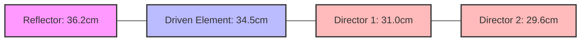

## Question 1(a) [3 marks]

**Write any three properties of Electromagnetic waves**

**Answer**:

| Properties of Electromagnetic Waves |
|:-----------------------------------|
| 1. EM waves can travel through vacuum or material media |
| 2. EM waves travel at the speed of light in free space (3×10⁸ m/s) |
| 3. EM waves exhibit transverse wave characteristics with oscillating electric and magnetic fields |

**Mnemonic:** "VTS" - Vacuum travel, Transverse nature, Speed of light

## Question 1(b) [4 marks]

**Define: (1) Radiation resistance (2) Directivity (3) Gain**

**Answer**:

| Term | Definition |
|:-----|:-----------|
| **Radiation resistance** | The equivalent resistance that would dissipate the same amount of power as radiated by an antenna when the current at the feed point is equal to the antenna input current |
| **Directivity** | The ratio of maximum radiation intensity in a specific direction to the average radiation intensity in all directions |
| **Gain** | The product of directivity and radiation efficiency, measuring how efficiently an antenna converts input power into radio waves in a specific direction |

**Mnemonic:** "RDG" - Resistance dissipates power, Direction concentration, Gain includes efficiency

## Question 1(c) [7 marks]

**Explain physical concept of generation of Electromagnetic waves with neat diagram**

**Answer**:

Electromagnetic waves are generated when electric charges accelerate or oscillate, creating coupled oscillating electric and magnetic fields that propagate through space.


**Diagram: Dipole Antenna EM Wave Generation**

```goat
                 +
                 |
                 |
    Oscillator   |      Electric field lines
    +---------+  |      ∽∽∽∽∽∽∽∽∽∽∽∽∽∽∽>
    |         |  |
    |    ~    |--+      Magnetic field lines
    |         |  |      ⊙⊙⊙⊙⊙⊙⊙⊙⊙⊙⊙⊙⊙⊙⊙
    +---------+  |
                 |
                 |
                 -
```

- **Basic concept**: When AC current flows in the antenna, electrons accelerate up and down
- **Electric field**: Created by charge separation in the antenna
- **Magnetic field**: Produced by the current flow, perpendicular to electric field
- **Propagation**: Fields detach from antenna and propagate outward at the speed of light
- **Self-sustaining**: Each field component regenerates the other as wave travels

**Mnemonic:** "COMAP" - Current Oscillations Make Alternating Propagations

## Question 1(c) OR [7 marks]

**Design 4 Element Yagi Uda antenna for frequency of 435 MHz with necessary equations**

**Answer**:

For a 4-element Yagi-Uda antenna at 435 MHz:

| Element | Length Formula | Spacing Formula | Calculated Value |
|:--------|:---------------|:----------------|:-----------------|
| **Reflector** | 0.5λ × 1.05 | - | 36.2 cm |
| **Driven element** | 0.5λ | - | 34.5 cm |
| **Director 1** | 0.45λ | 0.2λ from driven | 31.0 cm at 13.8 cm spacing |
| **Director 2** | 0.43λ | 0.25λ from Director 1 | 29.6 cm at 17.2 cm spacing |

**Equations used**:

- Wavelength: λ = c/f = 3×10⁸/435×10⁶ = 0.69 meters
- Half-wave dipole: L = 0.5λ = 34.5 cm
- Element spacing: S = 0.15λ to 0.25λ



**Mnemonic:** "RDDS" - Reflector Driven Directors Shrink

## Question 2(a) [3 marks]

**Explain Loop antenna with diagram**

**Answer**:

Loop antenna is a radiating element formed by shaping a conductor into a loop.

```goat
    ┌───────────┐
    │           │
    │           │
    │           │
    │           │
    │     ↺     │ Current flow
    │           │
    │           │
    │           │
    └─────┬─────┘
          │
          │ Feed point
       ───┴───
```

- **Small loops**: Circumference < λ/10, radiation pattern similar to magnetic dipole
- **Large loops**: Circumference ≈ wavelength, bidirectional radiation pattern
- **Applications**: Direction finding, AM radio reception, RFID tags

**Mnemonic:** "SLC" - Size affects Loop Characteristics

## Question 2(b) [4 marks]

**Explain Non Resonant wire antenna**

**Answer**:

| Characteristic | Description |
|:---------------|:------------|
| **Definition** | Antenna operating at frequencies where its physical length is not a multiple of half-wavelength |
| **Impedance** | Complex with both resistive and reactive components |
| **Standing waves** | Present along the antenna length |
| **Example** | Rhombic antenna, terminated with resistance at the end |
| **Advantage** | Wideband operation, suitable for multiple frequencies |

**Mnemonic:** "NITRO" - Non-resonance Incurs Termination for Resistance and Operation

## Question 2(c) [7 marks]

**What is Radiation resistance of half wave dipole? Draw radiation patterns of Dipoles of length λ/2, λ and λ/4 antenna**

**Answer**:

The radiation resistance of a half-wave dipole is approximately 73 ohms.

**Radiation patterns:**

```goat
   λ/2 Dipole             λ Dipole              λ/4 Dipole
   
      0°                     0°                     0°
      |                      |                      |
270°--+--90°   vs.     270°---+---90°   vs.    270°---+---90°
      |                      |                      |
     180°                   180°                   180°
    (Figure-8)         (Multiple lobes)         (Broad pattern)
```

| Dipole Length | Pattern Characteristics |
|:--------------|:------------------------|
| **λ/2 dipole** | Figure-8 pattern; maximum radiation perpendicular to antenna axis; HPBW = 78° |
| **λ dipole** | Multi-lobed pattern; four main lobes at angles to antenna axis |
| **λ/4 dipole** | Broader pattern than λ/2; requires ground plane to complete the equivalent dipole |

**Mnemonic:** "SHORT" - Smaller Half-dipole Offers Rounded-Transmissions

## Question 2(a) OR [3 marks]

**Explain Folded dipole antenna with figure**

**Answer**:

Folded dipole is a variation of the half-wave dipole with ends folded back and connected to form a loop.

```goat
    ┌───────────────────────────┐
    │                           │
    │                           │
    │                           │
    └───────────┬───────────────┘
                │
                │ Feed point
             ───┴───
```

- **Input impedance**: Approximately 300 ohms (4 times that of simple dipole)
- **Bandwidth**: Wider than simple dipole
- **Applications**: TV reception, FM radio, balanced transmission lines

**Mnemonic:** "FIB" - Folded Increases Bandwidth

## Question 2(b) OR [4 marks]

**Explain Rhombic antenna with figure**

**Answer**:

Rhombic antenna consists of four wires arranged in a rhombus or diamond shape.

```goat
              Direction of 
                radiation
                   ↓
            A ◄─────────► B
            /             \
           /               \
          /                 \
Feed ────┐                   ┌──── Termination
          \                 /
           \               /
            \             /
            D ◄─────────► C
```

| Characteristic | Description |
|:---------------|:------------|
| **Shape** | Diamond/rhombus with terminating resistor at far end |
| **Operation** | Non-resonant traveling-wave antenna |
| **Directivity** | High gain, unidirectional pattern |
| **Bandwidth** | Very wide frequency range |
| **Applications** | HF communications, point-to-point links |

**Mnemonic:** "TREND" - Terminated Rhombic Enables Numerous Directions

## Question 2(c) OR [7 marks]

**Differentiate between Broadside array and End fire array with suitable diagram**

**Answer**:

| Parameter | Broadside Array | End fire Array |
|:----------|:----------------|:---------------|
| **Direction of maximum radiation** | Perpendicular to array axis | Along array axis |
| **Element phasing** | Same phase (0°) | Progressive phase shift |
| **Element spacing** | λ/2 typically | λ/4 typically |
| **Radiation pattern** | Fan-shaped beam | Pencil-shaped beam |
| **Applications** | Broadcasting, base stations | Point-to-point links |

**Diagram comparison:**

```goat
   Broadside Array                     End fire Array
   
   ─o─────o─────o─────o─         ─o─────o─────o─────o─
        Array Axis                     Array Axis
         
         ↑ ↑ ↑ ↑                 →→→→→→→→→→→→→→→→→→→→→
      Main radiation                Main radiation
        direction                     direction
```

**Mnemonic:** "PAPER" - Perpendicular And Parallel Emission Respectively

## Question 3(a) [3 marks]

**Draw and Explain Inverted V antenna**

**Answer**:

Inverted V antenna is a dipole with arms angled downward, resembling an inverted "V".

```goat
                   ▲
                   │ Support
                   │
                   │
                  /│\
                 / │ \
                /  │  \
               /   │   \
              /    │    \
             /     │     \
            ◄─────┐│┌─────►
                  ││
                Feed point
```

- **Angle**: Arms typically form 90°-120° angle
- **Impedance**: Close to 50 ohms, lower than horizontal dipole
- **Pattern**: Omnidirectional, slightly broader than horizontal dipole
- **Applications**: Amateur radio, shortwave communications

**Mnemonic:** "AVS" - Angle Varies Signal

## Question 3(b) [4 marks]

**Draw and explain parabolic reflector antenna**

**Answer**:

```goat
           │        ╱│╲        ┌───────►
           │      ╱  │  ╲      │
           │    ╱    │    ╲    │
           │  ╱      │      ╲  │
    ───────┼╱        ↓        ╲┼─┘
           │                   │
     Feed ─┤                   │
           │                   │
    ───────┼╲                 ╱┼───────►
           │  ╲             ╱  │
           │    ╲         ╱    │
           │      ╲     ╱      │
           │        ╲│╱        │
                   Focus
```

| Component | Function |
|:----------|:---------|
| **Parabolic reflector** | Collects and focuses incoming signals or directs transmitted signals |
| **Feed element** | Located at focal point of parabola to collect/emit signals |
| **Focal length** | Distance from vertex to focus, determines beam characteristics |
| **Applications** | Satellite communications, radar, radio astronomy, microwave links |

**Mnemonic:** "FOLD" - Focus Of Large Dish

## Question 3(c) [7 marks]

**Write down range of frequencies for HF, VHF and UHF. Write short note on Microstrip antenna.**

**Answer**:

| Frequency Band | Range |
|:---------------|:------|
| **HF (High Frequency)** | 3 MHz - 30 MHz |
| **VHF (Very High Frequency)** | 30 MHz - 300 MHz |
| **UHF (Ultra High Frequency)** | 300 MHz - 3 GHz |

**Microstrip Antenna:**

```goat
         ┌─────────────────────┐
         │  Radiating Patch    │
         └─────────────────────┘
    ┌───────────────────────────────┐ ─┐
    │      Dielectric Substrate     │  │h
    └───────────────────────────────┘ ─┘
    ┌───────────────────────────────┐
    │       Ground Plane            │
    └───────────────────────────────┘
```

- **Structure**: Conductive patch on dielectric substrate with ground plane
- **Feeding methods**: Microstrip line, coaxial probe, aperture-coupled
- **Advantages**: Low profile, lightweight, easy fabrication, compatible with PCB
- **Limitations**: Narrow bandwidth, low gain, low power handling
- **Applications**: Mobile devices, RFID, GPS, satellite communications

**Mnemonic:** "PATCH" - Planar Antenna That's Cheaply Handled

## Question 3(a) OR [3 marks]

**Write Morse code for word: "LINE OF SIGHT"**

**Answer**:

| Letter | Morse Code |
|:-------|:-----------|
| L | .-.. |
| I | .. |
| N | -. |
| E | . |
| (space) | / |
| O | --- |
| F | ..-. |
| (space) | / |
| S | ... |
| I | .. |
| G | --. |
| H | .... |
| T | - |

"LINE OF SIGHT" in Morse code:
.-.. .. -. . / --- ..-. / ... .. --. .... -

**Mnemonic:** "Listen In Now, Every Other Frequency Supports Immediate Global Heightened Transmission"

## Question 3(b) OR [4 marks]

**Draw and explain Turnstile & Super turnstile antenna**

**Answer**:

**Turnstile Antenna:**

```goat
         ───┬───
            │
            │
    ────────┼────────
            │
            │
         ───┴───
```

**Super Turnstile Antenna:**

```goat
       ┌───┐       ┌───┐
       │   │       │   │ 
       │   │       │   │
       └───┘       └───┘
       
       ┌───┐       ┌───┐
       │   │       │   │
       │   │       │   │
       └───┘       └───┘
```

| Type | Characteristics |
|:-----|:----------------|
| **Turnstile** | Two horizontal dipoles at right angles, fed 90° out of phase |
| **Super Turnstile** | Modification with multiple elements forming rectangular loops |
| **Pattern** | Omnidirectional in horizontal plane, figure-8 in vertical |
| **Polarization** | Horizontal or circular polarization |
| **Applications** | TV broadcasting, FM broadcasting, satellite communications |

**Mnemonic:** "TOPS" - Turnstile Offers Perpendicular Symmetry

## Question 3(c) OR [7 marks]

**What is Polarization? Explain Helical antenna in detail with diagram**

**Answer**:

**Polarization** is the orientation of the electric field vector of an electromagnetic wave as it propagates through space.

**Helical Antenna:**

```goat
          ┌─┐     ┌─┐
         /   \   /   \
        │     \ /     │
        │      X      │
        │     / \     │
         \   /   \   /
          └─┘     └─┘
               │
               │
           ────┴────
          Ground plane
```

| Parameter | Description |
|:----------|:------------|
| **Structure** | Conductor wound in helical shape above ground plane |
| **Diameter** | Typically λ/π |
| **Pitch** | Spacing between turns, usually λ/4 |
| **Turns** | 3-10 turns depending on gain requirements |
| **Modes** | Normal mode (broadside) or Axial mode (end-fire) |
| **Polarization** | Circular polarization in axial mode |
| **Applications** | Satellite communications, space telemetry, tracking |

**Mnemonic:** "HASP" - Helical Antenna Supports Polarization

## Question 4(a) [3 marks]

**Explain Tropospheric scattered propagation**

**Answer**:

| Aspect | Description |
|:-------|:------------|
| **Mechanism** | Radio signals scatter from tropospheric irregularities and refractive index variations |
| **Frequency** | Typically VHF, UHF (100 MHz - 10 GHz) |
| **Range** | 100-800 km, beyond line-of-sight |
| **Reliability** | Less affected by weather than line-of-sight; more reliable than ionospheric |
| **Applications** | Military communications, remote areas where other systems aren't practical |

**Mnemonic:** "STRIP" - Scatter Through Refractive Index Patterns

## Question 4(b) [4 marks]

**Define: (1) Virtual Height (2) Maximum Usable Frequency - MUF (3) Critical Frequency**

**Answer**:

| Term | Definition |
|:-----|:-----------|
| **Virtual Height** | The apparent height of the ionosphere calculated from the time delay of a radio signal reflected back to Earth, as if reflection occurred at a single point |
| **Maximum Usable Frequency (MUF)** | The highest frequency that can be used for reliable communication via ionospheric reflection for a specified path and time |
| **Critical Frequency** | The highest frequency that can be reflected back when transmitted vertically to the ionosphere (when angle of incidence is 90°) |

**Mnemonic:** "VMC" - Virtual height Measures Critical reflection

## Question 4(c) [7 marks]

**Explain effect of ground on electromagnetic wave propagation**

**Answer**:

```goat
              /|\ Direct wave
               |
   Transmitter | Receiver
      o        |        o
       \       |       /
        \      |      /
         \     |     /
          \    |    /
           \   |   /
            \  |  /
             \ | /
              \|/
     ──────────────────────
           Ground
     .............|...........
                  |
                  | Ground reflected wave
                 \|/
```

| Effect | Description |
|:-------|:------------|
| **Ground reflection** | Signal reflects off ground, causing multipath reception |
| **Ground absorption** | Part of signal energy absorbed by ground, reducing signal strength |
| **Ground diffraction** | Waves bend around obstacles, extending coverage beyond line-of-sight |
| **Earth curvature** | Limits line-of-sight distance based on antenna height |
| **Ground conductivity** | Higher conductivity (water, wet soil) allows better propagation than poor conductors (dry, rocky terrain) |

**Wave behavior equation:**

- Range (km) ≈ 4.12(√h₁ + √h₂) where h₁, h₂ are antenna heights in meters

**Mnemonic:** "RADAR" - Reflection Absorption Diffraction Affect Range

## Question 4(a) OR [3 marks]

**Explain Duct Propagation**

**Answer**:

Duct propagation occurs when radio waves become trapped in atmospheric layers with special refractive properties.

```goat
   ──────────────────────────────────
   Normal atmosphere
   ──────────────────────────────────
   Temperature inversion layer
   ∿∿∿∿∿∿∿∿∿∿∿∿∿∿∿∿∿∿∿∿∿∿∿∿∿∿∿∿∿∿∿∿
   o TX                           o RX
   ──────────────────────────────────
   Normal atmosphere
   ──────────────────────────────────
```

- **Formation**: Temperature inversions or moisture gradients create atmospheric ducts
- **Effect**: Signals trapped within duct, allowing propagation far beyond normal range
- **Frequencies**: Most common in UHF and microwave bands
- **Applications**: Extended over-water communications, radar anomalies

**Mnemonic:** "TIDE" - Trapped In Ducting Environment

## Question 4(b) OR [4 marks]

**Explain different layers of Ionosphere**

**Answer**:

| Layer | Altitude | Characteristics |
|:------|:---------|:----------------|
| **D Layer** | 60-90 km | Absorbs HF waves during daytime, disappears at night |
| **E Layer** | 90-150 km | Reflects frequencies up to 10 MHz, sporadic E phenomenon |
| **F1 Layer** | 150-210 km | Present during day, merges with F2 at night |
| **F2 Layer** | 210-400+ km | Main reflecting layer, highest electron density, present day and night |

**Mnemonic:** "DEAF" - D absorbs, E reflects, All merge, F2 persists

## Question 4(c) OR [7 marks]

**Explain Ground wave and Sky wave propagation**

**Answer**:

**Ground Wave Propagation:**

```goat
    TX                                RX
     o─────────────────────────────────o
      \                               /
       \                             /
        \                           /
         -----------------------------
              Earth's surface
```

- **Frequency range**: LF, MF (30 kHz - 3 MHz)
- **Components**: Direct, ground-reflected, surface waves
- **Range**: Depends on frequency, ground conductivity, transmitter power
- **Applications**: AM broadcasting, navigation systems, maritime communications

**Sky Wave Propagation:**

```goat
                     /|\
                      |  Ionosphere
    ─────────────────────────────────────
                /     |     \
               /      |      \
     TX o─────/       |       \────o RX
              \                /
               \              /
                \            /
                 ------------
                 Earth's surface
```

- **Mechanism**: Waves refracted by ionosphere back to Earth
- **Frequency**: Mainly HF (3-30 MHz)
- **Range**: 100-10,000+ km, multiple hops possible
- **Variability**: Time of day, season, solar activity, frequency
- **Applications**: International broadcasting, amateur radio, military

**Mnemonic:** "GIST" - Ground-Interface Surface Transmission vs Ionospheric Sky Transmission

## Question 5(a) [3 marks]

**Explain three different types of Satellites**

**Answer**:

| Satellite Type | Characteristics |
|:---------------|:----------------|
| **LEO (Low Earth Orbit)** | Altitude: 160-2,000 km, Period: 90 min, Applications: Earth observation, communications |
| **MEO (Medium Earth Orbit)** | Altitude: 2,000-35,786 km, Period: 2-24 hours, Applications: Navigation (GPS) |
| **GEO (Geostationary Orbit)** | Altitude: 35,786 km, Period: 24 hours, Applications: TV broadcasting, weather monitoring |

**Mnemonic:** "LMG" - Low Medium Geostationary

## Question 5(b) [4 marks]

**What are smart antennas? Write two applications of it**

**Answer**:

Smart antennas are antenna systems that use digital signal processing algorithms to identify spatial signatures and dynamically adjust radiation patterns.

| Feature | Description |
|:--------|:------------|
| **Types** | Switched beam systems, Adaptive array systems |
| **Operation** | Uses multiple antenna elements and signal processing to adapt to changing conditions |
| **Benefits** | Increased capacity, improved coverage, reduced interference |

**Applications:**

1. Mobile cellular networks (4G, 5G) for increased capacity and coverage
2. Wireless LANs for improved throughput and reduced interference

**Mnemonic:** "SMART" - Signal Manipulation And Response Technology

## Question 5(c) [7 marks]

**What is Satellite communication? Explain Data Communication**

**Answer**:

**Satellite Communication** is the use of artificial satellites to provide communication links between various points on Earth.

```goat
               ┌───────┐
               │       │
               │  SAT  │
               │       │
               └───────┘
                /     \
               /       \
       Uplink /         \ Downlink
             /           \
            /             \
     ┌─────┐               ┌─────┐
     │     │               │     │
     │ TX  │               │ RX  │
     │     │               │     │
     └─────┘               └─────┘
```

**Data Communication via Satellite:**

| Component | Function |
|:----------|:---------|
| **Earth Station** | Transmits/receives signals to/from satellites |
| **Transponder** | Receives, amplifies and retransmits signals at different frequencies |
| **Access methods** | FDMA, TDMA, CDMA to allow multiple users to share satellite capacity |
| **Protocols** | TCP/IP adaptation for satellite latency, specialized protocols |
| **Applications** | Internet backhaul, VSAT networks, IoT, corporate networks |
| **Advantages** | Wide coverage area, independence from terrestrial infrastructure |
| **Challenges** | Signal delay (latency), power limitations, weather effects |

**Mnemonic:** "UPDATA" - Uplink Provides Data Access To All

## Question 5(a) OR [3 marks]

**Write laws of Kepler for satellite**

**Answer**:

| Kepler's Laws | Description |
|:--------------|:------------|
| **First Law** | Satellites orbit in elliptical paths with the Earth at one focus of the ellipse |
| **Second Law** | A line joining the satellite and Earth sweeps out equal areas in equal times (conservation of angular momentum) |
| **Third Law** | The square of the orbital period is proportional to the cube of the semi-major axis of the orbit |

**Mnemonic:** "ESP" - Elliptical orbits, Sweep equal areas, Period-distance relation

## Question 5(b) OR [4 marks]

**Explain Base station and Mobile station antennas**

**Answer**:

**Base Station Antennas:**

```goat
       ┌─┐
       │ │
       │ │
       │ │
       │ │
       │ │ Vertical collinear
       │ │
       │ │
       │ │
       └─┘
```

- **Types**: Omnidirectional, sector, panel antennas
- **Gain**: Typically 10-18 dBi
- **Mounting**: Tower or rooftop installation
- **Features**: Downtilt capability, multiple frequency bands

**Mobile Station Antennas:**

```goat
       ┌───────┐
       │       │
       │  ─┬─  │ Internal antenna
       │       │
       └───────┘  Smartphone
```

- **Types**: Internal PIFA, patch, monopole antennas
- **Gain**: Low gain (0-3 dBi)
- **Size**: Compact, often integrated inside device
- **Characteristics**: Omnidirectional pattern, multiple bands

**Mnemonic:** "BIMS" - Base stations Install Multiple Sectors, Mobile stations Stay small

## Question 5(c) OR [7 marks]

**Explain DTH receiver system in detail**

**Answer**:

DTH (Direct-to-Home) receiver system delivers television signals directly to users via satellite.

```goat
                    ┌───────┐
                    │ \\\\\ │ Satellite
                    └───────┘
                        │
                        │
                        V
                    ┌───────┐
                    │ ///// │ Dish antenna
                    └───┬───┘
                        │
                        │
         ┌──────────────┴──────────┐
         │                         │
    ┌────┴─────┐             ┌─────┴─────┐
    │  LNB     │             │ Set-top   │
    │(Outdoor) │─────Cable───│   Box     │──────► TV
    └──────────┘             │ (Indoor)  │
                             └───────────┘
```

| Component | Function |
|:----------|:---------|
| **Dish Antenna** | Parabolic reflector to collect satellite signals (45-90 cm typical diameter) |
| **LNB (Low Noise Block)** | Converts high-frequency satellite signals to lower frequencies for transmission through coaxial cable |
| **Coaxial Cable** | Carries signals from LNB to set-top box |
| **Set-top Box** | Decodes/demodulates signals, provides user interface, conditional access |
| **Conditional Access Module** | Provides security and subscription management |
| **Features** | Electronic Program Guide, recording, interactive services |

**Mnemonic:** "DISCS" - Dish Intercepts Signals, Converter Sends to Set-top box
