## પ્રશ્ન 1(અ) [3 ગુણ]

**બીમ વિસ્તાર અને બીમની કાર્યક્ષમતા વ્યાખ્યાયિત કરો.**

**જવાબ**:

**બીમ વિસ્તાર**: એ ઘન કોણ છે જેના માધ્યમથી એન્ટેના દ્વારા વિકિરણિત તમામ પાવર પસાર થશે જો રેડિએશન ઇન્ટેન્સિટી આ કોણ પર સમાન હોય અને મહત્તમ મૂલ્યની બરાબર હોય.

**બીમ કાર્યક્ષમતા**: મુખ્ય બીમમાં રહેલી શક્તિનો એન્ટેના દ્વારા વિકિરણિત કુલ શક્તિ સાથેનો ગુણોત્તર.

**આકૃતિ**:

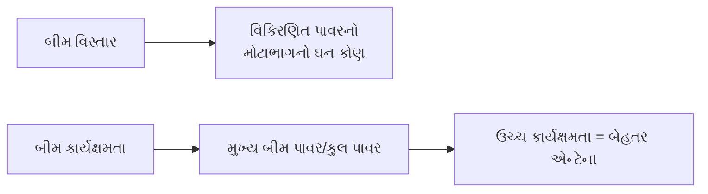

**મેમરી ટ્રીક:** "BEAM: બેહતર કાર્યક્ષમતા આદર્શ મહત્તમ કામગીરી"

## પ્રશ્ન 1(બ) [4 ગુણ]

**EM ક્ષેત્ર શું છે? સેન્ટર ફેડ ડાયપોલ માંથી તેના કિરણોત્સર્જનને સમજાવો.**

**જવાબ**:

EM ક્ષેત્ર એક ભૌતિક ક્ષેત્ર છે જે વિદ્યુત ચાર્જ વાળી વસ્તુઓ દ્વારા ઉત્પન્ન થાય છે અને ચાર્જ કણો પર બળ સાથે અસર કરે છે.

**આકૃતિ**:

```goat
                        |
                        |
     E-field            |            E-field
    (vertical)          |           (vertical)
                        |
           ↑            |           ↑
           |   current  |           |
           |      ↓     |           |
     ------+------------+---------- dipole antenna
           |      ↑     |           |
           |   current  |           |
           ↓            |           ↓
                        |
     H-field            |            H-field
    (circular)          |           (circular)
                        |
```

- **ઇલેક્ટ્રિક ફિલ્ડ**: એન્ટેના અક્ષને લંબરૂપે, એન્ટેનાના છેડા પર મહત્તમ
- **ચુંબકીય ક્ષેત્ર**: એન્ટેના અક્ષની આસપાસ વર્તુળાકાર
- **રેડિએશન પદ્ધતિ**: અલ્ટરનેટિંગ કરંટ સમય-ભિન્ન ક્ષેત્રો બનાવે છે
- **ફિલ્ડ વર્તન**: નિયર ફિલ્ડ (રિએક્ટિવ) → ઇન્ટરમીડિયેટ → ફાર ફિલ્ડ (રેડિએટિંગ)

**મેમરી ટ્રીક:** "CERD: કરંટ એક્સાઇટ્સ રેડિએટિંગ ડાયપોલ"

## પ્રશ્ન 1(ક) [7 ગુણ]

**પોઈન્ટિંગ વેક્ટરનો ઉપયોગ કરીને પ્રાથમિક ડાયપોલ દ્વારા વિકિરણ થતી શક્તિ સમજાવો.**

**જવાબ**:

પ્રાથમિક ડાયપોલ દ્વારા વિકિરણિત શક્તિની ગણતરી પોઈન્ટિંગ વેક્ટર દ્વારા થઈ શકે છે, જે પાવર ફ્લો ઘનતાનું પ્રતિનિધિત્વ કરે છે.

**કોષ્ટક: પોઈન્ટિંગ વેક્ટર વિશ્લેષણના મુખ્ય પગલાં**

| પગલું | વર્ણન |
|------|-------------|
| 1 | E-ફિલ્ડ ઘટકોની ગણતરી કરો (Eθ, Eφ) |
| 2 | H-ફિલ્ડ ઘટકોની ગણતરી કરો (Hθ, Hφ) |
| 3 | પોઈન્ટિંગ વેક્ટર નક્કી કરો: P = E × H |
| 4 | ગોળાકાર સપાટી પર ઇન્ટિગ્રેટ કરો |

**આકૃતિ**:

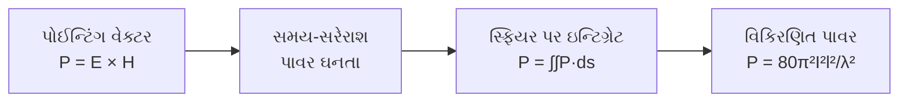

- **ઇલેક્ટ્રિક ફિલ્ડ**: E = (jη I₀dl/2λr) sin θ e⁻ʲᵏʳ
- **ચુંબકીય ક્ષેત્ર**: H = (j I₀dl/2λr) sin θ e⁻ʲᵏʳ
- **પોઈન્ટિંગ વેક્ટર**: P = E × H* = (η|I₀|²|dl|²/8π²r²) sin² θ
- **કુલ પાવર**: P = (η|I₀|²|dl|²/12π) = 80π²I²l²/λ²

**મેમરી ટ્રીક:** "PEHP: પોઈન્ટિંગ એક્સપ્લેન્સ હાઉ પાવર પ્રોપેગેટ્સ"

## પ્રશ્ન 1(ક) અથવા [7 ગુણ]

**એન્ટેના, રેડિયેશન પેટર્ન, ડાયરેક્ટિવિટી, ગેઇન, FBR, આઇસોટ્રોપિક રેડિએટર અને ઇફેક્ટિવ એપર્ચર વ્યાખ્યાયિત કરો.**

**જવાબ**:

**કોષ્ટક: મુખ્ય એન્ટેના પેરામીટર્સ**

| પેરામીટર | વ્યાખ્યા |
|-----------|------------|
| એન્ટેના | એક ઉપકરણ જે ગાઇડેડ ઇલેક્ટ્રોમેગ્નેટિક વેવ્સને ફ્રી-સ્પેસ વેવ્સમાં અને વિપરીત રૂપાંતર કરે છે |
| રેડિએશન પેટર્ન | સ્પેસ કોઓર્ડિનેટ્સના ફંક્શન તરીકે રેડિએશન પ્રોપર્ટીની ગ્રાફિકલ રજૂઆત |
| ડાયરેક્ટિવિટી | અપાયેલી દિશામાં રેડિએશન ઇન્ટેન્સિટીનો સરેરાશ રેડિએશન ઇન્ટેન્સિટી સાથેનો ગુણોત્તર |
| ગેઇન | રેડિએશન ઇન્ટેન્સિટીનો સમાન ઇનપુટ પાવર સાથે આઇસોટ્રોપિક સ્રોતના ઇન્ટેન્સિટી સાથેનો ગુણોત્તર |
| FBR (ફ્રન્ટ-ટુ-બેક રેશિયો) | ફોરવર્ડ દિશામાં વિકિરણિત શક્તિનો બેકવર્ડ દિશામાં વિકિરણિત શક્તિ સાથેનો ગુણોત્તર |
| આઇસોટ્રોપિક રેડિએટર | સૈદ્ધાંતિક એન્ટેના જે બધી દિશામાં સમાન રીતે વિકિરણ કરે છે |
| ઇફેક્ટિવ એપર્ચર | એન્ટેના દ્વારા પ્રાપ્ત શક્તિનો આવતી પાવર ઘનતા સાથેનો ગુણોત્તર |

**આકૃતિ**:

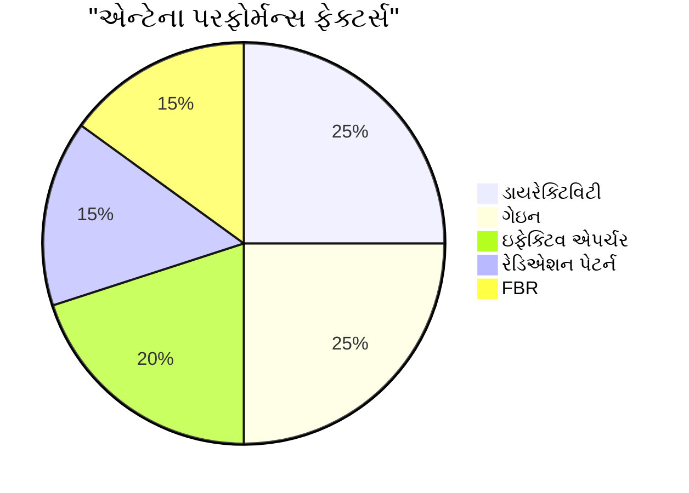

**મેમરી ટ્રીક:** "DIAGRAM: ડાયરેક્ટિવિટી ઇમ્પ્રુવ્સ એન્ટેના ગેઇન, રેડિએશન એન્ડ મોર"

## પ્રશ્ન 2(અ) [3 ગુણ]

**પેટર્ન ગુણાકારનો સિદ્ધાંત સમજાવો.**

**જવાબ**:

પેટર્ન ગુણાકાર સિદ્ધાંત જણાવે છે કે એરેનું રેડિએશન પેટર્ન એલિમેન્ટ પેટર્ન અને એરે ફેક્ટરનું ગુણનફળ હોય છે.

**આકૃતિ**:

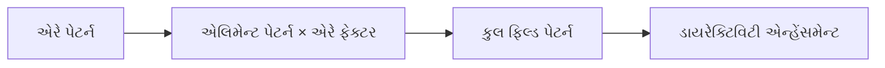

- **એલિમેન્ટ પેટર્ન**: સિંગલ એલિમેન્ટનું રેડિએશન પેટર્ન
- **એરે ફેક્ટર**: એલિમેન્ટ્સની ગોઠવણીને કારણે આવતું પેટર્ન
- **પરિણામ**: વધુ તીક્ષ્ણ બીમ, વધુ ડાયરેક્ટિવિટી

**મેમરી ટ્રીક:** "PEAM: પેટર્ન ઈક્વલ્સ એરે ટાઇમ્સ એલિમેન્ટ મેથડ"

## પ્રશ્ન 2(બ) [4 ગુણ]

**લૂપ એન્ટેના દોરો અને સમજાવો.**

**જવાબ**:

લૂપ એન્ટેના એક બંધ સર્કિટ એન્ટેના છે જેમાં તારના એક અથવા વધુ પૂર્ણ આંટા હોય છે.

**આકૃતિ**:

```goat
      ┌───────────┐
      │           │
      │           │
      │           │
  feed│           │
   ┌──┴──┐        │
   │     │        │
   └─────┘        │
      │           │
      │           │
      └───────────┘
```

- **નાનો લૂપ**: પરિઘ < λ/10, ફિગર-8 પેટર્ન
- **મોટો લૂપ**: પરિઘ ≈ λ, સપાટીને લંબરૂપે મહત્તમ રેડિએશન
- **ઉપયોગો**: દિશા શોધવી, AM રેડિયો રિસેપ્શન
- **રેડિએશન રેઝિસ્ટન્સ**: નાના લૂપ માટે (પરિઘ/λ)⁴ ના પ્રમાણમાં

**મેમરી ટ્રીક:** "LOOP: લો આઉટપુટ, ઓરિએન્ટેશન પ્રિસાઇઝ"

## પ્રશ્ન 2(ક) [7 ગુણ]

**યાગી-ઉડા એન્ટેના ડિઝાઇન કરો અને તેને સમજાવો.**

**જવાબ**:

યાગી-ઉડા એ એક દિશાત્મક એન્ટેના છે જેમાં ડ્રાઇવન એલિમેન્ટ, રિફ્લેક્ટર અને ડાયરેક્ટર્સ હોય છે.

**કોષ્ટક: યાગી-ઉડા એન્ટેના ડિઝાઇન ગાઇડલાઇન્સ**

| એલિમેન્ટ | લંબાઈ | ડ્રાઇવન એલિમેન્ટથી અંતર |
|---------|--------|---------------------------|
| રિફ્લેક્ટર | 0.5λ × 1.05 | 0.15λ - 0.25λ |
| ડ્રાઇવન એલિમેન્ટ | 0.5λ | સંદર્ભ બિંદુ |
| ડાયરેક્ટર 1 | 0.5λ × 0.95 | 0.1λ - 0.15λ |
| ડાયરેક્ટર 2 | 0.5λ × 0.92 | 0.2λ - 0.3λ |
| વધારાના ડાયરેક્ટર્સ | ઘટતા | 0.3λ - 0.4λ |

**આકૃતિ**:

```goat
          Director 2     Director 1     Driven      Reflector
             ┌┐             ┌┐          Element        ┌┐
             ││             ││            ┌┐           ││
             ││             ││            ││           ││
             ││             ││            ││           ││
     ────────┴┴─────────────┴┴────────────┴┴───────────┴┴────────►
             │<--0.15λ-->│<--0.15λ-->│<--0.25λ-->│      Radiation
             │<----------- Boom Length ---------->│      Direction
```

- **કાર્ય**: રિફ્લેક્ટર સિગ્નલને પરાવર્તિત કરે છે, ડાયરેક્ટર્સ તેને આગળ માર્ગદર્શન આપે છે
- **ગેઇન**: ડાયરેક્ટર્સની સંખ્યા સાથે વધે છે (ઘટતા વળતર સાથે)
- **ઇમ્પિડન્સ**: 20-30 ઓહ્મ (સામાન્ય રીતે બેલન સાથે મેચ કરાયેલ)
- **ઉપયોગો**: TV રિસેપ્શન, પોઇન્ટ-ટુ-પોઇન્ટ કોમ્યુનિકેશન

**મેમરી ટ્રીક:** "YARD: યાગી એચિવ્સ રેડિકલ ડાયરેક્ટિવિટી"

## પ્રશ્ન 2(અ) અથવા [3 ગુણ]

**બ્રોડ ફાયર અને એન્ડ ફાયર એરે એન્ટેનાની સરખામણી કરો.**

**જવાબ**:

**કોષ્ટક: બ્રોડ સાઇડ અને એન્ડ ફાયર એરેની સરખામણી**

| પેરામીટર | બ્રોડ સાઇડ એરે | એન્ડ ફાયર એરે |
|-----------|-----------------|----------------|
| મહત્તમ રેડિએશનની દિશા | એરે એક્સિસને લંબરૂપે | એરે એક્સિસ સાથે |
| ફેઝ તફાવત | 0° | 180° ± βd |
| બીમ પહોળાઈ | સાંકડી | પહોળી |
| ડાયરેક્ટિવિટી | ઉચ્ચ | નીચી |
| ઉપયોગો | બ્રોડકાસ્ટિંગ | પોઇન્ટ-ટુ-પોઇન્ટ લિંક્સ |

**આકૃતિ**:

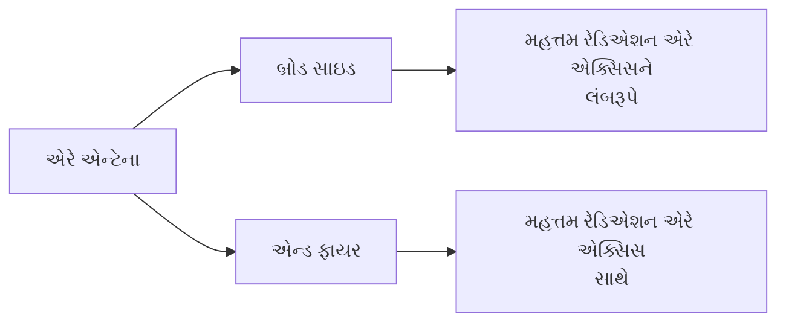

**મેમરી ટ્રીક:** "BEPS: બ્રોડસાઇડ એમિટ્સ પર્પેન્ડિક્યુલરલી, સાઇડવેઝ"

## પ્રશ્ન 2(બ) અથવા [4 ગુણ]

**ફોલ્ડેડ ડિપોલ એન્ટેના દોરો અને સમજાવો.**

**જવાબ**:

ફોલ્ડેડ ડિપોલમાં અર્ધ-તરંગ લંબાઈનો ડિપોલ હોય છે જેના છેડા પાછા વાળીને જોડાયેલા હોય છે, જે એક સાંકડો લૂપ બનાવે છે.

**આકૃતિ**:

```goat
       λ/2
    ┌───────┐
    │       │
    │       │
    │       │
feed│       │
 ┌──┴──┐    │
 │     │    │
 └─────┘    │
    │       │
    │       │
    └───────┘
```

- **ઇમ્પિડન્સ**: સ્ટાન્ડર્ડ ડિપોલ કરતાં 4 ગણો વધારે (≈300Ω)
- **બેન્ડવિડ્થ**: સરળ ડિપોલ કરતાં વધુ પહોળી
- **ઉપયોગો**: TV એન્ટેના, FM રિસીવિંગ એન્ટેના
- **ફાયદો**: ઓછી નોઇઝ સંવેદનશીલતા

**મેમરી ટ્રીક:** "FIBER: ફોલ્ડેડ ઇમ્પિડન્સ બૂસ્ટર એન્હેંસિસ રિસેપ્શન"

## પ્રશ્ન 2(ક) અથવા [7 ગુણ]

**બિન-રેઝોનન્ટ એન્ટેનાના નામ આપો અને કોઈપણ એકને તેની રેડિએશન પેટર્ન સાથે વિગતવાર સમજાવો.**

**જવાબ**:

બિન-રેઝોનન્ટ એન્ટેનામાં રોમ્બિક, V એન્ટેના, ટર્મિનેટેડ ફોલ્ડેડ ડિપોલ, બેવરેજ અને લોંગ-વાયર એન્ટેનાનો સમાવેશ થાય છે.

**રોમ્બિક એન્ટેના વિગતવાર:**

**આકૃતિ**:

```goat
                    ┌───────┐
                   /         \
                  /           \
                 /             \
                /               \
               /                 \
              /                   \
             /                     \
            /                       \
           /                         \
    ┌─────┘                           └─────┐
    │                                       │
 ───┴───                                 ───┴───
 Feeder                               Terminating
                                       Resistor
```

**કોષ્ટક: રોમ્બિક એન્ટેનાની ખાસિયતો**

| પેરામીટર | વર્ણન |
|-----------|-------------|
| સ્ટ્રક્ચર | ચાર લાંબા તાર રોમ્બસ આકારમાં ગોઠવેલા |
| ટર્મિનેશન | દૂરના છેડે રેઝિસ્ટિવ લોડ (બિન-રેઝોનન્ટ) |
| ડાયરેક્ટિવિટી | ઉચ્ચ (8-15 dB) |
| ફ્રિક્વન્સી રેન્જ | વિશાળ બેન્ડવિડ્થ (મલ્ટી-ઓક્ટેવ) |
| રેડિએશન પેટર્ન | એકદિશીય, શંકુ આકારનું |
| ઉપયોગો | HF પોઇન્ટ-ટુ-પોઇન્ટ કોમ્યુનિકેશન |

- **ફાયદા**: ઉચ્ચ ગેઈન, વિશાળ બેન્ડવિડ્થ, સરળ બનાવટ
- **નુકસાન**: મોટા ભૌતિક કદ, ટર્મિનેટિંગ રેઝિસ્ટરમાં પાવર નુકસાન
- **પેટર્ન**: મુખ્ય લોબ રોમ્બસની મુખ્ય અક્ષ સાથે

**મેમરી ટ્રીક:** "RHOMBIC: વિશ્વસનીય ઉચ્ચ-આઉટપુટ મલ્ટી-બેન્ડ અદ્ભુત કોમ્યુનિકેશન"

## પ્રશ્ન 3(અ) [3 ગુણ]

**વિવિધ રેઝોનન્ટ વાયર એન્ટેનાની રેડિએશન પેટર્નની તુલના કરો.**

**જવાબ**:

**કોષ્ટક: રેઝોનન્ટ વાયર એન્ટેનાની રેડિએશન પેટર્ન**

| એન્ટેના પ્રકાર | પેટર્ન આકાર | ડાયરેક્ટિવિટી | પોલરાઈઝેશન |
|--------------|---------------|-------------|--------------|
| હાફ-વેવ ડિપોલ | ફિગર-8 (ડોનટ) | 2.15 dBi | લિનિયર |
| ફુલ-વેવ ડિપોલ | ચાર-લોબ્ડ | 3.8 dBi | લિનિયર |
| 3λ/2 ડિપોલ | છ-લોબ્ડ | 4.2 dBi | લિનિયર |
| 2λ ડિપોલ | આઠ-લોબ્ડ | 4.5 dBi | લિનિયર |

**આકૃતિ**:

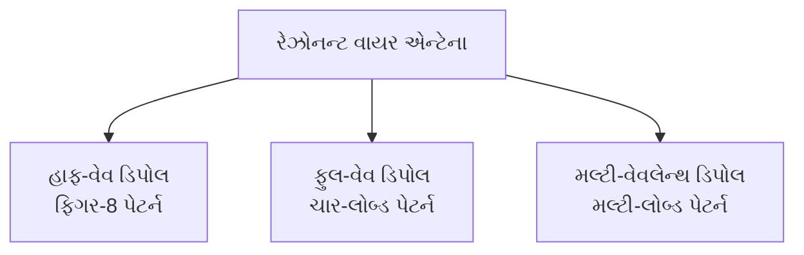

**મેમરી ટ્રીક:** "MOLD: વધુ તરંગલંબાઈથી ઘણા ડાયરેક્ટિવિટી લોબ્સ બને છે"

## પ્રશ્ન 3(બ) [4 ગુણ]

**V અને ઇન્વર્ટેડ V એન્ટેના રેડીએશન પેટર્ન સાથે દોરો.**

**જવાબ**:

**આકૃતિ: V-એન્ટેના**

```goat
        
        
      /\
     /  \
    /    \
   /      \
  /        \
 /          \
Feed        Feed
Point       Point
    
Radiation Pattern: Bidirectional along axis
```

**આકૃતિ: ઇન્વર્ટેડ V-એન્ટેના**

```goat
         Feed
         Point
           |
           V
          / \
         /   \
        /     \
       /       \
      /         \
     Ground     Ground
     
Radiation Pattern: Omnidirectional with slight elevation
```

- **V-એન્ટેના**: V-આકારમાં બે તાર, દ્વિ-દિશાત્મક પેટર્ન
- **ઇન્વર્ટેડ V**: હાફ-વેવ ડિપોલ જેના આર્મ્સ નીચેની તરફ ઢળતા, ઓમ્નીડાયરેક્શનલ
- **ઉપયોગો**: એમેચ્યોર રેડિયો, FM રિસેપ્શન
- **ફાયદા**: સરળ, લવચીક ઇન્સ્ટોલેશન વિકલ્પો

**મેમરી ટ્રીક:** "VIPS: V-આકાર પેટર્ન પસંદગીમાં સુધારો કરે છે"

## પ્રશ્ન 3(ક) [7 ગુણ]

**મોર્સ કોડ અને પ્રેક્ટિસ ઓસિલેટર સમજાવો.**

**જવાબ**:

મોર્સ કોડ એ ડોટ્સ અને ડેશનાં પ્રમાણિત ક્રમનો ઉપયોગ કરીને ટેક્સ્ટ ટ્રાન્સમિટ કરવાની એક પદ્ધતિ છે.

**કોષ્ટક: મૂળભૂત મોર્સ કોડ તત્વો**

| તત્વ | સમય | ધ્વનિ |
|---------|--------|-------|
| ડોટ (.) | 1 યુનિટ | ટૂંકો બીપ |
| ડેશ (-) | 3 યુનિટ | લાંબો બીપ |
| તત્વો વચ્ચે અંતર | 1 યુનિટ | ટૂંકી શાંતિ |
| અક્ષરો વચ્ચે અંતર | 3 યુનિટ | મધ્યમ શાંતિ |
| શબ્દો વચ્ચે અંતર | 7 યુનિટ | લાંબી શાંતિ |

**આકૃતિ: સરળ મોર્સ કોડ પ્રેક્ટિસ ઓસિલેટર**

```goat
      +9V
       |
       R1
       |
      ┌┴┐
 C1   │ │                    Speaker
┌──┬──┤8├──┬────┬─────────────┬──┐
│  │  │5│  │    │             │  │
│  │  │5│  │    R2            C2 │
│  │  │5│  │    │             │  │
│  │  └┬┘  │    │             │  │
│  │   │   │    │             │  │
└──┴───┴───┴────┴─────────────┴──┘
  Key        Ground
```

- **ઘટકો**: 555 ટાઇમર, રેઝિસ્ટર્સ, કેપેસિટર્સ, કી, સ્પીકર
- **કાર્ય**: કી બંધ થવાથી સર્કિટ પૂર્ણ થાય છે, ઓસિલેશન બને છે
- **ફ્રિક્વન્સી**: સામાન્ય રીતે 600-800 Hz (R2 સાથે એડજસ્ટેબલ)
- **ઉપયોગો**: હેમ રેડિયો ટ્રેનિંગ, ઇમરજન્સી કોમ્યુનિકેશન

**મેમરી ટ્રીક:** "TEMPO: ટાઇમિંગ એલિમેન્ટ્સ મેક પરફેક્ટ ઓસિલેશન"

## પ્રશ્ન 3(અ) અથવા [3 ગુણ]

**માઈક્રોસ્ટ્રિપ પેચ એન્ટેના દોરો અને સમજાવો.**

**જવાબ**:

માઈક્રોસ્ટ્રિપ પેચ એન્ટેનામાં ગ્રાઉન્ડેડ સબસ્ટ્રેટ પર ધાતુનો પેચ હોય છે.

**આકૃતિ**:

```goat
    ┌───────────────┐  ←-- Patch (metal)
    │               │
    │               │  Thickness
    │               │  ↕  
════════════════════════ ←-- Substrate
    |               |
    |               |  ←-- Ground plane
    └───────────────┘
    
    ↑               ↑
    Feed            Radiation
    point
```

- **સ્ટ્રક્ચર**: ડાયલેક્ટ્રિક સબસ્ટ્રેટ પર ગ્રાઉન્ડ પ્લેન સાથે ધાતુનો પેચ
- **ફાયદા**: ઓછી પ્રોફાઇલ, હળવું વજન, સરળ ઉત્પાદન, અનુરૂપ
- **નુકસાન**: સાંકડી બેન્ડવિડ્થ, ઓછી કાર્યક્ષમતા, ઓછી પાવર હેન્ડલિંગ
- **ઉપયોગો**: મોબાઇલ ડિવાઇસિસ, RFID, સેટેલાઇટ કોમ્યુનિકેશન

**મેમરી ટ્રીક:** "MAPS: માઈક્રોસ્ટ્રિપ એન્ટેના પેચિસ આર સિમ્પલ"

## પ્રશ્ન 3(બ) અથવા [4 ગુણ]

**હોર્ન એન્ટેના દોરો અને સમજાવો.**

**જવાબ**:

હોર્ન એન્ટેના એ ફ્લેર્ડ ઓપન એન્ડ સાથેનો વેવગાઇડ છે જે રેડિયો વેવ્સને એક બીમમાં નિર્દેશિત કરે છે.

**આકૃતિ**:

```goat
            ┌───────────┐
            │           │
            │           │
       ┌────┤           │
       │    │           │
       │    │           │
Feed   │    │           │
point  │    │           │
       │    │           │
       └────┤           │
            │           │
            │           │
            └───────────┘
         Waveguide       Horn
```

- **પ્રકારો**: E-પ્લેન, H-પ્લેન, પિરામિડલ, કોનિકલ
- **ફ્રિક્વન્સી રેન્જ**: માઇક્રોવેવ (1-20 GHz)
- **ફાયદા**: ઉચ્ચ ગેઇન, વિશાળ બેન્ડવિડ્થ, ઓછો VSWR
- **ઉપયોગો**: સેટેલાઇટ કોમ્યુનિકેશન, રડાર, રેડિયો એસ્ટ્રોનોમી

**મેમરી ટ્રીક:** "HEWB: હોર્ન્સ એન્હેન્સ વેવગાઇડ બીમવિડ્થ"

## પ્રશ્ન 3(ક) અથવા [7 ગુણ]

**પેરાબોલિક રિફ્લેક્ટર એન્ટેના માટે વિવિધ ફીડ સિસ્ટમની યાદી બનાવો અને કોઈપણ એકને સમજાવો.**

**જવાબ**:

**કોષ્ટક: પેરાબોલિક રિફ્લેક્ટર ફીડ સિસ્ટમ્સ**

| ફીડ સિસ્ટમ | પોઝિશન | ખાસિયતો |
|-------------|----------|----------------|
| ફ્રન્ટ ફીડ | ફોકસ પર, ડિશની સામે | સરળ, થોડું બ્લોકેજ |
| કેસેગ્રેન | સેકન્ડરી રિફ્લેક્ટર સાથે ડિશના કેન્દ્રમાં ફીડ | ઘટાડેલ નોઇઝ, કોમ્પેક્ટ |
| ગ્રેગોરિયન | સેકન્ડરી કોન્કેવ રિફ્લેક્ટર | બેહતર ગેઇન, મોટું કદ |
| ઓફસેટ ફીડ | મુખ્ય અક્ષથી ઓફસેટ ફીડ | કોઈ બ્લોકેજ નહીં, એસિમેટ્રિક |
| વેવગાઇડ ફીડ | ફોકસ પર ડાયરેક્ટ વેવગાઇડ | સરળ, સીમિત લવચીકતા |

**ફ્રન્ટ ફીડ સિસ્ટમ (વિગતવાર):**

**આકૃતિ**:

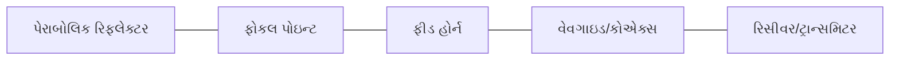

- **કાર્ય**: ફોકલ પોઇન્ટ પર ફીડ મુકાય છે, રિફ્લેક્ટરને પ્રકાશિત કરે છે
- **ફાયદા**: સરળ ડિઝાઇન, સરળ એલાઇનમેન્ટ, મહત્તમ કાર્યક્ષમતા
- **નુકસાન**: ફીડ અને સપોર્ટ સ્ટ્રક્ચર એપર્ચરનો ભાગ અવરોધે છે
- **ઉપયોગો**: સેટેલાઇટ ડિશ, રેડિયો ટેલિસ્કોપ, રડાર

**મેમરી ટ્રીક:** "FACTS: ફોકસ્ડ એપર્ચર કેપ્ચર્સ ટ્રાન્સમિટેડ સિગ્નલ્સ"

## પ્રશ્ન 4(અ) [3 ગુણ]

**HAM રેડિયોના કાર્યકારી સિદ્ધાંતને સમજાવો.**

**જવાબ**:

HAM રેડિયો (એમેચ્યોર રેડિયો) બિન-વ્યાવસાયિક સંચાર માટે નિયુક્ત ફ્રિક્વન્સી બેન્ડ પર કાર્ય કરે છે.

**આકૃતિ**:

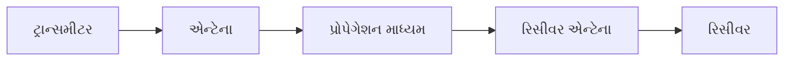

- **કાર્ય**: ટ્રાન્સમીટર RF સિગ્નલ જનરેટ કરે છે, એન્ટેના સિગ્નલ વિકિરણિત કરે છે
- **ફ્રિક્વન્સી બેન્ડ**: HF (3-30 MHz), VHF (30-300 MHz), UHF (300-3000 MHz)
- **મોડ્સ**: AM, FM, SSB, CW (મોર્સ), ડિજિટલ મોડ્સ
- **લાઇસન્સ**: કાયદેસર સંચાલન માટે જરૂરી (કૌશલ્ય આધારિત સ્તર)

**મેમરી ટ્રીક:** "TEAM: ટ્રાન્સમિશન એનેબલ્સ એમેચ્યોર મેસેજીસ"

## પ્રશ્ન 4(બ) [4 ગુણ]

**ડક્ટ પ્રોપેગેશન સમજાવો.**

**જવાબ**:

ડક્ટ પ્રોપેગેશન ત્યારે થાય છે જ્યારે રેડિયો તરંગો વિવિધ રિફ્રેક્ટિવ ઇન્ડેક્સ ધરાવતા વાતાવરણીય સ્તરોમાં ફસાય છે.

**આકૃતિ**:

```goat
        ------------------  ←-- Upper atmosphere
       
         ===============  ←-- Duct layer (temperature inversion)
        /     Trapped    \
       /       waves      \
      /                    \
     /                      \
    /                        \
   /                          \
  Transmitter                Receiver
  
      ==================== Ground/Sea
```

- **રચના**: તાપમાન ઇન્વર્ઝન રિફ્રેક્ટિવ ઇન્ડેક્સ ગ્રેડિયન્ટ બનાવે છે
- **ફ્રિક્વન્સી રેન્જ**: VHF, UHF, માઇક્રોવેવ ફ્રિક્વન્સી
- **ફાયદા**: વિસ્તૃત કોમ્યુનિકેશન રેન્જ (ક્ષિતિજથી આગળ)
- **ઘટના**: સમુદ્રો પર સામાન્ય, હવામાન સાથે બદલાય છે

**મેમરી ટ્રીક:** "TRIP: ટ્રેપ્ડ રેઝ ઇન એટમોસ્ફિરિક પાથ્સ"

## પ્રશ્ન 4(ક) [7 ગુણ]

**ટ્રોપોસ્ફેરિક સ્કેટર્ડ પ્રોપેગેશન વિગતવાર સમજાવો.**

**જવાબ**:

ટ્રોપોસ્ફેરિક સ્કેટર ક્ષિતિજથી આગળના કોમ્યુનિકેશન માટે ટ્રોપોસ્ફિયરની સ્કેટરિંગ પ્રોપર્ટીનો ઉપયોગ કરે છે.

**કોષ્ટક: ટ્રોપોસ્ફેરિક સ્કેટર ખાસિયતો**

| પેરામીટર | વર્ણન |
|-----------|-------------|
| મેકેનિઝમ | ટ્રોપોસ્ફેરિક અનિયમિતતાઓ દ્વારા રેડિયો તરંગોનું ફોરવર્ડ સ્કેટરિંગ |
| ફ્રિક્વન્સી રેન્જ | 300 MHz થી 10 GHz (UHF/SHF) |
| રેન્જ | 100-800 km |
| પાથ લોસ | ઉચ્ચ (ઉચ્ચ-પાવર ટ્રાન્સમિટર્સની જરૂર પડે છે) |
| વિશ્વસનીયતા | હવામાન પરિસ્થિતિઓથી અસરગ્રસ્ત |

**આકૃતિ**:

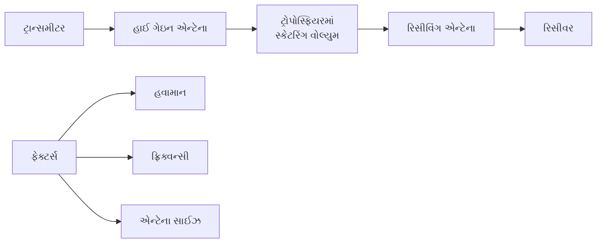

- **મેકેનિઝમ**: રિફ્રેક્ટિવ ઇન્ડેક્સ અનિયમિતતાઓ દ્વારા સિગ્નલ સ્કેટર થાય છે
- **ઇક્વિપમેન્ટ**: હાઇ-પાવર ટ્રાન્સમીટર્સ, મોટા એન્ટેના, સંવેદનશીલ રિસીવર્સ
- **ઉપયોગો**: મિલિટરી, બેકઅપ કોમ્યુનિકેશન, દૂરસ્થ વિસ્તારો
- **ફાયદા**: લાઇન-ઓફ-સાઇટથી આગળ, પ્રમાણમાં સ્થિર

**મેમરી ટ્રીક:** "STARS: સ્કેટર ટ્રોપોસ્ફેરિક અલાઉઝ રેન્જ બિયોન્ડ સાઇટ"

## પ્રશ્ન 4(અ) અથવા [3 ગુણ]

**ટર્નસ્ટાઇલ અને સુપર ટર્નસ્ટાઇલ એન્ટેના દોરો.**

**જવાબ**:

**આકૃતિ: ટર્નસ્ટાઇલ એન્ટેના**

```goat
          │   │
     ─────┼───┼─────
          │   │
          │   │
     ─────┼───┼─────
          │   │

  Two dipoles at 90° fed with 90° phase difference
```

**આકૃતિ: સુપર ટર્નસ્ટાઇલ (બેટવિંગ) એન્ટેના**

```goat
      ┌───┬───┐
      │   │   │
      │   │   │
      │   │   │
    ──┼───┼───┼──
      │   │   │
      │   │   │
      │   │   │
      └───┴───┘

    Multiple elements for broadband operation
```

- **ટર્નસ્ટાઇલ**: જમણા ખૂણે બે ડિપોલ, સર્ક્યુલર પોલરાઇઝેશન
- **સુપર ટર્નસ્ટાઇલ**: વધારેલી બેન્ડવિડ્થ માટે મલ્ટિપલ એલિમેન્ટ્સ
- **ઉપયોગો**: TV બ્રોડકાસ્ટિંગ, FM બ્રોડકાસ્ટિંગ, સેટેલાઇટ કોમ્યુનિકેશન
- **ફાયદો**: ઓમ્નિડાયરેક્શનલ હોરિઝોન્ટલ પેટર્ન

**મેમરી ટ્રીક:** "TACO: ટર્નસ્ટાઇલ એન્ટેના ક્રિએટ ઓમ્નિડાયરેક્શનલ પેટર્ન"

## પ્રશ્ન 4(બ) અથવા [4 ગુણ]

**MUF, LUF અને OUF નું સંપૂર્ણ સ્વરૂપ આપો.**

**જવાબ**:

**કોષ્ટક: આયનોસ્ફેરિક પ્રોપેગેશન પેરામીટર્સ**

| સંક્ષિપ્ત નામ | સંપૂર્ણ નામ | વર્ણન |
|--------------|-----------|-------------|
| MUF | Maximum Usable Frequency | ઉચ્ચતમ ફ્રિક્વન્સી જે આયનોસ્ફિયર દ્વારા પરાવર્તિત થઈ શકે છે |
| LUF | Lowest Usable Frequency | ન્યૂનતમ ફ્રિક્વન્સી જે પૂરતો સિગ્નલ-ટુ-નોઇઝ રેશિયો પ્રદાન કરે છે |
| OUF | Optimum Usable Frequency | શ્રેષ્ઠ કાર્યકારી ફ્રિક્વન્સી (MUF નો 85%) |

**આકૃતિ**:

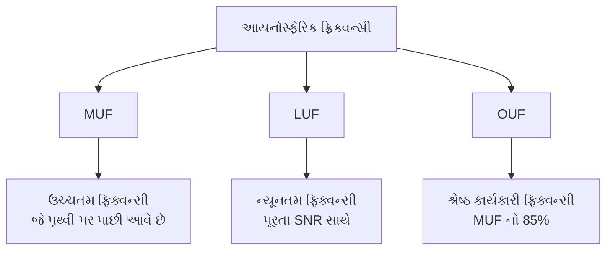

**મેમરી ટ્રીક:** "MLO: મેક્સિમમ અને લોવેસ્ટ ઓપ્ટિમમ નક્કી કરે છે"

## પ્રશ્ન 4(ક) અથવા [7 ગુણ]

**વર્ચ્યુઅલ ઊંચાઈ, ક્રિટિકલ ફ્રિક્વન્સી અને સ્કીપ ડિસ્ટન્સ વિગતવાર સમજાવો.**

**જવાબ**:

**કોષ્ટક: મુખ્ય આયનોસ્ફેરિક પ્રોપેગેશન પેરામીટર્સ**

| પેરામીટર | વ્યાખ્યા | મહત્વ |
|-----------|------------|--------------|
| વર્ચ્યુઅલ ઊંચાઈ | સીધી-લાઇન પ્રસારણ ધારીને દેખાતી પરાવર્તન ઊંચાઈ | મહત્તમ સંચાર રેન્જ નક્કી કરે છે |
| ક્રિટિકલ ફ્રિક્વન્સી | ઊભા આપાત પર પરાવર્તિત મહત્તમ ફ્રિક્વન્સી | આયનાઇઝેશન ઘનતા દર્શાવે છે |
| સ્કીપ ડિસ્ટન્સ | ન્યૂનતમ અંતર જ્યાં આયનોસ્ફેરિક સિગ્નલ્સ પ્રાપ્ત થઈ શકે છે | "સ્કીપ ઝોન" બનાવે છે જેમાં કોઈ રિસેપ્શન નથી |

**આકૃતિ**:

```goat
                  /|\
                 / | \
                /  |  \       Critical freq: Maximum
               /   |   \      frequency at 90° incidence
              /    |    \
             /     |     \
            /      |      \
Transmitter/       |       \Receiver
           /       |        \
          /        |         \
         /         |          \
        /          |           \
       /           |            \
      /            |             \
     /             |              \
    /              |               \
   /               |                \
  /                |                 \
 /                 |                  \
Earth              |                  Earth
       |<------ Skip Distance -------->|

Virtual height: Apparent reflection height
```

- **વર્ચ્યુઅલ ઊંચાઈ**: સામાન્ય રીતે F લેયર માટે 300-400 km, સમય/સિઝન સાથે બદલાય છે
- **ક્રિટિકલ ફ્રિક્વન્સી**: સામાન્ય રીતે F2 લેયર માટે 5-10 MHz, સૌર પ્રવૃત્તિ પર આધાર રાખે છે
- **સ્કીપ ડિસ્ટન્સ**: D = 2h tan θ દ્વારા આપવામાં આવે છે, જ્યાં h એ વર્ચ્યુઅલ ઊંચાઈ અને θ આપાત કોણ છે

**મેમરી ટ્રીક:** "VCS: વર્ચ્યુઅલ ઊંચાઈ સ્કીપ ડિસ્ટન્સ નિયંત્રિત કરે છે"

## પ્રશ્ન 5(અ) [3 ગુણ]

**સુઘડ આકૃતિ સાથે વિવિધ આયોનોસ્ફીયર સ્તરો દર્શાવો.**

**જવાબ**:

**આકૃતિ: આયનોસ્ફેરિક લેયર્સ**

```goat
Height (km)
   ^
   |
400|                   F2 Layer
   |           ----------------------
   |
300|                   F1 Layer (daytime)
   |           ----------------------
   |
200|                   E Layer
   |           ----------------------
   |
100|                   D Layer
   |           ----------------------
   |
   +------------------------------------->
                 Electron Density
```

- **D લેયર**: 60-90 km, HF તરંગોને શોષે છે, રાત્રે અદૃશ્ય થાય છે
- **E લેયર**: 90-150 km, MF/નીચા HF પરાવર્તિત કરે છે, રાત્રે નબળી પડે છે
- **F1 લેયર**: 150-220 km, માત્ર દિવસ સમયે હાજર
- **F2 લેયર**: 220-400 km, મુખ્ય પરાવર્તન સ્તર, દિવસ/રાત હાજર

**મેમરી ટ્રીક:** "DEAF: નીચેથી ઉપર - D, E, And F લેયર્સ"

## પ્રશ્ન 5(બ) [4 ગુણ]

**વિવિધ પ્રકારની સેટેલાઇટ કોમ્યુનિકેશન સિસ્ટમના નામ આપો અને તેની સરખામણી કરો.**

**જવાબ**:

**કોષ્ટક: સેટેલાઇટ કોમ્યુનિકેશન સિસ્ટમ્સ**

| સિસ્ટમ પ્રકાર | ફ્રિક્વન્સી બેન્ડ | ઉપયોગો | ખાસિયતો |
|-------------|----------------|--------------|-----------------|
| ટેલિકોમ્યુનિકેશન | C, Ku, Ka બેન્ડ | ફોન, ડેટા, ઇન્ટરનેટ | ગ્લોબલ કવરેજ, ઉચ્ચ ક્ષમતા |
| બ્રોડકાસ્ટિંગ | Ku, C બેન્ડ | TV, રેડિયો ટ્રાન્સમિશન | હાઇ પાવર, વિશાળ કવરેજ |
| ડેટા કોમ્યુનિકેશન | L, S, Ka બેન્ડ | IoT, VSAT, M2M | ઓછી થી મધ્યમ ડેટા દર |
| મિલિટરી | X, EHF બેન્ડ | સિક્યોર કોમ્યુનિકેશન | એનક્રિપ્ટેડ, જામ-રેસિસ્ટન્ટ |
| નેવિગેશન | L બેન્ડ | GPS, GLONASS, ગેલિલિયો | ચોક્કસ ટાઇમિંગ, પોઝિશનિંગ |

**આકૃતિ**:

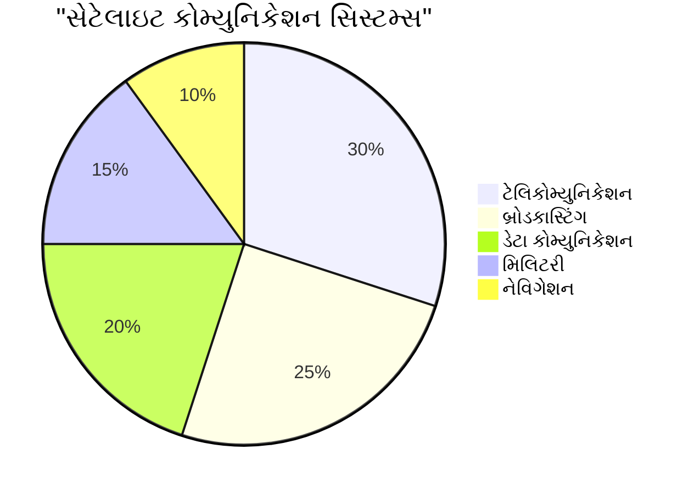

**મેમરી ટ્રીક:** "TBDMN: ટેલિકોમ, બ્રોડકાસ્ટિંગ, ડેટા, મિલિટરી, નેવિગેશન"

## પ્રશ્ન 5(ક) [7 ગુણ]

**DTH રીસીવર સિસ્ટમ દોરો અને સમજાવો.**

**જવાબ**:

DTH (ડાયરેક્ટ-ટુ-હોમ) સિસ્ટમ સેટેલાઇટ મારફતે સીધા દર્શકોને ટેલિવિઝન પ્રોગ્રામિંગ ડિલિવર કરે છે.

**આકૃતિ**:

```goat
                     TV
                     |
                     V
                 Set-top Box
                     |
                     V
                  LNB/LNBF <---- Satellite signals
                     |
                     V
                 Dish Antenna
                  (0.6-1.2m)
```

**કોષ્ટક: DTH સિસ્ટમ કોમ્પોનન્ટ્સ**

| કોમ્પોનન્ટ | કાર્ય | સ્પેસિફિકેશન |
|-----------|----------|---------------|
| ડિશ એન્ટેના | સેટેલાઇટ સિગ્નલ્સ એકત્રિત કરે છે | 45-120 cm વ્યાસ |
| LNB (લો નોઇઝ બ્લોક) | ઉચ્ચ ફ્રિક્વન્સીને નીચા IF માં રૂપાંતરિત કરે છે | નોઇઝ ફિગર: 0.3-1.0 dB |
| કોએક્સિયલ કેબલ | IF સિગ્નલને રિસીવર સુધી લઈ જાય છે | RG-6 પ્રકાર, 75 ઓહ્મ |
| સેટ-ટોપ બોક્સ | સિગ્નલ્સ ડિમોડ્યુલેટ/ડિકોડ કરે છે | MPEG-2/4 ડિકોડર |
| TV સેટ | પ્રોગ્રામિંગ દર્શાવે છે | HDMI/કોમ્પોનન્ટ ઇનપુટ |

- **ફ્રિક્વન્સી**: Ku-બેન્ડ (10.7-12.75 GHz) અથવા C-બેન્ડ (3.7-4.2 GHz)
- **મોડ્યુલેશન**: QPSK અથવા 8PSK ડિજિટલ મોડ્યુલેશન
- **સિગ્નલ પ્રોસેસિંગ**: ડિજિટલ કમ્પ્રેશન (MPEG-2/4)
- **ફીચર્સ**: EPG (ઇલેક્ટ્રોનિક પ્રોગ્રામ ગાઇડ), PVR (રેકોર્ડિંગ)

**મેમરી ટ્રીક:** "DOCS: ડિશ ઓબ્ટેઇન્સ, કન્વર્ટ્સ અને શોઝ સિગ્નલ્સ"

## પ્રશ્ન 5(અ) અથવા [3 ગુણ]

**સ્માર્ટ એન્ટેનાની જરૂર શું છે? તેના ઉપયોગો લખો.**

**જવાબ**:

સ્માર્ટ એન્ટેના એડેપ્ટિવ સિગ્નલ પ્રોસેસિંગનો ઉપયોગ કરીને ડાયનામિકલી રેડિએશન પેટર્ન ઓપ્ટિમાઇઝ કરે છે.

**જરૂરિયાતો**:

- ભીડભાડવાળા નેટવર્કમાં વધારેલી ક્ષમતા
- સુધારેલ સિગ્નલ ક્વોલિટી અને કવરેજ
- ઘટાડેલો ઇન્ટરફેરન્સ અને મલ્ટિપાથ ફેડિંગ
- વધારેલી સ્પેક્ટ્રલ એફિશિયન્સી

**આકૃતિ**:

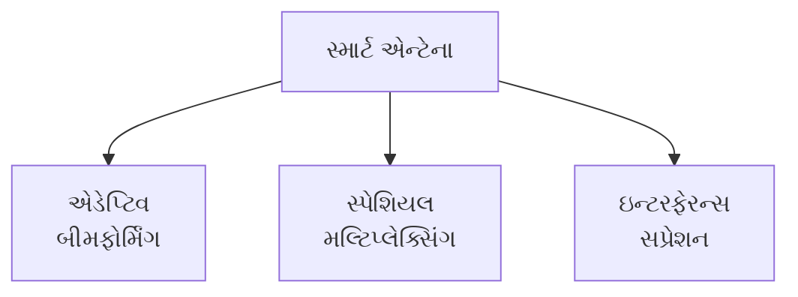

**ઉપયોગો**:

- મોબાઇલ કોમ્યુનિકેશન નેટવર્ક (4G/5G)
- ઉચ્ચ ડેટા દર માટે MIMO સિસ્ટમ્સ
- વધુ સારી ટાર્ગેટ ડિટેક્શન સાથે રડાર સિસ્ટમ્સ
- સુધારેલા કવરેજ સાથે વાયરલેસ LAN

**મેમરી ટ્રીક:** "SAFE: સ્માર્ટ એન્ટેના ફોર એફિશિયન્સી"

## પ્રશ્ન 5(બ) અથવા [4 ગુણ]

**કેપ્લરનો ત્રીજો નિયમ સમજાવો.**

**જવાબ**:

કેપ્લરનો ત્રીજો નિયમ સેટેલાઇટની ભ્રમણ કાળનો તેના સેમી-મેજર એક્સિસ સાથેનો સંબંધ દર્શાવે છે.

**ફોર્મ્યુલા**: T² = (4π²/GM) × a³

જ્યાં:

- T = ભ્રમણ કાળ
- a = સેમી-મેજર એક્સિસ
- G = ગુરુત્વાકર્ષણ અચળાંક
- M = કેન્દ્રીય પિંડનો દ્રવ્યમાન

**આકૃતિ**:

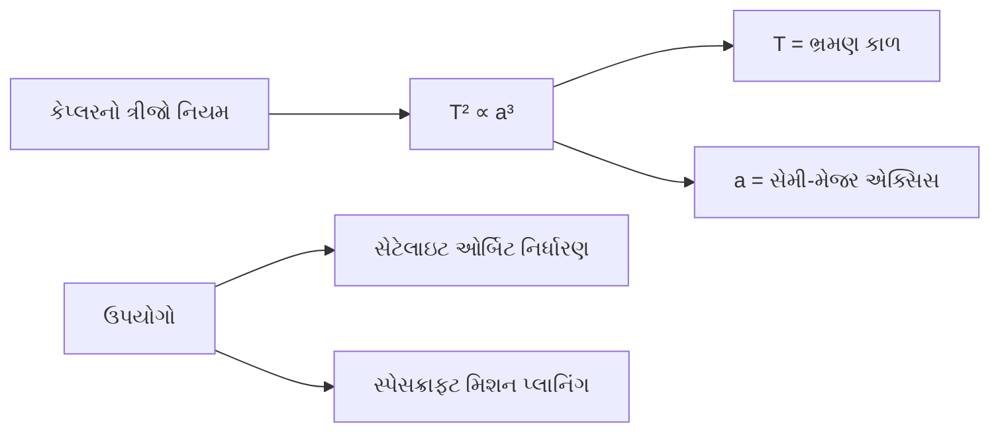

- **અર્થ**: મોટા ઓર્બિટને લાંબો ભ્રમણ કાળ હોય છે
- **ઉપયોગ**: સેટેલાઇટ ઓર્બિટની ખાસિયતો નક્કી કરે છે
- **જિયોસ્ટેશનરી ઓર્બિટ**: ભ્રમણ કાળ = 24 કલાક, ઊંચાઈ ≈ 35,786 km

**મેમરી ટ્રીક:** "CAP: ક્યુબ ઓફ એક્સિસ ઈક્વલ્સ પીરિયડ સ્ક્વેર્ડ"

## પ્રશ્ન 5(ક) અથવા [7 ગુણ]

**ટેરેસ્ટ્રીયલ મોબાઈલ કોમ્યુનિકેશન માટે એન્ટેનાના વિવિધ પ્રકારો ઓળખો અને વિગતવાર સમજાવો.**

**જવાબ**:

**કોષ્ટક: ટેરેસ્ટ્રીયલ મોબાઇલ કોમ્યુનિકેશન એન્ટેના**

| એન્ટેના પ્રકાર | ટિપિકલ ગેઇન | પોલરાઇઝેશન | ઉપયોગો |
|--------------|--------------|--------------|--------------|
| બેઝ સ્ટેશન એન્ટેના | 10-18 dBi | વર્ટિકલ/ડ્યુઅલ | સેલ ટાવર્સ, ફિક્સ્ડ ઇન્ફ્રાસ્ટ્રક્ચર |
| મોબાઇલ સ્ટેશન એન્ટેના | 0-3 dBi | વર્ટિકલ | સ્માર્ટફોન, વાહનો, પોર્ટેબલ ડિવાઇસિસ |
| રિપીટર એન્ટેના | 5-10 dBi | સર્ક્યુલર/ડ્યુઅલ | સિગ્નલ બૂસ્ટિંગ, કવરેજ એક્સટેન્શન |
| ડાયવર્સિટી એન્ટેના | વેરિએબલ | મલ્ટિપલ | મલ્ટિપાથ મિટિગેશન, MIMO સિસ્ટમ્સ |

**બેઝ સ્ટેશન એન્ટેના (વિગતવાર)**:

**આકૃતિ**:

```goat
        ┌────┐
        │    │
        │    │
        │    │      Array of
        │    │     radiating
        │    │     elements
        │    │
        │    │
        │    │
        │    │
        └────┘
          |
        Sector coverage
```

- **પ્રકારો**: પેનલ એરે, કોલિનિયર એરે, સેક્ટર એન્ટેના
- **ખાસિયતો**:
  - ઉચ્ચ ગેઇન (10-18 dBi)
  - દિશાત્મક રેડિએશન પેટર્ન (60°-120° સેક્ટર)
  - ડાઉનટિલ્ટ ક્ષમતા (ઇલેક્ટ્રિકલ/મિકેનિકલ)
  - મલ્ટિપલ-બેન્ડ ઓપરેશન
- **અદ્યતન ફીચર્સ**: 
  - મલ્ટિપલ-ઇનપુટ મલ્ટિપલ-આઉટપુટ (MIMO)
  - રિમોટ ઇલેક્ટ્રિકલ ટિલ્ટ (RET)
  - ઇન્ટિગ્રેટેડ ડિપ્લેક્સર/ટ્રિપ્લેક્સર

**મોબાઇલ સ્ટેશન એન્ટેના**:

- કોમ્પેક્ટ સાઇઝ (આંતરિક/બાહ્ય)
- ઓમ્નિડાયરેક્શનલ પેટર્ન
- મલ્ટિપલ બેન્ડ સપોર્ટ (700-2600 MHz)
- ઇમ્પ્લિમેન્ટેશન: PIFA, હેલિકલ, મોનોપોલ ડિઝાઇન

**મેમરી ટ્રીક:** "BEST: બેઝ-સ્ટેશન્સ એમ્પ્લોય સેક્ટર ટેકનોલોજી"
