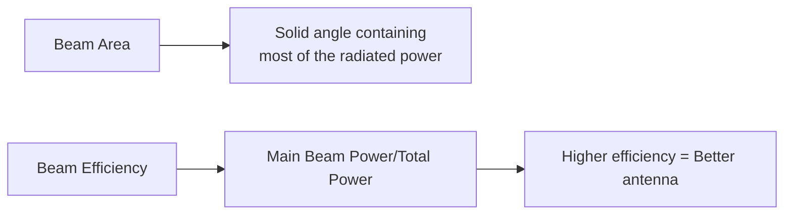
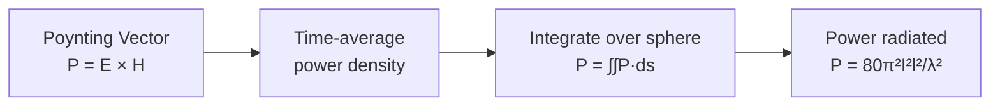
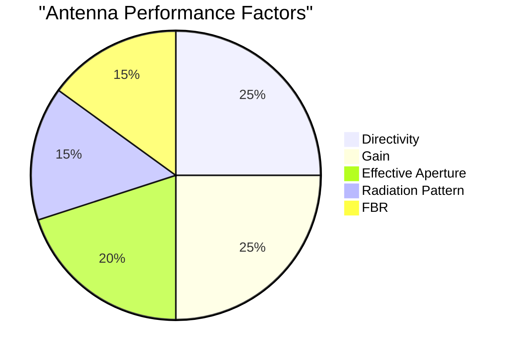
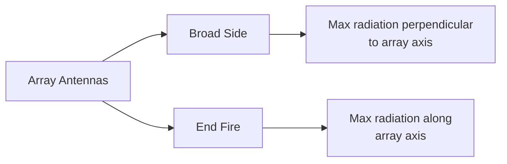
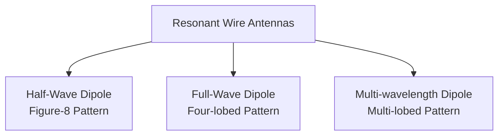
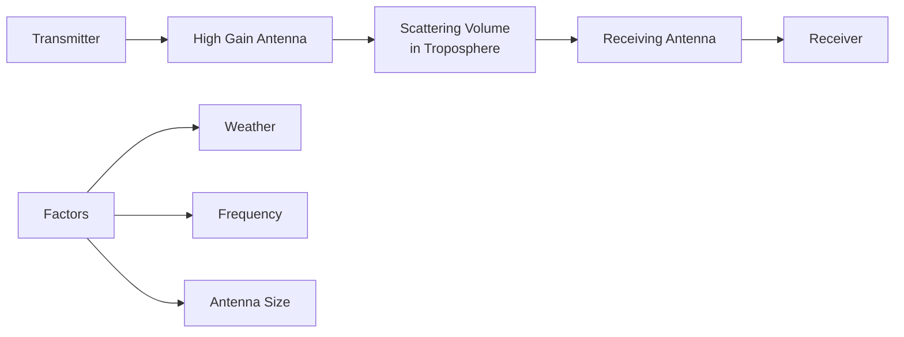
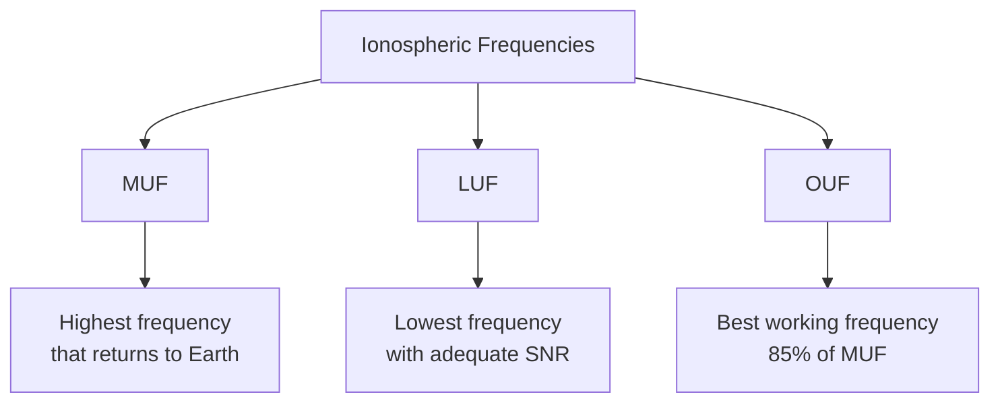
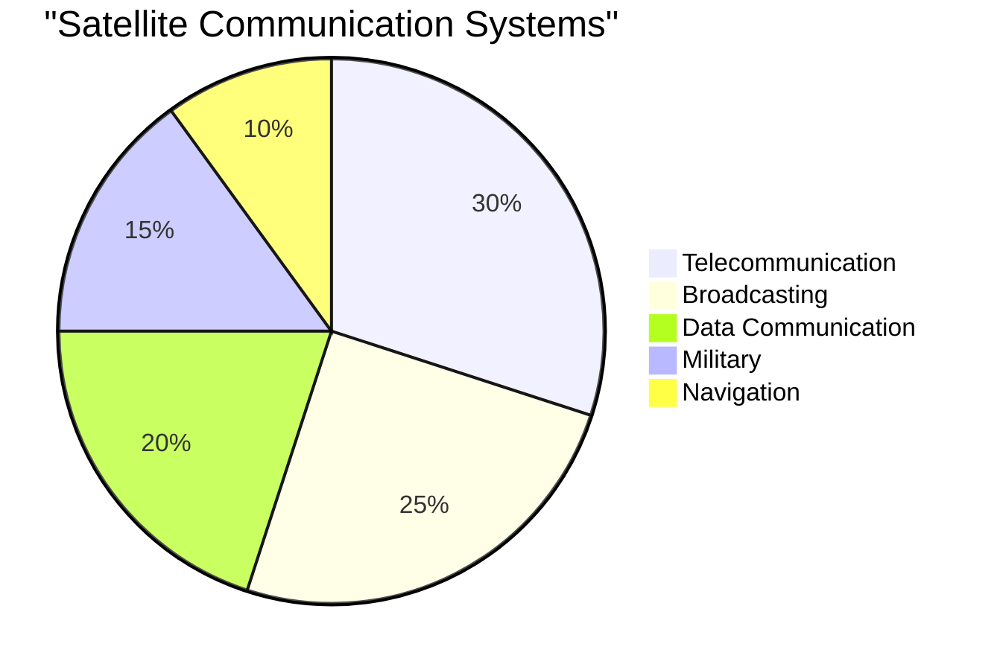
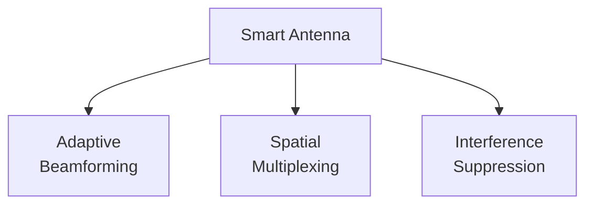
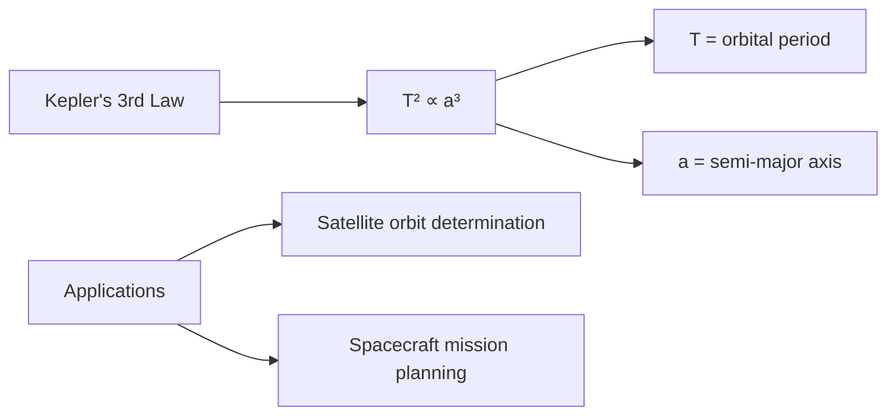

## Question 1(a) [3 marks]

**Define Beam Area and Beam Efficiency.**

**Answer**:

**Beam Area**: The solid angle through which all of the power radiated by an antenna would flow if the radiation intensity was constant throughout this angle and equal to the maximum value.

**Beam Efficiency**: The ratio of the power contained in the main beam to the total power radiated by the antenna.

**Diagram**:



**Mnemonic:** "BEAM: Better Efficiency Achieves Maximum performance"

## Question 1(b) [4 marks]

**What is EM field? Explain its radiation from center fed dipole.**

**Answer**:

EM field is a physical field produced by electrically charged objects that affects charged particles with a force.

**Diagram**:

```goat
                        |
                        |
     E-field            |            E-field
    (vertical)          |           (vertical)
                        |
           ↑            |           ↑
           |   current  |           |
           |      ↓     |           |
     ------+------------+---------- dipole antenna
           |      ↑     |           |
           |   current  |           |
           ↓            |           ↓
                        |
     H-field            |            H-field
    (circular)          |           (circular)
                        |
```

- **Electric field**: Perpendicular to antenna axis, maximum at antenna ends
- **Magnetic field**: Circular around antenna axis
- **Radiation mechanism**: Alternating current creates time-varying fields
- **Field behavior**: Near field (reactive) → intermediate → far field (radiating)

**Mnemonic:** "CERD: Current Excites Radiating Dipole"

## Question 1(c) [7 marks]

**Explain Power radiated by elementary dipole using Poynting Vector.**

**Answer**:

Power radiated by an elementary dipole can be calculated using the Poynting vector, which represents power flow density.

**Table: Key Steps in Poynting Vector Analysis**

| Step | Description |
|------|-------------|
| 1 | Calculate E-field components (Eθ, Eφ) |
| 2 | Calculate H-field components (Hθ, Hφ) |
| 3 | Determine Poynting vector: P = E × H |
| 4 | Integrate over a spherical surface |

**Diagram**:



- **Electric field**: E = (jη I₀dl/2λr) sin θ e⁻ʲᵏʳ
- **Magnetic field**: H = (j I₀dl/2λr) sin θ e⁻ʲᵏʳ
- **Poynting vector**: P = E × H* = (η|I₀|²|dl|²/8π²r²) sin² θ
- **Total power**: P = (η|I₀|²|dl|²/12π) = 80π²I²l²/λ²

**Mnemonic:** "PEHP: Poynting Explains How Power propagates"

## Question 1(c) OR [7 marks]

**Define Antenna, Radiation Pattern, Directivity, Gain, FBR, Isotropic Radiator and Effective Aperture.**

**Answer**:

**Table: Key Antenna Parameters**

| Parameter | Definition |
|-----------|------------|
| Antenna | A device that converts guided electromagnetic waves to free-space waves and vice versa |
| Radiation Pattern | Graphical representation of radiation properties as a function of space coordinates |
| Directivity | Ratio of radiation intensity in a given direction to average radiation intensity |
| Gain | Ratio of radiation intensity to that of an isotropic source with same input power |
| FBR (Front-to-Back Ratio) | Ratio of power radiated in forward direction to that in backward direction |
| Isotropic Radiator | Theoretical antenna that radiates equally in all directions |
| Effective Aperture | Ratio of power received by antenna to incident power density |

**Diagram**:



**Mnemonic:** "DIAGRAM: Directivity Improves Antenna Gain, Radiation And More"

## Question 2(a) [3 marks]

**Explain principle of pattern multiplication.**

**Answer**:

Pattern multiplication states that the radiation pattern of an array equals the product of the element pattern and the array factor.

**Diagram**:


- **Element pattern**: Radiation pattern of single element
- **Array factor**: Pattern due to arrangement of elements
- **Result**: Sharper beams, higher directivity

**Mnemonic:** "PEAM: Pattern Equals Array times Element Method"

## Question 2(b) [4 marks]

**Draw & Explain Loop antenna.**

**Answer**:

A loop antenna is a closed-circuit antenna consisting of one or more complete turns of wire.

**Diagram**:

```goat
      ┌───────────┐
      │           │
      │           │
      │           │
  feed│           │
   ┌──┴──┐        │
   │     │        │
   └─────┘        │
      │           │
      │           │
      └───────────┘
```

- **Small loop**: Circumference < λ/10, figure-8 pattern
- **Large loop**: Circumference ≈ λ, maximum radiation perpendicular to plane
- **Applications**: Direction finding, AM radio reception
- **Radiation resistance**: Proportional to (circumference/λ)⁴ for small loops

**Mnemonic:** "LOOP: Low Output, Orientation Precise"

## Question 2(c) [7 marks]

**Design a Yagi-uda antenna and explain it.**

**Answer**:

Yagi-Uda is a directional antenna with driven element, reflector, and directors.

**Table: Yagi-Uda Antenna Design Guidelines**

| Element | Length | Spacing from Driven Element |
|---------|--------|---------------------------|
| Reflector | 0.5λ × 1.05 | 0.15λ - 0.25λ |
| Driven Element | 0.5λ | Reference point |
| Director 1 | 0.5λ × 0.95 | 0.1λ - 0.15λ |
| Director 2 | 0.5λ × 0.92 | 0.2λ - 0.3λ |
| Additional Directors | Decreasing | 0.3λ - 0.4λ |

**Diagram**:

```goat
          Director 2     Director 1     Driven      Reflector
             ┌┐             ┌┐          Element        ┌┐
             ││             ││            ┌┐           ││
             ││             ││            ││           ││
             ││             ││            ││           ││
     ────────┴┴─────────────┴┴────────────┴┴───────────┴┴────────►
             │<--0.15λ-->│<--0.15λ-->│<--0.25λ-->│      Radiation
             │<----------- Boom Length ---------->│      Direction
```

- **Function**: Reflector reflects signal, directors guide it forward
- **Gain**: Increases with number of directors (diminishing returns)
- **Impedance**: 20-30 ohms (typically matched with balun)
- **Applications**: TV reception, point-to-point communication

**Mnemonic:** "YARD: Yagi Achieves Radical Directivity"

## Question 2(a) OR [3 marks]

**Compare broad fire and end fire array antenna.**

**Answer**:

**Table: Broad Side vs End Fire Array**

| Parameter | Broad Side Array | End Fire Array |
|-----------|-----------------|----------------|
| Direction of Maximum Radiation | Perpendicular to array axis | Along array axis |
| Phase Difference | 0° | 180° ± βd |
| Beam Width | Narrower | Wider |
| Directivity | Higher | Lower |
| Applications | Broadcasting | Point-to-point links |

**Diagram**:



**Mnemonic:** "BEPS: Broadside Emits Perpendicularly, Sideways"

## Question 2(b) OR [4 marks]

**Draw & Explain Folded dipole antenna.**

**Answer**:

A folded dipole consists of a half-wavelength dipole with its ends folded back and connected, forming a narrow loop.

**Diagram**:

```goat
       λ/2
    ┌───────┐
    │       │
    │       │
    │       │
feed│       │
 ┌──┴──┐    │
 │     │    │
 └─────┘    │
    │       │
    │       │
    └───────┘
```

- **Impedance**: 4 times higher than standard dipole (≈300Ω)
- **Bandwidth**: Wider than simple dipole
- **Applications**: TV antennas, FM receiving antennas
- **Advantage**: Less susceptible to noise

**Mnemonic:** "FIBER: Folded Impedance Booster Enhances Reception"

## Question 2(c) OR [7 marks]

**Give names of Non-resonant antennas and explain any one in detail with its radiation pattern.**

**Answer**:

Non-resonant antennas include Rhombic, V antenna, Terminated folded dipole, Beverage, and Long-wire antennas.

**Rhombic Antenna in Detail:**

**Diagram**:

```goat
                    ┌───────┐
                   /         \
                  /           \
                 /             \
                /               \
               /                 \
              /                   \
             /                     \
            /                       \
           /                         \
    ┌─────┘                           └─────┐
    │                                       │
 ───┴───                                 ───┴───
 Feeder                               Terminating
                                       Resistor
```

**Table: Rhombic Antenna Characteristics**

| Parameter | Description |
|-----------|-------------|
| Structure | Four long wires arranged in rhombus shape |
| Termination | Resistive load at far end (non-resonant) |
| Directivity | High (8-15 dB) |
| Frequency Range | Wide bandwidth (multi-octave) |
| Radiation Pattern | Unidirectional, cone-shaped |
| Applications | HF point-to-point communications |

- **Advantages**: High gain, broad bandwidth, simple construction
- **Disadvantages**: Large physical size, power loss in terminating resistor
- **Pattern**: Main lobe along major axis of rhombus

**Mnemonic:** "RHOMBIC: Reliable High-Output Multi-Band Impressive Communications"

## Question 3(a) [3 marks]

**Compare radiation pattern of different resonant wire antennas.**

**Answer**:

**Table: Radiation Patterns of Resonant Wire Antennas**

| Antenna Type | Pattern Shape | Directivity | Polarization |
|--------------|---------------|-------------|--------------|
| Half-Wave Dipole | Figure-8 (donut) | 2.15 dBi | Linear |
| Full-Wave Dipole | Four-lobed | 3.8 dBi | Linear |
| 3λ/2 Dipole | Six-lobed | 4.2 dBi | Linear |
| 2λ Dipole | Eight-lobed | 4.5 dBi | Linear |

**Diagram**:



**Mnemonic:** "MOLD: More wavelengths create Lots of Directivity lobes"

## Question 3(b) [4 marks]

**Draw V and Inverted V antenna with radiation Pattern.**

**Answer**:

**Diagram: V-Antenna**

```goat
        
        
      /\
     /  \
    /    \
   /      \
  /        \
 /          \
Feed        Feed
Point       Point
    
Radiation Pattern: Bidirectional along axis
```

**Diagram: Inverted V-Antenna**

```goat
         Feed
         Point
           |
           V
          / \
         /   \
        /     \
       /       \
      /         \
     Ground     Ground
     
Radiation Pattern: Omnidirectional with slight elevation
```

- **V-Antenna**: Two wires forming V-shape, bidirectional pattern
- **Inverted V**: Half-wave dipole with arms drooping down, omnidirectional
- **Applications**: Amateur radio, FM reception
- **Advantages**: Simple, flexible installation options

**Mnemonic:** "VIPS: V-shapes Improve Pattern Selectivity"

## Question 3(c) [7 marks]

**Explain Morse Code and Practice Oscillator.**

**Answer**:

Morse code is a method of transmitting text using standardized sequences of dots and dashes.

**Table: Basic Morse Code Elements**

| Element | Timing | Sound |
|---------|--------|-------|
| Dot (.) | 1 unit | Short beep |
| Dash (-) | 3 units | Long beep |
| Space between elements | 1 unit | Short silence |
| Space between letters | 3 units | Medium silence |
| Space between words | 7 units | Long silence |

**Diagram: Simple Morse Code Practice Oscillator**

```goat
      +9V
       |
       R1
       |
      ┌┴┐
 C1   │ │                    Speaker
┌──┬──┤8├──┬────┬─────────────┬──┐
│  │  │5│  │    │             │  │
│  │  │5│  │    R2            C2 │
│  │  │5│  │    │             │  │
│  │  └┬┘  │    │             │  │
│  │   │   │    │             │  │
└──┴───┴───┴────┴─────────────┴──┘
  Key        Ground
```

- **Components**: 555 timer, resistors, capacitors, key, speaker
- **Operation**: Key closing completes circuit, creating oscillation
- **Frequency**: Typically 600-800 Hz (adjustable with R2)
- **Applications**: Ham radio training, emergency communications

**Mnemonic:** "TEMPO: Timing Elements Make Perfect Oscillation"

## Question 3(a) OR [3 marks]

**Draw and Explain Microstrip Patch antenna.**

**Answer**:

A microstrip patch antenna consists of a metal patch on a grounded substrate.

**Diagram**:

```goat
    ┌───────────────┐  ←-- Patch (metal)
    │               │
    │               │  Thickness
    │               │  ↕  
════════════════════════ ←-- Substrate
    |               |
    |               |  ←-- Ground plane
    └───────────────┘
    
    ↑               ↑
    Feed            Radiation
    point
```

- **Structure**: Metal patch on dielectric substrate with ground plane
- **Advantages**: Low profile, lightweight, easy fabrication, conformable
- **Disadvantages**: Narrow bandwidth, low efficiency, low power handling
- **Applications**: Mobile devices, RFID, satellite communications

**Mnemonic:** "MAPS: Microstrip Antenna Patches are Simple"

## Question 3(b) OR [4 marks]

**Draw and Explain Horn antenna.**

**Answer**:

A horn antenna is a waveguide with flared open end that directs radio waves in a beam.

**Diagram**:

```goat
            ┌───────────┐
            │           │
            │           │
       ┌────┤           │
       │    │           │
       │    │           │
Feed   │    │           │
point  │    │           │
       │    │           │
       └────┤           │
            │           │
            │           │
            └───────────┘
         Waveguide       Horn
```

- **Types**: E-plane, H-plane, Pyramidal, Conical
- **Frequency range**: Microwave (1-20 GHz)
- **Advantages**: High gain, wide bandwidth, low VSWR
- **Applications**: Satellite communications, radar, radio astronomy

**Mnemonic:** "HEWB: Horns Enhance Waveguide Beamwidth"

## Question 3(c) OR [7 marks]

**List different feed system for Parabolic reflector antenna and explain any one.**

**Answer**:

**Table: Parabolic Reflector Feed Systems**

| Feed System | Position | Characteristics |
|-------------|----------|----------------|
| Front Feed | At focus, in front of dish | Simple, some blockage |
| Cassegrain | Secondary reflector with feed at center of dish | Reduced noise, compact |
| Gregorian | Secondary concave reflector | Better gain, larger size |
| Offset Feed | Feed offset from main axis | No blockage, asymmetric |
| Waveguide Feed | Direct waveguide at focus | Simple, limited flexibility |

**Front Feed System (Detailed):**

**Diagram**:


- **Operation**: Feed placed at focal point, illuminates reflector
- **Advantages**: Simple design, easy alignment, maximum efficiency
- **Disadvantages**: Feed and support structure block part of aperture
- **Applications**: Satellite dishes, radio telescopes, radar

**Mnemonic:** "FACTS: Focused Aperture Captures Transmitted Signals"

## Question 4(a) [3 marks]

**Explain working principle of HAM radio.**

**Answer**:

HAM radio (Amateur Radio) operates on designated frequency bands for non-commercial communications.

**Diagram**:


- **Operation**: Transmitter generates RF signal, antenna radiates signal
- **Frequency bands**: HF (3-30 MHz), VHF (30-300 MHz), UHF (300-3000 MHz)
- **Modes**: AM, FM, SSB, CW (Morse), digital modes
- **License**: Required for legal operation (levels based on skills)

**Mnemonic:** "TEAM: Transmission Enables Amateur Messages"

## Question 4(b) [4 marks]

**Explain Duct Propagation.**

**Answer**:

Duct propagation occurs when radio waves are trapped within atmospheric layers with varying refractive indices.

**Diagram**:

```goat
        ------------------  ←-- Upper atmosphere
       
         ===============  ←-- Duct layer (temperature inversion)
        /     Trapped    \
       /       waves      \
      /                    \
     /                      \
    /                        \
   /                          \
  Transmitter                Receiver
  
      ==================== Ground/Sea
```

- **Formation**: Temperature inversion creates refractive index gradient
- **Frequency range**: VHF, UHF, microwave frequencies
- **Advantages**: Extended communication range (beyond horizon)
- **Occurrence**: Common over oceans, varies with weather conditions

**Mnemonic:** "TRIP: Trapped Rays In atmospheric Paths"

## Question 4(c) [7 marks]

**Explain Tropospheric Scattered Propagation in detail.**

**Answer**:

Tropospheric scatter uses the scattering properties of the troposphere to enable beyond-horizon communications.

**Table: Tropospheric Scatter Characteristics**

| Parameter | Description |
|-----------|-------------|
| Mechanism | Forward scattering of radio waves by tropospheric irregularities |
| Frequency Range | 300 MHz to 10 GHz (UHF/SHF) |
| Range | 100-800 km |
| Path Loss | High (requires high-power transmitters) |
| Reliability | Affected by weather conditions |

**Diagram**:



- **Mechanism**: Signal scattered by refractive index irregularities
- **Equipment**: High-power transmitters, large antennas, sensitive receivers
- **Applications**: Military, backup communications, remote areas
- **Advantages**: Beyond line-of-sight, relatively stable

**Mnemonic:** "STARS: Scatter Tropospheric Allows Range beyond Sight"

## Question 4(a) OR [3 marks]

**Draw turnstile and super turnstile antenna.**

**Answer**:

**Diagram: Turnstile Antenna**

```goat
          │   │
     ─────┼───┼─────
          │   │
          │   │
     ─────┼───┼─────
          │   │

  Two dipoles at 90° fed with 90° phase difference
```

**Diagram: Super Turnstile (Batwing) Antenna**

```goat
      ┌───┬───┐
      │   │   │
      │   │   │
      │   │   │
    ──┼───┼───┼──
      │   │   │
      │   │   │
      │   │   │
      └───┴───┘

    Multiple elements for broadband operation
```

- **Turnstile**: Two dipoles at right angles, circular polarization
- **Super turnstile**: Multiple elements for increased bandwidth
- **Applications**: TV broadcasting, FM broadcasting, satellite communications
- **Advantage**: Omnidirectional horizontal pattern

**Mnemonic:** "TACO: Turnstile Antennas Create Omnidirectional patterns"

## Question 4(b) OR [4 marks]

**Give full form of MUF, LUF and OUF.**

**Answer**:

**Table: Ionospheric Propagation Parameters**

| Abbreviation | Full Form | Description |
|--------------|-----------|-------------|
| MUF | Maximum Usable Frequency | Highest frequency that can be reflected by ionosphere |
| LUF | Lowest Usable Frequency | Lowest frequency providing adequate signal-to-noise ratio |
| OUF | Optimum Usable Frequency | Best working frequency (85% of MUF) |

**Diagram**:



**Mnemonic:** "MLO: Maximum and Lowest determine Optimum"

## Question 4(c) OR [7 marks]

**Explain virtual height, critical frequency and skip distance in detail.**

**Answer**:

**Table: Key Ionospheric Propagation Parameters**

| Parameter | Definition | Significance |
|-----------|------------|--------------|
| Virtual Height | Apparent reflection height assuming straight-line propagation | Determines maximum communication range |
| Critical Frequency | Maximum frequency reflected at vertical incidence | Indicates ionization density |
| Skip Distance | Minimum distance where ionospheric signals can be received | Creates "skip zones" with no reception |

**Diagram**:

```goat
                  /|\
                 / | \
                /  |  \       Critical freq: Maximum
               /   |   \      frequency at 90° incidence
              /    |    \
             /     |     \
            /      |      \
Transmitter/       |       \Receiver
           /       |        \
          /        |         \
         /         |          \
        /          |           \
       /           |            \
      /            |             \
     /             |              \
    /              |               \
   /               |                \
  /                |                 \
 /                 |                  \
Earth              |                  Earth
       |<------ Skip Distance -------->|

Virtual height: Apparent reflection height
```

- **Virtual height**: Typically 300-400 km for F layer, varies with time/season
- **Critical frequency**: Usually 5-10 MHz for F2 layer, depends on solar activity
- **Skip distance**: Given by D = 2h tan θ, where h is virtual height and θ is incidence angle

**Mnemonic:** "VCS: Virtual height Controls Skip distance"

## Question 5(a) [3 marks]

**With neat figure show different Ionosphere layers.**

**Answer**:

**Diagram: Ionospheric Layers**

```goat
Height (km)
   ^
   |
400|                   F2 Layer
   |           ----------------------
   |
300|                   F1 Layer (daytime)
   |           ----------------------
   |
200|                   E Layer
   |           ----------------------
   |
100|                   D Layer
   |           ----------------------
   |
   +------------------------------------->
                 Electron Density
```

- **D Layer**: 60-90 km, absorbs HF waves, disappears at night
- **E Layer**: 90-150 km, reflects MF/lower HF, weakens at night
- **F1 Layer**: 150-220 km, present in daytime only
- **F2 Layer**: 220-400 km, main reflection layer, present day/night

**Mnemonic:** "DEAF: Down to up - D, E, And F layers"

## Question 5(b) [4 marks]

**Give names of different types of satellite communication systems and compare it.**

**Answer**:

**Table: Satellite Communication Systems**

| System Type | Frequency Bands | Applications | Characteristics |
|-------------|----------------|--------------|-----------------|
| Telecommunication | C, Ku, Ka bands | Phone, data, internet | Global coverage, high capacity |
| Broadcasting | Ku, C bands | TV, radio transmission | High power, wide coverage |
| Data Communication | L, S, Ka bands | IoT, VSAT, M2M | Low to medium data rates |
| Military | X, EHF bands | Secure communications | Encrypted, jam-resistant |
| Navigation | L band | GPS, GLONASS, Galileo | Precise timing, positioning |

**Diagram**:



**Mnemonic:** "TBDMN: Telecom, Broadcasting, Data, Military, Navigation"

## Question 5(c) [7 marks]

**Draw and explain DTH receiver system.**

**Answer**:

DTH (Direct-to-Home) system delivers television programming directly to viewers via satellite.

**Diagram**:

```goat
                     TV
                     |
                     V
                 Set-top Box
                     |
                     V
                  LNB/LNBF <---- Satellite signals
                     |
                     V
                 Dish Antenna
                  (0.6-1.2m)
```

**Table: DTH System Components**

| Component | Function | Specifications |
|-----------|----------|---------------|
| Dish Antenna | Collects satellite signals | 45-120 cm diameter |
| LNB (Low Noise Block) | Converts high frequency to lower IF | Noise figure: 0.3-1.0 dB |
| Coaxial Cable | Carries IF signal to receiver | RG-6 type, 75 ohm |
| Set-top Box | Demodulates/decodes signals | MPEG-2/4 decoder |
| TV Set | Displays programming | HDMI/Component input |

- **Frequency**: Ku-band (10.7-12.75 GHz) or C-band (3.7-4.2 GHz)
- **Modulation**: QPSK or 8PSK digital modulation
- **Signal processing**: Digital compression (MPEG-2/4)
- **Features**: EPG (Electronic Program Guide), PVR (recording)

**Mnemonic:** "DOCS: Dish Obtains, Converts and Shows signals"

## Question 5(a) OR [3 marks]

**What is the Need of Smart Antennas? Write its applications.**

**Answer**:

Smart antennas use adaptive signal processing to dynamically optimize radiation patterns.

**Needs**:

- Increased capacity in congested networks
- Improved signal quality and coverage
- Reduced interference and multipath fading
- Enhanced spectral efficiency

**Diagram**:



**Applications**:

- Mobile communication networks (4G/5G)
- MIMO systems for high data rates
- Radar systems with enhanced target detection
- Wireless LANs with improved coverage

**Mnemonic:** "SAFE: Smart Antennas For Efficiency"

## Question 5(b) OR [4 marks]

**Explain Kepler's 3rd law.**

**Answer**:

Kepler's 3rd law relates the orbital period of a satellite to its semi-major axis.

**Formula**: T² = (4π²/GM) × a³

Where:

- T = orbital period
- a = semi-major axis
- G = gravitational constant
- M = mass of central body

**Diagram**:



- **Meaning**: Larger orbits have longer periods
- **Application**: Determines satellite orbit characteristics
- **Geostationary orbit**: Period = 24 hours, altitude ≈ 35,786 km

**Mnemonic:** "CAP: Cube of Axis equals Period squared"

## Question 5(c) OR [7 marks]

**Identify the different types of Antennas for Terrestrial Mobile communication and explain in detail.**

**Answer**:

**Table: Terrestrial Mobile Communication Antennas**

| Antenna Type | Typical Gain | Polarization | Applications |
|--------------|--------------|--------------|--------------|
| Base Station Antennas | 10-18 dBi | Vertical/Dual | Cell towers, fixed infrastructure |
| Mobile Station Antennas | 0-3 dBi | Vertical | Smartphones, vehicles, portable devices |
| Repeater Antennas | 5-10 dBi | Circular/Dual | Signal boosting, coverage extension |
| Diversity Antennas | Variable | Multiple | Multipath mitigation, MIMO systems |

**Base Station Antennas (Detailed)**:

**Diagram**:

```goat
        ┌────┐
        │    │
        │    │
        │    │      Array of
        │    │     radiating
        │    │     elements
        │    │
        │    │
        │    │
        │    │
        └────┘
          |
        Sector coverage
```

- **Types**: Panel arrays, collinear arrays, sector antennas
- **Characteristics**:
  - High gain (10-18 dBi)
  - Directional radiation pattern (60°-120° sectors)
  - Downtilt capability (electrical/mechanical)
  - Multiple-band operation
- **Advanced features**: 
  - Multiple-input multiple-output (MIMO)
  - Remote electrical tilt (RET)
  - Integrated diplexers/triplexers

**Mobile Station Antennas**:

- Compact size (internal/external)
- Omnidirectional pattern
- Multiple band support (700-2600 MHz)
- Implementations: PIFA, helical, monopole designs

**Mnemonic:** "BEST: Base-stations Employ Sector Technology"
