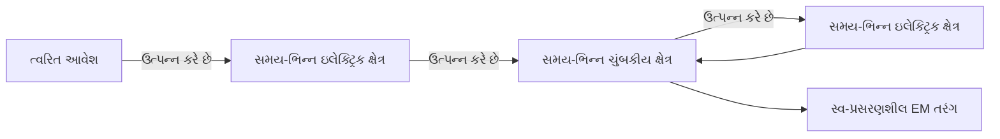
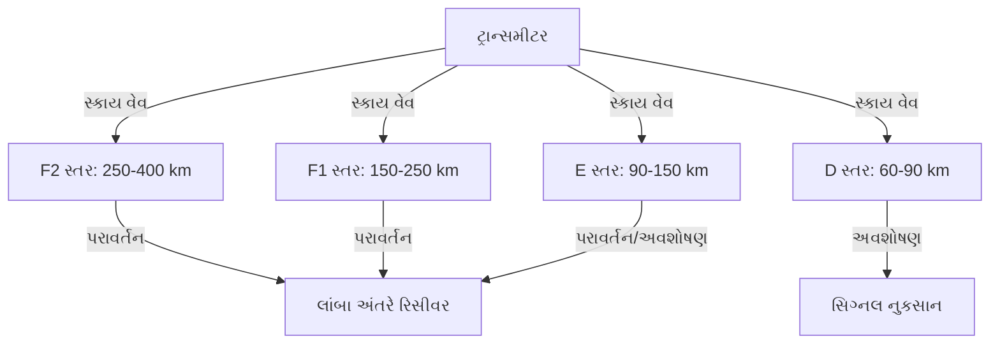
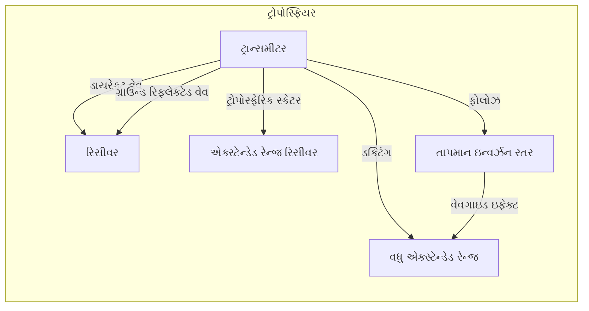
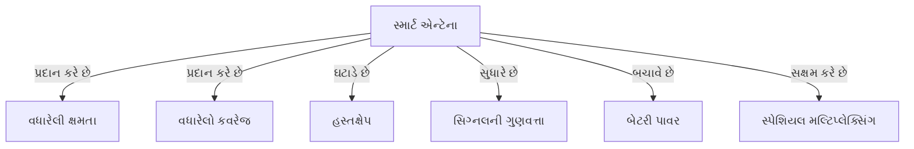
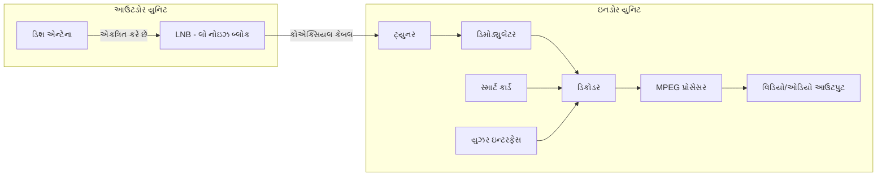
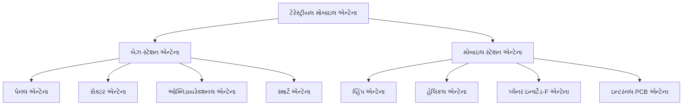

## પ્રશ્ન 1(અ) [3 ગુણ]

**વ્યાખ્યાયિત કરો: (1) ડાયરેક્ટિવિટી, (2) ગેઇન, અને (3) HPBW**

**ઉત્તર**:

**કોષ્ટક: મહત્વના અન્ટેના પરિમાણો**

| પરિમાણ | વ્યાખ્યા |
|-----------|------------|
| **ડાયરેક્ટિવિટી** | અન્ટેનાની મહત્તમ વિકિરણ તીવ્રતા અને સરેરાશ વિકિરણ તીવ્રતાનો ગુણોત્તર |
| **ગેઇન** | ચોક્કસ દિશામાં વિકિરિત થતી શક્તિ અને આઇસોટ્રોપિક અન્ટેના દ્વારા વિકિરિત થતી શક્તિનો ગુણોત્તર |
| **HPBW (હાફ પાવર બીમ વિડ્થ)** | કોણીય પહોળાઈ જ્યાં વિકિરણની તીવ્રતા મહત્તમ મૂલ્યના અડધી (3dB ઓછી) હોય છે |

**મેમરી ટ્રીક:** "DGH: દિશા ગેઇન હાફ-પાવર"

## પ્રશ્ન 1(બ) [4 ગુણ]

**ઇલેક્ટ્રોમેગ્નેટિક તરંગોના ગુણધર્મોની સૂચિ બનાવો**

**ઉત્તર**:

**કોષ્ટક: ઇલેક્ટ્રોમેગ્નેટિક તરંગોના ગુણધર્મો**

| ગુણધર્મ | વર્ણન |
|----------|-------------|
| **ટ્રાન્સવર્સ તરંગો** | ઇલેક્ટ્રિક અને મેગ્નેટિક ક્ષેત્રો પ્રસરણની દિશાને લંબરૂપે હોય છે |
| **વેગ** | નિર્વાતમાં પ્રકાશનો વેગ (3×10^8 m/s) |
| **માધ્યમની જરૂર નથી** | યાંત્રિક તરંગોથી વિપરીત, નિર્વાતમાં પણ પ્રવાસ કરી શકે છે |
| **ધ્રુવીકરણ** | ઇલેક્ટ્રિક ક્ષેત્ર વેક્ટરની દિશા |
| **ઊર્જા વહન** | અવકાશમાં ઊર્જા વહન કરે છે |
| **પરાવર્તન/વક્રીભવન** | સીમાઓ પર પરાવર્તિત અને વક્રીભૂત થઈ શકે છે |
| **વ્યતિકરણ/વિવર્તન** | તરંગ જેવા ગુણધર્મો દર્શાવે છે |

**મેમરી ટ્રીક:** "TVNPER: ટ્રાન્સવર્સ વેગ નો-માધ્યમ પોલરાઇઝ્ડ એનર્જી રિફ્લેક્શન"

## પ્રશ્ન 1(ક) [7 ગુણ]

**ઈલેક્ટ્રોમેગ્નેટિક તરંગોના નિર્માણનો ભૌતિક ખ્યાલ સમજાવો**

**ઉત્તર**:

**આકૃતિ: ઇલેક્ટ્રોમેગ્નેટિક તરંગનું નિર્માણ**



- **આવેશનું ત્વરણ**: જ્યારે ઇલેક્ટ્રિક આવેશો ત્વરિત થાય છે, ત્યારે તેઓ બદલાતા ઇલેક્ટ્રિક ક્ષેત્રો ઉત્પન્ન કરે છે
- **ક્ષેત્ર જોડાણ**: બદલાતું ઇલેક્ટ્રિક ક્ષેત્ર બદલાતું ચુંબકીય ક્ષેત્ર ઉત્પન્ન કરે છે અને તેનાથી ઉલટું પણ થાય છે
- **સ્વ-પ્રસરણ**: ક્ષેત્રોના ચક્રીય નિર્માણથી તરંગો કોઈ માધ્યમ વિના પ્રવાસ કરી શકે છે
- **ક્ષેત્ર અભિમુખતા**: ઇલેક્ટ્રિક અને ચુંબકીય ક્ષેત્રો એકબીજાને અને પ્રસરણની દિશાને લંબરૂપ હોય છે
- **ઊર્જા વહન**: તરંગ પ્રસરણ સાથે ઊર્જા ઇલેક્ટ્રિક અને ચુંબકીય ક્ષેત્રો વચ્ચે વારાફરતી આવે છે

**મેમરી ટ્રીક:** "CASES: ચાર્જ એક્સેલરેશન સેલ્ફ-પ્રોપેગેટ્સ ઇલેક્ટ્રો-મેગ્નેટિક સિગ્નલ્સ"

## પ્રશ્ન 1(ક) અથવા [7 ગુણ]

**સેન્ટર ફેડ ડાયપોલ માંથી ઇલેક્ટ્રોમેગ્નેટિક ક્ષેત્ર કેવી રીતે વિકિરણ થાય છે તે સમજાવો**

**ઉત્તર**:

**આકૃતિ: સેન્ટર-ફેડ ડાયપોલમાંથી ક્ષેત્ર વિકિરણ**


- **સેન્ટર ફીડિંગ**: ડાયપોલના કેન્દ્રમાં AC સિગ્નલ આપવાથી આવર્તક પ્રવાહ ઉત્પન્ન થાય છે
- **આવેશ વિતરણ**: પ્રવાહ ડાયપોલના છેડા પર વિરુદ્ધ આવેશો ઉત્પન્ન કરે છે જે AC આવૃત્તિ સાથે બદલાય છે
- **ક્ષેત્ર નિર્માણ**: આવર્તક આવેશો સમય-ભિન્ન ઇલેક્ટ્રિક ક્ષેત્ર ઉત્પન્ન કરે છે
- **ચુંબકીય જોડાણ**: સમય-ભિન્ન ઇલેક્ટ્રિક ક્ષેત્ર લંબરૂપ ચુંબકીય ક્ષેત્ર ઉત્પન્ન કરે છે
- **નજીક/દૂરના ક્ષેત્રો**: ડાયપોલની નજીક, ક્ષેત્રો જટિલ હોય છે; ડાયપોલથી દૂર, ક્ષેત્રો એકસમાન વિકિરણ પેટર્ન બનાવે છે
- **વિકિરણ પેટર્ન**: ડાયપોલ અક્ષને લંબરૂપે મહત્તમ વિકિરણ, અક્ષ સાથે શૂન્ય વિકિરણ

**મેમરી ટ્રીક:** "CORONA: કરંટ ઓસિલેટ્સ, રેડિએશન ઓકર્સ, નીયર-ફાર એરિયાઝ"

## પ્રશ્ન 2(અ) [3 ગુણ]

**રેઝોનન્ટ અને નોન-રેઝોનન્ટ એન્ટેનામાં તફાવત કરો**

**ઉત્તર**:

**કોષ્ટક: રેઝોનન્ટ બનામ નોન-રેઝોનન્ટ અન્ટેના**

| લક્ષણ | રેઝોનન્ટ અન્ટેના | નોન-રેઝોનન્ટ અન્ટેના |
|---------|-------------------|----------------------|
| **લંબાઈ** | λ/2 નો પૂર્ણાંક ગુણાંક | તરંગલંબાઈ સાથે સંબંધિત નથી |
| **સ્થાયી તરંગો** | હાજર | હાજર નથી |
| **પ્રતિબાધા** | અવરોધક (વાસ્તવિક) | જટિલ (વાસ્તવિક + કાલ્પનિક) |
| **બેન્ડવિડ્થ** | સાંકડી | વિશાળ |
| **ઉદાહરણ** | અર્ધ-તરંગ ડાયપોલ | રોમ્બિક અન્ટેના |

**મેમરી ટ્રીક:** "RESI: રેઝોનન્ટ એક્ઝિબિટ્સ સ્ટેન્ડિંગ-વેવ્સ ઇમ્પિડન્સ-રિયલ"

## પ્રશ્ન 2(બ) [4 ગુણ]

**યાગી એન્ટેના સમજાવો અને તેની રેડિયેશન લાક્ષણિકતાઓની ચર્ચા કરો**

**ઉત્તર**:

**આકૃતિ: યાગી-ઉદા અન્ટેનાની સંરચના**

```goat
   Reflector    Driven    Directors
     (R)       Element      (D)
      |          (DE)     |  |  |
      |           |       |  |  |
 -----|-----------|-------|--|--|-------> Direction of
      |           |       |  |  |         Maximum Radiation
      |           |       |  |  |
      
   Longest       λ/2     Shortest
```

- **સંરચના**: એક રિફ્લેક્ટર, એક ડ્રાઇવન એલિમેન્ટ અને અનેક ડાયરેક્ટર્સ ધરાવે છે
- **દિશાત્મકતા**: ડાયરેક્ટર્સની દિશામાં ઉચ્ચ દિશાત્મકતા (8-12dB)
- **ગેઇન**: વધુ ડાયરેક્ટર્સ સાથે ઉચ્ચ ગેઇન (15dB સુધી)
- **બેન્ડવિડ્થ**: કેન્દ્ર આવૃત્તિનો 2-5%
- **એપ્લિકેશન્સ**: ટીવી રિસેપ્શન, પોઇન્ટ-ટુ-પોઇન્ટ કોમ્યુનિકેશન, એમેચ્યોર રેડિયો

**મેમરી ટ્રીક:** "DRAGONS: ડાયરેક્શનલ રિફ્લેક્ટર એન્ડ ગેઇન-ઇમ્પ્રુવિંગ ડાયરેક્ટર્સ ઓફર નેરો સિગ્નલ્સ"

## પ્રશ્ન 2(ક) [7 ગુણ]

**રેઝોનન્ટ વાયર એન્ટેનાની રેડિયેશન લાક્ષણિકતાઓનું વર્ણન કરો અને λ/2, 3λ/2 અને 5λ/2 એન્ટેનાનું કરંટ વિતરણ દોરો**

**ઉત્તર**:

**આકૃતિ: રેઝોનન્ટ વાયર એન્ટેનામાં કરંટ વિતરણ**

```goat
λ/2 Antenna:
     +--------+
     |        |
     v        v
 ----+--------+----
     ^        ^
     |        |
     +--------+
     I_max at center
     Zero at ends

3λ/2 Antenna:
     +---+---+---+
     |   |   |   |
     v   ^   v   ^
 ----+---+---+---+----
     ^   v   ^   v
     |   |   |   |
     +---+---+---+
     3 current nodes
     
5λ/2 Antenna:
     +---+---+---+---+---+
     |   |   |   |   |   |
     v   ^   v   ^   v   ^
 ----+---+---+---+---+---+----
     ^   v   ^   v   ^   v
     |   |   |   |   |   |
     +---+---+---+---+---+
     5 current nodes
```

- **અર્ધ-તરંગ (λ/2)**: કેન્દ્રમાં પ્રવાહ મહત્તમ, છેડા પર શૂન્ય; વિકિરણ પેટર્ન આંકડા-આઠ આકારની હોય છે
- **ત્રણ અર્ધ-તરંગ (3λ/2)**: ત્રણ પ્રવાહ મહત્તમ, λ/2 બિંદુઓ પર ફેઝ રિવર્સલ; વિકિરણ પેટર્નમાં અનેક લોબ્સ
- **પાંચ અર્ધ-તરંગ (5λ/2)**: પાંચ પ્રવાહ મહત્તમ, વધુ જટિલ વિકિરણ પેટર્ન અનેક લોબ્સ સાથે
- **સ્થાયી તરંગો**: બધા રેઝોનન્ટ અન્ટેનામાં સ્થાયી તરંગ પ્રવાહ વિતરણ જોવા મળે છે
- **ફીડ પોઇન્ટ**: ઉત્તમ પ્રતિબાધા મેચિંગ માટે સામાન્ય રીતે પ્રવાહ મહત્તમ પર હોય છે

**મેમરી ટ્રીક:** "NODE: નંબર ઓફ ડિસ્ટ્રિબ્યુશન્સ ઇક્વલ્સ વેવલેન્થ-મલ્ટિપલ"

## પ્રશ્ન 2(અ) અથવા [3 ગુણ]

**બ્રોડ સાઇડ અને એન્ડ ફાયર એરે એન્ટેનામાં તફાવત કરો**

**ઉત્તર**:

**કોષ્ટક: બ્રોડસાઇડ બનામ એન્ડ ફાયર એરે અન્ટેના**

| લક્ષણ | બ્રોડસાઇડ એરે | એન્ડ ફાયર એરે |
|---------|----------------|---------------|
| **મહત્તમ વિકિરણ** | એરે અક્ષને લંબરૂપે | એરે અક્ષની સાથે |
| **એલિમેન્ટ અંતર** | સામાન્ય રીતે λ/2 | સામાન્ય રીતે λ/4 થી λ/2 |
| **ફેઝ તફાવત** | 0° (સમાન-ફેઝ) | 180° (વિરુદ્ધ ફેઝ) |
| **દિશાત્મકતા** | ઉચ્ચ | ઉચ્ચ |
| **પેટર્ન** | દ્વિદિશાત્મક | એકદિશાત્મક |

**મેમરી ટ્રીક:** "PEPS: પરપેન્ડિક્યુલર એલિમેન્ટ્સ પ્રોડ્યુસ સાઇડવેઝ રેડિએશન"

## પ્રશ્ન 2(બ) અથવા [4 ગુણ]

**લુપ એન્ટેના સમજાવો અને તેની રેડીયેસન લાક્ષણિકતાઓની ચર્ચા કરો**

**ઉત્તર**:

**આકૃતિ: લુપ અન્ટેના**

```goat
    +-----+
    |     |
    |     |
+---+     +---+
|             |
+------+------+
       |
     Feed
     Point
```

- **સંરચના**: એક તરંગલંબાઈ અથવા ઓછી પરિધિવાળા બંધ-લૂપ વાહક
- **પ્રકારો**: નાની લૂપ્સ (પરિધિ < λ/10) અને મોટી લૂપ્સ (પરિધિ ≈ λ)
- **ધ્રુવીકરણ**: ઇલેક્ટ્રિક ફીલ્ડ લૂપના સમતલમાં ધ્રુવીકૃત
- **વિકિરણ પેટર્ન**: નાની લૂપ્સ માટે આંકડા-આઠ પેટર્ન, મોટી લૂપ્સ માટે વધુ દિશાત્મક
- **એપ્લિકેશન્સ**: દિશા શોધ, AM રિસેપ્શન, RFID ટૅગ્સ
- **પ્રતિબાધા**: નાની લૂપ્સ માટે ઉચ્ચ પ્રતિબાધા, મોટી લૂપ્સ માટે રેઝોનન્ટ

**મેમરી ટ્રીક:** "SPIRAL: સ્મોલ પેટર્ન્સ ઇન રિસીવિંગ એન્ડ લોકેટિંગ સિગ્નલ્સ"

## પ્રશ્ન 2(ક) અથવા [7 ગુણ]

**નોન રેઝોનન્ટ વાયર એન્ટેનાની રેડિયેશન લાક્ષણિકતાઓનું વર્ણન કરો અને λ/2, 3λ/2 અને 5λ/2 એન્ટેનાની રેડિયેશન પેટર્ન દોરો**

**ઉત્તર**:

**આકૃતિ: વાયર અન્ટેનાની વિકિરણ પેટર્ન**

```goat
λ/2 Antenna Pattern:

    ^
    |     .-.
    |    /   \
    |   |     |
----+---+-----+----->
    |   |     |
    |    \   /
    |     '-'
    v
    
3λ/2 Antenna Pattern:

    ^
    |    .-. .-.
    |   /   X   \
    |  |  / \    |
----+--+-+---+-+---->
    |  |  \ /    |
    |   \   X   /
    |    '-' '-'
    v
    
5λ/2 Antenna Pattern:

    ^
    |  .-. .-. .-.
    | /   X   X   \
    ||  / \ / \    |
----++-+---+---+-+-->
    ||  \ / \ /    |
    | \   X   X   /
    |  '-' '-' '-'
    v
```

- **નોન-રેઝોનન્ટ ગુણધર્મો**: સ્થાયી તરંગોને બદલે પ્રવાસી તરંગો
- **λ/2 અન્ટેના**: સરળ દ્વિદિશાત્મક પેટર્ન, વાયરને લંબરૂપે મહત્તમ વિકિરણ
- **3λ/2 અન્ટેના**: અનેક લોબ્સ, સાઇડ લોબ્સ સાથે વધુ જટિલ પેટર્ન
- **5λ/2 અન્ટેના**: અનેક મુખ્ય અને સાઇડ લોબ્સ સાથે વધુ જટિલ પેટર્ન
- **ફીડ પોઇન્ટ પ્રતિબાધા**: નોન-રેઝોનન્ટ, સામાન્ય રીતે પ્રતિબાધા મેચિંગની જરૂર પડે છે
- **બેન્ડવિડ્થ**: રેઝોનન્ટ અન્ટેના કરતાં વધારે

**મેમરી ટ્રીક:** "TWIST: ટ્રાવેલિંગ વેવ્સ ઇન્ક્રીઝ સાઇડ-લોબ ટ્રાન્સમિશન"

## પ્રશ્ન 3(અ) [3 ગુણ]

**માઇક્રો સ્ટ્રીપ (પેચ) એન્ટેના પર ટૂંકી નોંધ લખો**

**ઉત્તર**:

**આકૃતિ: માઇક્રોસ્ટ્રિપ પેચ અન્ટેનાની સંરચના**

```goat
   +-------+
   |       |
   | Patch |
   |       |
   +-------+
   | Substrate
   |
   +------------+
   |Ground Plane|
   +------------+
```

- **સંરચના**: ડાઇઇલેક્ટ્રિક સબસ્ટ્રેટ પર ધાતુનો પેચ અને નીચે ગ્રાઉન્ડ પ્લેન
- **કદ**: સામાન્ય રીતે અર્ધ-તરંગલંબાઈનું કદ
- **પ્રોફાઇલ**: નીચી-પ્રોફાઇલ, હલકા વજન, સરળતાથી બનાવી શકાય
- **વિકિરણ**: પેચના કિનારાઓથી વિકિરણ, ઓમ્નિદિશાત્મક અથવા દિશાત્મક પેટર્ન
- **એપ્લિકેશન્સ**: મોબાઇલ ઉપકરણો, ઉપગ્રહો, GPS રિસીવર્સ

**મેમરી ટ્રીક:** "PSALM: પેચ સબસ્ટ્રેટ અબવ લેયર ઓફ મેટલ"

## પ્રશ્ન 3(બ) [4 ગુણ]

**હેલિકલ એન્ટેના સમજાવો અને તેની રેડિયેશન લાક્ષણિકતાઓની ચર્ચા કરો**

**ઉત્તર**:

**આકૃતિ: હેલિકલ એન્ટેના**

```goat
      ^
      |
    +---+
   /     \
  +       +
 /|       |\
+ |       | +
| |       | |  -->
+ |       | +
 \|       |/
  +       +
   \     /
    +---+
    
  Ground Plane
```

- **સંરચના**: ગ્રાઉન્ડ પ્લેન ઉપર હેલિક્સ આકારમાં વેલાયેલા વાહક તાર
- **મોડ્સ**: એક્સિયલ મોડ (એન્ડ-ફાયર) અને નોર્મલ મોડ (બ્રોડસાઇડ)
- **એક્સિયલ મોડ**: જ્યારે પરિધિ ≈ λ હોય, ત્યારે હેલિક્સ અક્ષ સાથે વિકિરણ
- **નોર્મલ મોડ**: જ્યારે પરિધિ << λ હોય, ત્યારે અક્ષને લંબરૂપે વિકિરણ
- **ધ્રુવીકરણ**: એક્સિયલ મોડમાં વર્તુળાકાર ધ્રુવીકરણ
- **એપ્લિકેશન્સ**: ઉપગ્રહ સંચાર, અવકાશ ટેલિમેટ્રી, રેડિયો ખગોળશાસ્ત્ર

**મેમરી ટ્રીક:** "MOCHA: મોડ ઓફ સર્ક્યુલર હેલિક્સ એન્ટેનાઝ"

## પ્રશ્ન 3(ક) [7 ગુણ]

**હોર્ન એન્ટેના સમજાવો અને તેની રેડિયેશન લાક્ષણિકતાઓની ચર્ચા કરો**

**ઉત્તર**:

**આકૃતિ: હોર્ન એન્ટેનાના પ્રકારો**

```goat
Pyramidal Horn:
    +--------+
    |        |
    |        |
+---+        +---+
|                |
+-+------------+-+
  |            |
  +------------+
  
Sectoral Horn:
    +--------+
    |        |
    |        |
+---+        +---+
|                |
+----------------+

Conical Horn:
      +----+
     /      \
    /        \
   /          \
  +            +
  |            |
  +------------+
```

- **સંરચના**: વેવગાઇડ સાથે ફ્લેર્ડ એન્ડ જે મુક્ત અવકાશ સાથે પ્રતિબાધા મેળ કરે છે
- **પ્રકારો**: પિરામિડલ (લંબચોરસ), સેક્ટોરલ (E-પ્લેન અથવા H-પ્લેન), અને કોનિકલ (વર્તુળાકાર)
- **દિશાત્મકતા**: 10-20 dB, માત્ર વેવગાઇડ કરતાં વધારે
- **બેન્ડવિડ્થ**: ખૂબ પહોળી બેન્ડવિડ્થ
- **વિકિરણ પેટર્ન**: નાના સાઇડ લોબ્સ સાથે મુખ્ય લોબ
- **એપ્લિકેશન્સ**: માઇક્રોવેવ સંચાર, રડાર, ઉપગ્રહ ટ્રેકિંગ, EMC પરીક્ષણ
- **ફાયદાઓ**: ઉચ્ચ ગેઇન, સરળ નિર્માણ, નીચો VSWR

**મેમરી ટ્રીક:** "POWERS: પિરામિડલ ઓર વાઇડનિંગ એન્ડ રેડિએટ્સ સ્ટ્રોંગલી"

## પ્રશ્ન 3(અ) અથવા [3 ગુણ]

**સ્લોટ એન્ટેના પર ટૂંકી નોંધ લખો**

**ઉત્તર**:

**આકૃતિ: સ્લોટ એન્ટેના**

```goat
+-------------------+
|                   |
|    +-------+      |
|    |       |      |
|    |  Slot |      |
|    |       |      |
|    +-------+      |
|                   |
+-------------------+
 Conducting Surface
```

- **સંરચના**: વાહક સપાટી પર કાપેલો લંબચોરસ/વર્તુળાકાર સ્લોટ
- **બાબિનેટનો સિદ્ધાંત**: ડાયપોલ એન્ટેનાનો પૂરક
- **વિકિરણ પેટર્ન**: ડાયપોલ જેવું પરંતુ E અને H ક્ષેત્રો આંતરિત થયેલા
- **ધ્રુવીકરણ**: ઇલેક્ટ્રિક ફીલ્ડ સ્લોટની લંબાઈને લંબરૂપ
- **પ્રતિબાધા**: ડાયપોલની તુલનામાં ઉચ્ચ પ્રતિબાધા
- **એપ્લિકેશન્સ**: વિમાન, અવકાશયાન, બેઝ સ્ટેશન, ફ્લશ માઉન્ટિંગ

**મેમરી ટ્રીક:** "CROPS: કોમ્પ્લિમેન્ટરી રેડિએશન ઓપનિંગ પર્પેન્ડિક્યુલર ટુ સર્ફેસ"

## પ્રશ્ન 3(બ) અથવા [4 ગુણ]

**પેરાબોલિક રિફ્લેક્ટર એન્ટેના સમજાવો અને તેની રેડિયેશન લાક્ષણિકતાઓની ચર્ચા કરો**

**ઉત્તર**:

**આકૃતિ: પેરાબોલિક રિફ્લેક્ટર એન્ટેના**

```goat
            ^
           / \
          /   \
         /     \
        /       \
       /         \
      /           \
     /             \
    +--------------+-
          |  |
          |  |
          +--+
          Feed
```

- **સંરચના**: ફોકલ પોઇન્ટ પર ફીડ સાથે પેરાબોલિક રિફ્લેક્ટર
- **કાર્ય સિદ્ધાંત**: રિફ્લેક્ટરથી સમાંતર કિરણો ફોકલ પોઇન્ટ પર એકત્રિત થાય છે
- **દિશાત્મકતા**: ખૂબ જ ઉચ્ચ (30-40 dB)
- **બીમવિડ્થ**: ખૂબ જ સાંકડી, વ્યાસના વ્યસ્ત પ્રમાણમાં
- **કાર્યક્ષમતા**: ફીડ ડિઝાઇન પર આધારિત 50-70%
- **એપ્લિકેશન્સ**: ઉપગ્રહ સંચાર, રેડિયો ખગોળશાસ્ત્ર, રડાર સિસ્ટમ્સ
- **પ્રકારો**: પ્રાઇમ ફોકસ, કેસેગ્રેન, ઓફસેટ ફીડ

**મેમરી ટ્રીક:** "DISH: ડાયરેક્ટિંગ ઇનકમિંગ સિગ્નલ્સ ટુ હબ"

## પ્રશ્ન 3(ક) અથવા [7 ગુણ]

**V અને ઊંધી V એન્ટેનાનું વર્ણન કરો**

**ઉત્તર**:

**આકૃતિ: V અને ઊંધી V એન્ટેના**

```goat
V Antenna:
       /\
      /  \
     /    \
    /      \
   /        \
  +          +
  |          |
  +----------+
    Feed Point

Inverted V Antenna:
  +----------+
  |          |
  +          +
   \        /
    \      /
     \    /
      \  /
       \/
    Feed Point
```

**કોષ્ટક: V અને ઊંધી V એન્ટેનાની તુલના**

| લક્ષણ | V એન્ટેના | ઊંધી V એન્ટેના |
|---------|-----------|-------------------|
| **આકાર** | ભુજાઓ ફીડથી ઉપર તરફ વિસ્તરે છે | ભુજાઓ શિખરથી નીચે તરફ વિસ્તરે છે |
| **ખૂણો** | ભુજાઓ વચ્ચે સામાન્ય રીતે 90° | ભુજાઓ વચ્ચે સામાન્ય રીતે 90-120° |
| **ઊંચાઈ** | બે ઊંચા સપોર્ટની જરૂર | એક ઊંચા સપોર્ટની જરૂર |
| **પ્રતિબાધા** | 40-50 ઓહ્મ | 20-30 ઓહ્મ |
| **વિકિરણ પેટર્ન** | દ્વિદિશાત્મક | વધુ સર્વદિશાત્મક |
| **એપ્લિકેશન્સ** | દિશાત્મક HF સંચાર | HF એમેચર રેડિયો, મર્યાદિત જગ્યા |

**મેમરી ટ્રીક:** "VIVA: V ઇઝ વર્ટિકલ અરેન્જમેન્ટ, ઇન્વર્ટેડ V એઇમ્સ ડાઉનવર્ડ"

## પ્રશ્ન 4(અ) [3 ગુણ]

**વ્યાખ્યાયિત કરો: (1) રીફ્લેક્શન, (2) રીફ્રેક્શન અને (3) ડીફ્રેક્શન**

**ઉત્તર**:

**કોષ્ટક: તરંગ ઘટનાની વ્યાખ્યાઓ**

| ઘટના | વ્યાખ્યા |
|------------|------------|
| **રીફ્લેક્શન (પરાવર્તન)** | જ્યારે તરંગો બે માધ્યમની સરહદ પર અથડાય ત્યારે તેનું પાછું વળવું |
| **રીફ્રેક્શન (વક્રીભવન)** | જ્યારે તરંગો એક માધ્યમથી બીજા માધ્યમમાં જાય ત્યારે તેમની પ્રસરણ ગતિમાં ફેરફારને કારણે તેમનું વાંકા વળવું |
| **ડીફ્રેક્શન (વિવર્તન)** | અવરોધો આસપાસ અથવા ઓપનિંગ્સમાંથી તરંગોનું વળવું |

**મેમરી ટ્રીક:** "RRD: રિબાઉન્ડિંગ, રિડાયરેક્ટિંગ, ડિટૂર"

## પ્રશ્ન 4(બ) [4 ગુણ]

**સંચાર માટે HAM રેડિયો એપ્લિકેશનની સૂચિ બનાવો**

**ઉત્તર**:

**કોષ્ટક: HAM રેડિયો એપ્લિકેશન્સ**

| એપ્લિકેશન | વર્ણન |
|-------------|-------------|
| **આપાતકાલીન સંચાર** | સામાન્ય માળખું નિષ્ફળ જાય ત્યારે આપત્તિ રાહત |
| **DX સંચાર** | લાંબા અંતરનો આંતરરાષ્ટ્રીય સંચાર |
| **ઉપગ્રહ સંચાર** | વિસ્તારિત રેન્જ માટે એમેચર રેડિયો ઉપગ્રહોનો ઉપયોગ |
| **ડિજિટલ મોડ્સ** | ટેક્સ્ટ/ડેટા ટ્રાન્સમિશન (RTTY, PSK31, FT8) |
| **મોર્સ કોડ** | પરંપરાગત CW સંચાર |
| **વોઇસ કોમ્યુનિકેશન** | SSB, FM, AM મોડ્યુલેશનનો ઉપયોગ |
| **જાહેર સેવા** | મેરેથોન, પરેડ જેવા કાર્યક્રમોને સમર્થન |

**મેમરી ટ્રીક:** "EDSDMVP: ઇમરજન્સી DX સેટેલાઇટ ડિજિટલ મોર્સ વોઇસ પબ્લિક-સર્વિસ"

## પ્રશ્ન 4(ક) [7 ગુણ]

**આયનોસ્ફિયરના સ્તરો અને આકાશી તરંગોના પ્રસારને સમજાવો**

**ઉત્તર**:

**આકૃતિ: આયનોસ્ફેરિક સ્તરો અને સ્કાય વેવ પ્રોપેગેશન**



- **D સ્તર (60-90 km)**: દિવસના પ્રકાશમાં અસ્તિત્વમાં રહે છે, 10 MHz નીચેના HF સિગ્નલોને શોષે છે
- **E સ્તર (90-150 km)**: 3-5 MHz સિગ્નલોને પરાવર્તિત કરે છે, દિવસ દરમિયાન વધુ મજબૂત, ઉનાળામાં સ્પોરાડિક-E
- **F1 સ્તર (150-250 km)**: માત્ર દિવસ દરમિયાન, રાત્રે F2 સાથે ભળી જાય છે
- **F2 સ્તર (250-400 km)**: મુખ્ય પરાવર્તક સ્તર, લાંબા અંતરના HF સંચારને સક્ષમ બનાવે છે
- **પ્રસરણ પરિબળો**:
  - **વર્ચ્યુઅલ હાઇટ**: પરાવર્તનની દેખીતી ઊંચાઈ
  - **ક્રિટિકલ ફ્રિકવન્સી**: ઊંચી તરફ પરાવર્તિત મહત્તમ આવૃત્તિ
  - **MUF**: આપેલા અંતર માટે મહત્તમ ઉપયોગી આવૃત્તિ
  - **સ્કિપ ડિસ્ટન્સ**: સ્કાય વેવ રિસેપ્શન માટે ન્યૂનતમ અંતર

**મેમરી ટ્રીક:** "DEFV: D-એબ્ઝોર્બ્સ, E-રિફ્લેક્ટ્સ, F-પ્રોવાઇડ્સ વેરી-લોંગ-ડિસ્ટન્સ"

## પ્રશ્ન 4(અ) અથવા [3 ગુણ]

**વ્યાખ્યાયિત કરો: (1) MUF, (2) LUF અને (3) સ્કીપ અંતર**

**ઉત્તર**:

**કોષ્ટક: આયનોસ્ફેરિક પ્રોપેગેશન શબ્દો**

| શબ્દ | વ્યાખ્યા |
|------|------------|
| **MUF (મહત્તમ ઉપયોગી આવૃત્તિ)** | આપેલા અંતર અને સમય માટે આયનોસ્ફિયર દ્વારા પરાવર્તિત થઈ શકે તેવી ઉચ્ચતમ આવૃત્તિ |
| **LUF (ન્યૂનતમ ઉપયોગી આવૃત્તિ)** | સંચાર માટે પર્યાપ્ત સિગ્નલ શક્તિ પ્રદાન કરતી ન્યૂનતમ આવૃત્તિ |
| **સ્કિપ અંતર** | ટ્રાન્સમીટરથી ન્યૂનતમ અંતર જ્યાં સ્કાય વેવ પૃથ્વી પર પાછો આવે છે |

**મેમરી ટ્રીક:** "MLS: મેક્સિમમ-હાયેસ્ટ, લોવેસ્ટ-મિનિમમ, સ્કિપ-નિયરેસ્ટ"

## પ્રશ્ન 4(બ) અથવા [4 ગુણ]

**સંચારના HAM રેડિયો ડિજિટલ મોડ્સની સૂચિ બનાવો**

**ઉત્તર**:

**કોષ્ટક: HAM રેડિયો ડિજિટલ મોડ્સ**

| ડિજિટલ મોડ | લાક્ષણિકતાઓ |
|--------------|----------------|
| **FT8** | નબળા સિગ્નલ, સાંકડી બેન્ડવિડ્થ, ઓટોમેટેડ એક્સચેન્જ |
| **PSK31** | કીબોર્ડ-ટુ-કીબોર્ડ ટેક્સ્ટ કોમ્યુનિકેશન, સાંકડી બેન્ડવિડ્થ |
| **RTTY** | રેડિયો ટેલિટાઇપ, મજબૂત જૂનો ડિજિટલ મોડ |
| **SSTV** | સ્લો સ્કેન ટેલિવિઝન ઇમેજ ટ્રાન્સમિશન માટે |
| **JT65/JT9** | અત્યંત નબળા સિગ્નલ મોડ્સ અત્યંત અંતર માટે |
| **પેકેટ રેડિયો** | ભૂલ સુધારણા સાથે કમ્પ્યુટર-આધારિત ડેટા ટ્રાન્સમિશન |
| **APRS** | GPS સાથે ઓટોમેટિક પોઝિશન રિપોર્ટિંગ સિસ્ટમ |
| **ડિજિટલ વોઇસ** | DMR, D-STAR, ફ્યુઝન, P25 ડિજિટલ વોઇસ પ્રોટોકોલ |

**મેમરી ટ્રીક:** "FIRST PAD: FT8 ઇઝ RTTY SSTV ધેન પેકેટ APRS ડિજિટલ-વોઇસ"

## પ્રશ્ન 4(ક) અથવા [7 ગુણ]

**અવકાશ તરંગોના પ્રસારને સમજાવો**

**ઉત્તર**:

**આકૃતિ: સ્પેસ વેવ પ્રોપેગેશન**



- **ઘટકો**: ડાયરેક્ટ વેવ, ગ્રાઉન્ડ-રિફ્લેક્ટેડ વેવ, ટ્રોપોસ્ફેરિક વેવ્સ
- **સીધી દૃષ્ટિ**: પૃથ્વીની વક્રતાથી મર્યાદિત પ્રાથમિક પદ્ધતિ
- **આવૃત્તિ રેન્જ**: VHF, UHF, અને માઇક્રોવેવ આવૃત્તિઓ
- **ટ્રોપોસ્ફેરિક સ્કેટરિંગ**: ફોરવર્ડ સ્કેટરિંગ ક્ષિતિજથી આગળની રેન્જ વિસ્તારે છે
- **ડક્ટ પ્રોપેગેશન**:
  - તાપમાન ઇન્વર્ઝન સ્તરોમાં થાય છે
  - સિગ્નલોને ટ્રેપ કરતી વેવગાઇડ અસર બનાવે છે
  - ખૂબ લાંબા અંતર VHF/UHF પ્રસારણને શક્ય બનાવે છે
- **અસર કરતા પરિબળો**: એન્ટેનાની ઊંચાઈ, ભૂમિ, વાતાવરણીય પરિસ્થિતિઓ
- **એપ્લિકેશન્સ**: ટીવી પ્રસારણ, માઇક્રોવેવ લિંક્સ, મોબાઇલ સંચાર

**મેમરી ટ્રીક:** "DRIFT: ડાયરેક્ટ રિફ્લેક્શન ઇન્વર્ઝન ફોરવર્ડ ટ્રોપોસ્ફેરિક"

## પ્રશ્ન 5(અ) [3 ગુણ]

**વ્યાખ્યા કરો: (1) બીમ એરિયા (2) બીમ કાર્યક્ષમતા, અને (3) અસરકારક અપર્ચર**

**ઉત્તર**:

**કોષ્ટક: અન્ટેના બીમ પરિમાણો**

| પરિમાણ | વ્યાખ્યા |
|-----------|------------|
| **બીમ એરિયા** | જો રેડિએશન ઇન્ટેન્સિટી સ્થિર હોય તો અન્ટેના દ્વારા વિકિરિત બધી શક્તિ જે ઘન ખૂણામાંથી પસાર થશે તે |
| **બીમ કાર્યક્ષમતા** | મુખ્ય બીમમાં શક્તિનો કુલ વિકિરિત શક્તિ સાથેનો ગુણોત્તર |
| **અસરકારક અપર્ચર** | અન્ટેના જેના પર RF ઊર્જા કેપ્ચર કરે છે તે ક્ષેત્ર, ગેઇન સાથે સંબંધિત |

**મેમરી ટ્રીક:** "BEA: બીમ એફિશિયન્સી એપર્ચર"

## પ્રશ્ન 5(બ) [4 ગુણ]

**સ્માર્ટ એન્ટેનાની જરૂરિયાતનું વર્ણન કરો**

**ઉત્તર**:

**આકૃતિ: સ્માર્ટ એન્ટેનાના ફાયદા**



- **ક્ષમતા સુધારણા**: એક જ બેન્ડવિડ્થમાં વધુ વપરાશકર્તાઓને સેવા આપે છે
- **કવરેજ વધારો**: ઊર્જા કેન્દ્રિત કરીને રેન્જ વિસ્તારે છે
- **હસ્તક્ષેપ ઘટાડો**: અનિચ્છનીય સિગ્નલ્સને શૂન્ય કરે છે
- **સિગ્નલ ગુણવત્તા**: બીમ કેન્દ્રિત કરવા દ્વારા વધુ સારો SNR
- **ઊર્જા કાર્યક્ષમતા**: ઓછી ટ્રાન્સમિટ પાવર જરૂરિયાતો
- **સ્પેશિયલ મલ્ટિપ્લેક્સિંગ**: એક જ આવૃત્તિમાં અનેક ડેટા સ્ટ્રીમ્સ
- **એડેપ્ટિવ ઓપરેશન**: બદલાતા વાતાવરણ સાથે ગતિશીલ રીતે અનુકૂલન

**મેમરી ટ્રીક:** "PRECISE: પાવર રિડક્શન, એન્હાન્સ્ડ કવરેજ, ઇન્ટરફેરન્સ સપ્રેશન, એન્હાન્સ્ડ સિગ્નલ"

## પ્રશ્ન 5(ક) [7 ગુણ]

**DTH રીસીવર ઇન્ડોર અને આઉટડોર બ્લેક ડાયાગ્રામ દોરો અને તેના કાર્યોની ચર્ચા કરો**

**ઉત્તર**:

**આકૃતિ: DTH સિસ્ટમ બ્લોક ડાયાગ્રામ**



**આઉટડોર યુનિટ ઘટકો અને કાર્યો:**

- **ડિશ એન્ટેના**: ઉપગ્રહ સિગ્નલ એકત્રિત કરે છે, સામાન્ય રીતે 45-90 સેમી વ્યાસ
- **LNB (લો નોઇઝ બ્લોક)**:
  - ઉચ્ચ આવૃત્તિના ઉપગ્રહ સિગ્નલ (10-12 GHz) ને નીચી IF આવૃત્તિઓ (950-2150 MHz) માં રૂપાંતરિત કરે છે
  - લઘુતમ ઘોંઘાટ સાથે નબળા સિગ્નલ્સને મજબૂત કરે છે
  - સ્થાનિક ઓસિલેટર અને ધ્રુવીકરણ પસંદગી ધરાવે છે

**ઇનડોર યુનિટ ઘટકો અને કાર્યો:**

- **ટ્યુનર**: ઇચ્છિત ટ્રાન્સપોન્ડર આવૃત્તિ પસંદ કરે છે
- **ડિમોડ્યુલેટર**: મોડ્યુલેટેડ કેરિયરમાંથી ડિજિટલ સિગ્નલ અલગ કરે છે
- **ડિકોડર**: સ્માર્ટ કાર્ડ અધિકૃતતા વાપરીને એન્ક્રિપ્ટેડ ચેનલોને ડિક્રિપ્ટ કરે છે
- **MPEG પ્રોસેસર**: વિડિયો/ઓડિયો ડેટા સ્ટ્રીમ્સને ડિકમ્પ્રેસ કરે છે
- **યુઝર ઇન્ટરફેસ**: ઓન-સ્ક્રીન મેનુ, પ્રોગ્રામ ગાઇડ, ચેનલ પસંદગી
- **સ્માર્ટ કાર્ડ**: સબ્સ્ક્રિપ્શન વિગતો અને ડિક્રિપ્શન કી ધરાવે છે

**મેમરી ટ્રીક:** "COLD-TDUMS: કલેક્શન, ઓસિલેટર, લો-નોઇઝ, ડાઉનકન્વર્ઝન - ટ્યુનર ડિમોડ્યુલેટર અનસ્ક્રેમ્બલર MPEG સ્માર્ટ-કાર્ડ"

## પ્રશ્ન 5(અ) અથવા [3 ગુણ]

**વ્યાખ્યાયિત કરો: (1) એન્ટેના, (2) ફોલ્ડેડ ડાયપોલ, અને (3) એન્ટેના એરે**

**ઉત્તર**:

**કોષ્ટક: એન્ટેના વ્યાખ્યાઓ**

| શબ્દ | વ્યાખ્યા |
|------|------------|
| **એન્ટેના** | ઉપકરણ જે ઇલેક્ટ્રિકલ ઊર્જાને રેડિયો તરંગોમાં અને તેનાથી ઉલટું રૂપાંતરિત કરે છે |
| **ફોલ્ડેડ ડાયપોલ** | ડાયપોલ જેના છેડા પાછા વાળીને જોડાયેલા છે, ઉચ્ચ પ્રતિબાધા સાથે લૂપ બનાવે છે |
| **એન્ટેના એરે** | સુધારેલી દિશાત્મકતા/ગેઇન માટે ચોક્કસ પેટર્નમાં ગોઠવાયેલ અનેક એન્ટેના |

**મેમરી ટ્રીક:** "AFA: એન્ટેના ફોલ્ડેડ એરે"

## પ્રશ્ન 5(બ) અથવા [4 ગુણ]

**સ્માર્ટ એન્ટેનાના ઉપયોગનું વર્ણન કરો**

**ઉત્તર**:

**કોષ્ટક: સ્માર્ટ એન્ટેના એપ્લિકેશન્સ**

| એપ્લિકેશન | વર્ણન |
|-------------|-------------|
| **મોબાઇલ કોમ્યુનિકેશન્સ** | સેલ્યુલર નેટવર્ક્સમાં ક્ષમતા વધારે છે, હસ્તક્ષેપ ઘટાડે છે |
| **બેઝ સ્ટેશન્સ** | સેક્ટર-વિશિષ્ટ કવરેજ, એડેપ્ટિવ બીમફોર્મિંગ |
| **MIMO સિસ્ટમ્સ** | સ્પેશિયલ મલ્ટિપ્લેક્સિંગ માટે મલ્ટિપલ-ઇનપુટ-મલ્ટિપલ-આઉટપુટ |
| **રડાર સિસ્ટમ્સ** | સુધારેલી લક્ષ્ય શોધ અને ટ્રેકિંગ |
| **ઉપગ્રહ સંચાર** | સ્પોટ બીમ જનરેશન, હસ્તક્ષેપ નિવારણ |
| **Wi-Fi નેટવર્ક્સ** | વાયરલેસ LAN માટે વર્ધિત રેન્જ અને થ્રૂપુટ |
| **IoT નેટવર્ક્સ** | IoT ઉપકરણો માટે ઓછી-પાવર, લાંબા-અંતરની કનેક્ટિવિટી |

**મેમરી ટ્રીક:** "MBMRSWI: મોબાઇલ બેઝ MIMO રડાર સેટેલાઇટ Wi-Fi IoT"

## પ્રશ્ન 5(ક) અથવા [7 ગુણ]

**ટેરેસ્ટ્રીયલ મોબાઈલ કોમ્યુનિકેશન એન્ટેના સમજાવો અને બેઝ સ્ટેશન અને મોબાઈલ સ્ટેશન એન્ટેના વિશે પણ ચર્ચા કરો**

**ઉત્તર**:

**આકૃતિ: મોબાઇલ કોમ્યુનિકેશન એન્ટેનાના પ્રકારો**



**બેઝ સ્ટેશન એન્ટેના:**

- **પેનલ/સેક્ટર એન્ટેના**: પ્રતિ સેક્ટર 65°-120° કવરેજ, સામાન્ય રીતે સાઇટ દીઠ ત્રણ સેક્ટર
- **લાક્ષણિકતાઓ**:
  - ઉચ્ચ ગેઇન (10-18 dBi)
  - ઊભું ધ્રુવીકરણ
  - ડાઉનટિલ્ટ ક્ષમતા (યાંત્રિક અથવા ઇલેક્ટ્રિકલ)
  - મલ્ટી-બેન્ડ ઓપરેશન
- **ઊંચાઈ**: મહત્તમ કવરેજ માટે 15-50m ઊંચા ટાવર પર લગાવેલ
- **પેટર્ન કંટ્રોલ**: અડજસન્ટ સેલમાં હસ્તક્ષેપને ન્યૂનતમ કરે છે

**મોબાઇલ સ્ટેશન એન્ટેના:**

- **બાહ્ય એન્ટેના**: આજે ઓછા સામાન્ય, મુખ્યત્વે વાહનો અથવા ગ્રામીણ વિસ્તારો માટે
  - વ્હિપ એન્ટેના (¼λ મોનોપોલ)
  - નમનીયતા માટે હેલિકલ ડિઝાઇન
- **આંતરિક એન્ટેના**: હવે હેન્ડસેટમાં પ્રબળ
  - PIFA (પ્લેનર ઇન્વર્ટેડ-F એન્ટેના)
  - PCB ટ્રેસ એન્ટેના
  - લાક્ષણિકતાઓ:
    - નાનું કદ
    - મલ્ટી-બેન્ડ ઓપરેશન
    - ઓમ્નિડાયરેક્શનલ પેટર્ન
    - ઓછી કાર્યક્ષમતા (સામાન્ય રીતે -3 થી -6 dBi)

**મેમરી ટ્રીક:** "BEST-POMME: બેઝ-સ્ટેશન એક્સટર્નલ સેક્ટર ટાવર - પોર્ટેબલ ઓમ્નિડાયરેક્શનલ મલ્ટી-બેન્ડ મોબાઇલ એમ્બેડેડ"
