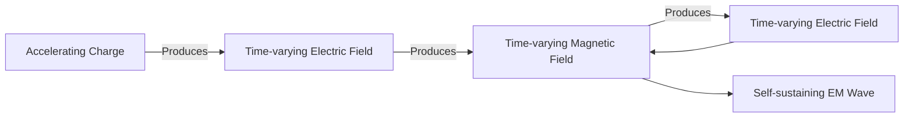
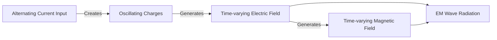
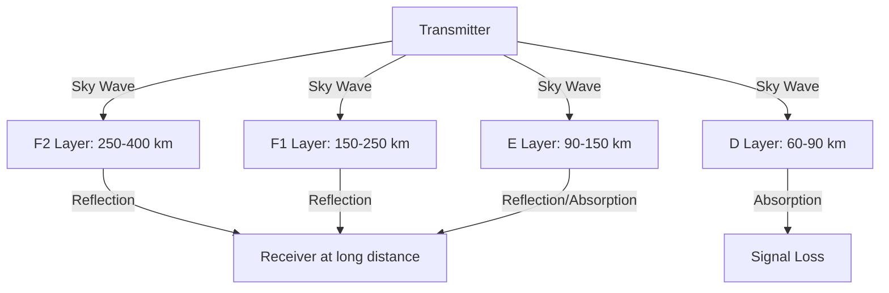
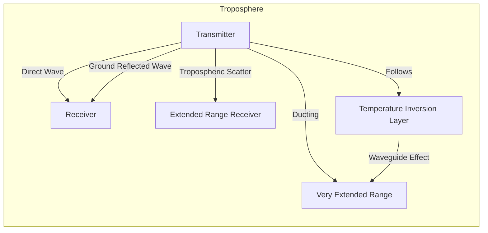
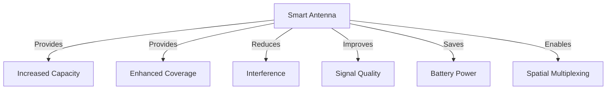
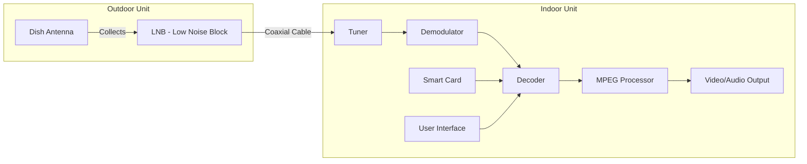
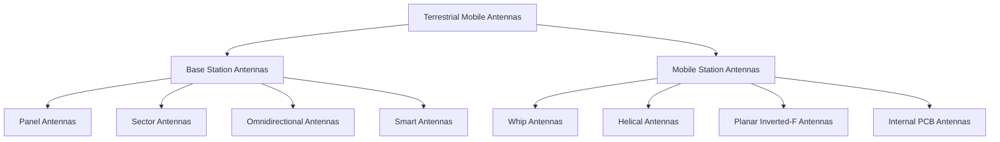

## Question 1(a) [3 marks]

**Define: (1) Directivity, (2) Gain, and (3) HPBW**

**Answer**:

**Table: Key Antenna Parameters**

| Parameter | Definition |
|-----------|------------|
| **Directivity** | Ratio of maximum radiation intensity to average radiation intensity of an antenna |
| **Gain** | Ratio of power radiated in a particular direction to the power that would be radiated by an isotropic antenna |
| **HPBW (Half Power Beam Width)** | Angular width where radiation intensity is half (3dB less) of the maximum value |

**Mnemonic:** "DGH: Direction Gives Half-power"

## Question 1(b) [4 marks]

**List the properties of electromagnetic waves**

**Answer**:

**Table: Properties of Electromagnetic Waves**

| Property | Description |
|----------|-------------|
| **Transverse Waves** | Electric and magnetic fields perpendicular to direction of propagation |
| **Velocity** | Speed of light (3×10^8 m/s) in vacuum |
| **No Medium Required** | Can travel through vacuum, unlike mechanical waves |
| **Polarization** | Direction of electric field vector |
| **Energy Transport** | Carries energy through space |
| **Reflection/Refraction** | Can be reflected and refracted at boundaries |
| **Interference/Diffraction** | Show wave-like properties |

**Mnemonic:** "TVNPER: Transverse Velocity No-medium Polarized Energy Reflection"

## Question 1(c) [7 marks]

**Explain physical concept of generation of Electromagnetic wave**

**Answer**:

**Diagram: Generation of Electromagnetic Wave**



- **Charge Acceleration**: When electric charges accelerate, they generate changing electric fields
- **Field Coupling**: A changing electric field produces a changing magnetic field and vice versa
- **Self-Propagation**: This cyclic generation of fields allows waves to travel without a medium
- **Field Orientation**: Electric and magnetic fields are perpendicular to each other and the direction of propagation
- **Energy Transport**: Energy alternates between electric and magnetic fields as wave propagates

**Mnemonic:** "CASES: Charge Acceleration Self-propagates Electro-magnetic Signals"

## Question 1(c) OR [7 marks]

**Explain how electromagnetic field radiated from a center fed dipole**

**Answer**:

**Diagram: Field Radiation from Center-Fed Dipole**



- **Center Feeding**: AC signal applied at center of dipole creates oscillating current
- **Charge Distribution**: Current creates opposite charges at dipole ends that change with AC frequency
- **Field Generation**: Oscillating charges create time-varying electric field
- **Magnetic Coupling**: Time-varying electric field generates perpendicular magnetic field
- **Near/Far Fields**: Near dipole, fields are complex; far from dipole, fields form uniform radiation pattern
- **Radiation Pattern**: Maximum radiation perpendicular to dipole axis, zero radiation along axis

**Mnemonic:** "CORONA: Current Oscillates, Radiation Occurs, Near-far Areas"

## Question 2(a) [3 marks]

**Differentiate the resonant and non-resonant antennas**

**Answer**:

**Table: Resonant vs Non-Resonant Antennas**

| Feature | Resonant Antennas | Non-Resonant Antennas |
|---------|-------------------|----------------------|
| **Length** | Integer multiple of λ/2 | Not related to wavelength |
| **Standing Waves** | Present | Not present |
| **Impedance** | Resistive (real) | Complex (real + imaginary) |
| **Bandwidth** | Narrow | Wide |
| **Example** | Half-wave dipole | Rhombic antenna |

**Mnemonic:** "RESI: Resonant Exhibits Standing-waves Impedance-real"

## Question 2(b) [4 marks]

**Explain Yagi antenna and discuss its radiation characteristics**

**Answer**:

**Diagram: Yagi-Uda Antenna Structure**

```goat
   Reflector    Driven    Directors
     (R)       Element      (D)
      |          (DE)     |  |  |
      |           |       |  |  |
 -----|-----------|-------|--|--|-------> Direction of
      |           |       |  |  |         Maximum Radiation
      |           |       |  |  |
      
   Longest       λ/2     Shortest
```

- **Structure**: Contains one reflector, one driven element, and multiple directors
- **Directivity**: High directivity in direction of directors (8-12dB)
- **Gain**: Higher gain with more directors (up to 15dB)
- **Bandwidth**: 2-5% of center frequency
- **Applications**: TV reception, point-to-point communication, amateur radio

**Mnemonic:** "DRAGONS: Directional Reflector And Gain-improving Directors Offer Narrow Signals"

## Question 2(c) [7 marks]

**Describe radiation characteristics of resonant wire antennas and draw the current distribution of λ/2, 3λ/2 and 5λ/2 antenna**

**Answer**:

**Diagram: Current Distribution in Resonant Wire Antennas**

```goat
λ/2 Antenna:
     +--------+
     |        |
     v        v
 ----+--------+----
     ^        ^
     |        |
     +--------+
     I_max at center
     Zero at ends

3λ/2 Antenna:
     +---+---+---+
     |   |   |   |
     v   ^   v   ^
 ----+---+---+---+----
     ^   v   ^   v
     |   |   |   |
     +---+---+---+
     3 current nodes
     
5λ/2 Antenna:
     +---+---+---+---+---+
     |   |   |   |   |   |
     v   ^   v   ^   v   ^
 ----+---+---+---+---+---+----
     ^   v   ^   v   ^   v
     |   |   |   |   |   |
     +---+---+---+---+---+
     5 current nodes
```

- **Half-Wave (λ/2)**: Current maximum at center, zero at ends; radiation pattern is figure-eight shaped
- **Three Half-Wave (3λ/2)**: Three current maxima, phase reversal at λ/2 points; multiple lobes in radiation pattern
- **Five Half-Wave (5λ/2)**: Five current maxima, more complex radiation pattern with multiple lobes
- **Standing Waves**: All resonant antennas exhibit standing wave current distribution
- **Feed Point**: Usually at current maximum for optimum impedance matching

**Mnemonic:** "NODE: Number Of Distributions Equals wavelength-multiple"

## Question 2(a) OR [3 marks]

**Differentiate the broad side and end fire array antennas**

**Answer**:

**Table: Broadside vs End Fire Array Antennas**

| Feature | Broadside Array | End Fire Array |
|---------|----------------|---------------|
| **Maximum Radiation** | Perpendicular to array axis | Along array axis |
| **Element Spacing** | Typically λ/2 | Typically λ/4 to λ/2 |
| **Phase Difference** | 0° (in-phase) | 180° (opposite phase) |
| **Directivity** | High | High |
| **Pattern** | Bidirectional | Unidirectional |

**Mnemonic:** "PEPS: Perpendicular Elements Produce Sideways radiation"

## Question 2(b) OR [4 marks]

**Explain loop antenna and discuss its radiation characteristics**

**Answer**:

**Diagram: Loop Antenna**

```goat
    +-----+
    |     |
    |     |
+---+     +---+
|             |
+------+------+
       |
     Feed
     Point
```

- **Structure**: Closed-loop conductor with circumference of one wavelength or less
- **Types**: Small loops (circumference < λ/10) and large loops (circumference ≈ λ)
- **Polarization**: Electric field polarized in plane of loop
- **Radiation Pattern**: Figure-eight pattern for small loops, more directional for large loops
- **Applications**: Direction finding, AM reception, RFID tags
- **Impedance**: High impedance for small loops, resonant for large loops

**Mnemonic:** "SPIRAL: Small Patterns In Receiving And Locating signals"

## Question 2(c) OR [7 marks]

**Describe radiation characteristics of non resonant wire antennas and draw the radiation pattern of λ/2, 3λ/2 and 5λ/2 antenna**

**Answer**:

**Diagram: Radiation Patterns of Wire Antennas**

```goat
λ/2 Antenna Pattern:

    ^
    |     .-.
    |    /   \
    |   |     |
----+---+-----+----->
    |   |     |
    |    \   /
    |     '-'
    v
    
3λ/2 Antenna Pattern:

    ^
    |    .-. .-.
    |   /   X   \
    |  |  / \    |
----+--+-+---+-+---->
    |  |  \ /    |
    |   \   X   /
    |    '-' '-'
    v
    
5λ/2 Antenna Pattern:

    ^
    |  .-. .-. .-.
    | /   X   X   \
    ||  / \ / \    |
----++-+---+---+-+-->
    ||  \ / \ /    |
    | \   X   X   /
    |  '-' '-' '-'
    v
```

- **Non-Resonant Properties**: Traveling waves rather than standing waves
- **λ/2 Antenna**: Simple bidirectional pattern, maximum radiation perpendicular to wire
- **3λ/2 Antenna**: Multiple lobes, more complex pattern with side lobes
- **5λ/2 Antenna**: Even more complex pattern with multiple main and side lobes
- **Feed Point Impedance**: Non-resonant, typically requires impedance matching
- **Bandwidth**: Wider than resonant antennas

**Mnemonic:** "TWIST: Traveling Waves Increase Side-lobe Transmission"

## Question 3(a) [3 marks]

**Write short note on micro strip (patch) antenna**

**Answer**:

**Diagram: Microstrip Patch Antenna Structure**

```goat
   +-------+
   |       |
   | Patch |
   |       |
   +-------+
   | Substrate
   |
   +------------+
   |Ground Plane|
   +------------+
```

- **Structure**: Metal patch on dielectric substrate with ground plane below
- **Size**: Typically half-wavelength in size
- **Profile**: Low-profile, lightweight, easy to fabricate
- **Radiation**: Radiates from patch edges, omnidirectional or directional patterns
- **Applications**: Mobile devices, satellites, GPS receivers

**Mnemonic:** "PSALM: Patch Substrate Above Layer of Metal"

## Question 3(b) [4 marks]

**Explain helical antenna and discuss its radiation characteristics**

**Answer**:

**Diagram: Helical Antenna**

```goat
      ^
      |
    +---+
   /     \
  +       +
 /|       |\
+ |       | +
| |       | |  -->
+ |       | +
 \|       |/
  +       +
   \     /
    +---+
    
  Ground Plane
```

- **Structure**: Conducting wire wound in helix shape above ground plane
- **Modes**: Axial mode (end-fire) and normal mode (broadside)
- **Axial Mode**: When circumference ≈ λ, radiation along helix axis
- **Normal Mode**: When circumference << λ, radiation perpendicular to axis
- **Polarization**: Circular polarization in axial mode
- **Applications**: Satellite communication, space telemetry, radio astronomy

**Mnemonic:** "MOCHA: Mode Of Circular Helix Antennas"

## Question 3(c) [7 marks]

**Explain horn antenna and discuss its radiation characteristics**

**Answer**:

**Diagram: Horn Antenna Types**

```goat
Pyramidal Horn:
    +--------+
    |        |
    |        |
+---+        +---+
|                |
+-+------------+-+
  |            |
  +------------+
  
Sectoral Horn:
    +--------+
    |        |
    |        |
+---+        +---+
|                |
+----------------+

Conical Horn:
      +----+
     /      \
    /        \
   /          \
  +            +
  |            |
  +------------+
```

- **Structure**: Waveguide with flared end to match impedance with free space
- **Types**: Pyramidal (rectangular), sectoral (E-plane or H-plane), and conical (circular)
- **Directivity**: 10-20 dB, higher than waveguide alone
- **Bandwidth**: Very wide bandwidth
- **Radiation Pattern**: Main lobe with small side lobes
- **Applications**: Microwave communications, radar, satellite tracking, EMC testing
- **Advantages**: High gain, simple construction, low VSWR

**Mnemonic:** "POWERS: Pyramidal Or Widening End Radiates Strongly"

## Question 3(a) OR [3 marks]

**Write short note on slot antenna**

**Answer**:

**Diagram: Slot Antenna**

```goat
+-------------------+
|                   |
|    +-------+      |
|    |       |      |
|    |  Slot |      |
|    |       |      |
|    +-------+      |
|                   |
+-------------------+
 Conducting Surface
```

- **Structure**: Rectangular/circular slot cut in conducting surface
- **Babinet's Principle**: Complementary to dipole antenna
- **Radiation Pattern**: Similar to dipole but with E and H fields interchanged
- **Polarization**: Electric field perpendicular to slot length
- **Impedance**: High impedance compared to dipole
- **Applications**: Aircraft, spacecraft, base stations, flush mounting

**Mnemonic:** "CROPS: Complementary Radiation Opening Perpendicular to Surface"

## Question 3(b) OR [4 marks]

**Explain parabolic reflector antenna and discuss its radiation characteristics**

**Answer**:

**Diagram: Parabolic Reflector Antenna**

```goat
            ^
           / \
          /   \
         /     \
        /       \
       /         \
      /           \
     /             \
    +---------------+
          |  |
          |  |
          +--+
          Feed
```

- **Structure**: Parabolic reflector with feed at focal point
- **Working Principle**: Parallel rays from reflector converge at focal point
- **Directivity**: Very high (30-40 dB)
- **Beamwidth**: Very narrow, inversely proportional to diameter
- **Efficiency**: 50-70% depending on feed design
- **Applications**: Satellite communications, radio astronomy, radar systems
- **Types**: Prime focus, Cassegrain, offset feed

**Mnemonic:** "DISH: Directing Incoming Signals to Hub"

## Question 3(c) OR [7 marks]

**Describe V and inverted V antenna**

**Answer**:

**Diagram: V and Inverted V Antennas**

```goat
V Antenna:
       /\
      /  \
     /    \
    /      \
   /        \
  +          +
  |          |
  +----------+
    Feed Point

Inverted V Antenna:
  +----------+
  |          |
  +          +
   \        /
    \      /
     \    /
      \  /
       \/
    Feed Point
```

**Table: Comparison of V and Inverted V Antennas**

| Feature | V Antenna | Inverted V Antenna |
|---------|-----------|-------------------|
| **Shape** | Arms extend upward from feed | Arms extend downward from apex |
| **Angle** | Typically 90° between arms | Typically 90-120° between arms |
| **Height** | Requires two tall supports | Requires one tall support |
| **Impedance** | 40-50 ohms | 20-30 ohms |
| **Radiation Pattern** | Bidirectional | More omnidirectional |
| **Applications** | Directional HF communications | HF amateur radio, limited space |

**Mnemonic:** "VIVA: V Is Vertical Arrangement, Inverted V Aims downward"

## Question 4(a) [3 marks]

**Define: (1) Reflection, (2) Refraction and (3) Diffraction**

**Answer**:

**Table: Wave Phenomenon Definitions**

| Phenomenon | Definition |
|------------|------------|
| **Reflection** | Bouncing back of waves when they strike the boundary between two media |
| **Refraction** | Bending of waves when they pass from one medium to another with different propagation velocity |
| **Diffraction** | Bending of waves around obstacles or through openings |

**Mnemonic:** "RRD: Rebounding, Redirecting, Detour"

## Question 4(b) [4 marks]

**List HAM radio application for communication**

**Answer**:

**Table: HAM Radio Applications**

| Application | Description |
|-------------|-------------|
| **Emergency Communication** | Disaster relief when normal infrastructure fails |
| **DX Communication** | Long-distance international communications |
| **Satellite Communication** | Using amateur radio satellites for extended range |
| **Digital Modes** | Text/data transmission (RTTY, PSK31, FT8) |
| **Morse Code** | Traditional CW communication |
| **Voice Communication** | Using SSB, FM, AM modulation |
| **Public Service** | Supporting events like marathons, parades |

**Mnemonic:** "EDSDMVP: Emergency DX Satellite Digital Morse Voice Public-service"

## Question 4(c) [7 marks]

**Explain ionosphere's layers and sky wave propagation**

**Answer**:

**Diagram: Ionospheric Layers and Sky Wave Propagation**



- **D Layer (60-90 km)**: Exists during daylight, absorbs HF signals below 10 MHz
- **E Layer (90-150 km)**: Reflects signals 3-5 MHz, stronger during day, sporadic-E in summer
- **F1 Layer (150-250 km)**: Daytime only, merges with F2 at night
- **F2 Layer (250-400 km)**: Main reflecting layer, enables long-distance HF communication
- **Propagation Factors**:
  - **Virtual Height**: Apparent height of reflection
  - **Critical Frequency**: Maximum frequency reflected vertically
  - **MUF**: Maximum Usable Frequency for a given distance
  - **Skip Distance**: Minimum distance for sky wave reception

**Mnemonic:** "DEFV: D-absorbs, E-reflects, F-provides Very-long-distance"

## Question 4(a) OR [3 marks]

**Define: (1) MUF, (2) LUF and (3) Skip distance**

**Answer**:

**Table: Ionospheric Propagation Terms**

| Term | Definition |
|------|------------|
| **MUF (Maximum Usable Frequency)** | Highest frequency that can be reflected by ionosphere for a given distance and time |
| **LUF (Lowest Usable Frequency)** | Lowest frequency that provides adequate signal strength for communication |
| **Skip Distance** | Minimum distance from transmitter where sky wave returns to Earth |

**Mnemonic:** "MLS: Maximum-highest, Lowest-minimum, Skip-nearest"

## Question 4(b) OR [4 marks]

**List HAM radio digital modes of communication**

**Answer**:

**Table: HAM Radio Digital Modes**

| Digital Mode | Characteristics |
|--------------|----------------|
| **FT8** | Weak signal, narrow bandwidth, automated exchanges |
| **PSK31** | Keyboard-to-keyboard text communication, narrow bandwidth |
| **RTTY** | Radio teletype, robust older digital mode |
| **SSTV** | Slow Scan Television for image transmission |
| **JT65/JT9** | Very weak signal modes for extreme distance |
| **Packet Radio** | Computer-based data transmission with error correction |
| **APRS** | Automatic Position Reporting System with GPS |
| **Digital Voice** | DMR, D-STAR, Fusion, P25 digital voice protocols |

**Mnemonic:** "FIRST PAD: FT8 Is RTTY SSTV Then Packet APRS Digital-voice"

## Question 4(c) OR [7 marks]

**Explain space wave propagation**

**Answer**:

**Diagram: Space Wave Propagation**



- **Components**: Direct wave, ground-reflected wave, tropospheric waves
- **Line of Sight**: Primary mechanism limited by Earth's curvature
- **Frequency Range**: VHF, UHF, and microwave frequencies
- **Tropospheric Scattering**: Forward scattering extends range beyond horizon
- **Duct Propagation**:
  - Occurs in temperature inversion layers
  - Creates waveguide effect trapping signals
  - Enables very long distance VHF/UHF propagation
- **Factors Affecting**: Antenna height, terrain, atmospheric conditions
- **Applications**: TV broadcasting, microwave links, mobile communications

**Mnemonic:** "DRIFT: Direct Reflection Inversion Forward Tropospheric"

## Question 5(a) [3 marks]

**Define: (1) Beam area (2) Beam efficiency, and (3) Effective aperture**

**Answer**:

**Table: Antenna Beam Parameters**

| Parameter | Definition |
|-----------|------------|
| **Beam Area** | Solid angle through which all power radiated by antenna would flow if radiation intensity was constant |
| **Beam Efficiency** | Ratio of power in main beam to total radiated power |
| **Effective Aperture** | Area over which antenna captures RF energy, related to gain |

**Mnemonic:** "BEA: Beam Efficiency Aperture"

## Question 5(b) [4 marks]

**Describe need of smart antenna**

**Answer**:

**Diagram: Smart Antenna Benefits**



- **Capacity Improvement**: Serves more users in same bandwidth
- **Coverage Enhancement**: Extends range by focusing energy
- **Interference Reduction**: Nulls out unwanted signals
- **Signal Quality**: Better SNR through beam focusing
- **Energy Efficiency**: Lower transmit power requirements
- **Spatial Multiplexing**: Multiple data streams in same frequency
- **Adaptive Operation**: Dynamically adapts to changing environment

**Mnemonic:** "PRECISE: Power Reduction, Enhanced Coverage, Interference Suppression, Enhanced Signal"

## Question 5(c) [7 marks]

**Draw the DTH Receiver indoor and outdoor black diagram and discuss its functions**

**Answer**:

**Diagram: DTH System Block Diagram**



**Outdoor Unit Components and Functions:**

- **Dish Antenna**: Collects satellite signals, typically 45-90 cm diameter
- **LNB (Low Noise Block)**:
  - Converts high frequency satellite signals (10-12 GHz) to lower IF frequencies (950-2150 MHz)
  - Amplifies weak signals with minimal noise
  - Contains local oscillator and polarization selection

**Indoor Unit Components and Functions:**

- **Tuner**: Selects desired transponder frequency
- **Demodulator**: Extracts digital signal from modulated carrier
- **Decoder**: Decrypts encrypted channels using smart card authorization
- **MPEG Processor**: Decompresses video/audio data streams
- **User Interface**: On-screen menus, program guide, channel selection
- **Smart Card**: Contains subscription details and decryption keys

**Mnemonic:** "COLD-TDUMS: Collection, Oscillator, Low-noise, Downconversion - Tuner Demodulator Unscrambler MPEG Smart-card"

## Question 5(a) OR [3 marks]

**Define: (1) Antenna, (2) Folded dipole, and (3) Antenna array**

**Answer**:

**Table: Antenna Definitions**

| Term | Definition |
|------|------------|
| **Antenna** | Device that converts electrical energy to radio waves and vice versa |
| **Folded Dipole** | Dipole with ends folded back and connected, forming a loop with higher impedance |
| **Antenna Array** | Multiple antennas arranged in specific pattern for improved directivity/gain |

**Mnemonic:** "AFA: Antenna Folded Array"

## Question 5(b) OR [4 marks]

**Describe application of smart antenna**

**Answer**:

**Table: Smart Antenna Applications**

| Application | Description |
|-------------|-------------|
| **Mobile Communications** | Increases capacity, reduces interference in cellular networks |
| **Base Stations** | Sector-specific coverage, adaptive beamforming |
| **MIMO Systems** | Multiple-input-multiple-output for spatial multiplexing |
| **Radar Systems** | Improved target detection and tracking |
| **Satellite Communications** | Spot beam generation, interference mitigation |
| **Wi-Fi Networks** | Enhanced range and throughput for wireless LANs |
| **IoT Networks** | Low-power, long-range connectivity for IoT devices |

**Mnemonic:** "MBMRSWI: Mobile Base MIMO Radar Satellite Wi-Fi IoT"

## Question 5(c) OR [7 marks]

**Explain Terrestrial mobile communication antennas and also discuss about base station and mobile station antennas**

**Answer**:

**Diagram: Mobile Communication Antenna Types**



**Base Station Antennas:**

- **Panel/Sector Antennas**: 65°-120° coverage per sector, typically three sectors per site
- **Characteristics**:
  - High gain (10-18 dBi)
  - Vertical polarization
  - Downtilt capability (mechanical or electrical)
  - Multi-band operation
- **Height**: Mounted on towers 15-50m high for maximum coverage
- **Pattern Control**: Minimizes interference to adjacent cells

**Mobile Station Antennas:**

- **External Antennas**: Less common today, mainly for vehicles or rural areas
  - Whip antennas (¼λ monopoles)
  - Helical designs for flexibility
- **Internal Antennas**: Now dominant in handsets
  - PIFA (Planar Inverted-F Antenna)s
  - PCB trace antennas
  - Characteristics:
    - Small size
    - Multi-band operation
    - Omnidirectional pattern
    - Lower efficiency (typically -3 to -6 dBi)

**Mnemonic:** "BEST-POMME: Base-station External Sector Tower - Portable Omnidirectional Multi-band Mobile Embedded"
