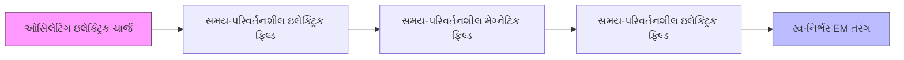
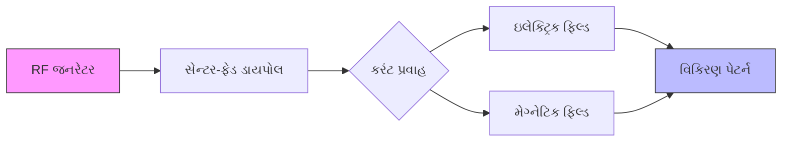
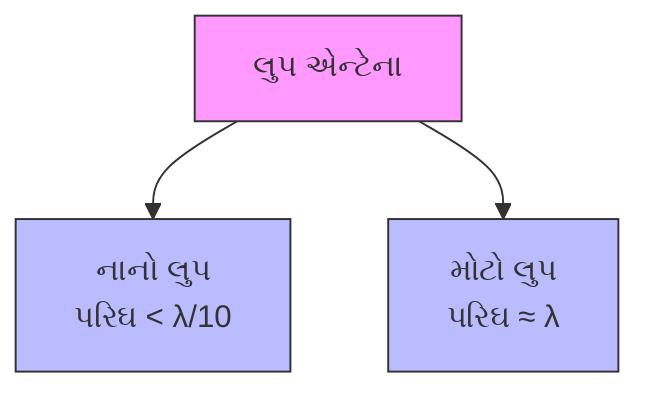
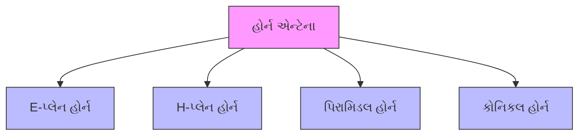
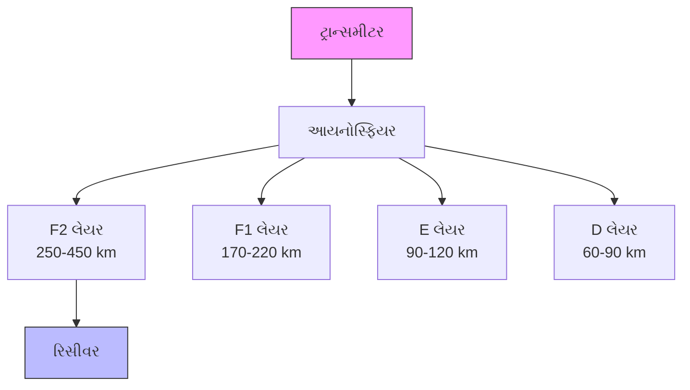
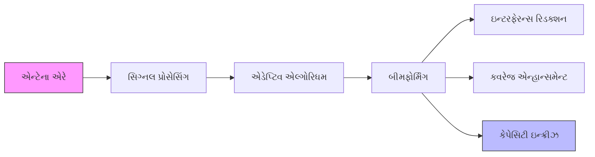
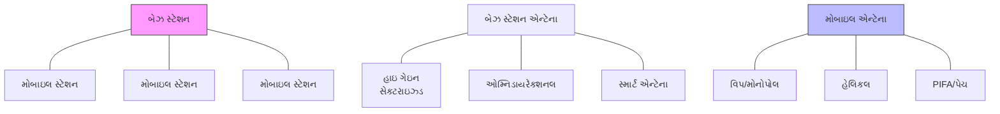

## પ્રશ્ન 1(અ) [3 ગુણ]

**વ્યાખ્યાયિત કરો: (1) ડાયરેક્ટિવિટી, (2) ગેઇન અને (3) HPBW**

**જવાબ**:

**કોષ્ટક: એન્ટેના પેરામીટર્સની વ્યાખ્યાઓ**

| પેરામીટર | વ્યાખ્યા |
|-----------|------------|
| **ડાયરેક્ટિવિટી** | આપેલ દિશામાં વિકિરણ તીવ્રતા અને તમામ દિશાઓમાં સરેરાશ વિકિરણ તીવ્રતાનો ગુણોત્તર |
| **ગેઇન** | ચોક્કસ દિશામાં વિકિરણ કરેલી શક્તિ અને સમાન ઇનપુટ પાવર સાથે આઇસોટ્રોપિક એન્ટેના દ્વારા વિકિરણ કરેલી શક્તિનો ગુણોત્તર |
| **HPBW (હાફ પાવર બીમ વિડ્થ)** | મુખ્ય લોબની ખૂણાકીય પહોળાઈ જ્યાં પાવર તેની મહત્તમ કિંમતથી અડધો (-3dB) થઈ જાય છે |

**સૂત્ર:** "DGH: Direction Gets Higher power with narrow beam"

## પ્રશ્ન 1(બ) [4 ગુણ]

**ઇલેક્ટ્રોમેગ્નેટિક તરંગોના ગુણધર્મોની સૂચિ બનાવો**

**જવાબ**:

**કોષ્ટક: ઇલેક્ટ્રોમેગ્નેટિક તરંગોના ગુણધર્મો**

| ગુણધર્મ | વર્ણન |
|----------|-------------|
| **ટ્રાન્સવર્સ પ્રકૃતિ** | ઇલેક્ટ્રિક અને મેગ્નેટિક ફિલ્ડ એકબીજાના લંબરૂપે અને પ્રસારણ દિશાના લંબરૂપે હોય છે |
| **વેગ** | ફ્રી સ્પેસમાં પ્રકાશના વેગે (3×10⁸ m/s) ચાલે છે |
| **આવૃત્તિ શ્રેણી** | થોડા Hz થી લઈને અનેક THz સુધી ફેરફાર થાય છે |
| **ઊર્જા પરિવહન** | માધ્યમની જરૂર વિના એક બિંદુથી બીજા બિંદુ સુધી ઊર્જા લઈ જાય છે |
| **પરાવર્તન** | વાહક સપાટીઓથી પરાવર્તિત થઈ શકે છે |
| **અપવર્તન** | જુદા જુદા માધ્યમો વચ્ચેથી પસાર થતી વખતે દિશા બદલે છે |
| **વિવર્તન** | અવરોધોની આસપાસ અથવા ખુલ્લી જગ્યામાંથી વળી શકે છે |
| **ધ્રુવીકરણ** | ઇલેક્ટ્રિક ફિલ્ડ વેક્ટરનું ઓરિએન્ટેશન |

**સૂત્ર:** "TVFERRDP: Travel Very Fast, Energy Reflects Refracts Diffracts Polarizes"

## પ્રશ્ન 1(ક) [7 ગુણ]

**ઈલેક્ટ્રોમેગ્નેટિક તરંગોના નિર્માણનો ભૌતિક ખ્યાલ સમજાવો**

**જવાબ**:

**આકૃતિ: ઇલેક્ટ્રોમેગ્નેટિક તરંગનું નિર્માણ**



**EM તરંગ ઉત્પન્ન કરવાની પ્રક્રિયા:**

- **ત્વરિત ચાર્જ**: જ્યારે ઇલેક્ટ્રિક ચાર્જ ત્વરિત થાય છે, ત્યારે તે સમય-પરિવર્તનશીલ ઇલેક્ટ્રિક ફિલ્ડ ઉત્પન્ન કરે છે
- **બદલાતું ઇલેક્ટ્રિક ફિલ્ડ**: આ સમય-પરિવર્તનશીલ મેગ્નેટિક ફિલ્ડ બનાવે છે
- **બદલાતું મેગ્નેટિક ફિલ્ડ**: બદલામાં સમય-પરિવર્તનશીલ ઇલેક્ટ્રિક ફિલ્ડ બનાવે છે
- **સ્વ-પ્રસારણ**: ફિલ્ડનું આ પરસ્પર સર્જન સ્વ-પ્રસારિત તરંગમાં પરિણમે છે
- **ઊર્જા ટ્રાન્સફર**: EM તરંગો ટ્રાન્સમીટરથી રિસીવર સુધી ઊર્જા ટ્રાન્સફર કરે છે

**મેક્સવેલના સમીકરણો**: આ ચાર સમીકરણો EM તરંગોના ઉત્પાદન અને પ્રસારણનું ગાણિતિક વર્ણન કરે છે:

1. ચાર્જમાંથી ઇલેક્ટ્રિક ફિલ્ડ (ગાઉસનો નિયમ)
2. મેગ્નેટિક મોનોપોલ અસ્તિત્વમાં નથી
3. બદલાતા મેગ્નેટિક ફિલ્ડમાંથી ઇલેક્ટ્રિક ફિલ્ડ (ફેરાડેનો નિયમ)
4. કરંટ અને બદલાતા ઇલેક્ટ્રિક ફિલ્ડમાંથી મેગ્નેટિક ફિલ્ડ (એમ્પિયરનો નિયમ)

**સૂત્ર:** "CASES: Charges Accelerate, Self-sustaining Electric-Magnetic fields"

## પ્રશ્ન 1(ક) અથવા [7 ગુણ]

**સેન્ટર ફેડ ડાયપોલ માંથી ઇલેક્ટ્રોમેગ્નેટિક ક્ષેત્ર કેવી રીતે વિકિરણ થાય છે તે સમજાવો**

**જવાબ**:

**આકૃતિ: સેન્ટર-ફેડ ડાયપોલમાંથી વિકિરણ**



**વિકિરણ પ્રક્રિયા:**

| તબક્કો | પ્રક્રિયા |
|-------|---------|
| **1. કરંટ ઉત્તેજના** | ડાયપોલના મધ્યમાં RF સિગ્નલ લાગુ કરવાથી alternating કરંટ ઉત્પન્ન થાય છે |
| **2. કરંટ વિતરણ** | ડાયપોલ પર સાઇનસોઇડલ કરંટ વિતરણ રચાય છે, મધ્યમાં મહત્તમ, છેડે શૂન્ય |
| **3. ઇલેક્ટ્રિક ફિલ્ડ** | ઓસિલેટિંગ ચાર્જ ડાયપોલને લંબરૂપે સમય-પરિવર્તનશીલ ઇલેક્ટ્રિક ફિલ્ડ બનાવે છે |
| **4. મેગ્નેટિક ફિલ્ડ** | કરંટ પ્રવાહ ડાયપોલ અને ઇલેક્ટ્રિક ફિલ્ડ બંને લંબરૂપે મેગ્નેટિક ફિલ્ડ બનાવે છે |
| **5. નજીકનું ક્ષેત્ર** | એન્ટેનાની નજીક (< λ/2π) જટિલ ફિલ્ડ પેટર્ન રચાય છે |
| **6. દૂરનું ક્ષેત્ર** | > 2λ અંતરે, વિકિરણ સ્થિર થઈને મુખ્ય અને સાઇડ લોબ્સ સાથેની વિશિષ્ટ પેટર્ન બનાવે છે |

**લાક્ષણિકતાઓ:**

- **મહત્તમ વિકિરણ**: ડાયપોલ અક્ષને લંબરૂપે
- **શૂન્ય વિકિરણ**: ડાયપોલ અક્ષ સાથે
- **ઓમ્નિડાયરેક્શનલ**: એઝિમથ પ્લેનમાં (ડાયપોલને લંબરૂપે)
- **ધ્રુવીકરણ**: ડાયપોલના ઓરિએન્ટેશન જેવું જ

**સૂત્ર:** "COME-FR: Current Oscillates, Making Electric-magnetic Fields that Radiate"

## પ્રશ્ન 2(અ) [3 ગુણ]

**રેઝોનન્ટ અને નોન-રેઝોનન્ટ એન્ટેનામાં તફાવત કરો**

**જવાબ**:

**કોષ્ટક: રેઝોનન્ટ vs નોન-રેઝોનન્ટ એન્ટેના**

| પેરામીટર | રેઝોનન્ટ એન્ટેના | નોન-રેઝોનન્ટ એન્ટેના |
|-----------|-------------------|------------------------|
| **ભૌતિક લંબાઈ** | λ/2નો ગુણાંક (સામાન્ય રીતે λ/2 અથવા λ) | તરંગલંબાઈ સાથે સંબંધિત નથી (સામાન્ય રીતે > λ) |
| **સ્ટેન્ડિંગ વેવ્સ** | મજબૂત સ્ટેન્ડિંગ વેવ્સ હાજર | ન્યૂનતમ સ્ટેન્ડિંગ વેવ્સ |
| **કરંટ વિતરણ** | મધ્યમાં મહત્તમ સાથે સાઇનસોઇડલ | સમાન એમ્પલિટ્યુડ સાથે ટ્રાવેલિંગ વેવ |
| **ઇનપુટ ઇમ્પીડન્સ** | રેઝીસ્ટીવ (રેઝોનન્ટ આવૃત્તિ પર) | કૉમ્પ્લેક્સ (રેઝીસ્ટીવ + રિએક્ટિવ) |
| **બેન્ડવિડ્થ** | સાંકડી બેન્ડવિડ્થ | વિશાળ બેન્ડવિડ્થ |
| **ઉદાહરણો** | હાફ-વેવ ડાયપોલ, ફોલ્ડેડ ડાયપોલ | રોમ્બિક એન્ટેના, ટ્રાવેલિંગ વેવ એન્ટેના |

**સૂત્ર:** "SIN-CIB: Size, Impedance, Narrow vs Complex, Impedance, Broad"

## પ્રશ્ન 2(બ) [4 ગુણ]

**યાગી એન્ટેના સમજાવો અને તેની રેડિયેશન લાક્ષણિકતાઓની ચર્ચા કરો**

**જવાબ**:

**આકૃતિ: યાગી-ઉદા એન્ટેના**

```goat
      Feed point
         |
         v
   R     D     D1    D2    D3  
   |     |     |     |     |
   |     |     |     |     |
  [=]---[=]---[=]---[=]---[=]
   |     |     |     |     |
   |     |     |     |     |
 Reflector Driven  Directors
         Element
```

**યાગી એન્ટેના ઘટકો:**

- **ડ્રાઇવન એલિમેન્ટ**: ટ્રાન્સમિશન લાઇન સાથે જોડાયેલ હાફ-વેવ ડાયપોલ
- **રિફ્લેક્ટર**: ડ્રાઇવન એલિમેન્ટ કરતાં થોડું લાંબું, તેની પાછળ મૂકવામાં આવે છે
- **ડાયરેક્ટર્સ**: ડ્રાઇવન એલિમેન્ટ કરતાં નાના, આગળ મૂકવામાં આવે છે

**રેડિયેશન લાક્ષણિકતાઓ:**

- **ડાયરેક્ટિવિટી**: ઊંચી (7-12 dBi) વધુ ડાયરેક્ટર્સ સાથે
- **રેડિયેશન પેટર્ન**: યુનિડાયરેક્શનલ, ડાયરેક્ટર અક્ષ સાથે સાંકડો બીમ
- **ફ્રન્ટ-ટુ-બેક રેશિયો**: 15-20 dB (પાછળના સિગ્નલ્સનું સારું રિજેક્શન)
- **બેન્ડવિડ્થ**: મધ્યમ (સેન્ટર ફ્રિક્વન્સીના આશરે 5%)
- **ગેઇન**: ડાયરેક્ટર્સની સંખ્યા વધારવાથી વધે છે (સામાન્ય રીતે 3-20 dBi)

**સૂત્ર:** "DRDU: Directors Radiate, Driven powers, Unidirectional beam"

## પ્રશ્ન 2(ક) [7 ગુણ]

**રેઝોનન્ટ વાયર એન્ટેનાની રેડિયેશન લાક્ષણિકતાઓનું વર્ણન કરો અને λ/2, 3λ/2 અને 5λ/2 એન્ટેનાનું કરંટ વિતરણ દોરો**

**જવાબ**:

**આકૃતિ: રેઝોનન્ટ વાયર એન્ટેના પર કરંટ વિતરણ**

```goat
λ/2:     |<------- λ/2 ------->|
         +----------+----------+
         |          |          |
         v          ^          v
         |          |          |
         |          |          |
Current: *          *          *
        min        max        min

3λ/2:    |<------------- 3λ/2 ------------->|
         +-----+-----+-----+-----+-----+-----+
         |     |     |     |     |     |     |
         v     ^     v     ^     v     ^     v
         |     |     |     |     |     |     |
         |     |     |     |     |     |     |
Current: *     *     *     *     *     *     *
        min   max   min   max   min   max   min

5λ/2:    |<------------------ 5λ/2 ------------------>|
         +----+----+----+----+----+----+----+----+----+
         |    |    |    |    |    |    |    |    |    |
         v    ^    v    ^    v    ^    v    ^    v    ^
         |    |    |    |    |    |    |    |    |    |
         |    |    |    |    |    |    |    |    |    |
Current: *    *    *    *    *    *    *    *    *    *
        min  max  min  max  min  max  min  max  min  max
```

**રેઝોનન્ટ વાયર એન્ટેનાની રેડિયેશન લાક્ષણિકતાઓ:**

| લાક્ષણિકતા | વર્ણન |
|----------------|-------------|
| **કરંટ વિતરણ** | સાઇનસોઇડલ, λ/2 માટે મધ્યમાં મહત્તમ, લાંબા એન્ટેના માટે વધારાના મહત્તમ |
| **ઇનપુટ ઇમ્પીડન્સ** | λ/2 માટે લગભગ 73Ω, લાંબા એન્ટેના માટે બદલાય છે |
| **રેડિયેશન પેટર્ન** | ફિગર-8 પેટર્ન (λ/2), લાંબા એન્ટેના માટે વધુ જટિલ લોબ્સ |
| **ડાયરેક્ટિવિટી** | λ/2 માટે 2.15 dBi, લંબાઈ સાથે વધે છે પરંતુ મલ્ટીપલ લોબ્સ સાથે |
| **ધ્રુવીકરણ** | લિનિયર, વાયર ઓરિએન્ટેશનને સમાંતર |
| **એફિશિયન્સી** | યોગ્ય રીતે બનાવાયેલા એન્ટેના માટે ઊંચી |

**મુખ્ય મુદ્દાઓ:**

- λ/2 એન્ટેનામાં મધ્યમાં એક કરંટ મહત્તમ હોય છે
- 3λ/2 એન્ટેનામાં કરંટ વિતરણના ત્રણ અર્ધ-ચક્રો હોય છે
- 5λ/2 એન્ટેનામાં કરંટ વિતરણના પાંચ અર્ધ-ચક્રો હોય છે
- વધુ અર્ધ-તરંગલંબાઈ વધુ રેડિયેશન લોબ્સ બનાવે છે
- ફીડ પોઇન્ટ સામાન્ય રીતે શ્રેષ્ઠ ઇમ્પીડન્સ મેચ માટે કરંટ મહત્તમ પર હોય છે

**સૂત્ર:** "SIMPLE: Sinusoidal In Middle Produces Lobes Efficiently"

## પ્રશ્ન 2(અ) અથવા [3 ગુણ]

**બ્રોડ સાઇડ અને એન્ડ ફાયર એરે એન્ટેનામાં તફાવત કરો**

**જવાબ**:

**કોષ્ટક: બ્રોડસાઇડ vs એન્ડ ફાયર એરે એન્ટેના**

| પેરામીટર | બ્રોડસાઇડ એરે | એન્ડ ફાયર એરે |
|-----------|-----------------|----------------|
| **મહત્તમ વિકિરણની દિશા** | એરે અક્ષને લંબરૂપે | એરે અક્ષ સાથે |
| **ફેઝ તફાવત** | 0° (ઇન-ફેઝ) | 180° અથવા પ્રોગ્રેસિવ ફેઝ |
| **એલિમેન્ટ સ્પેસિંગ** | સામાન્ય રીતે λ/2 | સામાન્ય રીતે λ/4 થી λ/2 |
| **રેડિયેશન પેટર્ન** | એરે અક્ષ ધરાવતા પ્લેનમાં સાંકડું | એરે એલિમેન્ટ્સને લંબરૂપ પ્લેનમાં સાંકડું |
| **ડાયરેક્ટિવિટી** | ઊંચી, એલિમેન્ટ્સની સંખ્યા સાથે વધે છે | ઊંચી, એલિમેન્ટ્સની સંખ્યા સાથે વધે છે |
| **એપ્લિકેશન્સ** | ફિક્સ્ડ પોઇન્ટ-ટુ-પોઇન્ટ લિંક્સ | દિશા શોધવા માટે, રડાર |

**સૂત્ર:** "BEPODS: Broadside-End, Perpendicular-Or-Direction, Spacing"

## પ્રશ્ન 2(બ) અથવા [4 ગુણ]

**લુપ એન્ટેના સમજાવો અને તેની રેડિયેશન લાક્ષણિકતાઓની ચર્ચા કરો**

**જવાબ**:

**આકૃતિ: લુપ એન્ટેના પ્રકારો**



**લુપ એન્ટેના લાક્ષણિકતાઓ:**

| પેરામીટર | નાનો લુપ | મોટો લુપ |
|-----------|------------|------------|
| **કરંટ વિતરણ** | લુપની આસપાસ સમાન | પરિઘની આસપાસ બદલાય છે |
| **રેડિયેશન પેટર્ન** | ફિગર-8 (લુપ પ્લેનને લંબરૂપે) | મલ્ટીપલ લોબ્સ સાથે વધુ જટિલ |
| **ડાયરેક્ટિવિટી** | નીચી (1.5 dBi) | ઊંચી (3-4 dBi) |
| **ધ્રુવીકરણ** | લુપને લંબરૂપે મેગ્નેટિક ફિલ્ડ | લુપના પ્લેનમાં ઇલેક્ટ્રિક ફિલ્ડ |
| **ઇનપુટ ઇમ્પીડન્સ** | ખૂબ ઓછી (< 10Ω) | ઊંચી (50-200Ω) |
| **એપ્લિકેશન્સ** | દિશા શોધવા માટે, AM રિસીવર્સ | HF કમ્યુનિકેશન્સ, RFID |

**સૂત્ર:** "SCALED: Size Changes Antenna's Lobes, Efficiency, and Direction"

## પ્રશ્ન 2(ક) અથવા [7 ગુણ]

**નોન રેઝોનન્ટ વાયર એન્ટેનાની રેડિયેશન લાક્ષણિકતાઓનું વર્ણન કરો અને λ/2, 3λ/2 અને 5λ/2 એન્ટેનાની રેડિયેશન પેટર્ન દોરો**

**જવાબ**:

**આકૃતિ: વાયર એન્ટેનાની રેડિયેશન પેટર્ન**

```goat
λ/2 Dipole:
                  * *
               *       *
              *         *
             *           *
            *             *
           *      ---      *
           *     |   |     *
           *     |   |     *
           *      ---      *
            *             *
             *           *
              *         *
               *       *
                  * *

3λ/2 Dipole:
                 *     *
              *           *
             *       *     *
            *      / \      *
           *      /   \      *
          *      |     |      *
          *      |     |      *
          *      |     |      *
          *      \     /      *
           *      \   /      *
            *      \ /      *
             *       *     *
              *           *
                 *     *

5λ/2 Dipole:
                *   *   *
             *               *
            *    *       *    *
           *   /   \   /   \   *
          *   /     \ /     \   *
         *   |       |       |   *
         *   |       |       |   *
         *   |       |       |   *
         *   \       |       /   *
          *   \     / \     /   *
           *   \   /   \   /   *
            *    *       *    *
             *               *
                *   *   *
```

**નોન-રેઝોનન્ટ વાયર એન્ટેના લાક્ષણિકતાઓ:**

| લાક્ષણિકતા | વર્ણન |
|----------------|-------------|
| **કરંટ વિતરણ** | ન્યૂનતમ સ્ટેન્ડિંગ વેવ્સ સાથે ટ્રાવેલિંગ વેવ્સ |
| **ટર્મિનેશન** | પરાવર્તનને રોકવા માટે સામાન્ય રીતે રેઝિસ્ટિવ લોડ સાથે ટર્મિનેટ કરવામાં આવે છે |
| **બેન્ડવિડ્થ** | વિશાળ બેન્ડવિડ્થ ઓપરેશન |
| **ઇનપુટ ઇમ્પીડન્સ** | આવૃત્તિ શ્રેણીમાં વધુ અચળ |
| **રેડિયેશન પેટર્ન** | λ/2: દરેક બાજુએ એક મુખ્ય લોબ<br>3λ/2: દરેક બાજુએ ત્રણ મુખ્ય લોબ<br>5λ/2: દરેક બાજુએ પાંચ મુખ્ય લોબ |
| **ડાયરેક્ટિવિટી** | લંબાઈ સાથે વધે છે પરંતુ બહુવિધ લોબ્સમાં વિભાજિત |
| **એફિશિયન્સી** | રેઝિસ્ટિવ ટર્મિનેશનને કારણે રેઝોનન્ટ એન્ટેના કરતાં ઓછી |

**મુખ્ય મુદ્દાઓ:**

- નોન-રેઝોનન્ટ એન્ટેના સ્ટેન્ડિંગ વેવ્સને બદલે ટ્રાવેલિંગ વેવ્સનો ઉપયોગ કરે છે
- રોમ્બિક એન્ટેના એક સામાન્ય નોન-રેઝોનન્ટ એન્ટેના છે
- λ/2 પેટર્નમાં 2 મુખ્ય લોબ્સ (ફિગર-8 પેટર્ન) હોય છે
- 3λ/2 પેટર્નમાં 6 મુખ્ય લોબ્સ (દરેક બાજુએ 3) હોય છે
- 5λ/2 પેટર્નમાં 10 મુખ્ય લોબ્સ (દરેક બાજુએ 5) હોય છે
- લંબાઈ વધવાની સાથે વધુ લોબ્સ દેખાય છે
- આવૃત્તિ સાથે મુખ્ય બીમનો ખૂણો બદલાય છે

**સૂત્ર:** "TRIBE-WL: Traveling Resistance Improves Bandwidth, Efficiency Worse, Lobes multiply"

## પ્રશ્ન 3(અ) [3 ગુણ]

**માઇક્રો સ્ટ્રીપ (પેચ) એન્ટેના પર ટૂંકી નોંધ લખો**

**જવાબ**:

**આકૃતિ: માઇક્રોસ્ટ્રિપ પેચ એન્ટેના**

```goat
       Top View                 Side View
    +------------+           +------------+
    |            |           |////////////| <- Patch
    |            |           +------------+
    |    Patch   |           |            | <- Dielectric
    |            |           +------------+
    |            |           |____________| <- Ground plane
    +------------+
    |   Feed     |
    +---+----+---+
        |
```

**માઇક્રોસ્ટ્રિપ પેચ એન્ટેના:**

- **સ્ટ્રક્ચર**: ગ્રાઉન્ડ પ્લેન સાથે ડાયલેક્ટ્રિક સબસ્ટ્રેટ પર મેટલ પેચ
- **સાઇઝ**: સામાન્ય રીતે λ/2 × λ/2 અથવા λ/2 × λ/4
- **ફીડ મેથડ્સ**: માઇક્રોસ્ટ્રિપ લાઇન, કોએક્ઝિયલ પ્રોબ, એપર્ચર કપલિંગ
- **રેડિયેશન**: પેચના ધારથી ફ્રિન્જિંગ ફિલ્ડ્સમાંથી
- **ધ્રુવીકરણ**: પેચના આકાર પર આધારિત લિનિયર અથવા સર્ક્યુલર
- **બેન્ડવિડ્થ**: સાંકડી (સેન્ટર ફ્રિક્વન્સીના 3-5%)
- **એપ્લિકેશન્સ**: મોબાઇલ ડિવાઇસ, સેટેલાઇટ, એરક્રાફ્ટ, RFID

**સૂત્ર:** "SLIM-PCB: Small, Lightweight, Integrable Microwave Printed Circuit Board"

## પ્રશ્ન 3(બ) [4 ગુણ]

**હેલિકલ એન્ટેના સમજાવો અને તેની રેડિયેશન લાક્ષણિકતાઓની ચર્ચા કરો**

**જવાબ**:

**આકૃતિ: હેલિકલ એન્ટેના**

```goat
                  ^
                 /|\
                / | \  Direction of maximum radiation
               /  |  \
              /   |   \
             /    |    \
            /     |     \
      coil /      |      \
          /       |       \
  +------+--------+---------+
  |      |        |         |
  |      +--------+         |
  |      |                  |
  |      |                  |
  |      |                  |
  |      |                  |
  | _____+                  |
  |/     |                  |
  +------+------------------+
         |
      Ground plane
```

**હેલિકલ એન્ટેના લાક્ષણિકતાઓ:**

| પેરામીટર | નોર્મલ મોડ | એક્ઝિયલ મોડ |
|-----------|-------------|------------|
| **હેલિક્સ પરિઘ** | નાનો (< λ/π) | આશરે λ |
| **રેડિયેશન પેટર્ન** | ઓમ્નિડાયરેક્શનલ (ડાયપોલ જેવું) | ડાયરેક્શનલ (એન્ડ-ફાયર) |
| **ધ્રુવીકરણ** | હેલિક્સ અક્ષને લંબરૂપે લિનિયર | સર્ક્યુલર (RHCP અથવા LHCP) |
| **ઇનપુટ ઇમ્પીડન્સ** | ઊંચી (120-200Ω) | 100-200Ω |
| **બેન્ડવિડ્થ** | સાંકડી | વિશાળ (70% સુધી) |
| **એપ્લિકેશન્સ** | મોબાઇલ ફોન, FM રેડિયો | સેટેલાઇટ કોમ્સ, સ્પેસ ટેલિમેટ્રી |

**કી પેરામીટર્સ:**

- ડાયામીટર (D)
- આવર્તનો વચ્ચેનું અંતર (S)
- આવર્તનોની સંખ્યા (N)
- પિચ એંગલ (α)

**સૂત્ર:** "NASA-CP: Normal Axial Spacing Affects Circular Polarization"

## પ્રશ્ન 3(ક) [7 ગુણ]

**હોર્ન એન્ટેના સમજાવો અને તેની રેડિયેશન લાક્ષણિકતાઓની ચર્ચા કરો**

**જવાબ**:

**આકૃતિ: હોર્ન એન્ટેનાના પ્રકારો**



**આકૃતિ: હોર્ન એન્ટેના સ્ટ્રક્ચર**

```goat
      Waveguide                Horn
    +-----------+-------------+
    |           |            /|
    |           |           / |
    |           |          /  |
    |    RF     |         /   |
    |   Feed    |        /    |
    |           |       /     |
    |           |      /      |
    |           |     /       |
    +-----------+----+--------+
```

**હોર્ન એન્ટેના લાક્ષણિકતાઓ:**

| લાક્ષણિકતા | વર્ણન |
|----------------|-------------|
| **કાર્ય સિદ્ધાંત** | વેવગાઇડથી ફ્રી સ્પેસ સુધી ક્રમિક ટ્રાન્ઝિશન |
| **આવૃત્તિ શ્રેણી** | માઇક્રોવેવ અને મિલિમીટર-વેવ (1-300 GHz) |
| **ડાયરેક્ટિવિટી** | મધ્યમથી ઊંચી (10-20 dBi) |
| **રેડિયેશન પેટર્ન** | આગળની દિશામાં મુખ્ય લોબ સાથે ડાયરેક્શનલ |
| **બીમવિડ્થ** | E-પ્લેન: 40-50°, H-પ્લેન: 40-50°, પિરામિડલ: પરિમાણો પર આધારિત |
| **ધ્રુવીકરણ** | લિનિયર (વેવગાઇડને અનુરૂપ) |
| **બેન્ડવિડ્થ** | ખૂબ વિશાળ (>100%) |
| **એફિશિયન્સી** | ખૂબ ઊંચી (>90%) |
| **એપ્લિકેશન્સ** | રડાર, સેટેલાઇટ કમ્યુનિકેશન્સ, EMC ટેસ્ટિંગ, રેડિયો એસ્ટ્રોનોમી |

**હોર્ન એન્ટેનાના પ્રકારો:**

- **E-પ્લેન હોર્ન**: ઇલેક્ટ્રિક ફિલ્ડ દિશામાં ફ્લેર્ડ
- **H-પ્લેન હોર્ન**: મેગ્નેટિક ફિલ્ડ દિશામાં ફ્લેર્ડ
- **પિરામિડલ હોર્ન**: બંને પ્લેનમાં ફ્લેર્ડ
- **કોનિકલ હોર્ન**: કોનિકલ ફ્લેર સાથે સર્ક્યુલર વેવગાઇડ

**સૂત્ર:** "POWER-HF: Pyramidal Or Waveguide Extended, Radiates High Frequencies"

## પ્રશ્ન 3(અ) અથવા [3 ગુણ]

**સ્લોટ એન્ટેના પર ટૂંકી નોંધ લખો**

**જવાબ**:

**આકૃતિ: સ્લોટ એન્ટેના**

```goat
            +------------------------------+
            |                              |
            |                              |
            |                              |
            |         +---------+          |
            |         |         |          |
            |         |  Slot   |          |
            |         |         |          |
            |         +---------+          |
            |                              |
            |                              |
            |                              |
            +------------------------------+
                    Conductive Sheet
```

**સ્લોટ એન્ટેના:**

- **સ્ટ્રક્ચર**: કન્ડક્ટિવ શીટ/પ્લેનમાં કાપેલો સાંકડો સ્લોટ
- **સાઇઝ**: રેઝોનન્સ માટે સામાન્ય રીતે λ/2 લાંબો
- **ફીડ મેથડ**: મધ્યમાં અથવા ઓફસેટ પર સ્લોટની આરપાર
- **રેડિયેશન પેટર્ન**: ડાયપોલ જેવું પરંતુ 90° ફેરવેલું (બેબિનેટનો સિદ્ધાંત)
- **ધ્રુવીકરણ**: સ્લોટની લંબાઈને લંબરૂપે લિનિયર
- **ઇમ્પીડન્સ**: ઊંચી (અનેક સો ઓહ્મ)
- **એપ્લિકેશન્સ**: એરક્રાફ્ટ, સેટેલાઇટ, બેઝ સ્ટેશન

**મુખ્ય મુદ્દાઓ:**

- ડાયપોલનો પૂરક (બેબિનેટનો સિદ્ધાંત)
- પ્લેનની બંને બાજુએ સમાન રીતે વિકિરણ કરે છે
- ફ્લશ-માઉન્ટેડ હોઈ શકે છે (એરોડાયનામિક્સ માટે ફાયદો)
- પ્રદર્શનને અસર કર્યા વિના ડાયલેક્ટ્રિકથી કવર કરી શકાય છે

**સૂત્ર:** "SCRAP: Slot Cut Radiates Alternating Polarization"

## પ્રશ્ન 3(બ) અથવા [4 ગુણ]

**પેરાબોલિક રિફ્લેક્ટર એન્ટેના સમજાવો અને તેની રેડિયેશન લાક્ષણિકતાઓની ચર્ચા કરો**

**જવાબ**:

**આકૃતિ: પેરાબોલિક રિફ્લેક્ટર એન્ટેના**

```goat
                      +
                     /|\
                    / | \
                   /  |  \
        Incoming  /   |   \  Reflected
          Waves  /    |    \   Waves
                /     |     \
               /      |      \
              /       |       \
             /        |        \
            /         |         \
           /          |          \
          /           |           \
     +---+------------+------------+---+
         \            |            /
          \           |           /
           \          |          /
            \         |         /
             \        |        /
              \       |       /
               \      |      /
                \     |     /
                 \    |    /
                  \   |   /
                   \  |  /
                    \ | /
                     \|/
                      +
                     Feed
                     Point
```

**પેરાબોલિક રિફ્લેક્ટર એન્ટેના લાક્ષણિકતાઓ:**

| લાક્ષણિકતા | વર્ણન |
|----------------|-------------|
| **કાર્ય સિદ્ધાંત** | સમાંતર આવતા તરંગોને ફોકલ પોઇન્ટ પર ફોકસ કરે છે (રિસીવિંગ) અથવા ફોકલ પોઇન્ટથી તરંગોને કોલિમેટ કરે છે (ટ્રાન્સમિટિંગ) |
| **આવૃત્તિ શ્રેણી** | UHF થી મિલિમીટર વેવ્સ (300 MHz - 300 GHz) |
| **ડાયરેક્ટિવિટી** | ખૂબ ઊંચી (મોટા ડિશ માટે 30-40 dBi) |
| **રેડિયેશન પેટર્ન** | અત્યંત ડાયરેક્શનલ, સાંકડો મુખ્ય બીમ |
| **બીમવિડ્થ** | ડાયામીટરના વ્યસ્ત પ્રમાણમાં (θ ≈ 70λ/D ડિગ્રી) |
| **ફીડ પ્રકારો** | પ્રાઇમ ફોકસ, કેસેગ્રેન, ગ્રેગોરિયન, ઓફસેટ |
| **એફિશિયન્સી** | ફીડ ડિઝાઇન અને બ્લોકેજ પર આધારિત 50-70% |
| **એપ્લિકેશન્સ** | સેટેલાઇટ કમ્યુનિકેશન્સ, રેડિયો એસ્ટ્રોનોમી, રડાર, માઇક્રોવેવ લિંક્સ |

**મુખ્ય પેરામીટર્સ:**

- ડાયામીટર (D)
- ફોકલ લેન્થ (f)
- f/D રેશિયો (સામાન્ય રીતે 0.3-0.6)

**સૂત્ર:** "FIND-SHF: Focused, Intense Narrow Directivity for Super High Frequencies"

## પ્રશ્ન 3(ક) અથવા [7 ગુણ]

**V અને ઊંધી V એન્ટેનાનું વર્ણન કરો**

**જવાબ**:

**આકૃતિ: V અને ઊંધી V એન્ટેના**

```goat
V Antenna:

            Feed
            Point
              +
             / \
            /   \
           /     \
          /       \
         /         \
        /           \
       /             \
      /               \
     /                 \
    +                   +
   Ground              Ground


Inverted V Antenna:

              +
              |
              | Support
              |
              |
       +------+------+
      /               \
     /                 \
    /                   \
   /                     \
  /                       \
 /                         \
+                           +
|                           |
Feed Point
```

**V એન્ટેના લાક્ષણિકતાઓ:**

| લાક્ષણિકતા | વર્ણન |
|----------------|-------------|
| **બાંધકામ** | V-આકારમાં ગોઠવાયેલા બે સરખી લંબાઈના તાર |
| **ભુજાઓ વચ્ચેનો ખૂણો** | 10-90° (ડાયરેક્ટિવિટીને અસર કરે છે) |
| **દરેક ભુજાની લંબાઈ** | સામાન્ય રીતે મલ્ટીપલ તરંગલંબાઈ (1-6λ) |
| **રેડિયેશન પેટર્ન** | મોટા ખૂણા માટે બાઇડાયરેક્શનલ, નાના ખૂણા માટે યુનિડાયરેક્શનલ |
| **ડાયરેક્ટિવિટી** | 3-15 dBi (ભુજાની લંબાઈ સાથે વધે છે અને ખૂણા સાથે ઘટે છે) |
| **ઇનપુટ ઇમ્પીડન્સ** | 300-900Ω (સમાવિષ્ટ ખૂણા પર આધારિત) |
| **એપ્લિકેશન્સ** | HF લાંબા અંતરના કમ્યુનિકેશન્સ, શોર્ટવેવ બ્રોડકાસ્ટિંગ |

**ઊંધી V એન્ટેના લાક્ષણિકતાઓ:**

| લાક્ષણિકતા | વર્ણન |
|----------------|-------------|
| **બાંધકામ** | ડાયપોલ જેવું પરંતુ V-આકારમાં નીચે વળેલું |
| **ભુજાઓ વચ્ચેનો ખૂણો** | સામાન્ય રીતે 90-120° |
| **દરેક ભુજાની લંબાઈ** | દરેક λ/4 (કુલ λ/2) |
| **રેડિયેશન પેટર્ન** | ઓમ્નિડાયરેક્શનલ (ડાયપોલ કરતાં થોડું વધુ ઉપર તરફ) |
| **ઇનપુટ ઇમ્પીડન્સ** | ડાયપોલ કરતાં ઓછી (સામાન્ય રીતે 50Ω) |
| **ઊંચાઈની જરૂરિયાત** | માત્ર મધ્ય ભાગ ઊંચો હોવો જોઈએ |
| **એપ્લિકેશન્સ** | એમેચ્યોર રેડિયો, સામાન્ય HF કમ્યુનિકેશન્સ |

**મુખ્ય તફાવતો:**

- V એન્ટેના ક્ષૈતિજ રીતે ઓરિએન્ટેડ છે, ઊંધી V ઊભી રીતે ઓરિએન્ટેડ છે જેમાં મધ્ય ભાગ ઉપર હોય છે
- V એન્ટેનામાં સામાન્ય રીતે ડાયરેક્ટિવિટી માટે લાંબી ભુજાઓ હોય છે
- ઊંધી V ને માત્ર એક સપોર્ટ પોઇન્ટ (મધ્ય) જોઈએ છે
- V એન્ટેનામાં ઊંચી ડાયરેક્ટિવિટી છે, ઊંધી V વધુ ઓમ્નિડાયરેક્શનલ છે

**સૂત્ર:** "VOVO: V Outward (radiation), V One-support (inverted)"

## પ્રશ્ન 4(અ) [3 ગુણ]

**વ્યાખ્યાયિત કરો: (1) રીફ્લેક્સન, (2) રીફ્રેક્શન અને (3) ડીફ્રેક્સન**

**જવાબ**:

**કોષ્ટક: તરંગ ઘટનાઓની વ્યાખ્યાઓ**

| ઘટના | વ્યાખ્યા |
|------------|------------|
| **રીફ્લેક્સન** | જ્યારે ઇલેક્ટ્રોમેગ્નેટિક તરંગો બીજા માધ્યમમાં પ્રવેશ્યા વગર બે અલગ માધ્યમો વચ્ચેની સીમાને અથડાય ત્યારે પાછા ફરવાની ક્રિયા |
| **રીફ્રેક્શન** | તરંગ વેગમાં ફેરફારને કારણે એક માધ્યમથી બીજા માધ્યમમાં પસાર થતી વખતે ઇલેક્ટ્રોમેગ્નેટિક તરંગોનું વળવું |
| **ડીફ્રેક્શન** | અવરોધોની આસપાસ અથવા ખુલ્લા ભાગોમાંથી ઇલેક્ટ્રોમેગ્નેટિક તરંગોનું વળવું, જે તરંગોને છાયાંકિત વિસ્તારોમાં ફેલાવા દે છે |

**સૂત્ર:** "RRD: Rays Rebound, Redirect, Disperse"

## પ્રશ્ન 4(બ) [4 ગુણ]

**સંચાર માટે HAM રેડિયો એપ્લિકેશનની સૂચિ બનાવો**

**જવાબ**:

**કોષ્ટક: સંચાર માટે HAM રેડિયો એપ્લિકેશન્સ**

| એપ્લિકેશન કેટેગરી | વિશિષ્ટ એપ્લિકેશન્સ |
|----------------------|------------------------|
| **ઇમરજન્સી કમ્યુનિકેશન્સ** | આપત્તિ રાહત, ઇમરજન્સી રિસ્પોન્સ, હવામાન રિપોર્ટિંગ |
| **પબ્લિક સર્વિસ** | સામુદાયિક ઇવેન્ટ્સ, શોધ અને બચાવ, ટ્રાફિક મોનિટરિંગ |
| **ટેકનિકલ એક્સપેરિમેન્ટેશન** | એન્ટેના ડિઝાઇન, પ્રોપેગેશન સ્ટડી, ડિજિટલ મોડ્સ ટેસ્ટિંગ |
| **આંતરરાષ્ટ્રીય સદ્ભાવના** | DX કમ્યુનિકેશન, કોન્ટેસ્ટિંગ, આંતરરાષ્ટ્રીય મિત્રતા |
| **વ્યક્તિગત મનોરંજન** | આકસ્મિક વાતચીત, હોબી ગ્રુપ્સ, રેડિયો ક્લબ્સ |
| **શૈક્ષણિક આઉટરીચ** | શાળા કાર્યક્રમો, STEM પ્રવૃત્તિઓ, નવા ઓપરેટર્સને તાલીમ |
| **સ્પેસ કમ્યુનિકેશન** | સેટેલાઇટ ઓપરેશન, ISS સંપર્ક, EME (મૂન બાઉન્સ) |
| **ડિજિટલ કમ્યુનિકેશન** | APRS, પેકેટ રેડિયો, FT8, RTTY, PSK31 |

**સૂત્ર:** "EPTIPS-D: Emergency, Public, Technical, International, Personal, Space, Digital"

## પ્રશ્ન 4(ક) [7 ગુણ]

**આયનોસ્ફિયરના સ્તરો અને આકાશી તરંગોના પ્રસારને સમજાવો**

**જવાબ**:

**આકૃતિ: આયનોસ્ફેરિક લેયર્સ અને સ્કાય વેવ પ્રોપેગેશન**



**આયનોસ્ફેરિક લેયર્સ:**

| લેયર | ઊંચાઈ | લાક્ષણિકતાઓ | રેડિયો તરંગો પર અસર |
|-------|----------|-----------------|------------------------|
| **D લેયર** | 60-90 km | ઓછું આયનાઇઝેશન, માત્ર દિવસના અજવાળામાં અસ્તિત્વમાં | LF/MF સિગ્નલ્સને શોષે છે, ન્યૂનતમ અપવર્તન |
| **E લેયર** | 90-120 km | મધ્યમ આયનાઇઝેશન, દિવસ દરમિયાન વધુ મજબૂત | 5 MHz સુધીના HF તરંગોનું અપવર્તન કરે છે |
| **F1 લેયર** | 170-220 km | માત્ર દિવસ દરમિયાન હાજર, રાત્રે F2 સાથે ભળી જાય છે | ઊંચી HF આવૃત્તિઓનું અપવર્તન કરે છે |
| **F2 લેયર** | 250-450 km | સૌથી વધુ આયનાઇઝેશન, દિવસ અને રાત્રે હાજર | લાંબા અંતરના HF કમ્યુનિકેશન માટે મુખ્ય લેયર |

**સ્કાય વેવ પ્રોપેગેશન પેરામીટર્સ:**

| પેરામીટર | વ્યાખ્યા |
|-----------|------------|
| **વર્ચ્યુઅલ હાઇટ** | અભાસી ઊંચાઈ જ્યાં પરાવર્તન થતું હોય તેવું લાગે છે (ક્રમિક અપવર્તનને કારણે વાસ્તવિક કરતાં વધુ) |
| **ક્રિટિકલ ફ્રિક્વન્સી** | ઊભા પ્રસારણ સમયે પરાવર્તિત થઈ શકે તેવી મહત્તમ આવૃત્તિ |
| **મેક્સિમમ યુઝેબલ ફ્રિક્વન્સી (MUF)** | બે બિંદુઓ વચ્ચે કમ્યુનિકેશન માટે ઉપયોગમાં લઈ શકાય તેવી સૌથી ઊંચી આવૃત્તિ |
| **સ્કિપ ડિસ્ટન્સ** | ટ્રાન્સમીટરથી લઘુત્તમ અંતર જ્યાં સ્કાય વેવ્સ પૃથ્વી પર પરત આવે છે |
| **લોવેસ્ટ યુઝેબલ ફ્રિક્વન્સી (LUF)** | વિશ્વસનીય કમ્યુનિકેશન પ્રદાન કરતી લઘુત્તમ આવૃત્તિ (જેનાથી નીચે D-લેયર શોષણ ખૂબ ઊંચું છે) |
| **ઓપ્ટિમમ વર્કિંગ ફ્રિક્વન્સી (OWF)** | સામાન્ય રીતે MUFના 85%, સૌથી વિશ્વસનીય કમ્યુનિકેશન પ્રદાન કરે છે |

**સૂત્ર:** "DEFMSL: During day, Every Frequency Makes Somewhat Longer paths"

## પ્રશ્ન 4(અ) અથવા [3 ગુણ]

**વ્યાખ્યાયિત કરો: (1) MUF, (2) LUF અને (3) સ્કિપ અંતર**

**જવાબ**:

**કોષ્ટક: સ્કાય વેવ પ્રોપેગેશન શબ્દો**

| શબ્દ | વ્યાખ્યા |
|------|------------|
| **MUF (મેક્સિમમ યુઝેબલ ફ્રિક્વન્સી)** | આયનોસ્ફેરિક રિફ્લેક્શન દ્વારા બે ચોક્કસ પોઇન્ટ્સ વચ્ચે વિશ્વસનીય કમ્યુનિકેશન માટે ઉપયોગમાં લઈ શકાય તેવી સૌથી ઊંચી આવૃત્તિ |
| **LUF (લોવેસ્ટ યુઝેબલ ફ્રિક્વન્સી)** | D-લેયર શોષણ છતાં વિશ્વસનીય કમ્યુનિકેશન માટે પૂરતી સિગ્નલ સ્ટ્રેન્થ પ્રદાન કરતી લઘુત્તમ આવૃત્તિ |
| **સ્કિપ અંતર** | ચોક્કસ આવૃત્તિના સ્કાય વેવ પૃથ્વી પર પરત આવે તે ટ્રાન્સમીટરથી લઘુત્તમ અંતર |

**સૂત્ર:** "MLS: Maximum frequency Leaps, Lowest frequency Seeps, Skip distance Spans"

## પ્રશ્ન 4(બ) અથવા [4 ગુણ]

**સંચારના HAM રેડિયો ડિજિટલ મોડ્સની સૂચિ બનાવો**

**જવાબ**:

**કોષ્ટક: HAM રેડિયો ડિજિટલ મોડ્સ**

| ડિજિટલ મોડ | વર્ણન | સામાન્ય આવૃત્તિ બેન્ડ્સ |
|--------------|-------------|-------------------------|
| **FT8** | ઓછી પાવર, સાંકડી બેન્ડવિડ્થ, ઓટોમેટેડ એક્સચેન્જ | HF બેન્ડ્સ (ખાસ કરીને 20m, 40m, 80m) |
| **PSK31** | ફેઝ શિફ્ટ કીઈંગ, કીબોર્ડ-ટુ-કીબોર્ડ | HF બેન્ડ્સ (ખાસ કરીને 20m, 40m) |
| **RTTY** | રેડિયો ટેલિટાઇપ, સૌથી જૂનો ડિજિટલ મોડ | HF બેન્ડ્સ |
| **APRS** | ઓટોમેટિક પેકેટ રિપોર્ટિંગ સિસ્ટમ, પોઝિશન રિપોર્ટિંગ | VHF (સામાન્ય રીતે યુએસમાં 144.39 MHz) |
| **SSTV** | સ્લો સ્કેન ટેલિવિઝન, ઇમેજ ટ્રાન્સમિશન | HF બેન્ડ્સ (ખાસ કરીને 20m) |
| **JT65/JT9** | EME અને DX માટે વીક સિગ્નલ મોડ્સ | HF અને VHF બેન્ડ્સ |
| **WINLINK** | રેડિયો પર ઇમેઇલ | HF અને VHF બેન્ડ્સ |
| **DMR** | ડિજિટલ મોબાઇલ રેડિયો, વૉઇસ ડિજિટલ મોડ | VHF અને UHF બેન્ડ્સ |

**સૂત્ર:** "PRAW-JDW: PSK, RTTY, APRS, WINLINK, JT65, DMR"

## પ્રશ્ન 4(ક) અથવા [7 ગુણ]

**અવકાશ તરંગોના પ્રસારને સમજાવો**

**જવાબ**:

**આકૃતિ: સ્પેસ વેવ પ્રોપેગેશન**

```goat
                             /\/\/\/\/\/\/\/\/\/\  Troposphere
      Tx                    /                    \              Rx
  +---+---+                /                      \         +----+----+
  |       |  Direct Wave  /                        \        |         |
  |       |--------------|--------------------------|------>|         |
  |       |              |                          |       |         |
  +-------+              |                          |       +---------+
      |                  |                          |             ^
      |                  |                          |             |
      |                  |                          |             |
      |                  |                          |             |
      |                  v                          v             |
      |              +------+                    +------+         |
      |              |      |                    |      |         |
      |              |      |                    |      |         |
      |              |      |                    |      |         |
      |              |      |                    |      |         |
      |              +------+                    +------+         |
      |                 |                           |             |
      |                 |                           |             |
      v                 |        Earth              |             |
  Reflected Wave -------|---------------------------|------------>|
```

**સ્પેસ વેવ પ્રોપેગેશન:**

સ્પેસ વેવ પ્રોપેગેશન એટલે આયનોસ્ફેરિક રિફ્લેક્શન દ્વારા નહીં પરંતુ ટ્રોપોસ્ફિયર (નીચલા વાતાવરણ) દ્વારા પ્રવાસ કરતા રેડિયો તરંગો. તેમાં સમાવેશ થાય છે:

| ઘટક | વર્ણન |
|-----------|-------------|
| **ડાયરેક્ટ વેવ** | ટ્રાન્સમીટરથી રિસીવર સુધી સીધી લાઇનમાં પ્રવાસ કરે છે (લાઇન-ઓફ-સાઇટ) |
| **ગ્રાઉન્ડ-રિફ્લેક્ટેડ વેવ** | રિસીવર પર પહોંચતા પહેલા પૃથ્વીની સપાટીથી પરાવર્તિત થાય છે |
| **સરફેસ વેવ** | વિવર્તનને કારણે પૃથ્વીની વક્રતાને અનુસરે છે |

**સ્પેસ વેવ પ્રોપેગેશનના પ્રકારો:**

1. **ટ્રોપોસ્ફેરિક સ્કેટર પ્રોપેગેશન:**
   - **મેકેનિઝમ**: ટ્રોપોસ્ફિયરમાં અનિયમિતતાઓ દ્વારા સિગ્નલ સ્કેટરિંગ
   - **આવૃત્તિ શ્રેણી**: VHF, UHF, SHF (100 MHz - 10 GHz)
   - **અંતર**: 100-800 km (ક્ષિતિજથી પર)
   - **લાક્ષણિકતાઓ**: ઊંચી પાવરની જરૂર પડે છે, ફેડિંગ સામાન્ય, વિશ્વસનીય
   - **એપ્લિકેશન્સ**: મિલિટરી કમ્યુનિકેશન્સ, બેકઅપ લિંક્સ

2. **ડક્ટ પ્રોપેગેશન:**
   - **મેકેનિઝમ**: એટમોસ્ફેરિક ડક્ટ્સમાં તરંગોનું ટ્રેપિંગ (અસામાન્ય રિફ્રેક્ટિવ ઇન્ડેક્સ સાથેના સ્તરો)
   - **આવૃત્તિ શ્રેણી**: VHF, UHF, માઇક્રોવેવ
   - **અંતર**: 2000 km સુધી (ક્ષિતિજથી ઘણું દૂર)
   - **લાક્ષણિકતાઓ**: મોસમી/હવામાન પર આધારિત, મુખ્યત્વે પાણી પર
   - **એપ્લિકેશન્સ**: મેરિટાઇમ કમ્યુનિકેશન્સ, કોસ્ટલ રડાર

**સ્પેસ વેવ પ્રોપેગેશનને અસર કરતા પરિબળો:**

- **એન્ટેનાની ઊંચાઈ**: ઊંચા એન્ટેના રેન્જ વધારે છે
- **આવૃત્તિ**: ઊંચી આવૃત્તિઓ ઓછું વિવર્તન અનુભવે છે
- **ટેરેન**: અવરોધો સિગ્નલ્સને બ્લોક કરે છે (ફ્રેસનેલ ઝોન ક્લિયરન્સની જરૂર પડે છે)
- **હવામાન**: તાપમાન ઇન્વર્ઝન, ભેજ ડક્ટિંગને અસર કરે છે
- **પૃથ્વીની વક્રતા**: લાઇન-ઓફ-સાઇટ અંતરને મર્યાદિત કરે છે

**સૂત્ર:** "DRIFT-SD: Direct Routes, Irregular Formations of Troposphere, Scatter and Ducts"

## પ્રશ્ન 5(અ) [3 ગુણ]

**વ્યાખ્યા કરો: (1) બીમ એરિયા (2) બીમ કાર્યક્ષમતા, અને (3) અસરકારક અપર્ચર**

**જવાબ**:

**કોષ્ટક: એન્ટેના બીમ પેરામીટર્સ**

| પેરામીટર | વ્યાખ્યા |
|-----------|------------|
| **બીમ એરિયા** | ઘન કોણ જેના દ્વારા એન્ટેના દ્વારા વિકિરણિત થતી તમામ શક્તિ પસાર થશે જો વિકિરણની તીવ્રતા તેના મહત્તમ મૂલ્ય પર અચળ હોય |
| **બીમ એફિશિયન્સી** | મુખ્ય બીમમાં વિકિરણિત શક્તિનો એન્ટેના દ્વારા વિકિરણિત કુલ શક્તિ સાથેનો ગુણોત્તર |
| **અસરકારક અપર્ચર** | એન્ટેના દ્વારા પ્રાપ્ત થતી શક્તિનો આવતા તરંગની શક્તિ ઘનતા સાથેનો ગુણોત્તર |

**સૂત્ર:** "BEA: Beam area Encloses, efficiency Excludes sidelobes, Aperture Extracts power"

## પ્રશ્ન 5(બ) [4 ગુણ]

**સ્માર્ટ એન્ટેનાની જરૂરિયાતનું વર્ણન કરો**

**જવાબ**:

**આકૃતિ: સ્માર્ટ એન્ટેના સિસ્ટમ**



**સ્માર્ટ એન્ટેનાની જરૂરિયાત:**

| જરૂરિયાત | વર્ણન |
|------|-------------|
| **સ્પેક્ટ્રમ એફિશિયન્સી** | સમાન ભૌગોલિક વિસ્તારમાં આવૃત્તિઓનો વધુ અસરકારક રીતે પુન: ઉપયોગ |
| **કેપેસિટી એન્હાન્સમેન્ટ** | સ્પેશિયલ સેપરેશન દ્વારા સમાન બેન્ડવિડ્થમાં વધુ વપરાશકર્તાઓને સપોર્ટ |
| **કવરેજ એક્સટેન્શન** | ઇચ્છિત દિશાઓમાં ઊર્જાને કેન્દ્રિત કરીને રેન્જ વધારવી |
| **ઇન્ટરફેરન્સ રિડક્શન** | કો-ચેનલ ઇન્ટરફેરન્સ અને જેમર્સની અસરોને ઘટાડવી |
| **એનર્જી એફિશિયન્સી** | માત્ર જ્યાં જરૂરી હોય ત્યાં ઊર્જા કેન્દ્રિત કરીને ટ્રાન્સમિટેડ પાવર ઘટાડવો |
| **મલ્ટીપાથ મિટિગેશન** | શ્રેષ્ઠ સિગ્નલ પાથ પસંદ કરીને ફેડિંગ ઘટાડવું |
| **લોકેશન સર્વિસિસ** | દિશા શોધવા અને પોઝિશનિંગ એપ્લિકેશન્સને સક્ષમ કરવી |
| **સિગ્નલ ક્વોલિટી** | સ્પેશિયલ ફિલ્ટરિંગ દ્વારા SNR સુધારવું |

**સૂત્ર:** "SLIM-ACES: Spectrum efficiency, Location services, Interference reduction, Multipath mitigation, Adaptive beams, Capacity, Energy, Signal quality"

## પ્રશ્ન 5(ક) [7 ગુણ]

**DTH રીસીવર ઇન્ડોર અને આઉટડોર બ્લેક ડાયાગ્રામ દોરો અને તેના કાર્યોની ચર્ચા કરો**

**જવાબ**:

**આકૃતિ: DTH રિસીવર સિસ્ટમ બ્લોક ડાયાગ્રામ**

```goat
      OUTDOOR UNIT                          INDOOR UNIT
+---------------------+             +-------------------------+
|                     |             |                         |
|  +-------------+    |             |   +--------------+      |
|  |             |    |             |   |              |      |
|  |  Satellite  |    |  Coaxial    |   |    Tuner/    |      |
|  |   Dish      |----+---Cable-----+-->| Demodulator  |      |
|  |             |    |             |   |              |      |
|  +-------------+    |             |   +--------------+      |
|        |            |             |          |              |
|  +-------------+    |             |   +--------------+      |
|  |    LNB      |    |             |   |   MPEG-2/4   |      |
|  | (Low Noise  |    |             |   |   Decoder    |      |   +-------+
|  |  Block)     |    |             |   |              |------|-->|  TV   |
|  +-------------+    |             |   +--------------+      |   |       |
|                     |             |          |              |   +-------+
+---------------------+             |   +--------------+      |
                                    |   | Conditional  |      |
                                    |   |   Access     |      |
                                    |   |   Module     |      |
                                    |   +--------------+      |
                                    |          |              |
                                    |   +--------------+      |
                                    |   |   System     |      |
                                    |   | Controller/  |      |
                                    |   |     CPU      |      |
                                    |   +--------------+      |
                                    |          |              |
                                    |   +--------------+      |
                                    |   |    User      |      |
                                    |   |  Interface   |      |
                                    |   +--------------+      |
                                    |                         |
                                    +-------------------------+
```

**DTH રિસીવર સિસ્ટમ ઘટકો અને કાર્યો:**

**આઉટડોર યુનિટ ઘટકો:**

| ઘટક | કાર્ય |
|-----------|----------|
| **સેટેલાઇટ ડિશ** | નબળા સેટેલાઇટ સિગ્નલ્સને એકત્રિત કરે છે અને ફોકલ પોઇન્ટ પર પરાવર્તિત કરે છે |
| **LNB (લો નોઇઝ બ્લોક)** | ડિશમાંથી સિગ્નલ્સ પ્રાપ્ત કરે છે, ન્યૂનતમ નોઇઝ ઉમેરા સાથે તેમને એમ્પ્લિફાય કરે છે, અને ઊંચી આવૃત્તિ (10-12 GHz) ને નીચી IF આવૃત્તિ (950-2150 MHz) માં રૂપાંતરિત કરે છે |

**ઇન્ડોર યુનિટ ઘટકો:**

| ઘટક | કાર્ય |
|-----------|----------|
| **ટ્યુનર/ડિમોડ્યુલેટર** | ઇચ્છિત ચેનલ આવૃત્તિ પસંદ કરે છે, ડિજિટલ ડેટા સ્ટ્રીમ એક્સટ્રેક્ટ કરવા માટે સિગ્નલને ડિમોડ્યુલેટ કરે છે |
| **MPEG-2/4 ડિકોડર** | સંકુચિત વિડિયો/ઓડિયો સિગ્નલ્સને દૃશ્યમાન/સાંભળી શકાય તેવા કન્ટેન્ટમાં ડિકોડ કરે છે |
| **કન્ડિશનલ એક્સેસ મોડ્યુલ** | સબ્સ્ક્રાઇબ કરેલા ચેનલો માટે સુરક્ષા અને ડિક્રિપ્શન પ્રદાન કરે છે |
| **સિસ્ટમ કંટ્રોલર/CPU** | સમગ્ર ઓપરેશન મેનેજ કરે છે, યુઝર કમાન્ડ પ્રોસેસ કરે છે, સોફ્ટવેર અપડેટ કરે છે |
| **યુઝર ઇન્ટરફેસ** | ઓન-સ્ક્રીન ડિસ્પ્લે પ્રદાન કરે છે, રિમોટ કંટ્રોલ ઇનપુટ પ્રાપ્ત કરે છે |

**સિગ્નલ ફ્લો પ્રોસેસ:**

1. સેટેલાઇટ ડિશ સિગ્નલ્સ એકત્રિત કરે છે અને તેમને LNB પર કેન્દ્રિત કરે છે
2. LNB સિગ્નલ્સને એમ્પ્લિફાય, ફિલ્ટર અને નીચી આવૃત્તિમાં રૂપાંતરિત કરે છે
3. કોએક્ઝિયલ કેબલ IF સિગ્નલ્સને ઇન્ડોર યુનિટમાં લઈ જાય છે
4. ટ્યુનર ચેનલ પસંદ કરે છે અને સિગ્નલને ડિમોડ્યુલેટ કરે છે
5. કન્ડિશનલ એક્સેસ મોડ્યુલ અધિકૃત કન્ટેન્ટને ડિક્રિપ્ટ કરે છે
6. MPEG ડિકોડર ડિજિટલ સ્ટ્રીમને ઓડિયો/વિડિયોમાં રૂપાંતરિત કરે છે
7. આઉટપુટ જોવા માટે ટેલિવિઝન પર મોકલવામાં આવે છે

**સૂત્ર:** "SALT-DCU: Satellite dish And LNB Transmit, Demodulator Converts and Unscrambles"

## પ્રશ્ન 5(અ) અથવા [3 ગુણ]

**વ્યાખ્યાયિત કરો: (1) એન્ટેના, (2) ફોલ્ડેડ ડાયપોલ અને (3) એન્ટેના એરે**

**જવાબ**:

**કોષ્ટક: એન્ટેના વ્યાખ્યાઓ**

| શબ્દ | વ્યાખ્યા |
|------|------------|
| **એન્ટેના** | એક ઉપકરણ જે ટ્રાન્સમિશન માટે ઇલેક્ટ્રિકલ સિગ્નલ્સને ઇલેક્ટ્રોમેગ્નેટિક તરંગોમાં અથવા રિસેપ્શન માટે ઇલેક્ટ્રોમેગ્નેટિક તરંગોને ઇલેક્ટ્રિકલ સિગ્નલ્સમાં રૂપાંતરિત કરે છે |
| **ફોલ્ડેડ ડાયપોલ** | ડાયપોલ એન્ટેના સુધારેલ બીજા કન્ડક્ટરને પ્રથમ સાથે બંને છેડે જોડીને, નીચે મધ્યમાં ફીડ પોઇન્ટ સાથે સાંકડો લૂપ બનાવે છે |
| **એન્ટેના એરે** | ઇચ્છિત રેડિયેશન લાક્ષણિકતાઓ મેળવવા માટે ચોક્કસ જ્યામિતિય પેટર્નમાં ગોઠવાયેલા મલ્ટીપલ એન્ટેના એલિમેન્ટ્સની સિસ્ટમ |

**સૂત્ર:** "AFD: Antenna Feeds, Folded Doubles impedance, Directivity increases with Arrays"

## પ્રશ્ન 5(બ) અથવા [4 ગુણ]

**સ્માર્ટ એન્ટેનાના ઉપયોગનું વર્ણન કરો**

**જવાબ**:

**કોષ્ટક: સ્માર્ટ એન્ટેના એપ્લિકેશન્સ**

| એપ્લિકેશન એરિયા | વિશિષ્ટ એપ્લિકેશન્સ |
|------------------|------------------------|
| **મોબાઇલ કમ્યુનિકેશન્સ** | 4G/5G નેટવર્ક્સ માટે બેઝ સ્ટેશન્સ, કેપેસિટી એન્હાન્સમેન્ટ, કવરેજ ઇમ્પ્રુવમેન્ટ |
| **વાઇ-ફાઇ સિસ્ટમ્સ** | MIMO રાઉટર્સ, એક્સ્ટેન્ડેડ રેન્જ એક્સેસ પોઇન્ટ્સ, ઘનિષ્ઠ ડિપ્લોયમેન્ટમાં ઇન્ટરફેરન્સ મિટિગેશન |
| **રડાર સિસ્ટમ્સ** | ફેઝ્ડ એરે રડાર્સ, ટાર્ગેટ ટ્રેકિંગ, ઇલેક્ટ્રોનિક વોરફેર, વેધર રડાર્સ |
| **સેટેલાઇટ કમ્યુનિકેશન્સ** | એડેપ્ટિવ બીમફોર્મિંગ, ટ્રેકિંગ અર્થ સ્ટેશન્સ, ઇન્ટરફેરન્સ રિજેક્શન |
| **મિલિટરી/ડિફેન્સ** | જેમર્સ, સિક્યોર કમ્યુનિકેશન્સ, રેકોનિસન્સ, સર્વેલન્સ |
| **IoT નેટવર્ક્સ** | લો-પાવર વાઇડ-એરિયા નેટવર્ક્સ, સેન્સર્સ માટે ડાયરેક્શનલ કવરેજ |
| **વ્હીકલ કમ્યુનિકેશન્સ** | V2X કમ્યુનિકેશન્સ, ઓટોનોમસ વ્હીકલ્સ, કોલિશન એવોઇડન્સ |
| **ઇન્ડોર પોઝિશનિંગ** | લોકેશન-બેઝ્ડ સર્વિસિસ, એસેટ ટ્રેકિંગ, ઇમરજન્સી સર્વિસિસ |

**કી સ્માર્ટ એન્ટેના ટેક્નોલોજીસ:**

- **સ્વિચ્ડ બીમ**: પૂર્વનિર્ધારિત ફિક્સ્ડ બીમ પેટર્ન
- **એડેપ્ટિવ એરે**: સિગ્નલ એન્વાયરમેન્ટ પર આધારિત ડાયનેમિક બીમ એડજસ્ટમેન્ટ
- **MIMO (મલ્ટીપલ ઇનપુટ મલ્ટીપલ આઉટપુટ)**: સ્પેશિયલ મલ્ટિપ્લેક્સિંગ માટે મલ્ટીપલ એન્ટેના

**સૂત્ર:** "SWIM-MIV: Satellite, Wireless, IoT, Military, Mobile, Indoor positioning, Vehicles"

## પ્રશ્ન 5(ક) અથવા [7 ગુણ]

**ટેરેસ્ટ્રિયલ મોબાઇલ કોમ્યુનિકેશન એન્ટેના સમજાવો અને બેઝ સ્ટેશન અને મોબાઇલ સ્ટેશન એન્ટેના વિશે પણ ચર્ચા કરો**

**જવાબ**:

**આકૃતિ: ટેરેસ્ટ્રિયલ મોબાઇલ કોમ્યુનિકેશન સિસ્ટમ**



**બેઝ સ્ટેશન એન્ટેના:**

| એન્ટેના પ્રકાર | લાક્ષણિકતાઓ | એપ્લિકેશન્સ |
|--------------|-----------------|--------------|
| **ઓમ્નિડાયરેક્શનલ** | - 360° ક્ષૈતિજ કવરેજ<br>- 6-12 dBi ગેઇન<br>- ઊભું ધ્રુવીકરણ<br>- કોલિનિયર એરે | - ગ્રામ્ય વિસ્તારો<br>- ઓછી ટ્રાફિક ઘનતા<br>- નાના સેલ |
| **સેક્ટરાઇઝ્ડ** | - 65-120° સેક્ટર કવરેજ<br>- 12-20 dBi ગેઇન<br>- ઊભું/સ્લાન્ટ ધ્રુવીકરણ<br>- પેનલ ડિઝાઇન | - શહેરી/અર્ધશહેરી વિસ્તારો<br>- આવૃત્તિ પુન:ઉપયોગ<br>- ઊંચી ક્ષમતા નેટવર્ક્સ |
| **ડાયવર્સિટી એન્ટેના** | - મલ્ટીપલ એલિમેન્ટ્સ<br>- સ્પેસ/ધ્રુવીકરણ ડાયવર્સિટી<br>- ઘટાડેલ ફેડિંગ | - મલ્ટીપાથ એન્વાયરમેન્ટ<br>- ઊંચી વિશ્વસનીયતા લિંક્સ |
| **સ્માર્ટ એન્ટેના** | - એડેપ્ટિવ બીમફોર્મિંગ<br>- મલ્ટીપલ એલિમેન્ટ્સ<br>- 15-25 dBi ગેઇન | - ઊંચી ક્ષમતા વિસ્તારો<br>- ઇન્ટરફેરન્સ રિડક્શન<br>- 4G/5G સિસ્ટમ્સ |

**મોબાઇલ સ્ટેશન એન્ટેના:**

| એન્ટેના પ્રકાર | લાક્ષણિકતાઓ | એપ્લિકેશન્સ |
|--------------|-----------------|--------------|
| **વિપ/મોનોપોલ** | - એક્સટર્નલ એન્ટેના<br>- λ/4 લંબાઈ<br>- ઓમ્નિડાયરેક્શનલ<br>- 2-3 dBi ગેઇન | - વાહન-માઉન્ટેડ ફોન<br>- જૂના હેન્ડસેટ્સ<br>- ગ્રામ્ય વિસ્તાર ડિવાઇસિસ |
| **હેલિકલ** | - કોમ્પેક્ટ સાઇઝ<br>- સારી બેન્ડવિડ્થ<br>- ફ્લેક્સિબલ ડિઝાઇન<br>- 0-2 dBi ગેઇન | - પોર્ટેબલ રેડિયો<br>- અર્લી મોબાઇલ ફોન્સ |
| **PIFA (પ્લેનર ઇન્વર્ટેડ-F)** | - ઇન્ટર્નલ એન્ટેના<br>- કોમ્પેક્ટ સાઇઝ<br>- મલ્ટીબેન્ડ ઓપરેશન<br>- 0-2 dBi ગેઇન | - આધુનિક સ્માર્ટફોન્સ<br>- ટેબ્લેટ્સ<br>- IoT ડિવાઇસિસ |
| **પેચ/માઇક્રોસ્ટ્રિપ** | - લો પ્રોફાઇલ<br>- ડાયરેક્શનલ પેટર્ન<br>- ડ્યુઅલ ધ્રુવીકરણ<br>- 5-8 dBi ગેઇન | - ડેટા કાર્ડ્સ<br>- ફિક્સ્ડ વાયરલેસ ટર્મિનલ્સ<br>- હાઈ-સ્પીડ ડેટા ડિવાઇસિસ |

**મોબાઇલ કમ્યુનિકેશન એન્ટેના માટે મુખ્ય વિચારણાઓ:**

1. **બેઝ સ્ટેશન જરૂરિયાતો:**
   - કવરેજ માટે ઊંચો ગેઇન
   - ક્ષમતા માટે કેન્દ્રિત બીમ્સ
   - ઇન્ટરફેરન્સ નિયંત્રિત કરવા માટે ડાઉનટિલ્ટ
   - મલ્ટીપાથ મિટિગેશન માટે ડાયવર્સિટી
   - હવામાન પ્રતિરોધકતા

2. **મોબાઇલ સ્ટેશન જરૂરિયાતો:**
   - નાનો આકાર અને ઓછી પ્રોફાઇલ
   - મલ્ટીબેન્ડ ઓપરેશન
   - ઓમ્નિડાયરેક્શનલ પેટર્ન
   - SAR (સ્પેસિફિક એબ્સોર્પશન રેટ) કમ્પ્લાયન્સ
   - ડિવાઇસ ડિઝાઇન સાથે ઇન્ટિગ્રેશન

**સૂત્ર:** "BOMBS-WHIP: Base Omni/Multi-Beam/Smart, Whip/Helical/Inverted-F/Patch"
